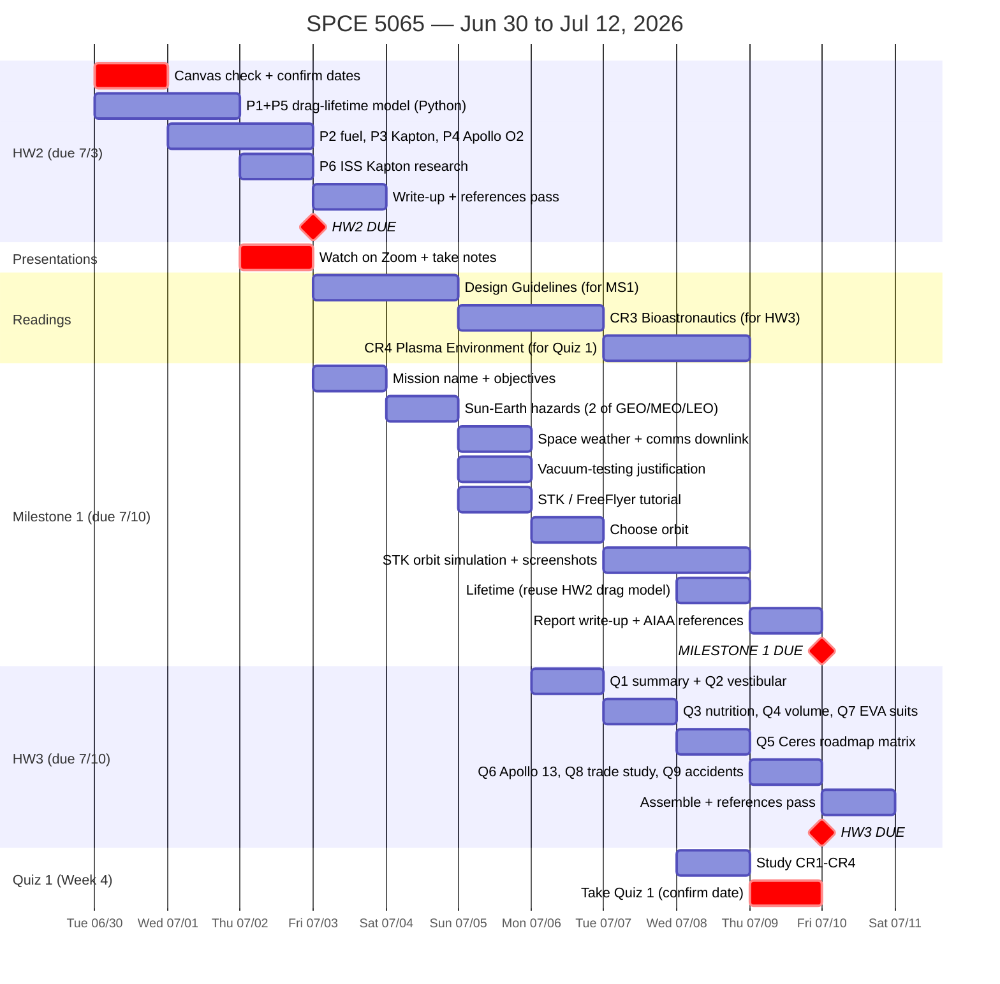

# SPCE 5065 — 2-Week Schedule (Jun 30 – Jul 12, 2026)

Interactive Gantt for the next two weeks. The Mermaid chart below renders
automatically on GitHub. Work blocks assume a full-time job: ~1h mornings,
~2h evenings, longer on weekends.

## Confirmed deadlines

| Deliverable | Due | Notes |
|---|---|---|
| **HW2** | Fri **7/3**, 11:59 PM MT | Drag/atmosphere. No late work accepted. |
| **HW3** | Fri **7/10**, 11:59 PM MT | Bioastronautics, 9 problems. |
| **Milestone 1** | Fri **7/10** (confirmed on Canvas) | Same day as HW3 — finish MS1 Thursday. |
| **Quiz 1** | Week 4 window — **confirm exact date on Canvas** | 75 min. |
| Current-event presentations | Thu **7/2** (Zoom) | Watch + take notes; HW3 Q1 depends on it. |
| July 4 holiday | Sat **7/4** | Kept light below. |

## Readings this window (from the schedule, all on Canvas)

| Reading | Topic | Schedule it before | Why |
|---|---|---|---|
| **CR 3** | Bioastronautics | HW3 (read 7/5–7/6) | HW3 is entirely bioastronautics — reading first makes it faster. |
| **CR 4** | Plasma Environment | Quiz 1 (read 7/7–7/8) | Week 4 content; likely on Quiz 1. |
| **Design Guidelines** | (recurring, every week) | MS1 (skim 7/3–7/4) | Ongoing design-project reference; supports Milestone 1. |

> The `wk03/course_material/` folder is still empty in the repo — pull CR3/CR4
> PDFs from Canvas. (CR1/CR2 = the Chapter 6 & 7 PDFs already in `wk02/`.)

## Gantt

## Day-by-day (fallback if Mermaid doesn't render)

### Week 1 — finish HW2, seed MS1

| Day | Morning (~1h) | Evening (~2h) |
|---|---|---|
| Tue 6/30 | — | Canvas check; HW2 **P1** (drag lifetime 400→150 km) + **P5** (lifetime vs 200–500 km plot) |
| Wed 7/1 | HW2 **P2** (fuel, Isp 200 s) | HW2 **P3** (Kapton erosion) + **P4** (Apollo O₂) |
| Thu 7/2 | HW2 **P6** (ISS Kapton) | **Watch 7/2 presentations + notes**, then HW2 write-up |
| Fri 7/3 | HW2 references pass → **SUBMIT HW2** | MS1 mission name + objectives; start hazards research; _skim **Design Guidelines**_ |
| Sat 7/4 | (holiday, ~3h) MS1 Sun-Earth hazards (2 of GEO/MEO/LEO) | MS1 space weather + comms-downlink impact |
| Sun 7/5 | (~4h) MS1 vacuum-testing justification; **STK/FreeFlyer tutorial** | _Read **CR3 Bioastronautics** (preps HW3)_ |

### Week 2 — HW3, Quiz 1, finish MS1 (HW3 + MS1 both due Fri 7/10)

| Day | Morning (~1h) | Evening (~2h) |
|---|---|---|
| Mon 7/6 | HW3 **Q1** (from 7/2 notes) + **Q2**; _finish **CR3**_ | MS1 choose orbit |
| Tue 7/7 | HW3 **Q3, Q4, Q7** | MS1 STK simulation (start); _start **CR4 Plasma**_ |
| Wed 7/8 | HW3 **Q5** (Ceres matrix) | MS1 STK sim finish + lifetime (reuse HW2 model); _finish **CR4** before Quiz 1_ |
| Thu 7/9 | HW3 **Q6, Q8, Q9** | MS1 report write-up + refs; **study/take Quiz 1** |
| Fri 7/10 | HW3 assemble + refs → **SUBMIT HW3** | MS1 final refs pass → **SUBMIT MS1** |
| Sat 7/11 | Buffer / Quiz 1 if window still open | — |
| Sun 7/12 | Buffer; start vacuum presentation prep (due 7/22–7/23) | — |

## Reuse wins

- HW1 Python scaffold → HW2 P1/P2/P5.
- HW2 drag integrator → MS1 lifetime-without-stationkeeping.
- Every submission: references pass (number by first appearance, inline-cite every external value) — the 4 points HW1 lost.

_Legend: red diamonds = hard deadlines; red bars = time-critical tasks._
