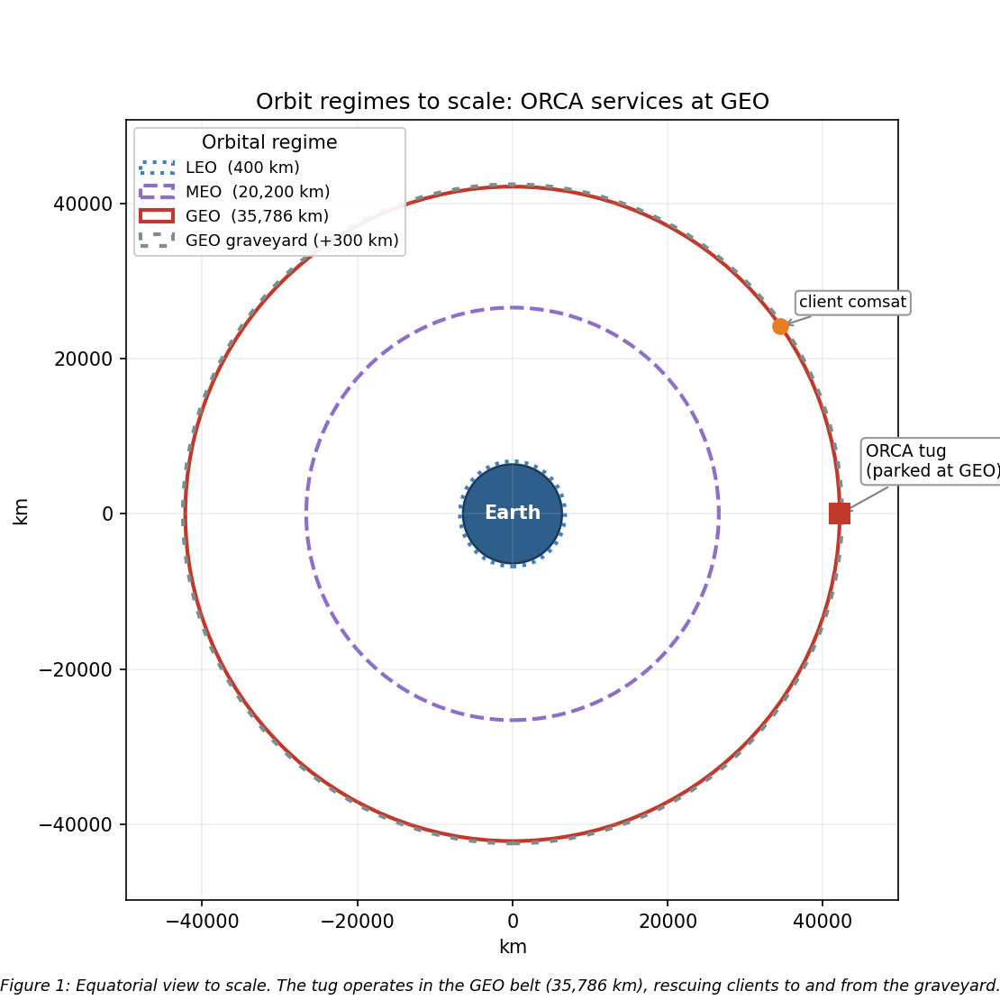
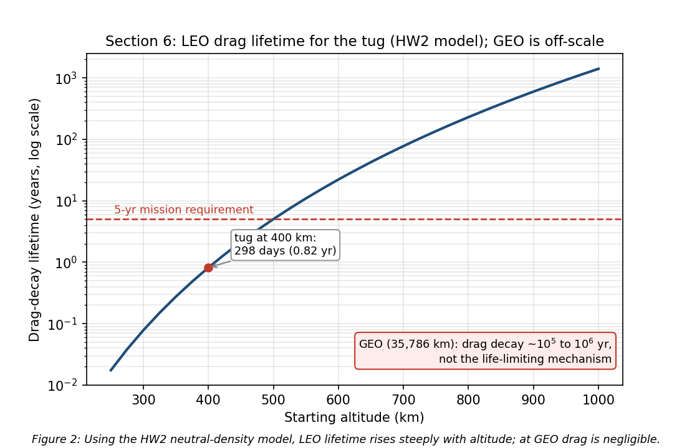

# SPCE 5065: Design Project Milestone 1
**Space Tug and Repair Servicing Satellite: Space Environment Analysis**
**Author:** Jordan Clayton
**Date:** July 10, 2026

---

## 1. Mission Name and Objectives

**System name: ORCA (Orbital Repair and Cooperative Assist).** ORCA is a GEO life-extension and servicing vehicle in the ~2,000 kg class, patterned on Northrop Grumman's Mission Extension Vehicle (MEV-1/MEV-2), which docked with and took over station-keeping for live GEO comsats starting in 2019 [1]. The customer is the U.S. Space Force / Space Systems Command, which owns high-value national-security assets in the GEO belt, with a commercial extension to GEO communications operators (Intelsat, SES) whose satellites run out of station-keeping fuel long before their payloads wear out.

**Top-level objectives.**
1. Rendezvous and dock with a *cooperative* GEO client satellite.
2. Provide attitude control and station-keeping for a client whose own propulsion is depleted or degraded, acting as a bolt-on propulsion and ADCS module.
3. Transfer propellant / extend the client's operational life.
4. Tow defunct or low-fuel satellites between the operational GEO belt and the graveyard orbit (~300 km above GEO) for refuel or repair, and return them to a working slot.
5. Achieve a servicer life of at least 5 years, servicing multiple clients in sequence, within the $100M budget cap.

These objectives drive derived requirements I carry into the environment analysis: precision rendezvous-and-proximity-operations (RPO) sensors (cameras and LIDAR), a docking mechanism and robotic arm, generous station-keeping propellant, and avionics hardened against the charging and radiation environment. Per the milestone directions I hold the orbit choice until after the hazard analysis (Sections 2 through 4), but I note here that the mission itself points strongly at GEO, since that is where the clients are.

---

## 2. Sun-Earth System Hazards (GEO and LEO)

I analyzed **GEO** (the mission home) and **LEO** (the sharpest contrast) so the orbit decision in Section 5 rests on a real comparison.

**Solar emissions.** The Sun drives the environment through four channels [2], [3]:
- **Electromagnetic radiation (photons):** the solar constant is about 1,361 W/m² at 1 AU, spanning X-ray and extreme-UV through visible to infrared. The EUV/X-ray end heats and ionizes the upper atmosphere.
- **Solar wind:** a continuous plasma stream of protons and electrons at ~400 to 800 km/s and ~5 to 10 particles/cm³, which shapes and pressurizes the magnetosphere [3].
- **Solar flares:** sudden X-ray bursts (classed A/B/C/M/X); M- and X-class flares cause sudden ionospheric disturbances and radio blackouts within minutes.
- **CMEs and SEPs:** coronal mass ejections hurl billions of tons of magnetized plasma that drive geomagnetic storms, and solar energetic particle events accelerate protons to tens or hundreds of MeV, arriving minutes to hours later as a radiation hazard.

**GEO hazards.** GEO (35,786 km) sits near the outer edge of the magnetosphere, and during strong CMEs the magnetopause can be compressed inside GEO, exposing satellites directly to shocked solar wind [3].
- **Surface charging (the leading GEO anomaly cause):** GEO is immersed in the hot plasma sheet, and during substorms keV electrons charge spacecraft surfaces to kilovolt potentials. Differential charging drives electrostatic discharge (ESD) that couples into electronics [2], [4]. The canonical case is Galaxy 15, whose command unit was latched by an ESD tied to disturbed space weather in 2010, leaving it powered but uncommandable ("zombiesat") for eight months [5].
- **Deep-dielectric (internal) charging:** MeV "killer electrons" from high-speed solar-wind streams penetrate the structure and charge internal dielectrics, then discharge into buried circuits [4].
- **Radiation dose:** direct SEP proton exposure plus trapped electrons, with no atmospheric or deep-magnetospheric shielding, so total ionizing dose (TID) accumulates over 5+ years and single-event upsets/latch-ups come from SEP and galactic cosmic rays [3].
- **Thermal and UV:** full sunlight with eclipse seasons at the equinoxes drives deep thermal cycling, and solar UV degrades optical coatings and thermal-control surfaces [3].

For ORCA the charging risk is doubled: an ESD during close proximity or docking could damage the tug *and* the client.

**LEO hazards.** LEO is mostly inside the protective magnetosphere, but it has its own environment:
- **South Atlantic Anomaly (SAA):** the inner proton belt dips to LEO altitudes here, spiking dose and upset rates on each SAA pass [3], [6].
- **Thermospheric drag coupled to solar activity:** EUV/X-ray heating expands the thermosphere, so at solar maximum the density at a given altitude rises and drag increases, directly shortening orbital lifetime [2], [3]. This is the mechanism that couples solar emissions to Section 6.
- **Atomic oxygen (AO):** solar UV dissociates O2, and the resulting ~5 eV atomic oxygen erodes polymers such as Kapton on ram surfaces at fluences around 10²⁰ to 10²¹ atoms/cm² per year near 400 km [6].
- **SEP polar access and auroral charging** on high-inclination orbits, where open field lines admit solar protons [3].
- **Earth-observation impact:** solar activity changes atmospheric density (perturbing low orbits and pointing), ionospheric scintillation degrades GPS and downlinks, and SEP events add detector and star-tracker noise that speckles imagery.

**Table 1:** GEO vs LEO environmental hazards for the servicing mission.

| Hazard | GEO | LEO |
|:---|:---|:---|
| Surface / deep-dielectric charging | Severe (plasma sheet, killer electrons) | Milder, mainly auroral |
| Direct SEP / radiation dose | High (little shielding) | Lower, spikes in the SAA and at poles |
| Atmospheric drag | Negligible | Dominant below ~600 km |
| Atomic oxygen erosion | None | Significant on ram surfaces |
| Debris flux | Low | High |
| Thermal cycling | Deep at eclipse seasons | ~16 cycles/day |

---

## 3. Space Weather: Overview, Measurement, and Downlink Impact

**What it is.** Space weather is the set of conditions on the Sun and in the solar wind, magnetosphere, ionosphere, and thermosphere that can affect space- and ground-based technology and endanger operations [7].

**Measurement and research.** The U.S. operational center is NOAA's Space Weather Prediction Center (SWPC) [7]. Its data sources include GOES satellites at GEO (X-ray flare flux and energetic-particle detectors); DSCOVR and NASA's ACE at the L1 point ~1.5 million km sunward, which give roughly 15 to 60 minutes of advance warning as a CME shock arrives; NASA's SDO and SOHO, which image flares and CMEs at the Sun; and ground networks (magnetometers producing the Kp and Dst indices, neutron monitors, ionosondes) [7].

**Why the customer wants it.** ORCA performs delicate rendezvous and docking next to a live client, so a charging event during proximity operations risks ESD damage to both vehicles; forecasts let operators schedule or hold docking around disturbed conditions [2], [4]. An SEP warning lets the tug safe its avionics or delay a critical burn. Space-weather nowcasts also feed drag/drift prediction and downlink-reliability planning.

**Downlink impacts (GEO to ground).** ORCA's TT&C link from a fixed GEO longitude to a fixed ground station is geometrically simple, but space weather still degrades it [8]:
- **Ionospheric scintillation:** the slant path crosses the ionosphere, and disturbed conditions cause amplitude and phase fading, worst at equatorial and auroral latitudes and at lower frequencies.
- **Solar RF interference (sun outage):** twice a year near the equinoxes the Sun passes directly behind the GEO satellite as seen from the ground station, and solar radio noise raises the receiver noise temperature enough to black out the link for minutes a day across several days. Solar radio bursts (Type II/IV) add sporadic interference.
- **Total-electron-content effects:** changing TEC rotates the signal polarization (Faraday rotation) and adds group delay.
- **Source-side upsets:** a charging or SEP-induced upset on the satellite transmitter can interrupt the downlink at the source [4].

The takeaway is that the GEO downlink is robust in normal conditions but must be scheduled around predictable sun outages and monitored during storms, which is exactly why the customer wants an SWPC feed.

---

## 4. Vacuum Testing Rationale

The customer wants to drop vacuum testing to cut cost. For a GEO servicing tug whose optical RPO sensors and docking mechanisms *are* the mission, that is a false economy. The case:

- **Outgassing and molecular contamination.** In vacuum, adsorbed water, solvents, and plasticizers evaporate and redeposit on cold surfaces: optics, radiators, solar cells, and sensors. Materials are screened to ASTM E595 limits of total mass loss below 1.0% and collected volatile condensable material below 0.10% [9]. On ORCA a contamination film on the docking cameras or LIDAR would blur the very sensors the mission depends on, and deposits on radiators and solar cells cut thermal and power performance by several percent [3], [9]. A thermal-vacuum bakeout drives these volatiles off before flight.
- **Thermal-vacuum (TVAC) cycling.** Space rejects heat only by radiation (no convection), and GEO eclipse seasons swing components from full sun to eclipse. TVAC testing verifies the thermal design and the workmanship (solder joints, connectors, bondlines) across the flight temperature range plus margin, and screens infant-mortality defects, per standard environmental test practice [10].
- **Cold welding and mechanism survivability.** Bare metal contacts can cold-weld in vacuum, and liquid lubricants evaporate. ORCA's docking mechanism, robotic arm, and deployables must be qualified in vacuum with space-rated dry lubricants and materials [3].
- **Multipaction and corona.** High-power RF components in the TT&C/comms chain can suffer multipaction discharge in vacuum and must be tested for it [3].

**Cost argument.** Skipping TVAC to save a small fraction of a $100M program risks the entire asset *plus* the client satellite it is servicing. ORCA has no on-orbit repair for itself, so an undetected workmanship or contamination failure is mission-ending: a single hazed docking sensor could abort every rendezvous. Vacuum testing is cheap insurance against a total loss, and I recommend a full TVAC and thermal-balance campaign with a pre-ship bakeout.

---

## 5. Orbit Selection

$$\boxed{\text{ORCA operates in the geostationary belt (GEO, 35,786 km altitude).}}$$

**Rationale, from the analysis above.**
- **The clients live at GEO.** Defunct and low-fuel comsats, national-security assets, and the graveyard orbit (~300 km above GEO) are all in the GEO belt. To rendezvous, dock, refuel, and tow them, ORCA must operate there [1].
- **Operational fit.** GEO fixes the sub-satellite longitude, giving continuous line-of-sight to a fixed ground station (simple TT&C) and direct access to the dense, high-value GEO population that is the customer base.
- **Hazard tradeoff (Sections 2 to 4).** GEO trades away LEO's atmospheric drag, atomic-oxygen erosion, and high debris flux (Table 1), and takes on worse charging and direct SEP/radiation exposure in return. Those GEO risks are well understood and mitigable with grounding and ESD control, shielding, radiation-hardened parts, and space-weather-aware operations. Over a multi-client mission of 5+ years, eliminating drag decay and AO erosion is decisive.
- **Why not LEO or MEO.** LEO is disqualified because the clients are not there, drag would demand constant station-keeping (Section 6 shows a LEO tug at 400 km decays in under a year), and AO and debris are worse. MEO sits in the heart of the Van Allen belts, the worst radiation of the three, with no client base to justify it.
- **Budget and duration.** GEO insertion is expensive, but a single tug amortizing across multiple clients fits the $100M and 5-year envelope; the mission is inherently GEO.

---

## 6. Orbital Lifetime Without Stationkeeping

**Direct answer: at GEO, atmospheric drag is not the life-limiting mechanism.** Using the HW2 neutral-density model ($\rho = 1.020\times10^{7}\,h^{-7.172}$ kg/m³, $h$ in km) with a standard GEO density of ~$10^{-15}$ kg/m³, the characteristic drag-decay timescale at GEO is on the order of $10^{5}$ to $10^{6}$ years, roughly five orders of magnitude beyond the 5-year requirement (**Figure 2**).

To demonstrate the tool on a case where drag actually matters, I ran the same model for this vehicle in LEO. Taking a representative wet mass of 2,000 kg, ram area 15 m², and $C_D = 2.2$ (so $C_D A/m = 0.0165$ m²/kg), the decay time from a given altitude down to 150 km is:

**Table 2:** LEO drag-decay "what-if" for the ORCA ballistic coefficient (HW2 model).

| Starting altitude | Decay time to 150 km |
|:---|---:|
| 300 km | 28.5 days (0.08 yr) |
| 400 km | 298 days (0.82 yr) |
| 500 km | 1,836 days (5.03 yr) |
| 600 km | 22.2 yr |

A LEO tug would have to start above ~500 km just to reach the 5-year line, which is one more reason LEO is untenable for this mission and GEO is not drag-limited.

**What actually evolves at GEO.** Without station-keeping the satellite does not deorbit; it drifts out of its assigned slot. Luni-solar gravity grows the inclination at ~0.75 to 0.95 °/yr (toward ~15° over ~26.5 years), Earth's equatorial ellipticity (triaxiality) drifts the longitude toward the stable points near 75°E and 105°W, and solar radiation pressure drives a small eccentricity oscillation [11], [12]. Holding the slot costs north-south station-keeping of ~45 to 55 m/s per year (the dominant term) plus east-west station-keeping of ~2 to 4 m/s per year [11], [12].

$$\boxed{\text{Drag lifetime} \gg 5\ \text{yr (effectively unlimited); the real driver is }\sim 50\ \text{m/s/yr N-S station-keeping.}}$$

**Assumptions:** representative tug mass/area, the HW2 density fit for the LEO contrast, a standard GEO density of ~$10^{-15}$ kg/m³, and standard luni-solar and triaxiality rates [11], [12]. The operational consequence is that ORCA's own life is set by propellant, not decay: about 250 m/s over 5 years just to hold station, on top of the propellant it carries for client servicing.

---

## 7. Visual Orbit Simulation

**Figure 1** is a scaled equatorial view of the mission orbit, generated in Python/matplotlib. It shows Earth, the LEO (400 km) and MEO (20,200 km) rings for scale, the GEO belt at 35,786 km where ORCA operates, and the graveyard ring ~300 km above GEO. The tug is parked in the GEO belt co-located with client satellites, and it ferries defunct spacecraft to and from the graveyard.

The scale contrast is the point: GEO sits nearly six Earth radii out, far above the drag- and debris-heavy LEO band, and the graveyard is only a thin ring just above the operational belt, which is what makes a short tow between them practical.

---

## 8. Summary and Conclusions

I selected **GEO** for ORCA because the servicing clients (defunct and low-fuel comsats, national-security assets, and the graveyard population) live there; the mission is inherently geostationary.

The dominant environmental hazards at GEO are **surface and deep-dielectric charging** (the leading anomaly cause, as Galaxy 15 showed) and **direct SEP and radiation dose** accumulating over 5+ years, plus eclipse-season thermal cycling and UV degradation. The LEO problems (drag, atomic oxygen, high debris flux) are avoided by the choice of GEO. Space weather matters most for two operational reasons: scheduling delicate RPO and docking around charging and SEP events, and managing the GEO downlink around predictable sun outages and ionospheric scintillation. Vacuum testing is essential rather than optional, because contamination on the RPO optics, workmanship defects, and cold-welded mechanisms would each be mission-ending for a servicing vehicle with no self-repair.

On lifetime, drag is not the limiter at GEO (decay timescale ~$10^{5}$ to $10^{6}$ years); the real driver is north-south station-keeping at ~50 m/s per year, which sizes ORCA's propellant budget on top of the servicing propellant.

**Implications for Milestone 2.** The environment analysis shows GEO servicing is charging- and radiation-limited, not drag-limited, so the design investment goes into ESD and charging control (grounding, conductive surfaces), radiation-hardened and shielded avionics, space-weather-aware operations, TVAC-qualified optics and mechanisms, and a station-keeping propellant budget carried separately from the client-servicing propellant. That is where I will focus the subsystem design in the next milestone.

---

## References

[1] "Space Logistics," Northrop Grumman, 6 Mar. 2023, https://www.northropgrumman.com/space/space-logistics-services/ [retrieved 10 July 2026].

[2] George, L., "The Space Environment: Lessons 1 and 2," SPCE 5065 lecture videos and slides, University of Colorado Colorado Springs, 2026.

[3] Tribble, A. C., *The Space Environment: Implications for Spacecraft Design*, rev. ed., Princeton University Press, Princeton, NJ, 2003.

[4] "Mitigating In-Space Charging Effects: A Guideline," NASA-HDBK-4002A, National Aeronautics and Space Administration, Washington, DC, 2011.

[5] de Selding, P. B., "Intelsat's Wandering 'Zombiesat' Galaxy 15 Finally Recovered," *SpaceNews*, 23 Dec. 2010, https://spacenews.com/intelsats-wandering-zombiesat-galaxy-15-finally-recovered/ [retrieved 10 July 2026].

[6] Finckenor, M. M., and de Groh, K. K., "A Researcher's Guide to: International Space Station Space Environmental Effects," NP-2015-03-015-JSC, NASA ISS Program Science Office, 2020.

[7] "About Space Weather," NOAA Space Weather Prediction Center, https://www.swpc.noaa.gov/ [retrieved 10 July 2026].

[8] "Ionospheric Propagation Data and Prediction Methods Required for the Design of Satellite Networks and Systems," Recommendation ITU-R P.531, International Telecommunication Union, Geneva, 2022.

[9] "Standard Test Method for Total Mass Loss and Collected Volatile Condensable Materials from Outgassing in a Vacuum Environment," ASTM E595-15, ASTM International, West Conshohocken, PA, 2015.

[10] "General Environmental Verification Standard (GEVS) for GSFC Flight Programs and Projects," GSFC-STD-7000B, NASA Goddard Space Flight Center, Greenbelt, MD, 2021.

[11] Vallado, D. A., *Fundamentals of Astrodynamics and Applications*, 4th ed., Microcosm Press, Hawthorne, CA, 2013, Chaps. 8 and 9 (perturbations and station-keeping).

[12] Wertz, J. R., Everett, D. F., and Puschell, J. J. (eds.), *Space Mission Engineering: The New SMAD*, Microcosm Press, Hawthorne, CA, 2011.

---

## Appendix: Figure and Lifetime Script

The two figures and the Section 6 lifetime numbers were generated by `spce5065_ms1_figs.py` (matplotlib; reuses the HW2 neutral-density drag model). Running `python spce5065_ms1_figs.py` regenerates `figures/fig1_orbit_regimes.png` and `figures/fig2_drag_lifetime.png` and prints the LEO decay table and the GEO drag-timescale check.
