

<!-- COVER PAGE -->

<!-- Navy top bar -->

<!-- UCCS Header - Gray Background -->

UNIVERSITY OF 
COLORADO 
COLORADO SPRINGS

College of Engineering and Applied Science

<!-- Title Section - White Background -->

<h1 style="font-size: 52pt; font-weight: bold; margin: 0; color: #00205B; font-family: Georgia, serif;">MESA</h1>

Mission Extension and Servicing Asset for GEO

<!-- Concept Image - Full Width, overlaps into sections -->

<!-- Footer Info -->

SPCE 5065: Space Environment Interactions, Design Project Final Report

Jordan Clayton

August 7, 2026

<!-- TOC:START  (plain markdown so it renders and is clickable in any preview.
     build_docx.py strips this block and injects a real Word TOC field instead,
     so the docx gets page numbers and hyperlinks and the .md preview gets
     working links.) -->

## Table of Contents

1. [Executive Summary](#executive-summary) ... 3
2. [Nomenclature](#nomenclature) ... 4
3. [Introduction](#1-introduction) ... 5
4. [Satellite System Name and Mission Objectives](#2-satellite-system-name-and-mission-objectives) ... 6
5. [Orbit Selection and Orbital Lifetime](#3-orbit-selection-and-orbital-lifetime) ... 7
6. [The Sun-Earth System and Risks at GEO and LEO](#4-the-sun-earth-system-and-risks-at-geo-and-leo) ... 10
7. [Space Weather: Monitoring and Downlink Impact](#5-space-weather-monitoring-and-downlink-impact) ... 11
8. [Vacuum Testing](#6-vacuum-testing) ... 11
9. [Vehicle Definition and System Budgets](#7-vehicle-definition-and-system-budgets) ... 12
10. [Thermal Control System](#8-thermal-control-system) ... 16
11. [Plasma Environment](#9-plasma-environment) ... 18
12. [Radiation Environment](#10-radiation-environment) ... 19
13. [Attitude Determination and Control (ADACS)](#11-attitude-determination-and-control-adacs) ... 20
14. [Simulations: Orbit, Power, and Thermal](#12-simulations-orbit-power-and-thermal) ... 22
15. [Integrated Risk Assessment and Mission Assurance](#13-integrated-risk-assessment-and-mission-assurance) ... 26
16. [Conclusions](#14-conclusions) ... 28
17. [References](#references) ... 29<!-- TOC:END -->

## Executive Summary

MESA, the Mission Extension and Servicing Asset, is a 2,000 kg geostationary servicing tug that docks with client satellites in the GEO belt, takes over their stationkeeping and attitude control, refuels them, and tows them between the operational belt and the graveyard orbit. It is built for a five-year contract inside a $100M cap, and it is patterned on flight-proven servicing heritage rather than on a paper concept [1].

The case for this design rests on four results, and every one of them is derived in this report rather than asserted.

**The environment is understood and the design closes against it.** GEO's dominant hazards are spacecraft charging and energetic-particle radiation, not drag or debris. MESA floats to -2.16 kV during substorms and accumulates 25 krad(Si) over five years behind 100 mils of aluminium. Both are handled by conventional, qualified means: a fully bonded conductive exterior, single-point grounding, and radiation hardness assurance category R parts at 100 krad(Si), which holds even if the dose assumption is wrong by a factor of two.

**Docking, not free flight, drives the design, and that is the insight the competition misses.** Capturing a 3,000 kg client raises the roll inertia by a factor of 5.3, which is what sizes the reaction wheels at 0.20 N·m rather than the 3.21×10⁻⁵ N·m disturbance torque. More importantly, docking bonds two independently charged vehicles through a capture latch, a failure mode no conventional satellite carries. MESA answers it with a plasma contactor and an operational rule that equalizes potential before mechanical contact.

**Every budget closes with margin.** Mass closes at 2,000 kg with 150 kg of margin, 11 percent of dry mass. Power closes with 68 percent margin over peak load at end of life. Propellant closes with the hydrazine tank as the binding sub-budget, which still supports about ten client servicing cycles against a baseline manifest of six. Cost closes at exactly the $100M cap with $5M held in program reserve.

**The analysis is independently verified.** All results come from one reproducible Python model, and the orbit, eclipse, array output, and orbital lifetime were rebuilt independently in Systems Tool Kit. Where the two agree I say so; where the check is a consistency check rather than an independent one, I label it as such.

**Table ES-1:** MESA at a glance.

| Quantity | Value | Where |
|:---|---:|:---|
| Orbit | GEO, $a$ = 42,164 km, $e$ = 0, $i$ = 0° | Eq. (1) |
| Wet mass / dry mass | 2,000 / 1,400 kg | Table 4 |
| Mass margin | 150 kg (11% of dry) | Table 4 |
| Array output, BOL to EOL | 3,387 W to 2,984 W | Eq. (15) |
| Peak electrical load | 1,773 W | Table 5 |
| Bus temperature, sun and eclipse | +36.3 °C and -13.1 °C | Eq. (7) |
| Floating potential in a substorm | -2.16 kV | Eq. (8) |
| Total ionizing dose, five years | 25 krad(Si) | Eq. (9) |
| Worst-case disturbance torque | 3.21×10⁻⁵ N·m, 93.5% from SRP | Eq. (10) |
| ADACS mass and power | 157 kg, 283 W | Eq. (12) |
| Five-year delta-v | 463 m/s | Eq. (4) |
| Servicing capacity | 10 client cycles, hydrazine-limited | Eq. (5) |
| Program cost | $100M, including $5M reserve | Table 8 |

## Nomenclature

| Symbol / Acronym | Meaning |
|:---|:---|
| ADACS | Attitude Determination and Control System |
| AO | Atomic oxygen |
| BOL / EOL | Beginning of life / end of life |
| CME | Coronal mass ejection |
| $C_D$ | Drag coefficient |
| DoD | Depth of discharge |
| EDAC | Error detection and correction |
| EP | Electric propulsion |
| ESD | Electrostatic discharge |
| EUV | Extreme ultraviolet |
| GCR | Galactic cosmic ray |
| GEO | Geostationary Earth orbit (~35,786 km altitude) |
| $I_{sp}$ | Specific impulse |
| ITO | Indium tin oxide (transparent conductive coating) |
| LEO | Low Earth orbit |
| MEO | Medium Earth orbit |
| MESA | Mission Extension and Servicing Asset (this system) |
| MEV | Mission Extension Vehicle (Northrop Grumman) |
| MLI | Multi-layer insulation |
| MMOD | Micrometeoroid and orbital debris |
| OSR | Optical solar reflector |
| RHA | Radiation hardness assurance |
| RPO | Rendezvous and proximity operations |
| SAA | South Atlantic Anomaly |
| SEU / SEL / SEGR | Single-event upset / latch-up / gate rupture |
| SEP / SPE | Solar energetic particle / solar proton event |
| SRP | Solar radiation pressure |
| SWPC | (NOAA) Space Weather Prediction Center |
| TID | Total ionizing dose |
| TVAC | Thermal-vacuum (testing) |
| $a$ | Semi-major axis |
| $A_s$ | Illuminated surface area |
| $c_{ps}$, $c_m$ | Center of solar pressure, center of mass |
| $D$ | Residual magnetic dipole, A$\cdot$m² |
| $e$ | Eccentricity |
| $F_s$ | Solar constant, 1,361 W/m² |
| $g_0$ | Standard gravity, 9.807 m/s² |
| $H$ | Stored angular momentum, N$\cdot$m$\cdot$s |
| $i$ | Inclination |
| $I_x, I_y, I_z$ | Principal moments of inertia |
| $q$ | Surface reflectance factor |
| $\alpha$, $\varepsilon$ | Solar absorptivity, infrared emissivity |
| $\mu$ | Earth gravitational parameter, $3.986\times10^{14}$ m³/s² |
| $\rho$ | Atmospheric (neutral) density |
| $\sigma$ | Stefan-Boltzmann constant, $5.670\times10^{-8}$ W/m²K⁴ |
| $\chi$, $G$ | Earth-shielding factor, gravitational focusing factor |

---

## 1. Introduction

### 1.1 The mission

The GEO belt is full of satellites that are healthy in every respect except one: they have run out of stationkeeping propellant. A communications satellite whose transponders will work for another decade gets retired because it can no longer hold its slot, and the operator writes off an asset worth far more than the fuel it lacks. That is the market MESA is built for.

MESA, the Mission Extension and Servicing Asset, is a 2,000 kg geostationary servicing vehicle that flies a rendezvous with a client satellite, docks with it, and then flies the combined stack: providing attitude control and stationkeeping for a client whose own propulsion is gone, transferring propellant to refuelable clients, and towing satellites between the operational belt and the graveyard orbit roughly 300 km above it. The concept follows Northrop Grumman's Mission Extension Vehicle, which launched MEV-1 in October 2019 and docked Intelsat 901 in February 2020, taking over that client's stationkeeping [1]. MESA broadens that proven single-purpose vehicle into a reusable servicing asset that handles multiple clients in sequence across a five-year contract, inside a $100M program cap.

### 1.2 What is in this report

This report is the complete design case for MESA, from the environment it must survive to the hardware that survives it, and it is written to be checked rather than believed.

Sections 2 and 3 define the system and its orbit: what MESA does, who buys it, how a servicing cycle actually runs, and why the orbit is geostationary. Sections 4 through 6 characterize the environment: the Sun-Earth system and the hazards it creates at GEO and at LEO, the space weather that modulates them, and the vacuum environment that makes ground testing non-negotiable. Section 7 defines the vehicle itself and closes the mass, power, propellant, and cost budgets, which is where a design either works or does not.

Sections 8 through 11 are the subsystem design. Section 8 sizes the thermal control system and gives the equilibrium temperatures in sun and in eclipse. Sections 9 and 10 work the plasma and radiation environments in turn, each covering the risks to this vehicle, the mitigations I am proposing, and what those mitigations cost the other subsystems. Section 11 estimates the four external disturbance torques and sizes the attitude control hardware from them.

Section 12 presents the supporting simulations: the orbit, the power profile across a full day including eclipse, the thermal transient through that eclipse, and an independent rebuild of the mission in Systems Tool Kit. Section 13 pulls the whole design together into a single risk picture, adding the micrometeoroid and debris assessment and the docking failure modes, and Section 14 states the conclusions.

The through-line, and the reason this design is worth the contract, is that a GEO servicer is not a communications satellite with an arm bolted on. It is charging- and radiation-limited rather than drag-limited, its attitude control is sized by the client it captures rather than by the disturbances it feels, and the single most dangerous moment in its mission lasts about a second.

### 1.3 Changes since Milestone 2

This report is cumulative. Milestone 1 established the environment and chose the orbit, Milestone 2 added the subsystem design, and both are carried forward here with the corrections listed below plus the new work in Sections 7, 12.3, and 13.

| Change | Where |
|:---|:---|
| Report reorganized into the final report structure, with the orbit decision presented before the environment sections that justify it | throughout |
| Mass, delta-v, propellant, and cost budgets added and closed, which Milestone 2 listed as remaining work | Section 7 |
| Concept of operations added, so the design decisions tie to a specific mission timeline | Section 2.4 |
| Transient thermal simulation added; it shows the bus moves 3.9 K through eclipse against the 49.4 K steady-state bound, which changes where the heaters go | Section 12.3 |
| Micrometeoroid and debris assessment added, with a Whipple shield sized for the propellant tanks | Section 13.1 |
| Docking-sequence failure modes collected into a risk register and a risk matrix | Sections 13.2 and 13.3 |
| Milestone 2's conclusion that propellant is the life limiter refined: propellant sizes the servicing capacity, and the five-year calendar life is set by wear-out items | Sections 7.4 and 14 |
| Table of contents rebuilt with page numbers and hyperlinks; numbers of ten or below spelled out in running text | throughout |

---

## 2. Satellite System Name and Mission Objectives

### 2.1 System name and rationale

The system is named **MESA (Mission Extension and Servicing Asset)**. The expansion is a deliberate nod to the heritage it follows, mirroring Northrop Grumman's Mission Extension Vehicle while broadening the scope from a single life-extension client to a reusable asset that also refuels, repairs, and relocates [1]. As a word, a mesa is a high, flat-topped highland that commands a view of the plain below: a fitting image for a vehicle that operates from GEO, the highest common regime, holding a stable perch above the LEO and MEO traffic with persistent overwatch of its clients.

### 2.2 Customer

The primary customer is the U.S. Space Force and Space Systems Command, which operates high-value national-security assets in the GEO belt and has a standing interest in keeping them on station and in repositioning them without expending their own propellant. The secondary customer base is the commercial GEO communications operators, such as Intelsat and SES, whose satellites routinely outlive their fuel.

### 2.3 Mission objectives

**Primary objectives.**

1. **Rendezvous and dock** with a cooperative GEO client satellite.
2. **Provide attitude control and stationkeeping** for a client whose own propulsion is depleted or degraded, acting as a bolt-on propulsion and ADACS module and extending the client's operational life.
3. **Transfer propellant** to refuelable clients.
4. **Tow** defunct or low-fuel satellites between the operational GEO belt and the graveyard orbit for refuel or repair, and return them to a working slot.

**Secondary objectives.**

1. **Relocation service:** reposition healthy clients to new longitude slots on operator request.
2. **Debris mitigation:** perform end-of-life disposal boosts of clients to the graveyard, freeing operational slots.
3. **Inspection:** use the rendezvous sensors to image and diagnose a client's exterior before servicing, which is a saleable product in its own right.

The governing constraints are a servicer life of at least five years, multiple clients serviced in sequence, and a $100M program cap. These objectives drive the derived requirements that every later section works against: precision RPO sensors (cameras and LIDAR), a docking mechanism and robotic arm, generous stationkeeping propellant, and avionics hardened against the charging and radiation environment.

### 2.4 Concept of operations

The objectives above only become design drivers once they are placed on a timeline, so **Figure 1** lays out one servicing cycle and the five-year manifest that follows from it.

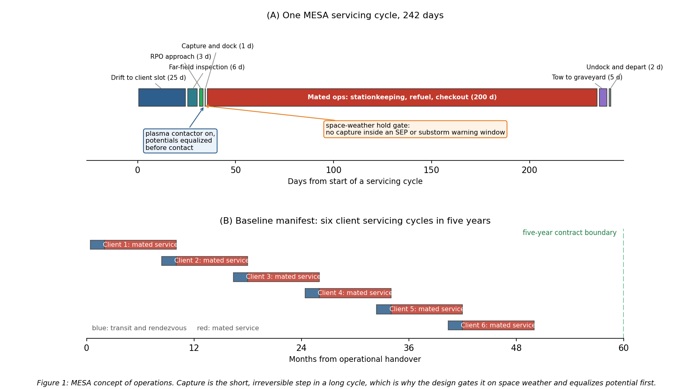

A cycle runs about 242 days and is dominated by mated operations. MESA drifts to the client's longitude slot over roughly 25 days, inspects the client from a safe standoff for about six days, closes over three days of proximity operations, and then captures. Capture itself takes about a second of contact inside a day of approach. Mated service runs for the bulk of the cycle, during which MESA holds the combined stack on station and performs the refuel or repair, and the cycle closes with a tow to the graveyard where required, then undocking and departure for the next client.

Two design consequences fall directly out of this timeline and are carried through the rest of the report. First, the vehicle spends about eighty percent of its life mated to a client, so the attitude control system, the thermal interface, and the propellant budget must all be sized for the stack rather than for the free flyer. Second, the single irreversible step is a moment of physical contact between two independently charged vehicles, which is why Section 9 puts a plasma contactor on the vehicle and why capture is gated on the space weather feed described in Section 5.

---

## 3. Orbit Selection and Orbital Lifetime

### 3.1 The selected orbit

MESA flies a geostationary orbit. The orbital elements are given in Eq. (1):

$$\boxed{a = 42{,}164\ \text{km (altitude } 35{,}786\ \text{km)}, \quad e \approx 0\ \text{(circular)}, \quad i = 0^\circ\ \text{(equatorial, stationkept)}}\tag{1}$$

The orbit is circular so the tug holds a constant altitude and speed relative to its clients, which is what makes a slow, controlled approach possible, and equatorial at zero inclination, maintained by stationkeeping, so it stays fixed over one longitude. The assigned slot for the analysis in this report is 105° W. The scale and geometry are shown in **Figure 2**.

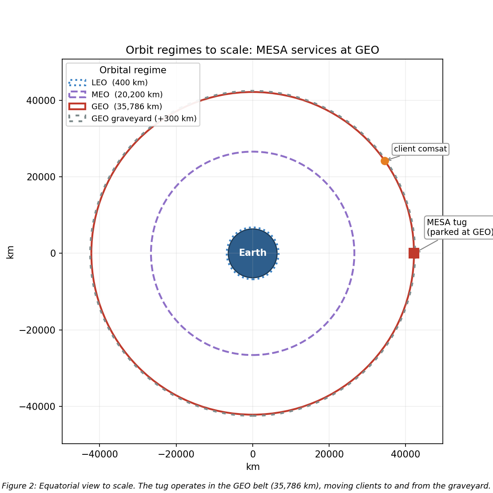

### 3.2 Rationale, and why the alternatives fail

The orbit selection is the least negotiable decision in the design, because the clients live at GEO. Defunct and low-fuel communications satellites, national-security assets, and the graveyard orbit about 300 km above the belt are all there, so MESA must operate in the belt to rendezvous, dock, refuel, and tow them [1]. The operational fit reinforces this: a geostationary orbit fixes the longitude, which gives continuous line-of-sight to a fixed ground station and therefore simple telemetry, tracking, and command, alongside access to the dense, high-value GEO customer base.

That decision does carry a real environmental penalty, quantified in Sections 4 through 6 and summarized in Table 2. GEO trades away LEO's atmospheric drag, atomic oxygen erosion, and dense debris population in exchange for worse spacecraft charging and worse energetic-particle radiation. I regard that as a favorable trade, because the GEO hazards are well understood and mitigable through grounding and ESD control, shielding, hardened parts, and space-weather-aware operations, whereas over a multi-client mission of five years or more, eliminating drag decay and atomic oxygen entirely removes two continuous degradation mechanisms rather than two events that can be designed around.

Neither alternative regime survives scrutiny. LEO fails on the mission itself, because the clients are not there, and it fails on physics too: Section 3.3 shows a tug with MESA's ballistic coefficient decaying out of a 400 km orbit in under a year, and atomic oxygen and debris are both far worse. MEO sits deep in the Van Allen belts, the worst radiation environment of the three, with no client base to justify absorbing it. GEO insertion is expensive, but one tug amortized across many clients fits inside the $100M and five-year envelope, and the mission is inherently geostationary.

### 3.3 Orbital lifetime without stationkeeping

The natural next question is what actually ends this mission, and the direct answer is that **at GEO, atmospheric drag is not the life-limiting mechanism.** Using the Homework 2 neutral-density model ($\rho = 1.020\times10^{7}\,h^{-7.172}$ kg/m³, with $h$ in km) alongside a standard GEO density of about $10^{-15}$ kg/m³, the characteristic drag-decay timescale at GEO is on the order of $10^{5}$ to $10^{6}$ years, roughly five orders of magnitude beyond the five-year requirement.

The governing relation is the circular-orbit drag-decay rate, Eq. (2), integrated as $t = \int \mathrm{d}a / |\dot{a}|$ from the starting altitude down to a 150 km reentry:

$$\dot{a} = -\rho\,\frac{C_D A}{m}\,\sqrt{\mu a}\tag{2}$$

To demonstrate the tool on a case where drag actually matters, I applied Eq. (2) to this same vehicle in LEO. Taking the wet mass of 2,000 kg, a ram area of 15 m², and $C_D = 2.2$, so that $C_D A/m = 0.0165$ m²/kg, the decay times are given in **Table 1** and plotted in **Figure 3**.

**Table 1:** LEO drag-decay case for the MESA ballistic coefficient (Homework 2 model).

| Starting altitude | Decay time to 150 km |
|:---|---:|
| 300 km | 28.5 days (0.08 yr) |
| 400 km | 298 days (0.82 yr) |
| 500 km | 1,836 days (5.03 yr) |
| 600 km | 22.2 yr |

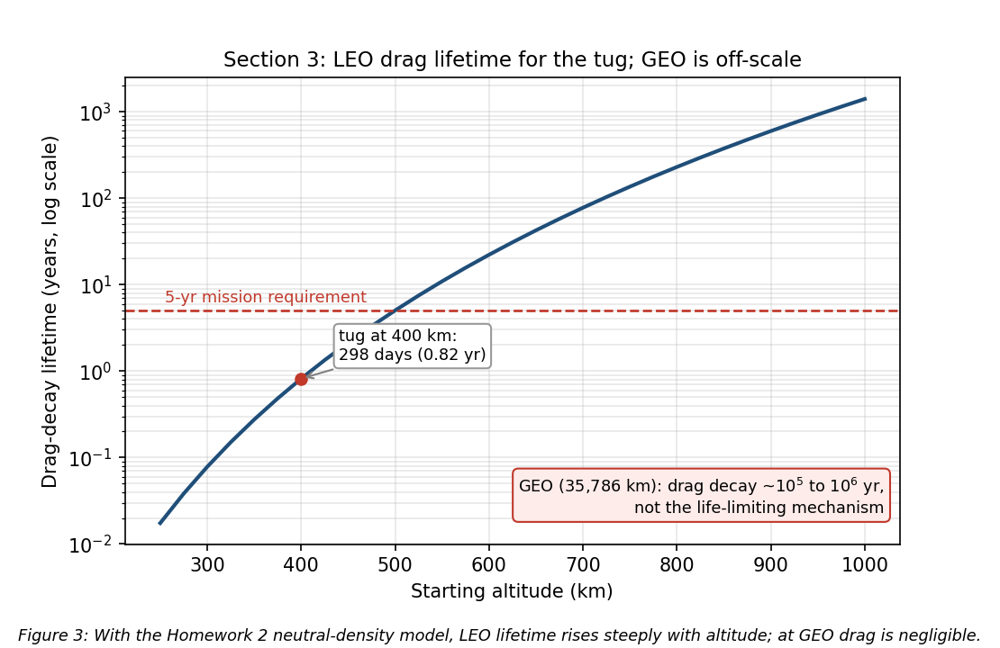

A LEO tug would have to start above roughly 500 km just to reach the five-year line, which is one more reason LEO is untenable for this mission. These figures are point estimates at a single density profile; because thermospheric density swells at solar maximum, the actual lifetime at a given altitude can shift by a factor of two to three over a solar cycle [2], [3], so the 400 km result of about 0.8 yr should be read as an order-of-magnitude value.

**What actually evolves at GEO.** Without stationkeeping the satellite does not deorbit, it drifts out of its slot. Luni-solar gravity grows the inclination at about 0.75 to 0.95 degrees per year, toward roughly 15° over 26.5 years, and this is the analemma that appears in the ground track of Section 12.1. Triaxiality drifts the longitude toward the stable points near 75° E and 105° W, and solar radiation pressure drives a small eccentricity oscillation [2], [3]. Holding the slot costs about 45 to 55 m/s per year north-south, which is the dominant term, plus about 2 to 4 m/s per year east-west [2], [3]. The result is Eq. (3):

$$\boxed{\text{Drag lifetime} \gg 5\ \text{yr (effectively unlimited); the real driver is }\sim 50\ \text{m/s/yr N-S stationkeeping.}}\tag{3}$$

**Assumptions:** the wet mass and ram area above, the Homework 2 density fit for the LEO contrast, a standard GEO density of about $10^{-15}$ kg/m³, and standard luni-solar and triaxiality rates [2], [3]. MESA's life is therefore set by propellant and by wear-out, not by decay, and Section 7.4 turns that 50 m/s per year into a closed propellant budget.

---

## 4. The Sun-Earth System and Risks at GEO and LEO

Section 3 committed the vehicle to GEO. This section is the environmental case behind that commitment: what the Sun emits, what Earth's field does with it, and what the resulting hazard set looks like at the two candidate altitudes. I analyzed **GEO** and **LEO**, the regimes that bracket the trade.

### 4.1 Solar emissions, quantified

The Sun drives the environment through four channels [4], [5]:

- **Electromagnetic radiation (photons):** the solar constant is about 1,361 W/m² at 1 AU [5], spanning X-ray and extreme-ultraviolet through visible to infrared. The EUV and X-ray end heats and ionizes the upper atmosphere.
- **Solar wind (charged particles):** a continuous plasma of protons and electrons at ~400 to 800 km/s and ~5 to 10 particles/cm³ [5], which pressurizes and shapes the magnetosphere.
- **Solar flares:** sudden X-ray bursts classed A, B, C, M, and X; M- and X-class flares cause sudden ionospheric disturbances and radio blackouts within minutes.
- **CMEs and SEPs (energetic particles and radiation):** coronal mass ejections hurl billions of tons of magnetized plasma that drive geomagnetic storms, and solar energetic particle events accelerate protons to tens or hundreds of MeV [5], arriving minutes to hours later as a penetrating radiation hazard on top of the always-present galactic cosmic ray background.

### 4.2 Earth's magnetic field and the radiation belts

Earth's magnetic field is roughly dipolar, about 30 µT at the equator rising to about 60 µT at the poles [4]. It carves out the magnetosphere, deflecting most of the solar wind, and traps charged particles in the Van Allen belts: an inner proton belt from roughly 1,000 to 6,000 km and an outer MeV-electron belt from roughly 13,000 to 60,000 km. This geometry is what drives the orbit tradeoff. LEO sits mostly beneath the belts and inside the protective field, while GEO at 35,786 km sits in the outer electron belt near the magnetosphere's edge, where strong CMEs can push the magnetopause inside GEO and expose satellites directly to shocked solar wind [5].

### 4.3 Risks at GEO

The leading cause of GEO anomalies is surface charging. GEO sits in the hot plasma sheet, and during substorms keV electrons charge exterior surfaces to kilovolt potentials. Because materials charge at different rates, the resulting differential charging drives electrostatic discharge into the electronics [4], [6]. Galaxy 15 is the canonical case: an ESD tied to disturbed space weather in 2010 latched its command unit, leaving it a powered but uncommandable "zombiesat" for eight months [7]. Section 9 quantifies the floating potential and the mitigations. MeV "killer electrons" from the outer belt compound this, penetrating the structure to charge internal dielectrics and discharge into buried circuits, a deep-dielectric mechanism that surface grounding cannot reach [6].

Energetic-particle radiation is the second major hazard. SEP protons and trapped electrons reach the vehicle with little natural shielding, so total ionizing dose accumulates across a mission of five years or more, while SEP and cosmic ray strikes produce single-event upsets and latch-ups. Section 10 sizes the shielding and the part class against this.

Solar radiation pressure rounds out the mechanical environment. Photon momentum is only about 4.5 µN/m² at 1 AU, negligible as a drag force, but across MESA's array moment arm it is both an orbital perturbation, appearing as the eccentricity oscillation noted in Section 3.3, and the dominant attitude disturbance torque at 93.5 percent of the worst-case total in Section 11.

Two further effects shape the design. Eclipse seasons drive deep thermal cycling and solar ultraviolet degrades optical coatings [5], both addressed in Section 8, while charging upsets and ionospheric effects degrade the downlink, covered in Section 5. For MESA the charging risk is doubled, because an ESD during docking could damage the tug and the client at once.

### 4.4 Risks at LEO

LEO trades this hazard set for a different one. The South Atlantic Anomaly is the sharpest feature: the inner proton belt dips to LEO altitudes there, spiking dose and upset rates on every pass [5], [8]. Atmospheric drag dominates and couples strongly to solar activity, since EUV and X-ray heating expands the thermosphere so density and drag rise at solar maximum [4], [5]. Section 3.3 quantifies exactly this for the MESA ballistic coefficient.

Atomic oxygen is the distinctive LEO material threat. Solar ultraviolet dissociates molecular oxygen, and the resulting atomic oxygen at about 5 eV erodes polymers such as Kapton on ram surfaces at roughly 10²⁰ to 10²¹ atoms/cm² per year near 400 km [8]. High-inclination orbits add polar SEP access and auroral charging [5]. The operational consequences compound: solar activity perturbs orbit and pointing, ionospheric scintillation degrades GPS and downlinks, and SEP events add detector and star-tracker noise.

### 4.5 The comparison that decided the orbit

**Table 2:** GEO versus LEO environmental hazards for the servicing mission.

| Hazard | GEO | LEO |
|:---|:---|:---|
| Surface / deep-dielectric charging and ESD | Severe (plasma sheet, killer electrons) | Milder, mainly auroral |
| Van Allen belt / energetic-particle dose | High (in the outer belt, little shielding) | Lower, spikes in the SAA and at poles |
| Atmospheric drag | Negligible | Dominant below ~600 km |
| Atomic oxygen erosion | None | Significant on ram surfaces |
| Solar radiation pressure | Dominant attitude disturbance on large arrays | Negligible versus drag |
| Debris flux | Low | High |
| Thermal cycling | Deep at eclipse seasons | About sixteen cycles per day |

Read as a design problem rather than a list, Table 2 says that the GEO column is dominated by electrical effects and the LEO column by mechanical and chemical ones. Electrical effects are addressed with coatings, bonding, part selection, and operational rules, all of which are cheap in mass. Mechanical and chemical degradation is addressed with propellant and with material loss that never stops. That is the deeper reason GEO is the right regime for a vehicle expected to work for five years and then keep going.

---

## 5. Space Weather: Monitoring and Downlink Impact

The hazards in Section 4 are not steady. They surge with solar activity, which makes forecasting them an operational requirement rather than a convenience for a vehicle that must decide when it is safe to approach another satellite.

**What it is.** Space weather is the set of conditions on the Sun and in the solar wind, magnetosphere, ionosphere, and thermosphere that can affect space- and ground-based technology and endanger operations [9].

**Monitoring and research.** The U.S. operational center is NOAA's Space Weather Prediction Center, which issues the watches, warnings, and alerts that operators act on [9]. It is fed by a layered observing system, and what matters operationally is which asset gives which warning and how far ahead.

At GEO, the GOES satellites carry X-ray sensors that detect flares as they happen and set the flare class, energetic particle sensors that measure the proton flux driving the NOAA S-scale radiation storm levels, and magnetometers that record the local field distortion during storms. Because X-rays travel at the speed of light, a GOES flare detection arrives about eight minutes after the event on the Sun, which is warning of the radio blackout but not of the particles that follow.

At the L1 Lagrange point, roughly 1.5 million km sunward, DSCOVR and NASA's ACE sample the solar wind speed, density, and embedded magnetic field directly. Because they sit upstream, they see a CME shock front before it reaches Earth and provide the single most actionable number in the system: approximately fifteen to sixty minutes of lead time, depending on shock speed, between the L1 measurement and the geomagnetic response at Earth. That window is what allows a docking hold to be commanded before conditions turn.

Solar imaging provides the longer horizon. The Solar Dynamics Observatory and SOHO image the corona and photosphere continuously, so an erupting CME can be identified and its arrival time estimated one to three days ahead, which is long enough to reschedule a servicing operation rather than merely abort one. Ground networks close the loop. Magnetometer chains yield the planetary Kp index and the Dst index that tracks ring-current intensity, neutron monitors detect ground-level enhancements from the most energetic solar protons, and ionosondes profile the ionosphere that the downlink must cross.

On the research side, physics-based magnetohydrodynamic models of CME propagation now drive the operational arrival-time forecasts, and empirical specification models of the trapped radiation belts and the thermosphere supply the environment definitions used for design work of exactly the kind in Sections 8 through 11. The practical limitation is that arrival-time forecasts still carry uncertainty measured in hours, which is why the design cannot rely on forecasting alone and must also tolerate the environment.

**Why the customer wants it.** MESA docks next to a live client, so a charging event during proximity operations risks ESD damage to both vehicles, and forecasts let operators hold docking during disturbed conditions [4], [6]. An SEP warning lets the tug safe its avionics or delay a burn, and routine nowcasts feed drift and downlink-reliability planning. For this mission the value of the SWPC feed is concrete and it is a contractual point rather than a nicety: it converts an uncontrolled risk during the most delicate phase of the mission into a scheduling constraint, which is the gate drawn in Figure 1.

**Downlink impacts from GEO to ground.** MESA's telemetry, tracking, and command link from a fixed GEO longitude to a fixed ground station is geometrically simple, but space weather still degrades it [10]. Ionospheric scintillation is the most common effect, because the slant path crosses the ionosphere and disturbed conditions cause amplitude and phase fading, worst at equatorial and auroral latitudes and at lower frequencies. Twice a year near the equinoxes, solar radio frequency interference produces a sun outage: the Sun passes directly behind the GEO satellite as seen from the ground station, and solar radio noise raises the receiver noise temperature enough to black out the link for several minutes a day across several days, with solar radio bursts adding sporadic interference on top. Changing total electron content rotates the signal polarization through Faraday rotation and adds group delay. Finally, the link can fail at the source, because a charging- or SEP-induced upset on the satellite transmitter interrupts the downlink regardless of propagation conditions [6]. The GEO downlink is therefore robust in normal conditions but must be scheduled around predictable sun outages and monitored during storms, which is exactly why the customer wants an SWPC feed.

---

## 6. Vacuum Testing

Space weather can be scheduled around. The vacuum environment cannot, because the vehicle sits in it continuously for the whole mission, which is why the customer's proposal to delete vacuum testing to save cost deserves a direct answer.

For a GEO servicing tug whose optical RPO sensors and docking mechanisms are the mission, deleting that campaign is a false economy, and **I recommend a full thermal-vacuum and thermal-balance test campaign with a pre-ship bakeout.** The case rests on four effects.

- **Outgassing and molecular contamination.** In vacuum, adsorbed water, solvents, and plasticizers evaporate and redeposit on cold surfaces such as optics, radiators, solar cells, and sensors. Materials are screened to ASTM E595 limits of total mass loss below 1.0% and collected volatile condensable material below 0.10% [11]. On MESA a film on the docking cameras or LIDAR blurs the sensors the mission depends on, and deposits on radiators and cells cut thermal and power performance by several percent [5], [11]. A pre-flight bakeout drives the volatiles off before launch.
- **Thermal-vacuum cycling.** Space rejects heat only by radiation, and GEO eclipse seasons swing components from full sun to shadow. TVAC verifies the thermal design and the workmanship behind it, including solder joints, connectors, and bondlines, across the flight range plus margin, and screens infant-mortality defects [12]. Section 8 puts that steady-state range at a swing of 49 K, and Section 12.3 shows which components actually see it.
- **Cold welding and mechanism survivability.** Bare metal contacts can cold-weld in vacuum, and liquid lubricants evaporate. MESA's docking mechanism, robotic arm, and deployables must be qualified in vacuum with space-rated dry lubricants and materials [13]. This is the single failure mode that would end the mission with the vehicle otherwise healthy, because a capture mechanism that will not release strands MESA on its first client.
- **Multipaction and corona.** High-power radio frequency components in the communications chain can suffer multipaction discharge in vacuum and must be tested for it [5].

**The cost argument.** Skipping TVAC to save a small fraction of a $100M program risks the entire asset plus the client it is servicing. MESA cannot repair itself on orbit, so an undetected workmanship or contamination failure is mission-ending: one hazed docking sensor could abort every rendezvous, and a few percent of lost array or radiator performance compounds over a five-year life. The $9M integration and test line in Table 8 buys down a $100M loss plus the client's asset alongside it. The calculus only flips for a low-cost, high-quantity CubeSat build where a single unit is expendable, and MESA is the opposite of that.

---

## 7. Vehicle Definition and System Budgets

Sections 2 through 6 established what MESA does and what it must survive. This section defines the vehicle that does it and shows that the design closes: mass, power, propellant, and cost each land inside their allocation with margin. Everything downstream draws its geometry from here.

### 7.1 Configuration

**Table 3** defines the configuration once, and the rest of the report uses it without restating it. **Figure 4** shows the deployed vehicle and the resulting mass properties.

**Table 3:** MESA configuration. The wet mass is the program requirement; the geometry is sized here.

| Parameter | Value | Note |
|:---|---:|:---|
| Wet mass | 2,000 kg | 1,400 kg dry, 600 kg propellant |
| Bus envelope | 1.8 x 1.8 x 3.5 m | $z$ is the nadir and docking axis |
| Solar wings | 2 x 5.12 m² = 10.24 m² | single-axis sun tracking, 60 kg each |
| Bus radiating area | 31.68 m² | total exterior |
| Bus sun-projected area | 6.30 m² | one large face, worst case |
| Illuminated area $A_s$ | 16.54 m² | arrays plus bus, used for SRP and drag |
| $I_x$, $I_y$, $I_z$ | 3,279 / 2,452 / 1,893 kg$\cdot$m² | free flyer, computed in the script |
| $I_x$ mated with a 3,000 kg client | 17,329 kg$\cdot$m² | 5.3 times the free flyer |
| $c_{ps}$ to $c_m$ offset | 0.25 m | arm and docking hardware are off-axis |
| Residual magnetic dipole $D$ | 5 A$\cdot$m² | assumed, typical for this class |
| Internal dissipation $Q_{int}$ | 1,200 W | orbit-average, from the Table 5 budget |

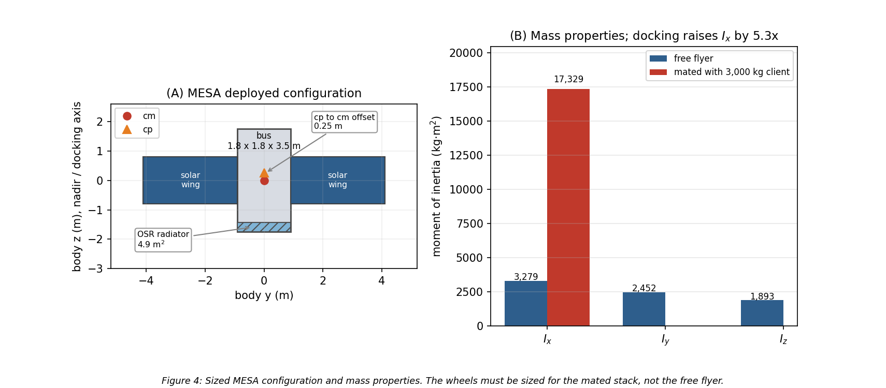

The mated inertia is the number that matters most in this table. Capturing a 3,000 kg client shifts the combined center of mass 1.80 m along the docking axis and raises $I_x$ by a factor of 5.3, so the ADACS in Section 11 is sized for the mated stack rather than for the free flyer.

### 7.2 Mass budget

**Table 4** closes the mass budget against the 2,000 kg wet requirement, and **Figure 5(A)** shows it graphically. Subsystem allocations are engineering estimates for this vehicle class except for the ADACS line, which is the computed result from Section 11.3, and the propellant line, which is the load Section 7.4 sizes.

**Table 4:** MESA mass budget.

| Item | Mass (kg) | Basis |
|:---|---:|:---|
| Structure and mechanisms | 300 | primary and secondary structure, deployables |
| Docking mechanism and robotic arm | 180 | capture latch, arm, servicing tooling |
| ADACS (wheels, sensors, RPO suite) | 157 | computed, Section 11.3 |
| Propulsion, dry | 165 | xenon and hydrazine tanks, PPU, thrusters, lines |
| Power (arrays, battery, PCU, harness) | 268 | includes 120 kg of wings and a 38 kg battery |
| Thermal control | 65 | MLI, 4.9 m² OSR radiator, heaters, heat pipes |
| C&DH and avionics | 75 | includes 15 kg of 100 mil shielding, Section 10.2 |
| Communications | 40 | TT&C transponders and antennas |
| **Subsystem total** | **1,250** | |
| **Margin** | **150** | 10.7% of dry mass |
| **Dry mass** | **1,400** | |
| **Propellant** | **600** | 520 kg xenon, 80 kg hydrazine |
| **Wet mass** | **2,000** | closes against the requirement |

The heavy lines are the ones that make this a servicer rather than a bus. The docking mechanism and arm at 180 kg plus the 25 kg RPO sensor suite account for about fifteen percent of the dry mass on their own, and they are exactly what a conventional communications satellite of the same size does not carry.

### 7.3 Power budget

**Table 5** gives the electrical load, and **Figure 5(B)** compares it against the array. Both the peak case, with every load energized, and the orbit-average case are shown, because the array is sized on the first and the thermal design is driven by the second.

**Table 5:** MESA electrical load.

| Load | Power (W) |
|:---|---:|
| ADACS (wheels, sensors, electronics) | 283 |
| Avionics and C&DH | 150 |
| Communications (TT&C) | 120 |
| RPO sensors (LIDAR, cameras) | 60 |
| Thermal heaters (eclipse) | 260 |
| Electric stationkeeping thruster | 600 |
| Robotic arm and servicing payload | 300 |
| **Peak load** | **1,773** |
| **Orbit-average load** | **1,200** |

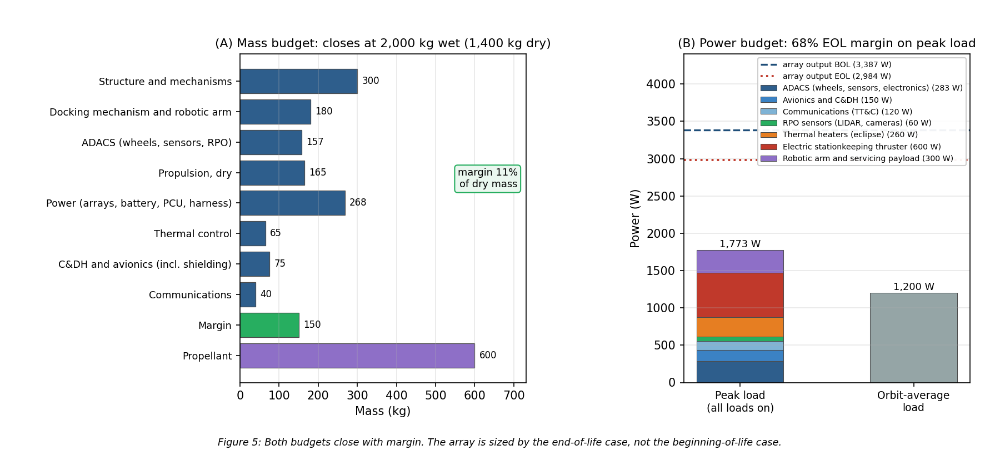

The array is 10.24 m² of triple-junction gallium arsenide at thirty percent beginning-of-life efficiency, with a 0.90 packing factor and a 0.90 hot-cell derate, giving 3,387 W at beginning of life and 2,984 W after five years of radiation damage. Section 12.2 derives both numbers and sizes the battery. The relevant budget result is that the array is sized on the end-of-life case and still carries 68 percent margin over peak load, which is what allows the peak case to be treated as genuinely available rather than as a paper number.

The orbit-average figure of 1,200 W is also the internal dissipation $Q_{int}$ used in the thermal analysis, on the assumption that essentially all electrical power ends up as waste heat inside the bus.

### 7.4 Propulsion, delta-v, and propellant

MESA carries two propulsion systems, and the split is deliberate. A xenon Hall thruster in the 600 W class, delivering roughly 40 mN at 1,600 s specific impulse [3], does the slow, high-total-impulse work: stationkeeping the mated stack, tows to and from the graveyard, and longitude relocations. A hydrazine monopropellant system at 220 s does the work electric propulsion cannot: proximity operations, where thrust must be available on demand and in any direction, and momentum dumping.

**Table 6** allocates the five-year delta-v against the baseline manifest of six client servicing cycles from Figure 1, and **Figure 6(A)** shows the same allocation graphically.

**Table 6:** Five-year delta-v budget.

| Task | Delta-v (m/s) | Basis |
|:---|---:|:---|
| Mated stationkeeping, four years on the stack | 200 | 50 m/s/yr, Eq. (3) |
| Free-flight stationkeeping, one year | 50 | 50 m/s/yr, Eq. (3) |
| Graveyard tows, six round trips | 131 | Hohmann, 10.88 m/s each way for +300 km |
| Longitude relocations, six | 34 | 5.69 m/s per repositioning at 1°/day drift |
| RPO, approach and backout, six | 48 | 8 m/s per client, approach plus a contingency abort |
| **Total** | **463** | |

$$\boxed{\Delta v_{5\,\text{yr}} = 463\ \text{m/s}}\tag{4}$$

Converting that to propellant through the rocket equation, $m_p = m_0\left(1 - e^{-\Delta v / I_{sp} g_0}\right)$, applied at the mass each task is actually flown at, gives **Table 7**. Stationkeeping and towing are flown at the 5,000 kg mated mass; relocations and proximity operations are flown at the 2,000 kg free-flyer mass.

**Table 7:** Propellant consumption against the 600 kg load, split 520 kg xenon and 80 kg hydrazine.

| Task group | System | $I_{sp}$ (s) | Flown at (kg) | Propellant (kg) |
|:---|:---|---:|---:|---:|
| Mated stationkeeping and tows | Xenon Hall | 1,600 | 5,000 | 104.8 |
| Free-flight stationkeeping and relocations | Xenon Hall | 1,600 | 2,000 | 10.7 |
| **Xenon consumed of 520 kg loaded** | | | | **115.5 (78% reserve)** |
| RPO, approach and backout | Hydrazine | 220 | 2,000 | 44.0 |
| Momentum dumping, 101 dumps | Hydrazine | 220 | 2,000 | 5.2 |
| **Hydrazine consumed of 80 kg loaded** | | | | **49.2 (38% reserve)** |
| **Total consumed of 600 kg loaded** | | | | **165** |

$$\boxed{m_{prop,\,used} = 165\ \text{kg of }600\ \text{kg loaded; capacity} \approx 10\ \text{client cycles, set by the hydrazine tank}}\tag{5}$$

The two tanks are sized separately, so the capacity is set by whichever runs dry first rather than by the combined 600 kg. **Figure 6(B)** plots each tank as a fraction consumed against the number of client cycles completed, and the crossing is unambiguous: xenon would support 28 cycles, hydrazine supports 10.2, so hydrazine is the binding sub-budget. If the customer wants more cycles under a contract extension, the fix is a larger monopropellant tank, not more xenon.

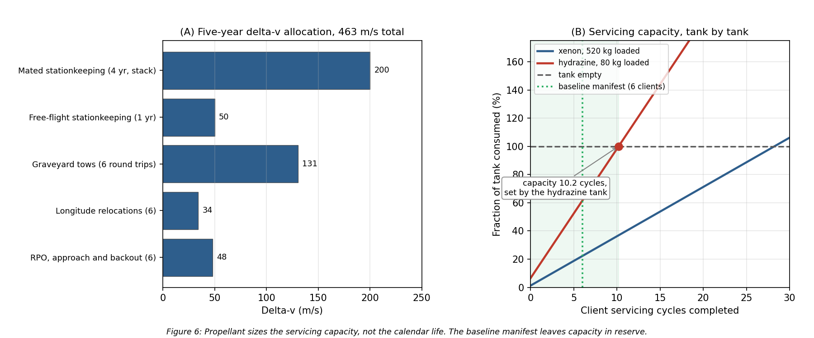

Two further things follow, and the second one refines a conclusion I carried through Milestone 2. First, the electric thruster is comfortably able to do the job: holding a 5,000 kg stack against 50 m/s per year needs 685 N·s per day, which is 4.8 hours of firing per day at 40 mN, well inside a normal electric-propulsion duty cycle. Second, **propellant sizes the servicing capacity, not the calendar life.** Milestone 2 concluded that stationkeeping propellant was the binding life limit, and with a chemical system that would have been right. With electric propulsion at 1,600 s the load carries roughly ten client cycles against a baseline manifest of six, so what actually bounds a five-year contract is wear-out: reaction wheel bearing life, docking mechanism cycles, and battery charge-discharge cycles. That is a better problem to have, because it is addressed with qualification testing rather than with tankage.

### 7.5 Cost

The $100M cap is a design-to-cost constraint, so **Table 8** allocates it rather than estimating it bottom-up. The allocation reflects where this vehicle is genuinely different from a communications bus: the servicing hardware and the sensor suite carry a third of the program, and the radiation-hardened parts in Section 10 are expensive in a way commercial equivalents are not.

**Table 8:** Design-to-cost allocation, excluding launch.

| Element | Cost ($M) |
|:---|---:|
| ADACS and RPO sensor suite | 18 |
| Docking mechanism and robotic arm | 15 |
| Avionics, C&DH, communications (RHA category R parts) | 12 |
| Bus structure and mechanisms | 12 |
| Power subsystem | 10 |
| Integration, test, and the TVAC campaign of Section 6 | 9 |
| Propulsion | 8 |
| Program management and systems engineering | 7 |
| Thermal control | 4 |
| Program reserve | 5 |
| **Total** | **100** |

Two caveats belong on this table rather than in a footnote. Launch is excluded and is assumed customer-furnished or procured separately, which is normal for a servicing vehicle whose ride is often a shared GTO slot. And the allocation is aggressive: a 2,000 kg servicer at $100M is only achievable on a heritage bus with a largely qualified parts list, which is precisely why the design follows proven MEV practice [1] rather than inventing an architecture.

The value argument closes the case. A GEO communications satellite generates revenue measured in tens of millions of dollars per year, and MESA extends six of them by roughly a year each within one contract while freeing the operational slots it clears. The asset it protects on any single mission is worth more than the tug.

---

## 8. Thermal Control System

Section 7 fixed the geometry and the 1,200 W of internal dissipation. At GEO the vehicle can shed that heat only by radiation, so the thermal design reduces to a single question: how much radiator area, and what closes the cold case.

### 8.1 Equilibrium temperatures in sun and eclipse

Treating the bus as isothermal and balancing absorbed solar flux, absorbed Earth flux, and internal dissipation against re-radiation [14] gives Eq. (6):

$$\alpha F_s A_{proj} + Q_{Earth} + Q_{int} = \sigma\left(\varepsilon_{MLI}A_{MLI} + \varepsilon_{OSR}A_{rad}\right)T^4 \tag{6}$$

The Earth terms are negligible at this altitude. Scaled by the $(R_E/r)^2$ view factor, Earth infrared is 5.42 W/m² and albedo 9.34 W/m², together 4.77 W against roughly 2,400 W of solar and internal load, or two tenths of one percent. The script carries them; the hand calculation drops them.

Setting the sunlit case to 310 K sizes the radiator at **4.9 m² of optical solar reflector**. Holding that area fixed and re-solving Eq. (6) with and without the solar term gives the two required temperatures:

$$\boxed{T_{sun} = 309.5\ \text{K} = +36.3\ ^\circ\text{C} \qquad T_{eclipse} = 260.1\ \text{K} = -13.1\ ^\circ\text{C}}\tag{7}$$

That is a steady-state swing of 49.4 K, and the shape is the expected one: the sunlit case sits inside a normal electronics band and the eclipse case falls below it, because radiators are sized by the hot case and heaters close the cold case. Holding an isothermal bus at 0 °C against the eclipse case needs **260 W** of heater power, which is the line carried in Table 5. **Figure 7** shows the sizing trade.

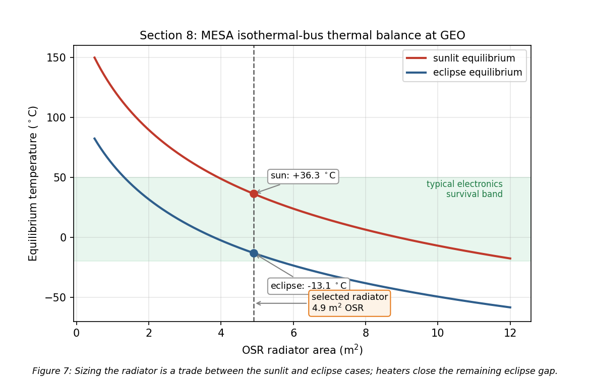

One important qualification, and it is the reason Section 12.3 exists: Eq. (7) is a pair of steady-state bounds, not a prediction of what the bus does during a 69 min eclipse. The transient simulation shows the bus itself moves only 3.9 K, and that the 260 W of heater power is genuinely needed by the low-mass outboard zones rather than by the bus. The steady-state numbers are still the right ones to design the radiator against, because the sunlit case is reached and held for most of the year.

### 8.2 Recommended thermal control system and why

The design is passive-dominant, which is the right choice for a vehicle with a steady internal load and no agile thermal requirement.

- **MLI blankets** over the bus, with a silverized-Teflon outer layer at $\alpha = 0.14$ and effective $\varepsilon = 0.03$. The low absorptivity keeps the sunlit case cool, and the low effective emittance is what makes the eclipse case survivable at all. The outer layer is ITO-coated for charge control, which is a Section 9 requirement driving a Section 8 part choice.
- **OSR radiators**, 4.9 m², mounted on the anti-sun face so they never see direct sun. Second-surface mirrors hold a low $\alpha/\varepsilon$ ratio far better than white paint across five years of ultraviolet exposure, which matters on a vehicle that cannot be recoated.
- **Heaters with redundant thermostats**, 260 W total, zoned on the battery, the propellant lines and tanks, the docking mechanism, and the arm joints rather than on the whole bus. Section 12.3 shows why that zoning is not just good practice but the actual requirement: the propellant lines reach -0.2 °C in eclipse without a heater, below hydrazine's 2 °C freezing point, while the bus barely moves.
- **Heat pipes and doublers** running from the avionics and battery to the radiator, so the dissipating boxes are coupled to the rejection path instead of relying on the structure to carry heat.
- **Thermal isolation at the docking interface.** A client that has been powered down is cold, and a conductive path into a captured client would pull MESA's bus down with it, so the capture mechanism uses low-conductance standoffs. This is a servicer-specific requirement with no analogue on a conventional satellite.

### 8.3 Ground testing recommendation

I recommend the **full TVAC and thermal-balance campaign from Section 6**, and the numbers above are the reason. A predicted swing of 49 K and a predicted 3.9 K orbital excursion both rest on assumed values of $\alpha$, $\varepsilon$, and $Q_{int}$, and thermal balance testing is how those assumptions get correlated to hardware before flight rather than after launch. The same vacuum campaign is what qualifies the deployment and capture mechanisms against cold welding, a vacuum failure mode that no ambient test will reveal [13].

If the customer deletes ground testing anyway, the thermal control system absorbs that uncertainty in margin and material choice: a design band widened to roughly ±25 K, coatings restricted to flight-proven silverized Teflon and OSR with published beginning- and end-of-life properties, the radiator oversized by about thirty percent against an under-predicted internal load, and heater strings fully cross-strapped, since an uncorrelated cold case ends the mission. That extra area, power, and harness costs mass on every flight unit. Testing once is cheaper.

---

## 9. Plasma Environment

Section 4.3 identified surface charging as the leading cause of GEO anomalies. This section quantifies it for MESA and works the design response, including the one charging failure mode that is unique to a servicing vehicle.

### 9.1 Risks

GEO sits in the hot plasma sheet, and during substorms the electron population reaches keV to tens of keV temperatures. Balancing the electron and ion currents to a floating conductor in a $10^7$ K plasma gives the standard result [15]:

$$\boxed{V = -2.50\,\frac{k_B T_e}{e} \approx -2.16\ \text{kV}}\tag{8}$$

The absolute potential is not what breaks hardware. A well-bonded conductive vehicle can sit a couple of kilovolts below its environment and function normally. The danger is differential charging: coverglass, Kapton, and metal structure charge to different potentials, and once the gap between them exceeds the breakdown threshold the result is an arc [6], [15]. That arc is the leading cause of GEO anomalies and the mechanism behind the Galaxy 15 loss of command for eight months [7]. Deep-dielectric charging compounds the problem, because MeV outer-belt electrons penetrate the skin entirely and deposit charge inside cable dielectrics and circuit boards, which then discharge into buried signal lines [6]. Surface grounding does nothing for this mechanism; only shielding and bulk conductivity help.

What turns a charging event into a mission-ending one is the coupling that follows the arc. The transient couples into the harness and avionics, which is exactly how a surface effect becomes an uncommandable vehicle [6]. On the solar array a primary arc between adjacent strings can be sustained by the array's own current, permanently shorting a string section. A negatively biased vehicle also attracts its own outgassed contaminants back onto cold surfaces, which lands directly on the RPO optics this mission depends on [5].

**The mission-unique risk is the docking interface.** MESA and its client float independently and reach different potentials, because they have different surface materials, different areas, and different illumination histories. At the moment of capture the two vehicles are bonded through the docking mechanism, and the potential difference equalizes through whatever path is available. If that path is the capture latch or a signal umbilical, the discharge damages the mechanism or the avionics on both vehicles, and MESA has just destroyed the asset it was sent to save. No conventional satellite carries this failure mode, because no conventional satellite deliberately touches another one.

### 9.2 Mitigations

The baseline is a fully conductive, bonded exterior per NASA-HDBK-4002A [6]: ITO-coated coverglass, an ITO-coated MLI outer layer, conductive paint on the remaining surfaces, and grounding straps across every hinge and deployable, all tied to a common structure ground. That architecture is enforced through single-point grounding per NASA-HDBK-4001 [16], so there is one defined return path and no floating islands left to charge differentially. For the deep-dielectric mechanism, which grounding cannot reach, the answer is the 100 mils of aluminum equivalent from Section 10 combined with slightly conductive dielectrics, so deposited charge bleeds off faster than it accumulates. Harness entering the avionics carries EMI filtering and transient suppression, and the array uses arc-tolerant string isolation diodes.

The docking-interface risk gets a dedicated fix. MESA carries a plasma contactor that emits a low-energy electron current, clamping the vehicle near plasma potential. The operational rule is to run the contactor and drive both vehicles toward a common potential **before** mechanical contact, so equalization happens through a controlled emissive path rather than through the capture latch. Layered on top of the hardware, docking windows are scheduled against the SWPC feed from Section 5, and proximity operations hold during substorm conditions and Kp excursions. This is the hold gate drawn in Figure 1, and it is the reason the space weather feed is a contractual requirement rather than a convenience.

### 9.3 Impact on the other subsystems

**Table 9:** Impact of the plasma mitigations on the rest of the vehicle.

| Subsystem | Impact of the plasma mitigations |
|:---|:---|
| Thermal | ITO on the MLI and coverglass raises $\alpha$ and shifts $\alpha/\varepsilon$, feeding back into the Section 8 radiator sizing. Coatings must be selected for charge control and optical properties at once. |
| Power | The plasma contactor draws roughly 30 W when active and adds about 10 kg with its gas supply, both carried inside the Table 4 and Table 5 allocations. Array string isolation costs a small amount of conversion efficiency. |
| C&DH and avionics | EMI filtering and transient suppression add mass and part count, and the software must tolerate and recover from arc-induced upsets rather than assume clean power. |
| Structures | Grounding straps across every hinge, deployable, and the docking mechanism, plus conductive-path continuity verification as a manufacturing requirement. |
| ADACS | Arc transients raise the noise floor on star trackers and sun sensors, so the estimator must reject dropouts rather than track them. |
| Operations | Docking is no longer schedulable on demand but gated on space weather, which lengthens the servicing timeline per client and is built into the 242-day cycle of Figure 1. |

The honest summary is that plasma survivability is cheap in mass and expensive in discipline. The hardware fixes amount to coatings, straps, and one small contactor. What they actually cost is a grounding architecture enforced across every box and every interface, plus an operational constraint on when the mission's central activity is allowed to happen.

---

## 10. Radiation Environment

Plasma acts on the vehicle's surfaces. Radiation passes through them, so the design response shifts from coatings and bonding to part selection and shielding.

### 10.1 Risks

GEO sits inside the outer electron belt, outside most of the geomagnetic shielding, for the entire mission [17]. The three sources are trapped MeV electrons and their bremsstrahlung, solar energetic protons during events, and the galactic cosmic ray background.

Total ionizing dose is the cumulative threat. Charge trapped in gate oxides shifts threshold voltages and increases leakage until parts fail, and it accumulates continuously across five years with no recovery. Single-event effects are the acute counterpart: a single heavy ion or high-energy proton deposits enough charge in a sensitive volume to flip a bit, latch a parasitic structure into a high-current state, or rupture a power device gate [17]. Latch-up and gate rupture are destructive, while upsets are recoverable if the design anticipates them. Susceptibility varies sharply by technology, running from radiation-hardened CMOS on sapphire or insulator at the safe end to NMOS dynamic memory at the vulnerable end [14]. Displacement damage is the third mechanism, in which non-ionizing energy loss knocks atoms out of the lattice and degrades minority carrier lifetime; on the solar array this is the dominant cause of the power decay that sets end-of-life output.

Solar particle events concentrate all of this into hours. A severe or extreme storm can cause memory device problems, star-tracker interference severe enough to lose orientation, and permanent solar-panel degradation from a single event [17]. For a vehicle performing precision proximity operations, losing the star trackers mid-approach is the acute risk, and it is what drives the operational rules below.

**Dose estimate.** I assume **5 krad(Si) per year behind 100 mils, or 2.54 mm, of aluminum**, a representative GEO figure. Over the five-year mission:

$$\boxed{\text{TID} = 25\ \text{krad(Si)}; \ \text{with the 2x rad-hard design margin, a 50 krad(Si) requirement}}\tag{9}$$

The factor-of-two margin for radiation-hardened parts is the standard guidance, with commercial parts carrying up to a factor of ten [14]. Selecting from the radiation hardness assurance categories [14], the requirement falls between category L at 50 krad(Si) and category R at 100 krad(Si), so **I specify category R parts**, which holds even if the annual dose assumption is wrong by a factor of two. That insensitivity is why I am comfortable carrying an assumed dose rate rather than a modeled one at this stage of the design.

### 10.2 Mitigations

The parts baseline is category R at 100 krad(Si) for all avionics, with radiation-hardened CMOS preferred over the more susceptible technologies [14], backed by 100 mils of aluminum equivalent structural shielding and spot shielding on the few parts that cannot be procured in a hardened version. Over a 0.6 m avionics cube that shielding is 2.16 m² of surface and **14.8 kg of aluminum**, which is the shielding allocation inside the 75 kg C&DH line of Table 4. Against single-event effects the standard set applies: error detection and correction on all memory, watchdog timers, and redundancy with majority voting [14], with scrubbing cycles that refresh memory faster than upsets accumulate. Every power feed carries latch-up current limiting, so a latch-up trips a limiter and power-cycles the box instead of destroying it.

Underneath the hardware sits a formal radiation hardness assurance program, which identifies the exposure, sets margins, maintains a parts list, procures hardened parts where possible, and qualifies the remainder by test [14]. Two mission-level measures complete the picture. The SWPC feed from Section 5 gives warning of a proton event, so the vehicle safes non-essential avionics and holds proximity operations, and docking never begins inside a forecast SEP window. Separately, the array is sized so that post-degradation output still covers peak load, as Section 12.2 shows, rather than sized at beginning of life and allowed to fall short.

### 10.3 Impact on the other subsystems

**Table 10:** Impact of the radiation mitigations on the rest of the vehicle.

| Subsystem | Impact of the radiation mitigations |
|:---|:---|
| Structures and mass | 14.8 kg of aluminum over the avionics volume plus spot shields is a direct mass charge, carried in Table 4. |
| Power | Degradation of 11.9% over five years drives the array from a beginning-of-life size to an end-of-life size, at 3,387 W BOL to hold 2,984 W at EOL (Section 12.2). Latch-up limiters add parts to every feed. |
| C&DH | Error correction, scrubbing, watchdogs, and voting logic cost throughput, memory, and software complexity. Category R parts are slower and far more expensive than commercial equivalents, which is why Table 8 carries $12M against the avionics line. |
| ADACS | Star trackers are the most SEP-sensitive sensor on the vehicle, so the estimator carries inertial propagation through tracker dropouts (Section 11.3). |
| Thermal | Shielding mass adds thermal capacitance, which slightly damps the eclipse transient of Section 12.3. A minor benefit rather than a cost. |
| Operations | Servicing is suspended during SEP events, compounding with the plasma-driven docking constraint from Section 9. |

---

## 11. Attitude Determination and Control (ADACS)

Sections 9 and 10 covered what the environment does to the vehicle's surfaces and electronics. It also pushes on the vehicle mechanically, and sizing the attitude control hardware means quantifying those pushes first.

### 11.1 The four disturbance torques

I evaluated all four external disturbance torques at GEO using the standard worst-case relations [3] with the Table 3 geometry. **Table 11** gives the formulas and results, and **Figure 8** shows how each varies with altitude.

**Table 11:** Worst-case external disturbance torques on MESA at GEO.

| Disturbance | Formula [3] | Result (N$\cdot$m) | Share |
|:---|:---|---:|---:|
| Solar radiation | $T_{sp} = F(c_{ps}-c_m)$, $F = \frac{F_s}{c}A_s(1+q)\cos i$ | $3.00\times10^{-5}$ | 93.5% |
| Gravity gradient | $T_g = \frac{3\mu}{2R^3}\lvert I_z - I_y\rvert\sin 2\theta$ | $1.53\times10^{-6}$ | 4.8% |
| Magnetic | $T_m = DB$, $B = M/R^3$ at the equator | $5.31\times10^{-7}$ | 1.7% |
| Aerodynamic | $T_a = \tfrac{1}{2}\rho C_D A V^2 (c_{pa}-c_m)$ | $4.30\times10^{-8}$ | 0.1% |
| **Worst-case total $T_D$** | | $\mathbf{3.21\times10^{-5}}$ | 100% |

Inputs: $A_s = 16.54$ m², $q = 0.6$, $i = 0^\circ$, $c_{ps}-c_m = 0.25$ m, $\theta = 10^\circ$, $\lvert I_z - I_y\rvert = 559$ kg$\cdot$m², $D = 5$ A$\cdot$m², $B = 1.06\times10^{-7}$ T, $\rho = 10^{-15}$ kg/m³, and $V = 3{,}075$ m/s. The SRP relation is normally written with a solar constant of 1,367 W/m²; I use the 1,361 W/m² value from Section 4.1 everywhere for internal consistency, and the difference of four tenths of a percent does not move any conclusion.

$$\boxed{T_D = 3.21\times10^{-5}\ \text{N}\cdot\text{m, of which SRP is 93.5\%}}\tag{10}$$

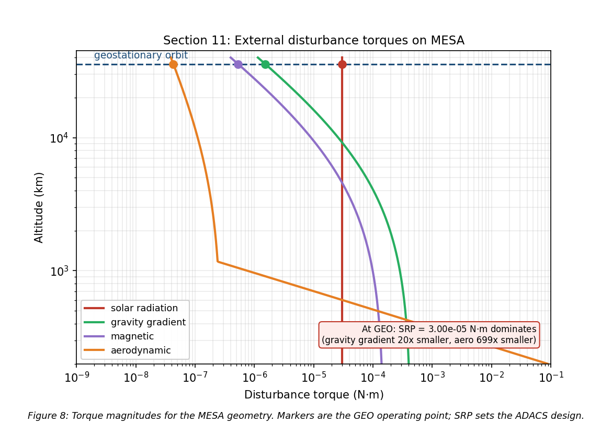

This is the expected GEO result, and it falls in the $10^{-6}$ to $10^{-4}$ N$\cdot$m band that is typical for spacecraft disturbance torques [3]. Three points are worth drawing out. SRP dominates because it is the only one of the four that does not fall off with distance from Earth, since gravity gradient and magnetic torque both scale as $R^{-3}$ and drag is gone entirely. Gravity gradient is modest here only because MESA is a compact bus with a small difference between $I_z$ and $I_y$; a long-boom vehicle at the same altitude would see far more. And aerodynamic torque at GEO is roughly seven hundred times smaller than SRP, which quantifies from a second direction the Section 3.3 conclusion that this is not a drag-driven design.

### 11.2 Actuator sizing

Disturbance rejection is not what sizes the wheels. Slewing the mated stack is.

**Table 12:** Wheel sizing drivers [3].

| Driver | Relation | Result |
|:---|:---|---:|
| Disturbance rejection | $T_D$ | $3.21\times10^{-5}$ N$\cdot$m |
| 30° slew, free flyer, 300 s | $M = 4I\theta/t^2$ | 0.076 N$\cdot$m, $H$ = 11.4 N$\cdot$m$\cdot$s |
| 30° slew, mated, 600 s | $M = 4I\theta/t^2$ | 0.101 N$\cdot$m, $H$ = 30.3 N$\cdot$m$\cdot$s |
| Cyclic momentum storage | $H = 0.707\,T_D\,(P/4)$ | 0.49 N$\cdot$m$\cdot$s |
| Secular momentum accumulation | $H = T_D\,P$ | 2.77 N$\cdot$m$\cdot$s per day |

The mated slew at 0.101 N$\cdot$m is the driving case, larger than the free-flyer slew and about three thousand times the disturbance torque, so the disturbance term does not participate in the sizing at all. Applying a one hundred percent margin factor to that driving case gives the wheel torque requirement in Eq. (11):

$$\boxed{M_{RW} = M_{slew,\,mated}(1+\text{margin}) = 0.101 \times 2 = 0.20\ \text{N}\cdot\text{m}}\tag{11}$$

At above 0.15 N$\cdot$m this lands in the large-satellite class, which carries **25 kg and 100 W per wheel** [17]. I baseline **four wheels in a pyramid**, which gives one-fault tolerance and three-axis control from any three of them.

The momentum behavior is the more interesting result. Because SRP at GEO is nearly constant in inertial space rather than cycling with orbit position, the stored momentum is **secular**: it ramps at 2.77 N$\cdot$m$\cdot$s per day instead of averaging out over an orbit. With a 50 N$\cdot$m$\cdot$s dump threshold against a 200 N$\cdot$m$\cdot$s wheel capacity, that is a dump roughly **every eighteen days**, or 101 dumps across the mission, as shown in **Figure 9**.

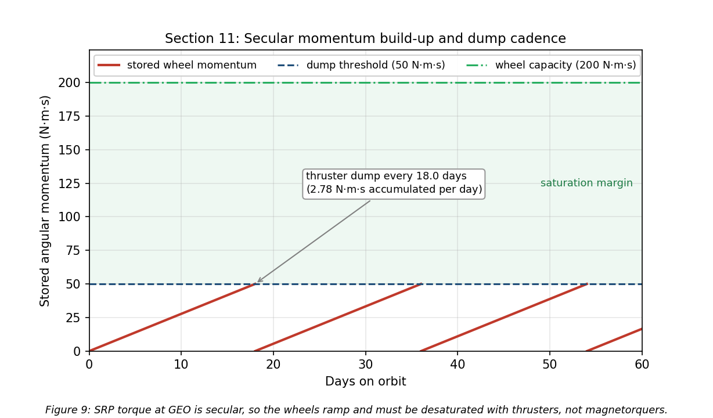

Momentum dumping cannot use magnetorquers. Earth's field at GEO is only $1.06\times10^{-7}$ T, so unloading 50 N$\cdot$m$\cdot$s in any reasonable time would demand an impractically large dipole, and magnetic torquers are simply not useful in high-Earth orbit [3]. **Dumping is done with the hydrazine thrusters**, and Table 7 charges it 5.2 kg of propellant across the mission rather than treating it as free.

### 11.3 Sensors, mass, and power

**Table 13:** ADACS mass and power. Actuator and sensor values are the GEO-class figures [3], [17]; the RPO sensor line is an engineering estimate carried from the Section 2.3 requirement.

| Component | Qty | Mass (kg) | Power (W) |
|:---|---:|---:|---:|
| Reaction wheels, 200 N$\cdot$m$\cdot$s class | 4 | 100.0 | 120 avg / 400 peak |
| Star trackers | 2 | 10.0 | 36 |
| Inertial measurement units (one active) | 2 | 10.0 | 30 |
| Coarse sun sensors | 4 | 4.0 | 12 |
| ADACS control electronics | 1 | 8.0 | 25 |
| RPO LIDAR and cameras | 1 set | 25.0 | 60 |
| **Total** | | **157.0** | **283 avg** |

$$\boxed{\text{ADACS: } 157\ \text{kg (7.8\% of wet mass)}, \ 283\ \text{W orbit-average}, \ 563\ \text{W peak during a mated slew}}\tag{12}$$

Two sensor choices follow directly from the environment sections. Star trackers are doubled because they are the most SEP-sensitive sensor on the vehicle, as Section 10.1 established, and the estimator propagates on the inertial measurement unit through tracker dropouts rather than losing attitude knowledge mid-approach. GPS is not baselined, because at GEO the vehicle sits above the constellation and would depend on sidelobe tracking, so ground-based ranging is the primary orbit determination source with GPS sidelobe reception held as a possible later upgrade.

---

## 12. Simulations: Orbit, Power, and Thermal

The preceding sections quoted results from a common analysis. Everything in this report comes from one script, `spce5065_final_figs.py`, which computes the mass properties, the budgets, the thermal balance and transient, the disturbance torques, the wheel sizing, the power profile, and the meteoroid flux, and writes every figure except the three STK captures. This section presents the simulations themselves: the orbit, the power profile over a full day, the thermal transient through eclipse, and an independent rebuild of the mission in Systems Tool Kit.

### 12.1 Orbit simulation

**Figure 10** simulates the MESA orbit, propagated numerically over one sidereal day, which is the GEO period. Panel A is a three-dimensional inertial rendering: Earth is drawn to scale with its spin axis and equator marked, the geostationary and graveyard orbits are shown as the equatorial rings they are, and the satellite is stepped hourly to show one revolution per sidereal day, with MESA and a client separated in longitude along the belt. Panel B is the resulting ground track.

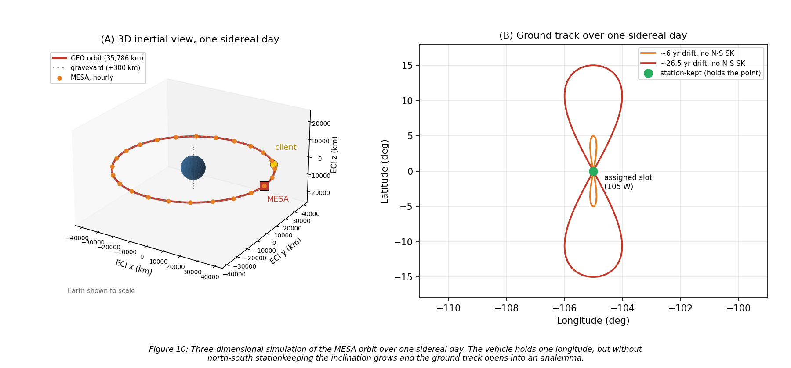

A stationkept satellite holds a single point over its assigned longitude, taken here as 105° W, and that is the green marker in Panel B. Without north-south stationkeeping, luni-solar gravity grows the inclination at the rate quantified in Section 3.3 and the ground track opens into the classic figure-eight analemma, reaching roughly ±5° of latitude after a few years and ±15° after about 26.5 years. That drift is precisely why the stationkeeping allocation in Table 6 is the largest single line in the delta-v budget: MESA is not fighting decay, it is fighting drift, for itself and for every client it is holding.

### 12.2 Power, eclipse, and battery sizing

**Figure 11** plots array output over one day at equinox, which is the worst case of the year for both eclipse duration and battery depth of discharge.

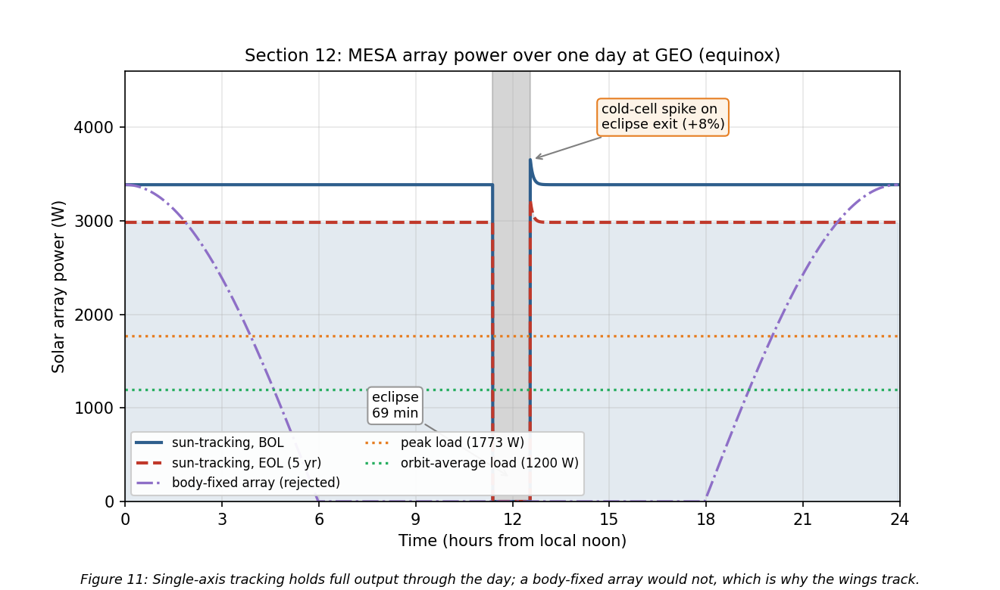

The eclipse is the deepest of the year, and from cylindrical shadow geometry the satellite spends

$$\boxed{t_{eclipse} = 69.4\ \text{min in shadow at equinox}}\tag{13}$$

which is close to the commonly quoted maximum of about 72 min, the difference being the penumbra and the Sun's finite disk, neither of which the cylindrical model carries. Section 12.4 confirms both figures against STK.

Battery capacity follows directly from Eq. (13). Carrying the full 1,773 W peak load through 69.4 min is 2,051 W$\cdot$h of delivered energy, and at a 60 percent depth of discharge with a 90 percent discharge-path efficiency the installed capacity must be

$$\boxed{E_{batt} = \frac{2{,}051}{0.60 \times 0.90} = 3{,}798\ \text{W}\cdot\text{h} \ \rightarrow \ 38\ \text{kg installed at 150 W}\cdot\text{h/kg cells}}\tag{14}$$

using a 1.5 packaging factor from cells to installed battery [3]. That 38 kg is the battery line inside the 268 kg power allocation of Table 4. Sizing to 60 percent depth of discharge rather than deeper is a cycle-life decision: at roughly ninety eclipses a year across the two eclipse seasons the battery sees on the order of four hundred and fifty deep cycles over five years, and depth of discharge is the strongest lever on how many of those it survives.

Three features of the profile are worth noting. First, the arrays use single-axis sun tracking, which is why the output stays flat rather than following the cosine curve of the body-fixed case also plotted; that comparison is the justification for accepting the mass and mechanism complexity of tracking wings. Second, coming out of eclipse the cells are cold and briefly produce about eight percent above nominal before warming to steady state, which the power regulation must accept without tripping. Third, and this is the budget result:

$$\boxed{P_{BOL} = 3{,}387\ \text{W} \quad\rightarrow\quad P_{EOL} = 2{,}984\ \text{W after five years (88.1\%)}}\tag{15}$$

At 2.5 percent per year the array loses 11.9 percent over the mission, leaving 68 percent margin over the 1,773 W peak load at end of life. Extrapolating that decay, array output does not fall to the peak load until roughly 25.6 years, so power is emphatically not the life-limiting mechanism, and neither is drag.

### 12.3 Thermal transient through eclipse

Equation (7) gives two steady-state temperatures, but a 69.4 min eclipse is short compared with the thermal time constant of a 1,400 kg vehicle, so the bus never reaches the cold bound. **Figure 12** integrates the lumped-capacitance form of Eq. (6), $C\,\mathrm{d}T/\mathrm{d}t = Q_{in}(t) - \sigma\varepsilon A T^4$, through one eclipse for two very different thermal masses.

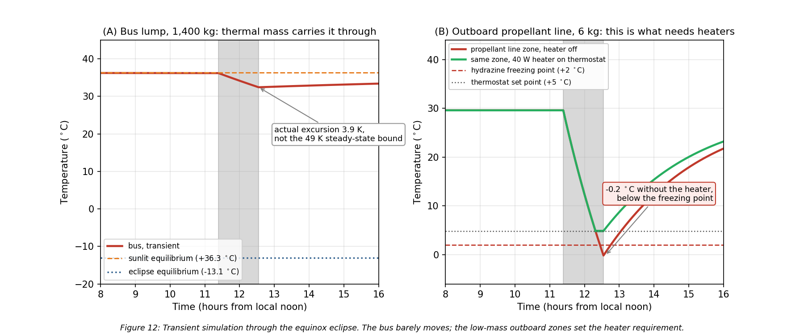

Taking the bus as an isothermal lump of the 1,400 kg dry mass at an aluminum-dominated 900 J/(kg$\cdot$K) gives $C = 1.26\times10^{6}$ J/K against a radiative conductance of 31.1 W/K at the sunlit temperature, so the time constant is **11.3 hours against a 1.16 hour eclipse**. Panel A is the consequence: the bus drops **3.9 K**, from +36.3 °C to +32.4 °C, and recovers within a couple of hours of sunrise. It never approaches the -13.1 °C steady-state bound.

Panel B is the zone that actually needs the heaters. An outboard propellant line and latch-valve assembly, taken as 6 kg with an effective $\varepsilon A$ of 0.10 m² and no internal dissipation, has a time constant of 2.4 hours, comparable to the eclipse itself. It sits at +29.6 °C in sunlight and falls to **-0.2 °C** by the end of eclipse with the heater off, which is below hydrazine's 2 °C freezing point. Holding it at the +5 °C set point needs 33.9 W of steady power, so the 40 W heater string on that zone closes the case with margin and the simulated minimum becomes +4.8 °C.

This is the single most useful result in the simulation set, because it changes where the hardware goes rather than just confirming a number. The 260 W heater allocation is real, but it belongs on the battery, the propellant lines and tanks, the docking mechanism, and the arm joints, not on the bus. Two caveats keep it honest: a perfectly isothermal 1,400 kg lump is optimistic, since real vehicles have gradients and imperfectly coupled boxes, and the outboard zone's $\varepsilon A$ is an estimate. Both are exactly the assumptions the thermal-balance test in Section 8.3 exists to correlate.

### 12.4 Independent verification in STK

Everything above comes from one Python model, so it is internally consistent by construction but not independently confirmed. I rebuilt the mission in Systems Tool Kit 13.1.0 [18] and re-derived the eclipse, the array output, and the orbital lifetime there. The scenario runs one day from 20 March 2027, the vernal equinox, which is the worst-case eclipse season and the case Eq. (13) describes.

The vehicle is a two-body propagation at the Eq. (1) semi-major axis, circular and equatorial, holding the 105° W slot. Sampling the subsatellite point across the day confirms it is geostationary rather than merely the right size: longitude holds at 105.0000° W with a spread of 0.0005° over twenty-four hours.

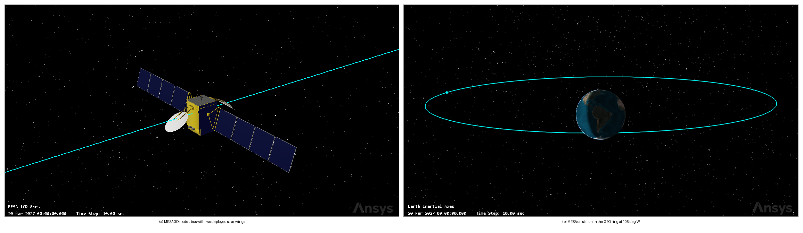

The model is a geostationary communications bus with two deployed wings, the closest available match to the 1.8 by 1.8 by 3.5 m MESA bus carrying 10.24 m² of array.

The Solar Panel tool computes illuminated area by rendering the vehicle against the Sun and integrating the lit surface, then applies

$$P = \eta \cdot S \cdot A_{eff} \cdot G_{s}\tag{16}$$

where $G_s$ is 1361.128 W/m² at one astronomical unit [18] and $S$ is solar intensity, zero in umbra to one in full sun.

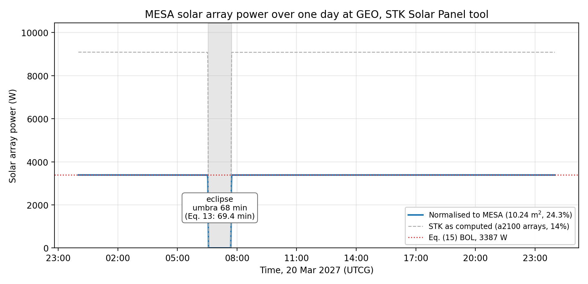

The eclipse is the meaningful cross-check, since it depends only on the orbit and the epoch and not on the model. STK gives **68.0 min** of full umbra and **72.0 min** of total shadow including penumbra, centered on 07:07 UTC, which is local midnight at 105° W. The 69.4 min cylindrical estimate of Eq. (13) falls between the two, exactly where it should: that model has no penumbra and treats the Sun as a point, so it overstates umbra and understates total shadow. The 72.0 min figure also confirms the commonly quoted maximum that Section 12.2 asserted without a source.

The power comparison is weaker and I am not claiming more from it than it supports. STK takes array area and efficiency from the model geometry rather than from Table 3, so its raw 9,085.7 W describes that bus, not MESA. Inverting Eq. (16) gives an implied area of 47.68 m², and rescaling to MESA's 10.24 m² at the Section 12.2 efficiency of 24.3 percent returns 3,386.9 W. That matches Eq. (15) to within a watt, but both sides evaluate the same product of efficiency, area, and irradiance, so the agreement is close to definitional. What it does establish is that STK uses the same solar constant and formulation, and that Eq. (15) is arithmetically sound.

The Lifetime tool closes out Section 3.3. Given the Table 3 drag area of 16.54 m², the drag coefficient of 2.2, and the 2,000 kg wet mass, STK reports no decay within a 36,500 day limit, or one hundred years.

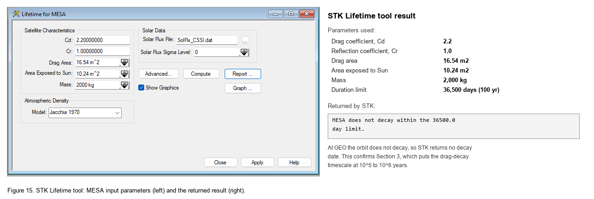

That is the correct answer at GEO, not a tool failure: a decay timescale of $10^5$ to $10^6$ years is indistinguishable from never for any run bounded at a century.

**Table 14:** Cross-checks between the Python model and STK.

| Quantity | This report | STK 13.1.0 | Assessment |
|:---|---:|---:|:---|
| Eclipse, umbra at equinox | 69.4 min, Eq. (13) | 68.0 min | independent, agrees within two percent |
| Eclipse, umbra plus penumbra | about 72 min, quoted | 72.0 min | independent, confirms the quoted maximum |
| Array output at BOL | 3,387 W, Eq. (15) | 3,386.9 W, normalized | consistent, but not independent |
| Orbital decay at GEO | none, $10^5$ to $10^6$ yr, Eq. (3) | does not decay in 100 yr | independent, confirms Section 3.3 |

Two of the four are independent confirmations, one is a consistency check labeled as such, and none contradict the analysis. The scenario ships alongside this report as `MESA_MS2.zip`.

---

## 13. Integrated Risk Assessment and Mission Assurance

Sections 8 through 12 each closed their own subsystem. A customer buying this vehicle is buying the combination, so this section assembles the risk picture: the one environmental threat the earlier sections did not quantify, the failure modes around the docking sequence, and where the whole design sits before and after its mitigations.

### 13.1 Micrometeoroids and orbital debris

GEO is the benign regime for man-made debris and the ordinary one for meteoroids. Catalogued objects in the belt drift slowly relative to a stationkept satellite, on the order of metres per second, so a conjunction there is a collision avoidance problem rather than a hypervelocity one, and the population density is orders of magnitude below LEO. Sporadic meteoroids are the opposite: they arrive at roughly 20 km/s regardless of altitude, and the flux at GEO is essentially the interplanetary flux.

Using the Grun sporadic flux [19] with the Earth-shielding and gravitational-focusing factors, $\chi = (1+\cos\theta)/2$ for randomly oriented surfaces and $G = 1 + R_a/r$ with $\sin\theta = R_a/r$ and $R_a = R_E + 100$ km, GEO gives $\chi = 0.9941$ and $G = 1.1536$, so $\chi G = 1.147$. The same vehicle at 400 km gives $\chi = 0.6471$ and $G = 1.9557$, so $\chi G = 1.266$. That is the counterintuitive and useful result: Earth shielding and gravitational focusing very nearly cancel, so the **net meteoroid flux is within about ten percent of orbit-independent**, which is the exact opposite of how man-made debris behaves. Moving MESA to GEO buys enormous relief from debris and almost none from meteoroids.

Taking MESA's exposed area as 52.2 m², the 31.68 m² bus exterior plus both faces of both wings, and applying the Poisson relation $p = 1 - e^{-FAt}$ over five years gives **Table 15** and **Figure 16**.

**Table 15:** Meteoroid flux and five-year impact probability at GEO for 52.2 m² of exposed area.

| Particle diameter | Mass (g) | Flux (m$^{-2}$yr$^{-1}$) | Mean interval | $P$(at least one in 5 yr) |
|:---|---:|---:|---:|---:|
| 0.1 mm | $1.31\times10^{-6}$ | $1.33$ | 5.3 days | ~100% |
| 1 mm | $1.31\times10^{-3}$ | $4.86\times10^{-4}$ | 39 yr | 11.9% |
| 5 mm | $1.64\times10^{-1}$ | $8.91\times10^{-7}$ | $2.2\times10^{4}$ yr | 0.023% |
| 10 mm | $1.31$ | $5.63\times10^{-8}$ | $3.4\times10^{5}$ yr | 0.0015% |

$$\boxed{P_{5\,\text{yr}}(d \ge 1\ \text{mm}) = 11.9\%, \qquad P_{5\,\text{yr}}(d \ge 5\ \text{mm}) = 0.023\%}\tag{17}$$

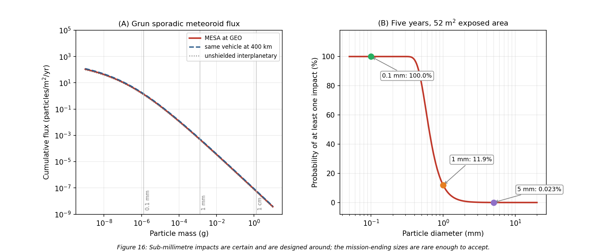

The design response follows the shape of that distribution rather than trying to armor against all of it.

- **Sub-millimetre impacts are certain and are absorbed by design.** Thousands of 0.1 mm hits over five years pit the coatings, degrade the optical properties of the OSR radiator, and cost a small amount of array output. This is carried as part of the 2.5 percent per year array degradation and in the coating end-of-life properties used in Section 8, not as a discrete risk.
- **Millimetre impacts are likely and are handled by redundancy rather than shielding.** A 1 mm particle will very probably hit somewhere in five years. Array string isolation diodes, already required for arc tolerance in Section 9.2, mean a punctured cell string is lost rather than the wing.
- **The pressurized items get a bumper.** For the propellant tanks, where a penetration is not a degradation but a loss of vehicle, I sized a Whipple shield [14] against a 0.3 cm meteoroid at 20 km/s with a 10 cm standoff and an Al 6061-T6 rear wall at 35 ksi: bumper thickness $t_b = 0.56$ mm and rear wall $t_w = 3.6$ mm. That is a modest, entirely conventional shield, and the tank walls already provide much of it.
- **The RPO optics get covers.** The docking cameras and LIDAR are the mission, and they are only exposed during proximity operations, which is a few percent of the mission. Closing covers outside those windows removes most of their integrated exposure to both meteoroids and contamination for almost no mass.

### 13.2 Failure modes around the docking sequence

The docking sequence concentrates the mission's risk into a few minutes, and every one of the following failure modes has an owner elsewhere in this report.

**Electrostatic discharge at capture** is the defining one. Two vehicles at different floating potentials bond through a capture latch, and the discharge path is whatever is available. The mitigation is the plasma contactor and the potential-equalization rule of Section 9.2, plus a conductive, bonded capture interface so that if a current does flow it flows through structure rather than through signal lines.

**A client outside the capture envelope** is the next. A client that has lost attitude control may be tumbling faster than the docking mechanism can accept. The far-field inspection phase in Figure 1 exists specifically to measure client rates before committing, and the abort criteria are set at the mechanism's qualified envelope rather than at the controller's optimistic one.

**A solar particle event mid-approach** would take out the star trackers at the worst moment. The mitigations are layered: the SWPC feed gates the approach (Section 5), the estimator propagates on the inertial measurement unit through tracker dropouts (Section 11.3), and the approach is designed so that a loss of attitude knowledge results in a passively safe drift-away rather than a closing trajectory.

**A mechanism that will not release** would strand MESA on its first client, converting a reusable asset into a single-use one. This is a cold welding and lubricant problem, and it is qualified in vacuum per Section 8.3, with a redundant release path in the mechanism design.

**Contaminated RPO optics** would abort every rendezvous rather than one. The mitigations are the ASTM E595 material screening and pre-ship bakeout of Section 6, the plasma contactor keeping the vehicle near plasma potential so it does not attract its own outgassed products back (Section 9.1), and the optic covers above.

### 13.3 Risk register and residual posture

**Table 16** collects these into a register with the likelihood and consequence scoring used in **Figure 17**, where each risk is plotted before and after its mitigation.

**Table 16:** MESA risk register. Likelihood and consequence run 1 (low) to 5 (high).

| ID | Risk | Before | Mitigation | After | Owner section |
|:---|:---|:---:|:---|:---:|:---|
| R1 | ESD at capture damages both vehicles | 4 x 5 | Plasma contactor, equalize before contact, bonded interface | 2 x 3 | 9.2 |
| R2 | SEP event during proximity operations | 3 x 4 | SWPC gating, IMU propagation, passively safe aborts | 2 x 2 | 5, 10.2 |
| R3 | Deep-dielectric arc into the harness | 3 x 4 | 100 mil shielding, conductive dielectrics, EMI filtering | 2 x 2 | 9.2 |
| R4 | Client tumbling beyond the capture envelope | 3 x 5 | Far-field inspection, rate-based abort criteria | 2 x 3 | 13.2 |
| R5 | RPO optics contaminated or hazed | 4 x 4 | E595 screening, bakeout, TVAC, optic covers, contactor | 2 x 2 | 6, 13.1 |
| R6 | MMOD strike on a solar wing | 3 x 2 | String isolation, degradation carried in the EOL budget | 3 x 1 | 13.1 |
| R7 | Cold welding in the capture mechanism | 2 x 5 | Vacuum qualification, dry lubricants, redundant release | 1 x 3 | 6, 8.3 |
| R8 | Wheel saturation from secular SRP torque | 4 x 2 | Four-wheel pyramid, thruster dumps every 18 days | 1 x 2 | 11.2 |
| R9 | TID above the 5 krad(Si)/yr assumption | 2 x 4 | Category R parts at 100 krad(Si), a 4x margin on the estimate | 1 x 2 | 10.2 |
| R10 | Heater string failure freezes a propellant line | 2 x 4 | Redundant thermostats, cross-strapped strings, zoning | 1 x 2 | 8.2, 12.3 |

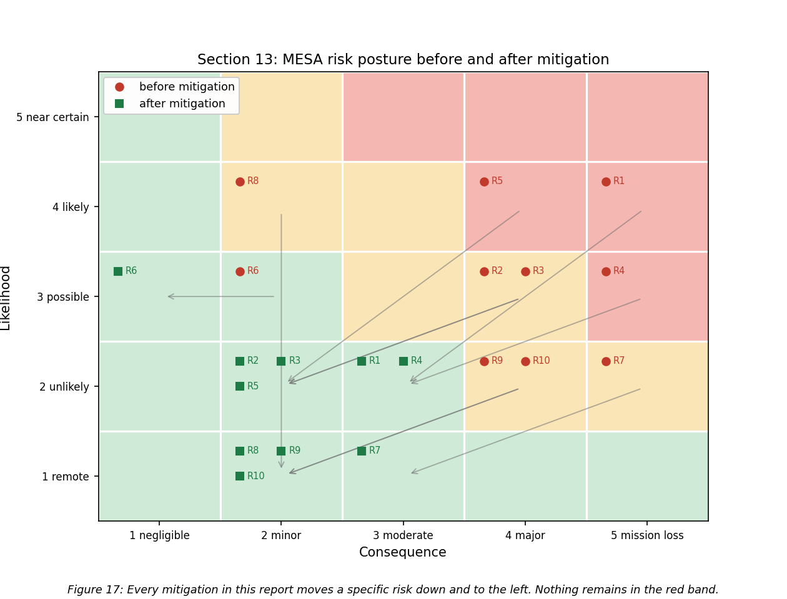

Two observations matter more than the individual scores. First, every mitigation in this report moves a specific risk down and to the left, and after mitigation nothing remains in the red band, with the highest residual scores belonging to R1 and R4, both of which are docking risks and both of which are managed operationally as well as in hardware. Second, R6 is the one risk whose likelihood does not move: a meteoroid will hit the arrays, and the design response is to make the consequence negligible rather than to pretend the event is avoidable. That distinction between reducing likelihood and reducing consequence is the honest way to present a risk posture.

### 13.4 The verification program this implies

Pulling the sections together, the design depends on four things being verified on the ground rather than discovered on orbit: the thermal-balance correlation of Section 8.3, the vacuum qualification of the capture mechanism and deployables from Section 6, the grounding-continuity and EMI verification implied by Section 9.2, and the radiation hardness assurance test program of Section 10.2. All four sit inside the $9M integration and test line of Table 8, and all four exist because MESA gets exactly one chance at each client.

---

## 14. Conclusions

MESA is a 2,000 kg geostationary servicing tug, and this report has carried it from the environment it must survive through to a design that closes against that environment with margin in every budget.

**The orbit is geostationary because the clients are there**, and the environmental trade that decision buys is favorable. GEO removes atmospheric drag, atomic oxygen, and the dense debris population, at the cost of worse spacecraft charging and worse energetic-particle radiation. Drag-decay timescales at GEO run to $10^5$ to $10^6$ years, five orders of magnitude beyond the requirement, and STK independently confirms no decay within a century. The vehicle is not fighting decay, it is fighting drift, at about 50 m/s per year.

**The thermal control system** is passive-dominant: MLI over the bus, 4.9 m² of OSR radiator on the anti-sun face, zoned heaters, and heat pipes to the dissipating boxes. The bus equilibrates at +36.3 °C in sun and -13.1 °C in eclipse, a steady-state swing of 49.4 K, and the transient simulation shows the bus itself moves only 3.9 K through a real eclipse while an outboard propellant line falls to -0.2 °C, below hydrazine's freezing point. That result is why the 260 W of heater power is zoned onto low-mass outboard hardware rather than spread across the bus.

**The plasma environment** floats the vehicle near -2.16 kV during substorms, where the real threat is differential charging into ESD rather than the absolute potential. The mitigations are conventional, comprising conductive bonded surfaces, ITO coatings, and single-point grounding, with one exception specific to this mission: because docking bonds two independently charged vehicles, MESA carries a plasma contactor and equalizes potential before mechanical contact rather than through the capture latch.

**The radiation environment** delivers roughly 25 krad(Si) over five years behind 100 mils of aluminum, which with the standard factor-of-two margin sets a 50 krad(Si) requirement and drives category R part selection at 100 krad(Si). That selection is insensitive to a factor-of-two error in the dose assumption, which is what makes it defensible at this stage. The array loses 11.9 percent to displacement damage, and that loss is what sizes the array at beginning of life.

**The ADACS** is set by solar radiation pressure, which contributes 93.5 percent of the $3.21\times10^{-5}$ N$\cdot$m worst-case disturbance torque, but the wheels are actually sized by slewing the mated stack, since capturing a 3,000 kg client raises $I_x$ by a factor of 5.3 and drives a 0.20 N$\cdot$m wheel requirement, giving four wheels inside a 157 kg, 283 W subsystem. Because SRP at GEO is secular rather than cyclic, momentum ramps at 2.77 N$\cdot$m$\cdot$s per day and must be dumped with thrusters roughly every eighteen days, since Earth's field at GEO is too weak for magnetorquers to be useful.

**Every budget closes.** Mass closes at 2,000 kg with 150 kg of margin. Power closes with 68 percent margin over peak load at end of life and a 38 kg battery sized on a 69.4 min equinox eclipse. Propellant closes at 165 kg consumed of 600 kg loaded, with the hydrazine tank as the binding sub-budget at about ten client servicing cycles against a baseline manifest of six. Cost closes at the $100M cap with $5M in reserve. One refinement to Milestone 2 belongs here: with electric propulsion at 1,600 s, propellant sizes the **servicing capacity** rather than the calendar life, and what bounds a five-year contract is wear-out of the wheels, the docking mechanism, and the battery. That shifts the risk from tankage to qualification testing, which is the better place for it.

**The unifying result is that docking, not free flight, drives this design.** The mated inertia sizes the wheels. The docking interface creates a charging failure mode that no conventional satellite has, and it is the highest residual risk on the register even after mitigation. The RPO sensors are what make contamination control and vacuum testing non-negotiable. The vehicle spends eighty percent of its life attached to something else, and every subsystem shows it.

That is also the argument for awarding this contract. A GEO servicer is not a communications satellite with an arm attached, and a design that treats it as one will size its wheels for the wrong inertia, ground its exterior for the wrong failure mode, and put its heaters in the wrong place. MESA is sized for the mission it actually flies, its budgets close with margin, its analysis is reproducible from a single script, and its central results have been checked against an independent tool.

---

## References

[1] "Space Logistics," Northrop Grumman, 6 Mar. 2023, https://www.northropgrumman.com/space/space-logistics-services/ [retrieved 10 July 2026].

[2] Vallado, D. A., *Fundamentals of Astrodynamics and Applications*, 4th ed., Microcosm Press, Hawthorne, CA, 2013, Chaps. 8 and 9 (perturbations and stationkeeping).

[3] Wertz, J. R., Everett, D. F., and Puschell, J. J. (eds.), *Space Mission Engineering: The New SMAD*, Microcosm Press, Hawthorne, CA, 2011, Chaps. 11 and 17 (spacecraft subsystem design, Tables 11.7 and 11.10; propulsion and power).

[4] "The Space Environment: Lessons 1 and 2," SPCE 5065 course lecture slides and video, University of Colorado Colorado Springs, 2026.

[5] Tribble, A. C., *The Space Environment: Implications for Spacecraft Design*, rev. ed., Princeton University Press, Princeton, NJ, 2003.

[6] "Mitigating In-Space Charging Effects: A Guideline," NASA-HDBK-4002A, National Aeronautics and Space Administration, Washington, DC, 2011.

[7] de Selding, P. B., "Intelsat's Wandering 'Zombiesat' Galaxy 15 Finally Recovered," *SpaceNews*, 23 Dec. 2010, https://spacenews.com/intelsats-wandering-zombiesat-galaxy-15-finally-recovered/ [retrieved 10 July 2026].

[8] Finckenor, M. M., and de Groh, K. K., "A Researcher's Guide to: International Space Station Space Environmental Effects," NP-2015-03-015-JSC, NASA ISS Program Science Office, 2020.

[9] "About Space Weather," NOAA Space Weather Prediction Center, https://www.swpc.noaa.gov/ [retrieved 10 July 2026].

[10] "Ionospheric Propagation Data and Prediction Methods Required for the Design of Satellite Networks and Systems," Recommendation ITU-R P.531, International Telecommunication Union, Geneva, 2022.

[11] "Standard Test Method for Total Mass Loss and Collected Volatile Condensable Materials from Outgassing in a Vacuum Environment," ASTM E595-15, ASTM International, West Conshohocken, PA, 2015.

[12] "General Environmental Verification Standard (GEVS) for GSFC Flight Programs and Projects," GSFC-STD-7000B, NASA Goddard Space Flight Center, Greenbelt, MD, 2021.

[13] "Vacuum Environment," SPCE 5065 Lesson 6 course lecture slides and video, University of Colorado Colorado Springs, 2026.

[14] Pisacane, V. L., *The Space Environment and Its Effects on Space Systems*, AIAA Education Series, Reston, VA, 2008, Chap. 9 (radiation interactions, Tables 9.1, 9.2, 9.6, 9.9), Chap. 11 (micrometeoroids and debris, Eqs. 11.27 to 11.31), and Chap. 12 (thermal control).

[15] "Plasma Environment," SPCE 5065 Lesson 4 course lecture slides and video, University of Colorado Colorado Springs, 2026.

[16] "Electrical Grounding Architecture for Unmanned Spacecraft," NASA-HDBK-4001, National Aeronautics and Space Administration, Washington, DC, 1998.

[17] "Radiation Environment," SPCE 5065 Lesson 7 course lecture slides and video, University of Colorado Colorado Springs, 2026.

[18] "Systems Tool Kit (STK)," Version 13.1.0 (2026 R1), Ansys, Inc., Canonsburg, PA, 2026.

[19] "Micrometeoroids and Orbital Debris," SPCE 5065 Lesson 12 course lecture slides and video, University of Colorado Colorado Springs, 2026.

---
