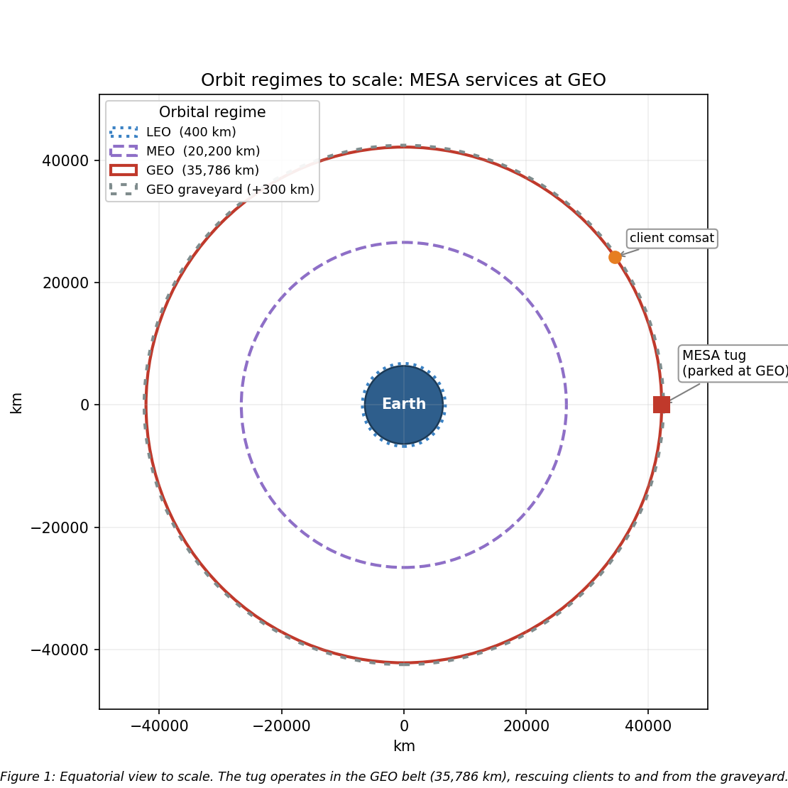
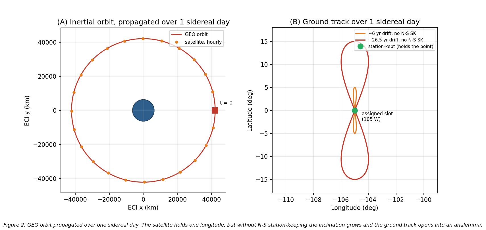
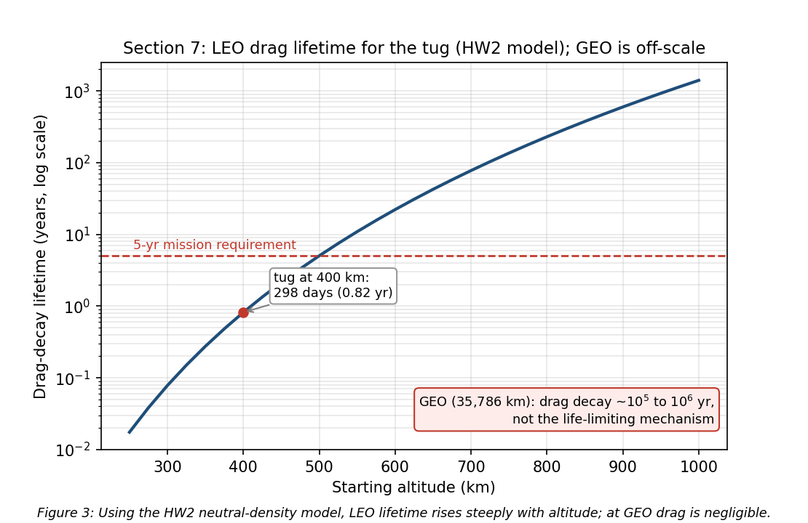

<!-- COVER PAGE -->

<!-- Navy top bar -->

<!-- UCCS Header - Gray Background -->

UNIVERSITY OF 
COLORADO 
COLORADO SPRINGS

College of Engineering and Applied Science

<!-- Title Section - White Background -->

<h1 style="font-size: 52pt; font-weight: bold; margin: 0; color: #00205B; font-family: Georgia, serif;">MESA</h1>

Mission Extension and Servicing Asset for GEO

<!-- Concept Image - Full Width, overlaps into sections -->

<!-- Footer Info -->

SPCE 5065: Space Environment Interactions, Design Project Milestone 1

Jordan Clayton

July 10, 2026

## Table of Contents

- Nomenclature
- Introduction
- 1. Satellite System Name and Mission Objectives
- 2. Sun-Earth System and Risks to Satellite Operations (GEO and LEO)
- 3. Space Weather: Overview, Monitoring, and Downlink Impact
- 4. Vacuum Testing Advisability
- 5. Orbit Selection
- 6. Visual Orbit Simulation
- 7. Orbital Lifetime Without Stationkeeping
- 8. Conclusions
- References

## Nomenclature

| Symbol / Acronym | Meaning |
|:---|:---|
| ADCS | Attitude Determination and Control System |
| AO | Atomic oxygen |
| CME | Coronal mass ejection |
| $C_D$ | Drag coefficient |
| ECLSS | Environmental Control and Life Support System |
| ESD | Electrostatic discharge |
| EUV | Extreme ultraviolet |
| GCR | Galactic cosmic ray |
| GEO | Geostationary Earth orbit (~35,786 km altitude) |
| LEO | Low Earth orbit |
| MEO | Medium Earth orbit |
| MESA | Mission Extension and Servicing Asset (this system) |
| MEV | Mission Extension Vehicle (Northrop Grumman) |
| RPO | Rendezvous and proximity operations |
| SAA | South Atlantic Anomaly |
| SEP / SPE | Solar energetic particle / solar proton event |
| SK | Stationkeeping |
| SRP | Solar radiation pressure |
| SWPC | (NOAA) Space Weather Prediction Center |
| TID | Total ionizing dose |
| TVAC | Thermal-vacuum (testing) |
| $a$ | Semi-major axis |
| $e$ | Eccentricity |
| $i$ | Inclination |
| $\mu$ | Earth gravitational parameter, $3.986\times10^{5}$ km³/s² |
| $\rho$ | Atmospheric (neutral) density |

---

## Introduction

This report is Milestone 1 of the SPCE 5065 design project. It defines a satellite servicing mission, analyzes the space environment the vehicle will face, and uses that analysis to select an orbit and estimate the vehicle's natural orbital lifetime. The mission is a Space Tug and Repair Servicing Satellite, named MESA, patterned on Northrop Grumman's Mission Extension Vehicle heritage [1].

The report analyzes the Sun-Earth hazards at two orbits (Section 2), space weather and its downlink impact (Section 3), and the case for vacuum testing (Section 4), then selects the orbit, simulates it, and estimates its lifetime (Sections 5 through 7). The central finding is that MESA belongs at GEO with its clients, its dominant hazards are charging and radiation rather than drag, and its operational life is set by stationkeeping propellant, not orbital decay. Milestone 2 carries these conclusions into subsystem design.

---

## 1. Satellite System Name and Mission Objectives

**System name and rationale.** The system is named **MESA (Mission Extension and Servicing Asset)**. The name is a deliberate nod to its heritage: the expansion mirrors Northrop Grumman's Mission Extension Vehicle, the proven precedent this design follows, while broadening the scope from a single life-extension client to a reusable servicing asset that also refuels, repairs, and relocates. As a word, a mesa is a high, flat-topped highland that commands a view of the surrounding plain: a fitting image for a vehicle that operates from GEO, the highest common regime, holding a stable perch above the LEO and MEO traffic with persistent overwatch of its clients. The name carries a second, more personal resonance as well: like the Mesa Boogie amplifiers it shares its name with, MESA is fundamentally about headroom, restoring the propellant and service-life margin its clients need to keep operating well past their planned retirement. MESA is a GEO servicing vehicle in the ~2,000 kg class, patterned on Northrop Grumman's Mission Extension Vehicle: MEV-1 launched October 2019 and docked Intelsat 901 in February 2020, taking over that client's stationkeeping [1].

**Customer.** The primary customer is the U.S. Space Force / Space Systems Command, which operates high-value national-security assets in the GEO belt. A secondary commercial customer base is the GEO communications operators (Intelsat, SES), whose satellites typically run out of stationkeeping fuel long before their payloads wear out.

**Primary objectives.**
1. **Rendezvous and dock** with a cooperative GEO client satellite.
2. **Provide attitude control and stationkeeping** for a client whose own propulsion is depleted or degraded, acting as a bolt-on propulsion and ADCS module and extending the client's operational life.
3. **Transfer propellant** to refuelable clients.
4. **Tow** defunct or low-fuel satellites between the operational GEO belt and the graveyard orbit (~300 km above GEO) for refuel or repair, and return them to a working slot.

**Secondary objectives.**
1. **Relocation service:** reposition healthy clients to new longitude slots on operator request.
2. **Debris mitigation:** perform end-of-life disposal boosts of clients to the graveyard, freeing operational slots.
3. **Inspection:** use the rendezvous sensors to image and diagnose a client's exterior before servicing.

The overall constraints are a servicer life of at least 5 years, servicing multiple clients in sequence, within a $100M budget. These objectives drive the derived requirements carried into the environment analysis: precision RPO sensors (cameras and LIDAR), a docking mechanism and robotic arm, generous stationkeeping propellant, and avionics hardened against the charging and radiation environment. 

---

## 2. Sun-Earth System and Risks to Satellite Operations (GEO and LEO)

The Sun-Earth system is a coupled environment: the Sun emits radiation and plasma, Earth's magnetic field deflects and traps the charged component, and what reaches a satellite depends strongly on its orbit. I analyzed **GEO** and **LEO** .

### 2.1 Solar Emissions (quantified)

The Sun drives the environment through four channels [2], [3]:
- **Electromagnetic radiation (photons):** the solar constant is about 1,361 W/m² at 1 AU [3], spanning X-ray and extreme-ultraviolet (EUV) through visible to infrared. The EUV/X-ray end heats and ionizes the upper atmosphere.
- **Solar wind (charged particles):** a continuous plasma of protons and electrons at ~400 to 800 km/s and ~5 to 10 particles/cm³ [3], which pressurizes and shapes the magnetosphere.
- **Solar flares:** sudden X-ray bursts classed A/B/C/M/X; M- and X-class flares cause sudden ionospheric disturbances and radio blackouts within minutes.
- **CMEs and SEPs (energetic particles and radiation):** coronal mass ejections hurl billions of tons of magnetized plasma that drive geomagnetic storms, and solar energetic particle events accelerate protons to tens or hundreds of MeV [3], arriving minutes to hours later as a penetrating radiation hazard on top of the always-present galactic cosmic ray background.

### 2.2 Earth's Magnetic Field and the Radiation Belts

Earth's magnetic field is roughly dipolar, ~30 µT at the equator to ~60 µT at the poles [2]. It carves out the magnetosphere, deflecting most of the solar wind, and traps charged particles in the Van Allen belts: an inner proton belt (~1,000 to 6,000 km) and an outer MeV-electron belt (~13,000 to 60,000 km). This drives the orbit tradeoff below: LEO sits mostly beneath the belts inside the protective field, while GEO (35,786 km) sits in the outer electron belt near the magnetosphere's edge, where strong CMEs can push the magnetopause inside GEO and expose satellites to shocked solar wind [3].

### 2.3 Risks at GEO

- **Surface charging (the leading GEO anomaly cause):** GEO sits in the hot plasma sheet; during substorms keV electrons charge surfaces to kilovolt potentials, and differential charging drives **electrostatic discharge (ESD)** into electronics [2], [4]. Galaxy 15 is the canonical case: an ESD tied to disturbed space weather in 2010 latched its command unit, leaving it a powered but uncommandable "zombiesat" for eight months [5].
- **Deep-dielectric (internal) charging:** MeV "killer electrons" from the outer belt penetrate the structure, charge internal dielectrics, and discharge into buried circuits [4].
- **Energetic-particle radiation:** direct SEP protons plus trapped electrons, with little shielding, so total ionizing dose (TID) accumulates over 5+ years and single-event upsets and latch-ups come from SEP and GCR [3].
- **Solar radiation pressure (SRP):** photon momentum (~4.5 µN/m² at 1 AU) is negligible for drag but, on MESA's large arrays, is a real orbital perturbation (an eccentricity oscillation, Section 7) and an attitude torque.
- **Thermal and UV:** eclipse seasons at the equinoxes drive deep thermal cycling, and solar UV degrades optical coatings and thermal-control surfaces [3].
- **Communication interference:** charging upsets and ionospheric effects degrade the downlink (Section 3).

For MESA the charging risk is doubled: an ESD during docking could damage the tug *and* the client.

### 2.4 Risks at LEO

- **South Atlantic Anomaly (SAA):** the inner proton belt dips to LEO altitudes here, spiking dose and upset rates on each pass [3], [6].
- **Atmospheric drag coupled to solar activity:** EUV/X-ray heating expands the thermosphere, so at solar maximum density rises and drag increases, shortening lifetime [2], [3] (analyzed in Section 7).
- **Atomic oxygen (AO):** solar UV dissociates O₂, and the resulting ~5 eV atomic oxygen erodes polymers such as Kapton on ram surfaces at ~10²⁰ to 10²¹ atoms/cm² per year near 400 km [6].
- **SEP polar access and auroral charging** on high-inclination orbits, where open field lines admit solar protons [3].
- **Earth-observation impact:** solar activity perturbs density (orbit and pointing), scintillation degrades GPS and downlinks, and SEP events add detector and star-tracker noise that speckles imagery.

**Table 1:** GEO vs LEO environmental hazards for the servicing mission.

| Hazard | GEO | LEO |
|:---|:---|:---|
| Surface / deep-dielectric charging and ESD | Severe (plasma sheet, killer electrons) | Milder, mainly auroral |
| Van Allen belt / energetic-particle dose | High (in the outer belt, little shielding) | Lower, spikes in the SAA and at poles |
| Atmospheric drag | Negligible | Dominant below ~600 km |
| Atomic oxygen erosion | None | Significant on ram surfaces |
| Solar radiation pressure | Meaningful perturbation on large arrays | Negligible vs drag |
| Debris flux | Low | High |
| Thermal cycling | Deep at eclipse seasons | ~16 cycles/day |

---

## 3. Space Weather: Overview, Monitoring, and Downlink Impact

**What it is.** Space weather is the set of conditions on the Sun and in the solar wind, magnetosphere, ionosphere, and thermosphere that can affect space- and ground-based technology and endanger operations [7].

**Monitoring and research.** The U.S. operational center is NOAA's Space Weather Prediction Center (SWPC) [7], fed by GOES at GEO (X-ray flare flux, particle detectors, magnetometers); DSCOVR and NASA's ACE at the L1 point ~1.5 million km sunward, giving ~15 to 60 minutes of warning as a CME shock arrives; SDO and SOHO imaging the Sun; and ground networks (magnetometers for the Kp and Dst indices, neutron monitors, ionosondes) [7].

**Why the customer wants it.** MESA docks next to a live client, so a charging event during proximity operations risks ESD damage to both vehicles; forecasts let operators hold docking during disturbed conditions [2], [4]. An SEP warning lets the tug safe its avionics or delay a burn, and nowcasts feed drift and downlink-reliability planning.

**Downlink impacts (GEO to ground).** MESA's telemetry, tracking, and command link from a fixed GEO longitude to a fixed ground station is geometrically simple, but space weather still degrades it [8]:
- **Ionospheric scintillation:** the slant path crosses the ionosphere, and disturbed conditions cause amplitude and phase fading, worst at equatorial and auroral latitudes and at lower frequencies.
- **Solar RF interference (sun outage):** twice a year near the equinoxes the Sun passes directly behind the GEO satellite as seen from the ground station, and solar radio noise raises the receiver noise temperature enough to black out the link for several minutes a day across several days. Solar radio bursts add sporadic interference.
- **Total-electron-content effects:** changing ionospheric TEC rotates the signal polarization (Faraday rotation) and adds group delay.
- **Source-side upsets:** a charging- or SEP-induced upset on the satellite transmitter can interrupt the downlink at the source [4].

The GEO downlink is robust in normal conditions but must be scheduled around predictable sun outages and monitored during storms, which is exactly why the customer wants an SWPC feed.

---

## 4. Vacuum Testing Advisability

The customer wants to drop vacuum testing to cut cost. For a GEO servicing tug whose optical RPO sensors and docking mechanisms *are* the mission, that is a false economy, and **I recommend a full thermal-vacuum and thermal-balance test campaign with a pre-ship bakeout.** The case:

- **Outgassing and molecular contamination.** In vacuum, adsorbed water, solvents, and plasticizers evaporate and redeposit on cold surfaces (optics, radiators, solar cells, sensors); materials are screened to ASTM E595 limits of total mass loss below 1.0% and collected volatile condensable material below 0.10% [9]. On MESA a film on the docking cameras or LIDAR blurs the sensors the mission depends on, and deposits on radiators and cells cut thermal and power performance by several percent [3], [9]. A pre-flight bakeout drives the volatiles off.
- **Thermal-vacuum (TVAC) cycling.** Space rejects heat only by radiation, and GEO eclipse seasons swing components from full sun to shadow. TVAC verifies the thermal design and workmanship (solder joints, connectors, bondlines) across the flight range plus margin and screens infant-mortality defects [10].
- **Cold welding and mechanism survivability.** Bare metal contacts can cold-weld in vacuum, and liquid lubricants evaporate. MESA's docking mechanism, robotic arm, and deployables must be qualified in vacuum with space-rated dry lubricants and materials [3].
- **Multipaction and corona.** High-power RF components in the communications chain can suffer multipaction discharge in vacuum and must be tested for it [3].

**Cost argument (quantified).** Skipping TVAC to save a small fraction of a $100M program risks the entire asset *plus* the client it is servicing. MESA cannot repair itself on orbit, so an undetected workmanship or contamination failure is mission-ending: one hazed docking sensor could abort every rendezvous, and a few percent of lost array or radiator performance compounds over a 5-year life. Vacuum testing is cheap insurance against a total loss. (The calculus only flips for a low-cost, high-quantity CubeSat build where a unit is expendable; MESA is the opposite.)

---

## 5. Orbit Selection

**Chosen orbit: geostationary (GEO).** The orbital elements are given in Eq. (1):

$$\boxed{a = 42{,}164\ \text{km (altitude } 35{,}786\ \text{km)}, \quad e \approx 0\ \text{(circular)}, \quad i = 0^\circ\ \text{(equatorial, stationkept)}}\tag{1}$$

The orbit is circular so the tug holds a constant altitude and speed relative to its clients, and equatorial (0° inclination, maintained by stationkeeping) so it remains fixed over one longitude. The scale and geometry are shown in **Figure 1**.

**Rationale, from the analysis above.**
- **The clients live at GEO.** Defunct and low-fuel comsats, national-security assets, and the graveyard (~300 km above GEO) are all in the belt, so MESA must operate there to rendezvous, dock, refuel, and tow them [1].
- **Operational fit.** A geostationary orbit fixes the longitude, giving continuous line-of-sight to a fixed ground station (simple TT&C) and access to the dense, high-value GEO customer base.
- **Hazard tradeoff (Sections 2 to 4).** GEO trades away LEO's drag, atomic oxygen, and debris (Table 1) for worse charging and energetic-particle radiation, which are well understood and mitigable (grounding and ESD control, shielding, rad-hard parts, space-weather-aware ops). Over a 5+ year multi-client mission, eliminating drag decay and AO is decisive.
- **Why not LEO or MEO.** LEO fails because the clients are not there, drag would demand constant stationkeeping (Section 7: a LEO tug at 400 km decays in under a year), and AO and debris are worse. MEO sits deep in the Van Allen belts, the worst radiation of the three, with no client base.
- **Budget and duration.** GEO insertion is expensive, but one tug amortized across many clients fits the $100M and 5-year envelope; the mission is inherently GEO.

---

## 6. Visual Orbit Simulation

**Figure 2** simulates the MESA orbit, propagated numerically over one sidereal day (the GEO period). Panel A is the inertial view, with the satellite stepped hourly to show one revolution per sidereal day; Panel B is the resulting ground track. A stationkept satellite holds a single point over its assigned longitude (105 W here). Without north-south stationkeeping, as luni-solar gravity grows the inclination (Section 7), the ground track opens into the classic figure-eight analemma, reaching roughly ±5° of latitude after a few years and ±15° after about 26.5 years, which is why a GEO servicer must budget stationkeeping propellant to hold its slot.

---

## 7. Orbital Lifetime Without Stationkeeping

**Direct answer: at GEO, atmospheric drag is not the life-limiting mechanism.** Using the HW2 neutral-density model ($\rho = 1.020\times10^{7}\,h^{-7.172}$ kg/m³, $h$ in km) with a standard GEO density of ~$10^{-15}$ kg/m³, the characteristic drag-decay timescale at GEO is on the order of $10^{5}$ to $10^{6}$ years, roughly five orders of magnitude beyond the 5-year requirement (**Figure 3**).

The governing relation is the circular-orbit drag-decay rate, Eq. (2), integrated as $t = \int \mathrm{d}a / |\dot{a}|$ from the starting altitude down to a 150 km reentry:

$$\dot{a} = -\rho\,\frac{C_D A}{m}\,\sqrt{\mu a}\tag{2}$$

To demonstrate the tool on a case where drag actually matters, I applied Eq. (2) to this vehicle in LEO. Taking a representative wet mass of 2,000 kg, ram area 15 m², and $C_D = 2.2$ (so $C_D A/m = 0.0165$ m²/kg), the decay time from a given altitude down to 150 km is:

**Table 2:** LEO drag-decay "what-if" for the MESA ballistic coefficient (HW2 model).

| Starting altitude | Decay time to 150 km |
|:---|---:|
| 300 km | 28.5 days (0.08 yr) |
| 400 km | 298 days (0.82 yr) |
| 500 km | 1,836 days (5.03 yr) |
| 600 km | 22.2 yr |

A LEO tug would have to start above ~500 km just to reach the 5-year line, which is one more reason LEO is untenable for this mission and GEO is not drag-limited. These LEO figures are point estimates at a single density profile; because thermospheric density swells at solar maximum, the actual lifetime at a given altitude can shift by a factor of ~2 to 3 over a solar cycle [2], [3], so the 400 km ≈ 0.8 yr value should be read as an order-of-magnitude result.

**What actually evolves at GEO.** Without stationkeeping the satellite does not deorbit; it drifts out of its slot. Luni-solar gravity grows the inclination at ~0.75 to 0.95 °/yr (toward ~15° over ~26.5 years, the Figure 2 analemma), triaxiality drifts the longitude toward the stable points near 75°E and 105°W, and SRP drives a small eccentricity oscillation [11], [12]. Holding the slot costs ~45 to 55 m/s/yr north-south (the dominant term) plus ~2 to 4 m/s/yr east-west [11], [12].

The result is summarized in Eq. (3):

$$\boxed{\text{Drag lifetime} \gg 5\ \text{yr (effectively unlimited); the real driver is }\sim 50\ \text{m/s/yr N-S stationkeeping.}}\tag{3}$$

**Assumptions:** representative tug mass and area, the HW2 density fit for the LEO contrast, a standard GEO density ~$10^{-15}$ kg/m³, and standard luni-solar/triaxiality rates [11], [12]. So MESA's life is set by propellant, not decay: ~250 m/s over 5 years just to hold station, on top of the servicing propellant.

---

## 8. Conclusions

I selected GEO for MESA (circular, equatorial, 35,786 km altitude) because the servicing clients (defunct and low-fuel comsats, national-security assets, and the graveyard population) live there; the mission is inherently geostationary.

The main GEO hazards are surface and deep-dielectric charging with ESD (the leading anomaly cause, per Galaxy 15) and direct energetic-particle radiation over 5+ years, plus eclipse thermal cycling and solar-radiation-pressure torque on the large arrays; LEO's drag, atomic oxygen, and debris are avoided. Space weather matters mainly for scheduling docking around charging and SEP events and managing the downlink around sun outages, and vacuum testing is essential because contamination on the RPO optics or a cold-welded mechanism would be mission-ending for a vehicle with no self-repair. Drag is not the lifetime limiter at GEO (decay ~$10^{5}$ to $10^{6}$ years); the real driver is ~50 m/s/yr north-south stationkeeping, which sizes the propellant budget.

**Implications for Milestone 2.** GEO servicing is charging- and radiation-limited, not drag-limited, so the design investment goes into ESD and charging control, radiation-hardened and shielded avionics, space-weather-aware operations, TVAC-qualified optics and mechanisms, and a stationkeeping propellant budget carried separately from the servicing propellant.

---

## References

[1] "Space Logistics," Northrop Grumman, 6 Mar. 2023, https://www.northropgrumman.com/space/space-logistics-services/ [retrieved 10 July 2026].

[2] George, L., "The Space Environment: Lessons 1 and 2," SPCE 5065 lecture videos and slides, University of Colorado Colorado Springs, 2026.

[3] Tribble, A. C., *The Space Environment: Implications for Spacecraft Design*, rev. ed., Princeton University Press, Princeton, NJ, 2003.

[4] "Mitigating In-Space Charging Effects: A Guideline," NASA-HDBK-4002A, National Aeronautics and Space Administration, Washington, DC, 2011.

[5] de Selding, P. B., "Intelsat's Wandering 'Zombiesat' Galaxy 15 Finally Recovered," *SpaceNews*, 23 Dec. 2010, https://spacenews.com/intelsats-wandering-zombiesat-galaxy-15-finally-recovered/ [retrieved 10 July 2026].

[6] Finckenor, M. M., and de Groh, K. K., "A Researcher's Guide to: International Space Station Space Environmental Effects," NP-2015-03-015-JSC, NASA ISS Program Science Office, 2020.

[7] "About Space Weather," NOAA Space Weather Prediction Center, https://www.swpc.noaa.gov/ [retrieved 10 July 2026].

[8] "Ionospheric Propagation Data and Prediction Methods Required for the Design of Satellite Networks and Systems," Recommendation ITU-R P.531, International Telecommunication Union, Geneva, 2022.

[9] "Standard Test Method for Total Mass Loss and Collected Volatile Condensable Materials from Outgassing in a Vacuum Environment," ASTM E595-15, ASTM International, West Conshohocken, PA, 2015.

[10] "General Environmental Verification Standard (GEVS) for GSFC Flight Programs and Projects," GSFC-STD-7000B, NASA Goddard Space Flight Center, Greenbelt, MD, 2021.

[11] Vallado, D. A., *Fundamentals of Astrodynamics and Applications*, 4th ed., Microcosm Press, Hawthorne, CA, 2013, Chaps. 8 and 9 (perturbations and stationkeeping).

[12] Wertz, J. R., Everett, D. F., and Puschell, J. J. (eds.), *Space Mission Engineering: The New SMAD*, Microcosm Press, Hawthorne, CA, 2011.

---

