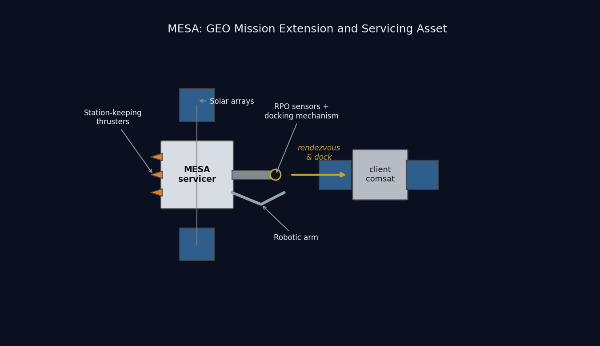
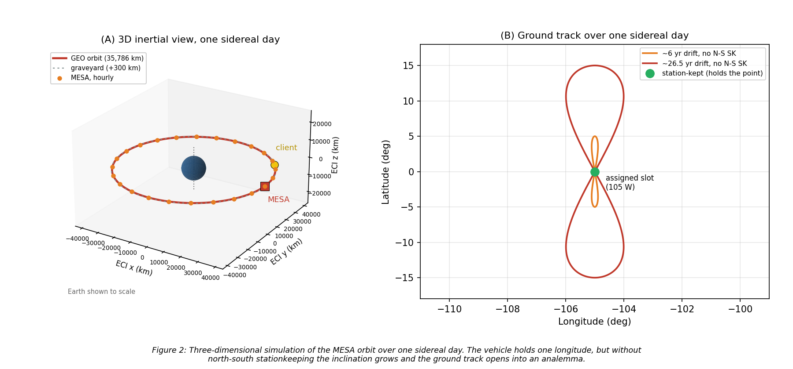
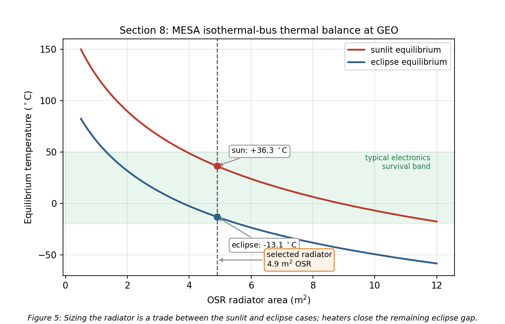
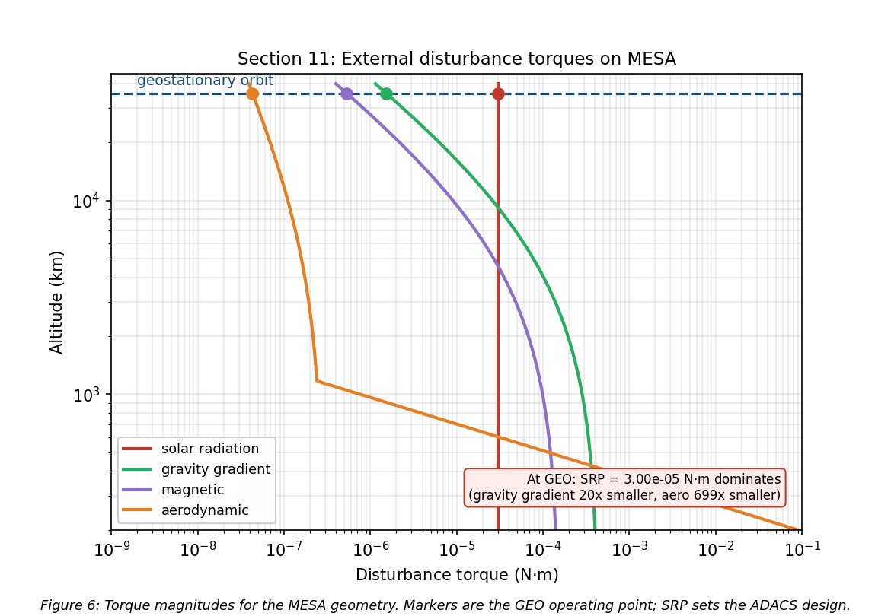
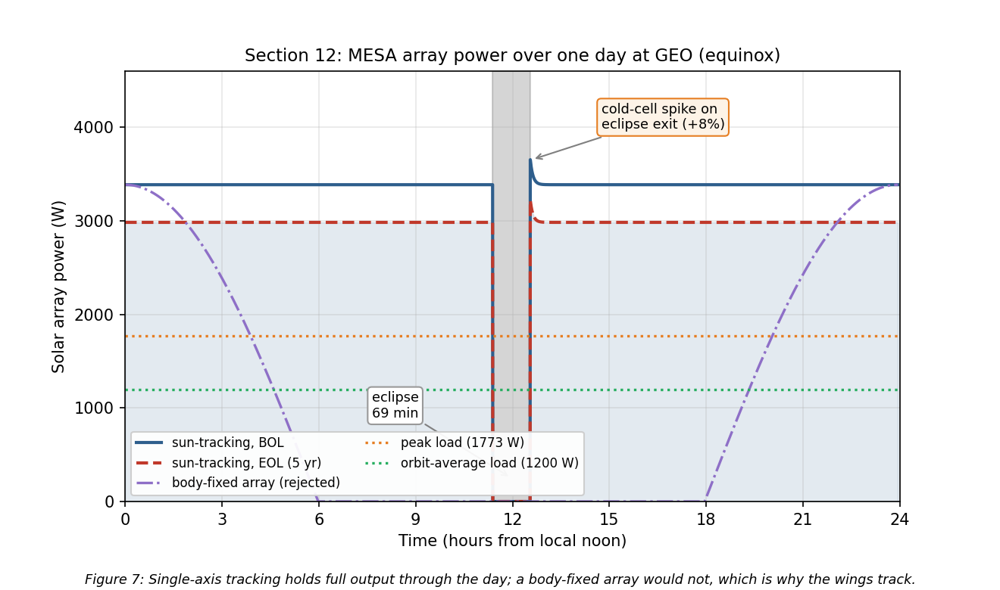
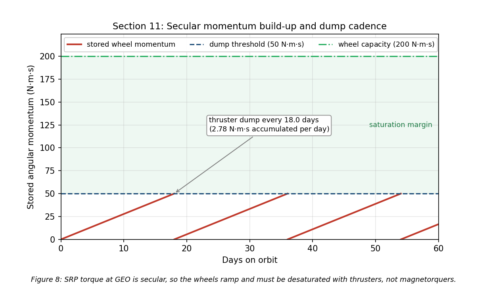

<style>
p, li { text-align: justify; text-justify: inter-word; }
.page-break { page-break-after: always; break-after: page; }
</style>

<!-- COVER PAGE -->

<div style="font-family: Georgia, 'Times New Roman', serif; height: 100%; display: flex; flex-direction: column; margin: 0; padding: 0;">

<!-- Navy top bar -->
<div style="background-color: #00205B; height: 6px; width: 100%;"></div>

<!-- UCCS Header - Gray Background -->
<div style="background-color: #e8e8e8; display: flex; justify-content: center; align-items: center; padding: 15px 40px;">
<div style="display: flex; align-items: center; gap: 15px;">
<div style="text-align: left; font-size: 10pt; color: #00205B; line-height: 1.3; font-family: Arial, sans-serif;">
<span style="font-weight: normal; letter-spacing: 1px;">UNIVERSITY OF</span><br>
<span style="font-weight: bold; font-size: 12pt; letter-spacing: 1px;">COLORADO</span><br>
<span style="font-weight: normal; font-size: 9pt; letter-spacing: 2px;">COLORADO SPRINGS</span>
</div>
<div style="border-left: 1px solid #666; height: 45px;"></div>
<div style="text-align: left; font-size: 11pt; color: #333; font-family: Georgia, serif;">
College of Engineering<br>and Applied Science
</div>
</div>
</div>

<!-- Title Section - White Background -->
<div style="text-align: center; padding: 40px 40px 20px 40px; background-color: white;">
<h1 style="font-size: 52pt; font-weight: bold; margin: 0; color: #00205B; font-family: Georgia, serif;">MESA</h1>
<p style="font-size: 13pt; margin: 15px 0 0 0; color: #333; font-family: Georgia, serif;">Mission Extension and Servicing Asset for GEO</p>
</div>

<!-- Concept Image - Full Width, overlaps into sections -->
<div style="flex-grow: 1; text-align: center; margin-top: -10px;" markdown="1">



</div>

<!-- Footer Info -->
<div style="text-align: center; padding: 35px 40px; color: #00205B;">
<p style="font-size: 13pt; font-weight: bold; margin: 0 0 8px 0;">SPCE 5065: Space Environment Interactions, Design Project Milestone 2</p>
<p style="font-size: 12pt; margin: 4px 0; font-weight: normal;">Jordan Clayton</p>
<p style="font-size: 12pt; margin: 4px 0; font-weight: normal;">August 2, 2026</p>
</div>

</div>

<div class="page-break"></div>

```{=openxml}
<w:p><w:pPr><w:pStyle w:val="Heading1"/></w:pPr><w:r><w:t>Table of Contents</w:t></w:r></w:p>
<w:p><w:r><w:fldChar w:fldCharType="begin" w:dirty="true"/></w:r><w:r><w:instrText xml:space="preserve"> TOC \o "1-2" \h \z \u </w:instrText></w:r><w:r><w:fldChar w:fldCharType="separate"/></w:r><w:r><w:t>Right-click this line and choose Update Field to build the table of contents.</w:t></w:r><w:r><w:fldChar w:fldCharType="end"/></w:r></w:p>
<w:p><w:r><w:br w:type="page"/></w:r></w:p>
```

```{=html}
<h2>Table of Contents</h2>
<ol>
<li><a href="#nomenclature">Nomenclature</a></li>
<li><a href="#introduction">Introduction</a></li>
<li><a href="#revision-log-corrections-to-milestone-1">Revision Log: Corrections to Milestone 1</a></li>
<li><a href="#1-satellite-system-name-and-mission-objectives">Satellite System Name and Mission Objectives</a></li>
<li><a href="#2-sun-earth-system-and-risks-to-satellite-operations-geo-and-leo">Sun-Earth System and Risks to Satellite Operations</a></li>
<li><a href="#3-space-weather-overview-monitoring-and-downlink-impact">Space Weather: Overview, Monitoring, and Downlink Impact</a></li>
<li><a href="#4-vacuum-testing-advisability">Vacuum Testing Advisability</a></li>
<li><a href="#5-orbit-selection">Orbit Selection</a></li>
<li><a href="#6-visual-orbit-simulation">Visual Orbit Simulation</a></li>
<li><a href="#7-orbital-lifetime-without-stationkeeping">Orbital Lifetime Without Stationkeeping</a></li>
<li><a href="#8-vehicle-definition-and-thermal-control-system">Vehicle Definition and Thermal Control System</a></li>
<li><a href="#9-plasma-environment-risks-mitigations-and-subsystem-impact">Plasma Environment</a></li>
<li><a href="#10-radiation-environment-risks-mitigations-and-subsystem-impact">Radiation Environment</a></li>
<li><a href="#11-attitude-determination-and-control-adacs">Attitude Determination and Control (ADACS)</a></li>
<li><a href="#12-simulations-power-torque-and-mission-life">Simulations: Power, Torque, and Mission Life</a></li>
<li><a href="#13-conclusions">Conclusions</a></li>
<li><a href="#references">References</a></li>
</ol>
```

<div class="page-break"></div>

## Nomenclature

| Symbol / Acronym | Meaning |
|:---|:---|
| ADACS | Attitude Determination and Control System |
| AO | Atomic oxygen |
| CME | Coronal mass ejection |
| $C_D$ | Drag coefficient |
| EDAC | Error detection and correction |
| ESD | Electrostatic discharge |
| EUV | Extreme ultraviolet |
| GCR | Galactic cosmic ray |
| GEO | Geostationary Earth orbit (~35,786 km altitude) |
| ITO | Indium tin oxide (transparent conductive coating) |
| LEO | Low Earth orbit |
| MEO | Medium Earth orbit |
| MESA | Mission Extension and Servicing Asset (this system) |
| MEV | Mission Extension Vehicle (Northrop Grumman) |
| MLI | Multi-layer insulation |
| OSR | Optical solar reflector |
| RHA | Radiation hardness assurance |
| RPO | Rendezvous and proximity operations |
| SAA | South Atlantic Anomaly |
| SEU / SEL / SEGR | Single-event upset / latch-up / gate rupture |
| SEP / SPE | Solar energetic particle / solar proton event |
| SRP | Solar radiation pressure |
| SWPC | (NOAA) Space Weather Prediction Center |
| TID | Total ionizing dose |
| TVAC | Thermal-vacuum (testing) |
| $a$ | Semi-major axis |
| $A_s$ | Illuminated surface area |
| $c_{ps}$, $c_m$ | Center of solar pressure, center of mass |
| $D$ | Residual magnetic dipole, A$\cdot$m² |
| $e$ | Eccentricity |
| $F_s$ | Solar constant, 1,361 W/m² |
| $H$ | Stored angular momentum, N$\cdot$m$\cdot$s |
| $i$ | Inclination |
| $I_x, I_y, I_z$ | Principal moments of inertia |
| $q$ | Surface reflectance factor |
| $\alpha$, $\varepsilon$ | Solar absorptivity, infrared emissivity |
| $\mu$ | Earth gravitational parameter, $3.986\times10^{14}$ m³/s² |
| $\rho$ | Atmospheric (neutral) density |
| $\sigma$ | Stefan-Boltzmann constant, $5.670\times10^{-8}$ W/m²K⁴ |

---

## Introduction

This report is Milestone 2 of the SPCE 5065 design project, written in cumulative form. Sections 1 through 7 carry forward the Milestone 1 analysis with the corrections listed in the Revision Log, and Sections 8 through 12 add the subsystem design work.

The mission is a Space Tug and Repair Servicing Satellite named MESA, a roughly 2,000 kg geostationary servicing vehicle patterned on Northrop Grumman's Mission Extension Vehicle heritage [1]. Milestone 1 established what environment the vehicle flies in and concluded that MESA belongs at GEO with its clients, that its dominant hazards are charging and radiation rather than drag, and that its operational life is set by stationkeeping propellant rather than orbital decay.

Milestone 2 turns those conclusions into hardware. Section 8 defines the vehicle geometry that the rest of the design needs and sizes the thermal control system, including the sunlit and eclipse equilibrium temperatures. Sections 9 and 10 work the plasma and radiation environments in turn: what each does to this vehicle, what I am doing about it, and what those fixes cost the other subsystems. Section 11 estimates the four external disturbance torques and sizes the ADACS actuators and sensors from them. Section 12 presents the supporting simulations and closes out the mission life estimate. The through-line is that a GEO servicer is charging- and radiation-limited rather than drag-limited, and that docking, not free flight, sizes the attitude control hardware.

---

## Revision Log: Corrections to Milestone 1

Milestone 1 scored ninety-two out of one hundred. The changes below address every deduction and margin comment, and they are incorporated into Sections 1 through 7 rather than listed separately.

**1. Visual simulation now uses a three-dimensional view (Section 6, was three out of five).** The Milestone 1 simulation was a two-dimensional inertial plot with a ground track, and the returned comment asked whether a 3D source was available. Figure 2 is now a three-dimensional inertial rendering of the GEO orbit around a shaded, to-scale Earth, showing the hourly satellite positions, the graveyard orbit, and the MESA and client geometry, with the ground track retained alongside it.

**2. Risk discussions rewritten in paragraph form (Section 2, was nine out of ten).** The returned comment on Section 2.3 asked for paragraph form rather than bulleted lists. Sections 2.3 and 2.4 are now prose, and I applied the same treatment to the new risk and mitigation discussions in Sections 9 and 10. Bulleted lists are retained only where the content is a genuine enumeration, such as the mission objectives in Section 1, which scored full marks.

**3. Space weather monitoring expanded (Section 3, was thirteen out of fifteen).** The returned comment asked for more description of the monitoring and research effort. Section 3 now covers what each asset actually measures, the warning time each provides, the specific indices derived from the ground networks, and the research models that turn those measurements into forecasts.

**4. Table of contents rebuilt with page numbers and hyperlinks (grammar, was seven out of ten).** The Milestone 1 table of contents was a plain bulleted list. It is now a field-driven table of contents that carries both page numbers and clickable hyperlinks to each section.

**5. Numbers of ten or below are spelled out (grammar).** Milestone 1 wrote constructions such as "at least 5 years" in running text. Bare counts and durations of ten or below are now spelled out throughout, while measured quantities carrying a unit, table entries, and section, figure, and reference numbers stay in numerals.

**6. Transitions added between sections (grammar).** Each section now opens by connecting to the result that precedes it, so the report reads as a continuous argument rather than a set of independent answers.

**7. Course material citations no longer name an individual author.** The Milestone 1 reference list credited the lecture material to a person. All course-material references now cite the lesson and the course.

**8. "ADCS" standardized to "ADACS."** Milestone 1 used ADCS in the nomenclature and in Section 1. The assignment and the rest of this report use ADACS, so the acronym is now consistent.

**9. The vehicle was never dimensioned.** Milestone 1 fixed only the wet mass (2,000 kg) and a ram area (15 m²) used for the LEO drag contrast. Thermal control, disturbance torques, and array sizing all need real geometry, so Section 8 now defines a full configuration and every later section draws its inputs from that one table. The 15 m² Milestone 1 value was a drag reference area for the LEO case and is superseded for disturbance-torque work by the 16.54 m² illuminated area derived in Section 8.

**10. Solar radiation pressure was under-quantified.** Milestone 1 Section 2.3 called SRP "a real orbital perturbation" and left it there. Section 11 now shows SRP is the dominant external disturbance torque at GEO, at ninety-three percent of the worst-case total, and Section 2.3 points forward to that result.

**11. Solar constant held at one value.** Milestone 1 used 1,361 W/m² for the solar constant (Section 2.1). The standard disturbance-torque relation quoted in Section 11 is normally written with 1,367 W/m². I use the Milestone 1 value everywhere for internal consistency; the difference of four tenths of a percent does not move any conclusion.

---

## 1. Satellite System Name and Mission Objectives

**System name and rationale.** The system is named **MESA (Mission Extension and Servicing Asset)**. The name is a deliberate nod to its heritage: the expansion mirrors Northrop Grumman's Mission Extension Vehicle, the proven precedent this design follows, while broadening the scope from a single life-extension client to a reusable servicing asset that also refuels, repairs, and relocates. As a word, a mesa is a high, flat-topped highland that commands a view of the surrounding plain: a fitting image for a vehicle that operates from GEO, the highest common regime, holding a stable perch above the LEO and MEO traffic with persistent overwatch of its clients. MESA is a GEO servicing vehicle in the 2,000 kg class, patterned on Northrop Grumman's Mission Extension Vehicle: MEV-1 launched October 2019 and docked Intelsat 901 in February 2020, taking over that client's stationkeeping [1].

**Customer.** The primary customer is the U.S. Space Force and Space Systems Command, which operates high-value national-security assets in the GEO belt. A secondary commercial customer base is the GEO communications operators such as Intelsat and SES, whose satellites typically run out of stationkeeping fuel long before their payloads wear out.

**Primary objectives.**
1. **Rendezvous and dock** with a cooperative GEO client satellite.
2. **Provide attitude control and stationkeeping** for a client whose own propulsion is depleted or degraded, acting as a bolt-on propulsion and ADACS module and extending the client's operational life.
3. **Transfer propellant** to refuelable clients.
4. **Tow** defunct or low-fuel satellites between the operational GEO belt and the graveyard orbit (~300 km above GEO) for refuel or repair, and return them to a working slot.

**Secondary objectives.**
1. **Relocation service:** reposition healthy clients to new longitude slots on operator request.
2. **Debris mitigation:** perform end-of-life disposal boosts of clients to the graveyard, freeing operational slots.
3. **Inspection:** use the rendezvous sensors to image and diagnose a client's exterior before servicing.

The overall constraints are a servicer life of at least five years, servicing multiple clients in sequence, within a $100M budget. These objectives drive the derived requirements carried into the environment analysis: precision RPO sensors (cameras and LIDAR), a docking mechanism and robotic arm, generous stationkeeping propellant, and avionics hardened against the charging and radiation environment.

---

## 2. Sun-Earth System and Risks to Satellite Operations (GEO and LEO)

Having established what MESA must do, the next question is what it must survive while doing it. The Sun-Earth system is a coupled environment: the Sun emits radiation and plasma, Earth's magnetic field deflects and traps the charged component, and what reaches a satellite depends strongly on its orbit. I analyzed **GEO** and **LEO**, the two regimes that bracket the trade for this mission.

### 2.1 Solar Emissions (quantified)

The Sun drives the environment through four channels [2], [3]:

- **Electromagnetic radiation (photons):** the solar constant is about 1,361 W/m² at 1 AU [3], spanning X-ray and extreme-ultraviolet (EUV) through visible to infrared. The EUV and X-ray end heats and ionizes the upper atmosphere.
- **Solar wind (charged particles):** a continuous plasma of protons and electrons at ~400 to 800 km/s and ~5 to 10 particles/cm³ [3], which pressurizes and shapes the magnetosphere.
- **Solar flares:** sudden X-ray bursts classed A, B, C, M, and X; M- and X-class flares cause sudden ionospheric disturbances and radio blackouts within minutes.
- **CMEs and SEPs (energetic particles and radiation):** coronal mass ejections hurl billions of tons of magnetized plasma that drive geomagnetic storms, and solar energetic particle events accelerate protons to tens or hundreds of MeV [3], arriving minutes to hours later as a penetrating radiation hazard on top of the always-present galactic cosmic ray background.

### 2.2 Earth's Magnetic Field and the Radiation Belts

Earth's magnetic field is roughly dipolar, about 30 µT at the equator rising to about 60 µT at the poles [2]. It carves out the magnetosphere, deflecting most of the solar wind, and traps charged particles in the Van Allen belts: an inner proton belt from roughly 1,000 to 6,000 km and an outer MeV-electron belt from roughly 13,000 to 60,000 km. This geometry drives the orbit tradeoff that follows. LEO sits mostly beneath the belts and inside the protective field, while GEO at 35,786 km sits in the outer electron belt near the magnetosphere's edge, where strong CMEs can push the magnetopause inside GEO and expose satellites directly to shocked solar wind [3].

### 2.3 Risks at GEO

The leading cause of GEO anomalies is surface charging. GEO sits in the hot plasma sheet, and during substorms keV electrons charge exterior surfaces to kilovolt potentials. Because different materials charge at different rates, the resulting differential charging drives electrostatic discharge into the electronics [2], [4]. Galaxy 15 is the canonical case: an ESD tied to disturbed space weather in 2010 latched its command unit, leaving it a powered but uncommandable "zombiesat" for eight months [5]. Section 9 quantifies the floating potential and works the mitigations in detail. Compounding this, MeV "killer electrons" from the outer belt penetrate the structure entirely, charge internal dielectrics, and discharge into buried circuits, a deep-dielectric mechanism that surface grounding cannot address [4].

Energetic-particle radiation is the second major hazard. Direct SEP protons and trapped electrons reach the vehicle with little natural shielding, so total ionizing dose accumulates steadily across a mission of five years or more, while SEP and galactic cosmic ray strikes produce single-event upsets and latch-ups. Section 10 sizes the shielding and the part class against this.

Solar radiation pressure rounds out the mechanical environment. Photon momentum amounts to only about 4.5 µN/m² at 1 AU, which is negligible as a drag force, but acting on MESA's arrays across a long moment arm it is both an orbital perturbation, appearing as an eccentricity oscillation in Section 7, and the dominant attitude disturbance torque, contributing ninety-three percent of the worst-case total in Section 11.

Two further effects shape the design. Eclipse seasons at the equinoxes drive deep thermal cycling and solar ultraviolet steadily degrades optical coatings and thermal-control surfaces [3], both of which Section 8 addresses. Charging upsets and ionospheric effects also degrade the communications downlink, which Section 3 covers. For MESA the charging risk is doubled relative to a conventional satellite, because an ESD during docking could damage the tug and the client at the same time.

### 2.4 Risks at LEO

LEO trades this hazard set for a different one. The South Atlantic Anomaly is the sharpest feature: the inner proton belt dips to LEO altitudes there, spiking dose and upset rates on every pass through it [3], [6]. Atmospheric drag is the dominant orbital effect and is strongly coupled to solar activity, because EUV and X-ray heating expands the thermosphere so that density and therefore drag rise at solar maximum, shortening lifetime [2], [3]. Section 7 quantifies this for the MESA ballistic coefficient.

Materially, atomic oxygen is the distinctive LEO threat. Solar ultraviolet dissociates molecular oxygen, and the resulting atomic oxygen at about 5 eV erodes polymers such as Kapton on ram surfaces at roughly 10²⁰ to 10²¹ atoms/cm² per year near 400 km [6]. High-inclination orbits add polar SEP access and auroral charging, where open field lines admit solar protons directly [3]. For an Earth-observation payload the operational consequences compound: solar activity perturbs density and therefore orbit and pointing, ionospheric scintillation degrades GPS and downlinks, and SEP events add detector and star-tracker noise that speckles imagery.

**Table 1:** GEO versus LEO environmental hazards for the servicing mission.

| Hazard | GEO | LEO |
|:---|:---|:---|
| Surface / deep-dielectric charging and ESD | Severe (plasma sheet, killer electrons) | Milder, mainly auroral |
| Van Allen belt / energetic-particle dose | High (in the outer belt, little shielding) | Lower, spikes in the SAA and at poles |
| Atmospheric drag | Negligible | Dominant below ~600 km |
| Atomic oxygen erosion | None | Significant on ram surfaces |
| Solar radiation pressure | Dominant attitude disturbance on large arrays | Negligible versus drag |
| Debris flux | Low | High |
| Thermal cycling | Deep at eclipse seasons | About sixteen cycles per day |

---

## 3. Space Weather: Overview, Monitoring, and Downlink Impact

The hazards in Section 2 are not steady. They surge with solar activity, which makes forecasting them an operational requirement rather than a convenience for a vehicle that must decide when it is safe to approach another satellite.

**What it is.** Space weather is the set of conditions on the Sun and in the solar wind, magnetosphere, ionosphere, and thermosphere that can affect space- and ground-based technology and endanger operations [7].

**Monitoring and research.** The U.S. operational center is NOAA's Space Weather Prediction Center, which issues the watches, warnings, and alerts that operators act on [7]. It is fed by a layered observing system, and what matters operationally is which asset gives which warning and how far ahead.

At GEO, the GOES satellites carry X-ray sensors that detect flares as they happen and set the flare class, energetic particle sensors that measure the proton flux driving the NOAA S-scale radiation storm levels, and magnetometers that record the local field distortion during storms. Because X-rays travel at the speed of light, a GOES flare detection arrives about eight minutes after the event on the Sun, which is warning of the radio blackout but not of the particles that follow.

At the L1 Lagrange point, roughly 1.5 million km sunward, DSCOVR and NASA's ACE sample the solar wind speed, density, and embedded magnetic field directly. Because they sit upstream, they see a CME shock front before it reaches Earth and provide the single most actionable number in the system: approximately fifteen to sixty minutes of lead time, depending on shock speed, between the L1 measurement and the geomagnetic response at Earth. That window is what allows a docking hold to be commanded before conditions turn.

Solar imaging provides the longer horizon. The Solar Dynamics Observatory and SOHO image the corona and photosphere continuously, so an erupting CME can be identified and its arrival time estimated one to three days ahead, which is long enough to reschedule a servicing operation rather than merely abort one. Ground networks close the loop. Magnetometer chains yield the planetary Kp index and the Dst index that tracks ring-current intensity, neutron monitors detect ground-level enhancements from the most energetic solar protons, and ionosondes profile the ionosphere that the downlink must cross.

On the research side, physics-based magnetohydrodynamic models of CME propagation now drive the operational arrival-time forecasts, and empirical specification models of the trapped radiation belts and the thermosphere supply the environment definitions used for design work of exactly the kind in Sections 8 through 11. The practical limitation is that arrival-time forecasts still carry uncertainty measured in hours, which is why the design cannot rely on forecasting alone and must also tolerate the environment.

**Why the customer wants it.** MESA docks next to a live client, so a charging event during proximity operations risks ESD damage to both vehicles, and forecasts let operators hold docking during disturbed conditions [2], [4]. An SEP warning lets the tug safe its avionics or delay a burn, and routine nowcasts feed drift and downlink-reliability planning. For this mission the value of the SWPC feed is concrete: it converts an uncontrolled risk during the most delicate phase of the mission into a scheduling constraint.

**Downlink impacts from GEO to ground.** MESA's telemetry, tracking, and command link from a fixed GEO longitude to a fixed ground station is geometrically simple, but space weather still degrades it [8]. Ionospheric scintillation is the most common effect, because the slant path crosses the ionosphere and disturbed conditions cause amplitude and phase fading, worst at equatorial and auroral latitudes and at lower frequencies. Twice a year near the equinoxes, solar radio frequency interference produces a sun outage: the Sun passes directly behind the GEO satellite as seen from the ground station, and solar radio noise raises the receiver noise temperature enough to black out the link for several minutes a day across several days, with solar radio bursts adding sporadic interference on top. Changing total electron content rotates the signal polarization through Faraday rotation and adds group delay. Finally, the link can fail at the source, because a charging- or SEP-induced upset on the satellite transmitter interrupts the downlink regardless of propagation conditions [4]. The GEO downlink is therefore robust in normal conditions but must be scheduled around predictable sun outages and monitored during storms, which is exactly why the customer wants an SWPC feed.

---

## 4. Vacuum Testing Advisability

Space weather can be scheduled around. The vacuum environment cannot, because the vehicle sits in it continuously for the whole mission, which is why the customer's proposal to delete vacuum testing deserves a direct answer.

The customer wants to drop vacuum testing to cut cost. For a GEO servicing tug whose optical RPO sensors and docking mechanisms are the mission, that is a false economy, and **I recommend a full thermal-vacuum and thermal-balance test campaign with a pre-ship bakeout.** The case rests on four effects.

- **Outgassing and molecular contamination.** In vacuum, adsorbed water, solvents, and plasticizers evaporate and redeposit on cold surfaces such as optics, radiators, solar cells, and sensors. Materials are screened to ASTM E595 limits of total mass loss below 1.0% and collected volatile condensable material below 0.10% [9]. On MESA a film on the docking cameras or LIDAR blurs the sensors the mission depends on, and deposits on radiators and cells cut thermal and power performance by several percent [3], [9]. A pre-flight bakeout drives the volatiles off before launch.
- **Thermal-vacuum cycling.** Space rejects heat only by radiation, and GEO eclipse seasons swing components from full sun to shadow. TVAC verifies the thermal design and the workmanship behind it, including solder joints, connectors, and bondlines, across the flight range plus margin, and screens infant-mortality defects [10]. Section 8 shows that range is a swing of 49 K between the sunlit and eclipse cases.
- **Cold welding and mechanism survivability.** Bare metal contacts can cold-weld in vacuum, and liquid lubricants evaporate. MESA's docking mechanism, robotic arm, and deployables must be qualified in vacuum with space-rated dry lubricants and materials [3].
- **Multipaction and corona.** High-power radio frequency components in the communications chain can suffer multipaction discharge in vacuum and must be tested for it [3].

**Cost argument.** Skipping TVAC to save a small fraction of a $100M program risks the entire asset plus the client it is servicing. MESA cannot repair itself on orbit, so an undetected workmanship or contamination failure is mission-ending: one hazed docking sensor could abort every rendezvous, and a few percent of lost array or radiator performance compounds over a five-year life. Vacuum testing is cheap insurance against a total loss. The calculus only flips for a low-cost, high-quantity CubeSat build where a single unit is expendable, and MESA is the opposite of that.

---

## 5. Orbit Selection

Sections 2 through 4 characterized the environment at both candidate altitudes. With that in hand, the orbit selection follows from where the clients are and which hazard set is the more tractable one.

**Chosen orbit: geostationary (GEO).** The orbital elements are given in Eq. (1):

$$\boxed{a = 42{,}164\ \text{km (altitude } 35{,}786\ \text{km)}, \quad e \approx 0\ \text{(circular)}, \quad i = 0^\circ\ \text{(equatorial, stationkept)}}\tag{1}$$

The orbit is circular so the tug holds a constant altitude and speed relative to its clients, and equatorial at zero inclination, maintained by stationkeeping, so it remains fixed over one longitude. The scale and geometry are shown in **Figure 1**.


The rationale follows directly from the analysis above. The clients live at GEO: defunct and low-fuel comsats, national-security assets, and the graveyard orbit about 300 km above the belt are all there, so MESA must operate in the belt to rendezvous, dock, refuel, and tow them [1]. The operational fit reinforces this, because a geostationary orbit fixes the longitude, which gives continuous line-of-sight to a fixed ground station and therefore simple telemetry, tracking, and command, alongside access to the dense, high-value GEO customer base.

On the hazard tradeoff from Sections 2 through 4, GEO trades away LEO's drag, atomic oxygen, and debris, as summarized in Table 1, in exchange for worse charging and energetic-particle radiation. That is a favorable trade because the GEO hazards are well understood and mitigable through grounding and ESD control, shielding, radiation-hardened parts, and space-weather-aware operations, whereas over a multi-client mission of five years or more, eliminating drag decay and atomic oxygen entirely is decisive.

Neither alternative survives scrutiny. LEO fails because the clients are not there, drag would demand constant stationkeeping, as Section 7 shows with a LEO tug at 400 km decaying in under a year, and atomic oxygen and debris are both worse. MEO sits deep in the Van Allen belts, the worst radiation environment of the three, with no client base to justify it. GEO insertion is expensive, but one tug amortized across many clients fits the $100M and five-year envelope, and the mission is inherently geostationary.

---

## 6. Visual Orbit Simulation

With the orbit selected, the next step is to verify the geometry behaves as expected over a full period.

**Figure 2** simulates the MESA orbit, propagated numerically over one sidereal day, which is the GEO period. Panel A is a three-dimensional inertial rendering: Earth is drawn to scale with its spin axis and equator marked, the geostationary and graveyard orbits are shown as the equatorial rings they are, and the satellite is stepped hourly to show one revolution per sidereal day, with MESA and a client separated in longitude along the belt. Panel B is the resulting ground track.

A stationkept satellite holds a single point over its assigned longitude, taken here as 105 W. Without north-south stationkeeping, luni-solar gravity grows the inclination, as quantified in Section 7, and the ground track opens into the classic figure-eight analemma, reaching roughly ±5° of latitude after a few years and ±15° after about 26.5 years. That drift is precisely why a GEO servicer must budget stationkeeping propellant to hold its slot, which is the thread Section 7 picks up.



---

## 7. Orbital Lifetime Without Stationkeeping

The analemma in Figure 2 shows the vehicle drifting out of its slot, which raises the question of what actually ends the mission.

**Direct answer: at GEO, atmospheric drag is not the life-limiting mechanism.** Using the HW2 neutral-density model ($\rho = 1.020\times10^{7}\,h^{-7.172}$ kg/m³, with $h$ in km) alongside a standard GEO density of about $10^{-15}$ kg/m³, the characteristic drag-decay timescale at GEO is on the order of $10^{5}$ to $10^{6}$ years, roughly five orders of magnitude beyond the five-year requirement, as **Figure 3** illustrates.

The governing relation is the circular-orbit drag-decay rate, Eq. (2), integrated as $t = \int \mathrm{d}a / |\dot{a}|$ from the starting altitude down to a 150 km reentry:

$$\dot{a} = -\rho\,\frac{C_D A}{m}\,\sqrt{\mu a}\tag{2}$$

To demonstrate the tool on a case where drag actually matters, I applied Eq. (2) to this vehicle in LEO. Taking a representative wet mass of 2,000 kg, ram area 15 m², and $C_D = 2.2$, so that $C_D A/m = 0.0165$ m²/kg, the decay time from a given altitude down to 150 km is:

**Table 2:** LEO drag-decay case for the MESA ballistic coefficient (HW2 model).

| Starting altitude | Decay time to 150 km |
|:---|---:|
| 300 km | 28.5 days (0.08 yr) |
| 400 km | 298 days (0.82 yr) |
| 500 km | 1,836 days (5.03 yr) |
| 600 km | 22.2 yr |


A LEO tug would have to start above roughly 500 km just to reach the five-year line, which is one more reason LEO is untenable for this mission and GEO is not drag-limited. These LEO figures are point estimates at a single density profile. Because thermospheric density swells at solar maximum, the actual lifetime at a given altitude can shift by a factor of two to three over a solar cycle [2], [3], so the 400 km result of about 0.8 yr should be read as an order-of-magnitude value.

**What actually evolves at GEO.** Without stationkeeping the satellite does not deorbit; it drifts out of its slot. Luni-solar gravity grows the inclination at about 0.75 to 0.95 degrees per year, toward roughly 15° over 26.5 years, which is the Figure 2 analemma. Triaxiality drifts the longitude toward the stable points near 75°E and 105°W, and SRP drives a small eccentricity oscillation [11], [12]. Holding the slot costs about 45 to 55 m/s per year north-south, which is the dominant term, plus about 2 to 4 m/s per year east-west [11], [12].

The result is summarized in Eq. (3):

$$\boxed{\text{Drag lifetime} \gg 5\ \text{yr (effectively unlimited); the real driver is }\sim 50\ \text{m/s/yr N-S stationkeeping.}}\tag{3}$$

**Assumptions:** representative tug mass and area, the HW2 density fit for the LEO contrast, a standard GEO density of about $10^{-15}$ kg/m³, and standard luni-solar and triaxiality rates [11], [12]. MESA's life is therefore set by propellant, not decay: about 250 m/s over five years simply to hold station, on top of the servicing propellant. Milestone 2 begins here, taking these conclusions into subsystem design.

---

## 8. Vehicle Definition and Thermal Control System

Sections 1 through 7 established where MESA flies and what it faces there. Turning that into hardware requires one thing Milestone 1 never fixed, which is the geometry of the vehicle itself.

### 8.1 Vehicle definition

Milestone 1 fixed the mass but not the geometry, and everything from here needs both. **Table 3** therefore defines the configuration once, and the rest of the report draws from it. **Figure 4** shows the deployed vehicle and the resulting mass properties.

**Table 3:** MESA configuration. Mass is from Milestone 1; the geometry is sized here.

| Parameter | Value | Note |
|:---|---:|:---|
| Wet mass | 2,000 kg | Milestone 1; 600 kg propellant |
| Bus envelope | 1.8 x 1.8 x 3.5 m | $z$ is the nadir and docking axis |
| Solar wings | 2 x 5.12 m² = 10.24 m² | single-axis sun tracking, 60 kg each |
| Bus radiating area | 31.68 m² | total exterior |
| Bus sun-projected area | 6.30 m² | one large face, worst case |
| Illuminated area $A_s$ | 16.54 m² | arrays plus bus, used for SRP and drag |
| $I_x$, $I_y$, $I_z$ | 3,279 / 2,452 / 1,893 kg$\cdot$m² | free flyer, computed in the script |
| $I_x$ mated with a 3,000 kg client | 17,329 kg$\cdot$m² | 5.3 times the free flyer |
| $c_{ps}$ to $c_m$ offset | 0.25 m | arm and docking hardware are off-axis |
| Residual magnetic dipole $D$ | 5 A$\cdot$m² | assumed, typical for this class |
| Internal dissipation $Q_{int}$ | 1,200 W | orbit-average, from the Section 12 budget |


The mated inertia is the number that matters most. Capturing a 3,000 kg client shifts the combined center of mass 1.80 m along the docking axis and raises $I_x$ by a factor of 5.3, so the ADACS in Section 11 is sized for the mated stack rather than the free flyer.

### 8.2 Equilibrium temperatures

At GEO the vehicle rejects heat only by radiation. Treating the bus as isothermal and balancing absorbed solar, absorbed Earth flux, and internal dissipation against re-radiation [13] gives Eq. (4):

$$\alpha F_s A_{proj} + Q_{Earth} + Q_{int} = \sigma\left(\varepsilon_{MLI}A_{MLI} + \varepsilon_{OSR}A_{rad}\right)T^4 \tag{4}$$

The Earth terms are genuinely negligible at this altitude. Scaling by the $(R_E/r)^2$ view factor, Earth infrared amounts to 5.42 W/m² and albedo to 9.34 W/m² at GEO, which together contribute 4.77 W against roughly 2,400 W of solar and internal load, or two tenths of one percent. I carry them in the script and drop them from the hand calculation.

Setting the sunlit case to 310 K sizes the radiator at **4.9 m² of optical solar reflector**. Holding that area fixed and re-solving Eq. (4) with and without the solar term gives the two required temperatures:

$$\boxed{T_{sun} = 309.5\ \text{K} = +36.3\ ^\circ\text{C} \qquad T_{eclipse} = 260.1\ \text{K} = -13.1\ ^\circ\text{C}}\tag{5}$$

That is a swing of 49.4 K across a 69 min eclipse, as derived in Section 12. The sunlit case sits comfortably inside a normal electronics band and the eclipse case falls below it, which is the expected shape, because radiators are sized by the hot case and heaters close the cold case. Holding the bus at 0 °C through eclipse needs **260 W** of make-up heater power, which is carried in the Section 12 power budget. **Figure 5** shows the sizing trade.



### 8.3 Recommended TCS and component rationale

The design is passive-dominant, which is the right choice for a vehicle with a steady internal load and no agile thermal requirement.

- **MLI blankets** over the bus, with a silverized-Teflon outer layer at $\alpha = 0.14$ and effective $\varepsilon = 0.03$. The low absorptivity keeps the sunlit case cool, and the low effective emittance is what makes the eclipse case survivable at all. The outer layer is ITO-coated for charge control, which is a Section 9 requirement driving a Section 8 part choice.
- **OSR radiators**, 4.9 m², mounted on the anti-sun face so they never see direct sun. Second-surface mirrors hold a low $\alpha/\varepsilon$ ratio far better than white paint across five years of ultraviolet exposure.
- **Heaters with redundant thermostats**, 260 W total, zoned on the battery, propellant lines, and docking mechanism rather than the whole bus. Zoning is what keeps the real heater draw below the isothermal bound calculated above.
- **Heat pipes and doublers** running from the avionics and battery to the radiator, so the dissipating boxes are coupled to the rejection path instead of relying on the structure to carry heat.
- **Thermal isolation at the docking interface.** A client that has been powered down is cold, and a conductive path into a captured client would pull MESA's bus down with it, so the capture mechanism uses low-conductance standoffs.

### 8.4 Ground testing recommendation

I recommend the **full TVAC and thermal-balance campaign from Section 4**, and the numbers above are the reason. A predicted swing of 49 K rests on assumed values of $\alpha$, $\varepsilon$, and $Q_{int}$, and thermal balance testing is how those assumptions get correlated to hardware before flight. The same vacuum campaign is what qualifies the deployment and capture mechanisms against cold welding, a vacuum failure mode that no ambient test will reveal [14].

If the customer nonetheless deletes ground testing, the TCS has to absorb that uncertainty in margin and material choice. That means widening the design band to roughly ±25 K, restricting coatings to flight-proven silverized Teflon and OSR with published beginning- and end-of-life optical properties rather than any newer or better-performing surface, oversizing the radiator by roughly thirty percent to cover an under-predicted internal load, and fully cross-strapping the heater strings, since an uncorrelated cold case is the failure that ends the mission. That added radiator area, heater power, and redundant harness costs mass and power on every flight unit. Testing once is cheaper than carrying that penalty for the life of the program.

---

## 9. Plasma Environment: Risks, Mitigations, and Subsystem Impact

Section 2.3 identified surface charging as the leading cause of GEO anomalies. This section quantifies it for MESA and works the design response.

### 9.1 Risks

GEO sits in the hot plasma sheet, and during substorms the electron population reaches keV to tens of keV temperatures. Balancing the electron and ion currents to a floating conductor in a $10^7$ K plasma gives the standard result [15]:

$$\boxed{V = -2.50\,\frac{k_B T_e}{e} \approx -2.16\ \text{kV}}\tag{6}$$

The absolute potential is not what breaks hardware. A well-bonded conductive vehicle can sit a couple of kilovolts below its environment and function normally. The danger is differential charging: coverglass, Kapton, and metal structure charge to different potentials, and once the gap between them exceeds the breakdown threshold the result is an arc [4], [15]. That arc is the leading cause of GEO anomalies and the mechanism behind the Galaxy 15 loss of command for eight months [5]. Deep-dielectric charging compounds the problem, because MeV outer-belt electrons penetrate the skin entirely and deposit charge inside cable dielectrics and circuit boards, which then discharge into buried signal lines [4]. Surface grounding does nothing for this mechanism; only shielding and bulk conductivity help.

What turns a charging event into a mission-ending one is the coupling that follows the arc. The transient couples into the harness and avionics, which is exactly how a surface effect becomes an uncommandable vehicle [4]. On the solar array a primary arc between adjacent strings can be sustained by the array's own current, permanently shorting a string section. A negatively biased vehicle also attracts its own outgassed contaminants back onto cold surfaces, which lands directly on the RPO optics this mission depends on [3].

**The mission-unique risk is the docking interface.** MESA and its client float independently and reach different potentials, because they have different surface materials, different areas, and different illumination histories. At the moment of capture the two vehicles are bonded through the docking mechanism, and the potential difference equalizes through whatever path is available. If that path is the capture latch or a signal umbilical, the discharge damages the mechanism or the avionics on both vehicles, and MESA has just destroyed the asset it was sent to save. No conventional satellite carries this failure mode, because no conventional satellite deliberately touches another one.

### 9.2 Mitigations

The baseline is a fully conductive, bonded exterior per NASA-HDBK-4002A [4]: ITO-coated coverglass, an ITO-coated MLI outer layer, conductive paint on the remaining surfaces, and grounding straps across every hinge and deployable, all tied to a common structure ground. That architecture is enforced through single-point grounding per NASA-HDBK-4001 [16], so there is one defined return path and no floating islands left to charge differentially. For the deep-dielectric mechanism, which grounding cannot reach, the answer is the 100 mils of aluminum equivalent from Section 10 combined with slightly conductive dielectrics, so deposited charge bleeds off faster than it accumulates. Harness entering the avionics carries EMI filtering and transient suppression, and the array uses arc-tolerant string isolation diodes.

The docking-interface risk gets a dedicated fix. MESA carries a plasma contactor that emits a low-energy electron current, clamping the vehicle near plasma potential. The operational rule is to run the contactor and drive both vehicles toward a common potential **before** mechanical contact, so equalization happens through a controlled emissive path rather than through the capture latch. Layered on top of the hardware, docking windows are scheduled against the SWPC feed from Section 3, and proximity operations hold during substorm conditions and Kp excursions.

### 9.3 Impact on the other subsystems

| Subsystem | Impact of the plasma mitigations |
|:---|:---|
| Thermal | ITO on the MLI and coverglass raises $\alpha$ and shifts $\alpha/\varepsilon$, feeding back into the Section 8 radiator sizing. Coatings must be selected for charge control and optical properties at once. |
| Power | The plasma contactor draws roughly 30 W when active and adds about 10 kg with its gas supply. Array string isolation costs a small amount of conversion efficiency. |
| C&DH and avionics | EMI filtering and transient suppression add mass and part count, and the software must tolerate and recover from arc-induced upsets rather than assume clean power. |
| Structures | Grounding straps across every hinge, deployable, and the docking mechanism, plus conductive-path continuity verification as a manufacturing requirement. |
| ADACS | Arc transients raise the noise floor on star trackers and sun sensors, so the estimator must reject dropouts rather than track them. |
| Operations | Docking is no longer schedulable on demand but gated on space weather, which lengthens the servicing timeline per client. |

The honest summary is that plasma survivability is cheap in mass and expensive in discipline. The hardware fixes amount to coatings, straps, and one small contactor. What they actually cost is a grounding architecture enforced across every box and every interface, plus an operational constraint on when the mission's central activity is allowed to happen.

---

## 10. Radiation Environment: Risks, Mitigations, and Subsystem Impact

Plasma acts on the vehicle's surfaces. Radiation passes through them, so the design response shifts from coatings and bonding to part selection and shielding.

### 10.1 Risks

GEO sits inside the outer electron belt, outside most of the geomagnetic shielding, for the entire mission [17]. The three sources are trapped MeV electrons and their bremsstrahlung, solar energetic protons during events, and the galactic cosmic ray background.

Total ionizing dose is the cumulative threat. Charge trapped in gate oxides shifts threshold voltages and increases leakage until parts fail, and it accumulates continuously across five years with no recovery. Single-event effects are the acute counterpart: a single heavy ion or high-energy proton deposits enough charge in a sensitive volume to flip a bit, latch a parasitic structure into a high-current state, or rupture a power device gate [17]. Latch-up and gate rupture are destructive, while upsets are recoverable if the design anticipates them. Susceptibility varies sharply by technology, running from radiation-hardened CMOS on sapphire or insulator at the safe end to NMOS dynamic memory at the vulnerable end [13]. Displacement damage is the third mechanism, in which non-ionizing energy loss knocks atoms out of the lattice and degrades minority carrier lifetime; on the solar array this is the dominant cause of the power decay that sets end-of-life output.

Solar particle events concentrate all of this into hours. A severe or extreme storm can cause memory device problems, star-tracker interference severe enough to lose orientation, and permanent solar-panel degradation from a single event [17]. For a vehicle performing precision proximity operations, losing the star trackers mid-approach is the acute risk that drives the operational rules below.

**Dose estimate.** I assume **5 krad(Si) per year behind 100 mils, or 2.54 mm, of aluminum**, a representative GEO figure. Over the five-year mission:

$$\boxed{\text{TID} = 25\ \text{krad(Si)}; \ \text{with the 2x rad-hard design margin, a 50 krad(Si) requirement}}\tag{7}$$

The factor-of-two margin for radiation-hardened parts is the standard guidance, with commercial parts carrying up to a factor of ten [13]. Selecting from the radiation hardness assurance categories [13], the requirement falls between category L at 50 krad(Si) and category R at 100 krad(Si), so **I specify category R parts**, which holds even if the annual dose assumption is wrong by a factor of two. That insensitivity is why I am comfortable carrying an assumed dose rate rather than a modeled one at this design stage.

### 10.2 Mitigations

The parts baseline is category R at 100 krad(Si) for all avionics, with radiation-hardened CMOS preferred over the more susceptible technologies [13], backed by 100 mils of aluminum equivalent structural shielding and spot shielding on the few parts that cannot be procured in a hardened version. Against single-event effects the standard set applies: error detection and correction on all memory, watchdog timers, and redundancy with majority voting [13], with scrubbing cycles that refresh memory faster than upsets accumulate. Every power feed carries latch-up current limiting, so a latch-up trips a limiter and power-cycles the box instead of destroying it.

Underneath the hardware sits a formal radiation hardness assurance program, which identifies the exposure, sets margins, maintains a parts list, procures hardened parts where possible, and qualifies the remainder by test [13]. Two mission-level measures complete the picture. The SWPC feed from Section 3 gives warning of a proton event, so the vehicle safes non-essential avionics and holds proximity operations, and docking never begins inside a forecast SEP window. Separately, the array is sized so that post-degradation output still covers peak load, as Section 12 shows, rather than sized at beginning of life and allowed to fall short.

### 10.3 Impact on the other subsystems

| Subsystem | Impact of the radiation mitigations |
|:---|:---|
| Structures and mass | 100 mils of aluminum equivalent over the avionics volume plus spot shields is a direct mass charge against the launch and cost budget. |
| Power | Degradation of 11.9% over five years drives the array from a beginning-of-life size to an end-of-life size, at 3,387 W BOL to hold 2,984 W at EOL (Section 12). Latch-up limiters add parts to every feed. |
| C&DH | Error correction, scrubbing, watchdogs, and voting logic cost throughput, memory, and software complexity. Category R parts are slower and far more expensive than commercial equivalents, which pushes against the $100M cap. |
| ADACS | Star trackers are the most SEP-sensitive sensor on the vehicle, so the estimator carries inertial propagation through tracker dropouts (Section 11). |
| Thermal | Shielding mass adds thermal capacitance, which slightly damps the eclipse transient. A minor benefit rather than a cost. |
| Operations | Servicing is suspended during SEP events, compounding with the plasma-driven docking constraint from Section 9. |

---

## 11. Attitude Determination and Control (ADACS)

Sections 9 and 10 covered what the environment does to the vehicle's surfaces and electronics. It also pushes on the vehicle mechanically, and sizing the attitude control hardware means quantifying those pushes first.

### 11.1 The four disturbance torques

I evaluated all four external disturbance torques at GEO using the standard worst-case relations [12] with the Table 3 geometry. **Table 4** gives the formulas and results, and **Figure 6** shows how each varies with altitude.

**Table 4:** Worst-case external disturbance torques on MESA at GEO.

| Disturbance | Formula [12] | Result (N$\cdot$m) | Share |
|:---|:---|---:|---:|
| Solar radiation | $T_{sp} = F(c_{ps}-c_m)$, $F = \frac{F_s}{c}A_s(1+q)\cos i$ | $3.00\times10^{-5}$ | 93.5% |
| Gravity gradient | $T_g = \frac{3\mu}{2R^3}\lvert I_z - I_y\rvert\sin 2\theta$ | $1.53\times10^{-6}$ | 4.8% |
| Magnetic | $T_m = DB$, $B = M/R^3$ at the equator | $5.31\times10^{-7}$ | 1.7% |
| Aerodynamic | $T_a = \tfrac{1}{2}\rho C_D A V^2 (c_{pa}-c_m)$ | $4.30\times10^{-8}$ | 0.1% |
| **Worst-case total $T_D$** | | $\mathbf{3.21\times10^{-5}}$ | 100% |

Inputs: $A_s = 16.54$ m², $q = 0.6$, $i = 0^\circ$, $c_{ps}-c_m = 0.25$ m, $\theta = 10^\circ$, $\lvert I_z - I_y\rvert = 559$ kg$\cdot$m², $D = 5$ A$\cdot$m², $B = 1.06\times10^{-7}$ T, $\rho = 10^{-15}$ kg/m³, and $V = 3{,}075$ m/s.

$$\boxed{T_D = 3.21\times10^{-5}\ \text{N}\cdot\text{m, of which SRP is 93.5\%}}\tag{8}$$



This is the expected GEO result, and it falls in the $10^{-6}$ to $10^{-4}$ N$\cdot$m band that is typical for spacecraft disturbance torques [12]. Three points are worth drawing out. SRP dominates because it is the only one of the four that does not fall off with distance from Earth, since gravity gradient and magnetic torque both scale as $R^{-3}$ and drag is gone entirely. Gravity gradient is modest here only because MESA is a compact bus with a small difference between $I_z$ and $I_y$; a long-boom vehicle at the same altitude would see far more. And aerodynamic torque at GEO is roughly seven hundred times smaller than SRP, which quantifies the Milestone 1 conclusion that this is not a drag-driven design.

### 11.2 Actuator sizing

Disturbance rejection is not what sizes the wheels. Slewing the mated stack is.

**Table 5:** Wheel sizing drivers [12].

| Driver | Relation | Result |
|:---|:---|---:|
| Disturbance rejection | $T_D$ | $3.21\times10^{-5}$ N$\cdot$m |
| 30° slew, free flyer, 300 s | $M = 4I\theta/t^2$ | 0.076 N$\cdot$m, $H$ = 11.4 N$\cdot$m$\cdot$s |
| 30° slew, mated, 600 s | $M = 4I\theta/t^2$ | 0.101 N$\cdot$m, $H$ = 30.3 N$\cdot$m$\cdot$s |
| Cyclic momentum storage | $H = 0.707\,T_D\,(P/4)$ | 0.49 N$\cdot$m$\cdot$s |
| Secular momentum accumulation | $H = T_D\,P$ | 2.77 N$\cdot$m$\cdot$s per day |

The mated slew at 0.101 N$\cdot$m is the driving case, larger than the free-flyer slew and about three thousand times the disturbance torque, so the disturbance term does not participate in the sizing at all. Applying a one hundred percent margin factor to that driving case gives the wheel torque requirement in Eq. (9):

$$\boxed{M_{RW} = M_{slew,\,mated}(1+\text{margin}) = 0.101 \times 2 = 0.20\ \text{N}\cdot\text{m}}\tag{9}$$

At above 0.15 N$\cdot$m this lands in the large-satellite class, which carries **25 kg and 100 W per wheel** [17]. I baseline **four wheels in a pyramid**, which gives one-fault tolerance and three-axis control from any three of them.

The momentum behavior is the more interesting result. Because SRP at GEO is nearly constant in inertial space rather than cycling with orbit position, the stored momentum is **secular**: it ramps at 2.77 N$\cdot$m$\cdot$s per day instead of averaging out over an orbit. With a 50 N$\cdot$m$\cdot$s dump threshold against a 200 N$\cdot$m$\cdot$s wheel capacity, that is a dump roughly **every eighteen days**, as shown in Figure 8.

Momentum dumping cannot use magnetorquers. Earth's field at GEO is only $1.06\times10^{-7}$ T, so unloading 50 N$\cdot$m$\cdot$s in any reasonable time would demand an impractically large dipole, and magnetic torquers are simply not useful in high-Earth orbit [12]. **Dumping is done with the thrusters**, and that propellant is a real charge against the roughly 50 m/s per year stationkeeping budget from Section 7 rather than a free operation.

### 11.3 Sensors, mass, and power

**Table 6:** ADACS mass and power. Actuator and sensor values are the GEO-class figures [12], [17]; the RPO sensor line is an engineering estimate carried from the Milestone 1 requirement.

| Component | Qty | Mass (kg) | Power (W) |
|:---|---:|---:|---:|
| Reaction wheels, 200 N$\cdot$m$\cdot$s class | 4 | 100.0 | 120 avg / 400 peak |
| Star trackers | 2 | 10.0 | 36 |
| Inertial measurement units (one active) | 2 | 10.0 | 30 |
| Coarse sun sensors | 4 | 4.0 | 12 |
| ADACS control electronics | 1 | 8.0 | 25 |
| RPO LIDAR and cameras | 1 set | 25.0 | 60 |
| **Total** | | **157.0** | **283 avg** |

$$\boxed{\text{ADACS: } 157\ \text{kg (7.8\% of wet mass)}, \ 283\ \text{W orbit-average}, \ 563\ \text{W peak during a mated slew}}\tag{10}$$

Two sensor choices follow directly from the environment sections. Star trackers are doubled because they are the most SEP-sensitive sensor on the vehicle, as Section 10 established, and the estimator propagates on the inertial measurement unit through tracker dropouts rather than losing attitude knowledge mid-approach. GPS is not baselined, because at GEO the vehicle sits above the constellation and would depend on sidelobe tracking, so ground-based ranging is the primary orbit determination source with GPS sidelobe reception held as a possible later upgrade.

---

## 12. Simulations: Power, Torque, and Mission Life

The preceding sections quoted results from a common analysis. This section describes that analysis and uses it to close out the mission life question Milestone 1 left open.

All results in this report come from `spce5065_ms2_figs.py`, which computes the mass properties, thermal balance, disturbance torques, wheel sizing, and power profile, and writes Figures 2 and 4 through 8. Figure 6 on torques and Figure 8 on momentum support Section 11, and Figure 5 on thermal balance supports Section 8, so this section covers the power simulation and the mission life estimate.

### 12.1 Power budget and one-day array output

**Table 7:** MESA electrical load.

| Load | Power (W) |
|:---|---:|
| ADACS (wheels, sensors, electronics) | 283 |
| Avionics and C&DH | 150 |
| Communications (TT&C) | 120 |
| RPO sensors (LIDAR, cameras) | 60 |
| Thermal heaters (eclipse) | 260 |
| Electric stationkeeping thruster | 600 |
| Robotic arm and servicing payload | 300 |
| **Peak load** | **1,773** |
| **Orbit-average load** | **1,200** |

The orbit-average figure is also the internal dissipation $Q_{int}$ used in Section 8, on the assumption that essentially all electrical power ends up as waste heat inside the bus.

The array is 10.24 m² of triple-junction gallium arsenide at thirty percent beginning-of-life efficiency, with a 0.90 packing factor and a 0.90 hot-cell derate. **Figure 7** plots the output over one day at equinox.



Three features are worth noting. The eclipse is the deepest of the year, and from cylindrical shadow geometry the satellite spends

$$\boxed{t_{eclipse} = 69.4\ \text{min in shadow at equinox}}\tag{11}$$

which is close to the commonly quoted maximum of about 72 min, the difference being the penumbra and the Sun's finite disk, neither of which the cylindrical model carries. Battery capacity follows directly, since 1,773 W across 69.4 min is 2,051 W$\cdot$h at full peak load, and that sets the battery sizing. Second, the arrays use single-axis sun tracking, which is why the output stays flat rather than following the cosine curve of the body-fixed case also plotted; that comparison is the justification for accepting the mass and mechanism complexity of tracking wings. Third, coming out of eclipse the cells are cold and briefly produce about eight percent above nominal before warming to steady state, which the power regulation must accept without tripping.

### 12.2 Degradation and mission life

$$\boxed{P_{BOL} = 3{,}387\ \text{W} \quad\rightarrow\quad P_{EOL} = 2{,}984\ \text{W after five years (88.1\%)}}\tag{12}$$

At 2.5% per year the array loses 11.9% over the mission, leaving sixty-eight percent margin over the 1,773 W peak load at end of life. Extrapolating that decay, array output does not fall to the peak load until roughly **25.6 years**.

Power is therefore emphatically not the life-limiting mechanism, and neither is drag, as Section 7 showed. Both of the mechanisms that usually end a satellite's life are off the table here, which leaves the binding constraint exactly where Milestone 1 identified it: **stationkeeping propellant at about 50 m/s per year**, now with the momentum-dumping propellant from Section 11 added on top. The design conclusion is unchanged from Milestone 1 and is now quantified from three directions rather than one.



---

## 13. Conclusions

MESA is a 2,000 kg geostationary servicing tug, and Milestone 1 established the environment it must survive: GEO, chosen because the clients are there, with charging and radiation as the dominant hazards and stationkeeping propellant rather than orbital decay as the life limiter. Milestone 2 carried that into subsystem design.

The **thermal control system** is passive-dominant, using MLI over the bus, 4.9 m² of OSR radiator on the anti-sun face, zoned heaters, and heat pipes to the dissipating boxes. The bus equilibrates at +36.3 °C in sun and -13.1 °C in eclipse, a swing of 49.4 K that 260 W of heater power closes. I hold the Milestone 1 recommendation for a full TVAC and thermal-balance campaign, because those temperatures rest on assumed optical properties that only testing can correlate to hardware.

The **plasma environment** floats the vehicle near -2.16 kV during substorms, where the real threat is differential charging into ESD rather than the absolute potential. The mitigations are conventional, comprising conductive bonded surfaces, ITO coatings, and single-point grounding, with one exception specific to this mission: because docking bonds two independently charged vehicles, MESA carries a plasma contactor and equalizes potential before mechanical contact rather than through the capture latch.

The **radiation environment** delivers roughly 25 krad(Si) over five years behind 100 mils of aluminum, which with the standard factor-of-two margin sets a 50 krad(Si) requirement and drives category R part selection at 100 krad(Si). The array loses 11.9% to displacement damage over the mission, and that loss is what sizes the array at beginning of life.

The **ADACS** is set by solar radiation pressure, which contributes 93.5% of the $3.21\times10^{-5}$ N$\cdot$m worst-case disturbance torque, but the wheels are actually sized by slewing the mated stack, since capturing a 3,000 kg client raises $I_x$ by a factor of 5.3 and drives a 0.20 N$\cdot$m wheel requirement, giving four wheels at 100 kg within a 157 kg, 283 W subsystem. Because SRP at GEO is secular rather than cyclic, momentum ramps at 2.77 N$\cdot$m$\cdot$s per day and must be dumped with thrusters roughly every eighteen days, since Earth's field at GEO is too weak for magnetorquers to be useful.

The unifying result is that **docking, not free flight, drives this design.** The mated inertia sizes the wheels, the docking interface creates the charging failure mode that no conventional satellite has, and the RPO sensors are what make contamination control and vacuum testing non-negotiable. A GEO servicer is not simply a communications satellite with an arm attached.

**Implications for the final report.** The remaining work is the propulsion and power subsystem sizing that closes the mass and $100M cost budget, a failure modes analysis centered on the docking sequence, and the micrometeoroid and orbital debris assessment for a vehicle that spends its life maneuvering inside the populated GEO belt.

---

## References

[1] "Space Logistics," Northrop Grumman, 6 Mar. 2023, https://www.northropgrumman.com/space/space-logistics-services/ [retrieved 10 July 2026].

[2] "The Space Environment: Lessons 1 and 2," SPCE 5065 course lecture slides and video, University of Colorado Colorado Springs, 2026.

[3] Tribble, A. C., *The Space Environment: Implications for Spacecraft Design*, rev. ed., Princeton University Press, Princeton, NJ, 2003.

[4] "Mitigating In-Space Charging Effects: A Guideline," NASA-HDBK-4002A, National Aeronautics and Space Administration, Washington, DC, 2011.

[5] de Selding, P. B., "Intelsat's Wandering 'Zombiesat' Galaxy 15 Finally Recovered," *SpaceNews*, 23 Dec. 2010, https://spacenews.com/intelsats-wandering-zombiesat-galaxy-15-finally-recovered/ [retrieved 10 July 2026].

[6] Finckenor, M. M., and de Groh, K. K., "A Researcher's Guide to: International Space Station Space Environmental Effects," NP-2015-03-015-JSC, NASA ISS Program Science Office, 2020.

[7] "About Space Weather," NOAA Space Weather Prediction Center, https://www.swpc.noaa.gov/ [retrieved 10 July 2026].

[8] "Ionospheric Propagation Data and Prediction Methods Required for the Design of Satellite Networks and Systems," Recommendation ITU-R P.531, International Telecommunication Union, Geneva, 2022.

[9] "Standard Test Method for Total Mass Loss and Collected Volatile Condensable Materials from Outgassing in a Vacuum Environment," ASTM E595-15, ASTM International, West Conshohocken, PA, 2015.

[10] "General Environmental Verification Standard (GEVS) for GSFC Flight Programs and Projects," GSFC-STD-7000B, NASA Goddard Space Flight Center, Greenbelt, MD, 2021.

[11] Vallado, D. A., *Fundamentals of Astrodynamics and Applications*, 4th ed., Microcosm Press, Hawthorne, CA, 2013, Chaps. 8 and 9 (perturbations and stationkeeping).

[12] Wertz, J. R., Everett, D. F., and Puschell, J. J. (eds.), *Space Mission Engineering: The New SMAD*, Microcosm Press, Hawthorne, CA, 2011, Chap. 11 (spacecraft subsystem design, Tables 11.7 and 11.10).

[13] Pisacane, V. L., *The Space Environment and Its Effects on Space Systems*, AIAA Education Series, Reston, VA, 2008, Chap. 9 (radiation interactions, Tables 9.1, 9.2, 9.6, 9.9) and Chap. 12 (thermal control).

[14] "Vacuum Environment," SPCE 5065 Lesson 6 course lecture slides and video, University of Colorado Colorado Springs, 2026.

[15] "Plasma Environment," SPCE 5065 Lesson 4 course lecture slides and video, University of Colorado Colorado Springs, 2026.

[16] "Electrical Grounding Architecture for Unmanned Spacecraft," NASA-HDBK-4001, National Aeronautics and Space Administration, Washington, DC, 1998.

[17] "Radiation Environment," SPCE 5065 Lesson 7 course lecture slides and video, University of Colorado Colorado Springs, 2026.

---
