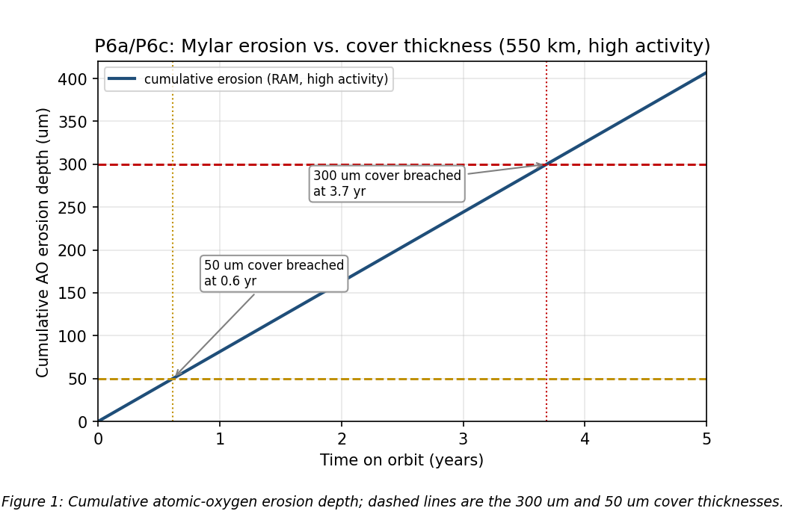
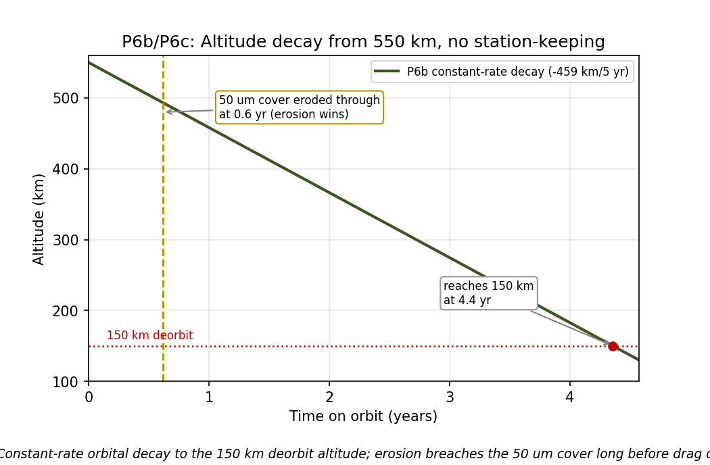

# SPCE 5065 -- Midterm Exam
**Space environment: neutral, plasma, radiation, and human factors**
**Author:** Jordan Clayton
**Date:** July 11, 2026

---

### Approach Overview
1. **P1/P2 (T/F and multiple choice):** answered from the Lesson 1-4 material, one-line reason each so the logic is visible. The two that trip people up are the drag-energy one (kinetic actually goes *up*) and the rocket F=ma one.
2. **P3, P4, P5, P7 (conceptual):** bulleted, specific, and anchored to real missions (Galaxy 15, DMSP, Starlink, Mars500) rather than answered in the abstract.
3. **P6 (the only real math):** atomic-oxygen erosion and drag decay for a 550 km Starlink. I coded it so I could get the actual fluence, erosion depth, and decay curve instead of eyeballing. The headline: at high solar activity the RAM Mylar erodes clean through before end of life.
4. Density and BC numbers come from the neutral-environment lesson (BC typically 25-200 kg/m², so I read the given "103" as 103 kg/m², not 10^3).

---

## Problem 1: True / False
> *(10 pts) Mark each statement true or false.*

Reasoning is one clause each; the boxed letter is the answer.

**a. Drag reduces an orbit's total and kinetic energy.** $\boxed{\textbf{FALSE}}$
Drag lowers the *total* (specific) energy and the potential energy, but as the orbit shrinks the satellite speeds up, so **kinetic energy increases** [1]. That is the classic drag paradox (Lesson 2 quiz: ε down, PE down, KE up).

**b. Newton's second law $\sum \vec F = m\vec a$ is directly applicable to rockets.** $\boxed{\textbf{FALSE}}$
A rocket is a variable-mass system, so you need the momentum form $\sum \vec F = \frac{d}{dt}(m\vec v)$, which keeps the $\dot m$ thrust term. Plain $m\vec a$ drops it [1].

**c. The coldest layer in the atmosphere is the mesosphere.** $\boxed{\textbf{TRUE}}$
The mesopause, at the top of the mesosphere, is the coldest point in the atmosphere (down near 180 K) [1].

**d. When galactic cosmic ray event frequency is low, extreme solar event frequency is high.** $\boxed{\textbf{TRUE}}$
GCR flux is anti-correlated with solar activity: at solar max the beefed-up heliospheric field deflects more GCRs (low GCR) while flares and CMEs peak (high solar events) [1].

**e. Drag in LEO reduces altitude linearly.** $\boxed{\textbf{FALSE}}$
Decay accelerates: as the satellite drops, density climbs, drag climbs, and it comes down faster and faster. It is distinctly nonlinear, ending in a rapid final plunge [1].

**f. Atomic oxygen is the main constituent in the heterosphere during solar min.** $\boxed{\textbf{FALSE}}$
Per Lesson 2, hydrogen tends to dominate at solar min while atomic oxygen dominates toward solar max: at solar min the cooler, contracted thermosphere lets the lighter species (hydrogen, helium) take over the upper heterosphere [2]. Atomic oxygen is still the top species in the ~200 to 500 km band across the cycle [1], but tying "main constituent of the heterosphere" to *solar min* is what makes the statement false.

**g. Astronauts tend to eat less in free-fall.** $\boxed{\textbf{TRUE}}$
The headward fluid shift, appetite suppression, and taste changes in microgravity lead to documented under-eating, which is a real countermeasure concern on long missions [3].

**h. Earth's magnetic field axis is constantly moving.** $\boxed{\textbf{TRUE}}$
The geodynamo is turbulent, so the field drifts year to year (secular variation) and the poles wander (the north magnetic pole is currently sprinting toward Siberia) [1].

**i. Our current sun cycle (25) is closely matched to predictions.** $\boxed{\textbf{FALSE}}$
Cycle 25 has run notably *stronger* than the weak, cycle-24-like forecast discussed in the course solar-cycle material, so it did not closely track that prediction [2].

**j. GEO satellites do not need protection from the space environment because there is no atmosphere there.** $\boxed{\textbf{FALSE}}$
GEO is arguably a *harsher* environment: keV plasma and substorm charging, the outer radiation belt, solar protons, GCRs, and UV. Galaxy 15 got knocked out by GEO charging, no atmosphere required [1].

---

## Problem 2: Multiple Choice
> *(10 pts) Select the best answer(s).*

**I. Which are NOT techniques to mitigate the neutral environment? (select all)** $\boxed{\textbf{c and e}}$
(a) AO-resistant materials, (b) shielding, and (d) coatings are all legitimate neutral-environment fixes. **(c) biasing to a positive voltage** is a *plasma/charging* technique, not a neutral one, and **(e) choosing orbits where the most objects are** is nonsense (that maximizes debris risk, mitigates nothing) [2].

**II. One improvement for a 5-year CubeSat at 500 km, greatest lifetime increase.** $\boxed{\textbf{a. Reduce frontal area by 40\%}}$
At 500 km, lifetime is drag-limited. Cutting frontal area raises the ballistic coefficient $BC = m/(C_dA)$ the most (area is in the denominator), so it extends orbital life the most. The rad-hard processor, arrays, antenna, and battery do nothing for decay (the array actually *adds* drag area) [1], [2].

**III. Solar UV alters which ratio, causing spacecraft temperature changes?** $\boxed{\textbf{c. absorptivity to emissivity}}$
UV degrades thermal-control coatings, driving up the solar absorptance $\alpha$ relative to emittance $\epsilon$; the $\alpha/\epsilon$ shift is exactly what warms the vehicle over time [1].

**IV. Mars transit, eliminate one; which most increases mission risk?** $\boxed{\textbf{c. Exercise equipment}}$
Over a multi-month transit, dropping exercise guarantees bone loss, muscle atrophy, and cardiovascular deconditioning, so the crew arrives at Mars unable to perform. It is the most certain, mission-wide physiological hit: losing medical diagnostic gear only bites *if* something goes wrong, but deconditioning without countermeasures is guaranteed for every crewmember, every day [3].

**V. Primary cause of solar flares.** $\boxed{\textbf{b. Magnetic field reconnection}}$
Flares are the sudden release of energy stored in stressed coronal magnetic fields via reconnection. Fusion is the core's steady output, and CMEs are a related but distinct eruption, not the cause [1].

---

## Problem 3: Which to Keep on a Mass-Limited Mars Crew Mission
> *(15 pts) A four-person Mars mission must cut launch mass by dropping one of: psychological screening, long-duration team training, or simulator training. Which would you keep and why? Give at least three ways it contributes to mission success, using examples from selection, stress and coping, group dynamics, or past missions.*

**I would keep long-duration team training.** For a 4-person crew locked in an isolated, confined environment for ~2.5 years with no evacuation and 20+ minute comm delays, the crew succeeds or fails as a *team*, and team behavior is the single biggest driver you can still buy at this point. Three ways it earns its mass:

- **Group dynamics / cohesion (the dominant long-duration risk).** Isolated confined environment (ICE) analogs (Mars500, Antarctic winter-over, ISS expeditions) consistently show that team friction, not hardware, is what degrades long missions. Long-duration training builds shared mental models, communication habits, and conflict-resolution reflexes that only form with time together [3].
- **Stress and coping.** A team that has trained together has pre-negotiated roles and coping strategies, which blunts the "third-quarter" morale dip and keeps decision-making intact when a real emergency hits. Shuttle-Mir showed the opposite: crews that had not trained to a common standard hit language and expectation seams that cost performance [3].
- **Recovery from the loss of the other two.** Good team training partially covers for thinner screening (a cohesive team self-monitors and manages a struggling member) and for less simulator time (a coordinated crew can work procedures collaboratively en route, and Mars-transit downtime is long). The reverse is not true: a perfectly screened but un-gelled crew still has to learn to operate together somewhere, and deep space is the worst classroom.

**The tradeoff I am accepting:** psychological screening is the close runner-up (you cannot fully train away a fundamentally incompatible crewmember), and simulator training is the most deferrable because procedures can be practiced during the long transit. If I could only protect one lever on team performance, it is the training that actually forges the team.

---

## Problem 4: Safe-Mode Anomaly Over the South Atlantic
> *(15 pts) Spacecraft entered safe mode. Bus healthy, battery nominal, multiple computer resets over the South Atlantic, NOAA issued a G3 storm warning the day before. Explain (a) most likely cause, (b) data to request, (c) immediate actions, (d) long-term design fixes.*

**a. Most likely cause: radiation-induced single-event effects (SEUs / single-event upsets) in the avionics, driven by trapped protons in the South Atlantic Anomaly and amplified by the G3 storm.** The tells line up: a healthy bus and nominal battery rule out power and thermal, so this is not a hardware or eclipse problem. Resets that *cluster over the South Atlantic* are the textbook SAA signature (the inner belt dips low there, so proton flux spikes), and a G3 geomagnetic storm the day before pumps up energetic particle populations, raising the upset rate [1]. Bottom line: energetic particles are flipping bits and latching logic, tripping the watchdog into safe mode.

**b. Additional data I would request:**
- Onboard error logs: which unit reset, EDAC single/multi-bit error counts, memory-scrub history.
- Reset timestamps cross-correlated with ground track to confirm the SAA overlap.
- Space-weather data: GOES proton/electron flux, Kp/Dst for the G3 event, timeline vs the resets.
- Dosimeter / particle-detector telemetry if the bus carries one, to see the local flux during each event.

**c. Immediate operational actions:**
- Stay in safe mode until the storm subsides and flux returns to baseline.
- Command a memory scrub and reload from a known-good image; clear and re-arm error counters.
- Inhibit critical activities (maneuvers, sensitive science) during SAA passes for now.
- If any unit is latched (SEL), power-cycle it to clear the latch-up before it does thermal damage, then verify health.

**d. Long-term design improvements:**
- Rad-hardened or rad-tolerant processor and memory, with **EDAC/error-correcting memory** and periodic scrubbing.
- **Watchdog plus autonomous recovery** so a hung computer resets and recovers itself instead of sitting in safe mode (the Galaxy 15 lesson: a latched, un-recovered bus turns a glitch into a mission-length saga) [1].
- **Latch-up protection** (current-limiting / power-cycle circuits) on susceptible parts.
- Targeted **shielding** of the avionics box and SAA-aware flight rules (safe sensitive ops over the anomaly), plus redundancy/voting on critical logic.

---

## Problem 5: Why Starlink Dropped From 1100 km to 550 km
> *(10 pts) Starlink was first planned for ~1100 km LEO, then moved to 550 km over space-environment concerns. Give three of those concerns.*

Every one of these gets *worse* with altitude, which is why 550 km won:

- **Radiation dose and SEUs.** At 1100 km you are climbing into the bottom of the inner Van Allen belt, so trapped-proton and electron flux, total ionizing dose, and single-event rates all jump. That shortens electronics life and drives up shielding mass. At 550 km you sit well below the belt [1].
- **Debris collision risk with no self-cleaning.** At 1100 km atmospheric drag is negligible, so debris and dead satellites persist for centuries, and the collision/Kessler risk for a mega-constellation is severe. At 550 km the atmosphere naturally sweeps the band, so the environment self-cleans [1].
- **End-of-life disposal.** A failed satellite at 1100 km stays up for hundreds of years; the same failure at 550 km reenters on its own within roughly five years even with no propulsion (see Problem 6b), which is what responsible disposal and the debris-mitigation guidelines demand [1].

The price of going low is more drag and more atomic oxygen (Problem 6 is exactly that bill), but for a huge constellation the radiation and debris arguments dominate.

---

## Problem 6: Atomic-Oxygen Erosion and Drag on a 550 km Starlink
> *(20 pts) (a) Estimate the max erosion depth of a RAM-facing Mylar cover over a 5-year mission at 550 km during high solar activity, $n_O = 1\times10^8\ \text{atoms/cm}^3$; if the cover is 300 µm thick, is it a problem? (b) Estimate the 5-year altitude decay with no station-keeping, $BC = 103\ \text{kg/m}^2$, density $\rho = 1.02\times10^7\,x^{-7.172}\ \text{kg/m}^3$, average altitude 350 km, $R = 6728$ km, using $\frac{dR}{dt} = -\frac{\rho}{BC}\sqrt{\mu R}$. (c) If the cover is 50 µm and the deorbit altitude is 150 km, is drag or erosion the bigger concern?*

**Classification:** Computation. Formulas from the neutral-environment lesson [2]; numbers reproduced by the appended script.

**Assumptions (stated once, used throughout):**
- RAM impact speed is the circular orbital velocity, $v = \sqrt{\mu/r}$, with $\mu = 3.986\times10^{14}\ \text{m}^3/\text{s}^2$ and $R_E = 6378$ km.
- Mylar atomic-oxygen reaction efficiency $R_e = 3.4\times10^{-24}\ \text{cm}^3/\text{atom}$ (Tribble; Kapton-H reference is $3.0\times10^{-24}$) [1].
- The given "$BC = 103$" is 103 kg/m$^2$: the lesson puts typical ballistic coefficients at 25-200 kg/m$^2$ (average 109), so 103 fits and $10^3$ would not [2].
- $x$ in the density fit is altitude in km; at $x = 350$ it returns $\rho = 5.79\times10^{-12}\ \text{kg/m}^3$, a sane value for 350 km.

### (a) Erosion depth

Erosion depth is the reaction efficiency times the AO fluence, and fluence is just flux times time:
$$\text{depth} = R_e \, F, \qquad F = n_O \, v \, t$$

At 550 km, $r = 6928$ km gives $v = 7585\ \text{m/s} = 7.585\times10^5\ \text{cm/s}$. Over $t = 5\ \text{yr} = 1.578\times10^8\ \text{s}$:
$$F = (1\times10^8)(7.585\times10^5)(1.578\times10^8) = 1.197\times10^{22}\ \text{atoms/cm}^2$$
$$\text{depth} = (3.4\times10^{-24})(1.197\times10^{22}) = 4.07\times10^{-2}\ \text{cm}$$

$$\boxed{\text{Erosion depth} \approx 407\ \mu\text{m} \; > \; 300\ \mu\text{m cover} \;\Rightarrow\; \textbf{yes, it is a problem}}$$

The RAM Mylar erodes clean through at about **3.7 years**, well short of the 5-year life (**Figure 1**). Even using the more conservative Kapton value it comes out to 359 µm, still past 300, so the conclusion is not sensitive to which polymer number I pick.



### (b) Altitude decay over 5 years

With density and radius held at the stated averages, the decay rate is constant, so the 5-year drop is just rate times time:
$$\frac{dR}{dt} = -\frac{\rho}{BC}\sqrt{\mu R} = -\frac{5.79\times10^{-12}}{103}\sqrt{(3.986\times10^{14})(6.728\times10^6)} = -2.91\times10^{-3}\ \text{m/s}$$

That is $-0.251$ km/day. Over five years:
$$\Delta R = \left(-2.91\times10^{-3}\right)\left(1.578\times10^8\right) = -4.59\times10^{5}\ \text{m}$$

$$\boxed{\Delta R \approx -459\ \text{km over 5 years} \;\Rightarrow\; \text{it decays from 550 km and reenters within the mission}}$$

So with no station-keeping this satellite does not survive five years at altitude: it drops through the whole LEO band and comes down (**Figure 2**). This is a constant-rate estimate (the problem fixes density at the 350 km average); the true decay is slower up high and faster near the end as density climbs, so the real reentry comes even sooner than the linear line suggests. That is the flip side of the Problem 5 disposal argument, drag at 550 km is a feature for debris cleanup and a bug for mission life.



### (c) 50 µm cover: drag or erosion first?

Same erosion rate as part (a), 81 µm/yr, so a 50 µm cover is gone in $50/81 \approx 0.61$ years. Drag, at the part (b) rate of ~92 km/yr, takes $(550-150)/92 \approx 4.4$ years to reach the 150 km deorbit altitude.

$$\boxed{\text{Erosion (0.6 yr)} \ll \text{drag-to-deorbit (4.4 yr)} \;\Rightarrow\; \textbf{atomic-oxygen erosion is the bigger concern}}$$

The thin cover is eaten through in well under a year, long before drag brings the satellite down. If anything the real gap is wider, because as the orbit decays into denser air the AO flux climbs and erosion speeds up further.

---

## Problem 7: One Improvement for a 12U CubeSat at 500 km
> *(20 pts) Lead engineer for a 12U CubeSat, 5 years at 500 km. Improve only one of: reduce frontal area by 40%, increase mass by 50%, reduce drag coefficient from 2.2 to 1.5. Recommend one and justify with the neutral environment, ballistic coefficient, solar-cycle variability, and orbital perturbations. Discuss assumptions and tradeoffs.*

**Recommendation: reduce the frontal area by 40%.** At 500 km the mission is drag-limited, and lifetime scales with the ballistic coefficient $BC = m/(C_dA)$, so the winning move is whichever option raises $BC$ the most.

- **Ballistic coefficient (the deciding math).** Each option multiplies $BC$ by: area cut $\to \times 1/0.6 = 1.67$; mass up $\to \times 1.5$; drag-coefficient cut $\to \times 2.2/1.5 = 1.47$. Reducing frontal area gives the **largest** $BC$ gain, so the longest life per the drag equation [1], [2].
- **Neutral environment.** Drag is the dominant force at 500 km and the whole reason the orbit decays; shrinking the ram cross-section directly cuts the force ($F_{drag} \propto A$). It also cuts atomic-oxygen fluence on the ram face as a bonus, easing erosion [1].
- **Solar-cycle variability.** A 5-year mission rides through a big chunk of the solar cycle, and density at 400-700 km swings by 10-30x from solar min to max [2]. The extra $BC$ margin is exactly what buys survival through a solar-max density spike, when decay is worst.
- **Orbital perturbations.** At 500 km drag is *the* perturbation that ends the mission; $J_2$ and third-body effects reshape the orbit but do not decay it. Spending the one improvement on the perturbation that actually kills you is the right call.

**Why not the others:** cutting $C_d$ from 2.2 to 1.5 is the least achievable, real CubeSat drag coefficients sit around 2.2 to 4 in free-molecular flow (diffuse re-emission), so 1.5 is optimistic bordering on unphysical [2]. Increasing mass 50% is the simplest and most certain ($\times1.5$, just add ballast), and if attitude control is shaky it is the safer pick, but it is a smaller $BC$ gain and costs launch mass.

**Assumptions and tradeoffs:** I assume the 40% area reduction is realized by flying a minimum-cross-section attitude (or a slimmer deployed geometry) and holding it with the ADCS. The real cost is power and control: a smaller ram face can mean less sun-facing array area, and if attitude control drops out the satellite tumbles and the area (and drag) average back up, erasing the benefit. So the recommendation is contingent on reliable attitude control; if that is in doubt, mass +50% is the robust fallback.

---

## Sources Cited

[1] Tribble, A. C., *The Space Environment: Implications for Spacecraft Design*, rev. ed., Princeton Univ. Press, Princeton, NJ, 2003 (drag energetics, atmospheric structure, atomic oxygen, radiation/SAA, charging, thermal-control degradation).

[2] George, L., "SPCE 5065 Lesson Notes and Slides, Lessons 1 to 4 (The Space Environment; Neutral and Plasma Environments)," course material (Canvas), University of Colorado Colorado Springs, 2026 (atmospheric structure and the coldest-layer and drag-energy quizzes, ballistic- and drag-coefficient ranges, atomic-oxygen erosion model and the 200 to 600 km O-dominance, density and solar-cycle variation including the Cycle 25 progression chart).

[3] "SPCE 5065 Lesson 3: Human Factors and Bioastronautics," course lecture notes and slides (Canvas), University of Colorado Colorado Springs, 2026 (microgravity deconditioning and exercise countermeasures, isolated-confined-environment group dynamics, astronaut selection and team training).

---

## Appendix: Python Solution Script

The script below reproduces every boxed number in Problem 6 and regenerates both figures. Running `python spce_5065_ex1_solution.py` prints the fluence, erosion depths, decay rate, and the erosion-vs-drag timing.

```python
"""SPCE 5065 -- Midterm, Problem 6 solution.

Atomic-oxygen erosion and atmospheric drag on a Starlink-class satellite.
  P6a  Max AO erosion of a 300 um Mylar RAM cover over 5 yr at 550 km.
  P6b  Altitude decay over 5 yr with no station-keeping.
  P6c  With a 50 um cover and a 150 km deorbit altitude, drag or erosion first?
"""
from __future__ import annotations

import sys
from pathlib import Path

import matplotlib.pyplot as plt
import numpy as np

# Constants
MU = 3.986e14                 # m^3/s^2   Earth GM
R_E = 6378.0e3               # m         Earth radius (exam uses R_E = 6378 km)
YEAR_S = 365.25 * 86400.0     # s/yr
T_MISSION = 5.0 * YEAR_S      # s
RE_MYLAR = 3.4e-24            # cm^3/atom  Mylar reaction efficiency (Tribble)
RE_KAPTON = 3.0e-24          # cm^3/atom  Kapton-H reference (robustness check)
FIG_DIR = Path(__file__).parent / "figures"


def orbital_velocity(alt_m: float) -> float:
    """Circular orbital (RAM) velocity, m/s.  v = sqrt(mu / (R_E + h))."""
    return np.sqrt(MU / (R_E + alt_m))


def erosion_depth_um(reaction_eff_cm3: float, n_cm3: float,
                     v_ms: float, t_s: float) -> float:
    """AO erosion depth (um).  depth = Re * fluence,  fluence = n * v * t."""
    fluence = n_cm3 * (v_ms * 100.0) * t_s   # atoms/cm^2
    return reaction_eff_cm3 * fluence * 1.0e4  # cm -> um


def density_model(alt_km: float) -> float:
    """Given exam density fit, rho = 1.02e7 * x^(-7.172) kg/m^3, x = alt in km."""
    return 1.02e7 * alt_km ** (-7.172)


def decay_rate(alt_km: float, R_m: float, bc: float) -> float:
    """dR/dt = -(rho / BC) * sqrt(mu * R),  m/s (given exam model)."""
    return -(density_model(alt_km) / bc) * np.sqrt(MU * R_m)


def p6a() -> dict:
    alt, n_o = 550.0e3, 1.0e8
    v = orbital_velocity(alt)
    fluence = n_o * (v * 100.0) * T_MISSION
    depth = erosion_depth_um(RE_MYLAR, n_o, v, T_MISSION)
    depth_k = erosion_depth_um(RE_KAPTON, n_o, v, T_MISSION)
    t_penetrate = 300.0 / depth * 5.0
    print("P6a  v = %.1f m/s,  F = %.3e atoms/cm^2" % (v, fluence))
    print("     erosion (Mylar) = %.1f um,  (Kapton) = %.1f um" % (depth, depth_k))
    print("     300 um cover -> %s, breached at %.2f yr"
          % ("PROBLEM" if depth > 300 else "OK", t_penetrate))
    return {"v": v, "fluence": fluence, "depth": depth,
            "depth_k": depth_k, "t_penetrate": t_penetrate}


def p6b() -> dict:
    bc, alt_avg, R_avg = 103.0, 350.0, 6728.0e3
    rho = density_model(alt_avg)
    dRdt = decay_rate(alt_avg, R_avg, bc)
    decay_5yr = dRdt * T_MISSION
    print("P6b  rho(350 km) = %.3e kg/m^3,  dR/dt = %.4f km/day"
          % (rho, dRdt * 86400 / 1000))
    print("     5-yr decay = %.1f km -> ends near %.0f km (reenters)"
          % (decay_5yr / 1000, 550 + decay_5yr / 1000))
    return {"bc": bc, "rho": rho, "dRdt": dRdt, "decay_5yr_km": decay_5yr / 1000}


def p6c(a: dict, b: dict) -> dict:
    rate_um_per_yr = a["depth"] / 5.0
    t_erode_50 = 50.0 / rate_um_per_yr
    rate_km_per_yr = abs(b["dRdt"]) * YEAR_S / 1000.0
    t_deorbit = (550.0 - 150.0) / rate_km_per_yr
    print("P6c  50 um erodes in %.2f yr;  drag to 150 km in %.2f yr -> %s wins"
          % (t_erode_50, t_deorbit,
             "EROSION" if t_erode_50 < t_deorbit else "DRAG"))
    return {"t_erode_50": t_erode_50, "t_deorbit": t_deorbit,
            "rate_um_per_yr": rate_um_per_yr, "rate_km_per_yr": rate_km_per_yr}


def _caption(fig, text: str) -> None:
    fig.text(0.5, 0.01, text, ha="center", va="bottom", fontsize=9, style="italic")


def fig_erosion(a: dict, c: dict) -> None:
    t = np.linspace(0, 5, 200)
    depth = a["depth"] / 5.0 * t
    fig, ax = plt.subplots(figsize=(7, 4.6))
    ax.plot(t, depth, color="#1f4e79", lw=2,
            label="cumulative erosion (RAM, high activity)")
    ax.axhline(300, color="#c00000", ls="--", lw=1.4)
    ax.axhline(50, color="#bf8f00", ls="--", lw=1.4)
    ax.axvline(a["t_penetrate"], color="#c00000", ls=":", lw=1)
    ax.axvline(c["t_erode_50"], color="#bf8f00", ls=":", lw=1)
    ax.annotate("300 um cover breached\nat %.1f yr" % a["t_penetrate"],
                xy=(a["t_penetrate"], 300), xytext=(-150, -20),
                textcoords="offset points", fontsize=8,
                bbox=dict(boxstyle="round,pad=0.3", fc="white", ec="0.6"),
                arrowprops=dict(arrowstyle="->", color="0.5"))
    ax.annotate("50 um cover breached\nat %.1f yr" % c["t_erode_50"],
                xy=(c["t_erode_50"], 50), xytext=(20, 60),
                textcoords="offset points", fontsize=8,
                bbox=dict(boxstyle="round,pad=0.3", fc="white", ec="0.6"),
                arrowprops=dict(arrowstyle="->", color="0.5"))
    ax.set_xlabel("Time on orbit (years)")
    ax.set_ylabel("Cumulative AO erosion depth (um)")
    ax.set_title("P6a/P6c: Mylar erosion vs. cover thickness (550 km, high activity)")
    ax.set_xlim(0, 5)
    ax.set_ylim(0, max(420, a["depth"] * 1.03))
    ax.grid(True, alpha=0.3)
    ax.legend(fontsize=8, loc="upper left")
    fig.subplots_adjust(bottom=0.18)
    _caption(fig, "Figure 1: Cumulative atomic-oxygen erosion depth; dashed lines "
             "are the 300 um and 50 um cover thicknesses.")
    fig.savefig(FIG_DIR / "fig1_erosion_vs_time.png", dpi=150)
    plt.close(fig)


def fig_decay(b: dict, c: dict) -> None:
    t_end = c["t_deorbit"] * 1.05
    t_lin = np.linspace(0, t_end, 200)
    alt_lin = 550 + b["dRdt"] * (t_lin * YEAR_S) / 1000.0
    fig, ax = plt.subplots(figsize=(7, 4.6))
    ax.plot(t_lin, alt_lin, color="#385723", lw=2,
            label="P6b constant-rate decay (%.0f km/5 yr)" % b["decay_5yr_km"])
    ax.axhline(150, color="#c00000", ls=":", lw=1.2)
    ax.text(0.15, 160, "150 km deorbit", fontsize=8, color="#c00000")
    ax.plot(c["t_deorbit"], 150, "o", color="#c00000", ms=6)
    ax.annotate("reaches 150 km\nat %.1f yr" % c["t_deorbit"],
                xy=(c["t_deorbit"], 150), xytext=(-120, 30),
                textcoords="offset points", fontsize=8,
                bbox=dict(boxstyle="round,pad=0.3", fc="white", ec="0.6"),
                arrowprops=dict(arrowstyle="->", color="0.5"))
    ax.axvline(c["t_erode_50"], color="#bf8f00", ls="--", lw=1.4)
    ax.annotate("50 um cover eroded through\nat %.1f yr (erosion wins)"
                % c["t_erode_50"], xy=(c["t_erode_50"], 480), xytext=(40, -4),
                textcoords="offset points", fontsize=8,
                bbox=dict(boxstyle="round,pad=0.3", fc="white", ec="#bf8f00"),
                arrowprops=dict(arrowstyle="->", color="0.5"))
    ax.set_xlabel("Time on orbit (years)")
    ax.set_ylabel("Altitude (km)")
    ax.set_title("P6b/P6c: Altitude decay from 550 km, no station-keeping")
    ax.set_xlim(0, t_end)
    ax.set_ylim(100, 560)
    ax.grid(True, alpha=0.3)
    ax.legend(fontsize=8, loc="upper right")
    fig.subplots_adjust(bottom=0.18)
    _caption(fig, "Figure 2: Constant-rate orbital decay to the 150 km deorbit "
             "altitude; erosion breaches the 50 um cover long before drag deorbits it.")
    fig.savefig(FIG_DIR / "fig2_altitude_decay.png", dpi=150)
    plt.close(fig)


def main() -> None:
    sys.stdout.reconfigure(encoding="utf-8")
    FIG_DIR.mkdir(exist_ok=True)
    a = p6a()
    b = p6b()
    c = p6c(a, b)
    fig_erosion(a, c)
    fig_decay(b, c)
    print("Figures written to:", FIG_DIR)


if __name__ == "__main__":
    main()
```
