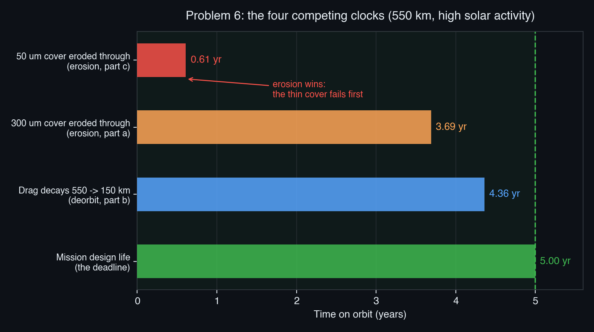

# SPCE 5065 Midterm -- Socratic Solution Walkthrough
## The Space Environment: Neutral, Plasma, Radiation, and Human Factors

*A personal study guide, not a submission. Each problem opens with the answer, then earns it. Read the punchline, try the retrieval prompt, then check the derivation.*

---

## 30,000-Foot Overview

**The big question this midterm asks:** once a spacecraft leaves the launch pad, what in the environment around it is trying to kill it, and how do design choices push back? The exam walks through the four environments the course is built on, in the order a designer meets them.

- **Problems 1 and 2 (recall and reasoning)** are the vocabulary check. True/False and multiple choice covering drag energetics, atmospheric structure, the solar cycle, atomic oxygen, charging, and human factors. They reward knowing *why* a tempting statement is subtly wrong.
- **Problem 3 (human factors)** is a judgment call: on a mass-limited Mars crew mission, which of psychological screening, team training, or simulator training do you protect? The graders want a defended choice grounded in group dynamics and past missions, not a hedge.
- **Problem 4 (anomaly resolution)** is a diagnosis: safe mode, healthy bus, resets clustered over the South Atlantic, a G3 storm the day before. Read the clues, name the culprit (radiation upsets in the South Atlantic Anomaly), and lay out data, actions, and fixes.
- **Problem 5 (systems tradeoff)** asks why Starlink dropped from 1100 km to 550 km. The theme: nearly every environmental threat gets *worse* with altitude, and the atmosphere at 550 km self-cleans debris.
- **Problem 6 (the quantitative centerpiece)** is the only real math: atomic-oxygen erosion of a Mylar cover, orbital decay with no station-keeping, and a head-to-head on which mechanism ends the mission first. Everything is fluence, erosion depth, and a decay rate.
- **Problem 7 (design justification)** hands you one CubeSat improvement to spend and asks you to defend it with the ballistic coefficient. The winning move is the one that raises $BC$ the most.

**The thread.** Two numbers organize the whole exam: **altitude** and the **ballistic coefficient** $BC = m/(C_d A)$. Altitude sets how thick the air is, how much radiation the belts dump on you, and how fast debris self-cleans. The ballistic coefficient sets how hard that air pushes back. Problem 5 is the altitude argument in words, Problem 6 is it in numbers, and Problems 2-II and 7 are the ballistic-coefficient argument twice. The human-factors problems (3, 4-adjacent, and 2-IV) run in parallel: the environment stresses the crew the same way it stresses the hardware, and the countermeasure is the same idea, build in margin before you launch because you cannot add it later.

---

## Problem 1 (10 pts) -- True / False

**The punchline first:** these ten reward recognizing the *subtle* wrong statement. Drag speeds a satellite up even as it robs total energy (a), a rocket is a variable-mass system so plain $\vec F = m\vec a$ is wrong (b), decay is nonlinear (e), and "solar min" is the trap word that flips statement (f).

The full answer key in one table, then the four that carry the most insight get a paragraph.

| # | Statement (paraphrased) | Answer | One-line why |
|---|---|---|---|
| a | Drag reduces total *and* kinetic energy | **FALSE** | Total and potential energy drop, but the satellite speeds up, so kinetic energy *rises*. |
| b | $\sum \vec F = m\vec a$ applies directly to rockets | **FALSE** | A rocket loses mass, so you need the momentum form that keeps the $\dot m$ thrust term. |
| c | The coldest atmospheric layer is the mesosphere | **TRUE** | The mesopause (top of the mesosphere) is the coldest point, near 180 K. |
| d | Low GCR event frequency implies high extreme-solar frequency | **TRUE** | GCR flux is anti-correlated with solar activity, so low GCR means solar max, when flares and CMEs peak. |
| e | LEO drag reduces altitude linearly | **FALSE** | As it drops, density climbs and drag climbs, so decay accelerates into a final plunge. |
| f | Atomic oxygen is the main heterosphere constituent *during solar min* | **FALSE** | At solar min the cooler thermosphere lets lighter hydrogen and helium take over up high. The "solar min" tag is what makes it false. |
| g | Astronauts tend to eat less in free-fall | **TRUE** | Fluid shift, appetite suppression, and taste changes drive documented under-eating. |
| h | Earth's magnetic axis is constantly moving | **TRUE** | The turbulent geodynamo produces secular variation and wandering poles. |
| i | Solar Cycle 25 closely matches predictions | **FALSE** | Cycle 25 ran notably stronger than the official forecast. |
| j | GEO satellites need no protection because there is no atmosphere | **FALSE** | GEO is arguably harsher: keV plasma charging, the outer belt, solar protons, GCRs, and UV. |

### 1.1 (a) The drag energy paradox

**Before reading on, try this:** for a circular orbit, write specific total energy as $\varepsilon = -\mu/(2a)$ and circular speed as $v = \sqrt{\mu/r}$. If drag shrinks $a$, does $v$ go up or down, and what does that do to kinetic energy per unit mass, $v^2/2$?

**The punchline:** total energy $\varepsilon$ falls (more negative) and potential energy falls, but because $v = \sqrt{\mu/r}$ *grows* as $r$ shrinks, kinetic energy **increases**. The statement lumps kinetic in with total, so it is false.

This is the classic result from the neutral-environment lesson: drag removes energy from the orbit, yet the satellite ends up moving *faster*. The bookkeeping works because potential energy drops by twice as much as kinetic energy rises (the virial relationship for circular orbits), so the net, total, energy still goes down. A student who answers "drag takes energy, so everything drops" walks straight into the trap.

**Common pitfall:** treating "loses energy" as "slows down." A decaying satellite is a *faster* satellite in a lower, tighter orbit.

### 1.2 (b) Why rockets break $\vec F = m\vec a$

**The punchline:** a rocket ejects mass, so $m$ is not constant, and the honest statement of Newton's second law is $\sum \vec F = \frac{d}{dt}(m\vec v)$. Expanding gives $m\dot{\vec v} + \dot m \vec v$, and the $\dot m$ term is the thrust. Writing $\vec F = m\vec a$ throws that term away.

The exam is testing whether the reader remembers that "$F = ma$" is the *constant-mass* special case. For a variable-mass system you keep the full momentum derivative, which is exactly where rocket thrust comes from.

### 1.3 (e) Decay is nonlinear

**The punchline:** density rises roughly exponentially as altitude drops, so a decaying satellite falls faster and faster, ending in a rapid plunge, not a straight line. False.

This one connects directly to Problem 6b. There the exam *fixes* density at the 350 km average to make the arithmetic a constant-rate estimate, but the real curve steepens near the end. Recognizing that the linear estimate is a floor (real reentry comes sooner) is worth a mental bookmark for 6b.

### 1.4 (f) The solar-min trap

**Before reading on, try this:** rank atomic oxygen, hydrogen, and helium in the upper heterosphere at solar *min* versus solar *max*. Which lightest species climbs when the thermosphere cools and contracts?

**The punchline:** atomic oxygen dominates the roughly 200 to 500 km band across the cycle, but tying "main constituent of the heterosphere" specifically to *solar min* is what makes the statement false. At solar min the cooler, contracted thermosphere lets the lighter species (hydrogen, then helium) take over the top of the heterosphere.

The lesson is that constituent dominance depends on both altitude and solar activity. The statement is engineered to be true-sounding (atomic oxygen *is* a headline neutral species) with one wrong qualifier. That qualifier is the whole question.

**Common pitfall:** answering from the "atomic oxygen is the AO-erosion villain" reflex and missing that the *altitude band and solar phase* are the actual claim being tested.

> **Key takeaway from Problem 1:** True/False items on this exam hide the error in a qualifier, not the headline. Drag lowers total energy while raising speed, a rocket needs the variable-mass form of Newton's law, decay is nonlinear, and constituent dominance depends on solar phase. Read each clause as a separate claim.

> **Feynman test (in plain English):** each false statement is mostly right with one sneaky word swapped, so the trick is to read it slowly and ask which single piece would have to change to make it true.

---

## Problem 2 (10 pts) -- Multiple Choice

**The punchline first:** the answers are I: **c and e**, II: **a**, III: **c**, IV: **c**, V: **b**. Three of the five (II, III, V) test whether the reader can map a cause to its environment; the other two test whether they can spot a technique that belongs to a *different* environment.

**I. Which are NOT neutral-environment mitigations (select all)? Answer: c and e.** AO-resistant materials (a), shielding (b), and protective coatings (d) are all legitimate neutral fixes. **Biasing to a positive voltage (c)** is a *plasma/charging* control, not a neutral one, and **choosing orbits where the most objects are (e)** is nonsense that maximizes debris risk. The trap is (c): it is a real mitigation technique, just for the wrong environment.

**II. One improvement for a 5-year CubeSat at 500 km, greatest lifetime gain. Answer: a, reduce frontal area by 40%.** At 500 km the mission is drag-limited, and lifetime scales with $BC = m/(C_d A)$. Area sits in the denominator, so cutting it raises $BC$ the most. The rad-hard processor, larger arrays, extra antenna, and bigger battery do nothing for decay (the larger array actually *adds* drag area). This is Problem 7 in miniature, and the same logic wins both.

**III. Solar UV alters which ratio, changing spacecraft temperature? Answer: c, absorptivity to emissivity.** UV degrades thermal-control coatings, driving up solar absorptance $\alpha$ relative to emittance $\epsilon$. Equilibrium temperature scales with $(\alpha/\epsilon)^{1/4}$, so a rising $\alpha/\epsilon$ warms the vehicle over the mission. The other ratios are distractors with no thermal meaning.

**IV. Mars transit, eliminate one, which most increases risk? Answer: c, exercise equipment.** Over a multi-month transit, dropping exercise *guarantees* bone loss, muscle atrophy, and cardiovascular deconditioning for every crewmember every day, so the crew arrives unable to perform. Losing medical diagnostic gear only hurts *if* something goes wrong; deconditioning is certain. The grader wants the "certain, mission-wide" hit over the "conditional" one.

**V. Primary cause of solar flares? Answer: b, magnetic field reconnection.** Flares are the sudden release of energy stored in stressed coronal magnetic fields via reconnection. Fusion (a) is the core's steady output, and CMEs (e) are a related but distinct eruption, not the cause. The word "cause" is the key: reconnection is the mechanism, the CME is a sibling symptom.

> **Key takeaway from Problem 2:** the multiple-choice items reward matching a fix or effect to the *right* environment. Biasing voltage is plasma not neutral, area cuts win drag-limited lifetime, $\alpha/\epsilon$ is the thermal ratio UV attacks, exercise loss is the certain crew hit, and reconnection (not the CME) is the flare's cause.

> **Feynman test (in plain English):** every wrong choice is a real thing that just belongs to a different box, so the game is sorting each option into the correct pile before picking.

---

## Problem 3 (15 pts) -- Which Crew Investment to Keep on a Mass-Limited Mars Mission

**Problem Statement:** a four-person Mars mission must cut launch mass by dropping one of psychological screening, long-duration team training, or simulator training. Recommend which to *keep* and give at least three ways it drives mission success, using astronaut selection, stress and coping, group dynamics, or past missions.

**The punchline first:** **keep long-duration team training.** For a 4-person crew locked in an isolated, confined environment for about 2.5 years with no evacuation and 20+ minute comm delays, the crew succeeds or fails as a *team*, and team performance is the single biggest lever still buyable at this stage.

**The reasoning framework the grader wants.** This is an argued-choice question, so points come from three things: a clear pick, three *distinct* success mechanisms (not one idea restated), and at least one concrete anchor from a real mission or the selection/coping/group-dynamics literature. A hedge ("they are all important") scores poorly because it dodges the decision the prompt forces. The strongest answer also names the tradeoff being accepted, which shows the choice was made with eyes open.

The three mechanisms, each a genuinely different axis:

- **Group dynamics and cohesion (the dominant long-duration risk).** Isolated confined environment (ICE) analogs (Mars500, Antarctic winter-over, ISS expeditions) consistently show that team friction, not hardware, is what degrades long missions. Time together builds shared mental models, communication habits, and conflict-resolution reflexes that cannot be improvised in deep space.
- **Stress and coping.** A team that trained together has pre-negotiated roles and coping strategies, which blunts the "third-quarter" morale dip and keeps decisions sound in a real emergency. Shuttle-Mir showed the failure mode: crews trained to different standards hit language and expectation seams that cost performance.
- **Covering for the other two cuts.** Good team training partially backfills thinner screening (a cohesive team self-monitors and manages a struggling member) and less simulator time (a coordinated crew can drill procedures during the long transit). The reverse does not hold: a perfectly screened but un-gelled crew still has to learn to operate together, and deep space is the worst classroom.

**The tradeoff to name explicitly:** psychological screening is the close runner-up (you cannot fully train away a fundamentally incompatible crewmember), and simulator training is the most deferrable because procedures can be rehearsed during transit. The defensible line is: if only one lever on team performance can be protected, protect the one that actually forges the team.

> **Key takeaway from Problem 3:** on a long-duration crew mission the biggest controllable risk is the crew's ability to function as a team, so team training earns its mass over screening and simulator time. Argue a clear pick, three distinct mechanisms, and the tradeoff you accept.

> **Feynman test (in plain English):** on a two-year trip with no way home and no quick help, whether the four people can get along and work together matters more than almost anything else, so you spend your last dollar making them a real team.

---

## Problem 4 (15 pts) -- Safe-Mode Anomaly Over the South Atlantic

**Problem Statement:** a spacecraft entered safe mode. Bus healthy, battery nominal, multiple computer resets over the South Atlantic, NOAA issued a G3 storm warning the day before. Explain (a) the most likely cause, (b) data to request, (c) immediate operational actions, (d) long-term design fixes.

**The punchline first:** the resets are **radiation-induced single-event effects (SEUs) in the avionics**, caused by trapped protons in the South Atlantic Anomaly (SAA) and amplified by the G3 storm. The healthy bus and nominal battery rule out power and thermal, and resets that *cluster over the South Atlantic* are the textbook SAA fingerprint.

| Part | Headline answer | Section |
|---|---|---|
| (a) Most likely cause | SEUs from SAA protons, boosted by the G3 storm | §4.1 |
| (b) Data to request | Error logs, reset-vs-groundtrack timing, GOES flux, Kp/Dst, dosimeter | §4.2 |
| (c) Immediate actions | Ride out the storm, scrub and reload memory, inhibit SAA ops, clear any latch-up | §4.3 |
| (d) Long-term fixes | Rad-hard parts, EDAC memory, autonomous watchdog recovery, latch-up protection, shielding | §4.4 |

### 4.1 (a) Reading the clues to the cause

**Before reading on, try this:** list what each telemetry clue rules in or out. Healthy bus, nominal battery, resets localized over the South Atlantic, G3 storm the prior day. Which subsystem does the *location* of the resets point to?

**The punchline:** healthy bus plus nominal battery eliminates power, thermal, and eclipse problems, so the fault is not hardware failure. Resets that repeat *over one geographic region*, the South Atlantic, point at the SAA, where the inner radiation belt dips low and proton flux spikes. A G3 geomagnetic storm the day before pumps up energetic particle populations, raising the upset rate further. Energetic particles are flipping bits and latching logic, and the watchdog is tripping the vehicle into safe mode.

The diagnostic move the grader rewards is *elimination by clue*: each bullet in the telemetry is there to knock out a candidate. "Healthy" and "nominal" kill the mundane explanations, "South Atlantic" is a location fingerprint, and "G3" is the amplifier. Naming the SAA by name, and tying it to the inner belt geometry, is what separates a full-credit answer from "probably radiation."

### 4.2 (b) The data that would confirm it

**The punchline:** request the data that *tests* the SAA-plus-storm hypothesis rather than just describing the anomaly.

- Onboard error logs: which unit reset, EDAC single-bit and multi-bit error counts, memory-scrub history.
- Reset timestamps cross-correlated with the ground track, to confirm the resets fall inside the SAA footprint.
- Space-weather data: GOES proton and electron flux, plus Kp and Dst for the G3 event, on the same timeline as the resets.
- Dosimeter or particle-detector telemetry, if the bus carries one, to read the local flux during each event.

The unifying idea is *correlation*: prove the resets line up in space (SAA footprint) and time (storm timeline) with the particle environment.

### 4.3 (c) Immediate operational actions

**The punchline:** stabilize first, then restore, then protect against a repeat while the storm is still active.

- Stay in safe mode until the storm subsides and flux returns to baseline.
- Command a memory scrub and reload from a known-good image; clear and re-arm the error counters.
- Inhibit critical activities (maneuvers, sensitive science) during SAA passes for now.
- If any unit is latched (a single-event latch-up, SEL), power-cycle it to clear the latch before it does thermal damage, then verify health.

### 4.4 (d) Long-term design improvements

**The punchline:** design so the *next* upset is caught and corrected autonomously instead of ending in a safe-mode sit.

- Rad-hardened or rad-tolerant processor and memory, with EDAC/error-correcting memory and periodic scrubbing.
- Watchdog plus autonomous recovery, so a hung computer resets and recovers itself. The Galaxy 15 lesson: a latched, un-recovered bus turns a glitch into a mission-length saga.
- Latch-up protection (current-limiting or power-cycle circuits) on susceptible parts.
- Targeted shielding of the avionics box and SAA-aware flight rules, plus redundancy and voting on critical logic.

> **Results for Problem 4**
> - **(a)** SEUs in the avionics from SAA trapped protons, amplified by the G3 storm.
> - **(b)** Error logs and EDAC counts, reset timing versus ground track, GOES flux and Kp/Dst, dosimeter data.
> - **(c)** Ride out the storm in safe mode, scrub and reload memory, inhibit SAA-pass ops, power-cycle any latched unit.
> - **(d)** Rad-hard parts with EDAC and scrubbing, autonomous watchdog recovery, latch-up protection, shielding and SAA flight rules.

> **Key takeaway from Problem 4:** when resets cluster over one region and a storm just hit, the answer is radiation upsets in the South Atlantic Anomaly. A full-credit diagnosis eliminates power and thermal by clue, names the SAA, and follows through with data to confirm, actions to stabilize, and fixes that recover autonomously next time.

> **Feynman test (in plain English):** the spacecraft keeps glitching every time it flies over the same patch of ocean because that is where the radiation belt dips down and pelts the computer with particles, and a solar storm the day before made the pelting worse.

---

## Problem 5 (10 pts) -- Why Starlink Dropped From 1100 km to 550 km

**Problem Statement:** Starlink was first planned for about 1100 km, then moved to 550 km over space-environment concerns. Give three of those concerns.

**The punchline first:** nearly every environmental threat gets *worse* with altitude, so 550 km wins on radiation, on debris persistence, and on end-of-life disposal. The price paid, more drag and atomic oxygen, is exactly Problem 6, and for a mega-constellation the radiation and debris arguments dominate.

**The reasoning framework.** The graders want three *distinct* environment-driven concerns, each argued as "worse high, better low," not three flavors of the same point. The cleanest structure names the threat, states why altitude aggravates it, and states what 550 km buys back:

- **Radiation dose and SEUs.** At 1100 km the satellite climbs into the bottom of the inner Van Allen belt, so trapped-proton and electron flux, total ionizing dose, and single-event rates all jump. That shortens electronics life and drives up shielding mass. At 550 km it sits well below the belt. (This is Problem 4's environment, met by design choice instead of by anomaly.)
- **Debris collision risk with no self-cleaning.** At 1100 km atmospheric drag is negligible, so dead satellites and fragments persist for centuries and the collision (Kessler) risk for a huge constellation is severe. At 550 km the atmosphere naturally sweeps the band, so the environment self-cleans.
- **End-of-life disposal.** A failed satellite at 1100 km stays up for hundreds of years; the same failure at 550 km reenters on its own within roughly five years even with no propulsion (see Problem 6b). That is what responsible disposal and the debris-mitigation guidelines demand.

The distinguishing insight is that debris persistence and disposal are *two faces of the same drag physics*: the drag that shortens mission life at 550 km is a feature for keeping the orbital band clean.

> **Key takeaway from Problem 5:** altitude is the master variable. Going from 1100 km to 550 km trades a small increase in drag and atomic oxygen for large reductions in radiation dose, debris persistence, and disposal time, and for a mega-constellation that trade is clearly worth it.

> **Feynman test (in plain English):** flying lower means more air rubbing on you, but that same air acts like a broom that sweeps away dead satellites and drags your own down when it dies, while up high there is no broom and more harmful radiation.

---

## Problem 6 (20 pts) -- Atomic-Oxygen Erosion and Drag on a 550 km Starlink

**Problem Statement:** (a) estimate the maximum erosion depth of a RAM-facing Mylar cover over a 5-year mission at 550 km during high solar activity, with $n_O = 1\times10^8\ \text{atoms/cm}^3$; if the cover is 300 µm thick, is it a problem? State assumptions. (b) Estimate the 5-year altitude decay with no station-keeping, $BC = 103\ \text{kg/m}^2$, density $\rho = 1.02\times10^7\, x^{-7.172}\ \text{kg/m}^3$, average altitude 350 km, $R = 6728$ km, using $\frac{dR}{dt} = -\frac{\rho}{BC}\sqrt{\mu R}$. (c) If the cover is 50 µm and the deorbit altitude is 150 km, is drag or erosion the bigger concern?

**The punchline first:** at high solar activity the RAM Mylar erodes about **407 µm** in five years, so a 300 µm cover is breached (at about 3.7 years). With no station-keeping the orbit decays about **459 km** in five years and reenters. For the thin 50 µm cover, **erosion wins**: it is gone in about 0.6 years, long before drag reaches the 150 km deorbit altitude at about 4.4 years.

| Part | Headline answer | Section |
|---|---|---|
| (a) Max erosion depth of 300 µm cover | 407 µm > 300 µm, **yes it is a problem** (breach at 3.7 yr) | §6.2 |
| (b) 5-year altitude decay, no station-keeping | about -459 km, **reenters within the mission** | §6.3 |
| (c) 50 µm cover: drag or erosion first? | **erosion** (0.6 yr) beats drag-to-deorbit (4.4 yr) | §6.4 |

### 6.1 Setup and assumptions (used throughout)

**The punchline:** three assumptions unlock everything, RAM speed equals circular orbital speed, Mylar's reaction efficiency is $R_e = 3.4\times10^{-24}\ \text{cm}^3/\text{atom}$, and the given "$BC = 103$" means 103 kg/m$^2$.

- **RAM impact speed = circular orbital velocity**, $v = \sqrt{\mu/r}$, with $\mu = 3.986\times10^{14}\ \text{m}^3/\text{s}^2$ and $R_E = 6378$ km. The oncoming atomic oxygen meets the ram face at orbital speed.
- **Mylar atomic-oxygen reaction efficiency** $R_e = 3.4\times10^{-24}\ \text{cm}^3/\text{atom}$ (Tribble; the Kapton-H reference is $3.0\times10^{-24}$, carried as a robustness check).
- **The given "$BC = 103$" is 103 kg/m$^2$.** The lesson puts typical ballistic coefficients at 25 to 200 kg/m$^2$ (average about 109), so 103 fits and $10^3$ would not. This reading is a graded assumption: state it.
- **$x$ in the density fit is altitude in km.** At $x = 350$ it returns $\rho = 5.79\times10^{-12}\ \text{kg/m}^3$, a sane value for 350 km.

**Reflection:** the two mechanisms in this problem are driven by the same orbital speed. Speed sets both how many oxygen atoms hit the ram face per second (erosion) and how much momentum drag steals per second (decay).

### 6.2 (a) Erosion depth

**Before reading on, try this:** compute the RAM speed at 550 km from $v = \sqrt{\mu/(R_E + h)}$, convert it to cm/s, then form the fluence $F = n_O\, v\, t$ over $t = 5$ years, and finally the depth $= R_e F$. You will need $t$ in seconds and $R_e = 3.4\times10^{-24}\ \text{cm}^3/\text{atom}$.

**The punchline:** the cover erodes about **407 µm**, which exceeds the 300 µm thickness, so **yes, it is a problem**, breached at about 3.7 years.

**Derivation.** Erosion depth is the reaction efficiency times the atomic-oxygen fluence, and fluence is flux times time:
$$\text{depth} = R_e\, F, \qquad F = n_O\, v\, t$$

Step 1, the RAM speed. At 550 km, $r = R_E + h = 6378 + 550 = 6928\ \text{km} = 6.928\times10^6\ \text{m}$:
$$v = \sqrt{\frac{\mu}{r}} = \sqrt{\frac{3.986\times10^{14}}{6.928\times10^6}} = \sqrt{5.754\times10^{7}} = 7585\ \text{m/s} = 7.585\times10^5\ \text{cm/s}$$

Step 2, the mission time in seconds. Using $1\ \text{yr} = 365.25 \times 86400\ \text{s} = 3.156\times10^7\ \text{s}$:
$$t = 5\ \text{yr} = 1.578\times10^8\ \text{s}$$

Step 3, the fluence (note $n_O$ is per cm$^3$ and $v$ is in cm/s, so $F$ comes out per cm$^2$):
$$F = n_O\, v\, t = (1\times10^8)(7.585\times10^5)(1.578\times10^8) = 1.197\times10^{22}\ \text{atoms/cm}^2$$

Step 4, the depth (in cm, then converted to µm with $1\ \text{cm} = 10^4\ \mu\text{m}$):
$$\text{depth} = R_e\, F = (3.4\times10^{-24})(1.197\times10^{22}) = 4.07\times10^{-2}\ \text{cm} = 407\ \mu\text{m}$$

$$\boxed{\text{Erosion depth} \approx 407\ \mu\text{m} \; > \; 300\ \mu\text{m cover} \;\Rightarrow\; \textbf{yes, it is a problem}}$$

The cover erodes clean through at $300/407 \times 5 \approx 3.7$ years, well short of the 5-year life. Even the more conservative Kapton value gives 359 µm, still past 300, so the conclusion does not depend on which polymer number is chosen. See the submission's Figure 1 (`figures/fig1_erosion_vs_time.png`) for the cumulative-erosion curve with both cover thicknesses marked.

**Common pitfall:** forgetting the cm/s conversion on $v$ (leaving it in m/s undercounts the fluence by 100x) or mixing cm and µm in the final step. Keep $n_O$, $v$, and $R_e$ all in centimeter units, then convert the final depth once.

**Reflection:** fluence is just "how many atoms swept up per unit area," and at orbital speed a thin polymer in the ram direction accumulates a staggering count over years.

### 6.3 (b) Altitude decay over five years

**Before reading on, try this:** evaluate $\rho$ at 350 km from $\rho = 1.02\times10^7\, x^{-7.172}$, then plug into $\frac{dR}{dt} = -\frac{\rho}{BC}\sqrt{\mu R}$ with $BC = 103$ and $R = 6.728\times10^6$ m. Multiply the rate by $t = 1.578\times10^8$ s for the 5-year drop.

**The punchline:** the decay rate is a constant $-2.91\times10^{-3}$ m/s ($-0.251$ km/day), giving about **-459 km over five years**, so the orbit reenters within the mission.

**Derivation.** The exam fixes density and radius at their stated averages, which makes $\frac{dR}{dt}$ constant, so the 5-year drop is simply rate times time.

Step 1, density at 350 km:
$$\rho = 1.02\times10^7 \cdot (350)^{-7.172} = 5.79\times10^{-12}\ \text{kg/m}^3$$

Step 2, the decay rate. With $\sqrt{\mu R} = \sqrt{(3.986\times10^{14})(6.728\times10^6)} = \sqrt{2.682\times10^{21}} = 5.179\times10^{10}$:
$$\frac{dR}{dt} = -\frac{\rho}{BC}\sqrt{\mu R} = -\frac{5.79\times10^{-12}}{103}\,(5.179\times10^{10}) = -2.91\times10^{-3}\ \text{m/s}$$

That is $-2.91\times10^{-3} \times 86400 = -0.251$ km/day.

Step 3, the 5-year drop:
$$\Delta R = \left(-2.91\times10^{-3}\right)\left(1.578\times10^8\right) = -4.59\times10^{5}\ \text{m}$$

$$\boxed{\Delta R \approx -459\ \text{km over 5 years} \;\Rightarrow\; \text{it decays from 550 km and reenters within the mission}}$$

With no station-keeping this satellite does not survive five years at altitude: it drops through the whole LEO band and comes down (submission Figure 2, `figures/fig2_altitude_decay.png`). This is a constant-rate estimate because the problem fixes density at the 350 km average. The true decay is slower up high and faster near the end as density climbs (the nonlinearity from Problem 1e), so the real reentry comes even sooner than the straight line. This is the flip side of the Problem 5 disposal argument: drag at 550 km is a feature for debris cleanup and a bug for mission life.

**Common pitfall:** reading $BC$ as $10^3$ instead of 103, which would slow the decay by roughly 10x and wrongly suggest the satellite survives. The 25 to 200 kg/m$^2$ range from the lesson is what settles the reading.

**Reflection:** a constant-rate model is a deliberate simplification the exam hands you; recognizing that the real curve is steeper at the end (not just quoting the number) is the physics insight.

### 6.4 (c) 50 µm cover: which mechanism ends the mission first?

**Before reading on, try this:** using the erosion rate from part (a) (depth over 5 years) and the decay rate from part (b) (in km/yr), compute the time to erode 50 µm and the time for drag to fall from 550 km to 150 km, then compare.

**The punchline:** erosion eats the 50 µm cover in about **0.6 years**, while drag needs about **4.4 years** to reach the 150 km deorbit altitude, so **atomic-oxygen erosion is the bigger concern**.

**Derivation.** From part (a), the erosion rate is $407\ \mu\text{m} / 5\ \text{yr} = 81.4\ \mu\text{m/yr}$, so a 50 µm cover lasts:
$$t_{\text{erode}} = \frac{50}{81.4} \approx 0.61\ \text{yr}$$

From part (b), the decay rate is $2.91\times10^{-3}\ \text{m/s} \times 3.156\times10^7\ \text{s/yr} / 1000 = 91.8\ \text{km/yr}$, so falling the 400 km from 550 km down to 150 km takes:
$$t_{\text{deorbit}} = \frac{550 - 150}{91.8} \approx 4.36\ \text{yr}$$

$$\boxed{\text{Erosion (0.6 yr)} \ll \text{drag-to-deorbit (4.4 yr)} \;\Rightarrow\; \textbf{atomic-oxygen erosion is the bigger concern}}$$

The thin cover is eaten through in well under a year, long before drag brings the satellite down. The real gap is even wider, because as the orbit decays into denser air the atomic-oxygen flux climbs and erosion speeds up further. The walkthrough figure below stacks all four clocks on one axis so the ordering is unmistakable.

**Common pitfall:** comparing the *depths* or the *distances* instead of the *times*. Erosion and drag act on different quantities (µm versus km), so the only fair comparison is "which clock reaches its failure threshold first."

**Reflection:** the whole part reduces to a race between two rates. Convert each mechanism to a time-to-failure and the winner is whichever number is smaller.

> **Results for Problem 6**
> - **(a)** Erosion depth about 407 µm, greater than the 300 µm cover, so yes it is a problem (breached at about 3.7 yr).
> - **(b)** Altitude decay about -459 km over 5 years, so the orbit reenters within the mission.
> - **(c)** Erosion (0.6 yr) beats drag-to-deorbit (4.4 yr), so atomic-oxygen erosion is the bigger concern.

> **Key takeaway from Problem 6:** both threats trace back to orbital speed. Speed sets the atomic-oxygen fluence (erosion depth = reaction efficiency times $n_O v t$) and drives the drag decay ($dR/dt = -\rho\sqrt{\mu R}/BC$). Convert each to a time-to-failure and compare; for a thin cover, erosion is the fast clock.

> **Feynman test (in plain English):** a fast-moving spacecraft slams into so many oxygen atoms over five years that they sandblast right through the thin plastic cover long before the faint air drag can drag it down to burn up.

---

## Problem 7 (20 pts) -- One Improvement for a 12U CubeSat at 500 km

**Problem Statement:** lead engineer for a 12U CubeSat, 5 years at 500 km. Improve only one of: reduce frontal area by 40%, increase mass by 50%, or reduce drag coefficient from 2.2 to 1.5. Recommend one and justify with the neutral environment, ballistic coefficient, solar-cycle variability, and orbital perturbations. Discuss assumptions and tradeoffs.

**The punchline first:** **reduce the frontal area by 40%.** At 500 km the mission is drag-limited, lifetime scales with $BC = m/(C_d A)$, and the frontal-area cut raises $BC$ by the largest factor of the three options.

**The reasoning framework.** The prompt names four concepts to hit (neutral environment, ballistic coefficient, solar-cycle variability, orbital perturbations), so full credit means touching all four and letting the *ballistic coefficient* be the deciding math. The clean argument computes the $BC$ multiplier for each option and then dresses that number with physical context.

- **Ballistic coefficient (the deciding math).** Each option multiplies $BC$ by:
  - area cut by 40%: $\times\, 1/0.6 = 1.67$
  - mass up 50%: $\times\, 1.5$
  - drag-coefficient cut 2.2 to 1.5: $\times\, 2.2/1.5 = 1.47$
  
  Reducing frontal area gives the **largest** $BC$ gain, hence the longest life per the drag equation.
- **Neutral environment.** Drag is the dominant force at 500 km and the reason the orbit decays; shrinking the ram cross-section directly cuts the drag force ($F_{\text{drag}} \propto A$) and, as a bonus, cuts atomic-oxygen fluence on the ram face (the Problem 6 mechanism).
- **Solar-cycle variability.** A 5-year mission rides through a big chunk of the solar cycle, and density at 400 to 700 km swings by 10 to 30x from solar min to max. The extra $BC$ margin is exactly what buys survival through a solar-max density spike, when decay is worst.
- **Orbital perturbations.** At 500 km, drag is *the* perturbation that ends the mission; $J_2$ and third-body effects reshape the orbit but do not decay it. Spending the one improvement on the perturbation that actually kills you is the right call.

**Why not the others.** Cutting $C_d$ from 2.2 to 1.5 is the least achievable: real CubeSat drag coefficients sit around 2.2 to 4 in free-molecular flow (diffuse re-emission), so 1.5 is optimistic to the point of unphysical. Increasing mass 50% is the simplest and most certain ($\times1.5$, just add ballast) and is the safer pick if attitude control is shaky, but it is a smaller $BC$ gain and costs launch mass.

**Assumptions and tradeoffs to state.** The 40% area reduction assumes flying a minimum-cross-section attitude (or a slimmer deployed geometry) held by the ADCS. The real cost is power and control: a smaller ram face can mean less sun-facing array area, and if attitude control drops out the satellite tumbles and the area (and drag) average back up, erasing the benefit. So the recommendation is contingent on reliable attitude control; if that is in doubt, mass +50% is the robust fallback.

> **Key takeaway from Problem 7:** at 500 km, lifetime is set by the ballistic coefficient, so pick the change that raises $BC$ the most, the 40% area cut ($\times1.67$), beating mass ($\times1.5$) and a barely-physical $C_d$ cut ($\times1.47$). Name the attitude-control assumption that the area cut depends on.

> **Feynman test (in plain English):** a smaller front end means the thin air has less to push against, so the satellite coasts longer before the air drags it down, as long as it keeps pointing its slim side into the wind.

---

## Summary

### Overall Strategy Recap

Two levers run through the entire midterm: **altitude**, which sets how thick the air, how intense the radiation, and how fast debris self-cleans, and the **ballistic coefficient** $BC = m/(C_d A)$, which sets how hard that air pushes back. Problem 5 argues altitude in words and Problem 6 proves it in numbers, while Problems 2-II and 7 are the ballistic-coefficient argument twice over. The recall problems (1 and 2) reward spotting the one wrong qualifier in an otherwise-true statement, and the human-factors problems (2-IV, 3) apply the same "build margin before launch" logic to the crew that the hardware problems apply to the vehicle. Problem 4 ties the plasma and radiation half of the course together: read the clues, name the South Atlantic Anomaly, and recover autonomously next time.

### Check Yourself

1. Drag removes energy from an orbit, yet the satellite ends up moving faster. How?

Total and potential energy both drop as the orbit shrinks, but circular speed is $v = \sqrt{\mu/r}$, so a smaller $r$ means a larger $v$. Potential energy falls by twice as much as kinetic energy rises, so total energy still decreases while kinetic energy increases.

2. Why can you not apply $\vec F = m\vec a$ directly to a rocket?

A rocket loses mass, so mass is not constant. The correct form is $\sum \vec F = \frac{d}{dt}(m\vec v) = m\dot{\vec v} + \dot m \vec v$; the $\dot m \vec v$ term is the thrust that plain $m\vec a$ discards.

3. At 550 km, what is the atomic-oxygen erosion depth of Mylar over 5 years at high activity, and is a 300 µm cover safe?

About 407 µm, from depth $= R_e n_O v t$ with $v \approx 7585$ m/s and $R_e = 3.4\times10^{-24}\ \text{cm}^3/\text{atom}$. It exceeds 300 µm (breach at about 3.7 yr), so the cover is not safe.

4. Why does erosion beat drag for the 50 µm cover?

Convert both to time-to-failure. Erosion at 81 µm/yr eats 50 µm in about 0.6 yr; drag at about 92 km/yr needs about 4.4 yr to fall from 550 km to 150 km. The smaller time wins, so erosion is the concern.

5. Multiple resets over the South Atlantic after a G3 storm. Cause?

Radiation-induced single-event effects (SEUs) from trapped protons in the South Atlantic Anomaly, amplified by the storm. A healthy bus and nominal battery rule out power and thermal.

6. Give three environmental reasons Starlink moved from 1100 km to 550 km.

Lower radiation dose and SEU rate (below the inner belt), less debris persistence (the atmosphere self-cleans at 550 km), and faster end-of-life disposal (reentry within about 5 years versus centuries).

7. For the 12U CubeSat, which single change extends life most, and by what $BC$ factor?

Reduce frontal area by 40%, which multiplies $BC$ by $1/0.6 = 1.67$, beating mass +50% ($\times1.5$) and the $C_d$ cut ($\times1.47$).

8. Why is "atomic oxygen is the main heterosphere constituent during solar min" false?

The qualifier "solar min" is wrong. At solar min the cooler, contracted thermosphere lets lighter hydrogen and helium dominate the upper heterosphere; atomic oxygen leads in the roughly 200 to 500 km band, and more so toward solar max.

### Important Formulas

*The quantitative content of this midterm lives almost entirely in Problem 6. The formulas cluster into two groups: the orbital-speed inputs that feed both mechanisms, and the two failure-mechanism rates themselves.*

**Cluster 1: Orbital-speed inputs**

*These set the RAM impact speed and the reentry driving term. Both erosion and drag depend on how fast the vehicle sweeps through the environment.*

| # | Formula | Physics Pseudo-Code | Description |
|---|---|---|---|
| 1 | $v = \sqrt{\mu/r}$ | Speed equals the square root of (gravitational parameter divided by orbital radius). | Circular orbital and RAM impact speed. |
| 2 | $r = R_E + h$ | Orbital radius equals Earth radius plus altitude. | Converts altitude to radius. |
| 3 | $\varepsilon = -\mu/(2a)$ | Specific total energy equals negative gravitational parameter divided by twice the semi-major axis. | Total orbital energy; drag makes it more negative. |

*Key insight: circular speed rises as radius shrinks, which is why a decaying satellite speeds up (Problem 1a) even as its total energy falls.*

**Cluster 2: Failure-mechanism rates**

*The two ways this mission dies. Each converts orbital speed and the local environment into a rate, and the mission-ending question is which rate reaches its threshold first.*

| # | Formula | Physics Pseudo-Code | Description |
|---|---|---|---|
| 4 | $F = n_O\, v\, t$ | Fluence equals atomic-oxygen number density times speed times time. | Atoms swept per unit ram area over the mission. |
| 5 | $\text{depth} = R_e\, F$ | Erosion depth equals reaction efficiency times fluence. | Material removed from the ram face. |
| 6 | $\dfrac{dR}{dt} = -\dfrac{\rho}{BC}\sqrt{\mu R}$ | Rate of altitude change equals negative (density divided by ballistic coefficient) times the square root of (gravitational parameter times radius). | Orbital decay rate under drag. |
| 7 | $\rho = 1.02\times10^7\, x^{-7.172}$ | Density equals the coefficient times altitude-in-km raised to the negative 7.172 power. | Given exam density fit ($x$ in km). |
| 8 | $BC = \dfrac{m}{C_d A}$ | Ballistic coefficient equals mass divided by (drag coefficient times frontal area). | How strongly a body resists drag; higher means longer life. |
| 9 | $t_{\text{fail}} = \dfrac{\text{threshold}}{\text{rate}}$ | Time to failure equals the threshold divided by the rate. | Converts each mechanism to a time so they can be compared (Problem 6c). |

*Key insight: erosion and drag act on different quantities (µm versus km), so the only fair comparison is time-to-failure; whichever clock is faster ends the mission.*

### Variables and Acronyms

| Symbol / Acronym | Name | Units | Description |
|---|---|---|---|
| $v$ | Orbital / RAM speed | m/s (or cm/s) | Circular speed; sets fluence and drag. |
| $\mu$ | Gravitational parameter | m$^3$/s$^2$ | Earth $GM = 3.986\times10^{14}$. |
| $r$ | Orbital radius | m | Earth center to spacecraft. |
| $R$ | Orbital radius (decay eqn) | m | Same as $r$; exam uses 6728 km average. |
| $R_E$ | Earth radius | m | 6378 km on this exam. |
| $h$ | Altitude | km or m | Height above Earth's surface. |
| $a$ | Semi-major axis | m | Orbit size; equals $r$ for a circle. |
| $\varepsilon$ | Specific total energy | J/kg | Total orbital energy per unit mass. |
| $n_O$ | Atomic-oxygen number density | atoms/cm$^3$ | $1\times10^8$ at 550 km, high activity. |
| $F$ | Fluence | atoms/cm$^2$ | Integrated atomic-oxygen flux. |
| $R_e$ | Reaction efficiency | cm$^3$/atom | Volume removed per incident atom; Mylar $3.4\times10^{-24}$. |
| depth | Erosion depth | µm (or cm) | Material eroded from the ram face. |
| $\rho$ | Atmospheric density | kg/m$^3$ | From the given altitude fit. |
| $x$ | Altitude in the density fit | km | Argument of $\rho(x)$. |
| $BC$ | Ballistic coefficient | kg/m$^2$ | $m/(C_d A)$; 103 on this exam. |
| $m$ | Mass | kg | Spacecraft mass. |
| $C_d$ | Drag coefficient | dimensionless | About 2.2 to 4 for CubeSats in free-molecular flow. |
| $A$ | Frontal (ram) area | m$^2$ | Cross-section facing the flow. |
| $t$ | Time | s or yr | Mission duration; 5 yr here. |
| $\alpha$ | Solar absorptance | dimensionless | Fraction of solar energy absorbed. |
| $\epsilon$ | Emittance | dimensionless | Thermal-radiation efficiency; $\alpha/\epsilon$ sets temperature. |
| $J_2$ | Oblateness perturbation | dimensionless | Earth-flattening gravity term; reshapes but does not decay the orbit. |
| AO | Atomic oxygen | -- | Dominant reactive neutral species in LEO. |
| RAM | Ram direction | -- | The velocity-facing surface. |
| LEO | Low Earth orbit | -- | Roughly 200 to 2000 km. |
| GEO | Geostationary orbit | -- | About 35786 km altitude. |
| GCR | Galactic cosmic ray | -- | High-energy particles, anti-correlated with solar activity. |
| CME | Coronal mass ejection | -- | Large plasma eruption from the Sun. |
| SAA | South Atlantic Anomaly | -- | Region where the inner belt dips low and proton flux spikes. |
| SEU | Single-event upset | -- | Radiation-induced bit flip. |
| SEL | Single-event latch-up | -- | Radiation-induced latched, potentially damaging, state. |
| EDAC | Error detection and correction | -- | Memory scheme that catches and fixes bit errors. |
| ADCS | Attitude determination and control system | -- | Keeps the vehicle pointed. |
| ICE | Isolated confined environment | -- | Analog setting (Antarctic, Mars500) for crew group dynamics. |
| Kp / Dst | Geomagnetic activity indices | -- | Quantify storm strength. |

### Practice Variations

1. **Solar minimum instead of maximum for 6a.** Drop $n_O$ to, say, $1\times10^7\ \text{atoms/cm}^3$ (an order of magnitude lower). Fluence and depth fall 10x to about 41 µm, and the 300 µm cover now survives easily. The lesson: the erosion verdict is dominated by the atomic-oxygen density, which swings with solar activity.
2. **Read $BC$ as $10^3$ kg/m$^2$ in 6b.** The decay rate drops by roughly 10x to about 0.025 km/day, giving only about 46 km in five years, so the satellite would appear to survive. This is why stating the "103, not $10^3$" assumption matters; it flips the answer.
3. **Thicker 500 µm cover in 6a/6c.** Erosion depth is unchanged at 407 µm, so a 500 µm cover survives (breach would need about 6.1 yr, past the mission). Now drag becomes the binding constraint again, reversing the 6c verdict.
4. **CubeSat at 300 km instead of 500 km in Problem 7.** Density is far higher, so drag dominates even more strongly and the $BC$ argument gets sharper; the area cut still wins, but the absolute lifetime is much shorter and station-keeping may become mandatory.
5. **GEO version of Problem 4.** Move the anomaly to GEO and the SAA clue disappears; the likely cause shifts to surface or internal charging from keV substorm plasma (the Galaxy 15 scenario), changing the data requested (charging monitors, substorm timing) and the fixes (conductive coatings, grounding, bleed paths).
