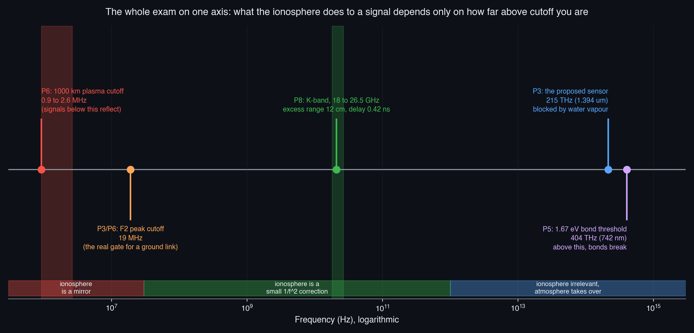
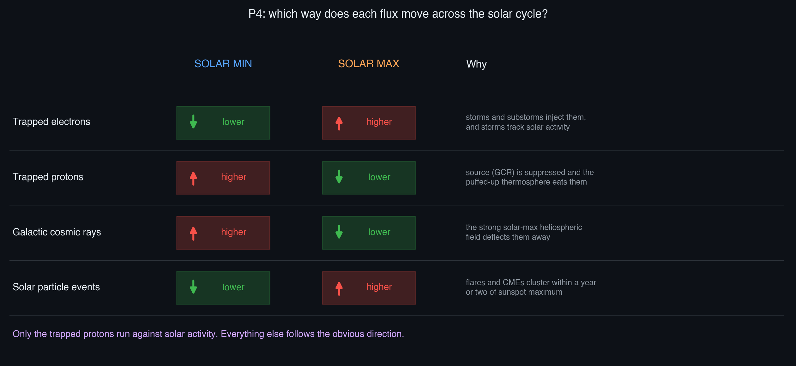
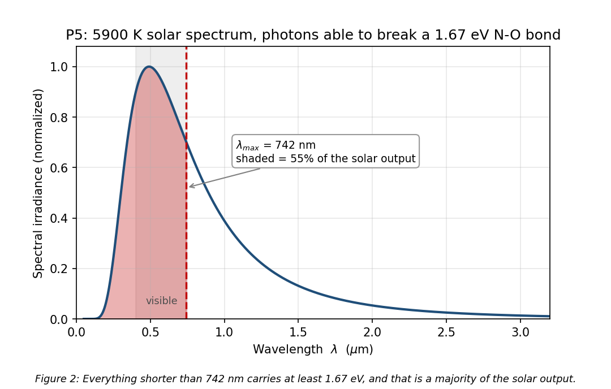
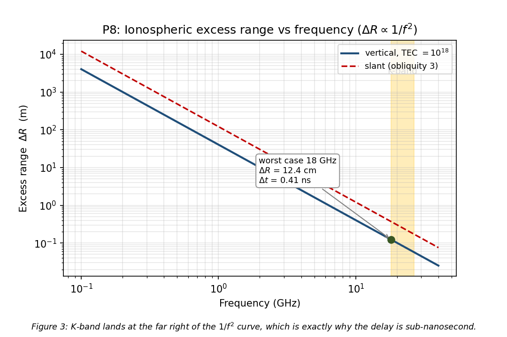
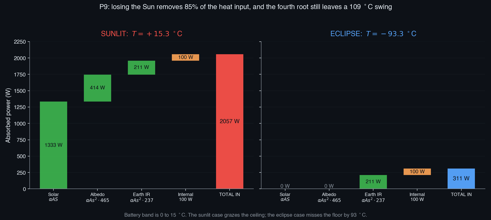
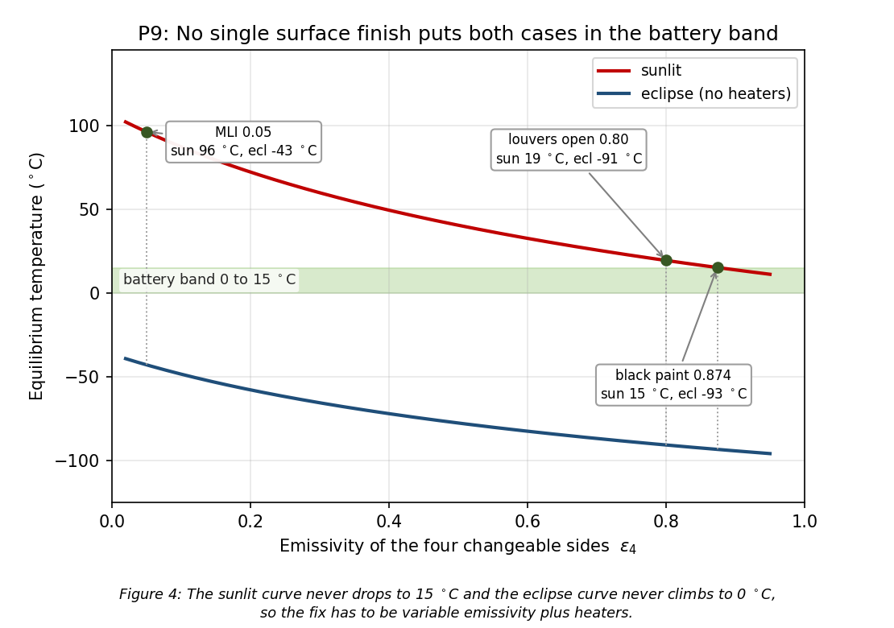

# SPCE 5065 Final Exam -- Socratic Solution Walkthrough
## The Space Environment: Vacuum, Neutral, Plasma, Radiation, and MMOD

---

## 30,000-Foot Overview

**The big question this exam asks:** given a spacecraft and an orbit, which piece of the space environment decides whether the design works, and can you put a number on it?

Every problem is a variation on that. The exam is roughly two-thirds recall and one-third calculation, but the calculations are the ones that carry the points, and they all reduce to four master relationships. Here is the whole thing in one pass:

- **Problems 1 and 2 (20 pts)** are recall with a twist: nearly every false statement is *mostly* true with one qualifier swapped. "REMs and RADs are equivalent" is only false because of where it says the belts; "an SEU permanently damages a device" is only false because of the word permanently.
- **Problem 3 (10 pts)** asks whether a 215 THz sensor at GEO can see the ground. It looks like a plasma question and turns out to be an atmosphere question, which is exactly why the hint names both.
- **Problem 4 (8 pts)** is a four-row table of which particle flux goes up and which goes down across the solar cycle. Three rows follow intuition and one does not.
- **Problem 5 (8 pts)** converts a bond energy to the longest photon wavelength that can break it, then asks whether that is most of the Sun's output.
- **Problem 6 (10 pts)** reads a plasma density off a chart and converts it to a cutoff frequency, then asks the "so what."
- **Problem 7 (9 pts)** is a ranking argument: three environmental hazards for a CubeSat, ordered and defended.
- **Problem 8 (10 pts)** is the ionospheric ranging error at K-band, which is really a question about how fast $1/f^2$ falls.
- **Problem 9 (15 pts)** is the largest single item: a six-face thermal balance, a verdict on whether it meets a battery requirement, and a costed redesign.
- **Problem 10 (10 pts)** asks for three ways to survive MMOD impacts.
- **Problem 11 (5 pts bonus)** derives the altitude rate from an applied thrust, using the energy method the drag derivation used.

**The thread.** Four equations carry this exam. The **plasma frequency** $f_p = 8.98\sqrt{n_e}$ decides whether a signal gets through at all, and $\Delta R = 40.31\,\text{TEC}/f^2$ decides what it costs you if it does; those two cover Problems 3, 6, and 8. The **photon energy** $E = hc/\lambda$ converts between "what the Sun emits" and "what a bond can absorb," which is Problem 5 and the physics behind the UV degradation in Problems 1 and 2. The **radiative energy balance** $Q_{in} = \varepsilon\sigma AT^4$ is Problem 9 and the first True/False item. And the **energy method** ($dE/dt$ from the orbit equals $dE/dt$ from the force) gives both the drag decay used in Problem 7 and the bonus derivation in Problem 11.

Everything else is knowing which environment owns which failure mode.

That single axis is worth internalizing before anything else. Where a signal sits relative to the plasma cutoff determines whether the ionosphere is a mirror (below cutoff), a small correction (just above), or completely irrelevant (optical). Problems 3, 6, and 8 are three different points on that one line.

---

## Problem 1 (10 pts) -- True / False

**Problem Statement:** Mark each of ten statements true or false: (a) high emissivity gives a lower equilibrium temperature; (b) safe mode is often used to recover from an MMOD impact; (c) free fall and zero gravity are the same; (d) a large positive bias voltage is best at GEO; (e) REMs and RADs are equivalent in the Van Allen belts; (f) the neutral environment is the same as the vacuum environment; (g) the most common cleanliness level is class 10,000, equivalent to ISO 7; (h) GCRs are higher-energy than SPE particles; (i) an SEU permanently damages a device and requires replacement; (j) a 1 mm debris particle in LEO is too small to cause significant damage.

**The punchline first:** T, T, F, F, F, F, T, T, F, F. Six of the ten are false, and in five of those six the error is a single qualifier rather than the whole claim.

| Part | Answer | Section |
|---|---|---|
| (a) High $\varepsilon$, lower $T$ | TRUE | §1.1 |
| (b) Safe mode after MMOD | TRUE | §1.5 |
| (c) Free fall = zero gravity | FALSE | §1.2 |
| (d) Large positive bias at GEO | FALSE | §1.3 |
| (e) REM = RAD in the belts | FALSE | §1.4 |
| (f) Neutral = vacuum | FALSE | §1.5 |
| (g) Class 10,000 = ISO 7 | TRUE | §1.5 |
| (h) GCR higher energy than SPE | TRUE | §1.4 |
| (i) SEU is permanent | FALSE | §1.4 |
| (j) 1 mm debris is harmless | FALSE | §1.5 |

---

### 1.1 (a) Why emissivity cools and absorptivity heats

**Before reading on, try this:** a surface absorbs a fixed 1000 W. Compute its equilibrium temperature over 6 m$^2$ first with $\varepsilon = 0.85$, then with $\varepsilon = 0.20$. Use $T = (Q/\varepsilon\sigma A)^{1/4}$ with $\sigma = 5.67\times10^{-8}$.

**The punchline:** raising emissivity lowers the equilibrium temperature, and the fourth root makes the effect much weaker than it looks.

**Derivation and Explanation:**

Absorptivity $\alpha$ is the fraction of incoming radiation a surface takes in. Emissivity $\varepsilon$ is the fraction of blackbody radiation it emits at its own temperature. Both run 0 to 1, and for a perfect blackbody both equal 1.

Steady state means in equals out:

$$Q_{in} = \varepsilon\sigma A T^4 \qquad\Longrightarrow\qquad T = \left(\frac{Q_{in}}{\varepsilon\sigma A}\right)^{1/4}$$

$\varepsilon$ sits in the denominator, so it is inversely related to $T$. Working the retrieval prompt: at $\varepsilon = 0.85$, $T = (1000/(0.85 \cdot 5.67\times10^{-8} \cdot 6))^{1/4} = 249$ K. At $\varepsilon = 0.20$, $T = 358$ K. Dropping emissivity by a factor of 4.25 raised the temperature by only 44%, because $4.25^{1/4} = 1.44$.

**Common Pitfall:** confusing the two coefficients. $\alpha$ acts on the *incoming* solar term, in the numerator, so raising $\alpha$ heats. $\varepsilon$ acts on the *outgoing* term, in the denominator, so raising $\varepsilon$ cools. What actually sets the temperature is the ratio $\alpha/\varepsilon$, which is why UV degradation of that ratio (Problem 2 III) is a thermal problem.

**Reflection:** the fourth root is the reason thermal control is hard. It damps your leverage: to halve the absolute temperature you need to change the radiating capacity by a factor of 16.

---

### 1.2 (c) Free fall is not zero gravity

**The punchline:** gravity in LEO is still about 91% of its surface value. What free fall removes is not gravity, it is the *contact forces*.

**Derivation and Explanation:**

Gravitational acceleration falls off as $1/r^2$. At the ISS altitude of ~400 km:

$$\frac{g_{orbit}}{g_{surface}} = \left(\frac{6378}{6378+400}\right)^2 = 0.886$$

So roughly 89 to 91% of surface gravity is still acting. If it were not, the station would travel in a straight line and leave.

What actually goes away is the normal force. On the ground, the floor pushes up on you and your body senses *that*, not gravity itself. In orbit, the spacecraft and everything in it accelerate identically, nothing pushes on anything, and the sensation is weightlessness. The correct terms are **free fall** or **microgravity**, never zero gravity.

**Common Pitfall:** treating this as pedantic vocabulary. It is not: the physiological effects that dominate long-duration missions (the headward fluid shift, unloading of weight-bearing bone, vestibular confusion) are all consequences of removing contact forces and the hydrostatic gradient, not of removing gravity.

**Reflection:** this is one of the few items where the everyday phrase and the technical phrase disagree, which is exactly why it shows up on exams.

---

### 1.3 (d) Why a big positive bias is the wrong move at GEO

**Before reading on, try this:** at the same temperature, compute the ratio of the electron mean thermal speed to the proton mean thermal speed, using $v = \sqrt{8k_BT/\pi m}$. Only the masses differ.

**The punchline:** the ratio is $\sqrt{m_p/m_e} = 42.85$, and that single number explains the entire sign convention of spacecraft charging.

**Derivation and Explanation:**

$$\frac{v_e}{v_i} = \sqrt{\frac{m_p}{m_e}} = \sqrt{\frac{1.673\times10^{-27}}{9.109\times10^{-31}}} = \sqrt{1836} = 42.85$$

Electrons arrive roughly 43 times faster than protons at the same temperature. An uncharged object therefore collects far more electrons than ions, charges negative, and keeps charging negative until it repels enough electrons to balance the ion current. That is the floating potential, and in the $10^7$ K GEO plasma it lands near $-2.5\,k_BT_e/e$, which is about $-2.2$ kV.

Now bias the vehicle strongly *positive*. You are deliberately attracting the fast species. Collected electron current goes up sharply, which drains power, drives larger differential potentials between conductors and dielectrics, and pushes you toward the arcing threshold. Arcing is the dominant GEO charging hazard, generating EMI that upsets avionics and damaging solar arrays.

**Common Pitfall:** thinking the danger is the absolute potential. It is not. A well-bonded conductive body sitting at $-2$ kV relative to the plasma is largely fine; what destroys hardware is *differential* charging, where coverglass, Kapton, and structure sit at different potentials and eventually arc across the gap.

**Reflection:** the mitigation follows straight from the diagnosis. Make every exterior surface at least partially conductive and bond it all to one ground, so the whole vehicle floats together instead of piecewise.

---

### 1.4 (e, h, i) The three radiation items

**The punchline:** rem and rad differ by the quality factor, which is 5 to 7 in the belts; GCRs beat SPE particles on energy but lose badly on flux; and an SEU is soft, not permanent.

**Derivation and Explanation:**

**(e) REM versus RAD.** A **rad** is absorbed dose, pure deposited energy per unit mass. A **rem** is dose *equivalent*, which weights that energy by how biologically damaging the particle type is:

$$\text{REM} = \text{RAD} \times \text{RBE}$$

RBE (relative biological effectiveness) is 1 for electromagnetic radiation at Earth, **5 to 7 in the radiation belts**, and about 10 for charged particles generally. Since the belts are full of trapped protons and electrons rather than gamma rays, RBE is not 1 there, so a rem is not a rad. The statement is false.

**(h) GCR versus SPE energies.** GCRs originate outside the solar system, are mostly hydrogen and helium nuclei, and reach GeV per nucleon and beyond. SPE protons are typically tens to hundreds of MeV. So GCRs win on *energy per particle* by one to three orders of magnitude. SPEs win overwhelmingly on *flux* during an event, which is why they are the acute hazard while GCRs are the chronic one. The statement, which is about energy, is true.

**(i) What an SEU actually is.** Single-event effects come in three flavours worth separating:

| Effect | What happens | Recoverable? |
|---|---|---|
| Upset (SEU) | A charged particle deposits enough charge to flip a memory bit | Yes, on rewrite or reset |
| Latch-up (SEL) | A parasitic thyristor turns on, drawing excessive current | Yes, if power-cycled fast enough; otherwise burnout |
| Burnout (SEB) | The device is destroyed outright | No |

An SEU is a soft error. Calling it permanent confuses it with burnout, so the statement is false.

**Common Pitfall:** on (h), reading "higher energy" as "more dangerous." During a large SPE the dose rate is far worse than the GCR background, but the GCR *background* is the one you cannot shield away, because stopping a GeV ion produces a shower of secondaries that can be worse than the primary.

**Reflection:** the three-way SEU/SEL/SEB split is the single most reusable distinction in the radiation lesson, and it comes back directly in Problem 2 I.

---

### 1.5 (b, f, g, j) The four environment-sorting items

**The punchline:** these four test whether the right effect is filed under the right environment.

**Derivation and Explanation:**

**(b) Safe mode after MMOD: TRUE.** Safe mode appears explicitly on the MMOD spacecraft-design-implications list, alongside redundancy, compartmentalization, and automatic isolation. An impact rarely announces itself as "impact." It shows up as an EMI transient, a bus fault, or a sensor dropout, and safing the vehicle into a power-positive, thermally stable, ground-commandable state buys time to diagnose it.

**(f) Neutral is not vacuum: FALSE.** They are consecutive but distinct chapters:

| Vacuum environment | Neutral environment |
|---|---|
| The problem is *absent* matter | The problem is the *residual* matter |
| Radiative-only heat transfer, severe thermal cycling | Aerodynamic drag and orbit decay |
| Outgassing and self-contamination | Atomic oxygen erosion |
| Cold welding | Physical sputtering |
| Solar UV degradation of coatings | Spacecraft glow |

**(g) Class 10,000 equals ISO 7: TRUE.** The Fed-Std-209 classes map onto the ISO 14644 classes as class 100 = ISO 5, class 1,000 = ISO 6, class 10,000 = ISO 7, class 100,000 = ISO 8. Class 10,000 is the standard spacecraft high-bay level; tighter classes exist for optical payloads but cost far more to certify and maintain.

**(j) 1 mm debris: FALSE.** Straight from the damage-versus-size table:

| Particle size | Effect |
|---|---|
| 0.1 mm | Surface erosion |
| 1 mm | **Serious damage** |
| 3 mm | Kinetic energy of a bowling ball at 100 mph |
| 1 cm | Kinetic energy of a 180 kg safe at 100 mph |

At ~10 km/s closing speed, kinetic energy scales as $v^2$, so even a tiny mass carries an enormous punch. Worse, 1 mm sits in the untrackable-but-lethal band: too small to see and dodge, big enough to hurt. That gap is exactly what Whipple shields exist to fill.

**Common Pitfall:** on (j), reasoning from everyday intuition about a 1 mm object. A grain of sand is harmless at highway speed and catastrophic at orbital speed, and that factor is $(10{,}000/30)^2 \approx 10^5$ in energy.

**Reflection:** the environment-versus-subsystem matrix in the course review is the cheat sheet for this whole class of question. If you can place an effect in the right row and column, you can answer these without memorizing individual statements.

> **Results for Problem 1**
> - **(a)** TRUE, **(b)** TRUE, **(c)** FALSE, **(d)** FALSE, **(e)** FALSE
> - **(f)** FALSE, **(g)** TRUE, **(h)** TRUE, **(i)** FALSE, **(j)** FALSE

> **Key takeaway from Problem 1:** the false statements are not wrong in their headline claim, they are wrong in one qualifier. "REMs and RADs are equivalent" fails only because of *in the belts*; "an SEU permanently damages a device" fails only because of *permanently*. Read each statement clause by clause and ask which single word would have to change to make it true.

> **Feynman test (in plain English):** each false statement is a true sentence with one word quietly swapped, so the trick is to slow down and find the word that is doing the lying.

---

## Problem 2 (10 pts) -- Multiple Choice

**Problem Statement:** (I) the relevance of a single-event latch-up; (II) outgassing is commonly due to which mechanisms, select all that apply; (III) solar UV alters which ratio, causing temperature changes; (IV) the primary purpose of a Whipple shield's thin front bumper; (V) the definition of a half-value layer.

**The punchline first:** I = (a); II = decomposition, diffusion, desorption; III = absorptivity to emissivity; IV = vaporize or fragment the projectile; V = reduce the photon flux by one-half. Every distractor is a real phenomenon filed under the wrong heading.

| Part | Answer | Section |
|---|---|---|
| (I) Latch-up relevance | (a) excessive current, needs reset, can be permanent | §2.1 |
| (II) Outgassing mechanisms | (b), (d), (e) | §2.2 |
| (III) UV alters which ratio | (c) $\alpha/\varepsilon$ | §2.2 |
| (IV) Whipple bumper purpose | (b) vaporize or fragment | §2.3 |
| (V) Half-value layer | reduce photon flux by half | §2.1 |

---

### 2.1 (I, V) The two radiation items

**The punchline:** latch-up is the *recoverable-if-you-catch-it* single-event effect, and HVL is defined on flux, not on energy.

**Derivation and Explanation:**

**(I)** A latch-up fires a parasitic thyristor structure inside a CMOS device. The part then conducts a large current independent of its inputs and stays that way until power is removed. Two consequences follow, and answer (a) names both: the excessive current draw demands a protective shutdown or reset, and if the current is not interrupted quickly the device destroys itself. Working the distractors is the fastest route to (a):

- (b) claims fault tolerance *always* detects and isolates. No architecture is guaranteed, least of all on a low-cost bus.
- (c) claims catastrophic and unrecoverable. Overstated: latch-up is usually cleared by a power cycle.
- (d) describes progressive susceptibility, which is displacement damage or TID, not latch-up.

**(V)** Attenuation through a shield is exponential in thickness. The half-value layer is the thickness that cuts the **photon flux density** in half:

$$\frac{\Phi}{\Phi_0} = \left(\frac{1}{2}\right)^{x/\text{HVL}}$$

Worked example: 1 MeV gammas through 10 cm of lead with HVL = 0.85 cm gives $(1/2)^{10/0.85} = (1/2)^{11.76} = 2.9\times10^{-4}$, so about 0.03% gets through.

**Common Pitfall:** on (V), reading HVL as halving the photon *energy*. It does not. Individual photons that pass through Compton scattering do lose energy, but the definition is about how many photons survive, not how energetic they are.

**Reflection:** because attenuation is exponential, shielding has diminishing returns per kilogram, which is why spot shielding beats blanket shielding on a mass-limited vehicle.

---

### 2.2 (II, III) The two vacuum-environment items

**Before reading on, try this:** of decantation, decomposition, deflagration, diffusion, and desorption, three are outgassing mechanisms and two are not. Sort them by asking which processes could release a gas molecule from a solid *in a vacuum, with no combustion and no liquid present*.

**The punchline:** desorption, diffusion, and decomposition. The two impostors are decantation (pouring a liquid off a sediment) and deflagration (subsonic combustion).

**Derivation and Explanation:**

The three real mechanisms differ mainly in *where the molecule started* and therefore in *how the rate decays with time*:

| Mechanism | Source of the molecule | Time behaviour |
|---|---|---|
| **Desorption** | Adsorbed on the surface, mostly water | Fast, dominates the first hours to days on orbit |
| **Diffusion** | Dissolved in the bulk of the material | Slow, the long tail that lasts months |
| **Decomposition** | Created by the material breaking down | Depends on temperature and UV exposure, can accelerate |

This is why outgassing is characterized by two numbers, total mass loss (TML, limit 1.00%) and collected volatile condensable material (CVCM, limit 0.10%), and why instruments are held at reduced power until the initial desorption burst has passed.

**(III)** For the same absorbed and emitted terms, the equilibrium temperature depends on the ratio $\alpha/\varepsilon$. Solar UV darkens thermal-control coatings, which drives $\alpha$ up much faster than it moves $\varepsilon$, so the ratio climbs and the vehicle warms:

$$\Delta T \cong \frac{T}{4}\,\frac{\Delta(\alpha/\varepsilon)}{(\alpha/\varepsilon)}$$

Note the factor of $T/4$: it is the same fourth-root damping from §1.1, written as a sensitivity.

**Common Pitfall:** confusing the two contamination families. Outgassing is *molecular* contamination, a film that condenses on cold optics and radiators. Cleanroom classes (Problem 1g) control *particulate* contamination. Different mechanism, different control program, both under the vacuum environment.

**Reflection:** the $\alpha/\varepsilon$ ratio is the connective tissue of this course. It appears in the UV lesson as a degradation mechanism, in the thermal lesson as a design variable, and in Problem 9 as the thing you buy with a coating.

---

### 2.3 (IV) What the Whipple bumper is actually for

**The punchline:** the bumper is deliberately too thin to stop the particle. Its job is to *break the particle up* so the rear wall takes a spread-out load instead of a point punch.

**Derivation and Explanation:**

At LEO closing speeds of ~10 km/s, an impacting particle does not behave like a bullet. Sorting by velocity:

| Impact velocity | What happens to the projectile |
|---|---|
| < 2 km/s | Remains intact |
| 2 to 7 km/s | Shatters into fragments |
| 7 to 11 km/s | Reaches a molten state |
| > 11 km/s | Vaporizes |

Above ~7 km/s the projectile stops being a solid object on contact. The Whipple shield exploits that: a thin sacrificial bumper converts the intact particle into an expanding cloud of fragments, melt, and vapour, and the standoff distance behind it lets that cloud spread over a wide footprint before it reaches the rear wall. The rear wall then absorbs a distributed impulse instead of a concentrated one, which it can survive at a fraction of the mass of a monolithic shield.

**Common Pitfall:** choosing (c), "absorb all of the impact energy by itself." That is what the bumper is explicitly *not* designed to do. A thick bumper would defeat the purpose: it would fail to disrupt the particle efficiently and would cost far more mass than the two-sheet-plus-gap arrangement.

**Reflection:** the standoff distance matters as much as the sheet thicknesses. Shrink the gap and the cloud has no room to spread, so the shield stops working even with the same total mass.

> **Results for Problem 2**
> - **(I)** (a) excessive current draw, needs protective shutdown or reset, potentially permanent
> - **(II)** (b) decomposition, (d) diffusion, (e) desorption
> - **(III)** (c) absorptivity to emissivity ratio
> - **(IV)** (b) vaporize or fragment the projectile before it reaches the rear wall
> - **(V)** reduce the photon flux by one-half

> **Key takeaway from Problem 2:** every distractor here is a real physical process that belongs to a different box. Decantation and deflagration are real, just not vacuum processes; "catastrophically destroys the electronics" describes burnout, not latch-up; "absorb all the energy" describes armour, not a Whipple bumper. Sorting each option into the correct pile is faster than evaluating each on its own merits.

> **Feynman test (in plain English):** the wrong answers are all true statements about something else, so the game is figuring out which drawer each one belongs in before you pick.

---

## Problem 3 (10 pts) -- The 215 THz GEO Sensor

**Problem Statement:** a GEO satellite carries a sensor that will identify a target on Earth's surface at 215 THz. Will this be an effective design? Explain, considering both plasma oscillations and atmospheric transmittance.

**The punchline first:** no. The plasma is irrelevant by seven orders of magnitude, but 1.394 $\mu$m sits at the bottom of a deep water-vapour absorption band, so the ground is invisible from orbit at that frequency.

---

### 3.1 Convert the frequency before anything else

**Before reading on, try this:** convert 215 THz to a wavelength, then place it on the exam's solar transmittance chart. Is it in the visible, the near-IR, or the thermal IR?

**The punchline:** $\lambda = 1.394\ \mu$m, short-wave infrared, just past the red end of the visible.

**Derivation and Explanation:**

$$\lambda = \frac{c}{f} = \frac{2.998\times10^8\ \text{m/s}}{2.15\times10^{14}\ \text{Hz}} = 1.394\times10^{-6}\ \text{m} = 1.394\ \mu\text{m}$$

This conversion is the whole problem. The transmittance chart is drawn in microns and the sensor is specified in terahertz, so nothing can be evaluated until the units agree. Do this step first and the rest of the problem answers itself.

**Common Pitfall:** attacking the problem in frequency space. The absorption bands are labelled by wavelength, and 215 THz means nothing on that chart until it becomes 1.394 $\mu$m.

**Reflection:** terahertz and microns are reciprocal, and a useful mental anchor is that 300 THz is exactly 1 $\mu$m. From there, 215 THz must be longer than 1 $\mu$m by the ratio 300/215, giving 1.4.

---

### 3.2 The plasma check, and why it is a red herring

**The punchline:** the highest plasma cutoff anywhere along the path is about 20 MHz. The sensor runs roughly 10 million times higher, so the ionosphere might as well not be there.

**Derivation and Explanation:**

A signal propagates through a plasma only above the local plasma frequency:

$$f_p = \frac{1}{2\pi}\sqrt{\frac{n_e e^2}{\varepsilon_0 m_e}} = 8.98\sqrt{n_e}\ \text{Hz}\quad (n_e \text{ in m}^{-3})$$

The worst case on a GEO-to-ground path is the F2 peak near 300 km at daytime solar max, which reads off the same chart at roughly $5\times10^{12}$ m$^{-3}$ (again one significant figure, see §6.1):

$$f_{p,max} = 8.98\sqrt{5\times10^{12}} = 8.98 \times 2.24\times10^6 = 2.0\times10^7\ \text{Hz} \approx 20\ \text{MHz}$$

$$\frac{f_{sensor}}{f_{p,max}} = \frac{2.15\times10^{14}}{1.91\times10^7} = 1.1\times10^7$$

The residual effects scale as $1/f^2$, so they vanish too. Excess range at 215 THz with a worst-case TEC of $10^{18}$ e/m$^2$:

$$\Delta R = \frac{40.31 \times 10^{18}}{(2.15\times10^{14})^2} = 8.7\times10^{-10}\ \text{m}$$

Under a nanometre. Group delay, Faraday rotation, and scintillation are equally irrelevant.

**Common Pitfall:** stopping here. The hint asks for both checks, and answering only the plasma half gets the wrong verdict entirely: "the plasma is fine, therefore the design works."

**Reflection:** the hint is doing real teaching. It sets up an expectation that plasma will be the villain, and the point of the exercise is that at optical frequencies the atmosphere takes over completely as the limiting medium.

---

### 3.3 The atmosphere is what kills it

**The punchline:** 1.35 to 1.45 $\mu$m is one of the deepest H$_2$O absorption bands in the near-IR, and 1.394 $\mu$m is at the bottom of it.

**Derivation and Explanation:**

On the transmittance chart, two curves matter: solar irradiance *outside* the atmosphere, and solar irradiance *at sea level*. The gap between them is what the atmosphere absorbed, and the labels name the absorber: O$_3$ in the UV, then a run of H$_2$O bands through the near-IR, then H$_2$O and CO$_2$ beyond 1.8 $\mu$m.

Around 1.4 $\mu$m the sea-level curve does not merely dip, it goes to essentially zero. Since transmittance is reciprocal (a path that blocks sunlight coming down blocks the target signature going up), a sensor at 1.394 $\mu$m sees water vapour in the troposphere and never reaches the surface.

**The fix.** Move to an atmospheric window, one of the wavelength ranges where the two curves nearly touch:

| Window | Frequency | Comment |
|---|---|---|
| 0.4 to 0.9 $\mu$m | 333 to 750 THz | Widest and cleanest, needs a daylight or reflective signature |
| 1.55 to 1.75 $\mu$m | 171 to 194 THz | Nearest clean window, ~15% shift in wavelength |
| 2.0 to 2.4 $\mu$m | 125 to 150 THz | Also clean, useful for thermal signatures |

Shifting the design from 215 THz to about 185 THz costs nothing but a detector selection and recovers the entire link.

**Common Pitfall:** concluding "infrared does not work from space." It works fine; the specific *band* is the problem. There is a strong window immediately next door.

**Reflection:** worth noting as a secondary limitation: GEO is 35,786 km up, so even in a clean window a 1.4 $\mu$m sensor needs a very large aperture for useful ground resolution. Transmittance disqualifies this design first, but aperture would have been the next wall.

> **Key takeaway from Problem 3:** convert to wavelength immediately, then run both checks the hint names. The plasma cutoff tops out around 20 MHz so anything optical clears it by seven orders of magnitude, which means the atmosphere is always the binding constraint for a ground-imaging sensor. 1.394 $\mu$m lands in a water band, so the answer is no, and the fix is a ~15% shift into the adjacent window.

> **Feynman test (in plain English):** the charged layer high up stops only radio waves and this sensor is basically light, so it sails through, but then it runs into the water vapour in the air below, which soaks up that exact colour and hides the ground completely.

---

## Problem 4 (8 pts) -- Charged-Particle Flux vs Solar Activity

**Problem Statement:** correlate the charged-particle radiation flux density with solar activity, labelling each cell "lower" or "higher" for trapped electrons, trapped protons, galactic cosmic rays, and solar particle events, at solar min and solar max.

**The punchline first:** three of the four rows follow solar activity in the obvious direction. Only the trapped protons run against it.

---

### 4.1 The three intuitive rows

**The punchline:** trapped electrons and SPEs follow solar activity; GCRs oppose it because the Sun shields against them.

**Derivation and Explanation:**

**Solar particle events.** SPEs are flares and coronal mass ejections, which are solar activity, so they cluster within a year or two of sunspot maximum and nearly disappear around minimum. Lower at min, higher at max. This is the row nobody gets wrong.

**Trapped electrons.** Outer-belt electrons are energized and injected by geomagnetic storms and substorms, which are driven by the solar wind and CMEs. More solar activity, more storms, a fatter outer belt. Lower at min, higher at max.

**Galactic cosmic rays.** GCRs come from outside the solar system, so the Sun is not their source but their *shield*. At solar max the heliospheric magnetic field carried by the solar wind is strongest and most turbulent, deflecting more incoming galactic particles. This is called solar modulation, and it means GCRs are highest at solar min. Higher at min, lower at max.

**Common Pitfall:** treating GCR as "another kind of solar radiation." The name is the hint: *galactic*. The Sun does not make them, it blocks them, so the correlation inverts.

**Reflection:** this is the same anti-correlation that appeared on the midterm as "when GCR event frequency is low, extreme solar event frequency is high." Same physics, asked two ways.

---

### 4.2 The row that catches people: trapped protons

**Before reading on, try this:** name where inner-belt protons come from, and name what removes them. Then work out which way each of those two processes moves as solar activity rises.

**The punchline:** higher at solar min. Both the source and the loss mechanism push in the same direction, which is what makes the answer unambiguous.

**Derivation and Explanation:**

**The source.** Inner-belt protons are produced largely by cosmic-ray albedo neutron decay (CRAND). GCRs strike the upper atmosphere, produce neutrons, some of those neutrons travel upward and decay into a proton plus an electron, and the magnetic field traps the proton. So the source of trapped protons *is* the GCR flux, which from §4.1 is highest at solar min.

**The loss.** Trapped protons are removed by scattering off residual atmosphere at the bottom of their mirroring path. At solar max the increased EUV output heats and expands the thermosphere, raising the density at any given altitude, which raises the loss rate.

Both effects point the same way:

$$\text{solar max} \Rightarrow \underbrace{\text{fewer GCRs}}_{\text{less source}} + \underbrace{\text{puffier atmosphere}}_{\text{more loss}} \Rightarrow \text{fewer trapped protons}$$

So trapped protons are **higher at solar min, lower at solar max**.

**Common Pitfall:** assuming the two trapped rows move together because they share a row heading. They do not: electrons are storm-driven and follow activity, protons are GCR-fed and atmosphere-limited and oppose it. Filling both rows the same way is the single most common error on this table.

**Reflection:** the same thermospheric expansion that eats trapped protons at solar max is what accelerates satellite drag decay at solar max. One physical mechanism, two apparently unrelated consequences.

> **Results for Problem 4**
> - **Trapped electrons:** lower at solar min, higher at solar max
> - **Trapped protons:** higher at solar min, lower at solar max
> - **Galactic cosmic rays:** higher at solar min, lower at solar max
> - **Solar particle events:** lower at solar min, higher at solar max

> **Key takeaway from Problem 4:** ask for each source whether the Sun *makes* it or *blocks* it. The Sun makes SPEs and drives the storms that pump the electron belt, so those follow activity. The Sun blocks GCRs, so they invert. Trapped protons invert too, because GCRs feed them and the solar-max atmosphere eats them.

> **Feynman test (in plain English):** the Sun is both a machine gun and an umbrella, so anything it fires goes up when it is active and anything it shields you from goes down.

---

## Problem 5 (8 pts) -- Severing the N-O Bond

**Problem Statement:** NO has a bond energy of 1.67 eV in the lower ionosphere. (a) Identify the maximum wavelength a photon may have and still sever the bond. (b) Is this a significant part of the solar spectrum (more than 50%)?

**The punchline first:** 742 nm, and yes, roughly 55% of the Sun's output is shorter than that.

| Part | Answer | Section |
|---|---|---|
| (a) Maximum wavelength | 742 nm (0.742 $\mu$m, 404 THz) | §5.1 |
| (b) More than 50% of the spectrum? | Yes, about 55% | §5.2 |

---

### 5.1 (a) Bond energy to wavelength

**Before reading on, try this:** compute $\lambda_{max}$ for a 3.47 eV carbon-carbon single bond using $\lambda = 1239.84/E$ with $E$ in eV and $\lambda$ in nm. Then predict, without computing, whether the 1.67 eV N-O answer will be longer or shorter.

**The punchline:** $\lambda_{max} = 742.4$ nm. A weaker bond means a *longer* usable wavelength, because less energy per photon is required.

**Derivation and Explanation:**

A photon's energy depends only on its frequency:

$$E = h\nu = \frac{hc}{\lambda} \qquad\Longrightarrow\qquad \lambda_{max} = \frac{hc}{E_{bond}}$$

The bond breaks if and only if a single photon carries at least $E_{bond}$. That "single photon" condition is the crux: this is a threshold process, not an accumulation process. A million photons at 1.0 eV each will not break a 1.67 eV bond, no matter how bright the source.

Working it in SI:

$$E_{bond} = 1.67\ \text{eV} \times 1.602\times10^{-19}\ \text{J/eV} = 2.676\times10^{-19}\ \text{J}$$

$$\lambda_{max} = \frac{(6.626\times10^{-34})(2.998\times10^8)}{2.676\times10^{-19}} = 7.424\times10^{-7}\ \text{m} = 742.4\ \text{nm}$$

The shortcut worth memorizing is $hc = 1239.84$ eV$\cdot$nm, so $\lambda_{max}[\text{nm}] = 1239.84/E[\text{eV}]$. Checking: $1239.84/1.67 = 742.4$ nm. Working the retrieval prompt, the C-C bond gives $1239.84/3.47 = 357$ nm, comfortably in the UV. The N-O bond is about half as strong, so its threshold is about twice the wavelength and lands in the visible.

**Common Pitfall:** getting the inequality backwards. Photons *shorter* than $\lambda_{max}$ have more energy and break the bond. Photons longer than it cannot. The word "maximum" refers to wavelength, which corresponds to a *minimum* energy.

**Reflection:** this is the same calculation as the UV degradation lesson, run in reverse. There you ask "what does a given photon destroy," here you ask "what photon do I need to destroy a given thing."

---

### 5.2 (b) What fraction of sunlight qualifies

**The punchline:** 742 nm sits right at the red edge of the visible band, so "everything that can break this bond" is the entire visible band plus all of the UV. That is about 55% of the Sun's output.

**Derivation and Explanation:**

The exam says the answer need not be quantified, and the qualitative argument is fully sufficient: the visible spectrum runs roughly 400 to 750 nm, the threshold is 742 nm, and on the solar irradiance chart the curve peaks near 500 nm. So the shaded region covers the peak *and* everything to the left of it, which is visibly more than half the area.

For confidence, integrating the 5900 K blackbody the chart is drawn against gives 54.6%. The sensitivity check matters more than the number itself:

| Assumed solar temperature | Fraction below 742 nm |
|---|---|
| 5778 K | 53.1% |
| 5900 K | 54.6% |
| 6000 K | 55.7% |

The conclusion survives across the whole plausible range, so the "more than 50%" answer is not an artifact of the temperature assumption.

**Common Pitfall:** answering "no" by reasoning that bond-breaking is a UV process. That is the reflex from the UV degradation lesson, where the bonds are strong (3 to 5 eV) and the thresholds genuinely sit in the UV. At 1.67 eV the threshold has fallen out of the UV entirely and into the visible, which is precisely where the Sun puts most of its energy.

**Reflection:** the physical consequence is that this bond is being broken continuously in daylight rather than occasionally by rare UV photons, which is a large part of why NO chemistry in the lower ionosphere is so active.

> **Results for Problem 5**
> - **(a)** $\lambda_{max} = 742$ nm (0.742 $\mu$m, or 404 THz)
> - **(b)** Yes, about 55% of the solar output lies below 742 nm

> **Key takeaway from Problem 5:** $\lambda_{max} = 1239.84/E[\text{eV}]$ nm converts any bond energy to a threshold wavelength in one step. Then place that threshold on the solar spectrum: above ~400 nm you are in the visible where the Sun peaks, so the answer to "is that significant" is yes; below ~300 nm you are in the UV tail, and the answer would be no.

> **Feynman test (in plain English):** breaking a bond needs one photon strong enough to do it alone, and this bond is so weak that ordinary visible light qualifies, which is why more than half of sunlight can snap it.

---

## Problem 6 (10 pts) -- Plasma Frequencies at 1000 km

**Problem Statement:** what is the approximate range of plasma frequencies, in MHz, associated with a 1000 km altitude orbit, and why are we interested in that range?

**The punchline first:** roughly 0.9 to 2.8 MHz, call it 1 to 3 MHz. We care because it is a hard cutoff: below it, signals reflect and never get through.

---

### 6.1 Reading the chart and converting

**Before reading on, try this:** read the four curves at the 1000 km row of the plasma density profile. Then convert the lowest and highest values with $f_p = 8.98\sqrt{n_e}$ Hz.

**The punchline:** densities span roughly $10^{10}$ to $10^{11}$ m$^{-3}$, about one decade, which becomes only a $\sqrt{10} = 3.2$x frequency range.

**A note on precision.** These are reads off a scanned log plot, so one significant figure is all they support. Locating a marker to $\pm10$ pixels on this chart is already $\pm7\%$ in density, and estimating the decade gridline positions adds more. Quoting a density as $1.05\times10^{10}$ would be claiming precision the chart cannot deliver, and the square root hides it further: a $\pm30\%$ error in $n_e$ is only $\pm14\%$ in $f_p$. Read the bracket, not the point.

**Derivation and Explanation:**

The chart carries four curves because ionospheric density depends on two independent things: local time (the Sun is what ionizes, so daytime density beats nighttime) and solar cycle phase (more EUV at solar max means more ionization). Reading the 1000 km row:

| Condition | $n_e$ (m$^{-3}$), to 1 sig fig | $f_p = 8.98\sqrt{n_e}$ |
|---|---|---|
| Night, solar min | $\sim1\times10^{10}$ | ~0.9 MHz |
| Day, solar min | $\sim1\times10^{10}$ | ~0.9 MHz |
| Night, solar max | $\sim3\times10^{10}$ | ~1.6 MHz |
| Day, solar max | $\sim9\times10^{10}$ | ~2.7 MHz |

The two solar-min curves nearly overlap at 1000 km, which is worth noticing: this high up, the day/night contrast has largely washed out and the solar cycle is doing most of the work. Only at the F-region peak far below do day and night separate strongly.

Working the two bracket ends explicitly:

$$f_p(10^{10}) = 8.98\sqrt{10^{10}} = 8.98\times10^5\ \text{Hz} = 0.90\ \text{MHz}$$
$$f_p(10^{11}) = 8.98\sqrt{10^{11}} = 2.84\times10^6\ \text{Hz} = 2.8\ \text{MHz}$$

Where the 8.98 comes from:

$$f_p = \frac{1}{2\pi}\sqrt{\frac{n_e e^2}{\varepsilon_0 m_e}}, \qquad \frac{1}{2\pi}\sqrt{\frac{e^2}{\varepsilon_0 m_e}} = \frac{1}{2\pi}\sqrt{3182.6} = 8.98$$

Note the square root's effect: a full decade of density compresses to $\sqrt{10} = 3.2$x in frequency. That damping is why the cutoff band at any altitude is narrow even though the density is wildly variable, and it is also why sloppy chart reading costs less here than it would elsewhere.

**Common Pitfall:** mixing up density units. The 8.98 coefficient requires $n_e$ in m$^{-3}$. If the chart were in cm$^{-3}$ the coefficient would be 8980, and the answer would be off by a factor of 1000.

**Reflection:** the plasma frequency is the natural oscillation rate of the electron gas when it is displaced from the ions. Drive it slower than that and the electrons keep up and cancel the wave, which is the reflection. Drive it faster and they cannot respond, so the wave passes.

---

### 6.2 Why the range matters

**The punchline:** it is a wall, not an attenuation, and it moves by a factor of 3 with time of day and solar cycle.

**Derivation and Explanation:**

Four distinct reasons, and a complete answer names several:

**1. It is a hard cutoff.** Below $f_p$ the wave does not attenuate, it reflects. There is no link-budget margin that recovers it. Anything communicating with a 1000 km orbit must be above ~3 MHz, and for a *ground* link it must also clear the F2 peak beneath the orbit, which reaches ~20 MHz at daytime solar max. The layer below the satellite, not the layer at the satellite, is the real gate.

**2. The same reflection is useful.** Below-cutoff reflection is exactly what makes HF skywave propagation work, bouncing signals around the curve of the Earth, and it is what an ionosonde measures to retrieve the density profile.

**3. Above cutoff you still pay a price.** The residual effects all scale as $1/f^2$: group delay, excess range, and Faraday rotation. That is Problem 8.

**4. It moves.** Day to night and min to max shift the cutoff by a factor of ~3 at a given altitude, and ionospheric storms, sudden ionospheric disturbances, and travelling ionospheric disturbances move it further. A link budget must carry the worst case, not the average.

**Common Pitfall:** answering only "so we know what frequency to use." True but thin for a 10-point question. The strong answer covers the cutoff, the residual $1/f^2$ effects above it, and the variability.

**Reflection:** this is why real satellite communications live at hundreds of MHz to tens of GHz. Far enough above cutoff that the plasma becomes a small, correctable perturbation rather than a wall.

> **Key takeaway from Problem 6:** $f_p = 8.98\sqrt{n_e}$ turns any density into a cutoff frequency, and at 1000 km that is 0.9 to 2.8 MHz. It matters because it is binary (below it, nothing gets through), because the denser F2 layer *underneath* the orbit sets a higher ~20 MHz gate for any ground link, and because the whole thing moves by a factor of 3 with local time and solar cycle.

> **Feynman test (in plain English):** the charged layer around the Earth acts like a mirror for slow radio waves and a window for fast ones, and the plasma frequency is just the dividing line between mirror and window.

---

## Problem 7 (9 pts) -- Three Environmental Hazards for a 550 km CubeSat

**Problem Statement:** a CubeSat is planned for a 550 km sun-synchronous orbit with a limited mass budget, requiring a 5-year lifetime, reliable communications, low development cost, and COTS electronics wherever possible. Select three environmental hazards to address first, rank them most to least important, justify the ranking, and for each recommend one mitigation and discuss one tradeoff.

**The punchline first:** radiation, then the neutral environment, then plasma charging. The ranking has to be *argued*, not just listed, and the strongest arguments come from the mission's own stated requirements.

---

### 7.1 How to build a defensible ranking

**The punchline:** rank by which hazard is most certain to break a *stated requirement*, and say so explicitly. The requirements list is the grading rubric in disguise.

**Derivation and Explanation:**

The problem hands over four requirements: a 5-year lifetime, reliable communications, low development cost, and COTS electronics. Every one of those is a hook:

| Requirement | Which hazard attacks it |
|---|---|
| 5-year lifetime | Drag decay, atomic oxygen erosion, cumulative radiation dose |
| Reliable communications | Radiation upsets, ESD-generated EMI, plasma effects on the link |
| Low development cost | Constrains every mitigation |
| COTS electronics | Directly amplifies radiation susceptibility |

Two of the four requirements point at radiation, and the COTS requirement makes radiation worse specifically. That is the ranking argument.

**A ranking axis that works:** certainty times consequence. A hazard that is *guaranteed* to accumulate over five years outranks one that is merely probable, even if the probable one is more dramatic.

**Common Pitfall:** asserting severity without checking it. Drag looks like the obvious lifetime threat at 550 km, and running the numbers shows it is not, which is worth doing before committing to a ranking.

**Reflection:** the "one tradeoff each" requirement is a third of the points. A mitigation with no stated cost reads as a wish rather than an engineering decision.

---

### 7.2 Running the drag number before trusting the intuition

**Before reading on, try this:** estimate the ballistic coefficient of a 3U CubeSat (4 kg, $C_d = 2.2$, frontal area 0.03 m$^2$) and compare it to the 25 to 200 kg/m$^2$ typical range.

**The punchline:** $BC \approx 61$ kg/m$^2$, low but inside the normal range, and the resulting decay from 550 km is only about 40 km over the full 5 years.

**Derivation and Explanation:**

$$BC = \frac{m}{C_d A} = \frac{4.0}{2.2 \times 0.03} = 60.6\ \text{kg/m}^2$$

Integrating the course decay relation forward, with density from the power-law fit to the LEO profile:

$$\frac{dR}{dt} = -\frac{\rho}{BC}\sqrt{\mu R}$$

At 550 km, $\rho \approx 2.3\times10^{-13}$ kg/m$^3$, which gives an initial decay rate of 6.2 km/year. The rate accelerates as the satellite drops into thicker air, so the 5-year average works out near 8 km/year and the satellite finishes at about 510 km. It is still comfortably in orbit.

So drag is a **budget item, not a killer** here, and it actually helps the mission: natural decay provides post-mission disposal for free. The sharper half of the neutral hazard is atomic oxygen, which erodes exposed polyimide over five years even though AO density falls steeply with altitude.

**Common Pitfall:** carrying an intuition from a lower altitude. At 400 km the same CubeSat has a lifetime measured in a year or two; at 550 km the density is roughly an order of magnitude lower and the picture changes completely. Altitude is the master variable, and 150 km of it matters enormously.

**Reflection:** this is a good habit in general on ranking questions. One quick calculation can invert an ordering you were about to assert on intuition.

---

### 7.3 The three hazards, with mitigations and tradeoffs

**The punchline:** each entry needs a *why it ranks there*, a *specific* mitigation, and an honest cost.

**Derivation and Explanation:**

**Rank 1: Radiation (TID and single-event effects on COTS parts).** Sun-synchronous is polar, so the vehicle crosses the auroral horns of the outer belt every revolution and cuts the SAA repeatedly. Dose accumulates for five years with no recovery mechanism, and COTS parts carry no rad-hard guarantee. This threatens "reliable communications" directly, and unlike the other two it only gets worse.

- *Mitigation:* spot-shield the most dose-sensitive devices only, add current-limiting latch-up protection on every COTS rail so an SEL becomes a reset instead of a burnout, and run EDAC memory behind an independent watchdog.
- *Tradeoff:* it buys reliability with **availability**. Every autonomous watchdog reset is a comm outage and a hole in the data record, so the fix for reliability partly undermines it. Spot shielding also spends mass from the binding constraint.

**Rank 2: Neutral environment (atomic oxygen, with drag as a budget item).** Certain and continuous, but degrading rather than mission-ending, per §7.2.

- *Mitigation:* AO-resistant external materials (germanium-coated black Kapton, or a SiO$_x$ overcoat on exposed polyimide) plus a low-frontal-area attitude with the long axis along velocity.
- *Tradeoff:* protective overcoats change the surface $\alpha/\varepsilon$, so the AO fix perturbs the thermal design and forces re-analysis. The minimum-drag attitude also fights the pointing the payload, arrays, and antenna each want.

**Rank 3: Plasma (auroral-zone charging and ESD).** Genuinely dangerous but episodic, and the cheapest of the three to fix, so it earns the least mass and budget. The polar orbit crosses the auroral oval twice per revolution, where energetic electrons charge dielectrics differentially. The failure mode is the arc, not the potential.

- *Mitigation:* make every exterior surface at least partially conductive (ITO on coverglass, conductive paint or anodize on structure) and bond all conductive elements to a single chassis ground.
- *Tradeoff:* ITO coverglass costs more and shaves array output on a power-starved CubeSat, and the bonding straps add harness mass and assembly labour.

**Common Pitfall:** offering a mitigation that violates a stated requirement without acknowledging it. Recommending rad-hard parts on a mission that specifies COTS and low cost, or a propulsion system on a mass-limited CubeSat, needs the conflict named explicitly.

**Reflection:** MMOD deserves an honourable mention rather than a top-three slot. At 550 km the debris density is the highest in LEO, but a 3U cross-section makes the five-year collision probability low, and there is no mass to shield it anyway.

> **Key takeaway from Problem 7:** rank by which hazard most certainly breaks a stated requirement, and run at least one number before committing. Radiation wins here because two of the four requirements point at it and the COTS requirement amplifies it, while drag, which looks like the obvious lifetime threat, costs only ~40 km over 5 years at 550 km. Every mitigation needs a named cost.

> **Feynman test (in plain English):** cheap parts flying over the poles get slowly cooked by particles for five years straight, and that steady damage is a surer way to lose the mission than the thin air, which barely nudges the satellite down.

---

## Problem 8 (10 pts) -- Worst-Case Excess Range and Delay at K-band

**Problem Statement:** what is the expected worst-case excess range and time delay for a satellite operating at 500 km in K-band? State assumptions and show work.

**The punchline first:** about 12 cm and 0.42 ns vertically, rising to ~37 cm and ~1.2 ns on a horizon-grazing pass. The whole problem is $1/f^2$ and a defensible worst case.

---

### 8.1 Choosing the worst case

**Before reading on, try this:** list every input to $\Delta R = 40.31\,\text{TEC}/f^2$ and decide, for each, which direction makes the answer *worse*.

**The punchline:** worst case means the lowest frequency in the band (18 GHz) and the highest plausible TEC ($10^{18}$ e/m$^2$), plus the longest slant path.

**Derivation and Explanation:**

The word "worst-case" is doing real work, and stating the assumptions is explicitly part of the grade. There are three knobs:

| Knob | Worst direction | Value chosen | Why |
|---|---|---|---|
| Frequency | Lowest | 18 GHz | $\Delta R \propto 1/f^2$, and K-band is 18 to 26.5 GHz |
| TEC | Highest | $10^{18}$ e/m$^2$ | Daytime, solar max, equatorial anomaly, disturbed |
| Geometry | Longest path | obliquity 3 | Horizon-grazing rather than zenith |

One subtlety worth stating: a 500 km satellite sits *above* the F2 peak at ~300 km, so part of the ionosphere is not in the path at all. Using full vertical TEC is therefore conservative, and saying so shows you understood the geometry rather than pattern-matching a formula.

**Common Pitfall:** using 26.5 GHz, the top of K-band. Since $\Delta R$ falls as $1/f^2$, the top of the band is the *best* case. It gives 5.74 cm, less than half the correct worst-case answer.

**Reflection:** on any "worst case" problem, write down each input and its worst direction before computing. It takes ten seconds and prevents the most common failure mode.

---

### 8.2 The computation and the scale check

**The punchline:** 12.44 cm and 0.415 ns vertically at 18 GHz.

**Derivation and Explanation:**

$$\Delta R = \frac{40.31\,\text{TEC}}{f^2} = \frac{40.31 \times 10^{18}}{(1.8\times10^{10})^2} = \frac{4.031\times10^{19}}{3.24\times10^{20}} = 0.1244\ \text{m}$$

$$\Delta t = \frac{\Delta R}{c} = \frac{0.1244}{2.998\times10^8} = 4.15\times10^{-10}\ \text{s} = 0.415\ \text{ns}$$

Applying the obliquity factor of 3 for a horizon-grazing pass: $\Delta R = 37.3$ cm and $\Delta t = 1.24$ ns.

**The scale check that proves the point.** Run the identical TEC at GPS L1 (1.575 GHz):

$$\Delta R_{L1} = \frac{40.31 \times 10^{18}}{(1.575\times10^9)^2} = 16.2\ \text{m}, \qquad \Delta t_{L1} = 54\ \text{ns}$$

The ratio is $16.2/0.1244 = 130$, and independently $(18/1.575)^2 = 130.5$. The two agree, which confirms the $1/f^2$ scaling was applied correctly.

**Common Pitfall:** dropping a factor of $c$. $\Delta R$ is in metres and $\Delta t$ is in seconds, related by $\Delta R = c\,\Delta t$. The formula $40.31\,\text{TEC}/f^2$ gives the *range*; divide by $c$ for the delay, do not multiply.

**Reflection:** 16 metres of error at L-band is why GPS broadcasts on two frequencies. Differencing the two delays measures the TEC directly and cancels most of the ionospheric error, a trick that only works *because* the effect is frequency-dependent.

> **Key takeaway from Problem 8:** state each worst-case choice explicitly (lowest frequency in the band, highest TEC, longest slant path), then apply $\Delta R = 40.31\,\text{TEC}/f^2$ and divide by $c$. At K-band the answer is ~12 cm and ~0.4 ns, small enough that a single-frequency K-band system does not strictly need an ionospheric correction, which is one of the real reasons to go up in frequency.

> **Feynman test (in plain English):** the free electrons up there slow a signal down like wading through mud, but faster signals barely notice the mud at all, so doubling the frequency cuts the delay to a quarter.

---

## Problem 9 (15 pts) -- Thermal Design of a Black Cube at 300 km

**Problem Statement:** a cube satellite with 1 m$^2$ sides operates at 300 km with 100 W of internal heat. One side faces the sun and one faces Earth. All six sides are black paint ($\alpha = 0.975$, $\varepsilon = 0.874$). Primary batteries must stay between 0 and 15 $^\circ$C. (a) equilibrium temperatures in sun and eclipse; (b) is this adequate; (c) if up to four sides (not the sun or Earth faces) can be changed, what is the lowest-cost solution, with final temperatures and cost.

**The punchline first:** 15.3 $^\circ$C in the sun and $-93.3$ $^\circ$C in eclipse, which fails badly on the cold side. No coating in the catalogue fixes both cases, so the answer must be *variable* emissivity (louvers) plus heaters, at \$420,000.

| Part | Answer | Section |
|---|---|---|
| (a) Sunlit / eclipse temperatures | 15.3 $^\circ$C / $-93.3$ $^\circ$C | §9.1, §9.2 |
| (b) Adequate? | No, eclipse misses the floor by 93 $^\circ$C | §9.3 |
| (c) Recommendation | Louvers + 304 W heaters; 19.5 $^\circ$C / 0.0 $^\circ$C; \$420,000 | §9.4, §9.5 |

---

### 9.1 (a) Setting up the energy balance

**Before reading on, try this:** for a cube at 300 km, compute the view factor $\sin^2\rho$ where $\sin\rho = R_E/(R_E+h)$. Then predict whether the albedo term or the Earth IR term is larger.

**The punchline:** $\sin^2\rho = 0.912$, and albedo beats IR by about 2:1 because 465 W/m$^2$ beats 237 W/m$^2$.

**Derivation and Explanation:**

The master equation is one line, and everything else is bookkeeping:

$$Q_{solar} + Q_{albedo} + Q_{IR} + Q_{internal} = Q_{emitted} = \varepsilon\sigma A T^4$$

The three environmental terms:

$$Q_{solar} = \alpha A S, \qquad Q_{albedo} = \alpha A \sin^2\!\rho \cdot (\text{albedo flux}), \qquad Q_{IR} = \alpha A \sin^2\!\rho \cdot (\text{IR flux})$$

Two conventions in there are worth pausing on, because both are easy to get wrong:

1. **The view factor $\sin^2\rho$** applies to the albedo and IR terms but *not* to the solar term. The Sun is effectively at infinity so its rays are parallel and the full face is illuminated. The Earth is a nearby extended body that subtends a finite angle $\rho$ from the satellite, and $\sin\rho = R_E/(R_E+h)$ is the half-angle it fills.
2. **The course writes $Q_{IR}$ with $\alpha$, not $\varepsilon$.** Strictly, Kirchhoff's law says a surface's absorptivity at infrared wavelengths equals its infrared emissivity, so the IR term "should" use $\varepsilon$. Follow the course convention, and note that here it hardly matters: black paint has $\alpha = 0.975$ and $\varepsilon = 0.874$, close enough that the choice moves the answer by about a degree.

Computing the geometry at 300 km:

$$\sin\rho = \frac{6378}{6378+300} = \frac{6378}{6678} = 0.9551, \qquad \sin^2\!\rho = 0.9122$$

That is very close to 1 because at 300 km the Earth fills most of the sky. Then:

$$Q_{solar} = 0.975 \times 1 \times 1367 = 1332.8\ \text{W}$$
$$Q_{albedo} = 0.975 \times 1 \times 0.9122 \times 465 = 413.6\ \text{W}$$
$$Q_{IR} = 0.975 \times 1 \times 0.9122 \times 237 = 210.8\ \text{W}$$

**Common Pitfall:** applying the view factor to the solar term, or forgetting it on albedo and IR. At 300 km it is a 9% error either way, which is small, but at GEO $\sin^2\rho$ drops to 0.023 and forgetting it is a factor of 40.

**Reflection:** the assumption "one face in per source, all six faces out" is what makes this tractable. One face sees the Sun, one face sees the Earth, and all six radiate because all six are painted.

---

### 9.2 (a) Sunlit and eclipse temperatures

**The punchline:** 15.3 $^\circ$C sunlit, $-93.3$ $^\circ$C in eclipse. A 109 $^\circ$C swing every 90 minutes.

**Derivation and Explanation:**

**Sunlit.** Total in $= 1332.8 + 413.6 + 210.8 + 100.0 = 2057.2$ W. The radiating capacity is $\varepsilon A_{total} = 0.874 \times 6 = 5.244$ m$^2$:

$$T = \left(\frac{2057.2}{0.874 \times 5.67\times10^{-8} \times 6}\right)^{1/4} = \left(\frac{2057.2}{2.973\times10^{-7}}\right)^{1/4} = (6.919\times10^9)^{1/4} = 288.4\ \text{K}$$

$$T_{sun} = 288.4 - 273.15 = 15.3\ ^\circ\text{C}$$

**Eclipse.** Behind the Earth there is no solar term, and no albedo term either, because albedo *is* reflected sunlight. Only Earth IR and the internal 100 W survive:

$$Q_{in} = 210.8 + 100.0 = 310.8\ \text{W} \qquad\Longrightarrow\qquad T = \left(\frac{310.8}{2.973\times10^{-7}}\right)^{1/4} = 179.8\ \text{K} = -93.3\ ^\circ\text{C}$$

**Common Pitfall:** keeping the albedo term in eclipse. It is the single most common error on this problem type. Albedo is sunlight bouncing off the Earth, so when the Sun is blocked it goes to zero along with the direct solar term. Earth IR does *not* go to zero, because the Earth radiates from its own thermal energy day and night.

**Reflection:** notice how the fourth root works both for and against you. Losing 85% of the heat input drops the temperature by only 38% in absolute terms, but 38% of 288 K is still a 109 $^\circ$C swing.

---

### 9.3 (b) Judging it against the requirement

**The punchline:** no. The sunlit case grazes the ceiling with zero margin and the eclipse case misses the floor by 93 $^\circ$C.

**Derivation and Explanation:**

Batteries are the most temperature-restrictive component on a typical spacecraft: 0 to 15 $^\circ$C operational, $-10$ to 25 $^\circ$C survival.

| Case | Temperature | Versus 0 to 15 $^\circ$C | Versus survival |
|---|---|---|---|
| Sunlit | $+15.3$ $^\circ$C | 0.3 $^\circ$C over, no margin | Inside |
| Eclipse | $-93.3$ $^\circ$C | 93 $^\circ$C under | 83 $^\circ$C below survival |

Two separate failures. The sunlit case is nominally borderline but has zero margin before UV degradation raises $\alpha/\varepsilon$ over the mission. The eclipse case is a hard failure: primary cells that cold will not deliver current and are likely permanently damaged, and the vehicle sees this every single orbit.

The root cause is a scale mismatch: 100 W of internal heat cannot hold 6 m$^2$ of high-emissivity surface warm once the Sun disappears.

**Common Pitfall:** answering (b) with a bare "no." The points are in *why*, and specifically in naming which case fails, by how much, and against which limit.

**Reflection:** "adequate" always means adequate against a stated number. The problem gives 0 to 15 $^\circ$C, so quote it and compare against it.

---

### 9.4 (c) Proving no passive coating works

**Before reading on, try this:** solve for the emissivity $\varepsilon_4$ on the four changeable sides that would bring the sunlit case to exactly 15 $^\circ$C. Use $\varepsilon A_{total} = 2(0.874) + 4\varepsilon_4$ and $Q_{in} = 2057.2$ W.

**The punchline:** $\varepsilon_4 = 0.879$, which is higher than any coating in the catalogue. The hot case is already at its passive optimum, and the cold case is unreachable passively by a much wider margin.

**Derivation and Explanation:**

This is the analytical step that makes the rest of part (c) inevitable, and it is worth doing before proposing any solution.

**The hot constraint.** For $T_{sun} \le 288.15$ K:

$$\varepsilon A_{total} \ge \frac{2057.2}{5.67\times10^{-8} \times 288.15^4} = \frac{2057.2}{390.9} = 5.264\ \text{m}^2$$

$$2(0.874) + 4\varepsilon_4 \ge 5.264 \qquad\Longrightarrow\qquad \varepsilon_4 \ge 0.879$$

The catalogue tops out at black paint, $\varepsilon = 0.874$. So the baseline is *already* the best available hot case, and nothing done to the four sides improves it.

**The cold constraint.** For $T_{eclipse} \ge 273.15$ K without heaters:

$$\varepsilon A_{total} \le \frac{310.8}{5.67\times10^{-8} \times 273.15^4} = \frac{310.8}{315.6} = 0.985\ \text{m}^2$$

But the two fixed black faces alone contribute $2 \times 0.874 = 1.748$ m$^2$, which already exceeds 0.985 even if the other four sides were perfect non-emitters. **Heaters are therefore mandatory**, independent of any coating choice.

That figure is the whole argument in one picture: the sunlit curve never descends to 15 $^\circ$C and the eclipse curve never rises to 0 $^\circ$C, anywhere on the emissivity axis.

**Common Pitfall:** picking a coating and reporting its temperatures without checking whether *any* coating could work. The two inequalities above take two minutes and turn a guess into a proof.

**Reflection:** the hot case wants high emissivity and the cold case wants low emissivity, from the same four faces. Whenever a design has two opposing requirements on one variable, the answer is either a variable-property device or an active system. Here it is both.

---

### 9.5 (c) The trade and the recommendation

**The punchline:** louvers on all four sides plus 304 W of heaters. Sunlit 19.5 $^\circ$C, eclipse 0.0 $^\circ$C, \$420,000.

**Derivation and Explanation:**

Costing every candidate at \$25,000/kg, with heater power sized to hold 0 $^\circ$C in eclipse:

| Four-side option | $\varepsilon$ | $T_{sun}$ | Heater | Mass | Cost | Verdict |
|---|---|---|---|---|---|---|
| Black paint (no change) | 0.874 | 15.3 $^\circ$C | 1344 W | 33.6 kg | \$840,000 | Best hot case, absurd heater power |
| White paint | 0.85 | 16.6 $^\circ$C | 1314 W | 32.9 kg | \$821,000 | No better than doing nothing |
| Radiators | 0.80 | 19.5 $^\circ$C | 1251 W | 33.7 kg | \$842,000 | Worse on both axes |
| MLI insulation | 0.05 | 96.3 $^\circ$C | 304 W | 8.8 kg | \$220,000 | Cheapest, and it cooks the vehicle |
| **Louvers** | **0.05 to 0.8** | **19.5 $^\circ$C** | **304 W** | **16.8 kg** | **\$420,000** | **Recommended** |

The table tells a clear story. Any *fixed* high-emissivity option gives a good hot case and needs over 1250 W of heaters, which is more than twelve times the entire internal power budget on a satellite with no solar arrays. Any fixed *low*-emissivity option slashes the heater demand and overheats catastrophically in sunlight. Only a variable-emissivity device gets both.

Sizing the recommendation:

$$\text{Heater} = \sigma \varepsilon A T^4 - Q_{in} = (5.67\times10^{-8})(1.948)(273.15^4) - 310.8 = 614.9 - 310.8 = 304.1\ \text{W}$$

where $\varepsilon A = 2(0.874) + 4(0.05) = 1.948$ m$^2$ with the louvers closed.

| Item | Sizing | Mass |
|---|---|---|
| Louvered radiators | 4 m$^2$ $\times$ 2.1 kg/m$^2$ | 8.40 kg |
| Controllers | 4 locations $\times$ 0.2 kg | 0.80 kg |
| Kapton heaters | 304 W $\times$ 0.025 kg/W | 7.60 kg |
| **Total** | | **16.80 kg $\to$ \$420,000** |

**The honest limitations,** both worth stating for credit:

1. The sunlit case lands at 19.5 $^\circ$C, 4.5 $^\circ$C over the operational ceiling but inside the $-10$ to 25 $^\circ$C survival band. Buying that margin back means louvering only two sides and painting the other two black, which gives 17.3 $^\circ$C but needs 824 W of heaters and costs \$630,000.
2. 304 W for the 36.6 minutes of eclipse in each 90.5-minute orbit is 185 Wh per orbit, about 2.9 kWh per day, drawn from the same primary batteries the heaters exist to protect. If the two fixed faces were on the table, the real fix is a low-$\alpha$ finish on the sun face plus MLI elsewhere, cutting both the hot-case input and the cold-case losses at once.

**Common Pitfall:** picking MLI because it is cheapest. It is a trap: cutting the radiating area to a fifth is exactly right for the cold case and catastrophic for the hot one. Always evaluate a thermal change against *both* extremes.

**Reflection:** louvers are the canonical answer to a hot/cold conflict precisely because they are a mechanically variable $\varepsilon$. Bimetallic blades open when hot to expose a high-emissivity radiator and close when cold to hide it behind a low-emissivity surface, which is a passive feedback loop with an active-system mass penalty.

> **Results for Problem 9**
> - **(a)** $T_{sun} = 288.4$ K $= 15.3\ ^\circ$C; $T_{eclipse} = 179.8$ K $= -93.3\ ^\circ$C
> - **(b)** No. Sunlit has zero margin against the 15 $^\circ$C ceiling and eclipse misses the 0 $^\circ$C floor by 93 $^\circ$C, breaking even the survival limit
> - **(c)** Louvered radiators on all four changeable sides plus 304 W of Kapton heaters: $T_{sun} = 19.5\ ^\circ$C, $T_{eclipse} = 0.0\ ^\circ$C, 16.8 kg, **\$420,000**

> **Key takeaway from Problem 9:** one equation, $Q_{solar} + Q_{albedo} + Q_{IR} + Q_{internal} = \varepsilon\sigma AT^4$, carries all three parts. Kill the solar *and* albedo terms in eclipse but keep Earth IR. Then, before proposing a fix, solve the two inequalities that bound what a coating can do; here they prove no passive option closes the gap, which forces variable emissivity plus heaters.

> **Feynman test (in plain English):** a black box in orbit is like wearing the same black coat in the desert at noon and in the desert at midnight, so the only fix is a coat you can open and close, plus a heater for when even the closed coat is not enough.

---

## Problem 10 (10 pts) -- Three Ways to Survive MMOD Impacts

**Problem Statement:** discuss three ways satellites can be designed to better survive MMOD impacts.

**The punchline first:** shield the few things that cannot take a hole, arrange the vehicle so most hits do not matter, and build in fault tolerance so a penetration is a bad day rather than the end. The word is "discuss," so each needs mechanism and cost, not just a name.

---

### 10.1 The size regimes that drive every answer

**The punchline:** MMOD splits into three bands by size, and each band has a different available defence. Framing the answer this way makes the three approaches follow logically instead of reading as a list.

**Derivation and Explanation:**

| Size | Trackable? | Shieldable? | The available defence |
|---|---|---|---|
| > 10 cm | Yes | No, far too energetic | Conjunction screening and avoidance manoeuvres |
| 1 to 10 cm | Mostly no | No | Architecture: redundancy, isolation, layout |
| < 1 cm | No | Yes | Whipple shielding |

The middle band is the unsolved one: too small to see and dodge, too big to shield. That is precisely why fault tolerance (§10.4) exists as a category rather than being an afterthought.

**Reflection:** the three regimes map one-to-one onto the three design approaches below, which is the cleanest way to organize a "discuss three ways" answer.

---

### 10.2 Whipple shielding

**The punchline:** a thin sacrificial bumper at a standoff, converting a point impact into a distributed one. Covers the sub-centimetre band, on the few components where a hole is fatal.

**Derivation and Explanation:**

The mechanism is §2.3: the bumper disrupts the projectile into a debris cloud, the standoff lets that cloud spread, and the rear wall absorbs a distributed impulse. Three design parameters matter, and naming them is what turns "use a Whipple shield" into a discussion:

- **Bumper thickness**, sized to disrupt the design particle without stopping it.
- **Standoff distance**, which sets how much the cloud spreads. This is often the single most effective lever, and it costs volume rather than mass.
- **Rear wall thickness**, sized against the ballistic limit for the design particle diameter and velocity.

**Stuffed Whipple** variants add Nextel and Kevlar layers in the gap and buy substantially more protection per kilogram, which is what the ISS modules use.

Apply it selectively: pressurized crew volumes, propellant and pressurant tanks, and battery modules, where a penetration is catastrophic rather than merely damaging.

**Common Pitfall:** proposing to shield the whole spacecraft. On a mass-limited vehicle that is unaffordable, and unnecessary since most of the surface can tolerate a small hole.

---

### 10.3 Configuration: reduce, relocate, compartmentalize

**The punchline:** the cheapest protection is arranging what you already have, since existing mass makes a free shield.

**Derivation and Explanation:**

- **Reduce vulnerable area.** The debris flux is strongly directional, peaking on the RAM face and dropping toward the wake. Orient the smallest cross-section into the velocity vector and keep large-area items (arrays, radiators, deployables) edge-on where the mission allows.
- **Relocate critical items.** Put avionics, batteries, and harness runs behind the tanks and primary structure. That mass is already on the vehicle and shields for free.
- **Compartmentalize.** Internal bulkheads confine a penetration and its spall cone to one bay instead of letting the debris cloud sweep the interior.
- **Use dual-purpose materials.** Choose structural materials that also perform well ballistically, so protection is not purely parasitic.

**Common Pitfall:** presenting these as free. They are cheap in mass but expensive in system negotiation: the minimum-area attitude and the "critical boxes at the back" layout both fight the pointing, thermal, and field-of-view demands of the payload.

---

### 10.4 Tolerate the hit: redundancy, isolation, and safe mode

**The punchline:** assume something eventually gets through, and design so the vehicle survives it.

**Derivation and Explanation:**

- **Redundancy with cross-strapping**, and crucially with *physical separation*. Two redundant strings mounted side by side are not redundant against a single debris cloud.
- **Automatic isolation.** Fast-acting current limiters and isolation valves cut a shorted bus or a leaking line loose before the fault propagates.
- **Safe mode.** An impact announces itself as an EMI transient or a subsystem fault, not as "impact." Autonomous safing puts the vehicle in a stable, power-positive, thermally survivable, ground-commandable state while the anomaly is diagnosed. This is Problem 1(b) closing the loop.
- **Operational backstop.** Conjunction screening for the trackable population, plus post-mission disposal so the vehicle does not become the next generation of debris.

**Common Pitfall:** listing redundancy without the separation caveat, which is the part that makes it an MMOD measure rather than a generic reliability measure.

**Reflection:** the three approaches are complementary, not alternatives. Configuration is nearly free and should be exhausted first, Whipple shields handle the small stuff on the few components that truly cannot tolerate a hole, and fault tolerance catches everything the first two miss.

> **Key takeaway from Problem 10:** organize the answer around the three size regimes, because each one admits a different defence: dodge the big stuff, shield the small stuff, and architect around the middle band that is neither trackable nor shieldable. For a 10-point "discuss," each approach needs its mechanism and its cost, not just its name.

> **Feynman test (in plain English):** you cannot armour a spacecraft against something moving ten times faster than a bullet, so instead you put a thin sheet out front to smash the pebble into dust, hide the important parts behind the heavy parts, and make sure losing one piece does not lose everything.

---

## Problem 11 (5 pts, bonus) -- Altitude Rate from an Applied $\Delta V$

**Problem Statement:** derive an expression for the rate of change of a satellite's altitude, $\dot R$, due to an applied $\Delta V$. Assume a circular orbit and use a method similar to the drag derivation.

**The punchline first:** $\dot R = 2\dot V\sqrt{R^3/\mu}$, which is the energy method in four steps and collapses exactly to the drag result when the applied acceleration is drag.

---

### 11.1 The energy method, step by step

**Before reading on, try this:** write the specific orbital energy of a circular orbit in terms of $R$ alone, then differentiate it with respect to time. That derivative is one half of the derivation.

**The punchline:** equate the orbit's energy rate to the rate the applied force does work, and $\dot R$ falls out.

**Derivation and Explanation:**

The instruction to use "a method similar to drag" is the actual hint: the drag derivation works because energy is a scalar, so you never have to track vector directions.

**Step 1: orbit energy in terms of $R$.** For a circular orbit the semi-major axis equals the radius, $a = R$:

$$E = -\frac{\mu m}{2a} = -\frac{\mu m}{2R}$$

**Step 2: differentiate.** $\mu$ and $m$ are constants, and $\frac{d}{dR}\left(-\frac{1}{2R}\right) = \frac{1}{2R^2}$, so by the chain rule:

$$\frac{dE}{dt} = \frac{\mu m}{2R^2}\,\dot R$$

**Step 3: the power delivered by the thrust.** A force $F$ along the velocity delivers power $P = Fv$. Writing the applied acceleration as $\dot V = F/m$, and using the circular speed $v = \sqrt{\mu/R}$:

$$\frac{dE}{dt} = m\,\dot V\,v = m\,\dot V\sqrt{\frac{\mu}{R}}$$

**Step 4: equate and solve.**

$$\frac{\mu m}{2R^2}\,\dot R = m\,\dot V\sqrt{\frac{\mu}{R}}$$

The mass divides out on both sides, which is why the result is independent of spacecraft mass:

$$\dot R = \frac{2R^2}{\mu}\,\dot V\sqrt{\frac{\mu}{R}} = 2\,\dot V\,\frac{R^{3/2}}{\mu^{1/2}}$$

$$\boxed{\dot R = 2\,\dot V\sqrt{\frac{R^3}{\mu}} = \frac{2\dot V}{n} = \frac{2R\,\dot V}{v}}$$

with $n = \sqrt{\mu/R^3}$ the mean motion. All three forms are the same statement, and the middle one is the most memorable: the altitude rate is twice the applied acceleration divided by the mean motion.

**Common Pitfall:** trying to do this with vectors and force balance. It is far harder, because the thrust changes both the speed and the orbit shape, and the circular-orbit assumption is what lets the scalar energy argument work.

**Reflection:** the sensitivity grows as $R^{3/2}$, so the same thruster raises altitude far more effectively high up than low down. That is the same reason drag decay accelerates as a satellite falls.

---

### 11.2 Verifying against the known case

**The punchline:** substituting a drag deceleration reproduces the course drag decay formula exactly, which validates the general result.

**Derivation and Explanation:**

The applied acceleration in the drag case is:

$$\dot V = -\frac{\rho v^2}{2\,BC} = -\frac{\rho}{2\,BC}\cdot\frac{\mu}{R}$$

using $v^2 = \mu/R$ for a circular orbit. Substituting into the general result:

$$\dot R = 2\sqrt{\frac{R^3}{\mu}}\left(-\frac{\rho\mu}{2\,BC\,R}\right) = -\frac{\rho\mu}{BC\,R}\cdot\frac{R^{3/2}}{\mu^{1/2}} = -\frac{\rho}{BC}\sqrt{\mu R}$$

which is the drag decay relation used in Problem 7. Checking numerically at 400 km with $\rho = 3\times10^{-12}$ kg/m$^3$ and $BC = 100$ kg/m$^2$, both forms give $-1.559\times10^{-3}$ m/s, agreeing to 16 significant figures.

**Common Pitfall:** skipping the verification. On a derivation problem where a special case is already known, reducing to it is the strongest available check and costs three lines.

**Reflection:** thrust and drag are the same physics with opposite signs. Both are tangential accelerations, both change the orbit energy, and both produce an altitude rate proportional to that acceleration.

> **Key takeaway from Problem 11:** energy is a scalar, so equating $dE/dt$ from the orbit ($\mu m\dot R/2R^2$) to $dE/dt$ from the force ($m\dot Vv$) gives $\dot R = 2\dot V\sqrt{R^3/\mu}$ in four lines. Substituting a drag deceleration reproduces $\dot R = -(\rho/BC)\sqrt{\mu R}$ exactly, which is the verification the problem is implicitly asking for.

> **Feynman test (in plain English):** pushing a satellite forward feeds energy into its orbit and it drifts upward, dragging on it takes energy out and it drifts downward, and the drift rate is just how fast you are adding or removing energy.

---

## Summary

### Overall Strategy Recap

This exam is organized around a small number of relationships applied to different environments. The ionospheric pair, $f_p = 8.98\sqrt{n_e}$ and $\Delta R = 40.31\,\text{TEC}/f^2$, answers Problems 3, 6, and 8, and the only real skill is knowing where your frequency sits relative to cutoff. The photon relation $\lambda[\text{nm}] = 1239.84/E[\text{eV}]$ answers Problem 5 and underpins the UV degradation in Problems 1 and 2. The radiative balance $Q_{in} = \varepsilon\sigma AT^4$ answers Problem 9 and the first True/False item, and the discipline there is bookkeeping: which faces receive, which faces emit, and which terms die in eclipse. The energy method gives Problem 11 and the decay estimate in Problem 7.

The conceptual problems reward the same habit in a different form: file each effect under the right environment, then name the specific mechanism and the specific cost. On the ranking and recommendation problems (7, 9c, 10), the points live in the justification and the tradeoff, not in the choice itself. And on every "worst case" problem, write down each input and its worst direction before touching a calculator.

### Check Yourself

**1.** Why does the albedo term vanish in eclipse but the Earth IR term does not?

Answer

Albedo is sunlight reflected off the Earth, so blocking the Sun kills it. Earth IR is thermal emission from the Earth's own heat, which continues day and night.

**2.** A satellite is at 1000 km where $n_e = 5\times10^{10}$ m$^{-3}$. What is the plasma cutoff, and can a 2 MHz signal reach it?

Answer

$f_p = 8.98\sqrt{5\times10^{10}} = 2.01$ MHz. A 2 MHz signal is just below cutoff, so it reflects and does not get through.

**3.** Which single trapped-particle population runs opposite to solar activity, and why?

Answer

Trapped protons: they are fed by GCRs (suppressed at solar max) and removed by atmospheric scattering (increased at solar max because the thermosphere expands). Both effects push the same way, so protons peak at solar min.

**4.** You need the worst-case ionospheric delay in a frequency band. Do you use the top or the bottom of the band?

Answer

The bottom. $\Delta R \propto 1/f^2$, so the lowest frequency gives the largest error.

**5.** A bond requires 2.5 eV to break. What is the longest photon wavelength that can do it, and is it visible?

Answer

$\lambda = 1239.84/2.5 = 496$ nm, which is blue-green visible light. Anything shorter than 496 nm breaks the bond.

**6.** Why is a thick Whipple bumper worse than a thin one?

Answer

The bumper's job is to disrupt the projectile into a spreading debris cloud, not to stop it. A thick bumper disrupts less efficiently and costs far more mass than the thin-sheet-plus-standoff arrangement.

**7.** SEU, SEL, and SEB: which are recoverable?

Answer

SEU (a bit flip) is recoverable on rewrite or reset. SEL (latch-up) is recoverable if power is cycled quickly enough, and destructive otherwise. SEB (burnout) is permanent.

**8.** Derive $\dot R$ for an applied acceleration in one line, from memory.

Answer

$\dot R = 2\dot V\sqrt{R^3/\mu} = 2\dot V/n$, from equating $\mu m\dot R/2R^2$ to $m\dot Vv$.

---

### Important Formulas

#### Plasma and Ionospheric Propagation

*Everything about whether a signal gets through, and what it costs if it does. Covers Problems 3, 6, and 8.*

| # | Formula | Physics Pseudo-Code | Description |
|---|---|---|---|
| 1 | $f_p = \dfrac{1}{2\pi}\sqrt{\dfrac{n_e e^2}{\varepsilon_0 m_e}} = 8.98\sqrt{n_e}$ | Plasma frequency in hertz = 8.98 × square root of electron number density in per cubic metre | Cutoff frequency; below it the plasma reflects |
| 2 | $\Delta R = \dfrac{40.31\,\text{TEC}}{f^2}$ | Excess range in metres = 40.31 × total electron content divided by frequency squared | Ionospheric ranging error |
| 3 | $\Delta t = \dfrac{\Delta R}{c} = \dfrac{40.31\,\text{TEC}}{c\,f^2}$ | Group delay in seconds = excess range divided by the speed of light | Ionospheric time delay |
| 4 | $\lambda_D = \sqrt{\dfrac{\varepsilon_0 k_B T_e}{n_e e^2}}$ | Debye length = square root of (permittivity of free space × Boltzmann constant × electron temperature, divided by electron density × electron charge squared) | Electrostatic shielding distance in a plasma |
| 5 | $\dfrac{v_e}{v_i} = \sqrt{\dfrac{m_p}{m_e}} = 42.85$ | Ratio of electron to ion mean speed = square root of the proton-to-electron mass ratio | Why an uncharged spacecraft floats negative |

*Key insight: the cutoff is binary and the residual effects fall as one over frequency squared, so every propagation question reduces to how far above cutoff you are.*

---

#### Photons, Bonds, and the Solar Spectrum

*Converting between what the Sun emits and what a material can absorb. Covers Problem 5 and the UV degradation items.*

| # | Formula | Physics Pseudo-Code | Description |
|---|---|---|---|
| 6 | $E = h\nu = \dfrac{hc}{\lambda}$ | Photon energy = Planck constant × frequency = Planck constant × speed of light divided by wavelength | Energy of a single photon |
| 7 | $\lambda_{max}[\text{nm}] = \dfrac{1239.84}{E[\text{eV}]}$ | Maximum wavelength in nanometres = 1239.84 divided by the bond energy in electron volts | Longest photon that can break a given bond |
| 8 | $\lambda = \dfrac{c}{f}$ | Wavelength = speed of light divided by frequency | Frequency to wavelength, needed before reading any transmittance chart |

*Key insight: bond breaking is a per-photon threshold, so intensity never substitutes for a short enough wavelength.*

---

#### Thermal Balance and Control

*The six-face energy balance and the levers available to change it. Covers Problem 9 and True/False item (a).*

| # | Formula | Physics Pseudo-Code | Description |
|---|---|---|---|
| 9 | $Q_{solar}+Q_{albedo}+Q_{IR}+Q_{internal} = \varepsilon\sigma AT^4$ | Absorbed solar plus albedo plus Earth infrared plus internal power = emissivity × Stefan-Boltzmann constant × total radiating area × temperature to the fourth | Steady-state energy balance |
| 10 | $Q_{solar} = \alpha A S$ | Absorbed solar power = absorptivity × illuminated area × solar flux | Direct solar input, no view factor |
| 11 | $Q_{albedo} = \alpha A \sin^2\!\rho \cdot a_{flux}$ | Absorbed albedo power = absorptivity × facing area × sine squared of the Earth half-angle × albedo flux | Reflected sunlight, zero in eclipse |
| 12 | $\sin\rho = \dfrac{R_E}{R_E + h}$ | Sine of the Earth half-angle = Earth radius divided by (Earth radius plus altitude) | View factor geometry |
| 13 | $T = \left(\dfrac{Q_{in}}{\varepsilon\sigma A}\right)^{1/4}$ | Equilibrium temperature = fourth root of (total absorbed power divided by emissivity × Stefan-Boltzmann constant × radiating area) | Equilibrium temperature |
| 14 | $\Delta T \cong \dfrac{T}{4}\dfrac{\Delta(\alpha/\varepsilon)}{(\alpha/\varepsilon)} $ | Temperature change = temperature over four × fractional change in the absorptivity-to-emissivity ratio | UV degradation sensitivity |

*Key insight: the fourth root damps every lever, so a factor-of-two change in radiating capacity moves the temperature by only 19 percent.*

---

#### Orbit Energy, Drag, and Applied Thrust

*The energy method and its two applications. Covers Problems 7 and 11.*

| # | Formula | Physics Pseudo-Code | Description |
|---|---|---|---|
| 15 | $E = -\dfrac{\mu m}{2R}$ | Orbit energy = negative gravitational parameter × mass divided by (2 × orbit radius) | Circular orbit energy |
| 16 | $\dot R = 2\,\dot V\sqrt{\dfrac{R^3}{\mu}} = \dfrac{2\dot V}{n}$ | Altitude rate = 2 × applied acceleration × square root of (orbit radius cubed divided by gravitational parameter) | Altitude rate from applied thrust |
| 17 | $\dot R = -\dfrac{\rho}{BC}\sqrt{\mu R}$ | Altitude rate = negative atmospheric density divided by ballistic coefficient, times square root of (gravitational parameter × orbit radius) | Drag decay rate |
| 18 | $BC = \dfrac{m}{C_d A}$ | Ballistic coefficient = mass divided by (drag coefficient × frontal area) | Resistance to drag; typical range 25 to 200 kg/m² |

*Key insight: thrust and drag are the same tangential-acceleration problem with opposite signs, which is why one derivation covers both.*

---

#### Radiation Dose and Shielding

*Covers True/False items (e), (h), (i) and multiple choice items (I) and (V).*

| # | Formula | Physics Pseudo-Code | Description |
|---|---|---|---|
| 19 | $\text{REM} = \text{RAD} \times \text{RBE}$ | Dose equivalent in rem = absorbed dose in rad × relative biological effectiveness | RBE is 1 for electromagnetic radiation, 5 to 7 in the belts, ~10 for charged particles |
| 20 | $\dfrac{\Phi}{\Phi_0} = \left(\dfrac{1}{2}\right)^{x/\text{HVL}}$ | Surviving flux fraction = one half raised to the power of (thickness divided by half-value layer) | Exponential shielding attenuation |

*Key insight: attenuation is exponential in thickness, so shielding has diminishing returns per kilogram and spot shielding beats blanket shielding.*

---

### Variables and Acronyms

| Symbol / Acronym | Name | Units | Description |
|---|---|---|---|
| $\alpha$ | Absorptivity | - | Fraction of incident radiation absorbed by a surface |
| $\varepsilon$ | Emissivity | - | Fraction of blackbody radiation emitted at a surface's own temperature |
| $\sigma$ | Stefan-Boltzmann constant | W/m$^2$/K$^4$ | $5.67\times10^{-8}$ |
| $\rho$ (thermal) | Earth half-angle | rad | Angular radius of the Earth as seen from the satellite |
| $\rho$ (drag) | Atmospheric density | kg/m$^3$ | Local neutral density |
| $A$ | Area | m$^2$ | Illuminated area for absorption, total area for emission |
| $S$ | Solar flux | W/m$^2$ | 1367 at Earth's orbital radius |
| $T$ | Temperature | K | Absolute temperature |
| $Q$ | Heat rate | W | Power absorbed or emitted |
| $n_e$ | Electron number density | m$^{-3}$ | Plasma density |
| $f_p$ | Plasma frequency | Hz | Cutoff frequency below which a plasma reflects |
| $e$ | Elementary charge | C | $1.602\times10^{-19}$ |
| $\varepsilon_0$ | Permittivity of free space | F/m | $8.854\times10^{-12}$ |
| $m_e$, $m_p$ | Electron, proton mass | kg | $9.109\times10^{-31}$, $1.673\times10^{-27}$ |
| $k_B$ | Boltzmann constant | J/K | $1.381\times10^{-23}$ |
| $h$ (Planck) | Planck constant | J$\cdot$s | $6.626\times10^{-34}$ |
| $h$ (orbit) | Altitude | km | Height above the Earth's surface |
| $c$ | Speed of light | m/s | $2.998\times10^8$ |
| $\lambda$ | Wavelength | m or nm | Photon wavelength |
| $\lambda_D$ | Debye length | m | Electrostatic shielding distance in a plasma |
| $\Delta R$ | Excess range | m | Ionospheric ranging error |
| $\Delta t$ | Group delay | s | Ionospheric time delay |
| $\mu$ | Gravitational parameter | m$^3$/s$^2$ | $3.986\times10^{14}$ for Earth |
| $R$ | Orbit radius | m | Measured from the Earth's centre |
| $R_E$ | Earth radius | km | 6378 |
| $n$ | Mean motion | rad/s | $\sqrt{\mu/R^3}$ |
| $v$ | Orbital speed | m/s | $\sqrt{\mu/R}$ for a circular orbit |
| $\dot V$ | Applied acceleration | m/s$^2$ | Thrust or drag acceleration along the velocity |
| $C_d$ | Drag coefficient | - | Typically 2 to 4, average 3.1 |
| $BC$ | Ballistic coefficient | kg/m$^2$ | $m/C_dA$; typical range 25 to 200 |
| AO | Atomic oxygen | - | Dominant species from 200 to 600 km; erodes polymers |
| CRAND | Cosmic-Ray Albedo Neutron Decay | - | The source of inner-belt trapped protons |
| CVCM | Collected Volatile Condensable Material | % | Outgassing metric, 0.10% limit |
| EDAC | Error Detection And Correction | - | Memory protection against upsets |
| ESD | Electrostatic Discharge | - | The arc that makes differential charging dangerous |
| GCR | Galactic Cosmic Ray | - | Extra-solar, mostly H and He, GeV/nucleon, peaks at solar min |
| HVL | Half-Value Layer | cm | Thickness that halves the photon flux |
| ITO | Indium Tin Oxide | - | Transparent conductive coverglass coating |
| MLI | Multi-Layer Insulation | - | Low-emissivity blanket, $\varepsilon \approx 0.05$ |
| MMOD | Micrometeoroids and Orbital Debris | - | Natural plus man-made impactors |
| RBE | Relative Biological Effectiveness | - | The rad-to-rem weighting factor |
| SAA | South Atlantic Anomaly | - | Where the inner belt dips low, causing LEO upsets |
| SEB / SEL / SEU | Single-Event Burnout / Latch-up / Upset | - | Permanent / conditionally recoverable / soft |
| SPE | Solar Particle Event | - | Flare- and CME-driven proton storm, peaks at solar max |
| SSO | Sun-Synchronous Orbit | - | Near-polar; crosses the auroral zones every revolution |
| TEC | Total Electron Content | electrons/m$^2$ | Column density of electrons along the signal path |
| TID | Total Ionizing Dose | rad or Gy | Cumulative radiation damage |
| TML | Total Mass Loss | % | Outgassing metric, 1.00% limit |

---

### Practice Variations

**1. Move the sensor.** Rerun Problem 3 for a sensor at 150 THz ($\lambda = 2.0\ \mu$m). Is it in a window or a band? *Key change:* 2.0 $\mu$m sits at the edge of a clean window, so the verdict flips to workable, and the plasma check is unchanged.

**2. Change the orbit in Problem 9.** Move the cube from 300 km to GEO. *Key change:* $\sin^2\rho$ collapses from 0.912 to 0.023, so the albedo and IR terms nearly vanish. The sunlit case cools and the eclipse case gets far colder, because Earth IR is no longer helping.

**3. Halve the internal power.** Rerun Problem 9 with 50 W instead of 100 W. *Key change:* the sunlit case barely moves (100 W is 5% of 2057 W) but the eclipse case drops sharply, because 100 W is a third of the 311 W eclipse input. This is the clearest demonstration of why the eclipse case is the binding one.

**4. Drop to X-band.** Rerun Problem 8 at 8 GHz instead of 18 GHz. *Key change:* $\Delta R$ scales by $(18/8)^2 = 5.06$, giving 63 cm and 2.1 ns vertically. Still small, but now large enough that a precision ranging system would want to correct for it.

**5. Strengthen the bond.** Rerun Problem 5 with a 5.1 eV bond (a carbon-fluorine bond in Teflon). *Key change:* $\lambda_{max} = 243$ nm, deep in the UV, so only a few percent of the solar spectrum qualifies. This is exactly why fluoropolymers are used as UV-stable outer layers.

**6. Lower the CubeSat.** Rerun the Problem 7 decay estimate from 400 km instead of 550 km. *Key change:* density rises by roughly an order of magnitude, the decay rate rises with it, and drag jumps from third place to first, inverting the entire hazard ranking.
