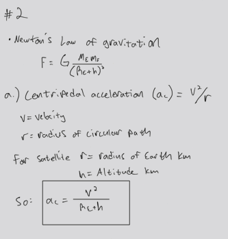
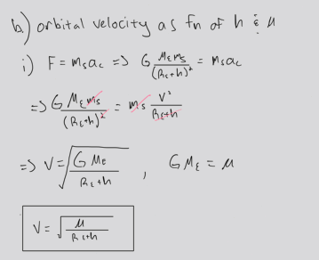
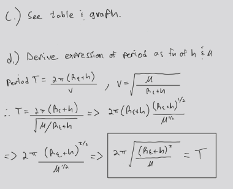
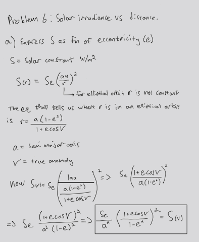
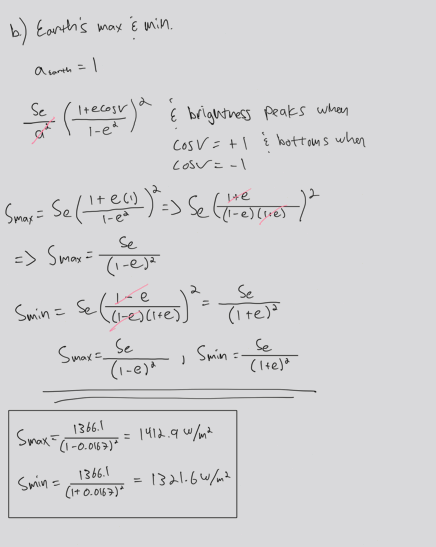
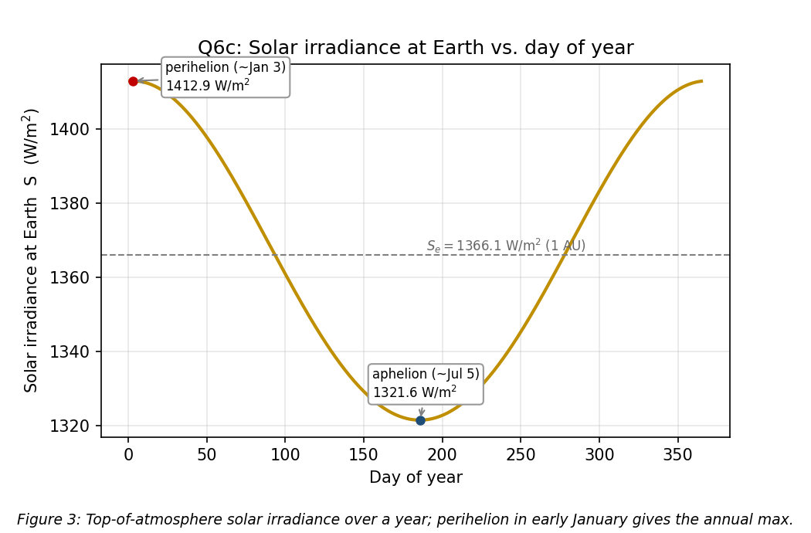
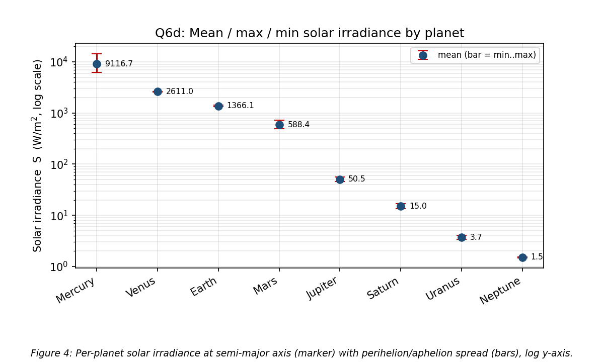
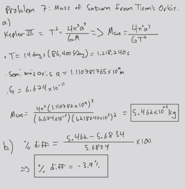
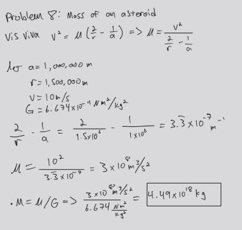

# SPCE 5065: Homework 1
**Space environment anomalies + two-body orbital mechanics and solar irradiance**
**Author:** Jordan Clayton
**Date:** June 25, 2026

---

## Problem 1: Spacecraft Anomaly Due to the Space Environment

> *Find an example of a spacecraft anomaly due to the space environment. Describe what happened and what improvements were made to avoid a recurrence of the problem.*

**The bird: Galaxy 15**, an Intelsat C-band communications satellite built on the Orbital Sciences STAR-2 bus, parked at 133°W in the geostationary belt. On **5 April 2010 it stopped accepting ground commands** but, and this is the part that made it famous, its payload stayed fully powered, transponders live, still amplifying and re-radiating whatever it received [2]. A GEO satellite that won't take commands but won't shut up is the worst combination: it can't be told to stop, and it drifts.

**What actually happened.** The most widely accepted explanation (the leading Intelsat/Orbital finding, though never proven conclusively) is that Galaxy 15 lost the ability to respond to commands after an **electrostatic discharge (ESD) event tied to elevated space weather** around that date, i.e. a spacecraft-charging failure. The bus accumulated charge from the GEO plasma environment (energetic electrons in the outer belt / plasma sheet during disturbed conditions), the differential charging exceeded the arc threshold somewhere on the vehicle, and the resulting discharge latched up the baseband command unit so it ignored the ground [2], [3]. This is textbook Lesson 1 charging physics: in GEO you're sitting in keV-and-up electrons, surfaces charge to different potentials, and when the gradient gets big enough you get an arc [1]. The lecture's point that GEO actually has a *worse* charging/radiation environment than LEO is the whole reason this regime is dangerous.

**Why it was a big deal.** With station-keeping dead, Galaxy 15 drifted eastward along the GEO arc (a "zombiesat") and walked right toward neighboring satellites like AMC-11, threatening to interfere with their C-band uplinks as the longitudes lined up. Operators had to manage live payloads around a 2-ton object they couldn't talk to for the better part of a year. It was finally recovered in **December 2010**: the battery eventually browned out, the bus underwent a full power-on reset, and Intelsat re-established contact and reloaded the flight software [2].

**Improvements made to avoid recurrence.**
- **Autonomous reset / watchdog timer.** Orbital Sciences rolled out a flight-software and procedural fix across the rest of the STAR-2 fleet so that a vehicle losing ground contact for a set interval will **automatically reset itself** rather than sitting latched and powered. That is exactly the failure mode that turned a charging glitch into an eight-month saga [2], [3].
- **Hardened command path.** The susceptibility in the command receiver/baseband chain that let an ESD latch it was addressed in subsequent builds, with better filtering and reset logic on the unit that got stuck.
- **The general charging-mitigation playbook this reinforced** (and what Lesson 1 prescribes [1]): conductive surface coatings and grounding straps so the whole structure bleeds to a common potential instead of building differentials, biasing high-voltage buses to stay below arc thresholds (the ISS runs its arrays at 120 V for exactly this reason), and space-weather-aware operations so crews are watching during disturbed periods.

It's a good poster child because the fix is concrete and the cause is pure environment. And it's not a one-off; roughly a quarter of on-orbit anomalies get pinned on the space environment [1], with charging being one of the top contributors in GEO.

---

## Problem 2: Circular-Orbit Velocity and Period vs. Altitude

> *Newton's law of gravitation is $F = G\,\dfrac{M_E m_s}{(R_E+h)^2}$. (a) Write the centripetal acceleration in terms of orbital velocity, $R_E$, and $h$. (b) Derive orbital velocity as a function of altitude and $\mu$. (c) Graph velocity vs. altitude. (d) Derive the period as a function of altitude and $\mu$. (e) Graph period vs. altitude.*

**Classification:** Derivation (a, b, d) + computation/graphing (c, e). Let $r = R_E + h$ be the orbital radius throughout.

### (a) Centripetal acceleration

For anything in a circular orbit of radius $r = R_E + h$ moving at speed $v$, the acceleration points at the center with magnitude $v^2/r$:

<p align="center"></p>

That's the kinematic requirement

### (b) Orbital velocity

I set the gravitational pull equal to the mass times the centripetal acceleration from (a). The spacecraft mass $m_s$ cancels off both sides (already a good sign, because orbital velocity shouldn't care how heavy your satellite is), and one factor of $(R_E+h)$ also cancels. Folding $G M_E$ into the given $\mu = 398600.5\ \text{km}^3/\text{s}^2$ and taking the root:

<p align="center"></p>

Sanity check at the surface ($h=0$): $v = \sqrt{398600.5/6378} = 7.906\ \text{km/s}$,

### (c) Velocity vs. altitude

Sweeping that closed form from 0 to 36,000 km gives **Figure 1**. It falls off as $1/\sqrt{r}$, slow and monotonic.


**Table 1:** Velocity and period at reference altitudes (from the script).

| Altitude $h$ (km) | Regime | $v$ (km/s) | $T$ (min) |
|---:|:---|---:|---:|
| 0 | Earth surface | 7.9055 | 84.49 |
| 400 | LEO (≈ISS) | 7.6686 | 92.56 |
| 800 | Q3 orbit | 7.4519 | 100.87 |
| 20,200 | MEO / GPS | 3.8740 | 718.0 |
| 35,786 | GEO | 3.0747 | 1436.06 |

### (d) Orbital period

The period is just the time to go once around the circumference at constant speed $v$, $T = 2\pi (R_E+h)/v$. Substituting $v = \sqrt{\mu/(R_E+h)}$ from (b) collapses it to Kepler's third law for a circular orbit:

<p align="center"></p>

**Verification:** at GEO altitude (35,786 km) this gives 86,164 s, matching one sidereal day to within 0.001% (Table 1). 

### (e) Period vs. altitude

**Figure 2** is the same sweep for $T$. Unlike velocity, period climbs steeply ($r^{3/2}$), running from ~84 min at the surface out to ~24 h at GEO.


---

## Problem 3: 800 km Lifetime vs. Solar-Cycle Phase at Launch

> *For a satellite launched to an altitude of 800 km, is there any significant difference to the lifetime depending on the phase of the solar cycle at launch? Explain your answer.*

**Short answer: no, not significantly.**

It comes down to a timescale mismatch. At 800 km the atmosphere is extremely thin, so drag is weak and the orbital lifetime is very long, far longer than the 11-year solar cycle. The satellite therefore rides through many solar cycles no matter when it launches, so it experiences essentially the same average atmospheric conditions either way, and the phase at launch has little effect on total lifetime.

Solar activity does affect drag: at solar maximum the thermosphere heats and expands, raising the density at a given altitude and increasing drag [1], [4], [5]. But over an 800 km lifetime that spans many cycles, this variation averages out rather than being set by the launch phase.

For contrast, a much lower orbit (a few hundred km) can have a lifetime comparable to a single solar cycle, and there the launch phase does matter.

---

## Problem 4: Space-Environment Hazards for a 350 km Optical EO Spacecraft

> *An Earth-observation spacecraft with an optical payload is in a 350 km circular orbit. What are the major problems operators might expect from the space environment in this regime? What mitigates those risks? Include an overview of all effects covered in Lesson 1, not just Chapter 1 of the textbook.*

At 350 km you're deep in LEO and exposed to essentially every Lesson 1 effect. Each hazard below is paired with its mitigation, flagged where it specifically threatens the *optical* payload.

**Neutral environment:**
- **Atmospheric drag:** dominant at 350 km (well inside the sub-1000 km drag band); the orbit decays in months to a few years [1]. *Mitigation:* propulsion/station-keeping, low frontal area, periodic reboost. Biggest operational cost down here.
- **Atomic oxygen (AO):** the top material-degradation agent at this altitude [6]; ~5 eV AO erodes polymers (Kapton, Teflon) and oxidizes silver on ram faces. *Mitigation:* AO-resistant coatings (SiOₓ), no bare silver/Kapton on ram faces.
- **Sputtering:** mechanical erosion from particle impacts, same coating fix [1].

**Plasma / radiation:**
- **Charging and ESD:** LEO plasma charges surfaces; differentials can arc and inject EMI [1]. *Mitigation:* conductive coatings and a common ground, bus voltages kept below the arc threshold.
- **Radiation (TID and single-event effects):** cosmic rays, solar protons, and trapped particles cause dose buildup and bit-flips/latch-ups [1]. *Mitigation:* rad-tolerant parts, error-correcting memory, redundancy.
- **South Atlantic Anomaly (SAA):** the inner belt dips to LEO here, the main radiation zone for a low EO sat; each pass adds SEUs and image hits [1]. *Mitigation:* safe sensitive electronics over the SAA, flag/discard corrupted frames.
- **Van Allen belts:** mostly above 350 km, so only the SAA intrusion reaches you [1].

**Solar activity:** flares and CMEs spike thermospheric density (drag surges) and disturb comms/GPS [1]. *Mitigation:* space-weather monitoring, hold maneuvers during storms, drag-margin fuel.

**Debris (MMOD):** high LEO flux, though drag self-cleans this band [1]. *Mitigation:* conjunction screening and avoidance, Whipple shielding.

**Vacuum / UV / thermal (the optical-payload killers):**
- **Outgassing/contamination:** volatiles redeposit on cold surfaces, i.e. the optics, hazing the image [1], [6]. *Mitigation:* pre-flight bakeout, low-outgassing materials, keep optics warm.
- **Solar UV:** darkens and embrittles polymers, coatings, and optical surfaces [1], [6]. *Mitigation:* UV-stable materials.
- **Thermal cycling:** ~16 hot/cold cycles/day flex optical mounts and shift focus [1], [6]. *Mitigation:* athermal mount design, active thermal control.
- **Cold welding:** bare metal contacts can seize in vacuum [1]. *Mitigation:* proper lubricants/coatings.

For an optical EO bird, drag sets the lifetime and fuel budget, the SAA sets data quality, and AO + contamination + UV + thermal cycling are what most threaten the optics.

---

## Problem 5: Earth's Magnetic Field, Drift, Reversals, and the Next One

> *Why does the Earth's magnetic field drift? How do we know the magnetic field reverses periodically? When is the next one predicted to occur?*

### Why it drifts

The field comes from the **geodynamo**: convecting molten iron in the outer core, organized by Earth's rotation, sustaining self-reinforcing electric currents and the field they produce [1]. That flow is turbulent and constantly reorganizing, so the field is never static; it changes year to year (**secular variation**). Concretely, the dipole axis is tilted off the spin axis, the magnetic poles wander independently (the north pole is moving rapidly toward Siberia, forcing regular updates to navigation models), and strength runs ~30 µT at the equator to ~60 µT at the poles [1]. The source is moving, so the field drifts.

### How we know it reverses

From **paleomagnetism**: when igneous rock cools through the Curie temperature, its magnetic minerals freeze in the field direction at that moment, like a fossil compass. The decisive evidence is the seafloor-spreading record [7]: new crust at mid-ocean ridges freezes in the field as it forms, laying down **symmetric stripes of normal/reversed polarity mirrored on both sides of the ridge**. Matching barcodes on either side of a spreading center are hard to explain without a field that periodically reverses. Per the lecture, there were 171 reversals in the last 71 million years (averaging one per ~415,000 years but highly irregular), the last one ~780,000 years ago [1].

### When's the next one

No one can put a date on it, and a reversal is not imminent [7], [8]. The "overdue" claim from the ~415 kyr average is meaningless because the intervals are so irregular. The field is weakening (~5 to 10% per century) and the SAA is growing, but it's still strong relative to its long-term range, and a reversal takes ~1,000 to 10,000 years to play out once it starts [8]. Consensus: no flip for at least several centuries. (Note: this is Earth's field on hundred-thousand-year scales, separate from the Sun's ~11-year polarity flip [1].)

---

## Problem 6: Solar Irradiance vs. Distance, Day-of-Year, and by Planet

> *The solar constant at distance $r$ is $S(r) = S_e\,(au/r)^2$, with $S_e = 1366.1\ \text{W/m}^2$ at 1 AU. (a) Express $S$ as a function of orbit eccentricity. (b) Find Earth's max and min solar constant. (c) Graph irradiance at Earth vs. day of year. (d) Compute and plot mean, max, and min irradiance for every planet on a log y-axis.*

**Classification:** Derivation (a) + computation/graphing (b-d). Pure inverse-square geometry.

### (a) $S$ as a function of eccentricity

The orbit equation gives heliocentric distance in terms of true anomaly $\nu$ and eccentricity $e$, with semi-major axis $a$ (in AU); dropping it into $S(r) = S_e\,(1\,\text{AU}/r)^2$ gives the fully general form:

<p align="center"></p>

For a planet whose semi-major axis is 1 AU (Earth, $a=1$) the $a^2$ drops out; I use the general $1/a^2$ version in part (d) for the other planets. So eccentricity is the whole story for how much the irradiance breathes over an orbit: a circular orbit ($e=0$) gets a flat $S_e$, and the spread grows with $e$.

### (b) Earth's max and min

The extremes fall out by setting $\cos\nu = +1$ (perihelion, $r = a(1-e)$) and $\cos\nu = -1$ (aphelion, $r = a(1+e)$), then plugging in Earth's $e = 0.0167$:

<p align="center"></p>

That's about a ±3.4% swing around the mean, and it lines up with the accepted ~1413 / ~1322 W/m² perihelion/aphelion values, which is the check that the sign convention (perihelion = closer = *brighter*) didn't get flipped. Note the counterintuitive bit: Earth is **closest to the Sun in early January**, northern-hemisphere winter. Seasons are axial tilt, not distance.

### (c) Irradiance vs. day of year

To get $S$ vs. calendar day I needed $r$ vs. day, so I ran the mean anomaly from perihelion (~Jan 3), solved Kepler's equation $M = E - e\sin E$ for the eccentric anomaly with Newton-Raphson, took $r = a(1 - e\cos E)$, and fed it through the inverse-square law. **Figure 3** is the result: a smooth annual cycle peaking at 1412.9 W/m² in early January and bottoming at 1321.6 W/m² in early July.



### (d) Every planet, log scale

Same formula per planet using each one's $a$ and $e$: mean $= S_e/a^2$, max $= S_e/[a(1-e)]^2$, min $= S_e/[a(1+e)]^2$. **Table 2** has the numbers, **Figure 4** plots them on a log y-axis (essential, since Mercury to Neptune spans nearly four orders of magnitude).

**Table 2:** Solar irradiance by planet (W/m²).

| Planet | $a$ (AU) | $e$ | $S_{\text{mean}}$ | $S_{\max}$ (perihelion) | $S_{\min}$ (aphelion) |
|:---|---:|---:|---:|---:|---:|
| Mercury | 0.387 | 0.2056 | 9116.7 | 14447.4 | 6272.0 |
| Venus | 0.723 | 0.0068 | 2611.0 | 2646.7 | 2576.0 |
| Earth | 1.000 | 0.0167 | 1366.1 | 1412.9 | 1321.6 |
| Mars | 1.524 | 0.0934 | 588.4 | 715.9 | 492.2 |
| Jupiter | 5.203 | 0.0484 | 50.5 | 55.7 | 45.9 |
| Saturn | 9.537 | 0.0539 | 15.0 | 16.8 | 13.5 |
| Uranus | 19.189 | 0.0473 | 3.71 | 4.09 | 3.38 |
| Neptune | 30.070 | 0.0086 | 1.51 | 1.54 | 1.49 |



Two things jump out and both make sense: **Mercury has by far the widest spread** (huge error bar) because its $e=0.21$ is the most eccentric orbit in the set, and **Venus is nearly a flat point** because its orbit is almost perfectly circular. My Earth value of 1366.1 mean / 1412.9 max / 1321.6 min reproduces part (b) exactly: same formula, same answer, so the per-planet machinery is wired right.

---

## Problem 7: Mass of Saturn from Titan's Orbit

> *Titan has a period of 14.1 Earth days. (a) Determine Saturn's mass if Titan's semi-major axis is 1,110,781,765 m. (b) Find a published Saturn mass and compute the percent difference. (c) Explain the difference.*

**Classification:** Computation. Kepler's third law inverted for the central mass.

### (a) Computed mass and (b) percent difference


<p align="center"></p>

So the computed mass is $5.462\times10^{26}$ kg, about **4% light** versus the published value (**−3.9%**).

### (c) Why the difference

Kepler III is exact for an ideal two-body orbit. The ~4% is the **input data**, in roughly this order of importance:
- **The given orbital parameters are rounded and not perfectly self-consistent.** Titan's *real* period is ~15.95 days and its real semi-major axis ~1.222×10⁹ m; the problem's 14.1 days paired with 1.1108×10⁹ m don't correspond to a clean Keplerian fit around the true Saturn mass. A pure two-body orbit at the given $a$ would have a ~13.8-day period, so the given 14.1 days is slightly long, which pulls the computed mass *down*, exactly the direction of the miss. The rounded inputs dominate the error.
- **The simple form neglects Titan's mass.** Strictly $T^2 = \dfrac{4\pi^2 a^3}{G(M+m)}$. But Titan is only ~1/4250 of Saturn, so that correction is ~0.02%, negligible here, not the culprit.
- **Real perturbations.** Saturn's oblateness ($J_2$), the Sun, and the other moons (Titan sits in resonances) all nudge the orbit off a clean ellipse, so a single $(a, T)$ pair won't reproduce the mass to high precision.
- **Constant precision** in $G$ (and the values of $a$, $T$) caps how many digits are even meaningful.

Bottom line: 4% off a one-line two-body calc from rounded textbook numbers is about what you'd expect, the inputs are coarse.

---

## Problem 8: Mass of an Asteroid from One State

> *A spacecraft is in an eccentric orbit about an asteroid with semi-major axis 1000 km. At a distance of 1500 km from the asteroid the velocity is 10 m/s. Determine the asteroid's mass.*

**Classification:** Computation. Vis-viva solved for $\mu$, then divided by $G$.

The vis-viva equation ties speed, radius, and semi-major axis to the central body's $\mu$; I solve for $\mu$ and then get the mass from $M = \mu/G$ (with $a = 1000$ km, $r = 1500$ km, $v = 10$ m/s, $G = 6.674\times10^{-11}$):

<p align="center"></p>

**Sanity check:** that $\mu$ is ~9 orders of magnitude below Earth's, which is the right ballpark for a small body. 


---

## Sources Cited

[1] George, L., "Introduction to the Space Environment: Lesson 1," SPCE 5065 lecture videos (Parts 1-3) and *SpaceEnvironBackground* slides, University of Colorado Colorado Springs, 2026.

[2] de Selding, P. B., "Intelsat's Wandering 'Zombiesat' Galaxy 15 Finally Recovered," *SpaceNews*, 23 Dec. 2010, https://spacenews.com/intelsats-wandering-zombiesat-galaxy-15-finally-recovered/ [retrieved 25 June 2026].

[3] Ferster, W., "Intelsat, Orbital Sciences Differ on Cause of Galaxy 15 Anomaly," *SpaceNews*, 2010, https://spacenews.com/ [retrieved 25 June 2026].

[4] Vallado, D. A., *Fundamentals of Astrodynamics and Applications*, 4th ed., Microcosm Press, Hawthorne, CA, 2013, Chap. 8 (atmospheric drag and density models).

[5] Wertz, J. R., Everett, D. F., and Puschell, J. J. (eds.), *Space Mission Engineering: The New SMAD*, Microcosm Press, Hawthorne, CA, 2011, Sec. 8 (orbital decay and atmospheric density).

[6] Finckenor, M. M., and de Groh, K. K., "A Researcher's Guide to: International Space Station Space Environmental Effects," NP-2015-03-015-JSC, NASA ISS Program Science Office, 2020, https://www.nasa.gov/connect/ebooks/iss-researchers-guide-space-environmental-effects/ [retrieved 25 June 2026].

[7] U.S. Geological Survey, "Geomagnetism Frequently Asked Questions," USGS Geomagnetism Program, https://www.usgs.gov/programs/geomagnetism/faqs [retrieved 25 June 2026].

[8] Phillips, T., "2012: Magnetic Pole Reversal Happens All the (Geologic) Time," NASA Science, 30 Dec. 2011, https://science.nasa.gov/science-research/heliophysics/2012-magnetic-pole-reversal-happens-all-the-geologic-time/ [retrieved 25 June 2026].

[9] Williams, D. R., "Saturn Fact Sheet," NASA Goddard Space Flight Center / NSSDCA, 2023, https://nssdc.gsfc.nasa.gov/planetary/factsheet/saturnfact.html [retrieved 25 June 2026]. (Saturn mass $= 5.6834\times10^{26}$ kg.)

---

## Appendix: Python Solution Script

```python
"""SPCE 5065 -- Homework 1 solution.

Two-body orbital mechanics + solar irradiance geometry. Covers the quantitative
parts of HW1:

  Q2  Circular-orbit velocity and period vs. altitude (derivations + 2 graphs)
  Q6  Solar constant vs. eccentricity / day-of-year, and per-planet irradiance
  Q7  Mass of Saturn from Titan's period and semi-major axis (Kepler III)
  Q8  Mass of an asteroid from a single vis-viva state

Outputs:
  - Console tables reproducing every boxed number in the submission
  - figures/fig1_velocity_vs_altitude.png   (Q2c)
  - figures/fig2_period_vs_altitude.png      (Q2e)
  - figures/fig3_irradiance_vs_doy.png       (Q6c)
  - figures/fig4_planet_irradiance.png       (Q6d)

Conceptual problems (Q1, Q3, Q4, Q5) are answered in the submission document;
they need no code.
"""
from __future__ import annotations

import sys
from dataclasses import dataclass
from pathlib import Path

import matplotlib.pyplot as plt
import numpy as np

# --------------------------------------------------------------------------
# Constants
# --------------------------------------------------------------------------
MU_EARTH = 398600.5          # km^3/s^2  (given, mu = G*M_E)
R_E = 6378.0                 # km        (given Earth radius)
G = 6.67430e-11              # N*m^2/kg^2 (CODATA 2018)
S_E = 1366.1                 # W/m^2     (given solar irradiance at 1 AU)
AU_KM = 149_597_871.0        # km        (given 1 AU)
E_EARTH = 0.016710           # Earth orbital eccentricity
DAY_S = 86400.0              # s per day

FIG_DIR = Path(__file__).parent / "figures"


# --------------------------------------------------------------------------
# Q2 -- circular-orbit velocity and period
# --------------------------------------------------------------------------
def orbital_velocity(h_km: float, mu: float = MU_EARTH, re: float = R_E) -> float:
    """Circular orbital velocity (km/s).  v = sqrt(mu / (R_E + h))   [Q2b]."""
    return np.sqrt(mu / (re + h_km))


def orbital_period(h_km: float, mu: float = MU_EARTH, re: float = R_E) -> float:
    """Circular orbital period (s).  T = 2*pi*sqrt((R_E + h)^3 / mu)   [Q2d]."""
    return 2.0 * np.pi * np.sqrt((re + h_km) ** 3 / mu)


def q2_check() -> None:
    print("=" * 70)
    print("Q2 -- velocity & period vs altitude (spot checks)")
    print("=" * 70)
    for h, label in [(0.0, "surface"), (400.0, "ISS-ish"),
                     (800.0, "Q3 orbit"), (35786.0, "GEO")]:
        v = orbital_velocity(h)
        T = orbital_period(h)
        print(f"  h = {h:8.0f} km ({label:8s}):  "
              f"v = {v:7.4f} km/s   T = {T:10.2f} s = {T/60:7.3f} min")
    # Verification: GEO period should be ~one sidereal day (86164 s)
    T_geo = orbital_period(35786.0)
    print(f"  [check] GEO period {T_geo:.1f} s vs sidereal day 86164 s  "
          f"-> {100*(T_geo-86164)/86164:+.3f}%")


# --------------------------------------------------------------------------
# Q6 -- solar irradiance
# --------------------------------------------------------------------------
def solar_constant_from_r_au(r_au: np.ndarray | float) -> np.ndarray | float:
    """Inverse-square solar constant.  S(r) = S_e * (1 AU / r)^2."""
    return S_E * (1.0 / r_au) ** 2


def radius_au_from_true_anomaly(nu_rad, a_au=1.0, e=E_EARTH):
    """Orbit equation r = a(1 - e^2) / (1 + e cos nu)."""
    return a_au * (1 - e ** 2) / (1 + e * np.cos(nu_rad))


def earth_sun_distance_by_day(doy: np.ndarray, e=E_EARTH,
                              day_perihelion: float = 3.0) -> np.ndarray:
    """Earth-Sun distance (AU) vs day-of-year, solving Kepler's equation.

    Mean anomaly measured from perihelion (~Jan 3 = DOY 3), then
    M -> E (Newton) -> r = a(1 - e cos E),  a = 1 AU.
    """
    M = 2 * np.pi * (doy - day_perihelion) / 365.25
    E = M.copy()
    for _ in range(50):                      # Newton-Raphson on E - e sinE = M
        E = E - (E - e * np.sin(E) - M) / (1 - e * np.cos(E))
    return 1.0 * (1 - e * np.cos(E))          # AU


def q6_results() -> None:
    print("=" * 70)
    print("Q6 -- solar irradiance")
    print("=" * 70)
    # (b) Earth max/min from perihelion/aphelion: r = a(1 -/+ e)
    s_max = S_E / (1 - E_EARTH) ** 2          # perihelion
    s_min = S_E / (1 + E_EARTH) ** 2          # aphelion
    print(f"  (b) Earth perihelion S_max = {s_max:7.2f} W/m^2   "
          f"(r = 1-e = {1-E_EARTH:.4f} AU)")
    print(f"      Earth aphelion   S_min = {s_min:7.2f} W/m^2   "
          f"(r = 1+e = {1+E_EARTH:.4f} AU)")
    print(f"      mean (S_e)             = {S_E:7.2f} W/m^2")

    # (d) per-planet table:  a (AU), e
    planets = {
        "Mercury": (0.38710, 0.20563),
        "Venus":   (0.72333, 0.00677),
        "Earth":   (1.00000, 0.01671),
        "Mars":    (1.52371, 0.09339),
        "Jupiter": (5.20289, 0.04839),
        "Saturn":  (9.53707, 0.05386),
        "Uranus":  (19.18914, 0.04726),
        "Neptune": (30.06992, 0.00859),
    }
    print(f"\n  (d) Planetary solar irradiance (W/m^2):")
    print(f"      {'Planet':9s} {'a(AU)':>8s} {'e':>7s} "
          f"{'S_avg':>10s} {'S_max':>10s} {'S_min':>10s}")
    for name, (a, e) in planets.items():
        s_avg = S_E / a ** 2
        s_mx = S_E / (a * (1 - e)) ** 2
        s_mn = S_E / (a * (1 + e)) ** 2
        print(f"      {name:9s} {a:8.3f} {e:7.4f} "
              f"{s_avg:10.2f} {s_mx:10.2f} {s_mn:10.2f}")
    return planets


# --------------------------------------------------------------------------
# Q7 -- mass of Saturn from Titan
# --------------------------------------------------------------------------
def kepler_third_central_mass(period_s: float, a_m: float) -> float:
    """M = 4*pi^2 a^3 / (G T^2)  -- central mass from a satellite's orbit."""
    return 4 * np.pi ** 2 * a_m ** 3 / (G * period_s ** 2)


def q7_results() -> float:
    print("=" * 70)
    print("Q7 -- mass of Saturn from Titan")
    print("=" * 70)
    P = 14.1 * DAY_S                  # s
    a = 1_110_781_765.0              # m
    M_saturn = kepler_third_central_mass(P, a)
    M_published = 5.6834e26          # kg (NASA Saturn Fact Sheet)
    pct = 100 * (M_saturn - M_published) / M_published
    print(f"  Titan period      P = {P:.1f} s ({P/DAY_S:.1f} d)")
    print(f"  Titan SMA         a = {a:.0f} m")
    print(f"  Computed mass       = {M_saturn:.4e} kg")
    print(f"  Published mass      = {M_published:.4e} kg")
    print(f"  Percent difference  = {pct:+.2f}%")
    return M_saturn


# --------------------------------------------------------------------------
# Q8 -- mass of an asteroid from vis-viva
# --------------------------------------------------------------------------
def q8_results() -> float:
    print("=" * 70)
    print("Q8 -- mass of an asteroid (vis-viva)")
    print("=" * 70)
    a = 1.0e6            # m   (semi-major axis 1000 km)
    r = 1.5e6            # m   (range 1500 km)
    v = 10.0            # m/s
    # v^2 = mu (2/r - 1/a)  ->  mu = v^2 / (2/r - 1/a)
    mu = v ** 2 / (2 / r - 1 / a)
    M = mu / G
    print(f"  a = {a:.0f} m,  r = {r:.0f} m,  v = {v:.1f} m/s")
    print(f"  2/r - 1/a = {2/r - 1/a:.6e} 1/m")
    print(f"  mu = {mu:.4e} m^3/s^2")
    print(f"  M  = {M:.4e} kg")
    return M


# --------------------------------------------------------------------------
# Figures
# --------------------------------------------------------------------------
def _caption(fig, text: str) -> None:
    fig.text(0.5, 0.01, text, ha="center", va="bottom",
             fontsize=9, style="italic")


def fig_velocity_vs_altitude() -> None:
    h = np.linspace(0, 36000, 600)
    v = orbital_velocity(h)
    fig, ax = plt.subplots(figsize=(7, 4.6))
    ax.plot(h, v, color="#1f4e79", lw=2)
    for h_mark, lab, off in [(400, "LEO ~400 km", (12, 34)),
                             (800, "800 km", (44, -36)),
                             (20200, "MEO/GPS", (12, 14)),
                             (35786, "GEO", (-22, 24))]:
        ax.plot(h_mark, orbital_velocity(h_mark), "o", color="#c00000", ms=5)
        ax.annotate(f"{lab}\n{orbital_velocity(h_mark):.2f} km/s",
                    xy=(h_mark, orbital_velocity(h_mark)),
                    xytext=off, textcoords="offset points", fontsize=8,
                    bbox=dict(boxstyle="round,pad=0.3", fc="white", ec="0.6",
                              alpha=0.9),
                    arrowprops=dict(arrowstyle="->", color="0.5"))
    ax.set_xlabel("Altitude  h  (km)")
    ax.set_ylabel("Circular orbital velocity  v  (km/s)")
    ax.set_title("Q2c: Orbital velocity vs. altitude")
    ax.grid(True, alpha=0.3)
    fig.subplots_adjust(bottom=0.18)
    _caption(fig, "Figure 1: Circular orbital velocity "
             r"$v=\sqrt{\mu/(R_E+h)}$ vs. altitude.")
    fig.savefig(FIG_DIR / "fig1_velocity_vs_altitude.png", dpi=150)
    plt.close(fig)


def fig_period_vs_altitude() -> None:
    h = np.linspace(0, 36000, 600)
    T = orbital_period(h) / 60.0     # minutes
    fig, ax = plt.subplots(figsize=(7, 4.6))
    ax.plot(h, T, color="#385723", lw=2)
    for h_mark, lab, off in [(400, "LEO", (10, 34)),
                             (800, "800 km", (48, -18)),
                             (20200, "GPS", (14, -6)),
                             (35786, "GEO", (-18, 18))]:
        ax.plot(h_mark, orbital_period(h_mark) / 60, "o", color="#c00000", ms=5)
        ax.annotate(f"{lab}\n{orbital_period(h_mark)/60:.1f} min",
                    xy=(h_mark, orbital_period(h_mark) / 60),
                    xytext=off, textcoords="offset points", fontsize=8,
                    bbox=dict(boxstyle="round,pad=0.3", fc="white", ec="0.6",
                              alpha=0.9),
                    arrowprops=dict(arrowstyle="->", color="0.5"))
    ax.set_xlabel("Altitude  h  (km)")
    ax.set_ylabel("Orbital period  T  (min)")
    ax.set_title("Q2e: Orbital period vs. altitude")
    ax.grid(True, alpha=0.3)
    fig.subplots_adjust(bottom=0.18)
    _caption(fig, "Figure 2: Circular orbital period "
             r"$T=2\pi\sqrt{(R_E+h)^3/\mu}$ vs. altitude.")
    fig.savefig(FIG_DIR / "fig2_period_vs_altitude.png", dpi=150)
    plt.close(fig)


def fig_irradiance_vs_doy() -> None:
    doy = np.arange(1, 366)
    r_au = earth_sun_distance_by_day(doy)
    S = solar_constant_from_r_au(r_au)
    fig, ax = plt.subplots(figsize=(7, 4.6))
    ax.plot(doy, S, color="#bf8f00", lw=2)
    i_max, i_min = int(np.argmax(S)), int(np.argmin(S))
    ax.plot(doy[i_max], S[i_max], "o", color="#c00000", ms=5)
    ax.plot(doy[i_min], S[i_min], "o", color="#1f4e79", ms=5)
    ax.annotate(f"perihelion (~Jan {doy[i_max]})\n{S[i_max]:.1f} W/m$^2$",
                xy=(doy[i_max], S[i_max]), xytext=(20, -6),
                textcoords="offset points", fontsize=8,
                bbox=dict(boxstyle="round,pad=0.3", fc="white", ec="0.6"),
                arrowprops=dict(arrowstyle="->", color="0.5"))
    ax.annotate(f"aphelion (~Jul {doy[i_min]-181})\n{S[i_min]:.1f} W/m$^2$",
                xy=(doy[i_min], S[i_min]), xytext=(-30, 14),
                textcoords="offset points", fontsize=8,
                bbox=dict(boxstyle="round,pad=0.3", fc="white", ec="0.6"),
                arrowprops=dict(arrowstyle="->", color="0.5"))
    ax.axhline(S_E, color="0.5", ls="--", lw=1)
    ax.text(190, S_E + 1, r"$S_e=1366.1$ W/m$^2$ (1 AU)", fontsize=8, color="0.4")
    ax.set_xlabel("Day of year")
    ax.set_ylabel("Solar irradiance at Earth  S  (W/m$^2$)")
    ax.set_title("Q6c: Solar irradiance at Earth vs. day of year")
    ax.grid(True, alpha=0.3)
    fig.subplots_adjust(bottom=0.18)
    _caption(fig, "Figure 3: Top-of-atmosphere solar irradiance over a year; "
             "perihelion in early January gives the annual max.")
    fig.savefig(FIG_DIR / "fig3_irradiance_vs_doy.png", dpi=150)
    plt.close(fig)


def fig_planet_irradiance(planets: dict) -> None:
    names = list(planets.keys())
    a = np.array([planets[n][0] for n in names])
    e = np.array([planets[n][1] for n in names])
    s_avg = S_E / a ** 2
    s_max = S_E / (a * (1 - e)) ** 2
    s_min = S_E / (a * (1 + e)) ** 2
    x = np.arange(len(names))
    fig, ax = plt.subplots(figsize=(8, 4.8))
    # asymmetric error bars from avg to max/min
    yerr = np.vstack([s_avg - s_min, s_max - s_avg])
    ax.errorbar(x, s_avg, yerr=yerr, fmt="o", color="#1f4e79",
                ecolor="#c00000", elinewidth=1.5, capsize=5, ms=7,
                label="mean (bar = min..max)")
    ax.set_yscale("log")
    ax.set_xticks(x)
    ax.set_xticklabels(names, rotation=30, ha="right")
    for xi, s in zip(x, s_avg):
        ax.annotate(f"{s:.1f}", xy=(xi, s), xytext=(8, 0),
                    textcoords="offset points", fontsize=7.5, va="center")
    ax.set_ylabel("Solar irradiance  S  (W/m$^2$, log scale)")
    ax.set_title("Q6d: Mean / max / min solar irradiance by planet")
    ax.grid(True, which="both", alpha=0.3)
    ax.legend(fontsize=8)
    fig.subplots_adjust(bottom=0.26)
    _caption(fig, "Figure 4: Per-planet solar irradiance at semi-major axis "
             "(marker) with perihelion/aphelion spread (bars), log y-axis.")
    fig.savefig(FIG_DIR / "fig4_planet_irradiance.png", dpi=150)
    plt.close(fig)


# --------------------------------------------------------------------------
def main() -> None:
    sys.stdout.reconfigure(encoding="utf-8")
    FIG_DIR.mkdir(exist_ok=True)
    q2_check()
    print()
    planets = q6_results()
    print()
    q7_results()
    print()
    q8_results()

    fig_velocity_vs_altitude()
    fig_period_vs_altitude()
    fig_irradiance_vs_doy()
    fig_planet_irradiance(planets)
    print("\nFigures written to:", FIG_DIR)


if __name__ == "__main__":
    main()
```

This is the complete, runnable script. Running `python spce_5065_hw1_solution.py` reproduces every boxed number above and regenerates all four figures.
