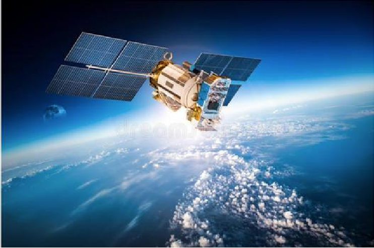

## SPCE 5065 SPACE ENVIRONMENT INTERACTIONS

## SUMMER 2026 DESIGN PROJECT

# INTRODUCTION

The purpose of this design project is to give you an opportunity to apply the concepts you are learning in SPCE 5065 within the context of an actual space mission. You will analyze the space environment for a space mission and design an appropriate satellite system that will reduce its risk of damage in the harsh environment of space for the duration of its mission life.

# REQUIREMENTS

There are two project milestones as well as a final report associated with this project. The two assignments are preliminary, and it is expected that your design will be modified in later phases. The final report, due on the last day of class, shall clearly describe the purpose of your investigation, your spacecraft design selections, and the rationale for those selections, with all necessary calculations included to support your design choices.

You will work individually for this assignment. You may use any resources available to you, but they must be documented in accordance with AIAA format.

# DIRECTIONS

Because subsystems are interrelated, it is likely you will have to repeat some steps in the process. Iteration is a normal part of the space mission design process. Each project part is accompanied by a few relevant questions pertaining to the material covered by the material in that block. These are not required to be answered separately. They are provided to assist you in completing your reports.

# DESIGN PROJECT MISSION

You have your choice of five satellite missions for your design project or you may propose your own mission. Regardless of the mission you choose, the following requirements and constraints apply.

- - The mission duration should be at least 5 years.
- - Total budget is $100M

You will need to define additional requirements and constraints based on your specific mission.

- 1. Space Tug and Repair Servicing Satellite

The United States needs a satellite system that will allow the docking of a service satellite with a cooperative satellite. Your servicing satellite will need to control the orientation and provide fuel for the friendly satellite to continue its mission.

One example is Northrop Grumman’s Innovation Systems Division. They developed a new spacecraft “tow truck” that can rescue defunct GEO satellites, tow them out of the GEO “graveyard” for refueling or repair, or both, and them return them to geo orbit to continue functioning as desired. The Mission Extension Vehicle Spacecraft first spacecraft (MEV-1) was flown in 2019, and a more recent one was launched in August 2020 (Grusch, 2020). MEV-1 is helping its target satellite to maintain proper orbit and allowing it to function as a communications satellite (MEV, 2020).

- 2. CubeSat cooperative satellite system

NASA needs a small satellite (CubeSat) constellation that will demonstrate the ability for CubeSats to provide coordinated imaging capability of a current satellite in orbit.

CubeSats are a class of research spacecraft called nanosatellites. CubeSats are built to standard dimensions (Units or “U”) of 10 cm x 10 cm x 10 cm and are very lightweight, approximately

- 1.33 kg (3 lbs.) per U. The satellites typically fly as auxiliary low-cost secondary payloads (Welle,

- 2016). One example is NASA’s CubeSat initiative, which offers opportunities for small satellite payloads to fly on rockets planned for upcoming launches as secondary payloads (Jackson,
- 2017). Your design must incorporate crosslink communications and onboard AI processing to reduce the downlink burden.

- 3. Space Sweeper

Countries with space assets need a space mission that will help clean or otherwise mitigate the threat from orbital debris to provide a safer space environment.

Current and future generations deserve an orbital environment that is free of dangerous debris. Sweeping space free of ghost spacecraft will open orbital slots for newcomers and reduce the risk of collisions and debris that could, in the worst case, render much of low-Earth orbit useless for satellite operators and potentially disrupt services that people use in their everyday lives on Earth. Once case study is the Debris Sweeper featured in the March 2020 issue of Aerospace America

- 4. Rainforest Monitoring

The Environmental Protection Agency is interested in deploying satellites to monitor the earth’s rainforests.

Deforestation is a significant concern for many parts of the globe, particularly in places like the rainforests of the Amazon or Congo. Scientists, governments, and non-governmental organizations need satellite data to track deforestation, as well as to set targets for improvement. The Earth Resources Observation and Science Center (EROS, 2022) studies land change and produces land change data products used by researchers, resource managers, and policy makers around the world. Landsat satellites (NASA, n.d.) are currently used for rain forest monitoring but are becoming outdated and overwhelmed by other higher priority national security missions.

- 5. In Space Multi-Use Resupply Mission

The United States needs a mission that will provide in-space servicing for a satellite that needs repair or refueling.

This is an entirely new In-Space Servicing Assembly and Manufacturing (ISAM) capability that will establish America as the leader and pathfinder for the world in logistical support operations. The primary mission objectives are to deliver fuel to satellites and conduct maintenance on satellites via part replacement. It will provide multiple ISAM services for cislunar spacecraft in the areas of refueling, repair and refurbishment capability (Duke, 2021 & Space Logistics, 2023).

- 6. Global Wildlife Monitoring and Ecosystem Health Network

NASA needs a satellite system that will create a real-time, global wildlife and ecosystem monitoring system to combat biodiversity loss and monitor environmental changes.

The United Nations has established several sustainability goals, one of which is to protect, restore and promote sustainable use of terrestrial ecosystems, sustainably manage forests, combat desertification, and halt and reverse land degradation and halt biodiversity loss (United Nations, 2025). The primary mission objectives will be to detect and track animals to monitor

migration patterns, perform population studies and behavioral analysis as well as to analyze vegetation health, water quality, and soil composition to assess ecosystem conditions.

- 7. Space Domain Awareness (SDA) Micro-Constellation

The Space Force is seeking a small satellite system that enhances national SDA by providing continuous tracking and custody of objects in GEO and cisluar space.

This mission involves deploying a constellation of three to six low-Earth-orbit satellites equipped with optical telescopes capable of detecting, characterizing, and monitoring resident space objects. These satellites must perform variable revisit-time analysis to maintain custody of fast-moving or dim targets and share data across the constellation through crosslink communications. Onboard AI-assisted detection and classification should be incorporated to reduce processing and latency. The system should also be designed to integrate seamlessly with existing commercial SDA providers to form a more comprehensive, layered space-tracking architecture. This mission aligns closely with the Space Force SDA priorities expected to grow significantly through 2025–2026.

- 8. Methanosat

NASA and the EPA are jointly seeking a satellite mission capable of detecting and monitoring methane and other greenhouse gas emissions on a global scale.

The system would employ a hyperspectral or shortwave-infrared (SWIR) sensor to identify methane plumes and quantify emission sources with high spatial resolution. To support accurate measurements, the satellite must maintain excellent pointing stability while managing the tradeoffs associated with large data volumes generated by hyperspectral imaging. The mission should also be designed to interface with national and international climate-action policies, enabling policymakers and environmental agencies to use the data for compliance, mitigation planning, and rapid response to super-emitter events.

# Project Milestone 1

Due 3 July 2026

In Milestone 1, you will define your mission, its objectives, and begin determining the environment it will be subjected to. For this Milestone, you are evaluating overall space environment effects and will use your research to draw conclusions about the orbit needed to perform your mission.

- 1. Establish a name for your satellite system and determine its mission objectives. Do not choose an orbit, however, until you have completed steps 2 – 4.
- 2. Provide a summary of the Sun-Earth system, considering risks/hazards to satellite operations at two of the following GEO, MEO, or LEO. Quantify or characterize the different emissions from the Sun and the way they affect earth observation missions or damage spacecraft.
- 3. Provide a summary of what constitutes space weather, current research efforts or operational capabilities to measure space weather, and why your customer would want to be informed on space weather events. Include projected impacts to a communications downlink from either the GEO, MEO, or LEO solution to ground stations on the earth.
- 4. Your customer is concerned about trying to minimize production costs for the satellite solution. One of the possible courses of action is to forgo vacuum testing for the space vehicles. Provide a summary of why vacuum testing would be advisable, considering risks/hazards to satellite operations at GEO, MEO, or LEO. Quantify or characterize the effects of a vacuum environment on mission accomplishment and potential damage to the spacecraft.
- 5. Based on your results, choose an orbit for your satellite or satellite constellation.
- 6. Include a visual simulation of your satellite’s orbit. There are many programs you can use to do this, but one is Systems Toolkit, which is available through UCCS IT and is highly recommended. Another is Freeflyer, which is free for academic use.
- 7. Using the tools you learned during the Neutral Environment lessons, predict how long your satellite will remain in orbit without stationkeeping.
- 8. Provide a report summarizing your results.

# REFERENCES

Debris sweeper. Aerospace America. (2020, March 1). https://aerospaceamerica.aiaa.org/departments/debris-sweeper/

Duke, Hannah. (2021, September 15). On-orbit servicing - aerospace security. http://aerospace.csis.org/wp-content/uploads/2021/09/20210914_Duke_OSAM.pdf

Earth Resources Observation and Science (EROS) center | U.S. Geological Survey. (2022, June

- 2). https://www.usgs.gov/centers/eros

Jackson, S. (2017, February 17). NASA's CubeSat Launch Initiative.

https://www.nasa.gov/directorates/heo/home/CubeSats_initiative NASA. (n.d.). Landsat science. NASA. https://landsat.gsfc.nasa.gov/ Smith, R. (2020, April 25). Robots Repairing Satellites in Orbit? Yep, That's a Thing Now.

https://www.fool.com/investing/2020/04/25/robots-repairing-satellites-in-orbit-yep-thats-at.aspx

Space logistics. Northrop Grumman. (2023, March 6). https://www.northropgrumman.com/space/space-logistics-services/

Welle, Richard. (2019) The CUBESAT paradigm: An evolutionary approach to satellite design https://www.spacefoundation.org/wp-content/uploads/2019/07/Welle-Richard-THE-CUBESATPARADIGM%EF%80%A2-AN-EVOLUTIONARY-APPROACH-TO-SATELLITE-DESIGN.pdf
