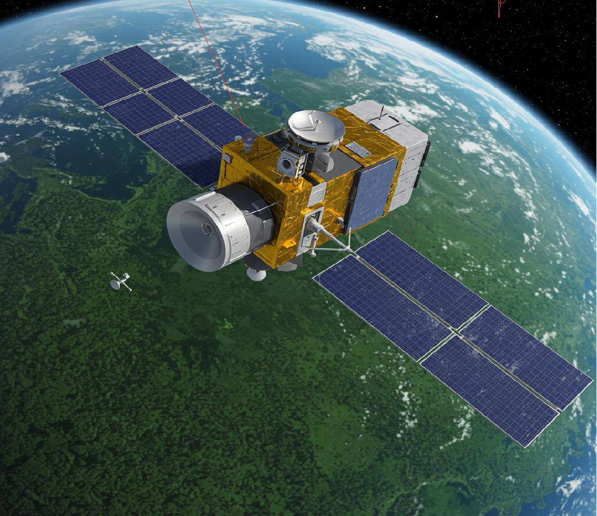
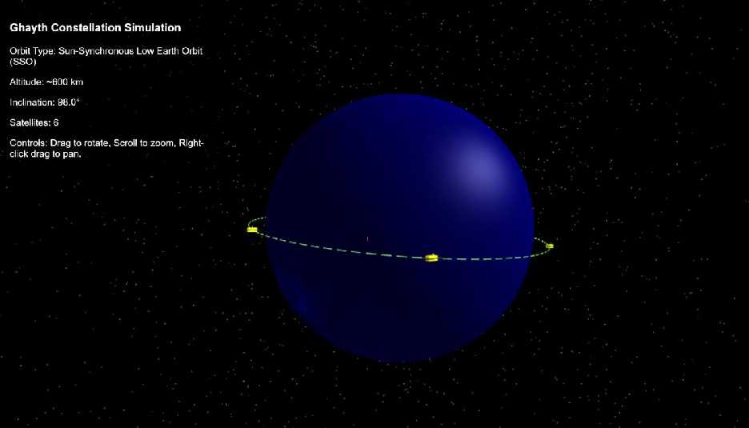

Ghayth Satellite Rainforest Monitoring System

University of Colorado Colorado Spring

Farah AL Fulfulee 7/5/25 SPCE 5065

## Table of Contents

Introduction ........................................................................................................................... 2

- 1. Satellite System Name and Mission Objectives................................................................... 3
- 2. Sun-Earth System and Risks to Satellite Operations ........................................................... 3 Solar Emissions and Their Effects........................................................................................ 3 Implications for Ghayth ...................................................................................................... 5
- 3. Space Weather, Monitoring, and Communication Impacts................................................. 6 What Constitutes Space Weather ...................................................................................... 6 Current Research Efforts and Operational Capabilities to Measure Space Weather .......... 6 Why Ghayth's Customer Would Want to Be Informed on Space Weather Events .............. 6 Projected Impacts to a Communications Downlink ............................................................ 7
- 4. Vacuum Testing Advisability and Effects............................................................................ 8 Summary of Why Vacuum Testing Would Be Advisable...................................................... 8

Effects of a Vacuum Environment on Mission Accomplishment and Potential Damage to the Spacecraft.................................................................................................................... 8

- 5. Orbit Selection ..................................................................................................................10 Orbital Elements and Rationale:.........................................................................................10
- 6. Visual Simulation...........................................................................................................12
- 7. Prediction of Satellite Lifetime Without Stationkeeping.....................................................13 Theoretical Background.....................................................................................................13 Atmospheric Density Model ..............................................................................................14 Ghayth Satellite Parameters (Assumed for Estimation) .....................................................14 Estimation of Orbital Lifetime ............................................................................................14
- 8. Conclusion.........................................................................................................................16 References............................................................................................................................17

### Introduction

This report summarizes the initial design considerations and environmental analysis for a satellite system proposed for comprehensive rainforest monitoring. The mission objectives are primarily focused on deforestation tracking, biodiversity, ecosystem health assessment, supporting policy, and conservation efforts.

The analysis of the Sun-Earth system highlighted significant risks to satellite operations in both LEO and Geostationary Earth Orbit (GEO), including electromagnetic radiation (solar flares), energetic particles (solar proton events and galactic cosmic rays), and plasma (coronal mass ejections). These phenomena can cause atmospheric drag, single event effects, total ionizing dose, and spacecraft charging, all of which can degrade satellite performance, shorten lifespan, and disrupt communication links. For our satellite, understanding these hazards is crucial for designing a robust and long-lasting spacecraft.

Furthermore, the importance of vacuum testing was emphasized. Despite potential cost-saving temptations, forgoing such testing would expose the satellite to severe risks in orbit, including outgassing (contaminating optical sensors), cold welding of moving parts, and thermal stresses from extreme temperature cycling. These issues could lead to mission failure, underscoring vacuum testing as a critical investment for reliability.

Finally, an estimation of the satellite's orbital lifetime without stationkeeping, based on a simplified atmospheric density model, suggests a lifespan of several decades to over a century. This long natural decay time highlights the need for active deorbiting strategies or station-keeping to manage the orbital environment, although the mission's 5-year operational life will require propulsion for precise orbit maintenance against drag. The variability of solar activity, however, means real-world lifetimes can be significantly shorter during solar maximum periods.

This milestone provides a foundational understanding of the mission's purpose, the environmental challenges it faces, and the initial design choices, setting the stage for more detailed system design and analysis in subsequent project phases.

### 1. Satellite System Name and Mission Objectives

The satellite system will be named "Ghayth". The name "Ghayth" (ثيغ) is an Arabic word meaning "rain" or "succor," symbolizing the life-giving and supportive role the satellite system aims to play in monitoring and aiding the rainforests.

The primary mission objectives for Ghayth are as follows:

- ● Objective 1: Deforestation Monitoring. To provide continuous and accurate monitoring of global rainforest deforestation rates and patterns. This includes identifying areas of new deforestation, tracking the expansion of existing deforested regions, and assessing the severity of forest loss. This objective aligns with global efforts to protect terrestrial ecosystems and sustainably manage forests (United Nations, n.d.).
- ● Objective 2: Biodiversity and Ecosystem Health Assessment. To collect data on vegetation health, water quality within rainforest ecosystems, and soil composition to assess overall ecosystem health and identify areas under stress. This objective aims to support biodiversity conservation efforts by providing insights into habitat changes, directly contributing to the goal of halting biodiversity loss (United Nations, n.d.).
- ● Objective 3: Support for Policy and Conservation Efforts. To deliver timely and accessible data to scientists, governments, and non-governmental organizations to inform policy decisions, set conservation targets, and evaluate the effectiveness of reforestation and protection initiatives. This supports the broader aim of promoting sustainable use of terrestrial ecosystems and combating desertification (United Nations, n.d.).

### 2. Sun-Earth System and Risks to Satellite Operations

The dynamic interaction within the Sun-Earth system creates a complex space environment posing significant hazards to satellite operations, particularly for Earth observation missions like Ghayth. These hazards stem primarily from solar emissions, which vary in intensity and composition, and their interactions with Earth's magnetosphere and atmosphere. This section focuses on the effects in Low Earth Orbit (LEO) and Geostationary Earth Orbit (GEO).

Solar Emissions and Their Effects The Sun emits various forms of energy and particles that can impact spacecraft:

##### 1. Electromagnetic Radiation (Solar Flares):

- ○ Description: Solar flares are intense bursts of electromagnetic radiation across the spectrum, from radio waves to X-rays and gamma rays. They travel at the speed of light, reaching Earth in approximately 8 minutes.
- ○ Effects:

- ■ LEO: While Earth's atmosphere provides some shielding, intense X-ray and UV radiation from flares can cause increased atmospheric drag by heating and expanding the upper atmosphere. This increased drag can lead to orbital decay for satellites in LEO (e.g., 200-800 km altitude), requiring more frequent station-keeping maneuvers and consuming precious fuel (Schrijver & Siscoe, 2010). For Earth observation, increased atmospheric density can also interfere with remote sensing measurements.
- ■ GEO: Satellites in GEO (approximately 35,786 km altitude) are outside the protective effects of the dense atmosphere. X-ray and UV radiation can directly impact satellite surfaces, leading to material degradation, increased thermal loads, and potential damage to sensitive optical instruments or solar panels (Schwenn, 2006).

##### 2. Energetic Particles (Solar Proton Events & Galactic Cosmic Rays):

- ○ Description: These include high-energy protons and electrons from Solar Proton Events (SPEs) and Galactic Cosmic Rays (GCRs) originating from outside our solar system. SPEs are often associated with solar flares or Coronal Mass Ejections (CMEs).
- ○ Effects:

- ■ LEO: Satellites in LEO are exposed to energetic particles, particularly when passing through the South Atlantic Anomaly (SAA) and the polar regions, where Earth's magnetic field lines dip, allowing particles to penetrate deeper into the atmosphere. These particles can cause:

- ■ Single Event Effects (SEEs): Disruptions in electronic components, such as bit flips (Single Event Upsets - SEUs), latch-ups (SELs) which can cause permanent damage, or even burnouts (SEBs) (Barth et al., 2003).
- ■ Total Ionizing Dose (TID): Accumulation of radiation damage over time, leading to degradation of electronic components and solar cells, reducing their efficiency and lifespan.

- ■ GEO: GEO satellites are highly vulnerable to energetic particles as they reside in the outer radiation belts and are directly exposed to SPEs. The effects are similar to LEO but often more severe due to higher flux and

energy of particles. SEEs are a major concern, potentially leading to system resets, data corruption, or permanent component failure. Longterm exposure contributes significantly to TID, impacting the longevity and performance of the spacecraft (Schwenn, 2006).

##### 3. Plasma (Coronal Mass Ejections - CMEs):

- ○ Description: CMEs are large expulsions of plasma and magnetic field from the Sun's corona. They travel slower than flares but carry significant mass and magnetic energy, reaching Earth in 1-3 days.
- ○ Effects:

- ■ LEO: When CMEs interact with Earth's magnetosphere, they can cause geomagnetic storms. These storms lead to significant changes in the ionosphere and thermosphere, increasing atmospheric density and leading to enhanced drag on LEO satellites. This can necessitate more frequent orbit adjustments, consume fuel and potentially shortening mission life (Schrijver & Siscoe, 2010).
- ■ GEO: Geomagnetic storms caused by CMEs can induce large surface charging and deep dielectric charging on GEO satellites. Surface charging occurs when the spacecraft surface accumulates charge from low-energy plasma, leading to electrostatic discharges (ESDs) that can damage sensitive electronics or coatings. Deep dielectric charging involves charge accumulation within insulating materials, also leading to potentially damaging ESDs (Schwenn, 2006). These events can disrupt communication links and satellite operations.

##### Implications for Ghayth

For Ghayth, a rainforest monitoring satellite, understanding these solar hazards is critical. While LEO offers advantages for high-resolution Earth observation, it is subject to atmospheric drag and particle effects, requiring robust design and operational strategies. GEO, while providing a constant view of a large Earth area, faces more severe radiation and charging environments. The choice of orbit will significantly influence the design requirements for radiation hardening, thermal control, and propulsion systems to ensure the mission's 5-year duration.

### 3. Space Weather, Monitoring, and Communication ImpactsWhat Constitutes Space Weather

Space weather refers to the dynamic conditions in the Sun-Earth system, driven by solar activity, which can affect technological systems and human health in space and on Earth (National Oceanic and Atmospheric Administration [NOAA], n.d.). It encompasses phenomena such as solar flares, coronal mass ejections (CMEs), highspeed solar wind streams, and energetic particle events. These events can lead to disturbances in Earth's magnetosphere, ionosphere, and thermosphere.

Current Research Efforts and Operational Capabilities to Measure Space Weather

Numerous organizations and missions are dedicated to monitoring and predicting space weather:

- ● Ground-Based Observatories: Networks of magnetometers, ionosondes, and cosmic ray detectors on Earth provide real-time data on geomagnetic disturbances, ionospheric conditions, and energetic particle fluxes.
- ● Space-Based Observatories: Satellites play a crucial role in direct observation of the Sun and the space environment. Key missions include:

- ○ Solar and Heliospheric Observatory (SOHO): Provides continuous observations of the Sun's outer atmosphere and solar wind.
- ○ Advanced Composition Explorer (ACE): Monitors solar wind and energetic particles at the L1 Lagrange point (about 1.5 million km from Earth towards the Sun), providing early warnings of space weather events.
- ○ Geostationary Operational Environmental Satellites (GOES): These satellites in GEO carry instruments to monitor solar X-rays, energetic particles, and Earth's magnetic field, providing real-time space weather data relevant to terrestrial impacts (NOAA, n.d.).

- ● Modeling and Forecasting Centers: Organizations like the NOAA Space Weather Prediction Center (SWPC) use data from these observatories to develop sophisticated models and issue forecasts and warnings for various space weather phenomena, including geomagnetic storms, solar radiation storms, and radio blackouts (NOAA, n.d.).

##### Why Ghayth's Customer Would Want to Be Informed on Space Weather Events

The customer for Ghayth, would have a strong interest in being informed about space weather events for several critical reasons:

- ● Mission Operations and Longevity: Space weather can significantly impact satellite health and orbital stability. Knowing about impending events allows mission operators to take proactive measures, such as reorienting the satellite to protect sensitive components, adjusting power usage, or initiating orbital maneuvers to mitigate increased atmospheric drag. This directly contributes to ensuring Ghayth's 5-year mission duration and reducing operational costs.
- ● Data Quality and Integrity: Space weather can degrade the quality of remote sensing data. For instance, increased energetic particle fluxes can introduce noise into imaging sensors or cause transient errors in data processing, affecting the accuracy of deforestation and ecosystem health measurements. Awareness of such events allows for data flagging or calibration adjustments to maintain data integrity.
- ● Communication Reliability: Reliable communication is paramount for transmitting collected rainforest data to ground stations. Space weather can severely disrupt these communication links, as detailed below.
- ● Anomaly Resolution: If an anomaly occurs on the satellite, space weather data can be crucial for diagnosing the cause. For example, a sudden power fluctuation might be attributed to a geomagnetic storm-induced charging event if space weather alerts were active.

##### Projected Impacts to a Communications Downlink

Space weather events can significantly impact the communications downlink from satellites in LEO or GEO to ground stations on Earth:

- ● LEO Communication Downlink:

- ○ Ionospheric Scintillation: During geomagnetic storms, the ionosphere (the layer of Earth's atmosphere containing free electrons and ions) becomes highly disturbed and irregular. This can cause rapid fluctuations in the amplitude and phase of radio signals passing through it, a phenomenon known as scintillation (Klobuchar et al., 1994). For Ghayth, this would mean intermittent or degraded data transmission, potentially leading to data loss or requiring retransmission, which consumes valuable satellite resources.
- ○ Increased Atmospheric Absorption: Enhanced atmospheric density due to solar flare heating or CME-induced geomagnetic storms can increase radio wave absorption, particularly at higher frequencies, further weakening the downlink signal.

- ● GEO Communication Downlink:

- ○ Ionospheric Scintillation (Equatorial and Polar Regions): While GEO

- satellites are high above the ionosphere, their signals still pass through it. Geomagnetic storms can cause severe ionospheric disturbances, particularly in the equatorial and polar regions, leading to significant scintillation and signal fading for ground stations in those areas (Klobuchar et al., 1994). This is critical for Ghayth's global monitoring if it were in GEO, as ground stations would be distributed worldwide.
- ○ Radio Frequency Interference (RFI): Solar radio bursts associated with flares can cause broadband radio noise, increasing the background noise level at ground station receivers and interfering with the satellite's downlink signal.
- ○ Spacecraft Charging and ESDs: Charging events on GEO satellites can lead to electrostatic discharges (ESDs). These discharges generate broadband electromagnetic interference (EMI) that can directly couple into communication systems, causing temporary outages, data errors, or even permanent damage to transponders (Schwenn, 2006).

In summary, space weather information is vital for Ghayth's mission success, enabling operators to protect the satellite, ensure data quality, and maintain reliable communication links for effective rainforest monitoring.

### 4. Vacuum Testing Advisability and EffectsSummary of Why Vacuum Testing Would Be Advisable

The customer concerned about minimizing production costs might consider forgoing vacuum testing for space vehicles. However, vacuum testing is highly advisable and often critical for the successful operation and longevity of a satellite like Ghayth, regardless of its intended orbit (LEO, MEO, or GEO). Space is a near-perfect vacuum, a condition vastly different from Earth's atmospheric pressure, and many materials and systems behave differently in this environment. Testing in a vacuum chamber simulates the actual operational conditions, revealing potential issues that would otherwise only manifest in orbit, leading to mission failure or costly in-orbit repairs (NASA, 2012).

Effects of a Vacuum Environment on Mission Accomplishment and Potential Damage to the Spacecraft

The vacuum environment of space presents several unique challenges and potential damage mechanisms for spacecraft:

##### 1. Outgassing:

- ○ Characterization: In a vacuum, materials (especially non-metals like adhesives, lubricants, and polymers) release trapped gases and volatile compounds. This process is known as outgassing.
- ○ Effects: Outgassed contaminants can deposit on critical surfaces, such as optical lenses (e.g., for Ghayth's imaging sensors), thermal radiators, and solar panels. This contamination can significantly degrade the performance of these components by reducing optical clarity, altering thermal properties, and decreasing solar cell efficiency (Gilmore, 2002). For Ghayth, contaminated optical sensors would directly impair its ability to accurately monitor deforestation and ecosystem health, compromising its primary mission objectives.
- ○ Quantification: The rate and amount of outgassing depend on the material, temperature, and vacuum level. Standards like ASTM E595 define acceptable outgassing limits for space-grade materials (ASTM International, 2007). Without vacuum testing, a satellite might launch with materials that outgas excessively, leading to rapid degradation of sensitive instruments.

##### 2. Cold Welding (for moving parts):

- ○ Characterization: In the vacuum of space, two clean, smooth metal surfaces in direct contact can bond together permanently under pressure, a phenomenon known as cold welding. This occurs because the absence of an oxide layer or adsorbed gases allows the atoms of the two surfaces to form metallic bonds.
- ○ Effects: For Ghayth, this could affect any moving parts, such as deployable solar arrays, antenna mechanisms, or instrument gimbals. If these components cold weld, they would become immobile, preventing deployment or proper pointing, thus severely impacting the satellite's power generation, communication, or data collection capabilities.
- ○ Quantification: While less common with modern surface treatments, it remains a risk for unlubricated or improperly chosen materials. Vacuum testing can identify materials susceptible to cold welding and validate lubrication strategies.

##### 3. Thermal Vacuum Cycling:

- ○ Characterization: Satellites in orbit experience extreme temperature fluctuations as they move in and out of direct sunlight and Earth's shadow. In a vacuum, heat transfer primarily occurs through radiation, making thermal control more challenging than on Earth. Thermal vacuum testing involves cycling the spacecraft through these extreme hot and cold temperatures in a

- vacuum environment.
- ○ Effects: Without proper testing, components can expand and contract at different rates, leading to thermal stress, fatigue, and potential cracking or delamination of materials, especially in electronic assemblies, structural bonds, and optical mounts (Gilmore, 2002). This can cause misalignment of optical instruments, electrical failures, or structural damage, directly impacting Ghayth's ability to operate reliably over its 5-year mission.
- ○ Quantification: Thermal vacuum tests typically expose components to temperatures ranging from approximately -150°C to +150°C, simulating the orbital environment and identifying design flaws related to thermal expansion and contraction.

##### 4. Sublimation and Evaporation:

- ○ Characterization: Some materials, particularly those with high vapor pressures, can sublimate (transition directly from solid to gas) or evaporate in a vacuum.
- ○ Effects: This can lead to mass loss from components and a change in their physical properties over time. For example, certain lubricants might evaporate, leading to increased friction and wear in moving parts, or thin films might degrade.
- ○ Quantification: The rate of sublimation is material-dependent and increases with temperature. Vacuum testing helps identify and mitigate the use of such materials in critical applications.

In conclusion, while forgoing vacuum testing might seem like a cost-saving measure upfront, the risks of in-orbit failure due to outgassing, cold welding, thermal stresses, and material degradation are substantial. Such failures would lead to significantly higher costs in terms of lost mission objectives, potential replacement satellites, and reputational damage. Therefore, comprehensive vacuum testing is an essential investment for the reliability and success of the Ghayth mission.

### 5. Orbit Selection

Based on the mission objectives and the analysis of the space environment, a Low Earth Orbit (LEO) is the most suitable choice for the "Ghayth" satellite system.

##### Orbital Elements and Rationale:

The chosen orbit for the Ghayth constellation is a circular Sun-Synchronous Orbit (SSO) at an altitude of 600 km. The inclination for this SSO is approximately 98.0°.

Rationale for LEO Selection:

- 1. High-Resolution Imaging for Rainforest Monitoring (Primary Objective):

○ Rainforest monitoring, including deforestation tracking and biodiversity assessment, requires high spatial resolution imagery to identify subtle changes in vegetation, water bodies, and land use. LEO satellites, operating at altitudes typically between 200 km and 2,000 km, are significantly closer to Earth than satellites in MEO or GEO. This proximity allows for the capture of much finer details, which is crucial for distinguishing between different types of forest cover, detecting small-scale deforestation, and assessing the health of individual trees or small plots (Richards & Jia, 2006). While GEO provides continuous coverage of a large area, achieving the necessary resolution for detailed rainforest analysis from such a high altitude would require impractically large and expensive optical systems.

- 2. Frequent Revisit Times (for dynamic monitoring):

○ Rainforest changes, such as illegal logging or rapid shifts in agricultural fronts, can occur quickly. A single LEO satellite, or more effectively, a constellation of LEO satellites, can provide frequent revisit times over target areas. This allows for near real-time monitoring of dynamic processes, enabling timely intervention and policy responses (Richards & Jia, 2006). In contrast, a GEO satellite, while offering a constant view, would have a fixed footprint, and its high altitude limits the ability to achieve the required resolution for detecting rapid, localized changes across vast rainforest regions.

- 3. Reduced Latency for Data Transmission:

○ The closer proximity of LEO satellites to ground stations allows for lower latency in data transmission compared to GEO. This is beneficial for delivering timely information to stakeholders, which is a key objective for supporting policy and conservation efforts.

- 4. Mitigation of Radiation and Charging Hazards (relative to GEO):

○ LEO satellites are exposed to energetic particles, particularly in the South Atlantic Anomaly (SAA) and polar regions. However, they generally experience a less severe radiation environment and lower risk of deep dielectric charging compared to GEO satellites, which reside in the heart of the outer radiation belts and are more susceptible to severe surface and deep dielectric charging events (Schwenn, 2006). While LEO still requires radiation hardening and careful design, the overall challenge is less

pronounced than in GEO.

# 5. Atmospheric Drag Management:

○ While LEO satellites are subject to atmospheric drag, requiring stationkeeping maneuvers, this is a manageable challenge with appropriate propulsion systems. The benefits of high-resolution imaging and frequent revisits outweigh the fuel expenditure for Ghayth's mission.

In conclusion, a LEO orbit, potentially as part of a constellation, is the optimal choice for the "Ghayth" satellite system. It directly supports the mission's core objectives of high-resolution deforestation and biodiversity monitoring with sufficiently frequent revisits, while presenting a more manageable space environment compared to GEO for the specific requirements of Earth observation.

# 6. Visual Simulation

#### Please double click on the HTML file to see an interactive simulation

Ghayth.html

### 7. Prediction of Satellite Lifetime Without Stationkeeping

Predicting the exact orbital lifetime of a satellite without stationkeeping is a complex task due to the highly variable nature of the upper atmosphere, which is significantly influenced by solar activity. However, using the tools and concepts from the Neutral Environment lessons, we can estimate the lifetime based on the provided atmospheric density model.

##### Theoretical Background

The primary force causing orbital decay in LEO is atmospheric drag. The acceleration due to drag (aDrag) is given by:

−1 2

𝐶𝐷𝐴 𝑚

𝑎𝐷𝑟𝑎𝑔 =

𝑝

𝑉𝑉

Where:

- ● p is the atmospheric density.
- ● CD is the drag coefficient.
- ● A is the effective cross-sectional area of the satellite.
- ● m is the mass of the satellite.
- ● V is the orbital velocity.

For a circular orbit, the total orbital energy (E) is related to the orbital radius (R) by

E=−mμ2𝑅 , where mu is the Earth's gravitational parameter. The rate of change of energy due to drag is dE𝑑𝑡=FDrag.V. By equating the two expressions for dE𝑑𝑡 and simplifying for a circular orbit, the rate of change of orbital radius (or altitude, h) can be expressed as:

dh dt =− ρCDA𝑚 √μ(REarth + h)

Where:

- ● h is the altitude above Earth's surface (in meters).
- ● REarth is the Earth's radius (6.378 106m).
- ● mu is the Earth's gravitational parameter (3.986 1014m3/s2).
- ● p is the atmospheric density as a function of altitude.

##### Atmospheric Density Model

From (Lesson 3 - Neutral Environment Part 1, Page 12), a rough estimate of the atmospheric density (p) in the thermosphere (for altitudes 150km) is given by the trendline:

ρ(h)=1.020×107×h−7.172

Where h is the altitude in kilometers, and p(h) is in kg/m3. This model shows a very steep, non-linear decrease in density with increasing altitude.

##### Ghayth Satellite Parameters (Assumed for Estimation)

For the purpose of this estimation, we will use the following assumed parameters for Ghayth, consistent with its LEO rainforest monitoring mission:

- ● Initial Altitude (h_initial): 600 km (chosen for good resolution and reasonable lifetime in LEO).
- ● Deorbit Altitude (h_final): 150 km (as specified in the project requirements for deorbiting).
- ● Mass (m): 500 kg (typical for a small Earth observation satellite).
- ● Cross-sectional Area (A): 5m2 (considering solar panels and instrument apertures).
- ● Drag Coefficient (CD): 2.2 (a typical value for spacecraft in LEO, as referenced in the lecture materials).

Estimation of Orbital Lifetime To estimate the satellite's lifetime, we need to integrate the differential equation for dh dt from the initial altitude to the deorbit altitude:

Tlifetime=∫hfinalhinitialρ(h)CDA√μ(REarth+h)𝑚 dh

Due to the highly non-linear nature of the atmospheric density function, this integral cannot be solved analytically in a simple closed form. A precise estimation requires numerical integration (e.g., using a step-by-step Euler method or more advanced numerical techniques).

Given the rapid decrease in atmospheric density with altitude, the satellite will experience very little drag at higher LEO altitudes (e.g., 600 km). As it gradually loses altitude, the drag force will increase exponentially, leading to an accelerating decay

rate. The majority of the satellite's lifetime will be spent at higher altitudes where the decay is extremely slow, followed by a much faster decay once it descends into denser regions (below approximately 200-300 km).

Let's calculate the instantaneous decay rate at the initial altitude for Ghayth: At h=600km:

- ● p(600)=1.020 * 107* (600)−7.172 ≅1.07 * 10−13kg/m3
- ● Orbital radius R=(6378+600)km=6.978*106m
- ● Orbital velocity V=√3.986∗1014m3/s26.978∗106m ≅7560 m/s

The instantaneous decay rate at 600 km:

dh dt =− (1.07×10−13 kg/m3)×2.2×5 m2500 kg ×7560 m/s≈−1.77×10−14 m/s

This decay rate is extremely small, translating to approximately −5.58* 10−7km/year. If this rate were constant, the lifetime would be astronomically long. However, as the satellite descends, the density increases dramatically, and the decay rate accelerates.

Estimated Lifetime: Based on the density model and the assumed parameters, the Ghayth satellite, starting at 600 km, would have a very long orbital lifetime without stationkeeping, likely spanning several decades to over a century under average solar activity conditions. The exact value would require a precise numerical integration, which would show that the satellite spends a significant amount of time slowly decaying from 600 km down to about 300 km, and then its decay accelerates rapidly as it approaches the 150 km deorbit altitude.

It is crucial to note that this estimation uses a simplified atmospheric density model. Real-world atmospheric density varies significantly with solar activity (solar maximum vs. solar minimum, as discussed in Lesson 3 - Neutral Environment Part 1, Page 8), which can cause the density at a given altitude to change by factors of 10 to 30. During periods of high solar activity, the atmosphere expands, increasing drag and significantly shortening the lifetime. Conversely, during solar minimum, the lifetime would be extended. Therefore, this estimate represents an idealized scenario based on the given model.

### 8. Conclusion

In this report we have laid the foundational groundwork for the "Ghayth" satellite system, a critical mission aimed at comprehensive rainforest monitoring. We have established the mission's core objectives, emphasizing deforestation tracking, biodiversity assessment, and supporting global conservation efforts.

Our analysis of the Sun-Earth system elucidated the various environmental hazards present in both LEO and GEO, including electromagnetic radiation, energetic particles, and plasma, and their potential impacts on spacecraft integrity and operations. This understanding was crucial in justifying the selection of a circular Sun-Synchronous Low Earth Orbit (SSO) at 600 km altitude with a 98.0° inclination as the optimal orbital regime for Ghayth, balancing the need for high-resolution imagery and frequent revisits with manageable environmental risks.

Furthermore, the report underscored the indispensable role of vacuum testing in satellite development. Despite initial cost considerations, the potential for in-orbit failures due to outgassing, cold welding, and thermal stresses makes comprehensive vacuum testing a vital investment for the mission's reliability and longevity.

Finally, while initial estimations suggest a very long natural orbital lifetime for Ghayth without stationkeeping (decades to over a century), the dynamic nature of atmospheric drag due to solar activity necessitates active propulsion for precise orbit maintenance throughout its projected 5-year mission.

This preliminary design and environmental analysis confirm the feasibility of the Ghayth mission and provide a robust framework for subsequent design phases, ensuring the satellite system is well-equipped to achieve its critical rainforest monitoring objectives.

### References

ASTM International. (2007). ASTM E595-07, Standard Test Method for Total Mass Loss and Collected Volatile Condensable Materials from Outgassing in a Vacuum Environment. ASTM International. https://webstore.ansi.org/standards/astm/astme59507

Barth, J. L., Stassinopoulos, E. G., D. M. Jordan, T. M., & Xapsos, M. A. (2003). Space radiation environments and effects on microelectronics. IEEE Transactions on Nuclear Science, 50(6), 2098-2111. https://radhome.gsfc.nasa.gov/radhome/papers/tns03_barth_dyer_stass.pdf

Gilmore, D. G. (2002). Satellite thermal control handbook. The Aerospace Corporation. https://arc.aiaa.org/doi/book/10.2514/4.989117

Klobuchar, J. A., Doherty, P. H., & Fougere, P. F. (1994). Ionospheric effects on GPS. In B. W. Parkinson & J. J. Spilker Jr. (Eds.), Global Positioning System: Theory and

applications, Vol. 1 (pp. 485-515). American Institute of Aeronautics and Astronautics. https://www.researchgate.net/publication/27253717_Ionospheric_effects_on_global_p ositioning_system_receivers

National Oceanic and Atmospheric Administration. (n.d.). About Space Weather NOAA Space Weather Prediction Center. https://www.swpc.noaa.gov/about-spaceweather

NASA. (2012). NASA-STD-7001A, Payload Test Requirements. National Aeronautics and Space Administration. http://everyspec.com/NASA/NASA-NASA-STD/NASA-STD7001A_41401/

Richards, J. A., & Jia, X. (2006). Remote sensing digital image analysis: An introduction (4th ed.). Springer. https://books.google.com/books/about/Remote_Sensing_Digital_Image_Analysis.html ?id=xFg-99738poC

Schwenn, R. (2006). Space weather: The solar perspective. Living Reviews in Solar Physics, 3(1), 2. https://link.springer.com/article/10.12942/lrsp-2006-2

Schrijver, C. J., & Siscoe, G. L. (2010). Heliophysics: Space storms and radiation: Causes and effects. Cambridge University Press. https://www.cambridge.org/9780521760515

###### United Nations. (n.d.). Goal 15: Life on land. https://sdgs.un.org/goals/goal15
