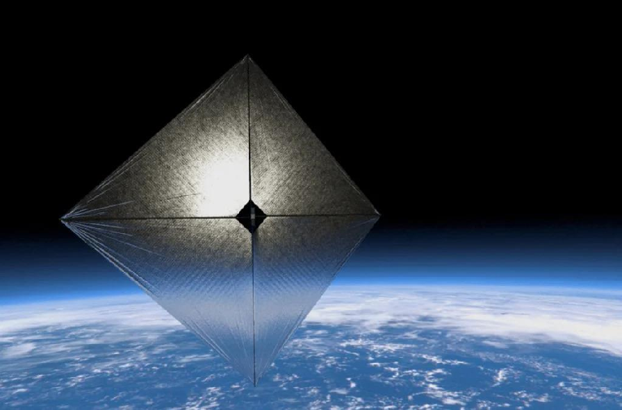

Figure 1 - Reprinted from "Vele solari diffrattive: le future superfici per lo spazio," by Lorenzo Iacopino, 2022.

# SPCE 5065 MILESTONE 1

## SOLIS - Preliminary Analysis of a Cost-Effective Approach to Interstellar Travel

## JULY 5

## , 2025

TH

Dale Mueller

### Contents

Introduction................................................................................................................................................................1 Environment Background...........................................................................................................................................1

Sun-Earth System ...................................................................................................................................................1 Approaching the Sun ..............................................................................................................................................2 Space Weather .......................................................................................................................................................3 Vacuum Testing ......................................................................................................................................................4

Orbit Information .......................................................................................................................................................4 Conclusion ..................................................................................................................................................................5 References and Appendices .......................................................................................................................................5

APPENDIX C.........................................................................................................................................................6

#### Introduction

The SOlar Light Interstellar Sailer (SOLIS) is a novel design for a diffractive solar sail that can take payloads into interstellar space with an economical cost and swift delivery speed. It does this by first approaching the Sun and inserting into the necessary escape orbit (~3 years), and then using the solar sails to accelerate the payload to near-relativistic speeds, 0.1% the speed of light [1]. This reaches the heliopause in 2 years, when the payload can slow down to stay in orbit of the solar system for easier communications or continue sailing into the unknown. The primary objective is to deliver payloads to interstellar space, while a secondary objective is to stop halfway, and deliver satellites to the Sun. Another secondary goal is to serve as a high-gain antenna for payloads beyond the heliopause. The satellite name is derived from the primary objective and the means of reaching it.

#### Environment Background

##### Sun-Earth System

Since SOLIS parks in Earth orbit for part of its life, it is necessary to review hazards unique to that domain. The biggest influence of the Terran space environment is the Sun. There are two main forms of solar energy output: light and plasma (charged particles). Both of these directly and indirectly affect satellites. The Sun emits electromagnetic radiation across a wide spectrum, including significant amounts of ultraviolet (UV) and X-rays along with the continuous outflow of charged particles in the solar wind. In solar flares or CMEs, this output is dangerously amplified. The only relevant effect of light is the creation of atomic oxygen, through which it indirectly harms satellites. Charged particles consisting of energetic protons and free electrons, on the other hand, have many interactions with Earth, mainly through its magnetic field. They get trapped into Van Allen radiation belts, funnel into the poles, and directly cause all sorts of problems for S/C. Earth’s magnetic field is a complex, tempestuous thing, responsible for the Van Allen radiation belts and geomagnetic storms. It keeps us safe on the surface of the planet, but is outright hostile to our creations that pass through it.

For satellites in LEO, the main risk posed is increased atmospheric drag due to heating and expansion of the upper atmosphere during solar maximum or geomagnetic storms. The increased drag can quickly deorbit a spacecraft (S/C). Another concern is the inner Van Allen radiation belt, which can fry electronics in a swift path to mission failure. High energy and flux (10s-100s MeV, >103particles/cm2s [2]) protons trapped in the belt can penetrate the outer layers of a satellite, and knock around electrons inside sensitive electronics. This induces two things: single event upsets (SEUs), which cause a bit to flip or soft error, or permanent damage to sensitive structures like transistors. To avoid both of drag and the belt, any potential LEO orbit for SOLIS should lie below the inner belt (800 km) without passing through the South Atlantic Anomaly, and be as high above the Earth’s surface as possible to minimize drag (minimum 300 km). A third factor to be considered is orbital debris. This additionally limits viable parking orbits. As will be later described in Orbit Information, it is important to note that the sail is closed while around Earth and does not pose increased challenges to debris or drag. A fourth risk is Atomic Oxygen (AO) attack. AO is produced in the exosphere by solar radiation dissociating O2 and O3. Since the exosphere is so sparse, they rarely recombine, and instead react with S/C faces they impact. These reactions slowly eat away at material, and can only be slowed by careful material selection. Since the mission does not spend long around Earth, AO, sputtering, and glow are not a major concern.

In Near-Earth Orbit (NEO, including but not exclusive to GEO), satellites face most of the same issues as interplanetary space (discussed further in Approaching the Sun). One unique issue in NEO is the outer Van Allen radiation belt. This one is a lot bigger than the inner belt, and is thus unavoidable. Luckily, it is weaker in terms of proton radiation than the inner one. It does, however, contain more electron radiation (>0.5 MeV, ~106 particles/cm2s [2]) and causes faster charging on a S/C. If the spacecraft develops a sufficiently high voltage differential, an electrostatic discharge (ESD) will occur, damaging electronics. The outer belt is particularly problematic for this, because it further energizes the electrons it captures from the solar wind, allowing them to penetrate further into the satellite. The solar wind does not pose as much of a deep discharge risk, and is limited to more superficial areas. The outer belt is also more susceptible to solar storms, carrying more radiation after absorbing a CME or flare, so care must be taken when sending SOLIS there during solar storms or solar cycle high,

- as these will only further power dangerous electrons.

All space environments (in the solar system) are exposed to UV, the vacuum of space, and the solar heat. UV can dissociate spacecraft material the same way it creates AO. This causes exposed materials to erode, causing tears, loss of efficiency, and ultimately adds another restraint on mission lifespan based on material properties. The vacuum of space induces outgassing, which can interfere with payload functions. The third issue is the heat. Since the solar sail operates by principle to always face the Sun, it will get rather hot. The payload may need special shielding or cooling solutions to tolerate the extreme temperatures.

##### Approaching the Sun

Special consideration must be given to the environment SOLIS will encounter during the slingshot maneuver. Even before then, it will experience ever-increasing levels of UV, solar flux, light and thus heat input, and other effects. The theoretical closest approach is at 2☉, or 696,000 km above the photosphere surface. Overall irradiance is 12,000 times more than at Earth (reaching 16 MW/m2), so the thermal load would be incredible. All rigid, joined components must have similar CTEs or the craft will break apart. UV is amplified by roughly the same amount, so

even though the craft spends a short time so close to the Sun, it must be prepared for some heavy degradation. Additionally, it needs to be strong enough to withstand the immense acceleration provided by the pressure of light. A quick estimate is that it would experience at most 42 N, which seems small until one considers that the entire craft is only a few micrometers thick. The solar wind and corona contain much denser plasma here, and it is most important that the S/C can handle or dispose of charging. The magnetic field in this area is roughly comparable to Earth’s, but can spike a thousandfold higher around active spots. Since it is almost inevitable that the mission will pass through an active region, electronics must either be shut down or protected in a Faraday cage to prevent unwanted currents. Overall, the craft must have a low residual dipole, or the field could pull in or eject the S/C. Another issue is micrometeoroids. Not many survive the intense blasting the Sun puts out, but the ones that do are travelling fast enough to be mission enders. To that end, the sail must be capable of taking a few hits with minimal loss of effective area. Depending on the bus size, it might be worth investing in protection for that, as a meteoroid there would annihilate the control systems. The last concern is comms difficulties. Many factors, like the magnetic field, radio emissions, and the charged corona make a practically insurmountable challenge for communications back to Earth or the deep space network. Therefore, it is necessary for automatic piloting of the sail around perihelion.

##### Space Weather

Space weather refers to the constantly changing conditions in the space environment surrounding Earth and beyond. It is produced primarily by the Sun’s activity. It includes the solar wind, solar flares (bursts of electromagnetic radiation and energetic particles), coronal mass ejections (massive plasma eruptions and their carried magnetic field), and the resulting disturbances in Earth’s magnetosphere and upper atmosphere. These phenomena can alter radiation levels, create geomagnetic storms, and trigger energetic particle events that pose significant risks to spacecraft electronics, communications, and in extreme cases, ground infrastructure. To monitor and forecast space weather, current research and operational capabilities include spacecraft like NASA’s Solar Dynamics Observatory and Parker Solar Probe, as well as real-time monitoring from NOAA’s Space Weather Prediction Center and instruments like the ACE and DSCOVR satellites that continuously measure solar wind speed, density, and the interplanetary magnetic field. It is also important to know where the solar cycle is currently, as it is more favorable to launch missions during low activity valleys.

For any customer operating a satellite mission, particularly a fragile craft like SOLIS, staying informed about space weather is critical. Energetic particles and strong geomagnetic storms can damage electronics, degrade solar panels or sail materials, and induce charging that risks sudden ESD. One direct impact of severe space weather is disruption of communications downlinks. Overall, these problems can be the cause of mission failure. For a satellite trying to reach a ground system, high solar activity can increase the ionization of Earth’s upper atmosphere, causing radio signal scattering or absorption that degrades signal strength and increases data loss. Strong solar storms can also trigger ionospheric scintillation — rapid signal fluctuations that can break a stable link between a satellite and ground station. Knowing when a CME is coming allows mission operators to prepare by rescheduling critical data transmissions, adjusting satellite orientation, or powering down sensitive subsystems, ensuring mission safety and data integrity. EPS is generally the most affected subsystem (for solar-powered satellites), reducing available power to the bus. Avionics are next due to elevated rates of SEUs during bad weather, followed by comms. Payloads can be affected if they also capture the contents of CMEs and flares, reading bad data or suffering permanent damage. The same reason we don’t look at the Sun with the naked eye

applies to our sensing machines. Other subsystems that could suffer adverse effects are ADCS, if it uses magnetotorquers; structures, and electric propulsion.

##### Vacuum Testing

Vacuum testing, or more commonly Thermal Vacuum Testing (TVT) involves placing the satellite into a simulated space environment before it touches actual space. This is performed to uncover flaws in manufacturing and design deficiencies. This is important to judge outgassing, and the security of structures like pressure vessels and fuel tanks. It also provides a means to verify theoretical analysis and evaluate models. In general, vacuum testing is very important for satellites that have not been previously flown/tested. Production lines of the same satellites only really need to test a prototype to iron out the kinks across the template.

For SOLIS, TVT is highly suggested to ensure the structure can endure the immense thermal cycling necessary. Only a small segment of the structure needs to be tested, since it is uniform outside of the bus. Not performing a test risks the satellite being destroyed 3 years into a mission, which is a long time to wait to fix any mistakes. While the satellite is relatively cheap, a hundred million dollars is nonetheless an expensive endeavor. Additionally, since SOLIS is intended to carry customer payloads to deep space, outgassing from the carrier to the payload is of particular concern. A customer losing a satellite to a poor rocket will not use it again, nor will other prospective customers. The same applies to a mission destroying carrier. Overall, since the surface area of the sail is so high (500 m2 in the test in Orbit Information), tremendous outgassing will occur, and it is likely to be attracted back to the entire structure due to charging. A quick estimate assuming 0.02 TML granted 400 g of volatiles being released and recondensing onto the satellite. The sail itself will be too hot, but the bus will be cool, so much of that will land on the bus, and thus payload if not protected. TVT would measure just how much is released, and a vacuumbakeout could alleviate some of the risk.

#### Orbit Information

For both Sun orbiting and interstellar destinations, SOLIS launches into a LEO or NEO parking orbit, depending on the user’s timeline. Faster launches using more fuel insert far past NEO. From there, when the window of opportunity opens, the satellite deploys and starts maneuvers to orbit the Sun instead of Earth. A small ΔV is used to kick the satellite into a spiral descent towards the Sun. Stronger kicks will get it there faster. Once it has left the Terran sphere of influence the two paths diverge. Both modify the orbit over about 2-3 years, though in different ways. Once close to done, the interstellar payload enters an escape trajectory, whereas the Sun payload sticks around. The escape trajectory, from testing on a model, comprises two parts. The first orbit after ejection only gains enough energy to nullify the gravitational potential to loop past and back from 1 AU. SOLIS then returns to the Sun to accrue enough energy to escape the solar system. The best test took 4.26 years to fall towards the Sun then escape to 50 AU, at which point it was traveling 305 km/s, about 0.1% of the speed of light. A video of that SOLIS operating orbit is provided with this paper. The satellite starting position is at the right middle, which is coincidental with Earth’s orbit. The orbit was plotted using a Matlab script (in Appendix A) that was in turn developed from [3].

There is no one best set of orbital elements and maneuvers to define the mission, they instead depend on budget and timeline. There are areas of lesser time and thus potential cost, like launching through the ecliptic will be

cheaper than out of plane of the solar system. Likewise, more controlled descents can offer faster ultimate speeds,

- at the cost of fuel. A recommended parking orbit is at geosynchronous orbit with minimal eccentricity. Inclination should match the ecliptic (23.4°) (Earth inertial frame). The next orbit is in the Sun inertial frame, the descent orbit. It attempts to keep semimajor axis constant at 1 AU, as eccentricity is increasing for an interstellar launch. Inclination and other elements pertain to a particular customer mission. Sun-bound satellites have a reducing semi-major axis and near-zero eccentricity.

#### Conclusion

The SOLIS mission demonstrates a feasible and cost-effective pathway for transporting customer payloads from Earth orbit to the Sun or deep space using novel diffractive solar sail propulsion. Addressed were the key environmental risks the vehicle will face while parked in Earth orbit and during its descent toward the Sun, with detailed consideration of charged particle effects, radiation exposure, orbital drag, and outgassing hazards. Research investigated the effects of space weather, the necessity of vacuum testing to reduce mission risk, and the effect of constraints such as budget and timeline. A parking orbit at geosynchronous altitude was recommended to minimize travel times and better take advantage of the mission’s nature. A MATLAB simulation verified that the mission concept of operations - using staged solar sail maneuvers to spiral inward and then escape - is technically feasible within the predicted mission duration. The groundwork is set for further development and modeling of the hazards that face the shining ticket to the void beyond called SOLIS.

#### References and Appendices

- [1] Davoyan, Artur. (2021, April 8). Extreme Solar Sailing for Breakthrough Space Exploration. NASA. https://www.nasa.gov/general/extreme-solar-sailing-for-breakthrough-space-exploration/

- [2] Tribble, A. C. (2003). The space environment: Implications for spacecraft design (2nd ed.). Princeton University Press.
- [3] Dubill, A. L., & Swartzlander, G. A. (2021). Circumnavigating the Sun with Diffractive Solar Sails. Acta Astronautica, 187, pp. 190–195. doi:10.1016/j.actaastro.2021.06.036

APPENDIX A

Orbit Simulation Code.

% Script SOLIS - Solar Sail plot by Dale Mueller, UCCS close all; clear; clc % Variables t=0; tstep=1; % do not raise tmax=floor((365+1/3)*86400*4.30); % # of seconds to simulate rlaunch=695508000*5; [~,~,u,v]=deal(zeros(1,floor(tmax/tstep))); AU=149597870700; rmax=50*AU;

- x(1)=AU;
- y(1)=0;

- u(1)=0;
- v(1)=30000*4.2; m=20; % kg % Precalc constants G=1.32712440018E20*m; % m3kg/s2 SRP=@(r) (AU/r)^2*9.073333333333333E-6; % Primary loop figure hold on % axis([-2E11 2E11 -2E11 2E11]) plot(0,0,'Marker','o',MarkerFaceColor=[1,1,0],MarkerEdgeColor=[1,0.9,0],MarkerSize=10) % sun i=1; r=x(1); rs1=AU; rs2=AU; f=1; F(16000) = struct('cdata',[],'colormap',[]); vidObj = VideoWriter('peaks.avi'); vidObj.FrameRate=300; open(vidObj); h = animatedline; while r>rlaunch && t<tmax

r=norm([x(i),y(i)]); FG=-G/r^2; aF=-SRP(r)*500*0.15; vt=norm([u(i),v(i)]);

- u(i+1)=u(i)+FG*x(i)/r*tstep+aF*u(i)/vt*tstep;
- v(i+1)=v(i)+FG*y(i)/r*tstep+aF*v(i)/vt*tstep;

- x(i+1)=x(i)+u(i)*tstep;
- y(i+1)=y(i)+v(i)*tstep; t=t+tstep; if y(i+1)*y(i)<0 && y(i+1)>0

rs2=rs1; rs1=r;

elseif y(i+1)*y(i)<0 && y(i+1)<0 v(i+1)=v(i+1)-2300-500*(AU/rs1)^2; % farside correction

end i=i+1; if mod(i,10000/tstep)==0

% plot(x(i),y(i),'Marker','.',MarkerSize=8,MarkerFaceColor=[0,0,0],MarkerEdgeColor=[0,0,0]) % plot([0,aF*u(i)/vt*tstep*1E14],[0,aF*v(i)/vt*tstep*1E14])

addpoints(h,x(i),y(i)) drawnow

% F=getframe(gcf); % writeVideo(vidObj,F); % f=f+1;

end

end disp('eject') % disp(f) axis([-1.5E11 1.5E11 -1.5E11 1.5E11]) while r<rmax && t<tmax && f<16001

r=norm([x(i),y(i)]); FG=-G/r^2; aF=SRP(r)*500*0.95; vt=norm([u(i),v(i)]);

- % u(i+1)=u(i)+(FG+aF)*x(i)/r*tstep;
- % v(i+1)=v(i)+(FG+aF)*y(i)/r*tstep;

- u(i+1)=u(i)+FG*x(i)/r*tstep+aF*u(i)/vt*tstep;
- v(i+1)=v(i)+FG*y(i)/r*tstep+aF*v(i)/vt*tstep;

- x(i+1)=x(i)+u(i)*tstep;
- y(i+1)=y(i)+v(i)*tstep; t=t+tstep; i=i+1; if mod(i,1000/tstep)==0

% plot(x(i),y(i),'Marker','.',MarkerSize=8,MarkerFaceColor=[0,0,0],MarkerEdgeColor=[0,0,0]) % plot([0,aF*u(i)/vt*tstep*1E14],[0,aF*v(i)/vt*tstep*1E14])

addpoints(h,x(i),y(i)) drawnow

% F=getframe(gcf); % writeVideo(vidObj,F); % f=f+1;

end end

- % x(x==0)=[];
- % y(y==0)=[]; % plot(x,y) hold on fprintf('Seconds: %f\nYears:%f\n',t,t/(86400*365.33)) if r>rmax

disp('passed 50 AU') else

disp('time exceeded')

end speed=sqrt((x(i)-x(i-1))^2+(y(i)-y(i-1))^2); fprintf('Final speed=%f km/s, or\n%f%% of the speed of light\n)',speed/1000,speed/299792458*100)
