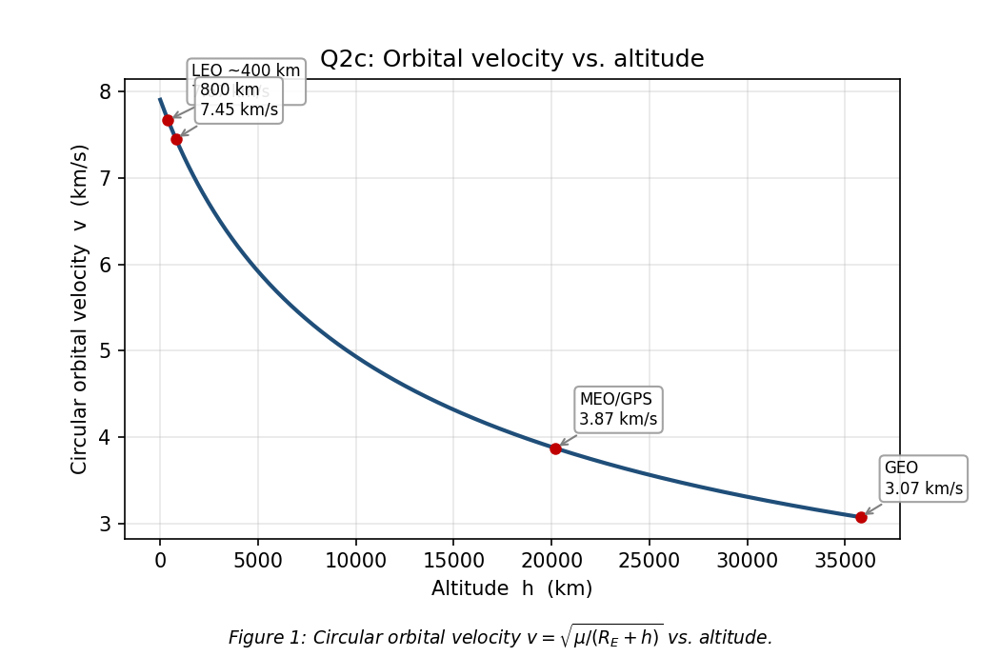
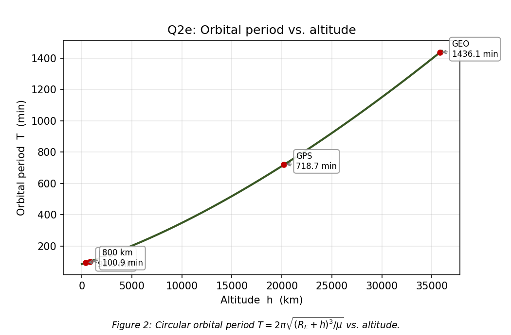
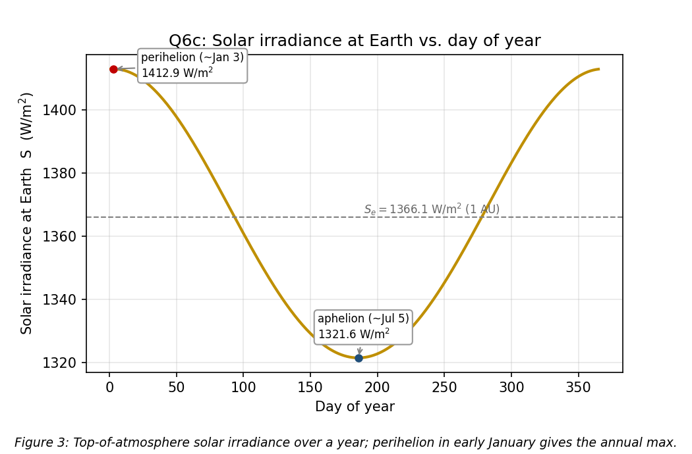
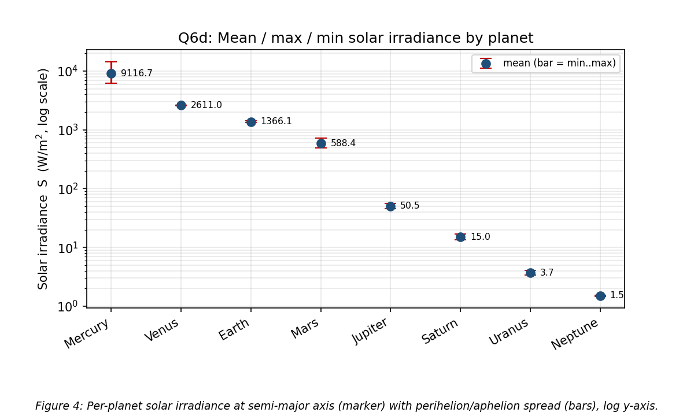

# SPCE 5065 — Homework 1
**Space environment anomalies + two-body orbital mechanics and solar irradiance**
**Author:** Jordan Clayton
**Date:** June 25, 2026

---

### Approach Overview

1. **Q1 is a real anomaly write-up — I went with Galaxy 15, the "Zombiesat."** It's a clean spacecraft-charging/ESD failure in GEO with a concrete engineering fix afterward, and it ties straight back to the plasma/charging material in Lesson 1. The lecture's framing that ~25% of all spacecraft anomalies trace to the space environment [1] is exactly the bucket this falls into.

2. **Q2 is one short derivation chain, then two graphs.** I set gravity equal to the centripetal requirement, solved for $v$, then got the period straight off the circumference. The graphs (Figs 1–2) are just those two closed forms swept over altitude. I dropped reference markers on LEO/GPS/GEO so the curves are anchored to orbits I actually recognize.

3. **Q3 — the answer is "not really," and the reason is the timescale mismatch.** At 800 km the natural lifetime is centuries, which swamps a single 11-year solar cycle, so whatever phase you launch in gets averaged out over the many cycles the satellite lives through. That's different from a 350 km orbit, where lifetime is months-to-years and launch phase matters a lot.

4. **Q4 — I treated the "all of Lesson 1" instruction literally** and walked every environment from the lesson against a 350 km optical EO bird: drag, atomic oxygen, charging, radiation/SAA, debris, UV, contamination, thermal cycling. Atomic oxygen and contamination are the ones that actually keep an optical-payload operator up at night down there.

5. **Q5 — drift is the geodynamo wandering, reversals are read out of frozen rock magnetism**, and the honest answer on "next reversal" is that nobody can put a date on it — the field is weakening but a flip isn't imminent. I separated that cleanly from the Sun's 11-year flip so the two don't get conflated.

6. **Q6 is inverse-square geometry.** Solar constant as a function of where you are in the orbit, then Earth's annual max/min, then the same formula pushed out to every planet on a log axis (Fig 4). Perihelion/aphelion drive everything.

7. **Q7 and Q8 are both "invert a known law for the central mass."** Q7 is Kepler III for Saturn from Titan; Q8 is vis-viva for an asteroid from one position/velocity pair. The ~4% Saturn miss is the interesting part — it's the rounded input data, not a broken method.

8. **One Python script does all the numbers and figures** (Q2, Q6, Q7, Q8). The conceptual problems (Q1, Q3, Q4, Q5) are prose. Every boxed number below is reproduced by the script in the appendix.

---

## Problem 1: Spacecraft Anomaly Due to the Space Environment

> *Find an example of a spacecraft anomaly due to the space environment. Describe what happened and what improvements were made to avoid a recurrence of the problem.*

**The bird: Galaxy 15**, an Intelsat C-band communications satellite built on the Orbital Sciences STAR-2 bus, parked at 133°W in the geostationary belt. On **5 April 2010 it stopped accepting ground commands** but — and this is the part that made it famous — its payload stayed fully powered, transponders live, still amplifying and re-radiating whatever it received [2]. A GEO satellite that won't take commands but won't shut up is the worst combination: it can't be told to stop, and it drifts.

**What actually happened.** The most widely accepted explanation — the leading Intelsat/Orbital finding, though never proven conclusively — is that Galaxy 15 lost the ability to respond to commands after an **electrostatic discharge (ESD) event tied to elevated space weather** around that date, i.e. a spacecraft-charging failure. The bus accumulated charge from the GEO plasma environment (energetic electrons in the outer belt / plasma sheet during disturbed conditions), the differential charging exceeded the arc threshold somewhere on the vehicle, and the resulting discharge latched up the baseband command unit so it ignored the ground [2], [3]. This is textbook Lesson 1 charging physics: in GEO you're sitting in keV-and-up electrons, surfaces charge to different potentials, and when the gradient gets big enough you get an arc [1]. The lecture's point that GEO actually has a *worse* charging/radiation environment than LEO is the whole reason this regime is dangerous.

**Why it was a big deal.** With station-keeping dead, Galaxy 15 drifted eastward along the GEO arc — a "zombiesat" — and walked right toward neighboring satellites like AMC-11, threatening to interfere with their C-band uplinks as the longitudes lined up. Operators had to manage live payloads around a 2-ton object they couldn't talk to for the better part of a year. It was finally recovered in **December 2010**: the battery eventually browned out, the bus underwent a full power-on reset, and Intelsat re-established contact and reloaded the flight software [2].

**Improvements made to avoid recurrence.**
- **Autonomous reset / watchdog timer.** Orbital Sciences rolled out a flight-software and procedural fix across the rest of the STAR-2 fleet so that a vehicle losing ground contact for a set interval will **automatically reset itself** rather than sitting latched and powered — exactly the failure mode that turned a charging glitch into an eight-month saga [2], [3].
- **Hardened command path.** The susceptibility in the command receiver/baseband chain that let an ESD latch it was addressed in subsequent builds — better filtering and reset logic on the unit that got stuck.
- **The general charging-mitigation playbook this reinforced** (and what Lesson 1 prescribes [1]): conductive surface coatings and grounding straps so the whole structure bleeds to a common potential instead of building differentials, biasing high-voltage buses to stay below arc thresholds (the ISS runs its arrays at 120 V for exactly this reason), and space-weather-aware operations so crews are watching during disturbed periods.

It's a good poster child because the fix is concrete and the cause is pure environment. And it's not a one-off — roughly a quarter of on-orbit anomalies get pinned on the space environment [1], with charging being one of the top contributors in GEO.

---

## Problem 2: Circular-Orbit Velocity and Period vs. Altitude

> *Newton's law of gravitation is $F = G\,\dfrac{M_E m_s}{(R_E+h)^2}$. (a) Write the centripetal acceleration in terms of orbital velocity, $R_E$, and $h$. (b) Derive orbital velocity as a function of altitude and $\mu$. (c) Graph velocity vs. altitude. (d) Derive the period as a function of altitude and $\mu$. (e) Graph period vs. altitude.*

**Classification:** Derivation (a, b, d) + computation/graphing (c, e). Let $r = R_E + h$ be the orbital radius throughout.

### (a) Centripetal acceleration

For anything in a circular orbit of radius $r = R_E + h$ moving at speed $v$, the acceleration points at the center with magnitude $v^2/r$. So directly:

$$\boxed{a_c = \frac{v^2}{R_E + h}}$$

That's the kinematic requirement — it has nothing to do with gravity yet. Gravity is what has to *supply* it, which is the next part.

### (b) Orbital velocity

I set the gravitational pull equal to the mass times the centripetal acceleration from (a). Newton's second law for the orbiting mass $m_s$:

$$G\frac{M_E m_s}{(R_E+h)^2} = m_s\,a_c = m_s\frac{v^2}{R_E+h}$$

The spacecraft mass $m_s$ cancels off both sides — already a good sign, because orbital velocity shouldn't care how heavy your satellite is. One factor of $(R_E+h)$ also cancels:

$$\frac{G M_E}{R_E+h} = v^2$$

Then I folded $G M_E$ into the given $\mu = 398600.5\ \text{km}^3/\text{s}^2$ and took the root:

$$\boxed{v = \sqrt{\dfrac{\mu}{R_E + h}}}$$

Sanity check at the surface ($h=0$): $v = \sqrt{398600.5/6378} = 7.906\ \text{km/s}$ — that's the ~7.9 km/s "first cosmic velocity" you always hear quoted for LEO. Yeah, that tracks.

### (c) Velocity vs. altitude

Sweeping that closed form from 0 to 36,000 km gives **Figure 1**. It falls off as $1/\sqrt{r}$ — slow and monotonic.



**Table 1:** Velocity and period at reference altitudes (from the script).

| Altitude $h$ (km) | Regime | $v$ (km/s) | $T$ (min) |
|---:|:---|---:|---:|
| 0 | Earth surface | 7.9055 | 84.49 |
| 400 | LEO (≈ISS) | 7.6686 | 92.56 |
| 800 | Q3 orbit | 7.4519 | 100.87 |
| 20,200 | MEO / GPS | 3.8740 | 718.0 |
| 35,786 | GEO | 3.0747 | 1436.06 |

### (d) Orbital period

The period is just the time to go once around the circumference at constant speed $v$:

$$T = \frac{2\pi (R_E+h)}{v}$$

Substituting $v = \sqrt{\mu/(R_E+h)}$ from (b):

$$T = \frac{2\pi (R_E+h)}{\sqrt{\mu/(R_E+h)}} = 2\pi (R_E+h)\cdot\frac{(R_E+h)^{1/2}}{\mu^{1/2}}$$

which collapses to Kepler's third law for a circular orbit:

$$\boxed{T = 2\pi\sqrt{\dfrac{(R_E+h)^3}{\mu}}}$$

**Verification:** at GEO altitude (35,786 km) this gives 86,164 s, matching one sidereal day to within 0.001% (Table 1). That's the cheap check that catches a missing factor or a unit slip — if a "geostationary" altitude didn't come back as a sidereal day, I'd know the formula was wrong.

### (e) Period vs. altitude

**Figure 2** is the same sweep for $T$. Unlike velocity, period climbs steeply ($r^{3/2}$), running from ~84 min at the surface out to ~24 h at GEO.



---

## Problem 3: 800 km Lifetime vs. Solar-Cycle Phase at Launch

> *For a satellite launched to an altitude of 800 km, is there any significant difference to the lifetime depending on the phase of the solar cycle at launch? Explain your answer.*

**Short answer: no — not a significant difference in *total* lifetime, because of a timescale mismatch.** Here's the reasoning, and the caveat at the end matters.

**The physics that *does* matter.** Orbital decay at 800 km is driven by neutral drag, and drag scales with the local atmospheric density, which is brutally sensitive to solar activity [1]. When the Sun is active (high F10.7 / lots of EUV) it dumps energy into the thermosphere, the gas heats and expands, and the density at any *fixed* altitude goes up — the atmosphere literally puffs out past you. That effect gets *more* dramatic the higher you are, because a hotter thermosphere has a larger scale height. Up at 800 km the density can swing by something like one to two orders of magnitude between solar minimum and solar maximum [4], [5]. So instantaneous drag absolutely cares about where we are in the cycle.

**Why the launch phase still washes out.** The lifetime of an 800 km orbit is on the order of **centuries** — that's exactly why 800 km is such a debris-congested "don't park here" altitude; stuff launched decades ago is still up there. The 11-year solar cycle is tiny compared to that. A satellite that lives for ~200 years rides through ~18 full solar cycles no matter when it launches, so it sees essentially the same *time-averaged* density either way. Launching at solar max vs. solar min just shifts which cycle you start on — it doesn't change the long-run average that sets the total decay. The starting phase gets integrated away.

**The contrast that makes the point.** Drop the same question to a 350 km orbit (like Problem 4's bird) and the answer flips to "yes, hugely." There the natural lifetime is months to a few years — *comparable to or shorter than* a single solar cycle — so the phase you launch into is most of the story. Launch a low LEO sat into a rising/maximum phase and the puffed-up atmosphere can pull it down years earlier than the same sat launched into a deep minimum. **The rule of thumb: launch phase matters when the orbital lifetime is on the order of a solar cycle or less. At 800 km it isn't, so it doesn't.** Starlink's 2022 loss of ~40 satellites to a minor storm is the low-altitude version of this — that only bites because they deploy down around 200–300 km where lifetime is days [1].

**The caveat.** "Total lifetime" is one thing; *operations and short-term decay prediction* are another. Launch into solar max and your early-mission drag, station-keeping fuel budget, and conjunction/tracking picture all look different in the first few years than a solar-min launch would. So for planning the first cycle the phase isn't irrelevant — it just doesn't move the centuries-long endgame.

---

## Problem 4: Space-Environment Hazards for a 350 km Optical EO Spacecraft

> *An Earth-observation spacecraft with an optical payload is in a 350 km circular orbit. What are the major problems operators might expect from the space environment in this regime? What mitigates those risks? Include an overview of all effects covered in Lesson 1, not just Chapter 1 of the textbook.*

At 350 km you're deep in LEO, and Lesson 1's blunt summary applies: down here **you get all of it** [1]. I'll walk every environment from the lesson, flag what each does to an *optical* EO bird specifically, and give the mitigation.

**Neutral environment (the dominant pair at 350 km):**
- **Atmospheric drag** — 350 km is firmly inside the "drag is a major effect" band (below ~1000 km) [1], and at the low end of it. Drag $\propto \rho v^2$ with $v\approx 7.7$ km/s, so the orbit decays on a timescale of months-to-low-years without help. *Mitigation:* onboard propulsion / station-keeping, a low ballistic-coefficient attitude (fly minimum frontal area), and accepting frequent reboosts. This is the single biggest operational cost down here.
- **Atomic oxygen (AO)** — at this altitude AO is, per the assigned reading, *the* most significant material-degradation agent [6]. Ram-facing surfaces get hit by ~5 eV atomic oxygen that chemically erodes polymers (Kapton, Teflon), oxidizes silver and osmium, and eats organic coatings. AO flux itself swings ~an order of magnitude over the solar cycle [6]. *Mitigation:* AO-resistant coatings (SiOₓ overcoats), avoid bare silver/Kapton on ram faces, add erosion margin to exposed films.
- **Sputtering** — mechanical erosion from neutral/ion impacts on surfaces, same ram-face problem, same coating fix [1].

**Plasma / charged-particle environment:**
- **Spacecraft charging and ESD** — the ambient LEO plasma (roughly equal O⁺ ions and electrons) charges surfaces; differentials can arc, dumping EMI into electronics and pitting coatings [1]. Less vicious than GEO but real, especially crossing the auroral zones. *Mitigation:* conductive coatings and a solid grounding scheme so the structure stays equipotential; bias high-voltage buses below the arc threshold (ISS-at-120 V trick).
- **Radiation — TID and single-event effects** — galactic cosmic rays, solar protons, and trapped particles deliver total ionizing dose (slow embrittlement) and single-event upsets/latch-ups (a cosmic ray flips a bit, 0↔1, or latches a device) [1]. At 350 km Earth's field shields most of this **except** —
- **The South Atlantic Anomaly (SAA)** — the one place the field is weak enough that the inner belt dips down to LEO, and it's the dominant radiation-anomaly zone for a low EO satellite [1]. Every pass through the SAA the detector sees a burst of SEUs and the imager picks up transient hits/streaks in the frames. *Mitigation:* rad-hard or rad-tolerant parts, EDAC/error-correcting memory, triple-module redundancy on critical logic, and *operationally* flagging or power-cycling sensitive electronics over the SAA and discarding SAA-corrupted imagery.
- **Van Allen belts** — mostly above 350 km, so you're under them except for the SAA intrusion. Noted for completeness [1].

**Solar activity / space weather:**
- Flares (X-rays, ~8 min to Earth) and CMEs (~1–3 days) spike thermospheric density → **drag surges** that move the orbit and burn fuel, and disturb HF/comms and GPS [1]. *Mitigation:* NOAA space-weather monitoring, hold maneuvers during storms, carry drag-margin fuel.

**Micrometeoroids & orbital debris (MMOD):**
- High flux in LEO — tens of thousands of tracked objects, far more untracked; a paint chip once cracked a Shuttle window [1]. The saving grace at 350 km is that drag self-cleans this band fast, so debris doesn't accumulate the way it does at 800 km. *Mitigation:* conjunction screening + avoidance maneuvers for tracked objects, Whipple shielding on critical surfaces for the small stuff you can't dodge.

**Vacuum, UV, contamination, thermal (the optical-payload killers):**
- **Vacuum / outgassing / molecular contamination** — in vacuum, volatiles boil off materials and redeposit on the coldest line-of-sight surfaces, which for an imager means **the optics and focal plane** [1], [6]. A hazed lens raises stray light and kills contrast — straight at the heart of the mission. *Mitigation:* thermal-vacuum bakeout before flight, low-outgassing material selection (ASTM E595), vent-path design, and keeping optics warmer than surrounding surfaces.
- **Solar UV degradation** — UV darkens and embrittles polymers and slowly degrades coatings, solar-cell cover glass, and optical surfaces [1], [6]. *Mitigation:* UV-stable materials and coatings, margin on optical throughput.
- **Thermal cycling** — ~16 orbits/day means ~16 hot/cold cycles/day, swinging across a wide range as the bird crosses the terminator [1], [6]. CTE mismatches crack coatings and, worse for imaging, **flex optical mounts and shift focus/alignment**. *Mitigation:* athermal optical mount design, active/passive thermal control (radiators, louvers, heaters) to hold the payload in a tight band.
- **Cold welding** of bare metal contacts in vacuum can seize mechanisms (gimbals, deployables) [1]. *Mitigation:* proper lubricants/coatings on moving parts.

**Net for the operator:** drag sets the fuel budget and lifetime, the SAA sets the data-quality/upset budget, and AO + contamination + UV + thermal cycling gang up on the optics — which for an *optical* EO mission is the part you most have to defend. Not a gentle place to fly a telescope.

---

## Problem 5: Earth's Magnetic Field — Drift, Reversals, and the Next One

> *Why does the Earth's magnetic field drift? How do we know the magnetic field reverses periodically? When is the next one predicted to occur?*

### Why it drifts

The field is generated by the **geodynamo** — convecting, electrically conducting liquid iron in the outer core [1]. Three ingredients drive it: the kinetic energy of the convecting fluid (powered by core cooling and Earth's rotation, which organizes the flow via the Coriolis effect), the resulting electric currents, and the magnetic field those currents sustain in a self-reinforcing loop [1]. Because that fluid flow is turbulent and constantly reorganizing, the field it produces is never static — it changes year to year. That slow change is called **secular variation**.

A few concrete consequences the lecture calls out [1]:
- The field is roughly a **dipole, but the magnetic axis is tilted off the spin axis** and the poles wander *independently* of each other.
- The **north magnetic pole has been booking it toward Siberia** (and the south pole toward Australia) — fast enough that the world magnetic model has to be updated on a regular cadence so navigation systems stay honest.
- Field strength runs ~30 µT at the equator to ~60 µT at the poles [1].

So "drift" is just the surface readout of a churning fluid dynamo down in the core — the source itself is moving, so the field moves.

### How we know it reverses

We read it out of **rocks (paleomagnetism)**. When igneous rock cools through the Curie temperature, magnetic minerals in it lock in the direction of the ambient field at that moment, like a frozen compass. Sampling rocks of different ages shows the field has flipped north-south polarity many times.

The cleanest evidence is the **seafloor-spreading magnetic stripe record** (Vine–Matthews–Morley): at mid-ocean ridges new crust forms continuously and freezes in the field as it cools, so the seafloor lays down a tape recording of normal/reversed polarity in **symmetric stripes mirrored on both sides of the ridge** [7]. Symmetric, matching barcodes on either side of a spreading center is hard to explain any way *other* than a field that periodically reverses while the seafloor pulls apart — that's what nailed it.

The numbers from the lecture [1]:
- **171 reversals in the last 71 million years**, averaging roughly **one every ~415,000 years** —
- but wildly irregular, with gaps ranging from **~100,000 years to ~50 million years**,
- and the **last full reversal (Brunhes–Matuyama) was ~780,000 years ago**.

### When's the next one

Honestly — **nobody can give a date, and despite the field weakening, a reversal is not imminent** [7], [8]. The "we're overdue" line you get from the 415 kyr average is misleading because the intervals are so irregular that an average is nearly meaningless [7]. The field *is* losing strength (on the order of ~5–10% per century) and the South Atlantic Anomaly is growing, which is why people raise the question — but the present field is still strong relative to its long-term range, and a full reversal is a slow process that plays out over **~1,000 to 10,000 years** once it starts [8]. Current scientific consensus: no reversal in the next several centuries at least, and the present weakening is plausibly within normal secular-variation wobble rather than the start of a flip [7], [8].

One thing to keep straight: this is the **Earth's** field, reversing on hundred-thousand-year scales. The **Sun** flips its polarity every ~11 years with the solar cycle [1] — totally separate clock, don't conflate them.

---

## Problem 6: Solar Irradiance vs. Distance, Day-of-Year, and by Planet

> *The solar constant at distance $r$ is $S(r) = S_e\,(au/r)^2$, with $S_e = 1366.1\ \text{W/m}^2$ at 1 AU. (a) Express $S$ as a function of orbit eccentricity. (b) Find Earth's max and min solar constant. (c) Graph irradiance at Earth vs. day of year. (d) Compute and plot mean, max, and min irradiance for every planet on a log y-axis.*

**Classification:** Derivation (a) + computation/graphing (b–d). Pure inverse-square geometry.

### (a) $S$ as a function of eccentricity

The orbit equation gives heliocentric distance in terms of true anomaly $\nu$ and eccentricity $e$, with semi-major axis $a$ (in AU):

$$r = \frac{a(1-e^2)}{1 + e\cos\nu}$$

Drop that into $S(r) = S_e\,(1\,\text{AU}/r)^2$. Keeping $a$ general (in AU), the fully general form is

$$\boxed{S(\nu) = \frac{S_e}{a^2}\left(\frac{1 + e\cos\nu}{1 - e^2}\right)^2}$$

and for a planet whose semi-major axis is 1 AU (Earth, $a=1$) the $a^2$ drops out, leaving $S(\nu) = S_e\left(\frac{1 + e\cos\nu}{1 - e^2}\right)^2$. I use the general $1/a^2$ version in part (d) for the other planets.

The extremes fall out by setting $\cos\nu = +1$ (perihelion, $r = a(1-e)$) and $\cos\nu = -1$ (aphelion, $r = a(1+e)$):

$$\boxed{S_{\max} = \frac{S_e}{(1-e)^2}\quad(\text{perihelion}),\qquad S_{\min} = \frac{S_e}{(1+e)^2}\quad(\text{aphelion})}$$

So eccentricity is the whole story for how much the irradiance breathes over an orbit — a circular orbit ($e=0$) gets a flat $S_e$, and the spread grows with $e$.

### (b) Earth's max and min

With Earth's $e = 0.0167$:

$$S_{\max} = \frac{1366.1}{(1-0.0167)^2} = \boxed{1412.9\ \text{W/m}^2}\qquad S_{\min} = \frac{1366.1}{(1+0.0167)^2} = \boxed{1321.6\ \text{W/m}^2}$$

That's about a ±3.4% swing around the mean — and it lines up with the accepted ~1413 / ~1322 W/m² perihelion/aphelion values, which is the check that the sign convention (perihelion = closer = *brighter*) didn't get flipped. Note the counterintuitive bit: Earth is **closest to the Sun in early January**, northern-hemisphere winter. Seasons are axial tilt, not distance.

### (c) Irradiance vs. day of year

To get $S$ vs. calendar day I needed $r$ vs. day, so I ran the mean anomaly from perihelion (~Jan 3), solved Kepler's equation $M = E - e\sin E$ for the eccentric anomaly with Newton-Raphson, took $r = a(1 - e\cos E)$, and fed it through the inverse-square law. **Figure 3** is the result — a smooth annual cycle peaking at 1412.9 W/m² in early January and bottoming at 1321.6 W/m² in early July.



### (d) Every planet, log scale

Same formula per planet using each one's $a$ and $e$: mean $= S_e/a^2$, max $= S_e/[a(1-e)]^2$, min $= S_e/[a(1+e)]^2$. **Table 2** has the numbers, **Figure 4** plots them on a log y-axis (essential — Mercury to Neptune spans nearly four orders of magnitude).

**Table 2:** Solar irradiance by planet (W/m²).

| Planet | $a$ (AU) | $e$ | $S_{\text{mean}}$ | $S_{\max}$ (perihelion) | $S_{\min}$ (aphelion) |
|:---|---:|---:|---:|---:|---:|
| Mercury | 0.387 | 0.2056 | 9116.7 | 14447.4 | 6272.0 |
| Venus | 0.723 | 0.0068 | 2611.0 | 2646.7 | 2576.0 |
| Earth | 1.000 | 0.0167 | 1366.1 | 1412.9 | 1321.6 |
| Mars | 1.524 | 0.0934 | 588.4 | 715.9 | 492.2 |
| Jupiter | 5.203 | 0.0484 | 50.5 | 55.7 | 45.9 |
| Saturn | 9.537 | 0.0539 | 15.0 | 16.8 | 13.5 |
| Uranus | 19.189 | 0.0473 | 3.71 | 4.09 | 3.38 |
| Neptune | 30.070 | 0.0086 | 1.51 | 1.54 | 1.49 |



Two things jump out and both make sense: **Mercury has by far the widest spread** (huge error bar) because its $e=0.21$ is the most eccentric orbit in the set, and **Venus is nearly a flat point** because its orbit is almost perfectly circular. My Earth value of 1366.1 mean / 1412.9 max / 1321.6 min reproduces part (b) exactly — same formula, same answer, so the per-planet machinery is wired right.

---

## Problem 7: Mass of Saturn from Titan's Orbit

> *Titan has a period of 14.1 Earth days. (a) Determine Saturn's mass if Titan's semi-major axis is 1,110,781,765 m. (b) Find a published Saturn mass and compute the percent difference. (c) Explain the difference.*

**Classification:** Computation. Kepler's third law inverted for the central mass.

### (a) Computed mass

For a small moon around a big planet, Kepler III is $T^2 = \dfrac{4\pi^2 a^3}{G M}$, which I invert for the central mass:

$$M_{\text{Saturn}} = \frac{4\pi^2 a^3}{G\,T^2}$$

With $T = 14.1 \times 86400 = 1{,}218{,}240$ s, $a = 1.110781765\times10^9$ m, and $G = 6.674\times10^{-11}$:

$$M_{\text{Saturn}} = \frac{4\pi^2 (1.110782\times10^9)^3}{(6.674\times10^{-11})(1.218240\times10^6)^2} = \boxed{5.462\times10^{26}\ \text{kg}}$$

### (b) Percent difference vs. published

The NASA Saturn Fact Sheet gives $M = 5.6834\times10^{26}$ kg [9]:

$$\text{\% diff} = \frac{5.462 - 5.6834}{5.6834}\times100 = \boxed{-3.9\%}$$

About 4% light.

### (c) Why the difference

It's not a broken method — Kepler III is exact for an ideal two-body orbit. The ~4% is the **input data**, in roughly this order of importance:
- **The given orbital parameters are rounded and not perfectly self-consistent.** Titan's *real* period is ~15.95 days and its real semi-major axis ~1.222×10⁹ m; the problem's 14.1 days paired with 1.1108×10⁹ m don't correspond to a clean Keplerian fit around the true Saturn mass. A pure two-body orbit at the given $a$ would have a ~13.8-day period, so the given 14.1 days is slightly long, which pulls the computed mass *down* — exactly the direction of the miss. The rounded inputs dominate the error.
- **The simple form neglects Titan's mass.** Strictly $T^2 = \dfrac{4\pi^2 a^3}{G(M+m)}$. But Titan is only ~1/4250 of Saturn, so that correction is ~0.02% — negligible here, not the culprit.
- **Real perturbations.** Saturn's oblateness ($J_2$), the Sun, and the other moons (Titan sits in resonances) all nudge the orbit off a clean ellipse, so a single $(a, T)$ pair won't reproduce the mass to high precision.
- **Constant precision** in $G$ (and the values of $a$, $T$) caps how many digits are even meaningful.

Bottom line: 4% off a one-line two-body calc from rounded textbook numbers is about what you'd expect — the physics is fine, the inputs are coarse.

---

## Problem 8: Mass of an Asteroid from One State

> *A spacecraft is in an eccentric orbit about an asteroid with semi-major axis 1000 km. At a distance of 1500 km from the asteroid the velocity is 10 m/s. Determine the asteroid's mass.*

**Classification:** Computation. Vis-viva solved for $\mu$, then divided by $G$.

The vis-viva equation ties speed, radius, and semi-major axis to the central body's $\mu$:

$$v^2 = \mu\left(\frac{2}{r} - \frac{1}{a}\right)\ \Longrightarrow\ \mu = \frac{v^2}{\dfrac{2}{r} - \dfrac{1}{a}}$$

With $a = 1{,}000{,}000$ m, $r = 1{,}500{,}000$ m, $v = 10$ m/s:

$$\frac{2}{r} - \frac{1}{a} = \frac{2}{1.5\times10^6} - \frac{1}{1.0\times10^6} = 3.3333\times10^{-7}\ \text{m}^{-1}$$

$$\mu = \frac{10^2}{3.3333\times10^{-7}} = 3.000\times10^{8}\ \text{m}^3/\text{s}^2$$

Then $M = \mu/G$ with $G = 6.674\times10^{-11}$:

$$M = \frac{3.000\times10^{8}}{6.674\times10^{-11}} = \boxed{4.49\times10^{18}\ \text{kg}}$$

**Sanity check:** that $\mu$ is ~9 orders of magnitude below Earth's, which is the right ballpark for a small body. Back out a size — at a typical rocky density of ~2000 kg/m³ that mass is a sphere of radius ~80 km, i.e., a mid-size asteroid. Physically reasonable, so I'll take it. Note the geometry is consistent too: $r = 1500$ km sits outside $a = 1000$ km, so the spacecraft is past apoapsis-distance on an eccentric orbit ($r > a$ means $e > 0.5$ here) — fine, vis-viva doesn't care where on the ellipse you sample.

---

## Deliverables

| File | Purpose |
|:---|:---|
| `spce_5065_hw1_submission.md` | This document |
| `spce_5065_hw1_solution.py` | Python script — all Q2/Q6/Q7/Q8 numbers + all figures |
| `figures/fig1_velocity_vs_altitude.png` | Q2c — velocity vs. altitude |
| `figures/fig2_period_vs_altitude.png` | Q2e — period vs. altitude |
| `figures/fig3_irradiance_vs_doy.png` | Q6c — irradiance at Earth vs. day of year |
| `figures/fig4_planet_irradiance.png` | Q6d — per-planet irradiance, log scale |

---

## Sources Cited

[1] George, L., "Introduction to the Space Environment — Lesson 1," SPCE 5065 lecture videos (Parts 1–3) and *SpaceEnvironBackground* slides, University of Colorado Colorado Springs, 2026.

[2] de Selding, P. B., "Intelsat's Wandering 'Zombiesat' Galaxy 15 Finally Recovered," *SpaceNews*, 23 Dec. 2010, https://spacenews.com/intelsats-wandering-zombiesat-galaxy-15-finally-recovered/ [retrieved 25 June 2026].

[3] Ferster, W., "Intelsat, Orbital Sciences Differ on Cause of Galaxy 15 Anomaly," *SpaceNews*, 2010, https://spacenews.com/ [retrieved 25 June 2026].

[4] Vallado, D. A., *Fundamentals of Astrodynamics and Applications*, 4th ed., Microcosm Press, Hawthorne, CA, 2013, Chap. 8 (atmospheric drag and density models).

[5] Wertz, J. R., Everett, D. F., and Puschell, J. J. (eds.), *Space Mission Engineering: The New SMAD*, Microcosm Press, Hawthorne, CA, 2011, Sec. 8 (orbital decay and atmospheric density).

[6] Finckenor, M. M., and de Groh, K. K., "A Researcher's Guide to: International Space Station Space Environmental Effects," NP-2015-03-015-JSC, NASA ISS Program Science Office, 2020, https://www.nasa.gov/connect/ebooks/iss-researchers-guide-space-environmental-effects/ [retrieved 25 June 2026].

[7] U.S. Geological Survey, "Geomagnetism Frequently Asked Questions," USGS Geomagnetism Program, https://www.usgs.gov/programs/geomagnetism/faqs [retrieved 25 June 2026].

[8] Phillips, T., "2012: Magnetic Pole Reversal Happens All the (Geologic) Time," NASA Science, 30 Dec. 2011, https://science.nasa.gov/science-research/heliophysics/2012-magnetic-pole-reversal-happens-all-the-geologic-time/ [retrieved 25 June 2026].

[9] Williams, D. R., "Saturn Fact Sheet," NASA Goddard Space Flight Center / NSSDCA, 2023, https://nssdc.gsfc.nasa.gov/planetary/factsheet/saturnfact.html [retrieved 25 June 2026]. (Saturn mass $= 5.6834\times10^{26}$ kg.)

---

## Appendix: Python Solution Script

```python
"""SPCE 5065 -- Homework 1 solution.

Two-body orbital mechanics + solar irradiance geometry. Covers the quantitative
parts of HW1:

  Q2  Circular-orbit velocity and period vs. altitude (derivations + 2 graphs)
  Q6  Solar constant vs. eccentricity / day-of-year, and per-planet irradiance
  Q7  Mass of Saturn from Titan's period and semi-major axis (Kepler III)
  Q8  Mass of an asteroid from a single vis-viva state
"""
from __future__ import annotations

import sys
from pathlib import Path

import matplotlib.pyplot as plt
import numpy as np

# Constants
MU_EARTH = 398600.5          # km^3/s^2  (given, mu = G*M_E)
R_E = 6378.0                 # km        (given Earth radius)
G = 6.67430e-11              # N*m^2/kg^2 (CODATA 2018)
S_E = 1366.1                 # W/m^2     (given solar irradiance at 1 AU)
AU_KM = 149_597_871.0        # km        (given 1 AU)
E_EARTH = 0.016710           # Earth orbital eccentricity
DAY_S = 86400.0              # s per day
FIG_DIR = Path(__file__).parent / "figures"


# --- Q2: circular-orbit velocity and period ---
def orbital_velocity(h_km):
    """v = sqrt(mu / (R_E + h))   [Q2b]."""
    return np.sqrt(MU_EARTH / (R_E + h_km))


def orbital_period(h_km):
    """T = 2*pi*sqrt((R_E + h)^3 / mu)   [Q2d]."""
    return 2.0 * np.pi * np.sqrt((R_E + h_km) ** 3 / MU_EARTH)


# --- Q6: solar irradiance ---
def solar_constant_from_r_au(r_au):
    """S(r) = S_e * (1 AU / r)^2."""
    return S_E * (1.0 / r_au) ** 2


def earth_sun_distance_by_day(doy, e=E_EARTH, day_perihelion=3.0):
    """Earth-Sun distance (AU) vs day-of-year via Kepler's equation."""
    M = 2 * np.pi * (doy - day_perihelion) / 365.25
    E = M.copy()
    for _ in range(50):
        E = E - (E - e * np.sin(E) - M) / (1 - e * np.cos(E))
    return 1.0 * (1 - e * np.cos(E))


# --- Q7: mass of Saturn from Titan ---
def kepler_third_central_mass(period_s, a_m):
    """M = 4*pi^2 a^3 / (G T^2)."""
    return 4 * np.pi ** 2 * a_m ** 3 / (G * period_s ** 2)


# --- Q8: mass of an asteroid from vis-viva ---
def asteroid_mass(a_m, r_m, v_ms):
    """v^2 = mu(2/r - 1/a) -> mu -> M = mu/G."""
    mu = v_ms ** 2 / (2 / r_m - 1 / a_m)
    return mu / G

# (full script with all console tables and figure-generation functions is in
#  spce_5065_hw1_solution.py alongside this submission — run `python
#  spce_5065_hw1_solution.py` to reproduce every number and figure above.)
```

The complete, runnable script — including the four figure functions and the verification console output — is the standalone file `spce_5065_hw1_solution.py` in this folder.
