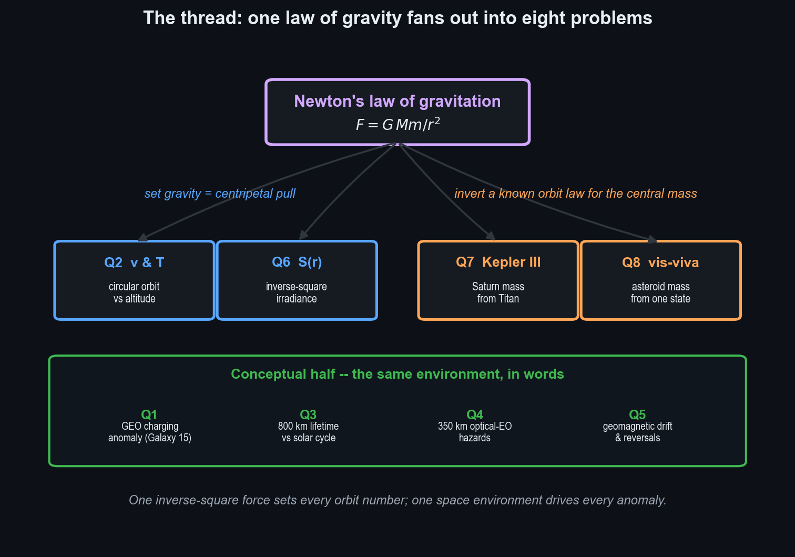
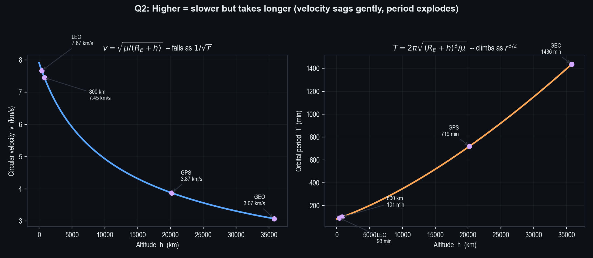
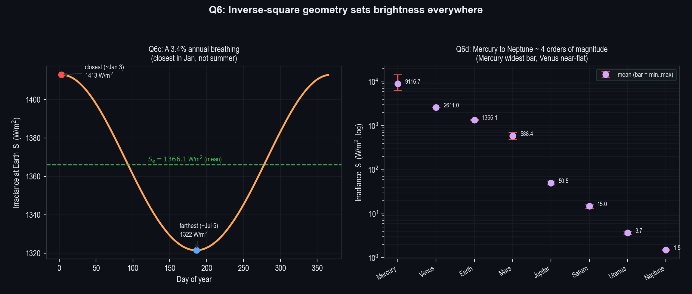
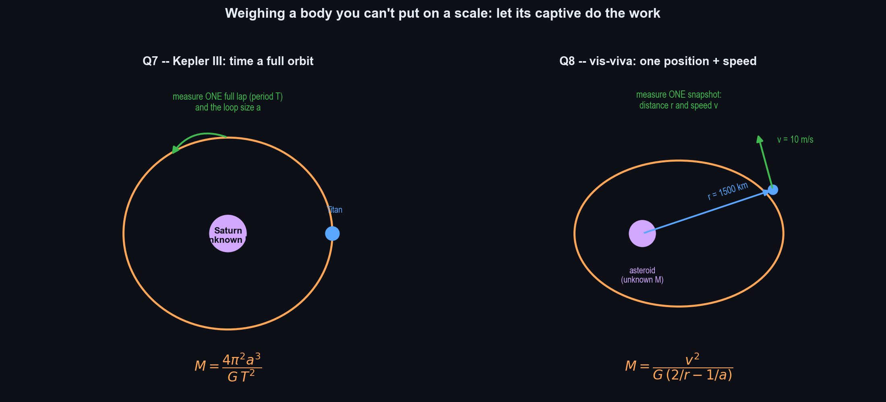

# SPCE 5065 HW #1 — Socratic Solution Walkthrough
## The Space Environment + Two-Body Orbital Mechanics and Solar Irradiance

---

## 30,000-Foot Overview

**The big question: how does the environment a spacecraft flies in — both the invisible particles around it and the invisible pull of gravity holding it up — decide whether the mission lives, dies, or gives back the right number?**

This assignment has two halves that look unrelated but aren't. One half is about the *stuff* in space — charged gas, oxygen atoms, radiation, a wandering magnetic field — and what it does to hardware. The other half is about *gravity* — the single inverse-square force that sets how fast things orbit, how bright the Sun is from anywhere, and how heavy a faraway body is. Eight problems, one through-line.

**Problem 1** asks for a real spacecraft that got hurt by the environment. The pick is Galaxy 15, a TV-relay satellite that turned into a runaway "zombiesat" after a static-electricity zap fried its ability to listen to the ground. **Problem 3** asks whether the moment in the Sun's 11-year activity cycle you launch into changes how long an 800 km satellite survives — and the answer hinges on the fact that 800 km orbits last *centuries*, so the launch timing washes out. **Problem 4** takes a camera-carrying satellite down to 350 km and walks through every single way the environment can ruin it down there, from air drag to oxygen erosion to a camera-fogging haze. **Problem 5** is about Earth's magnetic field — why it drifts, how we know it has flipped north-and-south many times, and the honest non-answer to "when's the next flip."

The other four are arithmetic, all powered by Newton's law of gravity. **Problem 2** derives how fast you have to go and how long a lap takes at any altitude, then graphs both. **Problem 6** uses the fact that light thins out with distance to compute how bright the Sun is across a year and across the whole solar system. **Problem 7** weighs Saturn just by watching its moon Titan circle it, and **Problem 8** weighs an asteroid from a single snapshot of a probe's distance and speed.

**The thread.** Every number in the quantitative half comes from one idea: gravity pulls with a force that drops off as one-over-distance-squared. Set that pull equal to what's needed to hold a circle and you get orbit speed and period (Q2). Apply the same one-over-distance-squared shape to *light* instead of force and you get solar brightness (Q6). Run the orbit law backward — measure the motion, solve for the mass doing the pulling — and you can weigh planets and asteroids you'll never touch (Q7, Q8). The conceptual half (Q1, Q3, Q4, Q5) is the flip side: the same regimes where those orbits live (LEO, GEO, the magnetic field around them) are *hostile*, and a spacecraft engineer has to respect both the math that keeps a satellite up and the environment that's constantly trying to take it down. The professor wants the student to leave with one orbital toolkit and one environmental checklist, and to know which problem calls for which.

---

## Problem 1 — Spacecraft Anomaly Due to the Space Environment

**Problem Statement:** Find an example of a spacecraft anomaly caused by the space environment. Describe what happened and what improvements were made to prevent a recurrence.

**The punchline first:** Galaxy 15, a geostationary TV-relay satellite, stopped accepting ground commands in April 2010 after a static-discharge event tied to space weather latched up its command receiver — but its transmitter stayed on, so it drifted down the GEO belt as a live "zombiesat" for eight months. The fix was an automatic self-reset watchdog and a hardened command path, plus the standard charging-mitigation playbook.

**Why this is the textbook case.** Galaxy 15 is a clean example because the cause is *pure environment* and the fix is *concrete* — exactly what the question asks for. It sits squarely in the Lesson 1 spacecraft-charging material, and it illustrates the lecture's headline statistic that roughly a quarter of all on-orbit anomalies trace back to the space environment [1].

**What happened, mechanism-first.** A satellite in geostationary orbit (GEO, ~35,786 km up) sits in a bath of energetic electrons — kilovolt-and-up particles from the outer radiation belt and plasma sheet, which get *worse* during disturbed space weather. Different surfaces on the vehicle charge to different voltages (this is *differential charging*). When the voltage gradient between two surfaces exceeds the breakdown threshold, you get an arc — an electrostatic discharge (ESD) — that dumps a burst of electrical noise into nearby electronics. The leading Intelsat/Orbital finding (never proven conclusively) is that one such ESD around an active-space-weather period latched Galaxy 15's baseband command unit into a state where it ignored the ground entirely [2], [3]. The transmitter, however, kept amplifying and re-radiating anything it received — so the satellite couldn't be told to stop and wouldn't go quiet.

**Why it mattered.** With station-keeping dead, the satellite drifted eastward along the GEO arc toward neighbors like AMC-11, threatening to step on their C-band uplinks as the longitudes aligned. Recovery came in December 2010 only by luck of physics: the battery eventually browned out, the bus underwent a full power-on reset, and Intelsat re-established contact and reloaded the software [2].

**The fixes (what the question really wants).**
- **Autonomous reset / watchdog timer** — Orbital Sciences pushed a flight-software and procedural change across the STAR-2 fleet so a vehicle that loses ground contact for a set interval *resets itself* instead of sitting latched and powered. This directly kills the failure mode that stretched a momentary glitch into an eight-month saga [2], [3].
- **Hardened command path** — better filtering and reset logic on the command-receiver chain that got stuck.
- **The general charging playbook** [1] — conductive surface coatings and grounding straps so the whole structure bleeds to one common potential (no differentials to arc across), biasing high-voltage buses below the arc threshold (the ISS runs its arrays at 120 V partly for this), and space-weather-aware operations during disturbed periods.

> **Key takeaway from Problem 1:** GEO is a charging-hostile regime because surfaces immersed in energetic electrons charge to different potentials and eventually arc; Galaxy 15 shows how a single ESD can latch a command unit, and how the durable fix is an autonomous reset plus structure-wide grounding so differentials never build.

> **Feynman test (in plain English):** A spacecraft floating in thin charged gas builds up static like a sock dragged across carpet, and when it finally sparks it can zap its own brain into ignoring every command from the ground.

---

## Problem 2 — Circular-Orbit Velocity and Period vs. Altitude

**Problem Statement:** Newton's law of gravitation is $F = G\,\dfrac{M_E m_s}{(R_E+h)^2}$.
- **(a)** Write the centripetal acceleration in terms of orbital velocity, $R_E$, and $h$.
- **(b)** Derive orbital velocity as a function of altitude and $\mu$.
- **(c)** Graph velocity vs. altitude.
- **(d)** Derive the period as a function of altitude and $\mu$.
- **(e)** Graph period vs. altitude.

**The punchline first:** Setting gravity equal to the centripetal requirement gives $v=\sqrt{\mu/(R_E+h)}$ and $T=2\pi\sqrt{(R_E+h)^3/\mu}$. Velocity sags gently as $1/\sqrt{r}$; period climbs steeply as $r^{3/2}$. Higher orbits are *slower* but take *much longer*.

| Part | Answer | Section |
|---|---|---|
| (a) Centripetal acceleration | $a_c = v^2/(R_E+h)$ | §2.1 |
| (b) Orbital velocity | $v=\sqrt{\mu/(R_E+h)}$ | §2.2 |
| (c) Velocity graph | Fig. (left panel) — falls as $1/\sqrt{r}$ | §2.3 |
| (d) Orbital period | $T=2\pi\sqrt{(R_E+h)^3/\mu}$ | §2.4 |
| (e) Period graph | Fig. (right panel) — climbs as $r^{3/2}$ | §2.3 |

Throughout, let $r = R_E + h$ be the orbital radius, with $R_E = 6378$ km and $\mu = GM_E = 398{,}600.5\ \text{km}^3/\text{s}^2$.

---

### 2.1 (a) The centripetal requirement

**Before reading on, try this:** Write down the acceleration of any object moving in a circle of radius $r$ at constant speed $v$. You don't need gravity yet — this is pure kinematics.

**The punchline:** $a_c = v^2/(R_E+h)$.

**Derivation and Explanation.** Anything moving in a circle of radius $r$ at constant speed $v$ is continuously accelerating *toward the center*, even though its speed never changes — because its *direction* keeps changing. The magnitude of that center-pointing (centripetal) acceleration is the standard kinematic result $a_c = v^2/r$. Substituting $r = R_E + h$:

$$\boxed{a_c = \frac{v^2}{R_E + h}}$$

This is a *requirement*, not a force. It says nothing about gravity — it just states how much inward acceleration a circular path demands. Gravity's job, in the next part, is to *supply* exactly this much.

**Common Pitfall:** Treating $a_c$ as if it were already a gravitational quantity. It isn't — it's a geometric demand that any central force must meet to bend a straight-line path into a circle.

**Reflection:** Separating "what the circle demands" from "what gravity provides" is the whole trick; equating the two is the entire derivation.

---

### 2.2 (b) Orbital velocity from Newton's second law

**Before reading on, try this:** Set the gravitational force $G M_E m_s/(R_E+h)^2$ equal to $m_s a_c$ using the $a_c$ from §2.1, then solve for $v$. Watch what happens to $m_s$.

**The punchline:** $v = \sqrt{\mu/(R_E+h)}$ — independent of the satellite's mass.

**Derivation and Explanation.** Newton's second law for the orbiting mass $m_s$ says the net inward force equals mass times the inward acceleration. The only inward force is gravity, and the required acceleration is $a_c$ from §2.1:

$$G\frac{M_E m_s}{(R_E+h)^2} = m_s\,a_c = m_s\frac{v^2}{R_E+h}$$

The satellite mass $m_s$ appears on both sides and cancels — a satisfying result, because how fast you must go to stay in orbit cannot depend on how heavy your satellite is (a bowling ball and a marble at the same altitude orbit at the same speed). One factor of $(R_E+h)$ also cancels between the two sides:

$$\frac{G M_E}{R_E+h} = v^2$$

Now fold the product $GM_E$ into the single given constant $\mu = 398{,}600.5\ \text{km}^3/\text{s}^2$ (the "gravitational parameter" — easier and more precise to measure as a lump than $G$ and $M_E$ separately) and take the positive root:

$$\boxed{v = \sqrt{\dfrac{\mu}{R_E + h}}}$$

**Sanity check at the surface** ($h=0$): $v = \sqrt{398{,}600.5/6378} = 7.906\ \text{km/s}$. That is the famous ~7.9 km/s "first cosmic velocity" quoted for low orbit — so the formula reproduces a number we already trust.

**Common Pitfall:** Forgetting that one power of $r$ cancels and writing $v = \sqrt{\mu/(R_E+h)^2} = \sqrt{\mu}/(R_E+h)$. That has the wrong altitude dependence and wrong units.

**Reflection:** The mass cancellation is the deep content — orbital speed is a property of the *gravity field at that radius*, not of the thing being held.

---

### 2.3 (c, e) Sweeping both closed forms over altitude

**Before reading on, try this:** Predict the *shapes*. As $h$ grows, does $v$ fall fast or slow? Does $T$ rise fast or slow? (Hint: $v\propto r^{-1/2}$, $T\propto r^{+3/2}$.)

**The punchline:** Velocity is a slow, monotonic $1/\sqrt{r}$ decline; period is a steep $r^{3/2}$ climb. They are plotted side by side below.

**Derivation and Explanation.** Both graphs are just the two boxed closed forms evaluated across $h \in [0, 36{,}000]$ km. Reading specific values off the script:

**Table 1:** Velocity and period at reference altitudes.

| Altitude $h$ (km) | Regime | $v$ (km/s) | $T$ (min) |
|---:|:---|---:|---:|
| 0 | Earth surface | 7.9055 | 84.49 |
| 400 | LEO (≈ISS) | 7.6686 | 92.56 |
| 800 | Q3 orbit | 7.4519 | 100.87 |
| 20,200 | MEO / GPS | 3.8740 | 718.0 |
| 35,786 | GEO | 3.0747 | 1436.06 |

Notice the asymmetry: going from the surface out to GEO, velocity only falls by a factor of ~2.6 (7.9 → 3.1 km/s), but period balloons by a factor of ~17 (84 min → 24 h). That is the visual signature of the $-1/2$ versus $+3/2$ exponents.

**Common Pitfall:** Plotting period in seconds and getting a curve that looks flat near the surface — convert to minutes (or hours) so the LEO-to-GEO growth is legible.

**Reflection:** The same radius increase that barely slows the satellite enormously lengthens its lap, because circumference grows linearly with $r$ *and* the satellite is moving slower.

---

### 2.4 (d) Orbital period from the circumference

**Before reading on, try this:** A satellite at constant speed $v$ traverses a circle of circumference $2\pi r$. Write the time for one lap, then substitute $v$ from §2.2.

**The punchline:** $T = 2\pi\sqrt{(R_E+h)^3/\mu}$ — Kepler's third law for a circle.

**Derivation and Explanation.** Period is distance-over-speed for one full lap. The distance is the circumference $2\pi(R_E+h)$ and the speed is the constant $v$:

$$T = \frac{2\pi (R_E+h)}{v}$$

Substitute $v = \sqrt{\mu/(R_E+h)}$ from §2.2. Dividing by a square root is multiplying by its reciprocal:

$$T = \frac{2\pi (R_E+h)}{\sqrt{\mu/(R_E+h)}} = 2\pi (R_E+h)\cdot\frac{(R_E+h)^{1/2}}{\mu^{1/2}}$$

Combine the powers of $(R_E+h)$: $(R_E+h)^1 \cdot (R_E+h)^{1/2} = (R_E+h)^{3/2}$, which under a root is $\sqrt{(R_E+h)^3}$:

$$\boxed{T = 2\pi\sqrt{\dfrac{(R_E+h)^3}{\mu}}}$$

This is exactly Kepler's third law ($T^2 \propto r^3$) for the special case of a circular orbit.

**Verification:** At GEO altitude (35,786 km) this returns 86,164 s, which matches one *sidereal* day to within 0.001%. That is the cheap check that catches a missing factor or a unit slip — if a "geostationary" altitude didn't come back as a sidereal day, the formula would be wrong.

**Common Pitfall:** Using the solar day (86,400 s) as the target instead of the sidereal day (86,164 s). Geostationary means matching Earth's rotation *relative to the stars*, which is the shorter sidereal day.

**Reflection:** Kepler's third law isn't an extra postulate here — it drops straight out of "circumference divided by orbital speed," which is itself just Newton's gravity in disguise.

> **Results for Problem 2**
> - **(a)** $a_c = v^2/(R_E+h)$
> - **(b)** $v = \sqrt{\mu/(R_E+h)}$ — e.g. 7.45 km/s at 800 km
> - **(c)** Velocity falls monotonically as $1/\sqrt{r}$ (Fig., left panel)
> - **(d)** $T = 2\pi\sqrt{(R_E+h)^3/\mu}$ — e.g. 100.87 min at 800 km, 1436 min at GEO
> - **(e)** Period climbs steeply as $r^{3/2}$ (Fig., right panel)

> **Key takeaway from Problem 2:** Equating gravity to the centripetal requirement gives the two master formulas for circular orbits; the satellite mass always cancels, velocity scales as $r^{-1/2}$, and period as $r^{3/2}$, with the GEO-equals-one-sidereal-day check as the built-in error catcher.

> **Feynman test (in plain English):** The higher you orbit, the weaker gravity's grip, so you need less speed to keep from falling in — but the loop you're running is so much bigger that each lap still takes far longer.

---

## Problem 3 — 800 km Lifetime vs. Solar-Cycle Phase at Launch

**Problem Statement:** For a satellite launched to 800 km altitude, is there any significant difference in lifetime depending on the phase of the solar cycle at launch? Explain.

**The punchline first:** No — not in *total* lifetime, and the reason is a timescale mismatch. An 800 km orbit lasts on the order of centuries, which swamps the Sun's 11-year cycle, so whatever phase you launch into gets averaged out over the ~18 cycles the satellite lives through.

**The physics that *does* matter.** Decay at 800 km is driven by neutral atmospheric drag, and drag scales with local air density, which is brutally sensitive to solar activity [1]. When the Sun is active (high EUV output), it heats the upper atmosphere, the gas expands, and the density at any fixed altitude rises — the atmosphere literally puffs out past you. Up at 800 km that density can swing by one to two orders of magnitude between solar minimum and maximum [4], [5]. So *instantaneous* drag absolutely cares where we are in the cycle.

**Why launch phase still washes out.** The lifetime of an 800 km orbit is ~centuries — which is exactly why 800 km is a debris-congested "don't park here" altitude; decades-old hardware is still up there. The 11-year cycle is tiny next to that. A satellite living ~200 years rides through ~18 full cycles regardless of when it launches, so it sees essentially the same *time-averaged* density either way. Launching at solar max versus solar min just shifts which cycle you start on; it doesn't move the long-run average that sets total decay. The starting phase gets integrated away.

**The contrast that proves the point.** Ask the same question at 350 km (Problem 4's orbit) and the answer flips to "yes, hugely." There the natural lifetime is months to a few years — *comparable to or shorter than* one solar cycle — so launch phase is most of the story. **The rule of thumb: launch phase matters when orbital lifetime is on the order of a solar cycle or less.** At 800 km it isn't, so it doesn't. (SpaceX's 2022 loss of ~40 Starlinks to a minor storm is the low-altitude version — that only bites because they deploy around 200–300 km where lifetime is days [1].)

**The caveat worth stating.** "Total lifetime" is one thing; *operations and short-term decay prediction* are another. Launch into solar max and the first few years of drag, station-keeping fuel burn, and conjunction picture all look different than a solar-min launch — so for planning the first cycle the phase isn't irrelevant, it just doesn't move the centuries-long endgame.

> **Key takeaway from Problem 3:** Launch-phase sensitivity is governed by the ratio of orbital lifetime to the solar cycle; at 800 km that ratio is huge (centuries vs. 11 years), so the phase averages out of the total lifetime even though instantaneous drag swings wildly with solar activity.

> **Feynman test (in plain English):** If something will hang around for centuries, it doesn't matter what the weather was the week it arrived — it lives through every kind of weather many times and only the long-run average matters.

---

## Problem 4 — Space-Environment Hazards for a 350 km Optical EO Spacecraft

**Problem Statement:** An Earth-observation spacecraft with an optical payload is in a 350 km circular orbit. What major problems might operators expect from the space environment in this regime, and what mitigates them? Cover *all* effects from Lesson 1, not just textbook Chapter 1.

**The punchline first:** At 350 km you're deep in LEO and you "get all of it" — but the operationally dominant threats are atmospheric drag (sets fuel and lifetime), the South Atlantic Anomaly (sets data quality and upset rate), and the optics-killers (atomic oxygen, contamination, UV, thermal cycling) that gang up specifically on a camera mission.

The question says cover *everything* from the lesson, so the walkthrough marches through each environment, notes what it does to an *optical* bird, and gives the mitigation.

**Neutral environment (the dominant pair down here):**
- **Atmospheric drag** — 350 km is firmly in the "drag is a major effect" band (below ~1000 km) and at its low end. Drag $\propto \rho v^2$ with $v\approx 7.7$ km/s, so the orbit decays over months-to-low-years without help. *Mitigation:* onboard propulsion / reboost, a low-frontal-area attitude, drag-margin fuel. This is the single biggest operational cost here.
- **Atomic oxygen (AO)** — per the assigned reading, *the* most significant material-degradation agent at this altitude [6]. Ram-facing surfaces get hit by ~5 eV atomic oxygen that chemically erodes polymers (Kapton, Teflon), oxidizes silver, and eats organic coatings; AO flux itself swings ~an order of magnitude over the solar cycle [6]. *Mitigation:* AO-resistant coatings (SiOₓ overcoats), no bare silver/Kapton on ram faces, erosion margin.
- **Sputtering** — mechanical erosion from neutral/ion impacts, same ram-face problem and coating fix [1].

**Plasma / charged-particle environment:**
- **Spacecraft charging and ESD** — the ambient LEO plasma charges surfaces; differentials can arc and inject EMI, especially crossing the auroral zones [1]. Less vicious than GEO (Problem 1) but real. *Mitigation:* conductive coatings, solid grounding, bias high-voltage buses below the arc threshold.
- **Radiation — TID and single-event effects** — galactic cosmic rays, solar protons, and trapped particles deliver total ionizing dose (slow embrittlement) and single-event upsets/latch-ups (a particle flips a bit or latches a device) [1]. At 350 km Earth's field shields most of this *except* —
- **The South Atlantic Anomaly (SAA)** — the one region where the field is weak enough that the inner radiation belt dips to LEO; it dominates the radiation-anomaly budget for a low EO satellite [1]. Each SAA pass sprays the detector with upsets and the imager picks up transient hits/streaks. *Mitigation:* rad-tolerant parts, error-correcting memory, redundancy, and *operationally* flagging or power-cycling sensitive electronics over the SAA and discarding corrupted frames.
- **Van Allen belts** — mostly above 350 km, so you're under them except for the SAA intrusion; noted for completeness [1].

**Solar activity / space weather:**
- Flares (X-rays, ~8 min to Earth) and CMEs (~1–3 days) spike thermospheric density → **drag surges** that move the orbit and burn fuel, and disturb HF/GPS [1]. *Mitigation:* NOAA monitoring, hold maneuvers during storms, carry drag margin.

**Micrometeoroids & orbital debris (MMOD):**
- High flux in LEO; a paint chip once cracked a Shuttle window [1]. The saving grace at 350 km: drag self-cleans this band fast, so debris doesn't accumulate the way it does at 800 km. *Mitigation:* conjunction screening + avoidance for tracked objects, Whipple shielding for the small stuff.

**Vacuum, UV, contamination, thermal (the optical-payload killers):**
- **Vacuum / outgassing / molecular contamination** — volatiles boil off materials and redeposit on the coldest line-of-sight surfaces, which for an imager means *the optics and focal plane* [1], [6]. A hazed lens raises stray light and kills contrast — straight at the mission's heart. *Mitigation:* thermal-vacuum bakeout, low-outgassing materials (ASTM E595), vent-path design, keeping optics warmer than surroundings.
- **Solar UV degradation** — UV darkens and embrittles polymers, cover glass, and optical surfaces [1], [6]. *Mitigation:* UV-stable materials, throughput margin.
- **Thermal cycling** — ~16 orbits/day means ~16 hot/cold cycles/day across the terminator [1], [6]. CTE mismatches crack coatings and, worse for imaging, *flex optical mounts and shift focus*. *Mitigation:* athermal mount design, active/passive thermal control.
- **Cold welding** — bare metal contacts can seize mechanisms (gimbals, deployables) in vacuum [1]. *Mitigation:* proper lubricants/coatings on moving parts.

**Net for the operator:** drag sets the fuel budget and lifetime, the SAA sets the data-quality budget, and AO + contamination + UV + thermal cycling gang up on the optics — which for an optical mission is the part you most have to defend.

> **Key takeaway from Problem 4:** A 350 km optical EO satellite faces the full LEO menu, but the design drivers separate cleanly — drag governs propulsion and lifetime, the SAA governs radiation upsets and data quality, and the atomic-oxygen/contamination/UV/thermal cluster specifically attacks the optics, which is the mission-critical surface.

> **Feynman test (in plain English):** Flying a telescope this low is like driving with the top down through a sandstorm — the thin air drags you down, stray oxygen sandblasts your paint, and grit keeps fogging the camera lens.

---

## Problem 5 — Earth's Magnetic Field: Drift, Reversals, and the Next One

**Problem Statement:** Why does Earth's magnetic field drift? How do we know it reverses periodically? When is the next reversal predicted?

**The punchline first:** It drifts because the molten-iron dynamo generating it is itself churning (secular variation); we know it reverses because cooling rock freezes in the field direction and the seafloor lays down symmetric magnetic stripes; and nobody can date the next flip — the field is weakening but a reversal is not imminent.

**Why it drifts.** The field is made by the **geodynamo** — convecting, electrically conducting liquid iron in the outer core [1]. Three ingredients drive it in a self-reinforcing loop: the kinetic energy of the convecting fluid (powered by core cooling, organized by Earth's rotation via the Coriolis effect), the electric currents that motion produces, and the magnetic field those currents sustain. Because the fluid flow is turbulent and constantly reorganizing, the field is never static — it changes year to year, a slow drift called **secular variation**. Concretely [1]: the field is roughly a dipole but its axis is tilted off the spin axis and the poles wander *independently*; the north magnetic pole has been racing toward Siberia fast enough that navigation models need regular updates; field strength runs ~30 µT at the equator to ~60 µT at the poles.

**How we know it reverses.** We read it out of **rocks (paleomagnetism)**. When igneous rock cools through the Curie temperature, magnetic minerals lock in the ambient field direction like a frozen compass. The cleanest evidence is the **seafloor-spreading stripe record** (Vine–Matthews–Morley): at mid-ocean ridges new crust forms continuously and freezes in the field as it cools, laying down a tape recording of normal/reversed polarity in **symmetric stripes mirrored on both sides of the ridge** [7]. Matching barcodes on either side of a spreading center are nearly impossible to explain *except* by a field that periodically reverses while the seafloor pulls apart. The lecture numbers [1]: **171 reversals in the last 71 million years** (~one per ~415,000 years on average), but wildly irregular (gaps from ~100,000 years to ~50 million years), with the **last full reversal ~780,000 years ago**.

**When's the next one.** Honestly — **no date can be given, and despite the weakening field a reversal is not imminent** [7], [8]. The "we're overdue" line from the 415 kyr average is misleading because the intervals are so irregular the average is nearly meaningless. The field *is* losing strength (~5–10% per century) and the SAA is growing, which is why the question gets raised — but the present field is still strong relative to its long-term range, and a full reversal plays out over ~1,000–10,000 years once it begins [8]. Consensus: no reversal for several centuries at least. **Keep one thing straight:** this is *Earth's* field, reversing on hundred-thousand-year scales; the *Sun* flips polarity every ~11 years [1] — a totally separate clock, don't conflate them.

> **Key takeaway from Problem 5:** Drift is the surface readout of a churning liquid-iron dynamo (secular variation); reversals are established from frozen-in rock magnetism and symmetric seafloor stripes; and because reversal intervals are wildly irregular, the weakening field today does *not* license a prediction of an imminent flip.

> **Feynman test (in plain English):** The compass moves because the molten metal making Earth's magnetism is itself sloshing around, and we know it has flipped before because cooling rock freezes in whichever way the needle pointed, leaving a striped record on the seafloor.

---

## Problem 6 — Solar Irradiance vs. Distance, Day-of-Year, and by Planet

**Problem Statement:** The solar constant at distance $r$ is $S(r) = S_e\,(\text{au}/r)^2$, with $S_e = 1366.1\ \text{W/m}^2$ at 1 AU.
- **(a)** Express $S$ as a function of orbit eccentricity.
- **(b)** Find Earth's maximum and minimum solar constant.
- **(c)** Graph irradiance at Earth vs. day of year.
- **(d)** Compute and plot mean, max, and min irradiance for every planet on a log y-axis.

**The punchline first:** It's all inverse-square geometry. Eccentricity sets how much the brightness "breathes" over an orbit; Earth swings ±3.4% (1412.9 down to 1321.6 W/m²); and across the planets brightness spans nearly four orders of magnitude, so the planetary plot needs a log axis.

| Part | Answer | Section |
|---|---|---|
| (a) $S$ vs. eccentricity | $S(\nu)=\dfrac{S_e}{a^2}\left(\dfrac{1+e\cos\nu}{1-e^2}\right)^2$ | §6.1 |
| (b) Earth max / min | 1412.9 / 1321.6 W/m² | §6.2 |
| (c) Irradiance vs. day | smooth annual cycle, Jan peak (Fig., left) | §6.3 |
| (d) Per-planet mean/max/min | see Table 2 / Fig. (right) | §6.4 |

---

### 6.1 (a) Solar constant as a function of eccentricity

**Before reading on, try this:** Start from the orbit (conic) equation $r = \dfrac{a(1-e^2)}{1+e\cos\nu}$ and substitute it into $S(r)=S_e(1\,\text{AU}/r)^2$, keeping $a$ in AU. Solve for $S$ in terms of $e$, $\nu$, and $a$.

**The punchline:** $S(\nu)=\dfrac{S_e}{a^2}\left(\dfrac{1+e\cos\nu}{1-e^2}\right)^2$, with extremes $S_{\max}=\dfrac{S_e}{(1-e)^2}$ (closest) and $S_{\min}=\dfrac{S_e}{(1+e)^2}$ (farthest) at $a=1$.

**Derivation and Explanation.** The heliocentric distance of a body on an elliptical orbit depends on where it is in that orbit. That position is the *true anomaly* $\nu$ — the angle, measured at the Sun, from the closest point to the body's current location. The orbit equation gives distance from true anomaly, semi-major axis $a$ (the orbit's "average radius," here in AU), and eccentricity $e$ (how squashed the ellipse is, $0$ = circle):

$$r = \frac{a(1-e^2)}{1 + e\cos\nu}$$

Drop this into the inverse-square law $S(r)=S_e(1\,\text{AU}/r)^2$. Because $1/r$ appears squared, the whole fraction gets squared and flips:

$$S(\nu) = S_e\left(\frac{1+e\cos\nu}{a(1-e^2)}\right)^2 = \boxed{\frac{S_e}{a^2}\left(\frac{1 + e\cos\nu}{1 - e^2}\right)^2}$$

For a body with $a=1$ AU (Earth), the $a^2$ drops out. The extremes come from the cosine: brightness peaks when $\cos\nu = +1$ (closest approach, $r=a(1-e)$) and bottoms when $\cos\nu = -1$ (farthest, $r=a(1+e)$). Plugging those in and simplifying $(1-e^2)=(1-e)(1+e)$:

$$\boxed{S_{\max} = \frac{S_e}{(1-e)^2}\ \text{(closest)},\qquad S_{\min} = \frac{S_e}{(1+e)^2}\ \text{(farthest)}}$$

So eccentricity alone governs how much the irradiance breathes over an orbit: a circle ($e=0$) gives a flat $S_e$, and the spread grows with $e$.

**Common Pitfall:** Flipping the sign — thinking closest approach gives the *minimum* brightness. Closest = smallest $r$ = brightest. The factor $(1-e)$ in the denominator is *smaller* than 1, making $S_{\max}$ *larger* than $S_e$.

**Reflection:** The entire seasonal-irradiance story collapses to one number, $e$; everything else is geometry.

---

### 6.2 (b) Earth's maximum and minimum

**Before reading on, try this:** With Earth's $e = 0.0167$, compute $S_{\max}=S_e/(1-e)^2$ and $S_{\min}=S_e/(1+e)^2$.

**The punchline:** $S_{\max}=1412.9\ \text{W/m}^2$, $S_{\min}=1321.6\ \text{W/m}^2$ — about ±3.4% around the mean.

**Derivation and Explanation.** Plug Earth's eccentricity straight into the boxed extremes from §6.1:

$$S_{\max} = \frac{1366.1}{(1-0.0167)^2} = \frac{1366.1}{0.96690} = \boxed{1412.9\ \text{W/m}^2}$$
$$S_{\min} = \frac{1366.1}{(1+0.0167)^2} = \frac{1366.1}{1.03368} = \boxed{1321.6\ \text{W/m}^2}$$

These line up with the accepted ~1413 / ~1322 W/m² values — the check that the sign convention (closest = brighter) didn't get flipped. Note the counterintuitive payoff: Earth is **closest to the Sun in early January**, northern-hemisphere winter. Seasons are caused by axial tilt, not by distance.

**Common Pitfall:** Attributing seasons to the distance swing. The ±3.4% irradiance change is real but small and is *out of phase* with northern seasons; axial tilt dominates.

**Reflection:** A 3.4% global swing is the kind of forcing climate models must include but that is far too small to make winter — geometry humbles intuition here.

---

### 6.3 (c) Irradiance vs. day of year

**Before reading on, try this:** To get $S$ versus calendar day you need $r$ versus day. Sketch the chain: day → mean angle around the orbit → actual angle → distance → brightness. Which step needs Kepler's equation?

**The punchline:** A smooth annual cycle peaking at 1412.9 W/m² in early January and bottoming at 1321.6 W/m² in early July.

**Derivation and Explanation.** Earth doesn't sweep its orbit at a constant *angular* rate (it moves faster when closer), so you can't just map day → angle linearly. The standard chain:
1. Convert day-of-year to **mean anomaly** $M$ — a fictitious uniformly-increasing angle, zero at closest approach (~Jan 3): $M = 2\pi(\text{doy}-3)/365.25$.
2. Solve **Kepler's equation** $M = E - e\sin E$ for the **eccentric anomaly** $E$. This is transcendental (no closed form), so it's solved numerically by Newton-Raphson iteration — start with $E=M$ and refine $E \leftarrow E - (E - e\sin E - M)/(1 - e\cos E)$ a few times until it converges.
3. Get distance from $r = a(1 - e\cos E)$ with $a = 1$ AU.
4. Feed $r$ into the inverse-square law $S = S_e/r^2$.

The result is **Figure (left panel)**: the annual brightness curve, max in January, min in July.

**Common Pitfall:** Assuming constant angular speed (i.e., $r$ varying as a plain cosine of day). That misplaces the peak and distorts the curve because it ignores that Earth lingers longer at the far end of its orbit.

**Reflection:** Kepler's equation is the bridge between "clock time" and "position on the orbit" — the one nonlinear step that makes day-of-year math honest.

---

### 6.4 (d) Every planet on a log axis

**Before reading on, try this:** For each planet, mean $= S_e/a^2$, max $= S_e/[a(1-e)]^2$, min $= S_e/[a(1+e)]^2$. Predict which planet has the *widest* max-to-min spread before computing. (Hint: largest $e$.)

**The punchline:** Brightness runs from ~9117 W/m² at Mercury to ~1.5 W/m² at Neptune — four orders of magnitude — so a log y-axis is mandatory. Mercury has the widest spread (most eccentric), Venus the narrowest (nearly circular).

**Derivation and Explanation.** Apply the §6.1 formulas per planet using each one's $a$ and $e$:

**Table 2:** Solar irradiance by planet (W/m²).

| Planet | $a$ (AU) | $e$ | $S_{\text{mean}}$ | $S_{\max}$ (closest) | $S_{\min}$ (farthest) |
|:---|---:|---:|---:|---:|---:|
| Mercury | 0.387 | 0.2056 | 9116.7 | 14447.4 | 6272.0 |
| Venus | 0.723 | 0.0068 | 2611.0 | 2646.7 | 2576.0 |
| Earth | 1.000 | 0.0167 | 1366.1 | 1412.9 | 1321.6 |
| Mars | 1.524 | 0.0934 | 588.4 | 715.9 | 492.2 |
| Jupiter | 5.203 | 0.0484 | 50.5 | 55.7 | 45.9 |
| Saturn | 9.537 | 0.0539 | 15.0 | 16.8 | 13.5 |
| Uranus | 19.189 | 0.0473 | 3.71 | 4.09 | 3.38 |
| Neptune | 30.070 | 0.0086 | 1.51 | 1.54 | 1.49 |

Two features jump out and both make sense: **Mercury has by far the widest spread** (huge error bar) because its $e=0.21$ is the most eccentric orbit in the set, and **Venus is nearly a flat point** because its orbit is almost perfectly circular. The Earth row (1366.1 / 1412.9 / 1321.6) reproduces part (b) exactly — same formula, same answer — confirming the per-planet machinery is wired right.

**Common Pitfall:** Plotting on a linear y-axis — Mercury's ~9000 W/m² compresses every outer planet to an indistinguishable sliver near zero. The log axis is what makes the figure readable.

**Reflection:** The dominant control is $a$ (the $1/a^2$ falloff sets the broad ladder); eccentricity only sets the height of each rung's error bar.

> **Results for Problem 6**
> - **(a)** $S(\nu) = \dfrac{S_e}{a^2}\left(\dfrac{1+e\cos\nu}{1-e^2}\right)^2$; extremes $S_e/(1\mp e)^2$
> - **(b)** Earth $S_{\max} = 1412.9\ \text{W/m}^2$, $S_{\min} = 1321.6\ \text{W/m}^2$ (±3.4%)
> - **(c)** Annual cycle, max early January, min early July (Fig., left panel)
> - **(d)** Mercury 9116.7 → Neptune 1.51 W/m² mean; widest spread at Mercury, log axis required (Table 2 / Fig., right panel)

> **Key takeaway from Problem 6:** Solar irradiance is pure inverse-square geometry — semi-major axis sets the overall brightness ladder via $1/a^2$, and eccentricity sets how far brightness swings between closest and farthest approach via $1/(1\mp e)^2$; the Earth values cross-check parts (b) and (d) against each other.

> **Feynman test (in plain English):** Light spreads out as it travels, so doubling your distance from a fire leaves you with a quarter of the warmth — that one rule sets how bright the Sun looks from any planet on any day.

---

## Problem 7 — Mass of Saturn from Titan's Orbit

**Problem Statement:** Titan has a period of 14.1 Earth days.
- **(a)** Determine Saturn's mass if Titan's semi-major axis is 1,110,781,765 m.
- **(b)** Find a published Saturn mass and compute the percent difference.
- **(c)** Explain the difference.

**The punchline first:** Kepler's third law inverted for the central mass gives $M_{\text{Saturn}}=5.462\times10^{26}$ kg, about 3.9% below the published $5.6834\times10^{26}$ kg — and the gap is the *rounded input data*, not a broken method.

| Part | Answer | Section |
|---|---|---|
| (a) Computed mass | $5.462\times10^{26}$ kg | §7.1 |
| (b) Percent difference | $-3.9\%$ vs. $5.6834\times10^{26}$ kg | §7.2 |
| (c) Why | rounded, non-self-consistent inputs (dominant) | §7.3 |

---

### 7.1 (a) Computed mass via Kepler III

**Before reading on, try this:** Kepler's third law for a small moon around a big planet is $T^2 = \dfrac{4\pi^2 a^3}{GM}$. Rearrange for $M$, convert $T = 14.1$ days to seconds, and plug in $a = 1.110781765\times10^9$ m and $G = 6.674\times10^{-11}$.

**The punchline:** $M_{\text{Saturn}} = 5.462\times10^{26}$ kg.

**Derivation and Explanation.** Kepler's third law relates a satellite's period and orbit size to the mass of the body it circles. Solving the standard form for the central mass:

$$T^2 = \frac{4\pi^2 a^3}{GM}\ \Longrightarrow\ M_{\text{Saturn}} = \frac{4\pi^2 a^3}{G\,T^2}$$

Convert the period to SI seconds first — every other quantity is in meters/kilograms/seconds, so the period must be too:

$$T = 14.1\ \text{days} \times 86{,}400\ \tfrac{\text{s}}{\text{day}} = 1{,}218{,}240\ \text{s}$$

Now substitute, with $a = 1.110782\times10^9$ m and $G = 6.674\times10^{-11}\ \text{N}\cdot\text{m}^2/\text{kg}^2$:

$$M_{\text{Saturn}} = \frac{4\pi^2 (1.110782\times10^9)^3}{(6.674\times10^{-11})(1.218240\times10^6)^2} = \boxed{5.462\times10^{26}\ \text{kg}}$$

**Common Pitfall:** Leaving the period in days. Because $T$ enters squared, a days-vs-seconds slip throws the mass off by a factor of $86{,}400^2 \approx 7.5$ billion — an instantly absurd result, which is its own check.

**Reflection:** All the moon's mass and orbit shape funnel into a single number for the unreachable planet — this is how every planetary mass in the textbooks was actually first pinned down.

---

### 7.2 (b) Percent difference vs. published

**Before reading on, try this:** With the NASA Saturn Fact Sheet value $M = 5.6834\times10^{26}$ kg, compute $\frac{\text{computed} - \text{published}}{\text{published}}\times100$.

**The punchline:** $-3.9\%$ — about 4% light.

**Derivation and Explanation.** Percent difference against the published reference [9]:

$$\text{\% diff} = \frac{5.462\times10^{26} - 5.6834\times10^{26}}{5.6834\times10^{26}}\times100 = \boxed{-3.9\%}$$

The negative sign says the computed mass is *below* the true value — a clue used in part (c).

**Common Pitfall:** Dividing by the computed value instead of the accepted reference. Percent *error/difference* is conventionally referenced to the known/published quantity.

**Reflection:** A signed (not absolute) percent difference carries diagnostic information — here the *minus* points straight at which input is off.

---

### 7.3 (c) Why the ~4% gap

**Before reading on, try this:** Kepler III is exact for an ideal two-body orbit, so the method isn't the problem. List candidate error sources and rank them: rounded/inconsistent inputs, neglecting Titan's mass, real perturbations, constant precision.

**The punchline:** The rounded, non-self-consistent input data dominates; the physics is fine.

**Derivation and Explanation.** Ranked by importance:
- **Rounded, non-self-consistent orbital parameters (dominant).** Titan's *real* period is ~15.95 days and its real semi-major axis ~1.222×10⁹ m; the problem's 14.1 days paired with 1.1108×10⁹ m don't form a clean two-body fit around the true Saturn mass. A pure two-body orbit at the *given* $a$ would have a ~13.8-day period, so the given 14.1 days is slightly *long* — and a longer period in $M \propto 1/T^2$ pulls the computed mass *down*, exactly the direction of the miss.
- **Neglecting Titan's mass (negligible).** Strictly $T^2 = \dfrac{4\pi^2 a^3}{G(M+m)}$. But Titan is only ~1/4250 of Saturn, a ~0.02% correction — not the culprit.
- **Real perturbations (small).** Saturn's oblateness ($J_2$), the Sun, and resonances with other moons all nudge the orbit off a clean ellipse, so one $(a,T)$ pair won't reproduce the mass to high precision.
- **Constant precision.** The digits in $G$, $a$, and $T$ cap how many figures are meaningful.

Bottom line: 4% off a one-line two-body calculation from rounded textbook numbers is about what you'd expect — the method is exact, the inputs are coarse.

**Common Pitfall:** Concluding Kepler III is "only approximate." It's exact for two bodies; the error lives entirely in the inputs and minor real-world perturbations.

**Reflection:** Knowing the sign of an error *and* its mechanism (long period → low mass) is the difference between hand-waving and diagnosis.

> **Results for Problem 7**
> - **(a)** $M_{\text{Saturn}} = 5.462\times10^{26}$ kg
> - **(b)** $-3.9\%$ vs. published $5.6834\times10^{26}$ kg
> - **(c)** Dominated by rounded, non-self-consistent inputs (given period slightly long → mass biased low); Titan's mass and perturbations are minor

> **Key takeaway from Problem 7:** Inverting Kepler's third law turns a moon's period and orbit size into the central planet's mass; the method is exact for two bodies, so a ~4% miss is diagnosed (via the minus sign and a consistency check on the period) as coming from rounded input data, not from the physics.

> **Feynman test (in plain English):** You can weigh a planet you'll never touch just by timing how long its moon takes to circle it — a heavier planet whips its moon around faster.

---

## Problem 8 — Mass of an Asteroid from One State

**Problem Statement:** A spacecraft is in an eccentric orbit about an asteroid with semi-major axis 1000 km. At a distance of 1500 km from the asteroid the velocity is 10 m/s. Determine the asteroid's mass.

**The punchline first:** The vis-viva equation ties speed, distance, and orbit size to the central body's gravitational parameter; solving it for $\mu$ and dividing by $G$ gives $M \approx 4.49\times10^{18}$ kg — a mid-size asteroid.

**Before reading on, try this:** Use $v^2 = \mu(2/r - 1/a)$ with $a = 1{,}000{,}000$ m, $r = 1{,}500{,}000$ m, $v = 10$ m/s. Solve for $\mu$, then get $M = \mu/G$.

**Derivation and Explanation.** The *vis-viva* equation is the energy bookkeeping of an orbit: it relates the speed $v$ at any distance $r$ to the orbit's semi-major axis $a$ and the central body's gravitational parameter $\mu$. Solving it for $\mu$:

$$v^2 = \mu\left(\frac{2}{r} - \frac{1}{a}\right)\ \Longrightarrow\ \mu = \frac{v^2}{\dfrac{2}{r} - \dfrac{1}{a}}$$

Work in SI (everything in meters and seconds). First the bracket — the geometry factor:

$$\frac{2}{r} - \frac{1}{a} = \frac{2}{1.5\times10^6} - \frac{1}{1.0\times10^6} = 1.3333\times10^{-6} - 1.0\times10^{-6} = 3.3333\times10^{-7}\ \text{m}^{-1}$$

Then $\mu$:

$$\mu = \frac{(10)^2}{3.3333\times10^{-7}} = \frac{100}{3.3333\times10^{-7}} = 3.000\times10^{8}\ \text{m}^3/\text{s}^2$$

Finally divide by $G$ to extract the mass:

$$M = \frac{\mu}{G} = \frac{3.000\times10^{8}}{6.674\times10^{-11}} = \boxed{4.49\times10^{18}\ \text{kg}}$$

**Sanity check.** That $\mu$ is ~9 orders of magnitude below Earth's — the right ballpark for a small body. Back out a size: at a typical rocky density ~2000 kg/m³ that mass is a sphere of radius ~80 km, i.e. a mid-size asteroid. Physically reasonable. The geometry is consistent too: $r = 1500$ km sits *outside* $a = 1000$ km, so the spacecraft is sampled beyond the orbit's mean radius on an eccentric orbit — fine, because vis-viva holds at *every* point on the ellipse, no matter where you take the snapshot.

**Common Pitfall:** Forgetting the unit step $M = \mu/G$ and reporting $\mu$ (in m³/s²) as if it were a mass. $\mu$ and $M$ differ by the factor $G$ and have completely different units.

**Reflection:** Where Q7 needed a *whole orbit* (the period), Q8 needs only a *single snapshot* of position and speed — vis-viva packs the entire orbit's energy into one instant.

> **Key takeaway from Problem 8:** Vis-viva lets a single position-and-velocity snapshot fix the central body's mass without ever measuring a period; solve for $\mu$ from the geometry factor $2/r - 1/a$, then divide by $G$ — and cross-check by backing out a plausible asteroid size.

> **Feynman test (in plain English):** One snapshot of how far away a probe is and how fast it's moving is enough to weigh the rock it's circling, because a heavier rock pulls harder and forces a faster swing at that distance.

---

## Summary

### Overall Strategy Recap

Every quantitative problem in this set is one inverse-square law worn four ways. Equate gravity to the centripetal requirement and the satellite mass cancels, leaving circular-orbit speed and period as clean functions of altitude (Q2). Swap the force for *light* and the same $1/r^2$ shape gives solar brightness across a year and across the solar system (Q6). Run an orbit law *backward* — feed in the observed motion, solve for the mass doing the pulling — and you weigh Saturn from its moon (Kepler III, Q7) and an asteroid from one snapshot (vis-viva, Q8). The conceptual problems are the same regimes seen from the hardware's point of view: GEO charging (Q1), the centuries-vs-cycle timescale argument for 800 km lifetime (Q3), the full LEO hazard menu for a 350 km camera (Q4), and the churning-dynamo story behind a drifting, occasionally reversing magnetic field (Q5). One orbital toolkit, one environmental checklist.

### Check Yourself

<strong>5 quick-fire retrieval questions (click to reveal answers)</strong>

1. **Why does the satellite mass cancel in the circular-orbit velocity derivation, and what does that tell you physically?**
   Gravity and the required centripetal force both scale with $m_s$, so it divides out — orbital speed depends only on the gravity field at that radius, not on what's being held.

2. **A "geostationary" altitude returns a period of 86,400 s in your code. Is that right?**
   No — geostationary matches the *sidereal* day (86,164 s), not the solar day (86,400 s). An 86,400 s answer signals a target/units slip.

3. **Earth is closest to the Sun in early January, yet the Northern Hemisphere is in winter. How is that consistent?**
   Seasons come from axial tilt, not distance. The distance-driven irradiance swing is only ±3.4% and is out of phase with northern seasons.

4. **Why does the phase of the solar cycle at launch barely affect an 800 km satellite's total lifetime but strongly affect a 350 km one?**
   Lifetime-to-cycle ratio. At 800 km lifetime is ~centuries (≫11 yr) so the phase averages out; at 350 km lifetime is months–years (≲ one cycle) so launch phase dominates.

5. **Q7 (Saturn) needs a full orbital period; Q8 (asteroid) needs only one position+velocity. Why the difference?**
   Kepler III is built from the period of a complete loop; vis-viva is an energy relation that holds at every instant, so a single snapshot of $r$ and $v$ suffices.

### Important Formulas

*Plain-English "Physics Pseudo-Code" reads each row aloud as a sentence. Inside math, units are written with `\text{}` and operators as `\cdot` / `\times` for KaTeX safety.*

---

**Cluster 1 — Circular orbits (Q2).**
*Set gravity equal to the centripetal requirement; the satellite mass falls out.*

| # | Formula | Physics Pseudo-Code | Description |
|---|---|---|---|
| 1 | $a_c = \dfrac{v^2}{R_E+h}$ | Centripetal acceleration equals speed squared divided by orbital radius | Inward acceleration a circular path demands |
| 2 | $v = \sqrt{\dfrac{\mu}{R_E+h}}$ | Circular orbital speed equals the square root of the gravitational parameter divided by orbital radius | Speed to maintain a circular orbit at altitude $h$ |
| 3 | $T = 2\pi\sqrt{\dfrac{(R_E+h)^3}{\mu}}$ | Orbital period equals two pi times the square root of orbital radius cubed divided by the gravitational parameter | Time for one circular lap (Kepler III, circular case) |

*Key insight: velocity falls as radius to the minus one-half, period rises as radius to the three-halves — higher orbits are slower yet take longer.*

---

**Cluster 2 — Solar irradiance geometry (Q6).**
*One inverse-square law for light; semi-major axis sets the ladder, eccentricity sets the swing.*

| # | Formula | Physics Pseudo-Code | Description |
|---|---|---|---|
| 4 | $S(r) = S_e\left(\dfrac{1\,\text{AU}}{r}\right)^2$ | Solar constant equals the one-AU value times the square of one AU divided by distance | Inverse-square falloff of sunlight with distance |
| 5 | $S(\nu) = \dfrac{S_e}{a^2}\left(\dfrac{1+e\cos\nu}{1-e^2}\right)^2$ | Solar constant equals the one-AU value divided by semi-major axis squared, times the square of one plus eccentricity times cosine of true anomaly over one minus eccentricity squared | Irradiance as a function of orbit position and eccentricity |
| 6 | $S_{\max}=\dfrac{S_e}{(1-e)^2},\ S_{\min}=\dfrac{S_e}{(1+e)^2}$ | Maximum irradiance equals the one-AU value over the square of one minus eccentricity; minimum over one plus eccentricity | Brightest at closest approach, dimmest at farthest |
| 7 | $r = a(1-e\cos E)$ | Distance equals semi-major axis times one minus eccentricity times cosine of the eccentric anomaly | Distance from the eccentric anomaly (day-of-year chain) |
| 8 | $M = E - e\sin E$ | Mean anomaly equals eccentric anomaly minus eccentricity times sine of eccentric anomaly | Kepler's equation linking clock time to orbit position |

*Key insight: distance, not direction, controls brightness; converting calendar day to position requires solving Kepler's equation numerically.*

---

**Cluster 3 — Weighing the central body (Q7, Q8).**
*Invert a known orbit law for the mass doing the pulling.*

| # | Formula | Physics Pseudo-Code | Description |
|---|---|---|---|
| 9 | $M = \dfrac{4\pi^2 a^3}{G\,T^2}$ | Central mass equals four pi squared times semi-major axis cubed, divided by the gravitational constant times period squared | Planet mass from a moon's full orbit (Kepler III inverted) |
| 10 | $v^2 = \mu\left(\dfrac{2}{r}-\dfrac{1}{a}\right)$ | Speed squared equals the gravitational parameter times the quantity two over distance minus one over semi-major axis | Vis-viva: speed at any point on an orbit |
| 11 | $M = \dfrac{\mu}{G} = \dfrac{v^2}{G\left(\tfrac{2}{r}-\tfrac{1}{a}\right)}$ | Central mass equals speed squared divided by the gravitational constant times the quantity two over distance minus one over semi-major axis | Body mass from a single position-and-speed snapshot |

*Key insight: a full period (Kepler III) and a single snapshot (vis-viva) are two routes to the same hidden mass; both just divide out $G$ at the end.*

### Variables and Acronyms

| Symbol / Acronym | Name | Units | Description |
|---|---|---|---|
| $F$ | Gravitational force | N | Newtonian attraction between two masses |
| $G$ | Gravitational constant | $\text{N}\cdot\text{m}^2/\text{kg}^2$ | $6.674\times10^{-11}$; universal constant |
| $M_E$ | Earth mass | kg | Central mass in the Earth-orbit problems |
| $m_s$ | Satellite mass | kg | Orbiting body's mass (cancels in Q2) |
| $\mu$ | Gravitational parameter | $\text{km}^3/\text{s}^2$ or $\text{m}^3/\text{s}^2$ | $GM$; $398{,}600.5\ \text{km}^3/\text{s}^2$ for Earth |
| $R_E$ | Earth radius | km | $6378$ km (given) |
| $h$ | Altitude | km | Height above Earth's surface |
| $r$ | Orbital radius / distance | km or m | $R_E+h$ (Q2); heliocentric or central distance elsewhere |
| $a$ | Semi-major axis | AU, km, or m | Orbit's "average radius" / size parameter |
| $v$ | Orbital velocity | km/s or m/s | Speed along the orbit |
| $a_c$ | Centripetal acceleration | $\text{km/s}^2$ | Inward acceleration of circular motion |
| $T$ | Orbital period | s (or min) | Time for one complete orbit |
| $e$ | Eccentricity | — | How squashed an orbit is ($0$ = circle) |
| $\nu$ | True anomaly | rad | Angle at the Sun from closest approach to the body |
| $E$ | Eccentric anomaly | rad | Auxiliary angle in Kepler's equation |
| $M$ (Q6) | Mean anomaly | rad | Uniformly-increasing fictitious orbit angle |
| $M$ (Q7/Q8) | Central body mass | kg | Quantity being solved for |
| $S(r)$ | Solar constant / irradiance | $\text{W/m}^2$ | Sunlight power per unit area at distance $r$ |
| $S_e$ | Solar constant at 1 AU | $\text{W/m}^2$ | $1366.1\ \text{W/m}^2$ (given) |
| $S_{\max},\,S_{\min}$ | Max / min irradiance | $\text{W/m}^2$ | At closest / farthest approach |
| AU | Astronomical unit | — | Mean Earth-Sun distance ($1.4960\times10^8$ km) |
| doy | Day of year | day | Calendar day index (1–365) |
| $\rho$ | Atmospheric density | $\text{kg/m}^3$ | Local neutral density driving drag (Q3/Q4) |
| LEO | Low Earth Orbit | — | Roughly below ~2000 km |
| MEO | Medium Earth Orbit | — | Between LEO and GEO (GPS ~20,200 km) |
| GEO | Geostationary Earth Orbit | — | ~35,786 km, one-sidereal-day period |
| EO | Earth Observation | — | Imaging/remote-sensing mission class |
| ESD | Electrostatic Discharge | — | Arc from differential surface charging |
| EMI | Electromagnetic Interference | — | Electrical noise injected by an arc |
| AO | Atomic Oxygen | — | Reactive atomic species eroding LEO surfaces |
| SAA | South Atlantic Anomaly | — | Region where the inner belt dips into LEO |
| TID | Total Ionizing Dose | — | Cumulative radiation damage |
| SEU | Single-Event Upset | — | A particle flips a memory bit |
| MMOD | Micrometeoroids & Orbital Debris | — | Small-particle impact hazard |
| CME | Coronal Mass Ejection | — | Solar plasma eruption (~1–3 days to Earth) |
| EUV | Extreme Ultraviolet | — | Solar emission that heats the thermosphere |
| CTE | Coefficient of Thermal Expansion | — | Drives thermal-cycling stress |
| $J_2$ | Oblateness coefficient | — | Leading non-spherical gravity perturbation |
| F10.7 | 10.7 cm solar radio flux | sfu | Proxy for solar activity / EUV output |

### Practice Variations

1. **Molniya-style elliptical orbit (Q2 extension).** Instead of a circle, take an orbit with perigee 500 km and apogee 39,800 km. The circular formulas no longer apply directly — use $a = R_E + (h_p + h_a)/2$ in $T = 2\pi\sqrt{a^3/\mu}$ and vis-viva for speed at each end. Expect a ~12 h period.

2. **Irradiance at Mars on its closest-approach day (Q6 extension).** Repeat the day-of-year chain (§6.3) with Mars's $a = 1.524$ AU and $e = 0.0934$. The bigger eccentricity makes the annual swing far larger than Earth's ±3.4% — closer to ±20%.

3. **Weigh Jupiter from Io (Q7 variation).** Io's period is ~1.77 days at $a \approx 4.22\times10^8$ m. Invert Kepler III and compare to Jupiter's published $1.898\times10^{27}$ kg. With *accurate* (non-rounded) inputs the miss should shrink well below Q7's 4%, reinforcing that the gap was the data, not the method.

4. **Asteroid mass from the other side of the orbit (Q8 variation).** Keep $a = 1000$ km but sample at $r = 600$ km (inside the mean radius, near closest approach) where the speed is higher. Vis-viva must return the *same* $\mu$ and mass — a check that the relation is position-independent.

5. **350 km hazard ranking under a major storm (Q4 extension).** Re-rank the Problem 4 hazards for a launch into the rising phase of a strong solar cycle. Drag and SAA dose both worsen; argue which now sets the binding constraint on mission lifetime versus data quality.

---

## Sources

The numerical results, figures, and citations in this walkthrough trace to the submission document `spce_5065_hw1_submission.md` and the solution script `spce_5065_hw1_solution.py`. See the submission's "Sources Cited" list for full references [1]–[9] (Lesson 1 lecture material, SpaceNews Galaxy 15 reporting, Vallado and SMAD on atmospheric drag, the NASA ISS environmental-effects guide, USGS and NASA geomagnetism resources, and the NASA Saturn Fact Sheet).
