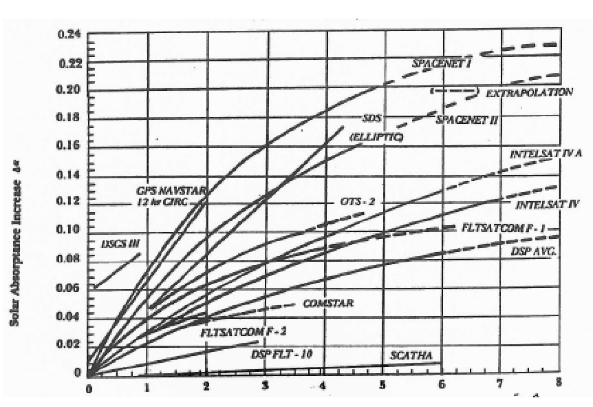
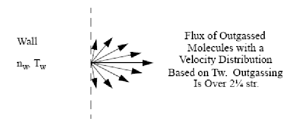

Equation Chapter (Next) Section 1

### 0 Surface Interactions and the Vacuum Environment

#### 0.1 A Brief Discussion on Surface Interactions

The design of satellite and spacecraft bus systems require consideration of the effects of the solar system hard vacuum environment which may include modification of the chemical composition at the surface. Experimental payloads in these vehicles require consideration of the outgassing properties of solids as well as response to penetration by energetic particles. The ability to make predictions of the effects of gas surface interactions has obvious importance to the spacecraft designer. This ability is aided by an understanding of the physical processes responsible for the observed phenomena.

An obvious difference between molecules in the gaseous state and in the solid state should be addressed. Molecules in the gaseous state have two additional fundamental dimensions of energy storage compared to molecules in a solid; the solid state molecules do not retain kinetic or rotational energy. All of the energy in the solid must be bound in vibrational and electronic excited states. Of course radiation can not be excluded from this discussion. Photons are sources of energy to a surface from external sources (i.e. the sun) as well as an energy loss process in the solid that produces radiation from excited state transitions in the solid. The physical processes of the interactions of photons, neutrals and charged particles with surfaces are fundamentally different and will be treated as such.

0.1.1 Particle and Photon Comparative Effects

The loss of energy to a surface by an atomic scale impactor often occurs through an induced transition in the internal state of the surface atom or molecule; often, the induced transition is in the electronic structure of the surface. In other words, the surface atom or molecule (or target) is excited into one of several possible electronic states in the reaction. The excited state may be some discrete level in the target, or it may be a continuum such as ionization resulting in the removal of an electron (with excess energy going into the kinetic energy of the now free electron). Typically in the more energetic collisions in a solid, the bound molecule is excited into a repulsive state, either as an ion or neutral, with subsequent dissociation. In many cases the dissociation process provides a significant amount of energy to the dissociated fragments, so that even when this occurs fairly deep below the surface of the solid there is sufficient energy for the atomic fragment to pass out of the solid in spite of momentum transfer collisions that occur on the way out. The energy that may be imparted per atomic fragment can be of the order of 5 eV for example, but there will be a large range of possible energies depending on the particular molecular structure in the solid.

There are distinctive differences between photon and particle colliders. The photon has a basic structural difference with a particle in that the loss of energy by the photon in a collision must involve the entire quantum of photon energy. The delivery of energy by the photon can have only one value associated with the frequency of the photon through Planck’s constant, hν. An impacting electron, ion or neutral on the other hand can deliver any amount of energy to the target up to the total energy of the colliding system. This basic property difference has wide implications for the interaction processes. For example, if a photon does not correspond exactly with some excited state in the target, it will not be absorbed. The photon may be scattered to produce a change in direction (Rayleigh scattering) with essentially no loss of energy. If the photon has sufficient energy to reach the ionization continuum of the target molecules, then the frequency of the photon becomes less critical for the extinction (photon loss) process because any excess energy in the photon above ionization threshold can be delivered to the kinetic energy of the free electron. In the process of ionization, photons and particle impactors behave in similar ways since both impactors “see” a non energy specific absorber in the target. However, the energy dependent shapes of the cross sections for the ionization process are basically different for photon and particle impactors.

0.1.2 Neutral Particle Interactions with Surfaces

The general processes of physical interactions of particles with surfaces must be considered in spacecraft design for the space environment. Some of these interactions are discussed in this section. For most gases (both neutral and ions) impacting most solid surfaces, scattering and physical adsorption occur for energies ranging from thermal energy to 5 eV. Scattering can either be elastic (where no internal states of the molecules are excited in the process) or inelastic (where internal energy is imparted to the target in the process). As discussed in previous lectures, the degree of thermal accomodation to the surface varies depending on the impactor and the surface characteristics. Physical adsorption or physisorption is the process by which a particle transfers to the surface enough kinetic energy to leave it trapped in the potential well (interaction potential between the particle and the surface, i.e. Van der Waals forces) of the adsorption site. Typically, physisorbed atoms and molecules maintain a large degree of mobility on the solid surface. A physisorbed molecule can impart enough energy to a neighboring molecule to desorb the molecule from the surface. Physisorbed molecules and atoms can move along the surface until an activation site (a site where chemistry might occur) is located. Surface adsorbed molecules also diffuse through the surface and may chemically react further below the surface becoming trapped in the solid structure. This is typically how deep oxidation layers are formed.

An atomically clean surface is one whose atoms are of the same type as those of the bulk material underneath. Gas atoms striking a clean surface have a high probability of sticking (called a sticking coefficient) somewhere between 0.3 and 0.6 until a monolayer of adsorbed atoms or molcules is formed. A monolayer is formed when all available adsorption sites corresponding to the maximum binding energy per atom are occupied. A monolayer corresponds to a coverage of roughly 2.4 x 1014 adsorbed atoms/cm2, and the energy of adsoption (binding energy) for a monolayer is generally between 2 and 4 eV per adsorbed atom. For additional layers both the sticking probability and the binding energy drop rapidly. The binding energy in the outermost layer of several monolayers is perhaps a few tenths of an electron volt with a sticking probability of about 0.001. Under equilibrium conditions, gas atoms leave the adsorption layer because of thermal agitation at the same rate as others are adsorbed. Because of this fact, the amount of molecules adsorbed onto a surface is a function of the surface temperature.

The first monolayer forms quickly on a clean surface unless its temperature is kept high. To estimate the time for a molecular nitrogen monolayer to form on a surface at room temperature (300 K) at a pressure of 1 mm Hg (Torr), it must be recognized from kinetic theory that the flux of molecules to the surface is

N = nv′ 4 . This is the flux of molecules striking the surface per unit area per unit time where n is the number density of molecular nitrogen (3.7 x 1016 cm-3 at 1 Torr) and is the average thermal speed of molecular nitrogen (4.5 x 104 cm/sec at 300 K). If the sticking probability is assumed to be 0.5, then 2.5 x 1020 molecules/cm2 sec are adsorbed to the surface. Thus the first monolayer is formed in approximately 1 µsec. If the pressure where 1 µm Hg (1 milliTorr), the time of formation would be about 1 second. However, because of the decrease in sticking probability following the formation of the first layer, the second layer would take several seconds to form at a pressure of 1 mTorr, and minutes would be required to reach equilibrium.

Chemisorption occurs for energies above the activation energy for the reaction involving the incident gas particle and the solid surface (typically greater than 5 eV). In this process, the impacting gas particle delivers excess energy of interacton to the surface and forms a chemically bonded molecular structure at the top layer of the surface. Sputtering occurs at energies greater than 20 eV and penetration occurs for energies upward of 40 eV. Both of these processes are active in LEO for neutral atoms or molecules in the high energy tail of the Maxwellian distribution function and for charged species. Sputtering is the removal of surface and sub-surface (up to 500 µm below the surface) species through momentum transfer to the solid through the impact of energetic particles. Penetration is the passing through the sub-surface of more energetic particles and photons deeper into the surface structure.

It is obvious in the design of spacecraft for the space environment that material selection is critical. For example, a particularly good thermal insulation material may sputter a significant amount of material or emit a large amount of secondary electrons when exposed to the space environment. These adverse

processes probably outweigh the benefit of using this particular material for its thermal insulative properties considering that adequate thermal protecting materials can be found which do not exhibit major sputtering processes when exposed to the LEO environment. Physisorption of atoms and molecules on a spacecraft surface are responsible for spacecraft contamination and the degredation of spacecraft system’s performace. Desorption is the process which contributes to spacecraft material outgassing. For neutral particles, chemisorption usually entails atomic oxygen chemistry since an extremely reactive atom is required at the typically low relative kinetic energies on orbit. Sputtering and penetration are mostly ion or electron processes at higher energy.

0.1.3 Space Environmental Surface Interactions

Over the next several lectures, the processes driven by photon, neutral gas and plasma (ions and electrons) interactions with solid surfaces will be discussed. This interaction is responsible for the modification (i.e. chemically activated such as ionization) of the solid which leads to the degradation of surface properties. The neutral environment will discuss neutral interaction with spacecraft materials which for the most part consists of atomic oxygen interactions. This interaction is responsible for the degradation (mostly through oxidation) of spacecraft materials in orbit and the spacecraft glow phenomenon. The plasma environment will discuss charged particle interaction with spacecraft surfaces. This process is fundamentally different from neutral interaction due to the fact that the charged particles generally possess more energy and are usually more reactive. The radiation environment will discuss the interactions between extremely energetic photons and charged particles (mostly electrons and protons) with spacecraft surfaces. The energy involved obviously separates these interactions from the relatively low energy interactions in the other environments.

#### 0.2 Characteristics of the Vacuum Environment

From Fig. 4-7, it is apparent that the space environment above 100 km is extremely rarefied and is 6 to 7 orders of magnitude (at 100 km) difference in pressure from the Earth’s surface (as confirmed by homework assignments). This severe reduction in pressure creates spacecraft material related issues such as outgassing and surface cleanliness. Thruster generated or exhaust plume species also behave differently in the rarefied environment. Boundary layers formed in the nozzle (from the boundary between continuum flow in the nozzle throat to a very low pressure atmospheric gas) can cause large turning angles from the nozzle which can direct effluents towards critical spacecraft components. Operational systems like the Space Shuttle experience several other contaminating events (i.e. water dumps, pressure vessel leaks, etc.) that can also influence space operations. Contaminating molecules can be transported to other more sensitive spacecraft surfaces (i.e. a photographic lens) in the space environment forming opaque layers that can severely hamper the spacecraft’s original mission. These outgassed, dumped and thruster fired molecules can be transported directly to a spacecraft surface (line of sight transport) or indirectly through collisions with free stream atoms. The extent of the indirect contamination process is obviously altitude dependent since collisions with the ambient atmospheric particles are the driving mechanism.

Fig. 4-9 indicates that much of the solar UV radiation intersecting the Earth’s orbit penetrates fairly deep into the atmosphere. The UV radiation that is not absorbed by atomic or molecular species high in the atmosphere is available for photon/surface interactions with spacecraft. These interactions can cause chemical changes in a material and degrade the material’s ability to perform its intended duty (i.e. causing heat absorption changes or optical transmission changes). The issue of the spacecraft generated space environment (due to the reduced pressure of the upper atmosphere) and the effects of solar UV radiation will be discussed in the following sections.

#### 0.3 Vacuum Environmental Effects0.3.1 UV Material Degradation

The propagation of photons through matter is affected by two general effects: extinction (or absorption) and scattering. Extinction refers to the absolute loss of the photon in an interaction. Typically, the extinction results in the conversion of the photon energy into the formation of an ion-electron pair or in the conversion to excitation of a dissociative molecular state. Scattering refers to the reflection or absorption and re-emission of a photon at the same or different wavelength. For a photon beam passing through a solid material, the scattering process is an apparent loss because the scattered photons are distributed into 4π steradians in some way. In general solids do not scatter in resonance or conservatively due to the existence of multiple transition branches in excited states that allow the loss of photons from the volume. All materials show strong absorption in some part or parts of the electromagnetic spectrum.

Metals show continuous absorption as a function of wavelength. This is due to the existence of free electrons in conduction bands at high density. In the visible and UV regions, metals are strong absorbers of the non-reflected component of incident photons. Materials in general are transparent to x-rays and γ-rays (λ < 10 Å). At longer wavelengths, there is invariably a region of extinction in the extreme UV (EUV) (λ < 800 Å or ~ 15 eV) resulting from significant continuum photoionization. At UV wavelengths, some materials remain opaque, in some cases extending into the visible wavelength region. However in most cases, the UV and visible region shows significant degrees of transparency. In the near-IR and extending into the IR, there is generally absorption structure in vibrational transitions.

Photons in the EUV region have the ability to ionize solid material. At lower energies, the photons can excite electronic states in the solid to produce disruptive effects but the absorptions structure is narrow (quantized) and the effect small. The primary effect in damaging surface structure by energetic photons is by the ionization process. The secondary electron that is produced must contain all of the excess energy of the photon above the ionization potential of the solid state molecule. The energetic electron released into the solid will then produce further ionization if it is energetic enough as well as electronic excitation of the solid molecular structure. The result is the dissociation of some of the excited molecules with enough energy in many cases to allow the diffusion of the neutral and ion products through the surface. The impacted solid will show evidence of ions, neutral atom and electrons diffusing through the surface into the surrounding volume. Photoelectrons are electrons produced by photon impact with a surface. The yield of photoelectrons near the ionization threshold shows a quadratic dependence on the photon energy

# ( )

Y ∝ hv −χ2 (1.1) where χ is the work function of the material.

Semiconductors and insulators differ from most metals in photoemissive properties primarily in the energy required to remove the electrons from the bound state. For example, the ionization potential for lithium fluoride (LiF), a material commonly used on spacecraft, is nearly 11.3 eV. The emission of electrons from this material has a significant permanence relative to metals because the cooled electrons passing through the surface are subjected to very slow diffusion back into the solid at normal temperatures. In other words, the energy required simply to create the ion-electron pair is so large as to leave the electron with very little kinetic energy. LiF develops well known color centers caused by the production of ions trapped in the solid that recombine with electrons from outside the surface at exceedingly slow rates at normal temperatures.

The energy spectrum of the emitted electrons by photon impact depends on the depth of penetration in a critical way. Shallow penetration often produces unpredictable results because the energy characteristics depend more heavily on the details of surface contamination and defects. Energetic photons that penetrate deeper into the solid produce more consistent electron distributions because of the scattering in the bulk solid as the electrons diffuse toward the surface.

With these effects in mind, it is not difficult to understand the design constraints imposed on a spacecraft that encounters the solar UV environment (which all spacecraft do to varying degrees). The creation of ions and dissociated atoms from a surface can permanently change the material’s properties in space where recombination is exceedingly slow. Open activation sites can also be filled by other atoms further altering the material structure as in the formation of oxides. A change in the absorptance or emittance of a thermal insulator, for example, can threaten a space mission by inducing instrument failure. Changes on the order

of 0.01 for absorptance are experienced over the lifetime of typical spacecrafts. Through careful material selection, these changes can be drastically reduced but probably not completely eliminated.

EXAMPLE

The SPACENET I and II satellites are communications hybrids built by GE Astro Space Division and launched in 1984. The thermal control system on the spacecraft is passive with heater augmentation. The major heat rejection path is through radiators consisting of individual optical solar reflectors (OSR). The OSR is a fused silica mirror bonded to an aluminum honeycomb substrate. Heat sinks are used to spread the dc current losses from the communications equipment to the radiator panels.

It is the change in solar absorptance, α, of the OSR that is responsible for the gradual warming of the spacecraft over time. The degradation is influenced by spacecraft contamination (i.e. the outgassing of organic molecules) in the presence of sunlight. Figure 6-1 shows the α degradation rates exhibited by several satellite radiators. As can be seen in this figure, increases in the solar absorptance occurs with exposure time to the space environment. These increases in solar absorptance can cause temperature increases on the satellite which are unacceptable for equipment functions. (Naegeli, C.R. J. Spacecraft and Rockets, Vol.29, No.5, pp.741-745, 1992).

Figure 6-1 Degradation of several silverized fused silica mirrors as a function of time in years (Naegeli, 1992).

0.3.2 Molecular Contamination

The current generation of spacecraft is typically sensitive to both molecular and particulate contamination. With longer system life expectancy, thermal control and other system’s properties must stay within design limits for longer periods. Current and future high resolution cryogenic (IR telescopes) and other optical sensors are especially vulnerable to the formation of condensable deposits on optical surfaces. It is essential that potential contamination sources be adequately identified and assessed to prevent performance degradation beyond acceptable levels. The causes and effects of molecular contamination will be addressed in this section.

0.3.2.1 Material Outgassing

Outgassing is the process of molecule release from a material into the gaseous phase under the influence of reduced pressure, elevated temperature or both. Most outgassed species are relatively high-volatility, loosely bound molecules which were initially distributed through the bulk material or simply adsorbed onto the outer surface. For surface adsorbed molecules, outgassing occurs by simple desorption. Bulk distributed molecules must first diffuse through the surface where it is then desorbed. Although not necessary for outgassing to be present, solar UV and neutral atomic oxygen bombardment of a surface can greatly enhance the surface desorption or outgassing rate.

The outgassing of materials is characterized by several factors. First, the nature of the material is important. Some materials are more prone to outgas at a higher rate over longer periods of time than others. The outgassing is also a function of the surface treatment and the atmospheric composition to which it is exposed. Second, the outgassing is proportional to the surface area and increases exponentially with temperature and decreases slowly with time. The outgassing rate never quite becomes zero for most materials at ambient temperature. Third, the outgassing rate of a material is independent of the total pressure on the surface when this pressure is less than about 10-3 Torr (1 mTorr or 1 µm Hg).

The amount of mass lost by a material due to diffusion is approximated by

(E ma ) kT

dm q eo dt t

= (1.2)

where qo is a reaction constant experimentally derived for a specific material and Ea is the activation energy. Integrating equation (6.2) yields an expression for the amount of material outgassed (by diffusion only) in some time interval as

( )/( ){ }

2 E ma kT 2 1

∆m = q eo t − t (1.3)

where t2 - t1 represents the time period. An outgassed molecule striking a surface has a probability of adhering to the surface which depends on the surface temperature, the outgassed molecule and the characteristics (i.e. roughness) of the surface. A molecule which attaches itself to the surface has an average residence time of approximately

τ T = τoe (1.4) where τo is the typical oscillation period of the molecule on the surface (~ 10-13 sec). Typically, contaminants have a very short residence time on all but cryogenically cooled surfaces (which is the assumption of the cryopump for vacuum applications). For example, water has a residence time of 1024 sec on a surface at 100 K but only 0.25 sec on a 300 K surface.

( ) (E ma )/(kT)

A contamination layer builds up on a surface if the arrival rate of contaminants is greater than the rate of departure. In other words, a contamination layer will arise if at least some of the molecules have a residence time on the surface which is long in comparison to the time period of interest. The accumulation rate is approximated by

x t T( , ) =γ ( ) ( , )T φt T (1.5) where γ(T) is called the sticking coefficient and is a measure of the probability that a molecule will adhere to a surface at some temperature T, and φ(t,T) is the arrival rate of contaminating molecules to the surface. This is counteracted by the desorption of gas from the surface (i.e. the rate of departure). The sticking coefficient ranges from 0 to 1 and is generally presumed to by 0.1 for most contaminating molecules on most material surfaces at 25° C.

The outgassed molecules can contaminate spacecraft surfaces in one of two ways. First, the outgassed molecules can contaminate a surface by line of sight transport. This is nothing more than observing that an outgassed molecule has a direct path, once it has been desorbed from the surface, to another surface perhaps some large distance away. This process is described at some length in the text book and in the reference section accompanying these notes (ref. Santeler, D. et al. Vacuum Technology and Space

Simulation. NASA SP-105, Washington D.C., 1966). These sections should be reviewed by the student. Second, the outgassed molecules can interact (collide) with ambient atmospheric particles (i.e. oxygen atoms in LEO) or another outgassed molecule and be backscattered to the spacecraft. Backscattering is the process by which the outgassed molecule’s momentum (here direction is the important parameter) is changed during a collision with another particle sending the outgassed molecule back towards the spacecraft. This process is important where the outgassing rate is large or low in the atmosphere. In both of these instances, the collision frequency for an outgassed molecule can be relatively large.

The presence of a thin contaminant film of some thickness x on a surface will change the solar absorptance according to

## ( ) ( ) ( ) ( )

= ∫ −  ∫

1 2 ( )

ac x s

λ λ λ λ α

R e S d x

(1.6)

s

S d

λ λ

where αc(λ) is the absorptance of the contaminant film, x is the film thickness, S(λ) is the solar output as a function of wavelength λ, and Rs(λ) = 1 - αs(λ) is the solar reflectance of the uncontaminated material. If a thermal control materials solar absorptance value changes dramatically over the life of a satellite due to contamination layers, the thermal radiators placed on the satellite at launch would need to be oversized to account for the change. Since after launch the radiators would radiate more heat than desired, thermal heaters would need to be added to keep the spacecraft within it operating temperatures. The oversized radiators and additional heaters constitute additional designing, weight and ultimately cost. Minimizing the change in a material’s solar absorptance over the lifetime of the satellite minimizes spacecraft size, weight and cost.

In addition to the concern for contamination of thermal control surfaces, there is also the possibility for contamination buildup on optics or solar arrays. Thin absorbing layers on optical components can create obvious problems. If the contaminants absorb radiation in the range that the optical detector is attempting to detect, the signal will be degraded. It may even be degraded to the point that it is indistinguishable from noise or stray light also collected from the detector. Solar array output is effected by the same process. Although solar arrays are much warmer than say cryogenically cooled IR detectors, there is still some probability that a contaminating molecule will condense on the surface. The addition of a thin film reduces the amount of solar radiation that reaches the solar cell and is converted to needed energy by the spacecraft. This has obvious effects in determining a satellites expected lifetime.

Several processes have been proposed and tested for the abatement of contamination related issues. Among these are the use of purge gas (collisional barriers) to protect sensitive instruments from contamination streams, the use of plume shields to guard against thruster firings and shutters which can open and close when refuge is sought from the contamination environment. All of these “fixes” add weight to a spacecraft and may not be fail safe themselves (imagine if a shutter covering a camera lens on a spy satellite failed to open). A better understanding of the contamination environment is required for future space missions. Understanding how the contaminants move (i.e. with what velocity and in which direction) and how they interact with the ambient environment and a spacecraft surface are vital to the overall contamination problem. This issue is extremely multi-disciplinary in that elements of gas dynamics, collisional physics and space environmental science (to name a few) are necessary to facilitate an understanding of spacecraft contamination. The first several lectures attempt in a very approximate way to help your understanding of these types of issues.

0.3.2.2 Outgassing and Gas Dynamics

Outgassing can be viewed in a similar way to that used in determining the diffuse wall reflection properties in lectures pertaining to rarefied gas dynamics. For fully diffuse surface reflections, it was assumed that the reflected molecules originated from a fictitious wall gas at some temperature Tw. For outgassing, it will also be assumed that the solid surface can be modeled as a semi-permeable surface with a wall gas representing the solid surface as in Figure 6-2. This wall gas has a number density nw which is based on the experimental flux measured from an outgassing surface (or some approximation thereof). The wall

molecules are at a temperature Tw which defines the velocity distribution function for the outgassing molecules through the Maxwellian distribution function.

Figure 6-2 The outgassing process shown as the diffusion of a wall gas (note: 2¼ should read 2π)

From this and the line of sight transport, the flux of molecules in mass, momentum and energy can be calculated from a given surface to another. The line of sight transport is valid if it is assumed that the wall gas is diffusing into space with an equal probability in any direction (within the 2π scattering sphere). For example, the number flux outgassed from surface 1 (handout Figure 2.1) is



′  

8 4 4

nv nw kTw m

(1.7)

φ

= =

   

1

π

The transport reaching surface 2 (Sfc. 2 from the handout Figure 2.1) from surface 1 is from equation (2.15) of the handout

   =      

8 cos cos 4

nw kTw dAdA m l

β β φ

(1.8)

1 2 1 2 1 2 2

π π

where the variables are defined in the handout and in Figure 2.1. Similar equations for the momentum flux and energy flux from one surface to another can be developed. The solution of the flux integrals from the lectures on rarefied gas dynamics is simply the solutions assuming no bulk flow with the appropriate wall number density and wall temperature.

0.3.2.3 Plume Impingement

The problem of spacecraft contamination from rocket exhaust plume impingement has become increasingly important with the advent of more sophisticated satellite systems and longer-term missions like the space station which will be visited many times by a maneuvering Shuttle. Products of incomplete combustion of vehicle thruster fuel are condensable and could contaminate nearby surfaces impinged upon by the thruster plume. Because of the very low ambient pressure environment the exhaust plumes are injected into, portions of the exhaust can turn through large angles impinging on surfaces upstream of the thruster exit plane. Contamination is generally related to both forward and backward (large turning angle) flow plume effects. The Russian space authorities were extremely concerned about the effects of the Shuttle’s reaction control system (RCS) firings required in the vicinity of the space station Mir. As can be deduced, several Shuttle servicing missions requiring several RCS firings near Mir can cause lifetime issues for several station components.

Prediction of the backflow is complicated by the interaction of the nozzle wall boundary layer with the inviscid core flow at the expansion corner of the nozzle lip. The overall plume flowfield is therefore divided into three distinct regions: a region of continuum flow (reaction chamber and nozzle throat), a region of transitional flow (within the nozzle geometry) and free molecular flow (as the plume expands into the low density ambient atmosphere). Backflow can also include plume species which collide with ambient atmospheric particles and are reflected back towards the spacecraft structure (backscattering). As with outgassed molecules, backscattering is only important for low altitude orbital thruster firings where the ambient density is relatively high.

The addition of electric propulsion (EP) devices to spacecraft for interplanetary missions or GEO stationkeeping introduces a new threat to the spacecraft generated environment. EP devices produce thrust through the generation of ions. The ions are influenced by spacecraft and naturally generated fields which can cause the propellant to interact with surfaces they otherwise could not interact with. The introduction of ions and electrons to areas near solar panels and sensitive electronics can be disastrous to a mission. The effects of ions and electrons on spacecraft surfaces will be discussed in greater detail in the following lectures.

0.3.2.4 Other Molecular Contamination Sources

For a complex space platform such as the Shuttle or space station, waste dumps of water and organic material, pressurization leaks and experimental gas discharge can also become contamination sources. Threats from these sources although significant are usually controllable. Again, it is important to assess the contamination potential from all sources and relate this potential to the mission to be carried out.

Often there exists the possibility that synergistic interactions between two or more effects may result in the deterioration of a spacecraft material or component at a rate which is faster than the sum of the effects individually. An example of this is the interaction between solar UV and molecular contamination. It has been documented that in the presence of UV radiation, contamination which otherwise would not condense on a surface can condense. Presumably the UV radiation initiates a polymerization process that binds the contaminant molecule to the surface. As a result, even relatively warm surfaces may be subject to the deposition of contamination layers when exposed to solar UV.

- 0.3.3 Particulate Contamination

In addition to molecular contamination discussed above, spacecraft are also subject to particulate contamination. A particulate is typically a micron size piece of matter that builds up on surfaces during manufacture. In this strict case, particulates are directly related to the air quality on the ground and not in space. FED-STD-209E defines air quality in terms of the maximum allowable number of particles per cubic meter of air. The particulate buildup is extremely important for spacecraft operations in similar ways as molecular film buildup. Since this is a spacecraft characteristic which does not depend on the space environment (i.e. the particulate contamination level is determined in ground processing facilities), it will not be discussed in this lecture except to the extent of acknowledging its existence. The text book offers an excellent discussion of this topic, and it is recommended that the student review this section.

- 0.3.4 Contamination Modeling and Experiments

Direct Simulation Monte Carlo (is ideal for predicting backflow and backscattering contamination from all contaminating sources. The DSMC is most useful in the transition region where both continuum codes and free molecular empirical solutions fail. The model can be a tremendous benefit in predicting general trends in contamination issues; however, the prediction is only as good as the internal DSMC models and assumptions. (Jenkins, R.M. et al. J. Spacecraft and Rockets, Vol.31, No.2, pp.265-270, 1994 and Fan, C. et al. J. Spacecraft and Rockets, Vol.31, No.4, pp.649-654, 1994)

Space-based experiments on the Shuttle contamination environment have been carried out. These take into account contamination sources such as cabin leakage, outgassing, desorption, water dumps and thruster firings. Results from these measurements early in the Shuttle program (STS1-STS4) indicated that the Shuttle induced environment was within the specified requirements and agreed with the pre-flight predictions. (Ehlers, H.K. et al. J. Spacecraft and Rockets, Vol.21, No.3, pp.301-308, 1984 and Green, B.D. et al. J. Spacecraft and Rockets, Vol.22, No.5, pp.500-511, 1985) There are several other examples of contamination experiments performed on space flights and in the laboratory. Students interested in more detail should consult the periodicals database at the Library.
