Equation Chapter (Next) Section 1

###### 0 The Neutral Environment

- 0.1 Characteristics of the Neutral Environment

Of interest to the aerospace engineering community are the interactions between low-Earth orbit (LEO) atomic oxygen and spacecraft surfaces. These interactions have been found to cause such processes as satellite glow, material degradation of spacecraft surfaces and atmospheric satellite drag. The interactions of atmospheric gases with outgassed molecules, rocket exhaust plume species and other atmospheric gases are also of great interest due to the possible contamination of sensitive scientific payloads.

As Table 7-1 indicates, atomic oxygen is the predominant species in the LEO environment between 180 and 650 kilometers altitude. Atomic oxygen, primarily in the ground (3P) state, results from the photodissociation of molecular oxygen by solar ultraviolet radiation in the reaction

(3 ) (3 )

O2 + hv → O P +O P (1.1) Recombination of the oxygen atoms at these altitudes is a slow process due to the small number of threebody collisions. In the thermosphere (>80km), it is present at nearly thermal energies (~0.01eV); however, the relative kinetic energy encountered during collisions with a LEO spacecraft orbiting at 8 km/sec is about 5 eV.

|Altitude|Mol. Weight|Composition By Number (%)|Composition By Number (%)|Composition By Number (%)|Composition By Number (%)|Composition By Number (%)|log νµ (Coll. Freq.)|
|---|---|---|---|---|---|---|---|
|(km)|(amu)|N2|O2|O|He|Ar or H|(sec-1)|
|100|28.30|76|18|5|0|1 (Ar)|4.45|
|150|25.12|60|9|31|0| |1.25|
|200|22.37|44|5|51|0| |0.7|
|300|18.36|17|1|81|1| |-0.15|
|400|16.36|6|0|91|3| |-0.85|
|500|14.8|2|0|86|12| |-1.45|
|700|9|0|0|44|55|1 (H)|-2.40|

Table 7-1 Composition of the earth’s atmosphere as a function of altitude (Allen)

With typical number densities of 109 cm-3 (the number densities of atomic oxygen range from 1.7 x 109 5.0 x 108 /cm3 between 240 and 300 km), the flux of oxygen atoms to surfaces normal to the satellite ram direction (antiparallel to the spacecraft velocity vector) is approximately 1015 cm-2/sec. Because little activation energy is required for atomic oxygen to react with most solid or gas targets, atomic oxygen is observed to be the major source of spacecraft material degradation and satellite glow. Spacecraft which operate in LEO, such as the Space Shuttle, the Hubble Space Telescope, and the space station, must be designed to withstand the adverse effects of atomic oxygen on solar arrays, sensitive instruments, and even metal components.

The other important chemical species in the LEO environment is molecular nitrogen whose number densities range from 6.8x108 to 8.3x107 cm-3 between 240 and 300 km. The N2 molecules have a collisional energy with an orbiting LEO satellite of 9.3 ± 2 eV which is comparable to the 9.8 eV dissociation energy. Molecular nitrogen is considered one of the main reactants in satellite glow processes. Neutral atmospheric components such as helium, hydrogen and argon comprise a small fraction of the total neutral environment below 500 km.

- 0.2 Neutral Environmental Effects

The introduction of more complex space systems and instruments into low-Earth orbit (LEO) has made once overlooked environmental interactions a major concern for spacecraft engineers. Demands that satellites such as the Hubble Space Telescope (HST) and the proposed space station remain operational in LEO for periods exceeding 15 years brought interactions such as spacecraft material degradation and glow into the forefront of space-related research. Satellite glow has a marked impact on sensitive optical sensors which are designed to investigate remote objects by obtaining spectral measurements in the IR, UV, and visible regions. The glow which also radiates in these regions threatens to limit the types of observations that can be conveniently carried out on such platforms as the Shuttle and space station.

Spacecraft material degradation influences satellite design in obvious ways. Evidence of severe degradation of Kapton thermal coatings, thin antireflection coatings on optical lenses, and even silver interconnect material used in solar arrays has been observed on Shuttle flights lasting on the order of a week. Structures intended for much longer stays in LEO must be made thicker and consequently heavier to survive environmental attack. This adds unexpected and sometimes unacceptable cost onto a mission. However, methods for limiting these adverse interactions are being pursued with some vigor. Materials which are not susceptible to degradation and glow phenomena are currently being developed and tested in a variety of facilities throughout the world.

- 0.2.1 Aerodynamic Forces on a Spacecraft - Lift and Drag

Equations (2.40), (2.42), and (2.43) can be applied directly to determine the aerodynamic forces on a thin flat plate at an incidence angle α to the freestream bulk flow. For the upper surface, θ = 90° + α and for the lower surface, θ = 90° - α. Equation (2.40) is then summed over the upper and lower surfaces to give the upward force per unit area normal to the surface of the plate as

+

ε α α π

F S

2(1 ) sin

2 sin2 1/2

= +

N S

e p

∞

1/2

  −   +  

T

ε π α ε α α

1/2

r

S T

(1 ) sin

(1.2)

∞

+ +

2 2

S erf S

(1 )(1 2 sin ) ( sin )

Similarly for equation (2.42)

= −  +    (1.3)

ε α

F

2(1 ) P cos S sin ( sin )

###### ( )

2 sin2 1/2 1/2

α π α α ∞ π

S e S erf S p

The lift and drag forces on the plate, denoted by L and D respectively, are calculated from the above equations. The lift coefficient of a plate of area A is

L c

=

###### { }

L

ρ

2

v A F F A v A F p F p S

/ 2 cos sin / 2 cos sin

( )

α α ρ ∞ α ∞ α

−

=

N P

(1.4)

###### { }

2

( ) ( )

−

=

N P

2

Substituting for N F p∞

and P F p∞

in equation (7.4) yields

ε α α α π

 

4

2 sin2

−

=   +  

S L

sin cos cos

c e S

- 1/2

2 2

- 2

α

### { ( )} ( )

ε α α ε

+ + +

1 1 4 sin sin 1

S erf S S

( )

1/2

−     

T S T

π α α

1/2

r

sin cos

∞

(1.5)

The drag coefficient is

( ) ( )

∞ + ∞

α α ρ

D F p F p c

sin cos / 2

= = (1.6)

N P D

{ }

2 2

v A S

and similarly

( )

 − 

ε α α π

2 1 cos2

2 sin2 1/2

=   +  

S D

c e S

α

#### { ( )}

sin

+ + − +

ε α α ε

2 2 2

- S S erf S

S

- T

1 2 1 2 cos2 ( sin ) 1

(1.7)

( )

1/2

−      

π α

1/2 2

r

sin

S T

∞

The heat transfer to the surfaces of the plate is given by equation (2.43), and the total heat input to both sides of a perfectly conducting flat plate is given by

( )

−

ε π β

a mn q

- 1
- 2

∞

= ×

c



1/2 3

∞

(1.8)

 +  

## { ( )}

γ γ

T S e S erf S e T

1 1 sin sin 1 2( 1) 2

2 2 2 2

− −

α α

 + −  + −   − −  

π α α γ γ

2 sin 1/2 sin

W S S

∞

where ac is the accomodation coefficient of the flat plate surface. The equilibrium surface temperature of an isolated perfectly conducting flat plate not subject to thermal radiation is the temperature for which equation (7.8) is zero, i.e.

γ γ γ

  −  + − − 

1 2( 1) 1 2

2 2

−

α

S

2 sin

S e T T e S erf S

=   +  + 

(1.9)

− ∞

( )

w S

γ π α α

2 2

1 sin ( sin )

α

sin 1/2

 

For bodies other than flat plates, equations (2.40), (2.42), and (2.43) must be integrated over the surface. The chances of obtaining an analytical solution depends on the geometrical complexity of the object. The procedure is illustrated for the drag coefficient for a sphere. For polar coordinates, the drag coefficient is

( )

π θ τ θ π θ

+

2

D p r c d

cos sin 2 sin D / 2 / 2

= = ∫ (1.10)

θ ρ π ρ π

{ }

2 2 2 2 0

v r v r

where r is the sphere radius. The final solution to equation (7.10) is

1 2 4 2 2

+ + − −   = + +    

# ( )

ε π π ∞

S S S T c e erf S

2 1 4 4 1 2(1 ) ( ) 2 3

2

S W D

(1.11)

3 4

S S S T

In equation (7.11), the fraction of specular reflection ε disappears from all terms except that containing the surface temperature Tw. Therefore, for a cold sphere, the drag coefficient is the same for specular and diffuse reflection with cD → 2as S becomes large.

0.2.2 Material Degradation Due to Atomic Oxygen Interactions

Perhaps the most significant observations during early missions of the Space Shuttle were the degradation of materials exposed to the LEO environment. Oxygen atoms, the predominant species at LEO altitudes, are chemically reactive and have been found to be the major source of this degradation. These initial observations combined with a host of ground based studies and dedicated satellite missions have led NASA to pursue the development of protective spacecraft coatings in an effort to stem the severe impact the LEO environment will have on the performance of the Space Station and Hubble Space Telescope. Other concerns have developed over oxygen atom surface modification interactions which result in a change in optical, thermal, or conductive properties of important spacecraft components. Some of the more relevant studies are described in the following sections.

The rate of material loss due to atomic oxygen is a function of the number of atoms striking a unit area in a given time or the fluence. This is proportional to the atmospheric density, orbital velocity (incident ion energy), surface orientation relative to the ram direction and the time of exposure. At atomic oxygen energies of 5 eV, surface scattering and absorption are the dominant degrading processes. Sputtering or penetration occurs for most spacecraft materials at energies on the order of 20 and 40 eV respectively. Only absorption can alter a substrate through the formation of oxides which may form a surface layer or be lost through evaporation, sublimation or some other process. Reaction efficiencies, a measure of material loss per incident atom, gives a general idea of a material’s sensitivity to oxygen atom attack.

- 0.2.2.1 Space Shuttle Results

As stated earlier, material degradation due to energetic oxygen atom impact was not considered a design problem until Space Shuttle missions began to show measurable, visible material loss after only hundreds of hours in LEO. For the first time, spacecraft subjected to LEO conditions for extended periods of time were regularly returning to Earth giving designers the opportunity to investigate the effects of the environment on critical components. The initial four flights of the Space Shuttle Columbia (STS-1 through

- STS-4) noticed significant changes in thermal control blankets (Kapton surfaces) and payload surfaces. The glossy finish on Kapton normally was changed to nonglossy, and shadow patterns were detected on this surface which were attributed to exposure in the direction of the orbiter’s velocity vector. As much as 5.5 µm surface loss occurred on STS-3 on the Kapton thermal blankets. Changes in paint and other nonmetallic surfaces were also noticed.

These early test missions also showed that the Shuttle has a significant contamination cloud surrounding it which also lends itself to material erosion and changes in physical properties. Major mission events which influence the induced contamination cloud include cabin leakage, material outgassing, water dumps, and Reaction Control System (RCS) engine firings. Erosion of the coating on the thermal protective tiles on the Shuttle occurred during the STS-3 and STS-4 missions and was attributed to extensive use of RCS jets. Being able to model these species with energies up to about 40 eV would obviously be advantageous.

Subsequent Shuttle missions have had dedicated experiments flown to determine oxygen atom effects on a wide variety of materials. Three experiments entitled Evaluation of Oxygen Interaction with Materials (EOIM) I, II, and III have flown on Shuttle missions STS-5, STS-8, and STS-46 respectively. Another experimental package entitled ACOMEX was dedicated to atomic oxygen effects on polymeric-based materials and advanced composite materials. This flew on the STS-41G mission. The absorbtance of a thin Kapton film exposed in the ACOMEX experiment was obtained by measuring the transmission of a collimated beam in the near-ultraviolet to infrared wavelengths. The marked changes in absorptance obtained in the experiment shows that the Kapton exposed to the LEO environment exhibits increased opacity which was directly attributed to “reflection at the internal and external front surface due to surface roughening rather than changes in bulk material properties.”

The results of exposure of a wide variety of materials to LEO atomic oxygen are well documented in the literature. Metals including silver, copper, lead, magnesium, molybdenum, nickel, platinum, gold, tungsten, osmium and a wide variety of alloys have all been exposed for roughly seven days. In these short term exposures, only silver, copper, and osmium showed changes on the macroscopic level. Conductive silver was found to form semi- or non-conductive heavy oxide layers up to 4 µm thick. These layers were then easily lost by flaking or scaling. Copper formed volatile oxides which were directly and nearly

completely lost. Osmium tetroxide (Os O4) was formed on the Osmium sample which were lost to sublimation due to its high vapor pressure. Silver and copper are used as solar cell interconnect material on many spacecraft’s solar arrays. Changing the conductivities of these metals over a long period of time will severely hinder power availability for critical spacecraft components.

It was found that organic materials in general reacted at much higher rates than even the most reactive metals. Spacecraft paints, thermal coatings, composite structures, and polymer-based substrates, all showed some degree of degradation at relatively high rates. Atomic oxygen strikes the surface breaking a hydrocarbon chain by bonding to a carbon atom. The resulting shortened chain is later struck by another oxygen atom, yielding a molecular fragment that leaves the surface. This dictated a reinvestigation into spacecraft systems design. For example, the protective coatings for solar arrays would vanish almost entirely over a 15 to 30 year mission such as those planned for HST or the Space Station. The effect of Kapton polyamide films used to thermally insulate spacecraft components was documented earlier in this section. Graphite-epoxy composites showed noticeable loss of surface resin which allowed the carbon fibers themselves to be exposed. Oxygen atom interactions with carbon fibers have been found to have extremely detrimental effects on strength and stiffness. This can lead to enormous problems in structural integrity.

Perhaps the two most important degradation studies performed during Shuttle missions was the retrieval of two satellites brought back to Earth after extended periods in LEO orbits. The first was the retrieval of the Solar Max Satellite after nearly 50 months in orbit. Solar Max showed evidence of Teflon degradation including cracking, discoloration, and material loss which had not been seen on shorter Shuttle flights. Solar Max data also indicates that ultraviolet radiation and atomic oxygen act synergistically. The other satellite was the Long Duration Exposure Facility (LDEF) which was returned to Earth after almost six years in LEO. The assessment of data from ground based facilities and model computer simulations depends on the data obtained from such satellites and the Shuttle are invaluable and to date not easily gathered by ground based facilities.

0.2.2.2 Long Duration Exposure Facility (LDEF) Results

This 10-ton satellite was released from the Shuttle cargo bay in April 1984 to study the long term effects space exposure. Long term in this case was nine to twelve months; however, the spacecraft was placed in a higher orbit due to concerns about retrieval reliability. This turned out to be a saving stroke for LDEF which saw many retrieval missions scrapped and the halting of all Shuttle flights for almost three years after the tragedy of January 28, 1986. The retrieval of LDEF finally occurred in January 1990 after almost six years in LEO only two months before its predicted reentry into the Earth’s atmosphere.

The two long term space environment effects on LEO spacecraft materials receiving the most attention were atomic oxygen degradation and micrometeoroid and space debris impact. LDEF was oriented so that one side of the facility, the leading edge, continually faced into the orbital velocity vector. The leading edge was estimated to be exposed to an oxygen atom fluence of 8.7 x 1021 atoms cm-2 while the trailing edge was exposed to 1.3 x 1017 atoms cm-2. Several of the experiments where arranged so that half of the samples were exposed on the leading edge and the other half on the trailing edge. Among the more important results were those obtained for advanced components on spacecraft and are therefore of interest to the designers.

No catastrophic damage was observed on any of the composite samples after nearly six years of LEO exposure. Samples on the trailing edge exhibited no changes in physical appearance. On the leading edge, samples were eroded from depths from 25 to 125 µm. Evidence was also gathered which suggests that the degradation behavior of these composite materials depends on the resin content and composition. This is in agreement with previously discussed results from Shuttle flights. Degradation of fluorinated ethylene propylene (FEP) Teflon thermal blankets recovered from leading edge and trailing edge position on the LDEF was observed. Again more erosion was observed for the leading edge sample than for the trailing edge.

The amount of erosion of material surfaces is a definite function of the angle the material’s normal has to the orbital velocity vector. One study even used the erosion of a silver disk to determine LDEF’s

orientation while in orbit. This was the first time that the LEO environment was used for spacecraft attitude sensing. Other beneficial properties of O atom erosion have also been suggested. Among these are preferential erosion of protective surfaces on optical systems put in place to protect sensitive instruments during initial orbital thruster firings, advantageously changing conductive properties of some materials as a function of on-orbit time, and the removal of contaminants from surfaces. Ground based facilities have not been able to show the effects of a five year exposure to atomic oxygen to date. The data gathered by LDEF has lead to the development of protective coatings and stronger material design considerations.

- 0.2.2.3 Ground Based Studies

With the experimental results available from the EOIM missions of the Space Shuttle, ground based facilities scrambled to produce laboratory data for various materials. Early laboratory studies used Kapton as the target material because of its important space applications and because Shuttle results showed that measurable damage could be seen for relatively short exposure times. Researchers at the NASA Johnson Space Center have observed that the reaction rates of atomic oxygen with Kapton increase as a function of time. If one assumes that all other conditions in their experiment were constant, this suggests that the probability of a reaction increases as the oxygen fluence accumulates.

In fact other research has shown that this trend is indeed prevalent. Results obtained from Mallon et al. are shown in Table 7-2 as it compares to results obtained from two Shuttle missions (STS-5 and STS-8). The total fluence of atomic oxygen for the laboratory research ranged from about 5.6 to 6.7 x 1019 cm-2 while STS-5 and STS-8 experienced 1 x 1020 and 3.5 x 1020 cm-2respectively. Neither the lab nor the Shuttle data shows a definite dependence on the material temperature for Kapton erosion. Several other facilities have also noticed similar degradation patterns as those observed by Shuttle flights.

|Kapton Temperature, Kelvin|Reaction Probability, 10-24 cm3/ O atom|Reaction Probability, 10-24 cm3/ O atom|Reaction Probability, 10-24 cm3/ O atom|
|---|---|---|---|
| |Mallon et al. (Ground Based)|STS - 5|STS - 8|
|300|2.1 ± 1.1|2.3 ± 0.9|——|
| |1.7 ± 0.9| | |
|338|1.4 ± 0.9|2.0 ± 0.8|3.0 ± 1.2|
|393|1.5 ± 0.9|2.1 ± 0.9|2.9 ± 1.2|

Table 7-2 Experimental and Space Shuttle Reaction Probabilities for Kapton

Many interesting observations have been made in ground based facilities which would have been difficult or impossible to obtain in space. Investigations by Lockheed Missiles and Space on a wide variety of fluorocarbon materials indicated that material degradation could continue months after initial exposure to atomic oxygen, even though the material was no longer exposed to the LEO environment. Caledonia and Krech noticed that kinetic energy alone was not responsible for the degradation of materials in LEO. They found no appreciable damage to a Kapton sample exposed to a 5 eV beam of Argon further proving atomic oxygen’s role in these devastating processes. Furthermore, Cross and Blais have documented that the erosion rate is a definite function of atomic oxygen incident energy, a result not altogether unexpected. Another study estimated the results for an ionic oxygen beam at about 5 eV. These situations could not be reproduced in space indicating an advantage to having reliable ground based facilities.

- 0.2.2.4 Results Based on Experimental Observations

The dominant degradation process at 5 eV is the adsorption of oxygen atoms onto surfaces which may form oxide layers. The layers are lost to subsequent particle impact, flaking or sublimation. The interaction of rocket plume species with spacecraft surfaces can involve energies up to 40 eV. At these energies, sputtering and penetration of surfaces becomes important. These molecules and atoms can be scattered to sensitive payloads by surfaces or atmospheric gases.

The rate of material loss due to atomic oxygen is a function of the number of atoms striking a unit area in a given time or the fluence, f. The erosion rate can be approximated by

T T

x=∫ηnvdt f ∫ ηdt= (1.12)

0 0

where x is the thickness of material lost, η is the reaction efficiency for a given material, n is the local oxygen atom number density, v is the impact velocity and T is the time in orbit. Although this appears to be a simple analytical equation, it is in fact a complicated equation to solve. In general, both the reaction efficiency and the local number density are functions of time. Studies have found that the reaction efficiency for many materials increases with oxygen atom fluence. The local number density varies with orbital altitude, latitude, solar activity and local perturbations making the fluence difficult to determine. Using Equation (7.12) and typical values for reaction efficiency, number density and velocity, one millimeter of Kapton material can be lost in 5 to 10 years. This can completely erode the thermal control blankets used on most satellites. Some average reaction efficiencies are shown in Table 7-3 for several materials.

|Material|Reaction Efficiency (x 10-24 cm3/atom)|
|---|---|
|Kapton|3.04|
|Mylar|3.56|
|Tedlar|3.19|
|Polyethelene|3.69|
|Polysulfon|2.41|
|Graphite Epoxy|2.50|
|Glassy Carbon|0.80|
|Molded Graphite|0.85|
|Z302 Paint|4.50|
|Z853 Paint|0.75|

Table 7-3 Average reaction efficiencies of several material samples with atomic oxygen (Tribble)

- 0.2.2.5 Example - Conductive Silver

Conductive silver reacts rapidly with atomic oxygen forming nonconductive oxide layers. Silver samples exposed to the LEO oxygen atom environment on several Shuttle missions (STS4, 5 and 8) experienced the formation of oxides and a corresponding increase in sample mass. The increase in sample mass indicates that the trapping of oxygen atoms on the silver surface by adsorption and reactions (oxide formation) are the dominant processes at typical LEO energies. Sputtering and ablation apparently contribute very little to the processes occurring in LEO; however, the sputtering threshold energy of silver bombarded by oxygen atoms is 12 eV and may need to be considered for the energy range at the tail of the distribution. Observations at several stages in the oxidation indicate that it begins at the impact surface and proceeds as the atomic oxygen diffuses through the metal. Both LEO and laboratory investigations have found that the oxide layers are stable and have a yellow-brown tint.

The oxide thickness increases linearly through a thin silver film as a function of the atomic oxygen fluence up to a depth of approximately 250Å (approximately 100 monolayers). The oxidation rate slows considerably beyond this depth and is most likely diffusion controlled at thicknesses greater than a few hundred angstroms. The initial oxidation rate tends to increase linearly with the oxygen atom concentration, and the rate appears to be relatively insensitive to the sample temperature over the range of temperatures from 0 to 85°C. Because these silver films are believed to react specifically with atomic oxygen, they have been used as integrated flux monitors for oxygen atom measurements in LEO and in the laboratory.

0.3 Spacecraft Glow

- 0.3.1 Applicable Environmental Conditions

Above about 100 km the ionosphere may comprise a second environment (besides the obvious neutral environment) of potential importance to the study of satellite glow. Radiation, mainly from solar processes, penetrates the neutral atmosphere of the Earth and ionizes the atoms and molecules present. Separate regions in the ionosphere develop depending on the absorption characteristics and composition of the atmosphere and recombination effects. The E layer (100-150 km) is characterized by the ionization of O2 by direct absorption in the first ionization continuum (hv > 12.0 eV). Ionization of O, O2, and N2 also occurs as a result of solar X-rays. The F1 layer (~200 km) is dominated by the ionization of atomic oxygen by Lyman continuum or by emission lines of He. The F2 region (~300 km) has the same ionizing properties as the F1 region; however, the recombination rates decrease with increasing altitude due to the decrease in number density.

Temperatures in the ionosphere roughly follow those for the neutral environment, increasing exponentially with altitude. Normally the electron temperature is about two times that of the neutrals, and the ion temperatures generally fall in between these values. Electron number densities peak at about 106 cm-3 in the F region at roughly 300 km on the daylight side as Figure 5-6 illustrates. At night, the electron number densities can fall off by an order of magnitude or more.

- 0.3.2 Satellite Contamination Environments

The induced environment around a LEO spacecraft is perhaps the most important consideration in the study of glow phenomenon. In flight measurements indicate that the pressure near the Shuttle can rise to 10-4 Torr during thruster firings. This implies that the mean free path of a thruster product is on the order of a few meters, smaller than the typical dimensions of the Shuttle. Therefore, particles from local contamination sources can be scattered back onto Shuttle surfaces. Mass spectrometer measurements taken on Shuttle flights STS-2, -3, and -4 have detected several species including He, H2O, N2/CO, NO, O2, Ar, CO2, Freon, trichoroethylene, and other heavy hydrocarbons (presumably cleaning agents). Methane (CH4) was also detected in correlation to Shuttle Reaction Control System (RCS) firings. H2O, NO, N2, and CO were all found to be major contaminant components. However, the heavier species were found to be present in low concentrations, and CO2 was detected in small amounts as well.

The water contamination showed an initial decay time of about 10 hours after launch. This corresponds to the on-orbit outgassing of collected moisture on Earth from surfaces. Large variations from flight to flight are often noticed and can be attributed to climatic conditions before launch. For example, the decay time for missions subjected to rain storms before launch are longer than those not subjected. The water contamination environment is also highly influenced by thruster firings and Shuttle water dumps during orbital operations.

- 0.3.3 Glow Phenomenon

- 0.3.3.1 Glow Experiments and Observations

Early observations made from small LEO satellites indicated that there are sources of optical emissions that originate from the satellite itself. This was first observed in 1977 by the Atmospheric Explorer (AE) -C satellite. Other small satellites have also observed glow phenomenon. These include the AE-E, Dynamics Explorer (DE) -B, Air Force’s Space Test Program (STP) 78- 1, and S3-4 satellites. On the AE-C and E spacecraft, researchers using the Visual Airglow Experiment (VAE) instrument, designed to observe optical features in the terrestrial airglow layer between 2800 and 7320 Å, found occasional large intensities and locations where there should not have been detectable emissions. After finding no external mechanisms which could be attributed to this phenomenon, they came to the conclusion that the emission was due to an interaction between the satellite and the atmosphere.

- 0.3.3.2 NASA Atmospheric Explorer and Dynamics Explorer Satellites

The VAE on the AE-C and E satellites consisted of a photometer and a filter wheel with six interference filters (~20 Å bandwidth). Because the AE satellites were spin stabilized with the spin axis normal to the

orbital plane, the VAE photometer field of view was able to sweep through 360° on each spin. Although this instrument was not intended to study the satellite glow process, data received from the VAE has been of value. Figure 7-1 shows the variation of the glow at 6563 Å and 7320 Å with orbital altitude. Above about 160 km, the emission intensity for both wavelengths decreases with altitude at the same rate as the atomic oxygen number density. This tends to suggest that both emissions arise from the same mechanism, and that atomic oxygen plays an important role in the process. Below 160 km, the intensities become uncoupled from the oxygen atom number density and rise much faster than the density.

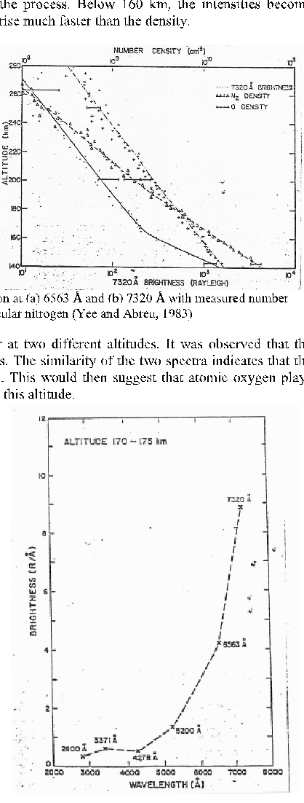

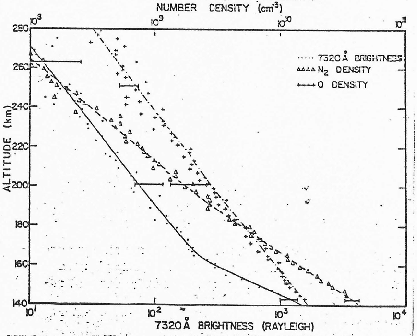

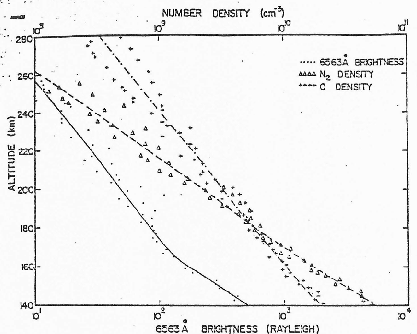

Figure 7-1 Altitude variation of the AE-C Glow Emission at (a) 6563 Å and (b) 7320 Å with measured number densities of atomic oxygen and molecular nitrogen (Yee and Abreu, 1983)

Figure 7-2 shows the spectral variations of the glow at two different altitudes. It was observed that the emissions are stronger in the longer (red) wavelengths. The similarity of the two spectra indicates that the same mechanism produces the glow at both altitudes. This would then suggest that atomic oxygen plays just as important a role below 160 km as it does above this altitude.

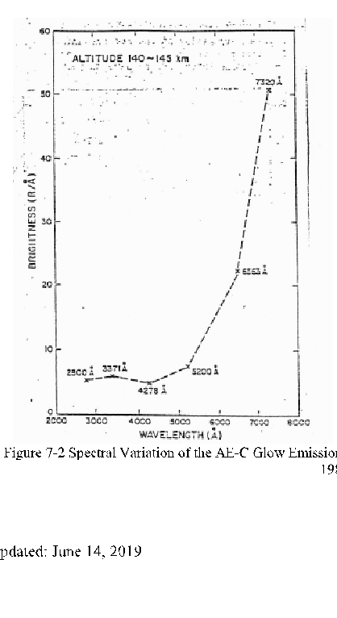

Figure 7-2 Spectral Variation of the AE-C Glow Emission at (a) 140-145 km and (b) 170-175 km (Yee and Abreu, 1983)

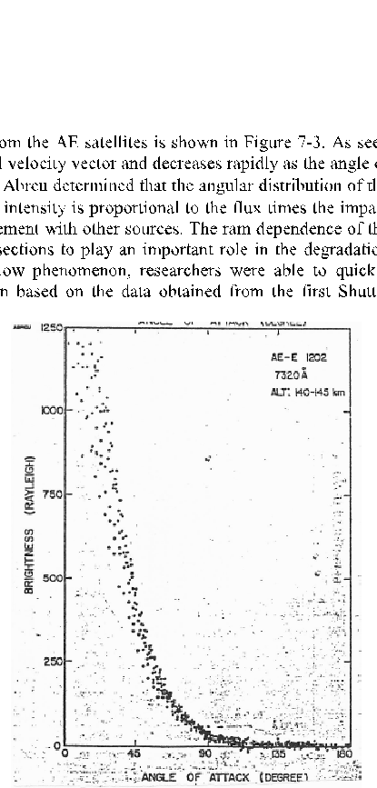

Perhaps one of the most important results obtained from the AE satellites is shown in Figure 7-3. As seen here, the glow peaks in the ram direction of the orbital velocity vector and decreases rapidly as the angle of attack from the velocity vector (φ) increases. Yee and Abreu determined that the angular distribution of the emission varies as the cos3(φ), which implies that the intensity is proportional to the flux times the impact energy. These findings by Yee and Abreu are in agreement with other sources. The ram dependence of the glow intensity has also been shown in the previous sections to play an important role in the degradation process. Because it was first observed with the glow phenomenon, researchers were able to quickly identify atomic oxygen as the source for degradation based on the data obtained from the first Shuttle missions.

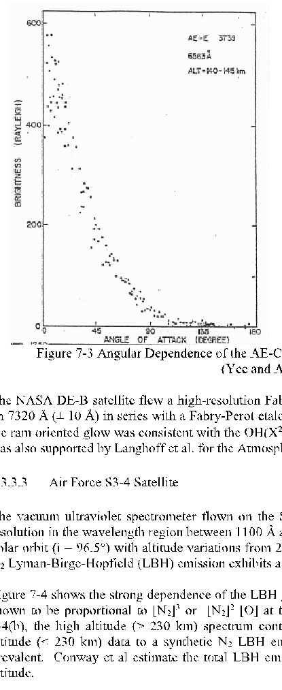

Figure 7-3 Angular Dependence of the AE-C Glow Emission at (a) 6563 Å and (b) 7320 Å (Yee and Abreu, 1983)

The NASA DE-B satellite flew a high-resolution Fabry-Perot interferometer consisting of a filter centered on 7320 Å (± 10 Å) in series with a Fabry-Perot etalon. Abreu et al indicated that the emission spectrum of the ram oriented glow was consistent with the OH(X2Π) spectrum. Excited OH as a possible glow producer was also supported by Langhoff et al. for the Atmospheric Explorer satellites.

- 0.3.3.3 Air Force S3-4 Satellite

The vacuum ultraviolet spectrometer flown on the S3-4 satellite acquired data with both 5 Å and 25 Å resolution in the wavelength region between 1100 Å and 1900 Å. The three-axis stabilized satellite was in a polar orbit (i = 96.5°) with altitude variations from 270 km to 160 km. Far UV observations show that the

- N2 Lyman-Birge-Hopfield (LBH) emission exhibits a variation in vibrational distribution during the day.

Figure 7-4 shows the strong dependence of the LBH glow with orbital altitude. The intensity of the glow is shown to be proportional to [N2]3 or [N2]2 [O] at the altitude of the satellite. As can be seen in Figure 7-4(b), the high altitude (> 230 km) spectrum contains no obvious LBH emission. Comparing the low altitude (< 230 km) data to a synthetic N2 LBH emission spectrum indicates that the LBH emission is prevalent. Conway et al estimate the total LBH emission to be 145 R at 200 km and 1000 R at 180 km altitude.

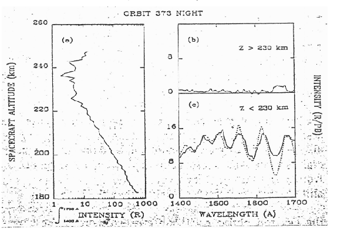

Figure 7-4 (a) Total Intensity in Rqyleighs Between 1400 and 1700 Å as a Function of the S3-4 satellite altitude, (b) Average Spectrum in Per Passband for Data Above 230 km, (c) Average Spectrum for Data Below 230 km (Conway et al., 1987).

0.3.3.4 The Space Shuttle

The first reports of what is now termed “Shuttle” glow occurred on the STS-3 mission. Banks et al. discovered evidence of an “orangish halo” adjacent to the Shuttle 5 to 10 cm above the ram oriented surfaces. The instruments used in this observation were a still camera and a television camera mounted in the Shuttle’s aft flight deck, i.e. in the direction of the payload bay. Yee and Dalgarno found the line of sight intensity of the glow to be about 30 kR using the STS-3 data. This corresponds to a maximum volume emission rate of 7.0 x 106 photons/cm3-sec. They also noted that the flow intensity decreased exponentially with the distance from the surface as earlier results on the AE satellites also suggest. The distance over which the excited species are emitting is a function of the emitter velocity and the radiative lifetime of the excited state.

Careful analysis of the STS-3 photographs shows that the glow scale length (1/e reduction in intensity) is approximately 20 cm. If the emitting particles are assumed to be in thermal equilibrium with the Shuttle surfaces, their mean speed is about 300 m/sec. This gives an excited state lifetime of 0.67 msec. If their exit velocity is comparable to the incident velocity, assuming an elastic collision with the surface, the radiative lifetime can approach 50 µsec. These are relatively long-lived states, and would suggest that metastable populations dominate the glow features.

On the following Shuttle flight, STS-4, a conventional camera was fitted with a 300 line/mm transmission grating. Mende et al have reported the existence of a nearly continuous spectrum in the 6300 Å to 8000 Å region wit ha spectral resolution of 150 Å. A slightly more detailed spectrum (resolution 31 Å FWHM) was obtained on a later Shuttle mission, STS-8. Mende and Swenson demonstrated that the spectrum has little emission between 4300 Å and 5000 Å and increased above 5000 Å. A subsequent mission, 41-D, reconfirmed the results of STS-8. However, this data was obtained using a spectral slit which eliminated the contamination of previous results from scattered terrestrial airflow. The instrument’s better resolution also diminished doubts about the absence of distinct spectral features in the glow emission.

Glow observations above a variety of surface materials were also taken on STS-8 and 41-D. On STS-8 (altitude - 220 km), small strips of kapton, aluminum, and Z306 (black chemglaze) were attached on the Remote Manipulator System (RMS). Kapton was selected because of its known sensitivity to oxygen erosion, and aluminum was selected because of its known resistance to O atom degradation. Z306 was selected because of its use in low-level light detection devices which are susceptible to optical

contamination. Mission 41-D flew nine material samples at an altitude of 300 km. They included Z302, Z302 covered with Silicon, MgF2, Z306, chemical conversion film, carbon cloth, anodized aluminum, 401C10, and polyethylene. Table 12 shows the ranking of these materials relative to the most intense glows (9 being maximum). Both missions encountered similar results. It was noted that materials which exhibit the most degradation due to atomic oxygen attack have the faintest glows associated with them. At the same time, those materials resistant to oxygen atom attack exhibit the most intense glows.

|Material|Ranking|
|---|---|
|MgF2|8|
|Z306|6|
|Z302 Coated with Si|9|
|Z302|7|
|Polyethylene|1|
|410-C10|2|
|Carbon Cloth|4|
|Chemical conversion film|5|
|Anodized Aluminum|3|

Table 7-4 Material Samples and Glow Intensity Ranking

For example, the chemically stable MgF2 sample exhibited intense glow characteristics while kapton, having a relatively large depletion rate, exhibited a rather weak glow. This implies that the bulk surface material is not responsible for the glow phenomenon. Data from STS-8, however, indicates that the scale heights for these materials are roughly the same. This would tend to imply that the glow creating processes are similar for each material, and that the material surface acts as a catalyst to the glow reactions. The material data also seems to rule out absorbed surface contaminants as a source of the glow since the glow would then only be a function of exposure time and perhaps temperature. However, this is not observed as nearby materials, contaminated in a similar fashion, exhibited different glow characteristics.

The effect of surface temperature on glow characteristics was first introduced by Swanson et al where they reported a strong correlation between the two. During mission 41-G, they noticed that the glow intensity was clearly much lower than other missions at similar altitudes. The lack of significant glow on 41-G led Swenson et al to suggest that the surface temperature may have affected the data. Indeed, they found that the Shuttle surfaces during 41-G were much warmer than other missions. Figure 7-5 shows the ram glow intensity at 7000 Å as a function of surface temperature for several Shuttle and satellite missions. Surprisingly, the points could be fit by a single function

1625

I = ×e Ts (1.13) where Ts is the surface temperature and I is in R/Å at 7000 Å and 250 km altitude.

2.64 10 3

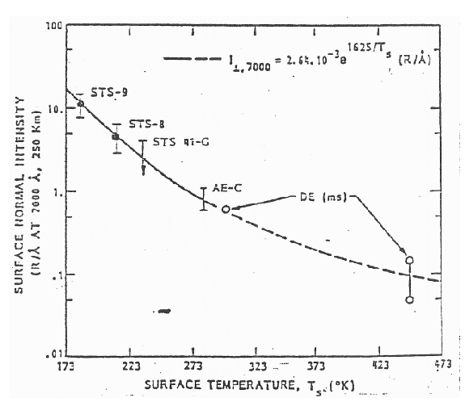

Figure 7-5 Ram Glow Intensity at 7000 Å Normalized to 250 km as a Function of Temperature for Several Satellites and STS Missions (Swanson et al., 1986)

All of these early observations led to the formulation of possible glow mechanisms. By now, it is clear that the glow is caused by the interaction of the spacecraft surfaces and the LEO environment. In particular, atomic oxygen appears to be a major factor in the glow process. Several theories have been presented in a variety of publications. For simplicity, only the most widely accepted mechanisms will be discussed in the following sections.

- 0.3.4 Glow Mechanisms

Spectroscopic data obtained from early satellites and confirmed by later Shuttle missions tends to suggest that the spacecraft/atmosphere induced glow was not line emissions. It was more likely that the emission was broadband and nearly continuous in the visible region of the spectrum with the most intense glow in the red. Although the mechanisms for spacecraft glow are not well understood, several theories have been formulated, and may indeed suggest that several processes may be going on simultaneously. The most important of these theories are presented below.

- 0.3.5 Atomic Nitrogen Recombination in Excited N2*

In this scenario, atmospheric N2, with a collisional energy of 9.3 ± 2 eV, can dissociate (dissociation energy = 9.8 eV) upon collision with a LEO spacecraft surface. The dissociated atoms remain adsorbed to the surface and migrate over the surface. In the Langmuir-Henshelwood (LH) type process, they subsequently react and remain on the surface. The Rideal type process occurs when the amount of adsorbed atoms is large enough that incident atoms are likely to collide with an adsorbed atom. This process forms a molecule which then escapes to the gas phase. Obviously, the escaped molecule’s level of excitation will depend on the exothermicity of the reaction and the surface characteristics. Because this interaction time is short (~1012 sec) and little accommodation with the surface occurs, the molecule can possess a large fraction of its binding energy.

Some fraction of the excited N2 molecules formed in the Rideal type process will leave in the A3²u+ state. In a collisionless environment (mean free path on the order of kilometers in this case) the excited A state molecules will radiatively decay into the lower B state as shown in Figure 7-6. The lifetime of the A-B transition is in the 10-2 to 10-4 sec range. Once the molecule in the B state, it rapidly (6-8 µsec) radiates

back into a lower vibrational level of the A state. This fast transition gives rise to the First Positive band in the N2 molecule.

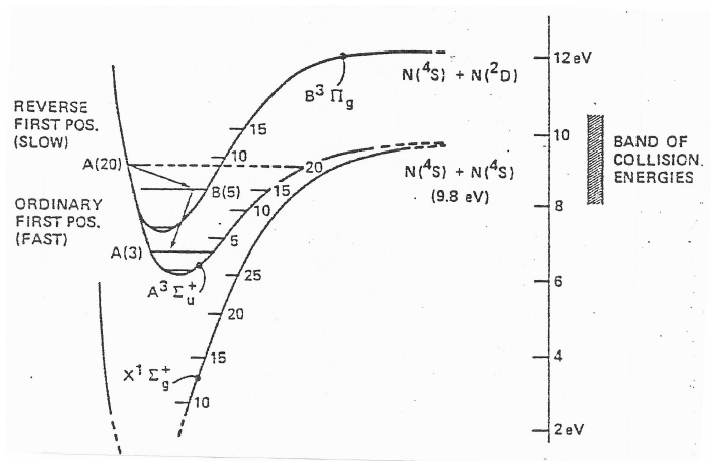

Figure 7-6 N2 Recombination Glow Mechanism. First Positive Emission Arises from the B State Molecules Rapidly Radiating Back Into Lower Levels of the A State (Green, 1984).

This First Positive band system was indeed identified by Torr and Torr on the Spacelab1 Shuttle mission using the Imaging Spectrometric Observatory (ISO). This was measured with the instrument looking tangentially away from the earth and into the velocity vector. The spectrum contained bright molecular bands between 6400 Å and 8000 Å attributed to the N2 First Positive system as shown in Figure 7-7. Recall that Conway et al. also reported N2 LBH emission in the far UV on the S3-4 satellite. This involves a transition from the excited 1Πg state to the ground X1²u+ state. The excitation into the 1Πgstate is assumed to occur when an incident gas phase N2 molecule is excited electronically in a collision with a desorbed N2 molecule.

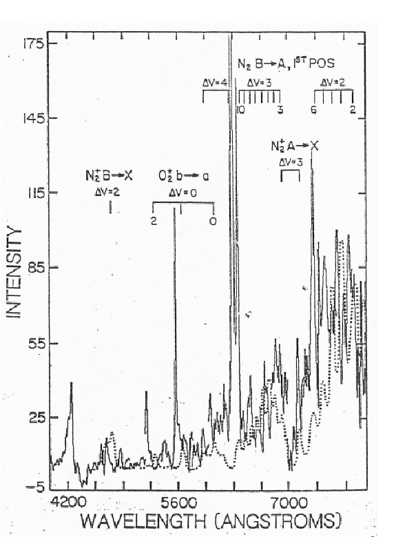

Figure 7-7 Comparison of ISO (Spacelab 1) Visible Glow Spectrum with Laboratory Measured Spectrum of the N2 First Positive Band (Torr and Torr, 1985).

0.3.6 Vibrationally Excited OH Molecules

The small satellite data base collected from the AE-C,E, DE-B, S3-4, and others suggest that OH emission is the source of the surface glow. Vibrationally excited OH is formed by the chemical reaction of energetic atomic oxygen and H on the surface by

##### ( ) ( )

O P + H O abs2 ( ) → OH +OH .8eV endothermic (1.14)

3

( ) ( )

O 3P + R − H → R +OH nearly resonant (1.15)

where R-H represents some hydrocarbon bond typical in surface construction or contamination. OH Meinel bands have been observed on small satellite glow spectra which can be relatively intense and are extremely strong in the terrestrial nightglow. The data obtained from Yee and Abreu at 6563 Å and 7320 Å correspond with the v=6 to v=1 and the v=8 to v=3 vibrational transitions of the Meinel bands respectively. These transitions have lifetimes of 6 msec (v=6 to 1) and 4 msec (v=8 to 3) which agree quite well with that estimated to produce the AE satellite glow by Yee and Abreu.

The fact that the glow intensity for the AE satellites above 160 km scales only with [O] suggests that the glow process is not produce merely by indiscriminate energy absorption. This conclusion was drawn based on the fact that the glow intensity did not vary with the increase in 9 eV N2 molecules. Below 160 km,

Slanger concludes that the glow varies as the concentration of 10 eV molecular oxygen. Since there is less

- O2 than O at these altitudes, the assumption is that OH is produced more efficiently by 10 eV O2 than by 5 eV O (3P).

Because the radiative lifetimes of the prominent Meinel bands in OH are much longer than those estimated for the Shuttle glow producers, OH excitation has been discounted as a possible Shuttle glow mechanism. Also, the OH spectral structure does not agree with the mostly structureless glow emission characteristics found by most experiments to date. OH excitation still remains a strong possibility for the production of small satellite glow.

- 0.3.7 NO2 Recombination Continuum

Shuttle glow is now considered a multistep process where the spacecraft surface acts as a catalyst to the reaction, but is itself unaffected. In this process, atomic oxygen and molecular nitrogen impact the surface, and the N2 dissociates. Both the Rideal and LH type processes allow the adsorbed atoms to form NO either in the gas phase or on the surface. Ground state NO (X 2Π1/2,2/ 3) remaining on the surface (LH process) then react with a second atmospheric oxygen atom to form NO2 (A2B1) as shown in Figure 7-8. This gives rise to the continuum (superposition of many states) A2B1 X2A1emission which peaks near 6400 Å. It has been shown that if the NO2 retains 25% of the O atom ram kinetic energy, the thickness of the glow layer above Shuttle surfaces can be explained by this continuum emission.

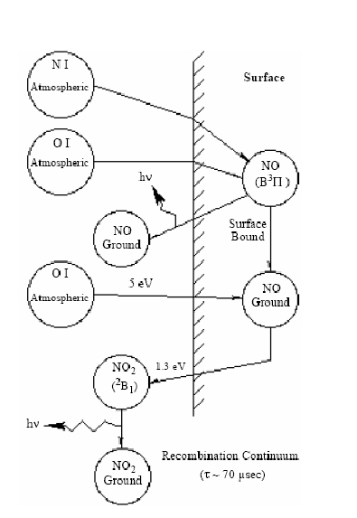

Figure 7-8 Schematic of Chemical Processes Resulting in the NO2 Continuum Emission

Assuming that the escaping NO molecules formed in the Rideal process are in the B 2Πr excited state, NO β-band emissions (B 2Πr X 2Π1/2,2/3) may also be observed above the spacecraft surfaces. Even though laboratory emission spectra of NO and NO2 match Shuttle data reasonably well, spectra taken from the Shuttle do not have the resolution required to identify these species conclusively. However, two groundbased studies have seen NO and NO2 emission bands in laboratory simulations of the NO+O reaction on a MgF2 surface. Furthermore, Arnold and Coleman found an emission spectrum peaking at 8200 Å for a collision of a low energy (0.16 eV) O atom beam with a pure nickel surface in the presence of NO. They concluded that the emission was consistent with the presence of electronically excited NO2 formed at the surface.

One final factor determining glow intensity discussed earlier was that of surface temperature. At lower surface temperatures, more ramming species would accommodate to the surface, and thus, adsorb a thicker NO layer. This would lend itself to a stronger glow intensity consistent with previous findings.

###### 0.4 Conclusions

Atomic oxygen present in the LEO environment is known to be the main contributor to material degradation and glow. It has been determined that organic materials react at much higher rates than even the most reactive metals. This is potentially devastating to a LEO spacecraft’s thermal protection coatings, optical instrument coatings, and structural components made out of lightweight carbon composites. Satellite glow is a potential problem for sensitive optical instruments designed to study faint sources. Optical contamination in the UV, IR, and visible regions must be dealt with on orbiting observatories.

Several factors influence the intensity of the observed glow above spacecraft. Their orientation to the ram direction, the altitude at which they orbit, and the temperature of their surfaces are some of the more important properties. Some common features between satellite glow and Shuttle glow have been established. For example, it is observed that the ram glow is maximized on surfaces facing into the ram direction, and the intensity of the glow decreases with increased altitude. On the other hand, some distinct differences have also been noticed. One of the most important differences is in the glow layer’s scale length. For satellites this value is 1 to 10 m above the surface; however, this value is only 20 cm for the Shuttle glow layer. This would indicate that different emitters are responsible for each glow. This is not all together unexpected since the local contamination environments and surface conditions are much different. Satellite surfaces are typically cleaner and remain in orbit longer (an aid in outgassing) than Shuttle surfaces.

Spectroscopic observations of satellite glow indicates that OH Meinel bands are the most likely source. Similar observations of Shuttle glow indicate that NO2 recombination, resulting in a continuum emission from excited states, is the most likely source. Both satellites and the Shuttle appear to also have glow associated with N2 bands in the wake. These processes are not well understood from a physical viewpoint. Much more work is needed in this area to enable spacecraft to operate more efficiently and with more sensitive instruments. The potential of such platforms as the HST, Shuttle, and space station makes these processes extremely important.

- 0.4.1 Spacecraft Protection

The preceding sections have documented the devastating effects of atomic oxygen exposure on spacecraft surfaces. Communication antennae, solar power arrays, thermal insulators, and scientific payloads are often sensitive to changes in absorptivity, reflectance, emissivity, and conductivity. Protective coatings and other means to reduce the effects of atomic oxygen attack have been developed. Coatings such as Boron Carbide, aluminum, and many silicon based substances provide adequate protection to composite materials, solar cells, and insulators. The most important part of protective coating design and handling lies in application of the coatings to surfaces. Studies have shown how coatings can be undercut at defect sites leading to cracking and loss of the coating material over wide areas.

It is clear from the results of many experiments that the effects of an atomic oxygen environment on spacecraft materials can not be ignored. Although the effects are serious for some important spacecraft materials, adequate protection can be provided for long term missions in LEO. Although this adds cost and weight to the LEO project, it is indeed necessary for successful missions.

- 0.4.2 Ground Based Space Simulation

Almost 90% of what we currently know about the LEO environment has come as a direct result of the Space Shuttle program. Erosion data from the three EOIM studies, the Solar Max satellite, and LDEF is irreplacable. However, research in ground based facilities have shown that the data may at least be

reproducible. The cost of sending even small satellites dedicated to material degradation research into orbit is high due to the need to have these satellites retrieved. Only a limited number of materials can be placed on a satellite making the certification of new, potentially useful materials a long process. Knowledge of the LEO environmental concentrations, electronic states, thermal velocity components, etc. is difficult to obtain during flight tests due to the limited amount of instrumentation which can be carried and placed in effective positions. Different conditions such as impact energy specie, and fluence can not be controlled or produced in LEO. All of these drawbacks present a case for ground based facilities.

- 0.4.3 Ground Based Facility Considerations

In ground-based facilities it is difficult to produce atomic beams with both high relative kinetic energies and large fluxes. Typically high energy facilities produce ions by a variety of methods which can be accelerated to the desired energies. The flux of ions produced by these methods can be on the order of LEO oxygen atom fluxes, but the mass selection, energy selection and charge neutralization processes required to produce the neutral, monoenergetic atomic beam often reduce the atomic flux by several orders of magnitude. These ion beams also tend to diverge due to space charging at energies below several hundred eV.

High flux facilities generally produce neutral atoms using rf/microwave dissociative discharges or plasma ashers. These production techniques produce atomic beams at nearly thermal energies although neutral fluxes of 1016 cm-2/sec are easily achieved. Recently a new generation of atomic beam facilities have been developed which offer energies and fluxes in the range of the LEO environmental atomic oxygen. These sources utilize the reflection of ions from metal surfaces and a laser-induced gas breakdown expansion through a nozzle. The only drawback to these facilities is that the high flux is only generated in small pulses lasting fractions of a second.

Because of the reactive nature of the atomic oxygen and oxygen ions produced in such facilities, some care must be taken in protecting sensitive components. Conductive materials are known to form highly insulative oxide layers which can affect a variety of things such as low level ion current measurements. Cathodes in gas discharges undergo bombardment by positive oxygen ions which can severely degrade the important surface layers resulting in reductions to secondary electron yields. These factors must be addressed when designing these systems.

Since the majority of atomic oxygen in LEO is in the ground (3P) state, facilities attempting to reproduce the LEO environment must produce ground state atomic oxygen. Metastable atomic oxygen (2D,2P) can interact in unique ways due to the excess energy stored in the excited electronic states. Because these are relatively long-lived states, they will be able to interact with the target material before releasing this excess energy by photon emission. The effects of metastable atoms may be significant enough so that a small fraction can have a large impact. Several facilities employ sophisticated techniques to ensure the production of only ground state atoms.

A final consideration in designing a LEO environment simulation facility is that of the facilities background pressure. Spacecraft surfaces in LEO experience a very low background pressure usually on the order of 10-8 Torr. Because of this low pressure, the surfaces are exposed to very few contaminants which can alter interaction processes. For example, a background pressure of molecular oxygen of approximately 10-4 Torr results in test surfaces being bombarded by a background flux of about 1016cm2/sec. The interaction energy of the background O2 is nearly thermal (0.01eV) and does not contribute significantly to the degradation observed in the material samples. However, the surface coverage rate is in excess of a monolayer of O2 per second which could significantly affect the reaction efficiency of the interaction by occupying active interaction sites on the sample surface.
