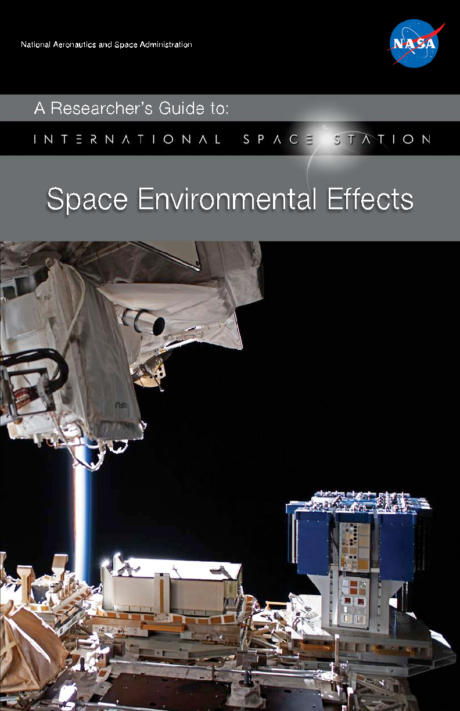

National Aeronautics and Space Administration

A Researcher’s Guide to:

# Space Environmental Effects

This International Space Station (ISS) Researcher’s Guide is published by the NASA ISS Research Integration Office.

Authors: Miria M. Finckenor Kim K. de Groh

Executive Editor: Bryan Dansberry Technical Editor: Carrie Gilder Designer: Cory Duke

Published: March 2015 Revision: September 2020

Cover and back cover:

- a. Materials International Space Station Experiment-Flight Facility with the MISSE-10, MISSE-11 and MISSE-12 MISSE Science Carriers (MSCs). This photograph was taken January 25, 2020, during ISS Expedition 61 and shows one of the wake MSCs in the open position.
- b. Scanning electron microscopy image of the back surface of a thin film layer of Kapton H after four years of low-Earth orbit (LEO) ram atomic oxygen erosion while on the exterior of the ISS as part of the MISSE-2 Polymer Erosion and Contamination Experiment (PEACE).
- c. Scanning electron microscopy image showing the microscopic cone texture that developed after four years of LEO ram atomic oxygen erosion of a pyrolytic graphite sample while on the exterior of the ISS as part of the MISSE-2 PEACE Polymers experiment.

## The Lab is Open

Soaring 250 miles above Earth, the ISS is a modern wonder of the world, combining the efforts of 15 countries and thousands of scientists, engineers and technicians. The ISS is a magnificent platform for all kinds of research to improve life on Earth, enable future space exploration and understand the universe. This researcher’s guide is intended to help potential researchers plan experiments that would be exposed to the space environment, while externally attached to or deployed from the ISS. It covers all the pertinent aspects of the space environment, how to best translate ground research to flight results and lessons learned from previous experiments. It also details what power and data are available on the ISS in various external locations.

|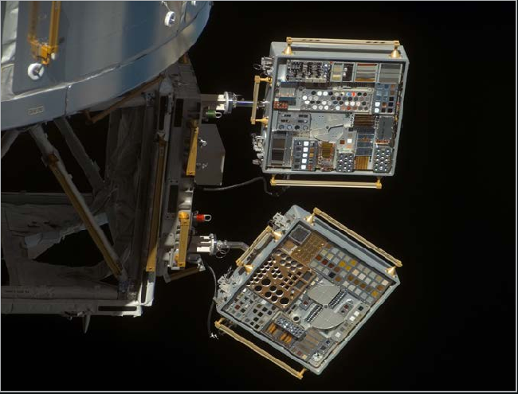|
|---|

Close-up view of the Materials International Space Station Experiment (MISSE) 6A and 6B Passive Experiment Containers (PECs) on the European Laboratory/Columbus. Photo was taken during a flyaround of STS-123 Space Shuttle Endeavor.

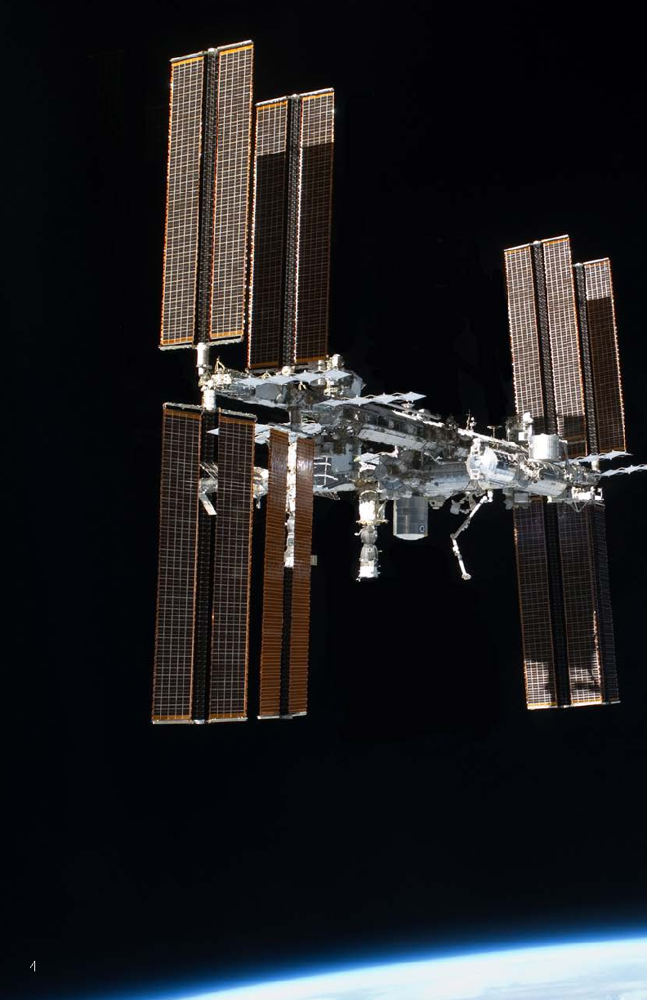

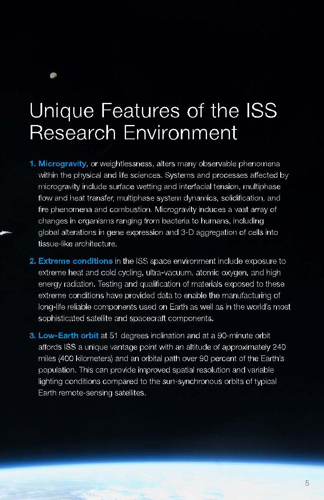

## Unique Features of the ISS Research Environment

- 1. Microgravity, or weightlessness, alters many observable phenomena within the physical and life sciences. Systems and processes affected by microgravity include surface wetting and interfacial tension, multiphase flow and heat transfer, multiphase system dynamics, solidification, and fire phenomena and combustion. Microgravity induces a vast array of changes in organisms ranging from bacteria to humans, including global alterations in gene expression and 3-D aggregation of cells into tissue-like architecture.
- 2. Extreme conditions in the ISS space environment include exposure to extreme heat and cold cycling, ultra-vacuum, atomic oxygen, and high energy radiation. Testing and qualification of materials exposed to these extreme conditions have provided data to enable the manufacturing of long-life reliable components used on Earth as well as in the world’s most sophisticated satellite and spacecraft components.
- 3. Low-Earth orbit at 51 degrees inclination and at a 90-minute orbit affords ISS a unique vantage point with an altitude of approximately 240 miles (400 kilometers) and an orbital path over 90 percent of the Earth’s population. This can provide improved spatial resolution and variable lighting conditions compared to the sun-synchronous orbits of typical Earth remote-sensing satellites.

## Table of Contents

###### Unique Features of the ISS Research Environment 5 Research Priorities for Space Environmental Effects on the ISS 7 Aspects of the Space Environment 10

Vacuum 10 Atomic Oxygen 10 Ultraviolet Radiation 12 Particulate or Ionizing Radiation 13 Plasma 14 Temperature Extremes and Thermal Cycling (Coefficients of Thermal Expansion [CTE] Mismatch) 14 Micrometeoroid/Orbital Debris Impact 15

###### Orientation and Location on the ISS 17 Approaches to Mitigate Contamination 18 Lessons Learned 20

Plan for Flight Recovery Contingencies 20 Control Samples and Preflight Testing 20 Understand Sample Geometry 21 Other Lessons Learned 23

###### Developing and Flying Research to the ISS 24 ISS External Accommodations 26

Japanese Experiment Module Exposed Facility (Japan Aerospace Exploration Agency [JAXA]) 26 Multi-Purpose Experiment Platform (MPEP [JAXA]) 27 JEM Small Satellite Orbital Deployer (J-SSOD [JAXA]) 28 EXPRESS Logistics Carrier (NASA) 28 Materials International Space Station Experiment Flight Facility (MISSE-FF) (Alpha Space/NASA) 29 Bartolomeo Columbus External Payload Facility (European Space Agency) 30 Russian Segment External Facilities (Russian Space Agency Roscosmos) 31

###### Funding, Developing, and Launching Research to ISS 32 Citations 34 Acronyms 37

## Research Priorities for Space Environmental Effects on the ISS

Scientists and engineers have developed advanced materials for manned spacecraft and satellites for a range of sophisticated applications in space exploration, transportation, global positioning, and communication. The materials used on the exterior of spacecraft are subjected to many environmental threats that degrade many materials and components. These threats include vacuum, solar ultraviolet (UV) radiation, charged particle (ionizing) radiation, plasma, surface charging and arcing, temperature extremes, thermal cycling, impacts from micrometeoroids and orbital debris (MMOD), and environment‑induced contamination. In terms of materials degradation in space, the low‑Earth orbit (LEO) environment, defined

- as 200‑1,000 km above Earth’s surface, is a particularly harsh environment for most non‑metallic materials because single‑oxygen atoms (atomic oxygen [AO]) are present along with all other environmental components (Yang and de Groh, 2010). Space environmental threats to spacecraft components vary greatly, based on the component materials, thicknesses, and stress levels. Also to be considered are the mission duration and the specific mission environment, including orbital parameters for the mission, the solar cycle and solar events, view angle of spacecraft surfaces to the sun, and orientation of spacecraft surfaces with respect to the spacecraft velocity vector in LEO (Dever et al., 2005). Examples of AO erosion and radiation‑induced embrittlement of spacecraft materials are provided in Figures 1 and 2.

|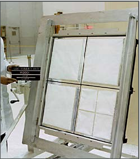|
|---|

|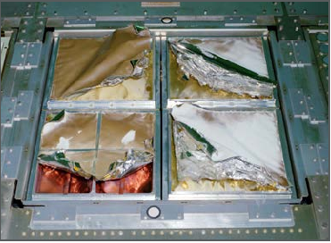|
|---|

Preflight

Postflight

- Figure 1. Preflight and postflight Long Duration Exposure Facility M0001 Heavy Ions in Space experiment, indicating atomic oxygen erosion and ultraviolet degradation.

|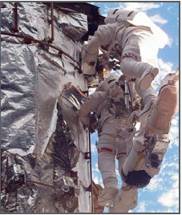|
|---|

Large radiation-induced cracks in the outer layer of multilayer insulation after years of space exposure (Townsend et al., 1999).

|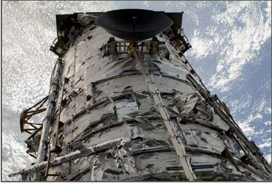|
|---|

Severe degradation to the aluminized-Teflon®outer layer of multilayer insulation after 19 years of space exposure (Yang and de Groh, 2010).

- Figure 2. Space-exposure damage to Hubble Space Telescope multilayer insulation.

Determining how long‑term exposure to space conditions impacts various materials and which materials are therefore best suited for spacecraft construction can most effectively be accomplished through actual testing in space. Although space environment effects testing can be conducted in ground‑laboratory facilities, ground facilities often do not accurately simulate the combined environmental effects, so do not always accurately simulate the level of performance or degradation observed in the space environment. The next section of this document discusses each aspect of the space environment and what ground simulation methods translate best to actual flight results. However, the synergism of all the elements of the space environment is difficult to duplicate on the ground. Therefore, actual spaceflight experiments provide the most accurate spacecraft durability data. Materials spaceflight experiments to evaluate the environmental durability of various materials and components in space have been conducted since the early 1970s, including 57 experiments on the Long Duration Exposure Facility (LDEF), which was retrieved in 1990 after spending 69 months in LEO (de Groh et al., 2011).

The ISS provides an ideal platform for long‑term space environment effects testing, particularly since experiments can be returned to Earth for postflight analyses. The Materials International Space Station Experiment (MISSE) is a series of materials flight experiments, the first two of which were delivered to the ISS during STS‑105 in 2001 (de Groh et al., 2008; de Groh et al., 2009; de Groh et al., 2011, Finckenor et al. 2013). Consisting of a pair of trays hinged together like a

suitcase (called a Passive Experiment Container [PEC]) and containing an array of individual experiments, the PEC was attached to the exterior of the ISS, providing long‑duration exposure to space conditions. In the MISSE suite (MISSEs 1 through 8), 10 PECs (and one smaller tray), together containing thousands of samples, were flown in various external locations on the ISS. In the post‑Shuttle Era, the MISSE missions are now being flown on the MISSE‑Flight Facility (MISSE‑FF), a permanent external material science platform located on the ISS EXPRESS Logistics Carrier‑2 Site 3 (ELC‑2 Site 3).

With participants from NASA, the Department of Defense, industry, and academia, MISSE is the longest running multi‑organization technology, development and materials testing project on the ISS. It has provided many tangible benefits for the agency and its partners, with flight data affecting many space programs. Like LDEF, MISSE flight data have provided a great wealth of space performance and environmental durability information and many lessons learned beneficial to further investigators (Banks et al., 2008). Published MISSE data, photographs and some raw data files are being gathered in a MISSE database in the Materials and Processes Technical Information System (MAPTIS).

Prospective researchers should register for an account on MAPTIS, found at http://maptis.nasa.gov/. MAPTIS contains a wealth of information for designers and materials engineers, particularly the Materials Selection Database. This is a useful reference to consult before building hardware so that safety, structural, pressure vessel and line, fracture‑critical, and contamination requirements are met. This database is open to all registered users and holds 50 years of analyzed results of tests conducted on metallic and nonmetallic materials:

- • Metals data include analyzed results of tests relevant to corrosion, crack growth, creep rupture, flammability, fluid compatibility, fracture mechanics, frictional heat, high‑cycle fatigue, low‑cycle fatigue, mechanical impact, particle impact, pneumatic impact, promoted ignition, stress corrosion, and tensile strength. A list of manufacturers is also provided.
- • Nonmetals data consist of test results, including flammability, fluid compatibility, odor, outgassing (thermal vacuum stability), toxicity (offgassing), and vacuum condensable material compatibility with optics (VCMO).

Materials data relevant to spacecraft design may also be found in Silverman (1995). This guidebook gathered many materials experiments’ results from the LDEF, short‑duration shuttle flights and selected ground simulations.

## Aspects of the Space Environment

Vacuum

The hard vacuum of space (10‑6 to 10‑9 torr) will cause outgassing, which is the release of volatiles from materials. The outgassed molecules then deposit on line‑of‑sight surfaces and are more likely to deposit on cold surfaces. This molecular contamination can affect optical properties of vehicle and payload surfaces and spacecraft performance, particularly for sensitive optics. To mitigate this problem, the ISS has specified in NASA SSP 30426, Space Station External Contamination Control Requirements, what the limits are for molecular deposition, induced molecular column densities, and the release of particulates.

An investigator must compile a list of all materials used in a flight experiment and submit this list for a timely review. NASA maintains a database of test results from ASTM E1559, Standard Test Method for Contamination Outgassing Characteristics of Spacecraft Materials, and the older ASTM E595, Standard Test Method for Total Mass Loss and Collected Volatile Condensable Materials from Outgassing in a Vacuum Environment. Material identification, location, vacuum exposed surface area, operating temperature range, and condensable outgassing rate data are used by the ISS Program’s return flux model to calculate any impact to the vehicle (Soares and Mikatarian, 2003). A material known to outgas should be thermal vacuum baked for a minimum of 24 hours at a temperature above that expected in orbit or, if that is not known, at 100°C. Assemblies may be thermal vacuum baked prior to flight.

Vacuum is one component of the space environment that translates well between ground simulation of 10‑6 to 10‑9 torr vacuum and flight.

Atomic Oxygen

AO is produced when short‑wavelength UV radiation reacts with molecular oxygen in the upper atmosphere. It is the most significant component of the space environment at ISS altitude in terms of material degradation. AO oxidizes many metals, especially silver, copper, and osmium. AO reacts strongly with any material containing carbon, nitrogen, sulfur, or hydrogen bonds, meaning that many polymers react and erode. Polymers containing fluorine, such as Teflon®, react synergistically, meaning that the reactivity to AO increases with longer exposure to UV radiation (Pippin et al., 2004). Even materials with AO protective coatings can degrade because of AO undercutting erosion at protective coating defect sites (Figure 3; Banks et al., 2004).

|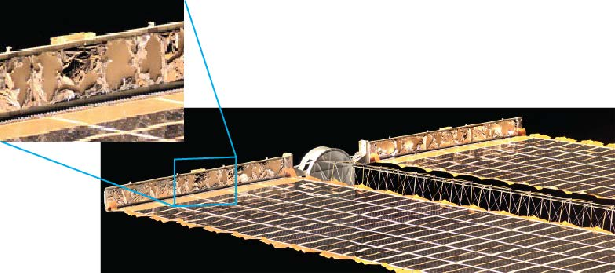|
|---|

- Figure 3. Image shows atomic oxygen undercutting degradation of the solar array wing blanket box cover on the International Space Station after one year of space exposure.

The AO exposure characterized by the fluence (atoms/cm2) to an experiment will depend not only on the orientation and spacecraft altitude but also on the solar activity at the time of flight. There can be an order of magnitude difference in AO flux between solar maximum (higher flux) and solar minimum (lower flux) and significant variation between solar cycles. (Samwel, 2014). An experiment to determine AO reactivity, also known as erosion yield (cm3/atom), of materials needs an exposure that is long enough for measureable erosion to occur. Software such as the Mass Spectrometer Incoherent Scatter (MSIS) Model can be used to estimate the AO fluence for a particular mission, which is then used to determine whether the experiment will receive a high enough level of AO for the desired measurements and whether the sample thickness is sufficient if the expected fluence is high.

Translating ground simulation results to flight depends heavily on the source of AO used in the laboratory. AO in orbit is ~5.2‑eV energy, principally resulting from the ISS orbital velocity. Plasma ashers create AO but also produce heating, intense Lyman‑alpha UV radiation, and a significant percentage of ions rather than just neutral atoms. In addition, the arrival direction of AO may vary more than in space. These differences may give erroneous results, particularly for polymers with low glass transition temperatures. Stambler (2011) compared ground simulation to flight results for 40 different polymers, and the erosion yield in the plasma asher was higher than that in space for every material. Thermal energy AO sources eliminate the heating problem but do not have the necessary energy to break some chemical bonds and may need a much higher fluence to replicate the same erosion in orbit.

AO beam facilities may use laser‑detonation or microwave sources to generate AO

- at energies close to that at ISS altitude. For polymers that do not contain fluorine, simulations in these facilities are generally close to flight, with the AO reactivity

being ±10 percent. Polymers with fluorine are more sensitive to the UV generated simultaneously with the AO and consequently have a higher reactivity in the beam facility than observed in orbit.

In general, laboratory results are normalized to flight results by flying materials with known reactivity to AO in addition to the test samples. Kapton® H and Kapton® HN polyimide are the most common materials selected for this purpose; polyethylene, polypropylene, and pyrolytic graphite have also been used. Following ASTM E2089, Standard Practices for Ground Laboratory Atomic Oxygen Interaction Evaluation of Materials for Space Applications, can reduce variability in results.

#### Ultraviolet Radiation

Earth’s atmosphere filters out most of the sun’s damaging light, but ISS materials bear the brunt of solar photon damage. While AO may bleach materials, UV generally darkens them (Figure 4), particularly in the presence of contamination. UV radiation also damages polymers by either cross‑linking (hardening) or chain scission (weakening). UV under high vacuum can also create oxygen vacancies in oxides, leading to significant color changes.

Normalizing ground simulations to flight results is very dependent on the material and the type of lamp used, whether deuterium, mercury, or mercury‑xenon and the intensity of the lamp (number of suns). Accelerated UV testing may also cause material heating, so the accuracy of a simulation may depend on whether the sample temperature is controlled or not. Any UV exposure on the ground should be performed with the samples in vacuum. Also, any near‑UV source such as a mercury‑xenon lamp, which if not integrated into the vacuum system, should

|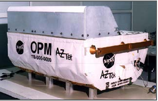|
|---|

|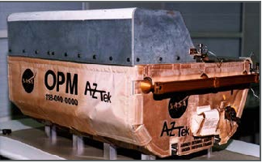|
|---|

Preflight

Postflight

- Figure 4. Preflight and postflight images of the Optical Properties Monitor shown with ultraviolet-darkened insulation after nine months of exposure on the Mir Space Station.

illuminate the samples through a UV‑grade window. For exposure of metal oxides, consider the ability to make in‑situ reflectance measurements after vacuum UV ground exposures, as atmospheric oxygen has been observed to reverse the effects of oxygen vacancies.

#### Particulate or Ionizing Radiation

The three main sources of charged particle radiation naturally occurring in space are galactic cosmic rays, solar proton events, and the trapped radiation belts. For most materials on the ISS, the effects of AO and UV can overshadow any effects by particulate radiation. Depending on the polymer, particulate radiation can result in cross‑linking or chain scission, similar to damage by UV, resulting in polymer embrittlement. A greater effect is seen in avionics, namely single‑event upsets, bit errors, and latch‑ups. This risk can be mitigated by selecting avionics that are “rad hard” or by placing shielding around the electronics. Radiation effects may also be alleviated by using error‑correction circuitry and triple‑module redundancy, where two good process results “outvote” a corrupted one. Most of the particulate radiation dose to the ISS occurs when flying through the South Atlantic Anomaly (Figure 5) and is in the form of electrons, although proton dose can be significant for some materials and components.

|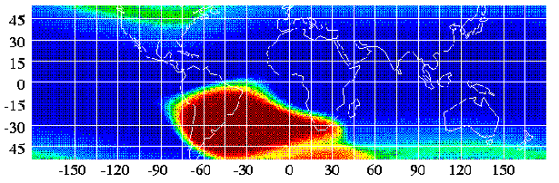|
|---|

- Figure 5. Charged particle map shows the South Atlantic Anomaly. (Credit: S.L. Snowden, http://heasarc.gsfc.nasa.gov/ docs/rosat/gallery/misc_saad.html)

Laboratory results can be normalized to flight results by understanding the dose‑depth profile of radiation for the maximum effect on that material. For example, radiation testing of a thermal control coating that is 3 to 5 mil thick could include electrons and protons in the 40‑ to 700‑keV range. Particles in this energy range would have the most effect on optical properties and coating chemistry, while higher energy particles would pass through the coating and affect the substrate.

Conversely, higher‑energy particles (in the 1‑ to 70‑MeV range) have been used to study single‑event upsets (Swank et al., 2008), whereas the lower‑energy particles would not have much of an effect.

#### Plasma

Similar but separate from the higher energy particulate radiation is space plasma. The plasma environment around the ISS is composed of approximately equal amounts of positively charged oxygen ions (O+) and free electrons varying with solar activity and altitude. Because of the differences in spacecraft velocities, ion thermal energy, and electron thermal energy, electrons can impact any spacecraft surface, while ions can only impact ram (leading edge) surfaces. This disparity can lead to a negative charge buildup, which can lead to ion sputtering, arcing, and parasitic currents in solar arrays, as well as re‑attraction of contamination (James et al., 1994).

Examples of experiments that would be affected by the plasma environment would be high‑voltage solar arrays and conductive coatings designed to bleed off static charge on a spacecraft. A principal investigator for such an experiment would need to work in conjunction with the Spacecraft Charging Assessment Team at NASA’s Johnson Space Center (JSC). Specific information about the plasma environment around the ISS can be provided through operation of the Floating Potential Measurement Unit. ISS plasma conditions may be modeled in the laboratory with a hollow cathode plasma source to create a low‑density (106/cm3), low‑temperature (≤1‑eV electron temperature) plasma. Argon is often used, but some sources may use xenon, oxygen or helium.

#### Temperature Extremes and Thermal Cycling (Coefficients of Thermal Expansion [CTE] Mismatch)

As the ISS moves in and out of sunlight during its orbit around Earth, the degree to which a material experiences thermal cycling temperature extremes depends on the following:

- • its thermo‑optical properties (solar absorptance and thermal emittance)
- • its view of the sun
- • its view of Earth
- • its view of other surfaces of the spacecraft
- • durations of time in sunlight and in shadow
- • its thermal mass and the influence of equipment or components that produce heat (Dever et al., 2005).

A rule of thumb for these cyclic temperature variations is ‑120°C to +120°C, but high solar absorptance with low infrared emittance will contribute to greater temperature swings. Large areas of material with poor thermal properties may not be allowed on the ISS because of exceeding touch temperature limits for the astronauts’ gloves.

|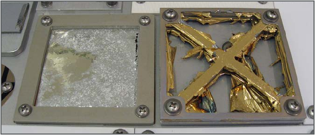|
|---|

- Figure 6. Postflight photograph displays thin film samples from the Materials International Space Station Experiment-4 with catastrophic failure of both coatings related to combined thermal cycling and atomic oxygen erosion.

Protective coatings may degrade in the ISS environment if there is a mismatch in the CTE between the coating and the substrate. Sixteen thermal cycles a day (the ISS orbits Earth approximately once every 92 minutes) may lead to cracking, peeling, spalling or formation of pinholes in the coating, which then allows AO to attack the underlying material (Figure 6).

##### Micrometeoroid/Orbital Debris Impact

All areas of a spacecraft have the potential to be struck by micrometeoroids traveling

- as fast as 60 km/s. Surfaces facing the ram direction are more likely than those in the wake direction to be hit with space debris, traveling at an average velocity of 10 km/s.

Space debris varies with the solar cycle: as the Sun’s activity increases, the atmosphere heats up, increasing the drag on space debris in orbit. Large space debris are tracked so that the ISS can perform avoidance maneuvers, but there is no current way to avoid small debris impacts. Most of the impacts on returned experiments have been small, creating ≤0.5‑mm diameter craters. The first two Materials International Space Station Experiments (MISSE‑1 and MISSE‑2)

|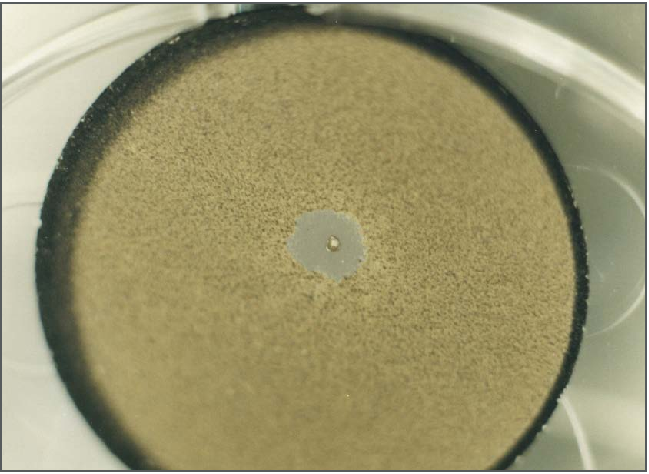|
|---|

- Figure 7. A micrometeoroid or orbital debris impact results in a 0.6-mm diameter crater and approximately 3-mm diameter spall (loss of the coating). 2.54 cm diameter Tiodize coating on titanium flown on the Long Duration Exposure Facility A0171 experiment.

averaged less than two impacts/ft2/year (Pippin 2006), with a much smaller shielding factor from the then‑incomplete ISS structure.

As more space debris is added to the environment, however, the impact risk changes. For example, the deliberate fragmentation of the Fengyun 1‑C spacecraft in 2007 and the collision between the Iridium 33 and Cosmos 2251 satellites in 2009 increased the trackable space debris by 60 percent. As a result of these two events, the number of untrackable particles may have increased by 250,000 or more (Orbital Debris Quarterly News, 2010).

Micrometeoroid or space debris impacts on an experiment may crater the material, spall off a coating (Figure 7), or short out a solar cell. It would be difficult to shield an experiment from impacts and still have it exposed to the rest of the space environment, but the debris environment (at time of publication) is relatively benign since it typically affects a very small area of exposure. Similarly, if an experiment will be testing various space debris shielding designs, it needs a large, unshielded area in space for a long time. Laboratory testing is usually conducted with slower velocities (<8 km/s) than those found in orbit, so it may not model vaporization, spalling, or penetration accurately. Analysis tools such as the Smooth Particle Hydrodynamic Code are available and used to predict impact effects. These tools have been verified only to the velocity limit of current ground test facilities.

## Orientation and Location on the ISS

The orientations of materials experiments are typically in the ram, wake, zenith, and/ or nadir directions. Ram refers to the velocity vector of the vehicle and has the greatest fluence of AO. Zenith, which points into space in the opposite direction of Earth, has the most solar illumination. Wake and nadir are the opposing faces of ram and zenith, respectively. The wake direction is good for studying UV effects, with typically an order of magnitude less AO as the ram direction, and some experimenters may wish to fly duplicate samples (ram‑ and wake‑facing) to differentiate between AO and UV effects. A nadir orientation is desired for Earth‑viewing experiments, though depending on the location on ISS, Earth viewing may be blocked.

Note that the wake direction does not mean “no AO.” During a nominal orbit, the ISS currently flies in what is called a local vertical, local horizontal (LVLH) frame, with the X‑axis in the velocity vector (+XVV; Figure 8, NASA SSP 50699‑03, ISS Certification Baseline Volume 3: Flight Attitudes). Pitch, yaw and roll are all held

- at zero, so the pressurized mating adapter 2 (PMA‑2) always faces exactly forward along the velocity vector. During supply vehicle docking and undocking, the ISS may be pitched ‑90° so PMA‑2 faces exactly nadir and, during this orientation, wake surfaces can receive AO flux.

|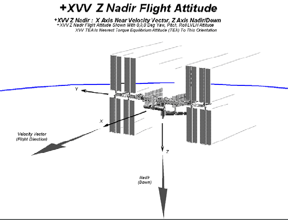|
|---|

- Figure 8. +XVV Z nadir flight attitude.

## Approaches to Mitigate Contamination

Contamination in both molecular and particulate form can compromise numerous types of experiments (materials, optical devices, etc.), as well as affect line‑of‑sight surfaces on the ISS. As mentioned earlier, the ISS has specified in NASA SSP 30426 what the limits are for molecular deposition, induced molecular column densities, and the release of particulates. The MAPTIS database for thermal vacuum stability (TVS) may assist in choosing materials with low outgassing rates.

If there is no substitute for a higher outgassing material, a thermal vacuum bakeout may be performed during assembly to meet ISS outgassing requirements. The bakeout should be at a higher temperature than expected in orbit in a vacuum of 10‑6 torr or better and for at least 24 hours or until a temperature‑controlled quartz crystal microbalance (TQCM) in the vacuum chamber indicates no more evolving material. Silicone materials that have not been vacuum‑baked can frequently contain short chain molecules that are volatile and readily transported onto neighboring surfaces. When these contaminated spacecraft surfaces are exposed to AO in LEO, the silicones oxidize to form silica (or silicates). Hydrocarbons can also be trapped on the surface during this process. The resulting deposit can form an AO‑protective coating that can darken as a result of further solar radiation exposure. This contamination can also skew erosion yield measurements, increase solar absorptance and irreparably damage optical materials.

|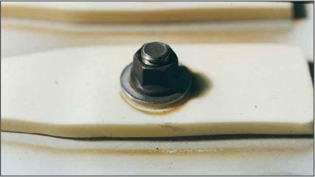|
|---|

- Figure 9. Postflight photograph shows a room temperature vulcanization sample from the Long Duration Exposure Facility A0171 experiment with deposited silicone contaminant on baseplate and sample. Also note oxidized silver fastener.

One such case was the room temperature vulcanization (RTV) 511 samples of an LDEF experiment (Figure 9). The sheet of RTV 511 was baked out for a short time, which was inadequate, and then the samples were cut out of the sheet, exposing fresh material. The holes drilled for fastening also exposed new material, with outgassed deposits seen in rings on top of the sample.

Along with thermal vacuum bakeout and proper materials selection, another approach to mitigate contamination is to be aware of the line of sight to sensitive optics and to design vent paths accordingly. If purges or dumps are necessary to an experiment, they must not cause any damage to the ISS surfaces from either direct or subsequent orbital impingement. NASA SSP 30426 also specifies that the limit on particulate generation from an experiment is to be 1 particle (≥100‑µm diameter) per orbit per 1x10–5 steradian field of view as seen by a 1‑m diameter aperture telescope. This particulate generation requirement also applies to moving parts and vents.

## Lessons Learned

Plan for Flight Recovery Contingencies

Historically, few materials experiments have been returned to Earth after the time planned. The LDEF was planned for a 9‑ to 12‑month mission; the Challenger accident left it in orbit for 5.8 years. MISSEs‑1 and ‑2 were expected to fly for one year; the Columbia accident extended that to nearly four years. Planning for every contingency may not be possible, but samples should be chosen to provide the needed science, even if return is significantly delayed.

Control Samples and Preflight Testing

Researchers should be prepared to perform as much preflight analyses as possible on duplicate sets of flight and control samples. It may not be possible to have a control sample for every flight sample, but there should be at least one control sample retained for each material, orientation, surface treatment, etc.

The control samples should be maintained appropriately during the experiment flight; e.g., bagged in nitrogen or held in a desiccator out of direct sunlight. Many polymers, such as Kapton®, are hygroscopic (absorbing up to two percent of their weight in moisture) and can fluctuate in mass with humidity and temperature.

Therefore, for accurate mass loss measurements to be obtained, it is necessary that the samples be fully dehydrated immediately before measuring the mass both preflight and postflight. Ideally, this is done by dehydrating the samples in a vacuum desiccator maintained at a pressure of ≤13.3 Pa (≤100 millitorr) with a mechanical roughing pump for a minimum of 72 hours. Four days are recommended. Samples should be removed one at a time and the desiccator pumped back down after a sample is removed to keep other samples under vacuum.

Records should be kept of the following data:

- • sequence of sample weighing
- • number of samples in each set (if a multilayered sample)
- • time under vacuum before weighing
- • temperature and humidity in the room
- • the time air was let into the desiccator and the time a sample was taken out of the desiccator
- • time of each weighing, with a minimum of three measurements taken as quickly as possible
- • mass

Typically, measurements are averaged or they can be back‑extrapolated to time zero (when air is first introduced into the desiccator). A balance with at least 0.01‑mg readability is needed.

A faster method is to place one sample at a time in a vacuum desiccator and pump down to a pressure of exactly 6.67 Pa (50 mtorr). When 6.67 Pa is reached, the timer is started at the same moment the chamber is vented. The sample is quickly removed from the chamber and placed on the balance. Mass measurements are taken every 30 seconds for 5 minutes; then regression analysis is used to calculate the mass at time zero. This method should be used only with a small vacuum chamber that can be vented quickly and opened easily. The same procedure and sequence should be repeated with the same samples postflight.

In addition to dehydrated mass measurements, some suggested preflight analyses include normal and black‑light photography, thickness measurements for erosion yield calculations, surface roughness, bi‑directional reflectance distribution function (BRDF), transmission, ellipsometry, solar absorptance, infrared emittance, electrical conductivity and solar cell current‑voltage curves. These non‑destructive tests can then be repeated postflight, minimizing any uncertainties related to equipment calibration or even use of different equipment after flight.

Experiments that are not well planned or that occur at the last minute risk yielding poor data, so designs, materials selections, and analyses should be completed well in advance of experiment integration activities.

#### Understand Sample Geometry

The geometry of sample holders can influence the flux of AO. Commonly used passive Evaluation of Oxygen Interaction with Materials (EOIM)/MISSE and MISSE‑ FF sample trays have chamfered circular apertures that allow AO to scatter from the chamfered surfaces onto the samples, thus locally increasing the flux impacting the samples, as shown in Figure 10 (Banks et al.,

|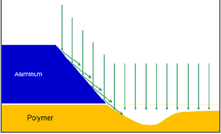|
|---|

- Figure 10. Flux concentration from chamfered Evaluation of Oxygen Interaction with Materials/MISSE/MISSE--FF sample holders.

|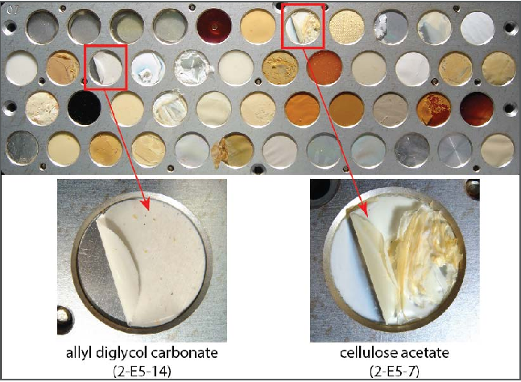|
|---|

- Figure 11. The MISSE-2 Polymer Erosion and Contamination Experiment tray is seen with samples peeling up on their lower-left sides.

2008). A consequence of the perimeter‑scattered AO is that the erosion around the sample perimeter is greater than in the central area. If the AO is arriving off normal, then there will be a variation in flux around the perimeter of each sample, depending on the scattering geometry. As can be seen in Figure 11 (de Groh et al., 2008; Banks et al., 2008), two MISSE‑2 samples peeled up from their lower left edges, and AO was found to be arriving at 8° from normal and coming from the upper right direction. Thus, there appears to be a flux concentration near the perimeter of the samples from the AO that was deflected off the chamfered surface.

Many MISSE trays, including the standard MISSE‑FF sample carriers, have circular 2.54‑cm‑diameter samples holders with a 45° chamfer edge. The maximum possible additional fluence for 2.54‑cm‑diameter samples (with a 45° chamfer and a 0.763 mm lip thickness) caused by AO scattering would be about 15 percent but is more likely around 3.3 percent. Therefore, the concern is not of a higher average

fluence, but instead of sample peeling and potential release before full sample erosion, which could lead to incorrect erosion yields.

The problem of flux concentration and premature peeling could be eliminated if a reverse chamfer were used on the sample holders, which would not allow scattering of AO onto the surface of the samples. A potential disadvantage of this approach would be the loss of intimate contact at the edge of the sample for profiling purposes, but this method would not be a concern for mass loss measurements.

#### Other Lessons Learned

Written instructions and procedures used for mounting and assembly of spaceflight hardware are almost always necessary to properly integrate an experiment as specified by quality assurance and flight documentation requirements. This step occasionally is glossed over by those tasked with final installation. Be clear about experiment or sample orientation (“this side faces space”) and properly label in red any “REMOVE BEFORE FLIGHT” covers.

Another lesson learned is that an experiment should be able to withstand the corrosive salt environment of Cape Canaveral or the Mid‑Atlantic Regional Spaceport while waiting for launch. The experiment should also be able to withstand the power being off, both on the ground and in space.

Some materials should not be flown in LEO. NASA‑STD‑6012, Corrosion Protection For Space Flight Hardware, section 4.6.2, states that cadmium plating and zinc plating shall not be used because of contamination concerns. Silver and osmium react strongly with AO and should not be used without a protective coating.

Some commercial off‑the‑shelf electronics may use “lead‑free” or pure tin components and soldering. This may lead to tin pest (tin plague) or tin whisker growth in orbit, potentially adversely affecting the electronics through the release of conductive particulate.

More lessons learned can be found in Banks et al. (2008) and on the NASA Lessons Learned database located at http://llis.nasa.gov.

## Developing and Flying Research to the ISS

The current external sites on the ISS for research include:

- • Bartolomeo platform attached to the Columbus module (Airbus/European Space Agency [ESA])
- • EXpedite the PRocessing of Experiments to the Space Station (EXPRESS) Logistics Carrier (ELC) (NASA)
- • Japanese Experiment Module External Facility (JEM EF) (Japan Aerospace Exploration Agency [JAXA])
- • JEM Small Satellite Orbital Deployer (J‑SSOD) (JAXA)
- • Materials International Space Station Experiment Flight Facility (MISSE‑FF) (Alpha Space/NASA)
- • Universal workstations with capabilities for re‑equipping (URM‑Ds), biaxial pointing platforms, magnetomechanical anchors/locks and portable working platform (Roscosmos).

More information about these facilities can be found in the section on ISS External Accommodations.

Experiment setup will depend on what the principal investigator wants to study. Issues to consider include the following:

- • Does the experiment need to be returned to Earth for analysis?
- • Are a power source and data downlink required; i.e., for active experiment activities such as testing solar cells?
- • Can the experiment be robotically deployed through the JEM airlock or from the SpaceX Dragon trunk?
- • Which environment is better suited for the experiment: ram for the most AO, zenith for the most UV radiation, wake for UV and little AO, or nadir for Earth‑observing?
- • How sensitive is the experiment to contamination?

Table 1 shows the wide variation in silica‑based contamination on surfaces from experiments placed at different locations on the ISS (Dever et al., 2006; Steagall et al., 2008). The ram‑facing surface of MISSE‑2 had two orders of magnitude less contaminant thickness than the three JAXA experiment units attached to the Russian Service Module. This difference is probably related to the total arrival of silicones based on each experiment’s respective view of, and distance from, contaminant sources on the ISS.

|Location|Contaminant thickness (nm)|Duration of exposure (yr)|Contaminant thickness/ year (nm)|
|---|---|---|---|
|MISSE-2, Tray 1: Ram facing|1.3 – 1.4|3.95|0.326 – 0.351|
|JAXA:  Unit 1, Ram facing Unit 2, Ram facing Unit 3, Ram facing |30.0 75.0 93.5|0.863 2.37 3.84|34.8 31.7 24.3|

Table 1. Silica-Based Contamination on International Space Station Experiment Surfaces.

Care must be taken to avoid self‑contamination of the experiment as well as to ensure that the experiment is out of the view of sources of silicone to be sure that AO does not produce silica deposits that can affect erosion yields or cause changes in solar absorptance.

The experiment must be strong enough to survive launch loads but not overdesigned with excess weight. Vibration and shock tests must be performed on the flight hardware, with the test levels dependent on the launch vehicle. Hardware must pass sharp‑edge inspection to ensure the hardware poses no snagging danger to a gloved and/or tethered astronaut on an Extravehicular Activity (EVA). Active experiments have to meet electromagnetic interference/electromagnetic compatibility (EMI/EMC) and grounding requirements so as not to interfere with the avionics and communications on the ISS. In addition, experiments will need to undergo a thermal‑vacuum bake‑out prior to flight.

Experiments should have adequate internal data storage capacity since no data storage capacity is available from the ISS. Some compression within the experiment may be needed for transmission of high volumes of data.

Pictures taken at various time intervals throughout the duration of the experiment can also provide valuable information as to experiment function and materials degradation. For example, Figure 12 is one of a series of monthly images taken during MISSE‑9 on the MISSE‑FF that indicates the tensile failure of samples in the GRC Polymers and Composites Experiment (de Groh and Banks, 2020).

|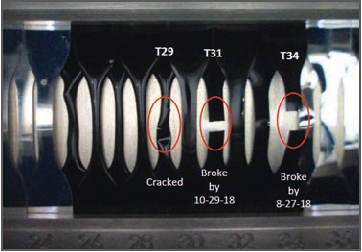|
|---|

- Figure 12. On-orbit image of the PCE wake carbon back-surface coated Teflon FEP tensile samples taken in December 2018 and showing cracked (T29) and broken (T31 and T34) samples. (Photo credit: Alpha Space)

## ISS External Accommodations

This section provides an overview of existing ISS External Facilities (EF) that are multidisciplinary in nature, providing access to multiple sites that are exposed to the space environment, and include structural attachment points and utility interfaces.

Japanese Experiment Module Exposed Facility (Japan Aerospace Exploration Agency [JAXA])

The JEM Exposed Facility (EF) is an unpressurized, multipurpose pallet structure attached to the JEM, or “Kibo,” meaning “hope” in Japanese (Figure 13). This external platform is used for research in the areas of communications, space science, engineering, technology demonstration, materials processing and Earth observation. Experiments can be monitored by six video cameras, two located on the JEM EF, two located externally on the JEM Pressurized Module and two on the JEM Remote Manipulator System (RMS).

The JEM EF is accessible from the internal pressurized volume of the ISS via the JEM Airlock. Articles interfacing with this structure are grappled and moved using the JEM RMS. The JEM EF is roughly 5.7 m x 5.0 m x 3.8 m, weighs approximately 4,000 kg, and includes utilities at each of the 12 attachment sites.

|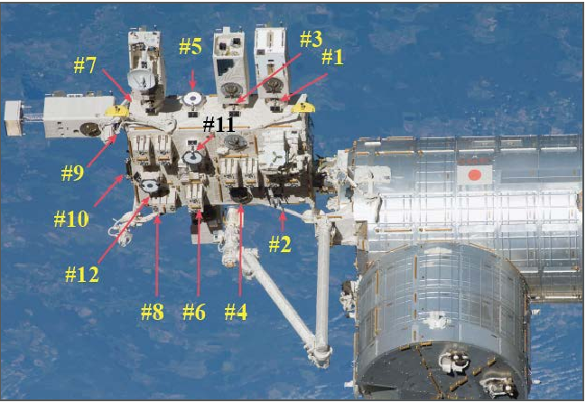|
|---|

- Figure 13. Kibo Exposed Facility. The yellow and black numbers show the payload attach points.

The JEM EF specifications and available resources are as follows:

- • Mass: 500 kg (10 standard sites, mass includes payload interface unit [PIU]); 2,500 kg (two heavy sites, mass includes PIU)
- • Size: 1.85 m x 1 m x 0.8 m
- • Power: 3 kW or 6kW for each payload, and 11kW max in total, 120 VDC
- • Thermal: Active thermal control (fluid loop)
- • Data: Low Rate – 1 mbps MIL‑STD‑1553; High Rate – 43 mbps (shared); Ethernet – 100Base‑TX. Downlink and uplink are available through NASA communication system or the Japanese Inter‑orbit Communication System (ICS).

#### Multi-Purpose Experiment Platform (MPEP [JAXA])

Multi‑Purpose Experiment Platform (MPEP) (Figure 15) is available for the medium‑sized space‑exposed experiment, which aims for the monitor of space environment for Earth observation. MPEP accommodates up to a 100 kg experiment, and it provides the appropriate attitude and position for payloads by the support of JEM RMS. Available resources for payloads on MPEP are power, communication and video interface.

One of the applications includes the JEM Small Satellite Orbital Deployer (J‑SSOD), described in the next section.

|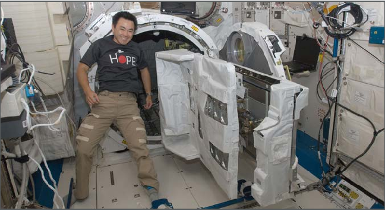|
|---|

- Figure 14. Multi-Purpose Experiment Platform installed on the Japanese Experiment Module Slide Table.

#### JEM Small Satellite Orbital Deployer (J-SSOD [JAXA])

The J‑SSOD (Figure 15) holds up to three small one‑unit (1U; 10 cm x 10 cm x 10 cm) CubeSats per satellite‑install case (six total). Since 2015, other sizes (up to 55 cm x 55 cm x 35 cm) can be used as well (Figure 16). Weight limit is 1.33 kg per 1U, 8 kg total. Crewmembers unpack and install the satellite‑install case onto the Multi‑ Purpose Experiment Platform (MPEP), which is on the JEM Slide Table. The small satellites are then transferred out through the JEM Airlock and deployed by the JEM RMS.

|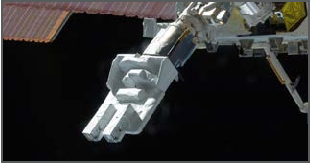|
|---|

- Figure 15. The Japanese Experiment Module Small Satellite Orbital Deployer (J-SSOD).

|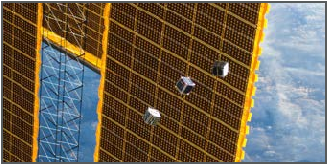|
|---|

Figure 16. CubeSats deployed from the J-SSOD and photographed against the background of an ISS solar array.

#### EXPRESS Logistics Carrier (NASA)

The ELC is a pallet designed to support external research hardware and store external spares – Orbital Replacement Units (ORUs) – needed over the life of the ISS. At the time of publication, four ELCs are mounted to ISS trusses, providing unique vantage points for space, technology, and Earth observation investigations. Two ELCs are attached to the integrated truss segments starboard truss 3 (ITS‑S3), and two ELCs are attached to the integrated truss segments port truss 3 (ITS‑P3). By attaching at the S3/P3 sites, a variety of views such as zenith (deep space) or nadir (Earthward) direction with a combination of ram (forward) or wake (aft) pointing allows for many possible viewing opportunities.

The ELC Adapter capabilities are listed below:

- • Mass: 227 kg (8 sites across four ELCs; not including adaptor plate)
- • Volume: 1.2 m3
- • Size: 0.8 m x 1.2 m x 1.2 m
- • Power: 750 W, 113‑126 VDC; 500 W, 28 VDC
- • Data: Low Rate: 1 Mbps MIL‑STD‑1553 Medium Rate: 6 Mbps (shared)

#### Materials International Space Station Experiment Flight Facility (MISSE-FF) (Alpha Space/NASA)

The MISSE‑FF is a commercial test platform with ram, wake, zenith, and nadir faces for passive and active experiments. Alpha Space Test & Research Alliance owns and operates the platform and provides the assembly, integration, safety review, and acceptance tests (e.g. thermal vacuum and vibration) as a turn‑key commercial service. Materials, spacecraft components, and technology demonstrations can be flown exposed on the deck of the MISSE Sample Carrier (MSC), also called the MISSE Science Carrier, or mounted underdeck (figure 17).

The MSCs are launched closed as pressurized cargo on either the Northrup Grumman Cygnus or SpaceX Dragon spacecrafts, moved outside the ISS through the JEM airlock then installed on the MISSE‑FF structure (figure 18) via robotic arm. The science carriers are then remotely opened to expose the experiments to space. These carriers are closed during resupply ship dockings to prevent contamination and to minimize AO exposure of wake surfaces.

|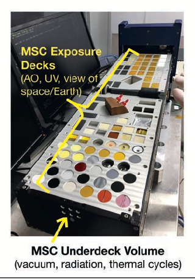|
|---|

Figure 17. MISSE Sample Carrier ready for integration on the Materials International Space Station Experiment Flight Facility.

|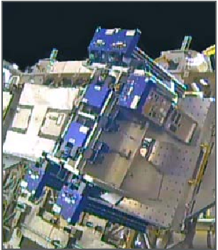|
|---|

Figure 18. MISSE-FF on EXPRESS Logistics Carrier 2. Upper right is an open MISSE Science Carrier.

MSC capabilities are listed below:

- • Size: Usually up to 0.33 m x 0.18 m x 0.076 m (13” x 7” x 3”). Non‑standard fixture up to 0.508 m x 0.18 m x 0.15 m (20” x 7” x 6”).
- • Power: 28V, 12V, 5V, or 3V power bus for experiment use and up to 75W of payload power. Customer experiments must have at least 1 Mohm of isolation between the power and return lines to chassis ground.
- • Data:

|Comm|Data Race (Standard)|Data Rate (maximum)|Throughput|Note|
|---|---|---|---|---|
|RS-232|115.2 kbps|1 Mbps+|0.01152 MB/s|This is very limited by lenth. 10 bits/clocks per byte transferred.|
|RS-422|115.2 kbps|10-20 Mbps|0.01152 MB/s|Dependent on distance and bus integrity.|
|RS-485|115.2 kbps|10-20 Mbps|0.01152 MB/s|Dependent on distance and bus integrity.|
|USB 2.0|480 Mbps|480 Mbps|20-50 MB/s|Results vary.|
|Ethernet 10/100|100 Mbps|100 Mbps|12.5 MB/s max. 4 MB/s sustained|Results vary.|

Bartolomeo Platform (European Space Agency/Airbus)

The Bartolomeo platform (Figure 19) has twelve powered external attachment site locations for scientific payloads or facilities with predominantly zenith and nadir views and some locations with ram view. The attachment sites may hold a mass of up to 450 kg, and each is provided utility connections for power and data.

The Bartolomeo capabilities are listed below:

- • Mass: ≤ 450 kg per site
- • Size: 0.700 m x 0.800 m x 1.000 m for single payloads, 0.8 m x 1.500 m x 1.000 m for double payloads
- • Power: 120 VDC up to 800 W, survival power for heaters
- • Data: up to 2 Terabyte/day

|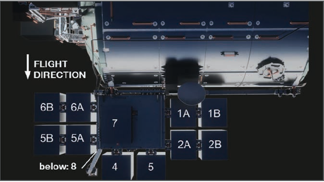|
|---|

###### Figure 19. Bartolomeo platform on European Space Agency Columbus module (photo courtesy of Airbus).

Russian Segment External Facilities (Russian Space Agency Roscosmos)

Russian Segment External Facilities, controlled by Roscosmos, consist of a whole host of multi‑user external Facility interface locations and support structures. There are two external mounting platforms (URM‑D) on the Service Modulus (SM), also known as Zvezda, located on the starboard and port sides. The URM‑D provides power and data connection to the payloads. Passive experiments can be flown in the Replaceable Cassette‑Container (SKK or CKK) and can be attached to Zvezda, the Poisk MRM, or the Pirs Docking Compartment‑1 (Figure 20). Payloads are installed and removed by the crew during an EVA.

|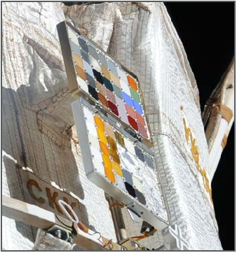|
|---|

###### Figure 20. Russian Replaceable Cassette-Container on theRussian Service Module.

## Funding, Developing, and Launching Research to ISS

Several sources of funding are available to scientists to be used for research, payload development, payload processing at NASA facilities, in‑orbit operation, and more. Once a payload has been selected for development, engineering and operations staff in the ISS Program Office are available to work with payload teams through the design, test, certification, build, and launch phases prior to beginning mission operations on ISS. More detailed information on this process, and information on current and planned launch vehicles, is available at https://www.nasa.gov/mission_ pages/station/research/research_information.html.

In general, NASA funding for space station use is obtained through NASA Research Announcements (NRAs). Funding for other government agencies, private, and non‑profit use of the space station is obtained through research opportunities released by ISS U.S. National Laboratory. Space Station International Partner funding can be obtained through their respective processes.

Potential proposers to any NASA program announcement should contact the relevant Program Scientist to discuss the appropriateness of their sensor concept to the specific solicitation. Contacts within the ISS Program Office should discuss expected development costs for their proposal budgets.

ISS U.S. National Laboratory

In 2011, NASA finalized a cooperative agreement with the Center for the Advancement of Science in Space to manage the International Space Station U.S. National Laboratory (ISS National Lab). The independent, nonprofit research management organization ensures the station’s unique capabilities are available to the broadest possible cross section of U.S. scientific, technological, and industrial communities.

The ISS National Lab develops and manages a varied research and development portfolio based on U.S. national needs for basic and applied research. It establishes a marketplace to facilitate matching research pathways with qualified funding sources and stimulates interest in using the national lab for research and technology demonstrations and as a platform for science, technology, engineering and mathematics education. The goal is to support, promote and accelerate innovations and new discoveries in science, engineering and technology that will improve life on Earth. More information on ISS National Lab, including proposal announcements, is available at http://www.issnationallab.org.

#### Other Government Agencies

Potential funding for research on the ISS is also available via governmental partnerships with ISS U.S. National Laboratory and includes (but is not limited to) such government agencies as:

- • Defense Agency Research Projects Agency (DARPA)
- • Department of Energy (DOE)
- • Department of Defense (DOD)
- • National Science Foundation (NSF)

#### International Funding Sources

Unique and integral to the ISS are the partnerships established between the United States, Russia, Japan, Canada, and Europe. All partners share in the greatest international project of all time, providing various research and experiment opportunities for all. These organizations – Japan Aerospace Exploration Agency (JAXA), Canadian Space Agency (CSA), ESA (European Space Agency), Russian space agency Roscosmos, Centre National d’Etudes Spatiales (CNES), and the German Aerospace Center (DLR) – provide potential funding opportunities for international scientists from many diverse disciplines.

## Citations

ASTM E595, Standard Test Method for Total Mass Loss and Collected Volatile Condensable Materials from Outgassing in a Vacuum Environment.

ASTM E1559, Standard Test Method for Contamination Outgassing Characteristics of Spacecraft Materials.

ASTM E2089, Standard Practices for Ground Laboratory Atomic Oxygen Interaction Evaluation of Materials for Space Applications.

Banks, B. A., K. K. de Groh, and S. K. Miller. “Low Earth Orbital Atomic Oxygen Interactions with Spacecraft Materials.” 2004 Materials Research Society Fall Meeting, Boston, MA, November 29‑December 3, 2004, Materials Research Society Symposium Proceedings 2004, NN8.1. New York: Cambridge University Press, 2004. Also published as NASA/TM‑2004‑213400 (Nov. 2004).

Banks, B. A., K. K. de Groh, S. K. Miller, and D. L., Waters. “Lessons Learned from Atomic Oxygen Interaction with Spacecraft Materials in Low Earth Orbit.” Proceedings of the 9th International Conference: Protection of Materials and Structures from Space Environment, Toronto, Canada, 20–23 May 2008. Melville, NY: American Institute of Physics. Also published as NASA/TM‑2008‑0215264, July 2008.

de Groh, K. K., B. A. Banks, C. E. McCarthy, R. N. Rucker,, L. M. Roberts, and L. A. Berger. “MISSE‑2 PEACE Polymers Atomic Oxygen Erosion Experiment on the International Space Station.” High Performance Polymers 20 (2008): 388‑409. de Groh, K. K., D. A. Jaworske, W. H. Kinard, H. G. Pippin, and P. P. Jenkins. “Tough Enough for Space: Testing Spacecraft Materials on the ISS.” Technology Innovation 15, no. 4 (2011): 50‑53. de Groh, K. K., B. A. Banks, J. A. Dever, D. J. Jaworske, S. K. Miller, E. A Sechkar, and S. R. Panko. “NASA Glenn Research Center’s Materials International Space Station Experiments (MISSE 1‑7).” Proceedings of the International Symposium on “SM/MPAC&SEED Experiment,” Tsukuba, Japan, March 10‑11, 2008. JAXA‑SP‑ 08‑015E, March 2009, pp. 91 – 119. Also published as NASA TM‑2008‑215482, December 2008. de Groh, Kim K. and Bruce A. Banks, “Space Environmental Effects and NASA Glenn’s MISSE‑Flight Facility (MISSE‑FF) Experiments”, NASA TM‑ 2020‑ 220475, Feb. 2020.

Dever, J. A., B. A. Banks, K. K. de Groh, and S. K. Miller. “Degradation of Spacecraft Materials.” In Handbook of Environmental Degradation of Materials, edited by Myer Kutz, 465‑501. Norwich, NY: William Andrew Publishing, 2005.

Dever, J. A., S. K. Miller, E. A. Sechkar, and T. N. Wittberg. “Preliminary Analysis of Polymer Film Thermal Control and Gossamer Materials Experiments on MISSE‑1 and MISSE‑2,” Proceedings of the 2006 National Space & Missile Materials Symposium in conjunction with the 2006 MISSE Post‑Retrieval Conference, June 26‑30, 2006, Orlando, FL.

Finckenor, M. M., J. L. Golden, M. Kravchenko. “Analysis of International Space Station Vehicle Materials Exposed on Materials International Space Station Experiment from 2001 to 2011”, NASA/TP‑2013‑217498

NASA SSP 30426, Space Station External Contamination Control Requirements. NASA SSP 50699‑03. ISS Certification Baseline Volume 3: Flight Attitudes

James, Bonnie F., O. W. Norton, and Margaret B. Alexander. “The natural space environment: Effects on spacecraft.” NASA STI/Recon Technical Report N 95

(1994): 25875. Pippin, H. G., E. Normand, S. L. B. Woll, and R. Kamenetzky. “Analysis of Metallized Teflon™ Thin‑Film Materials Performance on Satellites.” Journal of Spacecraft and Rockets 41, no. 3 (May 2004): 322‑325. Pippin, Gary. Summary Status of MISSE‑1 and MISSE‑2 Experiments and Details of Estimated Environmental Exposures for MISSE‑1 and MISSE‑2, AFRL‑ML‑ WP‑TR‑2006‑4237, Air Force Research Laboratory: OH July 2006. Schwank, James R., Marty R. Shaneyfelt, and Paul E. Dodd. “Radiation Hardness Assurance Testing of Microelectronic Devices and Integrated Circuits: Radiation Environments, Physical Mechanisms, and Foundations for Hardness Assurance.” Sandia National Laboratories Document SAND‑2008‑6851P. 21 May 2013. http:// www.sandia.gov/mstc/services/documents/Sandia_RHA_Foundations_FINAL.pdf.

Samwel, S.W., “Low Earth Orbital Atomic Oxygen Erosion Effect on Spacecraft Materials.” Space Research Journal, 7: 1‑13. April 2014.

Silverman, E. M. Space Environmental Effects on Spacecraft: LEO Materials Selection Guide. NASA CR 4661, Part 1, TRW Space & Electronics Group: Redondo Beach, CA. August 1995.

Soares, C. and R. Mikatarian. “Understanding and Control of External Contamination on the International Space Station.” ESA SP‑540 Proceedings of the 9th International Symposium on Materials in a Space Environment, June 16‑20, 2003, Noordwijk, The Netherlands. Noordwijk: ESA. September 2003.

Stambler, A. H., K. E. Inoshita, L. M. Roberts, C. E. Barbagallo, K. K. de Groh, and B. A. Banks. “Ground‑Laboratory to In‑Space Atomic Oxygen Correlation for the PEACE Polymers.” Proceedings of the 9th International Conference Protection of Materials and Structures from Space Environment, May 19‑23, 2008, Toronto, Canada. Ed. J .I. Kleiman, AIP Conference Proceedings 1087, pp. 51‑66, 2009. Also NASA TM‑2011‑216904.

Steagall, C., K. Smith, A. Huang, C. Soares, and R. Mikatarian, “Induced Contamination Predictions for JAXA’s Micro‑Particles Capturer and Space Environment Exposure Devices,” Proc. Int. Symp. on SM/MPAC&SEED Experiment, Japan, 2008 (JAXA‑SP‑08‑015E, 2009), pp. 19‑25.

Townsend, J. A, P. A, Hansen, M. W. McClendon, K. K. de Groh, and B. A, Banks. “Ground‑Based Testing of Replacement Thermal Control Materials for the Hubble Space Telescope” High Performance Polymers 11 (1999): 63‑79.

“Update on Three Major Debris Clouds.” Orbital Debris Quarterly News 14. 2 (April 2010). 14 May 2013 <http://orbitaldebris.jsc.nasa.gov/newsletter/pdfs/ ODQNv14i2.pdf>.

Visentine, J., W. Kinard, R. Pinkerton, D. Brinker, D. Scheiman, B. Banks, J. Zwiener, K. Albyn, T. Farrell, S. Hornung, and T. See. “Mir Solar Array Return Experiment”, AIAA Paper 99‑0100 presented at the 37th AIAA Aerospace Sciences Meeting, Reno, NV, Jan. 11‑14, 1999.

Yang, J. C. and K. K. de Groh. “Materials Issues in the Space Environment.” MRS Bulletin 35 (January 2010): 12‑19.

## Acronyms

AO Atomic Oxygen BRDF Bi-Directional Reflectance Distribution Function CKK Replaceable Cassette-Container CTE Coefficients of Thermal Expansion EF External Facility ELC EXPRESS Logistics Carrier EMI/EMC Electromagnetic Interference/Electromagnetic Compatibility EOIM Evaluation of Oxygen Interaction with Materials ESA European Space Agency EVA Extravehicular Activity EXPRESS EXpedite the PRocessing of Experiments to the Space Station ISS International Space Station JAXA Japan Aerospace Exploration Agency JEM Japanese Experiment Module J-SSOD JEM Small Satellite Orbital Deployer LDEF Long Duration Exposure Facility LEO low-Earth orbit LVLH Local Vertical, Local Horizontal MAPTIS Materials and Processes Technical Information System MISSE Materials International Space Station Experiment MISSE-FF Materials International Space Station Experiment-Flight Facility MMOD Micrometeoroids and Orbital Debris MPEP Multi-purpose Experiment Platform MSC MISSE Sample Carrier MSIS Mass Spectrometer Incoherent Scatter NSPIRES NASA Solicitation and Proposal Integrated Review and Evaluation System PEACE Polymer Erosion and Contamination Experiment PEC Passive Experiment Container PIU Payload Interference Unit RMS Remote Manipulator System Roscosmos Russian Federal Space Agency RTV Room Temperature Vulcanization SKK Replaceable Cassette-Container TQCM Temperature-Controlled Quartz Crystal Microbalance TVS Thermal Vacuum Stability UV Ultraviolet VCMO Vacuum Condensable Material Compatibility with Optics

+XVV X-axis in the Velocity Vector

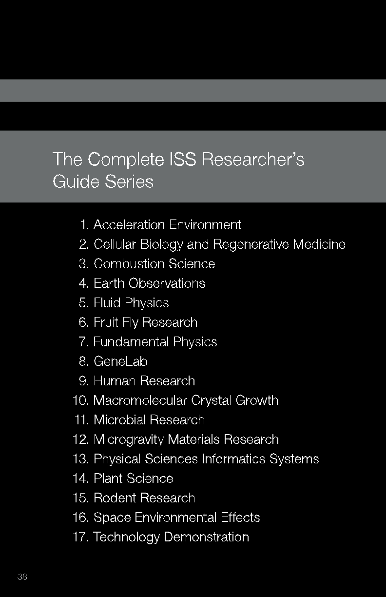

### The Complete ISS Researcher’s Guide Series

- 1. Acceleration Environment
- 2. Cellular Biology and Regenerative Medicine
- 3. Combustion Science
- 4. Earth Observations
- 5. Fluid Physics
- 6. Fruit Fly Research
- 7. Fundamental Physics
- 8. GeneLab
- 9. Human Research
- 10. Macromolecular Crystal Growth
- 11. Microbial Research
- 12. Microgravity Materials Research
- 13. Physical Sciences Informatics Systems
- 14. Plant Science
- 15. Rodent Research
- 16. Space Environmental Effects
- 17. Technology Demonstration

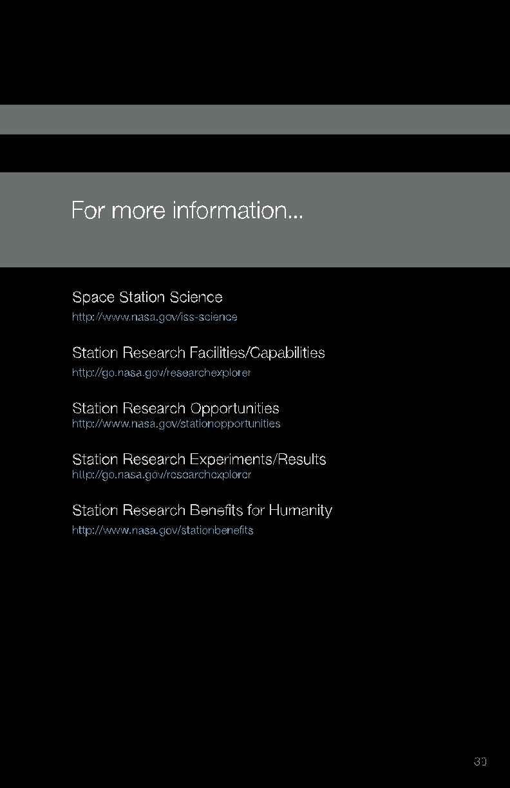

### For more information...

Space Station Science

http://www.nasa.gov/iss-science

Station Research Facilities/Capabilities

http://go.nasa.gov/researchexplorer

Station Research Opportunities

http://www.nasa.gov/stationopportunities

Station Research Experiments/Results

http://go.nasa.gov/researchexplorer

Station Research Benefits for Humanity

http://www.nasa.gov/stationbenefits

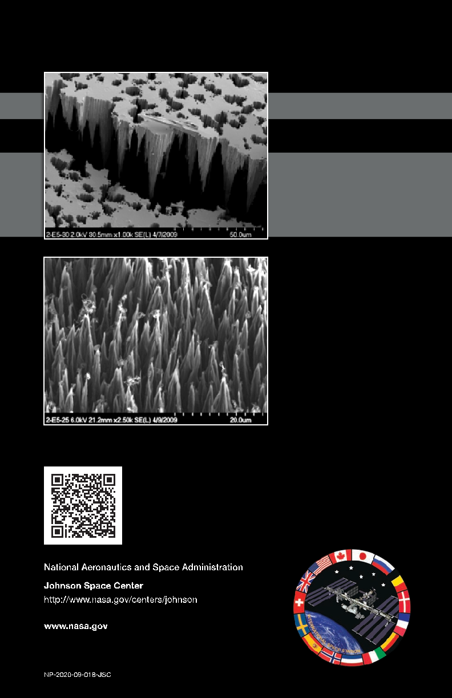

|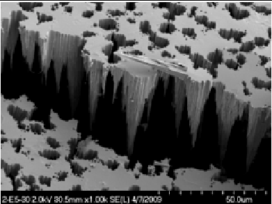|
|---|

|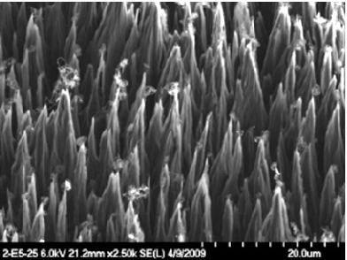|
|---|

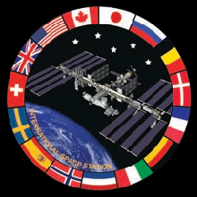

National Aeronautics and Space Administration Johnson Space Center http://www.nasa.gov/centers/johnson

###### www.nasa.gov

NP-2020-09-018-JSC
