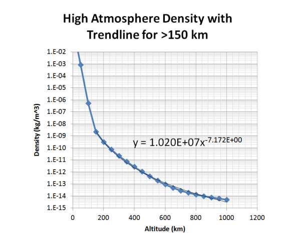

# SPCE 5065 HOMEWORK #2

## DUE: Friday 3 July 2026

All homework is due in Canvas by 11:59:59 pm MT (Colorado Time) on the due date indicated on the Syllabus schedule. No late homework will be accepted.

Students are allowed PARTIAL COLLABORATION on homework assignments. You are allowed to discuss qualitatively with other students the concepts in this course. However, copying or in way using the written work of another person as well as relaying or receiving solutions via any means is strictly prohibited. The intent of this policy is to allow you to share ideas, discuss concepts, and clarify processes when needed. However, you must independently prepare the detailed solutions to homework problems and the Final Project.

Use course readings as a resource, but research additional sources as necessary to answer the questions. Please annotate your research with [1] , [2], etc. and a sources page that describe where the information is located in AIAA format. Please email me with any questions or concerns.

Clearly state any assumptions you make.

- 1. A 100 kg satellite with an effective cross-sectional area of 1 m2is in a circular earth orbit at an altitude of 400 km. Its drag coefficient is 2.2. A rough estimate of the atmospheric density in the thermosphere is given by:

- Estimate the satellite’s lifetime if you assume the spacecraft deorbits at an altitude of 150 km. Do not assume an average R value as we did for the in-class exercise.
- 2. How much drag makeup fuel is needed for the spacecraft in problem 2 to maintain its original orbit for one year? Assume average solar cycle conditions and monopropellant fuel with an Isp = 200 seconds. Use your model from problem 2 to find the atmospheric density.
- 3. Determine the erosion depth per year of a Kapton panel of a spacecraft oriented in the RAM direction (the side that points in the direction of the satellite’s velocity vector) at an altitude of 450 km during low, medium, and high solar activity. The atomic-oxygen number densities are 6 x 106, 2 x 107, and 1 x 108 atoms/cm3, respectively.
- 4. The Apollo command module has a volume of 5.9 m3 and its atmosphere is 100% oxygen at a pressure of 5 psia and temperature of 21°C.

- a. Determine the mass of oxygen present.
- b. Would you recommend this atmosphere for a human vehicle bound for Mars? If not, what would you recommend?

- 5. Create a plot of the lifetime of the satellite in problem 1 for all starting orbit altitudes between 200 and 500 km.
- 6. The International Space Station uses Kapton for some applications.

- a. What is Kapton used for on the ISS?
- b. Estimate the erosion of Kapton on the ISS for a mission of one year that is due to atomic oxygen.
