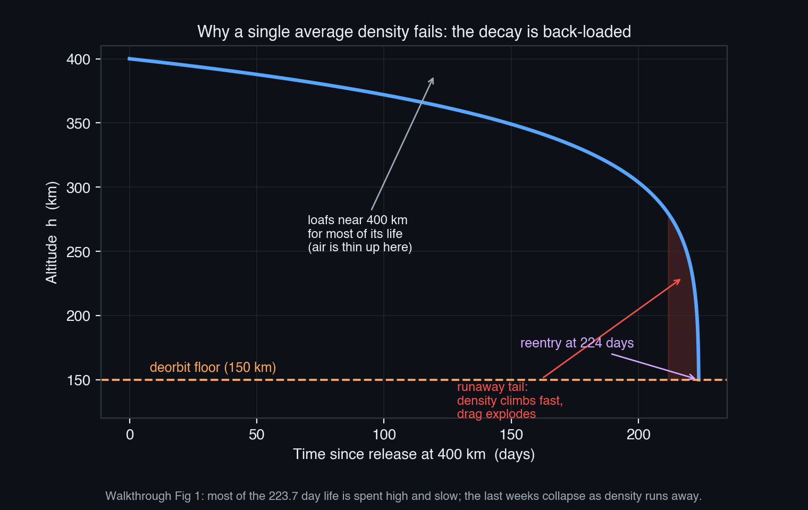
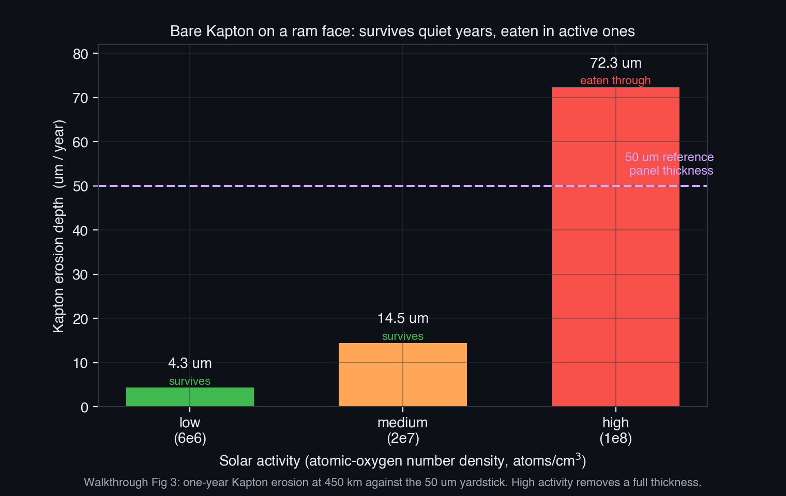
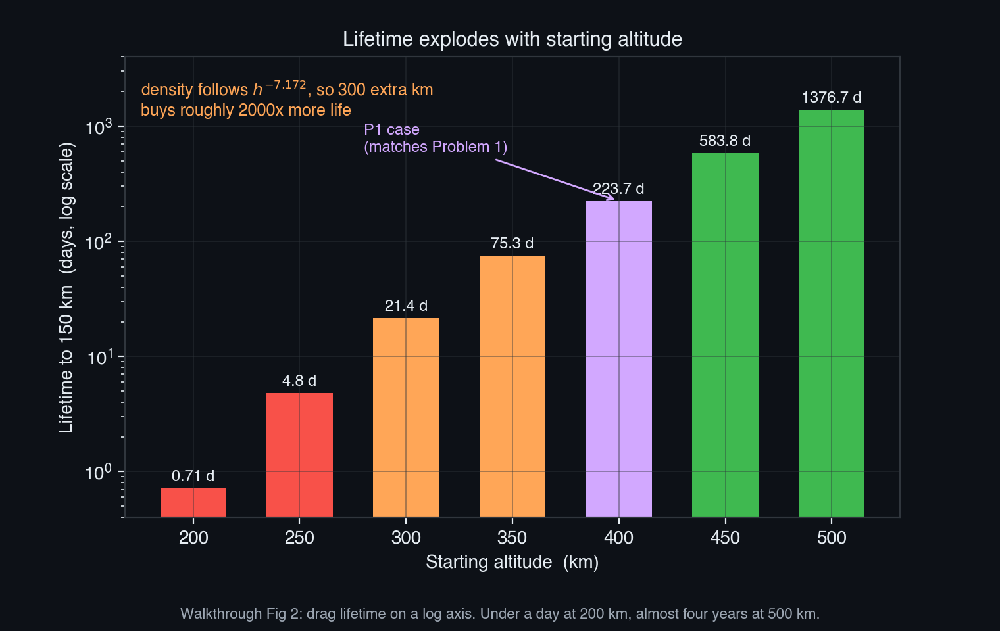

# SPCE 5065 HW #2 -- Socratic Solution Walkthrough
## Atmospheric drag, orbital lifetime, and atomic-oxygen erosion

> This is a personal study guide, not a submission. It is built from an already-graded, known-correct solution. The goal is to make every number reproducible from scratch and every concept stick.

---

## 30,000-Foot Overview

**The big question: how long does a satellite survive in low Earth orbit before the air drags it down, how much fuel does it take to fight that, and what does the thin-but-vicious oxygen up there do to the spacecraft's skin?**

Low Earth orbit is not empty. There is a wisp of atmosphere even at 400 km, and although it is almost a vacuum, a satellite slams through it at nearly 8 km/s, so even a whisper of air steadily steals energy. This homework is about the consequences of that whisper: it pulls satellites down, it forces them to carry reboost fuel, and the oxygen atoms in it chemically chew through exposed plastic.

**Problem 1 (the spine).** A 100 kg satellite is dropped at 400 km and we ask how long until it falls to 150 km, where it is effectively gone. The trick is that the air gets dramatically thicker as the satellite descends, so you cannot use one average density; you have to track the density, speed, and altitude all changing together and add up the time. The answer is about 224 days.

**Problem 2 (the fuel bill).** If instead the satellite wants to stay at 400 km for a year, a thruster has to constantly cancel the drag. Add up that tiny push over a year and you get the velocity the rocket has to supply; feed that into the rocket equation and you get the fuel mass. It comes out to about 2.3 kg, a couple percent of the satellite.

**Problem 3 (the sandblasting).** At 450 km, single oxygen atoms hit a plastic film called Kapton head-on at orbital speed and react with it, eroding it away. How fast depends on how many atoms are up there, which depends on the Sun's activity. In a quiet year the panel barely notices; in an active year it loses more than its own reference thickness.

**Problem 4 (the cabin air).** The Apollo capsule held pure oxygen. Part (a) is just a gas-law calculation for how many kilograms of oxygen that is (about 2.66 kg). Part (b) is a judgment call: pure oxygen is the atmosphere that caused the deadly Apollo 1 fire, so for a months-long Mars trip you would mix in an inert gas instead.

**Problem 5 (the same engine, swept).** Take the Problem 1 calculator and run it for every starting altitude from 200 to 500 km. The lifetime explodes from under a day to almost four years across that band, because density falls off so steeply with altitude that a little extra height buys an enormous amount of life.

**Problem 6 (Kapton in the real world).** Part (a) is research: what does Kapton actually do on the International Space Station (thermal blankets, insulation, wiring)? Part (b) repeats the Problem 3 erosion math but anchored to a real measured oxygen exposure from an ISS experiment, giving about 64 microns per year for bare film.

**The thread.** Everything in this assignment flows from one fact: there is thin air in LEO and the spacecraft moves fast through it. That single fact splits into two families of consequence. The mechanical family (Problems 1, 2, 5) is about momentum: drag drains orbital energy, which lowers the orbit, which means you either decay or burn fuel to stay up. The chemical family (Problems 3, 6) is about reactivity: the oxygen up there is atomic, not the friendly O2 we breathe, and it oxidizes exposed surfaces. Problem 4 is the human bookend, reminding you that the atmosphere we carry inside the spacecraft is its own engineering problem. The professor wants the student to walk away understanding that "space" in LEO is a real, physical environment that you must model, budget for, and protect against, not an idealized vacuum.

---

## Problem 1 (Drag Lifetime from 400 km to 150 km)

**The punchline first:** the satellite lasts about **223.7 days (roughly 0.61 yr)**. The key idea is that you cannot freeze the radius at one value, because the air density swings by nearly three orders of magnitude during the fall, so the lifetime is a numerical integral that lets density, speed, and altitude all change together.

**Problem statement:** A 100 kg satellite, effective cross-sectional area 1 m^2, drag coefficient 2.2, in a 400 km circular orbit. Thermosphere density is approximated by $\rho = 1.020\times10^{7}\, h^{-7.172}$ (kg/m^3, $h$ in km, valid above 150 km). Estimate the lifetime assuming deorbit at 150 km. Do not assume an average R value.

---

### 1.1 The drag-decay law: turning energy loss into altitude loss

**Before reading on, try this:** Write the specific orbital energy of a circular orbit as $\varepsilon = -\mu/(2a)$ and the drag power per unit mass as $\dot\varepsilon = -\tfrac{1}{2}\rho\,(C_D A/m)\,v^3$. Use the chain rule $\dot a = \dot\varepsilon / (d\varepsilon/da)$ together with $v^2 = \mu/a$ to find $\dot a$. You should be able to get everything to collapse into a single square root.

**The punchline:** the decay law is

$$\boxed{\;\dot a = -\rho\,\frac{C_D A}{m}\,\sqrt{\mu\,a}\;}$$

**Derivation and Explanation.** Start from the two facts Lesson 2 gives. First, a circular orbit's specific energy (energy per unit mass) depends only on the orbital radius $a$:

$$\varepsilon = -\frac{\mu}{2a}$$

where $\mu = 3.986\times10^{14}\ \text{m}^3/\text{s}^2$ is Earth's gravitational parameter. Second, drag dissipates that energy. The drag force is $F_D = \tfrac{1}{2}\rho C_D A v^2$, and power is force times velocity, so per unit mass the energy bleeds off at

$$\dot\varepsilon = -\frac{1}{2}\rho\,\frac{C_D A}{m}\,v^3.$$

The minus sign means energy is leaving. Now connect "energy per second" to "altitude per second" with the chain rule. Differentiate $\varepsilon$ with respect to $a$:

$$\frac{d\varepsilon}{da} = \frac{d}{da}\left(-\frac{\mu}{2a}\right) = +\frac{\mu}{2a^2}.$$

Then

$$\dot a = \frac{\dot\varepsilon}{d\varepsilon/da} = \frac{-\tfrac{1}{2}\rho\,\frac{C_D A}{m}\,v^3}{\mu/(2a^2)} = -\rho\,\frac{C_D A}{m}\,a^2\,\frac{v^3}{\mu}.$$

For a circular orbit $v^2 = \mu/a$, so $v^3 = (\mu/a)^{3/2}$. Substitute:

$$\dot a = -\rho\,\frac{C_D A}{m}\,a^2\,\frac{(\mu/a)^{3/2}}{\mu} = -\rho\,\frac{C_D A}{m}\,a^2\,\frac{\mu^{3/2} a^{-3/2}}{\mu} = -\rho\,\frac{C_D A}{m}\,\mu^{1/2}\,a^{1/2}.$$

That last line is exactly $\dot a = -\rho\,(C_D A/m)\,\sqrt{\mu a}$. The factors of $a$ and $\mu$ collapse into one clean square root.

**Common Pitfall:** forgetting that $d\varepsilon/da$ is positive. Energy becomes less negative as $a$ shrinks, but $\varepsilon$ still increases with $a$, so the derivative is $+\mu/(2a^2)$. Get the sign wrong and the satellite climbs instead of decays.

**Reflection:** the quantity $C_D A/m$ is the inverse ballistic coefficient. A light satellite with a big area (high $C_D A/m$) decays fast; a dense compact one hangs on.

---

### 1.2 The lifetime integral and why average-R is dishonest

**Before reading on, try this:** The time to fall is the integral of $dt/da = 1/\dot a$ from the final radius $a_f$ (150 km) to the initial radius $a_0$ (400 km). Write out that integrand and ask yourself: which terms inside it change as the satellite falls?

**The punchline:** the lifetime is

$$t = \int_{a_f}^{a_0} \frac{da}{\rho(h)\,\frac{C_D A}{m}\,\sqrt{\mu\,a}}, \qquad h = \frac{a - R_E}{1000}\ \text{km}$$

and because $\rho(h)$ lives inside it and swings enormously, the integral must be done numerically.

**Derivation and Explanation.** Since $\dot a = da/dt$, flipping it gives $dt = da/\dot a$, and integrating from launch to deorbit gives the total time. The inverse ballistic coefficient is constant:

$$\frac{C_D A}{m} = \frac{2.2 \times 1.0}{100} = 0.0220\ \text{m}^2/\text{kg}.$$

But $\rho$ and $a$ both vary. The density model evaluated at the band edges (with altitude $h$ measured in km, $R_E = 6378.137$ km) makes the point:

**Table 1: density and speed across the decay band.**

| Altitude $h$ (km) | $\rho$ (kg/m^3) | $v$ (km/s) |
|---:|---:|---:|
| 400 | $2.221\times10^{-12}$ | 7.669 |
| 300 | $1.749\times10^{-11}$ | 7.726 |
| 200 | $3.203\times10^{-10}$ | 7.784 |
| 150 | $2.522\times10^{-9}$ | 7.814 |

From 400 km to 150 km the density rises by a factor of about $2.522\times10^{-9}/2.221\times10^{-12} \approx 1100$. The speed barely moves (it changes by less than 2%). So drag is overwhelmingly controlled by density, and density changes by three orders of magnitude. If you froze $\rho$ at the 400 km value (the average-R shortcut from the in-class exercise), you would assume the satellite feels thin 400 km air for its whole descent, badly underestimating the violence of the final plunge. Doing it honestly means evaluating $\rho$, $v$, and $a$ at the instantaneous altitude inside the integral and letting a numerical integrator (SciPy `quad`) add up the time.

Running the integral:

$$\boxed{\;t \approx 1.93\times10^{7}\ \text{s} = 223.7\ \text{days} \approx 0.61\ \text{yr}\;}$$

**Common Pitfall:** plugging a single "average" density into a closed-form $t = \text{(stuff)}/\rho$ formula. Because the satellite spends almost all its life high up where the air is thin, an average density weighted by altitude is nowhere near the value that governs the fatal endgame. The result can be off by a large factor.

**Reflection:** the math is honest only because nothing is frozen. The integral respects the fact that the satellite lingers where the air is thin and then rushes through where it is thick.

---

### 1.3 The shape of the decay: the runaway tail

**The punchline:** the altitude-versus-time curve is back-loaded. The satellite drifts down slowly for months near 400 km, then the bottom drops out in the last few weeks. That shape is the visual proof that average-R fails.

**Derivation and Explanation.** Integrating $\dot a$ directly (not just the lifetime, but the full trajectory) traces the altitude history. Early on, $\rho$ is tiny, so $\dot a$ is small and the satellite barely sinks. As it descends, $\rho$ climbs steeply, $\dot a$ grows, and the descent accelerates. The shaded red region in the figure is the last twelve days, where the curve goes nearly vertical: density has climbed so fast that drag runs away. An average density smears all the action in that tail across the whole timeline, which is exactly the part of the trajectory that dominates.

**Sanity check:** the model density at 400 km, about $2.2\times10^{-12}$ kg/m^3, sits inside the accepted average-conditions band for that altitude. And a sub-1 m^2 / 100 kg object decaying from 400 km in roughly seven months matches what real small satellites in that band do. A result of decades or of days would flag a wiring error in the integrand.

> **Key takeaway from Problem 1:** Drag lifetime is a numerical integral, not a one-line formula, because the air density rises by three orders of magnitude during the fall and the descent is dominated by the brief, violent endgame near deorbit. Freezing the radius at one "average" value smears out exactly the part of the trajectory that matters and gives a badly wrong answer.

> **Feynman test (in plain English):** A falling satellite spends almost all its time loafing up high where the air is thin, then suddenly plummets once it reaches the thick air below, so you cannot pretend the air is the same thickness the whole way down.

---

## Problem 2 (Drag-Makeup Fuel for One Year)

**The punchline first:** holding 400 km for a year needs about **45.35 m/s of delta-v**, which costs about **2.29 kg of monopropellant** out of the rocket equation with $I_{sp} = 200$ s. Drag at 400 km is real but gentle, so the bill is only a couple percent of the satellite's mass.

**Problem statement:** How much drag-makeup fuel does the Problem 1 spacecraft need to hold its original 400 km orbit for one year? Assume average solar-cycle conditions and a monopropellant with $I_{sp} = 200$ s. Use the Problem 1 density model.

---

### 2.1 The delta-v: a tiny push held for a year

**Before reading on, try this:** At a fixed 400 km, the drag deceleration is $a_D = \tfrac{1}{2}\rho v^2 (C_D A/m)$. Compute it with $\rho(400) = 2.221\times10^{-12}$ kg/m^3, $v = 7668.6$ m/s, and $C_D A/m = 0.0220$ m^2/kg. Then multiply by the number of seconds in a year ($3.156\times10^{7}$ s) to get the delta-v the thruster must supply.

**The punchline:** $\Delta v = 45.35$ m/s.

**Derivation and Explanation.** To hold altitude, the thruster has to cancel drag continuously, so the velocity increment it must supply over the year equals the drag deceleration integrated over time. At fixed altitude the deceleration is constant:

$$a_D = \tfrac{1}{2}\rho v^2\,\frac{C_D A}{m} = \tfrac{1}{2}(2.221\times10^{-12})(7668.6)^2(0.0220) = 1.437\times10^{-6}\ \text{m/s}^2.$$

Held for one year ($t_{\text{yr}} = 3.156\times10^{7}$ s):

$$\Delta v = a_D \cdot t_{\text{yr}} = (1.437\times10^{-6})(3.156\times10^{7}) = 45.35\ \text{m/s}.$$

The density comes straight from the Problem 1 model. The power-law fit has no explicit solar-activity dial, so "average solar-cycle conditions" is already baked into the single fitted curve; you do not select it with a parameter, you just use $\rho(400)$.

**Common Pitfall:** trying to add up drag over a decaying trajectory. Here the orbit is held fixed at 400 km by assumption, so $\rho$ and $v$ are constants and the delta-v is just deceleration times time. Do not reuse the Problem 1 integral.

**Reflection:** delta-v is the honest currency of orbit maintenance. A constant small force over a long time still adds up to a real velocity budget.

---

### 2.2 The fuel: the rocket equation

**Before reading on, try this:** The propellant mass is $\Delta m = m\,(1 - e^{-\Delta v/(I_{sp} g_0)})$. Plug in $m = 100$ kg, $\Delta v = 45.35$ m/s, $I_{sp} = 200$ s, $g_0 = 9.80665$ m/s^2. First compute the exhaust velocity $I_{sp} g_0$, then the exponent.

**The punchline:** $\Delta m \approx 2.29$ kg.

**Derivation and Explanation.** The Tsiolkovsky rocket equation relates velocity change to mass expelled through the effective exhaust velocity $c = I_{sp} g_0$:

$$c = I_{sp} g_0 = 200 \times 9.80665 = 1961.3\ \text{m/s}.$$

The exponent is $\Delta v / c = 45.35/1961.3 = 0.02312$. Then

$$\Delta m = m\left(1 - e^{-\Delta v/c}\right) = 100\left(1 - e^{-0.02312}\right) = 100(1 - 0.97714) = 2.29\ \text{kg}.$$

$$\boxed{\;\Delta m \approx 2.29\ \text{kg of monopropellant}\;}$$

**Sanity check:** the small-burn approximation $\Delta m \approx m\,\Delta v / c = 100 \times 45.35/1961.3 = 2.31$ kg lands within 1% of the full exponential, which it must, because 45 m/s is tiny next to the 1961 m/s exhaust velocity. So about 2.3 kg, a bit over 2% of dry mass, buys a year of station-keeping. That matches real reboost budgets in this altitude band.

**Common Pitfall:** confusing $I_{sp}$ (seconds) with exhaust velocity (m/s). You must multiply by $g_0$ to convert. Skipping that gives an exhaust velocity of 200 m/s and a fuel estimate that is off by a factor of nearly 10.

> **Key takeaway from Problem 2:** Maintaining a fixed orbit against gentle drag is a constant-force problem: deceleration times time gives the delta-v, and the rocket equation converts delta-v to fuel. At 400 km the drag is so mild that a year of station-keeping costs only a couple percent of the satellite's mass.

> **Feynman test (in plain English):** Fighting the thin air at 400 km is like holding a feather against a faint breeze all year long; the push is tiny each second, but it adds up to a small, payable fuel bill.

---

## Problem 3 (Kapton Ram Erosion at 450 km)

**The punchline first:** the erosion depth is the yield times the fluence, and at 450 km a bare Kapton ram face loses **4.34 / 14.5 / 72.3 microns per year** at low / medium / high solar activity. The high-activity case eats through more than the 50 micron reference panel thickness, which is why flight hardware is coated.

**Problem statement:** Determine the per-year erosion depth of a Kapton panel in the RAM direction (facing the velocity vector) at 450 km during low, medium, and high solar activity. Atomic-oxygen number densities are $6\times10^{6}$, $2\times10^{7}$, and $1\times10^{8}$ atoms/cm^3.

---

### 3.1 The erosion model: yield times fluence

**Before reading on, try this:** Erosion depth is $d = E_{\text{Kapton}}\,\Phi$, where the fluence is $\Phi = n\,v\,t$. Using $E_{\text{Kapton}} = 3.0\times10^{-24}$ cm^3/atom, ram speed $v = 7.640\times10^{5}$ cm/s (the orbital speed at 450 km), and $t = 3.156\times10^{7}$ s (one year), compute the low-activity case with $n = 6\times10^{6}$ atoms/cm^3. Keep everything in CGS so the depth comes out in cm.

**The punchline:** depth scales linearly with density: 4.34, 14.47, and 72.33 microns/yr.

**Derivation and Explanation.** Two ideas combine. First, the erosion yield $E_{\text{Kapton}}$ (the reading calls it reaction efficiency) is the volume of material removed per incident atom. For Kapton the accepted value is $E_{\text{Kapton}} = 3.0\times10^{-24}$ cm^3/atom. (Table 7-3 lists $3.04\times10^{-24}$ and the lecture quoted $3.1\times10^{-24}$; all three agree to within about 3%, so the choice does not move the answer.)

Second, the fluence $\Phi$ is the total number of atoms that strike a unit area over the year. A surface facing the velocity vector sweeps through a column of atoms: in time $t$ it travels a distance $v\,t$, so the number of atoms per unit area it collects is the number density times that swept length, $\Phi = n\,v\,t$.

Work the low case. The swept length in one year is $v\,t = (7.640\times10^{5}\ \text{cm/s})(3.156\times10^{7}\ \text{s}) = 2.411\times10^{13}$ cm. Then

$$\Phi_{\text{low}} = n\,v\,t = (6\times10^{6})(2.411\times10^{13}) = 1.447\times10^{20}\ \text{atoms/cm}^2.$$

The depth is

$$d_{\text{low}} = E_{\text{Kapton}}\,\Phi_{\text{low}} = (3.0\times10^{-24})(1.447\times10^{20}) = 4.34\times10^{-4}\ \text{cm} = 4.34\ \mu\text{m}.$$

The other two cases differ only in $n$, so they scale linearly.

**Table 2: one-year ram-face Kapton erosion at 450 km.**

| Solar activity | $n$ (atoms/cm^3) | Fluence $\Phi$ (atoms/cm^2 per yr) | Erosion depth (microns/yr) |
|:---|---:|---:|---:|
| Low | $6\times10^{6}$ | $1.447\times10^{20}$ | 4.34 |
| Medium | $2\times10^{7}$ | $4.822\times10^{20}$ | 14.47 |
| High | $1\times10^{8}$ | $2.411\times10^{21}$ | 72.33 |

$$\boxed{\;d_{\text{low}} = 4.34\ \mu\text{m},\quad d_{\text{med}} = 14.5\ \mu\text{m},\quad d_{\text{high}} = 72.3\ \mu\text{m}\ \text{(per year)}\;}$$

**Common Pitfall:** mixing unit systems. The yield is in cm^3/atom, so speed must be cm/s and the depth lands in cm. Convert to microns at the very end ($1\ \text{cm} = 10^4\ \mu\text{m}$). Leaving speed in m/s makes the answer off by 100.

---

### 3.2 The verdict against the 50 micron yardstick

**The punchline:** at low activity bare Kapton shrugs off a year; at high activity it loses more than a full reference panel thickness and would be eaten through.

**Derivation and Explanation.** The lecture uses a 50 micron panel thickness as a yardstick. Plotting the three depths against it makes the engineering point: the low and medium bars sit below the dashed line (the panel survives the year), but the high-activity bar at 72.3 microns clears it (the panel is gone). This is precisely why a bare Kapton ram face is a bad idea and why real flight hardware gets a protective coating.

**Sanity check:** the depths scale exactly linearly with $n$. The high case is $1\times10^{8}/6\times10^{6} = 16.7$ times the low case, and indeed $72.33/4.34 = 16.7$. The magnitudes also match the order-of-microns-to-tens-of-microns per year erosion the course reading reports for Kapton in LEO.

> **Key takeaway from Problem 3:** Erosion depth is just yield times fluence, and fluence is density times ram speed times time, so depth scales linearly with the atomic-oxygen density. Because that density swings with solar activity, an unprotected Kapton ram face goes from shrugging off a year to being eaten through within it, which is the whole argument for protective coatings.

> **Feynman test (in plain English):** A surface plowing into space is like a windshield driving through a swarm of bugs; the faster you go and the thicker the swarm, the more gets scoured off, and oxygen atoms scour plastic the way bugs scour glass.

---

## Problem 4 (Apollo Command Module Atmosphere)

**The punchline first:** the cabin holds about **2.66 kg of oxygen** (part a, straight ideal gas law), and **no, you should not fly pure oxygen at 5 psia to Mars** (part b): it is the Apollo 1 fire hazard, so a two-gas atmosphere with an inert diluent is the right call.

**Problem statement:** The Apollo command module has a volume of 5.9 m^3, 100% oxygen at 5 psia and 21 C. (a) Determine the mass of oxygen present. (b) Would you recommend this atmosphere for a human vehicle bound for Mars? If not, what would you recommend?

**Part-to-Section Map:**

| Part | Answer | Section |
|---|---|---|
| (a) Mass of oxygen | 2.66 kg | 4.1 |
| (b) Recommendation | No; use a two-gas atmosphere with inert diluent | 4.2 |

---

### 4.1 (a) Mass of oxygen from the ideal gas law

**Before reading on, try this:** Use $m = PVM/(RT)$. Convert 5 psia to pascals ($\times 6894.757$), use $V = 5.9$ m^3, $T = 21 + 273.15$ K, $M_{O_2} = 0.0319988$ kg/mol, and $R = 8.314$ J/(mol K). Find the number of moles first, then multiply by the molar mass.

**The punchline:** $m_{O_2} = 2.66$ kg.

**Derivation and Explanation.** The ideal gas law $PV = nRT$ gives the number of moles, then mass is moles times molar mass. Convert the inputs to SI first:

- Pressure: $P = 5\ \text{psia} \times 6894.757\ \text{Pa/psi} = 34{,}473.8$ Pa.
- Temperature: $T = 21 + 273.15 = 294.15$ K.
- Volume: $V = 5.9$ m^3 (already SI).

Number of moles:

$$n = \frac{PV}{RT} = \frac{(34{,}473.8)(5.9)}{(8.314)(294.15)} = \frac{203{,}395}{2445.6} = 83.16\ \text{mol}.$$

Mass:

$$m_{O_2} = n M_{O_2} = (83.16)(0.0319988) = 2.66\ \text{kg}.$$

$$\boxed{\;m_{O_2} = 2.66\ \text{kg}\;}$$

**Sanity check:** the cabin gas density is $m/V = 2.66/5.9 = 0.45$ kg/m^3, about a third of sea-level air density (1.2 kg/m^3). That tracks: the module sits at a third of an atmosphere of pressure, just made of pure O2 instead of mostly nitrogen.

**Common Pitfall:** forgetting that psia is absolute pressure and converting it as though it were gauge, or using 21 C directly in kelvin slots. Both wreck the answer.

---

### 4.2 (b) Recommendation for a Mars vehicle

**The punchline:** no pure oxygen at 5 psia; recommend a two-gas (oxygen plus inert diluent) atmosphere sized to keep the oxygen partial pressure normoxic.

**Derivation and Explanation (the judgment).** Pure oxygen at 5 psia is essentially the atmosphere implicated in the 1967 Apollo 1 pad fire that killed three astronauts, where a pure-oxygen cabin turned a small electrical spark into a fatal flash fire. Apollo flew it in space partly because the in-flight pressure was lower than the 16.7 psia pure-O2 they ran on the pad, but the fundamental flammability problem never disappears in a pure-oxygen environment. For a multi-month Mars transit the reasons against it stack up:

- **Fire risk.** In pure O2, materials ignite more easily and burn far faster and hotter than in normal air. Over a long mission full of electronics and crew activity, that is an unacceptable standing hazard.
- **Long-duration physiology.** Prolonged 100% O2 exposure carries pulmonary oxygen-toxicity risk, tolerable for a short Apollo sortie but not for a transit measured in months.
- **No partial-pressure margin.** A single gas gives nothing to trade; you cannot lower flammability without also lowering the oxygen the crew needs.

**What to recommend instead:** a two-gas atmosphere (oxygen plus an inert diluent such as nitrogen) at a higher total pressure, sized so the oxygen partial pressure stays near the sea-level normoxic value (about 3 psia O2). The cleanest choice is a near-sea-level roughly 14.7 psia mixed atmosphere for the habitable volume, which is the modern trend. If mass and EVA cadence push toward lower pressure, NASA's exploration-atmosphere work lands on roughly 8.2 psia total with about 34% O2 as the compromise that keeps oxygen partial pressure normoxic while shortening EVA prebreathe and holding flammability down. Either way, the diluent is the point: it lets the crew breathe comfortably without turning the cabin into a fire hazard.

**Reflection:** part (a) is mechanical and part (b) is engineering judgment grounded in history. The number 2.66 kg is easy; the lesson is that the atmosphere is a safety system, not just a gas.

> **Results for Problem 4**
> - **(a)** Mass of oxygen $= 2.66$ kg
> - **(b)** No to pure O2 at 5 psia (Apollo 1 fire hazard); recommend a two-gas atmosphere with an inert diluent, oxygen partial pressure kept normoxic (for example, about 14.7 psia mixed, or NASA's 8.2 psia / 34% O2 exploration atmosphere)

> **Key takeaway from Problem 4:** The mass of cabin oxygen is a one-line ideal-gas calculation, but the design recommendation is the real lesson: a pure-oxygen atmosphere is a fire hazard with no safety margin, so crewed vehicles dilute the oxygen with an inert gas and raise total pressure to keep the breathing oxygen normoxic while suppressing flammability.

> **Feynman test (in plain English):** Filling a spaceship with pure oxygen is like soaking everything in lighter fluid; mixing in a gas that does not burn keeps the crew breathing fine while making the cabin much harder to set ablaze.

---

## Problem 5 (Lifetime vs. Starting Altitude, 200 to 500 km)

**The punchline first:** the same Problem 1 integrator, swept over starting altitudes from 200 to 500 km, shows lifetime exploding from **0.71 days at 200 km to 1376.7 days (almost four years) at 500 km**. The 400 km point reproduces Problem 1 exactly at 223.7 days, confirming the two calculations are the same machine.

**Problem statement:** Plot the lifetime of the Problem 1 satellite for all starting altitudes between 200 and 500 km.

---

### 5.1 Sweeping the integrator and reading the steepness

**Before reading on, try this:** Predict the shape before plotting. Density goes as $h^{-7.172}$, so a factor-of-2 change in altitude changes density by $2^{7.172} \approx 144$. Ask yourself whether a linear or a log y-axis will be needed to show 200 km and 500 km on the same plot.

**The punchline:** lifetime spans more than three orders of magnitude across the band, so the plot needs a log y-axis.

**Derivation and Explanation.** Nothing new is derived; the Problem 1 lifetime integral is simply evaluated at each starting altitude from 200 to 500 km, with the same 150 km deorbit floor. The result:

**Table 3: lifetime at selected starting altitudes (deorbit at 150 km).**

| Start altitude (km) | Lifetime (days) | Lifetime (yr) |
|---:|---:|---:|
| 200 | 0.71 | 0.002 |
| 250 | 4.78 | 0.013 |
| 300 | 21.4 | 0.059 |
| 350 | 75.3 | 0.206 |
| 400 | 223.7 | 0.612 |
| 450 | 583.8 | 1.598 |
| 500 | 1376.7 | 3.769 |

The 400 km row matches Problem 1 to the digit (223.7 days), which is the cross-check that the swept version and the single-point version are identical code. The curve is brutally steep: a satellite starting at 200 km is gone in under a day, while one 300 km higher hangs on for almost four years. That steepness is the density power law $\rho \propto h^{-7.172}$ doing its work, so a modest altitude gain buys an enormous lifetime gain. It is exactly why operators fight for every extra kilometer of starting altitude when they want a long mission.

**Common Pitfall:** plotting on a linear y-axis. The 200 km value (0.71 days) and the 500 km value (1377 days) differ by a factor of nearly 2000; on a linear axis the low-altitude points are crushed into the baseline and the steepness is invisible.

**Sanity check:** the lifetime ratio from 400 to 500 km is $1376.7/223.7 \approx 6.2$, and from 300 to 400 km is $223.7/21.4 \approx 10.5$. Each 100 km of altitude multiplies lifetime by roughly an order of magnitude, consistent with the steep power law.

> **Key takeaway from Problem 5:** One integrator answers both Problem 1 and Problem 5; sweeping it across starting altitudes shows lifetime climbing by roughly an order of magnitude per 100 km, driven entirely by the steep $h^{-7.172}$ density law. A little extra starting altitude buys an enormous amount of orbital life, which is why mission designers prize every kilometer.

> **Feynman test (in plain English):** Climbing a little higher in orbit is like wading from waist-deep water into water that only reaches your ankles; the resistance drops so dramatically that you can coast for vastly longer before you are dragged down.

---

## Problem 6 (Kapton on the ISS)

**The punchline first:** on the ISS, Kapton is used for **thermal control blankets and multilayer insulation, component thermal insulation, and wiring and flex-circuit insulation** (part a), and a bare ram-face film erodes at about **64 microns per year** (part b), anchored to the measured MISSE-2 PEACE atomic-oxygen fluence rather than a guessed density.

**Problem statement:** The ISS uses Kapton for some applications. (a) What is Kapton used for on the ISS? (b) Estimate the one-year erosion of Kapton on the ISS due to atomic oxygen.

**Part-to-Section Map:**

| Part | Answer | Section |
|---|---|---|
| (a) Kapton uses on ISS | Thermal blankets/MLI, component insulation, wiring/flex insulation | 6.1 |
| (b) One-year erosion | About 64 microns/yr (bare ram face) | 6.2 |

---

### 6.1 (a) What Kapton does on the ISS

**The punchline:** Kapton is a polyimide film used wherever the station needs thin, tough thermal and electrical insulation.

**Explanation.** Kapton stays flexible and stable across a huge temperature range, so on the ISS and spacecraft generally it shows up in three main roles:

- **Thermal control blankets / multilayer insulation (MLI).** Aluminized Kapton is the workhorse outer and interlayer material in the MLI that wraps modules and components to manage heat. These exterior blankets are exactly the ram-facing surfaces that take atomic-oxygen erosion.
- **Thermal insulation of individual components.** Kapton polyimide films thermally insulate spacecraft components and harnesses.
- **Electrical / wiring insulation and flexible substrates.** Its dielectric strength and flexibility make it a standard wire-wrap and flex-circuit material.

The ISS is itself a primary data source here: the MISSE-2 PEACE experiment flew Kapton-H samples on the station's exterior specifically to measure how fast LEO atomic oxygen erodes it, which is what makes part (b) possible.

---

### 6.2 (b) One-year erosion anchored to MISSE-2 PEACE

**Before reading on, try this:** Use the same model as Problem 3, $d = E_{\text{Kapton}}\,\Phi$, but get the fluence from a real measurement: MISSE-2 PEACE recorded $8.43\times10^{21}$ atoms/cm^2 over a 3.95-year exposure. Divide to get the annual fluence, then multiply by $E_{\text{Kapton}} = 3.0\times10^{-24}$ cm^3/atom.

**The punchline:** about 64 microns/yr of bare Kapton.

**Derivation and Explanation.** Instead of picking a number density, this part anchors the fluence to the measured ISS exposure. The MISSE-2 PEACE experiment measured an average atomic-oxygen fluence of $8.43\times10^{21}$ atoms/cm^2 over its 3.95-year exposure. The annual ram fluence is

$$\Phi_{\text{yr}} = \frac{8.43\times10^{21}}{3.95} = 2.13\times10^{21}\ \text{atoms/cm}^2\ \text{per yr}.$$

With the Kapton reaction efficiency:

$$d = E_{\text{Kapton}}\,\Phi_{\text{yr}} = (3.0\times10^{-24})(2.13\times10^{21}) = 6.40\times10^{-3}\ \text{cm}.$$

Convert to microns ($\times 10^4$):

$$\boxed{\;d_{\text{ISS}} \approx 64\ \mu\text{m of bare Kapton eroded per year (ram face)}\;}$$

**Sanity check and the real-world caveat:** 64 microns/yr sits between the Problem 3 medium and high cases, which makes sense because the ISS orbits near 400 km (lower and denser than the 450 km of Problem 3) and the MISSE-2 exposure spanned active solar years. The honest footnote is that this is the bare Kapton rate. Real ISS Kapton blankets are protected (aluminized, and critical surfaces get oxide coatings) precisely because an unprotected 64 microns/yr would chew through a thin blanket fast. The number is the worst case that justifies the coating, not what an actual flight blanket loses.

**Common Pitfall:** forgetting the exposure was 3.95 years, not one. Using the raw $8.43\times10^{21}$ fluence as if it were annual overstates the erosion by a factor of about four.

> **Results for Problem 6**
> - **(a)** Kapton on the ISS: thermal control blankets and MLI, component thermal insulation, and wiring/flex-circuit insulation
> - **(b)** One-year bare ram-face erosion $\approx 64\ \mu$m (anchored to MISSE-2 PEACE fluence)

> **Key takeaway from Problem 6:** The same yield-times-fluence model from Problem 3 applies, but anchoring the fluence to a real measured ISS exposure (MISSE-2 PEACE) is more honest than guessing a density. The resulting 64 microns/yr for bare film is exactly the worst-case rate that justifies why flight Kapton is always coated.

> **Feynman test (in plain English):** Rather than guessing how thick the space air is, this part reads the answer off a real panel that already flew on the station for four years, then scales it down to one year.

---

## Summary

### Overall Strategy Recap

Every problem in this homework descends from one fact: LEO has thin air and the spacecraft moves through it fast. That splits into a mechanical thread and a chemical thread. The mechanical thread (Problems 1, 2, 5) uses a single decay law, $\dot a = -\rho(C_D A/m)\sqrt{\mu a}$, built by equating drag power to the rate of change of circular-orbit energy; one numerical integrator then answers the lifetime (P1), the swept lifetime curve (P5), and feeds the station-keeping delta-v and fuel (P2). The chemical thread (Problems 3, 6) uses one erosion law, depth equals yield times fluence, with fluence being density times ram speed times time. Problem 4 is the human bookend: an ideal-gas mass calculation plus a safety judgment about cabin atmosphere. The unifying lesson is that the LEO environment is a real, modelable, budgetable physical thing, not an idealized vacuum.

### Check Yourself

1. Why can't you use a single average density to compute the Problem 1 lifetime?
2. In the decay law $\dot a = -\rho(C_D A/m)\sqrt{\mu a}$, what does the group $C_D A/m$ represent physically?
3. For station-keeping at fixed altitude, why is the delta-v just deceleration times time rather than an integral over a decaying orbit?
4. You computed an $I_{sp}$ of 200 s. What do you multiply it by to get exhaust velocity, and why?
5. Erosion depth scales linearly with which input, and what does that tell you about the high-versus-low solar-activity ratio at 450 km?
6. Why does Problem 5 demand a log y-axis?
7. Why is pure oxygen at 5 psia a poor choice for a long crewed mission, and what fixes it?
8. In Problem 6b, why divide the MISSE-2 fluence by 3.95 before multiplying by the yield?

Answers

1. Because the density rises by a factor of about 1100 from 400 km to 150 km, and the satellite spends almost all its life high up where the air is thin while the fatal plunge happens fast at the bottom. One average density smears the dominant endgame across the whole timeline and gives a badly wrong lifetime.
2. The inverse ballistic coefficient. High $C_D A/m$ (light, large area) decays fast; low $C_D A/m$ (dense, compact) hangs on.
3. Because the orbit is held fixed at 400 km by assumption, so density and speed are constants. The thruster cancels a constant drag deceleration, and constant deceleration times one year gives the delta-v directly.
4. Multiply by $g_0 = 9.80665$ m/s^2, giving $c = I_{sp} g_0 = 1961.3$ m/s. Specific impulse in seconds is thrust per unit weight-flow of propellant; multiplying by standard gravity converts it to an effective exhaust velocity.
5. Linearly with atomic-oxygen number density $n$ (since $d = E\,n\,v\,t$). The high case is $1\times10^{8}/6\times10^{6} = 16.7$ times the low case, matching $72.3/4.34 = 16.7$.
6. The lifetime spans from 0.71 days (200 km) to 1377 days (500 km), a factor of nearly 2000; a linear axis crushes the low points into the baseline and hides the steepness.
7. Pure O2 makes everything far more flammable (the Apollo 1 hazard) and gives no partial-pressure margin to trade. The fix is a two-gas atmosphere with an inert diluent, raising total pressure while keeping the oxygen partial pressure normoxic.
8. Because the $8.43\times10^{21}$ atoms/cm^2 fluence accumulated over a 3.95-year exposure, not one year. Dividing converts it to an annual fluence before applying the per-year erosion yield.

### Important Formulas

*Cluster A: Drag decay and lifetime (Problems 1, 5). These build the mechanical spine of the assignment, turning energy loss into altitude loss and then into time.*

| # | Formula | Physics Pseudo-Code | Description |
|---|---|---|---|
| 1 | $\varepsilon = -\dfrac{\mu}{2a}$ | Specific orbital energy equals negative gravitational parameter divided by twice the orbital radius. | Energy per unit mass of a circular orbit, depends only on radius. |
| 2 | $\dot\varepsilon = -\tfrac{1}{2}\rho\,\dfrac{C_D A}{m}\,v^3$ | Rate of energy loss equals one half times density times the inverse ballistic coefficient times speed cubed, made negative. | Drag power per unit mass draining the orbit. |
| 3 | $\dot a = -\rho\,\dfrac{C_D A}{m}\,\sqrt{\mu\,a}$ | Rate of altitude loss equals density times the inverse ballistic coefficient times the square root of gravitational parameter times radius, made negative. | The drag-decay law that drives lifetime. |
| 4 | $t = \displaystyle\int_{a_f}^{a_0} \dfrac{da}{\rho(h)\,\frac{C_D A}{m}\,\sqrt{\mu a}}$ | Lifetime equals the sum over radius of one divided by the decay rate, evaluating density at each instantaneous altitude. | Numerical integral for orbital lifetime, no frozen radius. |

*Cluster B: Atmosphere and orbit helpers. The shared inputs both threads draw on.*

| # | Formula | Physics Pseudo-Code | Description |
|---|---|---|---|
| 5 | $\rho = 1.020\times10^{7}\,h^{-7.172}$ | Density equals the fitted constant times altitude in kilometers raised to the negative seven point one seven two power. | Thermosphere density power-law model, valid above 150 km. |
| 6 | $v = \sqrt{\dfrac{\mu}{a}}$ | Circular speed equals the square root of gravitational parameter divided by orbital radius. | Orbital and ram speed at altitude. |

*Cluster C: Station-keeping fuel (Problem 2). Constant gentle drag converted into a fuel bill.*

| # | Formula | Physics Pseudo-Code | Description |
|---|---|---|---|
| 7 | $a_D = \tfrac{1}{2}\rho v^2\,\dfrac{C_D A}{m}$ | Drag deceleration equals one half times density times speed squared times the inverse ballistic coefficient. | Steady deceleration at fixed altitude. |
| 8 | $\Delta v = a_D\,t$ | Velocity increment equals drag deceleration times elapsed time. | Delta-v to hold the orbit for a chosen duration. |
| 9 | $\Delta m = m\left(1 - e^{-\Delta v/(I_{sp} g_0)}\right)$ | Propellant mass equals total mass times one minus the exponential of negative velocity increment divided by specific impulse times standard gravity. | Rocket equation solved for fuel mass. |

*Key insight: the exhaust velocity is $I_{sp} g_0$; specific impulse in seconds must be multiplied by standard gravity to become a velocity.*

*Cluster D: Atomic-oxygen erosion (Problems 3, 6). One reactivity law, fed either a model density or a measured fluence.*

| # | Formula | Physics Pseudo-Code | Description |
|---|---|---|---|
| 10 | $\Phi = n\,v\,t$ | Fluence equals number density times ram speed times exposure time. | Atoms striking a ram face per unit area. |
| 11 | $d = E_{\text{Kapton}}\,\Phi$ | Erosion depth equals the erosion yield times the fluence. | Material recession from atomic-oxygen attack. |

*Cluster E: Cabin atmosphere (Problem 4). The ideal gas law for breathing gas mass.*

| # | Formula | Physics Pseudo-Code | Description |
|---|---|---|---|
| 12 | $m = \dfrac{PVM}{RT}$ | Gas mass equals pressure times volume times molar mass, divided by the universal gas constant times temperature. | Ideal-gas mass of the cabin oxygen. |

### Variables and Acronyms

| Symbol / Acronym | Name | Units | Description |
|---|---|---|---|
| $a$ | Orbital radius (semi-major axis) | m | Distance from Earth's center; for circular orbits equals $R_E + h$. |
| $a_0$ | Initial orbital radius | m | Radius at the start altitude. |
| $a_f$ | Final orbital radius | m | Radius at the 150 km deorbit floor. |
| $a_D$ | Drag deceleration | m/s^2 | Steady deceleration from drag at fixed altitude. |
| $A$ | Cross-sectional area | m^2 | Effective frontal area, 1 m^2 here. |
| $c$ | Effective exhaust velocity | m/s | Equals $I_{sp} g_0$, 1961.3 m/s here. |
| $C_D$ | Drag coefficient | dimensionless | 2.2 for the satellite. |
| $C_D A/m$ | Inverse ballistic coefficient | m^2/kg | Drag sensitivity; 0.0220 m^2/kg here. |
| $d$ | Erosion depth | cm or microns | Material recession from atomic oxygen. |
| $E_{\text{Kapton}}$ | Erosion yield (reaction efficiency) | cm^3/atom | Volume removed per incident O atom, $3.0\times10^{-24}$. |
| $g_0$ | Standard gravity | m/s^2 | 9.80665 m/s^2, used in the rocket equation. |
| $h$ | Altitude | km | Height above Earth's surface, $a - R_E$. |
| $I_{sp}$ | Specific impulse | s | Propellant efficiency, 200 s monopropellant. |
| $m$ | Mass | kg | Satellite mass (100 kg) or gas mass per context. |
| $M$, $M_{O_2}$ | Molar mass | kg/mol | Molar mass of O2, 0.0319988 kg/mol. |
| $n$ | Number density / moles | atoms/cm^3 or mol | Atomic-oxygen density (P3) or moles of gas (P4). |
| $P$ | Pressure | Pa (from psia) | Cabin pressure, 5 psia = 34,473.8 Pa. |
| $R$ | Universal gas constant | J/(mol K) | 8.314 J/(mol K). |
| $R_E$ | Earth radius | m | 6378.137 km equatorial radius. |
| $t$ | Time | s | Lifetime, exposure, or maintenance duration. |
| $T$ | Temperature | K | Cabin temperature, 294.15 K. |
| $v$ | Speed | m/s or cm/s | Circular orbital and ram speed. |
| $V$ | Volume | m^3 | Cabin volume, 5.9 m^3. |
| $\Delta m$ | Propellant mass | kg | Fuel burned for station-keeping. |
| $\Delta v$ | Velocity increment | m/s | Delta-v supplied by the thruster. |
| $\varepsilon$ | Specific orbital energy | J/kg | Energy per unit mass of the orbit. |
| $\mu$ | Gravitational parameter | m^3/s^2 | Earth's $GM = 3.986\times10^{14}$. |
| $\rho$ | Atmospheric density | kg/m^3 | Thermosphere density from the power law. |
| $\Phi$ | Fluence | atoms/cm^2 | Atoms striking a ram face per unit area. |
| AO | Atomic oxygen | -- | Reactive single-atom oxygen in LEO. |
| CGS | Centimeter-gram-second | -- | Unit system used for the erosion calculation. |
| ECEF | n/a | -- | (not used here) |
| EVA | Extravehicular activity | -- | Spacewalk; drives cabin-pressure choices. |
| ISS | International Space Station | -- | Orbiting laboratory near 400 km. |
| LEO | Low Earth orbit | -- | Orbital regime below about 2000 km. |
| MISSE | Materials ISS Experiment | -- | Exterior materials-exposure experiment series. |
| MLI | Multilayer insulation | -- | Layered thermal blanket, often aluminized Kapton. |
| PEACE | Polymer Erosion and Contamination Experiment | -- | The MISSE-2 sub-experiment that measured Kapton erosion. |
| RAM | Ram direction | -- | The surface facing the velocity vector. |
| SI | International System of Units | -- | Meter-kilogram-second unit system. |

### Practice Variations

1. **Heavier satellite.** Double the mass to 200 kg (same area and $C_D$). The inverse ballistic coefficient halves to 0.0110 m^2/kg, so both the decay rate and the drag deceleration halve; lifetime roughly doubles and the station-keeping fuel fraction roughly halves.
2. **Higher start.** Re-run Problem 1 from 450 km instead of 400 km. Lifetime jumps to about 583.8 days (read straight from Table 3), illustrating the order-of-magnitude-per-100-km steepness.
3. **Higher $I_{sp}$ thruster.** Swap the monopropellant ($I_{sp} = 200$ s) for an electric thruster at $I_{sp} = 2000$ s. The exhaust velocity grows tenfold, so the same 45.35 m/s costs about a tenth the fuel, roughly 0.23 kg.
4. **Lower erosion altitude.** Move the Kapton panel from 450 km to 400 km, where the atomic-oxygen density is higher. The ram speed barely changes, but the higher density raises the fluence and the erosion depth proportionally, pushing even the medium case toward the 50 micron yardstick.
5. **Cooler, denser cabin.** Drop the Apollo cabin to 10 C at the same 5 psia. The lower temperature raises the gas density, so the oxygen mass rises above 2.66 kg in inverse proportion to absolute temperature ($294.15/283.15$ times the original).
