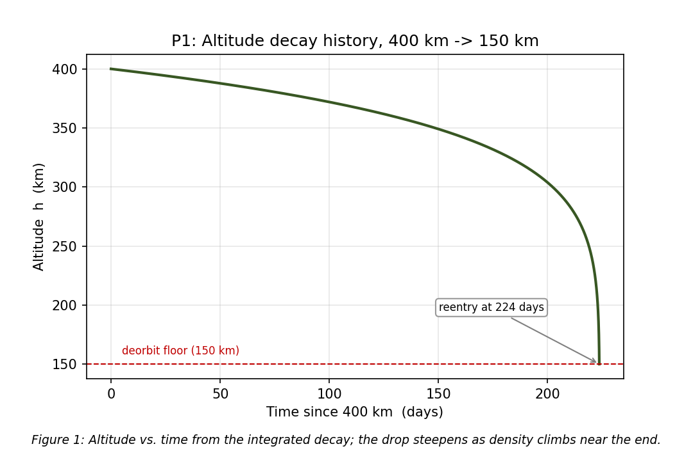
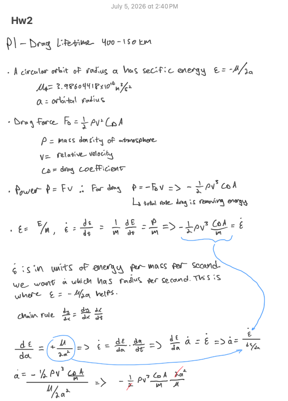
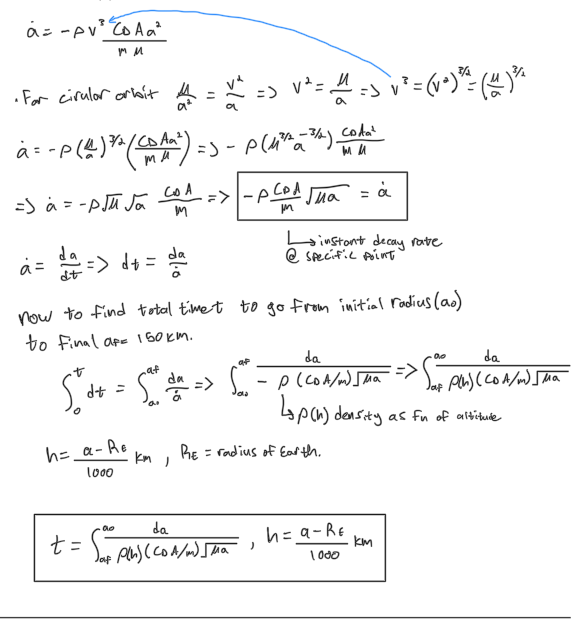
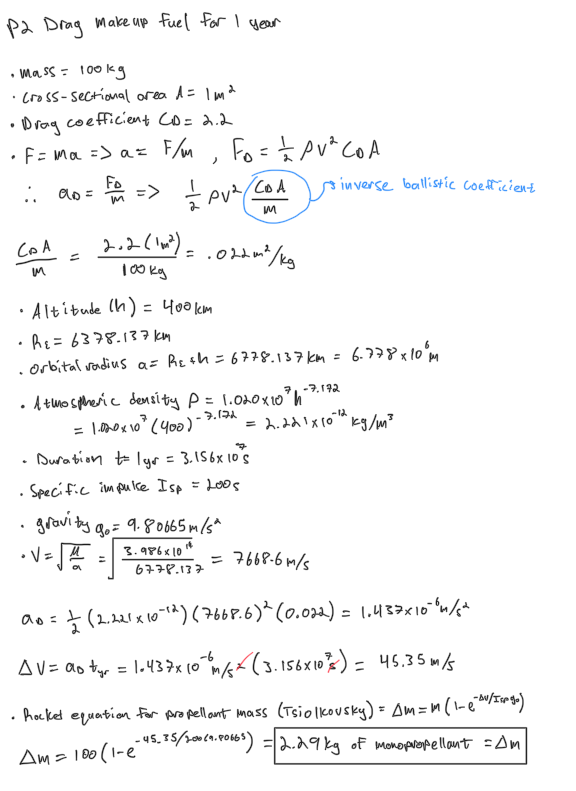
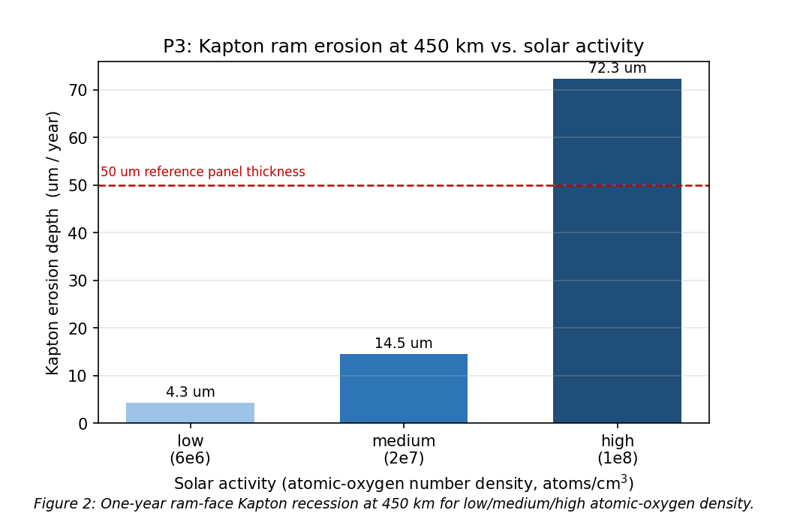
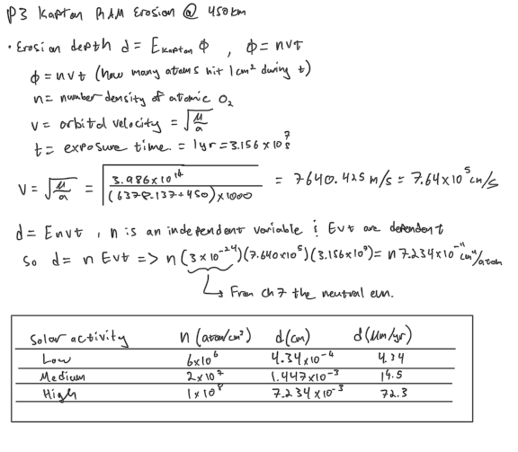
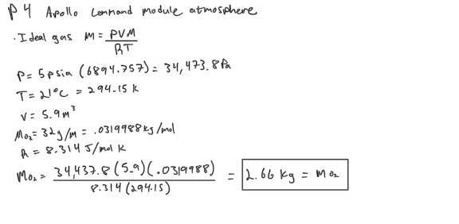
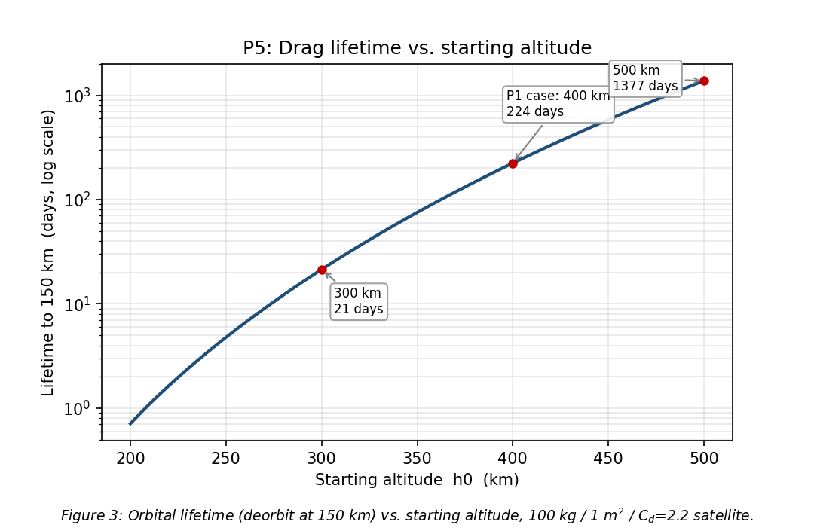
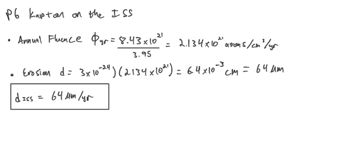

# SPCE 5065: Homework 2
**Atmospheric drag, orbital decay/lifetime, and atomic-oxygen erosion**
**Author:** Jordan Clayton
**Date:** July 3, 2026

---

## Problem 1: Drag Lifetime from 400 km to 150 km

> *A 100 kg satellite with effective cross-sectional area 1 m², drag coefficient 2.2, is in a 400 km circular orbit. A rough thermosphere density estimate is ρ = 1.020×10⁷ · h⁻⁷·¹⁷² (kg/m³, h in km, valid above 150 km). Estimate the lifetime assuming deorbit at 150 km. Do not assume an average R value as we did for the in-class exercise.*

Drag force is $F_D = \tfrac{1}{2}\rho C_D A v^2$ [1]. A circular orbit has specific energy $\varepsilon = -\mu/(2a)$, which drag drains at $\dot\varepsilon = -\tfrac{1}{2}\rho C_D A v^3/m$ [1]. Dividing one by the other turns energy loss into altitude loss. With $v^2 = \mu/a$ and $d\varepsilon/da = \mu/(2a^2)$:

$$\dot a = \frac{-\tfrac{1}{2}\rho\,\frac{C_D A}{m}\,v^3}{\mu/(2a^2)} = -\rho\,\frac{C_D A}{m}\,a^2\,\frac{v^3}{\mu}, \qquad v^3 = \left(\frac{\mu}{a}\right)^{3/2}$$

$$\boxed{\;\dot a = -\rho\,\frac{C_D A}{m}\,\sqrt{\mu\,a}\;}$$

That is the decay law. Lifetime is the reciprocal integrated from $a_0$ (400 km) down to $a_f$ (150 km):

$$t = \int_{a_f}^{a_0} \frac{da}{\rho(h)\,\frac{C_D A}{m}\,\sqrt{\mu\,a}}, \qquad h = \frac{a - R_E}{1000}\ \text{km}$$

$\rho(h)$ sits inside the integral and swings nearly three orders of magnitude over the fall (Table 1), so freezing an "average R" like the in-class exercise [1] would badly misjudge it. I evaluated $\rho$, $v$, and $a$ at each altitude and integrated numerically.

**Table 1:** Density and speed across the decay band (from the power-law model).

| Altitude $h$ (km) | $\rho$ (kg/m³) | $v$ (km/s) |
|---:|---:|---:|
| 400 | 2.221×10⁻¹² | 7.669 |
| 300 | 1.749×10⁻¹¹ | 7.726 |
| 200 | 3.203×10⁻¹⁰ | 7.784 |
| 150 | 2.522×10⁻⁹ | 7.814 |

Running the integral with $C_D A/m = 0.0220\ \text{m}^2/\text{kg}$ and $\mu = 3.986\times10^{14}\ \text{m}^3/\text{s}^2$:

$$\boxed{\;t \approx 1.93\times10^{7}\ \text{s} = 223.7\ \text{days} \approx 0.61\ \text{yr}\;}$$

**Figure 1** shows the decay history: the satellite lingers near 400 km, then drops fast in the final weeks as density runs away. That back-loading is why a single average density misleads.



**Sanity check:** ~7 months from 400 km is reasonable for a 100 kg / 1 m² object. 

**Hand calcs:**

<p align="center"></p>
<p align="center"></p>

---

## Problem 2: Drag-Makeup Fuel for One Year

> *How much drag-makeup fuel is needed for the spacecraft in problem 1 to hold its original 400 km orbit for one year? Assume average solar-cycle conditions and a monopropellant with Isp = 200 s. Use your model from problem 1 for the density.*

At fixed 400 km the drag deceleration is constant, so the year's velocity increment is just that deceleration times elapsed time:

$$a_D = \tfrac{1}{2}\rho v^2\,\frac{C_D A}{m}, \qquad \Delta v = a_D \cdot t_{\text{yr}} = 45.35\ \text{m/s}$$

with $\rho(400) = 2.221\times10^{-12}$ kg/m³ (P1 model; "average conditions" is just the fitted curve) and $v = 7668.6$ m/s. Propellant from the rocket equation [2], $I_{sp} = 200$ s (arithmetic in the hand calc):

$$\Delta m = m\left(1 - e^{-\Delta v / (I_{sp} g_0)}\right)$$

$$\boxed{\;\Delta m \approx 2.29\ \text{kg of monopropellant}\;}$$


**Hand calcs:**

<p align="center"></p>

---

## Problem 3: Kapton Ram Erosion at 450 km

> *Determine the per-year erosion depth of a Kapton panel oriented in the RAM direction at 450 km during low, medium, and high solar activity. The atomic-oxygen number densities are 6×10⁶, 2×10⁷, and 1×10⁸ atoms/cm³, respectively.*

Erosion depth is the erosion yield (Ch. 7 calls it reaction efficiency) times the atomic-oxygen fluence [1], [3]:

$$d = E_{\text{Kapton}} \cdot \Phi, \qquad \Phi = n\,v\,t$$

I used $E_{\text{Kapton}} = 3.0\times10^{-24}\ \text{cm}^3/\text{atom}$ (Table 7-3 gives 3.04×10⁻²⁴, the lecture 3.1×10⁻²⁴; all within ~3%) [3], ram speed $v = 7.640\times10^{5}$ cm/s at 450 km, and $t = 3.156\times10^{7}$ s (one year), all in CGS.

**Table 2:** One-year ram-face Kapton erosion at 450 km.

| Solar activity | $n$ (atoms/cm³) | Fluence $\Phi$ (atoms/cm²·yr) | Erosion depth (µm/yr) |
|:---|---:|---:|---:|
| Low | 6×10⁶ | 1.447×10²⁰ | 4.34 |
| Medium | 2×10⁷ | 4.822×10²⁰ | 14.47 |
| High | 1×10⁸ | 2.411×10²¹ | 72.33 |

$$\boxed{\;d_{\text{low}} = 4.34\ \mu\text{m},\quad d_{\text{med}} = 14.5\ \mu\text{m},\quad d_{\text{high}} = 72.3\ \mu\text{m}\ \text{(per year)}\;}$$

**Figure 2** plots these against the 50 µm reference panel thickness [1]: at high activity erosion exceeds a full thickness, so bare ram-facing Kapton would be eaten through, which is why flight hardware is coated.




**Hand calcs:**

<p align="center"></p>

---

## Problem 4: Apollo Command Module Atmosphere

> *The Apollo command module has a volume of 5.9 m³, with a 100% oxygen atmosphere at 5 psia and 21°C. (a) Determine the mass of oxygen present. (b) Would you recommend this atmosphere for a human vehicle bound for Mars? If not, what would you recommend?*

### (a) Mass of oxygen

Ideal gas law $m = PVM/(RT)$, in SI ($P = 34{,}473.8$ Pa, $V = 5.9$ m³, $T = 294.15$ K, $M_{O_2} = 0.0320$ kg/mol) (arithmetic in the hand calc):

$$\boxed{\;m_{O_2} = 2.66\ \text{kg}\;}$$

**Sanity check:** $m/V = 0.45$ kg/m³, about a third of sea-level air density, matching the third-of-an-atmosphere cabin pressure.

**Hand calcs:**

<p align="center"></p>

### (b) Recommendation for a Mars vehicle

**No, I would not fly pure oxygen at 5 psia to Mars.** This is essentially the Apollo 1 atmosphere: a pure-O₂ cabin (16.7 psia on the pad) where a spark became a fatal flash fire, killing three astronauts in 1967 [4]. Lower in-flight pressure helped, but the flammability problem never goes away in pure O₂. For a multi-month transit:

- **Fire risk.** In pure O₂, materials ignite easily and burn hot; over a long crewed mission that is an unacceptable standing hazard [4].
- **Physiology.** Prolonged 100% O₂ risks pulmonary oxygen toxicity, tolerable for a short Apollo sortie but not for months.
- **No margin.** With no diluent you cannot lower flammability without starving the crew of oxygen.

**Recommend instead:** a two-gas atmosphere (O₂ plus an inert diluent like N₂) with O₂ partial pressure near the sea-level normoxic ~3 psia. Simplest is a ~14.7 psia mixed cabin; if pressure must drop, NASA's exploration atmosphere (~8.2 psia, ~34% O₂) stays normoxic while cutting EVA prebreathe and flammability [5]. The diluent is the point: normal oxygen for the crew without a fire hazard.

---

## Problem 5: Lifetime vs. Starting Altitude, 200 to 500 km

> *Create a plot of the lifetime of the satellite in problem 1 for all starting altitudes between 200 and 500 km.*

Same integrator as P1 (150 km floor [1]) swept over 200 to 500 km. **Figure 3** plots it on a log axis.



**Table 3:** Lifetime at selected starting altitudes (deorbit at 150 km).

| Start altitude (km) | Lifetime (days) | Lifetime (yr) |
|---:|---:|---:|
| 200 | 0.71 | 0.002 |
| 250 | 4.78 | 0.013 |
| 300 | 21.4 | 0.059 |
| 350 | 75.3 | 0.206 |
| 400 | 223.7 | 0.612 |
| 450 | 583.8 | 1.598 |
| 500 | 1376.7 | 3.769 |

The 400 km row matches P1 (223.7 days), a cross-check. The curve is steep: under a day at 200 km, nearly four years 300 km higher, driven by $\rho \propto h^{-7.172}$. That is why operators fight for every kilometer of starting altitude.

---

## Problem 6: Kapton on the ISS

> *The ISS uses Kapton for some applications. (a) What is Kapton used for on the ISS? (b) Estimate the one-year erosion of Kapton on the ISS due to atomic oxygen.*

### (a) What Kapton does on the ISS

Kapton is a polyimide film, flexible and stable across a large temperature range. It is used wherever one needs thin thermal or electrical insulation [3], [6]:

- **Thermal blankets / Multi Layer Insulation (MLI).** Aluminized Kapton is the main MLI layer wrapping modules; these exterior blankets are the ram surfaces that take atomic oxygen (AO) erosion [6].
- **Component insulation.** Kapton films insulate components and harnesses [3].
- **Electrical insulation.** Its dielectric strength makes it a standard wire-wrap and flex-circuit material.

The ISS is itself a data source: MISSE-2 PEACE flew Kapton-H samples on the exterior to measure LEO AO erosion [6], [7].

### (b) One-year erosion estimate

Same model as P3, $d = E_{\text{Kapton}}\,\Phi$, but anchored to a measured ISS fluence: MISSE-2 PEACE recorded $8.43\times10^{21}$ atoms/cm² over 3.95 years [7], i.e. $\Phi_{\text{yr}} = 2.13\times10^{21}$ atoms/cm²/yr. With $E_{\text{Kapton}} = 3.0\times10^{-24}$ cm³/atom [3], [7] (arithmetic in the hand calc):

$$\boxed{\;d_{\text{ISS}} \approx 64\ \mu\text{m of bare Kapton eroded per year (ram face)}\;}$$

**Sanity check:** 64 µm/yr sits between the P3 medium and high cases, fitting the ISS's lower altitude and MISSE-2's active-solar span. This is the *bare* rate; real ISS Kapton is coated, so it is a worst case, not what a flight blanket loses.

**Hand calcs:**

<p align="center"></p>

---

### Sources Cited

[1] George, L., "The Neutral Environment: Lesson 2," SPCE 5065 lecture video transcript and Lesson 2 slides, University of Colorado Colorado Springs, 2026.

[2] Sutton, G. P., and Biblarz, O., *Rocket Propulsion Elements*, 9th ed., Wiley, Hoboken, NJ, 2017, Chap. 2 (ideal rocket equation and specific impulse).

[3] "The Neutral Environment," SPCE 5065 Course Reading, Chapter 7 (atomic-oxygen material degradation; Kapton reaction efficiency, Table 7-3).

[4] "Report of Apollo 204 Review Board," NASA, Washington, DC, 1967, https://history.nasa.gov/Apollo204/ [retrieved 2 July 2026].

[5] Norcross, J. R., et al., "Effects of the 8 psia / 32% O2 Atmosphere on the Human in the Spaceflight Environment," NASA/TM-2013-217377, NASA Johnson Space Center, 2013.

[6] Finckenor, M. M., and de Groh, K. K., "A Researcher's Guide to: International Space Station Space Environmental Effects," NP-2015-03-015-JSC, NASA ISS Program Science Office, 2020, https://www.nasa.gov/connect/ebooks/iss-researchers-guide-space-environmental-effects/ [retrieved 2 July 2026].

[7] de Groh, K. K., Banks, B. A., McCarthy, C. E., Rucker, R. N., Roberts, L. M., and Berger, L. A., "MISSE 2 PEACE Polymers Atomic Oxygen Erosion Experiment on the International Space Station," *High Performance Polymers*, Vol. 20, No. 4-5, 2008, pp. 388-409.

---

## Appendix: Python Solution Script

```python
"""SPCE 5065 -- Homework 2 solution.

Atmospheric drag, orbital decay/lifetime, and atomic-oxygen erosion. Covers the
quantitative parts of HW2:

  P1  Drag lifetime of a 100 kg / 1 m^2 / Cd=2.2 satellite, 400 km -> 150 km,
      using the altitude-varying thermosphere density power law (no constant R).
  P2  Drag-makeup fuel to hold the 400 km orbit for one year (Isp = 200 s).
  P3  Kapton ram-face erosion depth per year at 450 km, low/med/high AO density.
  P4a Mass of oxygen in the Apollo command module (ideal gas).
  P5  Lifetime vs. starting altitude for all start altitudes 200-500 km.
  P6b ISS Kapton ram erosion over one year, anchored to MISSE-2 PEACE fluence.

Density model (problem statement, valid >150 km, h in km, rho in kg/m^3):
  rho(h) = 1.020e7 * h^(-7.172)

Drag/decay model (Lesson 2): F_drag = -1/2 rho Cd A v^2, energy of a circular
orbit E = -m mu / (2a), dE/dt = -1/2 rho Cd A v^3, which collapses to
  da/dt = -rho (Cd A / m) sqrt(mu a)
so the lifetime is the closed integral
  t = integral_{a_f}^{a_0} da / [ rho(h) (Cd A/m) sqrt(mu a) ].
Because rho, v, and a all change as the satellite falls, this is integrated
numerically -- that is exactly what "do not assume an average R" requires.

Outputs:
  - Console tables reproducing every boxed number in the submission
  - figures/fig1_lifetime_vs_altitude.png   (P5)
  - figures/fig2_decay_profile.png          (P1)
  - figures/fig3_kapton_erosion.png         (P3)

Conceptual parts (P4b, P6a) are answered in the submission document.
"""
from __future__ import annotations

import sys
from pathlib import Path

import matplotlib.pyplot as plt
import numpy as np
from scipy.integrate import quad, solve_ivp

# --------------------------------------------------------------------------
# Constants
# --------------------------------------------------------------------------
MU = 3.986004418e14          # m^3/s^2   Earth gravitational parameter
R_E = 6378.137e3             # m         Earth equatorial radius
G0 = 9.80665                 # m/s^2     standard gravity (rocket equation)
R_UNIV = 8.314462618         # J/(mol*K) universal gas constant
M_O2 = 0.0319988             # kg/mol    molar mass of O2
YEAR_S = 365.25 * 86400.0    # s         one year

# Spacecraft (P1/P2/P5)
M_SAT = 100.0                # kg
A_SAT = 1.0                  # m^2
CD = 2.2                     # drag coefficient
BC = CD * A_SAT / M_SAT      # m^2/kg    inverse ballistic coeff (Cd A / m)

# Kapton atomic-oxygen erosion yield (Ch. 7 Table 7-3 ~ 3.04e-24; course 3.1e-24)
E_KAPTON = 3.0e-24           # cm^3/atom

FIG_DIR = Path(__file__).parent / "figures"


# --------------------------------------------------------------------------
# Atmosphere + orbit helpers
# --------------------------------------------------------------------------
def rho(h_km: float | np.ndarray) -> float | np.ndarray:
    """Thermosphere density (kg/m^3) from the HW power-law fit, h in km."""
    return 1.020e7 * np.asarray(h_km, dtype=float) ** (-7.172)


def v_circ(h_km: float) -> float:
    """Circular orbital speed (m/s) at altitude h (km).  v = sqrt(mu/a)."""
    return np.sqrt(MU / (R_E + h_km * 1.0e3))


# --------------------------------------------------------------------------
# P1 / P5 -- drag lifetime by numerical integration
# --------------------------------------------------------------------------
def _life_integrand(a: float) -> float:
    """dt/da = 1 / [rho (Cd A/m) sqrt(mu a)] with rho evaluated at the
    instantaneous altitude (km).  R = a is NOT frozen."""
    h_km = (a - R_E) / 1.0e3
    return 1.0 / (rho(h_km) * BC * np.sqrt(MU * a))


def lifetime(h0_km: float, hf_km: float = 150.0) -> float:
    """Orbital lifetime (s) decaying from h0 to the hf deorbit altitude."""
    a0 = R_E + h0_km * 1.0e3
    af = R_E + hf_km * 1.0e3
    val, _ = quad(_life_integrand, af, a0, limit=400)
    return val


def decay_profile(h0_km: float, hf_km: float = 150.0):
    """Integrate da/dt to get altitude vs. time for the decay-history figure."""
    a0 = R_E + h0_km * 1.0e3
    af = R_E + hf_km * 1.0e3

    def dadt(_t, a):
        h_km = (a[0] - R_E) / 1.0e3
        return [-rho(h_km) * BC * np.sqrt(MU * a[0])]

    def hit_floor(_t, a):
        return a[0] - af
    hit_floor.terminal = True
    hit_floor.direction = -1

    t_span = (0.0, 5.0 * lifetime(h0_km, hf_km))
    sol = solve_ivp(dadt, t_span, [a0], events=hit_floor, max_step=3600.0,
                    rtol=1e-9, atol=1.0)
    t_days = sol.t / 86400.0
    h_km = (sol.y[0] - R_E) / 1.0e3
    return t_days, h_km


def p1_p5() -> dict:
    print("=" * 72)
    print("P1 -- drag lifetime 400 km -> 150 km (varying R, rho, v)")
    print("=" * 72)
    t1 = lifetime(400.0, 150.0)
    print(f"  rho(400 km) = {rho(400.0):.4e} kg/m^3,  v(400 km) = {v_circ(400.0):.1f} m/s")
    print(f"  Cd A/m = {BC:.4f} m^2/kg")
    print(f"  lifetime = {t1:.4e} s = {t1/86400:.2f} days = {t1/YEAR_S:.3f} yr")

    print("\n" + "=" * 72)
    print("P5 -- lifetime vs. starting altitude (200-500 km)")
    print("=" * 72)
    starts = [200, 250, 300, 350, 400, 450, 500]
    for h0 in starts:
        t = lifetime(float(h0), 150.0)
        print(f"  {h0:3d} km -> {t/86400:9.2f} days = {t/YEAR_S:7.3f} yr")
    return {"t1_days": t1 / 86400.0, "starts": starts}


# --------------------------------------------------------------------------
# P2 -- drag-makeup fuel for one year at 400 km
# --------------------------------------------------------------------------
def p2() -> dict:
    print("\n" + "=" * 72)
    print("P2 -- drag-makeup fuel, 400 km, 1 year, Isp = 200 s")
    print("=" * 72)
    h = 400.0
    v = v_circ(h)
    a_drag = 0.5 * rho(h) * v ** 2 * BC          # m/s^2 (= 1/2 rho v^2 Cd A / m)
    dv = a_drag * YEAR_S                          # m/s, drag decel held one year
    isp = 200.0
    dm = M_SAT * (1.0 - np.exp(-dv / (isp * G0)))  # rocket equation
    dm_lin = M_SAT * dv / (isp * G0)               # small-burn approximation
    print(f"  drag decel a_d = 1/2 rho v^2 (Cd A/m) = {a_drag:.4e} m/s^2")
    print(f"  delta-v over 1 yr = {dv:.2f} m/s")
    print(f"  fuel (rocket eqn) = {dm:.3f} kg   (linear approx {dm_lin:.3f} kg)")
    return {"dv": dv, "dm": dm}


# --------------------------------------------------------------------------
# P3 -- Kapton ram erosion at 450 km
# --------------------------------------------------------------------------
def p3() -> dict:
    print("\n" + "=" * 72)
    print("P3 -- Kapton ram erosion at 450 km (low/med/high AO density)")
    print("=" * 72)
    v_cms = v_circ(450.0) * 100.0                 # cm/s
    print(f"  v(450 km) = {v_circ(450.0):.1f} m/s = {v_cms:.4e} cm/s")
    cases = {"low": 6e6, "medium": 2e7, "high": 1e8}  # atoms/cm^3
    out = {}
    for label, n in cases.items():
        fluence = n * v_cms * YEAR_S              # atoms/cm^2/yr
        depth_cm = E_KAPTON * fluence
        out[label] = depth_cm * 1.0e4             # micron/yr
        print(f"  {label:6s}: n={n:.0e}  Phi={fluence:.3e} atoms/cm^2/yr  "
              f"depth={depth_cm*1e4:7.2f} um/yr")
    return out


# --------------------------------------------------------------------------
# P4a -- oxygen mass in the Apollo command module
# --------------------------------------------------------------------------
def p4a() -> dict:
    print("\n" + "=" * 72)
    print("P4a -- O2 mass in the Apollo command module")
    print("=" * 72)
    p_pa = 5.0 * 6894.757                          # 5 psia -> Pa
    vol = 5.9                                       # m^3
    temp = 21.0 + 273.15                            # K
    n_mol = p_pa * vol / (R_UNIV * temp)
    mass = n_mol * M_O2
    print(f"  P = {p_pa:.1f} Pa (5 psia), V = {vol} m^3, T = {temp:.2f} K")
    print(f"  n = {n_mol:.2f} mol,  mass O2 = {mass:.3f} kg")
    return {"mass": mass}


# --------------------------------------------------------------------------
# P6b -- ISS Kapton erosion, one year (MISSE-2 PEACE anchored)
# --------------------------------------------------------------------------
def p6b() -> dict:
    print("\n" + "=" * 72)
    print("P6b -- ISS Kapton ram erosion, 1 year")
    print("=" * 72)
    fluence_4yr = 8.43e21                           # atoms/cm^2 over 3.95 yr (MISSE-2)
    years = 3.95
    fluence_yr = fluence_4yr / years                # atoms/cm^2/yr
    depth_cm = E_KAPTON * fluence_yr
    print(f"  MISSE-2 PEACE fluence = {fluence_4yr:.3e} atoms/cm^2 over {years} yr")
    print(f"  annual fluence = {fluence_yr:.3e} atoms/cm^2/yr")
    print(f"  Kapton erosion = {depth_cm*1e4:.1f} um/yr  ({depth_cm*10:.3f} mm/yr)")
    return {"depth_um": depth_cm * 1e4}


# --------------------------------------------------------------------------
# Figures
# --------------------------------------------------------------------------
def _caption(fig, text: str) -> None:
    fig.text(0.5, 0.01, text, ha="center", va="bottom", fontsize=9, style="italic")


def fig_lifetime_vs_altitude() -> None:
    h0 = np.arange(200.0, 501.0, 5.0)
    t_days = np.array([lifetime(h, 150.0) / 86400.0 for h in h0])
    fig, ax = plt.subplots(figsize=(7.2, 4.7))
    ax.semilogy(h0, t_days, color="#1f4e79", lw=2)
    for h_mark, lab, off in [(400, "P1 case: 400 km", (-4, 30)),
                             (300, "300 km", (8, -28)),
                             (500, "500 km", (-58, -6))]:
        tv = lifetime(float(h_mark), 150.0) / 86400.0
        ax.plot(h_mark, tv, "o", color="#c00000", ms=5)
        ax.annotate(f"{lab}\n{tv:.0f} days", xy=(h_mark, tv), xytext=off,
                    textcoords="offset points", fontsize=8,
                    bbox=dict(boxstyle="round,pad=0.3", fc="white", ec="0.6", alpha=0.9),
                    arrowprops=dict(arrowstyle="->", color="0.5"))
    ax.set_xlabel("Starting altitude  h0  (km)")
    ax.set_ylabel("Lifetime to 150 km  (days, log scale)")
    ax.set_title("P5: Drag lifetime vs. starting altitude")
    ax.grid(True, which="both", alpha=0.3)
    fig.subplots_adjust(bottom=0.17)
    _caption(fig, "Figure 3: Orbital lifetime (deorbit at 150 km) vs. starting "
                  "altitude, 100 kg / 1 m$^2$ / C$_d$=2.2 satellite.")
    fig.savefig(FIG_DIR / "fig1_lifetime_vs_altitude.png", dpi=150)
    plt.close(fig)


def fig_decay_profile() -> None:
    t_days, h_km = decay_profile(400.0, 150.0)
    fig, ax = plt.subplots(figsize=(7.2, 4.7))
    ax.plot(t_days, h_km, color="#385723", lw=2)
    ax.axhline(150.0, color="#c00000", ls="--", lw=1)
    ax.text(5, 158, "deorbit floor (150 km)", color="#c00000", fontsize=8)
    ax.annotate(f"reentry at {t_days[-1]:.0f} days", xy=(t_days[-1], 150),
                xytext=(-120, 40), textcoords="offset points", fontsize=8,
                bbox=dict(boxstyle="round,pad=0.3", fc="white", ec="0.6"),
                arrowprops=dict(arrowstyle="->", color="0.5"))
    ax.set_xlabel("Time since 400 km  (days)")
    ax.set_ylabel("Altitude  h  (km)")
    ax.set_title("P1: Altitude decay history, 400 km -> 150 km")
    ax.grid(True, alpha=0.3)
    fig.subplots_adjust(bottom=0.16)
    _caption(fig, "Figure 1: Altitude vs. time from the integrated decay; the "
                  "drop steepens as density climbs near the end.")
    fig.savefig(FIG_DIR / "fig2_decay_profile.png", dpi=150)
    plt.close(fig)


def fig_kapton_erosion(p3_out: dict) -> None:
    labels = ["low\n(6e6)", "medium\n(2e7)", "high\n(1e8)"]
    vals = [p3_out["low"], p3_out["medium"], p3_out["high"]]
    fig, ax = plt.subplots(figsize=(7.0, 4.6))
    bars = ax.bar(labels, vals, color=["#9dc3e6", "#2e75b6", "#1f4e79"], width=0.6)
    ax.axhline(50.0, color="#c00000", ls="--", lw=1.2)
    ax.text(-0.42, 52.0, "50 um reference panel thickness", color="#c00000",
            fontsize=8, ha="left")
    for b, v in zip(bars, vals):
        ax.annotate(f"{v:.1f} um", xy=(b.get_x() + b.get_width()/2, v),
                    xytext=(0, 4), textcoords="offset points", ha="center", fontsize=9)
    ax.set_xlabel("Solar activity (atomic-oxygen number density, atoms/cm$^3$)")
    ax.set_ylabel("Kapton erosion depth  (um / year)")
    ax.set_title("P3: Kapton ram erosion at 450 km vs. solar activity")
    ax.grid(True, axis="y", alpha=0.3)
    fig.subplots_adjust(bottom=0.18)
    _caption(fig, "Figure 2: One-year ram-face Kapton recession at 450 km for "
                  "low/medium/high atomic-oxygen density.")
    fig.savefig(FIG_DIR / "fig3_kapton_erosion.png", dpi=150)
    plt.close(fig)


# --------------------------------------------------------------------------
def main() -> None:
    sys.stdout.reconfigure(encoding="utf-8")
    FIG_DIR.mkdir(exist_ok=True)

    p1_p5()
    p2()
    p3_out = p3()
    p4a()
    p6b()

    fig_lifetime_vs_altitude()
    fig_decay_profile()
    fig_kapton_erosion(p3_out)
    print("\nFigures written to:", FIG_DIR)


if __name__ == "__main__":
    main()
```
