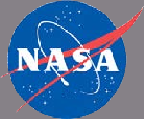

National Aeronautics and Space Administration

# Voyages

Charting the Course for Sustainable Human Space Exploration

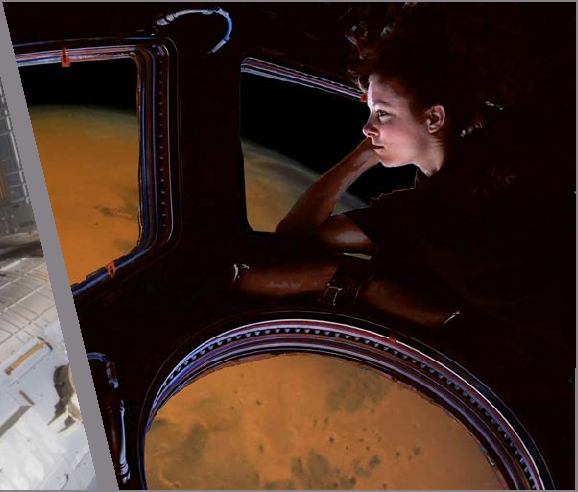

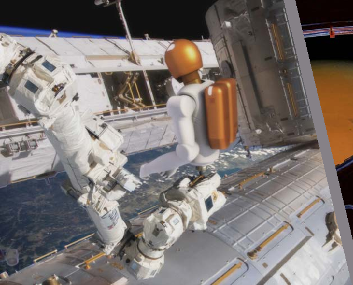

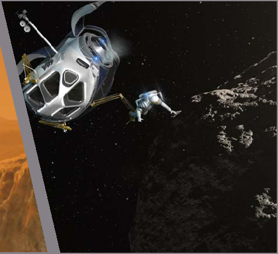

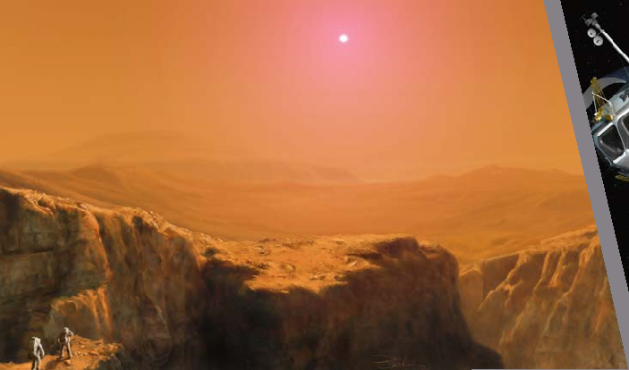

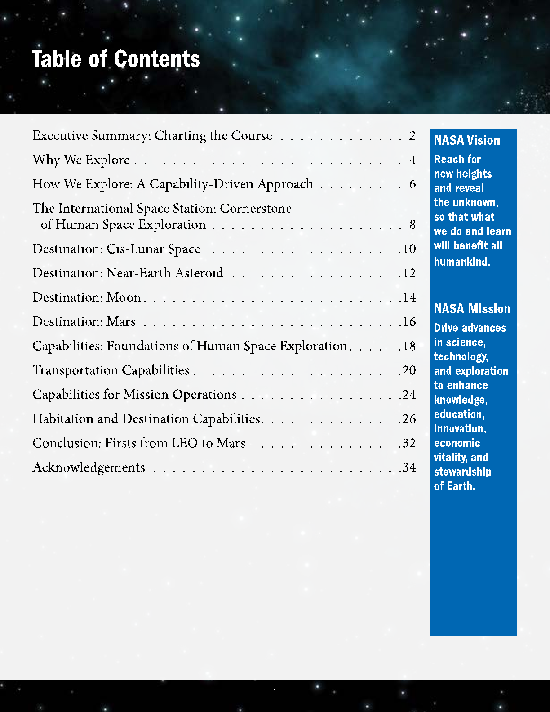

## Table of Contents

Executive Summary: Charting the Course 2 Why We Explore 4 How We Explore: A Capability-Driven Approach 6 The International Space Station: Cornerstone

#### NASA Vision

Reach for new heights and reveal the unknown, so that what we do and learn will benefit all humankind.

of Human Space Exploration 8 Destination: Cis-Lunar Space 10 Destination: Near-Earth Asteroid 12 Destination: Moon 14 Destination: Mars 16 Capabilities: Foundations of Human Space Exploration 18 Transportation Capabilities 20 Capabilities for Mission Operations 24 Habitation and Destination Capabilities 26 Conclusion: Firsts from LEO to Mars 32 Acknowledgements 34

#### NASA Mission

Drive advances in science, technology, and exploration to enhance knowledge, education, innovation, economic vitality, and stewardship of Earth.

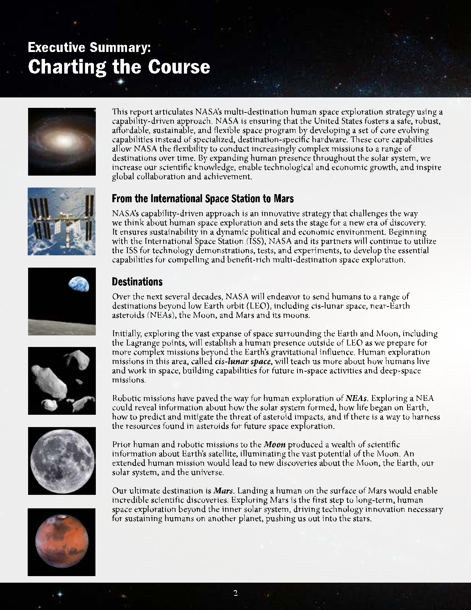

Executive Summary:

## Charting the Course

This report articulates NASA’s multi-destination human space exploration strategy using a capability-driven approach NASA is ensuring that the United States fosters a safe, robust, affordable, sustainable, and flexible space program by developing a set of core evolving capabilities instead of specialized, destination-specific hardware These core capabilities allow NASA the flexibility to conduct increasingly complex missions to a range of destinations over time By expanding human presence throughout the solar system, we increase our scientific knowledge, enable technological and economic growth, and inspire global collaboration and achievement

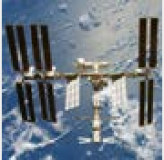

#### From the International Space Station to Mars

NASA’s capability-driven approach is an innovative strategy that challenges the way we think about human space exploration and sets the stage for a new era of discovery It ensures sustainability in a dynamic political and economic environment Beginning with the International Space Station (ISS), NASA and its partners will continue to utilize the ISS for technology demonstrations, tests, and experiments, to develop the essential capabilities for compelling and benefit-rich multi-destination space exploration

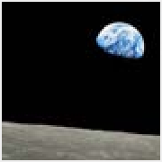

#### Destinations

Over the next several decades, NASA will endeavor to send humans to a range of destinations beyond low Earth orbit (LEO), including cis-lunar space, near-Earth asteroids (NEAs), the Moon, and Mars and its moons

Initially, exploring the vast expanse of space surrounding the Earth and Moon, including the Lagrange points, will establish a human presence outside of LEO as we prepare for more complex missions beyond the Earth’s gravitational influence Human exploration missions in this area, called cis-lunar space, will teach us more about how humans live and work in space, building capabilities for future in-space activities and deep-space missions

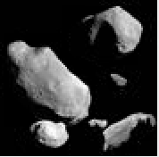

Robotic missions have paved the way for human exploration of NEAs Exploring a NEA could reveal information about how the solar system formed, how life began on Earth, how to predict and mitigate the threat of asteroid impacts, and if there is a way to harness the resources found in asteroids for future space exploration

Prior human and robotic missions to the Moon produced a wealth of scientific information about Earth’s satellite, illuminating the vast potential of the Moon An extended human mission would lead to new discoveries about the Moon, the Earth, our solar system, and the universe

Our ultimate destination is Mars Landing a human on the surface of Mars would enable incredible scientific discoveries Exploring Mars is the first step to long-term, human space exploration beyond the inner solar system, driving technology innovation necessary for sustaining humans on another planet, pushing us out into the stars

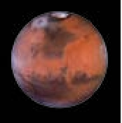

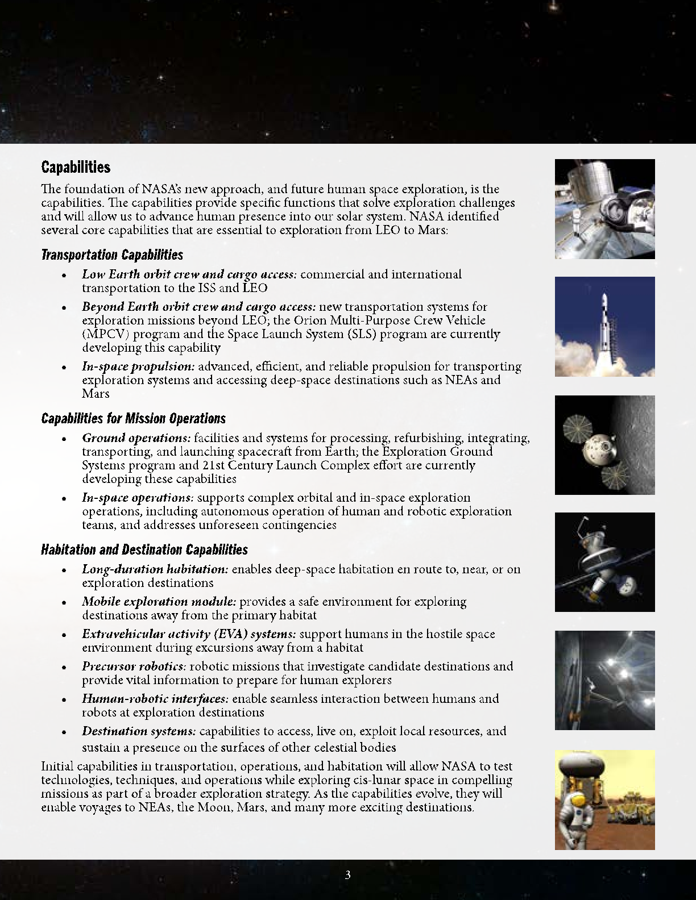

#### Capabilities

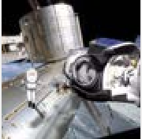

The foundation of NASA’s new approach, and future human space exploration, is the capabilities The capabilities provide specific functions that solve exploration challenges and will allow us to advance human presence into our solar system NASA identified several core capabilities that are essential to exploration from LEO to Mars:

###### Transportation Capabilities

- • Low Earth orbit crew and cargo access: commercial and international transportation to the ISS and LEO
- • Beyond Earth orbit crew and cargo access: new transportation systems for exploration missions beyond LEO; the Orion Multi-Purpose Crew Vehicle (MPCV) program and the Space Launch System (SLS) program are currently developing this capability
- • In-space propulsion: advanced, efficient, and reliable propulsion for transporting exploration systems and accessing deep-space destinations such as NEAs and Mars

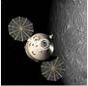

###### Capabilities for Mission Operations

- • Ground operations: facilities and systems for processing, refurbishing, integrating, transporting, and launching spacecraft from Earth; the Exploration Ground Systems program and 21st Century Launch Complex effort are currently developing these capabilities
- • In-space operations: supports complex orbital and in-space exploration operations, including autonomous operation of human and robotic exploration teams, and addresses unforeseen contingencies

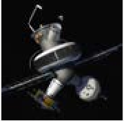

###### Habitation and Destination Capabilities

- • Long-duration habitation: enables deep-space habitation en route to, near, or on exploration destinations
- • Mobile exploration module: provides a safe environment for exploring destinations away from the primary habitat
- • Extravehicular activity (EVA) systems: support humans in the hostile space environment during excursions away from a habitat
- • Precursor robotics: robotic missions that investigate candidate destinations and provide vital information to prepare for human explorers
- • Human-robotic interfaces: enable seamless interaction between humans and robots at exploration destinations
- • Destination systems: capabilities to access, live on, exploit local resources, and sustain a presence on the surfaces of other celestial bodies

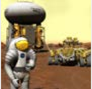

Initial capabilities in transportation, operations, and habitation will allow NASA to test technologies, techniques, and operations while exploring cis-lunar space in compelling missions as part of a broader exploration strategy As the capabilities evolve, they will enable voyages to NEAs, the Moon, Mars, and many more exciting destinations

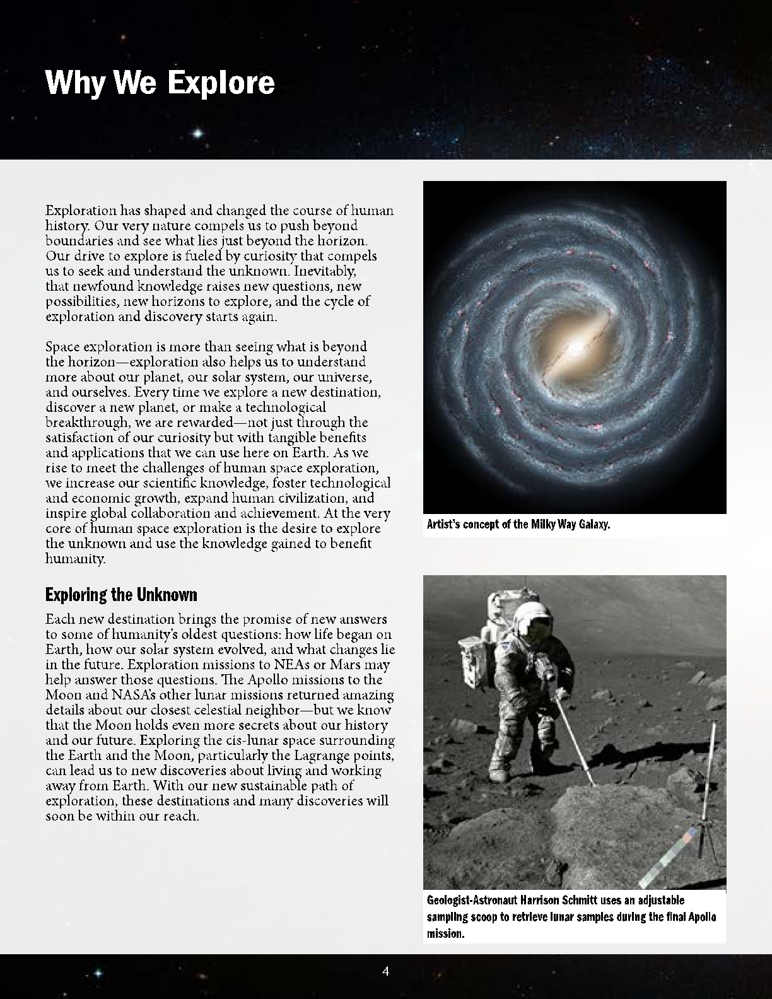

## Why We Explore

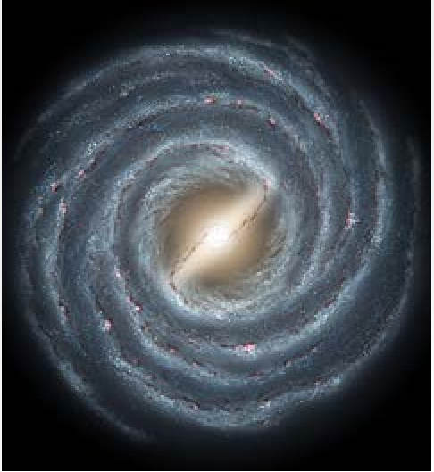

Exploration has shaped and changed the course of human history Our very nature compels us to push beyond boundaries and see what lies just beyond the horizon Our drive to explore is fueled by curiosity that compels us to seek and understand the unknown Inevitably, that newfound knowledge raises new questions, new possibilities, new horizons to explore, and the cycle of exploration and discovery starts again

Space exploration is more than seeing what is beyond the horizon—exploration also helps us to understand more about our planet, our solar system, our universe, and ourselves Every time we explore a new destination, discover a new planet, or make a technological breakthrough, we are rewarded—not just through the satisfaction of our curiosity but with tangible benefits and applications that we can use here on Earth As we rise to meet the challenges of human space exploration, we increase our scientific knowledge, foster technological and economic growth, expand human civilization, and inspire global collaboration and achievement At the very core of human space exploration is the desire to explore the unknown and use the knowledge gained to benefit humanity

Artist’s concept of the Milky Way Galaxy.

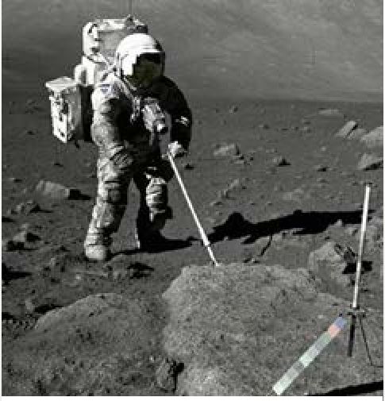

#### Exploring the Unknown

Each new destination brings the promise of new answers to some of humanity’s oldest questions: how life began on Earth, how our solar system evolved, and what changes lie in the future Exploration missions to NEAs or Mars may help answer those questions The Apollo missions to the Moon and NASA’s other lunar missions returned amazing details about our closest celestial neighbor—but we know that the Moon holds even more secrets about our history and our future Exploring the cis-lunar space surrounding the Earth and the Moon, particularly the Lagrange points, can lead us to new discoveries about living and working away from Earth With our new sustainable path of exploration, these destinations and many discoveries will soon be within our reach

Geologist-Astronaut Harrison Schmitt uses an adjustable sampling scoop to retrieve lunar samples during the final Apollo mission.

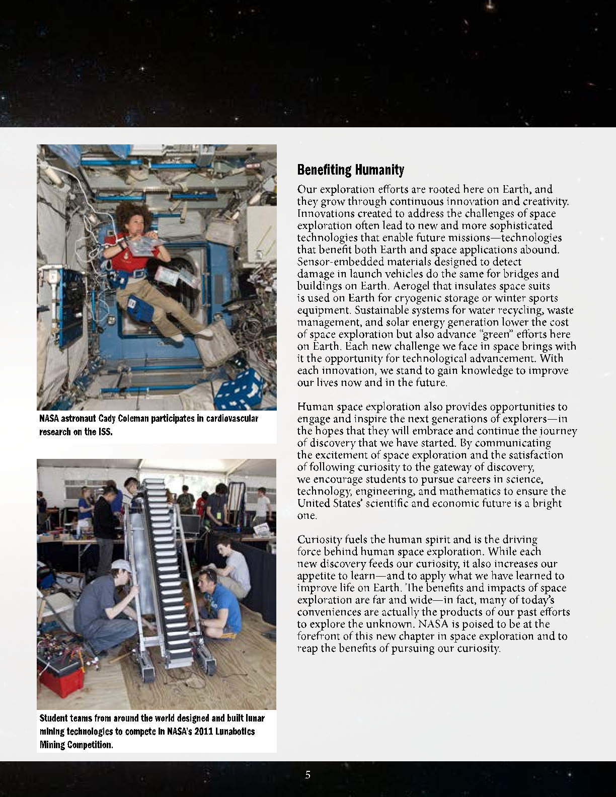

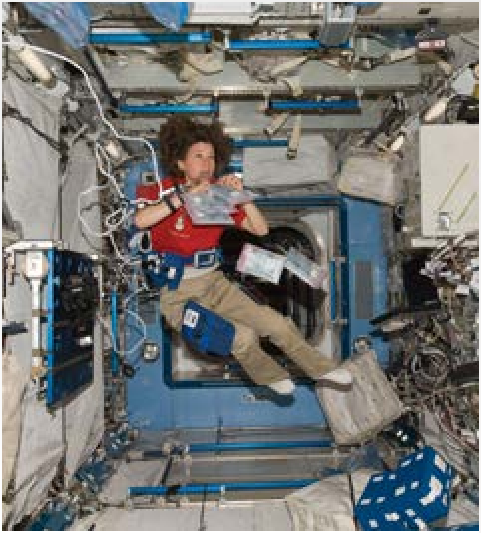

#### Benefiting Humanity

Our exploration efforts are rooted here on Earth, and they grow through continuous innovation and creativity Innovations created to address the challenges of space exploration often lead to new and more sophisticated technologies that enable future missions—technologies that benefit both Earth and space applications abound Sensor-embedded materials designed to detect damage in launch vehicles do the same for bridges and buildings on Earth Aerogel that insulates space suits is used on Earth for cryogenic storage or winter sports equipment Sustainable systems for water recycling, waste management, and solar energy generation lower the cost of space exploration but also advance “green” efforts here on Earth Each new challenge we face in space brings with it the opportunity for technological advancement With each innovation, we stand to gain knowledge to improve our lives now and in the future

Human space exploration also provides opportunities to engage and inspire the next generations of explorers—in the hopes that they will embrace and continue the journey of discovery that we have started By communicating the excitement of space exploration and the satisfaction of following curiosity to the gateway of discovery, we encourage students to pursue careers in science, technology, engineering, and mathematics to ensure the United States’ scientific and economic future is a bright one

NASA astronaut Cady Coleman participates in cardiovascular research on the ISS.

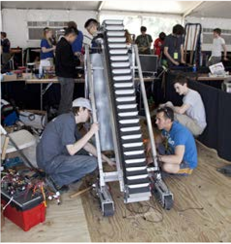

Curiosity fuels the human spirit and is the driving force behind human space exploration While each new discovery feeds our curiosity, it also increases our appetite to learn—and to apply what we have learned to improve life on Earth The benefits and impacts of space exploration are far and wide—in fact, many of today’s conveniences are actually the products of our past efforts to explore the unknown NASA is poised to be at the forefront of this new chapter in space exploration and to reap the benefits of pursuing our curiosity

Student teams from around the world designed and built lunar mining technologies to compete in NASA’s 2011 Lunabotics Mining Competition.

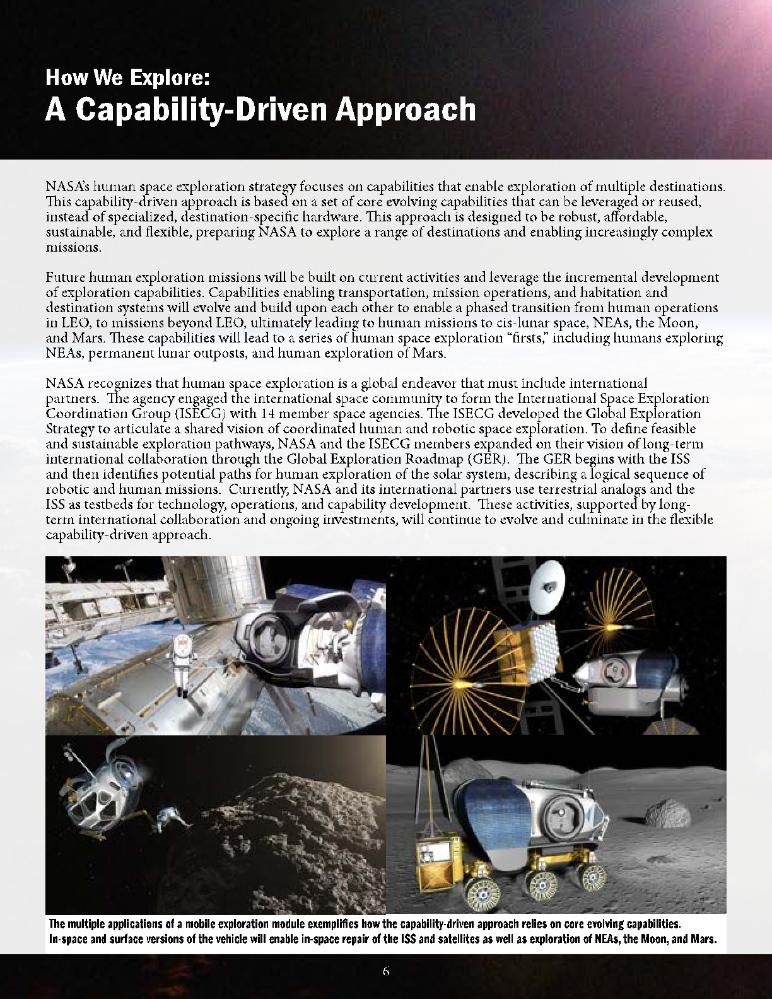

How We Explore:

## A Capability-Driven Approach

NASA’s human space exploration strategy focuses on capabilities that enable exploration of multiple destinations This capability-driven approach is based on a set of core evolving capabilities that can be leveraged or reused, instead of specialized, destination-specific hardware This approach is designed to be robust, affordable, sustainable, and flexible, preparing NASA to explore a range of destinations and enabling increasingly complex missions

Future human exploration missions will be built on current activities and leverage the incremental development of exploration capabilities Capabilities enabling transportation, mission operations, and habitation and destination systems will evolve and build upon each other to enable a phased transition from human operations in LEO, to missions beyond LEO, ultimately leading to human missions to cis-lunar space, NEAs, the Moon, and Mars These capabilities will lead to a series of human space exploration “firsts,” including humans exploring NEAs, permanent lunar outposts, and human exploration of Mars

NASA recognizes that human space exploration is a global endeavor that must include international partners The agency engaged the international space community to form the International Space Exploration Coordination Group (ISECG) with 14 member space agencies The ISECG developed the Global Exploration Strategy to articulate a shared vision of coordinated human and robotic space exploration To define feasible and sustainable exploration pathways, NASA and the ISECG members expanded on their vision of long-term international collaboration through the Global Exploration Roadmap (GER) The GER begins with the ISS and then identifies potential paths for human exploration of the solar system, describing a logical sequence of robotic and human missions Currently, NASA and its international partners use terrestrial analogs and the ISS as testbeds for technology, operations, and capability development These activities, supported by longterm international collaboration and ongoing investments, will continue to evolve and culminate in the flexible capability-driven approach

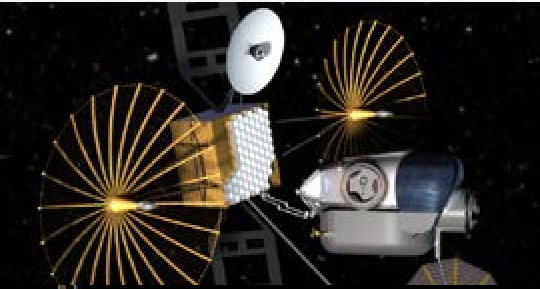

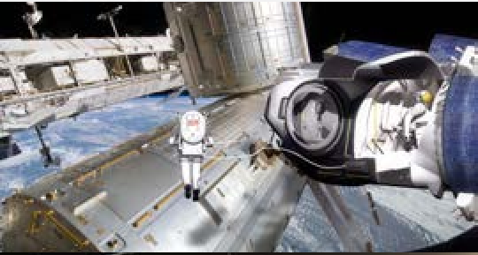

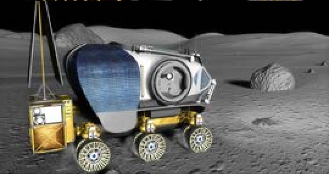

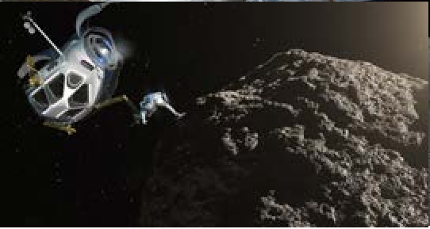

The multiple applications of a mobile exploration module exemplifies how the capability-driven approach relies on core evolving capabilities. In-space and surface versions of the vehicle will enable in-space repair of the ISS and satellites as well as exploration of NEAs, the Moon, and Mars.

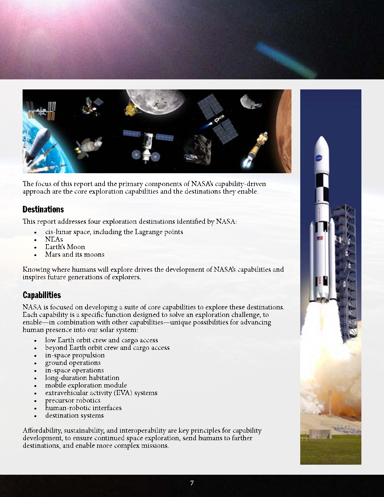

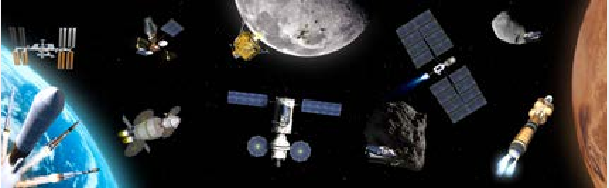

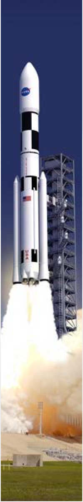

The focus of this report and the primary components of NASA’s capability-driven approach are the core exploration capabilities and the destinations they enable

#### Destinations

This report addresses four exploration destinations identified by NASA:

- • cis-lunar space, including the Lagrange points
- • NEAs
- • Earth’s Moon
- • Mars and its moons

Knowing where humans will explore drives the development of NASA’s capabilities and inspires future generations of explorers

#### Capabilities

NASA is focused on developing a suite of core capabilities to explore these destinations Each capability is a specific function designed to solve an exploration challenge, to enable—in combination with other capabilities—unique possibilities for advancing human presence into our solar system:

- • low Earth orbit crew and cargo access
- • beyond Earth orbit crew and cargo access
- • in-space propulsion
- • ground operations
- • in-space operations
- • long-duration habitation
- • mobile exploration module
- • extravehicular activity (EVA) systems
- • precursor robotics
- • human-robotic interfaces
- • destination systems

Affordability, sustainability, and interoperability are key principles for capability development, to ensure continued space exploration, send humans to farther destinations, and enable more complex missions

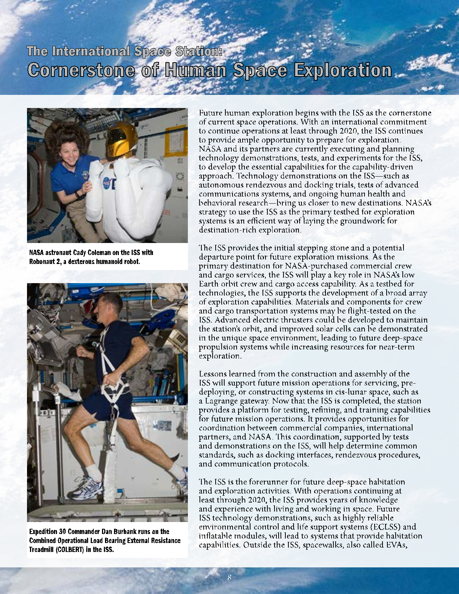

The International Space Station:

## Cornerstone of Human Space Exploration

| | |
|---|---|
| | |

Future human exploration begins with the ISS as the cornerstone of current space operations With an international commitment to continue operations at least through 2020, the ISS continues to provide ample opportunity to prepare for exploration NASA and its partners are currently executing and planning technology demonstrations, tests, and experiments for the ISS, to develop the essential capabilities for the capability-driven approach Technology demonstrations on the ISS—such as autonomous rendezvous and docking trials, tests of advanced communications systems, and ongoing human health and behavioral research—bring us closer to new destinations NASA’s strategy to use the ISS as the primary testbed for exploration systems is an efficient way of laying the groundwork for destination-rich exploration

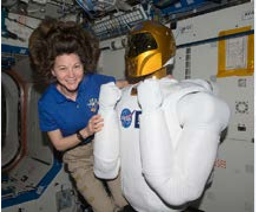

The ISS provides the initial stepping stone and a potential departure point for future exploration missions As the primary destination for NASA-purchased commercial crew and cargo services, the ISS will play a key role in NASA’s low Earth orbit crew and cargo access capability As a testbed for technologies, the ISS supports the development of a broad array of exploration capabilities Materials and components for crew and cargo transportation systems may be flight-tested on the ISS Advanced electric thrusters could be developed to maintain the station’s orbit, and improved solar cells can be demonstrated in the unique space environment, leading to future deep-space propulsion systems while increasing resources for near-term exploration

NASA astronaut Cady Coleman on the ISS with Robonaut 2, a dexterous humanoid robot.

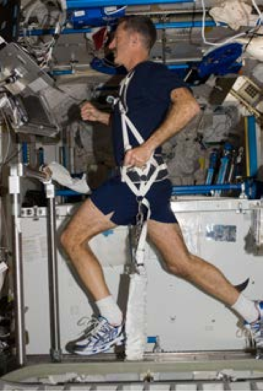

Lessons learned from the construction and assembly of the ISS will support future mission operations for servicing, predeploying, or constructing systems in cis-lunar space, such as a Lagrange gateway Now that the ISS is completed, the station provides a platform for testing, refining, and training capabilities for future mission operations It provides opportunities for coordination between commercial companies, international partners, and NASA This coordination, supported by tests and demonstrations on the ISS, will help determine common standards, such as docking interfaces, rendezvous procedures, and communication protocols

The ISS is the forerunner for future deep-space habitation and exploration activities With operations continuing at least through 2020, the ISS provides years of knowledge and experience with living and working in space Future ISS technology demonstrations, such as highly reliable environmental control and life support systems (ECLSS) and inflatable modules, will lead to systems that provide habitation capabilities Outside the ISS, spacewalks, also called EVAs,

Expedition 30 Commander Dan Burbank runs on the Combined Operational Load Bearing External Resistance Treadmill (COLBERT) in the ISS.

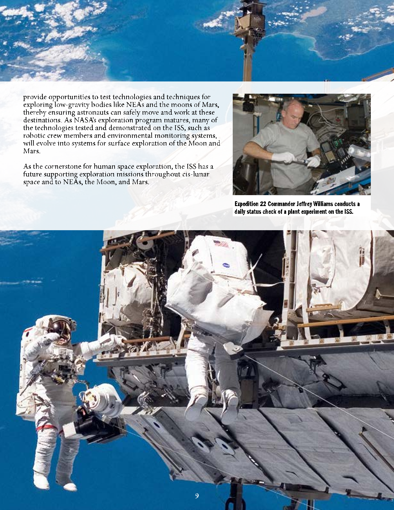

provide opportunities to test technologies and techniques for exploring low-gravity bodies like NEAs and the moons of Mars, thereby ensuring astronauts can safely move and work at these destinations As NASA’s exploration program matures, many of the technologies tested and demonstrated on the ISS, such as robotic crew members and environmental monitoring systems, will evolve into systems for surface exploration of the Moon and Mars

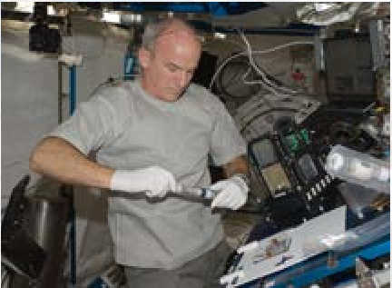

As the cornerstone for human space exploration, the ISS has a future supporting exploration missions throughout cis-lunar space and to NEAs, the Moon, and Mars

Expedition 22 Commander Jeffrey Williams conducts a daily status check of a plant experiment on the ISS.

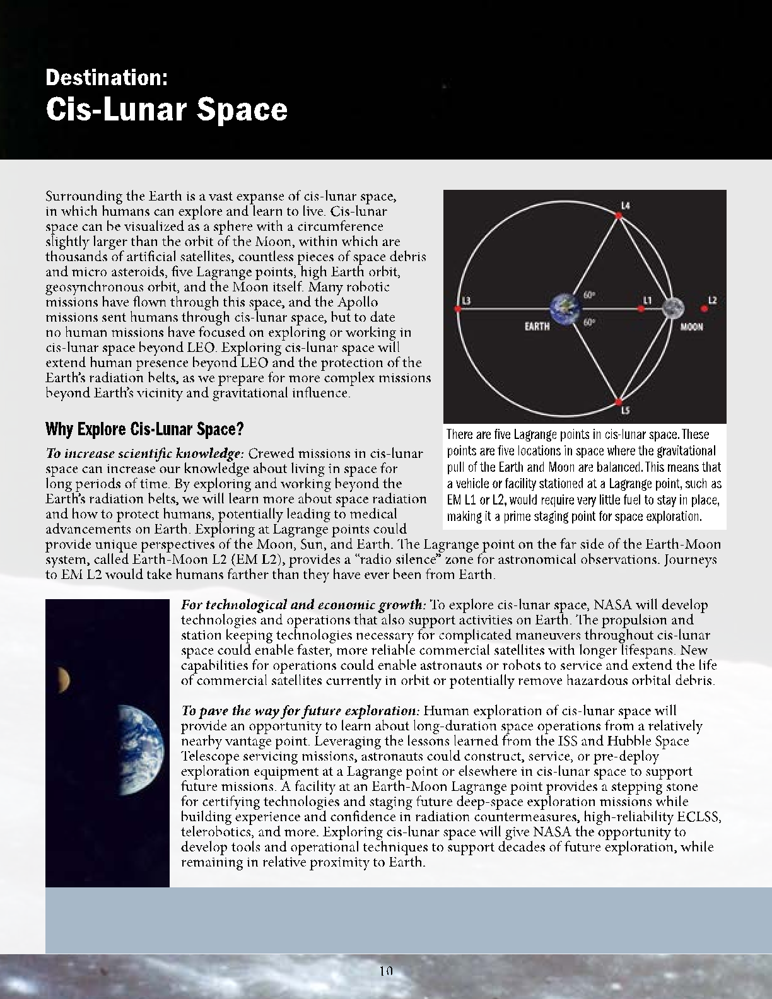

Destination:

## Cis-Lunar Space

Surrounding the Earth is a vast expanse of cis-lunar space, in which humans can explore and learn to live Cis-lunar space can be visualized as a sphere with a circumference slightly larger than the orbit of the Moon, within which are thousands of artificial satellites, countless pieces of space debris and micro asteroids, five Lagrange points, high Earth orbit, geosynchronous orbit, and the Moon itself Many robotic missions have flown through this space, and the Apollo missions sent humans through cis-lunar space, but to date no human missions have focused on exploring or working in cis-lunar space beyond LEO Exploring cis-lunar space will extend human presence beyond LEO and the protection of the Earth’s radiation belts, as we prepare for more complex missions beyond Earth’s vicinity and gravitational influence

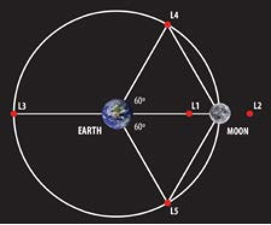

#### Why Explore Cis-Lunar Space?

There are five Lagrange points in cis-lunar space. These points are five locations in space where the gravitational pull of the Earth and Moon are balanced. This means that a vehicle or facility stationed at a Lagrange point, such as EM L1 or L2, would require very little fuel to stay in place, making it a prime staging point for space exploration.

To increase scientific knowledge: Crewed missions in cis-lunar space can increase our knowledge about living in space for long periods of time By exploring and working beyond the Earth’s radiation belts, we will learn more about space radiation and how to protect humans, potentially leading to medical advancements on Earth Exploring at Lagrange points could provide unique perspectives of the Moon, Sun, and Earth The Lagrange point on the far side of the Earth-Moon system, called Earth-Moon L2 (EM L2), provides a “radio silence” zone for astronomical observations Journeys to EM L2 would take humans farther than they have ever been from Earth

For technological and economic growth: To explore cis-lunar space, NASA will develop technologies and operations that also support activities on Earth The propulsion and station keeping technologies necessary for complicated maneuvers throughout cis-lunar space could enable faster, more reliable commercial satellites with longer lifespans New capabilities for operations could enable astronauts or robots to service and extend the life of commercial satellites currently in orbit or potentially remove hazardous orbital debris

To pave the way for future exploration: Human exploration of cis-lunar space will provide an opportunity to learn about long-duration space operations from a relatively nearby vantage point Leveraging the lessons learned from the ISS and Hubble Space Telescope servicing missions, astronauts could construct, service, or pre-deploy exploration equipment at a Lagrange point or elsewhere in cis-lunar space to support future missions A facility at an Earth-Moon Lagrange point provides a stepping stone for certifying technologies and staging future deep-space exploration missions while building experience and confidence in radiation countermeasures, high-reliability ECLSS, telerobotics, and more Exploring cis-lunar space will give NASA the opportunity to develop tools and operational techniques to support decades of future exploration, while remaining in relative proximity to Earth

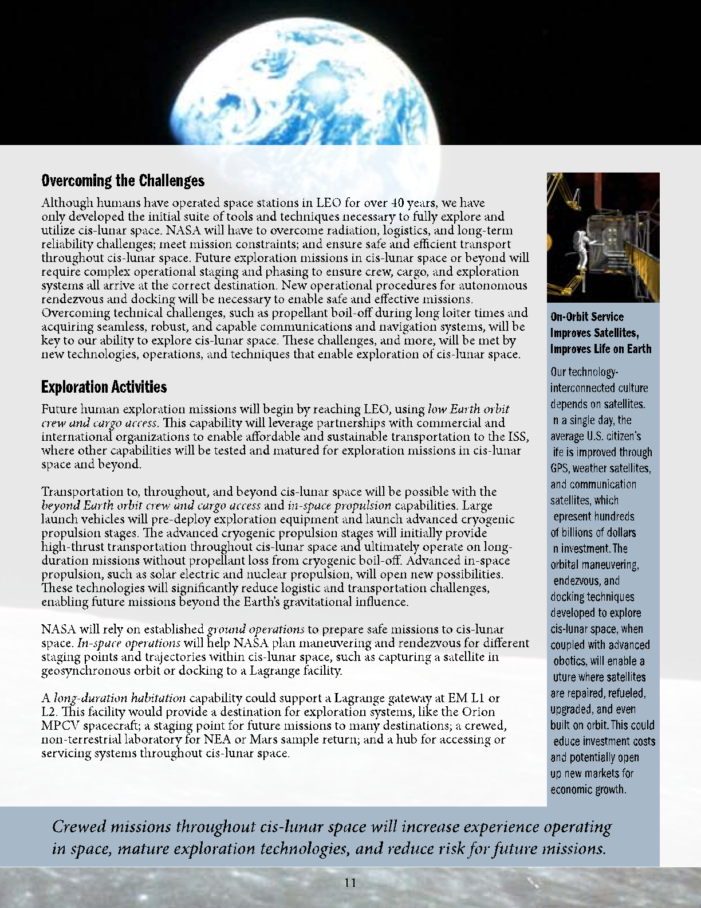

#### Overcoming the Challenges

Although humans have operated space stations in LEO for over 40 years, we have only developed the initial suite of tools and techniques necessary to fully explore and utilize cis-lunar space NASA will have to overcome radiation, logistics, and long-term reliability challenges; meet mission constraints; and ensure safe and efficient transport throughout cis-lunar space Future exploration missions in cis-lunar space or beyond will require complex operational staging and phasing to ensure crew, cargo, and exploration systems all arrive at the correct destination New operational procedures for autonomous rendezvous and docking will be necessary to enable safe and effective missions Overcoming technical challenges, such as propellant boil-off during long loiter times and acquiring seamless, robust, and capable communications and navigation systems, will be key to our ability to explore cis-lunar space These challenges, and more, will be met by new technologies, operations, and techniques that enable exploration of cis-lunar space

On-Orbit Service Improves Satellites, Improves Life on Earth

Our technologyinterconnected culture depends on satellites.

#### Exploration Activities

Future human exploration missions will begin by reaching LEO, using low Earth orbit crew and cargo access This capability will leverage partnerships with commercial and international organizations to enable affordable and sustainable transportation to the ISS, where other capabilities will be tested and matured for exploration missions in cis-lunar space and beyond

n a single day, the average U.S. citizen’s ife is improved through GPS, weather satellites, and communication satellites, which

Transportation to, throughout, and beyond cis-lunar space will be possible with the beyond Earth orbit crew and cargo access and in-space propulsion capabilities Large launch vehicles will pre-deploy exploration equipment and launch advanced cryogenic propulsion stages The advanced cryogenic propulsion stages will initially provide high-thrust transportation throughout cis-lunar space and ultimately operate on longduration missions without propellant loss from cryogenic boil-off Advanced in-space propulsion, such as solar electric and nuclear propulsion, will open new possibilities These technologies will significantly reduce logistic and transportation challenges, enabling future missions beyond the Earth’s gravitational influence

epresent hundreds of billions of dollars n investment. The orbital maneuvering,

endezvous, and docking techniques developed to explore cis-lunar space, when coupled with advanced obotics, will enable a uture where satellites

NASA will rely on established ground operations to prepare safe missions to cis-lunar space In-space operations will help NASA plan maneuvering and rendezvous for different staging points and trajectories within cis-lunar space, such as capturing a satellite in geosynchronous orbit or docking to a Lagrange facility

are repaired, refueled, upgraded, and even built on orbit. This could

A long-duration habitation capability could support a Lagrange gateway at EM L1 or L2 This facility would provide a destination for exploration systems, like the Orion MPCV spacecraft; a staging point for future missions to many destinations; a crewed, non-terrestrial laboratory for NEA or Mars sample return; and a hub for accessing or servicing systems throughout cis-lunar space

educe investment costs and potentially open up new markets for economic growth.

##### Crewed missions throughout cis-lunar space will increase experience operating in space, mature exploration technologies, and reduce risk for future missions.

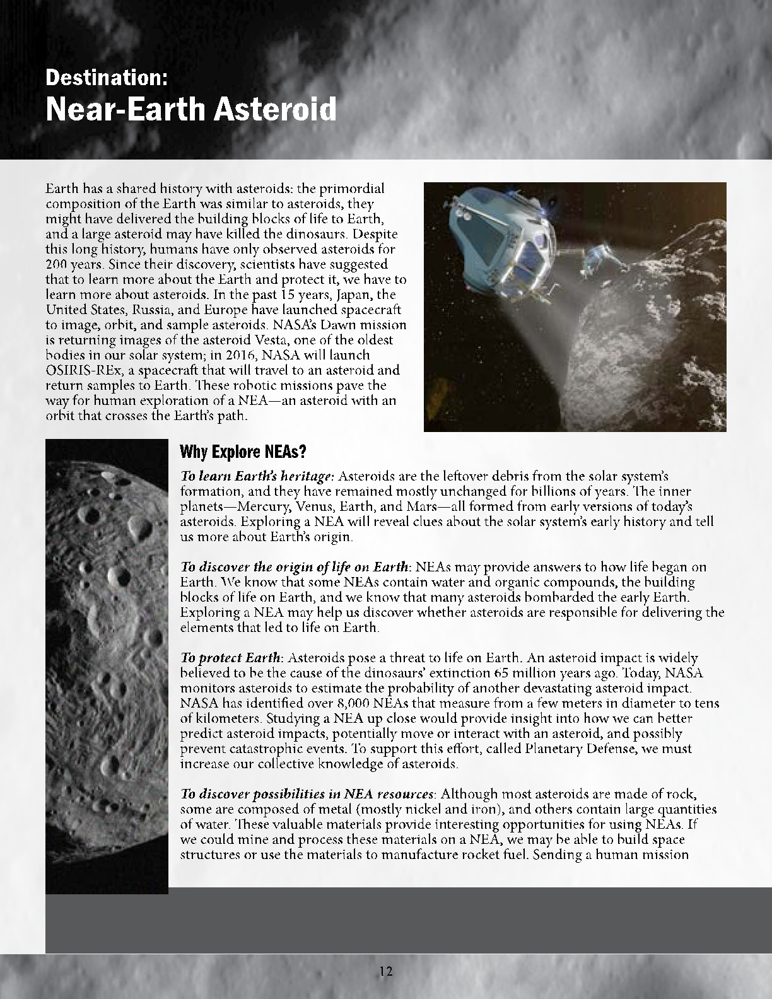

Destination:

## Near-Earth Asteroid

Earth has a shared history with asteroids: the primordial composition of the Earth was similar to asteroids, they might have delivered the building blocks of life to Earth, and a large asteroid may have killed the dinosaurs Despite this long history, humans have only observed asteroids for 200 years Since their discovery, scientists have suggested that to learn more about the Earth and protect it, we have to learn more about asteroids In the past 15 years, Japan, the United States, Russia, and Europe have launched spacecraft to image, orbit, and sample asteroids NASA’s Dawn mission is returning images of the asteroid Vesta, one of the oldest bodies in our solar system; in 2016, NASA will launch OSIRIS-REx, a spacecraft that will travel to an asteroid and return samples to Earth These robotic missions pave the way for human exploration of a NEA—an asteroid with an orbit that crosses the Earth’s path

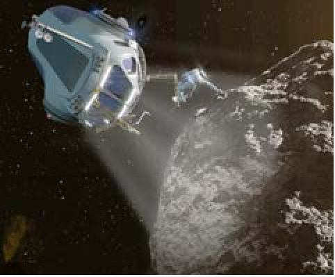

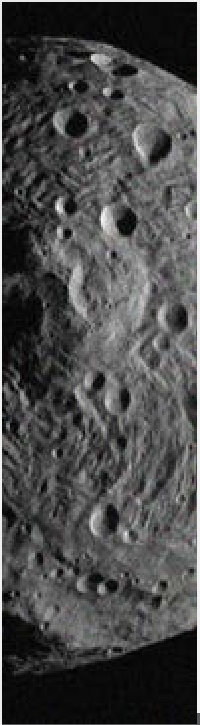

#### Why Explore NEAs?

To learn Earth’s heritage: Asteroids are the leftover debris from the solar system’s formation, and they have remained mostly unchanged for billions of years The inner planets—Mercury, Venus, Earth, and Mars—all formed from early versions of today’s asteroids Exploring a NEA will reveal clues about the solar system’s early history and tell us more about Earth’s origin

To discover the origin of life on Earth: NEAs may provide answers to how life began on Earth We know that some NEAs contain water and organic compounds, the building blocks of life on Earth, and we know that many asteroids bombarded the early Earth Exploring a NEA may help us discover whether asteroids are responsible for delivering the elements that led to life on Earth

To protect Earth: Asteroids pose a threat to life on Earth An asteroid impact is widely believed to be the cause of the dinosaurs’ extinction 65 million years ago Today, NASA monitors asteroids to estimate the probability of another devastating asteroid impact NASA has identified over 8,000 NEAs that measure from a few meters in diameter to tens of kilometers Studying a NEA up close would provide insight into how we can better predict asteroid impacts, potentially move or interact with an asteroid, and possibly prevent catastrophic events To support this effort, called Planetary Defense, we must increase our collective knowledge of asteroids

To discover possibilities in NEA resources: Although most asteroids are made of rock, some are composed of metal (mostly nickel and iron), and others contain large quantities of water These valuable materials provide interesting opportunities for using NEAs If we could mine and process these materials on a NEA, we may be able to build space structures or use the materials to manufacture rocket fuel Sending a human mission

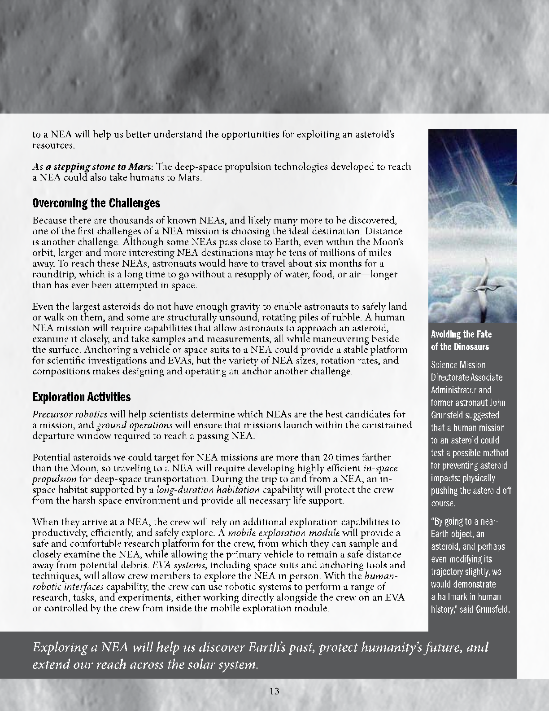

to a NEA will help us better understand the opportunities for exploiting an asteroid’s resources

As a stepping stone to Mars: The deep-space propulsion technologies developed to reach a NEA could also take humans to Mars

#### Overcoming the Challenges

Because there are thousands of known NEAs, and likely many more to be discovered, one of the first challenges of a NEA mission is choosing the ideal destination Distance is another challenge Although some NEAs pass close to Earth, even within the Moon’s orbit, larger and more interesting NEA destinations may be tens of millions of miles away To reach these NEAs, astronauts would have to travel about six months for a roundtrip, which is a long time to go without a resupply of water, food, or air—longer than has ever been attempted in space

Even the largest asteroids do not have enough gravity to enable astronauts to safely land or walk on them, and some are structurally unsound, rotating piles of rubble A human NEA mission will require capabilities that allow astronauts to approach an asteroid, examine it closely, and take samples and measurements, all while maneuvering beside the surface Anchoring a vehicle or space suits to a NEA could provide a stable platform for scientific investigations and EVAs, but the variety of NEA sizes, rotation rates, and compositions makes designing and operating an anchor another challenge

Avoiding the Fate of the Dinosaurs

Science Mission Directorate Associate Administrator and former astronaut John Grunsfeld suggested that a human mission to an asteroid could test a possible method for preventing asteroid impacts: physically pushing the asteroid off course.

#### Exploration Activities

Precursor robotics will help scientists determine which NEAs are the best candidates for a mission, and ground operations will ensure that missions launch within the constrained departure window required to reach a passing NEA

Potential asteroids we could target for NEA missions are more than 20 times farther than the Moon, so traveling to a NEA will require developing highly efficient in-space

propulsion for deep-space transportation During the trip to and from a NEA, an inspace habitat supported by a long-duration habitation capability will protect the crew from the harsh space environment and provide all necessary life support

When they arrive at a NEA, the crew will rely on additional exploration capabilities to productively, efficiently, and safely explore A mobile exploration module will provide a safe and comfortable research platform for the crew, from which they can sample and closely examine the NEA, while allowing the primary vehicle to remain a safe distance away from potential debris EVA systems, including space suits and anchoring tools and techniques, will allow crew members to explore the NEA in person With the humanrobotic interfaces capability, the crew can use robotic systems to perform a range of research, tasks, and experiments, either working directly alongside the crew on an EVA or controlled by the crew from inside the mobile exploration module

“By going to a nearEarth object, an asteroid, and perhaps even modifying its trajectory slightly, we would demonstrate a hallmark in human history,” said Grunsfeld.

##### Exploring a NEA will help us discover Earth’s past, protect humanity’s future, and extend our reach across the solar system.

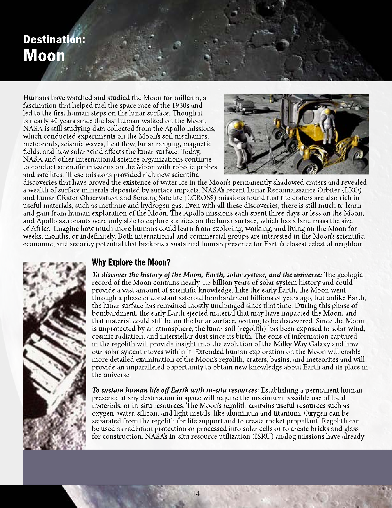

Destination:

## Moon

Humans have watched and studied the Moon for millenia, a fascination that helped fuel the space race of the 1960s and led to the first human steps on the lunar surface Though it is nearly 40 years since the last human walked on the Moon, NASA is still studying data collected from the Apollo missions, which conducted experiments on the Moon’s soil mechanics, meteoroids, seismic waves, heat flow, lunar ranging, magnetic fields, and how solar wind affects the lunar surface Today, NASA and other international science organizations continue to conduct scientific missions on the Moon with robotic probes and satellites These missions provided rich new scientific discoveries that have proved the existence of water ice in the Moon’s permanently shadowed craters and revealed a wealth of surface minerals deposited by surface impacts NASA’s recent Lunar Reconnaissance Orbiter (LRO) and Lunar CRater Observation and Sensing Satellite (LCROSS) missions found that the craters are also rich in useful materials, such as methane and hydrogen gas Even with all these discoveries, there is still much to learn and gain from human exploration of the Moon The Apollo missions each spent three days or less on the Moon, and Apollo astronauts were only able to explore six sites on the lunar surface, which has a land mass the size of Africa Imagine how much more humans could learn from exploring, working, and living on the Moon for weeks, months, or indefinitely Both international and commercial groups are interested in the Moon’s scientific, economic, and security potential that beckons a sustained human presence for Earth’s closest celestial neighbor

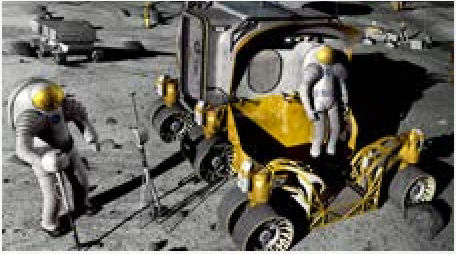

#### Why Explore the Moon?

To discover the history of the Moon, Earth, solar system, and the universe: The geologic record of the Moon contains nearly 4 5 billion years of solar system history and could provide a vast amount of scientific knowledge Like the early Earth, the Moon went through a phase of constant asteroid bombardment billions of years ago, but unlike Earth, the lunar surface has remained mostly unchanged since that time During this phase of bombardment, the early Earth ejected material that may have impacted the Moon, and that material could still be on the lunar surface, waiting to be discovered Since the Moon is unprotected by an atmosphere, the lunar soil (regolith) has been exposed to solar wind, cosmic radiation, and interstellar dust since its birth The eons of information captured in the regolith will provide insight into the evolution of the Milky Way Galaxy and how our solar system moves within it Extended human exploration on the Moon will enable more detailed examination of the Moon’s regolith, craters, basins, and meteorites and will provide an unparalleled opportunity to obtain new knowledge about Earth and its place in the universe

To sustain human life off Earth with in-situ resources: Establishing a permanent human presence at any destination in space will require the maximum possible use of local materials, or in-situ resources The Moon’s regolith contains useful resources such as oxygen, water, silicon, and light metals, like aluminum and titanium Oxygen can be separated from the regolith for life support and to create rocket propellant Regolith can be used as radiation protection or processed into solar cells or to create bricks and glass for construction NASA’s in-situ resource utilization (ISRU) analog missions have already

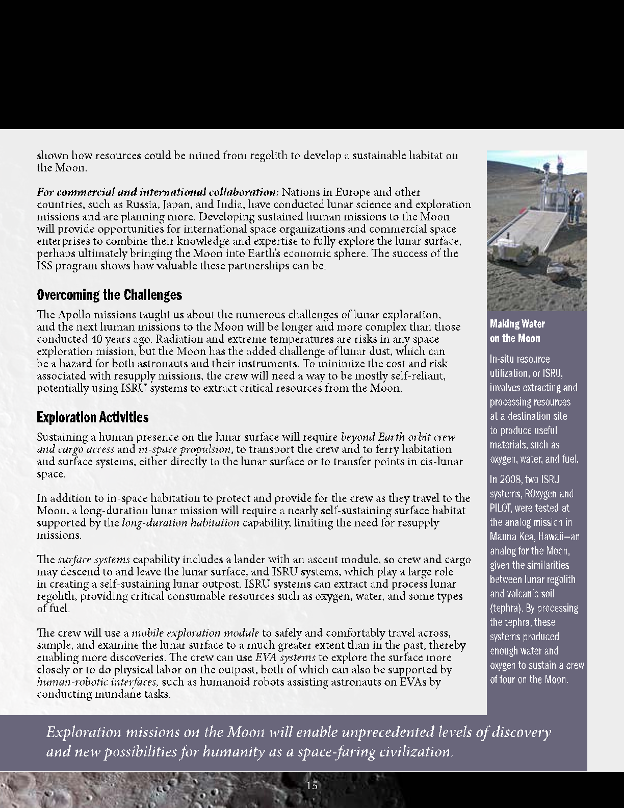

shown how resources could be mined from regolith to develop a sustainable habitat on the Moon

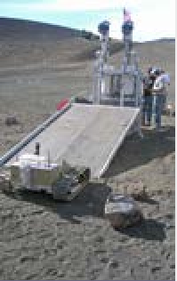

For commercial and international collaboration: Nations in Europe and other countries, such as Russia, Japan, and India, have conducted lunar science and exploration missions and are planning more Developing sustained human missions to the Moon will provide opportunities for international space organizations and commercial space enterprises to combine their knowledge and expertise to fully explore the lunar surface, perhaps ultimately bringing the Moon into Earth’s economic sphere The success of the ISS program shows how valuable these partnerships can be

#### Overcoming the Challenges

The Apollo missions taught us about the numerous challenges of lunar exploration, and the next human missions to the Moon will be longer and more complex than those conducted 40 years ago Radiation and extreme temperatures are risks in any space exploration mission, but the Moon has the added challenge of lunar dust, which can be a hazard for both astronauts and their instruments To minimize the cost and risk associated with resupply missions, the crew will need a way to be mostly self-reliant, potentially using ISRU systems to extract critical resources from the Moon

Making Water on the Moon

In-situ resource utilization, or ISRU, involves extracting and processing resources at a destination site to produce useful materials, such as oxygen, water, and fuel.

#### Exploration Activities

Sustaining a human presence on the lunar surface will require beyond Earth orbit crew and cargo access and in-space propulsion, to transport the crew and to ferry habitation and surface systems, either directly to the lunar surface or to transfer points in cis-lunar space

In 2008, two ISRU systems, ROxygen and PILOT, were tested at the analog mission in Mauna Kea, Hawaii—an analog for the Moon, given the similarities between lunar regolith and volcanic soil (tephra). By processing the tephra, these systems produced enough water and oxygen to sustain a crew of four on the Moon.

In addition to in-space habitation to protect and provide for the crew as they travel to the Moon, a long-duration lunar mission will require a nearly self-sustaining surface habitat supported by the long-duration habitation capability, limiting the need for resupply missions

The surface systems capability includes a lander with an ascent module, so crew and cargo may descend to and leave the lunar surface, and ISRU systems, which play a large role in creating a self-sustaining lunar outpost ISRU systems can extract and process lunar regolith, providing critical consumable resources such as oxygen, water, and some types of fuel

The crew will use a mobile exploration module to safely and comfortably travel across, sample, and examine the lunar surface to a much greater extent than in the past, thereby enabling more discoveries The crew can use EVA systems to explore the surface more closely or to do physical labor on the outpost, both of which can also be supported by human-robotic interfaces, such as humanoid robots assisting astronauts on EVAs by conducting mundane tasks

##### Exploration missions on the Moon will enable unprecedented levels of discovery and new possibilities for humanity as a space-faring civilization.

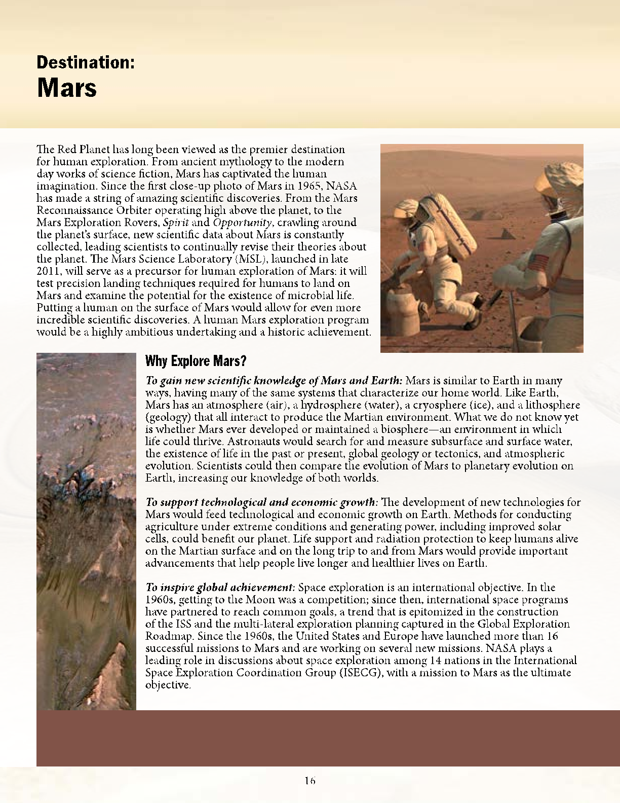

Destination:

## Mars

The Red Planet has long been viewed as the premier destination for human exploration From ancient mythology to the modern day works of science fiction, Mars has captivated the human imagination Since the first close-up photo of Mars in 1965, NASA has made a string of amazing scientific discoveries From the Mars Reconnaissance Orbiter operating high above the planet, to the Mars Exploration Rovers, Spirit and Opportunity, crawling around the planet’s surface, new scientific data about Mars is constantly collected, leading scientists to continually revise their theories about the planet The Mars Science Laboratory (MSL), launched in late 2011, will serve as a precursor for human exploration of Mars: it will test precision landing techniques required for humans to land on Mars and examine the potential for the existence of microbial life Putting a human on the surface of Mars would allow for even more incredible scientific discoveries A human Mars exploration program would be a highly ambitious undertaking and a historic achievement

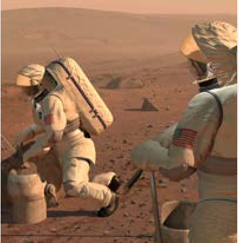

#### Why Explore Mars?

To gain new scientific knowledge of Mars and Earth: Mars is similar to Earth in many ways, having many of the same systems that characterize our home world Like Earth, Mars has an atmosphere (air), a hydrosphere (water), a cryosphere (ice), and a lithosphere (geology) that all interact to produce the Martian environment What we do not know yet is whether Mars ever developed or maintained a biosphere—an environment in which life could thrive Astronauts would search for and measure subsurface and surface water, the existence of life in the past or present, global geology or tectonics, and atmospheric evolution Scientists could then compare the evolution of Mars to planetary evolution on Earth, increasing our knowledge of both worlds

To support technological and economic growth: The development of new technologies for Mars would feed technological and economic growth on Earth Methods for conducting agriculture under extreme conditions and generating power, including improved solar cells, could benefit our planet Life support and radiation protection to keep humans alive on the Martian surface and on the long trip to and from Mars would provide important advancements that help people live longer and healthier lives on Earth

To inspire global achievement: Space exploration is an international objective In the 1960s, getting to the Moon was a competition; since then, international space programs have partnered to reach common goals, a trend that is epitomized in the construction of the ISS and the multi-lateral exploration planning captured in the Global Exploration Roadmap Since the 1960s, the United States and Europe have launched more than 16 successful missions to Mars and are working on several new missions NASA plays a leading role in discussions about space exploration among 14 nations in the International Space Exploration Coordination Group (ISECG), with a mission to Mars as the ultimate objective

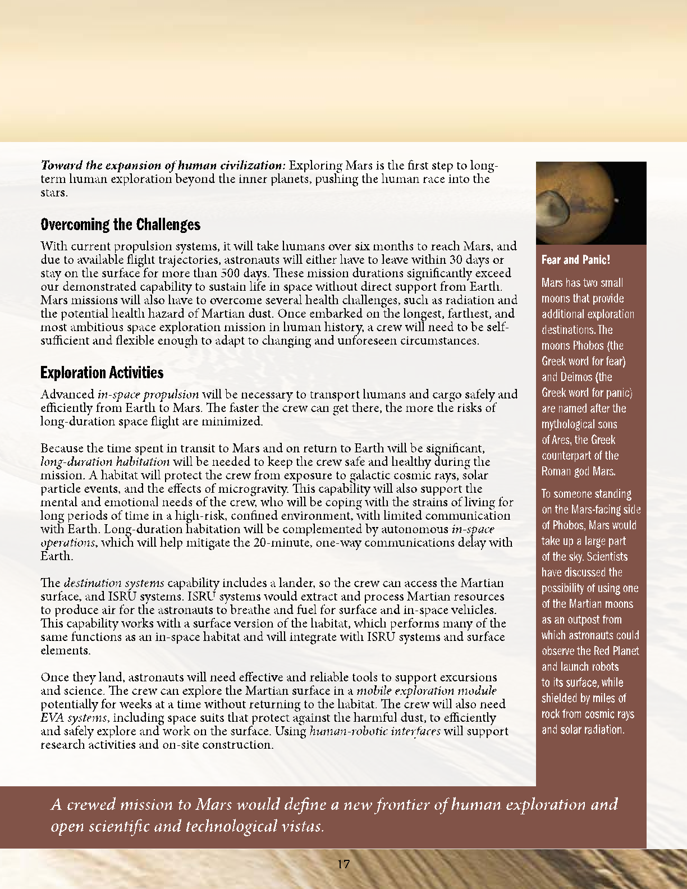

Toward the expansion of human civilization: Exploring Mars is the first step to longterm human exploration beyond the inner planets, pushing the human race into the stars

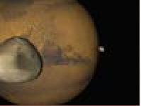

#### Overcoming the Challenges

With current propulsion systems, it will take humans over six months to reach Mars, and due to available flight trajectories, astronauts will either have to leave within 30 days or stay on the surface for more than 500 days These mission durations significantly exceed our demonstrated capability to sustain life in space without direct support from Earth Mars missions will also have to overcome several health challenges, such as radiation and the potential health hazard of Martian dust Once embarked on the longest, farthest, and most ambitious space exploration mission in human history, a crew will need to be selfsufficient and flexible enough to adapt to changing and unforeseen circumstances

###### Fear and Panic!

Mars has two small moons that provide additional exploration destinations. The moons Phobos (the Greek word for fear) and Deimos (the Greek word for panic) are named after the mythological sons of Ares, the Greek counterpart of the Roman god Mars.

#### Exploration Activities

Advanced in-space propulsion will be necessary to transport humans and cargo safely and efficiently from Earth to Mars The faster the crew can get there, the more the risks of long-duration space flight are minimized

Because the time spent in transit to Mars and on return to Earth will be significant, long-duration habitation will be needed to keep the crew safe and healthy during the mission A habitat will protect the crew from exposure to galactic cosmic rays, solar particle events, and the effects of microgravity This capability will also support the mental and emotional needs of the crew, who will be coping with the strains of living for long periods of time in a high-risk, confined environment, with limited communication with Earth Long-duration habitation will be complemented by autonomous in-space operations, which will help mitigate the 20-minute, one-way communications delay with Earth

To someone standing on the Mars-facing side of Phobos, Mars would take up a large part of the sky. Scientists have discussed the possibility of using one of the Martian moons as an outpost from which astronauts could observe the Red Planet and launch robots to its surface, while shielded by miles of rock from cosmic rays and solar radiation.

The destination systems capability includes a lander, so the crew can access the Martian surface, and ISRU systems ISRU systems would extract and process Martian resources to produce air for the astronauts to breathe and fuel for surface and in-space vehicles This capability works with a surface version of the habitat, which performs many of the same functions as an in-space habitat and will integrate with ISRU systems and surface elements

Once they land, astronauts will need effective and reliable tools to support excursions and science The crew can explore the Martian surface in a mobile exploration module potentially for weeks at a time without returning to the habitat The crew will also need

EVA systems, including space suits that protect against the harmful dust, to efficiently and safely explore and work on the surface Using human-robotic interfaces will support research activities and on-site construction

##### A crewed mission to Mars would define a new frontier of human exploration and open scientific and technological vistas.

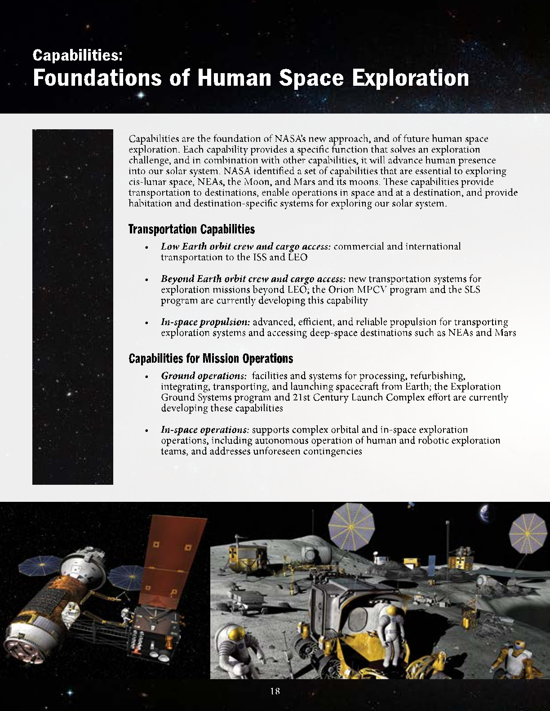

Capabilities:

## Foundations of Human Space Exploration

Capabilities are the foundation of NASA’s new approach, and of future human space exploration Each capability provides a specific function that solves an exploration challenge, and in combination with other capabilities, it will advance human presence into our solar system NASA identified a set of capabilities that are essential to exploring cis-lunar space, NEAs, the Moon, and Mars and its moons These capabilities provide transportation to destinations, enable operations in space and at a destination, and provide habitation and destination-specific systems for exploring our solar system

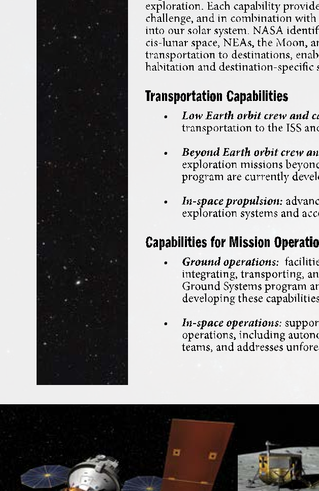

#### Transportation Capabilities

- • Low Earth orbit crew and cargo access: commercial and international transportation to the ISS and LEO
- • Beyond Earth orbit crew and cargo access: new transportation systems for exploration missions beyond LEO; the Orion MPCV program and the SLS program are currently developing this capability
- • In-space propulsion: advanced, efficient, and reliable propulsion for transporting exploration systems and accessing deep-space destinations such as NEAs and Mars

#### Capabilities for Mission Operations

- • Ground operations: facilities and systems for processing, refurbishing, integrating, transporting, and launching spacecraft from Earth; the Exploration Ground Systems program and 21st Century Launch Complex effort are currently developing these capabilities
- • In-space operations: supports complex orbital and in-space exploration operations, including autonomous operation of human and robotic exploration teams, and addresses unforeseen contingencies

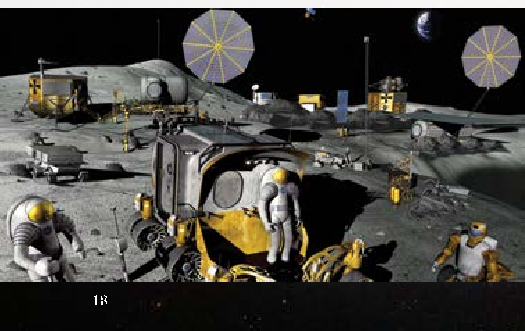

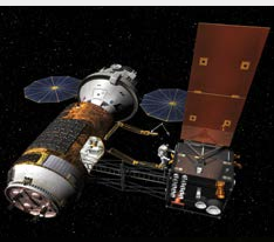

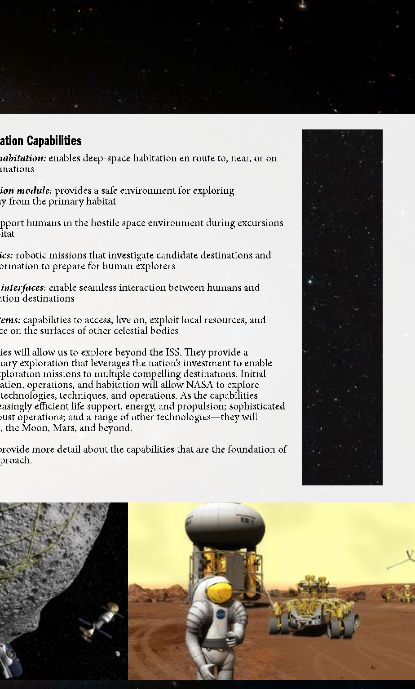

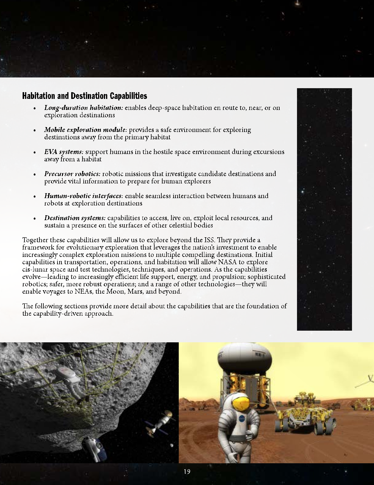

#### Habitation and Destination Capabilities

- • Long-duration habitation: enables deep-space habitation en route to, near, or on exploration destinations
- • Mobile exploration module: provides a safe environment for exploring destinations away from the primary habitat
- • EVA systems: support humans in the hostile space environment during excursions away from a habitat
- • Precursor robotics: robotic missions that investigate candidate destinations and provide vital information to prepare for human explorers
- • Human-robotic interfaces: enable seamless interaction between humans and robots at exploration destinations
- • Destination systems: capabilities to access, live on, exploit local resources, and sustain a presence on the surfaces of other celestial bodies

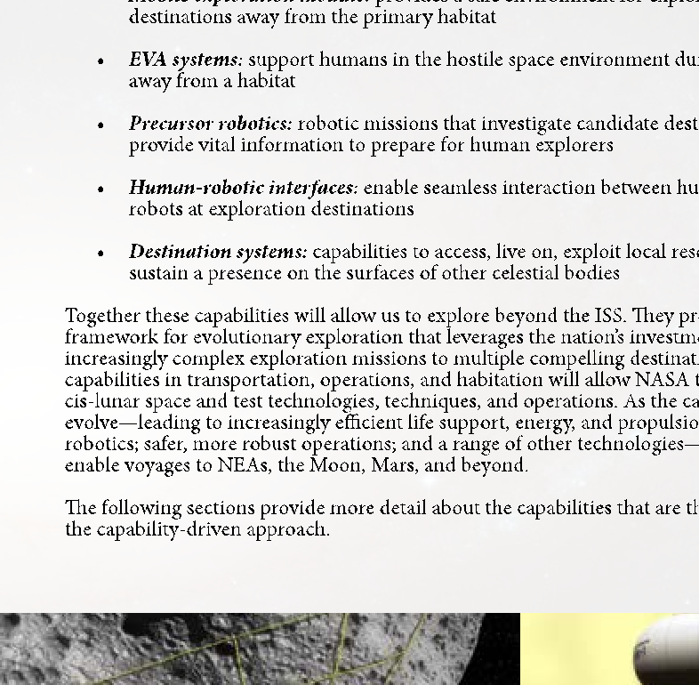

Together these capabilities will allow us to explore beyond the ISS They provide a framework for evolutionary exploration that leverages the nation’s investment to enable increasingly complex exploration missions to multiple compelling destinations Initial capabilities in transportation, operations, and habitation will allow NASA to explore cis-lunar space and test technologies, techniques, and operations As the capabilities evolve—leading to increasingly efficient life support, energy, and propulsion; sophisticated robotics; safer, more robust operations; and a range of other technologies—they will enable voyages to NEAs, the Moon, Mars, and beyond

The following sections provide more detail about the capabilities that are the foundation of the capability-driven approach

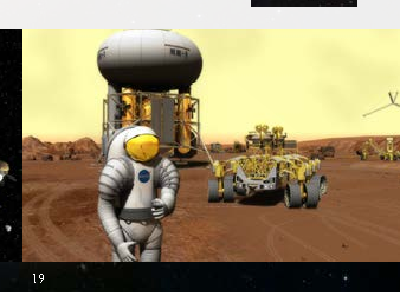

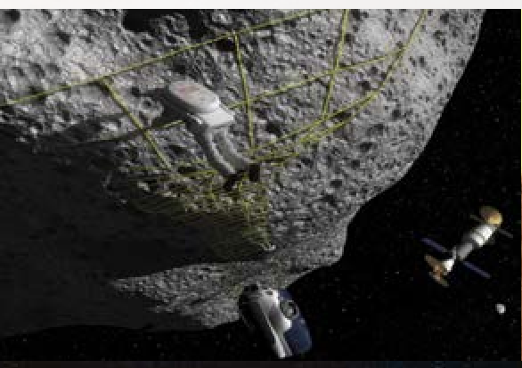

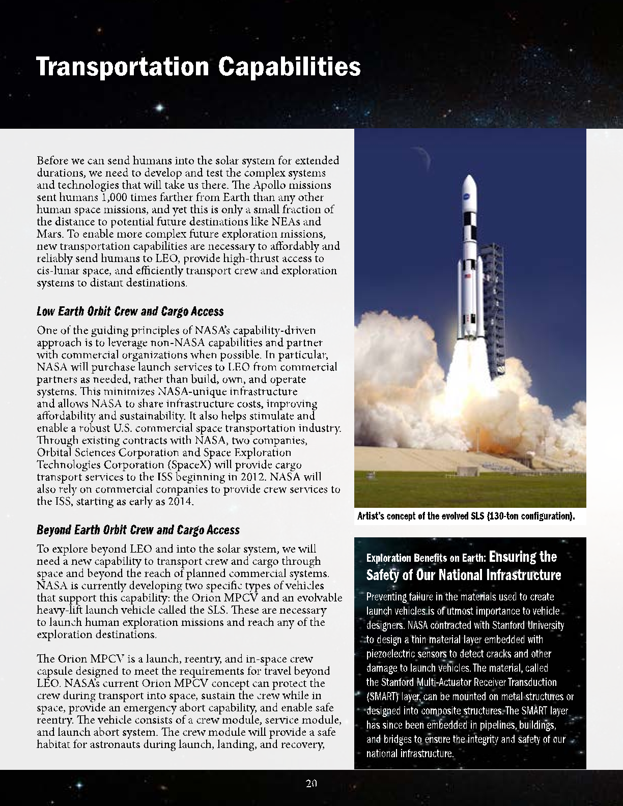

## Transportation Capabilities

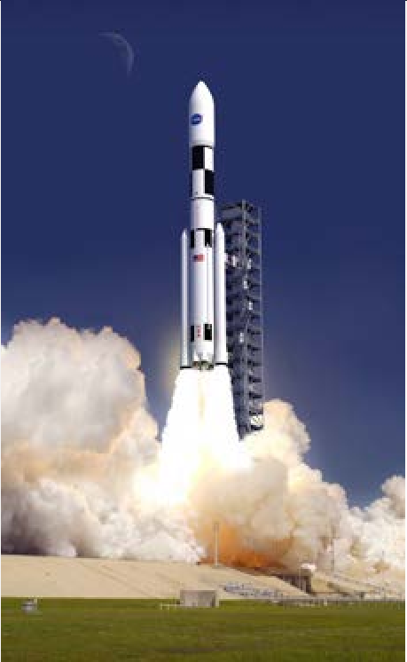

Before we can send humans into the solar system for extended durations, we need to develop and test the complex systems and technologies that will take us there The Apollo missions sent humans 1,000 times farther from Earth than any other human space missions, and yet this is only a small fraction of the distance to potential future destinations like NEAs and Mars To enable more complex future exploration missions, new transportation capabilities are necessary to affordably and reliably send humans to LEO, provide high-thrust access to cis-lunar space, and efficiently transport crew and exploration systems to distant destinations

###### Low Earth Orbit Crew and Cargo Access

One of the guiding principles of NASA’s capability-driven approach is to leverage non-NASA capabilities and partner with commercial organizations when possible In particular, NASA will purchase launch services to LEO from commercial partners as needed, rather than build, own, and operate systems This minimizes NASA-unique infrastructure and allows NASA to share infrastructure costs, improving affordability and sustainability It also helps stimulate and enable a robust U S commercial space transportation industry Through existing contracts with NASA, two companies, Orbital Sciences Corporation and Space Exploration Technologies Corporation (SpaceX) will provide cargo transport services to the ISS beginning in 2012 NASA will also rely on commercial companies to provide crew services to the ISS, starting as early as 2014

###### Artist’s concept of the evolved SLS (130-ton configuration).

###### Beyond Earth Orbit Crew and Cargo Access

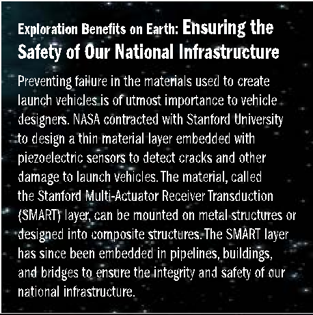

To explore beyond LEO and into the solar system, we will need a new capability to transport crew and cargo through space and beyond the reach of planned commercial systems NASA is currently developing two specific types of vehicles that support this capability: the Orion MPCV and an evolvable heavy-lift launch vehicle called the SLS These are necessary to launch human exploration missions and reach any of the exploration destinations

#### Exploration Benefits on Earth:Ensuring the Safety of Our National Infrastructure

Preventing failure in the materials used to create launch vehicles is of utmost importance to vehicle designers. NASA contracted with Stanford University to design a thin material layer embedded with piezoelectric sensors to detect cracks and other damage to launch vehicles. The material, called the Stanford Multi-Actuator Receiver Transduction (SMART) layer, can be mounted on metal structures or designed into composite structures. The SMART layer has since been embedded in pipelines, buildings, and bridges to ensure the integrity and safety of our national infrastructure.

The Orion MPCV is a launch, reentry, and in-space crew capsule designed to meet the requirements for travel beyond LEO NASA’s current Orion MPCV concept can protect the crew during transport into space, sustain the crew while in space, provide an emergency abort capability, and enable safe reentry The vehicle consists of a crew module, service module, and launch abort system The crew module will provide a safe habitat for astronauts during launch, landing, and recovery,

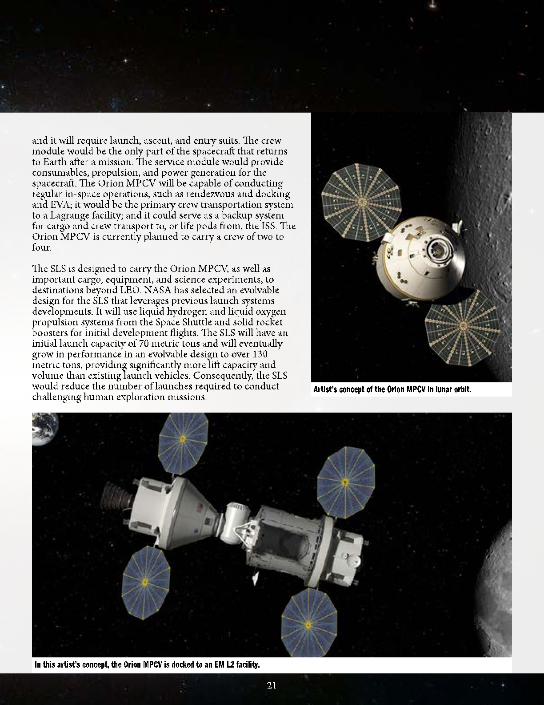

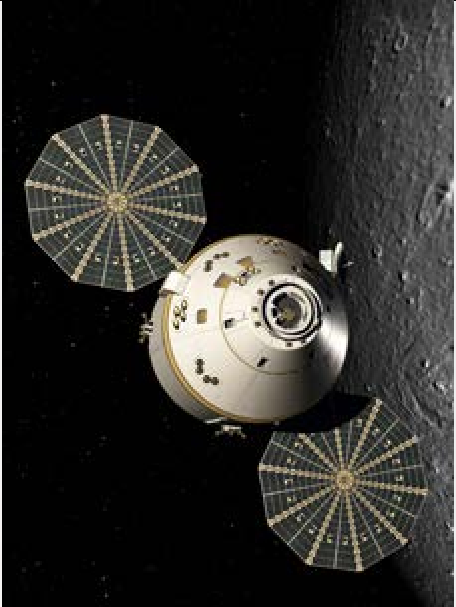

and it will require launch, ascent, and entry suits The crew module would be the only part of the spacecraft that returns to Earth after a mission The service module would provide consumables, propulsion, and power generation for the spacecraft The Orion MPCV will be capable of conducting regular in-space operations, such as rendezvous and docking and EVA; it would be the primary crew transportation system to a Lagrange facility; and it could serve as a backup system for cargo and crew transport to, or life pods from, the ISS The Orion MPCV is currently planned to carry a crew of two to four

The SLS is designed to carry the Orion MPCV, as well as important cargo, equipment, and science experiments, to destinations beyond LEO NASA has selected an evolvable design for the SLS that leverages previous launch systems developments It will use liquid hydrogen and liquid oxygen propulsion systems from the Space Shuttle and solid rocket boosters for initial development flights The SLS will have an initial launch capacity of 70 metric tons and will eventually grow in performance in an evolvable design to over 130 metric tons, providing significantly more lift capacity and volume than existing launch vehicles Consequently, the SLS would reduce the number of launches required to conduct challenging human exploration missions

Artist’s concept of the Orion MPCV in lunar orbit.

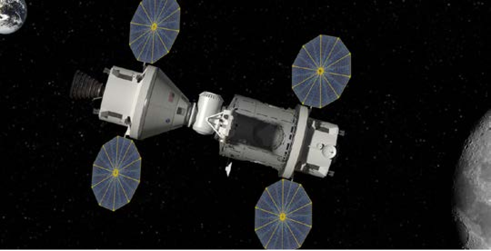

In this artist’s concept, the Orion MPCV is docked to an EM L2 facility.

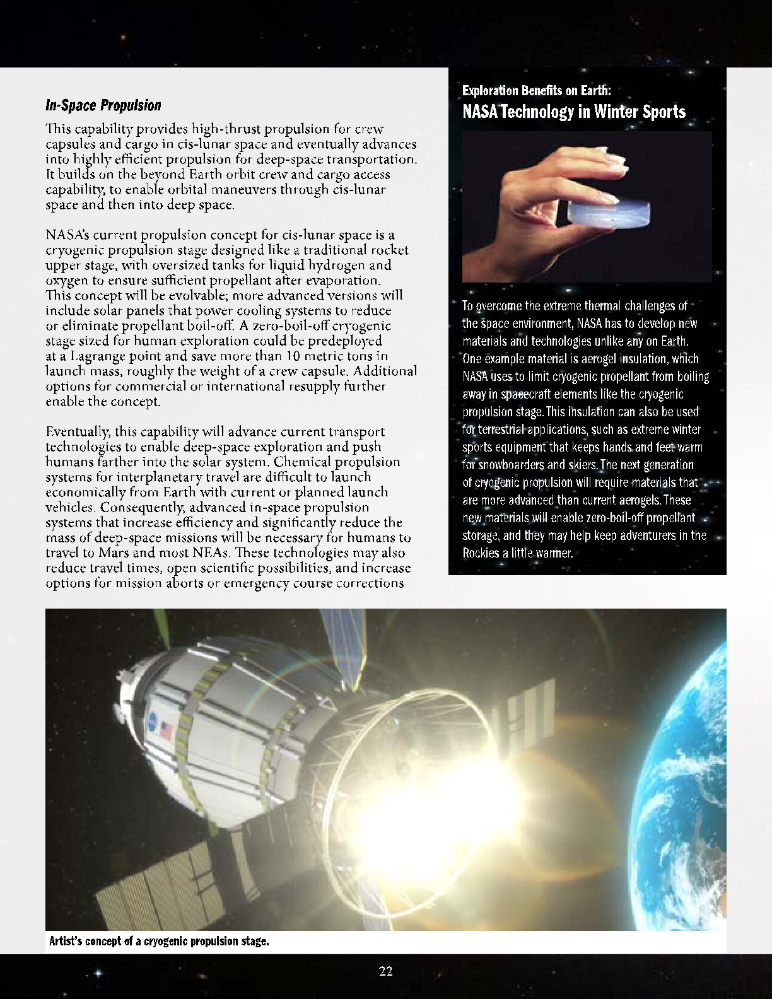

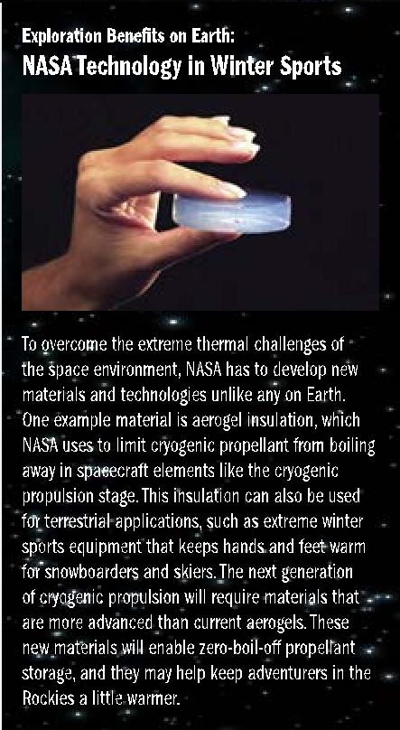

Exploration Benefits on Earth:

###### In-Space Propulsion

#### NASA Technology in Winter Sports

This capability provides high-thrust propulsion for crew capsules and cargo in cis-lunar space and eventually advances into highly efficient propulsion for deep-space transportation It builds on the beyond Earth orbit crew and cargo access capability, to enable orbital maneuvers through cis-lunar space and then into deep space

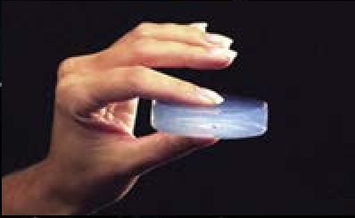

NASA’s current propulsion concept for cis-lunar space is a cryogenic propulsion stage designed like a traditional rocket upper stage, with oversized tanks for liquid hydrogen and oxygen to ensure sufficient propellant after evaporation This concept will be evolvable; more advanced versions will include solar panels that power cooling systems to reduce or eliminate propellant boil-off A zero-boil-off cryogenic stage sized for human exploration could be predeployed at a Lagrange point and save more than 10 metric tons in launch mass, roughly the weight of a crew capsule Additional options for commercial or international resupply further enable the concept

To overcome the extreme thermal challenges of the space environment, NASA has to develop new materials and technologies unlike any on Earth. One example material is aerogel insulation, which NASA uses to limit cryogenic propellant from boiling away in spacecraft elements like the cryogenic propulsion stage. This insulation can also be used for terrestrial applications, such as extreme winter sports equipment that keeps hands and feet warm for snowboarders and skiers. The next generation of cryogenic propulsion will require materials that are more advanced than current aerogels. These new materials will enable zero-boil-off propellant storage, and they may help keep adventurers in the Rockies a little warmer.

Eventually, this capability will advance current transport technologies to enable deep-space exploration and push humans farther into the solar system Chemical propulsion systems for interplanetary travel are difficult to launch economically from Earth with current or planned launch vehicles Consequently, advanced in-space propulsion systems that increase efficiency and significantly reduce the mass of deep-space missions will be necessary for humans to travel to Mars and most NEAs These technologies may also reduce travel times, open scientific possibilities, and increase options for mission aborts or emergency course corrections

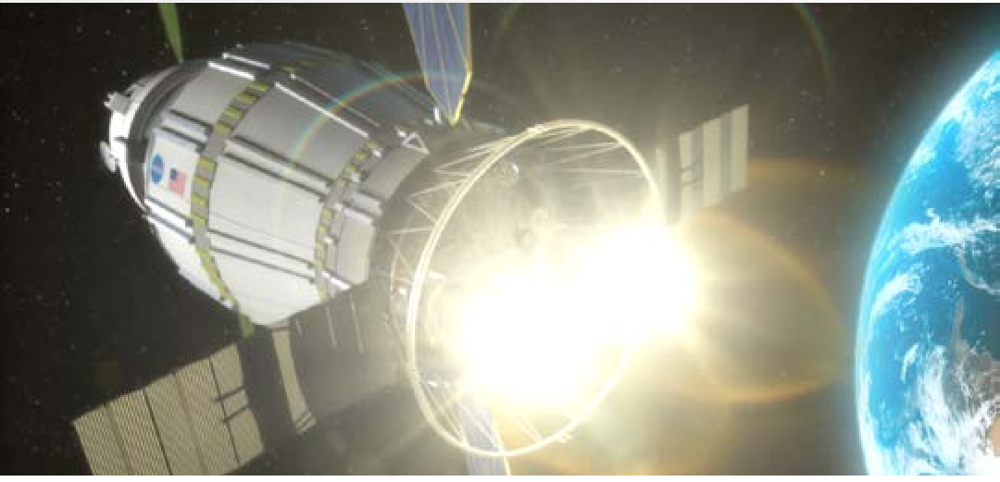

###### Artist’s concept of a cryogenic propulsion stage.

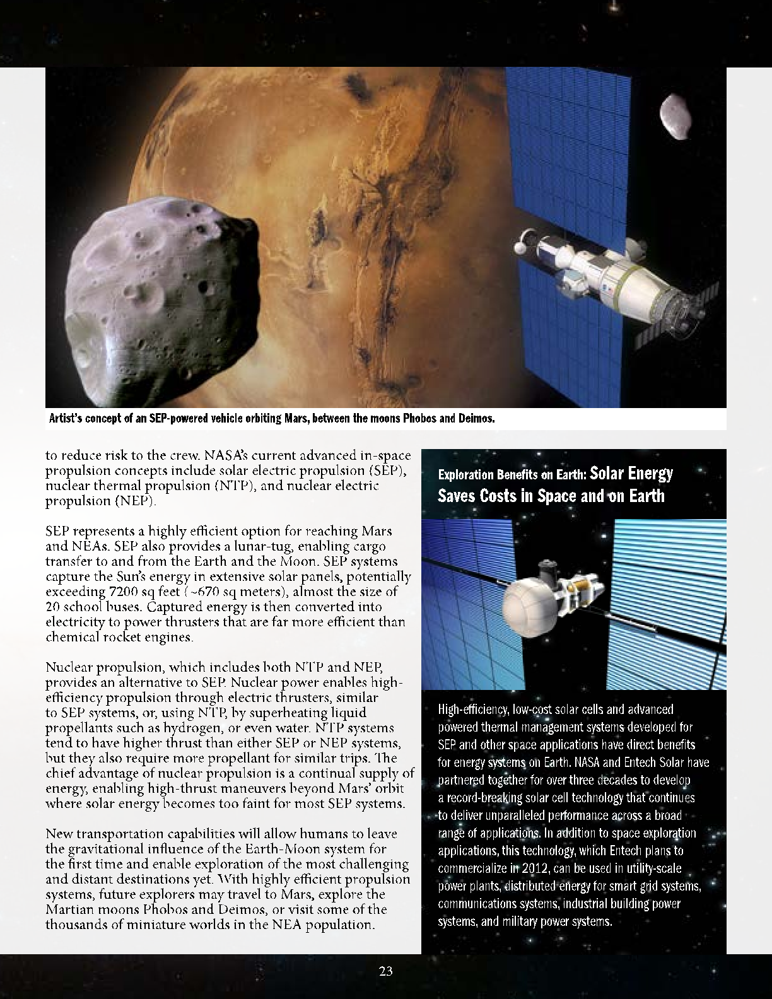

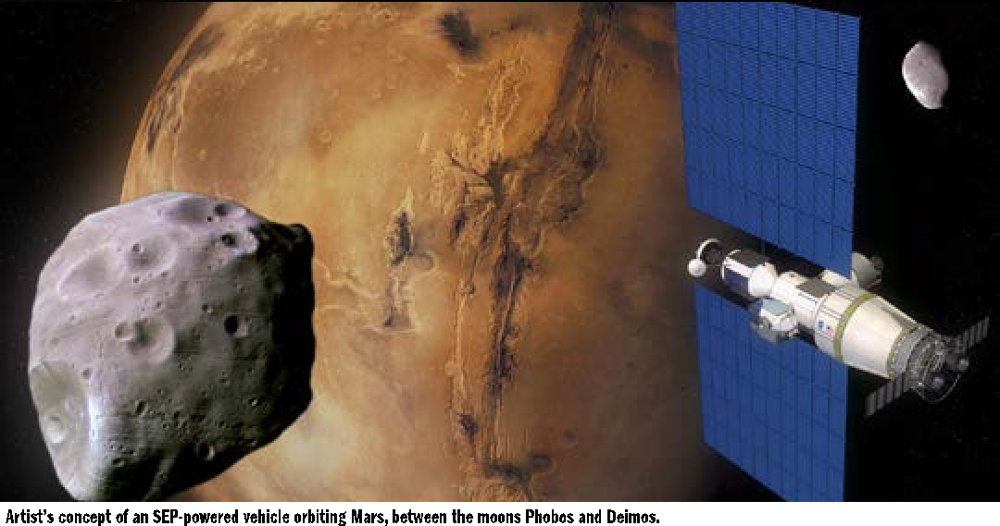

###### Artist’s concept of an SEP-powered vehicle orbiting Mars, between the moons Phobos and Deimos.

to reduce risk to the crew NASA’s current advanced in-space propulsion concepts include solar electric propulsion (SEP), nuclear thermal propulsion (NTP), and nuclear electric propulsion (NEP)

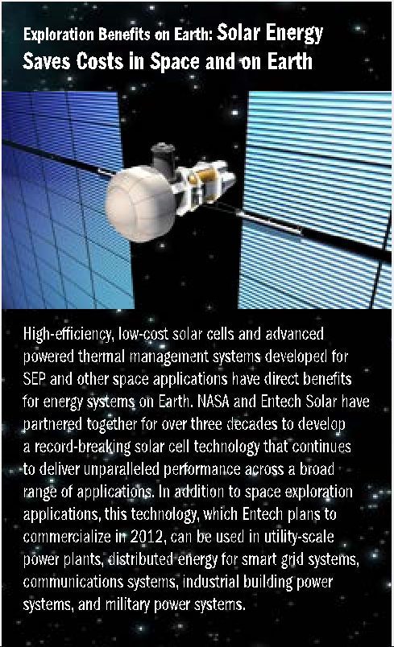

#### Exploration Benefits on Earth:Solar Energy Saves Costs in Space and on Earth

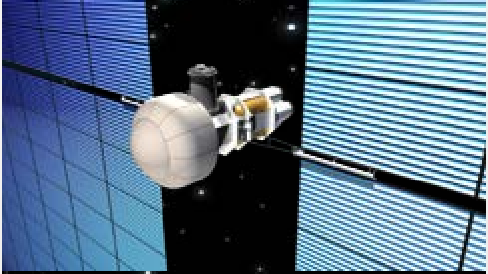

SEP represents a highly efficient option for reaching Mars and NEAs SEP also provides a lunar-tug, enabling cargo transfer to and from the Earth and the Moon SEP systems capture the Sun’s energy in extensive solar panels, potentially exceeding 7200 sq feet (~670 sq meters), almost the size of 20 school buses Captured energy is then converted into electricity to power thrusters that are far more efficient than chemical rocket engines

Nuclear propulsion, which includes both NTP and NEP, provides an alternative to SEP Nuclear power enables highefficiency propulsion through electric thrusters, similar to SEP systems, or, using NTP, by superheating liquid propellants such as hydrogen, or even water NTP systems tend to have higher thrust than either SEP or NEP systems, but they also require more propellant for similar trips The chief advantage of nuclear propulsion is a continual supply of energy, enabling high-thrust maneuvers beyond Mars’ orbit where solar energy becomes too faint for most SEP systems

High-efficiency, low-cost solar cells and advanced powered thermal management systems developed for SEP and other space applications have direct benefits for energy systems on Earth. NASA and Entech Solar have partnered together for over three decades to develop a record-breaking solar cell technology that continues to deliver unparalleled performance across a broad range of applications. In addition to space exploration applications, this technology, which Entech plans to commercialize in 2012, can be used in utility-scale power plants, distributed energy for smart grid systems, communications systems, industrial building power systems, and military power systems.

New transportation capabilities will allow humans to leave the gravitational influence of the Earth-Moon system for the first time and enable exploration of the most challenging and distant destinations yet With highly efficient propulsion systems, future explorers may travel to Mars, explore the Martian moons Phobos and Deimos, or visit some of the thousands of miniature worlds in the NEA population

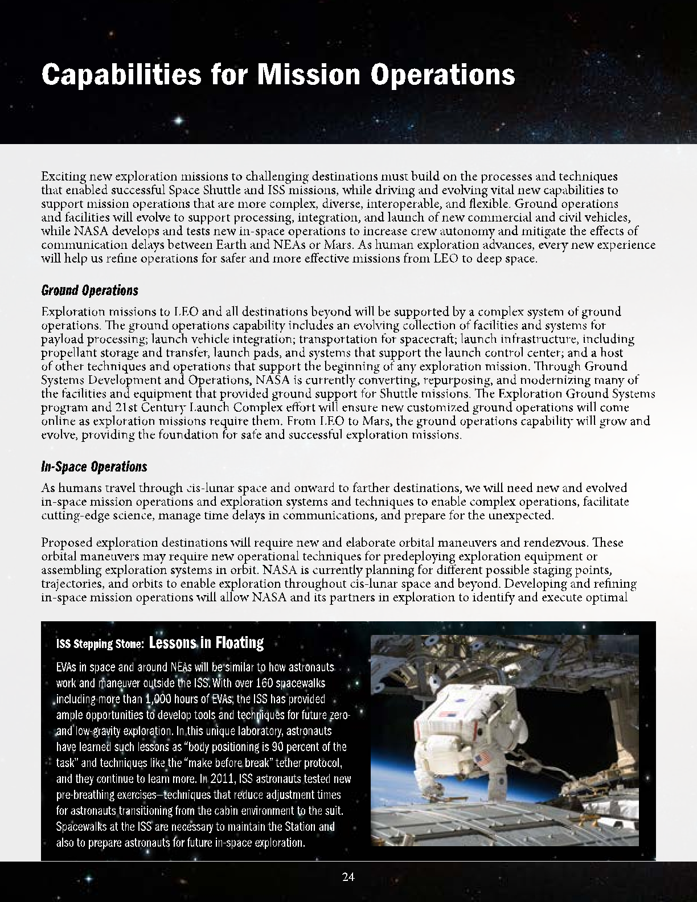

## Capabilities for Mission Operations

Exciting new exploration missions to challenging destinations must build on the processes and techniques that enabled successful Space Shuttle and ISS missions, while driving and evolving vital new capabilities to support mission operations that are more complex, diverse, interoperable, and flexible Ground operations and facilities will evolve to support processing, integration, and launch of new commercial and civil vehicles, while NASA develops and tests new in-space operations to increase crew autonomy and mitigate the effects of communication delays between Earth and NEAs or Mars As human exploration advances, every new experience will help us refine operations for safer and more effective missions from LEO to deep space

###### Ground Operations

Exploration missions to LEO and all destinations beyond will be supported by a complex system of ground operations The ground operations capability includes an evolving collection of facilities and systems for payload processing; launch vehicle integration; transportation for spacecraft; launch infrastructure, including propellant storage and transfer, launch pads, and systems that support the launch control center; and a host of other techniques and operations that support the beginning of any exploration mission Through Ground Systems Development and Operations, NASA is currently converting, repurposing, and modernizing many of the facilities and equipment that provided ground support for Shuttle missions The Exploration Ground Systems program and 21st Century Launch Complex effort will ensure new customized ground operations will come online as exploration missions require them From LEO to Mars, the ground operations capability will grow and evolve, providing the foundation for safe and successful exploration missions

###### In-Space Operations

As humans travel through cis-lunar space and onward to farther destinations, we will need new and evolved in-space mission operations and exploration systems and techniques to enable complex operations, facilitate cutting-edge science, manage time delays in communications, and prepare for the unexpected

Proposed exploration destinations will require new and elaborate orbital maneuvers and rendezvous These orbital maneuvers may require new operational techniques for predeploying exploration equipment or assembling exploration systems in orbit NASA is currently planning for different possible staging points, trajectories, and orbits to enable exploration throughout cis-lunar space and beyond Developing and refining in-space mission operations will allow NASA and its partners in exploration to identify and execute optimal

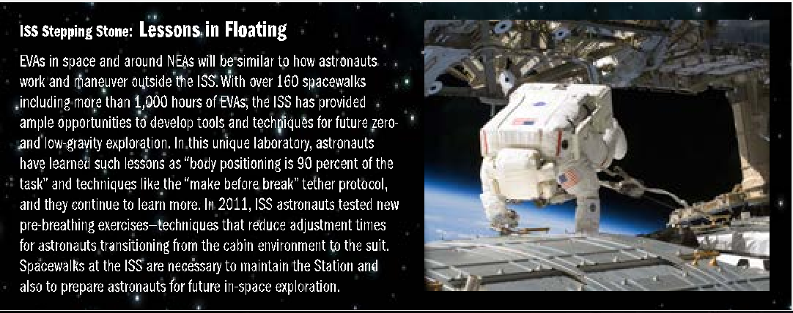

#### ISS Stepping Stone: Lessons in Floating

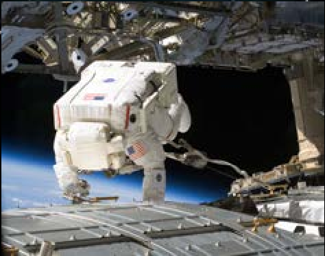

EVAs in space and around NEAs will be similar to how astronauts work and maneuver outside the ISS. With over 160 spacewalks including more than 1,000 hours of EVAs, the ISS has provided ample opportunities to develop tools and techniques for future zeroand low-gravity exploration. In this unique laboratory, astronauts have learned such lessons as “body positioning is 90 percent of the task” and techniques like the “make before break” tether protocol, and they continue to learn more. In 2011, ISS astronauts tested new pre-breathing exercises—techniques that reduce adjustment times for astronauts transitioning from the cabin environment to the suit. Spacewalks at the ISS are necessary to maintain the Station and also to prepare astronauts for future in-space exploration.

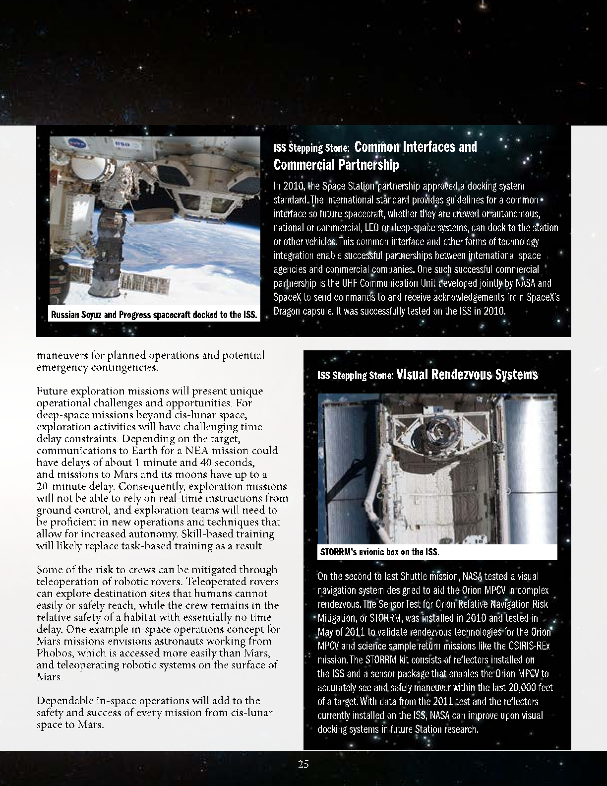

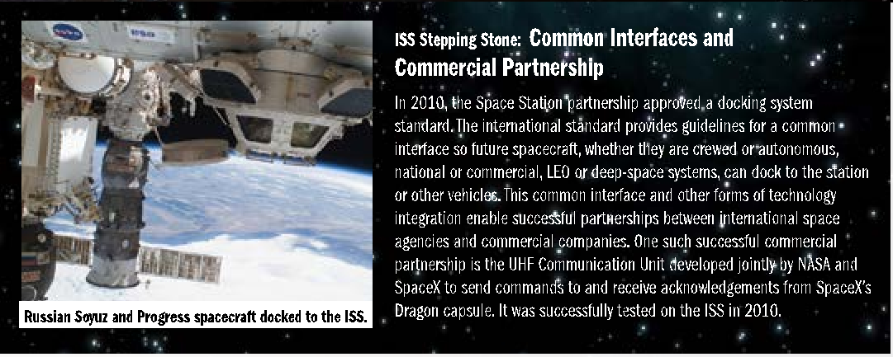

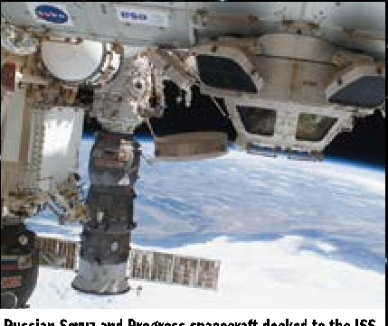

#### ISS Stepping Stone: Common Interfaces and Commercial Partnership

In 2010, the Space Station partnership approved a docking system standard. The international standard provides guidelines for a common interface so future spacecraft, whether they are crewed or autonomous, national or commercial, LEO or deep-space systems, can dock to the station or other vehicles. This common interface and other forms of technology integration enable successful partnerships between international space agencies and commercial companies. One such successful commercial partnership is the UHF Communication Unit developed jointly by NASA and SpaceX to send commands to and receive acknowledgements from SpaceX’s

Russian Soyuz and Progress spacecraft docked to the ISS. Dragon capsule. It was successfully tested on the ISS in 2010.

maneuvers for planned operations and potential emergency contingencies

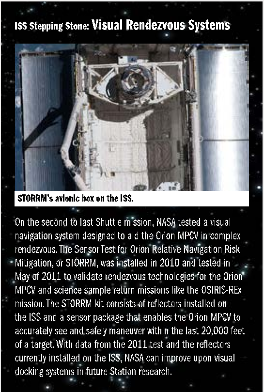

#### ISS Stepping Stone:Visual Rendezvous Systems

Future exploration missions will present unique operational challenges and opportunities For deep-space missions beyond cis-lunar space, exploration activities will have challenging time delay constraints Depending on the target, communications to Earth for a NEA mission could have delays of about 1 minute and 40 seconds, and missions to Mars and its moons have up to a 20-minute delay Consequently, exploration missions will not be able to rely on real-time instructions from ground control, and exploration teams will need to be proficient in new operations and techniques that allow for increased autonomy Skill-based training will likely replace task-based training as a result

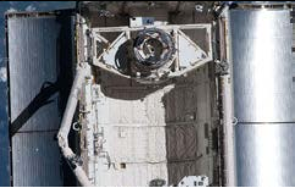

STORRM’s avionic box on the ISS.

Some of the risk to crews can be mitigated through teleoperation of robotic rovers Teleoperated rovers can explore destination sites that humans cannot easily or safely reach, while the crew remains in the relative safety of a habitat with essentially no time delay One example in-space operations concept for Mars missions envisions astronauts working from Phobos, which is accessed more easily than Mars, and teleoperating robotic systems on the surface of Mars

On the second to last Shuttle mission, NASA tested a visual navigation system designed to aid the Orion MPCV in complex rendezvous. The Sensor Test for Orion Relative Navigation Risk Mitigation, or STORRM, was installed in 2010 and tested in May of 2011 to validate rendezvous technologies for the Orion MPCV and science sample return missions like the OSIRIS-REx mission. The STORRM kit consists of reflectors installed on the ISS and a sensor package that enables the Orion MPCV to accurately see and safely maneuver within the last 20,000 feet of a target. With data from the 2011 test and the reflectors currently installed on the ISS, NASA can improve upon visual docking systems in future Station research.

Dependable in-space operations will add to the safety and success of every mission from cis-lunar space to Mars

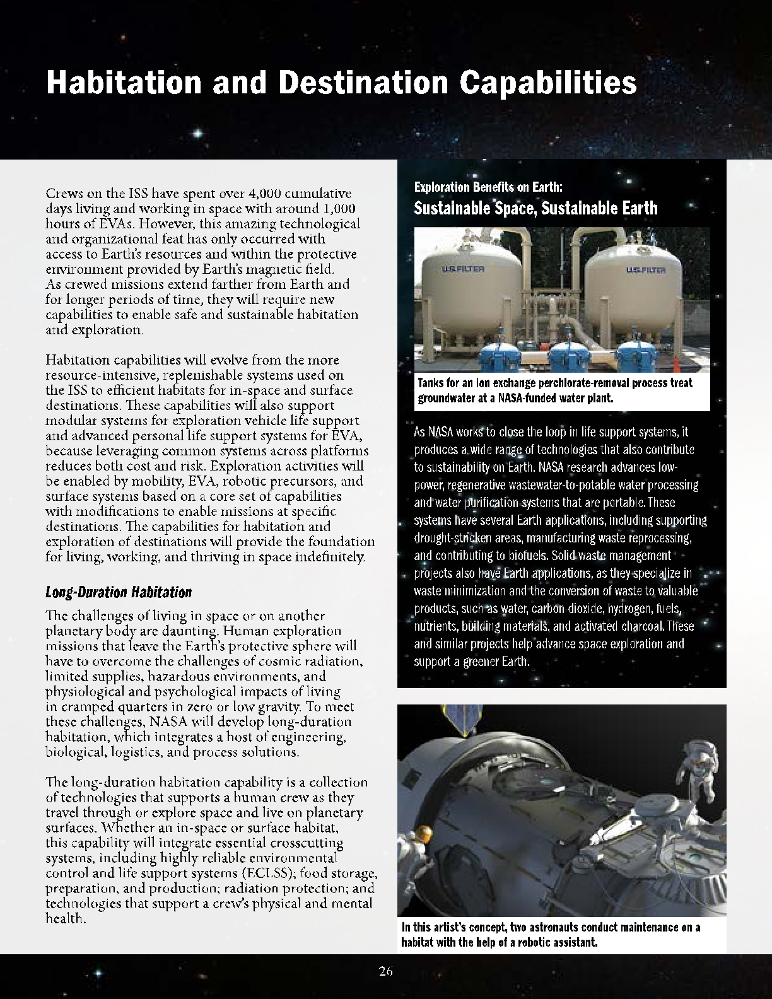

## Habitation and Destination Capabilities

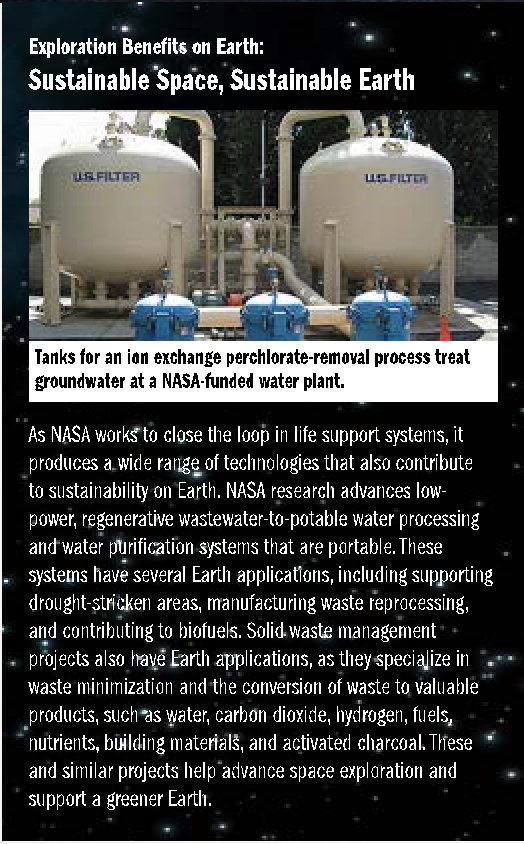

Exploration Benefits on Earth:

Crews on the ISS have spent over 4,000 cumulative days living and working in space with around 1,000 hours of EVAs However, this amazing technological and organizational feat has only occurred with access to Earth’s resources and within the protective environment provided by Earth’s magnetic field As crewed missions extend farther from Earth and for longer periods of time, they will require new capabilities to enable safe and sustainable habitation and exploration

#### Sustainable Space, Sustainable Earth

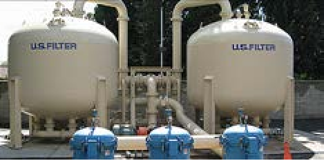

Habitation capabilities will evolve from the more resource-intensive, replenishable systems used on the ISS to efficient habitats for in-space and surface destinations These capabilities will also support modular systems for exploration vehicle life support and advanced personal life support systems for EVA, because leveraging common systems across platforms reduces both cost and risk Exploration activities will be enabled by mobility, EVA, robotic precursors, and surface systems based on a core set of capabilities with modifications to enable missions at specific destinations The capabilities for habitation and exploration of destinations will provide the foundation for living, working, and thriving in space indefinitely

Tanks for an ion exchange perchlorate-removal process treat groundwater at a NASA-funded water plant.

As NASA works to close the loop in life support systems, it produces a wide range of technologies that also contribute to sustainability on Earth. NASA research advances lowpower, regenerative wastewater-to-potable water processing and water purification systems that are portable. These systems have several Earth applications, including supporting drought-stricken areas, manufacturing waste reprocessing, and contributing to biofuels. Solid waste management projects also have Earth applications, as they specialize in waste minimization and the conversion of waste to valuable products, such as water, carbon dioxide, hydrogen, fuels, nutrients, building materials, and activated charcoal. These and similar projects help advance space exploration and support a greener Earth.

###### Long-Duration Habitation

The challenges of living in space or on another planetary body are daunting Human exploration missions that leave the Earth’s protective sphere will have to overcome the challenges of cosmic radiation, limited supplies, hazardous environments, and physiological and psychological impacts of living in cramped quarters in zero or low gravity To meet these challenges, NASA will develop long-duration habitation, which integrates a host of engineering, biological, logistics, and process solutions

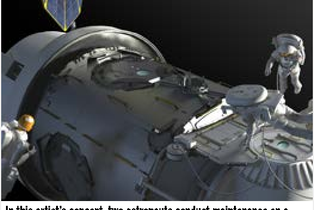

The long-duration habitation capability is a collection of technologies that supports a human crew as they travel through or explore space and live on planetary surfaces Whether an in-space or surface habitat, this capability will integrate essential crosscutting systems, including highly reliable environmental control and life support systems (ECLSS); food storage, preparation, and production; radiation protection; and technologies that support a crew’s physical and mental health

In this artist’s concept, two astronauts conduct maintenance on a habitat with the help of a robotic assistant.

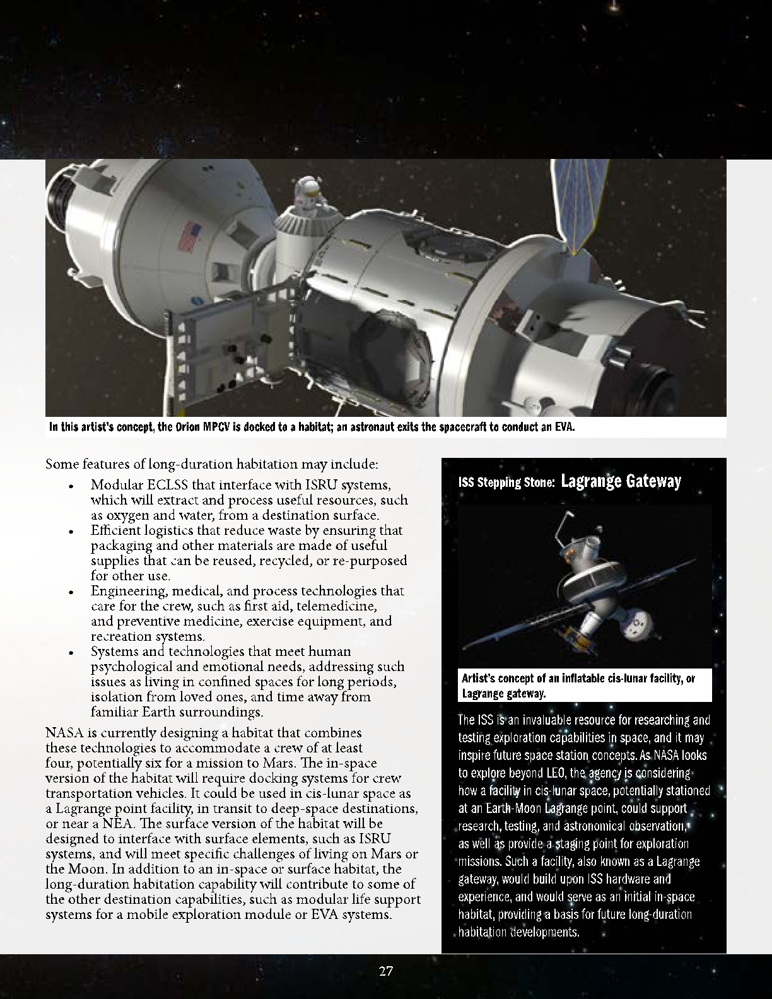

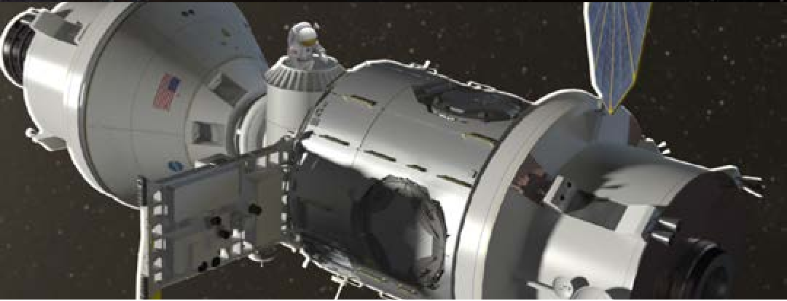

###### In this artist’s concept, the Orion MPCV is docked to a habitat; an astronaut exits the spacecraft to conduct an EVA.

Some features of long-duration habitation may include:

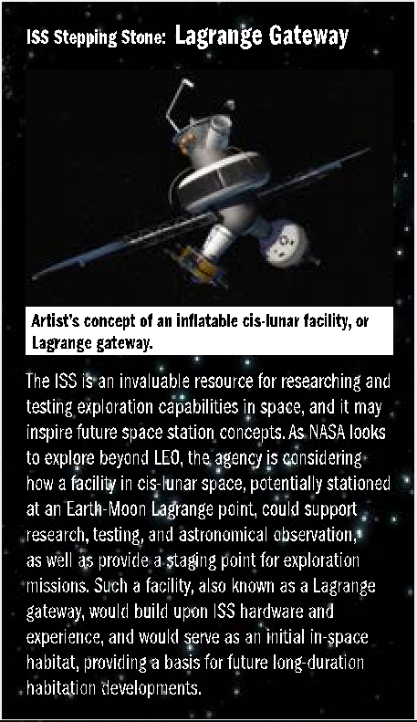

#### ISS Stepping Stone: Lagrange Gateway

- • Modular ECLSS that interface with ISRU systems, which will extract and process useful resources, such as oxygen and water, from a destination surface
- • Efficient logistics that reduce waste by ensuring that packaging and other materials are made of useful supplies that can be reused, recycled, or re-purposed for other use
- • Engineering, medical, and process technologies that care for the crew, such as first aid, telemedicine, and preventive medicine, exercise equipment, and recreation systems
- • Systems and technologies that meet human psychological and emotional needs, addressing such issues as living in confined spaces for long periods, isolation from loved ones, and time away from familiar Earth surroundings

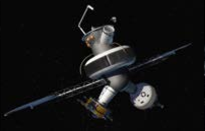

Artist’s concept of an inflatable cis-lunar facility, or Lagrange gateway.

The ISS is an invaluable resource for researching and testing exploration capabilities in space, and it may inspire future space station concepts. As NASA looks to explore beyond LEO, the agency is considering how a facility in cis-lunar space, potentially stationed at an Earth-Moon Lagrange point, could support research, testing, and astronomical observation, as well as provide a staging point for exploration missions. Such a facility, also known as a Lagrange gateway, would build upon ISS hardware and experience, and would serve as an initial in-space habitat, providing a basis for future long-duration habitation developments.

NASA is currently designing a habitat that combines these technologies to accommodate a crew of at least four, potentially six for a mission to Mars The in-space version of the habitat will require docking systems for crew transportation vehicles It could be used in cis-lunar space as a Lagrange point facility, in transit to deep-space destinations, or near a NEA The surface version of the habitat will be designed to interface with surface elements, such as ISRU systems, and will meet specific challenges of living on Mars or the Moon In addition to an in-space or surface habitat, the long-duration habitation capability will contribute to some of the other destination capabilities, such as modular life support systems for a mobile exploration module or EVA systems

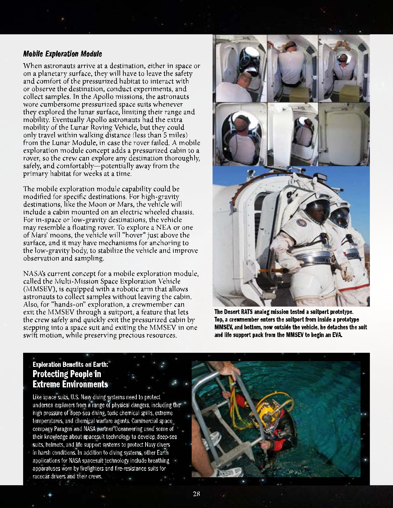

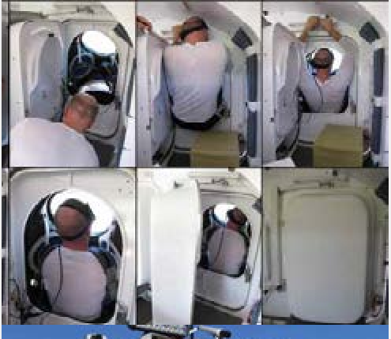

###### Mobile Exploration Module

When astronauts arrive at a destination, either in space or on a planetary surface, they will have to leave the safety and comfort of the pressurized habitat to interact with or observe the destination, conduct experiments, and collect samples In the Apollo missions, the astronauts wore cumbersome pressurized space suits whenever they explored the lunar surface, limiting their range and mobility Eventually Apollo astronauts had the extra mobility of the Lunar Roving Vehicle, but they could only travel within walking distance (less than 5 miles) from the Lunar Module, in case the rover failed A mobile exploration module concept adds a pressurized cabin to a rover, so the crew can explore any destination thoroughly, safely, and comfortably—potentially away from the primary habitat for weeks at a time

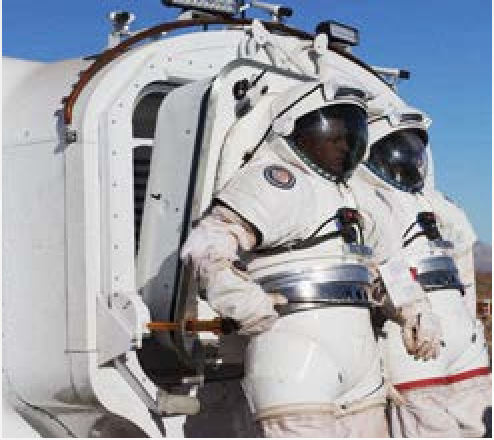

The mobile exploration module capability could be modified for specific destinations For high-gravity destinations, like the Moon or Mars, the vehicle will include a cabin mounted on an electric wheeled chassis For in-space or low-gravity destinations, the vehicle may resemble a floating rover To explore a NEA or one of Mars’ moons, the vehicle will “hover” just above the surface, and it may have mechanisms for anchoring to the low-gravity body, to stabilize the vehicle and improve observation and sampling

NASA’s current concept for a mobile exploration module, called the Multi-Mission Space Exploration Vehicle (MMSEV), is equipped with a robotic arm that allows astronauts to collect samples without leaving the cabin Also, for “hands-on” exploration, a crewmember can exit the MMSEV through a suitport, a feature that lets the crew safely and quickly exit the pressurized cabin by stepping into a space suit and exiting the MMSEV in one swift motion, while preserving precious resources

###### The Desert RATS analog mission tested a suitport prototype. Top, a crewmember enters the suitport from inside a prototype MMSEV, and bottom, now outside the vehicle, he detaches the suit and life support pack from the MMSEV to begin an EVA.

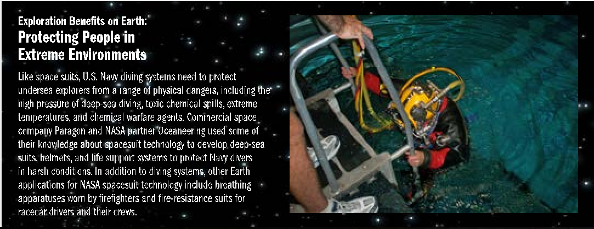

Exploration Benefits on Earth:

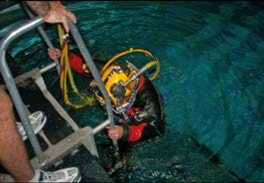

#### Protecting People in Extreme Environments

Like space suits, U.S. Navy diving systems need to protect undersea explorers from a range of physical dangers, including the high pressure of deep-sea diving, toxic chemical spills, extreme temperatures, and chemical warfare agents. Commercial space company Paragon and NASA partner Oceaneering used some of their knowledge about spacesuit technology to develop deep-sea suits, helmets, and life support systems to protect Navy divers in harsh conditions. In addition to diving systems, other Earth applications for NASA spacesuit technology include breathing apparatuses worn by firefighters and fire-resistance suits for racecar drivers and their crews.

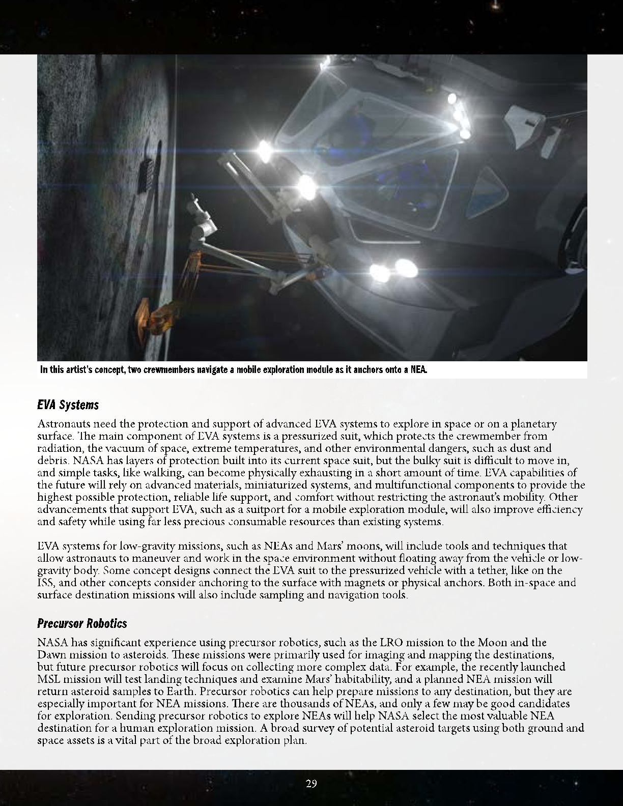

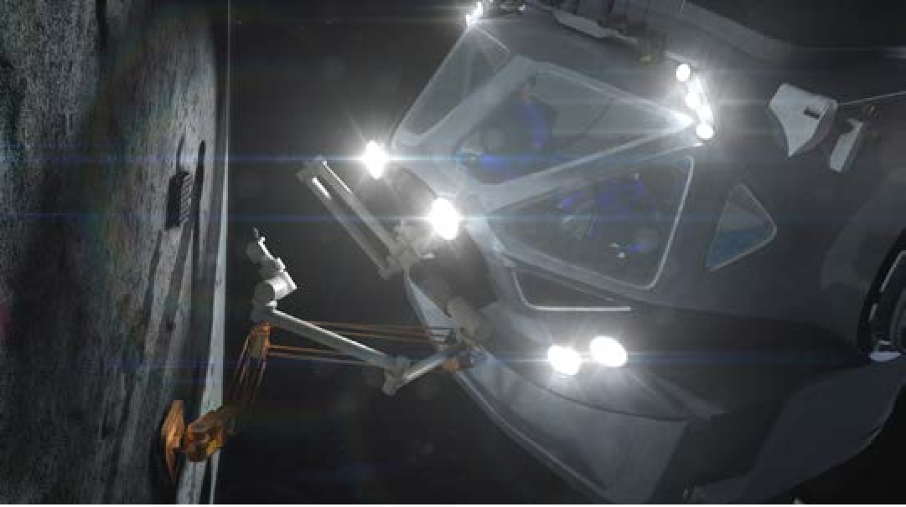

In this artist’s concept, two crewmembers navigate a mobile exploration module as it anchors onto a NEA.

###### EVA Systems

Astronauts need the protection and support of advanced EVA systems to explore in space or on a planetary surface The main component of EVA systems is a pressurized suit, which protects the crewmember from radiation, the vacuum of space, extreme temperatures, and other environmental dangers, such as dust and debris NASA has layers of protection built into its current space suit, but the bulky suit is difficult to move in, and simple tasks, like walking, can become physically exhausting in a short amount of time EVA capabilities of the future will rely on advanced materials, miniaturized systems, and multifunctional components to provide the highest possible protection, reliable life support, and comfort without restricting the astronaut’s mobility Other advancements that support EVA, such as a suitport for a mobile exploration module, will also improve efficiency and safety while using far less precious consumable resources than existing systems

EVA systems for low-gravity missions, such as NEAs and Mars’ moons, will include tools and techniques that allow astronauts to maneuver and work in the space environment without floating away from the vehicle or lowgravity body Some concept designs connect the EVA suit to the pressurized vehicle with a tether, like on the ISS, and other concepts consider anchoring to the surface with magnets or physical anchors Both in-space and surface destination missions will also include sampling and navigation tools

###### Precursor Robotics

NASA has significant experience using precursor robotics, such as the LRO mission to the Moon and the Dawn mission to asteroids These missions were primarily used for imaging and mapping the destinations, but future precursor robotics will focus on collecting more complex data For example, the recently launched MSL mission will test landing techniques and examine Mars’ habitability, and a planned NEA mission will return asteroid samples to Earth Precursor robotics can help prepare missions to any destination, but they are especially important for NEA missions There are thousands of NEAs, and only a few may be good candidates for exploration Sending precursor robotics to explore NEAs will help NASA select the most valuable NEA destination for a human exploration mission A broad survey of potential asteroid targets using both ground and space assets is a vital part of the broad exploration plan

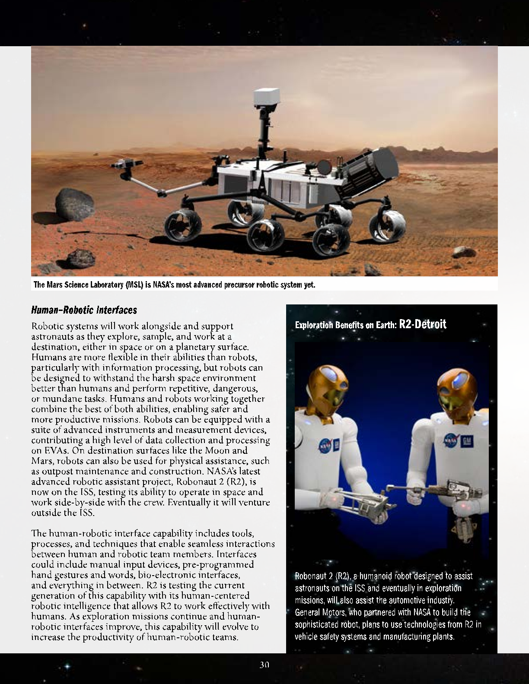

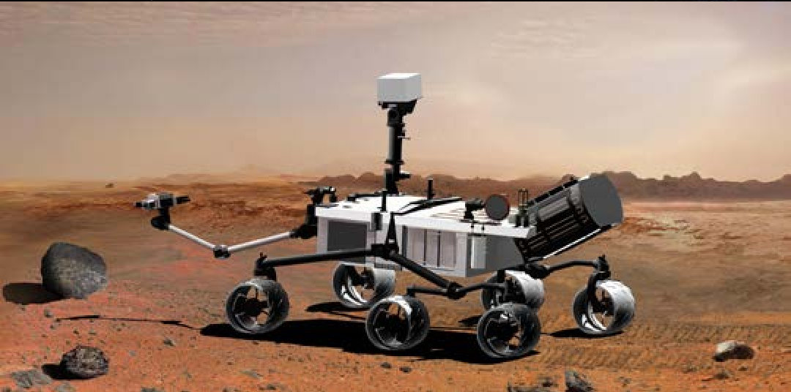

###### The Mars Science Laboratory (MSL) is NASA’s most advanced precursor robotic system yet.

###### Human–Robotic Interfaces

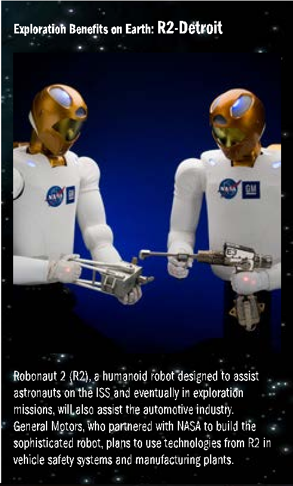

#### Exploration Benefits on Earth:R2-Detroit

Robotic systems will work alongside and support astronauts as they explore, sample, and work at a destination, either in space or on a planetary surface Humans are more flexible in their abilities than robots, particularly with information processing, but robots can be designed to withstand the harsh space environment better than humans and perform repetitive, dangerous, or mundane tasks Humans and robots working together combine the best of both abilities, enabling safer and more productive missions Robots can be equipped with a suite of advanced instruments and measurement devices, contributing a high level of data collection and processing on EVAs On destination surfaces like the Moon and Mars, robots can also be used for physical assistance, such as outpost maintenance and construction NASA’s latest advanced robotic assistant project, Robonaut 2 (R2), is now on the ISS, testing its ability to operate in space and work side-by-side with the crew Eventually it will venture outside the ISS

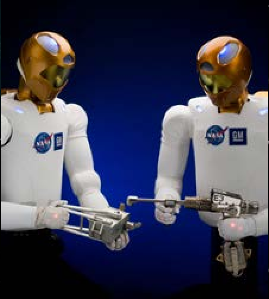

The human-robotic interface capability includes tools, processes, and techniques that enable seamless interactions between human and robotic team members Interfaces could include manual input devices, pre-programmed hand gestures and words, bio-electronic interfaces, and everything in between R2 is testing the current generation of this capability with its human-centered robotic intelligence that allows R2 to work effectively with humans As exploration missions continue and humanrobotic interfaces improve, this capability will evolve to increase the productivity of human-robotic teams

Robonaut 2 (R2), a humanoid robot designed to assist astronauts on the ISS and eventually in exploration missions, will also assist the automotive industry. General Motors, who partnered with NASA to build the sophisticated robot, plans to use technologies from R2 in vehicle safety systems and manufacturing plants.

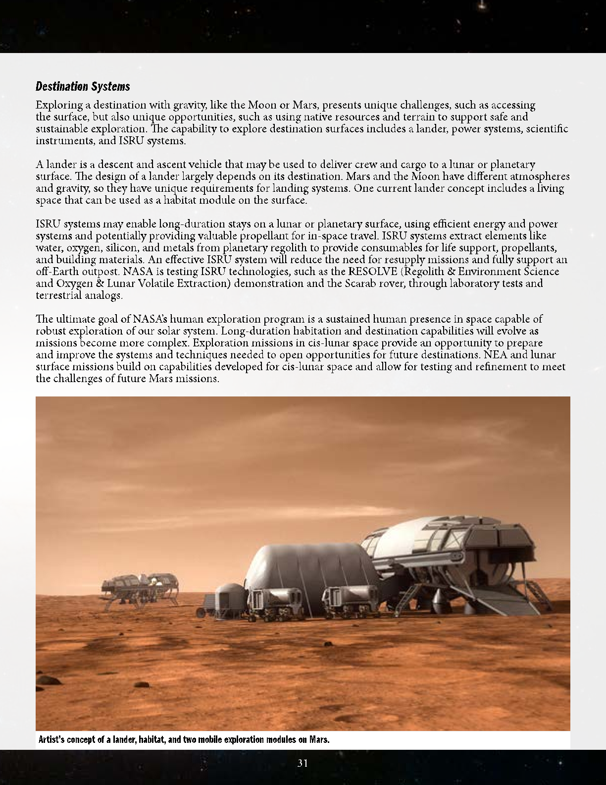

###### Destination Systems

Exploring a destination with gravity, like the Moon or Mars, presents unique challenges, such as accessing the surface, but also unique opportunities, such as using native resources and terrain to support safe and sustainable exploration The capability to explore destination surfaces includes a lander, power systems, scientific instruments, and ISRU systems

A lander is a descent and ascent vehicle that may be used to deliver crew and cargo to a lunar or planetary surface The design of a lander largely depends on its destination Mars and the Moon have different atmospheres and gravity, so they have unique requirements for landing systems One current lander concept includes a living space that can be used as a habitat module on the surface

ISRU systems may enable long-duration stays on a lunar or planetary surface, using efficient energy and power systems and potentially providing valuable propellant for in-space travel ISRU systems extract elements like water, oxygen, silicon, and metals from planetary regolith to provide consumables for life support, propellants, and building materials An effective ISRU system will reduce the need for resupply missions and fully support an off-Earth outpost NASA is testing ISRU technologies, such as the RESOLVE (Regolith & Environment Science and Oxygen & Lunar Volatile Extraction) demonstration and the Scarab rover, through laboratory tests and terrestrial analogs

The ultimate goal of NASA’s human exploration program is a sustained human presence in space capable of robust exploration of our solar system Long-duration habitation and destination capabilities will evolve as missions become more complex Exploration missions in cis-lunar space provide an opportunity to prepare and improve the systems and techniques needed to open opportunities for future destinations NEA and lunar surface missions build on capabilities developed for cis-lunar space and allow for testing and refinement to meet the challenges of future Mars missions

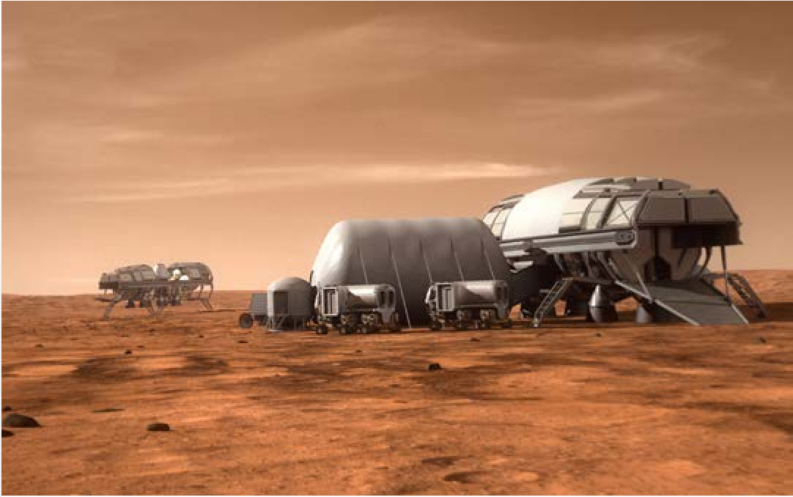

Artist’s concept of a lander, habitat, and two mobile exploration modules on Mars.

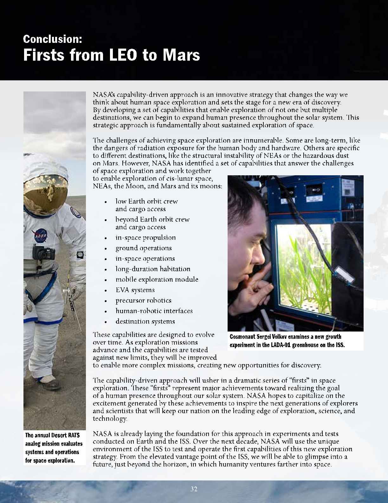

Conclusion:

## Firsts from LEO to Mars

NASA’s capability-driven approach is an innovative strategy that changes the way we think about human space exploration and sets the stage for a new era of discovery By developing a set of capabilities that enable exploration of not one but multiple destinations, we can begin to expand human presence throughout the solar system This strategic approach is fundamentally about sustained exploration of space

The challenges of achieving space exploration are innumerable Some are long-term, like the dangers of radiation exposure for the human body and hardware Others are specific to different destinations, like the structural instability of NEAs or the hazardous dust on Mars However, NASA has identified a set of capabilities that answer the challenges of space exploration and work together to enable exploration of cis-lunar space, NEAs, the Moon, and Mars and its moons:

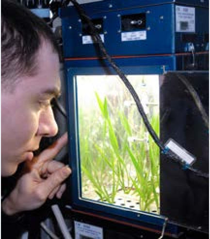

- • low Earth orbit crew and cargo access
- • beyond Earth orbit crew and cargo access
- • in-space propulsion
- • ground operations
- • in-space operations
- • long-duration habitation
- • mobile exploration module
- • EVA systems
- • precursor robotics
- • human-robotic interfaces
- • destination systems

These capabilities are designed to evolve over time As exploration missions advance and the capabilities are tested against new limits, they will be improved to enable more complex missions, creating new opportunities for discovery

Cosmonaut Sergei Volkov examines a new growth experiment in the LADA-01 greenhouse on the ISS.

The capability-driven approach will usher in a dramatic series of “firsts” in space exploration These “firsts” represent major achievements toward realizing the goal of a human presence throughout our solar system NASA hopes to capitalize on the excitement generated by these achievements to inspire the next generations of explorers and scientists that will keep our nation on the leading edge of exploration, science, and technology

NASA is already laying the foundation for this approach in experiments and tests conducted on Earth and the ISS Over the next decade, NASA will use the unique environment of the ISS to test and operate the first capabilities of this new exploration strategy From the elevated vantage point of the ISS, we will be able to glimpse into a future, just beyond the horizon, in which humanity ventures farther into space

The annual Desert RATS analog mission evaluates systems and operations for space exploration.

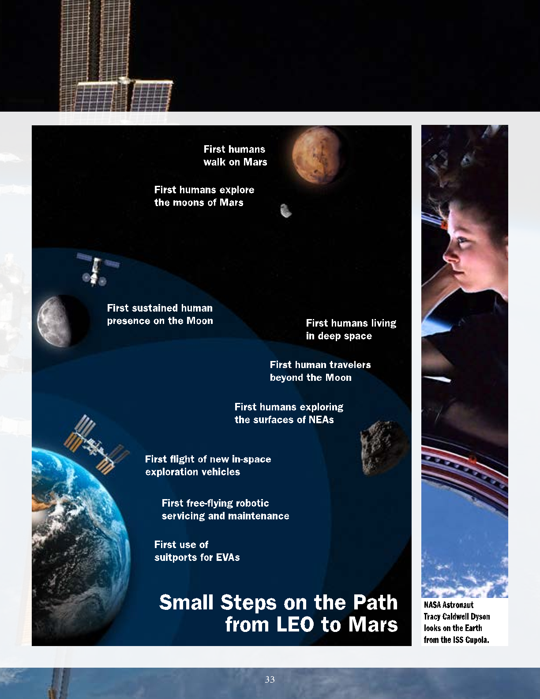

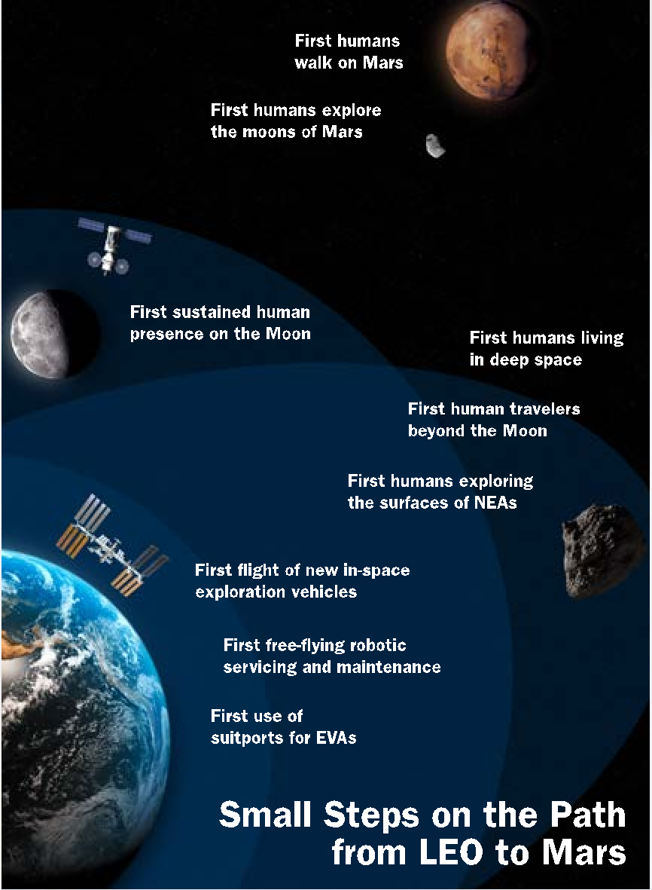

First humans walk on Mars

First humans explore the moons of Mars

First sustained human presence on the Moon First humans living

in deep space

First human travelers beyond the Moon

First humans exploring the surfaces of NEAs

First flight of new in-space exploration vehicles

First free-flying robotic servicing and maintenance

First use of suitports for EVAs

### Small Steps on the Path from LEO to Mars

NASA Astronaut Tracy Caldwell Dyson looks on the Earth from the ISS Cupola.

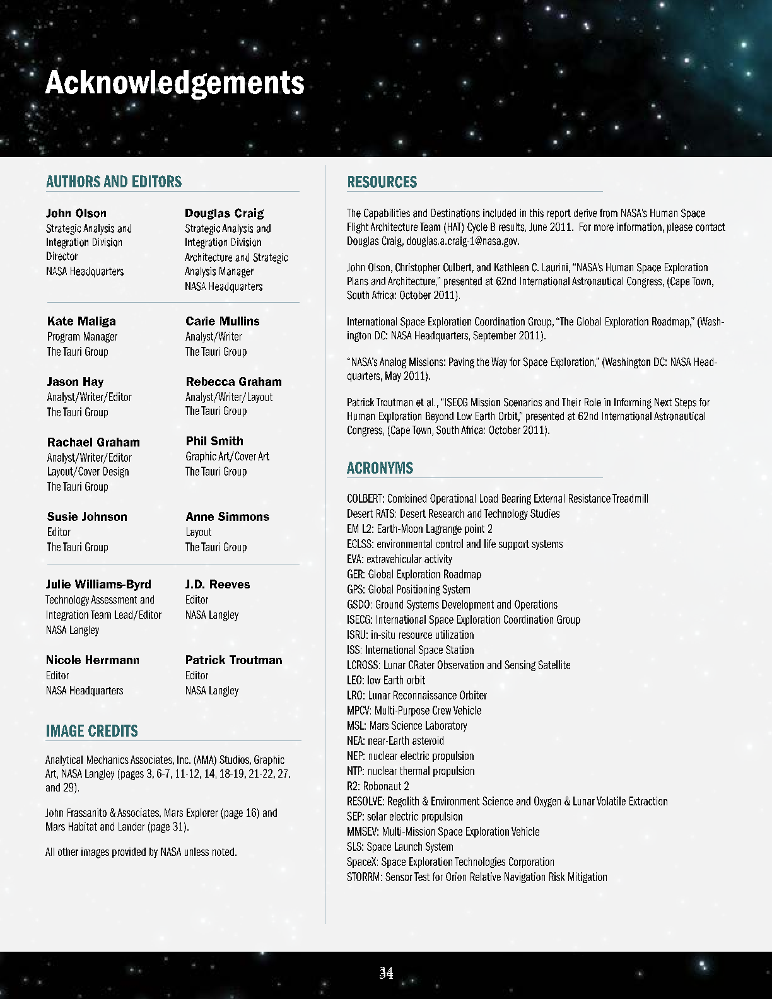

## Acknowledgements

###### AUTHORS AND EDITORS

###### RESOURCES

John Olson Strategic Analysis and Integration Division Director NASA Headquarters

Douglas Craig Strategic Analysis and Integration Division Architecture and Strategic Analysis Manager NASA Headquarters

The Capabilities and Destinations included in this report derive from NASA’s Human Space Flight Architecture Team (HAT) Cycle B results, June 2011. For more information, please contact Douglas Craig, douglas.a.craig-1@nasa.gov.

John Olson, Christopher Culbert, and Kathleen C. Laurini, “NASA’s Human Space Exploration Plans and Architecture,” presented at 62nd International Astronautical Congress, (Cape Town, South Africa: October 2011).

Kate Maliga Program Manager The Tauri Group

Carie Mullins Analyst/Writer The Tauri Group

International Space Exploration Coordination Group, “The Global Exploration Roadmap,” (Washington DC: NASA Headquarters, September 2011).

“NASA’s Analog Missions: Paving the Way for Space Exploration,” (Washington DC: NASA Headquarters, May 2011).

Jason Hay Analyst/Writer/Editor The Tauri Group

Rebecca Graham Analyst/Writer/Layout The Tauri Group

Patrick Troutman et al., “ISECG Mission Scenarios and Their Role in Informing Next Steps for Human Exploration Beyond Low Earth Orbit,” presented at 62nd International Astronautical Congress, (Cape Town, South Africa: October 2011).

Phil Smith Graphic Art/Cover Art The Tauri Group

###### Rachael Graham

Analyst/Writer/Editor Layout/Cover Design The Tauri Group

###### ACRONYMS

COLBERT: Combined Operational Load Bearing External Resistance Treadmill Desert RATS: Desert Research and Technology Studies EM L2: Earth-Moon Lagrange point 2 ECLSS: environmental control and life support systems EVA: extravehicular activity GER: Global Exploration Roadmap GPS: Global Positioning System GSDO: Ground Systems Development and Operations ISECG: International Space Exploration Coordination Group ISRU: in-situ resource utilization ISS: International Space Station LCROSS: Lunar CRater Observation and Sensing Satellite LEO: low Earth orbit LRO: Lunar Reconnaissance Orbiter MPCV: Multi-Purpose Crew Vehicle MSL: Mars Science Laboratory NEA: near-Earth asteroid NEP: nuclear electric propulsion NTP: nuclear thermal propulsion R2: Robonaut 2 RESOLVE: Regolith & Environment Science and Oxygen & Lunar Volatile Extraction SEP: solar electric propulsion MMSEV: Multi-Mission Space Exploration Vehicle SLS: Space Launch System SpaceX: Space Exploration Technologies Corporation STORRM: Sensor Test for Orion Relative Navigation Risk Mitigation

Susie Johnson Editor The Tauri Group

Anne Simmons Layout The Tauri Group

J.D. Reeves Editor NASA Langley

Julie Williams-Byrd Technology Assessment and Integration Team Lead/Editor NASA Langley

Nicole Herrmann Editor NASA Headquarters

Patrick Troutman Editor NASA Langley

###### IMAGE CREDITS

Analytical Mechanics Associates, Inc. (AMA) Studios, Graphic Art, NASA Langley (pages 3, 6-7, 11-12, 14, 18-19, 21-22, 27, and 29).

John Frassanito & Associates, Mars Explorer (page 16) and Mars Habitat and Lander (page 31).

All other images provided by NASA unless noted.

National Aeronautics and Space Administration Langley Research Center 100 NASA Road Hampton, VA 23681 www.nasa.gov/centers/langley

###### www.nasa.gov

NP-2011-06-395-LaRC
