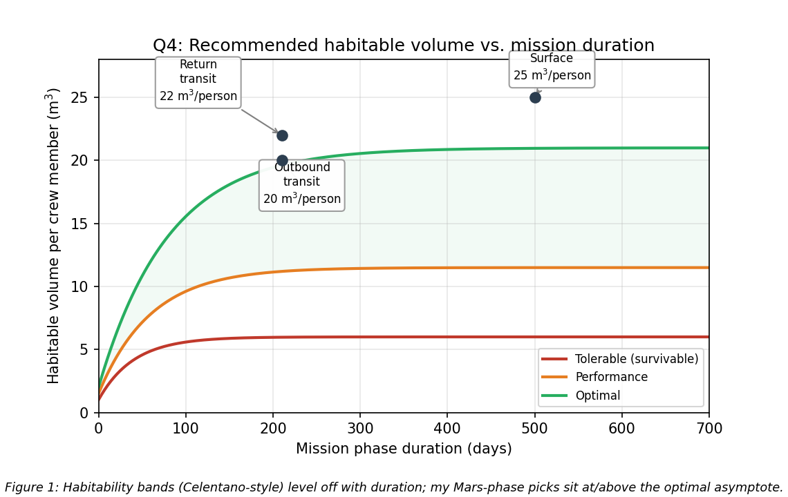

# SPCE 5065: Homework 3
**Bioastronautics, human factors, and the SHELL model for Mars and Ceres**
**Author:** Jordan Clayton
**Date:** July 6, 2026

---

### Approach Overview

1. **Everything is anchored to Lesson 3.** Where the lecture gave a hard number (volume tiers, EVA pressures, roadmap colors) I used it; where it did not (calorie count, planetary data) I pulled the number from NASA and cited it.
2. **Q4, Q5, and Q7 share one idea:** a mission gets harder as it gets longer and gravity gets weaker. That thread runs through the volume call, the Ceres roadmap, and the three suits.
3. **Q6 and Q9 both use SHELL,** so I drew it once (Figure 2) and reused it: Apollo 13 for the single case, Challenger vs Columbia for the comparison.

---

## Problem 1: Current-Events Presentations (2 July)

> *For the current events presentations on Thursday 2 July: (a) Summarize the presentation, (b) Describe something you learned from it, (c) Write one question you have left about the presentation.*

There were two, so I covered both.

**(a) Summaries.**

**Shelby Schreckenberg, bioastronautics overview [1].** A survey of the field: bioastronautics is biology plus astrodynamics, and it grew after Apollo 11. She ran through the standard microgravity medical problems (bone loss, muscle atrophy, fluid shift, immune suppression, space motion sickness, post-return balance issues) and the ISS countermeasures that actually fly: exercise machines, onboard ultrasound and MRI, light therapy plus melatonin, radiation sensors, and closed-loop air and water recycling.

**Grace Burns, AVATAR on Artemis II [2].** The genuine current event. AVATAR (Virtual Astronaut Tissue Analog Response) is an organ-on-a-chip experiment on Artemis II measuring how radiation and microgravity damage tissue. The trick is that each tissue type flies as a pair: one twin stays on Earth, one flies, and afterward you compare them for DNA damage, cell growth, and immune response, cross-checked against the astronaut's own blood. Each USB-drive-sized chip is grown from bone-marrow stem cells that Emulate isolates from the leftovers of a routine platelet donation using magnetic beads, and Space Tango built the self-contained payload [2].

**(b) Something I learned.** From Burns: the chip stem cells come from the *waste* fraction of an ordinary platelet donation, pulled out with magnetic beads, not from an invasive marrow biopsy [2]. From Schreckenberg: the ISS carries ultrasound and MRI, and crew with only general training run the scans and downlink the data [1]. I had assumed anything past first aid waited for return.

**(c) Question I have left.** An organ-on-a-chip has none of the body's systemic regulation (no hormones, no real immune system, no actual skeleton absorbing dose), so how well does chip-level radiation damage actually predict what happens in a whole 70 kg astronaut? I want to know AVATAR's validation plan for tying chip results to crew-level outcomes [2].

---

## Problem 2: Altered Vestibular Function and Its Symptoms

> *What is meant by "altered vestibular functions" and what are its symptoms?*

**What it means.** The vestibular system is the inner-ear balance apparatus: the otolith organs (utricle and saccule) sense linear acceleration and, on the ground, which way gravity points, while the three semicircular canals sense rotation [3]. On Earth those signals agree with the eyes and the muscle/joint sense. In free fall the otoliths stop feeling the steady gravity pull, so the "which way is down" channel goes quiet while vision and the canals keep reporting. "Altered vestibular function" is that sensory conflict [3].

**Symptoms.** The lecture grouped these as Space Adaptation Syndrome, "the equivalent of car sick in that environment" [3]:

- **Space motion sickness, first few days:** nausea, vomiting, headache, malaise, loss of appetite while the brain reweights its inputs [1], [3].
- **Spatial disorientation and visual illusions:** a false sense of self-motion or of the vehicle tumbling, and trouble telling floor from ceiling.
- **Degraded eye-head coordination:** harder to read instruments and track targets, right when tasks are most critical.
- **Post-landing readaptation:** balance, posture, gait, and orientation all suffer for days to weeks depending on mission length, to the point that crew like Nick Hague are carried out of the capsule [3].

Two flags: susceptibility is hard to predict crew-to-crew, and men have shown up as *more* susceptible than women [3]. The Mars problem is that nobody is standing on the surface to catch a wobbly crew, which is why sensorimotor risk stays yellow-to-red for exploration [3], [4].

---

## Problem 3: Astronaut Caloric Intake and Two Free-Fall Nutritional Requirements

> *What are approximate caloric intake requirements for astronauts? Describe two unique nutritional requirements driven by the free-fall environment.*

**Caloric intake.** Demand stays near Earth levels because the crew still does hours of hard exercise daily; NASA sizes intake from the WHO energy equations scaled by an activity factor [5]:

$$\boxed{\text{Astronaut energy intake} \approx 2{,}500 \text{ to } 3{,}000\ \text{kcal/day, about } 2{,}700\ \text{kcal/day typical} \; [5]}$$

That fits the lecture's mass balance, where a typical astronaut cycles about 5 kg/day in and out, roughly 3.5 kg of it potable water [3]. Two requirements that free fall specifically drives:

**1. Vitamin D and calcium for bone loss.** Weight-bearing bone demineralizes at roughly 1 to 1.5% per month, dumping calcium into blood and urine [5]. With no sunlight through the hull the skin makes essentially no vitamin D, which is what lets the gut absorb calcium, so NASA supplements vitamin D and crews take calcium to replace what the bones shed [3], [5]. (The lecture's proof: early station toilets clogged from the unplanned calcium load [3].)

**2. Reduced sodium and iron.** High sodium accelerates bone resorption and calcium loss and raises stone risk, so space food was reformulated lower in sodium [5]. Iron is subtler: red-cell mass drops in free fall ("space anemia"), so surplus dietary iron is not going into hemoglobin and instead promotes oxidative stress and stone formation, so NASA holds it down [5].

Both run against ground intuition, where you would load up on salt and iron; in free fall you hold them down and lean on vitamin D and targeted calcium to fight the bone loss.

---

## Problem 4: Recommended Habitable Volume for a Mars Mission

> *For a Mars mission, what habitable volume would you recommend for the crew quarters on the (a) flight there, (b) surface, (c) return flight? Explain your rationale.*

**Assumptions:** crew of 4, long-stay conjunction profile (~210-day transits each way, ~500-day surface stay), "habitable volume" meaning usable pressurized volume per crew member.

The lecture's anchors are about **5 m³ per person tolerable** and **17 m³ optimal** [3], matching the Celentano habitability curve, where per-person need rises with duration and levels off near 18 to 20 m³ past a few months [6]. Every Mars phase is long-duration, so all three recommendations sit at or above that optimal asymptote (**Figure 1**).

**Table 1:** Recommended habitable volume per crew member by mission phase.

| Phase | Duration | Recommended | Driver |
|:---|:---|---:|:---|
| (a) Outbound transit | ~210 days | 20 m³/person | Long 0-g confinement, team still forming |
| (b) Surface | ~500 days | 25 m³/person | Longest, busiest phase; 0.38 g helps build |
| (c) Return transit | ~210 days | 22 m³/person | Deconditioned crew, morale sag |

$$\boxed{\text{(a) } 20\ \text{m}^3 \quad\text{(b) } 25\ \text{m}^3 \quad\text{(c) } 22\ \text{m}^3 \ \text{per person}}$$

**Rationale.**
- **(a) Outbound, 20 m³:** right at optimal. Half a year of 0 g with no outside and a crew still forming, so I start them at optimal, not the "performance" tier [3], [6]. Skimping here reappears later as a crew-cohesion problem.
- **(b) Surface, 25 m³:** above optimal because it is the longest and busiest phase (EVA prep, samples, science on top of daily living), so people need workspace too. The 0.38 g restores up/down and makes the extra volume cheap to build with landed or inflatable habitats [6].
- **(c) Return, 22 m³:** slightly above outbound despite equal length, because the crew is deconditioned and the Mars 500 "third-quarter" finding says motivation dips on the way home [3], [4]. Squeezing the habitat when morale is most fragile is backward.

Private crew quarters are the concrete form of this volume and a Liveware-Liveware mitigation, not a luxury [3]. Below ~10 m³ you are in the degrading "performance" band, and 5 m³ is bare survival [3], [6]; nothing about a two-plus-year mission belongs there.

---

## Problem 5: Bioastronautics Roadmap, Extended to Ceres

> *NASA's Bioastronautics Roadmap provides overall ratings for a human Mars mission. (a) Complete the columns for a Ceres mission. (b) Choose three specific areas and discuss them more thoroughly: how would the risk be different for Ceres, and what might be a mitigation strategy?*

**Assumptions:** Ceres sits at 2.77 AU, so a crewed mission is a multi-year round trip, surface gravity is only ~0.029 g (essentially still free fall), and comm delay runs up to ~30 min one way [3], [7]. Those three facts (longer, more radiation, weaker gravity) drive the ratings up.

**(a) Completed table.** I carried NASA's Mars ratings over and rated Ceres by the same scheme (R = no mitigation, Y = partial, G = well mitigated) [4].

**Table 2:** Roadmap ratings, Mars (per NASA) and Ceres (mine). R = red, Y = yellow, G = green.

| Risk | Mars op. | Mars long | Ceres op. | Ceres long |
|:---|:---:|:---:|:---:|:---:|
| Adverse Cognitive/Behavioral Conditions & Psychiatric Disorders | R | Y | R | R |
| Adverse Health/Performance Effects of Celestial Dust Exposure | R | R | R | R |
| Adverse Health Effects Due to Host-Microorganism Interactions | Y | Y | R | R |
| Adverse Health Event Due to Altered Immune Response | Y | Y | R | R |
| Adverse Health Outcomes from Medical Conditions (in-mission & long-term) | R | R | R | R |
| Adverse Outcomes from Inadequate Human Systems Integration | R | N/A | R | N/A |
| Altered Sensorimotor/Vestibular Function | Y | G | R | Y |
| Bone Fracture from Spaceflight-Induced Bone Changes | R | Y | R | R |
| Cardiovascular Adaptations | R | Y | R | R |
| Reduced Muscle Size, Strength, Endurance | Y | G | R | Y |
| Ineffective or Toxic Medications | R | R | R | R |
| Injury & Compromised Performance from EVA Operations | R | Y | R | R |
| Injury from Dynamic Loads | R | N/A | R | N/A |
| Behavioral Health Decrements from Inadequate Team Cooperation | R | N/A | R | N/A |
| Crew Illness from Inadequate Food and Nutrition | R | R | R | R |
| Sleep Loss, Circadian Desynchronization, Work Overload | Y | Y | R | R |
| Radiation Carcinogenesis | G | Y | R | R |
| Reduced Aerobic Capacity | Y | G | R | Y |
| Renal Stone Formation | R | R | R | R |
| Spaceflight-Associated Neuro-ocular Syndrome (SANS) | R | R | R | R |

The pattern: Ceres pushes nearly everything to red, because exposures accumulate over the longer mission, cumulative radiation climbs, and the ~0.03 g surface gives none of the reloading that lets several Mars risks sit green long-term [3], [4], [7].

**(b) Three areas in depth.**

**1. Radiation Carcinogenesis (Mars G/Y, Ceres R/R).** The biggest jump. Mars keeps in-mission dose within limits; a multi-year Ceres cruise blows past career limits, which is why conference judges argued nobody could survive the trip [3], [7]. *Mitigation:* use Ceres itself, a water-ice-rich body, to shield with mass you did not launch: bank water and regolith around a storm-shelter sleep station, bury the surface habitat, add radioprotectants and strict dosimetry, and shorten the transit to cut integrated dose.

**2. Altered Sensorimotor/Vestibular (Mars Y/G, Ceres R/Y).** Mars goes green long-term because 0.38 g reloads the balance system once the crew lands [4]. Ceres has almost no surface gravity, so the "surface" is more free fall and the crew never re-adapts, turning a Mars in-mission annoyance into a mission-length problem [3]. *Mitigation:* supply the gravity the destination will not, via a rotating habitat or short-arm centrifuge, plus daily vestibular/resistive exercise.

**3. Adverse Cognitive/Behavioral/Psychiatric (Mars R/Y, Ceres R/R).** The isolation runs years instead of months, the comm delay stretches toward half an hour each way, and Earth shrinks to a dim dot [3], [7]. Mars 500 already showed circadian disruption and a third-quarter slump over 520 days, and Ceres is several times longer. *Mitigation:* front-load it (80% of a flight psychologist's work is pre-mission), select and train for autonomy and cohesion, guarantee private quarters, and give the crew real onboard behavioral tools since there is no evacuation [3].

---

## Problem 6: Apollo 13 Breakdowns and the SHELL Model

> *Describe the major breakdowns and disconnects that occurred during the Apollo 13 mission. Which elements of the SHELL model were involved?*

**The breakdowns.** On 13 April 1970, oxygen tank 2 exploded during a routine cryogenic stir [8]:

- **A latent documentation/design disconnect:** the tank's heater used thermostatic switches still rated for the old 28 V ground supply, never updated when the command module went to 65 V. On a pre-flight detank the switches welded shut and the heater cooked the Teflon insulation off the fan wiring, and nobody caught it [8].
- **A routine action triggered it:** the standard stir energized the fan, the exposed wiring arced, the insulation ignited in the pure-oxygen tank, and the tank blew, also taking out a line to tank 1 [8].
- **Cascading loss:** both O2 tanks vented and two of three fuel cells died, so the CM lost most of its power, water, and oxygen, and the goal collapsed to "get everyone home alive" [8].
- **A hardware mismatch under stress:** in the LM lifeboat, the CM's square lithium-hydroxide canisters would not fit the LM's round CO2 receptacles, so ground engineers improvised the "mailbox" adapter and read it up to the crew [8].

**SHELL elements.** All five, which is the lecture's point that disasters come from interactions, not one cause [3]. **Figure 2** is the model I reuse in Problem 9.

- **Hardware (H):** mis-specified switches, damaged wiring, ruptured tank, incompatible LiOH canister.
- **Software (S), procedures/docs:** the voltage spec that never reached the switch rating, the stir procedure that triggered the fault, the improvised scrubber fix.
- **Environment (E):** deep space with finite, freezing, rationed consumables.
- **Liveware (L):** the crew flying a crippled ship and hand-executing the PC+2 free-return burn.
- **Liveware-Liveware (L-L):** the crew-to-Mission-Control coordination that saved them, unified by one clear goal [3].

The fatal-looking hardware failure was seeded by a paperwork failure years earlier and recovered by the L-L interface working as it should: same model, opposite outcomes, at two different interfaces.

---

## Problem 7: EVA Suit Requirements for the Moon, Mars, and Ceres

> *Propose requirements for an EVA suit for a human mission to the (a) Moon, (b) Mars, (c) Ceres. Include a discussion of the unique aspects of the destination.*

Every suit does the same core job: carry oxygen, CO2 removal, water, comms, thermal control, and pressure, all self-contained [3]. The shared baseline is in **Table 3**; each destination then adds its own killer. Every suit keeps the bends ratio R (cabin N2 pressure over suit N2 pressure) near 1.5 to keep decompression sickness off the table [3].

**Table 3:** EVA design baseline from Lesson 3 (U.S., with Russian contrast) [3].

| Parameter | U.S. | Russia |
|:---|:---:|:---:|
| Suit operating pressure | 29.6 kPa | 39.2 kPa |
| Pre-breathe (N2 washout) | 100% O2, ~1 hr | ~30 min |
| Max EVA duration | ~8 hr | ~7 hr |
| Life-support pack mass | ~55 kg | ~120 kg |

**(a) Moon.** Unique: 1/6 g, hard vacuum, a 14-day day/night cycle from ~+120 to below -130 C, and abrasive charged regolith that chewed through Apollo suit joints in three days [9].
- Dust-tolerant bearings and seals, plus a suitport or dust-off so regolith never comes inside.
- Wide-range active heating and cooling for lunar day and shadow.
- High mobility for partial-gravity surface work, and radiation shielding for extended stays.

**(b) Mars.** Unique: 0.38 g, a thin ~0.6 kPa CO2 atmosphere (near-vacuum, slight convection), global dust storms, toxic perchlorate fines, and -125 to +20 C, over hundreds of EVAs with no resupply [10].
- Reusable and field-maintainable for hundreds of cycles.
- Perchlorate/dust mitigation and an airlock that keeps the fines out of the habitat.
- Regenerable life support for the CO2 atmosphere, and low mass, because in real gravity the suit's weight matters.

**(c) Ceres.** Unique: ~0.03 g (an orbital EVA even while "standing"), 2.77 AU so very cold and dim, near-vacuum, and high cumulative radiation [3], [7].
- Microgravity-EVA architecture: handholds, tethers, and a jetpack, because you cannot walk.
- Heavy insulation and heating for cryogenic temperatures.
- Maximum radiation shielding with dose budgeting, plus years-long durability and in-situ repair.

Read down the list and the problem shifts from "surface mobility" (Moon) toward "keep a human alive in deep space" (Ceres) as gravity drops and distance grows.

---

## Problem 8: Weighted Trade Study, 1,500 kg Mars Crew-Health Allocation

> *NASA has allocated an additional 1,500 kg of launch mass for improving crew health during a 900-day Mars mission. Invest the mass in only three of: radiation shielding, exercise equipment, food variety, medical equipment, private crew quarters, water reserves, artificial gravity demonstration hardware, additional scientific equipment. Develop a weighted trade study with objectives, evaluation criteria, weighting factors, trade matrix, and final recommendation.*

**Assumptions:** the vehicle already carries minimal exercise gear, standard food, and basic meds, so the 1,500 kg is an augmentation; crew of 4, no evacuation once en route.

**Objective:** spend the mass to maximize crew health, safety, and performance over 900 days, prioritizing the life-threatening, unmitigated (red) roadmap risks [4].

**Criteria and weights:** crew survival / acute life-threat (0.30), chronic physiological health (0.20), behavioral/psychological health (0.20), coverage of a red roadmap risk (0.15), mass efficiency (0.15).

**Table 4:** Weighted trade matrix (scores 1 to 5; total is the weighted sum). Bold = selected.

| Option | C1 (.30) | C2 (.20) | C3 (.20) | C4 (.15) | C5 (.15) | **Total** |
|:---|:---:|:---:|:---:|:---:|:---:|:---:|
| **Exercise equipment** | 3 | 5 | 4 | 3 | 4 | **3.75** |
| **Medical equipment** | 5 | 2 | 2 | 5 | 3 | **3.50** |
| **Radiation shielding** | 5 | 1 | 2 | 5 | 2 | **3.15** |
| Food variety | 2 | 2 | 5 | 3 | 4 | 3.05 |
| Private crew quarters | 2 | 1 | 5 | 4 | 3 | 2.85 |
| Water reserves | 3 | 1 | 1 | 2 | 2 | 1.90 |
| Artificial-gravity demo hardware | 2 | 3 | 1 | 2 | 1 | 1.85 |
| Additional science equipment | 1 | 1 | 2 | 1 | 2 | 1.35 |

$$\boxed{\text{Invest the 1,500 kg in exercise equipment, medical equipment, and radiation shielding}}$$

A defensible split: ~300 kg exercise, ~400 kg medical, ~800 kg radiation shielding = 1,500 kg.

**Why these three.**
- **Exercise (3.75):** without it, deconditioning over 900 days is near-certain and mission-ending, and it is the best benefit-per-kg option [3], [4].
- **Medical (3.50):** covers the in-mission medical red row, which is life-or-death with no evacuation [4].
- **Radiation shielding (3.15):** the flagship red risk. It scores a notch lower only because 1,500 kg buys just a partial storm shelter, but it is too dangerous to skip [4].

**The tradeoff.** Food variety (3.05) missed by one line and is where I would spend any leftover mass, since morale and appetite drive performance over 900 days [3]. Private quarters (2.85) overlaps with the Problem 4 volume budget, so I did not double-buy it. Artificial-gravity *demonstration* hardware (1.85) protects future crews, not this one, and additional science is not a crew-health investment.

---

## Problem 9: SHELL Comparison of Two Accidents (Challenger and Columbia)

> *Using the SHELL model, compare two human-spaceflight accidents. Evaluate as applicable: common failure modes (in the SHELL context), organizational influences, design deficiencies, operational decisions, and lessons that remain relevant for Artemis or Mars.*

Challenger (1986) and Columbia (2003) are the same organization making the same mistake seventeen years apart, the clearest demonstration that accidents live at interfaces, not in one part [3].

**Table 5:** SHELL comparison of Challenger and Columbia.

| SHELL interface | Challenger (STS-51-L) | Columbia (STS-107) |
|:---|:---|:---|
| Hardware (H) | Cold-stiffened O-ring failed to seal, letting hot gas burn through [11] | Tank foam breached the wing's reinforced-carbon-carbon thermal protection [12] |
| Software (S) = procedures | Prior O-ring erosion accepted via waivers instead of grounding the fleet [11] | Foam shedding reclassified as an accepted "in-family" event [12] |
| Environment (E) | Record-cold launch below the O-ring's qualified range [11] | Entry heating, with no on-orbit inspection or rescue planned [12] |
| Liveware-Liveware (L-L) | Management overrode engineers who advised against launching cold [11] | Management dismissed engineers' requests for wing imaging [12] |
| Liveware (L) = crew | No survivable abort at that flight phase | No way to inspect or repair the wing from orbit |

**Common failure mode.** Both are **normalization of deviance**: an anomaly recurs without immediate consequence, so it gets quietly reclassified as acceptable until it kills a crew [11], [12]. In SHELL terms the fatal seam is Liveware-Liveware, engineering versus management. Behind both sat **schedule and budget pressure** and a safety function without the independent authority to stop the launch, so the S interface (the rules meant to catch these) had been eroded by the culture that wrote the waivers [11], [12]. The design deficiencies and operational decisions are in Table 5: a joint that leaked cold and a launch anyway; a debris-shedding tank with no inspection option and a waved-off imaging request.

**Lessons for Artemis and Mars.**
- **Do not normalize anomalies.** A recurring off-nominal event is a warning, not a new baseline, which applies directly to Artemis hardware maturing under schedule pressure.
- **Protect dissent and independent technical authority.** The engineers were right both times and overruled both times; a Mars crew is past any rescue, so the L-L interface must be built to hear the minority voice, the coordination that saved Apollo 13 [3].
- **Design for inspection and abort.** Columbia had neither; a Mars-class vehicle needs in-situ damage detection and repair, tying back to the Problem 5 medical and EVA red risks [4].

If NASA re-learned this between 1986 and 2003, the standing risk for Artemis and Mars is re-learning it a third time.

---

## Sources Cited

[1] Schreckenberg, S., "Bioastronautics: An Overview of Space Medicine and Human Health," current-events presentation, SPCE 5065, University of Colorado Colorado Springs, 2 July 2026.

[2] Burns, G., "AVATAR: Virtual Astronaut Tissue Analog Response on Artemis II," current-events presentation, SPCE 5065, University of Colorado Colorado Springs, 2 July 2026.

[3] George, L., "Bioastronautics and Human Factors: Lesson 3," SPCE 5065 lecture video and slides, University of Colorado Colorado Springs, 2026.

[4] NASA Human Research Program, "Human Research Roadmap: A Risk Reduction Strategy for Human Space Exploration," NASA, https://humanresearchroadmap.nasa.gov/ [retrieved 6 July 2026].

[5] Smith, S. M., Zwart, S. R., and Heer, M., *Human Adaptation to Spaceflight: The Role of Food and Nutrition*, 2nd ed., NP-2021-08-0021-JSC, NASA Johnson Space Center, Houston, TX, 2021.

[6] Celentano, J. T., Amorelli, D., and Freeman, G. G., "Establishing a Habitability Index for Space Stations and Planetary Bases," AIAA Paper 63-139, 1963.

[7] NASA Science, "Ceres: Facts," NASA Solar System Exploration, https://science.nasa.gov/dwarf-planets/ceres/facts/ [retrieved 6 July 2026].

[8] Cortright, E. M. (chair), "Report of the Apollo 13 Review Board," NASA, Washington, DC, 15 June 1970.

[9] Williams, D. R., "Moon Fact Sheet," NASA Goddard Space Flight Center / NSSDCA, https://nssdc.gsfc.nasa.gov/planetary/factsheet/moonfact.html [retrieved 6 July 2026].

[10] Williams, D. R., "Mars Fact Sheet," NASA Goddard Space Flight Center / NSSDCA, https://nssdc.gsfc.nasa.gov/planetary/factsheet/marsfact.html [retrieved 6 July 2026].

[11] Rogers, W. P. (chair), "Report of the Presidential Commission on the Space Shuttle Challenger Accident," U.S. Government Printing Office, Washington, DC, 6 June 1986.

[12] Columbia Accident Investigation Board, "Columbia Accident Investigation Board Report, Volume I," NASA and U.S. Government Printing Office, Washington, DC, Aug. 2003.

---

## Appendix

The three figures were generated by `spce_5065_hw3_solution.py` (matplotlib; no physics, this is a conceptual assignment). Running it regenerates `figures/fig1_habitable_volume.png`, `figures/fig2_shell_model.png`, and `figures/fig3_trade_study.png`.
