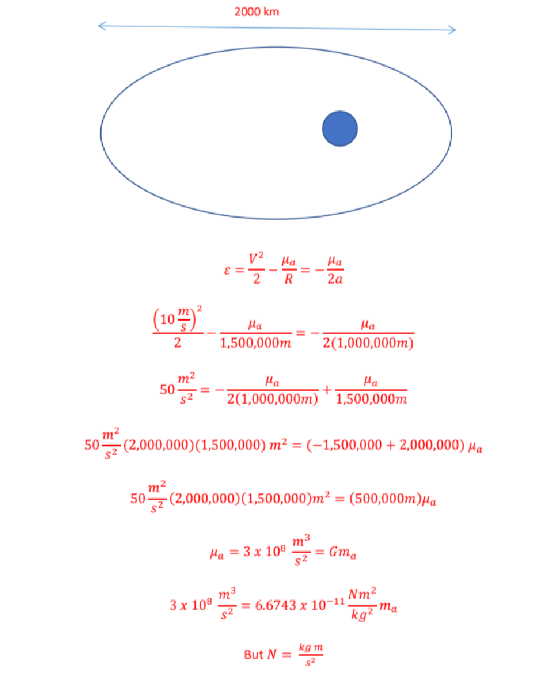
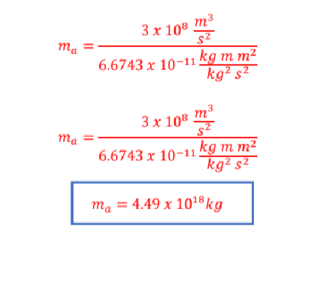

# SPCE 5065 HOMEWORK #1

## DUE: Friday 26 June 2026

All homework is due in Canvas by 11:59:59 pm MT (Colorado Time) on the due date indicated on the Syllabus schedule. No late homework will be accepted.

Students are allowed PARTIAL COLLABORATION on homework assignments. You are allowed to discuss qualitatively with other students the concepts in this course. However, copying or in way using the written work of another person as well as relaying or receiving solutions via any means is strictly prohibited. The intent of this policy is to allow you to share ideas, discuss concepts, and clarify processes when needed. However, you must independently prepare the detailed solutions to homework problems and the Final Project.

Use course readings as a resource, but research additional sources as necessary to answer the questions. Please annotate your research with [1] , [2], etc. and a sources page that describe where the information is located in AIAA format. Please email me with any questions or concerns.

- 1. Find an example of a spacecraft anomaly due to the space environment. Describe what happened and what improvements were made to avoid a recurrence of the problem.

Answers vary

- 2. Newton’s Universal Law of Gravitation states:

𝑀𝐸𝑚𝑠 (𝑅𝐸 + ℎ)2

𝐹 = 𝐺

Where: G = Universal Gravitational Constant 𝑁𝑘𝑚

2 𝑘𝑔2

ME = mass of the Earth (kg) ms= mass of the spacecraft (kg)

RE = radius of the earth = 6378 km) h = spacecraft orbital altitude (km)

- a) Write the centripetal acceleration of the satellite in terms of orbital velocity (km/s), RE and h.

𝑎 =

𝑉2 𝜌

Where ρ = center of curvature = (RE + h) So

|𝑎 =  𝑉2 (𝑅𝐸 + ℎ)  |
|---|

- b) Derive an expression for the orbital velocity as a function of altitude and 𝜇 , were

𝜇 = 𝐺𝑀𝐸 = 398600.5 𝑘𝑚

3 𝑠2

Since

𝐹 =

𝜇𝑚𝑠 (𝑅𝐸 + ℎ)2

= 𝑚𝑠𝑎

𝑎 =

𝜇 (𝑅𝐸 + ℎ)2

=

𝑉2 (𝑅𝐸 + ℎ) Thus

|𝑉 = √  𝜇 (𝑅𝐸 + ℎ)  𝑘𝑚/𝑠|
|---|

- c) Graph velocity versus altitude

#### d) Derive an expression for the period of the orbit as a function altitude and 𝜇.

𝑃𝑒𝑟𝑖𝑜𝑑 =

𝑐𝑖𝑟𝑐𝑢𝑚𝑓𝑒𝑟𝑒𝑛𝑐𝑒 (𝑘𝑚) 𝑜𝑟𝑏𝑖𝑡𝑎𝑙 𝑠𝑝𝑒𝑒𝑑 (

𝑘𝑚 𝑠 )

2𝜋(𝑅𝐸 + ℎ) √

𝑃𝑒𝑟𝑖𝑜𝑑 =

𝜇 (𝑅𝐸 + ℎ) So

|𝑃𝑒𝑟𝑖𝑜𝑑 = 2𝜋√  (𝑅𝐸 + ℎ)3 𝜇  (𝑠𝑒𝑐𝑜𝑛𝑑𝑠)|
|---|

#### e) Graph period versus altitude

- 3. For a satellite launched to an altitude of 800 km, is there any significant difference to the lifetime depending on the phase of the solar cycle at launch? Explain your answer.

No, at 800 km altitude, the satellite’s lifetime is highly dependent on drag. Also, the lifetime is not significantly affected by the solar activity at launch because the lifetime spans multiple solar cycles.

- 4. An Earth Observation spacecraft with an optical payload is in a 350 km circular orbit. What are some of the major problems operators might expect from the space environment in this regime? What will help mitigate those risks? Be sure to include an overview of all effects covered on lesson 1, not just those in Chapter 1 of the textbook.

The main effects will be drag and the effects of atomic oxygen. Drag will depend on the coefficient of drag and can be reducing by choosing a cross-sectional area that is as small as possible and avoid appendages to the satellite whenever possible. Above 80 km, ozone is rapid broken down and molecular oxygen is rapidly broken down into atomic oxygen. Especially at altitudes between 200 and 650 km, atomic oxygen is the main atmospheric constituent. It is very reactive. Spacecraft should be designed to avoid highly reactive materials, especially with coatings. Good material choices include films such as Kapton and metals like Teflon due to their UV stability.

- 5. Why does the Earth’s magnetic field drift? How do we know the magnetic field reverses periodically? When is the next one predicted to occur? The dynamo theory is based on three characteristics of a body.

- 1) An electrically conducting fluid
- 2) Kinetic energy provided by the rotation of the celestial body
- 3) An internal energy source that produces convective motion of the fluid in the core.

The earth has a solid inner core, mostly iron, which is surrounded by a liquid outer core consisting mostly of molten iron. The solid inner core rotates more rapidly than the mantle, dragging along a portion of the liquid outer core. Motion of the liquid normal to the spin axis results in a Coriolis acceleration that forms convection cells. The rotation of the charged is antiparallel to the rotation of the earth, thus producing a magnetic field with a magnetic dipole moment. The lithosphere, which consists of the crust and upper portion of the mantle, contributes a magnetic flux density. In addition, periods of intense solar activity can result in a varying geomagnetic field.

We can see evidence of magnetic polarity reversals by examining the geologic record. When lavas or sediments solidify, they often preserve a signature of the ambient magnetic field at the time of deposition. The geomagnetic poles are currently roughly coincident with the geographic poles, but occasionally the magnetic poles wander far away from the geographic poles and undergo an "excursion" from their preferred state. Earth's dynamo has no preference for a particular polarity, so, after an excursional period, the magnetic field, upon returning to its usual state of rough alignment with the Earth’s rotational axis, could just as easily have one polarity as another. These reversals are random with no apparent periodicity to their occurrence. They can happen as often as every 10 thousand years or so and as infrequently as every 50 million years or more. The last reversal was about 780,000 years ago.

- 6. The solar constant at any distance from the sun is given by:

2

𝑎𝑢 𝑟

𝑆(𝑟) = 𝑆𝑒 (

)

a) Determine an expression for the Solar Constant, S(r), as a function of orbit eccentricity given: S(r) = Sun’s irradiance at any distance from the sun

Se= 1366.1 𝑚𝑊2 (sun’s irradiance at 1 AU) au =1 AU = 149,597,871 km (distance from the Earth to the Sun) r = distance from the sun (AU)

Starting with and the earth’s eccentricity, 0.0167 𝑟 =

𝑎(1 − 𝑒2) 1 + 𝑒𝑐𝑜𝑠𝜈

1𝐴𝑈(1 − 0.01672) 1 + 0.0167𝑐𝑜𝑠𝜈 Solar irradiance as distance r from the sun is

𝑟 =

2

𝑎𝑢 𝑟

𝑆(𝑟) = 𝑆𝑒 (

)

2

𝑊 𝑚2

1𝐴𝑈 1𝐴𝑈(1 − 0.01672) 1 + 0.0167𝑐𝑜𝑠𝜈

𝑆(𝑟) = 1366.1

(

)

|𝑆(𝑟) = 1366.1 (  1 + 0.0167𝑐𝑜𝑠𝜈 1 − 0.01672  )  2 𝑊 𝑚2  |
|---|

b) Determine the maximum and minimum values of the Earth’s solar constant

At periapsis, 𝜈 = 0 degrees, so

2 𝑊 𝑚2

1 + 0.0167 1 − 0.01672

𝑆(𝑟) = 1366.1 (

)

So

2 𝑊 𝑚2

1 + 0.0167 (1 − .0167)(1 + 0.0167)

𝑆(𝑟) = 1366.1 (

)

1366.1 0.98332

𝑊 𝑚2

𝑆(𝑟) =

|𝑆(𝑟) = 1412.9  𝑊 𝑚2  𝑎𝑡 𝑝𝑒𝑟𝑖𝑎𝑝𝑠𝑖𝑠|
|---|

At apoapsis, 𝜈 = 180 degrees, so

2 𝑊 𝑚2

1 − 0.0167 1 − 0.01672

𝑆(𝑟) = 1366.1 (

)

So

2 𝑊 𝑚2

1 − 0.0167 (1 − .0167)(1 + 0.0167)

𝑆(𝑟) = 1366.1 (

)

1366.1 1.01672

𝑊 𝑚2

𝑆(𝑟) =

|𝑆(𝑟) = 1321.6  𝑊 𝑚2  𝑎𝑡 𝑎𝑝𝑜𝑎𝑝𝑠𝑖𝑠|
|---|

c) Graph the solar irradiance at the earth as a function of the day of year.

#### d) Calculate and plot the average solar irradiance along with the max and min values for each of the planets in our solar system. Use a log scale for the y axis.

- 7. Observations of Titan indicate that it has a period of 14.1 Earth days.

- a) Determine the mass of Saturn if the semi-major axis of Titan’s orbit is 1,110,781,765 m.

𝑎3 𝐺𝑚

𝑃𝑒𝑟𝑖𝑜𝑑 = 2𝜋√

Earth period is 23 hours, 56 minutes, and 41 seconds = 23.94472 hrs.

𝑚 =

𝑎3(2𝜋)2 𝑃𝑒𝑟𝑖𝑜𝑑2 ∗ 𝐺

𝑚 =

(1110781765)3(2𝜋)2 (14.1 ∗ 23.94472 ∗ 3600)2 ∗ 6.67430𝑥10−11

|Mass of Saturn = 5.4875 x 1026 kg|
|---|

- b) Find a published estimate of Saturn’s mass and determine the percent difference between your calculation and the published mass.

According to NASA’s Saturn Fact sheet, the mass of Saturn is approximately 568.32 x 1024 kg. This is an approximate 3.4% error.

- c) Explain why there is a difference.

Both are estimates. There is round-off error in both Titan’s semi-major axis as well as an Earth day. You would need a computer program with more precision than a calculator to provide a more accurate estimate…but still both methods are estimates.

#### 8. A spacecraft is in an eccentric orbit about an asteroid with a semimajor axis of 1000 km. At adistance from the asteroid of 1500 km, the velocity has a magnitude of 10 m/s. Determine themass of the asteroid.

References:

NASA. (11 Jan 2024). Saturn Fact sheet. NASA. https://nssdc.gsfc.nasa.gov/planetary/factsheet/saturnfact.html
