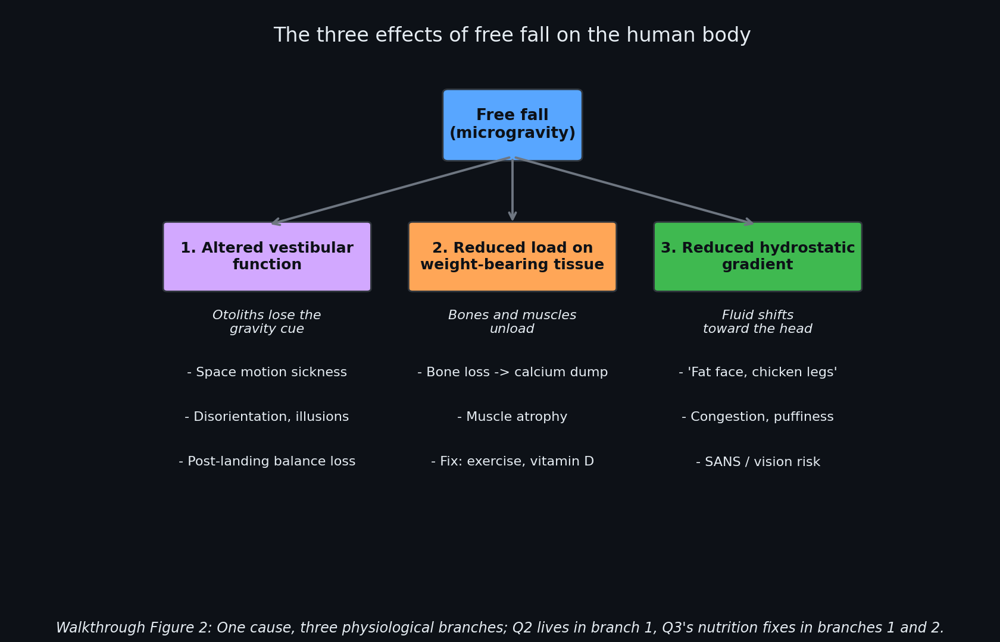
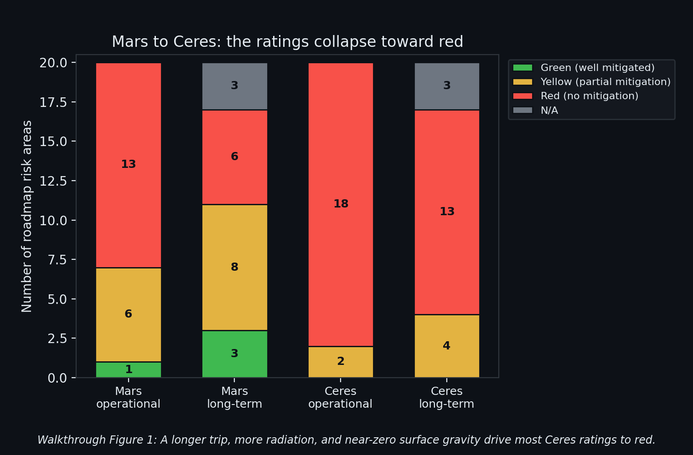
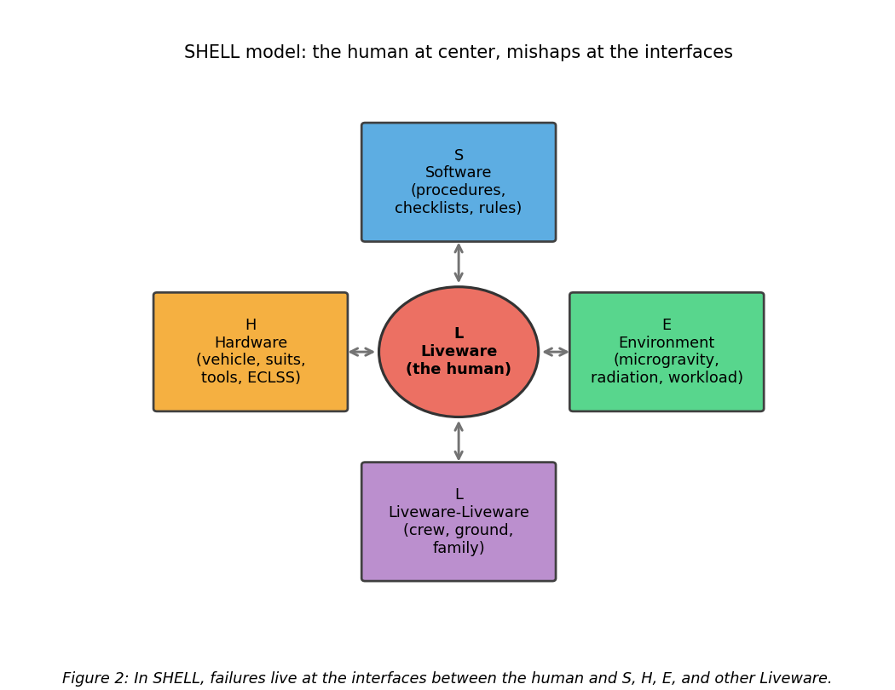
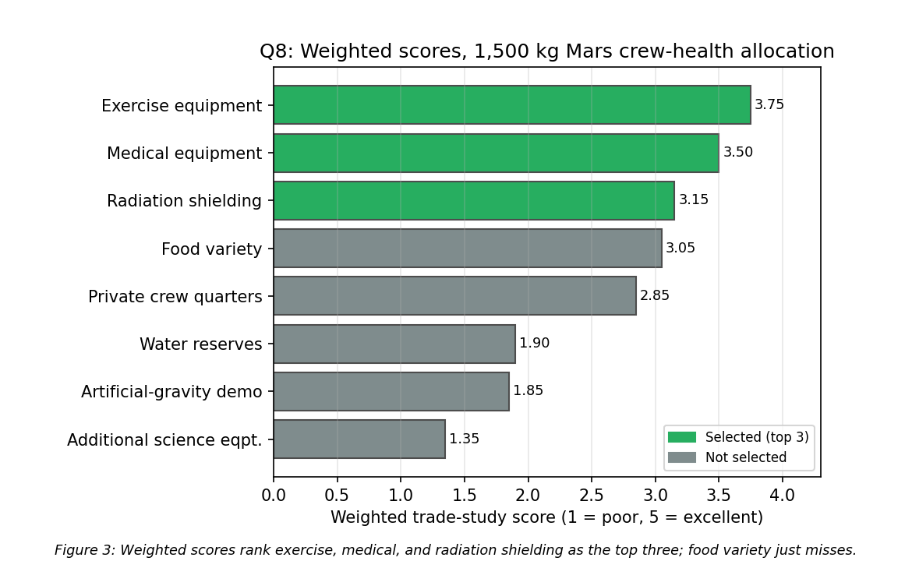

# SPCE 5065 HW #3 -- Socratic Solution Walkthrough
## Bioastronautics, human factors, and the SHELL model

> This is a personal study guide, not a submission. It is built from an already-graded, known-correct solution (96/100). The goal is to make every judgment reproducible from the lecture and every concept stick. This homework has almost no math, so the "derivations" here are chains of reasoning: why a rating is red, why a suit needs a given feature, why the trade study lands where it does.

---

## 30,000-Foot Overview

**The big question: how do you keep a human alive, healthy, and thinking clearly on a trip that lasts years, ends somewhere with no hospital and no rescue, and takes place in an environment the body was never built for?**

Lesson 3 flips the course. Weeks 1 and 2 asked how the space environment attacks the *spacecraft* (charging, drag, atomic oxygen). This week asks how it attacks the *person* inside. The unifying fact is that the human body evolved under one specific set of conditions (1 g, sea-level air, sunlight, a magnetic field overhead) and space removes all of them at once. Everything in this assignment is a consequence of that removal.

**Problem 1 (the warm-up).** Summarize the two student current-events talks: one a broad tour of space medicine, one about AVATAR, a real experiment flying tiny lab-grown tissue samples on Artemis II to watch radiation and weightlessness damage human cells. It sets the theme: we still do not fully understand what deep space does to the body.

**Problem 2 (which way is up).** "Altered vestibular function" is what happens when the balance sensors in your inner ear stop getting the gravity signal they depend on. The result is space sickness going up and wobbly legs coming down, and there is still no clean fix.

**Problem 3 (feeding the body).** Astronauts still burn roughly Earth-level calories because they exercise hard, but two nutrition rules invert: you supplement vitamin D and calcium to fight bone loss, and you cut sodium and iron because the unloading skeleton and shrinking blood volume make the usual surplus harmful.

**Problem 4 (how big a box).** For a Mars mission you size the crew's living volume by phase. All three phases are long, so all three sit near the "optimal" comfort level from the habitability research, with the surface (longest and busiest) getting the most and the return leg (deconditioned, morale sagging) getting a little extra over the outbound.

**Problem 5 (Mars, but worse).** NASA rates a Mars mission across about twenty health risks in red/yellow/green. The task is to re-rate all of them for a Ceres mission and discuss three. Because Ceres is years longer, drowning in more radiation, and has almost no surface gravity, nearly everything goes red.

**Problem 6 (Apollo 13 through the SHELL lens).** A tiny, years-old wiring/spec mistake blew an oxygen tank, and the crew survived because the human-to-human coordination worked perfectly. The SHELL model names the five places a failure can live, and Apollo 13 touched all five.

**Problem 7 (three suits).** Propose EVA suit requirements for the Moon, Mars, and Ceres. Every suit is a one-person spaceship; each destination then adds its own killer (Moon dust, Mars toxic grit and durability, Ceres cold and radiation in near-zero gravity).

**Problem 8 (spend 1,500 kg wisely).** A weighted trade study: score eight crew-health investments against five criteria and pick three. The math picks exercise gear, a medical kit, and radiation shielding, the things that keep the crew alive and working before the things that make the trip pleasant.

**Problem 9 (the same mistake twice).** Compare Challenger and Columbia with SHELL. Seventeen years apart, the same organization made the same error at the same interface: engineers were overruled by managers who had normalized a recurring warning sign.

**The thread.** Two ideas run through everything. First, *the human is the critical system*, and it degrades in predictable ways when you remove gravity, sunlight, and Earth's protection (Problems 2, 3, 4, 5). Second, *disasters live at interfaces, not in single parts*, which is the SHELL model's whole point (Problems 6, 9), and it is also why the trade study (8) and the suit designs (7) are about matching the system to the human, not just bolting on hardware. The professor's punchline for the week: sending people to Mars, or Ceres, is not mainly an engineering problem. It is a human-systems problem.

**How they connect.** HW1 was the space environment attacking spacecraft materials and orbits; HW2 was drag and atomic oxygen eroding the vehicle and the first hint of the human bookend (the Apollo pure-oxygen atmosphere question in HW2 Problem 4). HW3 completes that turn: the environment is now attacking the crew, and the tools are physiology and human-factors models instead of orbital mechanics. The Apollo-1 fire that HW2 raised as a cabin-atmosphere hazard reappears here as a SHELL case study, so the accident thread carries straight across.

---

## Problem 1 (pts) -- The Two Current-Events Presentations

**Problem statement:** For the current-events presentations on Thursday 2 July: (a) summarize the presentation, (b) describe something learned, (c) write one remaining question.

**The punchline first:** two talks were given, Shelby Schreckenberg's broad bioastronautics survey and Grace Burns's deep dive on AVATAR (an organ-on-a-chip experiment on Artemis II). The answer is a faithful summary of each plus a genuine takeaway and a genuine question, not a book report.

| Part | What it wants | Where |
|---|---|---|
| (a) Summarize | Both talks, accurately | Section 1.1 |
| (b) Learned | One real surprise from each | Section 1.2 |
| (c) Question | One open question worth asking | Section 1.2 |

---

### 1.1 (a) Summarizing what was actually said

**Before reading on, try this:** Without notes, name the two presenters, the one-line topic of each talk, and for AVATAR, the single sentence that explains the experiment's core trick. If you cannot, that is the signal that a "summary" would drift into generic space-medicine filler.

**The core content.** Schreckenberg's talk was a survey: bioastronautics is biology plus astrodynamics, it grew after Apollo 11, and it catalogs the microgravity medical problems (bone loss, muscle atrophy, fluid shift, immune suppression, space sickness) alongside the ISS countermeasures that actually fly (exercise machines, onboard ultrasound and MRI, light therapy plus melatonin, radiation sensors, closed-loop air and water). Burns's talk was one experiment: AVATAR flies paired organ-on-a-chip samples, one twin on Earth and one on Artemis II, then compares them for DNA damage, cell growth, and immune response. The chips are USB-drive-sized, grown from bone-marrow stem cells that the company Emulate isolates from the leftovers of a routine platelet donation, and Space Tango built the self-contained payload.

**Common Pitfall:** answering a "summarize the presentation" prompt with what you already know about space medicine instead of what the presenter said. The grader can check the transcript; a summary that could have been written without watching the talk earns little.

**Reflection:** the two talks bracket the field nicely. One is the wide catalog of known problems; the other is a single sharp instrument aimed at the biggest unknown (what radiation does to tissue over a long mission).

---

### 1.2 (b, c) A real takeaway and a real question

**Before reading on, try this:** For AVATAR, ask "what is the weakest link between a chip result and a human outcome?" That single question is more valuable than any fact you could recite about the experiment.

**The punchline:** the strongest "learned" item is the non-invasive sourcing trick (the chip stem cells come from the waste fraction of an ordinary platelet donation, pulled out with magnetic beads), and the strongest "question" is the validation gap (how well does a tiny perfused chip, with no hormones, no real immune system, and no actual skeleton, predict what happens in a whole 70 kg astronaut?).

**Why the question is good.** A good open question is not "I wonder what the results will be." It targets a real methodological weak point. An organ-on-a-chip is a reductionist model; the entire scientific bet is that chip-level damage tracks body-level damage, and that bet is exactly what a careful listener should probe.

**Reflection:** this problem is graded on attentiveness and judgment, not physics. The move is to prove you watched (specifics) and thought (a question that a domain expert would respect).

> **Key takeaway from Problem 1:** Summaries are graded against the source, so anchor them to what each presenter actually said (Schreckenberg's survey, Burns's AVATAR chips), then earn the "learned" and "question" points with one specific surprise and one question that targets a real weak point, not a wondering.

> **Feynman test (in plain English):** Flying two identical lab-grown tissue samples, one kept on Earth and one sent to space, is like baking the same cake in two ovens to find out what the space oven is secretly doing to it.

---

## Problem 2 (pts) -- Altered Vestibular Function and Its Symptoms

**Problem statement:** What is meant by "altered vestibular function" and what are its symptoms?

**The punchline first:** the vestibular system is the inner-ear balance apparatus, and "altered" means the otolith organs lose the steady gravity cue in free fall, so the brain gets conflicting signals. The symptoms are space motion sickness and disorientation on the way up and balance/gait failure on the way down.

---

### 2.1 What the vestibular system is and why free fall breaks it

**Before reading on, try this:** Name the two kinds of inner-ear sensor and what each measures, then predict which one goes "silent" in orbit and which keeps working. That prediction is the entire concept.

**The punchline:** the otolith organs (utricle and saccule) sense linear acceleration and, on the ground, which way gravity points; the three semicircular canals sense rotation. In free fall the canals still work (you can still spin), but the otoliths no longer feel a steady pull, so the "which way is down" channel goes quiet while the eyes and canals keep reporting. That mismatch is the "altered" function.

**Explanation.** On Earth, three streams agree: inner ear, vision, and the muscle/joint sense (proprioception). The brain fuses them into a rock-solid sense of orientation. Remove gravity and the otolith stream disagrees with the others, and the brain, receiving conflicting inputs, produces the same nausea response it produces for any sensory conflict (this is why it is "the equivalent of car sick," where your inner ear and eyes disagree in a moving vehicle). Walkthrough Figure 2 places this as branch 1 of the three free-fall effects.

**Common Pitfall:** saying "there is no gravity so the ears do not work." There is gravity (low orbit is roughly 91% of surface gravity); the issue is *free fall*, which removes the felt pull, not the gravity itself. Getting this wrong undercuts the whole physiology.

**Reflection:** the system is not damaged, it is confused, which is why the brain can eventually reweight its inputs and adapt.

---

### 2.2 The symptom timeline, up and down

**Before reading on, try this:** Sketch a timeline: day 0 launch, first few days, mid-mission, and return-plus-a-week. Mark where symptoms appear and disappear. The shape (bad at both ends, fine in the middle) is the answer.

**The punchline:** symptoms cluster at the two transitions. Going up: space motion sickness (nausea, vomiting, headache, malaise) plus spatial disorientation and degraded gaze control for the first few days, then adaptation. Coming down: balance, posture, gait, and orientation problems for days to weeks, scaling with how long the crew was weightless.

**Explanation.** The adaptation that makes orbit tolerable is exactly what makes return hard: the brain learns to down-weight the otoliths in space, then has to re-learn to trust them in gravity. The lecture's vivid marker is astronauts like Nick Hague being carried out of the capsule because they cannot yet stand. Two extra facts worth carrying: susceptibility is hard to predict crew-to-crew, and men have shown up as more susceptible than women.

**Common Pitfall:** forgetting the return-side symptoms. Many students describe only space sickness and stop; half the answer is post-landing readaptation, which is the part that actually threatens a Mars arrival where no ground crew is waiting.

**Reflection:** this is why the roadmap keeps sensorimotor risk yellow-to-red for exploration: adaptation solves the in-flight half, but nobody has solved the "land deconditioned with no help" half.

> **Results for Problem 2**
> - **Meaning:** loss of the otolith gravity cue in free fall, producing sensory conflict with vision and the canals.
> - **Symptoms:** space motion sickness and disorientation early; balance, gait, and orientation failure on return.

> **Key takeaway from Problem 2:** The inner-ear otoliths report "down" by feeling gravity's pull; free fall removes that felt pull without removing gravity, so the brain gets conflicting orientation signals, producing sickness and disorientation until it adapts, then the reverse on return until it re-adapts.

> **Feynman test (in plain English):** Your inner ear has tiny weights that only tell you which way is up when gravity pulls them down; in free fall they float loose, so your body loses track of up and down until your brain learns to stop listening to them.

---

## Problem 3 (pts) -- Caloric Intake and Two Free-Fall Nutrition Rules

**Problem statement:** What are approximate caloric intake requirements for astronauts? Describe two unique nutritional requirements driven by the free-fall environment.

**The punchline first:** roughly 2,500 to 3,000 kcal/day (about 2,700 typical), because the crew exercises hard enough to keep Earth-level demand. The two free-fall rules invert ground intuition: supplement vitamin D and calcium to fight bone loss, and cut sodium and iron because the unloading skeleton and shrinking blood volume make surpluses harmful.

| Part | Answer | Where |
|---|---|---|
| Calories | ~2,700 kcal/day (2,500 to 3,000 range) | Section 3.1 |
| Requirement 1 | Vitamin D + calcium for bone loss | Section 3.2 |
| Requirement 2 | Lower sodium and iron | Section 3.2 |

---

### 3.1 Why the calorie number barely changes

**Before reading on, try this:** Guess whether an astronaut needs more, less, or the same calories as on Earth, and justify it in one sentence. The reasoning matters more than the number.

**The punchline:** about the same as Earth, ~2,700 kcal/day, because the two-plus hours of daily resistive and cardio exercise replace the metabolic cost of moving against gravity.

**Explanation.** You might expect floating to burn less, and basal metabolism does not rise, but the mandatory exercise program (the countermeasure for bone and muscle loss) keeps total energy expenditure near ground levels. The lecture's mass-balance framing backs this up: a typical astronaut cycles about 5 kg/day in and out, of which roughly 3.5 kg is potable water.

**Common Pitfall:** claiming astronauts need far fewer calories "because there is no gravity." The exercise load erases that intuition.

**Reflection:** the calorie count is boring on purpose; the interesting nutrition story is *what* they eat, not how much.

---

### 3.2 The two inversions: vitamin D up, sodium and iron down

**Before reading on, try this:** For each of calcium, vitamin D, sodium, and iron, decide whether free fall makes you want more or less of it, and why. Two of these flip from the Earth answer.

**The punchline:** requirement 1 is vitamin D supplementation tied to bone/calcium management; requirement 2 is reduced sodium and reduced iron.

**Explanation.**
- **Vitamin D and calcium (branch 2 of Walkthrough Figure 2).** Weight-bearing bone demineralizes at roughly 1 to 1.5% per month. There is no sunlight through the hull, so the skin makes essentially no vitamin D, and vitamin D is what lets the gut absorb calcium and regulate bone turnover. So NASA supplements vitamin D directly and crews take calcium to replace what the bones shed. (The lecture's memorable proof: early station toilets clogged because nobody planned for how much calcium the crews were excreting.)
- **Sodium and iron, both down.** High sodium accelerates bone resorption and calcium loss and raises kidney-stone risk, so space food is reformulated lower in sodium. Iron is subtler: red-cell mass drops in free fall ("space anemia") because the body needs less circulating blood, so surplus dietary iron is not going into hemoglobin and instead promotes oxidative stress and adds to the stone-forming load, so NASA holds it down.

**Common Pitfall:** treating "more calcium" as the fix. The nuance is that you supplement vitamin D and *targeted* calcium against bone loss, but you do not megadose calcium or sodium, because both feed the kidney-stone risk that free fall already worsens.

**Reflection:** every one of these is downstream of the same two facts, no gravity loading the skeleton and no sunlight, which is why they count as *free-fall-driven* rather than generic nutrition.

> **Results for Problem 3**
> - **Calories:** ~2,700 kcal/day (2,500 to 3,000).
> - **Requirement 1:** supplemental vitamin D (no sunlight) plus calcium management for bone demineralization.
> - **Requirement 2:** reduced sodium and reduced iron (bone resorption, stone risk, space anemia).

> **Key takeaway from Problem 3:** Calorie demand stays near Earth levels because exercise replaces the work of fighting gravity, but the *composition* inverts: with the skeleton unloading and no sunlight, you add vitamin D and calcium while cutting sodium and iron, the opposite of ground nutrition intuition.

> **Feynman test (in plain English):** In space your bones and blood stop building themselves, so instead of piling on calcium, iron, and salt like on Earth, you ease off them and lean on a sunshine-vitamin pill to keep your skeleton from crumbling.

---

## Problem 4 (pts) -- Recommended Habitable Volume for a Mars Mission

**Problem statement:** For a Mars mission, recommend the crew-quarters habitable volume for (a) the flight there, (b) the surface, (c) the return flight, with rationale.

**The punchline first:** all three phases are long-duration, so all three sit near the habitability "optimal" level (about 17 to 20 m3 per person). The recommendations are 20 m3 outbound, 25 m3 on the surface, and 22 m3 on return, per crew member.

| Part | Recommendation | Driver | Where |
|---|---|---|---|
| (a) Outbound | 20 m3/person | Long 0-g confinement, team still forming | Section 4.2 |
| (b) Surface | 25 m3/person | Longest, busiest phase; 0.38 g helps build | Section 4.2 |
| (c) Return | 22 m3/person | Deconditioned crew, morale sag | Section 4.2 |

---

### 4.1 The habitability curve: why volume needs level off

**Before reading on, try this:** Sketch "usable volume per person needed" on the y-axis versus "mission length" on the x-axis. Does it rise forever, or level off? And name the three horizontal bands you would draw.

**The punchline:** the need rises steeply for the first weeks then flattens into an asymptote. The classic Celentano habitability curve draws three bands: **tolerable** (survivable but miserable, about 5 m3), **performance** (functional but degrading, about 10 m3), and **optimal** (about 17 to 20 m3), all leveling off past a few months. The lecture gave the same anchors: about 5 m3 tolerable, about 17 m3 optimal.

**Explanation.** A weekend in a tent is fine at low volume; a year in the same tent is not, because psychological and operational needs (privacy, workspace, stowage) accumulate. Once the mission is long enough that those needs are fully expressed, adding more length does not add much more volume need, hence the plateau. Figure 1 in the submission plots this with the three Mars-phase picks marked.

**Common Pitfall:** treating volume as a function of crew size only. It is per-person *and* duration-dependent; a short hop and a two-year mission with the same crew need very different volumes.

**Reflection:** because every Mars phase is past the plateau's knee, the design question is not "which band" (it is always optimal) but "how far above the optimal line does each phase push."

---

### 4.2 (a, b, c) Setting each phase, and why they differ

**Before reading on, try this:** Rank the three phases by how much volume you would give, then justify the ranking. Most people rank surface highest; the interesting call is outbound versus return.

**The punchline:** surface (25) > return (22) > outbound (20), all near or above the optimal asymptote.

**Explanation.**
- **Outbound, 20 m3:** right at optimal. A half-year in 0 g with no outside world, and the crew is still gelling as a team, so start them at optimal, not "performance." Skimping here to save mass tends to reappear later as a Liveware-Liveware conflict.
- **Surface, 25 m3:** above optimal because it is the longest phase (about 500 days) and the busiest, with EVA prep, sample handling, and science on top of daily living, so people need workspace as well as living space. The break is that 0.38 g restores up/down and lets you stack and store, so the extra volume is cheaper to build with landed or inflatable habitats.
- **Return, 22 m3:** slightly above outbound even though the leg is the same length, because the crew is deconditioned and the Mars-500 "third-quarter" finding says motivation dips on the homeward leg once the goal is behind them. Squeezing the habitat when morale is most fragile is exactly backward.

**Common Pitfall:** giving the return leg the least volume "because they are going home." The physiology and psychology say the opposite.

**Reflection:** private crew quarters are the concrete form of this volume, and they are a human-factors mitigation (the SHELL Liveware-Liveware interface), not a luxury.

> **Results for Problem 4**
> - **(a)** 20 m3 per person (outbound transit).
> - **(b)** 25 m3 per person (surface).
> - **(c)** 22 m3 per person (return transit).

> **Key takeaway from Problem 4:** Habitable volume need per person rises with mission length and then plateaus, so every long Mars phase belongs near the optimal level (~17 to 20 m3); the surface gets the most (longest, busiest, but helped by 0.38 g) and the return leg gets a touch more than the outbound because the crew is deconditioned and morale sags.

> **Feynman test (in plain English):** People crammed together too long start to crack, so for a years-long trip you give each person about a large bedroom's worth of space, and a little extra on the way home when they are most worn down.

---

## Problem 5 (pts) -- The Bioastronautics Roadmap, Extended to Ceres

**Problem statement:** (a) Complete both Ceres columns of NASA's roadmap for all risk rows. (b) Pick three areas and discuss how the risk differs for Ceres and what the mitigation might be.

**The punchline first:** Ceres is Mars but longer, more irradiated, and with almost no surface gravity, so nearly every rating escalates. Green and yellow all but disappear; the completed Ceres columns go overwhelmingly red.

| Part | Answer | Where |
|---|---|---|
| (a) Complete Ceres columns | ~20 rows re-rated R/Y/G | Section 5.1 |
| (b) Three deep dives | Radiation, sensorimotor, behavioral | Section 5.2 |

---

### 5.1 (a) The three levers that push Ceres to red

**Before reading on, try this:** Name the three ways a Ceres mission is physically harder than Mars, then predict which direction each roadmap color moves. If you get the three levers, you can rate every row without memorizing them.

**The punchline:** the three levers are (1) duration (a Ceres round trip is years, versus about 2.5 for Mars, so exposures accumulate), (2) radiation (more cumulative galactic cosmic ray dose over that longer cruise), and (3) gravity (Ceres surface gravity is about 0.03 g, essentially still free fall, so the "surface" phase gives none of the reloading that lets several Mars risks recover). Apply those and greens become yellows, yellows become reds, and reds stay red.

**Explanation.** The single most important insight is the gravity lever. On Mars, 0.38 g on the surface reloads the skeleton, muscles, and balance system, which is why NASA rates muscle, aerobic capacity, and sensorimotor risks *green long-term* for Mars: the crew recovers on the ground. Ceres has no such ground; the surface is functionally more free fall, so those same risks never recover and their long-term ratings climb. Walkthrough Figure 1 shows the shift as counts: Mars operational is 13 red / 6 yellow / 1 green, but Ceres operational is 18 red / 2 yellow / 0 green (the two yellows, celestial dust and dynamic loads, are the ones the near-vacuum and near-zero gravity actually make *less* severe than Mars).

**Common Pitfall:** re-rating rows one at a time from scratch. It is far more defensible (and faster) to state the three levers once and apply them consistently, so the escalation logic is uniform across all twenty rows.

**Reflection:** the roadmap is a likelihood-times-consequence grid; both go up for Ceres (longer means higher likelihood of an event, farther means higher consequence because help is impossible), which is why the whole grid darkens.

---

### 5.2 (b) The three deep dives

**Before reading on, try this:** Of all the risks, which one has the *largest* jump from Mars to Ceres? That one (radiation) is the most rewarding to discuss, because the delta is the story.

**The punchline:** the three highest-value discussions are radiation carcinogenesis (the biggest jump, green-to-red), altered sensorimotor/vestibular (the clearest illustration of the gravity lever), and cognitive/behavioral (the clearest illustration of the duration and distance levers).

**The three, with mitigations.**
- **Radiation carcinogenesis (Mars G/Y, Ceres R/R).** Mars keeps in-mission dose within limits; a multi-year Ceres cruise blows past career limits, which is exactly why conference judges argued nobody could survive the trip. *Mitigation:* use Ceres itself, a water-ice-rich body, so you shield with mass you did not launch: bank water and regolith around a storm-shelter sleep station, bury the surface habitat, add radioprotective drugs and strict dosimetry, and shorten the transit to cut the integrated dose.
- **Altered sensorimotor/vestibular (Mars Y/G, Ceres R/Y).** Mars goes green long-term because 0.38 g reloads the balance system; Ceres never provides that, so an in-flight annoyance becomes a mission-length problem. *Mitigation:* supply the gravity the destination will not, via a rotating habitat or short-arm centrifuge, plus daily vestibular/resistive exercise and pre-mission adaptability training.
- **Cognitive/behavioral/psychiatric (Mars R/Y, Ceres R/R).** Years of isolation instead of months, a comm delay stretching toward half an hour each way, and Earth shrunk to a dim dot. Mars-500 already showed circadian disruption and a third-quarter motivation slump over 520 days; Ceres is several times longer. *Mitigation:* front-load it (about 80% of a flight psychologist's work is pre-mission), select and train for autonomy and cohesion, guarantee private quarters, and give the crew real onboard behavioral tools since real-time help is impossible.

**Common Pitfall:** giving a mitigation that is just "more shielding" or "more exercise" for every row. The strong answers are destination-specific (Ceres water ice for shielding, artificial gravity for the no-reloading problem).

**Reflection:** two of the three mitigations (in-situ water-ice shielding, artificial gravity) are things you could skip for Mars but cannot for Ceres, which is the cleanest way to show you understand *why* Ceres is different, not just *that* it is worse.

> **Results for Problem 5**
> - **(a)** Both Ceres columns completed; nearly all rows red, driven by longer duration, higher radiation, and ~0.03 g surface (see Table 2 in the submission and Walkthrough Figure 1).
> - **(b)** Radiation carcinogenesis (G/Y to R/R, mitigate with in-situ water-ice shielding), sensorimotor (Y/G to R/Y, mitigate with artificial gravity), behavioral (R/Y to R/R, mitigate by front-loading psychology).

> **Key takeaway from Problem 5:** Three levers (years-longer duration, higher cumulative radiation, and near-zero surface gravity that removes Mars's recovery reloading) push almost every Ceres rating to red; state the levers once and apply them uniformly, and pick the deep dives where the Mars-to-Ceres delta is largest and the mitigation is destination-specific.

> **Feynman test (in plain English):** Going to Ceres instead of Mars is the same camping trip but three times longer, much farther from any hospital, and on ground so weak your body never remembers how to stand, so every manageable problem turns dangerous.

---

## Problem 6 (pts) -- Apollo 13 and the SHELL Model

**Problem statement:** Describe the major breakdowns and disconnects during Apollo 13. Which SHELL elements were involved?

**The punchline first:** a years-old spec/wiring mistake (a thermostat switch never upgraded from 28 V to 65 V) let a routine tank stir ignite an oxygen tank, cascading into loss of power, water, and oxygen. The crew survived because the human-to-human coordination worked. SHELL names five interfaces, and Apollo 13 touched all five.

---

### 6.1 The SHELL model as a map of interfaces

**Before reading on, try this:** Write the five SHELL letters and what each stands for, then note where the human sits. The trick is that the human is at the *center* and every failure lives at a *seam* touching it.

**The punchline:** SHELL = Software (procedures, checklists, documentation), Hardware (vehicle, tools, suits, life support), Environment (microgravity, radiation, workload, time pressure), and Liveware twice: the central Liveware (the human) and the surrounding Liveware-Liveware (crew, ground, family). The model's whole claim is that accidents come from ragged interfaces between the human and these elements, not from one broken part. About 70 to 80% of accidents trace to human factors at these seams. Figure 2 in the submission is the diagram.

**Common Pitfall:** reading "Software" as computer code. In SHELL it means all the non-physical information, procedures, checklists, rules, that tell people how to act.

**Reflection:** the power of the model is that it forces you to look at the connections, which is where Apollo 13 both failed (a documentation seam) and was saved (a crew-ground seam).

---

### 6.2 Mapping Apollo 13 onto all five

**Before reading on, try this:** For each breakdown (bad switch spec, the stir that triggered it, the CO2 canister that would not fit, the crew flying a crippled ship, the ground coordinating the rescue), assign a SHELL interface. Every letter should get used.

**The punchline:** Hardware (ruptured tank, mis-specified switch, incompatible CO2 canister), Software (the voltage spec that never propagated to the switch rating, the stir procedure that unknowingly triggered the fault, the improvised scrubber procedure), Environment (deep space, freezing cabin, rationed consumables), Liveware (the crew flying the manual free-return burn), and Liveware-Liveware (the crew-to-Mission-Control coordination that saved them).

**Explanation.** The instructive part is that the same model captures both the failure and the recovery. The fatal-looking hardware failure was seeded years earlier by a paperwork failure (the S interface): when the command module went to 65 V, the tank's thermostatic switches stayed rated for 28 V, they welded shut on a pre-flight detank, and the heater cooked the wiring insulation. The recovery came from the L-L interface working exactly as it should, with one unmistakable shared goal ("get everyone home") unifying every decision on both sides.

**Common Pitfall:** listing only Hardware because "a tank exploded." The exam wants the full map, and the richest insight (the latent Software/documentation cause, and the L-L save) is the part that is easy to miss.

**Reflection:** Apollo 13 is the optimistic SHELL case: the interfaces that were built well (crew-ground) beat the interfaces that were built badly (the spec).

> **Results for Problem 6**
> - **Breakdowns:** latent 28 V/65 V switch spec mismatch, insulation damage, cryo-stir ignition, loss of two fuel cells and both O2 tanks, CO2 canister incompatibility.
> - **SHELL:** Hardware, Software (procedures/docs), Environment, Liveware (crew), Liveware-Liveware (crew-ground), all five.

> **Key takeaway from Problem 6:** Apollo 13's near-fatal hardware failure was seeded by a documentation failure years earlier (the un-updated thermostat spec) and recovered by a well-built crew-to-ground interface, so the accident touches all five SHELL elements and shows the model works in both directions, failure and rescue.

> **Feynman test (in plain English):** A tiny wiring mistake nobody caught for years blew up the ship, and the crew lived only because everyone on the ground and in the capsule locked onto one goal: get them home.

---

## Problem 7 (pts) -- EVA Suit Requirements for Moon, Mars, and Ceres

**Problem statement:** Propose EVA suit requirements for (a) the Moon, (b) Mars, (c) Ceres, discussing each destination's unique aspects.

**The punchline first:** every suit is a self-contained one-person spaceship (oxygen, CO2 removal, water, comms, thermal, pressure). Then each destination adds its own killer: Moon dust and thermal swing, Mars toxic grit and durability in partial gravity, Ceres cold and radiation in near-zero gravity.

| Part | Unique killer | Where |
|---|---|---|
| (a) Moon | Abrasive dust, 14-day thermal swing | Section 7.2 |
| (b) Mars | Perchlorate grit, hundreds of reuses | Section 7.2 |
| (c) Ceres | Cryogenic cold, radiation, microgravity EVA | Section 7.2 |

---

### 7.1 The shared suit baseline

**Before reading on, try this:** List everything a suit must supply that a human normally gets from the environment. Then recall the one ratio that governs how you avoid the bends.

**The punchline:** the shared job is to carry oxygen, remove CO2, supply water, enable speech and hearing, control temperature, and hold pressure, all self-contained. The lecture's numbers: US suits run at 29.6 kPa (Russian 39.2 kPa), you pre-breathe pure oxygen to wash out nitrogen (US 1 hour, Russia 30 minutes), EVAs last about 8 hours (US) or 7 (Russia), and the life-support pack is roughly 55 kg (US) or 120 kg (Russia).

**Explanation.** The one governing ratio is R, the bends ratio: the nitrogen partial pressure in the cabin divided by that in the suit, kept near 1.5. Drop the suit pressure too far below the cabin without pre-breathing and dissolved nitrogen comes out of solution as bubbles, which is decompression sickness. Table 3 in the submission collects these.

**Common Pitfall:** treating suit pressure as "just lower is better for mobility." Lower pressure helps the astronaut bend the suit, but it forces longer pre-breathe and raises bends risk, which is a real design tension.

**Reflection:** the baseline is identical everywhere because a human's needs are identical everywhere; only the environment changes.

---

### 7.2 (a, b, c) What each destination adds

**Before reading on, try this:** For each of Moon, Mars, Ceres, name the single environmental fact that most shapes the suit. Dust, then toxic-grit-plus-durability, then cold-plus-radiation-in-near-zero-g.

**The punchline:** the suits diverge on their dominant hazard.
- **Moon (1/6 g, hard vacuum, 14-day thermal cycle from +120 to below -130 C, abrasive charged regolith):** dust-tolerant bearings and seals, a suitport or dust-off to keep regolith out, wide-range thermal control, high mobility, radiation shielding. Dust is the killer; it destroyed Apollo suit joints in three days.
- **Mars (0.38 g, thin ~0.6 kPa CO2 atmosphere, global dust storms, toxic perchlorate fines, -125 to +20 C):** reusable and field-maintainable for hundreds of EVAs (no resupply), perchlorate/dust mitigation and a clean airlock, regenerable life support tuned for a CO2 atmosphere, and low mass because in real gravity the suit's weight matters.
- **Ceres (~0.03 g, 2.77 AU so very cold and dim, near-vacuum, high cumulative radiation):** microgravity-EVA architecture (handholds, tethers, a jetpack) because you cannot walk, heavy insulation and heating for cryogenic temperatures, maximum radiation shielding and dose budgeting, and years-long durability with in-situ repair.

**Common Pitfall:** writing three nearly identical suits. The grade is in the *differences*: the Ceres suit is really a deep-space orbital suit, not a surface suit, because there is no meaningful gravity to walk in.

**Reflection:** read down the list and the problem shifts from "surface mobility" (Moon) toward "keep a human alive in deep space" (Ceres) as gravity drops and distance grows.

> **Results for Problem 7**
> - **(a) Moon:** dust-tolerant seals/bearings, wide thermal range, high mobility, suitport dust control.
> - **(b) Mars:** reusable/durable for hundreds of EVAs, perchlorate mitigation, regenerable CO2-atmosphere life support, low mass.
> - **(c) Ceres:** microgravity-EVA (jetpack/tethers), cryogenic thermal, maximum radiation shielding, years-long durability.

> **Key takeaway from Problem 7:** Every EVA suit shares the same job (a self-contained life-support shell governed by the ~1.5 bends ratio), and the design intelligence is in the destination-specific killer: Moon dust and thermal swing, Mars durability and toxic grit in partial gravity, and Ceres cold plus radiation in near-zero gravity, which makes the Ceres suit an orbital suit rather than a surface suit.

> **Feynman test (in plain English):** A spacesuit is a one-person spaceship, and each place breaks it differently: the Moon sandblasts it with dust, Mars poisons it with toxic grit, and Ceres freezes it in the dark far from the Sun.

---

## Problem 8 (pts) -- Weighted Trade Study for 1,500 kg of Crew Health

**Problem statement:** Invest 1,500 kg in three of eight options for a 900-day Mars mission. Provide objectives, evaluation criteria, weighting factors, a trade matrix, and a recommendation.

**The punchline first:** score every option against five weighted criteria; the math ranks exercise equipment, medical equipment, and radiation shielding as the top three, i.e. the things that keep the crew alive and working before the things that make the trip nicer.

---

### 8.1 Building an honest weighted trade study

**Before reading on, try this:** Before scoring anything, write the objective in one sentence and list the criteria you would weight highest. If "survival" is not your top-weighted criterion for a no-rescue mission, ask why.

**The punchline:** the machinery is: state an objective, pick criteria, assign weights that sum to 1, score each option 1 to 5 on each criterion, then compute the weighted total as a dot product.

$$\text{Weighted score} = \sum_i w_i \, s_i, \qquad \sum_i w_i = 1$$

The chosen weights: crew survival / acute life-threat (0.30), chronic physiological health (0.20), behavioral/psychological health (0.20), coverage of an unmitigated red roadmap risk (0.15), and mass efficiency (0.15).

**Explanation.** The weights encode the values, and they should be defensible from the roadmap: for a 900-day mission with no evacuation, keeping people alive (survival) and functional (physiology, psychology) dominates, and "does it plug a red-rated gap" earns a real slice. Mass efficiency matters because 1,500 kg is small, so benefit-per-kg is a live consideration.

**Common Pitfall:** picking the three answers first and reverse-engineering weights to justify them. The honest move is to set weights from the mission's values, then let the arithmetic rank the options, even when the result is a close call.

**Reflection:** a trade study's credibility comes from showing the near-misses, not from a clean sweep.

---

### 8.2 Reading the matrix and defending the picks

**Before reading on, try this:** Predict the top three before looking. Then predict the *fourth* place, the one that just misses, because naming it is what proves you did a real trade and not a foregone conclusion.

**The punchline:** the weighted totals rank exercise (3.75), medical (3.50), and radiation shielding (3.15) as the top three, with food variety (3.05) as the near-miss. Figure 3 in the submission plots all eight.

**Why these three.** Exercise wins because without it, deconditioning over 900 days is near-certain and mission-ending, and it is cheap per kg. Medical covers the "medical conditions in-mission" red row, which is life-or-death with no evacuation. Radiation shielding scored a notch lower because 1,500 kg buys only a partial storm shelter, so its benefit-per-kg is weakest, but it is too dangerous to skip. A defensible allocation: about 300 kg exercise, 400 kg medical, 800 kg shielding, summing to 1,500 kg.

**The honest tradeoff.** Food variety (3.05) missed by one line and is the first thing to revisit if the medical or shielding masses come in light, because over 900 days morale and appetite really do drive performance. Private quarters (2.85) is strong on psychology but overlaps with the Problem 4 volume budget, so it is not double-bought. Artificial-gravity *demonstration* hardware (1.85) scores low because a demo protects future crews, not this one. Additional science (1.35) is not a crew-health investment at all.

**Common Pitfall:** an arithmetic slip in the matrix. Always re-add the weighted totals and confirm the weights sum to 1 and the mass split sums to 1,500 kg, because those are the two things a grader will spot-check instantly.

**Reflection:** the "demo" trap is the tell. Artificial gravity would fix several red risks *in principle*, but a demonstration unit does not protect *this* crew, so it loses to hardware that does.

> **Results for Problem 8**
> - **Objective:** maximize survival, health, and performance over 900 days, prioritizing red-rated risks.
> - **Top three:** exercise (3.75), medical (3.50), radiation shielding (3.15).
> - **Allocation:** ~300 / 400 / 800 kg = 1,500 kg.

> **Key takeaway from Problem 8:** A defensible trade study sets weights from the mission's values (survival first for a no-rescue mission), scores every option, and lets the dot product rank them; here that buys a gym, a hospital, and a radiation bunker, and the credibility comes from naming the near-miss (food variety) rather than sweeping the board.

> **Feynman test (in plain English):** With only a little extra weight to spend, you buy the things that keep the crew alive and working, a gym, a hospital, and a radiation bunker, before you buy the things that just make the trip more pleasant.

---

## Problem 9 (pts) -- SHELL Comparison: Challenger and Columbia

**Problem statement:** Using SHELL, compare two human-spaceflight accidents across common failure modes, organizational influences, design deficiencies, operational decisions, and lessons for Artemis or Mars.

**The punchline first:** Challenger and Columbia are the same organization making the same mistake seventeen years apart. The fatal interface both times is Liveware-Liveware (engineers overruled by managers), the shared failure mode is normalization of deviance, and the lesson is to protect dissent and stop normalizing warning signs.

---

### 9.1 Two accidents, one interface

**Before reading on, try this:** For each accident, name the hardware that failed, the recurring warning sign that got normalized, and who overruled whom. If the last answer is "managers overruled engineers" both times, you have found the pattern.

**The punchline:** map both onto SHELL and the same seam lights up.
- **Challenger (1986):** Hardware = a cold-stiffened O-ring that failed to seal; Software (procedures) = prior O-ring erosion accepted via waivers; Environment = a record-cold launch morning below the O-ring's rating; Liveware-Liveware = management overrode engineers who said do not launch.
- **Columbia (2003):** Hardware = foam struck and breached the wing's thermal protection; Software = foam shedding reclassified as an accepted "in-family" event; Environment = entry heating with no on-orbit inspection or rescue planned; Liveware-Liveware = management dismissed engineers' requests for wing imaging.

**Explanation.** The common failure mode is **normalization of deviance**: an anomaly recurs without immediate consequence (O-ring erosion, foam strikes), so it gets quietly reclassified as acceptable until it kills a crew. The organizational driver was schedule and budget pressure, and a safety function that lacked the independent authority to stop the launch, so the rules (the S interface) had been eroded by the culture that wrote the waivers.

**Common Pitfall:** treating the two as different accidents with different causes because the hardware differed (O-ring versus foam). The point of the comparison is that the *human* root is identical.

**Reflection:** the uncomfortable part is that neither was a surprise in hindsight; both had engineers who were right and were overruled.

---

### 9.2 What it means for Artemis and Mars

**Before reading on, try this:** If you could install exactly one organizational safeguard to prevent a third repeat, what would it be? "Listen to the dissenting engineer" is the answer both accident boards reached.

**The punchline:** the durable lessons are do not normalize anomalies, protect independent technical authority and dissent, and design for inspection and abort.

**Explanation.** A recurring off-nominal event is a warning, not a new baseline, which applies directly to Artemis hardware maturing under schedule pressure. A Mars crew is far past any rescue, so the crew-ground-management interface must be built to hear the minority technical voice, exactly the coordination that saved Apollo 13. And any Mars-class vehicle needs in-situ damage detection and repair, because Columbia had neither, which ties back to the Problem 5 medical and EVA red risks.

**Common Pitfall:** ending on "be safer." The strong close is specific: independent technical authority, a channel for dissent, and inspection/abort capability, each traceable to a named failure.

**Reflection:** if NASA re-learned this lesson between 1986 and 2003, the standing risk for Artemis and Mars is re-learning it a third time.

> **Results for Problem 9**
> - **Common failure mode:** normalization of deviance, fatal at the Liveware-Liveware interface.
> - **Organizational:** schedule/budget pressure, weak independent safety authority.
> - **Design deficiency:** cold-sensitive O-ring (Challenger); debris-shedding tank with no inspection/repair (Columbia).
> - **Operational decision:** launch in the cold (Challenger); wave off wing imaging (Columbia).
> - **Lessons:** do not normalize anomalies; protect dissent and independent authority; design for inspection and abort.

> **Key takeaway from Problem 9:** Challenger and Columbia are the same organizational failure repeated, with normalization of deviance killing both crews at the Liveware-Liveware interface where managers overruled engineers, so the lesson that carries to Artemis and Mars is structural: protect independent technical authority and dissent, and design vehicles that can be inspected and aborted.

> **Feynman test (in plain English):** Both shuttles were lost because a warning sign kept appearing without causing a crash, so people slowly decided it was normal, right until the day it killed the crew.

---

## Summary

### Overall Strategy Recap

This assignment is about the human as the critical spaceflight system and the interfaces around it. Problems 2, 3, 4, and 5 walk the physiology of removing gravity, sunlight, and Earth's protection: the inner ear loses its down-cue, the skeleton and blood unload so nutrition inverts, living volume must grow with duration, and a farther/longer/lower-gravity destination (Ceres) escalates nearly every health risk. Problems 6 and 9 apply the SHELL human-factors model to accidents, showing that failures live at interfaces (Apollo 13's latent documentation seam, Challenger and Columbia's engineer-versus-manager seam). Problems 7 and 8 are design judgment: three destination-specific suits and a weighted trade study that spends scarce mass on survival first. The connective tissue is the professor's thesis that Mars, and Ceres, are human-systems problems, not just propulsion problems.

### Check Yourself

1. Which inner-ear sensors cause altered vestibular function in free fall, and why?

The otolith organs (utricle and saccule). They sense linear acceleration and gravity's direction by a felt pull; in free fall that pull vanishes, so the "down" signal disagrees with vision and the semicircular canals, causing sensory conflict.

2. Do astronauts need far fewer calories in space? Roughly how many?

No. About 2,700 kcal/day (2,500 to 3,000), near Earth levels, because two-plus hours of daily exercise replaces the metabolic cost of moving against gravity.

3. Name the two free-fall nutrition inversions and the reason for each.

Up: vitamin D (no sunlight, needed to absorb calcium against bone loss) plus calcium. Down: sodium (accelerates bone resorption and stone risk) and iron (red-cell mass drops, so surplus iron turns pro-oxidant).

4. What are the three habitability volume bands, and where do the Mars phases sit?

Tolerable (~5 m3), performance (~10 m3), optimal (~17 to 20 m3). All Mars phases sit near optimal: 20 outbound, 25 surface, 22 return, per person.

5. What are the three levers that push the Ceres roadmap to red?

Longer duration (years vs ~2.5), higher cumulative radiation, and near-zero surface gravity (~0.03 g) that removes the reloading Mars's 0.38 g provides.

6. List the five SHELL elements.

Software (procedures/rules), Hardware, Environment, the central Liveware (the human), and Liveware-Liveware (crew, ground, family). Failures live at the interfaces between the central human and the others.

7. What single failure mode links Challenger and Columbia, and at which interface?

Normalization of deviance (a recurring anomaly reclassified as acceptable), fatal at the Liveware-Liveware interface where managers overruled engineers.

8. Why does the Ceres EVA suit differ most fundamentally from the Moon and Mars suits?

Ceres surface gravity is ~0.03 g, so it is essentially an orbital EVA: the suit needs jetpack/tether translation rather than walking mobility, plus cryogenic thermal control and heavy radiation shielding.

### Key Numbers and Concepts

*Human-factors models.*

| Concept | In words |
|---|---|
| SHELL | Software, Hardware, Environment, central Liveware (the human), and Liveware-Liveware; accidents live at the interfaces, not in single parts. |
| Human-error share | About 70 to 80% of accidents trace to human factors at those interfaces. |
| Normalization of deviance | A recurring anomaly with no immediate consequence gets reclassified as acceptable until it causes a disaster. |

*Roadmap logic.*

| Concept | In words |
|---|---|
| Rating colors | Red = no mitigation exists; Yellow = partial mitigation; Green = well mitigated. |
| Roadmap grid | Rating rises with likelihood times consequence; both rise for a longer, farther mission. |
| Ceres escalation levers | Longer duration, more cumulative radiation, and ~0.03 g surface (no reloading) push nearly all rows to red. |

*Physiology numbers.*

| Quantity | Value |
|---|---|
| Astronaut caloric intake | ~2,700 kcal/day (2,500 to 3,000). |
| Bone demineralization | ~1 to 1.5% per month in free fall. |
| Daily mass throughput | ~5 kg/day in and out; ~3.5 kg/day potable water. |
| Habitable volume bands | Tolerable ~5 m3, performance ~10 m3, optimal ~17 to 20 m3 per person. |

*EVA numbers (US, with Russian contrast).*

| Quantity | Value |
|---|---|
| Suit operating pressure | 29.6 kPa (Russia 39.2 kPa). |
| Pre-breathe (N2 washout) | 100% O2, ~1 hr (Russia ~30 min). |
| Bends ratio R (cabin N2 / suit N2) | ~1.5 ideal. |
| Max EVA duration | ~8 hr (Russia ~7 hr). |
| Life-support pack mass | ~55 kg (Russia ~120 kg). |

*Trade-study math.*

| Concept | In words |
|---|---|
| Weighted score | Sum over criteria of weight times score; weights sum to one. |
| Top three (this problem) | Exercise (3.75), medical (3.50), radiation shielding (3.15). |
| Mass allocation | ~300 kg exercise, 400 kg medical, 800 kg shielding = 1,500 kg. |

### Variables and Acronyms

| Symbol / Acronym | Name | Meaning |
|---|---|---|
| SHELL | Software-Hardware-Environment-Liveware-Liveware | Human-factors model; human at center, failures at interfaces. |
| SAS | Space Adaptation Syndrome | Space motion sickness from vestibular conflict. |
| EVA | Extravehicular Activity | A spacewalk / surface excursion outside the vehicle. |
| PLSS | Portable Life Support System | The suit's backpack (oxygen, CO2 removal, power, cooling). |
| ECLSS | Environmental Control and Life Support System | The vehicle's air/water/thermal system. |
| GCR | Galactic Cosmic Rays | High-energy deep-space radiation; dominates long-mission dose. |
| SPE | Solar Particle Event | Burst of solar radiation; the reason for a storm shelter. |
| ISRU | In-Situ Resource Utilization | Using local material (Ceres water ice) for shielding or supplies. |
| SANS | Spaceflight-Associated Neuro-ocular Syndrome | Vision changes from fluid shift toward the head. |
| DRM | Design Reference Mission | A standard mission profile used to rate risks. |
| R | Bends ratio | Cabin N2 partial pressure divided by suit N2 partial pressure; ~1.5 ideal. |
| g | Gravity fraction | Surface gravity relative to Earth (Mars 0.38, Ceres ~0.03). |
| kPa | Kilopascal | Pressure unit (Earth sea level ~101.3 kPa). |
| kcal | Kilocalorie | Dietary Calorie; unit of food energy. |
| m3 | Cubic meter | Volume unit for habitable volume. |
| AU | Astronomical Unit | Earth-Sun distance; Ceres is at 2.77 AU. |
| AVATAR | Virtual Astronaut Tissue Analog Response | Organ-on-a-chip experiment on Artemis II. |
| RCC | Reinforced Carbon-Carbon | Shuttle wing leading-edge thermal protection (Columbia). |
| LiOH | Lithium Hydroxide | CO2 scrubber chemical (Apollo 13's canister mismatch). |

### Practice Variations

1. **A 500-day lunar surface stay instead of Mars.** How would the habitable-volume recommendation change? (The duration is shorter than the Mars surface stay but far longer than Apollo, and lunar 1/6 g reloads less than Mars 0.38 g, so the volume stays near optimal with less phase-to-phase variation.)
2. **Re-rate the roadmap for a 1-year ISS mission instead of Ceres.** Which levers reverse? (Duration is modest, radiation is low behind the magnetosphere, and there is no surface phase, so most rows drop toward green/yellow, the opposite of the Ceres exercise.)
3. **The trade study with only 500 kg instead of 1,500 kg.** Does the top pick change? (Mass efficiency gets more decisive, so exercise, the highest benefit-per-kg option, stays first, but radiation shielding, the mass-hungriest, likely falls out of the top choices.)
4. **Apply SHELL to Apollo 1 instead of Apollo 13.** Which interfaces dominate? (Hardware = the pure-oxygen cabin and inward-opening hatch; Software = test procedures that did not treat a plugs-out test as hazardous; Environment = the flammable pressurized oxygen; the fatal seam is Hardware-Environment rather than Apollo 13's recovered Liveware-Liveware.)
5. **A crewed Europa mission for the suit problem.** What new requirement appears? (Jupiter's intense radiation belts dominate, so radiation shielding of both suit and vehicle jumps above even the Ceres case, and the sub-surface ocean/ice environment adds a cryogenic, possibly wet, surface consideration.)
