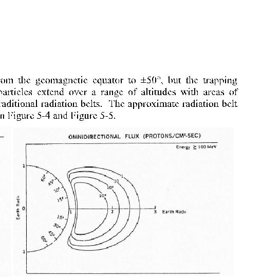
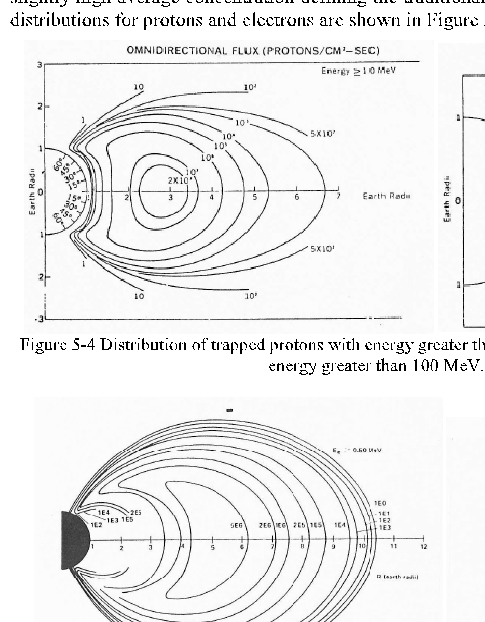
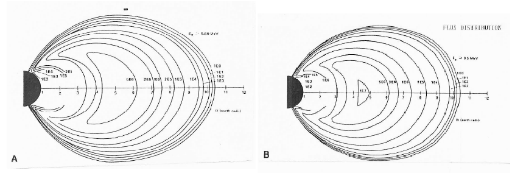
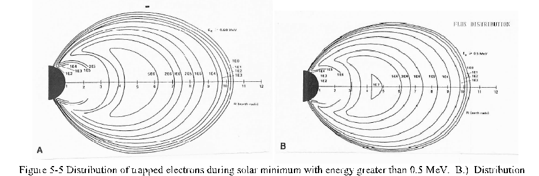
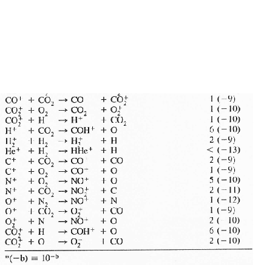
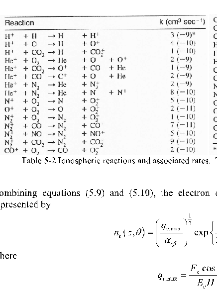

Equation Chapter (Next) Section 1

###### 0 The Earth’s Magnetosphere and Ionosphere

###### 0.1 The Earth’s Magnetosphere

Figure 5-1 Illustration of a Coronal Mass Ejection and its interaction with the Earth’s magnetosphere. (used w/ permission by Steele Hill)

- 0.1.1 Geomagnetism

To a first order approximation, the Earth’s magnetic field is that of a sphere uniformly magnetized in the direction of the centered dipole axis. The dipole axis lies some 800 km away from the geographic poles and are called the geomagnetic poles. The source of the Earth’s internal magnetism is most likely a metallic-like fluid which surrounds a denser, solid core. The fluid motion of the liquid portion of the core generates currents which induce the magnetic field. Planetary rotation plays a crucial role in the formation of geomagnetism as deduced from other rapidly rotating planets and the sun, all of which have magnetic fields that are correlated to their axis of rotation.

- 0.1.2 Structure of the Magnetosphere

Without the interaction of the solar wind, the Earth’s magnetic field would extend indefinitely in all directions. However, the geomagnetic field produces a semi-permeable obstacle to the solar wind and the resulting interaction produces a cavity around which most of the plasma flows. The extent of this obstacle, called the magnetosphere, is dependent on variations in the solar wind density and velocity. The magnetopause is the outer boundary of the magnetosphere where the outward force of the compressed geomagnetic field and the magnetospheric plasma pressure is balanced by the force of the solar wind. The bulk of the solar wind is deflected around the magnetosphere and does not penetrate the Earth’s atmosphere any deeper than the magnetopause. The resulting magnetosphere is shaped like a tear drop, fairly blunt and rounded on the sunward side and nearly cylindrical for a long distance on the antisolar side as shown in Figure 5-1 and Figure 5-2.

Figure 5-2 Cross section of the magnetosphere (Tascione, 1994)

The magnetic field lines forming the tail of the magnetosphere are bounded by a less distinct magnetopause than on the sunward side. The magnetopause occurs approximately 10 RE on the sunward side and the magnetotail extends well beyond the orbit of the Moon (~ 60 RE). High- speed solar wind can compress the sunward magnetopause to as little as 7 RE (geosynchronous spacecraft are at 6.6 RE). The solar wind acts as “supersonic” plasma in interplanetary space. Upon encountering the magnetosphere, a bow shock wave forms in front of the magnetopause at approximately 15 RE, but its position is very sensitive to changes in the solar wind conditions. The region between the shock and the magnetopause is called the magnetosheath, and it is a region of rather complicated fields and plasma processes. Understanding the formation and structure of the magnetosphere requires a cross disciplinary approach. Gasdynamics combined with electrodynamics results in a theory known as magnetohydrodynamics (MHD) which can become extremely complicated. The scope of this course is to define the various regions of the magnetosphere, giving the major characteristics of the regions and their implication to spacecraft operations. Further detail will be left to the student.

- 0.1.2.1 Magnetospheric Currents

There are three major magnetospheric currents that are established in the magnetosphere due to various processes. The first is the magnetopause current. This current is formed from the interactions between the magnetosheath plasma and the geomagnetic field. These currents can vary strongly with time because they are driven by the interaction with the highly variable geomagnetic field.

Another current system forms the plasma sheet which separates the oppositely directed magnetic fields emanating from the north and south polar caps. This current flows from dawn to dusk and presumably merges with the tail current to from a closed circuit. The plasma sheet generally exhibits and electron energy ranging from 0.5 to 1.0 keV, and ion energy ranging from 2 to 5 keV and typical particle densities for both electrons and ions of 0.5 cm-3. The undisturbed plasma sheet is about 5 RE thick and it has an

identifiable inner edge about 7 RE from the Earth at local midnight. However, both the thickness and position are variable.

The third current system is the ring current. The ring current encircles the magnetic equator and is typically located between 3 to 6 RE. Above 4 RE, the ring current involves a slow drift of particles (see the lecture on plasma physics) across magnetic field lines. Ions move westward and electrons move eastward, a consequence of the opposite charges. This charge separation induces the ring current as discussed in previous lectures. This is shown in conjunction with the trapped field line motion in Figure 5-3. The particles making up the ring current have an average energy of approximately 85 keV and the majority (~90%) of the particles have energies ranging from 10 to 250 keV. The ring current consists of O+ from the ionosphere and H+ from the ionosphere and solar wind.

Figure 5-3 Motion of charged particles trapped by the Earth’s magnetic field. The mirror point is the position where a charged particle stops and changes direction. The particle drift between lines is also indicated. (Tascione, 1994)

- 0.1.2.2 Magnetospheric Cusp

The magnetospheric cusp (or cleft) is a narrow region, elongated in longitude and extending down from the high-latitude magnetopause into the polar ionosphere. The two cusps (one in the northern hemisphere and one in the southern) are extensions of interplanetary plasma down to the Earth’s upper atmosphere. The cusp allows a sizable amount of low energy plasma (~ 100 eV) to precipitate into the ionosphere which produces significant heating effects in the ionosphere.

- 0.1.2.3 Plasmasphere

The plasmasphere represents the relatively cold ionospheric plasma which is co-rotating with the Earth due to frictional coupling (collisions). The co-rotation can extend out to sever Earth radii with particle densities ranging from about 104 cm-3 at 1000 km to 10-100 cm-3 near its outer edge. The boundary between the plasmasphere and the inner magnetosphere is called the plasmapause where plasma densities drop by at least a factor of 10 across this boundary.

0.1.3 Radiation Belts

Contrary to popular misunderstanding, the radiation belts do not contain radioactive nuclei nor do they shield the Earth from external radiation. They do not become engulfed in flames and giant squid do not attack submarines attempting to save the Earth from undeniable doom. The radiation belts were discovered by experiments on Explorer I which discovered a seemingly permanent concentration of high energy charged particles high above the Earth. The Earth’s magnetic field provides the mechanism which charged particles are trapped within specific regions called the Van Allen belts about the equator. The trapped

regions of both electrons and protons extend from the geomagnetic equator to ±50°, but the trapping altitude structure is not discrete. The trapped particles extend over a range of altitudes with areas of slightly high average concentration defining the traditional radiation belts. The approximate radiation belt distributions for protons and electrons are shown in Figure 5-4 and Figure 5-5.

- Figure 5-4 Distribution of trapped protons with energy greater than 1 MeV. B.) Distribution of trapped protons with energy greater than 100 MeV. (Tascione, 1994)
- Figure 5-5 Distribution of trapped electrons during solar minimum with energy greater than 0.5 MeV. B.) Distribution of trapped electrons during with same energy during solar maximum

The radiation belts are approximately azimuthally symmetric, except over the South Atlantic anomaly (SAA). The magnetic field strength is lower than normal over the SAA, and therefore, the radiation belts reach their lowest altitudes in this area. The SAA can have large implications on spacecraft operations and must be taken into consideration when designing a spacecraft mission. Magnetic disturbances and solar cycle variations modify the trapped radiation environment. The lower radiation belts below 2RE (energies over 25 MeV) show little response to even major disturbances while the higher belts (energies about 1.0 MeV) show observable response to even minor disturbances. The relaxation back to normal conditions may take months or even years in the higher belts.

The primary source mechanism for the production of extremely energetic protons and electrons (energies > 50 MeV) in the lower radiation belts is believed to cosmic ray neutrons. The cosmic rays (energies greater than 1 GeV) impinge on atomic nuclei in the upper atmosphere. A product of this interaction is a flux of neutrons leaving the atmosphere. However, the neutrons have a short half-life (~ 12 minutes), and many decay into a proton and an electron before leaving the magnetosphere. Some of these charged particles are trapped by the magnetic field and become part of the radiation belts. These extremely energetic trapped particles only survive low in the atmosphere where the magnetic field is relatively strong and the particles gyroradius is small enough as to not carry them too low in the Earth’s atmosphere. If they are carried to low, they will be lost to collisions with atmospheric neutrals. The primary sources for low energy protons and electrons in the outer belts are the solar wind and the ionosphere.

###### 0.2 The Earth’s Ionosphere

- 0.2.1 Introduction

The ionosphere is a partially ionized region of the Earth’s atmosphere which results from the photoionization of atoms and molecules at high altitudes. At these altitudes, the radiation from the sun contains sufficient energy for ionization, and the radiation can penetrate to these altitudes as seen in Figure 4-9. The lower limit of the ionosphere is approximately 50 to 70 km in altitude and there is no distinct upper limit although 2000 km is typically set as the upper limit for most applications. Within the ionosphere, the recombination of electrons and ions occurs fairly slowly (recombination is collisionally dominated and the density at these altitudes is low) leading to a high concentration of free electrons and ions.

There are three distinct regions of the ionosphere: high-latitude, midlatitude and low-latitude. The midlatitude ionosphere is the easiest to understand based on classical models. The high-altitude ionosphere is directly coupled to the magnetospheric tail by the stretched auroral magnetic field lines. The low-latitude ionosphere is sensitive to plasma instabilities and the magnetospheric current. These regions are discussed in the following sections.

- 0.2.2 Ionospheric Regions

Figure 5-6 Typical midlatitude daytime and nighttime electron density profiles for solar maximum and minimum conditions. (Tascione, 1994)

Distinct ionospheric regions develop for several reasons. First, the solar spectrum deposits its energy at various altitudes depending on the atmospheric absorption characteristics. Second, recombination depends on atmospheric density which varies with altitude. Third, the composition of the atmosphere changes with altitude. Therefore, the main ionospheric regions can be associated with different physical processes rather than simple height variation. The vertical structure of the ionosphere changes continuously from day to

night, season and with latitude. The structure is extremely sensitive to periods of increased shortwavelength solar radiation accompanying solar activity.

The different ionospheric vertical layers are shown in Figure 5-6. In order of increasing altitude and increasing electron concentration, these layers are the D, E, F1 and F2 layers. Figure 5-6 also shows the variation in electron density between day and night and the minimum and maximum solar cycle. Above the maximum electron density in the F2 layer, the electron density decreases with altitude monotonically out to several Earth radii. Not only does the overall electron density decrease at night as expected since solar UV radiation is the driving factor in ion production, but the F1 and D layers disappear completely soon after sunset. The ion density is approximately equal to the electron density (charge neutrality) everywhere in the ionosphere except the D layer. In the D layer, electrons combine with molecules to form negative ions.

The charge neutrality condition exists above the D layer since ions and electrons are almost always created or eliminated in pairs. Typically there is not enough photon energy or flux to multiply ionize atoms or molecules in large abundances in the ionosphere. Attractive forces between the positive ions and electrons typically prevent the free electrons from escaping to far from their parent ions; however, charge separation is possible where the ion collision frequency is high. The charge separation allows the more mobile electrons to produce ionospheric currents which help shape the ionospheric structure.

Typically the ionospheric regions are described by a specific radio frequency rather than the electron number density. The radio frequency (called the critical frequency or plasma frequency, see lecture on plasma physics) is the highest frequency which is reflected by the layer for normal incidence. The maximum electron density is related to the critical frequency, f, by

ne,max =1.24 10 ×f (1.1) where ne,max is expressed in cm-3 and f is expressed in megacycles per second (MHz).

4 2

- 0.2.3 Reactions in the Ionosphere
- 0.2.3.1 Simple Chapman Theory

The UV solar energy incident on the upper atmosphere is absorbed at various altitudes and by varous gas species before reaching the lower atmosphere. The absorption in the upper atmosphere follows the theoretical absorption law given by

  =  

S

#### ( )

∫  (1.2) where Iν is the specific intensity of the photons of frequency ν along a specific direction s, Iνo is the value of the specific intensity at some known point where s is taken to be zero, kν is the absorption coefficient which is specific to the frequency of the photons and the species responsible for absorption, and the term mn represents the density of the gas. The term represented by the integral is called the column depth or optical thickness.

exp

Iν Iνo kν mn ds

0

The rate of photoionization due to the incident solar UV radiation is dependent on the amount of incident energy, per unit volume, times the total number of particles, per unit volume, available to absorb the incident radiation. The flux of some frequency of incident radiation Fν as a function of wavelength, absorbing species and altitude is given by

z F F k mn H

  −  =  −     

v exp v ( ) (sec )exp

∞ θ

(1.3)

H

where F∞ is the photon flux at the top of the atmosphere (i.e. before atmospheric absorption), z is the altitude, θ is the zenith angle such that ds = secθ dz and H is the scale height as defined in equation (4.7) of the course lecture notes. Therefore, the amount of incident energy per unit volume per unit time is (dFν)⁄(secθ dz). Using n(z) to denote the atmospheric density as a function of altitude as in equation (4.6), the photoionization rate becomes

dF q

1 sec

= (1.4)

v v

E θ dz

v

F q n z mk

## ( )

= (1.5)

v v v

E

v

F z z q n mk k mn H

     =    − − −      

v ( o v) exp v ( ) (sec )exp

∞ θ

(1.6)

E H H

v

where Eν is the energy per photon. At high altitudes, the production rate is decreasing because the density is decreasing with altitude, and at low altitudes, the production rate also decreases because most of the incident radiation has been absorbed in the higher regions. It can be shown that most of the radiative absorption takes place within four scale heights above and two scale heights below the atmospheric level of maximum absorption. The level of maximum absorption also represents the peak in the electron density since the production of electrons depends on the absorption of photoionizing radiation. The electron density is, therefore, simply the difference between the production and loss (recombination) rates as

dn

= α− (1.7)

e 2 v eff e

q n dt

where ne is the electron number density and αeff is the effective recombination rate coefficient. Table 5-1 shows the ionospheric production and loss processes and the characteristic values of the recombination rate coefficient (determined experimentally) for the main ionospheric layers. Table 5-2 gives the major reactions and reaction rates taking place in the various regions of the ionosphere.

|Layer|layer peak (km)|ne,max (cm-3)|αeff (cm3/sec)|Ion Production|Recombination|
|---|---|---|---|---|---|
|D|90 Lower following solar flare|1.5x104(noon) Absent at night|3x10-8|Ionization by solar x- rays or Lyα ionization of NO. Enhanced ionization following solar flares due to x- ray ionization of all species. Electron attachment to O and O2 forms negative ions; ratio of negative ions to electrons increases with depth at night.|Electrons form negative ions which are destroyed by photoattachment (O- + hν O + e), associative detachment (O- + O O2 + e) and mutual neutralization (O- + A+ O + A)|
|E|110|1.5x105(noon) <1x104(night)|10-8|Ionization of O2 may occur directly by absorption of the first ionization continuum (hν > 12.0 eV). Coronal xrays also contribute ionizing O, O2 and N2. Nighttime E and sporadic E are due to electron and meteor bombardment.|Dissociative recombination. O2  + +  e O + O and NO+ + e N + O|
|F1|200|2.5x105(noon) Absent at night|710-9|Ionization of O by Lyman “continuum” or emission lines of He. Probably accompanied by N2 ionization which disappears rapidly after sunset.|O+ ions readily transfer charge to N2 and O2  +. Most of the ionization is in molecular form and disappears by dissociative recombination.|
|F2|300 Height and electron density highly variable|106 (noon) 105 (midnight)|10-10 - 10-9|Ionization of O by same process producing F1; F2 formed because αeff decreases with increasing height. Additional ionization processes may contribute in F2.|Recombination of molecular ions as in F1; limiting factor is charge exchange, giving an attachmentlike recombination.|

Table 5-1 Ionospheric layers and the processes which dominate each region

Table 5-2 Ionospheric reactions and associated rates. The number in parentheses is an exponential term

Combining equations (5.9) and (5.10), the electron density at any altitude in the ionosphere can be represented by

- 1
- 2

    =     − − − 

q

- 1

, exp 1 exp

- 2

( ) ( )

(1.8) where

,max

v e

n z θ z z α

1 1

eff

cos v exp 1

F q

∞ θ

### ( )

= − (1.9) and

,max

E H

v

##### ( )

z z z

= (1.10)

max 1

H

where zmax is the altitude of maximum radiative absorption qν,max. From these equations, it can be seen that the daily, seasonal and latitudinal variations of electron density varies as the square root of cos θ (i.e. (qν,max

2)).

Warning: These equations are only approximately accurate for layers in the ionosphere known as Chapman layers (after Sydney Chapman who first attempted to describe ionospheric structure and formation). This is a valid approximation for the E and F1 regions. The upper F2 layer and the lower D layer do not follow these basic laws and further discussion about the characteristics of these regions needs to be investigated.

0.2.3.2 Chemistry in the D Layer

The ionospheric D layer (50-95 km) is characterized by small ionization fractions and large collision frequencies between electrons and ions with neutral molecules. During normal daytime conditions, free electron densities increase nearly exponentially from about 1 cm-3 at 50 km to 104 cm-3 at 90 km. The D layer is dominated by negative ions distinguishing itself from the other ionospheric regions. For example, the N2 molecule does not form a stable negative ion but O2does.

Negative ions are formed by three body attachment. The third body is required to take the excess energy out of the collisional system. For example,

O2 + e +O2 → O2− +O2 with k = 5 x 10− cm / sec (1.11)

31 3

O2 + e + N2 → O2− + N2 (1.12) The rate coefficient for reaction is much slower than for reaction . These processes are more important than radiative attachment at the high D layer densities.

The loss process consists of removing electrons from molecular oxygen in the daytime by photodetachment

O2 + hv → O2 + e at visible wavelengths (1.13) and by collisional detachment

O2 +O2 → O2 + e +O2 with k ~ 10 cm / sec (1.14) The reaction rate coefficient of reaction is extremely sensitive to temperature, and the value given is an estimate for 200 K.

22 3

Positive ions and free electrons are created by photoionization of N2 and O2 by solar x-rays and solar hydrogen Ly α ionization of the minor NO atmospheric constituent. The D layer chemistry stops when the positive ions are neutralized and not when the free electrons disappear by attachment. The principal recombination mechanism is mutual neutralization

A+ + B− → A+ B with k ~ 2 x 10−7cm / sec3 (1.15) Electrons can also be lost through dissociative recombination (reactions (5.22) and(5.23)) which must be considered for any equilibrium process. Recently flown mass spectrometers have shown that water derived ions such as H3O+, H5O2+ and H7O3+ may also be important in the D layer.

0.2.3.3 Chemistry in the E Layer

In the E layer (90-140 km), ionization is produced mainly from O2 molecules by photoionization

O2 + hν → O2 + e at λ< 1027 Å (1.16) Additional ionization of nitrogen molecules by coronal x-rays produces O2 and NO ions by rapid charge exchange. For example,

N2 + hν → N2+ + e at λ< 796 Å (1.17)

N2+ +O → NO+ + N with k = 5 x 10− cm / sec (1.18)

10 3

N2+ +O2 → N2 +O2+ with k = 1 x 10− cm / sec (1.19) At E layer altitudes, CO2 has reasonably high densities. The charge exchange reaction between carbon dioxide and molecular nitrogen is

10 3

N2 +CO2 → N2 +CO2+ with k = 9 x 10 cm / sec (1.20) However, the newly formed carbon dioxide ion reacts quickly with molecular oxygen forming

10 3

CO2 +O2 → CO2 +O2+ with k = 1 x 10 cm / sec (1.21) Ion production is balanced by loss mechanisms principally by dissociative recombination such as

10 3

O2+ + e → O +O with k = 3 x 10− cm / sec (1.22)

7 3

NO + e → N +O with k = 3 x 10 7cm / sec3 (1.23) Dissociative recombination occurs as a result of a radiationless transition which forms an unstable intermediate molecule that separates into neutral atomic species. A second loss mechanism is radiative recombination in the form

O2+ + e → O2∗ + hν (1.24) Typically reaction (5.24) occurs at a rate 105 times smaller than the dissociative recombination rates in reactions (5.22) and(5.23). Radiative recombination becomes important at higher altitudes where the reduced number densities decrease dissociative recombination.

Within a stable ionosphere, the electron and ion densities are approximately equal (on a scale larger than the Debye length ~ 1 cm). Otherwise, large electric fields would form causing a restructuring of the ionosphere which eliminates the nonequilibrium fields. The loss process for dissociative recombination (the major loss factor) is given in the same way as equation (3.67) as

Loss = k A + ne (1.25) where k is the reaction rate and [A+] denotes the concentration or number density of a given ion. Since the number density of the ions and electrons are approximately equal, equation (5.25) becomes

Loss = kne (1.26) The rate of change in electron density in the E layer is simply the difference between the production rate, qν, and the ion loss process as

2

dn

= − (1.27)

e 2 v e

q kn dt

In practice, any atmospheric layer that has a loss process governed by ne2 is approximated reasonably well by the Chapman model. Therefore, the E layer is very well approximated by the Chapman model. During the day, the lifetime for molecular ions in the E layer is approximately 10 seconds.

- 0.2.3.4 Chemistry in the F1 Layer

- In the F1 layer (140-200 km), the principal ion formed is O+ by O + hν → O+ + e at λ< 911 Å (1.28)

This is obvious by noting from last lecture that atomic oxygen is the most abundant specie in this region of the atmosphere. There is also some ionization contribution from

N2 + hv → N2+ + e at λ< 927 Å (1.29) The distinguishing feature between the lower E layer and the F1 layer is that the atomic ions making up the F1 layer must exchange their charge before recombination because radiative recombination is extremely slow. For example,

O+ + e → O + hv with k = 3 x 10 12cm / sec3 (1.30) However, molecular dissociative recombination occurs relatively fast as long as molecular ions are produced. Therefore, the F1 layer recombination is a two step mechanism in the following form

- 11 3

O +O2 → O +O2+ with k = 2 x 10 cm / sec (1.31)

- 12 3

O+ + N2 → N + NO with k = 1 x 10 cm / sec (1.32) followed by the dissociative recombination mechanisms or reactions (5.22) and(5.23). The F1 layer is also well approximated by the Chapman model meaning that the loss rate of ions varies with the squared of the electron number density.

0.2.3.5 Chemistry in the F2 Layer

- In the F2 layer (> 200 km), the atmosphere becomes optically thin (i.e. the column depth or integrated number density along some line is small) to ionizing radiation and the second term in equation (5.4) becomes negligible. Furthermore, charge exchange totally dominates at high altitudes as the loss mechanism so that

Loss = k O +[A] (1.33) where A is an arbitrary neutral particle (O2, N2). Assuming charge neutrality, equation (5.33) becomes

# [ ]

Loss = kne A (1.34) where the loss mechanism depends on the first power of the electron density. Therefore, the Chapman model of the F2 layer must be modified to match observations.

At high altitudes, O+ becomes less important and H begins to dominate. It is customary to denote the region where O+ dominates as the topside ionosphere, and the region where H+ dominates the plasmasphere.

0.2.4 Variability

In the previous sections, the model of an ideal ionosphere has been presented. As can be imagined, the ionosphere rarely matches this ideal model and the variation from the ideal can range from minor to extreme depending on the circumstances. In fact, some fluctuations of the ionospheric electron density are regarded as normal. Some examples of this include diurnal variations and seasonal variations. At night, for example, the D layer and the distinction between the F1 and F2 layers disappear. The daytime ionizations in the E and F1 layers are larger in the summer than in the winter, but the reverse is often true in the F2 layer. Some other regular variations in electron density in the ionosphere result from atmospheric tides caused by the sun and Moon although this is a minor and regular disturbance. Since photoionization drives ionospheric processes, solar variations can dramatically influence the structure of the ionosphere.

These variations not only include the regular 11 year solar cycle but short term x-ray and energetic particle release enhancement during solar flare or prominence events.

A sudden ionospheric disturbance (SID) can manifest itself within a few minutes of the appearance of some strong solar flares. They cause sharp fade-out of long-distance radio communication on the sunlit side of the Earth. The short-wave fade-out (SWF) is caused by strong enhancement of the electron density of the D and lower E layers as a result of solar x-rays. High frequency radio waves, that normally would pass through the D layer and be reflected at higher levels, are instead absorbed. The disruption of communication may last upwards of several hours. The absence of SID effects transported to the dark side of the Earth is due largely to the rapid recombination of electrons and ions beyond the terminator.

Several other variations persist which may be regular phenomenon or due to short period variations in solar output. These variations, although important to space physics and perhaps to spacecraft operations, are beyond the scope of this class and will not be discussed. It is recommended that these variations be considered when operating spacecraft within specific altitude ranges. For example, there are several variations which are altitude and latitude dependent. These variations can alter electron densities by factors of two or three which can significantly alter space system operations if not considered. A complete description of these variations can be found in any textbook dedicated to planetary atmospheres or ionospheres and the handouts provided in class.
