Equation Chapter (Next) Section 1

## 0 The Plasma Environment

###### 0.1 Charged Particle Interactions with Surfaces

Interactions with spacecraft surfaces and charged particles (ions and electrons) are fundamentally different than interactions with neutral particles and photons. The differences between particle impactors and photon impactors was discussed in previous lectures. The differences in neutral and charge particle interactions in Earth orbit arise from two factors. First, charged particles in Earth orbit are typically more energetic than their neutral counterparts. Second, the charged particles are affected by electromagnetic forces which may be present on or around an orbiting spacecraft. These forces can attract the particles toward or repel them away (depending on the magnitude and direction of the forces) from the surface. The effects of charged particle interactions with surfaces also depends on the mass of the species. Electrons and heavy ions interact in different ways with spacecraft surfaces. This topic will be addressed in the following sections.

0.1.1 Electron-Surface Interactions

Since the energy of the electrons present throughout the ionosphere is relatively high (compared to neutral species), all modes of surface interactions discussed in previous lectures are open to electrons. These include desorption (augering), sputtering (atomic and ionic species), penetration, emission of electromagnetic radiation (X rays) and the formation of secondary electrons. Augering is a process available to highly energetic electrons in which inner core electrons are removed with subsequent transitions ending in desorption. Many studies have shown that there is little or no bulk particles desorbed from metal surfaces under electron impact at low flux (as is the case on orbit). Electrons and photons can only desorb bulk particles from a metal if the flux is high enough to produce local heating and evaporation. The auger process increases the desorption of bulk particles only slightly for most materials under bombardment by moderately energetic electrons. Electrons and photons are extremely efficient, however, in desorbing accumulated (contaminants including the monolayer) molecules and atoms from metal surfaces.

Electrons are also responsible for the sputtering of material from solid surfaces. For example, the sputtering of oxide layers. Most oxides under electron bombardment sputter oxygen preferentially. However, this is not a steady state process since the solid surface changes as the impact process continues. In metal oxide surfaces, the metal enriched surface quenches the desorption process as the bombardment continues (i.e. the oxide layers reduce with time and more pure metal surfaces are shown to the incident electrons). Yields on oxides are in the range of 10-5 to 10-6 atoms per incident electron. Sputtering or the removal of atomic species from the solid implies that the solid structure is significantly damaged in the process. However as the yield indicates, the sputtering of solid surfaces by electron impact is not efficient. This is generally because of the unfavorable mass ratio between the electron and the heavier atomic species.

Electrons, however, are extremely efficient in producing secondary electrons from solid surfaces. The total secondary yield of electrons from a surface, δ, is defined as the average number of external electrons produced per incident electron. The true secondary electron yield, δt, is the average number of electrons produced by the surface per incident electron. The backscattering coefficient, η, is defined as the average number of incident electrons scattered from the surface. Therefore, δ = δt + η. Although η is small in some cases, it is not always small compared to δ. In spite of this fact, the terms “secondary” and “true secondary” are frequently used interchangeably, and most data on secondary emission of electrons is given in δ rather than δt.

Figure 8-1 shows a typical energy distribution for secondary electrons. There are three distinct regions apparent in this distribution. In region I, the electrons have essentially the same energy as the primary

electrons, Ep. These are incident electrons which have been elastically backscattered at the surface. Region III contains a large number of electrons whose energy distribution is peaked around a few electron volts. These are true secondaries emitted by the surface. Region II contains a few energetic true secondaries, but mainly primary electrons which have suffered multiple collisions with the surface. The secondary electron’s angular distribution is proportional to the cosine of the angle measured from the surface normal when the primary electrons are incident along the surface normal.

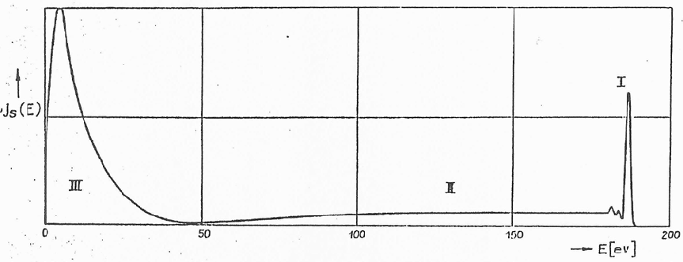

Figure 8-1 The general shape of the energy distribution of secondary electrons. I. Reflected primary electrons near the incident energy. II. Transition region. III. Secondary electron distribution.

The secondary electron yield, δ, varies with the energy of the primary electrons Ep in approximately the same manner for all materials. Figure 8-2 shows the shape of a typical yield curve. At low incident energy, few secondaries are ejected, but the yield is substantial at intermediate energies and may exceed unity. At low primary energy, the energy of many secondaries at the surface is less than the material’s work function and can not escape. At high energies, most of the secondaries are produced deep within the target (primary electron penetration of the surface) and lose so much of their energy in collisions before they reach the surface and, again, can not escape. Ep,o denotes the primary energy at which the yield is a maximum, δmax. Ep+ and Ep- are the primary electron energies at which the yield curve crosses the line δ = 1 with positive and negative slopes respectively. Table 8-1 and Table 8-2 give the secondary electron emission parameters for several metals, semiconductors and insulators. Secondary electron emission is dependent on surface roughness and surface contamination.

Figure 8-2 The general shape of the secondary electron yield curve, δ (Ep).

|Atomic Number|Element|δmax|Ep, max(eV)|Ep, I|Ep, II|
|---|---|---|---|---|---|
|12|Mg|0.95|300|-|-|
|13|Al|0.95|300|-|-|
|22|Ti|0.9|280|-|-|
|26|Fe|1.3|400|120|1400|
|27|Co|1.2|500|200|-|
|28|Ni|1.35|550|150|1750|
|29|Cu|1.3|600|200|1500|
|37|Rb|0.9|350|-|-|
|40|Zr|1.1|350|175|600|
|41|Cb|1.2|375|175|1100|
|42|Mo|1.25|375|150|1300|
|46|Pd|>1.3|>250|120|-|
|47|Ag|1.47|800|150|>2000|
|48|Cd|1.14|450|300|700|
|50|Sn|1.35|500|-|-|
|51|Sb|1.3|600|250|2000|
|55|Cs|0.72|400|-|-|
|56|Ba|0.82|400|-|-|
|74|W|1.35|650|250|1500|
|78|Pt|1.5|750|350|3000|
|79|Au|1.45|800|150|>2000|
|82|Pb|1.1|500|250|1000|
|83|Bi|1.5|900|80|>2000|

###### Table 8-1 Maximum secondary electron yields from different metals. Ep,I and Ep,II are the values at which the yield curve (Fig. 46) crosses the δ=1 line on the left side and right side respectively.

|Group|Substance|δm|Ep,m (eV)|
|---|---|---|---|
|Semiconductive|Ge (single crystal)|1.2-1.4|400|
| |Si (single crystal)|1.1|250|
| |Se (crystal)|1.35-1.4|400|
| |C (diamond)|2.8|750|
| |C (graphite)|1.0|250|
| |Cu2O|1.19-1.25|400|
| |PbS|1.2|500|
| |Ag2O|0.98-1.18|-|
| |ZnS|1.8|350|
|Intermetallic|GeCs|7.0|700|
|Insulators|LiF (evaporated layer)|5.6|-|
| |NaF (layer)|5.7|-|
| |NaCl (single crystal)|14.0|1200|
| |NaCl (layer)|6.0-6.8|600|
| |KCl (single crystal)|12.0|-|
| |KCl (layer)|7.5|1200|
| |KBr (single crystal)|12.0-14.7|1800|
| |BeO|3.4|2000|
| |MgO (single crystal)|23.0|1200|
| |MgO (layer)|4.0|400|
| |BaO (layer)|4.8|400|
| |Al2O3 (layer)|1.5-9.0|350-1300|

|Group|Substance|δm|Ep,m (eV)|
|---|---|---|---|
| |SiO2 (quartz)|2.4|400|
| |Mica|2.4|300-384|

Table 8-2 Secondary electron yields from semiconductors and insulators

It may be noticed that insulators generally have extremely high yields. The reason for this is that there are no electrons in the conduction band of an insulator as is the case for metals. The is a quantum mechanically forbidden energy gap between the bottom of the conduction band and the next allowed band below. The lower band is completely filled and can accommodate no more electrons. Therefore, the secondary electrons are unable to dissipate their energy in small steps by colliding with other electrons as they move towards the surface, and they reach the surface with greater energy on average than in metals. Thus, they have a better probability of escaping the solid surface.

For a given solid surface, the yield of secondaries is dependent on the angle of incidence of the primary electrons. The more oblique the angle, the more secondaries that are produced. This is easily understood by considering the depth at which the secondaries are being produced. The more oblique the angle, the nearer the secondaries are produced to the surface giving them a higher probability of escape. Secondaries produced more than about 100 Å deep within a metal have little chance of escaping.

- 0.1.2 Ion-Surface Interactions

Secondary electron yields, γi, due to heavy ion impact generally range from 0.1 to 0.3 for most metals at moderate (~5000 eV) incident energies. At energies up to this maximum, the yields are nearly independent of the kinetic energy of the incident ions for most metals. Ejection of an electron from a surface proceeds by excitation of the electron into the kinetic energy continuum above the surface potential barrier. In a heavy particle incident on a surface, the source of the excitation energy may be in the form of kinetic energy or internal potential energy. These can be distinguished by kinetic and potential ejection respectively.

Because of a more beneficial mass ratio between the heavy incident ion and the surface atoms, sputtering yields are generally larger for ion impact then for electron impact (a fact utilized by the plasma processing experimentalists). Heavy particles incident on a surface may eject bulk material particles as well as secondary electrons. The ejected heavy particles can be neutrals, positive ions or negative ions. The erosion of spacecraft surfaces due to sputtering is very undesirable. For example, atoms sputtered from one spacecraft surface are contamination sources for sensitive payloads. There are two basic types of sputtering: chemical and physical.

Chemical sputtering occurs when the incident particle and the surface atoms or molecules form volatile compounds which are subsequently lost due to vaporization. The kinetic energy of the incident particle is, therefore, not critical. Chemical sputtering is important for atomic oxygen incident particles reacting with spacecraft materials as described in the previous lecture. In physical sputtering, atoms are ejected from the solid surface as a result of momentum transfer from the incident particles to the surface particles. As expected, the kinetic energy is critically important in physical sputtering. This process is dominant for ionic species on orbit.

One of the more important features of ion/surface interactions is neutralization. Ions striking a surface typically leave as neutral atoms provided that the ionization energy is greater than the material’s work function (typically most cases with the exception of alkali ions). As alluded to in the previous section, surfaces under bombardment by energetic electrons or ions emit electromagnetic radiation sometimes in the form of continuum X rays (bremsstrahlung). The production of these X rays is inversely proportional to the square of the mass of the bombarding projectile, and therefore, is most pronounced by electron bombardment.

- 0.1.3 Conclusions

The impact that electrons and ions have on spacecraft surfaces may not be clear by the above discussions. They are given merely to inform the student of the wide variety of processes and phenomena that are available to spacecraft on orbit. There are regions in the atmosphere where certain processes dominate and others have little or no contribution to what is observed. The processes which take place at given altitudes will be addressed in the following sections. Keep in mind that all of these processes are taking place on orbit to some degree; it is this “degree” that design engineers must begin to recognize.

- As was mentioned a previous lecture, secondary electrons are produced by photon interactions with surfaces. The photoemission of electrons occurs when the material is illuminated by photons with significant energy to liberate electrons in the solid. These secondary electrons are no different fundamentally than those produced by particle impact and must be considered.

0.2 Characteristics of the Plasma Environment

The plasma environment was described in some detail in a previous lecture on the Earth’s magnetosphere and ionosphere. This section is designed to give more insight into which surface processes may be important in a given altitude. The universe is made up of 99% plasma and 1% neutral particles. The fact that we live in an infinitesimal fraction of the 1% (up to several hundred kilometers) is a mind boggling concept. We are just learning how plasmas can be an extreme benefit to our everyday lives. It is clear that if we are going to continue to work and live in space, then we need to understand the plasma environment.

- 0.2.1 Low-Earth Orbit

The low-Earth orbit plasma environment has been presented in a previous lecture. The electron number density as a function of altitude in the various ionospheric regions is shown in Fig. 34 up to 1,000 km. For a neutral plasma, the total ion concentration is approximately equal to the electron concentration. At a typical altitude of 300 km, the plasma density is on the order of 105 cm-3, Te,i is approximately 1,000 K and the Debye length is typically less than 1 cm. The structure and chemistry of the ionosphere is also given in a previous lecture.

The electron current density to a spacecraft from incident plasma electrons in LEO is on the order of 1 mA/m2. Secondary emission from the spacecraft surface due to bombardment of photons, electrons and/or heavy ions must be addressed for the LEO plasma environment. Photoemission of electrons for most materials is limited to 10-40 µA/m2. Consequently, the current due to photoelectrons in LEO is negligible. At the electron and ion energies found in LEO (typically 5 - 10 eV), the secondary emission of electrons is found to be on the order of 0.01 secondary electrons for every incident electron or ion for most materials. This indicates that secondary electron currents to a spacecraft surface for ion and electron impact is minimal as well. Sputtering of positive ions from the surface by neutral atoms or incident charged particles is also negligible at typical LEO energies. Therefore in LEO, the major source of charged particle current to a spacecraft is from the ambient incident plasma.

Enhancement of the LEO plasma environment can be caused by auroral phenomena at high latitude. This is a concern to satellites in low-altitude polar orbits where the enhanced auroral region is crossed four times per orbit. In situ observations confirm that auroral electrons can be accelerated to several keV, producing a plasma environment capable of more severe charging.

- 0.2.2 Geosynchronous Orbit

Above 1,500 km, the ionized constituents of the atmosphere are dominant over the neutrals in the magnetosphere. At these altitudes, the local magnetic field controls the charged particle motions. The plasma density above 1,000 km is shown in Figure 8-3 for solar maximum and minimum conditions (NOTE: the number density in Figure 8-3 is given as the number of ions per cubic meter, not per cubic centimeter). Typical GEO plasma densities are about 1 cm-3 with an average electron kinetic energy of 2.4 keV and an average ion kinetic energy (mostly H+) of 10 keV. Note also that the incident solar photon flux

at these altitudes is significant. The lower plasma density and slightly higher energies yields an ambient current density to a GEO spacecraft as 10 nA/m2. These ambient currents can be enhanced greatly during periods of geomagnetic storms. These storms have been observed on the ATS-6 satellite to charge surfaces to as much as -20,000 Volts.

Since the ambient plasma density is relatively small in GEO, contributions from secondary electron emission from solar photons, ambient electrons and ambient ions can not be ignored as secondary effects. The efficiency of secondary production is also enhanced at the nominally higher incident energies found in GEO. Therefore, the secondary emission of electrons in GEO can have significant charging effects on spacecraft surfaces.

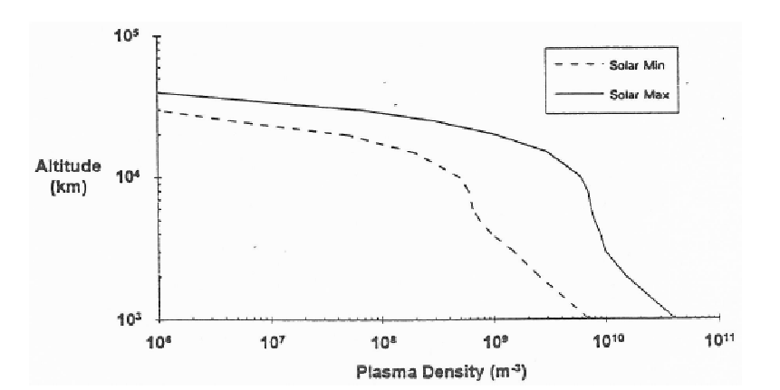

Figure 8-3 Plasma densities at high altitudes during solar maximum and minimum conditions

###### 0.3 Plasma Environmental Effects

As discussed in a previous lecture on plasma physics, any unbiased (no potential of its own) body placed in a plasma will obtain a negative charge due to the discrepancy in the relative velocities of electrons and ions. The faster electrons will accumulate on the spacecraft surface before the positive ions (moving much slower) can. This initial rush of electrons is balanced by the formation of the plasma sheath or the region of positively charged particles between the spacecraft surface and the surrounding plasma. Nature sets up the sheath in response to the electron sink (the spacecraft) in an attempt to exert charge neutrality in the local plasma. The formation of the sheath is easily understood by considering that the initial negative charge which builds up on the surface will repel further negative charges from accumulating and attract positive ions. At some point, the balance between the spacecraft’s collection of electrons and ions will equilibrate and the spacecraft will maintain a negative charge.

A spacecraft orbiting through a plasma collects ions and electrons unevenly over its surfaces. In the ram (in the direction of the orbital velocity vector) direction, the surfaces are available for both ion and electron collection. However, the wake (just behind the spacecraft) region surfaces only collect electrons. As a spacecraft travels through the plasma, it creates a void of both electrons and ions directly in its wake by gas dynamical processes (the physical basis for the Wake Shield Facility). Because the electrons possess a greater mobility than ions, the wake region will be filled immediately after the spacecraft passes with the fastest electrons. In this case, the electrons average thermal speed is much greater than the spacecraft orbital speed, and the ions thermal speed is much slower than the spacecraft orbital speed. Since the electrons will not initially be accompanied by an equal number of positive ions, the region quickly develops

a negative potential which acts to repel slower electrons. Consequently, the spacecraft creates behind it a plasma wake within which the ion current is reduced to a fraction of the ambient level and in which the plasma temperature is enhanced. A small satellite or an astronaut in the wake may be charged to dangerously high voltage due to the lack of positive ion current. Furthermore, for spacecraft docking operations, wake charging may lead to significant voltage differences between docking surfaces leading to electrostatic discharging.

If a satellite collected the same amount of electrons and ions over its entire surface area, there would be no problem, in general, with spacecraft charging. However, electrical insulators and the differential collection between ram and wake surfaces discussed above allow large potential differences to persist on spacecraft surfaces. If this charge difference is large, electrical breakdown or arcing can occur. The arcing process is adverse in such minor things as experimental interference to such major things as physical damage to surfaces and equipment.

0.3.1 Langmuir Probes and Their Relation to Spacecraft Charging

A Langmuir probe is a small cylindrical conducting rod usually made of tungsten (low secondary electron yield for electron and ion impact) which is placed in a plasma. The current from the probe is then recorded as a function of the probe bias voltage. A typical current versus voltage characteristic for a Langmuir probe in a neutral plasma is shown in Figure 8-4. Once the probe is immersed in the plasma and the probe voltage is zero, the probe tip begins to acquire a negative overall charge for the same reasons as described for any surface in a plasma. If the voltage of the probe is biased slightly negative, the probe will begin to collect all of the ions in the vicinity and repel most of the electrons. In this case, the plasma sheath is made almost entirely of positive ions as the plasma attempt to maintain charge neutrality in the plasma. The current collected in this configuration is notes as the ion saturation current, Isi. Biasing the probe more negative has no effect on the current collected by the probe until such time as the probe begins to accelerate the ions to energies high enough to induce secondary electron emission from the probe surface itself.

Figure 8-4 Current versus voltage characteristic of a typical Langmuir probe

If the voltage is biased more positive, the probe will begin to repell less electrons and attract less positive ions. The voltage at which the current collected is zero (i.e. an equilibrium state where the electron current is balanced by the ion current) is the floating potential for the probe. The probe has a linear response as the voltage continues to increase to more positive values. Eventually, the probe will be biased to a voltage where all the electrons in the vicinity of the probe are collected and the positive ions are repelled. This is

known as the electron saturation current, Ise. Further increase in the voltage causes acceleration of the electrons to the point where they can begin to ionize the neutral gas surrounding the probe. For an ungrounded probe (i.e. one whose ground is at the plasma potential), the plasma potential is zero as shown in Figure 8-4.

Near the plasma potential, the sheath region begins to shrink, and at the plasma potential the sheath distance goes to zero. It is at this point that the plasma does not need to set up a sheath in order to preserve its neutrality. At potentials greater than the plasma potential, the sheath begin to grow again and is composed mainly of electrons. In the region AB denoted in Figure 8-4, the electron concentration at the probe surface, ne,p, relative to the concentration of electrons at the plasma boundary of the sheath, ne,s, is

  −

eV kT

, , e

=   (1.1) and the sheath characteristic dimension or the Debye length is given as

ne p ne s

e

kT n e

#### ε

λ = (1.2) Typically the sheath thickness is on the order of four to five Debye lengths.

o D

2

o

Langmuir probes show how a conducting surface biased to some potential will charge in a plasma environment and can be extrapolated to a satellite in the Earth’s plasma environment. Langmuir probes are used in the laboratory and on orbit to characterize plasma environments. They are useful in determining plasma potentials, floating potentials, electron temperatures and electron energy distributions. They have a limitation in that the collecting area of the probe depends intimately on the size and structure of the plasma sheath formed around the probe. In general, this region is very complex and little is typically known for a given plasma; although, some very good approximations do exist for these measurements in the literature.

- 0.3.2 Spacecraft Charging - General

As discussed above, objects placed in a space plasma collect and emit charged particles and can accumulate net electrical charge. This section covers the theoretical determination of the degree of spacecraft charging and the effects of the floating potential. The fundamental physical process for all spacecraft charging is that of current balance. At equilibrium, all currents must sum to zero. The potential at which equilibrium is achieved is the potential difference between the spacecraft and the plasma or the floating potential. The total current collected by any orbiting spacecraft at some potential V is

( ) ( ) ( ) ( ) ( ) ( ) ( )

IT V = Ie V −Ii V +Ise V +Isi V +Ibse V +Iph V +I Vb (1.3) where Ie is the incident electron current on the spacecraft surface, Ii is the incident ion current, Ise is the secondary electron current caused by the incident electrons, Isi is the secondary electron current caused by the incident ions, Ibse is the backscattered incident electrons, Iph is the secondary electron current caused by the incident photons and Ib is the current (both electron and ion) from active sources such as ion thrusters and experimental apparatus.

Spacecraft charging is vehicle (material and biasing) as well as orbit dependent. A spherical satellite with a homogeneous conducting surface would probably not experience significant charge-related problems since the vehicle’s potential would be uniformly high. Although spherical satellites have little utility, vehicle design is an important consideration. Electrostatic discharging occurs between relatively large potential differences. Materials such as insulators and dielectric material are capable of differentially charging with respect to other spacecraft surfaces. Even weak discharges can cause significant problems such as spurious electronic switching, breakdown of thermal coatings, solar cell degradation and the degradation of optical sensors.

- 0.3.3 Unbiased Spacecraft Charging

- As mentioned earlier, the average electron thermal speed is much greater than the orbital speed of the spacecraft. The average ion thermal speed is almost an order of magnitude less than the spacecraft orbital

speed. As shown in Figure 8-5, this allows ions to only impact those surfaces of the spacecraft facing in the ram direction. The ion current collected by the spacecraft is then

Ii = en vo s c/ Ai (1.4) where e is the electrostatic ion charge (assuming single ionization), no is the plasma number density, vs/c is the spacecraft orbital speed and Ai is the area of the spacecraft collecting ions. The electrons can reach all surfaces as a result of their large speeds. The electron current collected by the spacecraft is given as

eV kTe

  

1

e 4

=   (1.5)

Ie en vo e thAe

,

where ve,th is the average thermal speed of the electrons, Ae is the area of the spacecraft collecting electrons, V is the spacecraft potential and Te is the electron temperature (a measure of the electron kinetic energy). Note the term n vo e th, 4 is a result from the transport of mass (or number density) or flux of electrons to a surface assuming a Boltzmann distribution.

The spacecraft will continue to charge negatively until the spacecraft potential can repel the excess electrons and the currents can balance. When this occurs, the object is charged to the floating potential given by

4 f e ln s c i

kT v A V

/

= (1.6)

e v A

,

e th e

In LEO, the floating potential is typically on the order of -1 Volt. The floating potential refers to the potential of the conducting surfaces that are used as the spacecraft’s electrical ground as measured with respect to the plasma. Because a dielectric or insulator can not distribute the charge from the surrounding plasma (no conduction bands are available), dielectrics may charge to different potentials depending on their surface conductivity. In LEO these potential differences are on the order of volts; however in GEO, these differential charges may be on the order of thousands of volts and arcing may arise.

Figure 8-5 Current collection by an unbiased vehicle in LEO

### Example:

Calculate the approximate floating potential for a spherical conducting satellite in a 300 km orbit under average solar conditions.

For a circular object, Ai πr2 (cross sectional area) and Ae = 4πr2 (total surface area). Using the parameters for 300 km at average solar conditions, Te = 1000 K, vs/c = 8 km/sec and ve,th = 200 km/sec. From equation (8.6),

# [ ] [ ]

× −  

4 (1.38 10 / )(1000 ) 4 8 / ln ln .27 1.6 10 200 / 4

kT v A J K K km s V Volts e v A C km s

23 /

= = = − ×  

e s c i f

19 ,

e th e

- 0.3.4 Biased Spacecraft Charging

Spacecraft typically have surfaces biased at different electrical potentials such as solar arrays and certain experimental buses. As seen in the section above, different potentials will attract different current densities. The potential difference over each cell of a solar array is about 1 Volt. A number of cells connected in series is used to generate the voltage required by the spacecraft power supply. Each metallic interconnect in a string will be biased at a slightly different potential, relative to the spacecraft ground, and consequently, different portions of the solar array will collect current from the plasma in a different manner.

Assume that the solar array is facing in the ram direction as is the case at orbital sunrise. This condition allows all of the metallic interconnects to collect ion currents. The potential distribution along the array must arrange itself, relative to the plasma, so that the amount of ion current collected is balanced by an equal amount of electron current. Because ions are relatively immobile, it is assumed that the ions are collected by any portion of the array biased at a voltage less positive than the ion impact energy Ei. Portions of the array biased more positively than Ei would repel incoming ions. Electrons are collected by any portion of the array biased less negative than the electron impact energy. The current density to the array is given as

##### −

##### = (1.7)

- i o i th a

fV E

- j en v V

a i

,

(1 ) a i

f V E j en v

− −

= (1.8)

,

e o e th

V

a

where f is the fraction of the array that is biased negatively relative to the ambient plasma and Va is the solar array voltage. Equating ji and je yields an equilibrium value of f as nearly 1. That is because the majority of the solar array must float negative with respect to the plasma to collect a maximum number of slow moving ions. The electrons are collected with relative ease. This case is similar to that of the Langmuir probe described in the section above. Most spacecraft can not be modeled as either unbiased or as only a solar array. A spacecraft is typically a combination of the two.

The floating potential of the spacecraft ground is dependent on the method used to connect the conducting surfaces to the solar array. Connecting the spacecraft to the end of the array that floats below the plasma potential is called negative ground. Connecting the spacecraft to the end of the array that floats above the plasma potential is called positive ground. Making no electrical ground at all is referred to as a floating ground since both the array and the spacecraft float independently of each other. If the spacecraft is grounded negatively, the satellite structure will contribute to the collection of ion current. The result is that the array potential will be shifted positive with respect to the plasma. A small positive shift in array potential will be accompanied by a large increase in electron current collection by a solar array. Therefore, even though the structures can be large, the spacecraft will still float a significant fraction of the array voltage below the plasma potential.

A positively grounded spacecraft contributes to electron current collection. The solar arrays would shift negatively and begin collecting additional ions. As a result, the solar arrays adds a small contribution to the effective ion collecting area and the floating potential of the spacecraft is still near the plasma potential. A floating ground would have no effect on the floating potential of either the satellite or the arrays.

For scientifically oriented payloads, the positive ground is preferred. Plasma diagnostics, for example Langmuir probes and others, must have as little disruption to the ambient plasma caused by the spacecraft as possible. Biasing the structures near the plasma potential introduces little perturbation (you may have seen plasma diagnostic equipment positioned on long booms away from the spacecraft for this reason). A negatively grounded spacecraft may pose problems for sputtering (acceleration of ions), plasma diagnostics and arcing. Despite these drawbacks, negative grounding is the usual method because of power-system design constraints (current flow for transistors). A floating ground is usually avoided as the lack of a common ground makes fault detection within an electrical power system difficult. Floating grounds do

minimize the possibility of arcing and was the choice for Space Station Mir and several U.S. interplanetary missions.

0.3.5 Low-Earth Orbit Charging

A conducting object in LEO will charge negatively to about -1 Volt measured relative to the plasma potential. When the structure is large (as is the case for Space Station Alpha) or when there are electrically biased surfaces (such as exposed solar cell interconnects on solar arrays), the problem in LEO becomes more complex. The entire system, solar array plus spacecraft, must arrange its potential distribution relative to the plasma so that the total system collects just as many electrons as positive ions.

The end result is that the spacecraft will float at a significant fraction of the array voltage below the plasma potential. Solar arrays converting solar photons to electrical power have operated from 30-36 Volts. Most U.S. spacecraft utilize 28 Volt regulated arrays and suffer no adverse effects from LEO charging. With few exceptions, spacecraft flown to date have had power levels under a kilowatt and low voltage distribution systems. The highest voltage solar array flown by NASA was Skylab, which had two separate arrays at different voltages. One solar array was approximately 65 V and the other near 90 V. Because of the potential difference between the plasma and the spacecraft, in situ plasma instrumentation may be hampered if the array voltage is large. Figure 8-6 shows the voltage and power specifications of present and future spacecraft.

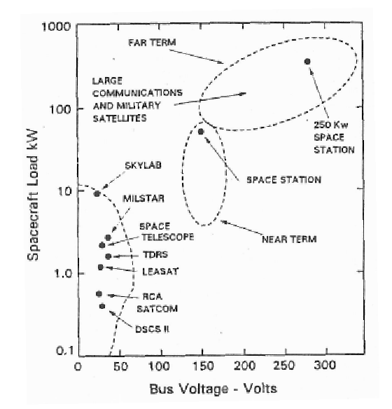

Figure 8-6 Current and future trends in spacecraft power and bus voltage requirements

0.3.5.1 Space Station Alpha Dielectric Thermal Control Coatings

Space Station Alpha (SSA) is being designed for 160 Volt arrays which may cause its structures to float as many as 140 Volts below the plasma potential. A diagram of this negatively grounded system is shown in Figure 8-7. For SSA, an anodized aluminum coating has been manufactured for passive thermal control. When designing the thermal control surface, the thermal emittance is directly related to the thickness of the anodic layer which in turn is related to the dielectric breakdown strength. To prevent internal cold spots,

the thermal emittance must be small indicating a thin anodic layer which is subject to breakdown. To meet the required emissivity values, the anodized layer is approximately 1-5 µm thick. As mentioned earlier, the structure of the station is about 140 Volts negative with respect to the ambient plasma. If the thin anodization layer has insufficient dielectric strength to withstand this voltage level, dielectric breakdown and arcing will occur.

Figure 8-7 Floating potential of SSA relative to the ambient plasma potential

The surface area of SSA will be very large. Each full size module will have an exposed surface area on the order of 200 m2. The thin anodization layer and large surface area will provide a capacitance on the order of 1000-3000 µF. All SSA structural elements will be connected electrically and will be capable of storing many joules of energy which can be released through arcs resulting in dielectric breakdown of the anodized surface. Even if the material has sufficient dielectric strength to prevent electrical breakdown, the energy will still be stored in the SSA capacitance. An event such as a micrometeoroid impact can provide a means by which this energy can be released in the form of an arc.

Laboratory experiments show that for an argon plasma of LEO densities, the breakdown threshold for the anodized surfaces is approximately -90 Volts. Discharges of the large capacitance energy stored in the SSA structure indicate that currents upward of 1000 Amps are possible which is capable of cratering the coatings down to the bare aluminum (i.e. completely through the anodized layer 1-5 µm thick). The debris from the craters can produce a contamination source for sensitive surfaces elsewhere on the station.

0.3.5.2 Spacecraft Charging in an Aurora

Little effort has been devoted to the study of LEO high-level spacecraft charging because of the rarity of its occurrence until the advent of SSA and the observations aboard the low-altitude (~ 840 km) Defense Meteorological Satellite Program (DMSP) F13 spacecraft. The DMSP spaccraft are a series of polar orbiting, sun synchronous satellites whose primary mission is to observe tropospheric weather. On May 5, 1995, the microwave imager instrument aboard DMSP F13 experienced a lockup of its microprocessing unit. The anomaly was attributed to an electrical malfunction caused by an electrostatic discharge on the vehicle. It occurred during an intense energetic electron precipitation event within a region of very low plasma density in the auroral zone. Plasma measurements indicate that the spacecraft frame charged to a voltage of 460 Volts within a few seconds. Calculations of the capacitance of the ungrounded thermal blankets covering the surface of the spacecraft are consistent with a surface charging time of a few seconds to reach several kilovolts. Subsequent electrostatic discharge led to the lockup.

- At the time of the lockup, the spacecraft was in darkness, the plasma density was low (below 104cm-3) and there was an extremely high flux of energetic electrons, 2.0 x 109 electrons/cm2 sec sr, at an energy above 31 keV. The precipitating electron current in the auroral zone was much higher than the thermal electron

and ion currents of the ambient plasma (three orders of magnitude larger ~ 5 µA/m2 compared to 85 nA/m2 for the thermal component). The fact that the spacecraft was in darkness was not important in this case since the photoelectron current density yield for Teflon (the outer surface of the thermal blankets) is 1 nA/cm2. The occurrence of large fluxes of high energy electrons is not a rare event in the aurora, and the driving factor that led to the spacecraft charging on DMSP F13 was the low-density region accompanying the aurora. Since the F13 spacecraft has a limited useful life in its present configuration, plans call for the raising of its orbital altitude where the plasma densities would be substantially lower which could lead to greater incidence of high-level charging.

Although spacecraft charging should not be ignored in LEO (especially for high voltage arrays or very large structures), it is usually of greatest concern in geosynchronous orbit. In GEO, the plasma temperature is much higher, and the plasma density is lower. Because of the higher plasma temperature, GEO spacecraft have been observed to charge to thousands of volts negative during periods of magnetospheric storms.

0.3.5.3 Geosynchronous Charging

At low ambient plasma densities, the ambient plasma is not capable of “bleeding off” or neutralizing (by the preferential collection of positive ions) transient charging to prevent discharging unlike the LEO environment. Any small perturbation, such as a sudden increase in energetic photons (contributing to photoelectrons) or precipitation along field lines (as is the case for the auroral zone even in LEO), which contributes to a larger plasma flux to a spacecraft than the ambient plasma flux can cause substantial charging in these low density regimes. A real problem in spacecraft charging above 4 RE (geosynchronous orbit is 6.6 RE) is their susceptibility to earthward streaming energetic charged particles along the magnetospheric tail. This is shown in Figure 8-8. At high altitudes, photoelectron effects and the perturbations of geomagnetic storms are the most significant factors in spacecraft charging.

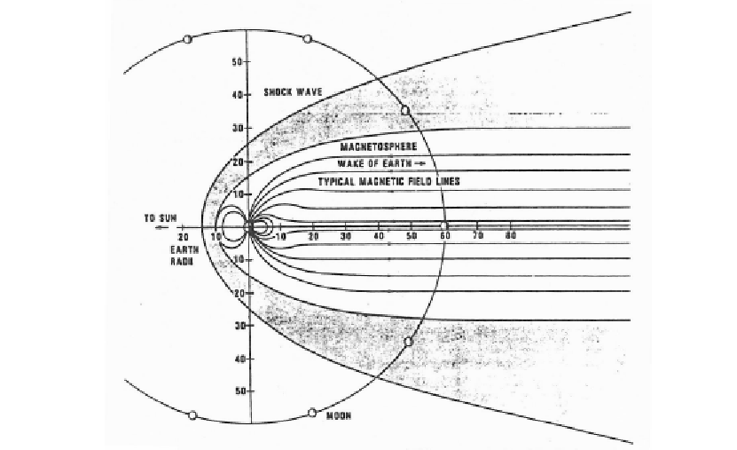

Figure 8-8 Cross section of the magnetosphere showing the approximate size in terms of RE

Illumination of spacecraft surfaces to energetic solar photons releases bound electrons from the surface. As the electrons are freed, the surface develops a relative positive charge. The electrons form a negative plasma sheath near the surface. Typically, there is a marked difference in conductivity across spacecraft surfaces which allows for the build up of the electron charge. The result is differential charging of the sunlit surface with respect to the unlit surfaces.

Vehicles at geosynchronous altitudes are also susceptible to plasma injection events associated with geomagnetic disturbances and substorms. These events occur several time a day, and may produce an order of magnitude increase in ion density and a three order of magnitude increase in electron density. These injections occur predominantly in the nighttime sector of the spacecraft orbit and results from an inward motion of the plasma sheet. The injected electrons drift eastward into the midnight-dawn sector, and the protons drift westward into the evening sector. The result is a sudden immersion of high altitude spacecraft in the magnetospheric tail plasma. The greatest particle fluxes are to be expected slightly above or below the geomagnetic equatorial plane. Charging is observed to be most apparent near local midnight (spacecraft time) and is nearly invisible to satellites operating on daytime meridians.

Observations suggest that during periods of low magnetic activity, geosynchronous spacecraft discharges are more common between 0400 and 0600 local spacecraft time. This is perhaps due to the drift direction for injected electrons. During high magnetic activity, noon local spacecraft time is the favored discharge time. This is due to the increased likelihood of encountering the magnetospheric boundary. Early evening (1900 local time) seems to yield the minimum probability of discharge. This is shown for a variety of real on orbit satellites in Figure 8-9. Discharging is seen to be triggered by sudden changes in the electrical environment of the spacecraft. This includes eclipsing (during the equinoxes), electronic activity on board the spacecraft and movement into or out of sunlight.

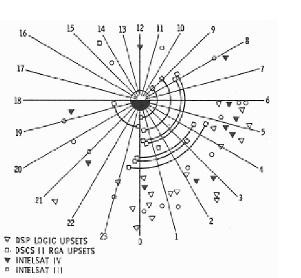

Figure 8-9 Local time dependence of circuit upsets for several DoD and commercial satellites

0.3.5.4 Spacecraft Charging at High Altitudes (SCATHA) Experiments

The P78-2 or SCATHA satellite was launched on 31 January 1975 to study the effects of high altitude charging on spacecraft. It was placed in an orbit which crossed geosynchronous altitudes with a perigee at 5.3 RE and an apogee of 7.8 RE. Its inclination was approximately 8° to the equatorial plane at apogee and perigee with an orbital period of 23.6 hours. From this, the spacecraft drifted around the Earth in approximately 70 days. The electrical properties of the P78-2 insulating materials were measured by a Satellite Surface Potential Monitor (SSPM) which measures the potential of six different materials relative to the spacecraft ground.

Figure 8-10 shows the charging levels of several dielectric materials during a natural charging event on 24 April 1979. Note that not only are these charging potentials very high (on the order of kilovolts) but the differential charging amount between the insulating surfaces in quite high in some cases. This is a situation conducive to arcing. Figure 8-11 shows a local satellite time of day histogram of the charging probabilities above spacecraft ground for near geosynchronous altitudes. The dominant charging region is the premidnight to pre-noon sector. The probability of charging to greater than 100 Volts maximized in the outer

regions of the SCATHA orbit near local morning (note the probability is greater than 0.5) whereas the charging of greater than 1000 Volts occurred at lower altitudes in the pre-midnight region. Figure 8-12 shows the spacecraft structure potential on the spacecrafts 87th day on orbit. It is interesting to note that the average potential is between 2 and 3 kV, much higher than that experienced in LEO.

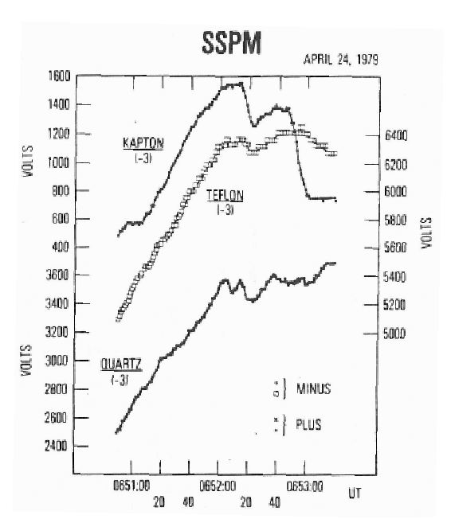

- Figure 8-10 Kapton, Teflon and quartz fabric charging levels on the SCATHA satellite during the 24 April 1979 charging event
- Figure 8-11 SCATHA SSPM near-geosynchronous charging. Graph shows the number of charging events above certain voltages as a function of the local satellite time

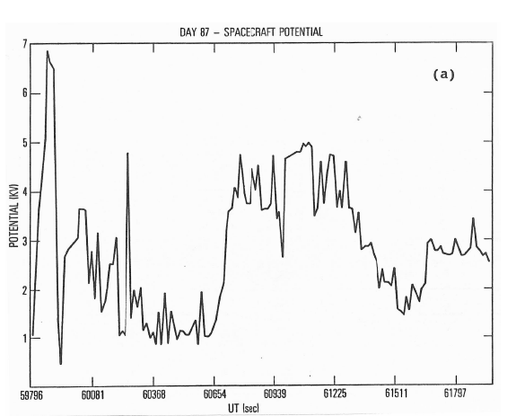

Figure 8-12 SCATHA spacecraft potential on a typical day in orbit (day 87)

For differential charging between insulating material and the spacecraft ground as indicated in the above figures, discharging is expected. Figure 8-13 shows the altitude and local satellite time distribution of discharge occurrence on the SCATHA satellite. A charging event on 26 May 1979 is shown in Figure 8-14. This plot shows the potential on a Kapton surface of the spacecraft relative to the spacecraft ground. The arrows on the time axis denote when discharges were observed. It should also be noted that the discharges continue until the source of the charge buildup is depleted.

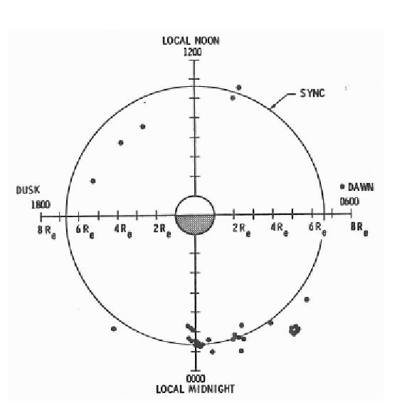

Figure 8-13 Orbital location for anomalies on the SCATHA satellite in local satellite time

Figure 8-14 Kapton thermal insulator charging voltage with respect to spacecraft ground. Arrows on time axis indicate when electrostatic discharges occurred.

0.3.5.5 Tracking and Data Relay Satellite (TDRS) Charging Anomalies

The Tracking and Data Relay Satellites TDRS-A (F-1), TDRS-C (F-3) and TDRS-D (F-4) have all experienced plasma environment-induced anomalies. It has been found that the TDRS anomalies were most likely caused by spacecraft charging based on the occurrence frequency, distribution in local spacecraft time and the plasma environment at the time of the anomalies. Figure 8-15 shows the local satellite time of several TDRS anomalies (note the similarity to Figure 8-13).

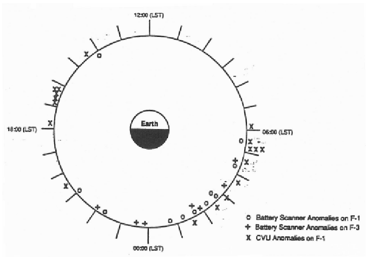

Figure 8-15 Orbital location for anomalies on TDRS satellites in local satellite time

It has been speculated that the cause of the TDRS and other anomalies steams from what is referred to as deep dielectric charging. Electrons with energies upward of 1 MeV have enough energy to penetrate deep

within satellite surfaces. This excess charge spreads out evenly over conducting surfaces, but the charge accumulates beneath dielectric surfaces resulting in uneven electric potentials (potential gradients) between different portions of the satellite. Eventually, potential differences exceed the breakdown threshold and an electrostatic discharge will occur. Unlike surface charging, deep dielectric charging can from strong potential gradients on the inside surfaces of the spacecraft; the resulting discharges can arc directly into the satellite’s internal electrical circuitry. If these discharges are strong enough, irreparable damage may ensue.

- 0.3.5.6 Electrostatic Discharges

The effects and causes of electrostatic discharges (ESD) will be discussed in this section. As the potential between two parts of a spacecraft increases, there is some critical potential difference for which an ESD is initiated. This is referred to as the sparking potential Vs. As will be seen, the discharge often takes place over large distances at low pressure and is often unpredictable in direction, strength (amount of current flow) and number (often several small discharges might be observed instead of one large discharge).

Figure 8-16 shows the situation of two flat plates (electrodes) separated by a gap of length d with a pressure of gas between the gap of p. As the voltage to the electrodes is increased, there becomes a minimum voltage for the given gap distance and pressure at which breakdown of the gas between the electrodes will occur. This minimum voltage is the sparking potential. In the case of the sparking potential, only a potential gradient is required. It is not necessary for a negative cathode and a positive anode to exist. The anode only needs to be positive (less negative) with respect to the cathode (or visa versa). Note that the situation in Figure 8-16 is exactly analogous to two spacecraft surfaces separated by some distance d being charged by a plasma. The sparking potential is a function of the gas in the gap and the term p times d (pd)

- as determined by Paschen’s Law.

Figure 8-16 electrostatic discharge configuration

- 0.3.5.7 Paschen’s Law and Paschen Curves

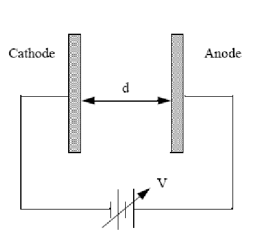

The sparking potential for a given gas between two electrodes is given by Paschen’s Law as

1

   =      

Apd V Bpd

(1.9)

ln s ln(1/ )

γ

where A, B and γ are constants for a given gas and must be experimentally determined. γ is the yield of secondary electrons from a given surface per incident positive ion. Values of A, B and γ are given in Table 8-3.

|Gas|A|B|γ*|
|---|---|---|---|
|Air|14.6|365|0.035|
|Ar|13.6|235|0.12|
|CO2|20.0|466|-|
|H2|5.0|130|0.095|
|H2O|12.9|289|-|
|He|2.8|34|0.021|

Table 8-3 Typical values of A, B and γ for a variety of gases. (* secondary yields for the given gas on aluminum electrodes; this value is material dependent and can vary widely.)

As can be seen in equation (8.9), the sparking potential for a given gas and a given material is only dependent on the term pd as found by Paschen in 1889. Actually, the gas number density n should be used instead of pressure to account for the effect of temperature at constant pressure on the mean free path in the gas. However, convention for the Paschen curve dictates the use of pd. Figure 8-17 and Figure 8-18 show the Paschen curves in terms of the sparking potential versus the term pd. Breakdown for a given pd occurs for voltages above the curves shown in the figures. A value of V for a given pd which yields a value below the curve will not form an ESD. From Figure 8-17, it is seen that the spark breakdown voltage has a minimum value at a critical value of pd. At low pressures, below the pd for minimum Vs, the spark discharge will take place over the longer of two paths because the larger path requires less voltage for breakdown. At sufficiently low pressures, advantage is taken of this fact for insulating purposes. Table 8-4 presents experimental values of the minimum sparking voltage, the corresponding pd and the ratio of the mean free path at atmospheric pressure divided by pd. These values can vary significantly depending on the electrode configuration, shape and material. Sharp edges and defects can enhance the possibilities for ESD.

- Figure 8-17 Spark breakdown voltage for plane parallel electrodes at T = 20° K (Paschen curve)

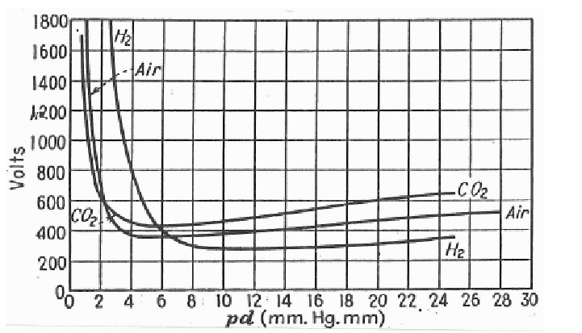

- Figure 8-18 breakdown voltage for plane-parallel electrodes in air at T = 20° C

|Gas|Vs minimum (Volts)|pd (Torr-cm)|λ/pd (x 10-5)|
|---|---|---|---|
|Air|327|0.567|1.7|
|Ar|137|0.9|1.1|
|H2|273|1.15|1.6|
|He|156|4.0|0.74|
|CO2|420|0.51|1.2|
|N2|251|0.67|1.4|
|O2|450|0.7|1.4|

Table 8-4 Minimum sparking constants for a variety of gases

- 0.3.5.8 Arcing

Arcing or sparking is nothing more than an ESD which occurs on a short time scale, usually with a large current flow and is not self sustaining. They can occur by the deposition of charge in dielectric materials by energetic particles in the process of spacecraft charging. Electrons between 10 and 100 keV lose energy

- at a rate of R = 106 to 5 x 107 eV cm2/g depending on the electron energy and the material involved. The energy loss per centimeter is given by Rρ (ρ is the material density); therefore, the incident energetic electrons penetrate the material to a depth of a few microns where they form a space charge layer. This charge builds up until a critical value is reached (by Paschen’s Law) wherein breakdown or arcing occurs. The breakdown is accompanied by material vaporization and ionization.

A discharge is initiated that propagates across the surface or through the material removing part of the bound charge. These discharges typically initiate at sharp edges such as in holes, cracks, seams or edges of the material. These discharges can cause serious damage to spacecraft material, components and operations.

It is very interesting to note that the sparking potential is dependent on the gas pressure for a given distance between two object at different potentials. Pressure increases around spacecraft occur for several reasons some of which were alluded to in a previous lecture on the vacuum environment. Satellite functions such

- as water dumps, thruster firings and temperature increases (outgassing) can cause temporary increases of the gas pressure near charged surfaces and solar panels, for example. These processes can enhance the possibility of arcing by reducing the minimum potential difference (Vs) required for an ESD. It is therefore necessary to consider the charged state of a spacecraft before performing such a function. If the increase in pressure is known from carefully considering the points laid out in Lecture 6 and analysis, the pressure

increase can also be used to make the spacecraft less susceptible to arcing. Care should be exercised to ensure that the minimum Vs from Figure 8-17 is not crossed.

- 0.3.5.9 Spacecraft Charging Design Considerations

This section contains some basic recommendations on design techniques that can be utilized in the hardening of spacecraft systems to charging effects. A more complete list can be found in the reference: Purvis, C., Garrett, H., Whittlesey, A. and Stevens, N. Design Guidelines for Assessing and Controlling Spacecraft Charging Effects. NASA Technical Paper 2361, Sept. 1984. Plasma contactor references can be found in the reference list accompanying these notes.

- 0.3.5.10 Material Selection and Grounding

In order to provide a low-impedance path for any electrostatically discharged currents, all structural and mechanical parts of the spacecraft should be commonly grounded. To minimize differential charging and the chances of discharge, all spacecraft exterior surfaces should be at least partially conductive. By the proper choice of available materials, the differential charging of surfaces can be minimized. However, typical spacecraft materials often include insulating films such as Mylar, Kapton, Teflon, fiberglass, quartz and other dielectric material. These materials should only be used when necessary, and care should be exercised in placing these materials in critical areas such as adjacent to receivers and antennas, sensitive detectors and areas where material contamination may be an issue.

At present, the only proven way to eliminate charging effects is by making all surfaces conductive and tying them to a common ground. This can be achieved for insulating material by adding thin metallic coatings. Care must be taken to ensure that the desired properties (i.e. for thermal control) of the underlying material are not adversely affected by the addition of the coatings.

The exterior materials should not be prone to excessive outgassing. In addition to the adverse effects of contamination, the increased pressure of outgassed molecules near a discharge site may induce arcing as seen in the Paschen curve above. Materials which exhibit low secondary emission of electrons from bombardment of energetic particles or photons are also desirable. This can reduce the charging effect in geosynchronous orbit immensely.

As with all design considerations, there are compromises to the selection of materials and components of a spacecraft. After all, a spacecraft which is not susceptible to contamination, atomic oxygen attack and spacecraft charging may not be useful or may cost a small fortune. An analogy can be drawn from the design of automobile to survive an accident. Auto manufactures can ensure the absolute safety of every individual driving on the highways with today’s technology. Unfortunately, the automobile required for this would be extremely expensive and achieve horrible gas mileage. This is as impractical as completely protecting a spacecraft in Earth orbit.

- 0.3.5.11 Plasma Contactors

As discussed above, an object placed in a space plasma collects and emits charged particles which can accumulate a net electric charge. A plasma contactor can serve to prevent the problem of charge accumulation by providing low-impedence electrical connections between spacecraft surfaces and the space environment. It can prevent both gross spacecraft charging and differential charging of isolated spacecraft surfaces. It serves to establish a firm reference potential (the local plasma potential) so the bias on an instrument (particularly plasma diagnostic instruments) will be known.

A plasma contactor is a discharge source (either a hollow-cathode device or even an ion thruster) where an expellent, usually xenon gas, is partially ionized by electron bombardment. The result is a dense, low temperature plasma that expands into the surrounding space driven by the quasineutral electric fields associated with the plasma density gradients. The electrons that exit the discharge source are immediately

thermalized (brought to thermodynamic equilibrium, i.e. a Maxwellian velocity distribution function is a reasonable approximation). The ions expand roughly into 2¼ str from the discharge source outlet orifice.

Contactors are used to create artificial (i.e. not ambient) plasma environments of sufficient density as to offset charging events. For example, a negatively biased spacecraft will preferrentially attract positive ions from the ambient atmosphere. In this case, the plasma contactor will supply a sufficient current of electrons to the local spacecraft environment to balance this positive current collection. In times of intense geosyncronous electron charging events, the contactor can supply an artificial positive ion concentration near the satellite to compensate (in part or in whole, depending on the level of the disruption) for this sudden increase in the electron flux. Typically contactors are seen as a means by which the spacecraft potential can be actively controlled. Several references in the list accompanying these notes can be found for plasma contactors.

- 0.3.5.12 The Benefits of the Plasma Environment

Although the known universe is almost entirely made up of plasma, we have only recently began to understand the benefits that plasmas can afford not only to the spacecraft engineer but to the manufacturing and semiconductor (to name only a few) communities as well. Although to this point the notes have addressed the ill effects of plasmas on spacecraft, the following sections will attempt to address the benefits of plasmas to the spacecraft engineer.

- 0.3.5.13 Plasma Processing

The plasma processesing of materials involves the combination of several sub-disciplines. Among these disciplines are sputtering, etching and deposition. Sputtering is the removal of bulk material due to heavy ion bombardment. Plasma etching is the removal of bulk material in very specific regions of a material usually with highly chemically reactive ions such as chlorine and fluorine. Deposition is the collecting of sputtered material onto a secondary surface to form very thin films on the order of atomic scales (several to thousands of monolayers). These processes are used by microelectronics manufactures for the production of microelectronic devices and integrated circuits. Chemical vapor deposition (CVD) has been used to produce such things as synthetic diamond films for protective coatings in many applications. Plasmas are also of use in nuclear reactors and present day experimental fusion devices.

- 0.3.5.14 Electrodynamic Tethers

Tethers in space can be used for a wide variety of applications such as power generation, propulsion and remote plasma environment sensing. In general, a tether is a long cable (even up to 100 km or more) that connects two or more spacecraft or scientific packages. Electrodynamic tethers are conducting wires that can be either insulated or bare that make use of the ambient magnetic field to induce a voltage drop across its length given by . For a 20 km tether in LEO, this voltage can fluctuate between 1500 and 5500 volts open circuit depending on the orbital inclination. If a current is allowed to circulate through the tether and some load, the power generated can be on the order of 15 to 30 kWatts. This power is generated, however, at a cost of orbital energy and altitude. An electrodynamic force , amounting to a few Newtons, is exerted on the tether lowering the orbit.

With a sufficiently large power supply on board the spacecraft, the direction of the current can be reversed and the tether becomes a thruster which will raise the orbital altitude. Thus the spacecraft can use the electrodynamic tether system as a pure power generator (with a small altitude control thruster to periodically make up for the drag), as a pure thruster or a combination of both roles.

- 0.3.5.15 Material Degradation by the Plasma Environment

In the same way that plasmas can be useful in plasma processing of materials, it can be devastating for materials on orbit. There are obvious problems with the loss of bulk material due to sputtering and arcing.

A materials adsorptivity and emissivity can change dramatically after exposure to a plamsa environment making passive thermal control difficult. Optical components exposed to plasma environments are not immune to the sputtering effect and changes in reflectivity and transmittance. Protective coatings are generally used to reduce these effects (protective coatings are not restricted to LEO where the atomic oxygen density is high). Each orbital altitude carries with it strick design criteria for mission success.

There are also synergistic effects between electron and neutral atomic oxygen degredation of a surface in a similar manner as photon/atomic oxygen synergism. The effect of electron impact in removing material from the bulk may condition the surface to oxidize more rapidly by allowing a higher adsorption and/or diffusion rate through the bulk material. The effect of the charge on the spacecraft surface in arranging polymer lattice structure which leads to accelerated atomic oxygen degradation is also being studied.
