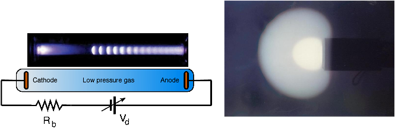
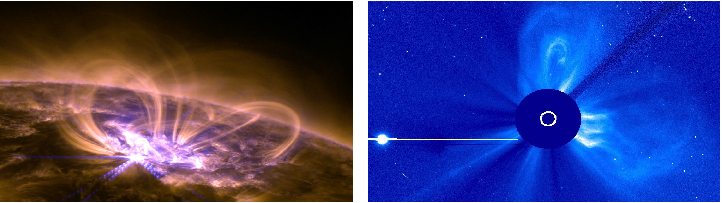
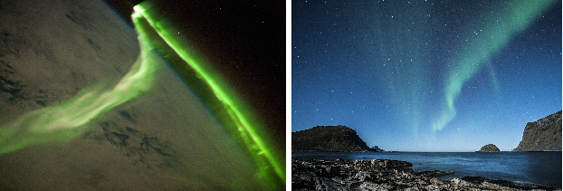
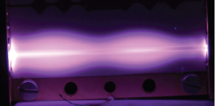
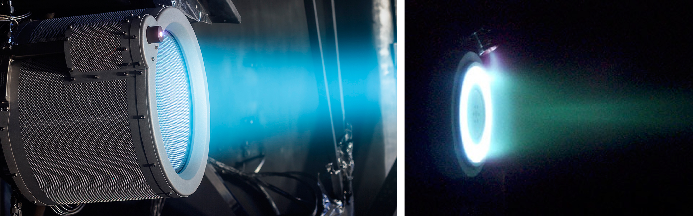

This content has been downloaded from IOPscience. Please scroll down to see the full text.

Download details:

IP Address: 73.229.112.93 This content was downloaded on 13/07/2021 at 03:23

Please note that terms and conditions apply.

You may also be interested in:

Modelling laser-matter interactions for simple molecules A. Galstyan, Yu.V. Popov, F. Mota-Furtado et al.

Laser-matter interaction in cluster medium in the radiation dominated regime N. Iwata, Y. Kishimoto, F. Wu et al.

Numerical modelling of Compton scattering in ultra-intense laser pulses C N Harvey and D G Green

Development of laser produced plasma diagnostics for the Megajoule Laser Facility and associated metrology R Marmoret, J Y Boutin, R Rosch et al.

The ELI-Nuclear Physics Project N V Zamfir

Comparison of Simulations of and Experiments on Femtosecond Laser Ablation of Nickel in Gaseous and Water Environments Jun Maehara, Yasufumi Yamada, Hiroshi Kumagai et al.

Twenty-two years of laser-matter work at Centre d'Etudes de Limeil-Valenton (CEL-V) CEL-V LASER RESEARCH Group

Hierarchical instability of a vortex ring array in multipulse laser-matter interactions Stjepan Lugomer and Yasuhide Fukumoto

Experimental characterization of the excitation state of picosecond laser-induced Tungsten plasmas Bastien Pérès, Vincent Morel, Arnaud Bultel et al.

IOP Concise Physics

### An Introduction to Plasma Physics and its Space Applications, Volume 1

Fundamentals and elementary processes Luis Conde

# Chapter 1

## Plasmas in space and in the laboratory

|Weakly ionized gases produced by low pressure electric discharges are examples of a plasma in our daily lives. These are used everywhere, such as for lighting fluorescent lamps or illuminated billboards. This introductory chapter provides a non-exhaustive overview of plasma phenomena in space and in the laboratory. We will focus on the properties of geophysical plasmas and those of interest in space technology applications.|
|---|

In a broad sense plasma physics studies systems are composed of a huge number of interacting particles (atoms, molecules, etc) where a significant quantity of them have electric charge. They can be constituted by atoms or molecules of different kinds that are also chemically active when are ionized. In the gas state particles are not attached to a fixed position and move under forces applied to the system, specifically, under the internal and external electromagnetic fields.

The typical gas pressures of our interest in space and/or astrophysical plasmas will generally be orders of magnitude below atmospheric pressure. To preserve the macroscopic charge neutrality, the number of ions (positive charges) ni and electrons ne per unit volume must both be very similar ne ≃ ni with an appreciable degree of ionization αg = n ni/ a where na is now the number density1 of neutral atoms or molecules. Plasma is said to be weakly ionized when the ionization degree is low αg ≪ 1 and partially ionized when αg < 1. When only charged particles are present (αg = 1) the plasma is fully ionized.

The characteristic plasma response takes place when the otherwise neutral gas turns out to be an electrically conductive medium and this transition can take place for ionization degrees as low as αg∼ 10−6. As we shall see, these conditions are met in physical systems as diverse as plasmas in space and astrophysical environments, the Earth ionosphere, laboratory electric discharges or controlled thermonuclear fusion experiments. The applications of plasmas in science and technology are countless [1]

1In the boxed note 1.1 we derive a practical relationship between na and the gas pressure and temperature.

doi:10.1088/2053-2571/aae132ch1 1-1 ª Morgan & Claypool Publishers 2018

|Box 1.1. Calculation of neutral gas densities  For the low gas pressures p of interest the state of the neutral gas can be approximated by the ideal gas law pV = N k Ta B where N is the number of atoms enclosed in the volume V. The density of neutral particles na = N Va/ is,  n − = = × k  p T  p T  [m ]  1  7.25 10  [Pa] a B [K]  3 22  where the pressure is in Pascals (Pa) and the temperature in Kelvin. Instead of the SI unit the readings in most pressure gauges are in mbars or Torrs (1 Pa = 7.5 × 10−3 Torr = 10−2 mbar) and using these units the above equation reads.  = ×  = ×  n −  p  T n  p  T  [m ] 7.25 10  [mbar] [K]  and  [m ] 9.66 10  [Torr] [K]  a  a  3 24  3 24  also in particles by cubic meter. The number of particles by cubic centimeter at the ambient temperature 20 °C as a function of the pressure is,  = ×  = ×  −  −  n  p  T n  p  T  [cm ] 2.44 10  [mbar] [K]  and  [cm ] 3.26 10   [Torr] [K]  a  a  3 16  3 16  The number of molecules by cubic centimeter at T = 273.15 K (0 °C) at atmospheric pressure is called the Loschmidt number and setting,  1 atm = 1.01 × 10 Pa5 = 1.013 × 10 mbar3 = 760 Torr  we obtain nL = 2.69 × 1019 particles by cubic centimeter.|
|---|

but we will mainly concern ourselves with the space environment and applications in aerospace technology.

At the atomic or molecular level, the transformation of a neutral gas into an ionized medium requires a high average kinetic energy per particle that is consumed in part by ionizing collisions, such as in ion or electron impact ionization,

+ ⇌ + +

+ − − +

A A e A A e A 2e A

+ ⇌ +

where A is a neutral atom or molecule and A+ the corresponding ion. In the steady state ionization degree αg is constant because the production of charged particles (ionization) is balanced by the reverse reaction (recombination) and additional charge loss mechanisms.

The ionizing particle requires a minimum amount of energy ΔE = Ei where Ei is the ionization threshold of the neutral atom and we can estimate the energy needed to maintain the ionization degree of a gas in the steady state. The number of atoms in one cubic meter of argon at atmospheric pressure is na = 2.69 × 1025 particles (see box 1.1) and assuming only 1/100 000 atoms are ionized (αg = 10−5) in the steady state we have ni = 2.69 × 1020 ions. The ionizing collision requires a minimum of EI = 15.8 eV (see table 6.2) which is equivalent to EI = 25.3 × 10−19 J and,

ΔEion = ni × Ei = (2.69 × 10 )20 × (25.3 × 10−19) = 680 J

is the minimum energy required to sustain the ionization degree in the steady state by cubic meter and second. Consequently, we need 680 W of energy input in order to sustain such a low ionization rate per cubic meter in the stationary state. This value represents a lower bound, in the first place atoms and electrons need to be accelerated up to the minimum speed required for an ionizing collision. Furthermore, we have not considered other energy consuming collisional processes, such as electron impact excitation, emission of light, etc, which will be introduced in chapter 6.

Therefore, the average energy per particle required to transform a neutral gas into a plasma by collisional ionization of an appreciable number of molecules is high, as shown by the scheme of figure 1.1(a) where the different equilibrium states of condensed matter as a function of the energy per particle are represented .

The kinetic energy per molecule 〈mv2/2〉 ∼ T is related to the temperature of the system, and consequently must be high to sustain the above collisional ionization reactions. The temperatures of plasmas and ionized gases are well over the critical point in the scheme of figure 1.1(b) and their equilibrium states in the schemes of figures 1.1(a) and are therefore limited to high temperatures. Because the average kinetic energy E and the high values of temperature T are closely related, it is customary to express the temperatures in units of energy (electron-volt) as shown in box 1.2.

#### 1.1 Plasmas in nature and in the laboratory

We introduced so far two basic physical parameters; the temperature T and the charged particle density n. Both can be used to roughly characterize the physical state of plasmas and ionized gases, similarly to other states of condensed matter in

- figure 1.1. In the scheme of figure 1.2 where different plasmas are classified, the charged

particle densities n are in ions by cubic centimeter and temperatures are in electronvolts (box 1.2; 1 eV = 11 600 K). The plasma densities n cover twenty five orders of magnitude (from 1 up to 1025 charges by cubic centimeter) and the temperatures extend along seven orders of magnitude (from 10 2 up to 105 eV).

Since kinetic energies and densities of plasma particles at distant points in figure

##### 1.2 are rather different, so too are their physical descriptions. To perceive the hugeextent of these values it is helpful to add to the diagram of figure 1.2 the points

Figure 1.1. The diagrams of the states of condensed matter in thermal equilibrium (not to scale). (a) Schematic of the different stages of condensed matter. In the scheme of figure (a) the average energies per particle ΔE1, ΔE2 and ΔE3 produce the transition between the equilibrium states. (b) The pressure-temperature diagram of the equilibrium states of condensed matter.

|Box 1.2. Calculation of plasma temperatures  The Kelvin scale is the absolute thermodynamic temperature unit in the MKSC sytem or International System of Units (SI, from the French Système International d’unités) and is used also with the electron-volt (1 eV = 1.6 × 10 19 J). The latter is practical for the high temperatures involved in plasma physics. The temperature corresponding to kB T = 1 eV is,  =  ×  =  × ×  T − =  e  k  1 V (1.6 10 ) (1.38 10 )  11 600 K (1.1)  B  19  23  and the ambient temperature (300 K) is 300/11 600 = 0.026 eV in energy units. The average kinetic energy per particle in three dimensions is, Eav = 3 k TB /2 and a plasma with a temperature of k TB = 2 eV has an average kinetic energy of Eav = 3 eV. In the following we will refer to the plasma temperatrures in either, electron-volts or Kelvin degrees, according to the context.|
|---|

corresponding to water n ≃ 2.1 × 1022 cm−3 at room temperature (0.025 eV) and air2 n ≃ 2.7 × 1019 cm−3 under STP conditions.

Readers have first hand experience of air and ordinary water densities that only differ by a factor 103, much lower than the range of plasma densities in figure 1.2. The typical densities of low pressure discharge plasmas of fluorescent lamps and bright billboards (n ∼ 1014 cm−3) we see in the streets are about 108 times denser than the Earth’s ionospheric plasma (n ∼ 106 cm−3). Having in mind the densities of air and ordinary water the reader can realize the dissimilar physical descriptions a 108 factor can introduce.

- 2This density of molecules is called Loschmidt number, see box 1.1.

Figure 1.2. The characteristic densities and temperatures of different plasmas.

The melting point of iron (1811 K) is about six times room temperature (300 K) and these values are helpful to grasp the huge range of temperatures in the scheme of

- figure 1.2. For example, the ionospheric plasmas (T ≃ 0.1 eV) in figure 1.2 are 1000 times colder than laser produced plasmas (T ∼ 100 eV).

Plasmas for basic science and those employed in technological applications are also found in the scheme of figure 1.2. High and low pressure electric discharges are in the origin of plasma physics research and technology. The Nobel laureate I Langmuir and L Tonks introduced in 1928 the concept of plasma in connection with the physical state of a partially ionized gas. Their original objective was to develop for General Electric Co. electric valves that could withstand large currents and when electrically connected, the low pressure inert gas inside would become partially ionized, affecting the current transport.

The early arc discharge plasmas between two carbon electrodes in air at atmospheric pressure were produced (1803) by Petrov in Russia and Humphrey Davy in Britain. The DC arc discharges transport high currents (1 105 A) with voltages typically below 50 V. These high pressure plasmas (pa ∼ 0.1 1.0 atmospheres) are characterized by low plasma temperatures (T∼ 0.1 1.0 eV) and high densities (n ∼ 1015−1020 cm−3) in figure 1.2. They have countless applications in different fields, such as metal welding, thermal cutting, or coating of materials and are an example of local thermodynamic equilibrium (LTE) plasmas that will be introduced later, in chapter 4. On the opposite limits in figure 1.2 are flames which in

- Figure 1.3. Plasma structures observed in low pressure glow discharges. On the left the ionization waves (striations) observed in a glow discharge and the electrical scheme of the discharge tube experiment. The right picture shows the stable structure of different plasmas coronas (bright zones) separated by double layers observed in low pressure glow discharges [2, 3].

most cases cannot be strictly considered as a plasma because of their low ionization degree.

Low pressure plasmas have been studied since the first observations of glow discharges in a tube invented by Geissler (1850) and later improved around 1869–75 by W Crookes and others. Figure 1.3 shows this simple experiment where two metal electrodes are connected to a DC power supply inside a glass tube filled with a rarefied gas (typical pressures are, 10 2−102 mbar). This discharge is characterized by high voltages (102−103 V), low currents (10−4−10−1 A) and the ionization of the neutral gas is produced by electrons emitted from the cold cathode by ion bombardment.

These low pressure discharges produce low density plasmas (n ∼ 1010−1014 cm−3) with higher temperatures (T ∼ 1–5 eV) than arc discharges. They have today also a number of applications such as fluorescent lamps, plasma-screen televisions and material plasma processing.

The dense and hot plasmas of different experiments for controlled thermonuclear fusion, such as plasma focus, the planned thermonuclear reactor3 or laser ignition are located in the scheme of figure 1.2 on the upper half, right side. This promising and challenging application of plasma physics is aimed at producing vast amounts of energy by the controlled fusion of a mixture of deuterium and tritium atoms.

Plasma heating and confinement to these energies still remains a challenging problem and active field of research. We can see in figure 1.2 that the plasma densities reached today in these experiments are around 1010−1013 cm−3 with temperatures of T ≅ 102−103. The design and operation of the future plasma fusion reactor is a scientific and technological challenge that requires intense international collaboration. Such a reactor would operate with plasmas where n = 1013−1016 cm−3 and T ≅ 0.5−1.0 × 104 eV.

- 3The International Thermonuclear Experimental Reactor (ITER) is under construction by an international consortium at Saint Paul-lez-Durance, France, the first plasma is planned by 2025.

The plasmas of interest for space applications are essentially on the lower half and left of figure 1.2 covering from low pressure discharges down to solar wind and from cold ionospheric plasmas up to hot Sun coronal plasma. The interplanetary medium is a diffuse plasma with low densities (n ∼ 103−104 cm−3) and high temperatures (T ∼ 100 eV) comparable to fusion experiments where densities are more than five orders of magnitude higher.

The ionospheric plasmas at altitudes of 100 1000 km over the Earth’s surface are cold (T ∼ 0.5−0.1 eV) and their densities are low (n ∼ 103−104 cm−3). However, this means, the outer space near the Earth has 1000 10 000 charged particles by cubic centimeter and these figures result in a large amount of matter when planetary length scales are considered.

Nevertheless, the scheme of figure 1.2 is not exhaustive and additional physical systems of interest for space science and technology that can be classified as plasmas are not included in this diagram. All share, however, the collective response to external perturbations involving a large number of charged particles and the basic properties that will be introduced in section 2.3. The schematic in figure 1.2 contains useful information and we will be return to it after introducing the basic physical plasma parameters in chapter 4.

#### 1.2 Solar plasmas

The interplanetary plasmas are essentially the result of a number of different physical processes of solar activity. The high density of matter and temperatures (T ∼ 107 eV) in the solar core ignite thermonuclear reactions and the energy produced is transported outwards by physical mechanisms such as radiation and convection.

The solar atmosphere is roughly divided in three layers, where the deepest observable zone is the photosphere (400 km deep T ∼ 0.6 eV at the bottom and 0.35 eV on top) next is the chromosphere (400 2100 km of thickness and T ∼ 0.35 eV 0.7 eV) and above the corona (from 2100 km with densities n ∼ 5 × 1017 cm 3 and temperatures T ∼ 69 138 eV) extends up to the interplanetary space.

The scape of coronal ionized gases is a consequence of the high temperature of stars; in the outermost corona this is in the order of 86 eV (106 K), and electrons have thermal speeds over the gravitational scape velocity. However, the massive ions have lower average velocities and, lacking electric charge balance, a large electric field appears that accelerates positive charges upwards, whereas the solar coronal expansion maintains the charge neutrality. The resulting flow of ionized particles moves along the interplanetary magnetic field lines, reaching the Earth orbit with speeds of 300 800 km s−1 and is called solar wind. The interplanetary magnetic field between the planets and the Sun is closely related to the expansion of the solar wind that produces currents of charged particles in space.

The Sun has a magnetic dipole field that completely reverts its direction in a period of about 11 years called solar cycle, where a maximum count of sunspots over the Sun’s surface is reached at the solar maximum. These sunspots are cooler, dark regions on the solar surface associated with eruptions where intense magnetic fields inhibit the energy

- Figure 1.4. Images of solar flare and coronal mass ejections observed under an optical filter. A mid level solar flare observed on September 8, 2017 (courtesy NASA) on the left and the coronal mass ejection of April 20, 2014 (courtesy ESA&NASA/SOHO).

transport from the solar interior. Sunspots are associated with explosive eruptions of energy and matter, having dimensions in the order of 104 km and magnetic fields within the range of 0.1–10 Teslas that confine and transport plasma flows. Around sunspots and in active regions are observed coronal loops also in figure 1.4 associated with closed magnetic field lines connecting regions of the solar surface.

The Sun emits a vast amount of electromagnetic radiation (visible light, x-rays, etc) during sudden changes of brightness called solar flares (SF) that last from minutes to hours. Figure 1.4 shows a mid-level solar flare observed at 131 and 171 Å4 extreme ultraviolet wavelengths, the most intense solar flares observed are about eight times bigger. The electromagnetic radiation is emitted in all directions from active regions close to sunspots and, traveling at the speed of light, reaches the Earth in minutes.

A different kind of eruption are the coronal mass ejections (CME) which release outwards from the Sun surface large amounts of high temperature plasmas soaked with magnetic field lines. These high energy magnetized plasmas move along a given direction with speeds in the range 100–3000 km s−1 and reach the Earth in 14–17 h. Both CME and SF eruptions appear frequently together and are related to the 11-year solar cycle and eject ionized matter into our planetary system.

The magnitude of CME eruptions can be appreciated in figure 1.4 where the event of April 20, 2013 is displayed. The central disk in the image blocks direct sunlight so we can observe the large amount of matter ejected indirectly illuminated by the Sun. The planet Venus orbiting around the Sun is the bright point on the left and this reference helps us to perceive the huge scale of this phenomenon that produces plasma jets that can reach the orbits of nearby planets.

#### 1.3 The Earth’s magnetosphere and ionosphere

The interplanetary space in the solar system is permeated by magnetic field lines of solar origin with a strength of 10−9 Tesla in the vicinity of the Earth. Electrons and ions ejected by the Sun are transported towards the Earth along these interplanetary magnetic field lines that are in turn influenced by the transport of charged particles.

4Unit of length usually employed for wavelengths one Ångström is equivalent to 10−10 m or 10−8 cm.

Magnetosheath

shock

Magnetopause

w

Bo

Polar cusp Magnetotail

###### Incoming solar wind particles

Plasma sheet Neutral sheet

Van Allen radiation belts

Magnetopause

Bow shock

Magnetosheath

- Figure 1.5. Scheme of the Earth’s magnetosphere where the solid red curves represent the geomagnetic field lines.

The Earth’s geomagnetic field is a centered magnetic dipole inclined 11° with respect to the planet axis that interacts with the solar wind. Other planets in our solar system (Mercury, Jupiter, Saturn and Neptune) are also magnetized bodies immersed in the expanding coronal atmosphere produced by solar activity. The solar wind is diverted around by the planetary magnetic field and large scale fluxes of charged particles called magnetospheres result from this interaction. The Earth’s surface is protected from jets of high energy particles by this complex structure, which is outlined in the scheme of figure 1.5.

The shape of the Earth’s magnetosphere is compressed on its daylight side at a distance 6 10 Earth radii5 where the magnetized solar wind produces a shock wave denominated by the bow shock (gray thick line in figure 1.5). Its dynamics is governed by collisionless plasma processes involving long-range electromagnetic interactions of charged particles, whereas molecular collisions are dominant in shock waves in ordinary gases.

The atmosphere, ionosphere and Van Allen radiation belts are enclosed by the magnetopause surface (thick blue line in figure 1.5) that marks the outer boundary of the magnetosphere. On the night side, the magnetotail extends along 1000 times the Earth’s radius and the plasma surrounding the region of tail currents is called the plasma sheath (figure 1.5 shows the green zone at the night side).

The magnetosheath is the region of space located about 10 Earth radii between the magnetopause and the bow shock (the gray zone facing the Sun in figure 1.5) where the energetic solar wind particles are slowed, and deviate around the Earth.

The two Van Allen radiation belts contains protons and electrons trapped by the planetary magnetic field within torus shaped regions around the equator (green areas in figure 1.5). The inner belt has an altitude of 0.2–2 RE and contains trapped

- 5The Earth’s radius is RE = 6378 km.

- Figure 1.6. The aurora or northern lights observed at polar latitudes. On the left, the aurora borealis seen from the space station (courtesy NASA) and these northern lights observed from the Earth ground in the right photograph.

electrons (E ∼ 100 keV) and protons with energies up to 100 MeV originated by the beta decay of neutrons produced by collisions of cosmic rays with atoms in the upper atmosphere. Due to the offset of geomagnetic field with the Earth’s geometric center the inner belt makes its closest approach over the south Atlantic. The outer belt located at altitudes between 3 10 RE is strongly influenced by the solar activity and is mainly composed of energetic electrons (0.1 10 MeV) and ions (0.1 10 MeV) trapped in the Earth magnetosphere.

Figure 1.5 shows the geomagnetic field providing a sort of shield deflecting the solar wind particles around the Earth. However, the ionosphere is connected with the magnetosheath through north and south polar cusps that provide direct access to the Earth’s ionosphere to solar wind particles that travel along the magnetic field lines. The luminous phenomenon of aurora shown in figure 1.6 results from the interaction of these energetic charges with atoms in the upper atmosphere at the northern and southern regions. These streamers and emissions of light come from atoms excited by electrons and charged particles accelerated along the geomagnetic field at polar regions.

Most planets in the solar system have an ionosphere connecting the high altitude atmosphere with the magnetosphere and outer space. The Earth’s ionosphere is a weakly ionized plasma present between 50 and 1000 km of altitude below the magnetosphere and orbiting spacecraft move immersed in this cold (T ⩽ 0.1 eV) and tenuous (n = 103−107 cm−3) plasma. In table 1.1 are summarized the main properties of ionospheric plasma for different altitudes and figure 1.7 shows its average daylight chemical composition which depends on the altitude, night/day cycle and the Sun’s activity.

Figure 1.7 shows the concentration of ions, electrons and neutral gases as a function of the altitude where the concentrations of electrons (red solid line) and ions are equal to preserve the electric neutrality. At high altitudes the concentration of atomic oxygen (O, O+) and light atoms (H, He and He+) dominates, whereas heavier molecular compounds (N+2, O2, O+2 and NO+) are found close to the Earth’s surface.

The maximum plasma density, called the F-region, corresponds to the peak electron concentration and is originated by maximum neutral gas ionization rate

Table 1.1. The characteristics of ionospheric plasmas for different altitudes from reference [4]. The temperatures of plasma species (neutral gas Ta, ions Ti and electrons Te) are in Kelvin and m¯i is the average molecular mass of ions in atomic mass units. The plasma density is no and λc is the mean free path for collisions of charged particles with neutral atoms.

Altitude (km) 150 200 400 800 1200 m¯i (amu) 28 24 20 14 10 no (cm−3) 3.0 × 105 4.0 × 105 1.0 × 106 1.0 × 105 1.0 × 104 λc (m) 5.0 × 103 1.0 × 103 1.0 × 103 1.0 × 104 1.0 × 105 Ta (K) 635 859 993 Ti (K) 700 1100 1600 2200 2600 Te (K) 1000 2000 2800 3000 3000

(essentially atomic oxygen) by the flux of extreme ultraviolet radiation. This F peak splits in two (F1 and 2) under certain circumstances and is responsible for reflecting high frequency radio communications in daytime back to the Earth’s surface. Other layers (E, D, C) develop below originated by the absorption of different parts of the solar radiation spectrum.

#### 1.4 Plasma physics and space technology

The plasmas for space technological applications are mainly produced in the laboratory and are located approximately in the center of the diagram 1.2 covering low pressure plasmas produced by different electric discharges.

Plasma physics has been related to space technology since the first flights of human made satellites as they move in low and medium Earth orbits immersed in the ionosphere. For example, electrostatic discharges inside the cameras on board the first US reconnaissance satellites (Corona program, June 1959 [5]) were responsible for irregular bright streaks and fogging in the photographs returned to Earth. This effect was corrected by improved electrical grounding of components and a cleaner environment. The plasma physics applications in aerospace technology are countless and here we will discuss only a few of them.

The interaction of the environment space plasma can take place in many different ways. Ambient electrons and/or ions can also be accelerated by DC electric potentials that power plasma exposed electrodes or payloads, such as solar panels. The collisions with satellite surfaces can produce additional charges by ionization and/or secondary electron emission by the walls in an explosive charge multiplication.

The interaction of orbiting satellites with the plasma environment of figure 1.7 can produce the accumulation of electric charge on exposed metallic surfaces or inside dielectric materials. Furthermore, direct UV sunlight or the impact of high energy ions and electrons can produce the secondary electron emission from exposed surfaces. Therefore, the electric potential of the satellite, (or parts of it) changes with respect to its surroundings and this effect denominated spacecraft

e

1000

He+

O+

- N2
- O

500

Altitude (km)

- N

+

NO+

- O2+

H+

300

O2

He

200

N+2

Ar

100

103 104 105 106 107 108

Density (part. / cm3)

- Figure 1.7. The altitude dependent chemical composition of the Earth s ionosphere at the daylight side from reference [4].

charging, can trigger electric discharges or damage crucial electronic components that can seriously compromise the mission. Its mitigation involves careful design, electrical grounding or even the use of hollow cathode devices that eject into space a low impedance plasma flow to return the excess of accumulated charge to the ionosphere [6].

The large concentration of electromagnetic energy within small volumes of communication equipment, such as antennas, multiplexers, etc, can energize free ambient electrons that ionize the neutral gas and/or the emission of secondary particles which originate the avalanche production of charges. Two different processes contribute to the radio frequency (RF) breakdown. First, the electron impact ionization of the neutral gas in the open spaces of the microwave devices by free electrons accelerated by the RF electric field. Second, the collision of these energized electrons with the walls of the equipment may also produce additional charges by secondary electron emission. The weight of each charge production mechanism depends on the neutral gas pressure, the magnitude of the RF electric field and the properties of materials used for microwave components.

For very low gas pressures the contribution of collisional ionization is negligible and the electron avalanche essentially depends on the secondary electron emission from the surfaces produced by the impact of free electrons accelerated by the RF electric field. This material-dependent RF breakdown is the denominated multipactor. The contribution of secondary electrons is negligible at higher pressures where the electron impact ionization which is proportional to the gas pressure dominates. This collisional RF breakdown depends on the nature of the gas and produces a plasma of electrons and ions shown in figure 1.86 (n ∼ 108−1012 cm−3 and T ∼ 1–10 eV) similar to glow discharges. Both electric breakdown processes are mostly unwanted because they can damage and/or prevent the operation of expensive equipment.

- 6This high frequency RF breakdown is currently denominated corona in the technical literature and should be not be confused with the low frequency or DC corona discharge, see chapter 12 of reference [7].

The propulsion of spacecraft in outer space using plasma beams is current;y proving to be a growing technology. Rocket engines operate according to the basic principle of action and reaction where the speed vex of gas (or plasma) jet speed is crucial for momentum transfer. This velocity is bounded in classical chemical thrusters by the energy per unit of mass stored in the propellant. Plasma propulsion systems overcome this limitation by accelerating plasma flows (also denominated plasma plumes) to exhaust speeds one or two orders of magnitude faster using electromagnetic fields. This characteristic drastically reduces the amount of propellant, allowing for longer mission times and heavier payloads. The disadvantage is the low mass ion production rate which is constrained by the reduced electric power that can be made available on board, which limits the maximum achievable thrusts to the order of hundreds of milli-Newtons.

However, the fast exhaust speeds allow for a longer mission time and a heavier payload because they dramatically reduce the amount of required propellant. Plasma thrusters for space propulsion are cold (T ∼ 0.1–3 eV) and dense (n ∼ 1012−1014 cm−3) and to date more than 700 models have been flown for orbital maneuvers, station keeping, flight formation and/or end-of-life disposal of Earthorbiting satellites.

Electric propulsion is today a growing field where advances are constantly being made and new prototypes are introduced every year. Figure 1.9 shows two well

Figure 1.8. The RF breakdown around a microwave component under test. (Courtesy ESA.)

Figure 1.9. Two different plasma thrusters operating in a vacuum tank at low pressure. On the left, the gridded ion engine T6 (courtesy Quinetiq UK) and the Hall effect thruster PPS-500 on the right side (courtesy SafranSnecma, France).

established plasma thruster configurations operating in a vacuum chamber at a low gas pressure. The gridded ion engine of figure 1.9 makes use of parallel metallic meshes biased to high DC potentials to accelerate the ions up to supersonic speeds. The Hall thruster of figure 1.9 has a strong magnetic field perpendicular to the ion outflow that makes the electrons drift into circular paths within the plasma (bright ring in the figure) and the ions are accelerated in the crossed electric and magnetic field.

#### 1.5 Commentaries and further reading

An excellent overview of the applications of plasmas in different fields of science and technology is the recent 2017 plasma roadmap [1]. This exhaustive and strategic report analyzes the perspective of low temperature plasma experts in fields as varied as plasma surface interaction, space propulsion, aerospace applications or plasma synthesis of nanomaterials. The book [8] discusses the plasma physics principles and its applications in different fields of industry.

An overview of the ITER project can be found at its website http://www.iter.org/ . The book [7] is a comprehensive reference on gas discharge physics and low pressure glow discharges are discussed in [7, 9], and in [10] the physical characteristics of the structure observed in figure 1.3(a). The multiple double layer structure of figure 1.3(b) is discussed in references [2] and [3].

The book [11] gives an excellent account on the physics of space plasmas. The comprehensive reference [12] contains independent articles regarding the structure of planetary ionospheres and [13], the Earth’s magnetosphere or the aurora and the auroral ionosphere [14]. The review [15] discuss characteristics of the Sun’s activity in connection with the solar magnetic field. The book [16] is a good reference for further study of the structure of Earth’s ionosphere and magnetosphere. Finally, the basic plasma physics involved in space propulsion and new developments is discussed in references [17, 18].

#### References

- [1] Adamovich I et al 2017 The 2017 plasma roadmap: Low temperature plasma science and technology J. Phys. D: Appl. Phys. 50
- [2] Conde L and Leon L 1994 Multiple double layers in a glow discharge Phys. Plasmas 1 2441–7
- [3] Conde L and Leon L 1999 Visual observation of multiple double layers IEEE Trans. Plasma Sci. 27 80 4
- [4] Stone N H 1981 The aerodynamics of bodies in rarefied ionized gas with applications to spacecraft environmental dynamics Technical report NASA technical paper
- [5] Dwayne A, Logsdon M J and Latell B 1998 Eye in the Sky. The History of Corona Spy Satellites (Washington, DC: Smithsonian Institution)
- [6] Kovaleski S, Patterson M, Soulas G and Sarver-Verhey T 2001 A review of testing of hollow cathodes for the international space station plasma contactor Proc. of the 27th Int. Electric Propulsion Conf. (Pasadena, CA) IEPC paper 01-271.
- [7] Raizer Y P 1991 Gas Discharge Physics (Berlin: Springer)
- [8] Roth J R 1995 Industrial Plasma Engineering vol 1 (Bristol: Institute of Physics Publishing)
- [9] Braithwaite N S J 2000 Introduction to gas discharges Plasma Sour. Sci. Technol. 9 517 27

- [10] Brown S C 1994 Basic Data of Plasma Physics. The Fundamental Data on Electrical Discharges in Gases, American Vacuum Society Classics 2nd edn (New York: AIP)
- [11] Parks G K 2004 Physics of Space Plasmas. An Introduction 2nd edn (Redwood City, CA: Addison Wesley)
- [12] Kivelson M G and Russel C T 1995 Introduction to Space Physics (New York: Cambridge University Press)
- [13] Luhmann J 1995 Ionospheres Introduction to Space Physics ed M G Kivelson and C T Russel (New York: Cambridge University Press) ch 7, pp 183 202
- [14] Carlson H and Egelang A 1995 The aurora and the auroral ionosphere Introduction to Space Physics ed M G Kivelson and C T Russel (New York: Cambridge University Press) ch 14, pp 459–500
- [15] Priest E 1995 The Sun and its magnetohydrodynamics Introduction to Space Physics ed M G Kivelson and C T Russel (New York: Cambridge University Press) ch 3, pp 58–89
- [16] Kelley M C 1989 The Earth’s Ionosphere: Plasma Physics and Electrodynamics, International Geophysical Series (San Diego, CA: Academic)
- [17] Jahn R G 2006 Physics of Electric Propulsion 2nd edn (New York: Dover)
- [18] Goebel D M and Katz I 2008 Fundamentals of Electric Propulsion. Ion and Hall Thrusters (Hoboken, NJ: Wiley)
