# Space Plasma Physics

B. Hultqvist

, G. Paschmann

, R.A. Treumann

, D. Sibeck

, T. Terasawa

a

b,c

d

e

and L. Zelenyi

b

f

Swedish Institute of Space Physics, Kiruna, Sweden

a

Max-Planck-Institut für extraterrestrische Physik, Garching, Germany

b

International Space Science Institute, Bern, Switzerland

c

NASA/Goddard Space Flight Center, Greenbelt, USA

d

Dept. Earth Planet. Science, Unversity of Tokyo, Tokyo, Japan

e

Space Research Institute (IKI), Russian Academy of Sciences, Moscow

f

### Introduction

Almost all the matter in near-Earth space is highly if not fully ionized and thus dominated by electromagnetic forces. Such matter is in the fourth state of matter, the plasma state, which on Earth is rarely accessible in comparable purity. Its investigation requires the use of either rockets or spacecraft.

Space plasma physics dominated research in the space sciences during the first two decades after Sputnik and still remains one of the largest research fields in terms of the number of scientists involved. As such, it has played a major role in the programme at ISSI during its first ten years. Today near-Earth space has become a “laboratory” in which to study plasma physics.

The space-plasma-physics field has reached a certain degree of maturity during the space era, but is still a young research field in the sense that unexpected observations from all new space missions continue to surprise. The physics of space plasma has been found to be complex. It is impossible to derive more than very limited conclusions from basic principles alone. Theory needs strong guidance from experiments in order to stay on track. On the other hand, the limitations of the observational possibilities in space, with its enormous spatial dimensions and temporal variations, make theoretical and numerical models essential for the interpretation of the observations. The fact that important new results come as surprises means that many models are still in an early stage.

Among the space sciences, space plasma physics is nevertheless at an advanced stage. Detailed experiments aimed at clarifying specific physical problems are

The Solar System and Beyond: Ten Years of ISSI

needed and are possible to perform in the “laboratory” of near space by launching small, specialised satellites, with high-resolution instruments onboard, into the right orbits. The high temporal and spatial resolutions of some recent plasma instruments have led to the opening of new parameter spaces for measurements. During the first ten years of ISSI, for instance, the small satellites Freja (Sweden/Germany) and FAST (USA) are examples of projects that have provided experimental data with much more temporal and spatial structures than have been available before. New dimensions have been introduced by ESA’s four Cluster satellites, which for the first time allow for the direct determination of vector quantities in space.

ISSI’s role in developing space plasma physics has been to bring together groups of scientists to discuss and summarise the current understanding of specific physical problems or sub-fields and, most importantly, to integrate, generally for the first time, major bodies of experimental and theoretical results, involving the World’s leading scientists who have worked in the field. Some important new results have come out of these integrating efforts.

At ISSI, teams, working groups and workshop projects have covered a wide spectrum of subjects in space plasma physics, ranging from the very specialised to broad research areas. It is, of course, not possible to report all of the results here, so we have selected below a number of topics to which major efforts have been devoted within the ISSI programme.

### Source and Loss Processes of Magnetospheric Plasma

Before the first ion-composition measurements of magnetospheric plasma were made, there was a general belief among space physicists that the ionosphere is negligible as a plasma source for the magnetosphere and that all plasma in the magnetosphere is of solar-wind origin. That view was based on the fact that most of the processes for transporting ionospheric plasma into the magnetosphere were unknown at the time, and have only been discovered later. When the Lockheed group launched its first ion mass-spectrometer on a small US military low-orbiting satellite in the late 1960s, they found that the keV ions, which precipitated into the atmosphere from the magnetosphere, contained an appreciable fraction of O

ions, which can only originate in the ionosphere. These results were so surprising that they did not dare to publish them until they had launched another ion mass-spectrometer on another similar satellite and found the same results

+

. Another small military research satellite, S3-3, was launched in 1976 into an elliptic polar orbit with an 8000 km apogee at high latitudes, and it produced surprising results showing field-aligned ion beams, with a large fraction

1

. When the first ion mass-spectrometer was sent into the central magnetosphere on ESA’s GEOS-1 spacecraft by the Bern group in 1977, they could conclude that the ionosphere is a source of similar importance to the solar wind in the region of the magnetosphere reached by GEOS-1, i.e. within about 8 RE geocentric distance

of O

ions, coming out of the ionosphere

+

2

. On the basis of further satellite measurements it was even argued by some scientists

3

that the ionospheric source could provide all the plasma seen in the magnetosphere up until then (not including the tail). This was thus a 180° change of view compared with that generally held before the launch of the first ion mass-spectrometer. Such was the situation in 1996 when ISSI initiated a study project on “Source and Loss Processes of Magnetospheric Plasma”

4

. Plasma sources

5,6

By then, many years of direct measurements at the magnetosphere’s inner boundary of the ionospheric ion outflow into the magnetosphere had shown a total ion outflow amounting to 2 × 10

to 3 × 10

s

to 10

s

for H

and to 0.5 × 10

s

25

-1

26

-1

+

25

-1

at low and high levels of solar and magnetic activity, respectively

s

for O

26

-1

+

.

6,7

It is known from ion-composition measurements in the magnetosphere that the solar wind is an important source of magnetospheric plasma. For instance, fairly large amounts of He

ions, which cannot come from the ionosphere, are always present. This demonstrates definitively that the outer boundary of the magnetosphere, the magnetopause, is not an impenetrable boundary for solarwind plasma. Direct measurements of solar-wind plasma transport across the magnetopause are, however, exceedingly difficult to make because the plasma flow and the magnetic field are essentially directed tangential to the magnetopause. Any transport of plasma across the magnetopause is only a small perturbation on the tangential transport. This is contrary to the ionospheric-outflow case, where the outflow is aligned with the more or less undisturbed magnetic field and is usually the dominant component. Any measurements apply only locally and it is clear that the direct determination of the total transport of plasma into the magnetosphere, in a way analogous to what has been done for the ionosphere, i.e. by direct in-situ measurements distributed over the entire magnetopause, is not possible. Instead indirect methods have to be used.

2+

Of the physical processes that may contribute to the transport of plasma across the magnetopause, magnetic reconnection is the one most studied and best supported by experimental results. It also provides the largest number of testable predictions among all the mechanisms that have been discussed. In the magnetic reconnection model, the “frozen-in” condition of plasma and magnetic field, in which low-energy plasma (but not energetic particles) and magnetic field lines

can be considered as moving together (the field lines “stick” to the plasma elements), is violated only in a localised region, called the “diffusion region”, where fields may diffuse and become interconnected. Outside of the diffusion region the frozen-in condition is a good approximation everywhere in the magnetosphere and the solar wind, except in regions with a magnetic-field-aligned electric field, such as other diffusion regions in the magnetotail and in auroral acceleration regions near Earth. Reconnected field lines stay connected when they are pulled along the magnetopause into the tail by the solar wind. As it is much easier for charged particles to move along magnetic field lines than perpendicular to them, particles can fairly easily move from the solar-wind side to the magnetosphere side of the magnetopause.

Estimates of the total inflow rate across the dayside magnetopause give the order of magnitude 10

s

, which corresponds to a mass influx of approximately

26

-1

- 1 kg s

. This inflow rate has the same order of magnitude as the total outflow from the ionosphere. For the tail magnetopause no direct observational results have been reported, so in order to arrive at an estimate of the total solar-wind plasma entrance rate through the magnetopause of the magnetotail we have to use other observational results from the tail.

-1

Only data from the passages of ISEE-3, Pioneer-7, and Geotail through the distant tail have been reported in the literature. Although the number of spacecraft passes through the distant tail is limited, the published data provide a consistent picture of the ion flow through the tail. From the ISEE-3 observations, the following fluxes of anti-sunward-moving ions for different down-tail distance ranges have been derived: 2 × 10

s

in the distance range 0-60 RE, 7 × 10

s

26

-1

26

-1

at 60-120 RE from Earth, 2 × 10

for 120-180 RE and somewhere between 3 × 10

s

27

-1

beyond 180 RE. Recently reported Geotail observations have given results entirely consistent with these numbers. About 1000 RE down-tail, magnetotail densities and velocities, observed during a single passage of Pioneer-7, correspond to an anti-sunward flux of about 6 × 10

s

and 3 × 10

s

27

-1

28

-1

s

.

28

-1

From the above data, one clear conclusion can be drawn: namely that the supply rate of plasma through the dayside magnetopause and from the ionosphere (both of order 10

) are orders of magnitude too small to account for the anti-sunward plasma flow through the deep tail. Therefore, plasma has to enter the magnetosphere elsewhere at high rates; along the magnetotail is the only remaining alternative. The reconnection model provides the required free access of plasma along a part of the tail magnetopause. Other mechanisms for transferring plasma across the magnetopause, which may contribute to the transport, are not likely to provide the required amounts of plasma, simply because they only work locally and the known ones do not provide the kind of free access that the reconnection does.

s

26

-1

A consequence of the situation sketched above is that most of the solar-wind plasma that enters the magnetosphere streams along the tail and out through the distant throat back into the interplanetary space, without affecting the closedfield-line region around Earth (see Fig. 1).

Plasma sinks

The high-latitude ionosphere is not only a source of magnetospheric plasma, but also a sink. Magnetospheric ions and electrons precipitate into the upper atmosphere primarily in the auroral regions, but also in the polar caps. In order to reach the atmosphere, ions and electrons must have velocities nearly parallel to the geomagnetic field, since they will otherwise be reflected above the atmosphere by the magnetic mirror force. The directions relative to the magnetic field for which ions can precipitate into the atmosphere (in practice, they reach about 100 km altitude) define the loss cone. At auroral latitudes, the loss cone as seen near the equatorial plane is generally quite small (cone half angle 1-4°).

Statistical investigations have demonstrated that the total average flux into both hemispheres is 2 × 10

for ions (with energies between 30 eV and 30 keV) and 1 × 10

to 1 × 10

s

24

25

-1

(for 50 eV to 20 keV energies) for electrons, with the higher numbers corresponding to higher magnetospheric disturbance levels

s

to 6 × 10

s

26

-1

26

-1

. Comparison of these numbers with the total outflow figures given in the previous section shows that the total ion outflow rate is an order of magnitude larger than the total ion precipitation rate. The magnetosphere thus returns to the upper atmosphere much less plasma than it extracts from it. This is not surprising considering that generally all ionospheric ions that achieve sufficient speed to escape from the gravitational field have free access to the magnetosphere, whereas ions must have a velocity direction within the small loss cone in order to precipitate.

8

As for the transport of plasma into the magnetosphere across the magnetopause, it is not possible to evaluate the total loss rate of plasma from the magnetosphere through the magnetopause from direct in-situ measurements. Observations of both energetic ions and electrons outside the magnetopause have been reported and it seems likely that they come from the magnetosphere, but no quantitative flow numbers are available. Assuming that the reconnection model discussed earlier is applicable, a simple estimate can be made. For a southward-directed interplanetary magnetic field, the uniform electric field on the two sides of the magnetopause that is implied by the reconnection model pushes the plasma on both sides towards the magnetopause at equal speeds if the magnetic field strengths on the two sides are equal. In this case, the ratio of inflow and outflow scales as the ratio of the number densities on the two sides. As the number density of the magnetospheric plasma is typically one order of magnitude less than

that of the solar-wind plasma outside the magnetopause, the outflow of magnetospheric plasma due to reconnection is expected to be an order of magnitude smaller than the inflow. For an inflow through the dayside magnetopause on order 10

(see previous section), the total ion outflow through the dayside magnetopause will be of the order of 10

s

26

-1

. The dayside magnetic-field intensity on the inner side of the magnetopause is generally stronger than that on the outside, and the outflow rate is correspondingly reduced according to this rough way of estimating. We thus see that, as in the case of the ionosphere, more plasma is provided to the magnetosphere across the magnetopause than is lost through it. This imbalance is removed by the high rate of plasma loss through the deep tail exhaust already described in a previous section.

s

25

-1

Conclusions from the balance of sources and losses As mentioned earlier, the anti-sunward ion flow in the magnetotail has been found to increase with distance from Earth, from 2 × 10

in the near-Earth tail to (3 - 30) × 10

s

26

-1

at 1000 RE. Contrary to what was argued by some research groups in the 1980s (see above), none of the measured or quantitatively estimated sources near Earth can provide such large ion fluxes, so we concluded that solar-wind plasma must enter all along the tail magnetopause. We thus have a situation where the strength of a plasma source that has not been directly observed is defined by the requirements of an observed plasma sink in the deep magnetotail. Regions with reconnected field lines along the entire tail on both sides of it may match the down-tail loss. Using large-scale simulations, the total inflow of solar-wind plasma along reconnected field lines has recently been calculated and the result is consistent with the measured outflow along the tail

s

beyond 180 RE and even 6 × 10

s

27

-1

28

-1

.

9

A summary of source and loss rates for different parts of the inner and outer boundaries of the magnetosphere is given in Table 1

. The underlined numbers are based on direct measurements. The others are estimated as indicated earlier. Figure 1 contains a schematic summary of some of the information presented above. The balance between source and loss processes is a dynamic one, with significant variations in the efficiency of the various processes at the various boundaries, depending on the flow speed and density of the solar wind, the direction of the interplanetary magnetic field, the height distributions of plasma density and temperature in the upper ionosphere, etc. Table 1 and Figure 1 show average numbers.

6

The observed total flow of solar-wind ions through the magnetosphere, amounting to the order of 10

, is not more than an order of magnitude less than the undisturbed solar-wind flow through an area the size of the magnetospheric cross-section. Only a small fraction of the solar-wind ions affect the closed-

s

28

-1

VSW

Auroral Outflow

IMF

MP

X

Cusp

LLBL

Lobe

Plasma Mantle

X-Line

Plasma Sheet Neutral Sheet

Plasmoid

UWI

Polar Wind

Magnetopause

+10 0 -60 -120 -180 -1000 RE

Figure 1. Two-dimensional view (not to scale) of the magnetosphere, showing the magnetic field and plasma configurations and the three main plasma sources/losses. These processes are magnetopause and tail reconnection and plasma flow from and to the ionosphere. The plasma flow is indicated by arrows, blue for solar-wind plasma and violet for ionospheric plasma. The blue lines with arrows show the magnetic field lines (after Figure 7.1 in Ref. 6).

field-line region in the magnetosphere, i.e. the plasma sheet earthward of the reconnection region in the tail, and the dayside magnetosphere. The source strength for that region is two orders of magnitude less, i.e. 10

. The ionosphere and the solar wind both contribute significantly to the plasma content there, but the proportions vary with magnetospheric disturbance level and solarcycle phase. The dominant sink for this region is the same as that for the solarwind-dominated plasma outside the closed-field-line region, namely the downtail flow out of the magnetosphere. The ionosphere is the dominating plasma source in a region of the magnetosphere near Earth.

s

26

-1

Source rates Loss rates High-latitude ionosphere 10

10

26

25

Plasmasphere << 10

< 10

26

25

Magnetopause, dayside 10

10

26

25

Magnetopause, along magnetotail 10

? Deep tail “exhaust pipe” ? 10

– 10

28

29

– 10

28

29

Table 1. Summary of Source and Loss Rates (per second, orders of magnitude). Underlined numbers are based on direct measurements.

, which for the first time brought experts on and data from the various boundary regions together and produced an integrated view of the problem based on direct observations. The conclusion – that the main source region for the plasma in the magnetosphere as a whole is the tail magnetopause – is consistent with the reconnection model. It is an example of ISSI, in its integrating role, being able to conclude a longlasting discussion.

The results reported here came out of the ISSI study project

6

### The Aurora

The aurora is one of the most spectacular visible natural phenomena, and at the same time one of the richest and most fascinating subjects in all of space plasma physics. While the aurora is one of the directly observable manifestations of the Sun-Earth connection chain, the underlying plasma processes are expected to be ubiquitous in the plasma universe.

Auroral light is produced when electrons and protons impinging on Earth’s upper atmosphere excite the atmospheric atoms and molecules. In the night-side auroral oval, this usually occurs in the form of auroral arcs, narrow structures oriented tangential to magnetic latitude circles, a few hundred metres to several tens of kilometres wide in latitude, while extending several thousand kilometres in longitude. The arc often displays a relatively sharp lower boundary at around 100 km altitude.

Key questions regarding the origin of the aurora concern the relationship between auroral displays and the large-scale magnetospheric current systems and boundaries, and, most importantly, the nature of the process that accelerates the primary auroral particles. Recent high-resolution in-situ observations from satellites (notably Viking, Freja, and FAST) and sounding rockets, together with remote-sensing of the optical auroral displays, have led to large steps forward in answering these questions. The time therefore seemed ripe to gather a team of experts at ISSI and ask them to write a comprehensive and well-integrated book on the subject. The work was organized through three workshops, starting in March 1999, and the book was published in 2002 as Volume 15 (Auroral Plasma Physics) in the Space Science Series of ISSI

. The textbook nature of the volume is reflected in the fact that the book is not a collection of articles by different authors, but a monograph with 32 authors.

10

Because it is created by charged particles hitting the upper atmosphere, the aurora represents a major loss mechanism for the plasma in the magnetosphere. At the same time, particles are also injected back into the magnetosphere through

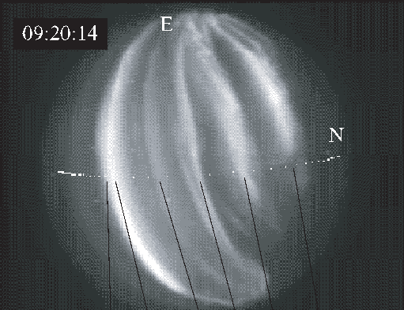

E

|                                                                    09:20:14|
|---|

N

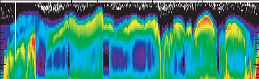

||
|---|

Figure 2. Relation between the optical aurora and particle measurements. The top panel shows multiple auroral arcs seen in the all-sky image, taken by a low-light level TV-camera from an aircraft, and the FAST satellite orbit mapped to 110 km altitude. The second panel shows the electron energy-time spectrogram measured by the FAST satellite, where particle intensity is colourcoded as shown by the bar on the right. The third panel is the precipitated electron energy flux. In the fourth panel, the perpendicular magnetic-field perturbation is shown. In the fifth panel, the electric field along the FAST track is displayed (from Ref. 12).

the effects of reflection, electric fields, and heating. The aurora is therefore also a source of plasma. For this reason, the aurora already played a major role in an earlier workshop

that dealt with magnetospheric plasma sources and losses (see previous section).

6

Alfvén waves play an important role in the coupling between the auroral acceleration region and the magnetosphere and in the acceleration of auroral electrons. One of the earlier international teams at ISSI focussed on exactly this topic and produced a comprehensive review

. In the following sections, we describe some of the key results that have been presented in Reference 10. Remote-sensing and in-situ observations

11

The complementary role of in-situ and remote-sensing observations in the study of the aurora is illustrated in Figure 2, which shows an example of a satellite crossing above multiple parallel arcs and simultaneous optical coverage of these arcs from an aircraft. While optical observations reveal the overall morphology of the auroral display, spacecraft provide detailed particles and field observations, albeit only along the spacecraft trajectory. The arcs can be identified by peaks in the energy spectra and flux of the downward-going electron component (called “inverted-V events” because of their resemblance to an inverted-V in the spectrograms).

Relationships with global current systems

As a synthesis of the recent observations, notably those from the Freja and FAST missions, Figure 3 outlines the electric-current structures that delineate the auroral zones, i.e. upward-current regions, downward-current regions, and timevarying-current regions, and summarizes the associated observational characteristics. This figure served as the guide to the presentations in Reference 10.

Figure 4 provides an example of in-situ satellite data illustrating the regions and processes listed in Figure 3: upward-current regions designated with blue markers in the top panel; downward-current regions in green, and Alfvénic regions in red. The polar cap is to the right.

In the upward-current region, precipitating electrons are narrow in energy and broad in pitch angle; in the downward-current region, the (up-going) electrons are broad in energy and narrow in pitch angle. In the Alfvénic region, the electrons are variable and counter-streaming. Each region has characteristic ion outflow, with differing energy and pitch-angle structure and outflow magnitude. The bottom two panels illustrate the great variety of wave activity associated with the aurora.

## Downward

- 1. Downward current.

4. Down-going,

- 2. Diverging electric

8. VLF saucer source 8. AKR source region.

- 5. Ion heating

J

1. Upward current.

J

E

e-

i+ e-

i+

ESW AKR

VLF Saucers

e- e-

i+

E E

3. Small-scale density

ne

ELF

Ion holes

J J

ne

i+

EIC, EMIC

ne

E E

E E E

J

1. Variable Currents.

J

E

i+

Current Region

Upward Current Region Acceleration Region Polar Cap Boundary

e-

E

i+ ELF ESW

ne

field structures.

2. Alfvenic electric fields.

2. Converging electric field structures.

cavities.

3. Large-scale density 3. No density cavity. cavities.

inverted-V” electrons.

4. Up-going, fieldaligned electrons.

4. Counter-streaming electrons.

e-

transverse to B. Energetic ion conics.

- 5. Up-going ion beam. Ion conics.

5. Ion heating transverse to B. Intense ion outflow.

- 6. Large-amplitude ion cyclotron waves and electric field turbulence.

- 6. ELF electric field turbulence.

6. ELF electric field turbulence. Ion cyclotron waves.

- 7. 3-D Electron solitary waves.

region.

7. Ion holes. Nonlinear ion cyclotron waves.

7. 3-D Electron solitary waves

- Figure 3. An illustration of the field-aligned current and electric potential systems in the ionosphere and magnetosphere. The numbered items refer to key characteristics of these regions (from Ref. 13).

124 B. Hultqvist et al.

FAST ORBIT 1906

200

100

dB

0

nT

- -200

- -100

1000

E ALONG V

500

(mV/m)

0

- -1000

- -500

9

||
|---|

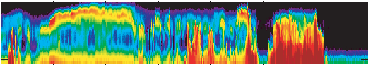

- 101

- 102

- 103

- 104

2-s-sr-eVeV/cm

10

Energy (eV)

Log Eflux

10

e-

10

10

6

270

9

||
|---|

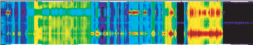

Pitch Angle

180

e- >25 eV

Log Eflux

90

0

-90

6

7

- 101

- 102

- 103

- 104

||
|---|

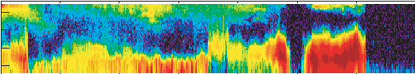

10

Energy (eV)

Log Eflux

10

i+

10

10

4

270

7

||
|---|

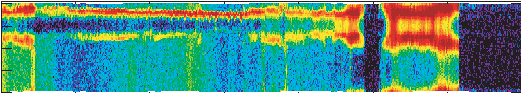

2-s-sr-eVeV/cm

Pitch Angle

180

Log Eflux

90

i+

0

-90

4

- 106

- 107

- 108

i+ >20 eV

21/cm-s

1024

- -14
- -7

||
|---|

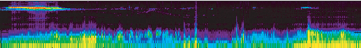

256

HFE

kHz

64

16

22log[V/(m-Hz)]

16

- -9
- -2

||
|---|

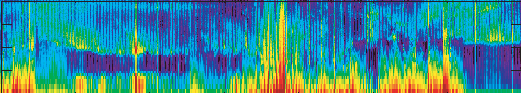

4

VLFE

kHz

1

.25

.06

UT ALT ILAT MLT

16:44 3592.6 64.7 22.0

16:45 3535.8 66.1 22.1

16:46 3476.4 67.4 22.2

16:47 3414.7 68.8 22.4

16:48 3350.5 70.2 22.5

16:49 3284.0 71.6 22.7

16:50 3215.2 73.0 23.0

16:51 3144.1 74.3 23.2

- Figure 4. An auroral pass as seen by the FAST spacecraft. The top panel shows the magnetic-field perturbation, with the inferred field-aligned currents indicated in green (downward) and blue (upward), and the Alfvénic currents in red. The DC electric-field fluctuations in the second panel show the electrostatic shock structures associated with the auroral acceleration region. The next four panels show ion and electron spectrograms, i.e. intensities versus energy and pitch-angle, colour-coded, using the colour bars on the right. The third panel from bottom shows the integrated ion outflow. The bottom two panels show wave activity from near-DC to MHz frequencies (from Ref. 13).

Parallel potential drops

One of the major breakthroughs in our understanding of the aurora has come from the observational proof that it is electric fields directed along the geomagnetic field lines that are responsible for the acceleration of the auroral particles (as originally proposed by Alfvén).

While direct measurement of these parallel electric fields is difficult, much information about the parallel potential profile – and therefore, the parallel field – can be derived from particle data. The precipitating-electron data show the magnitude of the potential drop above the observation point. The ion-beam data and the electron-loss-cone data show its magnitude below the observation point.

According to the concept illustrated in Figure 3, one can compare the perpendicular potential drop that the spacecraft sees as it moves across the top of the potential structure with the ion-beam and electron-loss-cone measurements of the parallel potential drop below the spacecraft. Observationally, there is indeed good agreement between the ion-beam energy and the potential along the spacecraft trajectory as measured by the integrated electric field component perpendicular to the magnetic field lines. This agreement provides clear evidence for the potential-drop model of auroral acceleration.

As auroral arcs are produced by thin sheets of precipitating electrons, they also carry a considerable upward-directed field-aligned current. In simple terms, the relation between auroral particle fluxes and the field-aligned currents stems from the need to maintain current continuity (and charge neutrality) in the presence of a low number density of current carrying electrons and increasing current concentration just above the topside ionosphere resulting from the convergence of the magnetic field lines. The current continuity is achieved by downward acceleration of the electrons in an upward electric potential drop. Figure 5 is a sketch that illustrates the relationship between the auroral arc, the upward current and the electric field.

As illustrated in the sketch in Figure 3, the return (downward-) current region has a divergent shock structure which mirrors the convergent structures of the inverted-V in the upward-current region. Observations of isolated divergent electric-field structures by Freja and FAST have shown excellent agreement between observed suprathermal electron fluxes and the total current determined from magnetic-field measurements. Good agreement has also been found between the characteristic electron energy and the measured electric potential drop. All this supports the conclusion that the upward electron beams are accelerated by quasi-static potential structures.

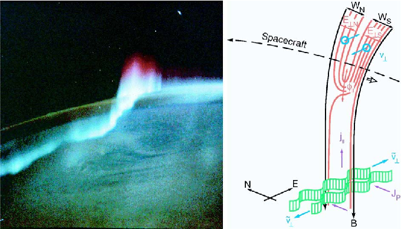

- Figure 5. A combination of an optical auroral arc system on Earth (left) as seen from the Space Station (Spacelab) and the corresponding schematic model (right) showing a view of parallel

currents, j||, plasma motions, v⊥, electric fields, E⊥, and potential contours (red lines) above the auroral arc, which is sketched in green (from Ref. 12).

It is important to note that the formation of the electric-potential patterns and associated currents implies the existence of a generator region somewhere above the auroral acceleration region. The nature of this generator is still far from clear. Also not understood at present among the main characteristics of the aurora is the cause for the often very narrow width of auroral arcs.

### Plasma Boundaries

Thin boundaries are ubiquitous in space plasmas. Examples are current sheets that separate plasmas with different magnetisation (such as the magnetopauses or tail current sheets in planetary magnetospheres, the heliospheric current sheet), shocks standing in a plasma ahead of obstacles or propagating through a plasma (such as planetary bow shocks, interplanetary shocks, or the heliospheric termination shock). In-situ observations from spacecraft have provided a wealth of information on the formation and characteristics of such boundaries, notably those occurring when the solar wind impinges on Earth’s magnetosphere.

The terrestrial bow shock is formed when the supersonic plasma emitted from the Sun (the solar wind) encounters Earth’s magnetic field. The dipole magnetic field of Earth acts as an (almost) impenetrable obstacle to the solar wind, which

therefore has to slow down and flow around the obstacle. In this process, the magnetopause is formed, separating the magnetic field inside from the solar wind that flows around it. Ahead of the magnetopause, the bow shock forms a surface across which the solar-wind plasma is heated and slowed down from supersonic to subsonic speeds.

Earth’s bow shock is the best-known example of a collisionless plasma shock and has been the subject of extensive observational and theoretical investigations since the start of the space age. Collisionless shocks abound throughout the astrophysical world and are believed to play critical roles in flow dynamics and heating, as well as being a prime acceleration environment for charged particles with energies up to those of cosmic rays.

The magnetopause is a thin sheet of electric current that, as mentioned above, to first order separates the solar wind from Earth’s magnetosphere. Across the magnetopause, the plasma environment changes from the dense, cold, weakly magnetised solar-wind plasma to the dilute, hot, and strongly magnetised plasma inside the magnetosphere. On closer examination, the magnetopause is not impermeable, but allows a fraction of the solar wind’s mass, momentum and energy to be transferred to the magnetosphere, primarily through a process called “magnetic reconnection”. Reconnection requires some process to unfreeze electrons and ions from the magnetic field, but this process needs only to be present in the immediate vicinity of the reconnection site. Elsewhere on the magnetopause, it is the normal magnetic-field component accompanying reconnection that creates a direct magnetic coupling across the magnetopause and allows solar-wind plasma to flow into the magnetosphere.

Plasma boundaries have received much attention in ISSI’s programme. The first workshop series in the field of solar-terrestrial physics that started in 1995 was dedicated to the identification of the source and loss processes of magnetospheric plasma. As any mass transfer across the magnetopause constitutes, by definition, a source or loss of magnetospheric plasma, the magnetopause played an important role in that series of workshops, which resulted in Volumes 2 and 6 of the SSSI series

.

5,6

Recognizing the need to develop and test methods and tools for the analysis of ESA’s forthcoming Cluster mission, ISSI hosted an international team of experts to write a book on multi-spacecraft analysis methods. The result was published

- as the first volume in the ISSI Scientific Report series

, which has become the reference for much of the Cluster-related data analysis, and from which much of the text of this section has been taken.

14

Plasma boundaries are constantly moving, evolving and changing their orientation. They are thus a prime target for the study by the closely spaced fleet of Cluster spacecraft. It was natural then that the bow shock and magnetopause should become the focus of an ISSI workshop series (entitled Dayside Solar Wind-Magnetosphere Interaction: Cluster Results) that began in 2003 and has led to the publication of another ISSI Volume

in 2005. Plasma boundaries have also been studied by international teams that have met and led to a comprehensive review

15

- at ISSI. One dealt with numerical simulations of selected bow-shock problems,

. Another team looked at plasma measurements from the closely spaced AMPTE-IRM and-UKS spacecraft, in preparation for the Cluster multi-spacecraft mission. Several publications resulted from this effort. In the following, we will present some of the highlights from the work at ISSI on plasma boundaries.

16

The bow shock It has been shown by an ISSI team

that “quasi-perpendicular” shocks should become non-stationary when the fraction of reflected ions exceeds some critical value. Non-stationarity of the shock largely determines the electron reflection process. Full particle simulations of high-Mach-number shocks were used in order to study electron behaviour during shock crossings in detail. Instabilities between the incoming electrons and the reflected ions lead to fluctuations on electron scales, which trap and accelerate the electrons.

16

Energetic particles are known to exist upstream of “quasi-parallel” shocks. The investigation of cross-field diffusion processes of the energetic particles upstream and downstream of the shock involves three-dimensional simulations. A still-outstanding question concerns the so-called injection process, i.e. how a certain part of the thermal upstream ions are injected at the shock into a diffusive shock-acceleration mechanism. Hybrid simulations show that pickup ions, i.e. neutral interstellar particles, which are ionized in the inner heliosphere and then picked up by the solar wind, are easily reflected and injected into an acceleration mechanism at quasi-parallel shocks.

The Cluster mission has made important contributions to the understanding of the physics of the bow shock. Firstly, by making the first detailed, three-dimensional studies of individual shock crossings, the phenomenology and physical processes within and in the vicinity of the bow shock, under specific conditions, could be clarified. Secondly, through the ability to make unambiguous determinations of the vector quantities associated with the shock it has been possible to underpin and re-examine the statistical studies of shock motion, and local and overall shock orientation. Cluster has explored spatial scales from 100 km to

5000 km and this range will be extended to 10 000 km and beyond before the end of the mission. Key findings include

:

17

- 1. The definitive determination of absolute shock scales.
- 2. The temporal/spatial variability: motion and internal dynamics.
- 3. The proof that ion beams manage to emerge from particles reflected at quasi-perpendicular shocks.
- 4. The surprisingly small-scale sub-structure of large structures at quasiparallel shocks.

Shock scales. Cluster studies have measured the width of the ramp at the quasiperpendicular bow shock over a range of upstream parameters (Mach number, etc.). The width is a critical indicator of the internal shock processes, which in turn govern the partition of energy among the incident particle populations

.

18

- Figure 6 shows the thickness of the shock ramp for almost 100 quasi-perpendicular shock crossings as a function of Mach number. Statistically, the measured ramp scale size was proportional to the gyro-radius of trapped ions, over a large range of Mach numbers.

Shock variability. Cluster determination of the speed of the bow shock has shown that variations in the upstream parameters have an immediate and direct impact on the location and gross motion of the shock. However, Cluster electricand magnetic-field observations have also highlighted considerable variability in the shock structure and profile, even over relatively small scales.

- Figure 6. Relationship between the thickness of the (quasi-perpendicular) bow shock and the upstream magnetosonic Mach number. In the top panel, the thickness has been scaled to the downstream ion gyro radius, while in the lower panel it has been scaled to the ion inertial length. The figure shows that the gyro-radius scaling renders the thickness approximately constant over a large range of Mach numbers, while the ion inertial scaling increases with Mach number (from Ref. 18).

The near-simultaneous measurement of the shock profile by four spacecraft allows the study of spatial and temporal variability in ways that have not previously been possible. By considering the magnetic-field profile through a nearly perpendicular supercritical shock, it was possible to identify structures that had a stable phase with respect to the main shock ramp (and those that did not). Magnetic-field magnitude structures were found not to vary significantly over the spacecraft separation (around 600 km) or the time differences between the shock passages of the different spacecraft (up to 30 s), which is an interesting new observational result.

By contrast, the downstream large-amplitude waves (with a polarisation and frequency consistent with ion-cyclotron waves generated by non-gyrotropic ion distributions) varied significantly between spacecraft, confirming that these waves were not stationary with respect to the shock. In addition, it was not possible to identify the same waves at different spacecraft, implying that the scale sizes of these waves along the shock front were no larger than the spacecraft separations of around 600 km – their wavelength along the shock front was around 100 km.

Beam origin. Simultaneous Cluster ion observations at several locations have provided unambiguous evidence that field-aligned beams found upstream of the quasi-perpendicular bow shock emerge out of the reflected and partially scattered population at the shock itself rather than originating deeper in the magnetosheath

. Observations show that the upstream beam occupies a portion of the phase space that is empty downstream. These observations indicate that the field-aligned beams most likely result from effective scattering in pitch-angle during reflection in the shock ramp.

19

Substructures. Cluster measurements of large-amplitude structures, which are believed to be the building blocks of collisionless shocks under quasi-parallel conditions, have revealed the surprising result that they appear quite different even at scales 10% of their overall size. Moreover, these differences are not the same in the electric and magnetic components. Thus the previously-believed monoliths are in fact quite filamentary and ethereal

. Only at 100 km separation do the four spacecraft records become essentially identical. The magnetopause Volume 2 in the SSSI series on “Transport Across the Boundaries of the Magnetopsphere”

20

that reviewed our knowledge of the complex plasma-transfer processes at the magnetopause (MP) at the start of the workshop series on “Source and Loss Processes of Magnetospheric Plasma”. The outcome of the workshop deliberations regarding the solar wind as a plasma source was summarized in an article

contained a number of articles

5

21-24

in SSSI Volume 6

. One of the

25

6

solar-wind particles cross the magnetopause and enter the magnetosphere every second when the IMF is strongly southward and magnetic reconnection proceeds at its maximum rate (see also the section on “Source and Loss Processes of Magnetospheric Plasma” above).

conclusions was that about 10

28

- As in the case of the bow shock, the Cluster mission has provided new insights

into the physics of the magnetopause. Among the new results are

:

26

- 1. The accurate determination of MP orientation, speed and thickness.
- 2. The measurement of MP currents based on the curlometer method.
- 3. The determination of the 2D structure of the MP based on integration of the Grad-Shafranov equation.
- 4. The identification of small-scale structures, in between the ion and electron scales.
- 5. The identification of cases where reconnection was essentially stationary.
- 6. The clarification of the causes for flux-transfer events (FTEs).
- 7. The identification of overturning of Kelvin-Helmholtz waves.
- 8. The identification of detached solar-wind plasma blobs inside the MP.

Items 6 and 8 are dealt with in the section on “Transient phenomena” above and item 7 in the section on “Waves and Turbulence”. In the following we will focus on the remaining items.

MP orientation, speed and thickness. As in the case of the bow shock, one can use the timing of the crossings recorded by the four spacecraft to directly determine the orientation and velocity of the magnetopause and from this calculate its thickness. From an analysis of 24 magnetopause encounters by the four Cluster spacecraft during a single pass along the dawn-side magnetopause, the thickness was found to vary over a wide range, from less than 200 km to thousands of km

. In simple models, the thickness of the magnetopause current layer should be determined by the ion gyro-radius, because it determines how deeply the incident solar-wind ions should penetrate Earth’s magnetic field. However, the gyroradius was measured to be only about 50 km for the cases studied. Thus the magnetopause is usually very much thicker than simple theory would predict, and the gyro-radius is not a good scale for the thickness.

27

Current structure. The internal structure of the MP current sheet has been determined

27

using Cluster’s ability to infer the electric currents from a direct application of Ampère’s law, which relates the currents to the spatial derivatives of the magnetic field. Cluster is the first mission where this technique, referred to as the “curlometer”, could be applied

.

14

y [km]

y [km]

y [km]

Composite Map, 3 July 2001 051704 051913 UT

0

B N4

2000

4

N1

10

1 2 3

0

20

N3 N2

20 nT

2000

30

Bz [nT]

0 0.5 1 1.5 2 2.5 3 3.5

x 104

0.2

2000

- 3
- 4

1

0

0.1

100 km/s

VHTx

2000

0

Pth [nPa]

0 0.5 1 1.5 2 2.5 3 3.5

x [km]

x 104

2000

10

0

5

2000

0

Ni [/cc]

0 0.5 1 1.5 2 2.5 3 3.5

x [km]

x 104

- Figure 7. Composite magnetic field maps for the 3 July 2001 event. In all panels the black contour lines represent magnetic field lines projected into the reconstruction plane, as inferred from the integration of the Grad-Shafranov equation, using measurements of the magnetic field and plasma pressure by the four Cluster spacecraft. In the top panel, the white arrows show the measured field vectors, anchored at points along the spacecraft trajectory (which run from left to right), and the red arrows show the boundary normal determined from minimum-variance analysis; the colours represent the axial magnetic-field component, which changes across the magnetopause. In the middle panel, the white arrows show the measured ion bulk velocity vectors from three spacecraft, transformed into the deHoffmann-Teller frame, and the colours now represent the plasma pressure. In the bottom panel the colour shows the ion density (from Ref. 28).

- 2D structure. Assuming that the magnetopause is in magnetostatic equilibrium and stationary, one can construct a two-dimensional map of the magnetopause from the magnetic-field and plasma measurements. While this technique, based on integration of the Grad-Shafranov equation, was originally developed for single-spacecraft measurements, Cluster has provided the unique opportunity to check these results by comparing the map constructed from measurements from one of the spacecraft, with what the other three are actually observing when they cross the region covered by the map. With the validity of the method thus proven, it was then improved to become a genuine multi-spacecraft technique that produces a single field map by ingesting data from all four Cluster space-

craft. Figure 7 shows an example of such a composite map

obtained from a

28

dawn-side magnetopause crossing. The black lines in all three panels represent the magnetic field lines in the reconstruction plane. The maps not only indicate that the MP is curved at this time, but that magnetic flux ropes are embedded in the current layer, presumably formed by magnetic reconnection that occurred further upstream.

Ion-diffusion region. At the closest spacecraft separations (~100 km), Cluster high-resolution magnetic- and electric-field measurements have allowed smallscale structures within the magnetopause related to magnetic reconnection

to be resolved. The left side of Figure 8 shows predictions from a 2D two-fluid MHD numerical simulation of the diffusion region near the reconnection site, using plasma parameters similar to those in the observations. The inset shows the Cluster configuration and their schematic trajectory through the diffusion region. Panel ‘a’ shows the measured reconnecting magnetic field components, BL. From the time delay between the current-sheet crossings by the four spacecraft, one can determine the spatial scale of the current layer, as shown at the bottom of the figure. The current-sheet thickness is about 300 km. All four spacecraft observe a very similar structure of the current sheet (panel a), implying a planar structure on the scale of the spacecraft separation.

29

The out-of-plane magnetic-field component BM (panel b) shows the bipolar variation expected for the Hall fields. The fact that all four spacecraft observed Hall fields of this large amplitude indicates that this is a stable spatial feature of the diffusion region, rather than some brief temporal variation. The presence of a non-zero normal component of the magnetic field BN ≈ -3 nT (panel c) also suggests ongoing reconnection. As shown in panel ‘d’, there is good agreement between the measured electric-field component normal to the magnetopause, En, and the Hall term (j × B/ne) within the narrow region of strong En, indicating that En can be balanced by the Hall term in the Generalised Ohm’s law. This confirms the major role of the Hall term in the formation of the structure of the diffusion region.

Evidence for quasi-continuous reconnection. An important issue is whether magnetic reconnection is necessarily transient in nature or can be operating continuously. When single spacecraft periodically encountered the layer of accelerated flows that are a signature of reconnection, one could never be certain that reconnection did not actually stop in between those isolated encounters. With Cluster, one has now seen cases where the closely spaced encounters of these flows by the four spacecraft start filling in the gaps left by each individual spacecraft alone. Furthermore, in a fortuitous conjunction between Cluster and the IMAGE spacecraft, it has been possible to infer that reconnection was truly continuous over many hours

.

30

134 B. Hultqvist et al.

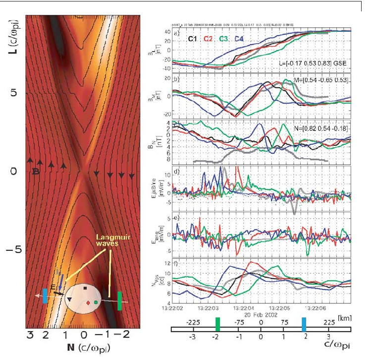

- Figure 8. Left: Structure of the diffusion region from a numerical Hall fluid simulation of magnetic reconnection. The magnetic field lines, projected into the plane of the figure, are shown as black lines with arrows; their out-of-plane component is shown by the colour: light when pointing into the plane, dark when pointing out of the plane. Also shown is the configuration of the properly colour-coded Cluster spacecraft, and their location relative to the diffusion region. Right: Cluster observations: (a) reconnecting magnetic-field component, showing the field reversal across the diffusion region, as illustrated by the black arrows in the picture on the left; (b) out-of-plane magnetic-field component, showing same sign change as the simulation on the left; (c) normal magnetic-field component, which is the component in the horizontal direction in the picture on the left;

(d) electric field normal to the structure, En (solid lines), and j × B/ne (dotted lines); (e): tangential electric field with average value about 1 mV/m; (f): plasma density from satellite potential. At the bottom, the spatial scale computed from the four-spacecraft magnetopause velocity estimate is given. The grey lines in all panels are “data” extracted from the simulation on the left along a Cluster-like trajectory (from Ref. 29).

### Transient Phenomena

Stationary or quasi-stationary phenomena have, for natural reasons, dominated space plasma physics research throughout most of the space era. Only in the last decade or two have the multipoint observations and in-situ measurement techniques needed to study dynamic phenomena become available.

Transient events are common in the vicinity of the magnetopause and in the high-latitude ionosphere at the footprints of magnetic field lines that map to the outer magnetosphere. They provide evidence for one or more unsteady solarwind – magnetosphere interaction mechanisms. Several models, including plasma instabilities, impulsive penetration of solar-wind plasma into the magnetosphere, reconnection highly structured in space and time (“patchy” and “bursty” reconnection), and pressure-pulse-driven boundary waves on the magnetopause, purport to account for the unsteady interaction. Associating events at the magnetopause with those in the ionosphere, and both with the proper driving mechanism, is important. If sufficiently numerous, large and widespread, the transient events might dominate the solar-wind – magnetosphere interaction.

Investigations of transient phenomena have played an important role in several ISSI workshops and the resulting books

. Predicted characteristics of events driven by the Kelvin-Helmholtz plasma instability have been summarized. Just as winds generate waves on the surface of lakes, the shocked solar wind plasma drives quasi-periodic anti-sunward-moving waves on Earth’s magnetopause as it flows past the magnetosphere. During periods of enhanced solar-wind velocity, the instability criteria are more likely to be satisfied and the waves should pass an observer more rapidly. The corresponding signatures in the high-latitude ionosphere should be periodic swirls (or vortex flows) that accelerate as they move anti-sunward. Multipoint Cluster observations are presently being used

5,6,15

26

to better determine the characteristics of boundary waves on the magnetopause. Similarly, expectations for events produced by impulsive penetration have been outlined

. These events should be associated in a one-to-one manner with “blobs” of solar-wind plasma, whose momenta suffice to traverse the magnetosheath and magnetopause. Once inside the magnetosphere, the events should decelerate as they move anti-sunward. The corresponding ionospheric signatures should be isolated convection vortices that decelerate as they move anti-sunward and equatorward. Doubts have been raised about the existence of such plasma blobs, whether they can retain an excess momentum, and whether they can penetrate the magnetopause. Nevertheless, some recent Cluster observations indicate

23,25

that blobs of solar-wind plasma do penetrate the magnetopause and become detached.

27

Bursty merging on the dayside magnetopause generates bubbles of intermixed magnetosheath and magnetospheric plasmas on interconnected magnetic field lines that bulge outward into both regions. During periods of southward interplanetary magnetic field (IMF) orientation, the bubbles form along and move away from a line passing through the sub-solar point whose tilt depends upon the IMF orientation. Magnetic curvature forces pull bubbles connected to the northern ionosphere dawnward during periods of duskward IMF orientation and duskward during periods of dawnward IMF orientation. Because the bubbles bulge outward into both the magnetosheath and the magnetosphere, their passage generates characteristic bipolar magnetic-field signatures in the direction normal to the nominal magnetopause. These signatures are known as flux-transfer events, or FTEs.

Recent Cluster observations confirm

that FTEs occur on the equatorial magnetopause for southward IMF orientations, they recur each ~8 min, they exhibit velocities of ~100 km s

30

, and they have ~1 RE dimensions along and perpendicular to the magnetopause. The observations also confirm that at least some events bulge outwards into both the magnetosheath and magnetosphere. By means of special theoretical methods (Grad-Shafranov techniques) applied to the Cluster observations, it has been possible to reconstruct the magnetic-field structure within and outside one such FTE

-1

. The internal structure of some FTEs may be best explained in terms of a coaxial current pattern. The dimensions of at least two FTEs along the magnetopause were greater further within the magnetosphere than near the magnetopause, contradicting expectations from existing FTE models. Some transient events observed on the edge of the interior magnetic cusp exhibit the plasma signatures expected for FTEs, but not the bipolar signatures normal to the nominal magnetopause.

31

The ionospheric signatures originally predicted for FTEs were azimuthally- and poleward-moving convection vortices. More recently, FTEs have been associated with latitudinally limited, but longitudinally extensive, poleward-moving transient azimuthal flux bursts

. These events tend to occur for southward IMF orientations, recur every 8 min, and exhibit dawnward or duskward flows in accordance with merging model predictions and FTE observations. Cluster measurements have been used to confirm the simultaneous existence of recurring FTEs at the magnetopause and recurring poleward-moving flow bursts and auroral forms in the ionosphere.

32

Although the intrinsic pressure variations associated with interplanetary shocks can be large, kinetic processes within Earth’s foreshock almost constantly introduce transient density and dynamic pressure variations with even greater amplitudes into the incoming solar wind. The pressure variations batter the magnetopause, drive large-amplitude boundary waves, and launch fast mode compressional waves into

the magnetosphere. The boundary waves move dawnward across local noon during typical periods of spiral IMF orientation, and duskward across local noon during periods of ortho-spiral IMF orientation. Although the north/south orientation of the IMF should have no bearing upon the occurrence of the wave patterns, they should be more common during periods of radial IMF orientation and high solarwind velocities, because under these conditions the foreshock lies upstream of the dayside magnetopause and more energy is available to drive the kinetic processes.

ISSI teams have considered the magnetospheric and ionospheric response to intrinsic solar-wind pressure variations and those generated within the foreshock. The first evidence indicating that kinetic processes at the bow shock were capable of driving large-amplitude magnetopause motion was reported by one of the teams

.

33

- As illustrated in Figure 9, kinetic processes associated with the interaction of an otherwise undistinguished solar-wind tangential discontinuity with Earth’s bow shock resulted in a dramatic, but local, decrease in the solar-wind dynamic pressure applied to the magnetosphere. The drop in the pressure permitted the magnetopause to bulge outwards and created a gross deformation that propagated antisunward with the solar wind flow. Other authors subsequently associated this event with perturbations in the geosynchronous magnetic-field strength, transient auroral brightenings, and travelling convection vortices (TCVs) in the ionospheric flow.

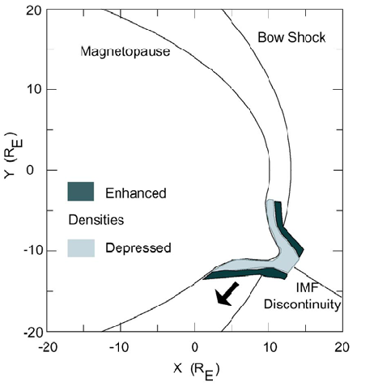

- Figure 9. Kinetic processes, associated with the interaction of an interplanetary-magnetic-field (IMF) discontinuity with Earth’s bow shock, generated a density cavity, which allowed the magnetopause to expand outward, resulting in a large-amplitude anti-sunward propagating wave on the magnetopause boundary (from Ref. 34).

Because spacecraft are seldom located in the foreshock, they rarely observe the pressure variations striking the magnetosphere. Another ISSI study

explored the possibility of employing equatorial ground magnetograms to track the pressure variations striking the magnetosphere. It has long been known that each and every abrupt change in the solar wind’s dynamic pressure generates a fast mode wave that propagates into the magnetosphere and that the signature of this fast mode wave is enhanced in equatorial dayside ground magnetograms. However, there are many signatures in the equatorial magnetograms and it is not clear if each of them has a corresponding solar-wind signature. The team reported that about half the abrupt signatures they observed in equatorial ground magnetograms could be associated with variations in the solar-wind pressure, but that half could be associated with substorm onsets.

34

By contrast, all compressional signatures at the dayside geosynchronous orbit are associated with variations in the solar-wind pressure applied to the magnetosphere. Sequences of transient events in the high-latitude ionosphere were associated with corresponding compressional signatures in the magnetic-field and energetic-particle signatures observed by geosynchronous spacecraft. These signatures at geosynchronous orbit move dawnward or duskward in the direction predicted by the pressure-pulse model for the given spiral/ortho-spiral IMF orientation

.

35

An ISSI team has also investigated the characteristics of travelling convection vortices (TCVs). A detailed case study of a single TCV indicated that it was produced by a pair of field-aligned currents flowing alternatively out of and then into both hemispheres

. In contrast to model predictions, the current maxima occurred on the perimeter of the vortices. Another study

36,37

reported that the Geotail spacecraft had observed the flow pattern expected for a large-amplitude boundary wave in the vicinity of the equatorial magnetopause at the longitude and time of an ionospheric TCV. Using high-timeresolution observations to track the motion of the pressure front associated with a TCV through both the equatorial magnetosphere and ionosphere, it was shown

38

39

that this motion was consistent with foreshock-generated pressure pulses striking the magnetosphere for the observed IMF orientation. A model for the fieldaligned currents associated with boundary motion, which did not make simplifying assumptions and therefore settled an ongoing controversy, was presented.

Statistical studies

have demonstrated that there is a statistically significant relationship between TCVs and higher frequency Pc3 (22 - 100 mHz) pulsations, both of which propagate away from local noon with similar speeds. Because the foreshock is a well-known source of Pc3 pulsations, these results indicate a close

40,41

connection between TCVs and pressure variations generated in the foreshock. A statistical survey of TCV occurrence patterns as a function of solar-wind conditions has given a number of conflicting results. Consistent with the predictions of both the Kelvin-Helmholtz and pressure-pulse models, solar-wind velocity has been found to control the occurrence and strength of TCVs. IMF Bz determines the occurrence of events near local noon, as the bursty reconnection model predicts. The standard deviations of various IMF parameters also control event occurrence, as expected from the pressure-pulse model. Much work remains to be done to explain the complex relations between the solar-wind properties and their effects in the ionosphere. In particular, it appears that events produced by different mechanisms can exhibit similar signatures.

Concluding remarks. ISSI workshops have provided comprehensive reviews of our present understanding of transient events at the magnetopause, while the international teams have contributed case studies and a plan of attack describing how the characteristics of transient events in the ionosphere can be related to those at the magnetopause, and how both can be associated with the driving mechanism. Nevertheless, many questions remain unanswered. Fortunately, Cluster observations and forthcoming NASA THEMIS observations should prove decisive in this regard. Cluster observations can be used to discriminate between boundary waves and FTEs bulging into both the magnetosphere and the magnetosheath. They can also be used to determine the direction and speed of event motion as a function of solar-wind conditions, an important discriminator between the proposed models. THEMIS is a mission consisting of five spacecraft: three at the magnetopause, one in the foreshock, and one in the solar wind. Its observations will be used to determine whether fluctuations in the solar-wind dynamic pressure or IMF orientation trigger the occurrence of FTEs, and to define the response of the magnetosphere to pressure pulses generated within the foreshock. Its observations will also be used to determine when and where boundary waves result from the Kelvin-Helmholtz instability or from magnetopause motion directly driven by variations in the solar-wind dynamic pressure. Questions like these are left for future workshops.

### Waves and Turbulence

Collisionless plasmas are not in strict thermal equilibrium. They are thus subject to the excitation of large-amplitude fluctuations annihilating and dispersing the excess energy. Such unstable fluctuations appear in the form of waves, wave packets, turbulence, and radiation. Radiation escapes from the plasma carrying away energy. Waves confined to the plasma, in contrast, disperse and redistribute energy throughout the plasma, making it available at remote places and for

processes like plasma heating, dissipation and generation of turbulence. They trigger violent transitions, like “magnetic reconnection”, formation of “collisionless shocks”, and “diffusive transport” of particles and magnetic field.

Wave excitation. Plasma waves are excited by spatial inhomogeneities and by deviations of the particle velocity distributions from the equilibrium (Maxwellian) distribution. In either case the free energy available is converted into fluctuations resonant with the plasma particles, a process described as “wave-particle interaction”. This means that electrically charged particles not in equilibrium, the resonant particles, start oscillating, thereby exciting a fluctuating electromagnetic wave field. Strong wave excitation proceeds preferentially in active plasma regions such as plasma boundaries and current sheets, like the heliospheric current sheet, shock waves and their environments, magnetopauses, ionopauses, in planetary magnetotails, auroral zones and radiation belts.

Turbulence. Whenever many waves are present in a plasma, the fluctuation spectrum is not resolvable into single wave modes. In this case the plasma is turbulent. In contrast to wave-particle interaction, turbulence evolves from interaction among waves. Turbulence does not exhibit full disorder; rather it contains “order in chaos”. It is structured into eddies, vortices, and plasma clumps of different sizes. Turbulence is “multi-scale”. Magnetic turbulence is of low frequency and macroscopic scale, related to current filaments and current sheets. It is observed all over in space plasmas, from the solar corona through the solar wind, interplanetary shocks, planetary and cometary bow-shock foreshock regions, magnetosheaths, magnetopause transitions, and plasma sheets in magnetospheric tails, wherever the kinetic energy density in the plasma exceeds the magnetic.

Radiation. While serving as a sensitive tracer of microscopic plasma processes, radiation is usually ineffective for space plasmas (contrary to in astrophysics) in releasing free energy. Very small amounts of energy only are converted into radiation. In the collisionless plasmas in near-Earth space, radiation is in the domain of radiowavelengths. Measurably high power in radiation is found near shock waves, where it is generated at harmonics of the local electron plasma frequency fpe ∝ √n by headon collisions between plasma waves excited by electron beams. It provides a measure of the local plasma density n. In magnetospheres in relation to aurorae, intense radiation, the celebrated auroral kilometric radiation (or AKR), is provided by energetic electron velocity distributions, which form in the presence of a magnetic fieldaligned electric-potential drop (at Earth at altitudes of 2000 - 8000 km during substorm activity). Distributions of this kind resemble “excited states” known to release their excess energy like masers and lasers instantaneously in concert and offering high radiation yields. Such radiation is at the electron cyclotron frequency fce , which is proportional to the magnetic field strength, B, providing a measure of the latter.

Earth’s wave environment

Wave processes have been a focus of scientific activity at ISSI, encompassing the debate about the acceleration and transport constituting the “Astrophysics of Galactic Cosmic Rays” (GCR)

, where fluctuations in the interstellar medium have been identified

42

as scatterers of GCR. The “heliospheric laboratory” served as a paradigm for models of GCR acceleration

43

. Turbulent magnetic fields are deemed responsible for CR scattering deep into and across the heliosphere

44, 45

. The main focus at ISSI was on the many plasma-wave phenomena in the solar wind, magnetosheath and magnetosphere. These include shock-wave formation and the acceleration of charged particles at collisionless shocks

46

, the generation of magnetosheath turbulence behind Earth’s bow shock

16

, magnetic reconnection at the magnetopause and in the magnetotail plasma sheet, and the role of waves in the physics of the aurora

5,6,15

. In addition to the ISSI Workshops, 19 out of 77, i.e. ~25% of the ISSI teams dealt with some aspect of plasma waves or turbulence. Waves and turbulence provided the guidelines in the discussion of the generation of the polar wind and the acceleration of ions into ion conics

10

, investigation of particle precipitation

7

at the magnetopause, discussions which have been continued, extended and deepened in the follow-up workshop on “Magnetospheric Sources and Losses”

, analysis of reconnection

and diffusive entry

5,47

22

24

and on “Auroral Plasma Physics”

6

, which draws extensively from the importance of wave phenomena in the physics of the aurora. Finally, the recent ISSI workshop “Magnetospheric Boundaries and Turbulence: Cluster Results”

10

, which dealt with the dayside solar-wind/bow-shock/magneto-sheath/cusp/magnetopause transition, emphasizes the generation of waves and turbulence in the interaction between the solar wind and the magnetosphere. Additional effort has been made by smaller teams, ranging from the investigation of the microscopic dynamics of shocked plasmas

15

, and the generation of so-far-unexplained power-law distributions in otherwise collisionless space plasmas

16

, up to the detection of extra-solar planets by observation of their radio emissions

48

. Waves at plasma boundaries

49

Magnetopause surface waves. Figure 10 shows what dominant mode eroding the magnetopause is to be expected when the close-to-sonic magnetosheath plasma flow passes over the magnetopause and exerts friction and stress on the magnetospheric magnetic field. The friction forces the magnetopause to develop ripples and vortex-like circulations of plasma and magnetic field. The passing magnetosheath plasma and field experience adhesion and retardation on these ripples. Waves of this kind are very-large-scale, in the order of several Earth radii in wavelength along the magnetopause

. When decaying into smaller structures, the turbulent eddies and vortices reach down to length scales of only hundreds

50

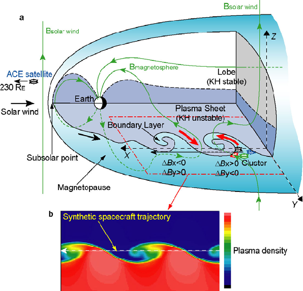

- Figure 10. Upper Part: Athree-dimensional cut-away view of Earth’s magnetosphere with the signatures of Kelvin-Helmholtz ripples on the dusk-side flank of the magnetopause. The Cluster spacecraft were located near the dusk equatorial plane, and were separated by 2000 km from each other. The red arrows show the inferred circulation of plasma in the Kelvin-Helmholtz vortices in the boundary layer. Indicated are the signs of the observed variations in the components of the magnetic field B. Lower Part: Formation of vortices and mixing, resulting from a 3D numerical simulation of the magnetohydrodynamic KHI under a magnetosphere-like geometry. Density, velocity and magnetic-field data extracted from the simulation along the trajectory shown by the horizontal line agree quite well with the actual Cluster observations (from Ref. 51).

of kilometres. They cause mixing of plasmas and fields on both sides of the magnetopause (Fig. 10) at the downstream flanks

. In this way, they provide transport of plasma across the magnetopause and the formation of a boundary layer. Magnetosheath and boundary-layer turbulence. Figure 11 (left part) shows a typical magnetosheath wave power spectrum close to the dayside magnetopause. Most of the wave energy is stored in low-frequency magnetic fluctuations, δB. spacecraft measurements have shown

51

- At higher frequency, electric-field fluctuations, δE, take over. Cluster multi-

this turbulence to consist of a superposition of low-frequency magnetic oscillations like Alfvén and mirror waves.

52

Alfvén waves are string-like oscillations of magnetic field lines, while mirror waves cause magnetic depressions in the plasma. Alfvén waves are excited by reflected ion beams in the foreshock, from where they enter the magnetosheath

. Mirror waves occur when the plasma has higher pressure perpendicular to than parallel to the magnetic field. This is the normal situation in the magnetosheath.

52

ISSI provided the forum for the development of the sophisticated analysis techniques

) by which the dispersion of plasma waves could be determined and the wave modes identified. The agreement between the inferred mirror wave iso-contours and the mirror dispersion relation is visible from one particular reconstruction in Figure

for multi-spacecraft missions (the so-called “k-filtering” methods

14

53

- 11 (right part). The investigation of the linear and nonlinear theory of the mirror mode has formed part of the theoretical studies of three ISSI teams, leading to new insight into mirror turbulence.

- At polar-cusp latitudes, the low-frequency boundary-layer spectral shapes differ from the upstream magnetosheath and solar wind. They are the result of the development of “Self-Organized Criticality” and turbulence, investigated by visiting scientists at ISSI and a number of ISSI teams.

Electric waves, contributing to reconnection and diffusion. Electric waves at the magnetopause are excited by the magnetopause density gradient and the diamagnetic magnetopause current. They scatter the plasma particles out of their orbits and thus contribute to diffusive plasma entry across the magnetopause, formation of the magnetospheric boundary layer, and magnetic reconnection. Earlier estimates based on other spacecraft observations seemed to deny this possibility

have detected very strong electric-wave activity on field lines connecting to the magnetopause reconnection region, confirming numerical simulation studies

. New Cluster measurements reported in an ISSI workshop

6

54

of their importance. Waves of this kind are also the signature of electron beams accelerated in reconnection and reaching the spacecraft along the magnetic field.

55

Auroral plasma waves

Wave activity in the magnetosphere is most intense at nightside auroral latitudes between 1000 and 8000 km altitude. Figure 3 schematically summarized the relevant wave phenomena related to the aurora in the upward and downward auroral-current regions. The two dominant families of waves in the auroral magnetosphere are VLF waves and a sporadic high-frequency electromagnetic radiation at km-wavelengths, called auroral kilometric radiation (AKR).

VLF emissions. The lowest frequency waves in the aurora are Alfvén waves. Their properties have been summarized in a review paper

written as a team

11

10 4

106

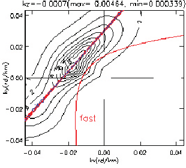

10

SC-2 2002/02/18 0459:28-58 UT

FGM

10 2

104

10

10 0

102

10

STAFF-SC

FGM/STAFF (nT /Hz)

EFW (mV/m) /Hz2

10-2

100

10

##### EFW

STAFF-SA

10-4

10-2

10

10-6

10-4

10

- 2.5

f

STAFF sensitivity

10-8

10-6

10

10-10

10-8

10

F = 0.38 Hz

F = 16 Hz

ci lh

10-10

-12

10

10

10 1 100 101 102 103 104

-

Hz

- Figure 11. Left: Cluster measurements of low-frequency magnetic (blue) and electric (red) wave power spectra in the magnetosheath close to the magnetopause, exhibiting the power-law dependence of the wave power (vertical axis) on frequency (horizontal axis), which is typical for welldeveloped turbulence. The magnetic power cuts off at the electron plasma frequency, while the electric power exhibits a maximum at the lower-hybrid frequency. Right: Reconstruction of the wave-mode constituents in the magnetosheath based on the k-filtering technique, showing that in this particular case the main spectral contribution at very low frequencies is the mirror mode. The

figure shows, for a fixed frequency of 0.6 Hz and a selected wave vector component kz, parallel to the magnetic field, the iso-contours of wave power in the plane perpendicular to the magnetic

field. Superimposed (in red) are the dispersion curves for the mirror mode and the fast mode (from Ref. 52).

effort at ISSI. Auroral VLF waves have been discussed in an ISSI-related review paper

. A large variety of different modes in the whistler frequency band between the ion and electron cyclotron frequencies contribute to VLF. These waves are partly oscillations of the electrostatic potential in resonance with the electrons. In their presence, the auroral electron beam and ring distribution is grossly deformed

56

. It is one of the achievements of the “Auroral Plasma Physics” workshop activity at ISSI that this point has ultimately been clarified. Previously, this kind of deformation was constantly attributed solely to the action of the AKR.

57

One particular type of VLF radiation is the “VLF-saucer” emission (which takes its name from the saucer-like form of its dynamic spectrum), a spectacular example of which is shown in Figure 12. Saucers are electromagnetic waves belonging to the whistler family, known from disturbances of broadcasting signals by lightning discharges. Saucers are excited at a very narrow spatial location in the presence of high fluxes of field-aligned ~100 eV electrons in the aurora (described in the auroral section). Saucers thus indicate the presence of small-scale structures (so-called “phase space holes”) in the auroral downward-current region

.

10

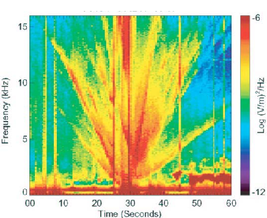

- Figure 12. Frequency-time spectrogram of the electric wave power (colour-coded as shown by the bar on the right) observed by the FAST spacecraft in the auroral magnetosphere at an altitude of ~4000 km, showing a spectacular sequence of so-called saucer emissions. All wave traces start from a single narrow spatial location (from Ref. 57).

Auroral kilometric radiation. In the upward field-aligned auroral-current regions, the auroral electron beam impinges on the ionosphere and a parallel electric field evacuates the ionospheric plasma. Here AKR is generated in a process similar to maser emission

. The tenuous upper auroral plasma is unable to dissipate the auroral electron-beam energy other than by generating radiation. AKR radiates away into free space several percent of the total energy of a substorm. AKR is generated perpendicular to the magnetic field by the slightly relativistic auroral-beam electrons. The emission frequency in this case is below the local electron cyclotron frequency.

57

Closer inspection of the spectrum showed that AKR consists of very narrow emission lines, “elementary radiators”. These elementary radiators are directly related to the electron holes. This fascinating radiation mechanism has tremendous importance in prospective applications to astrophysical conditions, though its microscopic relation to holes has not yet been fully clarified. It is one of the achievements of the ISSI auroral-wave activities that this problem was explicitly formulated.

Wave-particle interaction and particle precipitation Plasma-wave turbulence in the radiation belts and plasma sheet

causes precipitation of energetic particles into the ionosphere. Historically, this effect was the

58

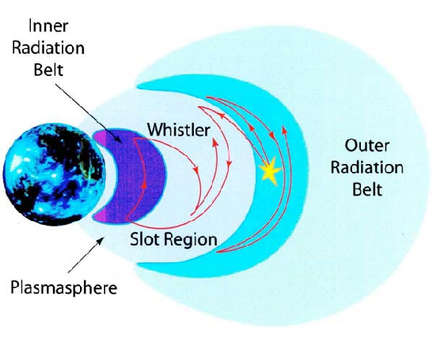

- Figure 13. The Van Allen radiation belts and the formation of the slot region (shown in dark blue) between the inner and outer belts (shown in light blue), by generation of whistler waves (red lines) that can cause particle loss into the atmosphere in a collision shown as the yellow star-symbol (from Ref. 62).

represents loss of particles from the magnetosphere to the ionosphere; it loads the ionosphere with plasma, being of higher energy than the solar UV-generated ionospheric populations and causing an increase in the ionospheric conductivity. It closes the ionospheric current system via field-aligned currents, and it is believed to contribute to, if not to cause, the diffuse aurorae.

first realization of the importance of plasma turbulence. Precipitation

59

Pitch-angle diffusion. Precipitation results from scattering of magnetospheric particles by plasma waves

. Collisions with the waves rotate the particle velocity vectors towards becoming more parallel to the magnetic field. This process is called “pitch-angle diffusion” and was at the heart of the work of two visiting senior scientists (Drs. Rycroft and Trakhtengerts), which will result in a separate monograph.

60

Radiation-belt lifetimes. Energetic, > 40 keV, Van Allen-radiation-belt electrons excite a broad spectrum of whistler waves. Pitch-angle scattering at these whistlers limits the lifetime of the particles in the radiation belts. In the inner belt, scattering is rather inefficient and lifeimes are long, explaining the stability of the inner Van Allen belt over years. Wave excitation and scattering is strongest at 4-5 RE equatorial distance from Earth. Here lifetimes are short, and a gap is gouged into the radiation belts (cf. Fig. 13), forming the “radiation belt

slot” that separates the inner belt from the less energetic outer belt. Ions undergo similar interactions with electromagnetic ion-cyclotron waves and precipitate predominantly at lower latitudes, where they cause the mid-latitude “auroral red arcs” during magnetospheric storms.

Plasma-sheet precipitation. The plasma sheet does not generate substantial whistler activity. Waves of presumably electrostatic nature are responsible for precipitation of electrons and ions from the plasma sheet. This remains an unresolved problem that was extensively discussed at the ISSI workshops

in relation to diffuse aurorae and substorm onset. Continuous field-aligned inflow of plasma-sheet electrons may be due to a broad spectrum of waves excited in the plasma sheet, and contributes to diffuse aurora. The more violent processes of substorms are related to the reconnection problem. Today’s understanding of the wave processes in the plasma sheet is still at a premature stage. Its resolution requires the complete understanding of the collisionless reconnection problem via high-resolution multi-spacecraft observation and three-dimensional numerical simulations.

61

### Concluding Remarks

Space plasma physics exploits for research the only directly accessible reservoir of collisionless plasma in the entire Universe

. As such, space plasma physics is not only of interest in itself as the experimental science that enables investigation of the fourth state of matter in-situ. Since most of the baryonic matter in the Universe is known to be in this state, it provides the paradigm for the processes taking place also in very remote cosmic regions. These regions reach out from the magnetospheres and ionospheres of the planets in our planetary system, through the magnetospheres and magnetized winds of stars, the solar and stellar atmospheres and coronae, stellar spheres comparable to our own heliosphere, to the magnetospheres of neutron stars, and to the formation of magnetic boundaries, reconnection, shock-wave formation, shock structure, particle acceleration, diffusion processes, and generation of radiation in collisionless plasma. Aurorae have been detected on the large magnetized planets of our Solar System. Similar phenomena take place in the solar corona and are expected to be found in the atmospheres of other stars and on exo-planets. Magnetospheres are known to exist around neutron stars and white dwarfs. Shock waves can be found everywhere in the galaxies accelerating particles to cosmic-ray energies.

62

The short review of the ISSI activities in the field of space plasma physics that has been given here is intended to provide an impression of the achievements over the past decade. It may also give a few hints regarding extrapolation to

remote systems. Some of these extrapolations have already been made early in the history of space plasma physics, when the concept of stellar winds was drawn up from the solar wind, and planetary as well as neutron-star magnetospheres were modelled along the lines of Earth’s magnetosphere. However, the more subtle knowledge of microscopic space plasma physics accumulated in recent years leads us to expect that some of these pictures will change at least as much as space plasma physics itself has been modified, leading to deeper understanding of internal processes.

### References

- 1 E.G. Shelley et al., J. Geophys. Res., 77, 6104, 1972.
- 2. E.G. Shelley et al., Geophys. Res. Lett., 3, 654, 1976.
- 3. J. Geiss et al., Space Sci. Rev., 22, 537,1978.
- 4. C.R. Chappell et al., J. Geophys. Res., 92, 5896, 1987.
- 5. B. Hultqvist & M. Øieroset (Eds.), Transport Across the Boundaries of the Magnetosphere, SSSI Vol. 2, Kluwer Academic Publ., Dordrecht, 1997, and Space Sci. Rev., 80, Nos. 1-2, 1997.
- 6. B. Hultqvist, M. Øieroset, G. Paschmann & R. Treumann (Eds.), Magnetospheric Plasma Sources and Losses, SSSI Vol. 6, Kluwer Academic Publ., Dordrecht, 1999, and Space Sci. Rev., 88, Nos. 1-2, 1999.
- 7. A.W. Yau & M. André, in Ref. 5, p.1.
- 8. D.A. Hardy et al., J. Geophys. Res., 90, 4229, 1985 and dto. 94, 370, 1989.
- 9. R.J. Walker et al., Physics of Space Plasmas, p. 561, AGU, 1996.
- 10. G. Paschmann, S. Haaland & R. Treumann (Eds.), Auroral Plasma Physics, SSSI Vol. 15, Kluwer Academic Publ., Dordrecht, 2002, and Space Sci. Rev., 103, Nos. 1-4, 2002.
- 11. K. Stasiewitz et al., Space Sci. Rev., 92, 423, 2000.
- 12. Ref. 10, Chapter 2.
- 13. Ref. 10, Chapter 4.
- 14. G. Paschmann & P. Daly (Eds), Analysis Methods for Multi-Spacecraft Data, ISSI-SR 1, ESA, 2000.
- 15. G. Paschmann, S. Schwartz, P. Escoubet & S. Haaland (Eds.), Outer Magnetospheric Boundaries: Cluster Results, SSSI Vol. 20, Springer Verlag, Dordrecht, 2005, and Space Sci. Rev. (in press) 2005.
- 16. B. Lembège et al., Space Sci. Rev., 110, 161, 2004.
- 17. Ref. 15, Part II (The Bow Shock).
- 18. Ref. 15, Part II, Chapter 2 (Quasiperpendicular Shock Structure).
- 19. Ref. 15, Part II, Chapter 2 ; K. Kucharek et al., Ann. Geophys., 22, 2301, 2004.
- 20. Ref. 15, Part II, Chapter 3 (Quasiparallel Shock Structure).
- 21. G. Paschmann, in Ref. 5, p. 217.
- 22. J.D. Scudder, in Ref. 5, p. 235.

- 23. R. Lundin, in Ref. 5, p. 269.
- 24. M. Scholer & R.A. Treumann, in Ref. 5, p. 341.
- 25. D.G. Sibeck et al., in Ref. 6, p. 207.
- 26. Ref. 15, Part III (Magnetopause and Cusp).
- 27. Ref. 15, Part III, Chapter 1 (Magnetopause and Boundary Layer).
- 28. Ref. 15, Part III, Chapter 1; H. Hasegawa et al., Ann Geophys., 22, 1251, 2004.
- 29. Ref. 15, Part III, Chapter 3 (Magnetopause Processes); A. Vaivads et al., Phys. Rev. Lett., 93, 105001, 2004.
- 30. Ref. 15, Part III, Chapter 3; T.D. Phan et al., Ann. Geophys., 22, 2355, 2004.
- 31. Ref. 15, Part III, Chapter 1; B.U.Ö. Sonnerup et al., Geophys. Res. Lett., 31, 10.1029/2004GL020134, 2004.
- 32. e.g. M. Lockwood et al., J. Geophys. Res., 95, 17117, 1990.
- 33. D.G. Sibeck et al., Geophys. Res. Lett., 25, 453, 1998.
- 34. D.G. Sibeck et al., J. Geophys. Res., 103, 6763, 1998.
- 35. G.I. Korotov et al., J. Geophys. Res., 107, 10.1029/2002JA009477, 2002.
- 36. D.L. Murr et al., J. Geophys. Res., 107, 10.1029/2002JA009456, 2002.
- 37. O. Amm et al., J. Geophys. Res., 107, 10.1029/2002JA009472, 2002.
- 38. T.M. Moretto et al., J. Geophys. Res., 107, 10.1029/2001JA000049, 2002.
- 39. D.G. Sibeck et al., J. Geophys. Res., 108, 10.1029/2002JA009675, 2003.
- 40. D.W. Shields et al., J. Geophys. Res., 108, 10.1029/2002JA009397, 2003.
- 41. C.R. Clauer & V.G. Petrov, J. Geophys. Res., 107, 10-1029/2001JA000228, 2002.
- 42. R. Diehl, E. Parizot, R. Kallenbach & R. von Steiger (Eds.), The Astrophysics of Galactic Cosmic Rays, SSSI Vol. 13, Kluwer Academic Publ., Dordrecht, 2001, and Space Sci. Rev., 99, Nos. 1-4, 2001.
- 43. G.M. Mason, in Ref. 42, p.119; R.A. Treumann & T. Terasawa, in Ref. 36, p.135.
- 44. S.R. Spangler, in Ref. 42, p.261; E. Bereshko, p. 295; D.C. Ellison, p. 305; A.M. Bykov, p. 317.
- 45. J.W. Bieber, E. Eroshenko, P. Evenson, E.O. Flückiger & R. Kallenbach (Eds.), Cosmic Rays and Earth, SSSI Vol.10, Kluwer Academic Publ., Dordrecht, 2000, and Space Sci. Rev., 93, Nos. 1-2, 2000.
- 46. W. Droege, in Ref. 45, p. 121.
- 47. T.G. Onsager & M. Lockwood, in Ref. 5, p. 77; L.R. Lyons, p. 109; H. Koskinen, p. 122.
- 48. cf. Ref. 6, Section 5.4; R.A. Treumann, Phys. Scripta, 59, 19 and 253, 1999.
- 49. P. Zarka et al., Astrophys. Space Sci., 277, 293, 2001.
- 50. Ref. 6, Section 5.5 on the Kelvin-Helmholtz instability.
- 51. Ref. 15, Part III, Chapter 3 (Magnetopause Processes); H. Hasegawa et al., Nature, 430, 755, 2004.
- 52. Ref. 15, Part I, Chapter 3 (Magnetosheath).
- 53. J.-L. Pinçon & U. Motschmann, in Ref. 14, p. 65.
- 54. cf. Ref. 15, part III, Chapter 3 (Magnetopause Processes); A. Vaivads et al., Geophys. Res. Lett., 31, 10.1029/2003GL018142, 2004.
- 55. B. Rogers et al., Phys. Rev. Lett., 87, 195004, 2001; M. Scholer, Phys. Plasmas, 10, 3521, 2003.

- 56. J. LaBelle & R.A. Treumann, Space Sci. Rev., 101, 295, 2002.
- 57. cf. Ref. 10, Chapter 4 (In-situ Measurements in the Auroral Plasma).
- 58. L.R. Lyons, in Ref. 5, p. 109; H.E. Koskinen, in Ref. 5, p. 133.
- 59. cf. Ref. 10, Section 4.3 (Waves and Radiation).
- 60. dto., Section 3.5 (Wave-Particle Interactions).
- 61. cf. Ref. 6, Section 3.4 (Precipitation from the Plasma Sheet).
- 62. J.A.M. Bleeker, J. Geiss & M.C.E. Huber (Eds.), The Century of Space Science, Vol. 2, p. 1495, Kluwer Academic Publ., Dordrecht, 2003.
