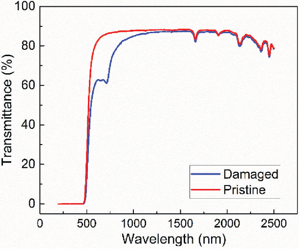
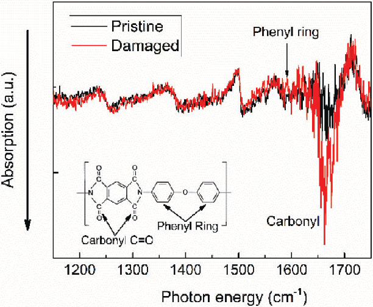
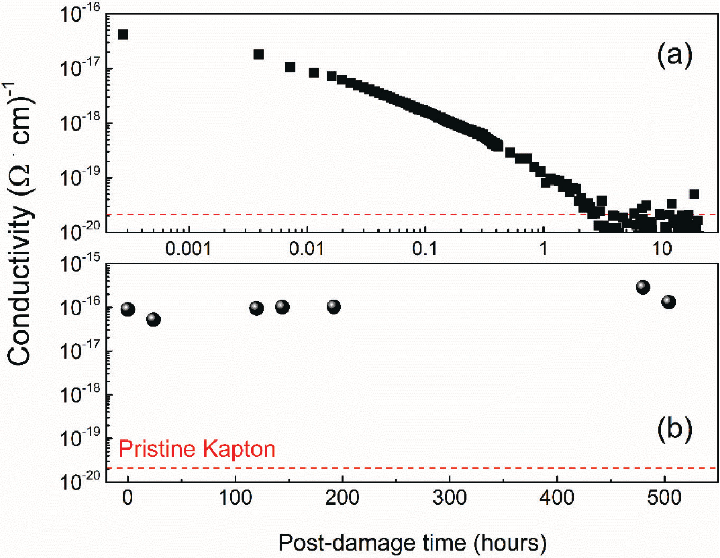
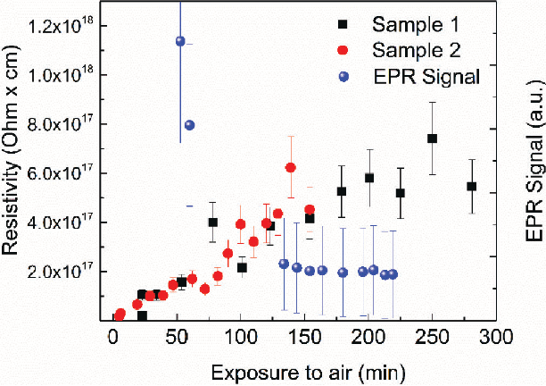
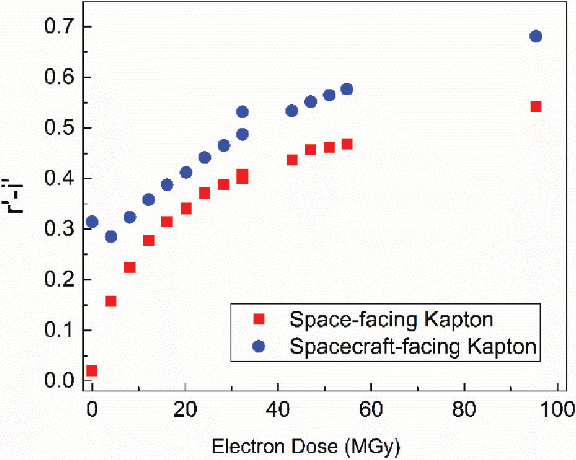

We are IntechOpen, the world’s leading publisher of Open Access books Built by scientists, for scientists

5,300

Open access books available

131,000 155M

International authors and editors

Downloads

Our authors are among the

154 TOP 1%

12.2%

Countries delivered to Contributors from top 500 universities

most cited scientists

Selection of our books indexed in the Book Citation Index in Web of Science™ Core Collection (BKCI)

# Interested in publishing with us? Contact book.department@intechopen.com

Numbers displayed above are based on latest data collected. For more information visit www.intechopen.com

Chapter 12

## Space Plasma Interactions with Spacecraft Materials

#### Daniel P. Engelhart, Elena A. Plis, Dale Ferguson, W. Robert Johnston, Russell Cooper and Ryan C. Hoffmann

###### Daniel P. Engelhart, Elena A. Plis, Dale Ferguson, W. Robert Johnston, Russell Cooper and Ryan C. Hofmann

| | |
|---|---|
| | |

Additional information is available at the end of the chapter

Additional information is available at the end of the chapter

http://dx.doi.org/10.5772/intechopen.78306

###### Abstract

Spacecraft materials on orbit are subjected to the harsh weather of space. In particular, high-energy electrons alter the chemical structure of polymers and cause charge accumulation. Understanding the mechanisms of damage and charge dissipation is critical to spacecraft construction and operational anomaly resolution. Energetic particles in space plasma break molecular bonds in polymers and create radicals that can act as space charge traps. These electron-induced chemical changes also result in changes to the spectral absorption proile of polymers on orbit. Radicals react over time, either recreating identical bonds to those in the pristine material, leading to material recovery, or creating new bonds, resulting in a new material with new physical properties. Lack of knowledge about this dynamic aging is a major impediment to accurate modeling of spacecraft behavior over its mission life. This chapter irst presents an investigation of the chemical and physical properties of polyimide ilms (PI, Kapton-H®) during and after irradiation with high-energy (90 keV) electrons. Second, the deleterious efects of space plasma on a spacecraft component level are presented. The results of this physical/chemical collaboration demonstrate the correlation of chemical changes in PI with the dynamic nature of spacecraft material aging.

| | |
|---|---|
| | |

Keywords: space plasma, geosynchronous earth orbit, polyimide, electrical charge transport, material optical signature, satellite arcing, relectivity

##### 1. Introduction

###### When a solid dielectric interacts with plasma, it is subject to a number of diferent destructive and non-destructive processes. A charged particle impinging on a surface with suicient

© 2016 The Author(s). Licensee InTech. This chapter is distributed under the terms of the Creative Commons Attribution License (http://creativecommons.org/licenses/by/3.0), which permits unrestricted use, distribution, and reproduction in any medium, provided the original work is properly cited.

© 2018 The Author(s). Licensee IntechOpen. This chapter is distributed under the terms of the Creative Commons Attribution License (http://creativecommons.org/licenses/by/3.0), which permits unrestricted use, distribution, and reproduction in any medium, provided the original work is properly cited.

energy will penetrate the surface and lose energy into the bulk of the material. The deposition of this kinetic energy will result in electronic and vibrational excitations. If suicient energy is deposited into a single bond to excite it beyond its dissociation energy, the chemical bond can be broken. The dominant mechanism of energy deposition depends strongly on the mass of the particle. Massive particles such as heavy ions will impart large amounts of ballistic energy over a relatively small depth, displacing nuclei in the solid, exciting phonons, and vibrational transitions suicient to rupture any chemical bond and create radicals. A less massive particle such as an electron can be expected to deposit energy primarily in the form of electronic excitation. Suicient electronic energy deposition will also rupture bonds and create radicals, but the damage will be deposited over a longer trajectory and the chemical damage will be more bond-selective. Ions, electrons, and photons incident on a surface will also eject secondary electrons, initiating charge imbalance near the surface. After the kinetic energy of a charged particle has been exhausted, the ion or electron can imbed itself into the bulk, creating a local charge imbalance at the penetration depth of the particle. When considering the interaction of space plasma with solid dielectrics, it is important to distinguish between energy deposition and charge deposition [1, 2].

| | |
|---|---|
| | |

The following chapter will focus on the interaction of electrons, which comprise the most damaging species in the Geosynchronous Earth Orbit (GEO) environment in terms of energy deposition [3–5], with dielectric materials such as polymers and solar array cover glass [6]. The results of this plasma/material interaction are characterized in terms of modiication of the materials’ optical and electrical properties. It will be shown that these materials change dramatically in the plasma environment and that these changes can have profound efects on the performance of spacecraft components.

The thermal plasma in GEO (6.6 Earth radii, or RE) is predominantly quasi-neutral plasma consisting of atomic hydrogen ions (replenished mainly by the solar wind and ionized by

Lyman-alpha radiation from the Sun) and electrons. It is typically at a very low-density (0.1–1 cm−3) but high plasma temperature (typically 4–10 keV). During geomagnetic storm conditions, the plasma temperature can increase dramatically (to 16–30 keV), as magnetic reconnection in the magnetotail accelerates trapped electrons, and the accompanying ions. The second population of particles exists at GEO in the highly non-thermal outer radiation belt. These highly energetic electrons (0.1–10 MeV) form a toroidal belt extending out to about 60,000 km (10 RE) from Earth, with a maximum intensity typically at about 3–5 RE at the equator. Thus, although GEO orbit is beyond the distance of maximum intensity, it is well within the limits of the outer belt, and satellites orbiting within it are subjected to signiicant penetrating electron luxes, as can be seen in Figure 1 [3–5].

| | |
|---|---|
| | |

The exterior of spacecraft is typically comprised of materials that regulate temperature by relecting visible sunlight and radiating infrared radiation. Among the most common of these materials is multi-layer insulation (MLI), which usually consists of many thin layers of a luminized (or silvered) polymers such as Kapton® (polyimide or PI). Tenets of modern spacecraft design dictate that radiation-sensitive electronics be positioned in the bulk of the spacecraft in a shielded conductive “Faraday cage”. These Faraday cages can only be

| | |
|---|---|
| | |

- Figure 1. Plot of mean annual electron lux (>100 keV electrons) orbit averaged, experienced by a satellite in a circular geocentric orbit as a function of altitude and maximum latitude (inclination for prograde orbits, a supplement of inclination for retrograde orbits). Representative orbits are shown as dashed lines for reference, as are the positions of the moon, International Space Station (ISS), and several other satellites. Figure based on AE9 V1.5 mean radiation belt model, [7] with mean solar wind values outside AE9 coverage from data collected by the Electron, Proton, and Alpha Monitor on the Advanced Composition Explorer (ACE EPAM) [5, 8].

penetrated by electrons of energy > 2 MeV, while electrons of > 0.25 MeV energy can fully penetrate the MLI layers [3]. However, surface materials are subject to deterioration by electrons of even 0.1 MeV, which have the greatest lux due to the steep outer belt electron spectrum, and are typically stopped within the outermost polymer layer [5]. In addition to damage caused by energy deposition, non-penetrating electrons deposit charge in the material.

| | |
|---|---|
| | |

The material properties of greatest interest to spacecraft engineers are those that inluence temperature and diferential charging. Surface temperature is dependent on the selectivity of the surface, deined as the ratio of incident light absorbed (absorptivity, α; heating) to radiated infrared lux (emissivity, ε; cooling). Any change in color or surface roughness will change one or both of these quantities, and lead to a change in equilibrium temperature. Unfortunately, both quantities may be changed by polymer degradation due to radiation.

Optical properties of materials are also important for surveillance and health-monitoring purposes. Satellites at GEO are not spatially resolvable with ground-based optics, even with adaptive optics techniques. Therefore, the observable quantities are brightness, position, color

(or relected spectrum), and polarization. Any change in these quantities may lead to satellite misidentiication, or be indicative of a change in satellite health.

Spacecraft charging is the potential a spacecraft or spacecraft component will assume as a result of the balance of incoming charged particles from the environment and particles removed via material conduction or electron emission. Interaction with space plasma can result in potential gradients between diferent spacecraft components (diferential charging) of thousands or even tens of thousands of volts, which can seriously afect the operation of the spacecraft. Diferential charging is most pronounced in GEO where the environment is dominated by electrons and the lux of mitigating ions is relatively low. Material properties also afect the charging behavior of a spacecraft. For instance, secondary electron emission and photoelectron emission tend to discharge surfaces, so spacecraft charging is very sensitive to these material properties. Also, dielectric materials can lose surface charge to interior chassis “ground” by electron conduction; this property also changes as the dielectric interacts with the ambient plasma. This is important due to the fact that in the presence of space plasma, electric arcs can jump from a negative surface to a positive surface if the potential diference between them is great enough. Depending on the amount of energy stored in the “surface capacitance,” these arcs can lead to contamination of adjacent surfaces, radio frequency interference, sharp current transients and electronic upsets, and in the worst case can develop into “sustained arcs” that can destroy entire solar arrays or other electrical circuits.

| | |
|---|---|
| | |

In general, charge buildup anywhere on or in the spacecraft can lead to arcing. Changes in surface and bulk conductivity, secondary electron emission, and photoemission will lead to changes in the local electric ields and therefore, changes in the susceptibility of spacecraft to arcing. Unfortunately, although these electrical properties are known to change with radiation exposure, the magnitude of the changes is poorly characterized at present.

In the laboratory materials degradation tests reported here, the incident electrons are 90 keV electrons unless otherwise noted. This energy is chosen because the outer belt non-thermal electron lux is highest at lower energies, so they are most important from an energy deposition standpoint. Finally, 90 keV electrons can easily be produced by commercial electron guns and are less dangerous from an X-ray production standpoint than higher energy electrons. High-energy ions can also produce material degradation, but the luxes of these particles in GEO are much lower than for electrons [5, 7].

| | |
|---|---|
| | |

###### 2. Space weather simulation facility

A spacecraft on orbit interacts with the ambient plasma environment, comprised of electrons, photons, and ions in a vacuum, in a number of diferent ways. For example, the surface of a spacecraft can develop a large potential relative to the spacecraft chassis due to non-penetrating charged particle deposition. Additionally, highly energetic photons [ultraviolet (UV) and vacuum ultraviolet (VUV)] and charged particles deliver high levels of radiation with suicient energy to break chemical bonds to the craft, surface materials in particular. This energy deposition leads to chemical bond breakage and reformation and radical formation [9]. These chemical

changes manifest themselves as changes to a number of diferent physical properties including absorptivity and emissivity, electrical conductivity, and mechanical properties of the materials. Because it is not experimentally convenient to study on orbit spacecraft in situ, the spacecraft charging and instrument calibration laboratory in the space vehicles directorate of the US air force research laboratory have constructed a space weather simulation chamber, nicknamed Jumbo, in which electron and VUV photon damage can be inlicted on a variety of spacecraft materials and the efects of this damage can be quantiied. The results of these simulated spaceaging experiments can be used to reine existing models for spacecraft diferential charging [10], predict, and characterize anomalous satellite behavior, identify space debris, and even be used to diagnose the health of satellites on orbit from ground-based observations.

| | |
|---|---|
| | |

The Jumbo space weather simulation chamber consists of a 6’ long, 6’ diameter cylindrical vacuum chamber, energetic particle sources, and various probes used for material characterization [11]. Pressures of < 10−6 Torr can be achieved from the atmosphere in ~1 h using a combination of mechanical pumps and a turbo- and/or a cryopump. In GEO, the electromagnetic radiation most likely to damage polymer materials is the Lyman-α line of hydrogen at 121.6 nm. These VUV) photons have enough energy (~10 eV) to break bonds in polymer materials. In order to mimic Lyman-α line of hydrogen, the chamber is equipped with four Krypton lamps (Resonance Ltd.) with emission lines at 123.6 and 116.5 nm, providing approximately 10 suns of VUV radiation. The prime electron source is a Kimball physics EG8105-UD electron lood gun with a range of 1–100 keV. This electron gun is used both for material aging (high-energy, deeply penetrating electrons) and for charging of materials (low-energy, shallowly penetration electrons) in order to perform SPD experiments from which material bulk conductivity/resistivity can be derived [12].

In addition to the particle sources, which are used to age common spacecraft materials; jumbo is equipped with a number of probes, which are used to characterize physical characteristics of the chosen material before, during, and after irradiation. The primary characterization tools used in vacuo are an integrating sphere with iber optic coupled external light source and spectrometer, which is used to characterize optical changes and a non-contact electrostatic voltmeter, which is used to investigate material charge transport characteristics using the SPD method.

Optical transmission/relectance spectra are recorded using an in-vacuum integrating sphere so that the measured quantity is the directional hemispherical relectance (DHR). For each measurement, an ASD FieldSpec Pro spectroradiometer operating over a 350–2500 nm range collects irst a white reference spectrum from a piece of in-vacuum calibrated Spectralon®. The electron beam is then temporarily extinguished and the motion system moves the integrating sphere to a sample carousel where it measures samples as they are rotated into the measurement position [13].

| | |
|---|---|
| | |

The SPD method utilizes charge injection via a low-energy electron beam to induce an electric potential near the surface of the material. To perform an SPD experiment, the front surface of the material is dusted by a beam of 5 keV electrons for 1–2 s immediately, after which the non-contact voltmeter is positioned 1–2 mm from the surface and begins to record the surface potential of the dielectric. After the charged body induced by the beam has reached the

grounded backplane, the dissipation of surface potential is primarily determined by the loss of electrons from the material and is directly proportional to the material conductivity. SPD measurements were performed in darkness to eliminate the possibility of optically enhanced conductivity and photoemission. Since SPD is measured immediately following the charging electron beam, persistent radiation-induced conductivity (RIC) is still active [14]. However, it is only in efect between the surface and the penetration depth of the electrons, which for the case of 5 keV electrons in polyimide is less than a micron [3]. This minimizes the efect of RIC, which is assumed to be negligible for the bulk of the material in this measurement.

| | |
|---|---|
| | |

In addition to in-vacuo characterization, a portable vacuum pumped window is used to transport aged materials to a commercial UV/visible transmission/relection spectrometer (PerkinElmer Lambda 950) and a Fourier transform infrared relection spectrometer (Surface Optics SOC-400T). The portable vacuum window was designed to enable characterization of air sensitive materials using existing bench-top instruments without subjecting the space-weathered samples to unnecessary air exposure. Post-irradiation air exposure has been shown to modify certain materials’ chemistry extensively and on a very short time scale (minutes) [15].

### 3. Efect of space plasma on satellites

###### 3.1. Electrostatic charge and discharge

Interaction of space plasma with materials on orbit has been shown to drastically and permanently change spacecraft materials’ charging properties. There is strong evidence that Galaxy 15, a GEO communications satellite, was incapacitated for 8 months due to arcing caused by the space environment, [16] even though in its 5 years of previous light it had experienced similar environments several times with no ill efects. Charging in the auroral streams or when satellites exit eclipse can cause arcing on solar arrays, single event upsets in electronics, or as in the case of ADEOS-2, arcing in power lines leading to a complete loss of power [17].

Diferent parts of a satellite have diferent susceptibilities to charge accumulation. For example, a space-like test of a four-cell GPS-like solar array showed that most arcs occurred on the SCV10-2568 room-temperature vulcanization rubber (RTV) used to glue the cells and wiring to the Kapton substrate or near solar cell edges or corners. Each arc discharged about the coverglass area of the array. From these results, it is hypothesized that at least some of the arcing that occurs on GPS satellites on orbit are from the RTV and that some of the contamination that degrades the GPS solar array performance over time comes from arcs on the RTV as well

| | |
|---|---|
| | |

- as from the arcs from silver interconnects [18].

The likelihood of electronic discharge on a satellite on orbit is a function of the diferential potentials that develop throughout the craft. That potential is dictated by the balance of incoming charge from the environment and charge that is removed via conduction and secondary electron emission. Since incoming charge cannot be controlled, the only way to predict what electric potential a material will adopt is to control the rate that charge is removed.

- Figure 2 is a plot of the SPD rate as a function of polyimide resistivity [12]. When that decay rate exceeds the orbital period (1 day for GEO) the material can gather charge for the entire mission and the likelihood of discharge increases. The red and green stars in Figure 2 show the resistivity of pristine polyimide and polyimide that has been radiation damaged, respectively. The irradiated material has become far less susceptible to charge accumulation, which is important to take into account in the design of spacecraft and the characterization of anomalous spacecraft behavior.

Charge transport characteristics of materials exposed to space plasma are deined by their fundamental material properties; in particular for insulators, density, and energy distribution of electron trap states within the band gap. Under the approach described by Dennison and Hofmann, [20] as materials are bombarded with a lux of penetrating high-energy radiation, energy is shared with many bound (valence) electrons within the material, which are excited into energy levels scatered in the conduction band. These excited electrons quickly thermalize to shallow localized trap states just below the conduction band edge. Next, electrons can, among other processes, (i) be thermally re-excited into the conduction band, leading to thermally assisted charge transport, and termed radiation-induced conductivity (RIC); [21] or (ii) hop to an adjacent trap, termed thermally assisted hopping conductivity or dark current (DC) conductivity [22]. In addition, as a material age, more traps are generated [23].

- Figure 3 Presents a representative charge–discharge curve of electron-irradiated PI material during and after bombardment with non-penetrating electrons. This curve can be divided into three regions: (I) charging section driven by the balance of electron deposition, secondary electron generation, RIC and DC conductivity; (II) pre-transit discharge section dominated by the RIC and DC conduction, as is the time regime when the deposited charge body is traversing the material but has not made contact with the grounded backplane; (III) post-transit discharge section dominated DC conduction.

| | |
|---|---|
| | |

| | |
|---|---|
| | |

- Figure 2. The plot of charge decay time versus resistivity value for PI. The red star indicates the resistivity of pristine PI and the green star that of laboratory-aged Kapton-H®. Figure adapted from [19].

| | |
|---|---|
| | |

- Figure 3. Representative charge/discharge curve of PI material bombarded with a non-penetrating electron. Shaded areas represent the three regions of the charge/discharge curve. See text for further details.

Theoretical models developed over the past several decades allow the extraction of many material parameters from a material’s charge/discharge curve, including the density of trapped states (region I), trapping and de-trapping rates, and efective electron mobility (region II), and dark resistivity and conductivity of the material (region III) [24–28].

In particular, the charging part of the charge/discharge curve (region I) may be modeled with the following equation developed by Sim [24]:

Vs(t) =

d }R(εb)[1 − exp{

]] (1)

qe(1 − m) }[1 − (1 + ____τt

_____________sc Jb τonset(1 − σyield)

ε0εr {1 −

____R(εb)

_____qe d Nt

1−m

onset)

Here qe is the charge of an electron, C; ε0 and εr are the permitivity of free space and relative permitivity of the chosen material, respectively; Jb is the electron beam lux, nA/cm2; d is a sample thickness, cm. The secondary electron yield, σyield, the number of electrons emited per incident electron, may be estimated based on the measurements and models of Song et al. [29]. The range, R (εb), is the maximum distance an electron of a given incident energy can penetrate through the material before all kinetic energy is lost and the electron comes to rest. Free parameters for Eq. (1) are the density of states, Nt; capture cross-section sc; characteristic onset time for the current decay to occur, τonset; and a power parameter m, with 0 < m < 1. The pre-transit discharge section (region II) may be described using a model based on original work of Toomer and Lewis [25] supplemented by Aragoneses et al [26].

| | |
|---|---|
| | |

____V0 μ0 2d2R(

_____rt a12 R + 2α{1 − e−(R+2α)t}) − λ tβ (2)

____V0 μ0 2d2R(rt t +

{1 − e−2𝛼t}) −

___rr a12 2α

__rt R{1 − e−Rt} +

____V(t)

V0 = 1 −

where d is the sample thickness, μm; Vo is the initial surface potential; R is the parameter describing charge transport dynamics; rr and rt are the probabilities of charge per unit time to be released from the trap and to be re-trapped in diferent trapping center, respectively, s−1; λ

is a dispersive term, taking into account the disordered structure of polyimide; μ0 is the carrier mobility between traps, m2 V−1 s−1; a1 and β are iting parameters. It is assumed that a fraction a1 of the charges are initially placed in the surface traps, from where they move to the bulk at a certain rate α, s−1. The remainder of the deposited charge (1-a1) is injected directly into the bulk immediately after the discharge.

The post-transit region of the surface potential decay curve (region III) starts when a charged body has reached the grounded back plane. This can take place within a fraction of a second for high conductivity polymers or years in the case of low conductivity polymers such as PTFE (Telon®). After the front of the charge, body has reached the grounded backplane the dissipation of charge is primarily determined by the loss of electrons from the material. This region is it by Eq. (3), from which a decay time and the dark resistivity of the material may be derived [30]:

| | |
|---|---|
| | |

b

Vs(τdecay) = m τdecay

τdecay

____ ϵ0 ϵr

ρdark =

(3)

where τdecay is charge decay time, seconds; m and b are iting parameters; ε0 and εr are permittivity of free space and relative permitivity of the PI material, respectively. The conductivity

of the material is then calculated as inversely proportional to the resistivity of the material, 1/Ω∙cm.

###### 3.2. Material changes

Interaction of PI with highly energetic particles of space plasma will modify its chemical structure. The extent of this modiication is a function of several simultaneous kinetic processes, namely, damage (interaction of material with highly energetic particles, resulting in broken chemical bonds), healing (formation of bonds identical to those damaged, returning the material to its pristine state), and scarring (formation of new chemical bonds in the damaged material, which are diferent from those in the pristine material) [15]. Often, macroscopic properties are measured making it diicult to distinguish healing from scarring; hence we refer to the sum of healing and scarring as recovery.

- Figure 4 Shows the photographs of a radiation-damaged PI sample taken immediately after irradiation with 90 keV mono-energetic electron lood gun to the dose of 5.6 × 107 Gy and a pristine PI control sample. This energetic dose is equivalent to that experienced by PI during approximately 8 years in GEO orbit [3, 5, 7]. The damaged sample has a deep brown color, which difers from the characteristic amber color of pristine PI. From Figure 4, it is clear both electron damage and subsequent exposure to air have a signiicant efect on the optical properties of PI in the visible spectrum.

| | |
|---|---|
| | |

The efect of damaging radiation on the optical properties of the irradiated material is evident from the transmission spectra of radiation-damaged PI, as shown in Figure 5. The red-shift of the absorption edge indicates an efective shrinking of the PI’s “band gap” to ~1.8 eV in the damaged material due to the emergence of radiation-induced electronic states. Compared to the measured “band gap” of Kapton of 2.3 eV, these states are energetically shallow [31].

- Figure 4. Photographs of pristine reference Kapton (left) and a radiation damaged Kapton sample (right) taken after an electron dose of 5.6 × 107 Gy. Right picture was taken after 2 min of air exposure.

- Figure 5. Transmitance spectra of pristine and radiation damaged PI samples.

| | |
|---|---|
| | |

Fourier-Transform Infrared (FTIR) spectroscopy was used to understand the underlying chemistry of radiation-induced damage in PI material. FTIR probes chemical bonding by exciting vibrational transitions within the polymer. Changes in the position and intensity of the IR absorption “ingerprint” of damaged material will ofer insights into what chemical bonds are being modiied during the radiation-induced degradation. PI has a complex IR signature with each peak corresponding to a speciic vibration within the monomer. Several characteristic vibrational assignments have been identiied [32–34] and are summarized in Table 1.

| | |
|---|---|
| | |

- Figure 6 presents FTIR spectra of pristine and radiation-damaged and subsequently air

exposed polyimide. Measurements were made in a portable vacuum sealed CaF2 window, with an absorption cutof at 1200 cm−1. Comparison of the FTIR spectra reveals two interest-

ing radiation-induced changes in the IR ingerprint of the damaged ilm. First, the absorption

- at the wavelength associated with the carbonyl out-of-phase stretch increased after electron bombardment. This suggests irst that existing carbonyl moieties were not preferentially broken due to the electron bombardment. A signiicant reduction in the absorption associated

Assignment Absorption (cm−1) Characterization δ(phenyl) 1004 Phenyl ring deformation

- ν(C-N-C) 1117 Imide stretch
- ν(C-O-C) 1261 Bridging C-O-C stretch δ(C-N-C) 1380 Imide stretch ν(phenyl) 1465 Phenyl ring C-C stretch C=C 1515 Aromatic C=C stretching ν(phenyl) 1601 Phenyl ring C-C stretch ν(C=O) 1675 Out-of-phase carbonyl stretch ν(C=O) 1753 Cyclic anhydride 1890–1940 Cyclic anhydrides, presented in not fully cured polymer

| | |
|---|---|
| | |

Table 1. Vibrational assignments of polyimide.

with phenyl ring C-C stretch after electron bombardment suggests that ether breakage is accompanied by rupture of the phenyl rings in the monomer, possibly leading to the formation of a new pi-bonded carbon structure containing the new carbonyl. It is important to note that because this sample had been exposed to air after damage but before the investigation, the damage products evident from the FTIR spectra result from the sum of both damage and material recovery [35].

To evaluate the efect of space plasma on the charge transport properties of PI, bulk conductivities of radiation-damaged samples were evaluated. Figure 7 compares bulk conductivities of PI samples irradiated with a dose of 5.6×107 Gy and recovered in the air (top panel) and under vacuum (botom panel). The initial post-irradiation conductivity of the two damaged PI samples was nearly the same [5 × 10−17 (Ω∙cm)−1] and [8 × 10−17 (Ω∙cm)−1]. However, air exposure of radiation-damaged PI resulted in rapid recovery, within 3 h, of the irradiated material’s conductivity from its initial value to that of pristine Kapton [2 × 10−20 (Ω∙cm)−1], whereas the vacuum recovery of radiation-damaged PI retained the same value for over 3 weeks (504 h) after the damaging process.

| | |
|---|---|
| | |

From Figure 7 it is obvious that air exposure has a signiicant efect on charge transport properties of the radiation-damaged PI material. This illustrates the necessity of in-vacuum characterization techniques with minimized air exposure to the irradiated material. Still, observation of air recovery process of radiation-damaged PI may provide some insights into the chemistry driving the aging and recovery process.

The conductivity of two radiation damaged PI samples (dose of 5.6 × 107 Gy) as a function of cumulative air exposure time is ploted in Figure 8. After irradiation, Samples 1 and 2 were stored under vacuum and only exposed to air during conductivity measurements. Both samples recovered to nearly the conductivity of pristine Kapton after 250 and 400 h (vacuum and air exposed), respectively. However, when conductivity is ploted purely versus air

| | |
|---|---|
| | |

- Figure 6. Absorption spectra of reference (pristine) and radiation-damaged with a dose of 5.6 × 107 Gy PI samples. Lower values on the ordinate indicate more absorbed light in the polymer. Notice increased absorption at the carbonyl stretching frequency (1675 cm−1) and decreased absorption at the phenyl ring C-C stretch (1435–1570 cm−1) in the damaged sample. The inset shows chemical structure of polyimide with relevant moieties identiied.

| | |
|---|---|
| | |

- Figure 7. Comparison of (a) air- and (b) vacuum-recovered conductivities of PI irradiated with a dose of 5.6 × 107 Gy. The dashed line indicates the conductivity of pristine Kapton-H®.

exposure, as shown in Figure 8, it is apparent that the healing process proceeds primarily under exposure to the atmosphere. It has since been reported that the enhanced conductivity of electron-irradiated PI is stable under vacuum conditions [35].

To further investigate the efect of damaging radiation on PI, including the concentration and nature of free radicals, EPR measurements were performed on electron irradiated PI material. Radical concentrations are reported as arbitrary units and scaled according to relative peakto-peak intensity. A reference sample (pristine PI) showed no EPR signal indicating that the number of unpaired electrons was below the detection limit in pristine PI, as was expected. However, a strong initial EPR signal was measured in the damaged material that decayed with exposure to air (Figure 8).

| | |
|---|---|
| | |

The fact that the conductivity of radiation-damaged PI decays on the same time scale as the concentration of radicals suggests that these properties are interconnected. These corresponding time scales are also suggestive that the concentration of radicals plays a critical role in the transport of electrons through the bulk of the material. It is reasonable to assume that creation and decay of radicals in the material will modify the density and energetic distribution of electron trap states in the bandgap of PI [36–38]. This is further supported by the UV/Vis spectroscopy that shows the development of energetically shallow traps in the bandgap of damaged PI, as seen in Figure 5.

Moreover, charge transport in disordered materials like PI occurs via incoherent hopping among transport sites [22, 38, 39]. Bulk conductivity is inluenced by both energetic and geometric disorder. That is to say, the facility with which an electron can travel through a disordered material in the presence of a strong electric ield is dependent on both the energetic distribution of transport sites within the material and the geometric distribution of the transport sites. The later dependency arises due to the variation of intersite electronic

| | |
|---|---|
| | |

- Figure 8. Resistivity (inverse of conductivity) for two samples and EPR signal of radiation-damaged PI ilm ploted as a function of cumulative air exposure time.

wavefunction overlap arising from the positional and orientational distribution of these hopping sites [38]. It is our hypothesis that the radical sites created due to bond-speciic rupture during electron bombardment can act as electron hopping sites, which are not present in the pristine material.

Finally, it has been commonly assumed that exposure to air would be deleterious to understanding how materials recover in a vacuum. However, since PI is very stable under normal conditions a small amount of air exposure is accepted as necessary and largely unavoidable in the majority of studies that have been published [40–42]. Data presented here show that air exposure dominates the post-irradiation chemistry of PI and that even limited air exposure (less than 10 min) will cause dramatic and unwanted efects that will obscure experimental studies. This fact illustrates the necessity of in-vacuum characterization methods as well as a careful examination of material handling techniques when reviewing the literature.

| | |
|---|---|
| | |

### 4. Deleterious efects of plasma interactions with spacecraft

While interactions with space plasma can sometimes change material properties in a beneicial way (see succeeding section), these interactions also often have deleterious efects on spacecraft performance, often related to a change of electrical potentials on either internal or surface materials. If the local electric ield becomes larger than some threshold value, electrostatic discharges (sometimes called arcs) will occur. Spacecraft arcs have been seen to have the following efects:

- 1. Large and rapid current spikes, which can cause latchups or even destroy sensitive electronic components.
- 2. Transients in spacecraft power.
- 3. Electromagnetic interference (EMI), which can interfere with communications, and so on.
- 4. Contamination of surrounding surfaces, which can afect optical transparency (usually thermal, but maybe solar cell current output) and electrical properties.
- 5. Short-circuits between individual solar cell junctions, causing the loss of power from individual cells.
- 6. Sustained arcing between adjacent solar array strings or from solar array strings to spacecraft ground, which can lead to permanent short-circuits and power loss in one or all strings (total loss of power).

| | |
|---|---|
| | |

Due to these and other issues, eforts are usually made to prevent arcs by choosing appropriate materials and power system engineering. Elaborate computer codes are used to see where and when spacecraft charging is likely to occur and to adjust surface and interior materials

where arcing susceptibility is found. If material properties change dramatically due to the space radiation, however, these models are invalidated, as they rely on pristine material characteristics, and unwanted surprises are likely to occur.

Unexpected, unexplained slow and pernicious power loss has been consistently observed in GPS satellites [43]. Although the loss was quickly determined to be due to the contamination of the solar array surfaces, a seemingly exhaustive search for sources of the contamination turned up no suspects. Confronted with the challenge, engineers decided to oversize the solar arrays by 25%, such that the deteriorated solar arrays would still provide adequate power at the end-of-life. This was an expensive and diicult solution because it led to increased spacecraft weight and volume, important launch considerations. Recently, it has been discovered that GPS solar arrays have been undergoing extensive arcing and gradually contaminating their own surfaces, decreasing the amount of sunlight that can reach the active parts of the solar cells [18, 43]. The arcing had gone undetected because of heavy iltering of electrical transients in the power system. Ground-based testing has shown that the power loss can be explained by the contamination produced by thousands of solar array arcs seen on orbit. In this case, a change in material properties due to the space plasma environment led to an unexpected and deleterious result.

| | |
|---|---|
| | |

As with changes in human DNA, changes in spacecraft materials properties may be beneicial but are usually not. If, however, the materials properties changes can be quantiied and predicted, engineering can achieve a survivable spacecraft throughout its anticipated life. In the case of GPS, understanding the cause of solar array power degradation is leading to designs that can prevent the cause of the degradation, and in the end, provide a more reliable, cheaper, lighter, and smaller satellite that can still fulill its mission.

###### 5. Modiication of material optical signatures after exposure to aspace plasma environment

In general, it has been found that the space environment fundamentally changes spacecraft materials [15, 44–46]. The nature of particles primarily responsible for the damage is dependent on the orbit; in GEO, high-energy electrons are the primary damaging species in terms of energy deposition into the bulk of the material [5]. This energy deposition breaks chemical bonds within the material, resulting in the creation of new electronic transitions in the material. These new electronic transitions manifest themselves in altered optical and physical properties, such as color change and electrical conductivity.

| | |
|---|---|
| | |

Over the last decade, astronomical relectance spectroscopy has been proposed to characterize the material properties of artiicial space objects, such as satellites, rocket bodies, and human-made debris [47, 48]. In this application, relected light is collected from a remote target illuminated by a continuous source, the Sun. The relected light produces a spectrum whose shape and absorption features are indicative of a speciic material composition. Since

each material has a unique spectral ingerprint, it may be unambiguously identiied if its spectral features are well diferentiated.

One example of applied optical characterization of materials in space is the assessment of high area-to-mass ratio (HAMR) objects, consisting primarily of spacecraft MLI. Several layers of MLI have comprised of aluminum sputered polyimide. It has been shown that after electron irradiation the hemispheric relectance spectrum, the sum of all difuse and specular relectance of a surface under difuse illumination, of this aluminized PI changes considerably. This change in relectance is due in part to the change in absorbance of the polymer portion of the material. Since the PI is backed by a thin relective aluminum layer, the light that would otherwise pass through the PI is instead relected back into the spectrometer. Pristine PI is fairly transparent between 500 and 700 nm the absorption edge at 500 nm is what gives PI its characteristic amber color. The damaged material’s new electronic structure results in resonant absorption of lower energy photons, which results in a shift of the absorption band edge to around 730 nm. This phenomenon manifests itself as a darkening of the material in the visible spectrum [15, 49].

| | |
|---|---|
| | |

Because the change in optical absorption is greater at some wavelengths than others, the ratio of one spectral band to another, known as a color–color plot, can be used to characterize the extent of space plasma exposure experienced by spacecraft material. Figure 9 shows the evolution of the color–color plots of two diferent aluminum sputered PI layers of MLI after various electron exposures. The color–color plots were generated using the passbands associated with the r’ and i’ ilters deined by the Sloane Digital Sky Survey [50–53]. For a more detailed description of the experiment, refer to reference [13].

Conceivably, the magnitude of change of these color–color indices is great enough to enable identiication and/or characterization of space debris clouds. Knowledge of the origin of these debris clouds can be used to facilitate space debris remediation [54, 55].

| | |
|---|---|
| | |

- Figure 9. r’-i’ plots for space- and space-craft facing Kapton. The magnitude of change for all materials is comparable. However, the absolute magnitude of the dose difers due to the material composition.

###### 6. Conclusion

As the population of man-made objects in space grows ever more rapidly, understanding the interaction of space plasma with commonly used materials becomes only ever more important. Clearly, knowledge of the diferent facets of this interaction can be used to the advantage of aerospace scientists either as a diagnostic tool or as guidelines that can result in more eicient and robust spacecraft design. Further, detailed knowledge of how space plasma interacts with materials in Earth’s orbit will guide the development of next-generation spacecraft materials.

| | |
|---|---|
| | |

While the information presented in this chapter is not exhaustive, it serves to illustrate the broad variety of chemical and physical changes that can occur when a given material interacts with space-like plasma. The examples presented here were chosen due to the ubiquity of polyimide and solar arrays on existing spacecraft. The simulated GEO environment (high-energy electrons) used to study these interactions is a irst-order approximation for the rather more complicated GEO environment. Although electrons are the primary damaging species in GEO in terms of energy deposition, a more representative space weather simulation would include protons and UV photons in order to study synergistic damage processes that occur during the interaction of materials with a more complicated charged particle environment [5].

###### Acknowledgements

We would like to acknowledge support from the Air Force Oice of Scientiic Research, Remote Sensing and Imaging Physics Portfolio (Dr. Stacy Williams). Grant 17RVCOR414.

###### Conlict of interest

No conlict of interest is declared.

| | |
|---|---|
| | |

###### Author details

Daniel P. Engelhart1*, Elena A. Plis1, Dale Ferguson2, W. Robert Johnston2, Russell Cooper2 and Ryan C. Hofmann2

*Address all correspondence to: afrl.rvborgmailbox@us.af.mil 1 Assurance Technology Corporation, Carlisle, MA, USA 2 Air Force Research Laboratory, Space Vehicles Directorate, USA, Kirtland AFB, Albuquerque, NM, USA

### References

- [1] Marleta G, Iacona F. Heat-induced versus particle-beam-induced chemistry in polyimide. Nuclear Instruments & Methods in Physics Research Section B-Beam Interactions with Materials and Atoms. 1993;80-1:1045-1049
- [2] Marleta G. Chemical reactions and physical property modiications induced by keV ion beams in polymers. Nuclear Instruments and Methods in Physics Research Section B: Beam Interactions with Materials and Atoms. 1990;46(1-4):295-305
- [3] Berger MJ, Coursey JS, Zucker MA, Chang J. ESTAR, PSTAR, and ASTAR: Computer Programs for Calculating Stopping-Power and Range Tables for Electrons, Protons, and Helium Ions (version 1.2.3). Gaithersburg, MD: National Institute of Standards and Technology; 2005. Available: htp://physics.nist.gov/Star [2018, May 30]
- [4] Jursa AS, Laboratory USAFG. Handbook of Geophysics and the Space Environment: Air Force Geophysics Laboratory. USA: Air Force Systems Command, U.S. Air Force; 1985
- [5] Ginet G, O’Brien T, Huston S, Johnston W, Guild T, Friedel R, et al. AE9, AP9 and SPM: New models for specifying the trapped energetic particle and space plasma environment. Space Science Reviews. 2013;179(1-4):579-615
- [6] Mateo-Velez JC, Sicard-Piet A, Lazaro D, Inguimbert V, Sarrailh P, Hess S, et al. Severe geostationary environments: Numerical estimation of spacecraft surface charging from light data. Journal of Spacecraft and Rockets. 2016;53(2):304-316
- [7] O’Brien TP, Johnston WR, Huston SL, Roth CJ, Guild TB, Su YJ, et al. Changes in AE9/ AP9-IRENE Version 1.5. IEEE Transactions on Nuclear Science. 2018;65(1):462-466
- [8] Space Weather Prediction Center. US National Oceanographic and Atmospheric Admini stration; [Cited 2018]. Available from: htps://www.swpc.noaa.gov/products/ace-realtime-solar-wind
- [9] Mehnert R. Materials modiication using electron beams. In: Misaelides P, editor. Application of Particle and Laser Beams in Materials Technology. Nato Advanced Science Institutes Series, Series E, Applied Sciences. Vol. 2831995. pp. 557-580
- [10] Mandell MJ, Davis VA, Cooke DL, Wheelock AT, Roth C. Nascap-2k spacecraft charging code overview. IEEE Transactions on Plasma Science. 2006;34(5):2084-2093
- [11] Cooper R, Hofmann R. Jumbo space environment simulation and spacecraft charging chamber characterization. Air Force Technical Report; 2015. AFRL-RV-PS-TP-2015-0012
- [12] Plis EA, Engelhart DP, Likar J, Hofmann RC, Cooper R, Ferguson D. Electrical behavior of carbon-loaded Kapton for spacecraft applications. Journal of Spacecraft and Rockets. 2017:1-2
- [13] Engelhart DP, Cowardin H, Maxwell J, Plis E, Ferguson D, Barton D, Schiefer S, Hofmann R. Space Weathering Experiments on Spacecraft Materials. Advanced Maui Optical and Space Surveillance Technologies Conference; Maui, HI, USA; 2017

| | |
|---|---|
| | |

| | |
|---|---|
| | |

- [14] Tyutnev A, Saenko V, Pozhidaev E, Ikhsanov R. Experimental and theoretical studies of radiation-induced conductivity in spacecraft polymers. IEEE Transactions on Plasma Science. 2015;PP(99):1
- [15] Engelhart DP, Plis E, Humagain S, Greenbaum S, Ferguson D, Cooper R, et al. Chemical and electrical dynamics of polyimide ilm damaged by electron radiation. IEEE Transactions on Plasma Science. 2017;45(9):2573-2577
- [16] Ferguson D, Denig W, Rodriguez J. Plasma Conditions During the Galaxy 15 Anomaly and the Possibility of ESD from Subsurface Charging. 49th AIAA Aerospace Sciences Meeting Including the New Horizons Forum and Aerospace Exposition. Orlando, FL, USA: Aerospace Sciences Meetings: American Institute of Aeronautics and Astronautics; 2011
- [17] Hosoda S, Kim J, Cho M, Toyoda K, Kawakita S, Kusawake M, et al. Ground investigation of sustained arc phenomena in power cables on ADEOS-II satellite. Journal of the Japan Society for Aeronautical and Space Sciences. 2006;54(633):427-433
- [18] Ferguson DC, Hofman RC, Engelhart DP, Plis EA. Voltage threshold and power degradation rate for GPS solar array arcing. IEEE Transactions on Plasma Science; 2017
- [19] Dennison J, Frederickson A, Swaminathan P. Charge Storage, Conductivity and Charge Proiles of Insulators As Related to Spacecraft Charging. All Physics Faculty Publications; 2003 (Paper 1485). htp://digitalcommons.usu.edu/physics_facpub/1485
- [20] Hofmann R, Dennison JR, Thomson CD, Albretsen J. Low-luence electron yields of highly insulating materials. IEEE Transactions on Plasma Science. 2008;36(5):2238-2245
- [21] Dennison J, Gillespie J, Hodges J, Hofmann R, Abbot J, Hunt AW, et al. Radiation Induced Conductivity of Highly-Insulating Spacecraft Materials. In: 10th Spacecraft Charging Technology Conference; 2009. Biarriz: France
- [22] Brunson J. Hopping Conductivity and Charge Transport in Low Density Polyethylene. Logan, UT, USA: Utah State University; 2010
- [23] Blaise G. Charge localization and transport in disordered dielectric materials. Journal of Electrostatics. 2001;50(2):69-89
- [24] Sim A. Uniied Model of Charge Transport in Insulating Polymeric Materials. Logan Utah: Utah State University; 2013
- [25] Toomer R, Lewis T. Charge trapping in corona-charge polyethylene ilms. Journal of Physics D: Applied Physics. 1980;13(7):1343
- [26] Aragoneses A, Mudarra M, Belana J, Diego JA. Study of dispersive mobility in polyimide by surface voltage decay measurements. Polymer. 2008;49(10):2440-2443
- [27] Meyza X, Goeuriot D, Guerret-Piécourt C, Tréheux D, Fiting H-J. Secondary electron emission and self-consistent charge transport and storage in bulk insulators: Application to alumina. Journal of Applied Physics. 2003;94(8):5384-5392

| | |
|---|---|
| | |

| | |
|---|---|
| | |

- [28] Hofmann R, Dennison J. Measurement methods of electron emission over a full range of sample charging. IEEE Transactions on Plasma Science. 2012;40(2):298-304
- [29] Song Z, Ong C, Gong H. Secondary and backscatered electron yields of polymer surface under electron beam irradiation. Applied Surface Science. 1997;119(1):169-175
- [30] Dennison JR, Brunson J, Swaminathan P, Green NW, Frederickson AR. Methods for high resistivity measurements related to spacecraft-charging. IEEE Transactions on Plasma Science. 2006;34(5):2191-2203
- [31] Yohei Komiyama SS, Miyake H, Tanaka Y, Takada T. Observation of surface discharge phenomena on dielectric ilms under low pressure using pockels efect. In: Jacob Kleiman MT, Kimoto Y, editors. Protection of Materials and Structures from the Space Environment. Amsterdam, Netherlands: Springer Verlag; 2012. p. 456
- [32] Nurmukhametov R, Likhachev DY, Lavrov S, Kardash JY. Features of electronic absorption spectra of aromatic polyimides and polyisoimides. Polymer Science USSR. 1989; 31(2):434-440
- [33] Ortelli E, Geiger F, Lippert T, Wokaun A. Pyrolysis of Kapton® in air: An in situ DRIFT study. Applied Spectroscopy. 2001;55(4):412-419
- [34] Li R, Li C, He S, Di M, Yang D. Damage efect of keV proton irradiation on aluminized Kapton ilm. Radiation Physics and Chemistry. 2008;77(4):482-489
- [35] Engelhart DP, Plis E, Ferguson D, Cooper R, Hofmann R. Optical and chemical characterization of polyimide in a GEO-like environment. Technical Paper: 2016 Advanced Maui Optical and Space Surveillance Technologies Conference; 2016
- [36] Silva HS, Dominguez IF, Perthue A, Topham PD, Bussiere PO, Hiorns RC, et al. Designing intrinsically photostable low band gap polymers: A smart tool combining EPR spectroscopy and DFT calculations. Journal of Materials Chemistry A. 2016;4(40):15647-15654
- [37] Ennis CP, Kaiser RI. Mechanistical studies on the electron-induced degradation of polymethylmethacrylate and Kapton. Physical Chemistry Chemical Physics. 2010;12(45): 14902-14915
- [38] Gartstein YN, Conwell EM. Of-diagonal disorder and activation-energy of high-ield hopping motion. Physical Review B. 1995;51(11):6947-6952
- [39] Noro S, Yamadaya T. ESR and electrical-conduction in PYROLYZED polyimides. Journal of Polymer Science Part B-Polymer Physics. 1991;29(3):359-363
- [40] Srinivasan R, Hall R, Allbee D. Generation of electrically conducting features in polyimide (KaptonTM) ilms with continuous wave, ultraviolet laser radiation. Applied Physics Leters. 1993;63(24):3382-3383
- [41] Tahara H, Kawabata T, Zhang LL, Yasui T, Yoshikawa T. Exposure of spacecraft polymers to energetic ions, electrons and ultraviolet light. Nuclear Instruments & Methods in Physics Research Section B-Beam Interactions with Materials and Atoms. 1997;121(1-4):446-449

| | |
|---|---|
| | |

| | |
|---|---|
| | |

- [42] Engelhart DP, Ferguson D, Cooper R, Hofmann R. Optical and Chemical Characterization of Polyimide in a GEO-like environment. Advanced Maui Optical and Space Surveillance Technologies Conference; Maui, USA; 2016
- [43] Ferguson D, Crabtree P, White S, Vayner B. Anomalous GPS power degradation from arc-induced contamination. Journal of Spacecraft and Rockets. 2016
- [44] Wu Y, Sun C, Xiao J, Li R, Yang D, He S. A study on the free-radical evolution and its correlation with the optical degradation of 170 keV proton-irradiated polyimide. Polymer Degradation and Stability. 2010;95(7):1219-1225
- [45] Sun YM, Zhu ZY, Jin YF, Liu CL, Wang ZG, Liu J, et al. The efects of high electronic energy loss on the chemical modiication of polyimide. Nuclear Instruments & Methods in Physics Research Section B-Beam Interactions with Materials and Atoms. 2002;193:214-220
- [46] Choi HS, Lee J, Cho KS, Kwak YS, Cho IH, Park YD, et al. Analysis of GEO spacecraft anomalies: Space weather relationships. Space Weather-the International Journal of Research and Applications. 2011:9
- [47] Aberkromby KJ, Hamada K, Guyote M, Okada J, Barker E. Remote and ground truth spectral measurement comparisons of FORMOSAT III. Advance Maui Optical and Space Surveillance Technologies Conference; Maui, USA; 2007
- [48] Bedard MD. Using a physics-based relection model to study the reddening efect observed in spectrometric measurements of artiicial space objects. Advance Maui Optical and Space Surveillance Technologies Conference; Maui, USA; 2007
- [49] Plis E, Engelhart DP, Barton D, Cooper R, Ferguson D, Hofmann R. Degradation of polyimide under exposure to 90keV electrons. Physica Status Solidi B-Basic Solid State Physics. 2017;254(7)
- [50] Sloan Digital Sky Survey [cited 2017 June]. Available from: htp://www.sdss.org/dr12/ algorithms/ugrizvegasun/
- [51] Fukugita M, Ichikawa T, Gunn JE, Doi M, Shimasaku K, Schneider DP. The sloan digital sky survey photometric system. Astronomical Journal. 1996;111(4):1748-1756
- [52] Astrophysical Institute Potsdam [cited 2017 June]. Available from: htp://www.aip.de/ en/research/facilities/stella/instruments/data/sloanugriz-ilter-curves
- [53] Astrodon Photometrics [cited 2017 June]. Available from: htp://www.astrodon.com/ store/p12/Astrodon_Photometrics_Sloan_Filters.html
- [54] Cowardin H, Seizer P, Abercromby K, Barker E, Schildknecht T. Characterization of Orbital Debris Photometric Properties Derived from Laboratory-Based Measurements. Advanced Maui Optical and Space Surveillance Technologies Conference; Maui, USA; 2010
- [55] Schildknecht T, Musci R, Ploner M, Beutler G, Flury W, Kuusela J, et al. Optical observations of space debris in GEO and in highly-eccentric orbits. Advances in Space Research. 2004;34(5):901-911

| | |
|---|---|
| | |

| | |
|---|---|
| | |

| | |
|---|---|
| | |

| | |
|---|---|
| | |
