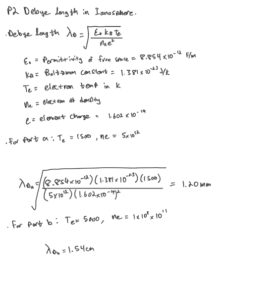
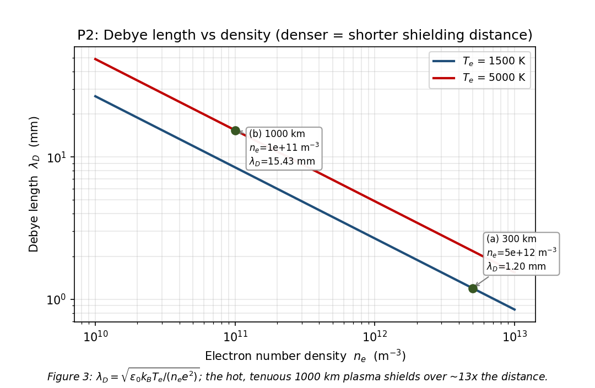
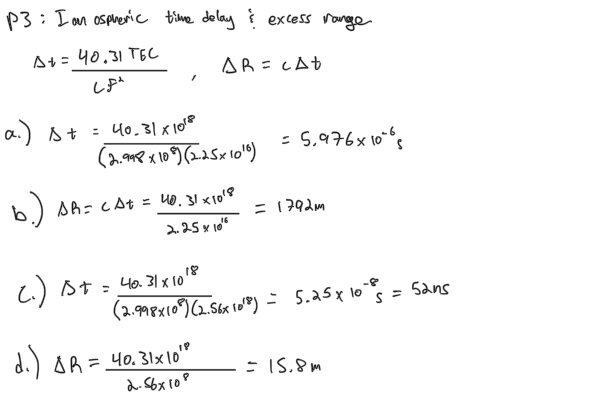
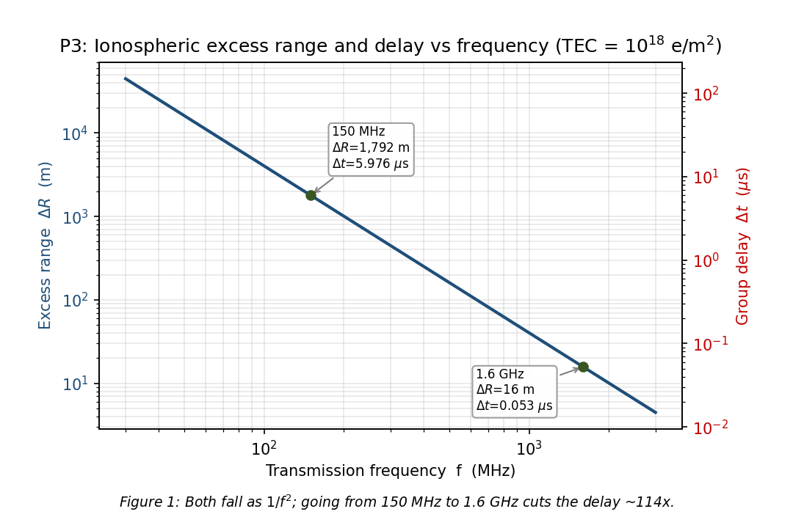
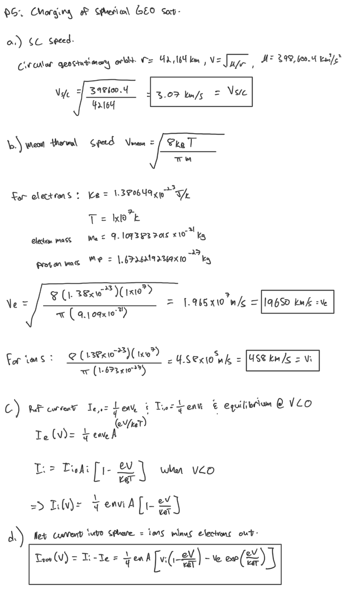
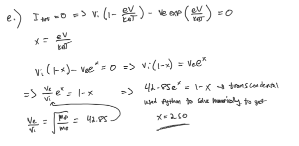
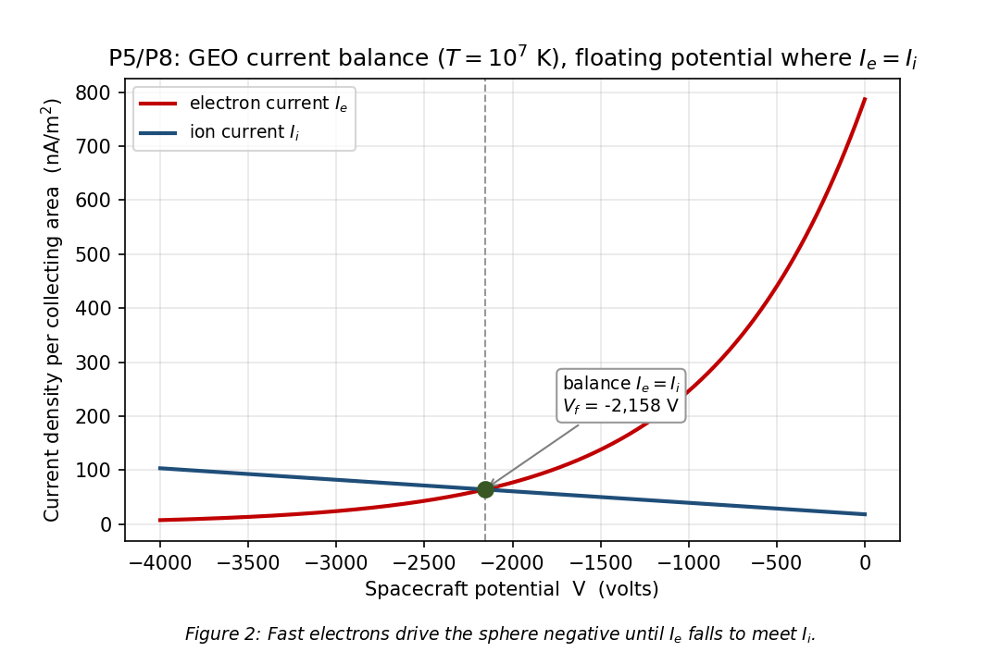

# SPCE 5065: Homework 4
**The plasma environment: Debye shielding, ionospheric delay, and spacecraft charging**
**Author:** Jordan Clayton
**Date:** July 18, 2026


---

## Problem 1: Current-Events Presentations

> *For the current-events presentations this week: (a) Summarize the presentation, (b) Describe something you learned from it, (c) Write one question you have left about the presentation.*

Three this week, all on orbital debris from different angles. I cover each in turn.

### Trent Douglas, rising debris and collision risk in LEO [1]

**(a) Summary.** From ESA's 2026 Space Environment Report. The population: ~40,000 tracked objects, ~54,000 larger than 10 cm (a quarter untracked), ~1.2 million lethal-but-untrackable 1 to 10 cm fragments, ~140 million under 1 cm. At 550 km (Starlink's shell), collision-avoidance maneuvers ran 200,000 to 300,000 per year in 2024/2025 and are projected toward a million by 2027, because debris density there is now within ~10x of active-satellite density. He tied it to the Kessler threshold and a 2025 study finding the intact population already past it for nearly every altitude from 500 to 20,000 km. The kicker: the "crash clock" (time to a catastrophic collision if everyone stopped maneuvering) fell from 121 days in 2018 to 2.8 to 5.5 days by mid-2025. Upside: 90% of LEO rocket bodies meet the 25-year de-orbit rule and ClearSpace has a ~$100M first-removal contract, but he argued we need 95% disposal compliance plus removal at scale.

**(b) Something I learned.** The crash clock going from 121 days to under a week in seven years reframes debris from "clean up eventually" to "the cascade timescale is already inside one lost-contact event."

**(c) Question I have left.** If the intact population is already past Kessler across most of LEO/MEO, can active removal reverse it, and what removal rate re-stabilizes 550 km?

### Ron Smetak, China's growing debris problem [2]

**(a) Summary.** Since 2021 China has abandoned 51 spent rocket bodies above 650 km (~86% of the global total), and the abandoned mass has more than tripled (~98% of the global increase), versus 4 US and 1 Russian body. Mass matters because these bodies explode (residual fuel plus environmental material weakening): China lost two Long March 6A (CZ-6A) stages and a Jielong-3 in four years, and the August 2024 CZ-6A breakup made 1,000+ pieces at 810 km, now threatening the ISS and Starlink. The payloads are China's Guowang and Qianfan mega-constellations, only ~200 of a planned 15,000, so far more is coming. Mitigation exists (a UN COPUOS measure signed by 60+ nations, the 25-year rule, de-orbit fuel, electric low-injection strategies) but compliance is unverifiable.

**(b) Something I learned.** One nation's disposal policy dominates the global picture (86% of bodies, 98% of the mass increase), not the diffuse everyone's-fault problem I'd assumed.

**(c) Question I have left.** Is there a technical (not political) way to verify a spent stage was passivated, or to attribute a fragmentation to a specific operator?

### Claire Wadman, MMOD design considerations [3]

**(a) Summary.** MMOD is man-made debris (dead stages, defunct sats, fragments) plus natural micrometeoroids (10 microns to 2 mm), both hitting at up to ~17,500 mph in LEO (~10x a bullet). ESA tracked 36,240 objects in 2024 (only bigger than 10 cm is trackable), on a near-exponential curve since the 1960s. Risk by size: bigger than 10 cm is trackable but too big to shield (catastrophic); 1 to 10 cm is the nasty middle (often untrackable, still too big to shield); under 1 cm is untrackable but shieldable (minor, cumulative). Design toolkit: material selection, Whipple shields (sacrificial aluminum, a 1940s idea still standard), reduced degradation-driven fragmentation, higher-reliability propellants and batteries, better collision-avoidance maneuverability, and post-mission disposal (graveyard or de-orbit).

**(b) Something I learned.** The 1 to 10 cm band is the unsolved one, too small to track and too big to shield. Above it you dodge, below it you shield; in the middle, neither.

**(c) Question I have left.** For the 1 to 10 cm band, is the fix better tracking or larger Whipple stand-off, and where is the mass/cost crossover for a real bus?

---

## Problem 2: Debye Length in the Ionosphere

> *A Debye length is a measure of a charge carrier's net electrostatic effect in a plasma and how far its electrostatic effect persists. (a) Determine the Debye length at 300 km, where the electron temperature is about 1500 K, assuming a daytime solar-max plasma density. (b) Determine the Debye length at 1000 km, where the electron temperature is about 5000 K, assuming a daytime solar-max plasma density.*

The Debye length is the shielding distance, how far a charge's influence reaches before the crowd screens it out (Lesson 4 Part 1) [4]:

$$\lambda_D = \sqrt{\frac{\varepsilon_0\, k_B\, T_e}{n_e\, e^2}}$$

Density is the only judgment call, so I read $n_e$ off the course day/solar-max plasma-density profile (the Tribble figure in Lesson 4 Part 1) [4], [5]: ~$5\times10^{12}\ \text{m}^{-3}$ at the 300 km peak, dropping to ~$1\times10^{11}\ \text{m}^{-3}$ by 1000 km. That 1000 km value is the daytime solar-max topside (well above the quiescent plasmasphere's ~$10^{10}\ \text{m}^{-3}$), consistent with the ~$1.6\times10^{11}\ \text{m}^{-3}$ used in the Lesson 4 charging example [4].

**Table 1:** Debye length inputs and results.

| Part | Altitude | $T_e$ (K) | $n_e$ (m$^{-3}$), day/solar-max | $\lambda_D$ |
|:---|---:|---:|---:|---:|
| (a) | 300 km | 1500 | $5\times10^{12}$ | 1.20 mm |
| (b) | 1000 km | 5000 | $1\times10^{11}$ | 1.54 cm |

The plug-in for both parts is in the hand calc below.

<p align="center"></p>

$$\boxed{\lambda_{D,\,300\ \text{km}} = 1.20\ \text{mm} \qquad \lambda_{D,\,1000\ \text{km}} = 1.54\ \text{cm}}$$

See **Figure 3**. The 1000 km plasma is hotter (which lengthens $\lambda_D$) but ~50x thinner, and density wins, so its shielding distance is ~13x longer.



**Sanity check:** the shortcut $\lambda_D = 69.0\sqrt{T_e/n_e}$ m reproduces the 300 km value to the digit.

---

## Problem 3: Ionospheric Time Delay and Excess Range

> *An electromagnetic signal traverses the ionosphere vertically along a path with a total electron content of $10^{18}$ electrons/m$^2$. (a) Vertical time delay at 150 MHz. (b) Excess range at 150 MHz if vacuum $c$ were used. (c) Time delay at 1.6 GHz. (d) Excess range at 1.6 GHz.*

Computation. Free electrons slow the group velocity, so a signal arrives late by an amount set by the total electron content (TEC), falling off as $1/f^2$ (Lesson 4 Part 3) [4]:

$$\Delta t = \frac{40.31\,\text{TEC}}{c\, f^2} \qquad\qquad \Delta R = c\,\Delta t = \frac{40.31\,\text{TEC}}{f^2}$$

with TEC in electrons/m$^2$, $f$ in Hz, $\Delta t$ in seconds, $\Delta R$ in meters (TEC $= 10^{18}$).

**Table 2:** Delay and excess range vs frequency.

| Part | Frequency | $f^2$ (Hz$^2$) | Time delay $\Delta t$ | Excess range $\Delta R$ |
|:---|---:|---:|---:|---:|
| (a), (b) | 150 MHz | $2.25\times10^{16}$ | 5.976 $\mu$s | 1791.6 m |
| (c), (d) | 1.6 GHz | $2.56\times10^{18}$ | 52.5 ns | 15.75 m |

All four are the same two formulas at new inputs, worked in the hand calc below. Going to 1.6 GHz shrinks $f^2$ by $(1600/150)^2 \approx 114$, exactly the factor the delay and range drop by.

<p align="center"></p>

$$\boxed{\text{(a) } \Delta t = 5.98\ \mu\text{s} \quad \text{(b) } \Delta R = 1792\ \text{m} \quad \text{(c) } \Delta t = 52.5\ \text{ns} \quad \text{(d) } \Delta R = 15.8\ \text{m}}$$



**Sanity check:** $c\,\Delta t = \Delta R$ to the meter at both frequencies. This $1/f^2$ scaling is why GPS runs at GHz and broadcasts two frequencies: differencing the delays measures TEC and cancels most of the error.

---

## Problem 4: An Online Ionospheric Model

> *Find an online ionospheric model. Provide an example of the model and describe it. Include, at a minimum, who publishes it, where the data is gathered from, and any limitations of the model.*

**The model: the International Reference Ionosphere (IRI).** The international standard empirical model of the ionosphere, with a free online interface (the NASA/CCMC web runner) where you enter a location, date, and time and get vertical profiles back [6].

- **Who publishes it.** Jointly sponsored by COSPAR (Committee on Space Research) and URSI (International Union of Radio Science) through the IRI working group, hosted by NASA Goddard's Space Physics Data Facility and CCMC, D. Bilitza the longtime lead, updated on a named-year cadence (IRI-2016, IRI-2020) [6].
- **What it outputs.** Over roughly 50 to 2000 km: monthly-median electron density, electron/ion temperatures, ion composition, F2-peak density and height (NmF2, hmF2), and vertical TEC [6]. 
**Example:** a solar-max noon profile over Colorado Springs returns an F2 peak of a few $\times10^{12}$ m$^{-3}$ around 300 km (the value I used in Problem 2), the kind of number Problems 2 and 3 need.
- **Where the data comes from.** Data-driven, not first-principles: the worldwide ionosonde network, incoherent-scatter radars (Jicamarca, Arecibo, Millstone Hill), topside sounders (Alouette, ISIS), in-situ satellite probes, and rocket soundings, fit into a climatology driven by solar and magnetic indices [6].
- **Limitations.** It's a climatology (monthly medians), so it gives the average state, not the weather: no individual storms, SIDs, or day-to-day variability; accuracy degrades at high latitudes and the equatorial anomaly; the topside and plasmasphere are less data-constrained than the F-peak; and it's only as good as its solar-index inputs [6]. Real-time work needs an assimilative or physics-based model.

So IRI answers "what's the typical electron density here," not "what will the ionosphere do during tomorrow's storm."

---

## Problem 5: Charging of a Spherical GEO Satellite

> *Spacecraft in high orbits can attain high potentials because the hot plasma gives protons and electrons very large average speeds. To minimize the induced current in a spherical geostationary satellite, how large will the spacecraft voltage be? The plasma temperature is $10^7$ K. The first-order currents are, for electrons, $I_e = I_{e,o}A_e e^{eV/k_BT_e}$ for $V<0$ (repelled) and $I_e = I_{e,o}A_e[1+eV/k_BT_e]$ for $V>0$ (attracted), with $I_{e,o} = \tfrac14 e n_e v_{mean}$ and $v_{mean} = \sqrt{8k_BT_e/\pi m_e} - v_{spacecraft}$; for ions, the mirror-image forms. (a) Speed of the spacecraft? (b) Mean speeds of the ions and electrons? (c) Expressions for the induced currents in terms of V. (d) Expression for total current. (e) For no current flow, what is the spacecraft voltage? (f) Is this high risk, and what would you recommend?*

Hybrid: computations (a, b) feed a current-balance solve (c, d, e), then judgment (f).

**Assumptions:**
- The sphere collects both species over its **whole area**, $A_e = A_i = A$: thermal speeds dwarf the orbital speed (see part b), so both populations arrive from every direction (no LEO-style ram/wake split).
- **Quasineutral, single-temperature** electron-proton plasma: $n_e = n_i = n$, $T_e = T_i = T = 10^7$ K.
- Physically consistent sign convention the slide flags ("include neg sign for V") [4]: a **repelled** species is Boltzmann-suppressed, an **attracted** one grows linearly. The equilibrium is negative, so electrons are repelled and ions attracted.

### (a) Spacecraft speed

Circular geostationary orbit, $r = 42{,}164$ km, $v = \sqrt{\mu/r}$ with $\mu = 398{,}600.4\ \text{km}^3/\text{s}^2$:

$$\boxed{v_{s/c} = 3.07\ \text{km/s}}$$

### (b) Mean speeds

Mean thermal speed $v_{mean} = \sqrt{8k_BT/\pi m}$ (Lesson 4 Part 2) [4], same $T = 10^7$ K for both (worked in the hand calc):

$$\boxed{v_e \approx 1.96\times10^4\ \text{km/s} \qquad v_i \approx 458\ \text{km/s}}$$

The point of part (a): at 3.07 km/s the spacecraft is ~$10^{-4}$ of the electron speed and under 1% of the ion speed, so $v_{mean} \approx v_{thermal}$ for both species.

### (c) Current expressions in terms of V

At the equilibrium ($V<0$, electrons drive the sphere negative), electrons are repelled (Boltzmann-suppressed) and ions attracted (linear orbit-limited), with reference currents $I_{e,o} = \tfrac14 e n v_e$ and $I_{i,o} = \tfrac14 e n v_i$. The two expressions $I_e(V)$ and $I_i(V)$ are worked in the hand calc below.

### (d) Total current

Net current is ions in minus electrons out, $I_{total} = I_i - I_e$

<p align="center"></p>

### (e) Voltage for no net current

Setting $I_{total} = 0$ (the floating potential) and dividing out the common $\tfrac14 e n A$ gives a transcendental balance in $x \equiv eV/k_BT$, using $v_e/v_i = \sqrt{m_p/m_e} = 42.85$. The calc solves it to $x = -2.50$, i.e. the standard $V \approx -2.5\, k_BT_e/e$ result for a hot electron-proton plasma [4]. With $k_BT_e/e = 861.7$ V:

$$\boxed{V = -2.50\,\frac{k_BT_e}{e} \approx -2.16\ \text{kV}}$$

<p align="center"></p>

**Figure 2** shows the crossing: a steep electron exponential meeting a gentle ion line, so the balance sits well negative.



### (f) Risk and recommendation

**Yes, this is a real hazard.** At $-2.2$ kV the danger isn't the absolute level but **differential** charging: coverglass, Kapton, and metal structure settle at different potentials, and once the gap exceeds the breakdown threshold you get an electrostatic discharge (Lesson 4 Part 2) [4], [5]. That arc is the dominant threat (EMI, spurious avionics switching, solar-array damage, contamination reattraction) and is the GEO-substorm mechanism behind real losses like Galaxy 15's 8-month outage [5].

**Recommendations** (standard mitigation playbook, Lesson 4 Part 3) [4]:
- Make all exterior surfaces at least partially conductive and tie every conductive element to a common ground so the vehicle charges as one body.
- Add conductive coatings on dielectrics (ITO on coverglass) so they bleed charge instead of storing it.


A well-bonded conductive sphere survives a couple kV; charging the surfaces *differentially* at that level is what kills hardware, so the whole fix is equalizing and draining charge.

---

## Problem 6: npn vs pnp Transistors and Negative Spacecraft Bias

> *One reason most Earth-orbiting spacecraft are negatively biased is the wider use of npn versus pnp transistors. (a) What are npn and pnp transistors, and what are their advantages and disadvantages? (b) Why might npn be of wider use on Earth-orbiting spacecraft than pnp?*

### (a) What they are

Both are bipolar junction transistors: three doped regions (emitter, base, collector) forming two back-to-back junctions.

- **npn:** n-type emitter and collector around a thin p-type base; majority carriers are electrons; turns on when the base goes positive relative to the emitter.
- **pnp:** the mirror image, with holes as majority carriers; turns on when the base goes negative relative to the emitter.

**Advantages / disadvantages:**
- **npn is faster.** Electron mobility in silicon (~1400 cm$^2$/V·s) is ~**3x** the hole mobility (~450 cm$^2$/V·s) [7], so npn switches faster, carries more current, has higher gain-bandwidth, and is cheaper to fabricate. Hence it dominates.
- **pnp is the slower complement.** Lower-performance for the same size, but you need it (or PMOS) for push-pull output stages, high-side switching, and level shifting.

Tradeoff: npn performance and manufacturability versus the circuit flexibility of having both polarities.

### (b) Why npn dominates on spacecraft, and why that biases them negative

- **Heritage.** npn's speed/current/cost edge carries to orbit, and space electronics lean on flight-proven, rad-tolerant heritage parts, which are overwhelmingly npn.
- **Grounding convention.** An npn stage references its emitter to the most negative rail, so an npn-heavy design makes the negative power terminal the system reference.
- **Bonded to structure.** Tying that negative rail to chassis ground (standard, and the common-ground charging fix from Problem 5) puts the structure at the most negative potential relative to its own circuitry: the spacecraft is negatively biased.
- **Reinforces the physics.** The environment already charges an unbiased body negative (electrons arrive faster, Problem 5), so the npn grounding convention stacks with it rather than fighting it.

---

## Problem 7: A Spacecraft-Grounding Reference

> *Select a peer-reviewed journal article or NASA document that describes the electrical grounding of spacecraft and summarize its contents.*

**Document: NASA-HDBK-4001, _Electrical Grounding Architecture for Unmanned Spacecraft_** (NASA Technical Handbook, 1998) [8]. Agency guidance on choosing and implementing a grounding scheme, tied directly to the charging physics in Problems 5 and 6.

**What it covers:**
- **Three grounding architectures.** **Single-point (star)** routes every return to one node to kill ground loops (best at low frequency); multi-point ties equipment to a low-impedance ground plane (best at RF, where lead inductance dominates); hybrid mixes the two (single-point at DC, multi-point at RF via capacitors).
- **Structure as the reference.** The chassis is the single common reference for signal, power, and shield returns, with all conductive elements bonded to it: the "tie everything to a common ground" fix from Problem 5.
- **Power and isolation practice.** Where to tie primary/secondary returns, when to isolate (transformer/optocoupler) to break loops, and cable shield-termination rules.
- **Charging/EMC motivation.** A coherent architecture keeps surfaces near a common potential, minimizing EMI, ground-loop noise, and ESD.

**Takeaway:** it's the engineering rulebook behind Problem 5's one-line recommendation, specifying the architecture, isolation, and bonding requirements that make "common ground" actually work.

---

## Problem 8: Voltage of a Spacecraft at Synchronous Altitude

> *Determine the voltage with respect to its environment of a spacecraft at synchronous altitude if the plasma temperature is $10^7$ K. Consider the environment to consist primarily of electrons and protons. Clearly state your assumptions.*

Computation, same setup as Problem 5, so I reuse that machinery.

**Assumptions:** spherical body collecting both species over its full area ($A_e = A_i$), quasineutral single-temperature electron-proton plasma ($n_e = n_i$, $T_e = T_i = 10^7$ K), and the 3.07 km/s orbital speed negligible against the thermal speeds (Problem 5b).

The voltage "with respect to its environment" is the floating potential (zero net current). From the Problem 5 balance, with $v_e/v_i = \sqrt{m_p/m_e} = 42.85$ and $x = eV/k_BT$:

$$42.85\, e^{x} = 1 - x \;\;\Longrightarrow\;\; x = -2.50 \;\;\Longrightarrow\;\; V = -2.50\,\frac{k_BT_e}{e}$$

With $k_BT_e/e = 861.7$ V:

$$\boxed{V \approx -2.16\ \text{kV}}$$

**Sanity check:** dropping the linear ion term and balancing only the Boltzmann electron flux against a flat ion saturation gives $e^{x} = v_i/v_e = 1/42.85$, so $x = -3.76$ and $V \approx -3.2$ kV. Either model floats the vehicle a couple kilovolts below its environment, which is the whole reason GEO charging is dangerous.

---

## Sources Cited

[1] Douglas, T., "Rising Debris and Collision Risk in LEO" (based on ESA 2026 Space Environment Report), current-events presentation, SPCE 5065, University of Colorado Colorado Springs, July 2026.

[2] Smetak, R., "China's Growing Space Debris Problem: A Rising Threat in LEO," current-events presentation, SPCE 5065, University of Colorado Colorado Springs, July 2026.

[3] Wadman, C., "Micrometeoroids and Orbital Debris: Design Considerations," current-events presentation, SPCE 5065, University of Colorado Colorado Springs, July 2026.

[4] George, L., "The Plasma Environment: Lesson 4 (Plasma Parts 1-3)," SPCE 5065 lecture videos and slides, University of Colorado Colorado Springs, 2026.

[5] Tribble, A. C., *The Space Environment: Implications for Spacecraft Design*, rev. ed., Princeton University Press, Princeton, NJ, 2003, Chaps. 5 and 8.

[6] Bilitza, D., et al., "International Reference Ionosphere (IRI)," COSPAR/URSI IRI Working Group, hosted by NASA Goddard Space Physics Data Facility / Community Coordinated Modeling Center, https://ccmc.gsfc.nasa.gov/models/IRI~2020/ and https://irimodel.org/ [retrieved 18 July 2026].

[7] Sze, S. M., and Ng, K. K., *Physics of Semiconductor Devices*, 3rd ed., Wiley, Hoboken, NJ, 2007 (silicon carrier mobilities).

[8] NASA, *Electrical Grounding Architecture for Unmanned Spacecraft*, NASA-HDBK-4001, National Aeronautics and Space Administration, Washington, DC, 1998.

---

## Appendix: Python Solution Script

```python
"""SPCE 5065 -- Homework 4 solution (the plasma environment).

Covers the quantitative parts of HW4:

  P2  Debye length in the ionosphere at 300 km and 1000 km
  P3  Ionospheric group delay and excess range at 150 MHz and 1.6 GHz (TEC = 1e18)
  P5  Spacecraft charging of a spherical GEO satellite in a 1e7 K plasma:
        mean speeds, GEO orbital speed, current-balance solve for the
        floating (zero-net-current) potential
  P8  Same floating-potential calc, stated standalone at synchronous altitude

Conceptual problems (P1 current events, P4 ionospheric model, P6 npn/pnp,
P7 grounding article) are answered in the submission document; they need no code.

Outputs:
  - Console tables reproducing every boxed number in the submission
  - figures/fig1_delay_range_vs_freq.png   (P3)
  - figures/fig2_charging_current_balance.png (P5/P8)
  - figures/fig3_debye_vs_density.png       (P2)
"""
from __future__ import annotations

import sys
from pathlib import Path

import matplotlib.pyplot as plt
import numpy as np
from scipy.optimize import brentq

# --------------------------------------------------------------------------
# Constants (Lesson 4 cheat sheet)
# --------------------------------------------------------------------------
E_CHG = 1.602176634e-19       # C        electron charge magnitude
K_B = 1.380649e-23            # J/K      Boltzmann constant
EPS0 = 8.8541878128e-12       # F/m      vacuum permittivity
M_E = 9.1093837015e-31        # kg       electron mass
M_P = 1.67262192369e-27       # kg       proton mass
C_LIGHT = 2.99792458e8        # m/s      vacuum speed of light
MU_EARTH = 398600.4418        # km^3/s^2 Earth gravitational parameter
R_GEO_KM = 42164.0            # km       geostationary orbital radius

FIG_DIR = Path(__file__).parent / "figures"


# --------------------------------------------------------------------------
# P2 -- Debye length
# --------------------------------------------------------------------------
def debye_length(Te: float, ne: float) -> float:
    """Debye length (m).  lambda_D = sqrt(eps0 * kB * Te / (ne * e^2))."""
    return np.sqrt(EPS0 * K_B * Te / (ne * E_CHG**2))


def p2() -> None:
    print("=" * 70)
    print("P2 -- Debye length in the ionosphere")
    print("=" * 70)
    # (n_e read from the course day/solar-max plasma-density profile)
    cases = [
        ("(a) 300 km ", 1500.0, 5.0e12),
        ("(b) 1000 km", 5000.0, 1.0e11),
    ]
    for label, Te, ne in cases:
        lam = debye_length(Te, ne)
        print(f"  {label}: Te = {Te:6.0f} K, ne = {ne:.1e} m^-3  ->  "
              f"lambda_D = {lam:.3e} m = {lam*1e3:.3f} mm = {lam*100:.3f} cm")
    # Verification: the 69*sqrt(Te/ne) engineering form should agree.
    lam_eng = 69.01 * np.sqrt(1500.0 / 5.0e12)
    print(f"  [check] 69.0*sqrt(Te/ne) at 300 km = {lam_eng*1e3:.3f} mm "
          f"(matches full formula)")


# --------------------------------------------------------------------------
# P3 -- ionospheric group delay and excess range
# --------------------------------------------------------------------------
def excess_range(tec: float, f: float) -> float:
    """Excess range (m).  dR = 40.31 * TEC / f^2."""
    return 40.31 * tec / f**2


def time_delay(tec: float, f: float) -> float:
    """Group delay (s).  dt = 40.31 * TEC / (c * f^2) = dR / c."""
    return 40.31 * tec / (C_LIGHT * f**2)


def p3() -> None:
    print("=" * 70)
    print("P3 -- ionospheric time delay and excess range (TEC = 1e18 e/m^2)")
    print("=" * 70)
    tec = 1.0e18
    for f, name in [(150e6, "150 MHz"), (1.6e9, "1.6 GHz")]:
        dt = time_delay(tec, f)
        dR = excess_range(tec, f)
        print(f"  f = {name:8s}: dt = {dt*1e6:8.4f} us = {dt*1e9:8.2f} ns    "
              f"dR = {dR:8.2f} m = {dR/1e3:.4f} km")
    # Verification: dR should equal c*dt
    f = 150e6
    print(f"  [check] c*dt(150 MHz) = {C_LIGHT*time_delay(tec, f):.2f} m "
          f"vs dR = {excess_range(tec, f):.2f} m")


# --------------------------------------------------------------------------
# P5 / P8 -- spacecraft charging
# --------------------------------------------------------------------------
def mean_speed(T: float, m: float) -> float:
    """Mean (thermal) speed (m/s).  v_mean = sqrt(8 kB T / (pi m))."""
    return np.sqrt(8.0 * K_B * T / (np.pi * m))


def geo_speed_kms() -> float:
    """Circular geostationary orbital speed (km/s).  v = sqrt(mu / r)."""
    return np.sqrt(MU_EARTH / R_GEO_KM)


def floating_potential_geo(T: float) -> tuple[float, float]:
    """Solve current balance I_e(V) = I_i(V) for V < 0 at GEO.

    Electrons repelled (V<0):  I_e = I_eo A exp(eV/kT_e)
    Ions attracted   (V<0):  I_i = I_io A [1 - eV/kT_i]
    with I_eo/I_io = v_e/v_i = sqrt(m_i/m_e) and T_e = T_i = T.

    Let x = eV/kT.  Balance:  (v_e/v_i) exp(x) = 1 - x.
    Returns (x, V_volts).
    """
    ratio = mean_speed(T, M_E) / mean_speed(T, M_P)   # v_e / v_i = sqrt(mi/me)
    f = lambda x: ratio * np.exp(x) - (1.0 - x)
    x = brentq(f, -10.0, 0.0)
    kT_over_e = K_B * T / E_CHG
    return x, x * kT_over_e


def p5_p8() -> None:
    print("=" * 70)
    print("P5 / P8 -- spacecraft charging at GEO, plasma T = 1e7 K")
    print("=" * 70)
    T = 1.0e7
    v_sc = geo_speed_kms()
    v_e = mean_speed(T, M_E)
    v_i = mean_speed(T, M_P)
    print(f"  (a) spacecraft (GEO) speed         = {v_sc:.4f} km/s")
    print(f"  (b) electron mean speed            = {v_e:.4e} m/s = "
          f"{v_e/1e3:,.0f} km/s")
    print(f"      proton   mean speed            = {v_i:.4e} m/s = "
          f"{v_i/1e3:,.0f} km/s")
    print(f"      v_e / v_i = sqrt(mi/me)        = {v_e/v_i:.3f}")
    print(f"      v_sc / v_e                     = {v_sc*1e3/v_e:.2e}  "
          f"(spacecraft speed negligible vs thermal)")

    x, V = floating_potential_geo(T)
    kT_over_e = K_B * T / E_CHG
    print(f"  (e) kB*Te/e                        = {kT_over_e:.2f} V")
    print(f"      current-balance root  x=eV/kT  = {x:.4f}  (prof approx -2.5)")
    print(f"      floating potential V           = {V:,.1f} V = {V/1e3:.3f} kV")
    # Verification: standard -2.5 kT/e result for a hot e-/proton plasma
    print(f"  [check] -2.5 * kB*Te/e             = {-2.5*kT_over_e:,.1f} V")


# --------------------------------------------------------------------------
# Figures
# --------------------------------------------------------------------------
def _caption(fig, text: str) -> None:
    fig.text(0.5, 0.01, text, ha="center", va="bottom", fontsize=9,
             style="italic")


def fig_delay_range_vs_freq() -> None:
    """P3: excess range and time delay vs frequency at TEC = 1e18."""
    tec = 1.0e18
    f = np.logspace(np.log10(30e6), np.log10(3e9), 500)   # 30 MHz to 3 GHz
    dR = excess_range(tec, f)
    dt = time_delay(tec, f)

    fig, ax1 = plt.subplots(figsize=(7.2, 4.7))
    ax1.loglog(f / 1e6, dR, color="#1f4e79", lw=2, label="excess range")
    ax1.set_xlabel("Transmission frequency  f  (MHz)")
    ax1.set_ylabel("Excess range  $\\Delta R$  (m)", color="#1f4e79")
    ax1.tick_params(axis="y", labelcolor="#1f4e79")
    ax1.grid(True, which="both", alpha=0.3)

    ax2 = ax1.twinx()          # right axis: time delay = dR / c
    ax2.loglog(f / 1e6, dt * 1e6, color="#c00000", lw=0, alpha=0)  # keep scale
    ax2.set_ylabel("Group delay  $\\Delta t$  ($\\mu$s)", color="#c00000")
    ax2.set_ylim(ax1.get_ylim()[0] / C_LIGHT * 1e6,
                 ax1.get_ylim()[1] / C_LIGHT * 1e6)
    ax2.tick_params(axis="y", labelcolor="#c00000")

    for fmark, name, dxy in [(150.0, "150 MHz", (14, 18)),
                             (1600.0, "1.6 GHz", (-70, -28))]:
        Rm = excess_range(tec, fmark * 1e6)
        tm = time_delay(tec, fmark * 1e6)
        ax1.plot(fmark, Rm, "o", color="#385723", ms=6, zorder=5)
        ax1.annotate(f"{name}\n$\\Delta R$={Rm:,.0f} m\n$\\Delta t$={tm*1e6:.3f} $\\mu$s",
                     xy=(fmark, Rm), xytext=dxy, textcoords="offset points",
                     fontsize=8,
                     bbox=dict(boxstyle="round,pad=0.3", fc="white", ec="0.6",
                               alpha=0.95),
                     arrowprops=dict(arrowstyle="->", color="0.5"))
    ax1.set_title("P3: Ionospheric excess range and delay vs frequency "
                  "(TEC = $10^{18}$ e/m$^2$)")
    fig.subplots_adjust(bottom=0.17, right=0.86)
    _caption(fig, "Figure 1: Both fall as $1/f^2$; going from 150 MHz to "
             "1.6 GHz cuts the delay ~114x.")
    fig.savefig(FIG_DIR / "fig1_delay_range_vs_freq.png", dpi=150)
    plt.close(fig)


def fig_charging_current_balance() -> None:
    """P5/P8: electron and ion current density vs bias V, crossing = V_float."""
    T = 1.0e7
    n = 1.0e6            # m^-3, representative GEO density (cancels at crossing)
    v_e = mean_speed(T, M_E)
    v_i = mean_speed(T, M_P)
    J_eo = 0.25 * E_CHG * n * v_e      # A/m^2 reference electron flux
    J_io = 0.25 * E_CHG * n * v_i      # A/m^2 reference ion flux
    kT_e = K_B * T / E_CHG

    V = np.linspace(-4000.0, 0.0, 500)
    J_e = J_eo * np.exp(V / kT_e)          # electrons repelled (V<0)
    J_i = J_io * (1.0 - V / kT_e)          # ions attracted (V<0), linear

    _, Vf = floating_potential_geo(T)
    Jf = J_io * (1.0 - Vf / kT_e)

    fig, ax = plt.subplots(figsize=(7.2, 4.7))
    ax.plot(V, J_e * 1e9, color="#c00000", lw=2, label="electron current $I_e$")
    ax.plot(V, J_i * 1e9, color="#1f4e79", lw=2, label="ion current $I_i$")
    ax.plot(Vf, Jf * 1e9, "o", color="#385723", ms=8, zorder=5)
    ax.annotate(f"balance $I_e=I_i$\n$V_f$ = {Vf:,.0f} V",
                xy=(Vf, Jf * 1e9), xytext=(40, 40),
                textcoords="offset points", fontsize=9,
                bbox=dict(boxstyle="round,pad=0.3", fc="white", ec="0.6"),
                arrowprops=dict(arrowstyle="->", color="0.5"))
    ax.axvline(Vf, color="0.6", ls="--", lw=1)
    ax.set_xlabel("Spacecraft potential  V  (volts)")
    ax.set_ylabel("Current density per collecting area  (nA/m$^2$)")
    ax.set_title("P5/P8: GEO current balance ($T=10^7$ K), floating potential "
                 "where $I_e=I_i$")
    ax.grid(True, alpha=0.3)
    ax.legend(loc="upper left", fontsize=9)
    fig.subplots_adjust(bottom=0.17)
    _caption(fig, "Figure 2: Fast electrons drive the sphere negative until "
             "$I_e$ falls to meet $I_i$.")
    fig.savefig(FIG_DIR / "fig2_charging_current_balance.png", dpi=150)
    plt.close(fig)


def fig_debye_vs_density() -> None:
    """P2: Debye length vs electron density for the two ionospheric temps."""
    ne = np.logspace(10, 13, 400)
    fig, ax = plt.subplots(figsize=(7.2, 4.7))
    for Te, color, name in [(1500.0, "#1f4e79", "$T_e$ = 1500 K"),
                            (5000.0, "#c00000", "$T_e$ = 5000 K")]:
        ax.loglog(ne, debye_length(Te, ne) * 1e3, color=color, lw=2, label=name)
    pts = [("(a) 300 km", 1500.0, 5.0e12, (12, 16)),
           ("(b) 1000 km", 5000.0, 1.0e11, (12, -30))]
    for label, Te, n0, dxy in pts:
        lam = debye_length(Te, n0) * 1e3
        ax.plot(n0, lam, "o", color="#385723", ms=7, zorder=5)
        ax.annotate(f"{label}\n$n_e$={n0:.0e} m$^{{-3}}$\n$\\lambda_D$={lam:.2f} mm",
                    xy=(n0, lam), xytext=dxy, textcoords="offset points",
                    fontsize=8,
                    bbox=dict(boxstyle="round,pad=0.3", fc="white", ec="0.6",
                              alpha=0.95),
                    arrowprops=dict(arrowstyle="->", color="0.5"))
    ax.set_xlabel("Electron number density  $n_e$  (m$^{-3}$)")
    ax.set_ylabel("Debye length  $\\lambda_D$  (mm)")
    ax.set_title("P2: Debye length vs density (denser = shorter shielding "
                 "distance)")
    ax.grid(True, which="both", alpha=0.3)
    ax.legend(fontsize=9)
    fig.subplots_adjust(bottom=0.17)
    _caption(fig, "Figure 3: $\\lambda_D=\\sqrt{\\varepsilon_0 k_B T_e/(n_e e^2)}$; "
             "the hot, tenuous 1000 km plasma shields over ~13x the distance.")
    fig.savefig(FIG_DIR / "fig3_debye_vs_density.png", dpi=150)
    plt.close(fig)


# --------------------------------------------------------------------------
def main() -> None:
    sys.stdout.reconfigure(encoding="utf-8")
    FIG_DIR.mkdir(exist_ok=True)
    p2()
    print()
    p3()
    print()
    p5_p8()

    fig_delay_range_vs_freq()
    fig_charging_current_balance()
    fig_debye_vs_density()
    print("\nFigures written to:", FIG_DIR)


if __name__ == "__main__":
    main()
```


