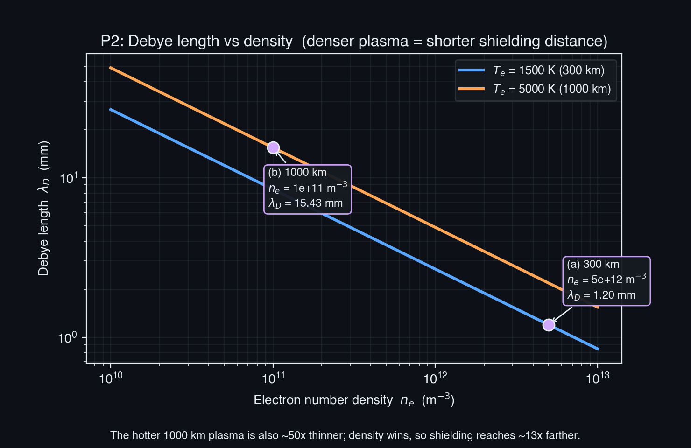
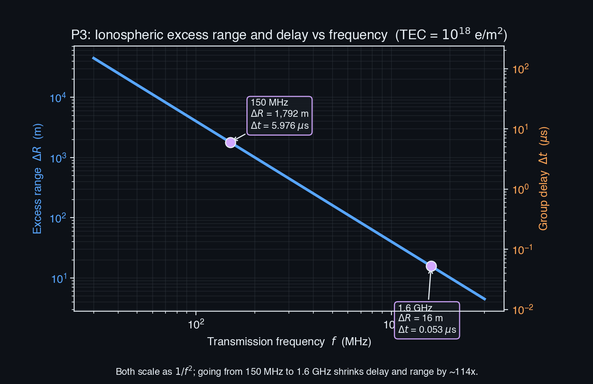
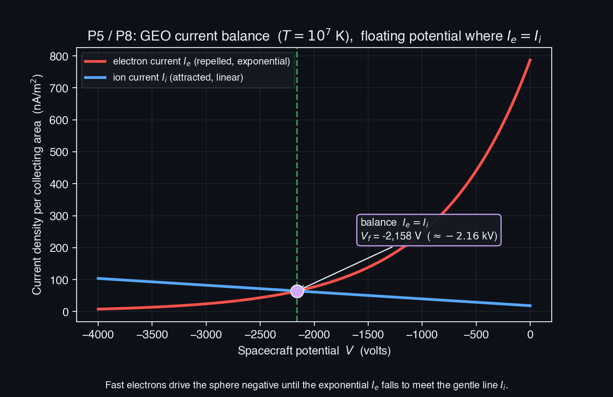

# SPCE 5065 HW #4 - Socratic Solution Walkthrough
## The Plasma Environment: Debye Shielding, Ionospheric Delay, and Spacecraft Charging

---

## 30,000-Foot Overview

**The single big question:** when a spacecraft flies through the thin, electrically charged soup that surrounds Earth, how far does that soup let charges "feel" each other, how badly does it smear a radio signal, and how much voltage does it dump onto the vehicle?

That soup is a *plasma*: a gas so hot that some of its atoms have been split into free electrons and positive ions. Because those pieces carry charge, they push and pull on each other from a distance, and the whole crowd behaves as a coordinated bloc instead of a bag of independent billiard balls. Near Earth this plasma forms the ionosphere (the ionized upper atmosphere) and the magnetosphere (the plasma trapped in Earth's magnetic field). This homework asks three practical questions about living inside that plasma.

**Problem 2 (Debye length).** A single charge in a plasma cannot shout very far: the surrounding crowd rearranges to cancel it out. The "Debye length" is how far its voice carries before it gets drowned out. The problem computes that shielding distance at two altitudes and finds it is astonishingly small, millimeters to centimeters, which is exactly why a plasma stays electrically neutral on any scale you care about.

**Problem 3 (ionospheric delay).** Free electrons slow a radio signal down, so a GPS or radar pulse arrives a little late and appears to have traveled farther than it really did. The problem computes that delay and extra apparent distance at two frequencies, and finds the whole effect collapses as you raise the frequency (it falls off as one over frequency squared). That single fact is why GPS runs at gigahertz and broadcasts on two channels.

**Problem 4 (ionospheric model).** A short research task: find, describe, and critique a real online model of the ionosphere. The answer is the International Reference Ionosphere, the world standard for "what is the typical electron density here right now."

**Problems 5 and 8 (spacecraft charging).** These are the heart of the assignment and they are the same physics twice. In a hot plasma, the featherweight electrons move thousands of times faster than the heavy ions, so they pile onto a spacecraft first and charge it negative until it repels enough of them to let the ions catch up. The problem works out that balance for a satellite at geostationary altitude in a very hot plasma and finds the vehicle floats about 2,000 volts negative, a genuine hazard.

**Problem 6 (transistors) and Problem 7 (grounding).** Two conceptual bookends. Problem 6 explains why the electronics inside the spacecraft *also* nudge it negative (npn transistors dominate, and their grounding convention ties the frame to the negative rail). Problem 7 summarizes the NASA handbook that tells engineers how to ground a spacecraft so the charging in Problem 5 does not destroy it.

**The thread.** The assignment walks from the microscopic to the operational. First it establishes the three numbers that define any plasma (how far a charge reaches, and how fast each species moves). Then it spends those numbers: the reach number explains shielding (P2) and, indirectly, signal behavior (P3); the speed number explains why spacecraft charge negative (P5, P8). Problems 6 and 7 close the loop by showing that both the internal electronics and the mitigation engineering point the same direction the plasma already does: negative, and tied to a common ground. The takeaway is to see spacecraft charging not as a mysterious hazard but as the inevitable result of one fact, that electrons are lighter than ions and therefore faster.

---

## Problem 1 (current events) - skipped

Problem 1 is a personal write-up of three classmates' current-events presentations (Lerner, Marsielle, Robinson). There is no physics to derive, so this walkthrough skips it.

---

## Problem 2 - Debye Length in the Ionosphere

**Problem Statement:** The Debye length measures how far a charge carrier's electrostatic influence persists in a plasma before the surrounding crowd screens it out. **(a)** Find the Debye length at 300 km, where the electron temperature is about 1500 K, for a daytime solar-max plasma density. **(b)** Find it at 1000 km, where the electron temperature is about 5000 K, again for daytime solar-max density.

**The punchline first:** The Debye length is $\lambda_D = \sqrt{\varepsilon_0 k_B T_e / (n_e e^2)}$, a one-line plug-in once the density is chosen. It comes out to **1.20 mm at 300 km** and **1.54 cm at 1000 km**. The higher, hotter layer shields over about 13 times the distance, and the surprise is that density (not temperature) is what drives that difference.

| Part | Headline answer | Section |
|---|---|---|
| (a) $\lambda_D$ at 300 km | 1.20 mm | §2.2 |
| (b) $\lambda_D$ at 1000 km | 1.54 cm | §2.2 |

---

### 2.1 What the Debye length is and why the crowd screens a charge

**The punchline:** A plasma is full of mobile positive and negative charges, so if you drop one extra charge in, the opposite charges swarm toward it and the like charges flee, wrapping it in a screening cloud. Beyond about one Debye length, that cloud has completely cancelled the charge's field. The Debye length is therefore the plasma's "personal-space radius."

**Explanation:** Imagine one lit match in a stadium. Up close you feel its heat; a few rows back, the surrounding crowd's warmth swamps it and you cannot tell it exists. In a plasma the "warmth" is electric field and the crowd rearranges almost instantly. Two competing effects set the radius:

- **Temperature $T_e$ (in the numerator):** hotter electrons jiggle harder and are harder to hold in a tidy screening shell, so they smear the cloud out over a larger distance. Hotter = longer reach.
- **Density $n_e$ (in the denominator):** more charges per cubic meter means more screeners packed close, so they cancel the intruder faster. Denser = shorter reach.

This is the first of the "three numbers that define any plasma" (Debye length, plasma frequency, mean thermal speed) from the Lesson 4 spine.

**Reflection:** Because $\lambda_D$ turns out to be millimeters, a satellite meters across is thousands of Debye lengths wide, which is exactly why the plasma treats the whole vehicle as a boundary and screens it, the fact that makes spacecraft charging a *surface* phenomenon.

---

### 2.2 (a, b) Evaluating the formula at both altitudes

**Before reading on, try this:** Compute part (a) yourself. Use $\lambda_D = \sqrt{\varepsilon_0 k_B T_e /(n_e e^2)}$ with $\varepsilon_0 = 8.854\times10^{-12}$ F/m, $k_B = 1.381\times10^{-23}$ J/K, $T_e = 1500$ K, $n_e = 5\times10^{12}$ m$^{-3}$, and $e = 1.602\times10^{-19}$ C. You are solving for a length in meters.

**The punchline:** $\lambda_{D,\,300\text{ km}} = 1.20$ mm and $\lambda_{D,\,1000\text{ km}} = 1.54$ cm.

**Choosing the density (the only judgment call).** The temperatures are handed to you, so the only decision is $n_e$. The problem says "daytime solar-max," so the density is read straight off the course day/solar-max plasma-density profile (Lesson 4 Part 1, the Tribble day/night curve). That curve peaks near 300 km at about $5\times10^{12}$ m$^{-3}$ and has fallen to about $1\times10^{11}$ m$^{-3}$ by 1000 km. The 1000 km value is the daytime solar-max topside, well above the quiescent plasmasphere's roughly $10^{10}$ m$^{-3}$, and it is consistent with the Lesson 4 worked charging example at 1000 km ($1.6\times10^{11}$ m$^{-3}$).

**Derivation, part (a).** Build the fraction inside the root, step by step:

$$\lambda_D = \sqrt{\frac{\varepsilon_0\, k_B\, T_e}{n_e\, e^2}} = \sqrt{\frac{(8.854\times10^{-12})(1.381\times10^{-23})(1500)}{(5\times10^{12})(1.602\times10^{-19})^2}}$$

Numerator: $(8.854\times10^{-12})(1.381\times10^{-23})(1500) = 1.834\times10^{-31}$.
Denominator: $(5\times10^{12})(2.567\times10^{-38}) = 1.283\times10^{-25}$.
Ratio: $1.429\times10^{-6}$ m$^2$. Square root: $\lambda_D = 1.196\times10^{-3}$ m $= \boxed{1.20\text{ mm}}$.

**Derivation, part (b).** Same machinery with the hotter, thinner plasma ($T_e = 5000$ K, $n_e = 1\times10^{11}$ m$^{-3}$):

$$\lambda_D = \sqrt{\frac{(8.854\times10^{-12})(1.381\times10^{-23})(5000)}{(1\times10^{11})(1.602\times10^{-19})^2}} = 1.54\times10^{-2}\text{ m} = \boxed{1.54\text{ cm}}$$

**Why density wins.** Going from (a) to (b), temperature rose by a factor of $5000/1500 = 3.33$, which alone would lengthen $\lambda_D$ by $\sqrt{3.33} = 1.83$. But density dropped by a factor of $50$, which lengthens $\lambda_D$ by $\sqrt{50} = 7.07$. The two effects multiply: $1.83 \times 7.07 = 12.9$, so the 1000 km shielding distance is about 13 times longer. Density, changing by 50x, dominates temperature, changing by only 3x.

**Common Pitfall:** Forgetting to square the electron charge, or dropping the density's exponent (using $10^{11}$ where $10^{12}$ belongs). Both throw the answer off by a large factor. A units check helps: the argument of the square root must come out in m$^2$.

**Sanity check:** The engineering shortcut $\lambda_D = 69.0\sqrt{T_e/n_e}$ m gives $69.0\sqrt{1500/5\times10^{12}} = 1.20$ mm at 300 km, matching the full formula to the digit, so no constant got fumbled.

> **Results for Problem 2**
> - **(a)** $\lambda_{D,\,300\text{ km}} = 1.20$ mm
> - **(b)** $\lambda_{D,\,1000\text{ km}} = 1.54$ cm

> **Key takeaway from Problem 2:** The Debye length is a plug-in once you commit to a density, and it lands at millimeters-to-centimeters throughout the ionosphere. Temperature lengthens the shielding distance and density shortens it, but because density varies over far more orders of magnitude, density is almost always the deciding factor.

> **Feynman test (in plain English):** In a crowd of charged particles, any single charge gets swarmed and hidden within a hair's breadth, and packing the crowd tighter hides it even faster.

---

## Problem 3 - Ionospheric Time Delay and Excess Range

**Problem Statement:** A signal crosses the ionosphere vertically along a path with total electron content $\text{TEC} = 10^{18}$ electrons/m$^2$. **(a)** Vertical time delay at 150 MHz. **(b)** Excess range at 150 MHz if vacuum light speed were used. **(c)** Time delay at 1.6 GHz. **(d)** Excess range at 1.6 GHz.

**The punchline first:** Free electrons slow the signal by $\Delta t = 40.31\,\text{TEC}/(c f^2)$ seconds, and the extra apparent distance is just that delay times light speed, $\Delta R = c\,\Delta t = 40.31\,\text{TEC}/f^2$ meters. Both fall as one over frequency squared. At 150 MHz the delay is about 6 microseconds and the range error is nearly 1.8 km; at 1.6 GHz both shrink by a factor of about 114.

| Part | Headline answer | Section |
|---|---|---|
| (a) $\Delta t$ at 150 MHz | 5.98 $\mu$s | §3.2 |
| (b) $\Delta R$ at 150 MHz | 1792 m | §3.2 |
| (c) $\Delta t$ at 1.6 GHz | 52.5 ns | §3.3 |
| (d) $\Delta R$ at 1.6 GHz | 15.8 m | §3.3 |

---

### 3.1 Why electrons delay a signal, and what TEC counts

**The punchline:** A radio wave's group speed (the speed at which its information travels) drops below $c$ inside a cloud of free electrons, and the total slowdown depends only on how many electrons the wave passed through, counted per square meter of cross-section along the path. That count is the Total Electron Content, TEC.

**Explanation:** Picture the wave as a runner and the free electrons as a crowd the runner must weave through. The more electrons in the column, the more weaving, and the later the arrival. TEC is exactly that column count: the number of electrons in a 1 m$^2$ tube stretching along the signal's path from the ground to space. A value of $10^{18}$ electrons/m$^2$ is a typical daytime vertical TEC (often quoted as 100 "TEC units," where 1 TECU $= 10^{16}$ e/m$^2$).

The two governing relations from Lesson 4 Part 3 are:

$$\Delta t = \frac{40.31\,\text{TEC}}{c\, f^2} \qquad\qquad \Delta R = c\,\Delta t = \frac{40.31\,\text{TEC}}{f^2}$$

with TEC in electrons/m$^2$, $f$ in Hz, $\Delta t$ in seconds, and $\Delta R$ in meters. The constant 40.31 bundles the physics of how electrons refract radio waves. Note the structure: $\Delta R$ is defined as $\Delta t$ times $c$, so the two answers for each frequency are locked together.

**Reflection:** The $1/f^2$ dependence is the whole story: raise the frequency and the delay collapses, because a faster-oscillating wave is less deflected by the sluggish electrons.

---

### 3.2 (a, b) The 150 MHz case

**Before reading on, try this:** Compute $\Delta t$ at $f = 150$ MHz $= 1.5\times10^8$ Hz with $\text{TEC} = 10^{18}$ and $c = 2.998\times10^8$ m/s. First square the frequency, then divide. Then get $\Delta R$ by multiplying your $\Delta t$ by $c$.

**The punchline:** $\Delta t = 5.98\ \mu$s and $\Delta R = 1792$ m.

**Derivation.** First the frequency squared: $f^2 = (1.5\times10^8)^2 = 2.25\times10^{16}$ Hz$^2$.

$$\Delta t = \frac{40.31\,(10^{18})}{(2.998\times10^8)(2.25\times10^{16})} = \frac{4.031\times10^{19}}{6.746\times10^{24}} = 5.976\times10^{-6}\text{ s} = \boxed{5.98\ \mu\text{s}}$$

The excess range is that delay times light speed:

$$\Delta R = c\,\Delta t = (2.998\times10^8)(5.976\times10^{-6}) = 1791.6\text{ m} = \boxed{1792\text{ m}}$$

Equivalently, $\Delta R = 40.31(10^{18})/(2.25\times10^{16}) = 1791.6$ m, which skips the trip through $\Delta t$ and confirms the number.

**Common Pitfall:** Plugging $f$ in MHz instead of Hz. The formula is written for hertz; using 150 instead of $1.5\times10^8$ throws $f^2$ off by $10^{16}$ and the answer becomes nonsense.

---

### 3.3 (c, d) The 1.6 GHz case and the $1/f^2$ collapse

**Before reading on, try this:** Rather than re-plug, predict the answer. The frequency went from 150 MHz to 1600 MHz, a ratio of $1600/150 = 10.67$. Since both quantities scale as $1/f^2$, by what factor should the delay and range shrink?

**The punchline:** $\Delta t = 52.5$ ns and $\Delta R = 15.8$ m. Both dropped by the predicted factor of about 114.

**Derivation.** $f^2 = (1.6\times10^9)^2 = 2.56\times10^{18}$ Hz$^2$.

$$\Delta t = \frac{40.31\,(10^{18})}{(2.998\times10^8)(2.56\times10^{18})} = 5.25\times10^{-8}\text{ s} = \boxed{52.5\text{ ns}}$$

$$\Delta R = c\,\Delta t = (2.998\times10^8)(5.25\times10^{-8}) = 15.75\text{ m} = \boxed{15.8\text{ m}}$$

**The collapse, verified.** The ratio of the two frequencies squared is $(1600/150)^2 = 10.67^2 = 113.8$. Check the delays: $5.976\ \mu\text{s} / 52.5\ \text{ns} = 113.8$. Check the ranges: $1791.6\text{ m} / 15.75\text{ m} = 113.8$. Exactly the predicted factor, because $1/f^2$ is the only frequency dependence in the formula.

**Reflection:** This is why GPS operates at gigahertz (1.2 to 1.6 GHz): at those frequencies the raw ionospheric error is meters, not kilometers. And by broadcasting two frequencies, a receiver can difference the two delays, solve for TEC, and cancel most of the remaining error, turning the ionosphere from a nuisance into a measured, correctable quantity.

**Sanity check:** At both frequencies $c\,\Delta t$ reproduces $\Delta R$ to the meter, as it must, since one quantity is defined as the other times $c$.

> **Results for Problem 3**
> - **(a)** $\Delta t = 5.98\ \mu$s at 150 MHz
> - **(b)** $\Delta R = 1792$ m at 150 MHz
> - **(c)** $\Delta t = 52.5$ ns at 1.6 GHz
> - **(d)** $\Delta R = 15.8$ m at 1.6 GHz

> **Key takeaway from Problem 3:** Ionospheric delay and excess range are the same fact wearing two units, tied together by $\Delta R = c\,\Delta t$, and both scale as $1/f^2$. That single scaling law is the reason navigation systems live at gigahertz and use dual frequencies to erase the error.

> **Feynman test (in plain English):** A radio wave weaving through a crowd of loose electrons arrives late, and a faster-wiggling (higher-frequency) wave barely notices the crowd, so cranking up the frequency makes the delay almost vanish.

---

## Problem 4 - An Online Ionospheric Model (brief)

**Problem Statement:** Find an online ionospheric model. Describe it, including who publishes it, where its data comes from, and its limitations.

### 4.1 The International Reference Ionosphere (IRI)

**The punchline:** The standard answer is the **International Reference Ionosphere (IRI)**, the world's benchmark *empirical* (data-driven, not physics-simulated) model of the ionosphere, with a free web interface hosted by NASA/CCMC where you enter a location, date, and time and get vertical profiles back.

- **Who publishes it.** IRI is jointly sponsored by **COSPAR** (Committee on Space Research) and **URSI** (International Union of Radio Science) through the IRI working group, hosted by NASA Goddard's Space Physics Data Facility and the Community Coordinated Modeling Center, with D. Bilitza as longtime lead. It updates on a named-year cadence (IRI-2016, IRI-2020).
- **What it outputs.** For roughly 50 to 2000 km it returns monthly-median electron density, electron and ion temperatures, ion composition, the F2-peak density and height (NmF2, hmF2), and vertical TEC, exactly the kind of numbers Problems 2 and 3 lean on.
- **Where the data comes from.** IRI is built from the worldwide **ionosonde** network (bottomside profiles), **incoherent-scatter radars** (Jicamarca, Arecibo, Millstone Hill), **topside sounders** on the Alouette and ISIS satellites, in-situ spacecraft probes, and rocket soundings, all fit into a climatology driven by solar and magnetic indices.

### 4.2 Limitations

**The punchline:** IRI is a **climatology** (monthly medians), so it captures the average ionosphere, not its weather. It does not forecast individual storms, sudden ionospheric disturbances, or day-to-day variability; accuracy degrades at high latitudes and across the equatorial anomaly; the topside and plasmasphere are less constrained than the F-peak; and results are only as good as the solar indices you feed it. For real-time work you need an assimilative or physics-based model instead.

> **Key takeaway from Problem 4:** IRI is the right tool for "what is the typical electron density here" (a homework density estimate) and the wrong tool for "what will the ionosphere do during tomorrow's storm."

> **Feynman test (in plain English):** IRI is like a climate almanac for the sky's electrons: it tells you the normal weather for the season, not the forecast for one particular stormy afternoon.

---

## Problem 5 - Charging of a Spherical GEO Satellite

**Problem Statement:** A spherical geostationary satellite sits in a $10^7$ K plasma. To minimize the induced current, how large will the spacecraft voltage be? The plasma's first-order currents are, for electrons, $I_e = I_{e,o}A_e e^{eV/k_BT_e}$ for $V<0$ (repelled) and $I_e = I_{e,o}A_e[1 + eV/k_BT_e]$ for $V>0$ (attracted), with $I_{e,o} = \tfrac14 e n_e v_{mean}$ and $v_{mean} = \sqrt{8k_BT_e/\pi m_e} - v_{s/c}$; ions follow the mirror-image forms. **(a)** Spacecraft speed. **(b)** Mean speeds of ions and electrons. **(c)** Current expressions in terms of $V$. **(d)** Total-current expression. **(e)** Voltage for no net current. **(f)** Is this high risk, and what would you recommend?

**The punchline first:** Because the plasma is so hot, the light electrons scream around at about 19,600 km/s while the heavy protons manage only 458 km/s, and the 3 km/s orbital speed is negligible next to both. Setting the electron current equal to the ion current gives a transcendental balance $42.85\,e^{x} = 1 - x$ that solves to $x = eV/k_BT = -2.50$, so the sphere floats at **$V \approx -2.16$ kV**, a genuine hazard.

| Part | Headline answer | Section |
|---|---|---|
| (a) Spacecraft speed | 3.07 km/s | §5.2 |
| (b) Mean speeds (e, i) | 19,650 km/s, 458 km/s | §5.3 |
| (c) Current expressions | $I_e, I_i$ vs $V$ | §5.4 |
| (d) Total current | $I_{total}(V)$ | §5.4 |
| (e) Floating voltage | $-2.16$ kV | §5.5 |
| (f) Risk and mitigation | Yes; bond and coat | §5.6 |

---

### 5.1 The physical picture and the assumptions

**The punchline:** Everything here follows from one fact: at the same temperature, the featherweight electron moves far faster than the heavy proton, so electrons reach the sphere first and drive it negative until it repels enough of them to let the ions catch up. That equilibrium (zero net current) is the floating potential.

**Assumptions, stated up front** (the problem asks for them):

- The sphere collects both species over its **whole area**, so $A_e = A_i = A$. In low orbit you would split a ram face from a wake, but here (as part b shows) the thermal speeds dwarf the orbital speed, so both populations arrive from every direction.
- **Quasineutral, single-temperature** electron-proton plasma: $n_e = n_i = n$ and $T_e = T_i = T = 10^7$ K.
- The sign convention the slide flags ("be sure to include the negative sign for V"): a **repelled** species is Boltzmann-suppressed (its current carries a shrinking exponential) and an **attracted** species grows linearly. Since the equilibrium is negative, in the regime that matters the electrons are repelled and the ions are attracted.

**Reflection:** The single-temperature, whole-area assumptions are what let one clean current balance stand in for the messy real environment; they are justified entirely by the speed comparison in part (b).

---

### 5.2 (a) Spacecraft orbital speed

**Before reading on, try this:** A geostationary orbit has radius $r = 42{,}164$ km. Using $v = \sqrt{\mu/r}$ with Earth's $\mu = 398{,}600.4$ km$^3$/s$^2$, find the circular speed in km/s.

**The punchline:** $v_{s/c} = 3.07$ km/s.

**Derivation.** For a circular orbit the speed is $v = \sqrt{\mu/r}$:

$$v_{s/c} = \sqrt{\frac{398600.4}{42164}} = \sqrt{9.453} = \boxed{3.07\text{ km/s}}$$

**Reflection:** This number exists only to be dwarfed. Its whole purpose is the comparison in part (b), which shows it can be dropped from $v_{mean}$.

---

### 5.3 (b) Mean thermal speeds, and why the orbit speed is negligible

**Before reading on, try this:** Compute the electron mean speed with $v_{mean} = \sqrt{8k_BT/(\pi m_e)}$, $T = 10^7$ K, $m_e = 9.109\times10^{-31}$ kg. Then redo it with the proton mass $m_p = 1.673\times10^{-27}$ kg. Predict the ratio before computing it: it should equal $\sqrt{m_p/m_e}$.

**The punchline:** $v_e \approx 1.96\times10^7$ m/s $\approx 19{,}650$ km/s and $v_i \approx 4.58\times10^5$ m/s $\approx 458$ km/s. Their ratio is $\sqrt{m_p/m_e} = 42.85$.

**Derivation (electron).**

$$v_e = \sqrt{\frac{8 k_B T}{\pi m_e}} = \sqrt{\frac{8(1.381\times10^{-23})(10^7)}{\pi (9.109\times10^{-31})}} = \sqrt{3.86\times10^{14}} = 1.96\times10^{7}\text{ m/s} \approx \boxed{19{,}650\text{ km/s}}$$

**Derivation (proton).** Same formula, mass 1836 times larger:

$$v_i = \sqrt{\frac{8(1.381\times10^{-23})(10^7)}{\pi (1.673\times10^{-27})}} = 4.58\times10^{5}\text{ m/s} \approx \boxed{458\text{ km/s}}$$

**The ratio.** Since only the mass differs, $v_e / v_i = \sqrt{m_p/m_e} = \sqrt{1836} = 42.85$. This single number is the engine of the whole problem: the electron flux is 42.85 times the ion flux at zero bias. Rounded, the speeds are electrons ~20,000 km/s and ions ~459 km/s.

**Why the orbit speed drops out.** At 3.07 km/s the spacecraft is about $3.07/19650 = 1.6\times10^{-4}$ of the electron speed and about $0.7\%$ of the ion speed. Subtracting it from either thermal speed changes nothing at the precision that matters, which is what justifies $v_{mean} \approx v_{thermal}$ for both species from here on, and what lets the sphere collect from all directions (whole-area assumption).

**Common Pitfall:** Mixing up which mass goes where. The lighter mass (electron) gives the *larger* speed. If your electron speed comes out slower than your ion speed, you swapped the masses.

---

### 5.4 (c, d) Current expressions and the total current

**The punchline:** In the negative-bias regime the electron current is Boltzmann-suppressed and the ion current is linearly enhanced, and the net current to the sphere is ions-in minus electrons-out.

**Part (c): the two currents.** With $I_{e,o} = \tfrac14 e n v_e$ and $I_{i,o} = \tfrac14 e n v_i$, and the equilibrium at $V<0$ (electrons repelled, ions attracted):

$$I_e(V) = \tfrac14 e n v_e\, A\, \exp\!\left(\frac{eV}{k_BT}\right), \qquad I_i(V) = \tfrac14 e n v_i\, A\left[1 - \frac{eV}{k_BT}\right]$$

Since $V<0$, the quantity $eV/k_BT$ is negative, so the electron exponential is a fraction below 1 (repulsion cutting the current) while the ion bracket $[1 - eV/k_BT]$ is greater than 1 (attraction boosting it).

**Part (d): the total.** Net current is ions collected minus electrons collected:

$$\boxed{I_{total}(V) = I_i - I_e = \tfrac14 e n A\left[\,v_i\!\left(1 - \frac{eV}{k_BT}\right) - v_e\,\exp\!\left(\frac{eV}{k_BT}\right)\right]}$$

**Common Pitfall:** Writing $[1 + eV/k_BT]$ for the attracted ions. The problem's table hands you $[1 + eV/k_BT]$ for attraction, but that form assumes $V$ carries its own sign; with $V<0$ written explicitly, attraction reads $[1 - e|V|/k_BT] > 1$. The physical test is unambiguous: an attracted species must collect *more* than its zero-bias flux, so the bracket must exceed 1.

---

### 5.5 (e) The floating potential

**Before reading on, try this:** Set $I_{total} = 0$. The common factor $\tfrac14 e n A$ cancels. Substitute $x \equiv eV/k_BT$ and use $v_e/v_i = 42.85$ to get a single equation in $x$. It will be transcendental (an exponential set equal to a line), so expect to solve it numerically.

**The punchline:** $x = -2.50$, giving $V = -2.50\,k_BT_e/e \approx -2.16$ kV.

**Derivation.** Minimizing the induced current means driving $I_{total}$ to zero, the floating potential. Setting the bracket to zero:

$$v_e\, e^{x} = v_i\,(1 - x) \;\;\Longrightarrow\;\; \frac{v_e}{v_i}\, e^{x} = 1 - x \;\;\Longrightarrow\;\; 42.85\, e^{x} = 1 - x$$

This is transcendental: a steep exponential on the left, a gentle downward line on the right. Solving numerically gives $x = -2.50$, i.e. the standard $V \approx -2.5\,k_BT_e/e$ result for a hot electron-proton plasma. Now convert $x$ to volts using the thermal voltage $k_BT_e/e$:

$$\frac{k_BT_e}{e} = \frac{(1.381\times10^{-23})(10^7)}{1.602\times10^{-19}} = 861.7\text{ V}$$

$$V = -2.50\,\frac{k_BT_e}{e} = -2.50(861.7) = \boxed{-2.16\text{ kV}}$$

**Why the balance sits so far negative.** The electron curve is a steep exponential and the ion curve is a nearly flat line, so the sphere has to charge deeply negative (about 2.5 thermal voltages) before it has suppressed the fast electrons enough to meet the sluggish ions.

**Reflection:** The factor of $-2.5$ is not a coincidence of this temperature; it comes only from the mass ratio through $v_e/v_i = 42.85$. Any single-temperature hydrogen plasma floats near $-2.5\,k_BT_e/e$, whatever the temperature. Temperature only sets the volts-per-unit, $k_BT_e/e$.

---

### 5.6 (f) Risk assessment and mitigation

**The punchline:** Yes, this is a real hazard, not because 2.2 kV alone destroys hardware but because different materials on the vehicle settle at *different* potentials, and once the gap between two of them exceeds a breakdown threshold, an arc (electrostatic discharge, ESD) jumps.

**The risk.** Around $-2.2$ kV is deep into the differential-charging regime. Dielectric coverglass, Kapton, and metal structure charge to different levels; when a gap exceeds breakdown, the resulting arc causes EMI and spurious switching in avionics, physical damage to solar-array interconnects, and re-attraction of contamination. This is the GEO-substorm mechanism blamed for real losses (Galaxy 15's eight-month outage).

**Recommendations** (the standard charging-mitigation playbook, Lesson 4 Part 3):

- Make **all exterior surfaces at least partially conductive** and tie every conductive element to a **common ground**, so the vehicle charges as one body instead of building differentials.
- Use **conductive coatings** on dielectrics (ITO on coverglass) so they bleed charge instead of storing it like a capacitor.
- Fly a **plasma contactor** to actively clamp the frame toward plasma potential.
- **Shield and filter** sensitive electronics, and pick low-outgassing materials so a local pressure spike cannot trip a Paschen-minimum breakdown during thruster firings.

Absolute charging of a well-bonded conductive sphere at a couple of kilovolts is survivable; letting the surfaces charge *differentially* at that level is not, so the whole recommendation is about equalizing and draining charge.

> **Results for Problem 5**
> - **(a)** $v_{s/c} = 3.07$ km/s
> - **(b)** $v_e \approx 19{,}650$ km/s, $v_i \approx 458$ km/s (ratio $42.85$)
> - **(c)** $I_e = \tfrac14 e n v_e A\,e^{eV/k_BT}$, $\;I_i = \tfrac14 e n v_i A\,[1 - eV/k_BT]$
> - **(d)** $I_{total} = \tfrac14 e n A[\,v_i(1 - eV/k_BT) - v_e e^{eV/k_BT}]$
> - **(e)** $V = -2.50\,k_BT_e/e \approx -2.16$ kV
> - **(f)** Yes, high risk from differential charging and arcing; bond, coat, and clamp the vehicle

> **Key takeaway from Problem 5:** Spacecraft charging is just current balance. The sphere floats at whatever voltage makes the repelled fast electrons and the attracted slow ions carry equal current, and because electrons outrun ions by the mass-ratio factor of 42.85, that voltage is a few thermal voltages negative, about $-2.16$ kV here. The danger is differential charging, not the absolute level.

> **Feynman test (in plain English):** Light electrons hit the spacecraft far faster than heavy ions, so the vehicle keeps building up negative charge until it is pushing electrons away hard enough for the slow ions to finally keep pace.

---

## Problem 6 - npn vs pnp Transistors and Negative Bias (brief)

**Problem Statement:** One reason most Earth-orbiting spacecraft are negatively biased is the wider use of npn over pnp transistors. **(a)** What are npn and pnp transistors, and their advantages and disadvantages? **(b)** Why might npn be of wider use on spacecraft?

### 6.1 (a) What the two devices are

**The punchline:** Both are bipolar junction transistors (three doped semiconductor regions forming two back-to-back junctions). An **npn** uses fast-moving **electrons** as its working carrier and turns on when the base goes **positive**; a **pnp** is the mirror image, using slower **holes** and turning on when the base goes **negative**.

**Advantages and disadvantages.** npn is faster and higher-performance: electron mobility in silicon (about 1400 cm$^2$/V$\cdot$s) is roughly 3x the hole mobility (about 450 cm$^2$/V$\cdot$s), so npn devices switch faster, carry more current, and have higher gain-bandwidth for the same geometry, and they are cheaper to fabricate. pnp is the slower complement; its value is exactly that complementarity, since you need both polarities for push-pull output stages, high-side switching, and level shifting. The tradeoff is npn performance and manufacturability versus the circuit flexibility of having both polarities.

### 6.2 (b) Why npn dominance biases spacecraft negative

**The punchline:** The chain runs: npn's speed and cost advantages make it the default flight part, an npn stage references its emitter to the **most negative rail**, that rail is bonded to the chassis, so the **structure sits at the most negative potential** in the power system.

- **Performance and heritage.** Space electronics lean on flight-proven, radiation-tolerant heritage parts, which are overwhelmingly npn.
- **The grounding convention.** An npn stage references its emitter to the negative side of the power bus, so the natural system reference is the negative terminal.
- **Bonded to structure.** Tying the negative rail to chassis ground (standard practice, and it lines up with the common-ground charging fix from Problem 5) puts the vehicle structure at the most negative potential relative to its own circuitry.
- **It reinforces the plasma physics.** The environment already charges an unbiased body negative (Problem 5), and the npn grounding convention pushes the same way, so the two effects stack.

> **Key takeaway from Problem 6:** npn transistors win on speed, current, and cost because electrons are more mobile than holes, so they dominate flight electronics; their grounding convention ties the structure to the negative rail, and that reinforces the negative charging the plasma already imposes.

> **Feynman test (in plain English):** The faster, cheaper kind of transistor happens to use the most-negative wire as its home base, and once you bolt that wire to the spacecraft's frame, the whole frame ends up sitting negative, the same direction space was already pushing it.

---

## Problem 7 - A Spacecraft-Grounding Reference (brief)

**Problem Statement:** Select a peer-reviewed journal article or NASA document on the electrical grounding of spacecraft and summarize it.

### 7.1 NASA-HDBK-4001

**The punchline:** The document is **NASA-HDBK-4001, *Electrical Grounding Architecture for Unmanned Spacecraft*** (1998), the agency's guidance on choosing and implementing a grounding scheme. It is the engineering rulebook behind the one-line "tie everything to a common ground" recommendation from Problem 5.

**What it covers:**

- **Three grounding architectures.** Single-point (star) grounding routes every return to one node to kill ground loops and wins at low frequency; multi-point grounding ties equipment to a low-impedance ground plane and wins at high frequency where lead inductance dominates; hybrid schemes mix the two (single-point at DC, multi-point at RF via capacitors).
- **Structure as the reference.** It treats the chassis/structure as the single common reference for signal, power, and shield returns, and stresses bonding all conductive elements to it, exactly the charging fix from Problem 5.
- **Power and isolation practice.** Where to tie primary and secondary returns, when to isolate (transformer/optocoupler) to break loops, and shield-termination rules.
- **Charging and EMC motivation.** The whole point is controlling EMI, ground-loop noise, and spacecraft-charging/ESD risk by keeping surfaces near a common potential.

> **Key takeaway from Problem 7:** NASA-HDBK-4001 is where the vague "bond everything to a common ground" advice becomes specific architecture choices, isolation rules, and bonding requirements, directly implementing the charging mitigation of Problem 5.

> **Feynman test (in plain English):** It is the official instruction manual for wiring a spacecraft so every part shares one electrical "sea level," which stops different parts from charging up against each other and sparking.

---

## Problem 8 - Voltage at Synchronous Altitude

**Problem Statement:** Determine the voltage, with respect to its environment, of a spacecraft at synchronous altitude if the plasma temperature is $10^7$ K, treating the environment as electrons and protons. State your assumptions.

**The punchline first:** This is Problem 5 restated, so the machinery is reused wholesale. The voltage "with respect to its environment" is the floating potential, which lands at the same **$-2.16$ kV**.

### 8.1 Reusing the current balance

**Assumptions:** spherical body collecting both species over its full area ($A_e = A_i$), quasineutral single-temperature electron-proton plasma ($n_e = n_i$, $T_e = T_i = 10^7$ K), and the 3.07 km/s orbital speed negligible against the thermal speeds (from Problem 5b), so the relative velocity is just the mean thermal speed.

**Derivation.** The floating potential is where net current is zero. From the Problem 5 balance, with $v_e/v_i = \sqrt{m_p/m_e} = 42.85$ and $x = eV/k_BT$:

$$42.85\, e^{x} = 1 - x \;\;\Longrightarrow\;\; x = -2.50 \;\;\Longrightarrow\;\; V = -2.50\,\frac{k_BT_e}{e}$$

With $k_BT_e/e = 861.7$ V (computed in §5.5):

$$\boxed{V \approx -2.16\text{ kV}}$$

### 8.2 An independent sanity check

**The punchline:** A cruder model that ignores the linear ion enhancement still lands a few kilovolts negative, confirming the answer is robust.

Approximate the ion current as a flat thermal-flux saturation and set only the Boltzmann-suppressed electron flux equal to it: $e^{x} = v_i/v_e = 1/42.85$, so $x = \ln(1/42.85) = -3.76$ and $V \approx -3.2$ kV. Including the orbit-limited ion enhancement (the $[1 - eV/k_BT]$ term the problem hands you) softens this to $-2.16$ kV. Either way the vehicle floats a couple of kilovolts below its environment, which is the whole reason GEO charging is dangerous.

> **Key takeaway from Problem 8:** The floating potential depends only on the plasma temperature (through $k_BT_e/e$) and the electron-to-ion speed ratio (through the mass ratio), so synchronous altitude gives the identical $-2.16$ kV as Problem 5. Two crude and careful models bracket the answer at a few kilovolts negative.

> **Feynman test (in plain English):** Put the same hot plasma around the same spacecraft and you get the same answer: it charges a couple thousand volts negative because the light electrons always win the race to the surface.

---

## Summary

### Overall Strategy Recap

Every problem in HW4 spends one of the "three numbers that define a plasma." Problem 2 computes the **Debye length** (shielding reach) and finds it is millimeters, set mostly by density. Problem 3 uses the ionosphere's electron content to compute **signal delay**, governed entirely by a $1/f^2$ law. Problems 5 and 8 are the centerpiece: the **mean thermal speed** shows electrons outrun ions by the mass-ratio factor of 42.85, so a current balance drives the vehicle to a floating potential of $-2.16$ kV. Problems 4, 6, and 7 wrap the physics in context: where to get real ionospheric numbers (IRI), why the internal electronics also bias the vehicle negative (npn dominance), and how to ground it so the charging does not destroy it (NASA-HDBK-4001). The unifying thread is that electrons, being lighter, are faster, and that one fact explains both why the ionosphere behaves as it does and why spacecraft charge negative.

### Check Yourself

1. Two ionospheric layers have the same temperature, but one is 100x denser. Which has the longer Debye length, and by what factor?

The thinner layer. Since $\lambda_D \propto 1/\sqrt{n_e}$, a 100x lower density gives $\sqrt{100} = 10$x the shielding distance.

2. Why is the Debye length so much shorter than the size of a spacecraft, and why does that matter for charging?

It is millimeters while a spacecraft is meters, so the vehicle is thousands of Debye lengths across. The plasma therefore screens the whole body and treats it as a boundary, which is why charging is a surface phenomenon governed by current collection.

3. A signal's ionospheric delay is 6 $\mu$s at 150 MHz. Without recomputing from scratch, estimate it at 300 MHz.

Doubling the frequency cuts the delay by $2^2 = 4$, so about 1.5 $\mu$s. The delay scales as $1/f^2$.

4. Why do GPS satellites broadcast on two frequencies instead of one?

Because the ionospheric delay scales as $1/f^2$, the delays differ between the two frequencies. Differencing them solves for the total electron content and cancels most of the ionospheric error, a correction impossible with a single frequency.

5. At the same temperature, how many times faster is an electron than a proton, and why does that number matter?

$\sqrt{m_p/m_e} = \sqrt{1836} = 42.85$ times faster. That ratio is the electron-to-ion current ratio at zero bias, and it is what forces the floating potential deeply negative.

6. The floating potential came out at $-2.5\,k_BT_e/e$. If the plasma were twice as hot, what happens to the voltage in volts?

It doubles in magnitude. The factor $-2.5$ is fixed by the mass ratio, but the volts-per-unit $k_BT_e/e$ scales linearly with temperature, so twice the temperature gives about $-4.3$ kV.

7. Why is a spacecraft floating at $-2.2$ kV dangerous when a uniformly charged conductor at that level would be survivable?

Because different materials charge to different potentials (differential charging). Once the gap between two surfaces exceeds the breakdown threshold, an arc jumps, causing EMI, switching upsets, and array damage. The absolute level is less important than the differential.

8. How do npn transistors end up biasing a spacecraft negative?

npn stages reference their emitter to the most negative rail; that rail is bonded to the chassis, so the structure sits at the most negative potential in the power system, reinforcing the negative charging the plasma already causes.

### Important Formulas

*Plasma-defining quantities (the three numbers).* These describe the plasma itself, independent of any spacecraft.

| # | Formula | Physics Pseudo-Code | Description |
|---|---|---|---|
| 1 | $\lambda_D = \sqrt{\dfrac{\varepsilon_0 k_B T_e}{n_e e^2}}$ | Debye length equals the square root of: permittivity of free space times Boltzmann's constant times electron temperature, all divided by electron density times electron charge squared. | Shielding distance a charge's field reaches before the crowd cancels it (P2). |
| 2 | $v_{mean} = \sqrt{\dfrac{8 k_B T}{\pi m}}$ | Mean thermal speed equals the square root of: eight times Boltzmann's constant times temperature, divided by pi times the particle mass. | Average speed of a species; lighter particle is faster at equal temperature (P5b). |
| 3 | $\dfrac{v_e}{v_i} = \sqrt{\dfrac{m_p}{m_e}}$ | The electron-to-ion speed ratio equals the square root of the proton mass divided by the electron mass. | Equals 42.85; the engine of the charging balance (P5b). |

*Key insight: at a common temperature, mass alone sets who moves faster, and electrons always win by the factor 42.85.*

---

*Ionospheric signal propagation.* How free electrons delay a radio signal.

| # | Formula | Physics Pseudo-Code | Description |
|---|---|---|---|
| 4 | $\Delta t = \dfrac{40.31\,\text{TEC}}{c\, f^2}$ | Time delay equals 40.31 times the total electron content, divided by the speed of light times the frequency squared. | Group delay across the ionosphere (P3a, c). |
| 5 | $\Delta R = c\,\Delta t = \dfrac{40.31\,\text{TEC}}{f^2}$ | Excess range equals the speed of light times the time delay, which also equals 40.31 times the total electron content divided by the frequency squared. | Extra apparent distance if vacuum light speed is assumed (P3b, d). |

*Key insight: both quantities fall as one over frequency squared, which is why navigation systems run at gigahertz and difference two frequencies to erase the error.*

---

*Spacecraft charging (current balance).* How current collection sets the floating potential.

| # | Formula | Physics Pseudo-Code | Description |
|---|---|---|---|
| 6 | $v = \sqrt{\dfrac{\mu}{r}}$ | Circular orbital speed equals the square root of Earth's gravitational parameter divided by the orbital radius. | Geostationary spacecraft speed, 3.07 km/s (P5a). |
| 7 | $I_o = \tfrac14 e\, n\, v_{mean} \times A$ | The reference current equals one-quarter times the electron charge times the number density times the mean speed times the collecting area. | Zero-bias thermal current for each species (P5c). |
| 8 | $I_e = I_{e,o} A\, e^{eV/k_BT}$ | For a negative surface, the electron current equals its reference current times the collecting area times e raised to the power of (charge times voltage divided by Boltzmann's constant times temperature). | Repelled electrons, Boltzmann-suppressed (P5c). |
| 9 | $I_i = I_{i,o} A\,[1 - eV/k_BT]$ | For a negative surface, the ion current equals its reference current times the collecting area times the quantity one minus (charge times voltage divided by Boltzmann's constant times temperature). | Attracted ions, linearly enhanced (P5c). |
| 10 | $\dfrac{v_e}{v_i} e^{x} = 1 - x,\;\; x = \dfrac{eV}{k_BT}$ | The speed ratio times e raised to x equals one minus x, where x is the charge times voltage over Boltzmann's constant times temperature. | Transcendental floating-potential balance; solves to $x=-2.50$ (P5e). |
| 11 | $V = -2.5\,\dfrac{k_B T_e}{e}$ | The floating voltage equals negative 2.5 times Boltzmann's constant times electron temperature, divided by the electron charge. | Floating potential, $-2.16$ kV at $10^7$ K (P5e, P8). |

*Key insight: the sphere floats at whatever voltage equalizes the repelled fast electrons and the attracted slow ions, and the mass ratio fixes that at about 2.5 thermal voltages negative.*

### Variables and Acronyms

| Symbol / Acronym | Name | Units | Description |
|---|---|---|---|
| $\lambda_D$ | Debye length | m | Distance over which a charge's field is screened by the plasma |
| $\varepsilon_0$ | Permittivity of free space | F/m | $8.854\times10^{-12}$; vacuum electric constant |
| $k_B$ | Boltzmann constant | J/K | $1.381\times10^{-23}$; links temperature to energy |
| $T_e$ | Electron temperature | K | Temperature of the electron population |
| $T_i$ | Ion temperature | K | Temperature of the ion population |
| $T$ | Plasma temperature | K | Single temperature when $T_e = T_i$; here $10^7$ K |
| $n_e$ | Electron number density | m$^{-3}$ | Free electrons per cubic meter |
| $n_i$ | Ion number density | m$^{-3}$ | Ions per cubic meter |
| $n$ | Plasma density | m$^{-3}$ | Common value when $n_e = n_i$ (quasineutral) |
| $e$ | Elementary charge | C | $1.602\times10^{-19}$; magnitude of electron charge |
| $m_e$ | Electron mass | kg | $9.109\times10^{-31}$ |
| $m_p$ | Proton mass | kg | $1.673\times10^{-27}$ |
| $c$ | Speed of light | m/s | $2.998\times10^{8}$ |
| $\mu$ | Earth gravitational parameter | km$^3$/s$^2$ | $398{,}600.4$ |
| $r$ | Orbital radius | km | Geostationary value $42{,}164$ km |
| $v_{s/c}$ | Spacecraft speed | km/s | Circular orbital speed, 3.07 km/s at GEO |
| $v_{mean}$, $v_{th}$ | Mean (thermal) speed | m/s | Average particle speed $\sqrt{8k_BT/\pi m}$ |
| $v_e$ | Electron mean speed | m/s | About $1.96\times10^7$ m/s at $10^7$ K |
| $v_i$ | Ion (proton) mean speed | m/s | About $4.58\times10^5$ m/s at $10^7$ K |
| $f$ | Frequency | Hz | Radio transmission frequency |
| $f_p$ | Plasma frequency | Hz | Electron crowd's natural oscillation; reflect/transmit cutoff |
| $\Delta t$ | Time delay | s | Extra travel time from ionospheric electrons |
| $\Delta R$ | Excess range | m | Extra apparent distance, $c\,\Delta t$ |
| TEC | Total Electron Content | electrons/m$^2$ | Electron count in a 1 m$^2$ column along the path |
| $V$ | Spacecraft potential | V | Voltage of the vehicle relative to its environment |
| $V_f$ | Floating potential | V | Voltage where net current is zero, $-2.16$ kV |
| $x$ | Normalized potential | dimensionless | $eV/k_BT$; equals $-2.50$ at balance |
| $I_e$, $I_i$ | Electron / ion current | A | Currents collected from each species |
| $I_{e,o}$, $I_{i,o}$ | Reference currents | A/m$^2$ | Zero-bias thermal current per area, $\tfrac14 e n v_{mean}$ |
| $A$, $A_e$, $A_i$ | Collecting area | m$^2$ | Sphere area seen by each species ($A_e = A_i = A$ here) |
| $I_{total}$ | Net current | A | Ions collected minus electrons collected |
| GEO | Geostationary / geosynchronous orbit | - | Orbit at $42{,}164$ km radius ($6.6\,R_E$) |
| LEO | Low Earth Orbit | - | Few-hundred-km altitude regime |
| ESD | Electrostatic discharge | - | Arc between differentially charged surfaces |
| EMI | Electromagnetic interference | - | Noise coupled into circuits by an arc |
| IRI | International Reference Ionosphere | - | Standard empirical ionosphere model |
| COSPAR | Committee on Space Research | - | Co-sponsor of IRI |
| URSI | International Union of Radio Science | - | Co-sponsor of IRI |
| CCMC | Community Coordinated Modeling Center | - | NASA host of the IRI web tool |
| TECU | TEC Unit | $10^{16}$ e/m$^2$ | Common unit for quoting TEC |
| BJT | Bipolar junction transistor | - | Three-region npn or pnp transistor |
| ITO | Indium tin oxide | - | Transparent conductive coating for coverglass |
| $R_E$ | Earth radius | km | 6,371 km |

### Practice Variations

1. **Nighttime Debye length.** Redo Problem 2(a) with a nighttime density of $n_e = 5\times10^{11}$ m$^{-3}$ (10x thinner). The Debye length grows by $\sqrt{10} = 3.16$, to about 3.8 mm.
2. **L-band vs L1.** Redo Problem 3 at 1.2 GHz (the GPS L2 frequency) instead of 1.6 GHz. Since delay scales as $1/f^2$, expect $(1.6/1.2)^2 = 1.78$x more delay, about 93 ns and 28 m.
3. **Cooler substorm plasma.** Redo Problem 5(e) with $T = 5\times10^6$ K. The factor $-2.5$ is unchanged, but $k_BT_e/e$ halves to 431 V, so $V \approx -1.08$ kV.
4. **Heavier ion species.** Suppose the ions are O+ ($m = 16\,m_p$) instead of protons. Then $v_e/v_i = \sqrt{16\,m_p/m_e} = 171.4$, which pushes the balance more negative (larger $|x|$), deepening the floating potential.
5. **LEO comparison.** Repeat the current balance with a cold LEO plasma ($T \sim 1000$ K) and include the ram-scoop ion current instead of the thermal form. The floating potential collapses to about $-1$ V, illustrating why LEO charging is mild and GEO charging is dangerous.
