# SPCE 5065 - Week 4 Master Summary: The Plasma Environment

**What this is:** the 80/20 of Week 4. Five readings (~43,000 words) plus three lesson decks, condensed to the ~20% that carries ~80% of the understanding. Built for retention: one big-picture spine first, then each reading distilled with its key figures, then a formula cheat sheet and a homework crosswalk.

**How to read it (15 minutes):**
1. Read **Section 0 (The Spine)** first. It is the professor's own framing and every formula HW4 needs.
2. Skim the five **Reading** sections for the figures and the "Remember this" box at the end of each.
3. Keep **Section 6 (Cheat Sheet)** open while doing the homework.

**The one-sentence week:** a plasma is an ionized gas that behaves as a coordinated crowd through long-range electric forces; near Earth this crowd forms the magnetosphere and ionosphere, and where a spacecraft flies through it, fast electrons pile onto surfaces and charge them negative, which arcs and breaks things.

---

## Section 0: The Spine (read this first)

This is the load-bearing structure of the whole week, drawn from the three Lesson 4 decks. Everything in the readings hangs off these five ideas.

### 0.1 What makes a gas a plasma (four conditions)

From Lesson Part 1. A plasma is not just "hot gas." It qualifies when:

1. **Macroscopically neutral** (quasineutral): electron density ≈ ion density, n_e ≈ n_i.
2. **Collective behavior:** the long-range Coulomb force couples many particles at once, so they respond as a group (waves, shielding), not as billiard balls.
3. **Density high enough** that the Coulomb force sets the statistics (many particles inside a Debye sphere).
4. **Electrostatic interactions dominate** over ordinary gas-kinetic collisions.

**Memory hook:** a gas of independent colliding balls vs a plasma that "votes as a bloc." You only need to ionize about 1 part in a million (ionized fraction ~10^-6) to flip a gas into this collective, conductive behavior.

### 0.2 The three numbers that define any plasma

These three feed HW4 Problems 2, 3, and 5.

**Debye length** (shielding distance): how far one charge's influence reaches before the surrounding crowd screens it out.
```
lambda_D = sqrt( eps0 * k_B * T_e / (n_e * e^2) )
```
Hotter plasma = longer reach; denser plasma = shorter reach. (HW4 P2.)

**Plasma frequency** (the electron crowd's natural ringing tone): displace the electrons off the ions and they oscillate back like a mass on a spring.
```
omega_p = sqrt( n_e * e^2 / (eps0 * m_e) )       f_p = omega_p / (2*pi)  ~=  9 * sqrt(n_e)  Hz     (n_e in m^-3)
```
**Why it matters:** signals below f_p are reflected, signals above f_p pass through. This is why the ionosphere bounces AM/HF radio around the globe but lets GPS through. (Lesson Part 1 example: a 250 km orbit.)

**Mean (thermal) speed** of a species: sets who reaches a surface first.
```
v_mean = sqrt( 8 * k_B * T / (pi * m) )
```
Same temperature, lighter particle is faster. Electrons are thousands of times lighter than ions, so **electrons win the race** and spacecraft charge negative. (HW4 P5.)

### 0.3 The ionosphere in one table

From Lesson Part 1. Solar UV and X-rays photoionize the upper atmosphere; recombination is slow up high, so free electrons pile up in layers. Each layer is a different chemistry, not just a different height.

| Layer | Altitude | Day vs night | Role |
|---|---|---|---|
| **D** | 50 to 90 km | Present day, **gone at night** | Absorbs HF radio; where solar-flare blackouts happen |
| **E** | 90 to 150 km | Strong day, weak night | Well-behaved (Chapman) layer |
| **F1** | 150 to 180 km | Present day, **merges into F2 at night** | Transitional |
| **F2** | 180 to 350 km | **Dominant, peaks near 10^6 cm^-3 day** | The main reflector; survives the night because recombination is slowest up high |

**Mnemonic (bottom to top): "Don't Eat Fried Foods"** (D, E, F1, F2). Altitude and electron density both rise as you go up the list.

**Reflection cutoff (links density to frequency):**
```
n_e,max = 1.24e4 * f^2      (n_e in cm^-3, f in MHz)
```
The highest frequency a layer reflects at vertical incidence. Above it, the signal punches through.

### 0.4 Spacecraft charging in one paragraph

From Lesson Parts 2 and 3. Because electrons arrive far faster than ions, an object floats **negative** until it repels enough electrons to balance the ion current. That equilibrium voltage is the **floating potential**. In LEO it is small (about -1 V). In GEO during magnetic substorms, the plasma is too thin to neutralize surfaces and they charge to **thousands of volts**, with different materials reaching different potentials (**differential charging**). The voltage gap between a charged dielectric and its neighbor is what an arc jumps: that arc (**electrostatic discharge, ESD**) is the dominant hazard. It causes EMI, damages solar arrays and electronics, and has disabled whole satellites.

**Floating potential (unbiased body), set by current balance I_e = I_i:**
```
V_f = (k_B * T_e / e) * ln[ (v_s/c * A_i) / (4 * v_e,th * A_e) ]
```
The log argument is less than 1, so V_f comes out negative. (Lesson Part 2 worked a 300 km sphere; HW4 P5 works a hot GEO plasma.)

**Biased-surface currents (the sign rule to memorize):**

| Surface bias | Effect on electrons | Current form |
|---|---|---|
| **V < 0** | repelled | I_e proportional to **exp(eV / k_B T_e)** (Boltzmann tail, shrinks fast) |
| **V > 0** | attracted | I_e proportional to **[1 + eV / k_B T_e]** (linear growth) |

Ions follow the mirror-image rule (V > 0 repels them, V < 0 attracts them). The reference current is I_o = (1/4) e n v_mean times collecting area. **This is exactly the HW4 P5 setup.**

### 0.5 Ionospheric signal delay (HW4 P3)

From Lesson Part 3. Free electrons slow and bend a radio signal. The delay depends on **Total Electron Content (TEC)**, the number of electrons in a 1 m^2 column along the path, and falls off as 1/frequency^2.

**Time delay** (standard ionospheric relation shown in Lesson Part 3):
```
delta_t = 1.345e-7 * TEC / f^2      (seconds; TEC in electrons/m^2, f in Hz)
```
**Excess range** (extra apparent distance if you assumed vacuum light speed):
```
delta_R = 40.3 * TEC / f^2 = c * delta_t      (meters)
```
**Key intuition:** higher frequency = far less delay (the f^2 in the denominator). This is why GPS uses GHz and why it broadcasts on two frequencies: comparing the two delays measures TEC and cancels the error. **Scintillation** (rapid fading from turbulence) and **traveling ionospheric disturbances** are the other operational effects.

### 0.6 The orientation picture: the magnetosphere

Keep this cross-section in mind for the whole week. Everything (solar wind, radiation belts, plasma sheet, spacecraft charging) happens somewhere on this map. Remember that plasma is just one of five space environments the professor tracks (with vacuum, neutral atmosphere, radiation, and micrometeoroid/debris); its headline effects are spacecraft charging, differential charging/ESD, and drag/sputtering/contamination.

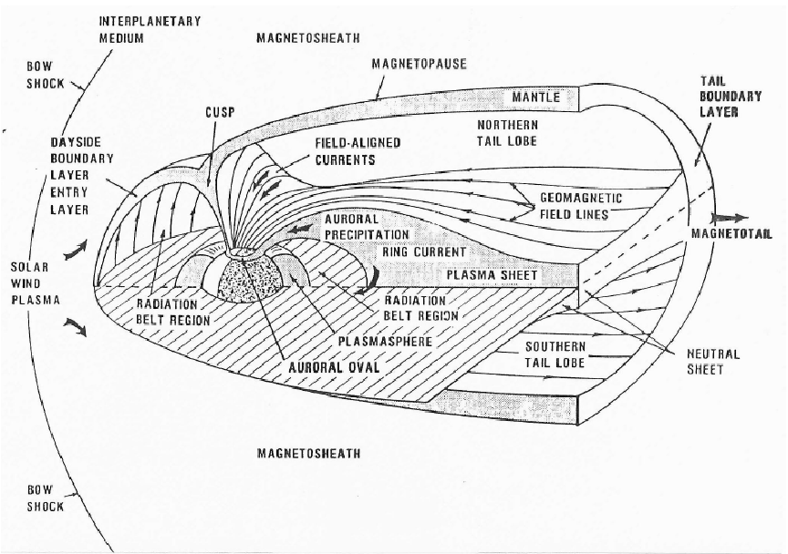
*The single most useful orientation figure for Week 4: solar wind on the left squashes the dayside, the field stretches into the magnetotail on the right, and the energetic plasma reservoirs sit in between.*

---

## Section 1: Plasma Fundamentals (Conde, Ch. 1)

**Why it matters:** A plasma is not just a hot gas; it is matter where long-range electric forces let particles act as a coordinated crowd, and this single fact governs the ionosphere, solar wind, and every spacecraft flying through them.

> **Source note:** Conde Ch. 1 is a descriptive tour of where plasmas live (space, discharges, fusion, thrusters). It states the definitions and ideas but defers the Debye-length and plasma-frequency derivations to later chapters. The boxed formulas below are the standard forms (the professor's emphasis), included here because they are the fundamentals the week is built on.

### What a plasma actually is

- **Definition:** a system of many interacting particles, a significant fraction charged, so the medium responds *collectively* to electromagnetic fields rather than through billiard-ball collisions.
- **The transition is cheap:** a neutral gas becomes electrically conductive at an ionized fraction as low as ~10^-6. You do not need much ionization to change the physics entirely.
- **Three conditions for the plasma state:**
  1. **Quasineutrality:** n_e ≈ n_i over macroscopic volumes.
  2. **Collective behavior:** long-range Coulomb force couples many particles, producing organized responses (waves, sheaths, shielding).
  3. **Debye shielding with many particles per sphere:** the number of charges in a Debye sphere must be >> 1, so the crowd can statistically screen a local charge.
- **Key contrast:** ordinary gas is collision-dominated; a plasma is electrostatics-dominated. The magnetosphere's bow shock is "collisionless": it forms through long-range fields, not molecular impacts.

### Degree of ionization

```
alpha_g = n_i / n_a      (ions divided by neutral atoms)
  Weakly ionized:    alpha_g << 1   (fluorescent lamps, ionosphere)
  Partially ionized: alpha_g < 1
  Fully ionized:     alpha_g = 1     (only charged particles)
```

- **What sets it:** in steady state, ionization is balanced by recombination. Each ionizing hit costs at least the ionization energy E_i (e.g. 15.8 eV for argon). Ionization is energetically expensive, which is why plasmas are hot.
- **Saha equation (qualitatively):** predicts alpha_g from temperature and density; ionization rises steeply with temperature. Hold the intuition: **temperature drives ionization.**
- **Temperature in energy units:** average kinetic energy ~ k_B T, so plasma temperatures are quoted in eV. Anchor: **1 eV = 11,600 K**; room temperature (300 K) ≈ 0.026 eV.

### Debye length: how far a charge's voice carries

```
lambda_D = sqrt( eps0 * k_B * T_e / (n_e * e^2) )      (shielding distance)
```
Beyond about one lambda_D, surrounding charges rearrange and screen out any local charge or applied field. **Hotter = longer reach; denser = shorter reach.**

```
N_D = (4/3) * pi * n * lambda_D^3   must be >> 1       (particles in a Debye sphere)
```
This is the quantitative test for "is it a plasma?": only when N_D >> 1 does collective screening work.

**Memory hook:** lambda_D = how far a charge can shout before the crowd drowns it out; N_D = how many people are in the room to do the drowning (you need many).

### Plasma frequency: the crowd's natural pitch

```
omega_p = sqrt( n * e^2 / (eps0 * m_e) )      f_p = omega_p/(2*pi)  ~=  9*sqrt(n) Hz  (n in m^-3)
```
- **Derivation intuition:** displace a slab of electrons off the ions; the exposed charge pulls them back, they overshoot and oscillate, like a mass on a spring. Denser plasma rings at higher frequency. Ions are ~2000x heavier, so they barely move.
- **Why it matters:** waves below f_p are reflected, waves above f_p pass through. This is the ionosphere's radio behavior in one number.

### Where plasmas live

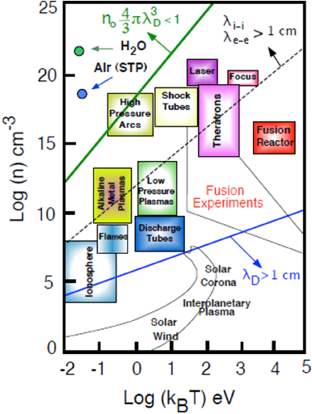
*Fig 1.2: the plasma "zoo." Densities span ~25 orders of magnitude, temperatures ~7. Earth's ionosphere is cold (T <= 0.1 eV) and tenuous; the interplanetary medium is diffuse yet hot (~100 eV).*

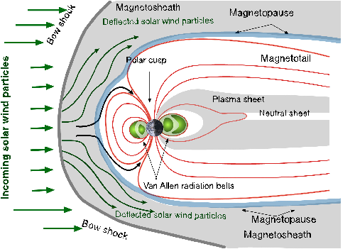
*Fig 1.5: the near-Earth plasma context. The bow shock is collisionless, a direct payoff of "collective behavior."*

### Remember this
1. A plasma is a quasineutral, ionized medium that responds *collectively*; the three tests are **quasineutrality, collective behavior, and N_D >> 1**.
2. **Debye length** is the shielding distance: hotter = longer, denser = shorter.
3. **Plasma frequency f_p ≈ 9√n Hz** is the electron crowd's oscillation and the reflect/transmit cutoff (why the ionosphere bounces radio).
4. **Degree of ionization** classifies plasmas; conductive behavior starts near alpha_g ~ 10^-6, and temperature drives ionization.
5. In plasmas, **electrostatics beats gas kinetics**: coordinated crowd, not colliding billiard balls.

---

## Section 2: Ch. 5 - Earth's Magnetosphere & Ionosphere (Tribble)

**Why it matters:** The magnetosphere is the shield that traps and energizes plasma around Earth; the ionosphere is the free-electron layer that delays and reflects radio signals. Both set the numbers for your Debye-length, plasma-frequency, and signal-delay homework.

### Part 1: The Magnetosphere

**The big idea:** Earth's dipole field would extend forever, but the supersonic solar wind squashes it into a teardrop cavity: blunt on the sunward side, drawn into a long tail on the night side.

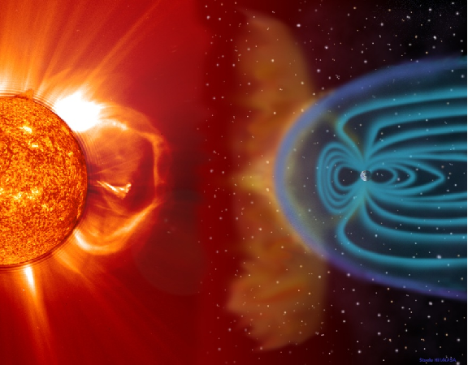
*Fig 5-1: the Sun drives the whole system. A CME compresses and disturbs the magnetosphere.*

**Boundaries, sunward to tailward (memorize the distances in Earth radii, R_E):**
- **Bow shock** (~15 R_E): standoff shock where the supersonic solar wind first decelerates.
- **Magnetosheath:** turbulent region between bow shock and magnetopause.
- **Magnetopause** (~10 R_E): the true outer boundary, where solar-wind pressure balances the compressed field. High-speed wind compresses it to ~7 R_E (note: **geosynchronous orbit sits at 6.6 R_E**, so it can be exposed).
- **Magnetotail:** stretches past the Moon's orbit (~60 R_E).

**Three current systems:**
- **Magnetopause current:** from magnetosheath plasma meeting the geomagnetic field; highly time-variable.
- **Plasma sheet current** (dawn-to-dusk): separates north/south tail-lobe fields. Electrons 0.5 to 1.0 keV, ions 2 to 5 keV, density ~0.5 cm^-3.
- **Ring current** (3 to 6 R_E): ions drift west, electrons east; that separation is the current. Average energy ~85 keV. This current is what intensifies during magnetic storms.

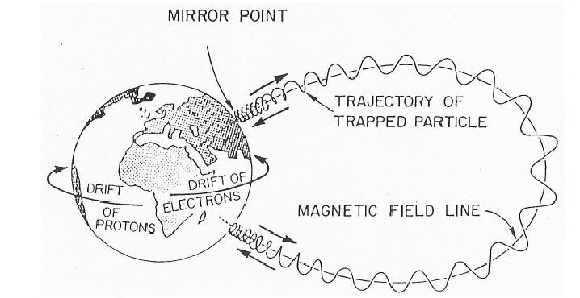
*Fig 5-3: how the Van Allen belts trap particles.*

- **Plasmasphere:** cold ionospheric plasma co-rotating with Earth. Density ~10^4 cm^-3 at 1000 km, dropping sharply at the **plasmapause**.
- **Van Allen radiation belts:** trapped high-energy electrons and protons, equator out to +/-50 deg latitude. The **South Atlantic Anomaly (SAA)** is where the field is locally weak and the belts dip lowest, a major radiation hazard. The **outer belt** (~1 MeV) responds to even minor storms; the **inner belt** (>25 MeV) barely reacts.

> **One number to remember:** magnetopause ~10 R_E sunward, magnetotail ~60 R_E. Sun squashes, tail stretches.

### Part 2: The Ionosphere

**How it forms:** solar UV and X-rays photoionize atoms at high altitude; recombination is slow up there, so free electrons accumulate. Spans roughly **50 to 2000 km**. Different wavelengths deposit energy at different altitudes, so each layer is a distinct chemistry.

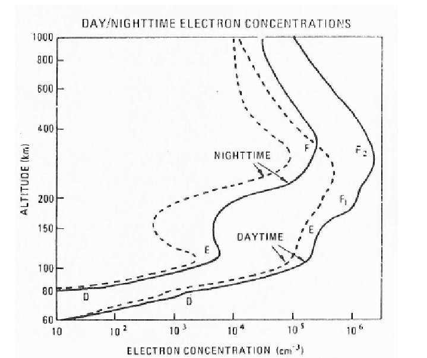
*Fig 5-6: the day/night electron-density profile. This picture explains why HF radio propagation changes at sunset.*

| Layer | Peak alt | n_e,max | Notes |
|---|---|---|---|
| **D** | ~90 km | 1.5e4 cm^-3 noon; **absent at night** | Absorbs HF; site of solar-flare blackouts |
| **E** | ~110 km | 1.5e5 cm^-3 noon; <1e4 night | Fits the Chapman model well |
| **F1** | ~200 km | 2.5e5 cm^-3 noon; **absent at night** | Chapman-valid |
| **F2** | ~300 km (variable) | **1e6 noon; 1e5 midnight** | The dominant layer; survives the night |

**Why F2 dominates and survives the night:** it sits high where the atmosphere is thin and recombination is slowest, so electrons linger long after sunset while D and F1 vanish.

**Ties to the plasma-frequency homework:**
```
n_e,max = 1.24e4 * f^2      (n_e in cm^-3, f = critical frequency in MHz)
```
The highest frequency a layer reflects at vertical incidence; above it, signals pass through.

**Chapman balance (production minus recombination):**
```
dn_e/dt = q_v - alpha_eff * n_e^2
```
Electron density scales as sqrt(cos theta) with solar zenith angle, driving the day/night and seasonal swing. Valid for E and F1; D and F2 need modified loss terms.

**Operational variability:** a **Sudden Ionospheric Disturbance (SID)** from a solar flare spikes the D layer within minutes, absorbing HF and causing dayside short-wave fade-out for hours. The night side is spared.

### Remember this
1. **Magnetosphere distances:** bow shock ~15 R_E, magnetopause ~10 R_E (7 when compressed, below the 6.6 R_E geosync belt), tail ~60 R_E.
2. **Energetic reservoirs:** plasma sheet (keV), ring current (~85 keV, drives storms), Van Allen belts (MeV, dip low over the SAA).
3. **Ionosphere = solar UV/X-ray photoionization** over 50 to 2000 km; layers D/E/F1/F2; at night D and F1 vanish and F2 dominates.
4. **n_e,max = 1.24e4 f^2** links density to plasma/critical frequency; Chapman balance governs the layers.
5. **Flares black out dayside HF radio** within minutes via the D layer.

---

## Section 3: Ch. 8 - The Plasma Environment & Spacecraft Charging (Tribble)

**Why it matters:** In a plasma, fast electrons pile onto a spacecraft before slow ions can catch up, so vehicles float negative; predicting that potential (and the arcing it causes) keeps solar arrays, electronics, and astronauts safe. This chapter is the machinery behind every floating-potential and current-balance homework problem.

### 1. The core idea: electrons win the race

```
v_th = sqrt( 8 * k_B * T / (pi * m) )      (mean thermal speed)
```
- Speed scales with sqrt(T/m). At the same temperature, a light particle is much faster.
- **The chapter in one number:** in LEO, T ~ 1000 K but m_ion/m_electron is thousands, so electron thermal speed ~200 km/s while ion thermal speed is under 1 km/s. Orbital speed is ~8 km/s, so electrons are ~25x faster than the vehicle and ions are slower than it.
- **Memory hook:** electrons swarm from all sides; ions can only be scooped up head-on.

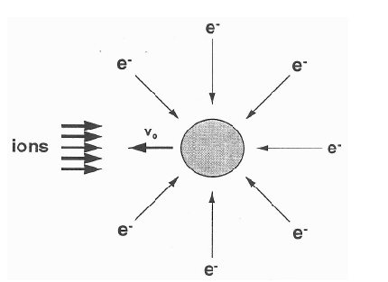
*Fig 8-5: ions collected only on the ram surface (area A_i); electrons over the whole surface (area A_e).*

**Ram vs wake:** the ram face collects both species; the wake behind the vehicle is a void only fast electrons refill, so it charges strongly negative. A small satellite or an astronaut in the wake can charge dangerously.

### 2. Current balance and the floating potential

**Fundamental rule of all charging:** at equilibrium, **all currents sum to zero.** The potential where that happens is the **floating potential**.
```
I_T(V) = I_e - I_i + I_se + I_si + I_bse + I_ph + I_b = 0
```
(incident electrons, incident ions, secondaries, backscatter, photoelectrons, active sources). **In LEO the ambient plasma dominates; in GEO the secondaries and photoelectrons matter.**

**Two collected currents (unbiased body):**
```
Ion:      I_i = e * n_o * (v_s/c) * A_i                       (ram scoop, no exponential)
Electron: I_e = (1/4) * e * n_o * v_e,th * A_e * exp(eV/kT_e) (thermal flux times Boltzmann factor)
```
For V < 0 the negative body repels electrons and the exponential shrinks their current until balance.

**Floating potential (solve I_e = I_i):**
```
V_f = (k_B*T_e/e) * ln[ (v_s/c * A_i) / (4 * v_e,th * A_e) ]
```
The log argument is < 1, so **V_f is negative**. LEO value is typically about **-1 V**. V_f is the potential of the *conducting* ground; dielectrics float to their own potentials, which is where differential charging and arcing come from.

### 3. Biased surfaces (solar arrays) and the two current forms

| Bias | Attracted / repelled | Current form | Intuition |
|---|---|---|---|
| **V < 0** | repels electrons, attracts ions | electron ~ **exp(eV/kT)** | Boltzmann tail, falls off fast |
| **V > 0** | attracts electrons, repels ions | electron ~ **[1 + eV/kT]** | orbit-limited linear growth |

To balance easily-collected electrons against sluggish ions, **most of a solar array floats negative**. A small positive shift causes a large jump in electron collection.

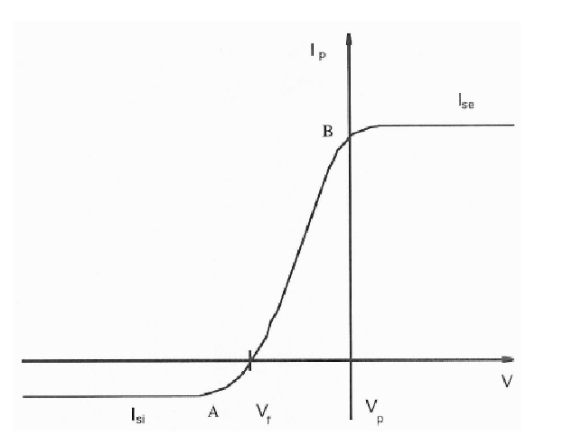
*Fig 8-4: a satellite is just a big Langmuir probe. Sweep the bias and you trace this curve.*

### 4. Secondary electron emission

- **Yield delta** = electrons leaving per incident electron; delta = true secondaries + backscatter.
- **Curve shape:** low at low energy, rises above 1 at intermediate energy, falls at high energy. When **delta > 1 the surface loses net electrons**, which limits negative charging.
- **Insulators have huge yields** (MgO ~ 23) because they cannot bleed off secondary energy. Ion-driven yields are ~0.1 to 0.3 for metals, negligible in LEO but significant in GEO.

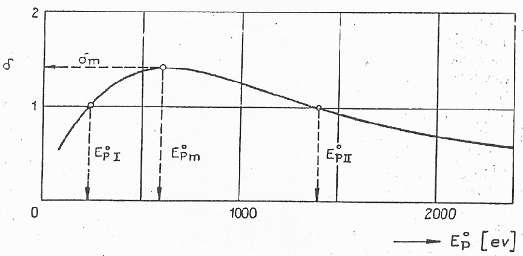
*Fig 8-2: the region between the two unity crossings is where the surface emits more than it absorbs.*

### 5. Charging terminology (know these four)

| Type | What it is | Where dangerous |
|---|---|---|
| **Absolute** | whole vehicle shifts uniformly vs plasma | Tolerable if uniform |
| **Differential** | one surface charges relative to another | **Drives arcing; GEO kilovolts** |
| **Surface** | charge on the outer skin | Surface arcs |
| **Internal (deep dielectric)** | >1 MeV electrons bury charge inside dielectrics | Arcs into internal circuitry |

### 6. LEO vs GEO charging

| | **LEO (~300 km)** | **GEO (~6.6 R_E)** |
|---|---|---|
| Plasma density | ~10^5 cm^-3 | ~1 cm^-3 |
| Energies | ~1000 K, few eV | keV (electrons ~2.4 keV, ions ~10 keV) |
| Typical floating potential | ~ -1 V | thousands of volts negative |
| Danger driver | **high-latitude / auroral low-density events** | **substorm plasma injections** |

- **LEO:** normally mild, but auroral electrons in low-density pockets can charge a vehicle fast (DMSP F13 charged to ~460 V in seconds). High-voltage arrays (Space Station at 160 V) can float the structure ~140 V below plasma and risk dielectric breakdown.
- **GEO substorm charging (the classic case):** low density means the plasma cannot neutralize transients. Injected **electrons drift eastward into the midnight-to-dawn sector**, so charging peaks near **local midnight** and is common between 0400 and 0600. ATS-6 charged to as much as **-20,000 V**.

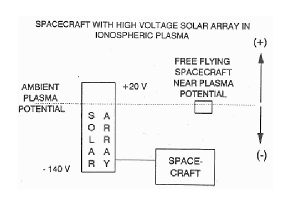
*Fig 8-7: a negatively grounded high-voltage array pulls the structure far below plasma potential.*

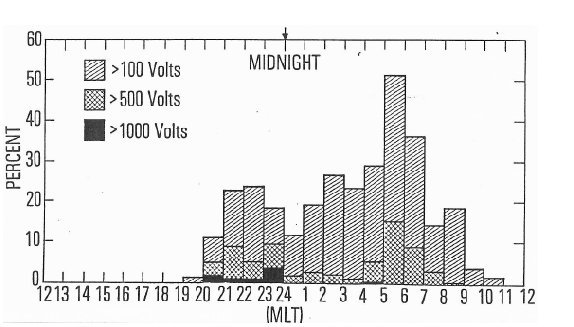
*Fig 8-11: charging is a local-time phenomenon, not a random one.*

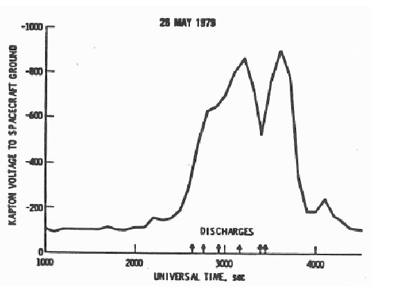
*Fig 8-14: a dielectric charges up and then arcs repeatedly until the stored charge is depleted.*

### 7. Hazards and the arcing mechanism

- **Hazard list:** arcing / ESD, dielectric breakdown, EMI and spurious switching, increased current, ion drag, sputtering, re-attraction of contamination, solar-cell and sensor degradation.
- **Paschen's Law:** breakdown across a gap depends on pressure times distance (pd) and has a **minimum** at a critical pd. Local pressure spikes (thruster firings, water dumps, outgassing) can push a charged surface toward that minimum and *trigger* arcing. Check the vehicle's charge state before any gas-releasing operation.

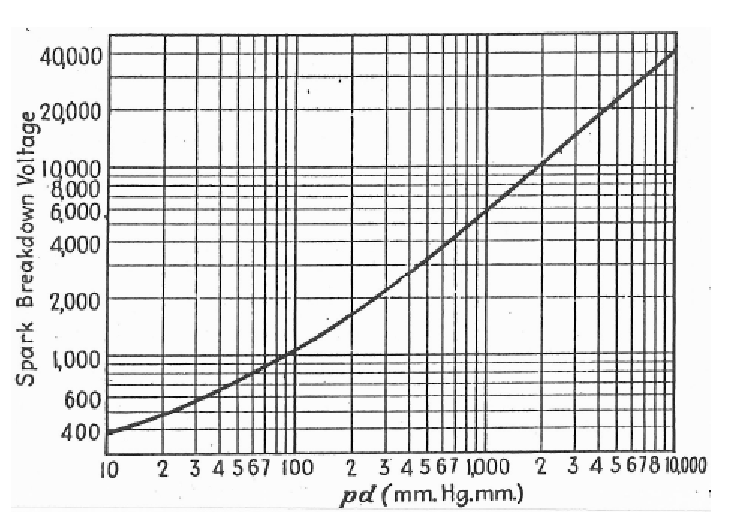
*Fig 8-17: below the curve, no breakdown; the minimum is the most dangerous operating point.*

- **Design fixes:** make exterior surfaces at least partially conductive and tie everything to a common ground; minimize dielectrics near sensitive gear; pick low-yield, low-outgassing materials; add conductive coatings; use a **plasma contactor** to actively clamp the frame to plasma potential.

### Remember this
1. **Electrons are far faster than ions**, so an unbiased body charges **negative** to its floating potential; LEO ~ -1 V, storm-time GEO to kilovolts.
2. **Everything follows from current balance** (all currents sum to zero); repelled species carry **exp(eV/kT)**, attracted species **[1 + eV/kT]**.
3. **Differential charging of dielectrics** (not the absolute level) is what arcs.
4. **LEO danger = auroral / high-voltage low-density events; GEO danger = substorm injections near local midnight-to-dawn.**
5. **Arcing risk depends on pd (Paschen):** pressure bursts can trip an ESD; mitigate with conductive, grounded, low-outgassing surfaces and plasma contactors.

---

## Section 4: Plasma Interactions with Spacecraft Materials (IntechOpen, Ch. 12)

**Why it matters:** In GEO, high-energy electrons chemically rewrite spacecraft polymers and dump charge onto surfaces that cannot bleed it off; the resulting discharges can contaminate solar arrays, upset electronics, or kill a satellite outright (Galaxy 15 was disabled for 8 months).

### The environment doing the damage
- **GEO plasma is two populations:** a hot, tenuous thermal plasma (0.1 to 1 cm^-3, 4 to 10 keV, spiking to 16 to 30 keV in storms) plus the outer radiation belt (electrons 0.1 to 10 MeV). GEO sits inside the outer belt.
- **Electrons are the primary threat.** Energy depth sets the failure mode: >2 MeV pierces a Faraday cage; >0.25 MeV penetrates multi-layer insulation; even 0.1 MeV electrons (the most abundant) stop in the outer polymer and deposit charge there.
- **Two distinct effects:** deposited **energy** breaks bonds (chemical aging); deposited **charge** builds up potential. Both happen at once.

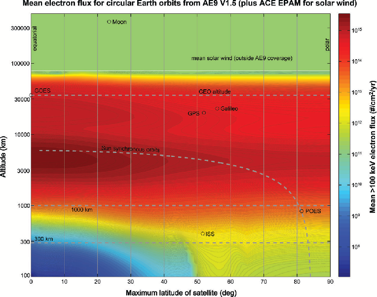
*Fig 1: GEO/GPS altitudes fall inside the high-flux outer belt (AE9 model).*

### Surface and differential charging
- **Conductors bleed; dielectrics trap.** A conductor routes charge to chassis ground. A dielectric loses charge only slowly by bulk conduction, so it holds a potential relative to its neighbors. At GEO that gap reaches thousands to tens of thousands of volts.
- **Emission discharges surfaces:** secondary and photoelectron emission eject electrons, pushing potentials back toward neutral.

> **Memory hook:** insulators cannot bleed off charge, so they store it like a capacitor and then arc. Differential charging is the battery; ESD is the spark.

### Resistivity, charge decay, and the arcing trade (the engineering crux)
You cannot control the incoming charge, so the only lever is how fast charge drains, which is set by **resistivity**.
```
decay time  ~  resistivity * eps0 * eps_r
```
- **The orbital-period test:** if decay time exceeds the orbit period (~1 day at GEO), a surface accumulates charge for the whole mission and arcing likelihood climbs.
- **Counterintuitive twist:** radiation *aging* makes polyimide **more** conductive, moving it from "Problem" toward "Safe." **Pristine Kapton is the riskier state** (post-damage conductivity rose ~1000x).

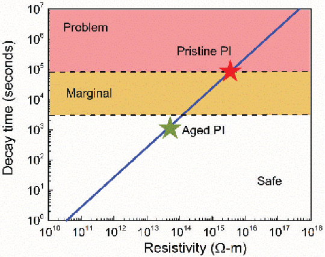
*Fig 2: high resistivity = slow drain = long decay = discharge risk. Aging moves the material downward into the safe zone.*

### How charge drains: the three-region curve
| Region | When | Physics |
|---|---|---|
| I: Charging (beam on) | Voltage rises | Deposition vs secondary emission and radiation-induced conductivity |
| II: Pre-transit discharge (beam off) | Charge crossing the film | Conduction, charge not yet at the backplane |
| III: Post-transit discharge | Charge reaches backplane | Dark conduction only; yields decay time and resistivity |

Region III timescale ranges from a fraction of a second (conductive polymers) to years (Teflon). Charge moves through disordered polymers by electron **hopping** between trap states; radiation creates extra hopping sites, which is why damaged polyimide conducts better.

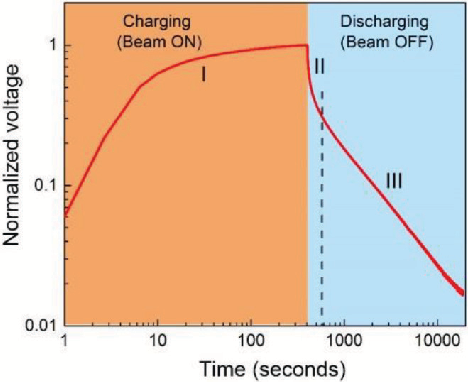
*Fig 3: the charge/discharge signature; the dashed line marks charge arrival at the grounded backplane.*

### Dielectric breakdown, ESD, and real failures
| Mechanism | Effect | Real case |
|---|---|---|
| Current spike | Destroyed electronics, latchup | Single-event upsets |
| Power transient / EMI | Comms anomalies | Galaxy 15 (8-month outage) |
| Arc contamination | Darkened coverglass, lower solar output | GPS array power droop |
| Sustained arc | Permanent short, total power loss | ADEOS-2 (complete power loss) |

- **Arc-prone spots:** solar-cell edges/corners, silver interconnects, RTV adhesive bonding cells to Kapton.
- **The GPS lesson:** slow, mysterious array power loss was self-inflicted contamination from thousands of small arcs, hidden because power-line filtering masked the transients.
- **Modeling caveat:** arcing-prediction codes assume *pristine* properties, but radiation changes them, so models get invalidated on orbit.

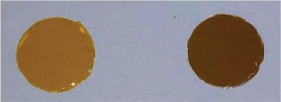
*Fig 4: visible darkening tracks the chemical and optical degradation; it also shifts thermal-control absorptivity and the satellite's reflectance fingerprint.*

### Mitigation guidelines
- **Give dielectrics a way to bleed charge:** uniform or partial surface conductivity, conductive coatings.
- **Common grounding:** tie components to a single chassis ground.
- **Shielding:** Faraday-cage sensitive electronics deep in the bulk.
- **Filtering:** filter power-line transients (but note this can also hide ongoing arcing).
- **Plasma contactors** to clamp spacecraft potential; and design against *aged*, not pristine, material properties.

### Remember this
1. **At GEO, electrons rule:** they both age polymers and deposit charge surfaces cannot shed.
2. **Resistivity is the master knob:** if decay time exceeds ~1 day (the orbit period), charge accumulates and arcing spikes. Conductors bleed, dielectrics trap and arc.
3. **Aging lowers resistivity,** so radiation-damaged Kapton is counterintuitively safer than pristine.
4. **ESD is the killer:** sustained arcs caused total power loss (ADEOS-2) and long outages (Galaxy 15).
5. **Mitigate by draining and equalizing charge:** conductive coatings, common grounding, shielding, filtering, plasma contactors.

---

## Section 5: Space Plasma Physics - the Big Picture (Hultqvist, ISSI)

**Why it matters:** near-Earth space is a giant natural plasma laboratory; this reading gives the big-picture map (Sun to solar wind to magnetosphere to ionosphere) that explains *why* the local plasma environment behaves as it does.

### The setup: matter as plasma, dominated by fields
- **Almost all matter in near-Earth space is ionized**, so it is governed by electromagnetic forces, not gas pressure alone.
- **These plasmas are collisionless.** Behavior is set by magnetic and electric fields and waves, not particle collisions. This is the key mental shift.
- **The "frozen-in" rule is the default:** low-energy plasma and magnetic field lines move together, broken only in tiny special regions (reconnection).

### The Sun as source: solar wind hits an obstacle
- **The solar wind is a supersonic, magnetized plasma flow** carrying the interplanetary magnetic field (IMF).
- **Earth's dipole is an obstacle,** creating three boundaries:
  - **Bow shock:** the best-studied collisionless shock in nature; the wind is heated and slowed from supersonic to subsonic.
  - **Magnetopause:** a thin current sheet separating shocked solar wind (dense, cold) from the magnetosphere (dilute, hot).
  - **Magnetotail:** the field stretched anti-sunward into two lobes with a central plasma sheet.


*Figure 1: the whole magnetosphere in one picture. Blue = solar-wind plasma, violet = ionospheric plasma; X marks reconnection sites.*

### Reconnection: the key energy-transfer switch
- **The magnetopause is not a wall.** Solar-wind mass and energy leak in, primarily via **magnetic reconnection**.
- **How it works:** in a tiny diffusion region, the frozen-in condition breaks and solar-wind field lines interconnect with Earth's, so plasma flows across.
- **Southward IMF is the trigger:** dayside reconnection runs at maximum, loading the tail; tail reconnection then releases that energy as substorms and storms.
- Cluster (4 spacecraft) confirmed the physics directly, including quasi-continuous reconnection lasting hours.


*Figure 8: the reconnection X-point where field lines reverse and the frozen-in rule breaks.*

> **Key numbers:** at peak (strongly southward IMF), ~10^28 solar-wind particles cross the magnetopause per second; flux-transfer events recur about every 8 minutes.

### Coupling to the ionosphere: the aurora
- **The aurora is the visible Sun-Earth coupling:** precipitating electrons and protons excite the upper atmosphere, glowing at ~100 km in thin arcs.
- **Auroral particles are accelerated by parallel electric fields** (E along B). A major confirmed breakthrough.
- **The loss cone is narrow** (1 to 4 degrees near the equatorial plane): particles must be aimed almost exactly along B to precipitate, or the magnetic mirror reflects them. This is why outflow exceeds precipitation ~10x.


*Figure 5: the arc you see maps to a structured current-and-potential system in the plasma above it.*

### Waves, turbulence, and particle energization
- **Collisionless plasmas radiate excess energy as waves and turbulence** via wave-particle interaction. Waves are how energy moves and how particles heat and get dumped.
- **Kelvin-Helmholtz instability** ripples the magnetopause flanks (wind over water), forming vortices that mix solar-wind and magnetospheric plasma.
- **Radiation belts and the slot:** energetic electrons excite whistler waves; pitch-angle scattering by those waves knocks particles into the loss cone, carving the "slot" between the inner and outer belts.


*Figure 10: vortices along the flank mix plasma across the magnetopause.*


*Figure 13: whistler waves scatter belt electrons into the atmosphere, carving the slot.*

### Memory hooks
- **Frozen-in = magnetic Velcro.** Field and plasma move together; reconnection is the one spot where the Velcro unsticks and re-fastens to the other side.
- **Magnetosphere = wind sock in a river:** the supersonic wind piles up a shock, wraps a skin, and streams a long wake.
- **Southward IMF = gate open:** north-pointing solar field keeps the gate mostly closed; south-pointing throws it open and storms follow.
- **Loss cone = narrow doorway:** only particles aimed straight down the field hit the atmosphere; the rest bounce.

### Remember this
1. **Space plasma is collisionless and frozen-in;** fields and waves run the show, not collisions.
2. **The supersonic magnetized solar wind hitting Earth's dipole builds the bow shock, magnetopause, and magnetotail.**
3. **Magnetic reconnection is the master switch:** it lets solar-wind plasma and energy in (peaking for southward IMF) and drives substorms and storms.
4. **The ionosphere is a co-equal plasma source,** feeding O+ upward into the magnetosphere.
5. **Aurora and radiation-belt dynamics** are the coupling and energization end-members: parallel E-fields accelerate auroral particles; wave-particle scattering fills and empties the belts.

---

## Section 6: Cheat Sheet (keep open during homework)

### Constants
| Symbol | Value |
|---|---|
| Electron charge, e | 1.602e-19 C |
| Boltzmann, k_B | 1.381e-23 J/K |
| Permittivity, eps0 | 8.854e-12 F/m |
| Electron mass, m_e | 9.109e-31 kg |
| Proton mass, m_p | 1.673e-27 kg |
| Speed of light, c | 2.998e8 m/s |
| 1 eV | 11,600 K (energy k_B T) |
| Earth radius, R_E | 6,371 km |

### Formulas
| Quantity | Formula | Notes |
|---|---|---|
| Debye length | lambda_D = sqrt(eps0 k_B T_e / (n_e e^2)) | shielding distance; HW4 P2 |
| Plasma frequency | f_p = (1/2pi) sqrt(n_e e^2/(eps0 m_e)) ≈ 9 sqrt(n_e) Hz | n_e in m^-3; reflect/transmit cutoff |
| Reflection cutoff | n_e,max = 1.24e4 f^2 | n_e in cm^-3, f in MHz |
| Mean thermal speed | v_mean = sqrt(8 k_B T/(pi m)) | electrons >> ions at equal T |
| Floating potential | V_f = (k_B T_e/e) ln[(v_s/c A_i)/(4 v_e,th A_e)] | comes out negative; HW4 P5 |
| Reference current | I_o = (1/4) e n v_mean * (area) | per collecting area |
| Biased electron current | V<0: I_e ∝ exp(eV/kT_e); V>0: I_e ∝ [1+eV/kT_e] | ions are the mirror image; HW4 P5 |
| Ionospheric time delay | delta_t = 1.345e-7 * TEC / f^2 | seconds; TEC in e/m^2, f in Hz; HW4 P3 |
| Excess range | delta_R = 40.3 * TEC / f^2 = c * delta_t | meters; HW4 P3 |

### Reference numbers to anchor intuition
- LEO floating potential: ~ -1 V. GEO storm-time: up to tens of kilovolts.
- LEO plasma density ~10^5 cm^-3; GEO ~1 cm^-3.
- Ionosphere F2 peak: ~10^6 cm^-3 (day), ~300 km.
- Magnetopause ~10 R_E; geosync 6.6 R_E; magnetotail ~60 R_E.

---

## Section 7: Homework 4 crosswalk

| HW4 Problem | Topic | Read this |
|---|---|---|
| **P1** | Current-events presentation summary | (from the live presentation, not the readings) |
| **P2** | Debye length in the ionosphere (300 km, 1000 km) | Section 0.2 + Section 1 (Debye length); use lambda_D formula |
| **P3** | Ionospheric time delay and excess range (150 MHz, 1.6 GHz, TEC=10^18) | Section 0.5 (delta_t and delta_R); note the 1/f^2 dependence |
| **P4** | Find and describe an online ionospheric model | Section 0.3 + Section 2 (ionosphere structure) for context |
| **P5** | Spacecraft charging: minimize induced current, find the voltage (T=10^7 K) | Section 0.4 + Section 3 (biased currents, floating potential) |

**Density note for P2/P3/P5:** the homework says "daytime solar max plasma density," so pull the appropriate n_e from the ionosphere profile (Fig 5-6 in Section 2). For P5 the plasma is hot (10^7 K) and the vehicle slow, so electron and ion speeds are both very large: use v_mean and the biased-current forms from Section 3.

---

*Sources condensed: Tribble, The Space Environment, Ch. 5 and Ch. 8; Conde, Introduction to Plasma Physics and its Space Applications, Vol. 1, Ch. 1; Hultqvist, Space Plasma Physics (ISSI); IntechOpen Ch. 12, Space Plasma Interactions with Spacecraft Materials; and Lesson 4 decks (Plasma Parts 1 to 3). All figures reused from the course-material image set.*
