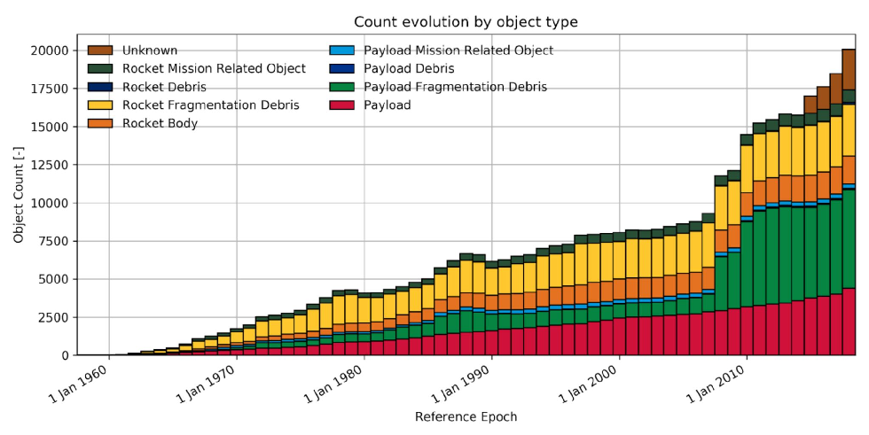
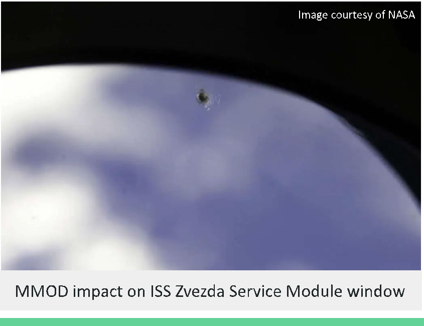
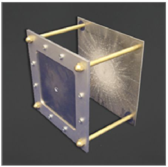
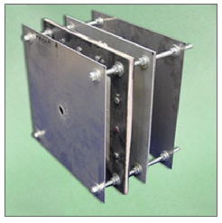

Micrometeoroids and Orbital Debris: Design Considerations

Claire Wadman 15 July 2026 SPCE 5065

## Micrometeoroids and Orbital Debris (MMOD): An Overview

- ● Orbital debris: any man-made objects orbiting the Earth that no longer serve a useful purpose

- ○ Rocket upper stages, defunct satellites, fragments from satellite collisions or breakups
- ○ Can reach speeds up to 17,500 mph in low Earth orbit (LEO) (roughly 10x the average speed of a bullet)

- ● Micrometeoroids: 10 μm-2 mm natural solid objects moving through interplanetary space
- ● Even very small objects can be destructive when colliding with satellites at extremely high velocities

## Evolution of Orbital Debris

### ● As of 2024, European Space Agency (ESA) reports 36,240 debris objects in orbit

Image courtesy of Clean Orbit Foundation

|Size|Potential Risk|Potential Impact to Satellite|
|---|---|---|
|> 10 cm|Objects are trackable Too large for effective shielding|Catastrophic damage to complete destruction|
|1-10 cm|Larger objects in range are trackable Still too large for effective shielding|Moderate to catastrophic damage|
|< 1 cm|Objects are not trackable Effective shielding exists|Minor damage; can still be detrimental to mission|

- ● Results of MMOD impacts range from complete satellite destruction to minor erosions, cracks, and dents

- ○ However, even minor effects can cause long term damage
- ○ Result of impact depends on object size and relative velocity between object and satellite

Image courtesy of NASA

MMOD impact on ISS Zvezda Service Module window

## Design Considerations

- ● Design to withstand impacts by small debris

- ○ Material selection
- ○ Shielding (e.g. Whipple Shield)

■ Sacrificial layer(s) in front of spacecraft that absorb shock

- ● Maintain performance while reducing fragmentation from solar radiation
- ● Increase quality and reliability of propellants and batteries to prevent accidental explosions
- ● Improve maneuverability for collision avoidance
- ● Post-mission disposal

Whipple Shield

Stuffed Whipple Shield

- ○ Graveyard orbits
- ○ De-orbit

Images courtesy of NASA Hypervelocity Impact Technology

# Thank You!

## Sources

- ● National Space Society. (2023). Orbital Debris 101. NSS.org. https://nss.org/wp-content/uploads/2023/06/Orbital-Debris-101-An-NSS-Guide-to-the-OrbitalDebris-Issue-and-Its-Management.pdf

- ● Asimow, P.D. (2015). Micrometeoroid. ScienceDirect.com https://www.sciencedirect.com/topics/earth-and-planetary-sciences/micrometeoroid

- ● Clean Orbit Foundation. (2024). Space Debris 101. CleanOrbitFoundation.org. https://cleanorbitfoundation.org/space-debris-101/

- ● National Aeronautics and Space Administration (NASA). (2023, October 15). Micrometeoroids and Orbital Debris. NASA.gov. https://www.nasa.gov/centers-and-facilities/white-sands/micrometeoroids-and-orbital-debrismmod/

- ● Astromaterials Research and Exploration Science (ARES). HyperVelocity Impact Technology. HVIT.JSC.NASA.gov. https://hvit.jsc.nasa.gov/shield-development/
