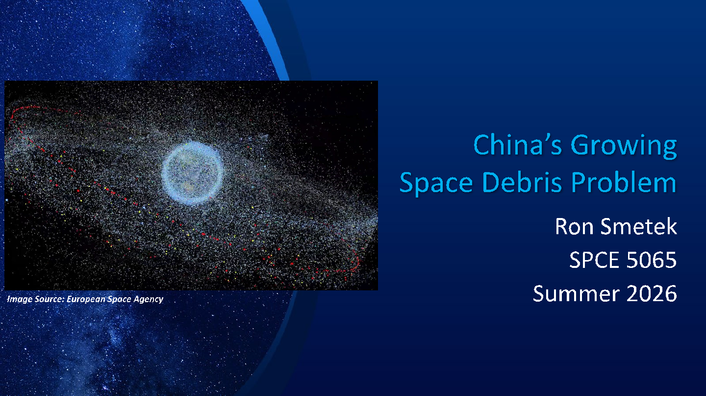

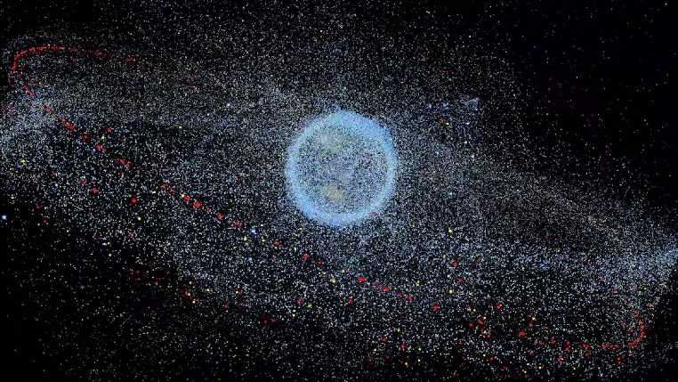

China’s Growing Space Debris Problem

Ron Smetek

SPCE 5065 Summer 2026

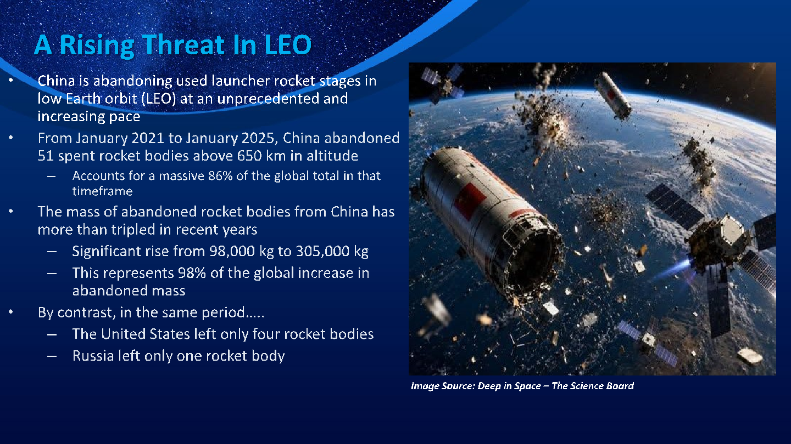

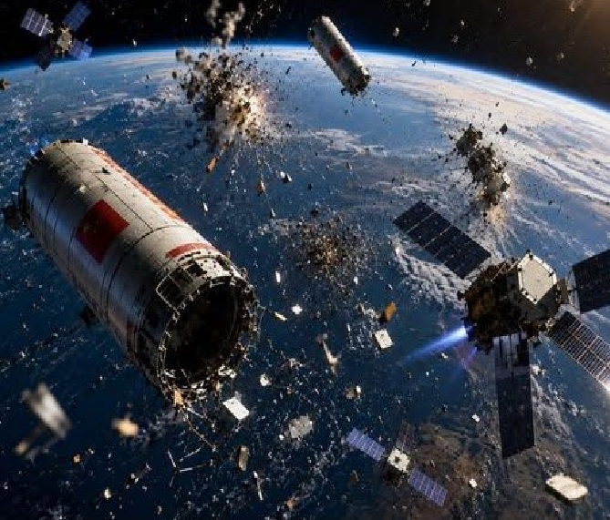

- • China is abandoning used launcher rocket stages in low Earth orbit (LEO) at an unprecedented and increasing pace
- • From January 2021 to January 2025, China abandoned 51 spent rocket bodies above 650 km in altitude

– Accounts for a massive 86% of the global total in that timeframe

- • The mass of abandoned rocket bodies from China has more than tripled in recent years

- – Significant rise from 98,000 kg to 305,000 kg
- – This represents 98% of the global increase in abandoned mass

- • By contrast, in the same period…..

- – The United States left only four rocket bodies
- – Russia left only one rocket body

Image Source: Deep in Space – The Science Board

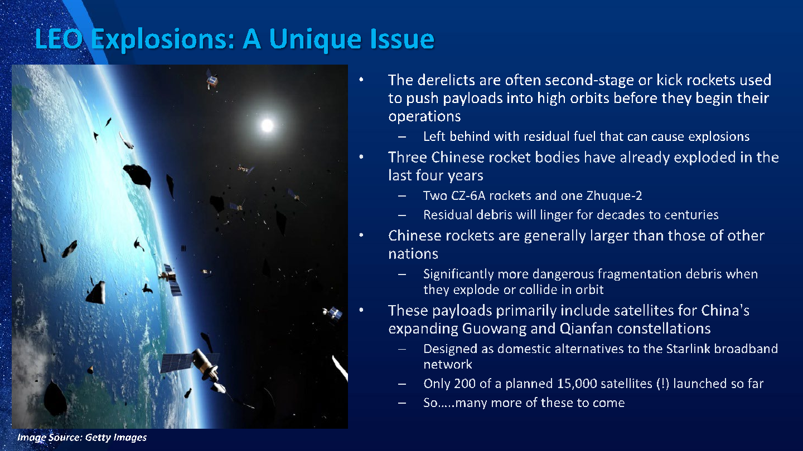

# LEO Explosions: A Unique Issue

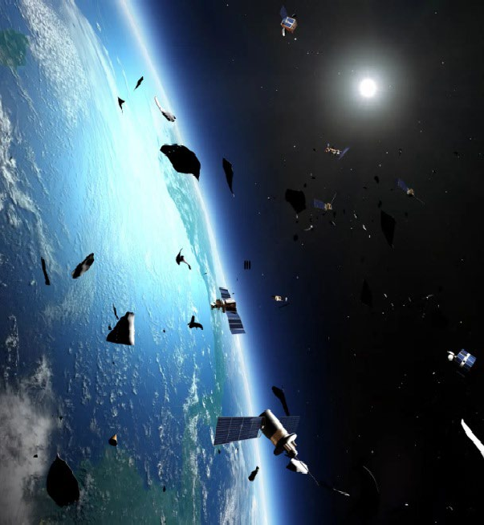

## • The derelicts are often second-stage or kick rockets usedto push payloads into high orbits before they begin theiroperations

– Left behind with residual fuel that can cause explosions

## • Three Chinese rocket bodies have already exploded in thelast four years

- – Two CZ-6A rockets and one Zhuque-2
- – Residual debris will linger for decades to centuries

## • Chinese rockets are generally larger than those of othernations

– Significantly more dangerous fragmentation debris when they explode or collide in orbit

## • These payloads primarily include satellites for China'sexpanding Guowang and Qianfan constellations

- – Designed as domestic alternatives to the Starlink broadband network
- – Only 200 of a planned 15,000 satellites (!) launched so far
- – So…..many more of these to come

Image Source: Getty Images

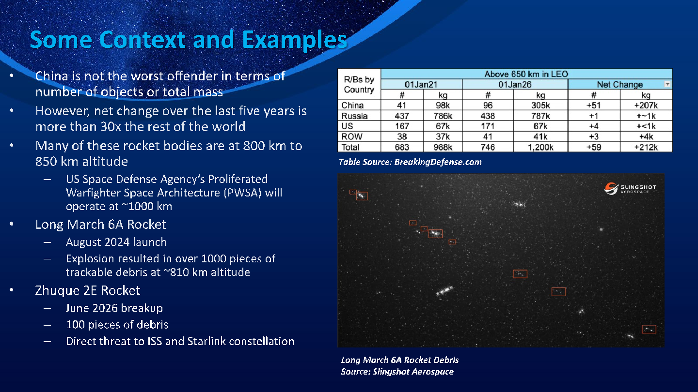

•

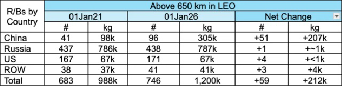

number of objects or total mass

- • However, net change over the last five years is more than 30x the rest of the world
- • Many of these rocket bodies are at 800 km to 850 km altitude

– US Space Defense Agency’s Proliferated Warfighter Space Architecture (PWSA) will operate at ~1000 km

- • Long March 6A Rocket

- – August 2024 launch
- – Explosion resulted in over 1000 pieces of trackable debris at ~810 km altitude

- • Zhuque 2E Rocket

Table Source: BreakingDefense.com

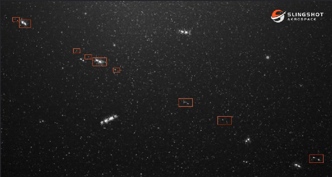

- – June 2026 breakup
- – 100 pieces of debris
- – Direct threat to ISS and Starlink constellation

Long March 6A Rocket Debris Source: Slingshot Aerospace

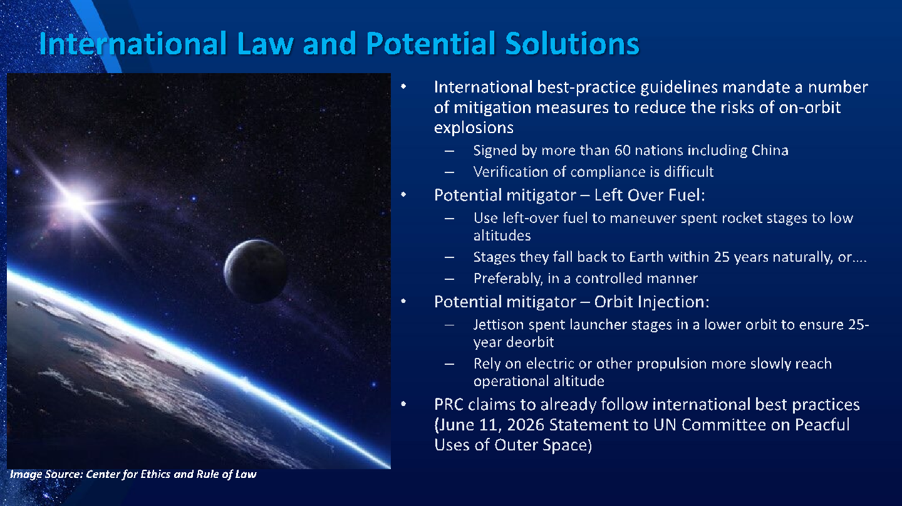

# International Law and Potential Solutions

## • International best-practice guidelines mandate a numberof mitigation measures to reduce the risks of on-orbitexplosions

- – Signed by more than 60 nations including China
- – Verification of compliance is difficult

## • Potential mitigator – Left Over Fuel:

- – Use left-over fuel to maneuver spent rocket stages to low altitudes
- – Stages they fall back to Earth within 25 years naturally, or….
- – Preferably, in a controlled manner

## • Potential mitigator – Orbit Injection:

- – Jettison spent launcher stages in a lower orbit to ensure 25year deorbit
- – Rely on electric or other propulsion more slowly reach operational altitude

## • PRC claims to already follow international best practices(June 11, 2026 Statement to UN Committee on PeacfulUses of Outer Space)

Image Source: Center for Ethics and Rule of Law

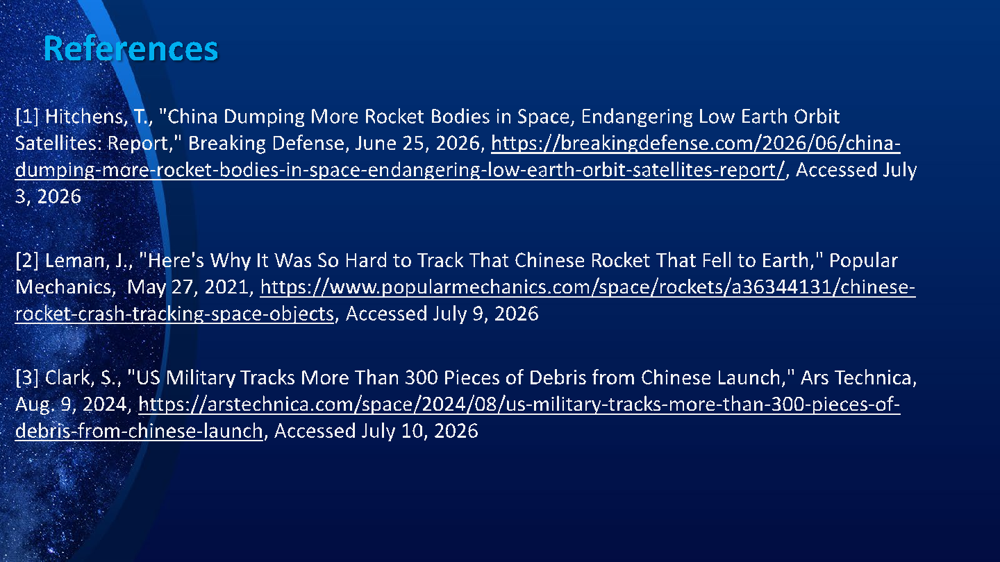

# References

- [1] Hitchens, T., "China Dumping More Rocket Bodies in Space, Endangering Low Earth Orbit Satellites: Report," Breaking Defense, June 25, 2026, https://breakingdefense.com/2026/06/chinadumping-more-rocket-bodies-in-space-endangering-low-earth-orbit-satellites-report/, Accessed July

- [2] Leman, J., "Here's Why It Was So Hard to Track That Chinese Rocket That Fell to Earth," Popular Mechanics, May 27, 2021, https://www.popularmechanics.com/space/rockets/a36344131/chineserocket-crash-tracking-space-objects, Accessed July 9, 2026

- [3] Clark, S., "US Military Tracks More Than 300 Pieces of Debris from Chinese Launch," Ars Technica, https://arstechnica.com/space/2024/08/us-military-tracks-more-than-300-pieces-of-

debris-from-chinese-launch, Accessed July 10, 2026
