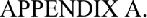
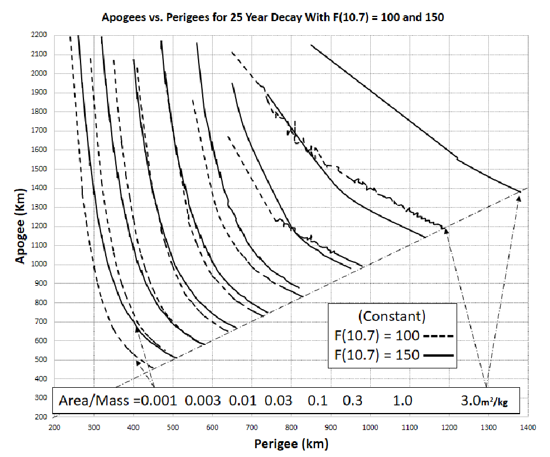
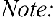
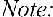
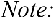
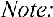
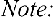
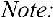
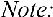

|MEASUREMENT SYSTEM IDENTIFICATION: Metric|
|---|

|NASA TECHNICAL STANDARD  National Aeronautics and Space Administration  |NASA-STD-8719.14C|
|---|---|
|NASA TECHNICAL STANDARD  National Aeronautics and Space Administration  |Approved: 2021-11-05  Superseding NASA-STD-8719.14B|
|Process for Limiting Orbital Debris|Process for Limiting Orbital Debris|

## This page intentionally left blank.

#### DOCUMENT HISTORY LOG

|Status|Document Revision|Approval Date|Description|
|---|---|---|---|
|Baseline| |2007-08-28|Initial Release|
|Change|1|2007-09-06|Administrative correction to remove supersession|
|Change|2|2009-06-10|Update to clarify requirements with respect to update of NPR 8715.6A (with Change 1) and NASA-HDBK 8719.14. Clarification of battery passivation and required ODAR/EOMP signatures.|
|Change|3|2009-07-23|Update to clarify requirement for battery passivation in paragraph 4.4.4.1.2.g.|
|Change|4|2009-09-14|Administrative update to add hyperlinks to SMARTS data system for Chapters 1 & 4.|
|Revision|A|2011-12-08|Text clarification: 1.2.e-i, 2.1.2, 2.2, 4.4.4.1.2, 4.6.2.2/.3, 4.7.1.d, A.3 (Sect 2)  Removed duplicate requirements in various paragraphs, removed Preliminary EOMP (B.1.1), and removed App C, D, & E  Additional requirements: Pre-Acquisition and Small Sat ODARs: 3.3, 4.2.1.j/.k; A.4, A.5; Hazardous materials: 4.7.1.b, 4.7.3.f, 4.7.4.i./.j, 4.7.5.e, A.1 (Sections 7A & 14A), A.3 Table A.31 (Section 7A), & B.1 (Section 7A)|
|Change|1|2012-05-25|Administrative update to add hyperlinks to SMARTS data system for paragraphs 4.2.1, 4.6.1, A.1, A.3, A.4, and B.1.  Administrative update to remove references to requirement 4.6-5 which was deleted in Revision A in paragraphs 4.6.c, 4.6.3, 4.4.4, A.1.6 Section 6, & B.1.5 Section 6.  Administrative typo correction in B.1.5 Front. Administrative update of a few paragraph formats.|
|Revision|B|2019-04-25|Revised to make compatible with NPR 8715.6 Revision B  a) Material in NPR 8715.6A, but removed from or relocated within NPR 8715.6B, expands previous regions where policy is applicable to include stable Sun-Earth and Earth-Moon Lagrange points, and Lunar and Mars orbit, simplifies the documentation content and|

| | | |delivery schedule, and the required signatures at different stages of certain document deliveries  b) Miscellaneous small edits|
|---|---|---|---|
|Revision|C|2021-11-05|1. Update requirements and text for consistency with 2019 ODMSP 2. Updates for clarity and consistency of ODAR and EOMP content 3. Minor editorial updates |

#### FOREWORD

This NASA technical standard provides uniform engineering and technical requirements for processes, procedures, practices, and methods that have been endorsed as standard for NASA programs and projects, including requirements for selection, application, and design criteria for space structures, their space operations, and mission design.

Collision with orbital debris is a risk of growing concern as historically-accepted practices and procedures have allowed artificial objects to accumulate in Earth orbit. To limit future debris generation, NPR 8715.6, “NASA Procedural Requirements for Limiting Orbital Debris and Evaluating the Meteoroid and Orbital Debris Environments,” requires each program and project to conduct a formal assessment of the potential to generate orbital debris during deployment, mission operations, and after the mission has been terminated. This technical standard is incorporated by reference in NPR 8715.6 and provides NASA programs and projects with specific requirements and assessment methods to assure compliance with the NPR. This standard is to be used for orbital debris assessments for all payloads, launch vehicle orbital stages, and released objects as required by NPR 8715.6. NASA-HDBK-8719.14 serves as a reference document to assist orbital debris practitioners and program/project management in understanding the technical, physical, and political aspects of orbital debris.

This standard is consistent with the objectives of the National Space Policy of the United States of America (June 2010), Space Policy Directive-3, the National Space Traffic Management Policy (June 2018), the U.S. Government Orbital Debris Mitigation Standard Practices (November 2019), the Inter-Agency Space Debris Coordination Committee (IADC) Space Debris Mitigation Guidelines (March 2020), and the Space Debris Mitigation Guidelines of the United Nations Committee on the Peaceful Uses of Outer Space, (2010). The requirements contained within this standard (and NPR 8715.6) encompass the requirements within the U.S. Government Orbital Debris Mitigation Standard Practices, the IADC Space Debris Mitigation Guidelines, and the United Nations documents cited above and therefore their implementation should ensure compliance with the requirements in those documents.

Requests for information, clarifications, corrections, or additions to this standard should be submitted to the NASA, Office of Safety and Mission Assurance (OSMA), by email to AgencySMA-Policy-Feedback@mail.nasa.gov or via the “Email Feedback” link at https://standards.nasa.gov.

11/5/2021

W. Russ DeLoach Approval Date Chief, Safety and Mission Assurance

## This page intentionally left blank.

#### TABLE OF CONTENTS

DOCUMENT HISTORY LOG ................................................................................................... 3 FOREWORD................................................................................................................................. 5 TABLE OF CONTENTS ............................................................................................................. 7 LIST OF APPENDICES .............................................................................................................. 7 LIST OF FIGURES ...................................................................................................................... 8 LIST OF TABLES ........................................................................................................................ 8

- 1. SCOPE ............................................................................................................................ 9

- 1.1 Purpose............................................................................................................................. 9
- 1.2 Applicability .................................................................................................................... 9

- 2. APPLICABLE AND REFERENCE DOCUMENTS ............................................... 10

- 2.1 Applicable Documents................................................................................................... 10
- 2.2 Reference Documents.................................................................................................... 11
- 3. ACRONYMS AND DEFINITIONS........................................................................... 12

- 3.1 Acronyms....................................................................................................................... 12

- 3.2 Definitions...................................................................................................................... 13
- 4. REQUIREMENTS....................................................................................................... 16

- 4.1 Objectives of Orbital Debris Assessments and Planning............................................... 16

- 4.2 Conducting Debris Assessments: An Overview........................................................... 16

- 4.3 Assessment of Debris Released During Normal Operations......................................... 22
- 4.4 Assessment of Debris Generated by Explosions and Intentional Breakups .................. 28
- 4.5 Assessment of Debris Generated by On-orbit Collisions .............................................. 35
- 4.6 Postmission Disposal of Space Structures..................................................................... 40
- 4.7 Assessment of Debris Surviving Atmospheric Reentry................................................. 49
- 4.8 Additional Assessment Requirements for Special Classes of Space Missions.............. 54

#### LIST OF APPENDICES

ORBITAL DEBRIS ASSESSMENT REPORTS (ODAR) ................................ 57 EOMPS................................................................................................................ 72

#### LIST OF FIGURES

Figure 4.3-1. Apogee vs. Perigees for 25 Year Decay With F(10.7) = 100 and 150.................... 27 Figure 4.6-2. IADC Rationale for GEO minimum perigee equation............................................ 44

- Figure A.2-3. PDR/CDR ODAR Review Check Sheet................................................................ 65
- Figure A.2-4. Final ODAR Review Check Sheet (2 Pages)......................................................... 66 Figure B.2-1. In-Flight EOMP Review Check Sheet ................................................................... 77

#### LIST OF TABLES

- Table 4.2-1. Orbital Debris Technical Area Organization............................................................ 19
- Table 4.2-2. Orbital Debris Technical Area Issues and Corresponding Requirements................ 20 Table A.3-1. Mandatory Sections in an Abbreviated ODAR....................................................... 67

# PROCESS FOR LIMITING ORBITAL DEBRIS

#### 1. SCOPE

###### 1.1 Purpose

- 1.1.1 This document serves as a companion to NPR 8715.6 and provides specific technical requirements for limiting orbital debris and methods to comply with the NASA requirements for limiting orbital debris generation. This standard helps ensure that spacecraft and launch vehicles meet acceptable standards for limiting orbital debris generation.
- 1.1.2 This standard is primarily designed to limit the creation of new orbital debris and, therefore, to limit the risk to other current and future space missions. The methodologies described herein can be used by programs and projects to evaluate and to improve their own mission reliability and success with respect to vulnerabilities associated with the orbital debris and meteoroid environment. The assessments described in this standard are required per NPR 8715.6 and are reviewed for completeness as a part of the flight approval processes.
- 1.1.3 This standard details requirements for (1) limiting the generation of orbital debris, (2) assessing the risk of collision with existing space debris, (3) assessing the potential of space structures to impact the surface of the Earth, and (4) assessing and limiting the risk associated with the End of Mission (EOM) of a space object. In addition to requirements in Section 4 and methods for assessment, this standard provides the format for the required debris assessment and reports which must be submitted to the Office of Safety and Mission Assurance as required in NPR 8715.6.

Note: NASA-HDBK-8719.14 serves as a reference document to assist orbital debris practitioners and program/project management in understanding orbital debris. Topics in NASA-HDBK-8719.14 include the orbital debris environment, measurements, modeling, shielding, mitigation, and reentry. It is strongly encouraged that the NASAHDBK be used with the implementation of NPR 8715.6 and NASA-STD-8719.14.

- 1.1.4 This document is primarily intended for use in assessing orbital debris that is in Earth orbit. For spacecraft and launch vehicles traveling beyond Earth orbit, the beginning of Sections 4.3-4.8 state how the requirements in this standard are applicable.

###### 1.2 Applicability

- 1.2.1 This standard is applicable to NASA Headquarters (HQ) and NASA Centers, including Component Facilities and Technical and Service Support Centers. This standard applies to the Jet Propulsion Laboratory (a Federally-Funded Research and Development Center), other contractors, recipients of grants and cooperative agreements, and parties to other agreements only to the extent specified or referenced in the applicable contracts, grants, or agreements.
- 1.2.2 This standard is applicable to programs and projects responsible for NASA or NASAsponsored objects launched into space as set forth in NPR 8715.6. This standard only applies to

objects which will exceed 130 km (~70 mi) in altitude and achieve or exceed Earth orbital velocity.

- Note 1: Sponsored by NASA are those objects developed or operated by NASA, under contract from NASA, or under agreement with NASA.
- Note 2: The National Space Transportation Policy of 2013, gives the Department of Transportation (DOT) the authority to oversee orbital debris mitigation practices for Federal Aviation Administration (FAA)-licensed launches. Furthermore, for the purpose of this standard, NASA is not a sponsor of launch vehicles furnished by the Department of Defense or foreign partners.

- 1.2.3 NASA missions, spacecraft, and launch vehicles that were under contract or passed Preliminary Design Review prior to the release of this edition of the standard may follow the system and mission design requirements in the edition of the standard active at that time. However, while the mission is in operation, decisions in response to the occurrence of conditions or events that may affect the planned passivation or disposal maneuvers at EOM, such as decisions to extend the mission or to change its profile, will be evaluated based on the current edition of this standard.
- 1.2.4 NPR 8715.3 defines the process for requesting and granting relief from requirements within this standard.
- 1.2.5 In this standard, "shall" denotes a mandatory requirement, "may" denotes a discretionary privilege or permission, “can” denotes statements of possibility or capability, "should" denotes a good practice, and "will" denotes an expected outcome.
- 1.2.6 NPR 7120.5 and NPR 8715.6 require the use of this document for development of Orbital Debris Assessments (ODA), Orbital Debris Assessment Reports (ODAR), and End of Mission Plans (EOMP).

#### 2. APPLICABLE AND REFERENCE DOCUMENTS

###### 2.1 Applicable Documents

- 2.1.1 General

If there is a conflict between a requirement in this NASA standard and the requirements of an applicable NASA Procedural Requirement (NPR) or NASA Policy Directive (NPD), the requirement in the NPD or NPR will always take precedence over the requirement of this standard. The applicable documents are accessible via the NASA Online Directives Information System at https://nodis3.gsfc.nasa.gov/ or the NASA Technical Standards System at https://standards.nasa.gov or may be obtained directly from the Standards Developing Organizations or other document distributors.

- 2.1.2 Government Documents NPD 1000.5 Policy for NASA Acquisition

NPD 8010.3 Notification of Intent to Decommission or Terminate Operating Space Systems and Terminate Missions

NPD 8020.7 Biological Contamination Control for Outbound and Inbound Planetary Spacecraft

NPR 7120.5 NASA Space Flight Program and Project Management Requirements

NPR 8020.12 Planetary Protection Provisions for Robotic Extraterrestrial

Missions NPR 8715.3 NASA General Safety Program Requirements NPR 8715.6 NASA Procedural Requirements for Limiting Orbital

Debris and Evaluating the Meteoroid and Orbital Debris Environments

NASA-HDBK-8719.14 Handbook for Limiting Orbital Debris

###### 2.2 Reference Documents

The documents listed in this section do not constitute requirements of this standard, but are cited in the text to provide further clarification and guidance.

United Nations Document V.09-88517, UN Space Debris Mitigation Guidelines of the Committee on the Peaceful Use of Outer Space, 2010, available at http://www.unoosa.org/pdf/publications/st_space_49E.pdf

Inter-Agency Space Debris Coordination Committee (IADC-02-01) Space Debris Mitigation Guidelines (March 2020), available at https://www.iadc-home.org/documents_public/file_down/id/4204.

National Space Policy of the United States of America (December 2020), available at https://trumpwhitehouse.archives.gov/wp-content/uploads/2020/12/National-SpacePolicy.pdf.

Space Policy Directive-3, National Space Traffic Management Policy (June 2018), available at https://trumpwhitehouse.archives.gov/presidential-actions/space-policydirective-3-national-space-traffic-management-policy/.

U.S. Government Orbital Debris Mitigation Standard Practices (November 2019), available at https://orbitaldebris.jsc.nasa.gov/library/usg_orbital_debris_mitigation_standard_practi ces_november_2019.pdf.

U.S. Air Force Space and Missile Center (SMC) Orbital Debris Handbook, (July, 2002), available at https://apps.dtic.mil/dtic/tr/fulltext/u2/a435172.pdf.

18th Space Control Squadron Spaceflight Safety Handbook for Satellite Operators (August 2020), available at https://www.spacetrack.org/documents/Spaceflight_Safety_Handbook_for_Operators.pdf.

JSC-27862, Postmission Disposal of Upper Stages (December 1998), (available through the NASA Orbital Debris Program Office).

Debris Assessment Software (DAS) (https://www.orbitaldebris.jsc.nasa.gov/mitigation/das.html).

Meteoroid Engineering Model (MEM) (https://www.nasa.gov/offices/meo/software/mem_detail.html).

Object Reentry Survival Analysis Tool (ORSAT) (https://www.orbitaldebris.jsc.nasa.gov/reentry/orsat.html).

Orbital Debris Engineering Model (ORDEM) (https://orbitaldebris.jsc.nasa.gov/modeling/ordem-3.1.html).

#### 3. ACRONYMS AND DEFINITIONS

- 3.1 Acronyms 18 SPCS The 18th Space Control Squadron of the U.S. Space Force CARA Conjunction Assessment Risk Analysis CDR Critical Design Review DAS Debris Assessment Software DCA Debris Casualty Area EOM End of Mission EOMP End of Mission Plan GEO Geosynchronous Earth Orbit GTO Geosynchronous Transfer Orbit HQ Headquarters IADC Inter-Agency Space Debris Coordination Committee JSC Johnson Space Center LEO Low Earth Orbit

MCR Mission Concept Review MEM Meteoroid Engineering Model MEO Medium Earth Orbit MMOD Micrometeoroids and Orbital Debris MRD Mission-Related Debris ODA Orbital Debris Assessment ODAR Orbital Debris Assessment Report ODMSP U.S. Government Orbital Debris Mitigation Standard Practices ODPO NASA Orbital Debris Program Office ORDEM Orbital Debris Engineering Model ORSAT Object Reentry Survival Analysis Tool OSMA Office of Safety and Mission Assurance PDR Preliminary Design Review PPO Planetary Protection Officer SMA Safety and Mission Assurance SSO Sun Synchronous Orbit TOPO Trajectory Operations Planning Office

###### 3.2 Definitions

Apogee. The point in the orbit that is the farthest from the center of the Earth. The apogee altitude is the distance of the apogee point above the surface of the Earth.

Ascending node. The point in the orbit where a satellite crosses the Earth's equatorial plane in passing from the southern hemisphere to the northern hemisphere.

Credible failure mode. A failure mode identified by failure mode and effects analyses or equivalent analyses, for which a quantitative failure probability is available and exceeds 0.000001 (1:1,000,000).

Decommissioning. The process of closing out the mission, including data archiving, hardware logistics, and management issues. Decommissioning follows passivation of the spacecraft.

Disposal. An end-of-mission process for moving a spacecraft (if necessary) to an orbit or trajectory considered acceptable for orbital debris limitation.

Earth orbital velocity. Any velocity perpendicular to the Earth’s radius vector at or above 130 km that is in excess of 7,826 m/sec.

Eccentricity. The apoapsis altitude minus periapsis altitude of an orbit divided by twice the semi-major axis. Eccentricity is zero for circular orbits and less than one for all elliptical orbits.

Geosynchronous earth orbit. A circular GEO with 0° inclination is a geostationary orbit about the Earth; i.e., the nadir point is fixed on the Earth’s surface. The nominal altitude of a circular GEO is 35,786 km and the nominal inclination range is +/- 15 degrees latitude.

Geosynchronous transfer orbit. A highly eccentric orbit with perigee normally within or near the LEO region and apogee near or above GEO altitude.

Inclination. The angle an orbital plane makes with the Earth’s equatorial plane. Large constellation. As defined in the 2019 ODMSP, a constellation consisting of 100 or more operational spacecraft cumulative is considered a large constellation. Launch vehicle. Any space transportation mode, including expendable launch vehicles (ELVs) and reusable launch vehicles (RLVs). Low earth orbit. An orbit with a mean altitude less than or equal to 2,000 km, or equivalently, an orbit with a period less than or equal to 127 minutes. Meteoroids. Naturally occurring particulates associated with solar system formation or evolution processes. Meteoroid material is often associated with asteroid breakup or material released from comets. Mission Operations. Phase of a mission where the spacecraft is performing a useful function, including the design mission, primary mission, secondary mission, extended mission, and activities leading to disposal.

Orbital debris. Artificial objects, including derelict spacecraft and spent launch vehicle orbital stages, left in orbit which no longer serve a useful purpose. In this document, only debris of diameter 1 mm and larger is considered. Note that while not classified as orbital debris, released liquids should explicitly be shown to be compliant with all mitigation requirements.

Orbital lifetime. The length of time an object remains in orbit. Objects in LEO or passing through LEO lose energy as they pass through the Earth’s upper atmosphere, eventually getting low enough in altitude that the atmosphere removes them from orbit.

Orbital stage. A part of the launch vehicle left in a parking, transfer, or final orbit (excluding solar/interplanetary orbits with no potential intercept with Earth) during or after payload insertion; includes liquid propellant systems, solid rocket motors, and any propulsive unit jettisoned from a spacecraft.

Passivation. The process of removing stored energy from a space structure which could credibly result in eventual generation of new orbital debris after End of Mission. This includes removing energy in the form of electrical, pressure, mechanical, or chemical.

Perigee. The point in the orbit that is nearest to the center of the Earth. The perigee altitude is the distance of the perigee point above the surface of the Earth.

Postmission disposal. The process of intentionally changing the orbit of a spacecraft after the end of the operational mission.

Prompt injury. A medical condition received as a result of the falling debris which requires (or should have required) professional medical attention within 48 hours of the impact.

Right ascension of ascending node: The angle between the line extending from the center of the Earth to the ascending node of an orbit and the line extending from the center of the Earth to the vernal equinox, measured from the vernal equinox eastward in the Earth’s equatorial plane.

Semi-major axis. Half the sum of the distances of apogee and perigee from the center of the Earth (or other body) equal to half the length of the major axis of the elliptical orbit.

Spacecraft. This includes all components contained within or attached to a space borne payload such as instruments and fuel.

Space debris. General class of debris, including both meteoroids and orbital debris. Space structures: Launch vehicle components, upper stages, spacecraft, and other payloads. Stabilized. When the spacecraft maintains its orientation along one or more axes.

Sun synchronous orbit. An orbit in which the angle between the Sun-Earth vector and the intersection of the plane of a satellite's orbit and the Earth's equator is a constant and does not change with the season.

Tether. A long flexible structure greater than 300 meters in length. Tethers can have a variety of purposes, but are typically used electro-dynamically for power generation or to impart changes in linear or angular momentum.

Note: Despite their slender nature, such structures have significant projected areas which, combined with their small cross sections, make them highly vulnerable to being cut or damaged. Such damage may compromise the ability to successfully retract/stow the entire tether. Due to their length, tethers present problematic issues for conjunction analyses and avoidance maneuvers.

Vernal equinox. The direction of the Sun in space when it passes from the southern hemisphere to the northern hemisphere (on March 20 or 21) and appears to cross the Earth’s equator. The vernal equinox is the reference point for measuring angular distance along the Earth’s equatorial plane (right ascension) and one of two angles usually used to locate objects in orbit (the other being declination).

#### 4. REQUIREMENTS

###### 4.1 Objectives of Orbital Debris Assessments and Planning

- 4.1.1 It is U.S. and NASA policy to limit the generation of orbital debris, consistent with mission requirements and cost effectiveness. NPR 8715.6 requires that each program or project conduct a formal assessment of the potential to generate orbital debris.

- 4.1.2 The NASA Orbital Debris Program Office (ODPO), located at the Johnson Space Center (JSC), supports programs and projects with orbital debris assessments. The Safety and Mission Assurance (SMA) organization at each Center and NASA HQ can also assist programs and projects with the preparation of the required ODARs and EOMPs.
- 4.1.3 Section 4.2 of this standard requires that programs and projects use the orbital debris modeling tools provided (or agreed to) by the NASA ODPO in assessing orbital debris generation and risk in Earth orbit.

###### 4.2 Conducting Debris Assessments: An Overview

- 4.2.1 The main objective of the NASA Orbital Debris Program is to limit the generation of debris in Earth and Moon orbit and limit the risk of human casualty due to generated orbital debris through prevention and analyses. Debris can damage other spacecraft, force spacecraft to perform evasive maneuvers, induce degraded capability to meet mission objectives, and become a hazard to people in orbit and to people on the ground. In addition to limiting generation of debris in Earth and lunar orbits, NPR 8715.6 recommends that the generation of debris be limited in Mars orbit, and in the vicinity of Sun-Earth or Earth-Moon Lagrange Points. This NASA standard specifies and tailors the processes and validations necessary to meet the intent of that directive in each of the specified environments.
- 4.2.2 Limiting orbital debris involves the following:

- a. Limiting the generation of debris associated with normal space operations;
- b. Limiting the probability of impact with other objects in orbit;
- c. Limiting the consequences of impact with existing orbital debris or meteoroids;

- d. Limiting the debris hazard posed by tether systems;
- e. Depleting to a non-explosive potential all onboard energy sources after completion of mission;
- f. Limiting orbital lifetime in protected orbits or maneuvering to a disposal orbit after mission completion; and
- g. Limiting the human casualty risk from space system components surviving reentry as a result of postmission disposal.

- 4.2.3 This document, along with the associated current version of the NASA Debris Assessment Software (DAS) or the higher fidelity NASA Object Reentry Survival Analysis Tool (ORSAT), maintained by the NASA ODPO, and the Bumper code maintained by the NASA Hypervelocity Impact Team, is to be used by the program or project manager as the primary reference in conducting orbital debris assessments. Alternate tools and models may be employed to satisfy the assessment requirements in limited circumstances, with approval from OSMA prior to the assessment.
- 4.2.4 The approved environmental models for the assessments are the latest NASA Orbital Debris Engineering Model (ORDEM) for orbital debris and NASA Meteoroid Engineering Model (MEM) for meteoroids. The NASA Meteoroid Environment Office may approve the use of other meteoroid models if those models account for the directionality and speed distribution of the meteoroids and meteoroid flux relative to the spacecraft.
- 4.2.5 ODA and ODARs

- 4.2.5.1 The detailed requirements and evaluation methods for ODARs are presented in Sections 4.3 through 4.8.
- 4.2.5.2 The orbital debris assessment covers the following broad areas:

- a. The potential for generating debris during normal operations or by explosions;
- b. The potential for generating debris from a collision with debris or orbiting space systems;
- c. Postmission disposal.

- 4.2.5.3 These broad areas are categorized into six issues that are addressed in the assessment:

- a. Debris released during normal operations;
- b. Debris generated by explosions and intentional breakups;
- c. Debris generated by on-orbit collisions during mission operations;

- d. Reliable disposal of spacecraft and launch vehicle orbital stages after mission completion;
- e. Structural components impacting the Earth following postmission disposal by atmospheric reentry;
- f. Debris generated by on-orbit collisions with a tether system, and by other special classes of space missions.

- 4.2.5.4 The assessment is organized in an ODAR using Appendix A.1.
- 4.2.5.5 ODAs being performed on components or portions of a spacecraft are documented in the Abbreviated ODAR using Appendix A.3.
- 4.2.5.6 Programs are strongly encouraged to limit the regeneration of existing programmatic assessments, but rather include them as an attachment to the ODAR.
- 4.2.5.7 NPR 8715.6 specifies the timing of deliveries of ODARs to NASA.
- 4.2.5.8 Although the first detailed ODAR is not required until Preliminary Design Review (PDR), an “Initial ODAR” is required for each project to assist NASA management in considering potential orbital debris issues during Mission Concept Review (MCR) to estimate and minimize potential cost impacts.
- 4.2.5.9 ODAs being performed on space systems during a project’s Phase A are documented in the Initial ODAR using Appendix A.4.
- 4.2.5.10 NASA International Space Station (ISS) payloads that remain encapsulated by or permanently mounted on the ISS or other spacecraft are exempted from debris assessments. Debris assessments are also not required of payloads that are temporarily installed outside the ISS and later returned as cargo in a vehicle. Debris assessments are required of NASA payloads and components that are expected to be released (jettisoned or deployed) from the ISS.
- 4.2.5.11 NASA exploration vehicle payloads that remain encapsulated by or permanently mounted on the vehicle are exempted from debris assessments. Debris assessment requirements do not apply to payloads that are temporarily installed outside the vehicle. Debris assessments are required of NASA payloads and components that are expected to be released (jettisoned or deployed) from the exploration vehicles.

- 4.2.6 EOMP

- 4.2.6.1 An EOMP is developed for limiting debris generation and limiting risk to the public and other active spacecraft during decommissioning and disposal of all operational space objects.
- 4.2.6.2 The EOMP is a living document. It is maintained throughout mission operations to ensure that operational use does not preclude a safe decommissioning and disposal. The

- EOMP identifies milestones in the operational life of the mission which affect the EOM processing. After those milestones, the EOMP and the health of the critical items defined in the EOMP should be evaluated and updated so that NASA management understands the constraints and options available at EOM for limiting orbital debris.
- 4.2.6.3 The EOMP is organized using Appendix B, Section B.1.
- 4.2.6.4 The EOMP contains statements covering what actions must be undertaken in the event of reductions of capabilities or consumables which may significantly and predictably threaten the ability to carry out the planned EOM disposal. This includes reduction of system capability to “single string” unless expressly agreed otherwise. Such actions are not intended to represent binding "trigger points" for disposal, but rather an identification and planning for disposal-critical parameters.
- 4.2.6.5 Programs are strongly encouraged to limit the regeneration of existing programmatic information, but rather include the ODAR and other assessments as attachments.
- 4.2.6.6 NPR 8715.6, Table A specifies the timing of deliveries of EOMPs to NASA.
- 4.2.6.7 An EOMP may include other aspects of the EOM process (final disposition of data and hardware, for example) if the program finds that the EOMP is the most convenient means of recording this information. Other applicable sections may be placed after the sections specified in Appendix B.

- 4.2.7 Structure of the Requirements in this Document

- 4.2.7.1 Each of Sections 4.3 through 4.8 covers a separate orbital debris technical area. Table 4.2-1 defines the organization for each technical area. Table 4.2-2 lists each orbital debris technical area.

Note: In Table 4.2-1, the ‘4.x’ is a pointer to Sections 4.3 to 4.8.

Table 4.2-1. Orbital Debris Technical Area Organization

|Section 4.x.1|Definition of the Area|
|---|---|
|Section 4.x.2|Requirements for the Area|
|Section 4.x.3|Rationale for the Area Requirements|
|Section 4.x.4|Methods to Assess Compliance|
|Section 4.x.5|Brief Summary of Mitigation Measures Used in NASA for this Area|

- 4.2.7.2 The sections titled "Method to Assess Compliance" (Sections 4.x.4) provide detailed steps for how compliance with each requirement is determined and measured. For

- most requirements, actual compliance can be verified with the specially designed DAS for operations in Earth orbit. Both the software and its documentation can be downloaded from the NASA ODPO website at https://orbitaldebris.jsc.nasa.gov/mitigation/das.html. NASA ODPO contact personnel are also identified on this web site. The models in DAS support the approach and techniques described in this standard. If methods or models other than DAS are used, a full description of the models used will need to be added to ODAR Front Matter (See Appendix A, Section A.1.)
- 4.2.7.3 Table 4.2-2 provides a summary of each of the technical requirements which need to be addressed in the ODAR.

Table 4.2-2. Orbital Debris Technical Area Issues and Corresponding Requirements

|Debris Assessment Issues|Reqm’t|Requirement Summary|Comments|
|---|---|---|---|
|Release of debris during normal mission operations|4.3-1 and 4.3-2 |• Limit number and orbital lifetime of debris passing through LEO • Limit lifetime of objects passing near GEO |Requirement includes staging components, deployment hardware, subsatellites, or other objects that are known to be released during normal operations.|
|Accidental explosions|4.4-1 and 4.4-2 |• Limit probability of accidental explosion during mission operations • Passivate to limit probability of accidental explosion after EOM |Requirement addresses systems and components such as range safety systems, pressurized volumes, residual propellants, and batteries.|
|Intentional breakups|4.4-3 and 4.4-4 |• Limit number, size, and orbital lifetime of debris larger than 1 mm and 10 cm (respectively) • Assess risk to other programs for times immediately after a test when the debris cloud contains regions of high debris density |Intentional breakups include tests involving collisions or explosions of flight systems and intentional breakup during space system reentry to reduce the amount of debris reaching the surface of the Earth.|
|Collisions with large objects during orbital lifetime|4.5-1|Assess probability of collision with intact space systems or large debris (>10cm)|Collisions with intact space systems or large debris may create a large number of debris fragments that pose a risk to other operating spacecraft. A significant probability of collision may necessitate design or operational changes.|

|Debris Assessment Issues|Reqm’t|Requirement Summary|Comments|
|---|---|---|---|
|Collisions with small debris during mission operations|4.5-2|Assess and limit the probability of damage to critical components as a result of impact with small debris|Damage by small debris impacts can result in failure to perform postmission disposal. A significant probability of damage may necessitate shielding, use of redundant systems, or other design or operational options.|
|Postmission disposal|4.6-1, 4.6-2, 4.6-3, and 4.6-4 |• Remove space structures from LEO to reduce collision threat to future space operations • Remove space structures from GEO to reduce collision threat to future space operations • Govern intermediate disposal orbits • Remove space structures via long-term reentry • Assess reliability of postmission disposal • Assess options for disposal beyond Earth’s orbit consistent with planetary protection requirements |The accumulation of space structures in Earth orbit increases the likelihood of future collisions and debris generation. The orbital lifetimes of space structures in LEO and near GEO must be limited. The removal of objects at the EOM is preferred, but specific disposal orbits may be used.|
|Reentry Debris Casualty Risk|4.7-1|• Limit number and size of debris fragments that survive atmospheric reentry|This requirement limits human casualty expectation.|
|Risk from special classes of missions|4.8-1|• Clarification and additional requirements for certain special classes of space missions, such as tether systems.|Mitigate risk from special classes of missions.|

Requirement applicability is indicated in the introduction to each requirement area in Sections 4.3 – 4.8.

- 4.2.8 Deviations to ODARs and EOMPs

Any non-compliance with the requirements for ODAR and EOMPs stated in this standard requires NASA management approval of a waiver per NPR 8715.6.

###### 4.3 Assessment of Debris Released During Normal Operations

- 4.3.1 Definition of Released Debris Technical Area

- 4.3.1.1 Orbital debris analyses assess the amount of launch vehicle and spacecraft debris released during normal operations. This requirement area applies to all space structures while in Earth orbit. Operators are encouraged to limit the release of debris while in Moon or Mars orbit, or in the vicinity of Sun-Earth or Earth-Moon Lagrange Points.
- 4.3.1.2 The goal is that in all operational orbits, space systems are designed not to release debris during normal operations. Where this is not feasible, any release of debris needs to be minimized in number, area, and orbital lifetime.
- 4.3.1.3 Historically, debris has been released as an incidental part of normal space operations. This type of debris is referred to as operational or mission-related debris and includes such objects as sensor covers, tie-down straps, explosive bolt fragments, attitude control devices, and dual payload attachment fittings. Space systems need to be designed to avoid the creation of any operational or mission-related debris. If the release of debris is unavoidable, the release should be done in a manner that limits the risk to other users of space. Debris 1 mm in diameter (mass approximately 1 mg) and larger for Low Earth Orbit (LEO) and 5 mm and larger for Geosynchronous Earth Orbit (GEO) is a source of concern because these debris have sufficient energy to critically damage an operating spacecraft. Large, and especially long-lived debris can create a cloud of secondary debris fragments in the event of a collision with another resident space object.
- 4.3.1.4 The probability of a future collision occurring with debris depends on the number and size of the debris and on the length of time the debris remains in orbit. The requirements, therefore, limit the total number of such debris objects and their orbital lifetimes. Debris released during normal operations includes debris released during launch vehicle staging, payload separation, deployment, mission operations, and EOM passivation/disposal. Spacecraft and spent orbital stages, as intact space structures, are not considered missionrelated debris themselves and are addressed later in Sections 4.5 and 4.6. For the purpose of this standard, however, satellites smaller than a 1U standard CubeSat are treated as missionrelated debris and follow the same requirements for mission-related debris from LEO to GEO.
- 4.3.1.5 Small debris, such as slag which is ejected during the burning of a solid rocket motor and liquids dispersed from a spacecraft, are not covered by the requirements of this standard.

- 4.3.2 Requirements for the Control of Debris Released During Normal Operations

- 4.3.2.1 NASA policy is that all NASA programs and projects assess and limit the amount of debris released as a part of the mission. Each instance of planned release of debris larger

- than 1 mm in any dimension that remains on orbit for more than 25 years in LEO and 5 mm in GEO should be evaluated and technical rationale provided to support not meeting the requirement. This requirement area applies to all space structures in Earth orbit that release items/objects into Earth orbit. Slag ejected during the burning of solid rocket motors, and liquids dispersed from a spacecraft, are not covered by these requirements.
- 4.3.2.2 Requirement 4.3-1: Planned debris release passing through LEO – released debris with diameters of 1mm or larger:

- a. Requirement 4.3-1a: All debris released during the deployment, operation, and disposal phases shall be limited to a maximum orbital lifetime of 25 years from date of release.
- b. Requirement 4.3-1b: The total object-time product shall be less than 100 object-years per launch vehicle upper stage or per spacecraft.

- 4.3.2.3 Requirement 4.3-2: Planned debris release passing near GEO: For missions leaving debris in orbits with the potential of traversing GEO (GEO altitude +/- 200 km and

+/- 15 degrees inclination), released debris with diameters of 5 mm or greater shall be left in orbits which will ensure that within 25 years after release the apogee will no longer exceed GEO - 200 km or the perigee will not be lower than GEO + 200 km , and also ensures that the debris is incapable of being perturbed to lie within that GEO +/- 200 km and +/- 15 zone for at least 100 years thereafter.

- 4.3.3 Rationale for Released Debris Area Requirements

- 4.3.3.1 The intent of Requirement 4.3-1 is to remove debris in LEO from the environment in a reasonable period of time. The 25-year removal time from LEO limits the growth of the debris environment over the next 100 years while limiting the cost burden to programs and projects. The limit of 25 years has been thoroughly researched and has been accepted by the U.S. Government and the major space agencies of the world.
- 4.3.3.2 Debris in orbits with perigee altitudes below 600 km will usually have orbital lifetimes of less than 25 years. This requirement will have the greatest impact on programs and projects with perigee altitudes above 700 km, where objects may remain in orbit naturally for hundreds of years.
- 4.3.3.3 Requirement 4.3-1b limits the total number of debris objects released while taking into account their orbital lifetimes. Based on historical precedent and practice, an acceptable level of risk for released debris damaging another operational spacecraft is <10-6 (over the life of the decay). The value of 100 object-years was chosen because debris released during normal operations following this requirement will have a probability on the order of 10-6 of hitting and potentially damaging an average operating spacecraft.
- 4.3.3.4 Examples of LEO debris are the cover (0.3 kg and ~0.2 m2) released from the SABER instrument on the TIMED spacecraft which was launched in 2001, and the Delta 2 Dual Payload Attachment Fitting (DPAF) employed on the ICESAT and CHIPSAT mission

- of 2003. In both cases the debris were left in orbits of less than 630 km and decayed from orbit well within the 25-year requirement.
- 4.3.3.5 Debris that is not removed from GEO altitude may remain in the GEO environment for many thousands of years or longer. Therefore, Requirement 4.3-2 limits the accumulation of debris at GEO altitudes and will help mitigate the development of a significant debris environment, as currently exists in LEO. The 200 km offset distance takes into account the operational requirements of GEO spacecraft (see Section 4.6). Special orbit propagation models are necessary to evaluate the evolution of disposal orbits to ensure that debris do not later interfere with GEO as a result of major perturbations, such as solar and lunar gravitational perturbations and solar radiation pressure.

- 4.3.4 Methods to Assess Compliance

- 4.3.4.1 Compliance with Section 4.3 requirements is documented in the ODAR and EOMP for all items/objects larger than 1 mm in LEO and 5 mm in GEO planned for release during any phase of flight.
- 4.3.4.2 Debris Passing Through LEO: 25-Year Maximum Lifetime (Requirement 4.3-1a)

- 4.3.4.2.1 The amount of time a debris object will remain in orbit depends on its initial orbit, on the area-to-mass ratio of the debris, and on solar activity. For an object with an apogee altitude above 5,000 km, the orbit lifetime will also be affected by lunar and solar gravitational perturbations.
- 4.3.4.2.2 The steps in performing the ODA for this requirement are as follows:

- a. Determine the average cross-sectional area, area-to-mass ratio, and initial orbit for each debris piece released. The average cross-sectional area for atmospheric drag calculations for an object that is not stabilized in attitude is the cross-sectional area averaged over all aspect angles and is measured in square meters. The NASA ODPO’s DAS provides a rigorous means of determining average cross-sectional area. It can be approximated as follows:

- (1) For convex-shaped debris, the average cross-sectional area is approximately 1/4 of the surface area. For a convex shape, all of the surface area elements are exposed to a complete hemisphere (2 steradians) of deep space. Examples of convex shapes are spheres, plates, and cylinders.
- (2) For non-convex shaped debris, an estimate of the average cross-sectional area may be obtained in two ways:

- (a) For nearly convex shaped debris, i.e., debris for which there is almost no shielding of one surface element from the deep space environment by another, use 1/4 of the effective total surface area of the debris. The effective total surface area is the total surface area decreased by the surface area shielded from deep space. Examples of nearly convex shapes are two convex shapes

- attached by a connecting element such as a cable or a convex shaped debris object with an appendage.
- (b) For complex debris shapes, determine the view, V, that yields the maximum cross-sectional area and denote the cross-sectional area as Amax. Let A1 and A2 be the cross-sectional areas for two viewing directions orthogonal to V. Then define the average cross-sectional area as (Amax + A1

+ A2) / 2.

- (3) If the debris will assume a stable attitude relative to the velocity vector, the average cross-sectional area for atmospheric drag calculations is the crosssectional area presented in the direction of motion.
- (4) The area-to-mass ratio for the debris object is the average cross-sectional area (m2) divided by the mass (kg).
- (5) The initial debris orbit is the orbit of the object releasing the debris unless the release occurs with ∆v greater than 10 meters per second. For debris released with significant ∆v (typically greater than 10 meters per second), the initial debris orbit may be significantly different from that of the object releasing the debris. DAS can be used to calculate the initial orbit in this case.

- b. With the debris orbital parameters, area-to-mass ratio, and year of release into orbit, use DAS to determine the orbital lifetime.

- 4.3.4.3 Debris Passing Through LEO: Total Object-Time Product (Requirement 4.3-1b)

- 4.3.4.3.1 The total object-time product is the sum, over all objects, of the orbit dwell time in LEO. “LEO dwell time” is defined as the total time spent by an orbiting object below an altitude of 2000 km during its orbital lifetime. If the debris is in an orbit with apogee altitude below 2000 km, the LEO dwell time equals the orbital lifetime. The LEO dwell time for each object can be obtained directly using DAS and the orbital information collected for the evaluation of Requirement 4.3-1.
- 4.3.4.3.2 If the LEO dwell time for debris is calculated to be 25 years, then no more than four such debris can be released to be compliant with the 100 object-years limit. Note that Requirement 4.3-1a limits the total orbital lifetime of a single piece of debris passing through LEO to 25 years, regardless of how much time per orbit is spent below 2000 km. If the orbital lifetime of the debris is only 20 years, then a total of up to five debris can be released and still satisfy Requirement 4.3-1b, as long as the maximum orbital lifetime of each debris does not exceed 25 years. Figure 4.3-1 depicts the relationship between perigee and apogee altitudes in determining orbital lifetime. Generally, all ODARs should provide a DAS estimate for the mission’s particular ballistic number and solar conditions. The curve in Figure 4.3-1 for F(10.7) = 100 is indicative of likely verification of requirement 4.3-1a, but the project may need to consider that longer orbital lifetime will result if decay begins in or near the beginning of the minimum of a solar cycle. The solar flux is not fully predictable and will undulate on

a roughly 11-year cycle, generally leading to variable decay times, as can be seen in the variability of parameters in this plot for the two representative fluxes. Note that two identical spacecraft beginning their end-of-mission decays at the same altitude but different times − respectively at the peak and trough of the same solar cycle − will have widely different decay times. The spacecraft beginning its decay at the trough of the cycle will take longer. Thus, the decay for the specific EOM conditions must be calculated based upon specific solar flux conditions and spacecraft mass properties at the forecast time, and must be updated for end-of-mission plans if mission timing changes.

- 4.3.4.4 Debris Passing Near Geosynchronous Altitude (Requirement 4.3-2)

- 4.3.4.4.1 In general, debris passing near GEO can be categorized as in nearly circular or in highly eccentric orbits. An example of the former would be debris released by a spacecraft after the spacecraft has already been inserted into an orbit near GEO. The GOES 2 spacecraft employed a design of this type. To ensure that the debris is compliant with Requirement 4.3-2, the spacecraft must be sufficiently above or below GEO at the time of debris release to assure that within 25 years, and for 100 years thereafter, the debris is outside of the GEO +/- 200 km and GEO +/- 15 band. The orbit propagator within DAS can determine the minimum altitude above GEO or the maximum altitude below GEO to ensure that the debris is not perturbed into GEO +/- 200 km and GEO +/15 within 100 years.
- 4.3.4.4.2 Debris may also originate from a launch vehicle orbital stage which has directly inserted its payload into an orbit near GEO; e.g., the IUS upper stage used on the TDRS 7 mission. The goal is that no debris is released and that the orbital stages are sufficiently removed from GEO at the time of debris release to minimize the risk to other GEO objects, as described in the previous paragraph.

Figure 4.3-1. Apogee vs. Perigees for 25 Year Decay With F(10.7) = 100 and 150

Note: Figure 4.3-1. The limiting conditions of allowable apogee and perigee in constant solar flux conditions for a variety of area/mass ratios, under which requirement (4.3-1a) is met (25-year decay after EOM). CD of 2.2 and constant planetary geomagnetic index of 3.0 are assumed. The 25 year decay requirement at EOM is met for any particular spacecraft if the conditions are at or to the left of the plotted line for that spacecraft’s area/mass ratio, under the assumption that the monthly average solar flux is increasing past the listed F(10.7) value at the time that decay starts.

- 4.3.4.4.3 Debris may in limited cases also be released into highly eccentric Geosynchronous Transfer Orbit (GTO) with perigees near LEO or at higher altitudes and with apogees near GEO, but must be consistent with requirement 4.6-2 or 4.6-3. (For debris with perigees passing through LEO, requirements 4.3-1a and 4.3-1b take precedence.) High perigee GTOs (above 2000 km) have been designed for use on several occasions by Proton launch vehicles and GOES 13. Debris released at the time of payload

separation on a mission of this type would fall under Requirement 4.3-2. Debris can be left in an eccentric orbit traversing GEO, if orbital perturbations will cause the object to leave GEO within 25 years. The orbit propagator within DAS can be used to determine the long-term orbital perturbation effects for specific initial orbital conditions and, hence, to determine compliance with Requirement 4.3-2 by ensuring the debris will not reenter the GEO protection zone within 100 years.

- 4.3.5 Brief Summary of Mitigation Measures Used in NASA for this Area

- 4.3.5.1 If a program or project does not fall within the above requirements, a number of mitigation measures may be taken. These include:

- a. Releasing debris in orbits with lower perigee altitude to reduce orbital lifetime;
- b. Designing debris with larger area-to-mass ratio to reduce orbital lifetime;
- c. Releasing debris under conditions in which lunar and solar perturbations will reduce lifetime; and
- d. Limiting release of debris by making design changes, changing operational procedures, or confining debris to prevent release into the environment.
- e. Design sensor covers, bolt fragments, and similar objects so that they will be passively retained instead of being released.

- 4.3.5.2 Ground based simulations and testing can be used to better understand the effects of such design, operational, and confinement approaches.
- 4.3.5.3 For a lunar, Mars, Sun-Earth Lagrange Point, or Earth-Moon Lagrange Point mission, the program or project should design the mission to limit the release of debris during normal operations in a manner that is consistent with the mission requirements and cost consideration.

###### 4.4 Assessment of Debris Generated by Explosions and Intentional Breakups

Orbital debris analyses assess accidental explosion probability and intentional breakups during and after completion of mission operations. Section 4.4 is not intended to mandate the use of techniques that could cause unreasonable passivation errors or malfunctions that involve nonreversible passivation methods.

- 4.4.1 Definition of the Explosion and Intentional Breakup Technical Area

- 4.4.1.1 Spacecraft and launch vehicle orbital stage explosions have been the primary contributor to the hazardous orbital debris environment. Some explosions have been accidental with energy provided by onboard sources such as residual propellants or pressurants left in orbital stages. However, some intentional breakups have occurred as tests or as a means of disposing of spacecraft.

- 4.4.1.2 In order to limit the risk to other space systems from accidental breakups after the completion of mission operations, all onboard sources of stored energy of a space system, such as residual propellants, batteries, high-pressure vessels, self-destructive devices, flywheels, and momentum wheels are depleted or safed when they are no longer required for mission operations or postmission disposal. Depletion should occur as soon as this operation does not pose an unacceptable risk to the payload (see Section 4.6.2.4).
- 4.4.1.3 Meeting this requirement necessitates reliable designs to prevent explosions during operations as well as after operations are completed.
- 4.4.1.4 Accidental Explosions

- 4.4.1.4.1 Accidental explosions of spent orbital stages have been the primary source of long-lived debris greater than 1 cm in diameter in LEO. The assessed source of energy for most of these events has been residual propellants, including liquid oxygen and hypergolic propellants. U.S. Delta 1 second stages were a principal source of such debris before corrective measures were implemented, but similar failures have been observed with European, Chinese, Russian, French, Indian, and Ukrainian orbital stages. Such failures have occurred as soon as a few hours and as long as 23 years after launch. The explosion of a 2-year-old Pegasus orbital stage in 1996 produced the greatest number of cataloged fragmentation debris to that date and was probably caused by the failure of a pressure regulation valve connecting a high pressure nitrogen supply with a lower pressure propellant tank. Several spacecraft breakups have been linked to battery failures.
- 4.4.1.4.2 Accidental explosions, primarily related to propulsion system malfunctions, during orbital deployment or orbital operations have also been documented. However, historically these events have attracted greater attention and more extensive preventive measures.

- 4.4.1.5 Intentional Breakups

- 4.4.1.5.1 Intentional breakups have been used to reduce the amount of debris surviving the reentry of large space structures and in conjunction with on-orbit tests. An example of the latter was the deliberate structural limits testing of the second flight of the Saturn IVB stage in 1966.
- 4.4.1.5.2 An understanding of the approach taken in the evaluation for intentional breakups requires an understanding of the development of a debris cloud after breakup. Immediately after breakup, the debris cloud exhibits large spatial and temporal changes in the concentration of the debris. For example, near the inertial point in the orbit where the breakup occurred there may be no debris at times, while at other times the debris cloud densities may be orders of magnitude above the background. An operating spacecraft may have a small probability of colliding with the debris if the interaction were to occur randomly but a high probability of collision if it passes through a region of high density concentration. The test program can avoid having such high risk interactions by controlling the time and/or location of the test. However, because of the many orbital perturbations which affect space objects and because of the sensitivity of the

- debris cloud evolution to the exact time and location of the breakup event, the potential risk to other operating spacecraft can be determined accurately only a few days before the test. The assessment and control of this risk is performed in conjunction with the Department of Defense. This planning process needs to commence no later than 30 days before the planned breakup.
- 4.4.1.5.3 Within a few days after the breakup, the debris becomes more uniformly distributed within the cloud, and the cloud reaches a state called the pseudo-torus. Later, the debris cloud will expand and evolve into a shell distribution. By the time the debris cloud reaches the pseudo-torus state, the probability of collision between the debris cloud and other objects in space can be calculated assuming random encounters.
- 4.4.1.5.4 Secondary debris can also be generated by the collision of breakup debris with large operational and non-operational resident space objects. In the case of intentional breakups, this risk is mitigated by placing limits on the numbers and orbital lifetime of breakup debris large enough to cause significant subsequent breakups.

- 4.4.2 Requirements for the Explosion and Intentional Breakup Technical Area

- 4.4.2.1 Accidental Explosions

- 4.4.2.1.1 Orbital debris analyses assess the probability of accidental spacecraft and launch vehicle orbital stage explosion during and after completion of deployment and mission operations.
- 4.4.2.1.2 Requirement 4.4-1: Limiting the risk to other space systems from accidental explosions during deployment and mission operations while in orbit about Earth or the Moon: For each spacecraft and launch vehicle orbital stage employed for a mission (i.e., every individual free-flying structural object), the program or project shall demonstrate, via failure mode and effects analyses, probabilistic risk assessments, or other appropriate analyses, that the integrated probability of explosion for all credible failure modes of each spacecraft and launch vehicle is less than 0.001 (excluding small particle impacts.).
- 4.4.2.1.3 Requirement 4.4-2: Design for passivation after completion of mission operations while in orbit about Earth or the Moon: Design of all spacecraft and launch vehicle orbital stages shall include the ability and a plan to either 1) deplete all onboard sources of stored energy and disconnect all energy generation sources when they are no longer required for mission operations or postmission disposal or 2) control to a level which cannot cause an explosion or deflagration large enough to release orbital debris or break up the spacecraft. The design of depletion burns and ventings should minimize the probability of accidental collision with tracked objects in space.

- 4.4.2.2 Intentional Breakups

- 4.4.2.2.1 Orbital debris analyses evaluate the effect of intentional breakups of spacecraft and launch vehicle orbital stages on other users of space.

- 4.4.2.2.2 Requirement 4.4-3: Limiting the long-term risk to other space systems from planned breakups for Earth and lunar missions: Planned explosions or intentional collisions shall:

- a. Be conducted at an altitude such that for orbital debris fragments larger than 10 cm the object-time product is less than 100 object-years. For example, if the debris fragments greater than 10 cm decay in the maximum allowed 1 year, a maximum of 100 such fragments can be generated by the breakup.
- b. Not generate debris larger than 1 mm that remains in Earth orbit longer than one year.

- 4.4.2.2.3 Requirement 4.4-4: Limiting the short-term risk to other space systems from planned breakups for Earth orbital missions: Immediately before a planned explosion or intentional collision, the probability of debris, orbital or ballistic, larger than 1 mm colliding with any operating spacecraft within 24 hours of the breakup shall be less than 10-6.

- 4.4.3 Rationale for the Explosion and Intentional Breakup Technical Area Requirements

- 4.4.3.1 Accidental Explosions

- 4.4.3.1.1 Although susceptible orbit populations and debris lifetimes vary significantly with each set of mission parameters, Requirement 4.4-1 is enforced uniformly across all spacecraft and launch vehicle orbital stages to achieve NASA’s goal of 10-5 probability of collision for any one operational spacecraft with fragments of any NASA mission that has suffered an explosion. As a reference point, ODPO analysis indicates that a 1000 kg spacecraft at 867 km circular orbit which has a 0.001 probability of explosion will create a probability of 10-5 that a 1mm fragment will impact a single hypothetical 1m2 spacecraft during a typical 8-year operational lifetime within the resulting debris cloud. This probability in LEO will increase with higher altitude, more energetic explosions than the type modeled, or larger exploding and/or susceptible spacecraft. By keeping the probability of accidental explosion less than 0.001 for every space object, NASA attempts to ensure the typical probability of less than 10-5 that any one operating spacecraft will collide with an explosion fragment larger than 1 mm from that exploded space object.
- 4.4.3.1.2 In cases where design and operational modifications have been made to remove stored energy sources, the potential for accidental explosions has been greatly reduced. This process is called passivation. This process mitigates the potential of selfinduced fragmentation and limits debris generation consequences after a collision with a small Micrometeoroids and Orbital Debris (MMOD) particle. Onboard energy sources include chemical energy in the form of propellants, pressurants, explosives associated with range safety systems, pressurized volumes such as in sealed batteries, and cold gas attitude control systems, and kinetic energy devices such as control moment gyroscopes. An analysis should be done of pressurized systems which generally are not susceptible to fragmentation failures and their need to be passivated at EOM to mitigate the potential

- consequences of a later collision with a high speed object. For example, a cold gas attitude control system usually has a low probability for self-induced fragmentation failures, yet this system should still be passivated at EOM. The international adoption of passivation measures for both spacecraft and launch vehicle orbital stages has resulted in a significant curtailment in the rate of growth of the orbital debris population.
- 4.4.3.1.3 Passivation of all energy storage and charging systems should occur as soon as such operation does not pose an unacceptable risk to the mission. In LEO, propellant depletion burns are normally designed to reduce the orbital lifetime of the vehicle to the maximum extent possible. Propellant depletion burns and compressed gas releases should also be designed to minimize the probability of accidental collision.

- 4.4.3.2 Intentional Breakups

- 4.4.3.2.1 These requirements reflect the approach taken within the U.S. space program to limit the debris contribution from on-orbit tests. The P-78 (SOLWIND) ASAT test and the Delta-180 experiment are examples of missions reviewed by a safety panel for their near-term threat to operating spacecraft and for their long-term contribution to the orbital debris environment.
- 4.4.3.2.2 Debris released from an intentional breakup under Requirement 4.4-3 should not be a greater contributor to the long-term growth of the orbital debris environment than any debris released under requirements for normal operations (see Requirement 4.3-1). The limit of 1 year for orbit lifetimes for debris larger than 1 mm prevents the accumulation of debris from intentional breakups.
- 4.4.3.2.3 The risk to other users from concentrations within the debris cloud which occur immediately after breakup is limited by Requirement 4.4-4 to no more than the risk represented by other debris deposition events such as release of operational debris.

- 4.4.4 Methods to Assess Compliance

- 4.4.4.1 Compliance with Section 4.4 requirements is documented in the ODAR and EOMP for all phases of flight.
- 4.4.4.2 Accidental Explosions

- 4.4.4.2.1 Limiting the Probability of Accidental Explosion (Requirement 4.4-1)

4.4.4.2.1.1 Documentation of the method for determining the probability of failure (e.g., design reliability, demonstrated reliability, failure mode and effects analysis, or some equivalent analysis of the credible failure modes that could lead to accidental explosion) is included in the ODAR. Small particle impacts are not considered here since they will be assessed in Section 4.5. If the probability of accidental explosion exceeds 0.001 for either a spacecraft or orbital stage, design or operational countermeasures will be needed to reduce the probability below the aforementioned limit.

- 4.4.4.2.2 Eliminating Stored Energy Sources (Requirement 4.4-2)

- 4.4.4.2.2.1 Documentation of the EOM sources or potential sources of stored energy that require passivation, and a plan for passivating these sources at EOM is included in the ODAR. Passivation procedures to be implemented might include:

- a. Burning residual propellants to depletion;
- b. Venting propellant lines and tanks;
- c. Venting pressurized systems;
- d. Preventing recharging of batteries or other energy storage systems;
- e. Deactivating range safety systems;

Note: Firing of pyrotechnics is not recommended if such pyros are not part of the passivation of pressurized systems, due to the fragmentation risk associated with their firing in the presence of unquantifiable MMOD damage. It is recommended to permanently disarm the firing circuits to such pyrotechnics, if possible.

- f. De-energizing control moment gyroscopes.

- 4.4.4.2.2.2 Residual propellants and other fluids, such as pressurants, should be depleted as thoroughly as possible, by either depletion burns or venting, to prevent accidental breakups by over pressurization or chemical reaction. Opening fluid vessels and lines to the space environment directly or indirectly at the conclusion of EOM passivation is one way to reduce the possibility of a later explosion.
- 4.4.4.2.2.3 Depletion burns and ventings should not affect other space systems and should not increase the likelihood of fragmentation.

Note: Examples of potentially dangerous actions include a spin-up of the vehicle or inadvertent mixing of vented hypergolic propellants.

Note: The design of these depletion burns and ventings should minimize the probability of accidental collision with known objects in space.

- 4.4.4.2.2.4 Leak-before-burst tank designs are beneficial but are not sufficient to prevent explosions in all scenarios. Therefore, such tanks should still be depressurized at the end of use. However, pressure vessels with pressure-relief mechanisms do not need to be depressurized if it can be shown that no plausible scenario exists in which the pressure-relief mechanism would be insufficient.
- 4.4.4.2.2.5 Small amounts of trapped fluids could remain in tanks or lines after venting or depletion burning. Design and operational procedures should minimize the amount of these trapped fluids.

- 4.4.4.2.2.6 Sealed heat pipes, battery cells, and passive nutation dampers need not be depressurized at EOM.
- 4.4.4.2.2.7 Disconnecting the electrical power source (typically solar array) from the power distribution system is the preferred form of power system passivation. If this is not possible, batteries should be disconnected from their charging circuits as a secondary option. Electrical loads left connected to a battery can fail, leading to battery recharging if the charging circuit is not disconnected.

Note: Paragraph 5.2.1(2) of the IADC Space Debris Mitigation Guidelines provides the additional direction for batteries: “At the end of operations battery charging lines should be de-activated.”

- 4.4.4.2.2.8 The removal of electrical energy inputs from rotational energy devices, such as a gyro, is usually sufficient to ensure the timely passivation of these units.
- 4.4.4.2.2.9 The ODAR and EOMP contain a full description of the passivation actions to be employed for all sources of stored energy and a notional timeline of when the actions take place. This plan identifies all passivation measures to include, at a minimum, spacecraft fuel depletion, propellant venting, disabling of battery charging systems, safing of bus and payloads, and any sources of stored energy that will remain. For example, an orbital stage main propulsion system depletion burn may be scheduled 15 minutes after separation of the payload, followed by a sequenced venting of the propellant and pressurant tanks thereafter.
- 4.4.4.2.2.10 Self-destruct systems should be designed not to cause unintentional destruction due to inadvertent commands, thermal heating, or radio frequency interference.

- 4.4.4.3 Intentional Breakups (Requirements 4.4-3 and 4.4-4)

- 4.4.4.3.1 The evaluation procedure for planned space object breakups uses Requirement 4.4-3 for long-term planning conducted during program development and uses Requirement 4.4-4 for near-term planning conducted shortly before the test. The objective of the long-term plan is to understand and control the impact of the test on the space environment in general; that of the near-term plan is to control the risk of damage to operating spacecraft.
- 4.4.4.3.2 The steps for performing the evaluation are as follows:

- a. Define a breakup model for the test. A breakup model describes the debris created in the breakup process in terms of the distributions in size, mass, area-to-mass ratio, and velocity imparted at breakup. A standard breakup model used for debris environment evolution calculations may be acceptable for a test, or the breakup model may require taking into account specific characteristics of the planned test. Standard breakup models or support for defining specific breakup models for a given test may be obtained from the NASA ODPO.

- b. Calculate and sum the object-time products for the debris as derived from the breakup model and the state vector at the time of breakup. This procedure is described in detail in Section 4.3.4. DAS may be used to approximate the object-time product for objects > 10 cm and the count of > 1 mm objects with lifetime > 1 year. However, use of a special model may be beneficial due to the large number of debris to be evaluated. Compare these summed products with the requirement of 100 objectyears.
- c. Verify that no debris larger than 1 mm will have an orbital lifetime greater than one year.
- d. No later than 30 days prior to the planned breakup, coordinate with the Department of Defense, specifically, the 18th Space Control Squadron (18 SPCS) of the U.S. Space Force, to verify that immediately after the breakup no operating spacecraft will have a probability of collision greater than 10-6 with debris larger than 1 mm. Special software is generally required to analyze the debris cloud characteristics immediately after breakup. Contact the NASA ODPO for assistance.

- 4.4.5 Brief Summary of Mitigation Measures Used in NASA for this Area 4.4.5.1 To lower the risk associated with on-orbit breakups:

- a. Lower the altitude at which the breakup occurs. This is by far the most effective response for reducing both the near-term and long-term risk to other users of space.
- b. Lower the perigee altitude of the orbit of the breakup vehicle(s); and/or
- c. Adjust the time for performing the breakup to avoid spacecraft or large resident space object interactions with regions of high flux concentration.
- d. Deplete propellants and other stored energy sources as soon as practical.

###### 4.5 Assessment of Debris Generated by On-orbit Collisions

Orbital debris analyses assess the ability of the design and mission profile of a space system to limit the probability of accidental collision with known resident space objects during the system's orbital lifetime. Requirement area 4.5 applies to all space structures in Earth orbit.

- 4.5.1 Definition of the Collision-induced Risk Technical Area

- 4.5.1.1 Debris can be generated by random on-orbit collisions during and after mission operations. At issue are both the direct generation of debris by collision between the space vehicle and another large object in orbit and the indirect or potential generation of debris when collision with small debris damages the vehicle to prevent its disposal at EOM, making it more likely that the vehicle will be fragmented in a subsequent breakup.
- 4.5.1.2 While it remains intact, a spacecraft or launch vehicle orbital stage represents a small collision risk to other users of space; however, once it is fragmented by collision, the

- collision fragments present a risk that may be orders of magnitude larger to other users. Because of typically high collision velocities, debris objects much smaller than the spacecraft may cause severe fragmentation (referred to as a catastrophic collision). For purposes of evaluation, debris with a diameter of 10 cm and larger will be assumed to cause a catastrophic collision.
- 4.5.1.3 Catastrophic collisions during mission operations represent a direct source of debris, and the probability of this occurring is addressed by Requirement 4.5-1. However, if a spacecraft or launch vehicle orbital stage fails to perform its planned postmission disposal operations, it becomes a potential source of debris because a space structure that is abandoned in orbit can subsequently experience catastrophic breakup by collision or explosion. The probability of such an event occurring as a result of a prior damaging impact with small debris is addressed by Requirement 4.5-2.

- 4.5.2 Requirements for the Collision-Induced Risk Area

- 4.5.2.1 NASA programs and projects assess and limit the probability that the operating space system becomes a source of debris if it collides with orbital debris or meteoroids.
- 4.5.2.2 Requirement 4.5-1. Limiting debris generated by collisions with large objects when in Earth orbit: For each spacecraft and launch vehicle orbital stage, the program or project shall demonstrate that, during the orbital lifetime of each spacecraft and orbital stage, the probability of accidental collision with space objects larger than 10 cm in diameter is less than 0.001. For the purpose of this assessment, 100 years is used as the maximum orbital lifetime for the storage disposal option.
- 4.5.2.3 Requirement 4.5-2. Limiting debris generated by collisions with small objects when operating in Earth orbit: For each spacecraft, the program or project shall demonstrate that, during the mission of the spacecraft, the probability of accidental collision with orbital debris and meteoroids sufficient to prevent compliance with the applicable postmission disposal maneuver requirements is less than 0.01.

- 4.5.3 Rationale for the Collision-Induced Risk Area Requirements

- 4.5.3.1 Requirement 4.5-1 limits the amount of debris that will be created by collisions between NASA spacecraft or launch vehicle stages passing through heavily populated orbit bands (LEO and GEO) and other large objects in orbit. Similar rationale to that of requirement 4.4-1 supports this requirement. Note that the potential total damage to the environment from a catastrophic collision of a spacecraft is more severe than if it merely exploded on its own, due to the increased count, expanse, and longevity of the debris cloud under the vast energies involved in a catastrophic collision. The energetic diffusion of the cloud drops the local flux (and thus the probability of collision) in any one orbit band, but the dispersed cloud affects far more of the orbital environment, exposing many more spacecraft in more altitudes. As with requirement 4.4-1, the collision probability requirement is enforced uniformly across all NASA projects, even though the consequence of catastrophic destruction can vary widely under different mission parameters. By keeping the uniform probability of collision with other large objects to be less than 0.001, NASA attempts to

- achieve its goal that the average probability will be less than 10-6 of any one operating spacecraft colliding with a fragment >1mm from any one other prior collision. By enforcing a common probability requirement across all missions, NASA intends to prevent tailored mission-specific requirements in favor of a clear and common achievable standard applicable to all programs. ODPO analysis has shown that the 10-6 goal is met for a 0.001 probability of catastrophic destruction of a 50 kg, 0.25m2 spacecraft at 1000 km circular altitude. The GEO protection zone is GEO altitude +/- 200 km and is protected by the same collision probability requirement. Here the lifetime of debris is nearly infinite, although the statistical probability of collision − and of a subsequent fragment’s collision − are each much lower than they are for a spacecraft in the LEO environment. The calculation of probability is limited to 100 years for objects left in long-term disposal orbits, because in principle an infinite lifetime will always equate to a mathematical collision probability of one.
- 4.5.3.2 Requirement 4.5-2 limits the probability of spacecraft being disabled and left in orbit at EOM, which would contribute to the long-term growth of the orbital debris environment by subsequent collision or explosion fragmentation.

- 4.5.4 Methods to Assess Compliance

- 4.5.4.1 Compliance to Section 4.5 requirements is documented in the ODAR and EOMP for all phases of flight including the launch phase per applicability in Section 4.5 introduction. The analyses documented in the ODAR and EOMP need to include not only collisions that produce large amounts of debris, but also collisions that will terminate a spacecraft’s capability to perform postmission disposal. This documentation should also address methods being used to reduce risk such as MMOD impact shielding options, or operational collision avoidance and any trade-offs between cost, mission requirements, and risk reduction for each method.
- 4.5.4.2 Collisions with Large Objects During Orbital Lifetime (Requirement 4.5-1)

- 4.5.4.2.1 For missions in or passing through LEO, the probability of a space system being hit by an intact space structure or large debris object during its orbital lifetime, P, can be approximated by

##### P = F  AT (4.5-1)

where F = weighted cross-sectional area flux for the orbital debris environment

exposure in number per m2 per year (for trajectories beyond GEO, assume the MEM model for micrometeoroids only as the basis of flux)

A = average cross-sectional area for the space system in m2 T = orbital lifetime in years

Note: The exact expression for this probability is P=1-e-FAT, which is approximated by Equation 4.5-1 when the product F × A × T is less than 0.1.

- 4.5.4.2.2 The weighted cross-sectional area flux is derived by evaluating the amount of time the vehicle spends in different altitudes during its orbital lifetime. This value is determined by DAS given the initial orbit, area-to-mass ratio, and the launch date of the vehicle. If the vehicle is maintained at a specific altitude during its mission and/or maneuvers to a different orbit for disposal at EOM, the probability of collision with large objects is evaluated separately for the different orbits and then summed.
- 4.5.4.2.3 To calculate the average cross-sectional area of an object, see Section 4.3.4.2

- 4.5.4.3 Collisions with Small Debris During Mission Operations (Requirement 4.5-2)

- 4.5.4.3.1 An impact with small (millimeter to centimeter or milligram to gram) meteoroids or orbital debris can cause considerable damage because the impacts usually occur at high velocity (~10 km/sec for debris in LEO, ~20 km/sec for meteoroids). An obvious failure mode caused by orbital debris or meteoroid impact is for the impact to puncture a propellant tank, causing leakage. Other failure modes include the loss of a critical attitude control sensor or a break in an electrical line.
- 4.5.4.3.2 Spacecraft design will consider and, consistent with cost effectiveness, limit the probability that collisions with debris smaller than 10 cm diameter will cause loss of control to prevent postmission disposal maneuvers.
- 4.5.4.3.3 For this requirement, only subsystems which are vital to completing postmission disposal need to be addressed. These includes components needed for either controlled reentry or transfer to a disposal orbit. However, the same methodology can be used to evaluate the vulnerability of the spacecraft instruments and mission-related hardware. This information can be used to verify the reliability of the mission with respect to orbital debris and meteoroid hazards.
- 4.5.4.3.4 Determining the vulnerability of a space system to impact with orbital debris or meteoroids can be a very complex process, in some cases requiring hypervelocity impact testing of components and materials that have been designed into the system. The objective of the following evaluation process is to help the user determine (1) if there may be a significant vulnerability to meteoroid or orbital debris impact, (2) which components are likely to be the most vulnerable, and (3) what simple design changes may be made to reduce vulnerability. DAS can provide valuable insight into these issues. If necessary, higher fidelity assessments, such as with the NASA Bumper model, may be warranted. The NASA ODPO can assist programs or projects with any questions in this area.
- 4.5.4.3.5 For operations in Earth orbit, paragraph 1.1.3 requires that DAS is to be used to determine whether damaging impacts by small particles could reasonably prevent successful postmission disposal operations.

- 4.5.4.3.5.1 The software estimates the probability that meteoroid or orbital debris impacts will cause components critical to postmission disposal to fail. If this estimate

- shows that there is a significant probability of failure, a higher-fidelity analysis is needed to guide any redesign and to validate any shielding design.
- 4.5.4.3.5.2 DAS is not intended to be used to design shielding.

- 4.5.4.3.6 To estimate the probability that impacts with small meteoroids or orbital debris will prevent postmission disposal, the project will need to perform the following to provide necessary inputs into DAS:

- a. Identify the components critical for postmission disposal and the surface of the component that, when damaged by impact, will cause the component to fail. This surface is termed the “critical surface.” Examples of critical components include propellant lines and propellant tanks, elements of the attitude control system and down-link communication system, batteries, and electrical power lines.
- b. Calculate the at-risk surface area for the critical surface of each critical component.

- (1) To calculate the at-risk area for a critical surface, first determine those parts of the critical surface that will be the predominant contributor to failure. Those will likely be the parts that have the least protection from meteoroid or orbital debris impact and may be considered in two cases. In the case where the critical surface is equally protected by other spacecraft components, no part of the surface is the predominant contributor, and the at-risk area is the total area of the critical surface. In the case where some parts of the critical surface are less protected from impact than other parts, the at-risk area is the surface area of those parts of the critical surface most exposed to space.
- (2) For example, if an electronics box is attached to the inside of the outer wall of the vehicle, the at-risk area will be the area of the box on the side attached to the outer wall. If the electronics box is attached to the exterior of the outer wall of the vehicle, the at-risk area will be the total area of the box, excluding the side attached to the outer wall.
- (3) The area at risk is then corrected to give an average cross-sectional area at risk, depending on the orientation of the surface with respect to the spacecraft orientation. To perform this correction in DAS, the user will need to input the spacecraft orientation and the unit normal vector of the critical surface. Please consult the DAS users guide for more detail on how to define spacecraft orientation and surface vectors.

- c. For each at-risk surface element, identify vehicle components and structural materials between the surface and space that will help protect that surface. Other vehicle components and structural materials between a critical surface and the meteoroid/debris environment will shield the surface. Determine the material density and estimate the thickness of each layer of material acting as a shield in the direction where there is least material to act as a shield. DAS will independently model each

- layer of material based upon the user-defined characteristics of each layer and determine an overall risk for each critical surface.
- d. DAS will then calculate the expected number of incidents for failure of postmission disposal critical elements, Fc, by summing the expected number of failures for each critical surface, hi, as determined by DAS. This sum is expressed as

Fc =hi (4.5-2)

- e. DAS calculates the probability of failure of one or more critical elements, Pc, as a result of impact with meteoroids and orbital debris by

=1− c  (4.5-3)

F

Pc e F

c

where the approximation in the last step is valid if Fc  0.1.

- 4.5.5 Brief Summary of Mitigation Measures Used in NASA for this Area

- 4.5.5.1 If a spacecraft or orbital stage in LEO, passing through LEO, or passing through the GEO protection zone has a high probability of colliding with large objects during its orbital lifetime, there are several mitigation measures that may be taken. These include:

- a. Changing the planned mission orbit altitude to reduce the expected collision probability;
- b. Changing the spacecraft design to reduce cross-sectional area and thereby reduce the expected collision probability; and
- c. Reducing the amount of time in orbit by selecting a lower disposal orbit.

- 4.5.5.2 There are many mitigation measures to reduce the probability that collisions with small debris will disable the spacecraft and prevent successful postmission disposal. These measures use the fact that the debris threat is directional (for orbital debris, highly directional) and that the directional distribution can be predicted with confidence. Design responses to reduce failure probability include addition of component and/or structural shielding, rearrangement of components to let less-sensitive components shield moresensitive components, use of redundant components or systems, and compartmentalizing to confine damage. Since there are many alternatives to pursue for reducing vulnerability to impact with small debris, some of them requiring in-depth familiarity with hypervelocity impact effects, they will not be discussed further in this document. If a significant reduction in failure probability is required, it is advisable to contact the NASA ODPO.

###### 4.6 Postmission Disposal of Space Structures

NASA space programs and projects are to plan for the disposal of a space structure (i.e., launch vehicle components, upper stages, spacecraft, and other payloads) at the end of their respective

missions. Disposal can be accomplished by one of the following methods: (1) Earth atmospheric natural reentry, (2) direct reentry, (3) maneuvering to a storage orbit, (4) direct retrieval, (5) long-term reentry, or (6) Earth escape. Requirement area 4.6 applies to all space structures when in Earth orbit.

- 4.6.1 Definition of the Postmission Disposal Technical Area

- 4.6.1.1 The historical practice of abandoning spacecraft and upper stages at EOM has allowed more than 8 million kg of debris to accumulate in the near-Earth space environment. If the growth of debris mass continues, collisions between these objects will eventually become a major source of small debris, posing additional threat to space operations. The most effective means for preventing future collisions is the removal of all spacecraft and upper stages from the environment in a timely manner. These requirements represent an effective method for controlling the growth of the orbital debris populations, while taking into account cost and mission consequences to future programs.
- 4.6.1.2 The postmission disposal options are (1) Earth atmospheric natural reentry, (2) direct reentry, (3) direct retrieval and return to Earth, (4) maneuver to one of a set of storage regions in which the space structures will pose little threat to future space operations, (5) Earth escape, and (6) long-term reentry.
- 4.6.1.3 The 2019 U.S. Government Orbital Debris Mitigation Standard Practices established immediate removal of a space structure from the Earth orbit by placing the structure on a direct reentry or Earth-escape trajectory at the end of mission operations as the preferred disposal option. NASA programs and projects should consider this preferred disposal option in mission formulation and development.
- 4.6.1.4 Postmission disposal maneuvers are to be carefully planned to avoid collisions with other tracked objects in the environment per NPR 8715.6.
- 4.6.1.5 For all planned postmission maneuvers, including large, discrete maneuvers and continuous low-thrust maneuvers and all maneuvers that cross through the Earth orbital environment (such as gravity assist maneuvers), the NASA operator will coordinate with the Conjunction Assessment Risk Analysis (CARA) team for robotic missions or the Trajectory Operations Planning Office (TOPO) for crewed missions to evaluate potential collision risks with other tracked objects with the support of the 18 SPCS, per NPR 8715.6.
- 4.6.1.6 Disposal of spacecraft for lunar and Mars missions is to be coordinated with the NASA Planetary Protection Officer (PPO) to meet the applicable planetary protection requirements per NID 8715.129, NPD 8020.7 and NPR 8020.12.

- 4.6.2 Requirements for the Postmission Disposal Technical Area

- 4.6.2.1 A space structure shall be disposed of by one of the following options further described in Sections 4.6.2.2 to 4.6.2.4: (1) natural reentry, direct reentry, or direct retrieval,

(2) storage or Earth escape, or (3) long-term reentry.

- 4.6.2.2 Requirement 4.6-1. Natural reentry, direct reentry, or direct retrieval shall comply with the following:

- a. Natural reentry: Leave the space structure in an orbit in which, using conservative projections for solar activity, atmospheric drag will limit the orbital lifetime to as short as practicable but no more than 25 years after the completion of mission.

- b. Direct reentry: Maneuver the space structure into a controlled de-orbit trajectory as soon as practical after completion of mission.
- c. Direct retrieval: Retrieve the space structure and remove it from orbit preferably at completion of mission, but no more than 5 years after completion of mission.

- 4.6.2.3 Requirement 4.6-2. Storage and Earth escape shall comply with the following:

- a. Storage between LEO and GEO:

- (1) Maneuver to a highly eccentric disposal orbit (e.g., GEO transfer orbit) where (i) perigee altitude remains above 2000 km for at least 100 years, (ii) apogee altitude remains below 35,586 km for at least 100 years, and (iii) the time spent by the space structure between 20,182 +/- 300 km is limited to 25 years or less over 200 years; or,
- (2) Maneuver to a near-circular disposal orbit to (i) avoid crossing 20,182 +/- 300 km, the GEO zone, and the LEO zone for at least 100 years, and (ii) limit the risk to other operational constellations, for example, by avoiding crossing the altitudes occupied by known missions of 10 or more spacecraft using near-circular orbits, for 100 years.

- b. Storage above GEO: Maneuver to a disposal orbit above GEO with a predicted minimum perigee altitude of 35,986 km for a period of at least 100 years after disposal.
- c. Earth escape: Maneuver to a heliocentric, Earth-escape trajectory.

- 4.6.2.4 Requirement 4.6-3. Long-term reentry for space structures in Medium Earth Orbit (MEO), Tundra orbits, highly inclined GEO, and other orbits shall:

- a. Maneuver to a disposal orbit where orbital resonances will increase the eccentricity for long-term reentry of the space structure,
- b. Limit the postmission orbital lifetime to as short as practicable but no more than 200 years,
- c. Limit the time spent by the space structure in the LEO zone, the GEO zone, and between 20,182 +/- 300 km to 25 years or less per zone, and
- d. Limit the probability of collisions with debris 10 cm and larger to less than 0.001 (1 in 1,000) during orbital lifetime.

- 4.6.2.5 Requirement 4.6-4. Reliability of postmission disposal maneuver operations in Earth orbit: NASA space programs and projects shall ensure that all postmission disposal operations to meet Requirements 4.6-1, 4.6-2, and 4.6-3 are designed for a probability of success as follows:

- a. Be no less than 0.90 at EOM, and
- b. For controlled reentry, the probability of success at the time of reentry burn must be sufficiently high so as not to cause a violation of Requirement 4.7-1 pertaining to limiting the risk of human casualty.

- 4.6.3 Rationale for the Postmission Disposal Requirements

- 4.6.3.1 The intent of Requirement 4.6-1a is to remove space structures in LEO from the environment as quickly as practicable but no more than 25 years after the end of mission operations, using conservative projections for solar activity—i.e., low solar activity projections . The 25-year removal time from LEO limits the growth of the debris environment over the next 100 years, while limiting the cost burden to LEO programs. This requirement will have the greatest impact on programs with mission orbit perigee altitudes above 700 km, where objects can remain in orbit for hundreds of years or longer if abandoned at EOM.
- 4.6.3.2 The 25-year criterion of Requirement 4.6-1a is a maximum value, and, if possible, space structures use all available capabilities to minimize the time spent in LEO disposal orbits. For example, orbital stages have often used residual propellants to reduce orbital lifetimes to very short periods, only months or a few years. The 2019.S. Government Orbital Debris Mitigation Standard Practices (ODMSP) established immediate removal as the preferred disposal option.
- 4.6.3.3 In Requirement 4.6-1c only 5 years are allowed for planned retrieval after completion of the mission, which is shorter than the 25 years for orbital decay and atmospheric reentry in Requirement 4.6-1a. Retrieval may leave the space system in a higher altitude orbit where, in general, there is a higher probability per unit time that the system will be involved in a collision fragmentation, whereas transfer to an orbit with reduced lifetime lowers the perigee of the final orbit and reduces the probability per unit time that the system will be a source of collision fragments. To balance the risk of the system creating collision debris, the allowed period of time is therefore less for a system waiting to be retrieved.
- 4.6.3.4 Postmission disposal is used to remove a space structure from Earth orbit in a timely manner or to leave a space structure in a storage orbit where the structure will pose as small a threat as practical to other space systems.
- 4.6.3.5 In 1997 the IADC, whose members represent the world’s major space agencies, completed a detailed study of GEO with an objective of developing a requirements-based recommendation for the disposal of space structures near GEO. The IADC concluded that a region within 200 km of GEO be preserved for the operation and relocation of GEO spacecraft. To ensure that disposed space structures do not stray into this region at a future date due to the perturbative effects of solar radiation pressure and solar and lunar gravitation,

a formula was developed to determine the minimum distance above GEO for disposal orbits. The results are presented in Figure 4.6-1. This formula has been adopted by the FCC and the ITU.

500

400

###### Minimum Perigee of Disposal Orbit (A/M = 0.10 m2/kg): GEO + 435 km

###### Altitude Above GEO (km)

300

Nominal Solar Radiation Perturbation Range

Minimum Perigee of Disposal Orbit (A/M = 0.01 m2/kg): GEO + 245 km

Gravitational Perturbation Range

200

Nominal Spacecraft Translation Corridor

100

Nominal Operational Regime

0

Figure 4.6-2. IADC Rationale for GEO minimum perigee equation

- 4.6.3.6 Gravitational perturbation studies have also indicated that disposal orbits with modest eccentricities near GEO can be perturbed over long periods into more elliptical orbits with perigees less than 200 km above GEO. When selecting a disposal orbit, the specific initial orbital conditions can be evaluated to determine the long-term perturbative effects and consequent limitations on initial eccentricity.
- 4.6.3.7 Due to the relatively (compared with LEO) small amount of propellants needed to perform disposal maneuvers near GEO, propellant gauging issues can be important. Propellant needs to be held in reserve to ensure that the desired disposal orbit is reached, usually through a series of maneuvers as defined in the EOMP. This is even more important when orbits of very low eccentricity are needed. In accordance with Requirement 4.4-2, all propellants remaining after achieving the proper disposal orbit need to be vented or burned in a way that does not upset the disposal orbit. Disposal and fuel depletion for GEO missions can be complicated by communications concerns as the orbit drifts with altitude change.
- 4.6.3.8 From Requirement 4.6-2a, disposal orbits between LEO and MEO need to have perigee altitudes above 2000 km. Objects in these orbits will have a low probability of collision (the current rate is less than 1 per 1000 years). If a collision does occur, then very little debris from that collision would come low enough to pose a significant threat to operational spacecraft in LEO since the region from 1500 km to 2000 km is little used. This disposal option will usually only be attractive for LEO space structures in orbits between 1400 km and 2000 km at EOM; at lower altitudes disposal orbits with orbital lifetimes of less

than 25 years would be more cost-effective. Since missions between 1400 km and 2000 km are currently rare, the selection of this disposal option is infrequent.

- 4.6.3.9 Disposal orbits between LEO and GEO are also permitted for space structures in highly elliptical orbits. However for most space structures in LEO to GEO orbits (such as GTO) the use of a perigee-lowering maneuver or of natural perturbations to ensure an orbital lifetime of less than 25 years is more cost-effective than reshaping the orbit to avoid crossing heavily-populated operational bands as mandated by requirement 4.6-2a. Any 25-year disposal orbits should minimize and preferably avoid potential interference with major satellite constellations, such as the Global Navigation Satellite Systems. However, 25-year disposal orbits can briefly transit the altitude of such constellations during each revolution.
- 4.6.3.10 When selecting a disposal or storage orbit, a long-term (at least 100-year, and 200-year for the long-term reentry option) orbital perturbation analysis is to be conducted (and documented in the ODAR/EOMP) to ensure that the risk to other operational missions is limited per the conditions established in Requirements 4.6-1 to 4.6-3.
- 4.6.3.11 Failure to execute a planned disposal maneuver or operation may further aggravate the orbital debris environment. For example, studies have shown that failure to satisfy Requirement 4.6-1a on a routine basis will result in a more rapid increase in the orbital debris population, which in turn will lead to on-orbit collisions producing even more debris. In addition, if a planned maneuver cannot be performed, a risk of vehicle explosion may be created from the unused propellants. Therefore, to satisfy Requirement 4.6-1, the space structure needs to be removed from used orbits to mitigate future collisions. For postmission disposal operations leading to a natural decay within 25 years or to a long-term storage orbit, per requirement 4.6-4 the probability of success must be no less than 0.90. In addition, if a controlled deorbit is planned, the probability of success needs to be sufficiently high so as not to cause a violation of Requirement 4.7-1, which limits the risk of human casualty from surviving debris to 1:10,000.
- 4.6.3.12 For all planned postmission maneuvers, including large, discrete maneuvers and continuous low-thrust maneuvers and all maneuvers that cross through the Earth orbital environment (such as gravity assist maneuvers), the NASA operator will coordinate with the CARA team for robotic missions or the TOPO for crewed missions to evaluate potential collision risks with other tracked objects with the support of the 18 SPCS per NPR 8715.6.
- 4.6.3.13 If drag enhancement devices are planned to reduce the orbit lifetime, the ODAR will need to document that such devices will significantly reduce the collision risk of the system or will not cause spacecraft or large debris to fragment if a collision occurs while the system is decaying from orbit.
- 4.6.3.14 For missions to Sun-Earth Lagrange Points and Earth-Moon Lagrange Points, projects should plan for postmission disposal to not interfere with future missions to those regions.
- 4.6.3.15 The space structure disposal requirements in this section are consistent with the recommendations of the Inter-Agency Space Debris Coordination Committee (IADC), the

U.S. Government Orbital Debris Mitigation Standard Practices, the International Telecommunications Union (ITU), the U.S. Federal Communications Commission (FCC), and other international and foreign organizations.

- 4.6.4 Methods to Assess Compliance

- 4.6.4.1 Limiting Orbit Lifetime Using Atmospheric Drag (Requirement 4.6-1a)

- 4.6.4.1.1 The amount of time a space structure will remain in orbit depends on its orbit, on the final area-to-mass ratio of the space structure, and on solar activity. For an orbit with apogee altitude above 5,000 km, the orbital lifetime will also be affected by lunar and solar gravitational perturbations. Follow the directions in Section 4.3 of this standard and in DAS to determine the optimum disposal orbit to satisfy Requirement 4.61a. Assistance is also available from the NASA ODPO.
- 4.6.4.1.2 Drag augmentation devices, such as inflatable balloons, increase the area-tomass ratio of a space structure and, consequently, reduce its orbital lifetime. However, the use of such a device results in a larger collision cross-section, thereby increasing the probability of a collision during natural orbital decay. The increased collision probability should be documented in the ODAR/EOMP. This assessment needs to include the probable consequence of a hypervelocity impact between a resident space object, operational or non-operational, and the drag augmentation device.
- 4.6.4.1.3 Space structures using atmospheric drag and reentry for postmission disposal need to be evaluated for survival of any fragments to the surface of the Earth. The requirement for this evaluation is presented in Section 4.7 of this standard.

- 4.6.4.2 A general plan for performing all postmission disposal maneuvers is included in the ODAR/EOMP. Coordination with the 18 SPCS to avoid collisions with other tracked objects prior to executing these maneuvers at EOM is operationally expected of all NASA spacecraft per section 4.6.1.9 and by NPR 8715.6, but is not a condition of ODAR/EOMP approval. Other postmission disposal options resulting in the space structure being left in long-lifetime orbits that will limit interference with future space operations are described in Requirements 4.6-2a, 4.6-2b, and 4.6-3. DAS can be used to help design disposal orbits in accordance with Requirements 4.6-1a, 4.6-2a, 4.6-2b, and 4.6-3. Whenever possible, disposal orbits should avoid the creation of an orbital debris concentration (aka: storage or graveyard). Between LEO and GEO, disposal orbits need to be chosen to reduce potential interference with operational satellite constellations, such as the Global Navigation Satellite Systems. Analysis of long-term orbital stability for the selection of disposal orbit parameters needs to be documented in the EOMP. As noted earlier in this Chapter, propellant gauging is an issue of particular importance for space structures in orbits near GEO.
- 4.6.4.3 Reliability of Postmission Disposal Operations (Requirement 4.6-4)

4.6.4.3.1 Compliance with Requirement 4.6-4 will be evaluated independent of DAS, and is based on ensuring that the space structure is able to be removed from protected orbit regions in a timely manner. The debris assessment includes two areas: (1) design or component failure which leads to loss of control during the mission and (2) failure of the

postmission disposal system, including insufficient propellant to complete the disposal operation. Conventional failure modes and effects analysis or equivalent analysis is normally used to assess failures which could lead to loss of control during mission operations and postmission disposal. Note that the minimum required inherent system reliability for postmission disposal operations is 0.90, while the probability of postmission disposal failure due only to small object impacts is 0.01 (Requirement 4.5-2). The probability of failure due to small object impacts need not be included in the 0.90 inherent system reliability determination. For controlled reentry, the probability of failure of the reentry maneuver (including both MMOD damage possibilities and inherent system reliability) will be multiplied by the human casualty risk to determine compliance with Requirement 4.7-1.

- 4.6.5 Brief Summary of Mitigation Measures Used in NASA for this Area

Note: Sections 4.6.5.2 and 4.6.5.3 refer to Earth orbit only. Section 4.6.5.4 refers to all EOMPs.

- 4.6.5.2 For a program or project that elects to limit orbital lifetime using atmospheric drag and reentry, several options are available:

- a. Lower the initial perigee altitude for the disposal orbit;
- b. When deploying LEO spacecraft to altitudes above 700 km, utilize a lower altitude staging orbit, followed by spacecraft raising maneuvers, to accelerate the orbital decay of launch vehicle stages, in particular those with no re-start capability;
- c. Increase the area-to-mass ratio of the space structure using drag augmentation but be aware of the issues regarding collision potential with resident space objects;
- d. For highly elliptical orbits, restrict the initial right ascension of ascending node of the orbit plane relative to the initial right ascension of the Sun so that the average perigee altitude is lowered naturally; and/or
- e. To increase the probability that the postmission disposal maneuver will be successful, consider incorporating redundancy into the postmission disposal system.

- 4.6.5.3 Additional options and more detailed descriptions can be found in Postmission Disposal of Upper Stages, JSC-27862 (December 1998). Many of these options are also applicable for the disposal of spacecraft.
- 4.6.5.4 The review of EOMPs during the program’s operational life will help meet the goals and intent of this standard while keeping NASA management aware of the associated risks and EOM constraints.
- 4.6.5.5 In general, the most energy-efficient means for disposal of space structures in orbits below 1400 km is via maneuver to an orbit from which natural decay will occur within 25 years of EOM. For space structures in orbits between 1400 km and 2000 km, a maneuver to a storage orbit above 2000 km would likely be the best disposal option. Space structures in

- orbits near GEO are disposed of in disposal orbits so that their minimum perigees will be 200 km above the GEO altitude for the next 100 years or in orbits so that their maximum apogees will be 200 km below the GEO altitude for the next 100 years. Disposal to heliocentric (Earth Escape) orbits is also permitted.
- 4.6.5.6 Special disposal maneuvers are normally not required in MEO, although efforts should be made to avoid potential interference with known operational satellite constellations, especially the Global Navigation Satellite Systems.
- 4.6.5.7 Because of propellant gauging uncertainties near the EOM, a program is recommended to implement a maneuver strategy that reduces the risk of leaving the space structure near an operational orbit.
- 4.6.5.8 In general, an elliptical disposal orbit offers the best solution for minimizing energy requirements and minimizing orbital lifetime. For example, if a space structure is in a Sun Synchronous Orbit (SSO) of 800 km, less energy is required to ensure an orbital lifetime of less than 25 years if the space structure is left in an elliptical rather than a circular orbit. In some cases, the perigee of the disposal orbit will be within the orbital altitudes used for human space flight operations. Elliptical orbits with perigee altitudes lower than 400 km are considered as in the orbital altitude of the ISS. However, this poses no risk to human space flight since the space structure will be monitored throughout its orbital lifetime by the U.S. Space Surveillance Network, and established collision avoidance procedures for human space flight will mitigate any future collision potential. The vast majority of space objects decaying down through the lower portions of LEO never pose an actual threat to human space flight operations. Elliptical orbits also usually result in a lower integrated risk to human space flight than decaying circular orbits.
- 4.6.5.9 If disposal by controlled reentry into the atmosphere is chosen, the trajectory is to be designed to ensure that the space structure does not skip in the upper regions of the atmosphere. Therefore, the effective perigee of the reentry trajectory should be no higher than 50 km. See Section 4.7 for additional guidance on controlled reentries.
- 4.6.5.10 The propulsion system for a GEO spacecraft should be designed not to be separated from the spacecraft. If there are unavoidable reasons that require separation, the propulsion system must independently conform to requirement 4.6-2b for disposal outside of the protected geosynchronous region (GEO altitude ±200 km, ±15 degrees inclination).
- 4.6.5.11 Spacecraft that have terminated their mission should be maneuvered far enough away from GEO so as not to cause interference with space systems still in geosynchronous orbit. See Requirement 4.6-2b.

4.6.5.11.1 Requirement 4.6-2b requires that, for the disposal option above geosynchronous altitude, the minimum increase in perigee altitude at the end of postmission disposal does not come within GEO + 200 km for the next 100 years. For example, a selected initial disposal perigee of GEO + 235 km + (1000·CR·A/m) and an eccentricity of less than 0.003 (e<0.003) may ensure that the space structure does not come within 200 km of GEO altitude (35,786 km) for at least 100 years (Figure 4.6-1).

[CR = solar radiation pressure coefficient, typical values: 1.2-1.5, A = area in m2, and m

= mass in kg; the factors 1000 and CR have hidden units to ensure that the second term yields a value in km.]

###### 4.7 Assessment of Debris Surviving Atmospheric Reentry

Orbital debris analyses assess the risks associated with the disposal of a space vehicle in Earth’s Atmosphere.

- 4.7.1 Definition of the Reentry Debris Casualty Risk Technical Area

- 4.7.1.1 The use of atmospheric reentry to limit the orbital lifetime of space structures in compliance with Requirement 4.6-1 results in the transfer of an orbital environment risk to a potential human casualty risk.
- 4.7.1.2 This technical area only considers human casualty risk due to the impact from falling debris. Per the U.S. Range Commanders Council Standard 321-20 Supplement (Section 6.2, May 2020), 15 joules is the minimum threshold for such impact injuries. Injury is demonstrated to be highly improbable from any contact below this energy with any part of a human. The converse is the basis of the standard and most products derived from the RCC analyses: that any energy above 15 joules is potentially dangerous to a human. The effective mean radius of a person is to be added to the mean radius of the debris object when calculating the corresponding debris casualty area (See equation 4.7-1).
- 4.7.1.3 This section presents the requirement that defines the maximum human casualty risk permitted for either a controlled or uncontrolled reentry. A controlled reentry is defined as the atmospheric reentry of a space structure in which the surviving debris impact is intended to occur at a specific time and a designated area.
- 4.7.1.4 Requirement area 4.7 applies to all spacecraft and launch vehicles returning to the surface of the Earth from an altitude of greater than 130 km.

- 4.7.2 Requirements for the Reentry Debris Casualty Risk Technical Area

- 4.7.2.1 NASA space programs and projects that use atmospheric reentry as a means of disposal for space structures need to limit the amount of debris that can survive reentry and pose a threat to people on the surface of the Earth. This area applies to full spacecraft as well as jettisoned components.
- 4.7.2.2 Requirement 4.7-1. Limit the risk of human casualty: The potential for human casualty is assumed for any object with an impacting kinetic energy in excess of 15 joules:

- a. For uncontrolled reentry, the risk of human casualty from surviving debris shall be less than 0.0001 (1:10,000).
- b. For controlled reentry, the selected trajectory shall ensure that no surviving debris impact with a kinetic energy greater than 15 joules is closer than 370 km from foreign

- landmasses, or is within 50 km from the continental U.S., territories of the U.S., and the permanent ice pack of Antarctica.
- c. For controlled reentry, the product of the probability of failure to execute the reentry burn and the risk of human casualty assuming uncontrolled reentry shall be less than 0.0001 (1:10,000).
- d. For long-term reentry of space structures in MEO, Tundra orbits, highly inclined GEO, and other orbits: Surviving debris shall have less than 7 m2 total debris casualty area or 0.0001 (1 in 10,000) risk of human casualty.

- 4.7.3 Rationale for the Reentry Debris Casualty Risk Technical Area Requirements

- 4.7.3.1 In 1995 NASA established a policy of limiting the risk of world-wide human casualty from a single, uncontrolled reentering space structure to 1 in 10,000. In 2001 and 2019 this risk threshold was endorsed by its inclusion in the U.S. Government Orbital Debris Mitigation Standard Practices. This risk threshold is consistent with the casualty expectation (a.k.a. risk) for the general public from any single mission as required by the U.S. Range Commanders Council Standard 321-20 (May 2020) Paragraph 3.2.1(b). The European Space Agency has adopted the same reentry human casualty risk threshold of 1 in 10,000. The IADC has also adopted the same risk threshold.
- 4.7.3.2 The principal factors in calculating the risk of human casualty from uncontrolled reentries include the number of debris expected to reach the surface of the Earth, the kinetic energy of each surviving debris, and the amount of the world population potentially at risk. The last factor is a function of both the orbital inclination of the space structure prior to reentry and the year in which the reentry occurs. To date, no casualties have been attributed to reentering human-made space structures.
- 4.7.3.3 Extensive human casualty studies by the U.S. Government, including ones by the Department of Defense and the Department of Energy, have examined the probability of human injury and/or mortality from falling debris for a variety of impacting kinetic energies. A kinetic energy threshold criterion of 15 joules is widely accepted as the minimum level for potential injury to an unprotected person (e.g., the U.S. Government Range Commanders' Council Standard 321-20 Supplement, Section 6.2, May 2020).
- 4.7.3.4 The protection that a structure such as a single- or multi-story building or car provides an individual is dependent upon both the structure and the kinetic energy of the falling debris. Moreover, the typical degree of protection of a structure can be a function of the world region. It has been estimated that approximately 80% of the world’s population is unprotected or in lightly-sheltered structures providing limited protection against falling debris. For the purpose of this standard, any debris with an impacting kinetic energy greater than 15 joules will be considered potentially hazardous for all of the world’s population. The casualty area equations are thus based upon the idea that all people within the orbit extreme latitudes are completely exposed (i.e., non-sheltered). Although the casualty formula does not account for the potentially beneficial effect of protection by buildings against moderate-sized debris, it also does not account for the potential effect of collateral damage and ejecta from

nearby impacts and potential structure collapse around the individual caused by the larger debris objects (see part c below). NASA does not accept either of these effects as a correction to the simple exposed-human Debris Casualty Area (DCA) calculation because:

- a. There is no universally-accepted formulation for either of these complicating effects which will vary by location,
- b. The results of these effects are opposed, and
- c. There are already many other statistical uncertainties in the existing formulation that may make additional refinement of the equation moot. These uncertainties include true debris size, shape, count, and damage energy, and even the ratio of “average human” time spent in seated/prone/standing positions.

- 4.7.3.5 Impacting debris, particularly large debris, can bounce or fall over, effectively increasing the impact zone and, therefore, the risk to people. However, this risk increase is countered by the conservatism of the aforementioned sheltering assumption. (See rationale in part c above)
- 4.7.3.6 Injuries to humans can occur from direct impact due to a falling object (see previous paragraphs). While the calculation of the risk of prompt human injury from a falling object is highly dependent on a number of prior assumptions, it is the responsibility of the mission agency or agencies to protect the public by at least understanding if a realistic risk exists in this area.

- 4.7.4 Methods to Assess Compliance

- 4.7.4.1 An important metric in the determination of risk from reentering debris is the DCA. For a piece of debris that survives atmospheric reentry, the DCA is a function of the average debris cross-sectional area plus a computation for its interaction with the crosssection of an individual. The total debris casualty area for a reentry event is the sum of the individual debris casualty areas for all debris pieces of greater than 15-joule terminal energy that survive atmospheric reentry. Equation 4.7-1 is used to calculate the total debris casualty area

( )

=

= +

N

i

DA Ai

1

0.6 2 (4.7-1)

where N is the number of objects that survive reentry and Ai is the average cross-sectional area of each individual surviving piece.

- 4.7.4.2 The 0.6-meter value in equation 4.7-1 creates a casualty area curve very closely matched to a more complicated and more accurate formula derived by Opiela & Matney, which accounts for the details of interactions of irregular-shaped objects on the irregular shape of a human. (Ref: Opiela, J.N. & Matney, M.J.: Improvements to NASA’s Estimation of Ground Casualties from Reentering Space Debris, 54th International Astronautical Congress of the International Astronautical Federation, the International Academy of Astronautics, and

the International Institute of Space Law, Bremen. 3 October, 2003.) Either equation 4.7-1 or the Opiela-Matney method are acceptable for calculating DCA. Both equations depend upon the definition of the average cross-sectional area of an exposed human. In generating the DCA formulae, the average cross-sectional area of an individual, viewed from above, is taken as the linear average of three distinct projected areas (standing, seated, prone) of an average human per the US Range Commanders Council Standard 321-00 Supplement: Common Risk Criteria for National Test Ranges (April 2000). This work derives from the seminal paper on the subject: Janser, P. W., Lethality of Unprotected Persons due to Debris and Fragments, presented to the Twentieth Explosives Safety Seminar, August 24-26, 1982.

- 4.7.4.3 The total human casualty expectation, E, is simply E = 𝐷𝐴 ∗ 𝑃𝐷 (4.7-2)

where DA is equal to the total debris casualty area and PD is equal to the total average population density for the particular orbit.

- 4.7.4.4 Due to the complexity of satellite reentry physics and material responses, NASA programs and projects are required in paragraph 1.1.3 of this standard to employ either DAS or a higher fidelity model called ORSAT (Object Reentry Survival Analysis Tool) to determine compliance with Requirement 4.7-1. The reentry risk assessment portion of DAS contains a simplified model which does not require expert knowledge in satellite reentry analyses. Due to the need to make some simplifications, the model is designed to be somewhat conservative. The degree of conservatism is a function of the vehicle and the materials under evaluation.
- 4.7.4.5 If a properly performed DAS reentry risk assessment indicates that the risk does not exceed 0.0001, then the vehicle is compliant with Requirement 4.7-1. If the DAS result indicates a risk greater than 0.0001, the vehicle may still be compliant, but an ORSAT assessment will be needed to determine a more accurate estimate of the risk. ORSAT is fully documented, maintained, and operated by trained personnel at ODPO. In addition, ORSAT has been validated by comparisons with recovered satellite debris and compares well with the European SCARAB (Spacecraft Atmospheric Reentry and Aerothermal Breakup) model.
- 4.7.4.6 For a controlled reentry, the DAS or ORSAT risk assessment is multiplied by the failure probability of the controlled reentry burn (from Requirement 4.6-4b) in order to determine whether the overall risk of human casualty does not exceed 0.0001 (1:10,000). For example, if a probabilistic risk analysis determines that there exists a 10% probability of failure of the controlled reentry maneuver, then the risk of human casualty from an equivalent uncontrolled reentry must be less than 0.001 (0.1 x 0.001 = 0.0001). If the probability of failure is 20%, the uncontrolled reentry risk of human casualty must be less than 0.0005 (0.2 x 0.0005 = 0.0001). For both controlled and uncontrolled reentries, the DAS or ORSAT evaluation is the recommended and accepted process to determine compliance with Requirement 4.7-1.

- 4.7.4.7 The assumptions used to model the reentry in the DAS or ORSAT are documented in the ODAR and include the explanation of which items are assemblies and sub-assemblies, and which items survive reentry with kinetic energy greater than 15 J.
- 4.7.4.8 For this technical area, it is suggested that illustrations and scenarios be used in the documentation of the analyses to assist in understanding the operations occurring.

- 4.7.5 Brief Summary of Mitigation Measures Used in NASA for this Area

4.7.5.1 If the amount of debris surviving reentry exceeds the requirement, then either the ground impact point is modified by a postmission disposal maneuver or measures are taken to reduce the amount of debris surviving reentry. Options to consider include:

- 4.7.5.1.1 Performing a controlled reentry. Maneuver the space structure at EOM to a reentry trajectory with an effective perigee altitude no higher than 50 km to control the location of the reentry and ground impact points (see Section 4.6).
- 4.7.5.1.2 Using materials that are less likely to survive reentry, which is also known as “design for demise.” Thermophysical and physical material properties of the space structure components, such as thermal conductivity, specific heat capacity, heat of fusion, melt temperature, heat of ablation, and density, have a significant effect on reentry survivability. In general, materials with high melting temperatures, such as titanium, beryllium, and stainless steel, are more likely to survive than materials with low melting temperatures like aluminum. However, the configuration of the component is also very important.
- 4.7.5.1.3 Packaging non-demising components inside a single unit, such as placing numerous survivable batteries inside a single surviving battery box. If performance constraints demand that a component must be manufactured in a way that collaterally ensures its survival to the ground, then as many such surviving components as possible should be united together in a single survivable unit, so as to make the minimum total number of objects that could lead to human casualty.
- 4.7.5.1.4 Causing a space structure to break up immediately prior to reentry. If the components of a space structure can be exposed individually to the environment prior to structural breakup altitude at about 80 km, then additional heating will take place, facilitating component demise. In the extreme, a deliberate detonation of the space structure (see Section 4.4) before normal breakup would not only expose the components sooner, but also create a large number of smaller debris more susceptible to demise. Such a breakup would normally take place at an altitude below 120 km, which would prevent any debris from remaining in orbit.
- 4.7.5.1.5 Maneuvering the space structure at the end of the mission to a disposal orbit where reentry will not occur (see Section 4.6).

###### 4.8 Additional Assessment Requirements for Special Classes of Space Missions

The 2019 ODMSP includes a new section on certain special classes of space missions and establishes additional measures to mitigate the risk of debris generation from such missions. Those missions include (1) large constellations, (2) small satellites, including CubeSats, (3) rendezvous, proximity operations, and satellite servicing, (4) safety of active debris removal operations, and (5) tether systems. NASA programs or projects planning such missions shall meet the standard practices established in Objective 5 of the 2019 ODMSP. Due to the unique nature of large constellations and tether systems, please contact the NASA Orbital Debris Program Office for technical assistance to prepare ODAR and EOMP deliverables. The example below is an illustration of the complexities of the tether systems.

Orbital debris analyses assess the potential hazard of tethered systems considering both an intact and severed system. Tethers subject to additional assessment are defined in section 3.2 of this standard. The potential to damage operating spacecraft can be larger than would be expected solely from the tether mass and cross-sectional area. Requirement area 4.8 applies to all space structures using tethers in Earth orbits.

- 4.8.1 Definition of the Special Class of Space Missions Technical Area

- 4.8.1.1 Programs using tethers generally incur extra measures to control the potential for damaging other systems. To limit risk to other users of space, tethers left in orbit after completion of mission or tether fragments created when meteoroids or orbital debris sever the tether are considered debris. Due to the large collisional cross section of such a debris item, tether systems should have provisions for disposal (e.g., full retraction/stowing or removal from Earth orbit) with a high probability of success, demonstrated by an assessment of the reliability of the disposal system and accounting for the possibility of damage to or cutting of the tether prior to disposal.
- 4.8.1.2 At the current time there is considerable uncertainty as to the final state of tethers or tether fragments that are not connected to end masses. If they remain extended, they may present a significant threat to operating spacecraft and a potential source of collision fragments from collisions with large debris.

- 4.8.2 Requirements for the Special Class of Space Missions Area

Requirement 4.8-1. Special classes of space missions: Special classes of space missions, including large constellations; rendezvous, proximity operations, and satellite servicing; safety of active debris removal operations; tethers; and small satellites, shall comply with (1) the requirements in Sections 4.3 through 4.7, (2) the applicable mitigation standard practices established in Objective 5 of the 2019 ODMSP, and (3) the following:

- a. Tether systems: Intact and remnants of severed tether systems in Earth orbit shall limit the generation of orbital debris from on-orbit collisions with other operational spacecraft. Tether systems should generally not remain deployed after the completion of their mission objectives. After mission objectives are met, such tethers should have provisions for disposal (full retraction/stowing and/or removal from Earth orbit) with a probability

- of success greater than 0.9. Those provisions include an assessment of the reliability of the disposal system and accounting for the possibility of damage to or cutting of the tether prior to disposal.
- b. Small satellites, including CubeSats: For spacecraft smaller than 10 cm × 10 cm × 10 cm when fully deployed:

- (1) Any spacecraft in LEO shall be limited to an orbital lifetime as short as practicable but no more than 25 years after completion of mission.
- (2) The total spacecraft object-time product in LEO shall be less than 100 object-years per mission.

Note: Spacecraft should be constructed in a manner that enables acquisition and trackability by the Space Surveillance Network, as addressed in the NASA Spacecraft Conjunction Assessment and Collision Avoidance Best Practices Handbook, NASA/SP20205011318.

- 4.8.3 Rationale for the Special Class of Space Missions Area Requirements

Due to their ability to sweep through large regions of space, tethers present an elevated risk to operating spacecraft. In addition, a tether collision with a large derelict spacecraft or orbital stage could create significant numbers of debris which, in turn, could pose risks to other resident space objects. Consequently, tethers or tether fragments left in orbit after completion of the mission require special consideration for the risks they may pose.

Other special classes of space missions consist of small satellites (including CubeSats), large constellations, satellite servicing, and active debris removal missions. It is important for those missions to follow all established mitigation requirements to limit the generation of new debris. In addition, because of the unique nature of such missions, additional measures are necessary to reduce their potential negative effects to the environment. Those measures are specified in Objective 5 of the 2019 ODMSP. For example, two additional measures (i.e., standard practices) are required to determine the postmission disposal reliability for large constellations. First, the postmission disposal reliability should be at a level greater than 0.9 with a goal of 0.99 or better. Second, the reliability threshold should be established based on mass, collision probability, orbital location, and other relevant parameters. There is no simple one-size-fits-all threshold for all large constellations. Depending on the specifics of the mission parameters, a 0.99 reliability may be necessary for some large constellations. Detailed analyses are needed to establish the appropriate threshold.

- 4.8.4 Methods to Assess Compliance

ODAR and EOMP assessments for tether systems are performed for both intact and severed conditions when performing trade-offs between alternative disposal strategies. Due to the complexities of tether systems, please contact the NASA Orbital Debris Program Office for technical assistance to prepare ODAR and EOMP deliverables. Note that de-spin “yo-yo” masses and their cables less than 10 meters long are not considered tethers, but are considered mission-

related debris. For large constellations, please contact the NASA Orbital Debris Program Office for technical assistance to identify the required postmission disposal reliability threshold.

- 4.8.5 Brief Summary of Mitigation Measures Used by NASA for this Area

- 4.8.5.1 One or more of the following options may prove helpful to ensure compliance with Requirement 4.8-1a:

- a. Detach the tether from the end masses at EOM to reduce the time the tether remains in orbit.
- b. Retract the tether at EOM.
- c. Develop a tether design such that the tether will not be severed before mission completion, making the tether somewhat thicker, adding a protective cover to the tether, or constructing the tether as a ribbon or fiber matrix structure.
- d. Perform the tether experiment at lower altitude.

- 4.8.5.2 For large constellations, please contact the NASA Orbital Debris Program Office for technical assistance to identify the required postmission disposal reliability threshold.

#### ORBITAL DEBRIS ASSESSMENT REPORTS (ODAR)

###### A.1 Format for ODARs

- A.1.1 Delivery of the ODARs is governed by the requirements specified in NPR 8715.6. Note: See NPR 8715.3 for NASA SMA Requirement Relief process.

- a. The “Initial ODAR” is due at the Mission Concept Review, per NPR 8715.6, Table A. Description of the Initial ODAR is contained in Appendix A.4.
- b. The “PDR ODAR” is the first detailed ODAR for a spacecraft mission. The purpose of preparing the report early in the design and development process is to ensure that orbital debris issues are identified early when resolutions are least costly to implement. Description of the PDR ODAR is contained in Appendix A.1.6. Any orbital debris mitigation compliance issues should be addressed and resolved no later than the Key Decision Point (KDP) B as defined in NPR 7120.5. The purpose of the “Critical Design Review (CDR) ODAR” is to update and clarify the issues and changes to the PDR ODAR for any non-compliances which remain prior to beginning the launch approval process. Description of the CDR ODAR is contained in Appendix A.1.6. Any orbital debris mitigation compliance issues should be addressed and resolved no later than the KDP C as defined in NPR 7120.5.
- c. The “Final ODAR” is submitted as a part of the launch approval process. Description of the Final ODAR is contained in Appendix A.1.6.

- A.1.2 The PDR ODAR, CDR ODAR and Final ODAR are delivered in electronic format to the OSMA.
- A.1.3 Each ODAR is reviewed by the OSMA with technical assistance from the NASA ODPO.

Note: Programs are encouraged to use existing program documentation for mission and spacecraft descriptions.

- A.1.4 When a spacecraft is jointly developed/built/operated by multiple organizations outside of the United States or is restricted by national defense or corporate proprietary restrictions, and the ODAR contains material restricted by export controls, such as international traffic of arms regulations (ITAR), then a full version of the ODAR material will be prepared and delivered to the NASA ODPO in addition to the material being provided to organizations outside of NASA as permitted by ITAR and other data restrictions.
- A.1.5 Lunar, Mars, Sun-Earth, and Earth-Moon Lagrange point missions must assess the mission compliance in the near-Earth space, up to GEO, and the applicable requirements at the mission destinations.
- A.1.6 Each ODAR follows the format below and includes the content indicated at a minimum.

Note: To ease preparing and using the ODAR, orbital debris mitigation requirements for the spacecraft and launch vehicle are addressed in separate sections (Sections 2 through 8 and Sections 9 through 14, respectively).

Note: The text associated with each ‘item’ listed below is intended as guidance in developing the content in the ODARs and is not intended to imply that the item text is required to be repeated verbatim in the ODARs.

ODAR Cover and Front Matter

- a. Cover showing the document version (PDR, CDR, Final, including revisions) and date.
- b. Inside cover with the document preparer(s) and program management signatures.
- c. Self-assessment of the ODAR using the format in Appendix A.2 of this standard.
- d. Statement of any restrictions on the data in the ODAR such as proprietary, ITAR, or export controls. If the document does not contain any restrictions, then a statement to that effect must be included. If the document does contain restricted information, the restricted information must be summarized and marked clearly on the page(s) where it occurs and on the cover.
- e. Document history page showing each version of the report. Reviews of the previous versions by the OSMA must be included in an appendix.
- f. DAS version used or, if software and models other than DAS are used, a description of the software/models.

- ODAR Section 1: Program Management and Mission Overview

- a. Identification of the HQ Mission Directorate sponsoring the mission, and the mission’s Program Executive
- b. Identification of the responsible program/project manager and senior scientific and management personnel
- c. Identification of any foreign government or space agency participation in the mission and a summary of NASA’s responsibility under the governing agreement(s)
- d. Clear schedule of mission design and development milestones from NASA mission selection through proposed launch date, including spacecraft PDR and CDR (or equivalent) dates
- e. Brief description of the mission
- f. Identification of the anticipated launch vehicle and launch site
- g. Identification of the proposed launch date and mission duration

- h. Description of the launch and deployment profile, including all parking, transfer, and operational orbits with apogee, perigee, and inclination
- i. Description of the spacecraft’s maneuver capability, including both attitude and orbit control. Give the time period during which the capabilities will be exercised.
- j. Reason for selection of operational orbit(s) (such as ground track, SSO, GEO, instrument resolution, co-locate with other spacecraft, etc.)
- k. Identification of any interaction or potential physical interference with other operational spacecraft

This does not include potential for radio frequency interaction unless it affects the risk of generating orbital debris.

- ODAR Section 2: Spacecraft Description

- a. Physical description of the spacecraft, including spacecraft bus, payload instrumentation, and all appendages, such as solar arrays, antennas, and instrument or attitude control booms
- b. Detailed illustration of the entire spacecraft in the mission operation configuration with clear overall dimensional markings and marked internal component locations
- c. Total spacecraft mass at launch, including all propellants and fluids
- d. Dry mass of spacecraft at launch (minus all consumables and propellants),
- e. Identification, including type, mass and pressure, of all fluids (liquids and gases) planned to be on board (including any planned future in-space transfers), excluding fluids in sealed heat pipes. Description of all fluid systems, including size, type, and qualifications of fluid containers such as propellant and pressurization tanks, including pressurized batteries
- f. Description of all propulsion systems (e.g.: cold gas, mono-propellant, bi-propellant, solid propellant, electric, nuclear)
- g. Description of all active and/or passive attitude control systems with an indication of the normal attitude of the spacecraft with respect to the velocity vector
- h. Description of any range safety or other pyrotechnic devices
- i. Description of the electrical generation and storage system
- j. Identification of any other sources of stored energy not noted above
- k. Identification of any radioactive materials on board or an explicit statement that there are no radioactive materials onboard

- l. Description of any planned proximity operations or docking with other spacecraft, including the controls that will be used to mitigate the risk of a collision that could generate debris or prevent planned later passivation or disposal activities for either spacecraft.

- ODAR Section 3: Assessment of Spacecraft Debris Released during Normal Operations

- a. Identification of any object (>1 mm) expected to be released from the spacecraft any time after launch, including object dimensions, mass, and material
- b. Rationale/necessity for release of each object
- c. Time of release of each object, relative to launch time
- d. Release velocity of each object with respect to spacecraft
- e. Expected orbital parameters (apogee, perigee, and inclination) of each object after release
- f. Calculated orbital lifetime of each object, including time spent in LEO
- g. Assessment of spacecraft compliance with Requirements 4.3-1 and 4.3-2

- ODAR Section 4: Assessment of Spacecraft Intentional Breakups and Potential for Explosions

- a. Identification of all potential causes of spacecraft breakup during deployment and mission operations
- b. Summary of failure modes and effects analyses of all credible failure modes which may lead to an accidental explosion
- c. Detailed plan for any designed spacecraft breakup, including explosions and intentional collisions
- d. List of components which are passivated at EOM. List includes method of passivation and amount which cannot be passivated.
- e. Rationale for all items which are required to be passivated, but cannot be due to their design.
- f. Assessment of spacecraft compliance with Requirements 4.4-1 through 4.4-4

- ODAR Section 5: Assessment of Spacecraft Potential for On-Orbit Collisions

- a. Calculation of spacecraft probability of collision with space objects larger than 10 cm in diameter during the orbital lifetime of the spacecraft, assuming no collision avoidance capability.
- b. Calculation of spacecraft probability of collision with space objects, including orbital debris and meteoroids, of sufficient size to prevent postmission disposal.

- c. Assessment of spacecraft compliance with Requirements 4.5-1 and 4.5-2
- d. Detailed description and assessment of the efficacy of any planned debris avoidance capability intended to help in meeting requirement 4.5-1, including any plans to move to less congested altitudes, as well as any tracking enhancements (e.g., GPS, laser retroreflector) that may assist in reducing the covariance of collision estimates. Note that significant risk remains for impact with debris objects less than 10 cm or that are otherwise untrackable from the Earth, so such measures are only expected to slightly influence the statistical probability of collision with dangerous objects.

- ODAR Section 6: Assessment of Spacecraft Postmission Disposal Plans and Procedures

- a. Description of spacecraft disposal option selected
- b. Identification of all systems or components required to accomplish any postmission disposal maneuvers. Plan for any spacecraft maneuvers required to accomplish postmission disposal
- c. Calculation of area-to-mass ratio after postmission disposal, if the controlled reentry option is not selected.

Effective area-to-mass ratio may change based on changes in attitude control at end-of-mission and end-of-life.

- d. If appropriate, preliminary plan for spacecraft controlled reentry
- e. Assessment of spacecraft compliance with Requirements 4.6-1 through 4.6-4

- ODAR Section 7: Assessment of Spacecraft Reentry Hazards

- a. Detailed description of spacecraft components by size, mass, material, shape, and original location on the space vehicle, if the atmospheric reentry option is selected
- b. Summary of objects expected to survive an uncontrolled reentry, using NASA DAS, NASA ORSAT, or comparable software
- c. Calculation of risk of human casualty for the expected year of uncontrolled reentry and the spacecraft orbital inclination
- d. Assessment of spacecraft compliance with Requirement 4.7-1

- ODAR Section 8: Assessment for Special Classes of Space Missions

Specify the special mission class(es) and detail how the ODAR addresses additional measures applied to the mission. The following is an example for tether systems:

- a. Type of tether; e.g., momentum or electrodynamic

- b. Description of tether system, including at a minimum (1) tether length, diameter, materials, and design (single strand, ribbon, multi-strand mesh), and (2) end-mass size and mass
- c. Determination of minimum size of object that could sever the tether
- d. Tether mission plan, including duration and postmission disposal
- e. Probability of tether colliding with large space objects
- f. Probability of tether being severed during mission or after postmission disposal
- g. Maximum orbital lifetime of each severed tether fragment
- h. Assessment of compliance with Requirement 4.8-1

- ODAR Section 9: Launch Vehicle Description

- a. Identification of launch vehicle to be used
- b. Identification of any non-basic upper stages to be used. If not described elsewhere, include payload attach fittings, adapters, harmonic dampers, etc.
- c. Identification of any launch vehicle stage which will be inserted into Earth orbit and left there
- d. Dry mass of each orbital stage after spacecraft deployment
- e. Detailed illustration of each orbital stage with clear dimensional markings and marked internal component locations

- ODAR Section 10: Assessment of Launch Vehicle Debris Released During Normal Operations

- a. Identification of any object greater than 1 mm which will be released into Earth orbit from any stage, including, but not limited to, dual payload attachment fittings and stage separation devices
- b. Rationale/necessity for release of each object
- c. Time of release of each object, relative to launch time
- d. Release velocity of each object with respect to orbital stage
- e. Expected orbital parameters (apogee, perigee, and inclination) of each object after release
- f. Calculated orbital lifetime of each object, including time spent in LEO
- g. Assessment of launch vehicle compliance with Requirements 4.3-1 and 4.3-2

###### ODAR Section 11: Assessment of Launch Vehicle Potential for Explosions and IntentionalBreakups

- a. For Section 11, each launch vehicle orbital stage/piece is addressed separately There may be multiple Section 11’s.

- b. Identification of all potential causes of launch vehicle in-orbit breakup during all operations
- c. Summary of failure modes and effects analyses of all credible failure modes which may lead to an orbital stage accidental explosion
- d. Detailed plan for any designed orbital stage breakup, including explosions and intentional collisions
- e. Detailed plan, both under normal EOM conditions and deployment malfunction scenario, for passivating (depleting all energy sources) each orbital stage, including the burning or release of all propellants and fluids
- f. Assessment of launch vehicle compliance with Requirements 4.4-1 through 4.4-4

###### ODAR Section 12: Assessment of Launch Vehicle Potential for On-orbit Collisions

- a. Calculation of each orbital stage probability of collision with space objects larger than 10 cm in diameter during the orbital lifetime of the stage
- b. Assessment of launch vehicle compliance with Requirement 4.5-1

###### ODAR Section 13: Assessment of Launch Vehicle Postmission Disposal Plans and Procedures

- a. Description of orbital stage disposal option selected
- b. Plan for any orbital stage maneuvers required to accomplish disposal after end of orbital stage mission
- c. Calculation of area-to-mass ratio after completion of all orbital stage operations, including disposal maneuvers, if the controlled reentry option is not selected
- d. Procedure for executing orbital stage disposal plan, including timeline from final shutdown of each orbital stage to completion of passivation and disposal operations
- e. Demonstration of reliability of orbital stage disposal operations
- f. Assessment of launch vehicle compliance with Requirements 4.6-1 through 4.6-4
- g. If appropriate, preliminary plan for launch vehicle controlled reentry

###### ODAR Section 14: Assessment of Launch Vehicle Reentry Hazards

Even if an ORSAT reentry hazard assessment has already been performed for an orbital stage, the Debris Casualty Area will need to be reassessed under any different inclination than the one analyzed, and the expectation of casualty risk reassessed for the specific inclination and year of reentry, regardless of any change in DCA.

- a. Detailed description of launch vehicle components by size, mass, material, shape, and original location on the vehicle, if the atmospheric reentry option is selected.
- b. Description of the launch vehicle’s maneuver capability, including both attitude and orbit control. Give the time period during which the capabilities will be exercised.
- c. Summary of objects expected to survive an uncontrolled reentry, using NASA DAS, NASA ORSAT, or comparable software. If the version of the tool used is different from that cited in the cover section, then list it here
- d. Calculation of risk of human casualty for the expected year of uncontrolled reentry and the orbital stage inclination
- e. Assessment of launch vehicle compliance with Requirement 4.7-1

###### A.2 Review of ODARs

In accordance with NPR 8715.6, Table A, each delivered ODAR will be reviewed by the OSMA and by the Space Operations Mission Directorate with technical assistance from the NASA ODPO. After the OSMA review, the check sheet in Figure A.2-1 will be returned to the HQ Sponsoring Mission Directorate Program Executive for distribution back to the program. OSMA will also provide a copy to the orbital debris lead at the Center supporting the program to assist with corrective actions.

# OSMA/ODPO’s PDR/CDR ODAR Evaluation: _________ Mission

(Based upon ODAR ______ version, dated DD MM 20XX; evaluated by _________________, DD MM 20XX)

|Reqm’t #  |Launch Vehicle  Compliant or N/A  Not Compliant  Std. NonCompliant  Incomplete|Spacecraft|Comments  For all incompletes, include risk assessment (low, medium, or high risk) of non-compliance & Project Risk Tracking #|
|---|---|---|---|
|Reqm’t #  |Launch Vehicle  Compliant or N/A  Not Compliant  Std. NonCompliant  Incomplete|Compliant or N/A  Not Compliant  Incomplete|Comments  For all incompletes, include risk assessment (low, medium, or high risk) of non-compliance & Project Risk Tracking #|
|4.3-1.a  MRD 25-year limit|☐ ☐ ☐ ☐|☐ ☐ ☐  | |
|4.3-1.b  MRD<100 object x year limit  |☐ ☐ ☐ ☐|☐ ☐ ☐  | |
|4.3-2  GEO MRD|☐ ☐ ☐ ☐|☐ ☐ ☐  | |
|4.4-1  <0.001 Explosion Risk  |☐ ☐ ☐ ☐|☐ ☐ ☐  | |
|4.4-2  Passivate Energy Sources  |☐ ☐ ☐ ☐|☐ ☐ ☐  | |
|4.4-3  Limit Intentional BU|☐ ☐ ☐ ☐|☐ ☐ ☐  | |
|4.4-4  Limit Intentional BU|☐ ☐ ☐ ☐|☐ ☐ ☐  | |
|4.5-1  <0.001 10cm Impact Risk  |☐ ☐ ☐ ☐|☐ ☐ ☐  | |
|4.5-2  <0.01 Small MMOD Impacts  |☐ ☐ ☐ ☐  |☐ ☐ ☐  | |
|4.6-1a-c  LEO Disposal|☐ ☐ ☐ ☐|☐ ☐ ☐  | |
|4.6-2  Storage or Earth-escape  |☐ ☐ ☐ ☐|☐ ☐ ☐  | |
|4.6-3  Long-term Reentry|☐ ☐ ☐ ☐|☐ ☐ ☐  | |
|4.6-4  Disposal Reliability|☐ ☐ ☐ ☐|☐ ☐ ☐  | |
|4.7-1  Reentry Risk|☐ ☐ ☐ ☐|☐ ☐ ☐  | |
|4.8-1  Special Classes|☐ ☐ ☐ ☐  |☐ ☐ ☐  | |

###### Additional Comments:

Figure A.2-1. PDR/CDR ODAR Review Check Sheet

# OSMA/ODPO’s SMAR ODAR Evaluation: _________ Mission

(Based upon ODAR ______ version, dated DD MM 20XX; evaluated by _________________, DD MM 20XX)

|Reqm’t #|Launch Vehicle  Compliant or N/A  Not Compliant  Std. NonCompliant|Spacecraft  Compliant or N/A  Not Compliant  |Comments|
|---|---|---|---|
|4.3-1.a  MRD 25-year limit|☐ ☐ ☐|☐ ☐  | |
|4.3-1.b  MRD<100 object x year limit  |☐ ☐ ☐|☐ ☐  | |
|4.3-2  GEO MRD|☐ ☐ ☐|☐ ☐  | |
|4.4-1  <0.001 Explosion Risk  |☐ ☐ ☐|☐ ☐  | |
|4.4-2  Passivate Energy Sources  |☐ ☐ ☐|☐ ☐  | |
|4.4-3  Limit Intentional BU  |☐ ☐ ☐|☐ ☐  | |
|4.4-4  Limit Intentional BU  |☐ ☐ ☐|☐ ☐  | |
|4.5-1  <0.001 10cm Impact Risk  |☐ ☐ ☐|☐ ☐  | |
|4.5-2  <0.01 Small MMOD Impacts  |☐ ☐ ☐  |☐ ☐  | |
|4.6-1a-c  LEO Disposal|☐ ☐ ☐|☐ ☐  | |
|4.6-2  Storage or Earth-escape  |☐ ☐ ☐|☐ ☐  | |
|4.6-3  Long-term Reentry|☐ ☐ ☐|☐ ☐  | |
|4.6-4  Disposal Reliability  |☐ ☐ ☐|☐ ☐  | |
|4.7-1  Reentry Risk|☐ ☐ ☐|☐ ☐  | |
|4.8-1  Special Classes|☐ ☐ ☐  |☐ ☐  | |

###### Additional Comments:

Figure A.2-2. Final ODAR Review Check Sheet

###### A.3 Abbreviated ODARs

- A.3.1 For portions of spacecraft and missions where an abbreviated ODAR is required per NPR 8715.6, Table A.3-1 lists the sections of the ODAR defined in Section A.1 to be included.
- A.3.2 From NPR 8715.6, Abbreviated ODARs:

- a. Address and analyze only the NASA portion of the program.
- b. Are submitted for review by the NASA OSMA and the ODPO.
- c. Are delivered to the spacecraft integrator as a part of the hardware delivery turnover.

- A.3.3 When a modified version of the Abbreviated ODAR that removes proprietary and other restricted information that cannot be shared with the integrating organization is prepared as part of the hardware delivery to a non-NASA integrating organization, both versions (original and modified) are to be delivered to the OSMA.
- A.3.4 The Abbreviated ODAR(s) is delivered in electronic format to the OSMA. Table A.3-1. Mandatory Sections in an Abbreviated ODAR

|ODAR Section Name|Mandatory Portion of ODAR Section as defined in Appendix A, paragraph A.1.6, to include|
|---|---|
|ODAR Cover, Signatures, and Front Matter|All|
|ODAR Section 1: Program Management and Mission Overview  |Program demographics and mission of items being delivered|
|ODAR Section 2: Spacecraft Description  |Description of items being delivered|
|ODAR Section 3: Assessment of Spacecraft Debris Released during Normal Operations  |Analysis of any material planned for release during normal operations|
|ODAR Section 4: Assessment of Spacecraft Potential for Explosions and Intentional Breakups  |Summary of failure modes and effects analyses of all credible failure modes which may lead to an accidental explosion of the spacecraft caused by the delivered hardware.  List of components which are planned to be passivated at EOM, including the method of passivation and amount which cannot be passivated.|

|ODAR Section Name|Mandatory Portion of ODAR Section as defined in Appendix A, paragraph A.1.6, to include|
|---|---|
|ODAR Section 5: Assessment of Spacecraft Potential for On-Orbit Collisions  |Not required|
|ODAR Section 6: Assessment of Spacecraft Postmission Disposal Plans and Procedures  |Not required|
|ODAR Section 7: Assessment of Spacecraft Reentry Hazards  |Summary of objects expected to survive an uncontrolled reentry, using NASA Debris Assessment Software (DAS), NASA Object Reentry Survival Analysis Tool (ORSAT), or comparable software|
|ODAR Section 8: Assessment for Special Classes of Space Missions  |If delivered hardware includes a tether, include all, otherwise not required.|
|ODAR Sections 9 through 14: Launch Vehicle  |If delivered hardware is the launch vehicle, include all, otherwise not required.|

###### A.4 Initial ODAR

- A.4.1 The Initial ODAR is due as required by NPR 8715.6. It analyzes only the NASA portion of the program and any portions of the program which are driven/defined by a NASA acquisition decision.

See NPD 1000.5, NPR 7120.5, and NPR 8715.6 for specific reporting requirements.

- A.4.2 In accordance with NPR 8715.6, Table A, the Initial ODAR is submitted by the Mission Directorate for review by the OSMA with technical assistance from the NASA Orbital Debris Program Office.
- A.4.3 The Initial ODAR is delivered to OSMA in electronic format.
- A.4.4 Any potential non-compliances identified on the Initial ODAR requires either a formal request for a requirement deviation (waiver) to requirements in this document (per NPR 8715.3) or must be corrected prior to the KDP C (as defined in NPR 7120.5).

- A.4.5 The Initial ODAR follows either the format specified in paragraph A.4.5.1 (for development of a complete spacecraft) or in A.4.5.2 (for an instrument and/or component set):

A.4.5.1 Full Spacecraft Development Initial ODAR format: Initial ODAR Cover and Front Matter

- a. Cover showing the mission name, document version, and date of delivery
- b. Inside cover with the document preparer(s) and program management signatures.
- c. Statement of any restrictions on the data in the Initial ODAR such as proprietary, ITAR, or export controls. If the document does not contain any restrictions, then a statement to that effect must be included. If the document does contain restricted information, the restricted information must be summarized and marked clearly on the page(s) where it occurs and on the cover.

###### Initial ODAR Section 1: Mission Overview

- a. Brief description of the mission,
- b. Identification of potential launch vehicle, and launch site
- c. Brief description of the spacecraft, including estimated mass and size, spacecraft bus, payload instrumentation, and all appendages such as solar arrays, antennas, and instrument or attitude control booms (an illustration is desired)
- d. Description of all propulsion systems (cold gas, monopropellant, bipropellant, electric, nuclear)
- e. Description of operational orbital maintenance requirements (e.g., Sun-sync, ground track, altitude, formation flying)

###### Initial ODAR Section 2: Orbital Debris Limitation Summary

The following 10 questions should be answered to convey the intended plan for the spacecraft and launch vehicle being presented at the ASM. Further analyses are not needed at this time. Short answers are acceptable/encouraged.

In the parentheses after the paragraph is the answer which complies with the requirements in this standard and the paragraph where further information can be found. This reference will be useful to the Program if deviations will be needed.

- a. Does the mission plan to release debris? Has all mission-related debris generation been eliminated to the greatest extent possible? (Yes – paragraph 4.3 et al.)
- b. Can spacecraft propellant and pressurant tanks be emptied at end of mission? (Yes: vented, used, and/or emptied – paragraph 4.4 & 4.4.4.2.2)

- c. Can the spacecraft battery be disconnected from the charging circuit at end of mission? (Yes – paragraph 4.4 & 4.4.4.2.2)
- d. If the answer to either of questions ‘b’ or ‘c’ is negative, what alternatives are available (e.g., bus modification or different bus) and at what additional, if any, cost?
- e. Does the spacecraft have any components critical to postmission disposal, other than sensors and solar cells, which are exposed to the environment without MMOD protection? (No)
- f. For spacecraft operating in LEO (perigee altitude below 2000 km), will the spacecraft reenter the atmosphere within 25 years after end of mission or will the spacecraft be moved to a disposal orbit above 2000 km? (Yes if applicable – paragraph 4.6 & 4.6.2.2)
- g. For spacecraft operating in GEO, will the spacecraft be moved to a compliant disposal orbit, i.e., one which will remain at least 200 km (~125 mi) above/below GEO for at least 100 years? (Yes if applicable – paragraph 4.6 & 4.6.2.3)
- h. If a disposal maneuver is planned for a mission not utilizing a controlled reentry, will the spacecraft propulsion system have a designed reliability of at least 0.9 at EOM? (Yes if applicable – paragraph 4.6 & 4.6.2.4)
- i. If an uncontrolled atmospheric reentry is anticipated after EOM, does the spacecraft bus or the payload contain any objects which might survive reentry, e.g., tanks, structural components, or other items made of high melting temperature materials such as titanium, beryllium, or stainless steel? (If applicable, minimize the number of objects that can survive and strike the Earth with greater than 15 Joules of energy; list all objects that may survive when assessed in DAS– paragraph 4.7 & 4.7.2)
- j. Will all launch vehicle orbital stages and their mission-related debris be left in LEO with orbital lifetimes of less than 25 years or in compliant disposal orbits above 2,000 km (~1,240 mi)? (Yes if applicable – paragraph 4.6 & 4.6.2.2) A.4.5.2 Spacecraft Instrument or Component Development Initial ODAR Format:

###### Initial ODAR Cover and Front Matter

- a. Cover showing the mission name, document version, and date of delivery.
- b. Inside cover with the document preparer(s) and program management signatures .
- c. Statement of any restrictions on the data in the Initial ODAR such as proprietary, ITAR, or export controls. If the document does not contain any restrictions, then a statement to that effect must be included. If the document does contain restricted information, the restricted information must be summarized and marked clearly on the page(s) where it occurs and on the cover.

###### Initial ODAR Section 1: Mission Overview

a. Brief description of the instrument(s) and component(s) including a description of all propellants and pressurized tanks.

###### Initial ODAR Section 2: Orbital Debris Limitation Summary

Note: The following 5 questions should be answered to convey the intended plan for the instrument or component being presented at the ASM. Further analyses are not needed at this time. Short answers are acceptable/encouraged.

Note: In the parentheses after the paragraph is the answer which complies with the requirements in this standard and the paragraph where further information can be found. This reference will be useful to the Program if deviations will be needed.

- a. Can instrument/component propellant and pressurant tanks be emptied at end of mission? (if applicable, should be vented, used, and/or emptied – paragraph 4.4 & 4.4.4.2.2)
- b. Can the instrument/component battery be disconnected from the charging circuit at end of mission? (N/A or Yes – paragraph 4.4 & 4.4.4.2.2)
- c. Has all mission-related debris generation been eliminated to the greatest extent possible? (Yes – paragraph 4.2, et al.)
- d. If an uncontrolled atmospheric reentry is anticipated after EOM, are there any objects in the instrument/component which might survive reentry; e.g., tanks, structural components, or other items made of high melting temperature materials such as titanium, beryllium, or stainless steel? (If applicable, minimize the number of objects that can survive and strike the Earth with greater than 15 Joules of energy; list all objects that may survive when assessed in DAS– paragraph 4.7 & 4.7.2)
- e. Does the instrument/component have any critical components, other than sensors and solar cells, which are exposed to the environment without MMOD protection? (No)

#### END OF MISSION PLANS (EOMP)

The EOMP is a living document that grows with the program as it operates. Please note that the Final ODAR also serves as the pre-launch EOMP. The calculation of collision probabilities, susceptible debris populations, and postmission disposal reliability are recalculated with each update to consider the remaining time on orbit and current altitude. In addition, for completeness, all other Final ODAR approved items (including pre-launch approved validations or waivers) are required at each EOMP submission.

###### B.1 Format for EOMPs

- B.1.1 Delivery of the EOMPs is governed by the requirements specified in NPR 8715.6 and NPR 7120.5, NASA Program Management. The nominal schedule is:

See NPR 8715.3 for NASA SMA Requirement Relief process.

a. The Final ODAR can serve as the Prelaunch EOMP. An EOMP is not required for missions for which an abbreviated ODAR is appropriate. Deliveries of updates to the EOMP are made at the major program operational milestones identified in the EOMP, or in accordance with the cadence set in NPR 8715.6. In addition, updates are delivered (1) when

- a spacecraft condition or event occurs that significantly reduces the likelihood of success of planned passivation or disposal maneuvers and (2) during mission extension planning.

If the update is triggered by a mission extension, it is to be submitted to the OSMA for review at least 30 days prior to the decision on the mission extension.

- b. The Final EOMP is delivered with the Notice of Intent to Terminate to the NASA Associate Administrator, per NPD 8010.3. The approved version is included in the Decommissioning Review data package.

This is approximately the same time that the notice of intent to shut down the spacecraft is delivered to the NASA Associate Administrator per NPD 8010.3, Notification of Intent to Decommission or Terminate Operating Space Systems and Terminate Missions. It is desired that the EOMP accompany this notification.

- B.1.2 All EOMPs are to be delivered in electronic form to the OSMA.
- B.1.3 In accordance with NPR 8715.6, Table A, each EOMP is reviewed by the OSMA with technical assistance from the NASA ODPO with final approval and all associated risks accepted by the Associate Administrator of the Mission Directorate sponsoring the mission.

Programs are encouraged to use existing program documentation for mission and spacecraft descriptions.

- B.1.4 When a spacecraft is jointly developed/built/operated by multiple organizations outside of the United States or is restricted by national defense or corporate proprietary restrictions, and the ODAR or the EOMP contains material restricted by export controls, such as international traffic of arms regulations (ITAR), then a full version of the ODAR and EOMP material will be

- prepared and delivered to the NASA OSMA in addition to the material being provided to organizations outside of NASA as permitted by ITAR and other data restrictions.
- B.1.5 Each EOMP follows the format below and includes the content indicated at a minimum:

Programs are encouraged to use existing program documentation and the ODAR for mission and spacecraft descriptions and identification of the EOM decommissioning issues. The below listing identifies the data needed prior to launch and additional data needed during EOMP updates.

###### EOMP Cover and Front Matter

- a. Cover showing the document version and date of delivery.
- b. Inside cover with the document preparer(s) and program management signatures.
- c. Self-assessment of the EOMP using the format in Figure B.2-1.
- d. Statement of any restrictions on the data in the EOMP such as proprietary, ITAR, or export controls. If the document does not contain any restrictions, then a statement to that effect must be included. If the document does contain restricted information, the restricted information must be summarized and marked clearly on the page(s) where it occurs and on the cover.
- e. Document history page showing each version of the report. Reviews of the previous versions by the OSMA are included in an appendix.
- f. DAS version used or, if software and models other than DAS are used, a description of the software/models.

###### EOMP Section 1: Program Management and Mission Overview

- a. Identification of the Mission Directorate sponsoring the mission, and the mission’s Program Executive
- b. Identification of the responsible program/project manager and senior scientific and management personnel
- c. Identification of any foreign government or space agency participation in any phase of the mission
- d. Clear schedule of mission operational milestones from launch through EOM
- e. Brief description of the mission (single paragraph)
- f. Description of operational orbits with apogee, perigee, and inclination

- g. Chronology of management reviews of the EOMP to include changes in spacecraft operability which may affect the ability to passivate and dispose per the plan in Section 6 of the EOMP

###### EOMP Section 2: Spacecraft Description

The ODAR Section 2 contains a full description of the spacecraft. Since the ODAR remains a reference, it does not need to be repeated here.

- a. Table of the following onboard the spacecraft at time of issue of EOMP version, expected at commencement of passivation, and expected at completion of passivation.

- (1) Fluids
- (2) Pyrotechnic devices
- (3) Electrical generation and storage system
- (4) Identification of any other sources of stored energy not noted above
- (5) Any radioactive materials

- b. List of changes in the propulsion systems and energy systems which have occurred since launch. Include a detailed illustration of the entire spacecraft in the EOM configuration with clear dimensional markings and marked internal component locations
- c. Total mass of post-passivation spacecraft, including all propellants and fluids
- d. Status of the major systems on board the spacecraft, including any changes in redundancy

###### EOMP Section 3: Assessment of Spacecraft Debris Released During and After Passivation

- a. Identification of any solid object (>1 mm) expected to be released during passivation
- b. Identification of all objects (>1 mm) expected to be released (including fluids)
- c. Rationale/necessity for release of each object
- d. Time of release of each object, relative to passivation
- e. Release velocity of each object with respect to spacecraft
- f. Expected orbital parameters (apogee, perigee, and inclination) of each object after release
- g. Calculated orbital lifetime of each object, including time spent in LEO
- h. Assessment of spacecraft compliance with Requirements 4.3-1 and 4.3-2

###### EOMP Section 4: Assessment of Spacecraft Potential for Explosions and IntentionalBreakups

- a. Identification of all potential causes of spacecraft breakup during passivation and after passivation
- b. Assessment of spacecraft compliance with Requirements 4.4-2 and 4.4-3
- c. Summary of failure modes and effects analyses of all remaining credible failure modes which may lead to an accidental explosion during passivation and after passivation.
- d. Assessment of spacecraft compliance with Requirements 4.4-1 through 4.4-4

###### EOMP Section 5: Assessment of Spacecraft Potential for On-orbit Collisions

- a. Calculation of spacecraft probability of collision with orbital debris larger than 10 cm in diameter during the orbital lifetime of the spacecraft. Updated EOMPs for mission extensions should calculate the probability of collision over the remaining time in orbit, as opposed to using elapsed time since launch.
- b. Evaluation of the vulnerability of systems required for postmission disposal to impacts by small space objects
- c. Assessment of spacecraft EOM compliance with Requirements 4.5-1 and 4.5-2

###### EOMP Section 6: Assessment of Spacecraft Postmission Disposal Plans and Procedures

- a. Description of spacecraft disposal option selected
- b. Identification of all systems or components required to accomplish any postmission disposal operation, including passivation and maneuvering
- c. Demonstration of reliability of postmission disposal operations
- d. Calculation of area-to-mass ratio after postmission disposal, if the controlled reentry option is not selected
- e. Plan for any spacecraft maneuvers required to accomplish postmission disposal
- f. Procedure for executing postmission disposal plan
- g. Detailed plan for passivating (depleting all energy sources) the spacecraft, including the burning or release of all propellants and fluids, the disabling of charging circuits, and the deenergizing of rotational energy sources per requirement 4.4-2
- h. Assessment of spacecraft compliance with Requirements 4.6-1 through 4.6-4

###### EOMP Section 7: Assessment of Spacecraft Reentry Hazards

- a. Detailed description of spacecraft components by size, mass, material, shape, and original location on the vehicle, if the atmospheric reentry option is selected. The description includes assumptions for type of breakup: e.g., altitude of rupture, altitude of deployed structure separation, ballistic number at entry interface, etc.
- b. Summary of objects expected to survive an uncontrolled reentry, using NASA DAS, NASA ORSAT, or comparable software
- c. Calculation of risk of human casualty for the expected year of uncontrolled reentry and the spacecraft orbital inclination
- d. If appropriate, preliminary plan for spacecraft controlled reentry
- e. Assessment of spacecraft compliance with Requirement 4.7-1

###### EOMP Section 8: Assessment for Special Classes of Space Missions

Specify the special mission class(es) and detail how the EOMP addresses additional measures applied to the mission.

###### The following is an example for tether systems.

- a. Description of tether system, including (1) tether length, diameter, materials, and design (single strand, ribbon, multi-strand mesh) at a minimum and (2) end-mass size and mass remaining at EOM
- b. Assessment of compliance with Requirement 4.8-1

###### EOMP Appendices: Additional EOM Data

a. The Program may add additional appendices documenting the final disposition of other program elements if it is felt that the EOMP is the most advantageous place for documenting them.

EOMP Addendum: Final ODAR For the Final EOMP, a copy of the Final ODAR is included for reference.

###### B.2 Review of EOMPs

Each EOMP will be delivered to and reviewed by the OSMA with technical assistance from the NASA ODPO. After the OSMA review, the check sheet (in Figure B.2-1) will be returned to the HQ Sponsoring Mission Directorate Program Executive for distribution back to the program. OSMA will also provide a copy to the Center SMA organization supporting the program for assisting with corrective actions.

###### NASA-STD-8719.14C

### OSMA/ODPO’s In-Flight EOMP Evaluation: _______________ Mission

(Based upon EOMP ______ version, dated DD MM 20XX; evaluated by _________________, DD MM 20XX)

|Reqm’t #|Spacecraft|Spacecraft|Comments  |
|---|---|---|---|
|Reqm’t #|Compliant or N/A  Not Compliant|Compliant or N/A  Not Compliant|Comments  |
|4.3-1.a  MRD 25-year limit|☐ ☐  |☐ ☐  | |
|4.3-1.b  MRD<100 object x year limit  |☐|☐| |
|4.3-2  GEO MRD|☐ ☐  |☐ ☐  | |
|4.4-1  <0.001 Explosion Risk|☐ ☐  |☐ ☐  |No action because probability of explosion does not change post launch|
|4.4-2  Passivate Energy Sources  |☐ ☐  |☐ ☐  | |
|4.4-3  Limit Intentional BU|☐ ☐  |☐ ☐  | |
|4.4-4  Limit Intentional BU|☐ ☐  |☐ ☐  | |
|4.5-1  <0.001 10cm Impact Risk  |☐ ☐  |☐ ☐  | |
|4.5-2  <0.01 Small MMOD Impacts  |☐ ☐  |☐ ☐  | |
|4.6-1a-c  LEO Disposal|☐ ☐  |☐ ☐  | |
|4.6-2  Storage or Earth-escape  |☐ ☐  |☐ ☐  | |
|4.6-3  Long-term Reentry|☐ ☐  |☐ ☐  | |
|4.6-4  Disposal Reliability|☐ ☐  |☐ ☐  | |
|4.7-1  Reentry Risk|☐ ☐  |☐ ☐  | |
|4.8-1  Special Classes|☐ ☐  |☐ ☐  | |

###### Additional Comments:

Figure B.2-1. In-Flight EOMP Review Check Sheet

77 of 77
