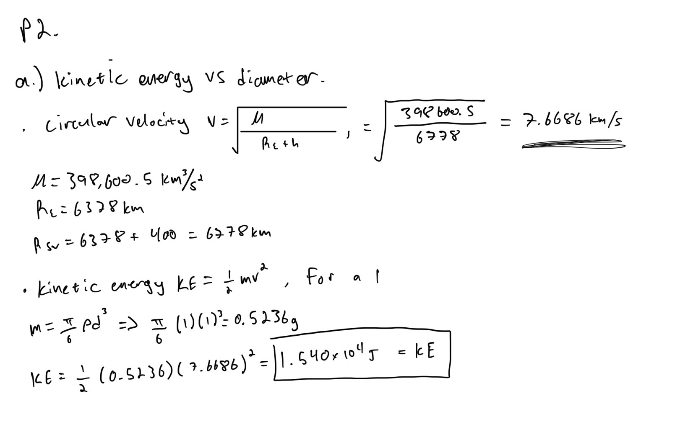
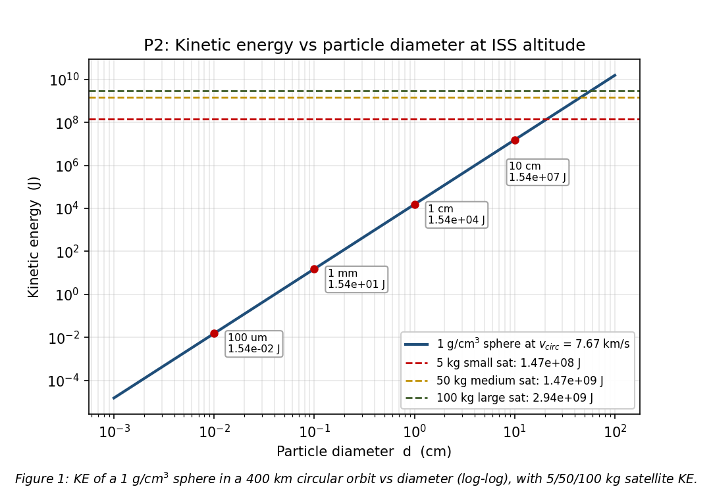
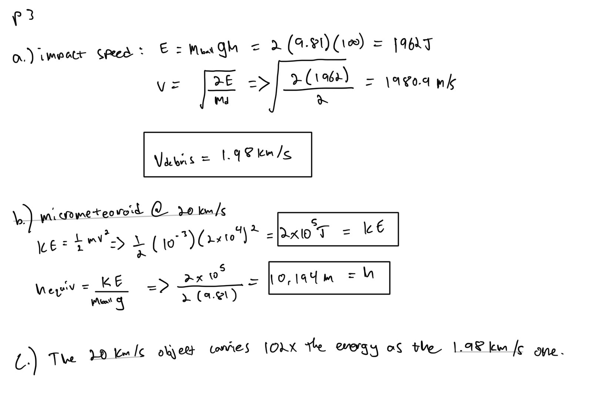
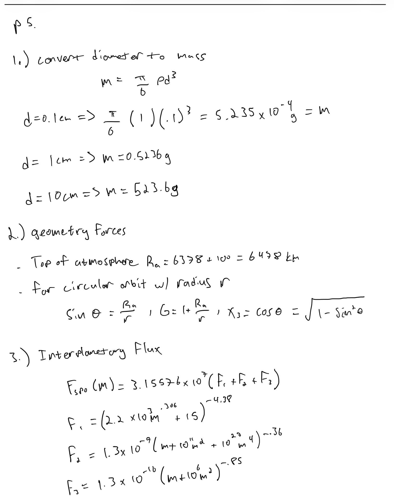
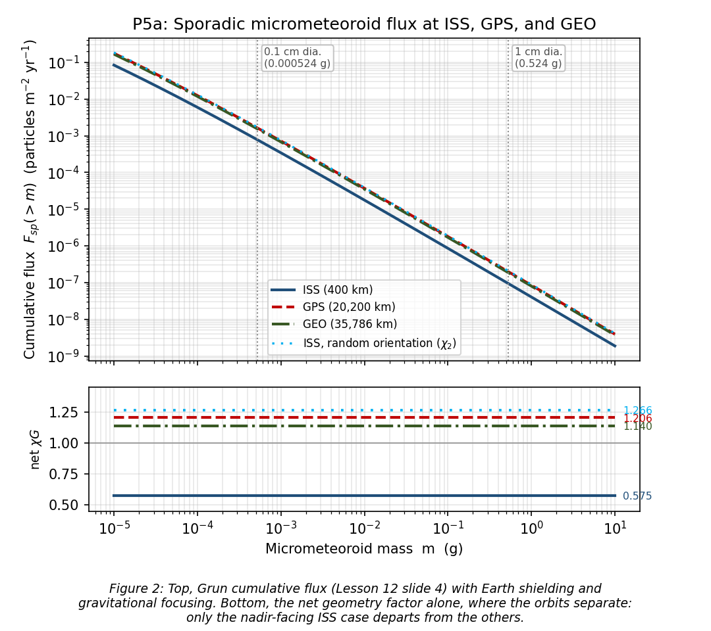
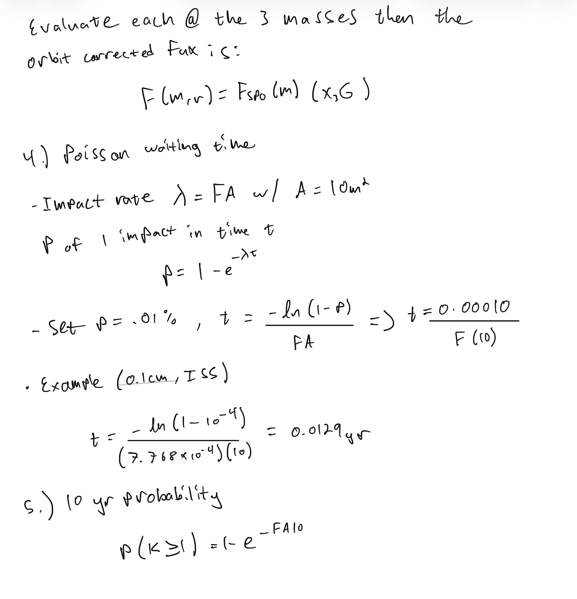
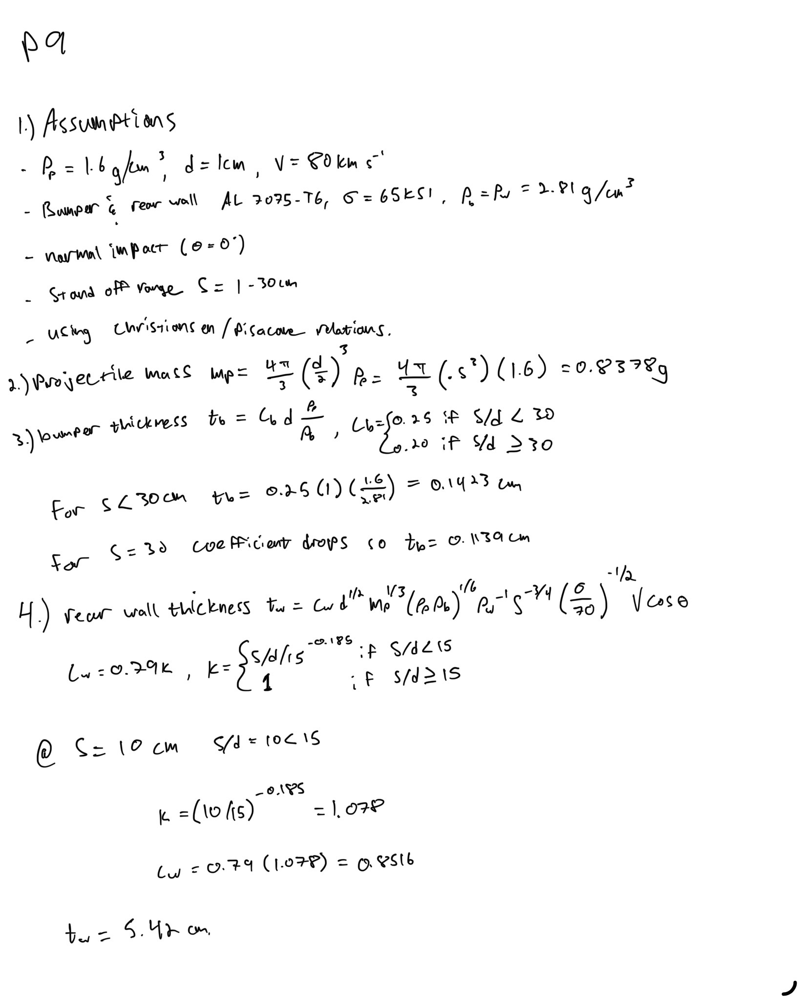
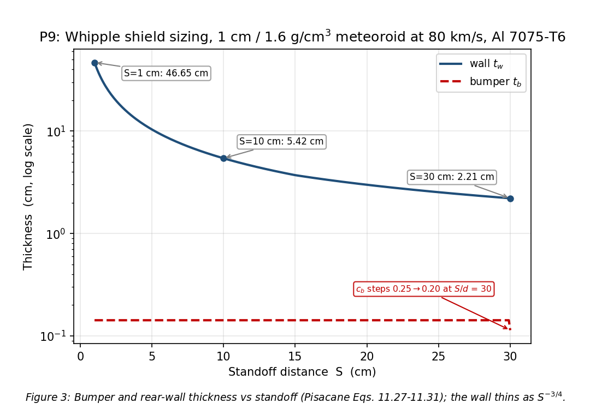

# SPCE 5065: Homework 5
**Micrometeoroids and orbital debris: impact energies, flux, policy, and shielding**
**Author:** Jordan Clayton
**Date:** July 27, 2026

---

## Problem 1: Current-Events Presentations

> *For each of the current events presentations this week: (a) Summarize the presentation, (b) Describe something you learned from it, (c) Write one question you have left.*

Three this week, all on orbital debris from different angles.

### Trent Douglas, rising debris and collision risk in LEO [1]

**(a) Summary.** From ESA's 2026 Space Environment Report: ~40,000 tracked objects, ~54,000 larger than 10 cm (a quarter untracked), ~1.2 million lethal-but-untrackable 1 to 10 cm fragments, ~140 million under 1 cm. At 550 km (Starlink's shell) collision-avoidance maneuvers ran 200,000 in 2024 and 300,000 in 2025, heading toward a million by 2027, because debris density there is now within a factor of 10 of active-satellite density. Collision probability is up 20% since 2024. On ASATs he made the altitude point sharply: China's 2007 test at ~800 km left debris lasting a century-plus, while the 2008 US intercept at ~200 km cleared quickly. He closed on a 2025 study finding the intact population already past the Kessler threshold for nearly every altitude from 500 to 20,000 km.

**(b) Something I learned.** Inert debris is the easy case because it never maneuvers, so you can plan around it; the hard problem is dodging other active satellites maneuvering on their own uncoordinated schedules.

**(c) Question I have left.** If uncoordinated maneuvering is the emerging risk, is there a technical reason operators could not publish planned maneuvers the way aircraft file flight plans?

### Ron Smetek, China's growing space debris problem [2]

**(a) Summary.** From January 2021 to January 2025 China abandoned 51 spent rocket bodies above 650 km, 86% of the global total, versus four US and one Russian, and abandoned mass more than tripled (98,000 to 305,000 kg). Many sit at 800 to 850 km, near where the Space Development Agency's PWSA will operate. The hazard is that these are second stages left with residual fuel, so they explode: three have broken up in four years, the August 2024 CZ-6A event alone making 1,000+ trackable pieces at ~810 km. The driver is the Guowang and Qianfan constellations, only ~200 of a planned 15,000 launched. Guidelines are signed by 60+ nations including China, which told UN COPUOS on 11 June 2026 it already follows best practice, but compliance is unverifiable from outside.

**(b) Something I learned.** There is a design-time fix, not just a disposal-time one: jettison the spent stage into a deliberately low orbit and let the payload raise itself on electric propulsion, moving mitigation into the mission profile where it is harder to skip.

**(c) Question I have left.** Is there any technical means, radar signature or thermal behavior, to confirm from the ground that a spent stage actually vented its residual propellant?

### Claire Wadman, MMOD design considerations [3]

**(a) Summary.** Orbital debris is man-made objects no longer serving a purpose, reaching 17,500 mph in LEO, about ten times a bullet; micrometeoroids are natural solids from 10 µm to 2 mm, with ESA counting 36,240 tracked objects as of 2024. The core was a risk table by size: above 10 cm objects are trackable but too large to shield, so the only defense is maneuvering; 1 to 10 cm is partly trackable and still unshieldable; below 1 cm nothing is trackable but shielding works, so damage is minor though cumulative. She illustrated it with the MMOD strike on the ISS Zvezda window. The design toolkit follows: material selection and Whipple shields for the small end, maneuverability for the large end, plus higher-reliability propellants and post-mission disposal.

**(b) Something I learned.** The 1 to 10 cm band is unsolved for a structural reason, not a funding one: too small to track and too energetic to shield. Above it you dodge, below it you shield, and in the middle neither works.

**(c) Question I have left.** For that band, is the better investment better tracking or larger standoff shielding, and where is the mass and cost crossover for a real bus?

---

## Problem 2: Kinetic Energy of Space Objects

> *(a) Plot the kinetic energy (J) versus particle diameter on a log-log scale, at ISS altitude with particle density 1 g/cm³. (b) How does this compare to a small (5 kg), medium (50 kg), and large (100 kg) satellite in the same orbit? (c) What type of satellites are most susceptible to damage from man-made space objects? State assumptions.*

**Assumptions:** 400 km circular orbit, spheres at the given 1 g/cm³ so $m = \frac{\pi}{6}\rho d^3$, satellites as point masses, and KE reported for each object in its own orbit rather than a relative impact energy.

### (a) Kinetic energy vs diameter

Circular velocity at 400 km, then sphere mass and kinetic energy for the 1 cm case, using $\mu = 398{,}600.5$ km³/s² and $R_E = 6378$ km [4]:

<p align="center"></p>

**Table 1:** Kinetic energy of a 1 g/cm³ particle in a 400 km circular orbit.

| Diameter $d$ | 10 µm | 1 mm | 1 cm | 10 cm | 100 cm |
|:---|---:|---:|---:|---:|---:|
| Mass (kg) | $5.24\times10^{-13}$ | $5.24\times10^{-7}$ | $5.24\times10^{-4}$ | $0.524$ | $523.6$ |
| KE (J) | $1.540\times10^{-5}$ | $15.40$ | $1.540\times10^{4}$ | $1.540\times10^{7}$ | $1.540\times10^{10}$ |

**Figure 1** sweeps 10 µm to 1 m. It is a straight line of slope 3, since mass goes as $d^3$ at fixed velocity.

<p align="center"></p>

### (b) Comparison to satellites

Same speed, so satellite energies are just $\frac{1}{2}Mv^2$. TNT equivalents use 4.184 MJ/kg [5].

**Table 2:** Satellite kinetic energy at 400 km, and the particle diameter carrying the same energy.

| Satellite | Mass (kg) | Kinetic energy (J) | TNT equivalent | Same-energy particle |
|:---|---:|---:|---:|---:|
| Small | 5 | $1.470\times10^{8}$ | 35 kg | 21.2 cm |
| Medium | 50 | $1.470\times10^{9}$ | 351 kg | 45.7 cm |
| Large | 100 | $2.940\times10^{9}$ | 703 kg | 57.6 cm |

$$\boxed{KE_{5\,\text{kg}} = 1.47\times10^{8}\ \text{J} \qquad KE_{50\,\text{kg}} = 1.47\times10^{9}\ \text{J} \qquad KE_{100\,\text{kg}} = 2.94\times10^{9}\ \text{J}}$$

A 1 cm fragment carries 9,500x less total energy than the 5 kg smallsat, but the damaging quantity is energy per unit frontal area. For a sphere of frontal area $\frac{\pi}{4}d^2$:

$$\frac{KE}{A} = \frac{\tfrac{1}{2}\left(\frac{\pi}{6}\rho d^3\right)v^2}{\frac{\pi}{4}d^2} = \frac{1}{3}\rho\, d\, v^2$$

That is only linear in $d$, so the pebble beats the satellite on energy density above ~0.75 cm. Energy density, not total energy, is what damages a spacecraft.

### (c) Which satellites are most susceptible

- **Large-area, low-mass structures.** Rate scales directly with area ($\lambda = FA$, Lesson 12 slide 8) [4], so big arrays and radiators collect hits in proportion to acreage while adding no robustness.
- **Anything in the LEO debris peaks**, near 800 to 1000 km and 1400 to 1500 km [6], unlike micrometeoroids, so sun-sync birds sit in the worst of it for life.
- **Crewed and pressurized vehicles**, where a penetration means depressurization rather than a dead subsystem.
- **Non-maneuverable spacecraft.** CubeSats without propulsion cannot dodge even the trackable population larger buses avoid.
- **Thin-walled smallsats**, since a Whipple shield costs mass a 5 kg bus does not have, leaving the structure as the only barrier.

Long-lived, large-area, unmaneuverable spacecraft in the crowded LEO bands are the worst case on every axis at once.

---

## Problem 3: Debris Energy Compared to a Falling Bowling Ball

> *A 1.0-g piece of debris strikes a spacecraft in LEO; its kinetic energy equals the potential energy lost by a 2.0-kg bowling ball dropped 100 m. (a) Calculate the impact speed, identifying assumptions. (b) Calculate the KE of the same 1.0-g particle at 20 km/s, in joules and as an equivalent drop height. (c) How does this compare? (d) Which poses the greater threat, considering likelihood of impact?*

**Assumptions:** all the ball's potential energy converts to kinetic (no drag), standard $g = 9.81$ m/s² [5] constant over the drop, and the debris KE equals that potential energy exactly.

### (a) Impact speed

The ball's lost potential energy is set equal to the debris kinetic energy and solved for $v$, with $m_{ball} = 2.0$ kg, $h = 100$ m, and debris mass $m_d = 1.0$ g. Worked with parts (b) and (c) in the hand calculation below.

$$\boxed{v_{debris} = 1981\ \text{m/s} = 1.98\ \text{km/s}}$$

### (b) Micrometeoroid at 20 km/s

The same 1.0 g particle at 20 km/s, then the bowling-ball drop height that matches that energy. Parts (a) through (c) are worked below.

<p align="center"></p>

$$\boxed{KE_{20\ \text{km/s}} = 2.00\times10^{5}\ \text{J} \qquad h_{equiv} = 10.2\ \text{km}}$$

### (c) Comparison

$$\boxed{\text{The 20 km/s micrometeoroid carries } 102\times \text{ the energy of the 1.98 km/s debris}}$$

**Sanity check:** with identical masses the ratio must be $(20/1.981)^2 = 101.9$, and 10.2 km versus 100 m is that same factor.

### (d) Which poses the greater threat

Per particle the micrometeoroid wins by two orders of magnitude, but man-made debris is the greater threat in LEO:

- **1.98 km/s is well below a real closing speed.** LEO debris closes at ~10 km/s (Lesson 11) [4] and up to 14 km/s counter-rotating [6], which shrinks the energy gap from 102x to about 4x.
- **Debris vastly outnumbers meteoroids at damaging sizes.** My Problem 5 model gives $9.55\times10^{-8}$ m⁻² yr⁻¹ above 1 cm at ISS altitude against a total flux near $8.4\times10^{-6}$ m⁻² yr⁻¹ (Lesson 12 slide 9) [4], essentially all debris at that size, so ~90x more impacts for the same exposure.
- **Debris is growing; the meteoroid background is not**, since sporadic flux is a steady-state feature of the solar system while debris comes from every launch, breakup, and ASAT test.
- **Debris concentrates where the expensive assets live**, while meteoroid flux is nearly uniform.

Above LEO it flips, though not because meteoroids worsen: Problem 5 shows GEO flux within a factor of 2 of the ISS. The debris population thins out, leaving meteoroids dominant by default.

---

## Problem 4: An Orbital Debris Modeling Program

> *Research an orbital debris modelling program. Describe who publishes and maintains it, its key features, and how it works. Summarize its predicted effects of space debris on the ISS.*

**The model: NASA's Orbital Debris Engineering Model, ORDEM 3.2**, listed on Lesson 11 slide 33 [4].

- **Who publishes it.** The NASA Orbital Debris Program Office (ODPO) at Johnson Space Center [7]. NASA-STD-8719.14C names the latest ORDEM the approved debris environment model for NASA assessments [8]. Lineage: ORDEM96, ORDEM2000, 3.0 (2014), 3.1 (2019), 3.2 (March 2022) [7], [9].
- **Key features.** Flux for particles from 10 µm to 1 m, from ~200 km through GEO, for any year from 2016 to 2050, with uncertainties [7], [9]. Output splits by population: intacts, breakup fragments binned by material density, sodium-potassium droplets from Soviet reactors, and small particles including MLI.
- **How it works.** Empirical and statistical, not a propagator: ODPO fits measurements into yearly-averaged populations, then the code integrates the user's orbit through binned directional flux cells [9]. The backbone is layered by size because no single sensor spans it: the SSN catalog covers ~10 cm and up, Haystack radar ~5 mm to 10 cm, MODEST ~30 cm at GEO, and returned hardware (Shuttle windows and radiators, Hubble surfaces) anchors the sub-millimeter population [9]. ORDEM sizes shielding, LEGEND projects the future environment, SBRAM handles post-breakup risk [9].
- **Predicted effects on the ISS.** The benchmark is a notional 400 x 400 km, 51.6° orbit [10]. Adding the Cosmos 1408 cloud raises 2022 cumulative flux there ~4x above 3 mm and ~5x above 1 cm versus ORDEM 3.1, concentrated in the 2 mm to 20 cm range [10]. ISS risk is therefore dominated by the millimeter-to-centimeter population, below the ~10 cm tracking threshold and shieldable only. The flight record matches: several hundred impact sites, two windows replaced, one impact through a radiator panel [11], against 40 collision-avoidance maneuvers from 1999 to November 2024 [12].

For the ISS, then, tracked objects are an operations problem and untrackable millimeter debris is the design problem.

---

## Problem 5: Micrometeoroid Impact Likelihood by Orbit

> *Compare the likelihood of satellites in typical orbits being impacted by micrometeoroids, assuming the atmosphere's altitude is 100 km. (a) Plot flux density for masses from 10⁻⁵ g to 10 g for the ISS, GPS, and a GEO satellite on the same plot. (b) How much average time (years) will there be between events with probabilities greater than 0.01% for each orbit, for micrometeoroids of 0.1, 1, and 10 cm? Assume an area of ten m². (c) What can you conclude for a 10-year mission life?*

**Assumptions:** circular orbits at 400 km (ISS), 20,200 km (GPS), 35,786 km (GEO) [4]; top of atmosphere at 100 km as directed, so $R_a = 6478$ km; particle density 1 g/cm³ from Problem 2. The $F_1$ term is valid for $10^{-9} < m < 1$ g [6], so the 10 cm case at 523.6 g is an extrapolation.

### (a) Flux density vs mass

Cumulative flux from Lesson 12 slide 4, $m$ in grams and $F$ in particles m⁻² yr⁻¹ [4], where $F(>m)$ counts particles of at least mass $m$, corrected to each orbit by the Earth-shielding and gravitational-focusing factors (Lesson 12 slides 5 and 6) [4]. The mass conversion, orbit geometry, and the three flux terms are set up below.

<p align="center"></p>

The branch used above is $\chi_3$, the Earth-orbiter case [4]. The alternative $\chi_2 = \frac{1}{2}(1+\cos\theta)$ covers a randomly oriented surface, and I carry both since the problem gives an area with no attitude.

**Table 3:** Geometry corrections at each orbit ($R_a = 6478$ km).

| Orbit | $r$ (km) | $\sin\theta$ | $G$ | $\chi_3$ | $\chi_3 G$ | $\chi_2 G$ |
|:---|---:|---:|---:|---:|---:|---:|
| ISS | 6,778 | 0.9557 | 1.9557 | 0.2942 | 0.5754 | 1.2656 |
| GPS | 26,578 | 0.2437 | 1.2437 | 0.9698 | 1.2062 | 1.2250 |
| GEO | 42,164 | 0.1536 | 1.1536 | 0.9881 | 1.1399 | 1.1468 |

The ISS is the only orbit where the branch matters: the Earth blocks most of its sky, but it also has the strongest focusing, and $G = 1.96$ more than undoes $\chi_2 = 0.65$. GPS and GEO agree between branches to within 2%. **Figure 2** plots the flux over the requested mass range, with the net geometry factor below it where the orbits separate.

<p align="center"></p>

$$\boxed{\text{Across LEO to GEO the flux varies by at most} \approx 2\times,\ \text{and by only} \approx 10\%\ \text{for a randomly oriented surface}}$$

Natural meteoroid flux is close to orbit-independent, unlike man-made debris.

### (b) Time between events

Impacts are Poisson with rate $\lambda = FA$ at $A = 10$ m² (Lesson 12 slides 7 and 8) [4]. The waiting-time setup and the 0.1 cm ISS case are worked below.

<p align="center"></p>

**Table 4:** Flux, time to reach 0.01% impact probability, and mean time between impacts, $A = 10$ m², using $\chi_3$.

| Diameter | ISS: $F$ / $t_{0.01\%}$ / MTBI | GPS: $F$ / $t_{0.01\%}$ / MTBI | GEO: $F$ / $t_{0.01\%}$ / MTBI |
|:---|:---|:---|:---|
| 0.1 cm | $7.768\times10^{-4}$ / 0.0129 / 129 | $1.628\times10^{-3}$ / 0.0061 / 61.4 | $1.539\times10^{-3}$ / 0.0065 / 65.0 |
| 1 cm | $9.554\times10^{-8}$ / 105 / $1.05\times10^{6}$ | $2.003\times10^{-7}$ / 49.9 / $4.99\times10^{5}$ | $1.893\times10^{-7}$ / 52.8 / $5.28\times10^{5}$ |
| 10 cm | $9.401\times10^{-12}$ / $1.06\times10^{6}$ / $1.06\times10^{10}$ | $1.971\times10^{-11}$ / $5.07\times10^{5}$ / $5.07\times10^{9}$ | $1.862\times10^{-11}$ / $5.37\times10^{5}$ / $5.37\times10^{9}$ |

Flux in m⁻² yr⁻¹, times in years.

$$\boxed{t\ (\text{ISS / GPS / GEO, yr}):\ \ 0.1\,\text{cm}: 0.0129/0.0061/0.0065 \quad 1\,\text{cm}: 105/49.9/52.8 \quad 10\,\text{cm}: 1.06{\times}10^{6}/5.07{\times}10^{5}/5.37{\times}10^{5}}$$

Since $p \ll 1$, the 0.01% waiting time is just $10^{-4}$ times the mean time between impacts, so both are tabulated. Using $\chi_2$ instead roughly halves the ISS times and leaves GPS and GEO unchanged.

**Sanity check:** the 1 cm ISS flux sits ~90x below the $8.4\times10^{-6}$ m⁻² yr⁻¹ total flux above 1 cm quoted for that altitude (Lesson 12 slide 9) [4], the right direction and magnitude for LEO.

### (c) Conclusion for a 10-year mission

**Table 5:** Probability of at least one impact in 10 years, using $\chi_3$.

| Diameter | ISS | GPS | GEO |
|:---|---:|---:|---:|
| 0.1 cm | 7.47% | 15.03% | 14.26% |
| 1 cm | $9.55\times10^{-4}$% | $2.00\times10^{-3}$% | $1.89\times10^{-3}$% |
| 10 cm | $9.4\times10^{-8}$% | $2.0\times10^{-7}$% | $1.9\times10^{-7}$% |

- **Millimeter impacts are expected**, at a 1 in 13 to 1 in 6 chance over 10 years for a 10 m² satellite. Survivable, but they pit optics, erode coatings, and short exposed harnesses.
- **Centimeter micrometeoroid impacts are a non-event** at $10^{-5}$ probability, and 10 cm is astronomically unlikely.
- **Below 1 mm the flux climbs steeply**, so cumulative surface degradation, not any single strike, is the real lifetime effect.
- **Orbit barely matters**, spanning only 7.5% to 15.7% across all three orbits, so meteoroids dominate at GEO and are a sideshow in LEO.
- **Design implication.** Materials and surface hardening plus modest shielding on critical volumes; catastrophic loss risk over 10 years comes from debris, not meteoroids.

---

## Problem 6: A Mission or Incident Violating the UN Guidelines

> *Find a mission or incident, other than the Chinese Fengyun-1C ASAT, which violated one of the UN guidelines published in 2010. What action could have been taken? What action was taken?*

**The incident: Russia's destruction of Cosmos 1408, 15 November 2021.** A Nudol direct-ascent ASAT destroyed a derelict ~1,750 kg Soviet Tselina-D ELINT satellite in a 490 x 465 km orbit, generating more than 1,500 trackable fragments (1,604 cataloged by 7 March 2022, apogees to 1,440 km) plus hundreds of thousands of lethal untrackable pieces [13]. The cloud straddled the ISS at ~420 km and the Chinese station at 380 km, and the ISS crew sheltered in their Soyuz and Crew Dragon as the station passed near it every 90 minutes [14].

**The guideline violated.** UN COPUOS Guideline 4, "Avoid intentional destruction and other harmful activities," says intentional destruction generating long-lived debris should be avoided, and that necessary break-ups be conducted low enough to limit fragment lifetime [15]. The test failed both: it was deliberate, and an intercept at ~480 km threw fragments to 1,440 km. It also cuts against Guideline 3 on collision probability [15].

**What could have been done.** Essentially nothing with legal force, which is the point: the Guidelines are explicitly voluntary and not legally binding [15], and the Liability Convention applies only if debris actually damages another state's object. The levers were condemnation, transparency requirements, moratoria, or new binding law. A responsible technical alternative existed: intercepting lower, against a target near reentry, would have given fragment lifetimes of weeks rather than years.

**What was taken.** The State Department and US Space Command called the test reckless the same day [16]. On 18 April 2022 the US announced it would not conduct destructive direct-ascent ASAT testing, the first such self-ban, citing this debris [17], and other states followed. On 7 December 2022 the General Assembly adopted Resolution 77/41 calling for the same commitment, 155 to 9 with 9 abstentions, Russia, China, and Iran voting against [18].

The response was entirely normative, and the states with demonstrated kinetic ASAT capability are the ones who voted no.

---

## Problem 7: Three Technology Solutions

> *Describe three of the technology solutions to help reduce the harmful effects of space debris. Explain how each might be implemented and provide one example.*

One from each layer: stop making debris, remove what exists, survive what cannot be removed.

**1. Drag augmentation for post-mission disposal.** A bolt-on module stows a thin metallized-polymer membrane on deployable booms; at end of mission it unfurls, multiplying area-to-mass ratio and collapsing decay time from decades to a few years. The decisive advantage over a propulsive burn is that it needs no propellant, no attitude control, and no functioning bus, so it works on a satellite that has already failed. **Example:** the ADEO-N braking sail, 3.6 m² stowed in a 10 cm cube, deployed 15 December 2022 from D-Orbit's ION SCV003 [19].

**2. Active debris removal by rendezvous and capture.** A servicer launches to the target's orbit, characterizes its tumble optically, synchronizes, captures it (magnetic plate, robotic arm, net, or clamp), and drags it to destructive reentry. Mitigation alone does not stabilize the environment; the large derelicts have to come down. The hard part is approaching a non-cooperative tumbling object with no docking features. **Example:** Astroscale's ADRAS-J closed to ~15 m of an 11 m, 3-tonne H-2A upper stage on 30 November 2024 [20]; ELSA-d demonstrated repeated magnetic capture in August 2021 [21].

**3. Whipple shielding.** Accepts that sub-centimeter debris is untrackable and undodgeable and makes the impact survivable instead. A thin sacrificial bumper sits at standoff ahead of the pressure wall; at hypervelocity both projectile and bumper shock past their material strength and behave like fluids, so the projectile shatters and partly vaporizes, arriving at the rear wall as a broad low-density impulse. Standoff does the real work, and the stuffed variant adds Nextel and Kevlar for the same protection at lower mass. **Example:** the ISS, with over 2,000 m² of shielded surface defeating ~1.3 cm aluminum at ~9 km/s [22]; despite several hundred impacts no crewed module has been penetrated [11].

Together: sails stop the population growing, ADR shrinks it, shielding handles what neither reaches.

---

## Problem 8: US ODMSP vs. France's Policy

> *Compare the US Orbital Debris Mitigation Standard Practices policy with another country's policy. (a) Summarize the key provisions of each. (b) What are the key similarities and differences? (c) Research how/if they are enforced.*

France is the useful contrast: it converted the same voluntary guidelines into binding national law with a technical regulator attached.

### (a) Key provisions

**US, ODMSP (2001, updated November 2019)** [23], four objectives:

1. **Debris in normal operations.** Planned releases over 5 mm lasting past 25 years must be justified; LEO object-time product capped at 100 object-years per vehicle.
2. **Accidental explosions.** Probability below 0.001 during the mission, plus passivation afterward.
3. **Safe flight profile.** Collision probability with objects 10 cm and larger below 0.001 over the orbital lifetime; probability that sub-centimeter damage prevents disposal below 0.01.
4. **Postmission disposal.** Direct reentry or escape preferred, else decay within 25 years; casualty risk below $1\times10^{-4}$; GEO disposal above 35,986 km, ~200 km above the arc, with 100-year non-return; disposal reliability at least 0.90, goal 0.99.

The 2019 update added constellations, smallsats, rendezvous operations, ADR safety, and tethers. ODMSP binds US government missions as executive policy and is a reference for everyone else [23]; it is not a statute and carries no penalty.

**France, the Space Operations Act** [24], [25]. Law No. 2008-518 of 3 June 2008 with Decree No. 2009-643, applicable from 10 December 2010, discharging France's Outer Space Treaty Article VI duty. Any launch from French territory, procured by a French operator, or in-orbit control by one needs prior government authorization, resting on a CNES technical conformity review with pre-flight and in-flight verification authority [24], [26]. The Technical Regulation (arrêté of 31 March 2011, revised 28 June 2024) is aligned with IADC and ISO 24113 [25]: no debris in nominal operations, 25-year LEO limit, GEO graveyard with 100-year non-interference, break-up probability below $10^{-3}$, passivation, disposal maneuver success above 0.85 with energy availability above 0.99, and casualty probability at most $10^{-4}$ uncontrolled, with controlled reentry required above that [25], [26]. Operators carry statutory liability with a ceiling, a state guarantee above it, mandatory insurance, and exposure to sanctions and fines [24].

### (b) Similarities and differences

Both descend from the same IADC and UN guidelines, so the technical content largely matches: the 25-year LEO rule, GEO graveyard with ~100-year non-return, passivation, break-up limits at $10^{-3}$, and casualty limits.

**Table 6:** Structural comparison of the two policies.

| Dimension | United States (ODMSP) | France (FSOA) |
|:---|:---|:---|
| Legal nature | Executive standard practices; policy, not law | National statute with decree and technical regulation |
| Binding on | US government missions; a reference for others | All French operators and launches from French territory |
| Regulator | None inherent; relies on licensing agencies | CNES technical conformity review |
| Penalties | None in the document itself | Sanctions, license withdrawal, criminal fines |
| Disposal reliability | $\geq 0.90$, goal 0.99 | Maneuver success $> 0.85$, energy availability $> 0.99$ |
| Liability | General Liability Convention exposure | Statutory liability, ceiling, state guarantee, insurance |

The difference is architectural. The US wrote excellent technical content and left enforcement to whichever agency happens to hold a license; France wrote comparable content into an authorization statute administered by its space agency, making compliance a precondition of operating. One place the US commercial regime is stricter than either: the FCC's 5-year deorbit rule now beats the 25-year benchmark both still carry [27].

### (c) Enforcement

**United States.** ODMSP has no mechanism of its own; government compliance runs through agency processes (NASA via NASA-STD-8719.14C debris assessment reports [8]) and commercial compliance entirely through license conditions at the FCC, FAA, and NOAA. The FCC has moved furthest, adopting the 5-year rule on 29 September 2022 [27], and proved those conditions have teeth on 2 October 2023 in its first space-debris enforcement settlement: DISH's EchoStar-7 was retired only ~122 km above GEO instead of the ~300 km its license required, and DISH paid $150,000 [28]. Small for that company, but it establishes that disposal commitments are legally enforceable.

**France.** Enforcement is structural rather than punitive because it happens before launch. CNES reviews conformity at authorization and for modifications, the minister can condition, suspend, or withdraw authorization, operating without it triggers sanctions and criminal fines, and the insurance regime gives operators a financial stake [24], [26].


---

## Problem 9: Whipple Shield Sizing

> *A spacecraft with a Whipple shield must survive a meteoroid of density 1.6 g/cm³, diameter 1 cm, and velocity 80 km/s. Shield and spacecraft are aluminum 7075 T6 with a yield stress of 65 ksi. Determine and plot the shield and wall thickness as a function of offset distance of 1 to 30 cm, stating assumptions.*

Christiansen design equations (Lesson 13 slides 7 and 8, Pisacane Eqs. 11.27 through 11.31) [4], [6], written out in the hand calculation below. In them $t_b$ and $t_w$ are bumper and rear-wall thickness (cm), $d$ the projectile diameter (cm), $m_p$ its mass (g), $S$ the standoff (cm), $V$ the impact velocity (km/s), $\sigma$ the wall yield stress (ksi), $\theta$ the impact angle from the surface normal, and $\rho_p$, $\rho_b$, $\rho_w$ the projectile, bumper, and wall densities (g/cm³).

**Assumptions:** normal impact ($\theta = 0$), the worst case for wall thickness. Both plates Al 7075-T6; the yield stress is given but the density is not, so I used the published 2.81 g/cm³ [29]. Spherical meteoroid. Units are cm, g, g/cm³, km/s, and ksi as the equations are published, with no conversion. The correlation is calibrated for $V \geq 7$ km/s and $S < 25$ cm, so at 80 km/s and out to $S = 30$ cm these are bounding numbers rather than a design answer.

Bumper thickness is standoff-independent except through the $c_b$ step. The assumptions, projectile mass, bumper thickness, and the $S = 10$ cm wall case are worked below.

<p align="center"></p>

**Table 7:** Bumper and rear-wall thickness vs standoff distance.

| Standoff $S$ (cm) | $S/d$ | $k$ | Bumper $t_b$ (cm) | Wall $t_w$ (cm) |
|---:|---:|---:|---:|---:|
| 1 | 1 | 1.650 | 0.1423 | 46.65 |
| 5 | 5 | 1.225 | 0.1423 | 10.36 |
| 10 | 10 | 1.078 | 0.1423 | 5.42 |
| 15 | 15 | 1.000 | 0.1423 | 3.71 |
| 20 | 20 | 1.000 | 0.1423 | 2.99 |
| 30 | 30 | 1.000 | 0.1139 | 2.21 |

$$\boxed{t_b = 0.142\ \text{cm}\ (S<30\ \text{cm}),\quad 0.114\ \text{cm}\ (S=30\ \text{cm}); \qquad t_w:\ 46.7\ \text{cm at } S=1\ \text{cm} \rightarrow 2.21\ \text{cm at } S=30\ \text{cm}}$$

<p align="center"></p>

**Figure 3** uses a log thickness axis since the wall spans a factor of 21 while the bumper barely moves. Wall thickness falls as $S^{-3/4}$, so 30 cm of standoff instead of 1 cm cuts the wall from 46.7 cm to 2.21 cm, a 95% reduction, for the cost of a support structure. The bumper stays near 1.4 mm because its job is to shatter the projectile, not stop it.

**Sanity check:** run on the published worked example (1 cm aluminum at 2.7 g/cm³, 10 km/s, Al 6061-T6 at 35 ksi) [6], the same equations return $t_b = 0.25$ cm, matching the published value.

---

## Sources Cited

[1] Douglas, T., "Rising Space Debris and Collision Risk in Low Earth Orbit," SPCE 5065 current-events presentation, University of Colorado Colorado Springs, July 2026 (drawing on the European Space Agency *Space Environment Report 2026*).

[2] Smetek, R., "China's Growing Space Debris Problem," SPCE 5065 current-events presentation, University of Colorado Colorado Springs, July 2026.

[3] Wadman, C., "Micrometeoroids and Orbital Debris: Design Considerations," SPCE 5065 current-events presentation, University of Colorado Colorado Springs, 15 July 2026.

[4] George, L., "Micrometeoroids and Orbital Debris: Lessons 11-13," SPCE 5065 lecture slides and lecture video, University of Colorado Colorado Springs, 2026.

[5] Thompson, A., and Taylor, B. N., *Guide for the Use of the International System of Units (SI)*, NIST Special Publication 811, National Institute of Standards and Technology, Gaithersburg, MD, 2008, App. B.8 ($g_n = 9.80665$ m/s²; TNT equivalent 4.184 MJ/kg).

[6] Pisacane, V. L., *The Space Environment and Its Effects on Space Systems*, 2nd ed., AIAA Education Series, Reston, VA, 2016, Chap. 11, pp. 324-342 (Eqs. 11.1-11.19, 11.27-11.31; Fig. 11.9; Example 11.2).

[7] NASA Orbital Debris Program Office, "Orbital Debris Engineering Model ORDEM 3.2," NASA Johnson Space Center, Houston, TX, 2022 [retrieved 27 July 2026].

[8] NASA, "Process for Limiting Orbital Debris," NASA-STD-8719.14C, Washington, DC, Nov. 2021, Requirement 4.2.4.

[9] Matney, M., et al., "The NASA Orbital Debris Engineering Model 3.1: Development, Verification, and Validation," *First International Orbital Debris Conference*, NASA JSC, 2019, https://ntrs.nasa.gov/citations/20190033490 [retrieved 27 July 2026].

[10] Manis, A., and Matney, M., "ORDEM 3.2 Flux Assessment," *Orbital Debris Quarterly News*, Vol. 26, No. 2, NASA ODPO, June 2022, pp. 2-4 [retrieved 27 July 2026].

[11] Hyde, J., Christiansen, E., and Lear, D., "Observations of MMOD Impact Damage to the ISS," *First International Orbital Debris Conference*, NASA JSC, 2019, https://ntrs.nasa.gov/citations/20190033989 [retrieved 27 July 2026].

[12] NASA Orbital Debris Program Office, "ISS Maneuvers Twice to Avoid Debris," *Orbital Debris Quarterly News*, Vol. 29, No. 2, May 2025, pp. 1-2 [retrieved 27 July 2026].

[13] NASA Orbital Debris Program Office, "Russian ASAT Test Creates Significant Debris Cloud," *Orbital Debris Quarterly News*, Vol. 26, No. 1, March 2022, pp. 1-5 [retrieved 27 July 2026].

[14] Clark, S., "U.S. Officials: Space Station at Risk from 'Reckless' Russian Anti-Satellite Test," *Spaceflight Now*, 15 Nov. 2021 [retrieved 27 July 2026].

[15] United Nations Committee on the Peaceful Uses of Outer Space, *Space Debris Mitigation Guidelines of the Committee on the Peaceful Uses of Outer Space*, United Nations Office for Outer Space Affairs, Vienna, 2010, Sec. 3 and Guidelines 3-4.

[16] U.S. Office of Space Commerce, "U.S. Response to Russian Anti-Satellite Test," U.S. Department of Commerce, Nov. 2021 [retrieved 27 July 2026].

[17] Foust, J., "U.S. Declares Ban on Anti-Satellite Missile Tests, Calls for Other Nations to Join," *SpaceNews*, 18 April 2022 [retrieved 27 July 2026].

[18] United Nations General Assembly, "Destructive Direct-Ascent Anti-Satellite Missile Testing," Resolution A/RES/77/41, 7 Dec. 2022 (adopted 155-9-9).

[19] European Space Agency, "Show Me Your Wings: Successful In-Flight Demonstration of the ADEO Braking Sail," ESA Technology, Feb. 2023 [retrieved 27 July 2026].

[20] Astroscale Holdings Inc., "Astroscale's ADRAS-J Achieves Historic 15-Meter Approach to Space Debris," 11 Dec. 2024 [retrieved 27 July 2026].

[21] Astroscale Holdings Inc., "Astroscale's ELSA-d Successfully Demonstrates Repeated Magnetic Capture," 25 Aug. 2021 [retrieved 27 July 2026].

[22] NASA Johnson Space Center Hypervelocity Impact Technology Group, "Shield Development: Basic Concepts," https://hvit.jsc.nasa.gov/shield-development/ [retrieved 27 July 2026].

[23] U.S. Government, *U.S. Government Orbital Debris Mitigation Standard Practices, November 2019 Update*, Washington, DC, Nov. 2019 [retrieved 27 July 2026].

[24] Centre National d'Études Spatiales, "French Space Operations Act" (Law No. 2008-518 of 3 June 2008; Decree No. 2009-643 of 9 June 2009), https://cnes.fr/en/projects/los [retrieved 27 July 2026].

[25] Légifrance, "Arrêté du 31 mars 2011 relatif à la réglementation technique... relative aux opérations spatiales," consolidated text including the arrêté of 28 June 2024, https://www.legifrance.gouv.fr/loda/id/JORFTEXT000024095828/ [retrieved 27 July 2026].

[26] Francillout, L., "French Process for Debris Mitigation Compliance Verification," *Proceedings of the ESA/ECSL Workshop*, ESOC, Darmstadt, 2019 [retrieved 27 July 2026].

[27] Federal Communications Commission, "FCC Adopts New '5-Year Rule' for Deorbiting Satellites," news release, 29 Sept. 2022 [retrieved 27 July 2026].

[28] Federal Communications Commission, "FCC Takes First Space Debris Enforcement Action," news release, 2 Oct. 2023 [retrieved 27 July 2026].

[29] ASM International, "Aluminum 7075-T6 Material Property Data" (density 2.81 g/cm³), ASM Aerospace Specification Metals Handbook, https://asm.matweb.com/search/SpecificMaterial.asp?bassnum=MA7075T6 [retrieved 27 July 2026].

---

## Appendix: Python Solution Script

```python
"""SPCE 5065 -- Homework 5 solution.

Micrometeoroids and orbital debris (MMOD). Covers the quantitative problems:

  P2  Kinetic energy vs particle diameter at ISS altitude (log-log) + satellite KE
  P3  1-g debris vs bowling-ball PE equivalence; 20 km/s micrometeoroid case
  P5  Grun sporadic-meteoroid flux (Lesson 12 slide 4) for ISS/GPS/GEO,
      shielding + gravitational focusing, Poisson time-between-impacts
  P9  Whipple shield bumper/wall thickness vs standoff (Pisacane Eqs. 11.27-11.31)

Outputs:
  - Console tables reproducing every boxed number in the submission
  - figures/fig1_ke_vs_diameter.png      (P2a/b)
  - figures/fig2_flux_vs_mass.png        (P5a)
  - figures/fig3_whipple_thickness.png   (P9)

Conceptual/research problems (P1, P4, P6, P7, P8) are answered in the
submission document; they need no code.
"""
from __future__ import annotations

import sys
from pathlib import Path

import matplotlib.pyplot as plt
import numpy as np

# --------------------------------------------------------------------------
# Constants
# --------------------------------------------------------------------------
MU_EARTH = 398600.5      # km^3/s^2
R_E = 6378.0             # km
G0 = 9.81                # m/s^2  (surface gravity, P3)
H_ATM = 100.0            # km     (top of atmosphere per HW5 clarification)
R_A = R_E + H_ATM        # km     (radius to top of atmosphere)

H_ISS = 400.0            # km   ISS altitude assumption
H_GPS = 20200.0          # km   GPS (semi-synchronous)
H_GEO = 35786.0          # km   GEO

RHO_PARTICLE = 1.0       # g/cm^3 (given, P2 and P5 mass<->diameter conversion)

FIG_DIR = Path(__file__).parent / "figures"


def v_circ_kms(h_km: float) -> float:
    """Circular orbital velocity (km/s), v = sqrt(mu/(R_E+h))."""
    return np.sqrt(MU_EARTH / (R_E + h_km))


def sphere_mass_g(d_cm: float | np.ndarray, rho: float = RHO_PARTICLE):
    """Mass (g) of a sphere of diameter d (cm), m = (pi/6) rho d^3."""
    return (np.pi / 6.0) * rho * np.asarray(d_cm, dtype=float) ** 3


# --------------------------------------------------------------------------
# P2 -- kinetic energy vs diameter at ISS altitude
# --------------------------------------------------------------------------
def p2_results() -> None:
    print("=" * 70)
    print("P2 -- kinetic energy of orbiting objects at ISS altitude")
    print("=" * 70)
    v = v_circ_kms(H_ISS) * 1000.0                      # m/s
    print(f"  v_circ(400 km) = {v/1000:.4f} km/s")
    for d in [0.001, 0.01, 0.1, 1.0, 10.0, 100.0]:      # cm
        m_kg = sphere_mass_g(d) * 1e-3
        ke = 0.5 * m_kg * v ** 2
        print(f"  d = {d:9.3f} cm   m = {m_kg:.3e} kg   KE = {ke:.3e} J")
    print("  -- satellites, same orbit --")
    for M in [5.0, 50.0, 100.0]:
        ke = 0.5 * M * v ** 2
        d_eq = (6.0 * M * 1e3 / (np.pi * RHO_PARTICLE)) ** (1.0 / 3.0)
        print(f"  M = {M:5.0f} kg   KE = {ke:.3e} J "
              f"(= {ke/4.184e6:.1f} kg TNT)   same-KE particle d = {d_eq:.1f} cm")


# --------------------------------------------------------------------------
# P3 -- debris KE vs a falling bowling ball
# --------------------------------------------------------------------------
def p3_results() -> None:
    print("=" * 70)
    print("P3 -- 1-g debris vs 2-kg bowling ball from 100 m")
    print("=" * 70)
    m_ball, h = 2.0, 100.0
    m_d = 1.0e-3                                        # kg
    E_pe = m_ball * G0 * h
    v_impact = np.sqrt(2.0 * E_pe / m_d)
    print(f"  (a) PE = mgh = {E_pe:.1f} J  ->  v = sqrt(2E/m) = "
          f"{v_impact:.1f} m/s = {v_impact/1000:.2f} km/s")
    v_mm = 20.0e3
    E_mm = 0.5 * m_d * v_mm ** 2
    h_eq = E_mm / (m_ball * G0)
    print(f"  (b) KE(20 km/s) = {E_mm:.3e} J   equivalent drop height = "
          f"{h_eq:.0f} m = {h_eq/1000:.2f} km")
    print(f"  (c) ratio = {E_mm/E_pe:.1f}x  (= (20/{v_impact/1000:.2f})^2)")


# --------------------------------------------------------------------------
# P5 -- Grun sporadic meteoroid flux (Lesson 12 slide 4, corrected F3 term)
# --------------------------------------------------------------------------
def grun_flux_interplanetary(m_g: np.ndarray | float):
    """Unshielded cumulative sporadic flux F_spo(m), particles/m^2/yr.

    Lesson 12 slide 4 (= Pisacane Eq. 11.2, corrected: third term is F3):
      F_spo = 3.15576e7 * [F1 + F2 + F3],  m in grams.
    """
    m = np.asarray(m_g, dtype=float)
    f1 = (2.2e3 * m ** 0.306 + 15.0) ** (-4.38)
    f2 = 1.3e-9 * (m + 1.0e11 * m ** 2 + 1.0e27 * m ** 4) ** (-0.36)
    f3 = 1.3e-16 * (m + 1.0e6 * m ** 2) ** (-0.85)
    return 3.15576e7 * (f1 + f2 + f3)


def shielding_factor(r_km: float, branch: str = "nadir") -> float:
    """Earth-shielding factor, sin(theta) = R_a/r (Lesson 12 slide 5).

    branch="nadir"  -> chi_3 = cos(theta)         (Pisacane Eq. 11.5, surface
                                                   normal pointing at Earth;
                                                   the Earth-orbiter case used
                                                   in this course)
    branch="random" -> chi_2 = (1 + cos(theta))/2 (Pisacane Eq. 11.4, surface
                                                   normal randomly oriented)
    """
    cos_t = float(np.sqrt(1.0 - (R_A / r_km) ** 2))
    if branch == "random":
        return 0.5 * (1.0 + cos_t)
    return cos_t


def focusing_factor(r_km: float) -> float:
    """Gravitational focusing factor G = 1 + R_a/r (Lesson 12 slide 6)."""
    return 1.0 + R_A / r_km


def flux_at_orbit(m_g, h_km: float, branch: str = "nadir"):
    """F_sp(m, r) = F_spo(m) * chi(r) * G(r), particles/m^2/yr."""
    r = R_E + h_km
    return (grun_flux_interplanetary(m_g)
            * shielding_factor(r, branch) * focusing_factor(r))


def p5_results() -> None:
    print("=" * 70)
    print("P5 -- micrometeoroid flux and time between impacts (A = 10 m^2)")
    print("=" * 70)
    orbits = [("ISS", H_ISS), ("GPS", H_GPS), ("GEO", H_GEO)]
    for name, h in orbits:
        r = R_E + h
        c3, c2, g = (shielding_factor(r, "nadir"),
                     shielding_factor(r, "random"), focusing_factor(r))
        print(f"  {name}: r = {r:7.0f} km  sin(th) = {R_A/r:.4f}  G = {g:.4f} | "
              f"nadir chi3 = {c3:.4f} (chi*G = {c3*g:.4f})  | "
              f"random chi2 = {c2:.4f} (chi*G = {c2*g:.4f})")

    A = 10.0                       # m^2
    P_TH = 1.0e-4                  # 0.01 %
    for branch in ("nadir", "random"):
        print(f"\n  --- shielding branch: {branch} ---")
        print(f"  {'size':>7} {'mass (g)':>11} | " +
              " | ".join(f"{n}: F, t(P=.01%), 1/(FA)" for n, _ in orbits))
        for d_cm in [0.1, 1.0, 10.0]:
            m = float(sphere_mass_g(d_cm))
            row = [f"  {d_cm:5.1f}cm {m:11.4e} |"]
            for name, h in orbits:
                F = float(flux_at_orbit(m, h, branch))
                lam = F * A                               # events/yr
                t_p = -np.log(1.0 - P_TH) / lam           # yr to reach 0.01 %
                row.append(f" {F:9.3e} {t_p:9.3e} {1.0/lam:9.3e} |")
            print("".join(row))

        print("    probability of >=1 impact in a 10-yr mission:")
        for d_cm in [0.1, 1.0, 10.0]:
            m = float(sphere_mass_g(d_cm))
            probs = [
                f"{name} {100*(1-np.exp(-flux_at_orbit(m, h, branch)*A*10.0)):.4g}%"
                for name, h in orbits]
            print(f"      d = {d_cm:4.1f} cm : " + ",  ".join(probs))


# --------------------------------------------------------------------------
# P9 -- Whipple shield sizing (Pisacane Eqs. 11.27-11.31, Christiansen 2003)
# --------------------------------------------------------------------------
def whipple_thickness(S_cm, d_cm: float, rho_p: float, V_kms: float,
                      sigma_ksi: float, rho_b: float, rho_w: float,
                      theta_deg: float = 0.0):
    """Bumper and wall thickness (cm) vs standoff S (cm), V >= 7 km/s.

    t_b = c_b d rho_p/rho_b                                   (Eq. 11.27)
    t_w = c_w d^1/2 m_p^1/3 (rho_p rho_b)^1/6 / rho_w
          * S^-3/4 (sigma/70)^-1/2 V cos(theta)               (Eq. 11.28)
    c_b = 0.25 (S/d < 30) or 0.20 (S/d >= 30)                 (Eq. 11.29)
    c_w = 0.79 k;  k = (S/d/15)^-0.185 for S/d < 15 else 1    (Eqs. 11.30-31)
    Units: cm, g, g/cm^3, km/s, ksi; theta from surface normal (<= 65 deg).
    """
    S = np.asarray(S_cm, dtype=float)
    m_p = (4.0 * np.pi / 3.0) * (d_cm / 2.0) ** 3 * rho_p     # g
    c_b = np.where(S / d_cm < 30.0, 0.25, 0.20)
    t_b = c_b * d_cm * rho_p / rho_b
    k = np.where(S / d_cm < 15.0, (S / d_cm / 15.0) ** (-0.185), 1.0)
    t_w = (0.79 * k * d_cm ** 0.5 * m_p ** (1.0 / 3.0)
           * (rho_p * rho_b) ** (1.0 / 6.0) / rho_w
           * S ** (-0.75) * (sigma_ksi / 70.0) ** (-0.5)
           * V_kms * np.cos(np.radians(theta_deg)))
    return t_b, t_w


# HW9 inputs: meteoroid rho_p = 1.6, d = 1 cm, V = 80 km/s, Al 7075-T6
RHO_AL7075 = 2.81        # g/cm^3 (Al 7075-T6)
SIGMA_7075 = 65.0        # ksi (given)


def p9_results() -> None:
    print("=" * 70)
    print("P9 -- Whipple shield sizing, Al 7075-T6, d=1 cm, 1.6 g/cm^3, 80 km/s")
    print("=" * 70)
    for S in [1.0, 5.0, 10.0, 15.0, 20.0, 30.0]:
        t_b, t_w = whipple_thickness(S, 1.0, 1.6, 80.0,
                                     SIGMA_7075, RHO_AL7075, RHO_AL7075)
        k = (S / 1.0 / 15.0) ** (-0.185) if S / 1.0 < 15.0 else 1.0
        print(f"  S = {S:5.1f} cm   S/d = {S:4.0f}   k = {k:.4f}   "
              f"t_b = {float(t_b):.4f} cm   t_w = {float(t_w):.3f} cm")

    # Verification against the published worked example (Example 11.2: d = 1 cm
    # Al at 2.7 g/cm^3, Al 6061-T6 at 35 ksi, V = 10 km/s), which gives
    # t_b = 0.25 cm.
    t_b_ck, _ = whipple_thickness(10.0, 1.0, 2.7, 10.0, 35.0, 2.7, 2.7)
    print(f"  [check vs Example 11.2] t_b = {float(t_b_ck):.2f} cm "
          f"(published value 0.25 cm)")


# --------------------------------------------------------------------------
# Figures
# --------------------------------------------------------------------------
def _caption(fig, text: str) -> None:
    fig.text(0.5, 0.01, text, ha="center", va="bottom",
             fontsize=9, style="italic")


def fig1_ke_vs_diameter() -> None:
    v = v_circ_kms(H_ISS) * 1000.0                       # m/s
    d = np.logspace(-3, 2, 400)                          # cm: 10 um to 1 m
    ke = 0.5 * sphere_mass_g(d) * 1e-3 * v ** 2
    fig, ax = plt.subplots(figsize=(7.2, 5.0))
    ax.loglog(d, ke, color="#1f4e79", lw=2,
              label=r"1 g/cm$^3$ sphere at $v_{circ}$ = 7.67 km/s")
    # Satellite KE levels go in the legend rather than as inline text: the
    # 50 kg and 100 kg lines sit within a factor of 2, so stacked labels collide.
    sat_style = [("5 kg small sat", 5.0, "#c00000"),
                 ("50 kg medium sat", 50.0, "#bf8f00"),
                 ("100 kg large sat", 100.0, "#385723")]
    for lab, M, color in sat_style:
        ke_sat = 0.5 * M * v ** 2
        ax.axhline(ke_sat, color=color, ls="--", lw=1.3,
                   label=f"{lab}: {ke_sat:.2e} J")
    for d_mark, note, off in [(0.01, "100 um", (10, -14)),
                              (0.1, "1 mm", (10, -14)),
                              (1.0, "1 cm", (10, -14)),
                              (10.0, "10 cm", (-4, -30))]:
        ke_m = 0.5 * float(sphere_mass_g(d_mark)) * 1e-3 * v ** 2
        ax.plot(d_mark, ke_m, "o", color="#c00000", ms=5)
        ax.annotate(f"{note}\n{ke_m:.2e} J", xy=(d_mark, ke_m), xytext=off,
                    textcoords="offset points", fontsize=7.5,
                    bbox=dict(boxstyle="round,pad=0.25", fc="white",
                              ec="0.6", alpha=0.9))
    ax.set_xlabel("Particle diameter  d  (cm)")
    ax.set_ylabel("Kinetic energy  (J)")
    ax.set_title("P2: Kinetic energy vs particle diameter at ISS altitude")
    ax.grid(True, which="both", alpha=0.3)
    ax.legend(fontsize=8, loc="lower right", framealpha=0.95)
    fig.subplots_adjust(bottom=0.16)
    _caption(fig, "Figure 1: KE of a 1 g/cm$^3$ sphere in a 400 km circular "
             "orbit vs diameter (log-log), with 5/50/100 kg satellite KE.")
    fig.savefig(FIG_DIR / "fig1_ke_vs_diameter.png", dpi=150)
    plt.close(fig)


def fig2_flux_vs_mass() -> None:
    m = np.logspace(-5, 1, 400)                          # g
    # Two panels: the flux itself spans 9 decades, which visually collapses the
    # ~10% orbit-to-orbit spread. The lower panel plots the geometry correction
    # chi*G alone, which is what actually differs between orbits.
    fig, (ax, ax2) = plt.subplots(
        2, 1, figsize=(7.2, 6.4), sharex=True,
        gridspec_kw=dict(height_ratios=[3, 1.15], hspace=0.12))
    styles = [("ISS (400 km)", H_ISS, "#1f4e79", "-"),
              ("GPS (20,200 km)", H_GPS, "#c00000", "--"),
              ("GEO (35,786 km)", H_GEO, "#385723", "-.")]
    for lab, h, color, ls in styles:
        ax.loglog(m, flux_at_orbit(m, h), color=color, ls=ls, lw=2, label=lab)
    # ISS is the only orbit where the shielding-branch choice matters; show the
    # random-orientation case so the sensitivity is visible on the plot.
    ax.loglog(m, flux_at_orbit(m, H_ISS, "random"), color="#00b0f0",
              ls=(0, (1, 3)), lw=1.6,
              label=r"ISS, random orientation ($\chi_2$)")

    # Lower panel: net geometry factor chi*G, flat in mass, one line per case.
    for lab, h, color, ls in styles:
        r = R_E + h
        val = shielding_factor(r) * focusing_factor(r)
        ax2.semilogx(m, np.full_like(m, val), color=color, ls=ls, lw=2)
        ax2.annotate(f"{val:.3f}", xy=(m[-1], val), xytext=(6, -3),
                     textcoords="offset points", fontsize=7.5, color=color)
    r_iss = R_E + H_ISS
    val2 = shielding_factor(r_iss, "random") * focusing_factor(r_iss)
    ax2.semilogx(m, np.full_like(m, val2), color="#00b0f0",
                 ls=(0, (1, 3)), lw=1.8)
    ax2.annotate(f"{val2:.3f}", xy=(m[-1], val2), xytext=(6, -3),
                 textcoords="offset points", fontsize=7.5, color="#00b0f0")
    ax2.axhline(1.0, color="0.6", lw=0.9)
    ax2.set_ylim(0.45, 1.45)
    ax2.set_ylabel(r"net $\chi G$", fontsize=9)
    ax2.set_xlabel("Micrometeoroid mass  m  (g)")
    ax2.grid(True, which="both", alpha=0.3)
    # Mark the part (b) sizes; labels ride at the top of the axes so they
    # never sit on top of the flux curves.
    for d_cm in [0.1, 1.0]:
        m_mark = float(sphere_mass_g(d_cm))
        ax.axvline(m_mark, color="0.55", ls=":", lw=1)
        ax.annotate(f"{d_cm:g} cm dia.\n({m_mark:.3g} g)",
                    xy=(m_mark, 0.97), xycoords=("data", "axes fraction"),
                    xytext=(5, 0), textcoords="offset points",
                    fontsize=7.5, color="0.30", va="top",
                    bbox=dict(boxstyle="round,pad=0.25", fc="white",
                              ec="0.75", alpha=0.9))
    ax.set_ylabel(r"Cumulative flux  $F_{sp}(>m)$  (particles m$^{-2}$ yr$^{-1}$)")
    ax.set_title("P5a: Sporadic micrometeoroid flux at ISS, GPS, and GEO")
    ax.grid(True, which="both", alpha=0.3)
    ax.legend(fontsize=8)
    fig.subplots_adjust(bottom=0.19, top=0.94)
    _caption(fig, "Figure 2: Top, Grun cumulative flux (Lesson 12 slide 4) with Earth shielding and\n"
             "gravitational focusing. Bottom, the net geometry factor alone, where the orbits separate:\n"
             "only the nadir-facing ISS case departs from the others.")
    fig.savefig(FIG_DIR / "fig2_flux_vs_mass.png", dpi=150)
    plt.close(fig)


def fig3_whipple_thickness() -> None:
    S = np.linspace(1.0, 30.0, 300)
    t_b, t_w = whipple_thickness(S, 1.0, 1.6, 80.0,
                                 SIGMA_7075, RHO_AL7075, RHO_AL7075)
    fig, ax = plt.subplots(figsize=(7.2, 5.0))
    # Log y: the wall spans 2 to 47 cm while the bumper sits near 0.13 cm, so a
    # linear axis flattens the bumper onto the x-axis.
    ax.semilogy(S, t_w, color="#1f4e79", lw=2, label=r"wall $t_w$")
    ax.semilogy(S, t_b, color="#c00000", lw=2, ls="--", label=r"bumper $t_b$")
    for S_mark, off in [(1.0, (26, -12)), (10.0, (14, 12)), (30.0, (-14, 16))]:
        _, t_w_m = whipple_thickness(S_mark, 1.0, 1.6, 80.0,
                                     SIGMA_7075, RHO_AL7075, RHO_AL7075)
        ax.plot(S_mark, float(t_w_m), "o", color="#1f4e79", ms=5)
        ax.annotate(f"S={S_mark:.0f} cm: {float(t_w_m):.2f} cm",
                    xy=(S_mark, float(t_w_m)), xytext=off,
                    textcoords="offset points", fontsize=8,
                    ha="right" if S_mark == 30.0 else "left",
                    bbox=dict(boxstyle="round,pad=0.25", fc="white",
                              ec="0.6", alpha=0.9),
                    arrowprops=dict(arrowstyle="->", color="0.5"))
    ax.annotate(r"$c_b$ steps 0.25$\rightarrow$0.20 at $S/d$ = 30",
                xy=(30.0, 0.114), xytext=(-16, 34),
                textcoords="offset points", fontsize=7.5, ha="right",
                color="#c00000",
                bbox=dict(boxstyle="round,pad=0.25", fc="white",
                          ec="#c00000", alpha=0.9),
                arrowprops=dict(arrowstyle="->", color="#c00000"))
    ax.set_xlabel("Standoff distance  S  (cm)")
    ax.set_ylabel("Thickness  (cm, log scale)")
    ax.set_title("P9: Whipple shield sizing, 1 cm / 1.6 g/cm$^3$ meteoroid "
                 "at 80 km/s, Al 7075-T6")
    ax.grid(True, alpha=0.3)
    ax.legend(fontsize=9)
    fig.subplots_adjust(bottom=0.16)
    _caption(fig, "Figure 3: Bumper and rear-wall thickness vs standoff "
             "(Pisacane Eqs. 11.27-11.31); the wall thins as $S^{-3/4}$.")
    fig.savefig(FIG_DIR / "fig3_whipple_thickness.png", dpi=150)
    plt.close(fig)


# --------------------------------------------------------------------------
def main() -> None:
    sys.stdout.reconfigure(encoding="utf-8")
    FIG_DIR.mkdir(exist_ok=True)
    p2_results()
    print()
    p3_results()
    print()
    p5_results()
    print()
    p9_results()

    fig1_ke_vs_diameter()
    fig2_flux_vs_mass()
    fig3_whipple_thickness()
    print("\nFigures written to:", FIG_DIR)


if __name__ == "__main__":
    main()
```
