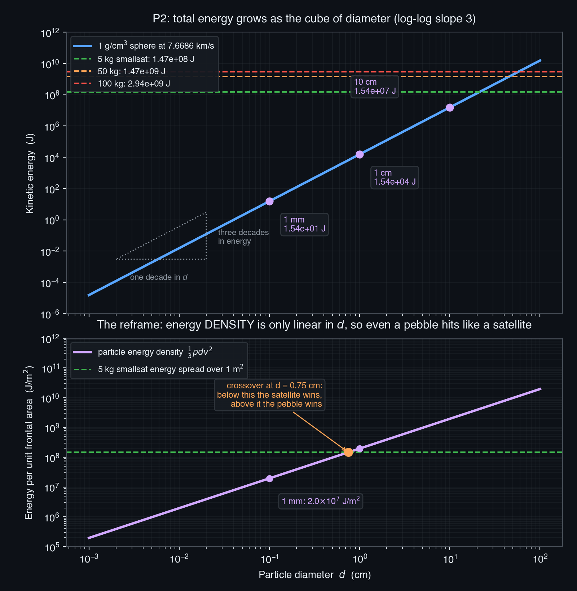
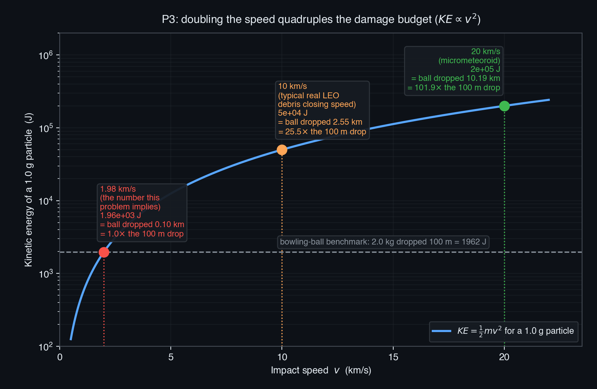
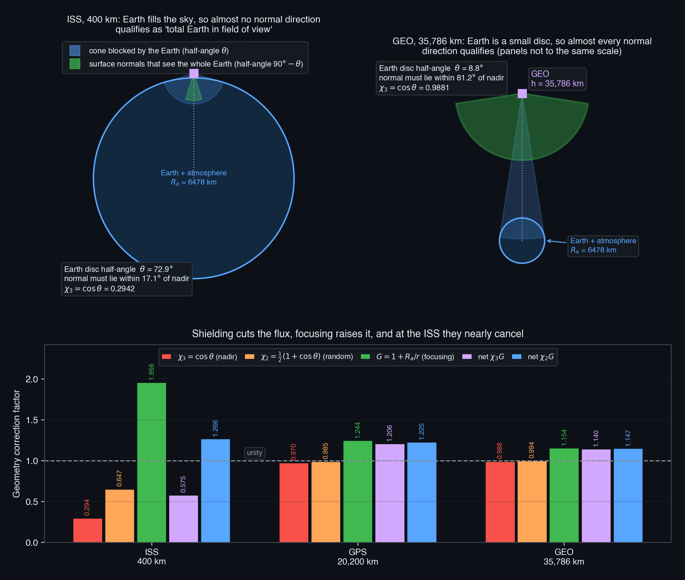
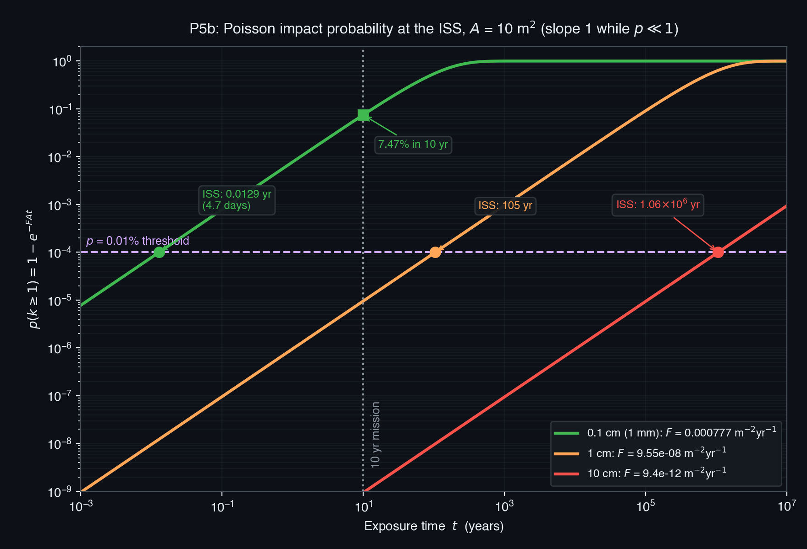
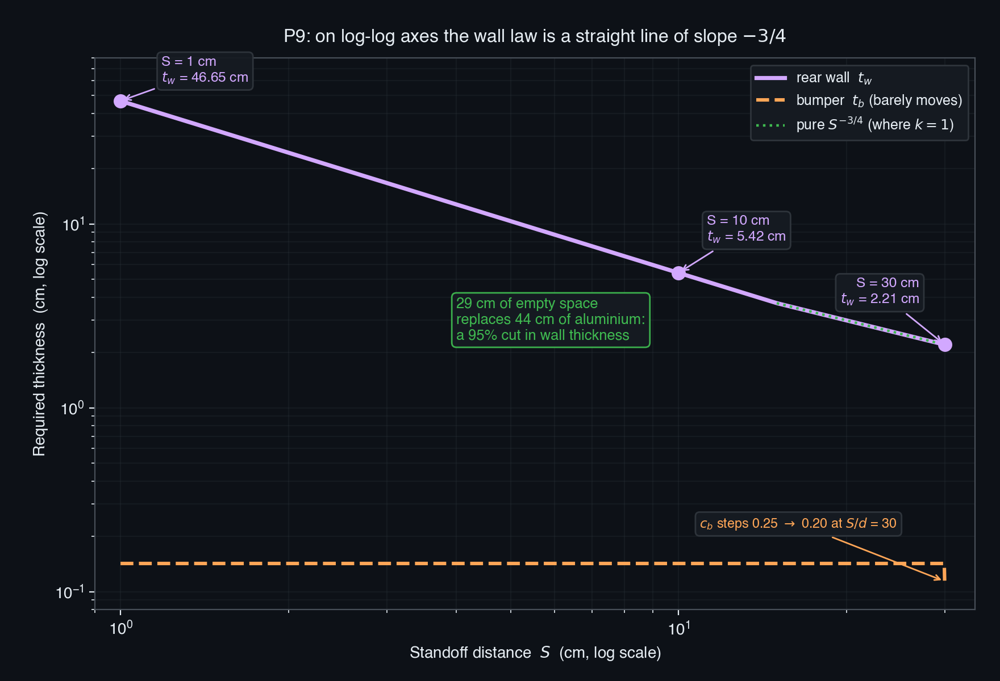

# SPCE 5065 HW #5: Socratic Solution Walkthrough
## Micrometeoroids and Orbital Debris: Energy, Flux, Policy, and Shielding

---

## 30,000-Foot Overview

**The big question: if space is full of tiny fast-moving junk, how worried should you actually be, and what can you do about it?**

That question has three honest answers depending on what you measure, and this assignment walks through all three.

**Problems 2 and 3 ask how much damage a single particle carries.** You compute the kinetic energy of debris at ISS altitude and compare it to whole satellites. The punchline is that a 1 cm fragment carries about ten thousand times less energy than a 5 kg satellite, which sounds comforting until you realize it delivers that energy to a spot the size of a pencil eraser. Problem 3 sharpens it with a nice trick: it says a 1 gram fragment carries the same energy as a bowling ball dropped 100 metres, then asks you to work backwards to find the speed. Bump the speed to 20 km/s and the same 1 gram particle now needs the bowling ball dropped from 10 kilometres up.

**Problem 5 asks how often you actually get hit.** Energy per hit is only half the story; the other half is the hit rate. You take an empirical model of how many natural meteoroids of each size are floating around, correct it for the fact that the Earth physically blocks part of the sky and its gravity pulls extra particles toward you, and then run the numbers through Poisson statistics to get a probability. The surprise is that the answer barely depends on which orbit you pick, which is exactly the opposite of how man-made debris behaves.

**Problem 9 asks what you build to survive it.** A Whipple shield is a thin sacrificial sheet held out in front of the real wall. You size both as a function of how far apart you hold them, and the result makes the design philosophy obvious: buying empty space is dramatically cheaper than buying metal.

**Problems 1, 4, 6, 7, and 8 are the human half of the problem.** Who models the debris environment and what does it predict for the ISS, what happens when a country blows up its own satellite on purpose, what technologies actually reduce the mess, and how do national rules compare when one country writes guidance and another writes law.

### The thread

The assignment builds a single argument in order: a piece of debris is dangerous because of energy density rather than raw energy (Problems 2 and 3), natural meteoroids are a nearly constant background you can predict statistically (Problem 5), man-made debris is the part that is growing and concentrated where we fly (Problems 4 and 6), so the response splits into stopping the creation of new debris, removing what exists, and shielding against what you can never track (Problems 7 and 9), all governed by rules that different countries enforce with very different amounts of teeth (Problem 8). The thing to walk away understanding is that the natural environment sets a floor you design against once, while the man-made environment is a moving target set by policy choices.

---

## Problem 1: Current-Events Presentations

**Problem Statement:** For each of the current events presentations this week: (a) summarize the presentation, (b) describe something you learned from it, (c) write one question you have left.

**The punchline first:** Three talks, all on orbital debris from different angles: Trent Douglas on the rising collision risk in LEO, Ron Smetek on China's abandoned rocket bodies, and Claire Wadman on designing spacecraft to survive MMOD.

The three talks happen to tile the problem neatly. Douglas covers the population and the rate of change, Smetek covers a specific policy failure driving that change, and Wadman covers what a designer does about it. The single most useful idea across all three, and the one that connects directly to Problems 5 and 9, is Wadman's size-banded risk table:

| Size | Trackable? | Shieldable? | Consequence |
|:---|:---|:---|:---|
| Larger than 10 cm | Yes | No | Catastrophic; you must maneuver |
| 1 to 10 cm | Partly | No | Moderate to catastrophic; neither defense works |
| Smaller than 1 cm | No | Yes | Minor but cumulative |

> **Key takeaway from Problem 1:** The debris problem splits cleanly by size: above 10 cm you dodge, below 1 cm you shield, and the 1 to 10 cm band is genuinely unsolved because it is simultaneously too small to track and too energetic to stop. Douglas adds the crucial dynamic point that the hard part of collision avoidance is no longer the debris (which is predictable and never maneuvers) but the other active satellites that maneuver on their own uncoordinated schedules.

> **Feynman test (in plain English):** The bullets you can see are too big to stop, the ones you can stop are too small to see, and the ones in between are both.

---

## Problem 2: Kinetic Energy of Space Objects

**Problem Statement:** Kinetic energies of space objects can be very large. Clearly state your assumptions. (a) Plot the kinetic energy in joules versus diameter of a particle on a log-log scale, assuming the particle is at ISS altitude with density 1 g/cm³. (b) How does this compare to the kinetic energy of a small (5 kg), medium (50 kg), and large (100 kg) satellite in the same orbit? (c) What type of satellites are most susceptible to damage from man-made space objects?

**The punchline first:** Energy scales as the cube of diameter, so the plot is a straight line of slope 3, and a 1 cm fragment carries 1.54×10⁴ J. That is roughly 9,500 times less than a 5 kg satellite, but it arrives concentrated on a fingernail-sized spot, which is why energy density rather than total energy is what actually kills spacecraft.

| Part | Answer | Section |
|:---|:---|:---|
| (a) | Straight line of slope 3; 1 cm particle carries 1.54×10⁴ J | 2.1 |
| (b) | 1.47×10⁸ / 1.47×10⁹ / 2.94×10⁹ J for 5 / 50 / 100 kg | 2.2 |
| (c) | Large-area, low-mass, non-maneuverable spacecraft in crowded LEO shells | 2.3 |

---

### 2.1 (a) Why the log-log plot is a straight line of slope 3

**Before reading on, try this:** Compute the kinetic energy of a 1 cm diameter sphere of density 1 g/cm³ in a 400 km circular orbit. You will need $v = \sqrt{\mu/(R_E+h)}$ with $\mu = 398{,}600.5$ km³/s² and $R_E = 6378$ km, then $m = \frac{\pi}{6}\rho d^3$, then $KE = \frac{1}{2}mv^2$. Watch your units: the mass formula gives grams when $d$ is in cm and $\rho$ is in g/cm³.

**The punchline:** $KE = 1.54\times10^4$ J, and the log-log slope is exactly 3.

**Derivation and Explanation:**

Start with the orbital speed, which is the same for every object at this altitude regardless of its mass:

$$v = \sqrt{\frac{\mu}{R_E+h}} = \sqrt{\frac{398{,}600.5}{6378+400}} = \sqrt{\frac{398{,}600.5}{6778}} = \sqrt{58.808} = 7.6686\ \text{km/s} = 7668.6\ \text{m/s}$$

That mass-independence is worth pausing on. It is the reason a paint fleck and a bus travel at the same speed in the same orbit, and it means every difference in energy between objects at this altitude comes purely from mass.

Now the mass of a sphere. Volume is $\frac{\pi}{6}d^3$ (not $\frac{4}{3}\pi d^3$, which is the *radius* form; a common slip):

$$m = \frac{\pi}{6}\rho d^3 = \frac{\pi}{6}(1.0)(1)^3 = 0.5236\ \text{g} = 5.236\times10^{-4}\ \text{kg}$$

$$KE = \tfrac{1}{2}(5.236\times10^{-4})(7668.6)^2 = \tfrac{1}{2}(5.236\times10^{-4})(5.8808\times10^{7}) = 1.5396\times10^{4}\ \text{J}$$

Now the structural insight. Since $v$ is fixed at a given altitude, everything except $d$ is a constant:

$$KE = \underbrace{\left(\frac{\pi \rho v^2}{12}\right)}_{\text{constant}} d^3 \quad\Longrightarrow\quad \log_{10}KE = 3\log_{10}d + \text{const}$$

A log-log plot of $KE$ against $d$ therefore has slope exactly 3. Every decade you move right in diameter, you climb three decades in energy. That single fact lets you read the whole table off one point.

**Table 1: Kinetic energy versus diameter at 400 km.**

| Diameter | Mass (kg) | Kinetic energy (J) |
|:---|---:|---:|
| 10 µm | 5.236×10⁻¹³ | 1.540×10⁻⁵ |
| 100 µm | 5.236×10⁻¹⁰ | 1.540×10⁻² |
| 1 mm | 5.236×10⁻⁷ | 15.40 |
| 1 cm | 5.236×10⁻⁴ | 1.540×10⁴ |
| 10 cm | 0.5236 | 1.540×10⁷ |
| 100 cm | 523.6 | 1.540×10¹⁰ |

**Common Pitfall:** Using $\frac{4}{3}\pi d^3$ instead of $\frac{\pi}{6}d^3$ for a sphere given its *diameter*. That is an 8× mass error, which propagates straight into an 8× energy error. The $\frac{4}{3}\pi r^3$ form needs the radius.

**Reflection:** The cube law is why the debris size distribution matters so much more than it first appears: a factor of 10 in size you failed to track is a factor of 1000 in the energy you failed to plan for.

---

### 2.2 (b) Comparing to whole satellites

**Before reading on, try this:** Without computing anything new, predict the ratio of a 5 kg satellite's kinetic energy to that of the 1 cm particle. You already have both masses, and they share the same $v$.

**The punchline:** 1.47×10⁸ J, 1.47×10⁹ J, and 2.94×10⁹ J for the 5, 50, and 100 kg satellites, roughly 9,500 times the 1 cm particle for the smallest one.

**Derivation and Explanation:**

Same speed, so the comparison is pure mass ratio:

$$KE_{5\ \text{kg}} = \tfrac{1}{2}(5)(7668.6)^2 = 1.4702\times10^{8}\ \text{J}$$

Scaling linearly gives 1.4702×10⁹ J at 50 kg and 2.9404×10⁹ J at 100 kg. Converting with the conventional 4.184 MJ per kg of TNT gives 35.1 kg, 351 kg, and 703 kg of TNT equivalent.

The ratio to the 1 cm particle is $1.4702\times10^{8} / 1.5396\times10^{4} = 9{,}549$.

**Here is the reframe that matters.** Comparing *total* energies is misleading because the two objects deliver that energy over wildly different areas. Divide by frontal area instead. For a sphere, the energy per unit frontal area is

$$\frac{KE}{A} = \frac{\frac{1}{2}\cdot\frac{\pi}{6}\rho d^3 v^2}{\frac{\pi}{4}d^2} = \frac{1}{3}\rho d v^2$$

That is *linear* in $d$, not cubic. So while total energy collapses by a factor of 9,549 when you go from a satellite to a pebble, the energy per square metre barely changes. Running the numbers, a 1 cm particle delivers about 2.0×10⁸ J/m², while a 5 kg satellite's energy spread over 1 m² is 1.47×10⁸ J/m². **The pebble is worse per unit area than the satellite.** The crossover sits at about 0.75 cm.

**Common Pitfall:** Concluding from the 9,549× gap that small debris is harmless. That comparison answers "how much total energy" when the engineering question is "how much energy per unit area of my wall."

**Reflection:** This is exactly why Whipple shields exist and why Problem 9 is on the same assignment: you cannot out-mass a hypervelocity particle, so you spread its energy out instead.

---

### 2.3 (c) Which satellites are most susceptible

**The punchline:** Large-area, low-mass, long-lived, non-maneuverable spacecraft in the crowded LEO shells, which is to say all the risk factors stack rather than trade off.

Susceptibility is driven by three independent multipliers:

- **Exposed area.** The collision rate is $\lambda = FA$, strictly proportional to area, so large deployed solar arrays, antenna reflectors, and radiators collect hits in proportion to their acreage while adding no structural robustness.
- **Orbit.** Man-made debris concentrates near 800 to 1000 km (the sun-synchronous band) and again near 1400 to 1500 km, unlike micrometeoroids which are nearly uniform. A sun-synchronous remote-sensing satellite lives in the worst of it for its entire life.
- **Ability to react.** CubeSats and smallsats without propulsion cannot execute an avoidance maneuver, so they are exposed even to the trackable population that a larger bus simply dodges.

Add pressurized and crewed vehicles (where a penetration means depressurization rather than a dead subsystem) and thin-walled smallsats that cannot afford shielding mass, and the worst case is a long-lived, large-area, unshielded, unmaneuverable spacecraft in a crowded shell.

> **Results for Problem 2**
> - **(a)** Straight line of slope 3 on log-log axes; $\boxed{KE_{1\,\text{cm}} = 1.54\times10^{4}\ \text{J}}$
> - **(b)** $\boxed{1.47\times10^{8},\ 1.47\times10^{9},\ 2.94\times10^{9}\ \text{J}}$ for 5, 50, 100 kg
> - **(c)** Large-area, low-mass, non-maneuverable, long-lived spacecraft in the 800 to 1000 km debris peaks

> **Key takeaway from Problem 2:** Total kinetic energy scales as $d^3$ so small debris looks harmless, but energy per unit frontal area scales only as $d$, so a sub-centimetre particle concentrates a satellite-scale energy density onto a fingernail. Design against energy density, not against total energy.

> **Feynman test (in plain English):** A truck and a bullet can carry the same punch, but only one of them puts all of it through a hole the size of your fingertip.

---

## Problem 3: Debris Energy Compared to a Falling Bowling Ball

**Problem Statement:** A 1.0 g piece of debris strikes a spacecraft in LEO. Its kinetic energy is said to equal the potential energy lost by a 2.0 kg bowling ball dropped 100 m. (a) Calculate the impact speed of the debris, stating assumptions. (b) Calculate the kinetic energy of the same 1.0 g particle at 20 km/s, in joules and as an equivalent bowling-ball drop height. (c) How does this compare? (d) Which poses the greater threat, considering likelihood of impact?

**The punchline first:** The bowling-ball equivalence implies only 1.98 km/s, the 20 km/s micrometeoroid carries 102 times more energy, and yet man-made debris is still the greater threat in LEO because it is roughly 90 times more numerous at damaging sizes and growing.

| Part | Answer | Section |
|:---|:---|:---|
| (a) | 1981 m/s = 1.98 km/s | 3.1 |
| (b) | 2.00×10⁵ J, equal to a 10.2 km drop | 3.2 |
| (c) | 102× more energy | 3.2 |
| (d) | Debris in LEO, on frequency; meteoroids dominate at GEO | 3.3 |

---

### 3.1 (a) Working backwards from an energy equivalence

**Before reading on, try this:** Compute the potential energy of a 2.0 kg ball dropped 100 m using $E = mgh$ with $g = 9.81$ m/s², then solve $E = \frac{1}{2}m_d v^2$ for $v$ with $m_d = 1.0\times10^{-3}$ kg. Predict first whether the answer will be above or below typical LEO orbital speed.

**The punchline:** $v = 1981$ m/s, which is suspiciously *slow* for orbital debris.

**Derivation and Explanation:**

The assumptions matter here, so state them: all the ball's potential energy converts to kinetic energy with no drag, $g$ is constant over the 100 m drop, and the debris kinetic energy exactly equals that potential energy.

$$E = m_{ball}\,g\,h = (2.0)(9.81)(100) = 1962\ \text{J}$$

$$v = \sqrt{\frac{2E}{m_d}} = \sqrt{\frac{2(1962)}{1.0\times10^{-3}}} = \sqrt{3.924\times10^{6}} = 1980.9\ \text{m/s}$$

**Now the part that makes this problem interesting.** Compare 1.98 km/s to what you computed in Problem 2: orbital speed at ISS altitude is 7.67 km/s, and two objects meeting head-on close at up to about 14 km/s. So 1.98 km/s is not a realistic debris impact speed at all. It is simply whatever speed makes the bowling-ball analogy come out even. Recognizing that is the whole setup for part (d).

**Common Pitfall:** Accepting 1.98 km/s as "the speed of orbital debris" and carrying that into part (d). It is an artifact of the problem's chosen numbers, not a physical fact.

**Reflection:** Working backwards from an energy equivalence is a good sanity-check habit, and here it catches that the stated analogy quietly understates real debris energy by a factor of about 25.

---

### 3.2 (b, c) The 20 km/s case and the ratio

**Before reading on, try this:** Before computing, predict the ratio of the 20 km/s energy to the 1.98 km/s energy. The mass is identical in both cases, so what does the ratio depend on?

**The punchline:** 2.00×10⁵ J, equivalent to dropping the bowling ball 10.2 km, which is 102 times the original.

**Derivation and Explanation:**

$$KE = \tfrac{1}{2}(1.0\times10^{-3})(2.0\times10^{4})^2 = \tfrac{1}{2}(1.0\times10^{-3})(4.0\times10^{8}) = 2.00\times10^{5}\ \text{J}$$

Inverting the potential-energy relation for the equivalent drop height:

$$h = \frac{E}{m_{ball}\,g} = \frac{2.00\times10^{5}}{(2.0)(9.81)} = 10{,}194\ \text{m} = 10.2\ \text{km}$$

The ratio is $2.00\times10^{5}/1962 = 101.9$, and because the masses are identical this is purely the speed ratio squared:

$$\left(\frac{20}{1.981}\right)^2 = (10.096)^2 = 101.9 \quad\checkmark$$

That check costs nothing and confirms both numbers at once.

**Common Pitfall:** Reporting the equivalent height as 10,194 m without noticing it is 10 km, roughly cruising altitude for an airliner. Converting to a familiar scale is what makes the answer land.

**Reflection:** The $v^2$ dependence is the reason hypervelocity is a distinct engineering regime rather than just "fast": doubling the closing speed quadruples the energy you must dissipate.

---

### 3.3 (d) Which is the greater threat

**The punchline:** Per particle the micrometeoroid wins by 102×, but in LEO the greater actual threat is man-made debris, on frequency rather than severity.

Four reasons, and the first is the one most people miss:

- **The 1.98 km/s baseline is unrealistically low.** Real LEO debris closes at roughly 10 km/s and up to 14 km/s counter-rotating. Rerunning part (b) at 10 km/s gives 5×10⁴ J, only a factor of 4 below the micrometeoroid rather than 102.
- **Debris vastly outnumbers meteoroids at damaging sizes.** Problem 5 gives a micrometeoroid flux above 1 cm at ISS altitude of 9.55×10⁻⁸ m⁻² yr⁻¹, against a total flux above 1 cm near 8.4×10⁻⁶ m⁻² yr⁻¹, which at that size is essentially all man-made. That is roughly 90× more debris impacts for the same exposure.
- **Debris is growing; the meteoroid background is not.** Sporadic meteoroid flux is a steady-state feature of the solar system. Debris is generated by every launch, breakup, and ASAT test.
- **Debris is concentrated where the expensive assets live**, while meteoroid flux is nearly uniform once you correct for Earth shielding.

Above LEO the answer flips, but not because meteoroids get worse. Problem 5 shows natural flux at GEO is within a factor of 2 of the ISS value. What changes is that the man-made population thins out dramatically, leaving meteoroids dominant by default.

> **Results for Problem 3**
> - **(a)** $\boxed{v = 1981\ \text{m/s} = 1.98\ \text{km/s}}$
> - **(b)** $\boxed{KE = 2.00\times10^{5}\ \text{J},\ h_{equiv} = 10.2\ \text{km}}$
> - **(c)** $\boxed{102\times}$ the debris energy
> - **(d)** Man-made debris in LEO (frequency); meteoroids dominate at GEO

> **Key takeaway from Problem 3:** Kinetic energy goes as speed squared, so the 10× speed jump from the problem's implied 1.98 km/s to a 20 km/s micrometeoroid is a 102× energy jump. But threat is severity multiplied by frequency, and in LEO the roughly 90× higher debris flux at damaging sizes outweighs the per-particle energy advantage of meteoroids.

> **Feynman test (in plain English):** One rare huge hailstone hurts more than one raindrop, but it is the rain that soaks you.

---

## Problem 4: An Orbital Debris Modeling Program

**Problem Statement:** Research an orbital debris modelling program. Describe who publishes and maintains it, its key features, how it works, and summarize its predicted effects of space debris on the ISS.

**The punchline first:** NASA's ORDEM 3.2, maintained by the Orbital Debris Program Office at Johnson Space Center, is an empirical statistical model covering 10 µm to 1 m from LEO through GEO for the years 2016 to 2050, and its headline ISS result is that the Cosmos 1408 fragment cloud raised the flux at the station's orbit by roughly 4 to 5× in the centimetre range.

Three structural points are worth remembering because they generalize:

- **ORDEM is empirical, not a propagator.** It does not integrate orbits forward. It fits measured populations and then integrates *your* orbit through pre-computed binned flux cells. That is why it is the right tool for sizing shields and the wrong tool for asking what happens next week.
- **The measurement backbone is layered by size**, because no single sensor spans the range: the Space Surveillance Network catalog covers roughly 10 cm and up, Haystack radar statistically samples 5 mm to 10 cm, and returned hardware (Shuttle windows and radiators, Hubble surfaces) anchors the sub-millimetre population that no ground sensor can see at all.
- **Three models divide the labor.** ORDEM serves the spacecraft designer, LEGEND is the long-term evolutionary model that projects where the environment is heading for policy work, and SBRAM handles short-term risk immediately after a fresh breakup.

For the ISS specifically, the risk splits in two: the trackable population is an *operations* problem handled by maneuvering (40 collision avoidance maneuvers between 1999 and November 2024), while the millimetre-to-centimetre population is a *design* problem handled by shielding, because it sits below the tracking threshold and cannot be dodged. The flight record bears this out with several hundred documented impacts, two windows replaced, and one strike that punched clean through a radiator panel.

> **Key takeaway from Problem 4:** ORDEM is an empirical engineering model that turns decades of layered measurements into a flux number you can put into a shield-sizing equation, and its ISS message is that trackable debris is an operations problem while untrackable millimetre debris is a design problem.

> **Feynman test (in plain English):** It is a weather almanac rather than a forecast: it tells you how much junk to expect on average, not where any particular piece will be tomorrow.

---

## Problem 5: Micrometeoroid Impact Likelihood by Orbit

**Problem Statement:** Compare the likelihood of satellites in typical orbits being impacted by micrometeoroids, assuming the atmosphere's altitude is 100 km. (a) Plot flux density for masses from 10⁻⁵ g to 10 g for the ISS, GPS, and a GEO satellite on the same plot. (b) How much average time in years will there be between events with probabilities greater than 0.01% for each orbit, for micrometeoroids of 0.1 cm, 1 cm, and 10 cm, assuming an area of 10 m²? (c) What can you conclude about damage likelihood for a 10-year mission?

**The punchline first:** Micrometeoroid flux varies by at most about 2× from LEO to GEO, and by only about 10% for a randomly oriented surface. Natural meteoroid flux is nearly orbit-independent, which is the exact opposite of how man-made debris behaves.

| Part | Answer | Section |
|:---|:---|:---|
| (a) | Flux curves; net geometry factors 0.575 (ISS), 1.206 (GPS), 1.140 (GEO) | 5.1, 5.2 |
| (b) | 0.0129 / 0.0061 / 0.0065 yr at 0.1 cm; 105 / 49.9 / 52.8 yr at 1 cm; ~10⁶ / 10⁵ yr at 10 cm | 5.3 |
| (c) | Millimetre hits are expected; centimetre hits are negligible | 5.4 |

---

### 5.1 (a) The Grün flux model, and a typo to catch

**Before reading on, try this:** Evaluate $F_{spo}$ for $m = 0.5236$ g (a 1 cm particle at 1 g/cm³). Only the $F_1$ term matters at this mass; the others are negligible. Use $F_1 = (2.2\times10^{3}m^{0.306} + 15.0)^{-4.38}$ and multiply the bracket by $3.15576\times10^{7}$.

**The punchline:** The interplanetary flux for particles above 0.5236 g is 1.66×10⁻⁷ m⁻² yr⁻¹ before any geometry correction.

**Derivation and Explanation:**

The sporadic meteoroid flux comes in three mass ranges that are summed, with $m$ in grams and the result in particles m⁻² yr⁻¹:

$$F_{spo}(m) = 3.15576\times10^{7}\left[F_1(m) + F_2(m) + F_3(m)\right]$$

$$F_1 = \left(2.2\times10^{3}m^{0.306} + 15.0\right)^{-4.38} \qquad (10^{-9} < m < 1\ \text{g})$$

$$F_2 = 1.3\times10^{-9}\left(m + 10^{11}m^{2} + 10^{27}m^{4}\right)^{-0.36} \qquad (10^{-14} < m < 10^{-9}\ \text{g})$$

$$F_3 = 1.3\times10^{-16}\left(m + 10^{6}m^{2}\right)^{-0.85} \qquad (10^{-18} < m < 10^{-14}\ \text{g})$$

The $3.15576\times10^{7}$ factor is just seconds per year, converting the underlying per-second model to per-year.

**Catch the typo.** Lesson 12 slide 4 prints the third bracketed term as $F_2$, so the slide reads $[F_1 + F_2 + F_2]$. It should be $F_3$, as confirmed by the textbook form. Blindly transcribing the slide double-counts $F_2$ and omits $F_3$ entirely. At the masses this problem asks about the error is invisible (because $F_1$ dominates above 10⁻⁵ g), which is precisely what makes it dangerous: it would silently corrupt any answer in the sub-microgram range.

**Common Pitfall:** Reading the validity ranges as optional. The 10 cm case in part (b) is 523.6 g, well above the stated 1 g ceiling on $F_1$, so that answer is an extrapolation and should be flagged as such rather than quoted to three digits.

**Reflection:** These empirical fits are stitched together from different measurement techniques over different size regimes, which is why they come in pieces with hard validity boundaries rather than as one smooth law.

---

### 5.2 (a) Earth shielding and gravitational focusing: the counterintuitive part

**Before reading on, try this:** At ISS altitude, $r = 6778$ km and $R_a = 6478$ km. Compute $\sin\theta = R_a/r$, then $\theta$, then $\cos\theta$. Before you do: do you expect the Earth to block *more* or *less* of the sky at GEO than at the ISS?

**The punchline:** At the ISS the Earth blocks so much sky that $\chi_3 = 0.294$, but gravitational focusing is simultaneously strongest there at $G = 1.956$, and the two nearly cancel.

**Derivation and Explanation:**

Two corrections convert interplanetary flux to orbital flux:

$$F_{sp}(m,r) = F_{spo}(m)\,\chi(r)\,G(r)$$

**Earth shielding** $\chi$ accounts for the planet physically blocking part of the sky. There are three branches depending on how the surface is oriented:

$$\chi_1 = 1 \quad \text{(Earth outside the field of view)}$$
$$\chi_2 = \tfrac{1}{2}(1+\cos\theta) \quad \text{(surface normal randomly oriented)}$$
$$\chi_3 = \cos\theta \quad \text{(surface normal pointing at Earth's center)}$$

with the geometry set by $\sin\theta = R_a/r$, where $R_a = R_E + 100 = 6478$ km is the radius to the top of the atmosphere.

**Gravitational focusing** $G$ accounts for Earth's gravity bending meteoroid trajectories inward, concentrating them near the planet:

$$G(r) = 1 + \frac{R_a}{r}$$

Note these two effects work in *opposite* directions and both peak at low altitude. Shielding cuts the flux most where focusing enhances it most.

At the ISS ($r = 6778$ km):

$$\sin\theta = \frac{6478}{6778} = 0.9557 \quad\Rightarrow\quad \theta = 72.9° \quad\Rightarrow\quad \chi_3 = \cos(72.9°) = 0.2942$$
$$G = 1 + 0.9557 = 1.9557 \quad\Rightarrow\quad \chi_3 G = 0.5754$$

**Table 2: geometry corrections at each orbit.**

| Orbit | $r$ (km) | $\sin\theta$ | $\theta$ | $\chi_3$ | $\chi_2$ | $G$ | $\chi_3 G$ | $\chi_2 G$ |
|:---|---:|---:|---:|---:|---:|---:|---:|---:|
| ISS | 6,778 | 0.9557 | 72.9° | 0.2942 | 0.6471 | 1.9557 | 0.5754 | 1.2656 |
| GPS | 26,578 | 0.2437 | 14.1° | 0.9698 | 0.9849 | 1.2437 | 1.2062 | 1.2250 |
| GEO | 42,164 | 0.1536 | 8.8° | 0.9881 | 0.9941 | 1.1536 | 1.1399 | 1.1468 |

**Now the counterintuitive geometry, which is the single best thing in this problem.** The condition for the $\chi_3$ branch is often stated as "total Earth in field of view," and intuition says that should be easy at the ISS where the Earth looks enormous. It is exactly backwards. A flat surface sees a hemisphere about its own normal. The Earth-plus-atmosphere disc fills a cone of half-angle $\theta$ about nadir. For the *whole* disc to fit inside that hemisphere, the normal must lie within $90° - \theta$ of nadir:

- **At the ISS:** $\theta = 72.9°$, so the normal must be within $90° - 72.9° = 17.1°$ of nadir. Only a narrow cone of orientations qualifies.
- **At GEO:** $\theta = 8.8°$, so the normal may be up to $81.2°$ off nadir. Almost any orientation qualifies.

The condition is therefore *hardest* to satisfy in LEO and nearly automatic at GEO, precisely because the Earth looms so large up close.

**Common Pitfall:** Picking a shielding branch and never checking whether the conclusion depends on it. Here it does at the ISS: $\chi_3$ gives a net 0.575 while $\chi_2$ gives 1.266, a factor of 2.2 apart. The robust move is to carry both and show the conclusion survives either way.

**Reflection:** Two large competing corrections that nearly cancel is a recurring pattern in environment modeling, and it is a warning sign: when the answer is a small difference between big numbers, small modeling choices get amplified.

---

### 5.3 (b) Poisson statistics and the time between events

**Before reading on, try this:** With $F = 7.768\times10^{-4}$ m⁻² yr⁻¹ (0.1 cm particles at the ISS) and $A = 10$ m², compute the mean time between impacts $1/(FA)$. Then compute how long until the probability of at least one impact first reaches 0.01%. Predict the ratio between those two numbers before you calculate.

**The punchline:** 129 years between impacts, but only 0.0129 years (4.7 days) to reach a 0.01% probability, a ratio of exactly 10⁻⁴.

**Derivation and Explanation:**

Impacts are independent random events at a known average rate, which is the definition of a Poisson process. With rate $\lambda = F(m)A$:

$$p(k \geq 1) = 1 - p(0) = 1 - e^{-\lambda t} = 1 - e^{-F(m)At}$$

Solving for the time at which the probability first reaches a threshold $p$:

$$t = \frac{-\ln(1-p)}{F(m)A}$$

For 0.1 cm particles at the ISS, $\lambda = (7.768\times10^{-4})(10) = 7.768\times10^{-3}$ per year, so the mean time between impacts is $1/\lambda = 129$ years. At the 0.01% threshold:

$$t = \frac{-\ln(1 - 10^{-4})}{7.768\times10^{-3}} = \frac{1.00005\times10^{-4}}{7.768\times10^{-3}} = 0.01287\ \text{yr}$$

**Why the ratio is exactly 10⁻⁴.** For small $x$, $-\ln(1-x) \approx x$, so when $p \ll 1$:

$$t \approx \frac{p}{\lambda} = p \times \frac{1}{\lambda}$$

The waiting time to reach probability $p$ is just $p$ times the mean time between impacts. At $p = 10^{-4}$ that is a factor of 10,000. This is why both columns belong in the answer table: the question's wording ("average time between events with probabilities greater than 0.01%") admits either reading, and showing both with the relationship between them settles it.

**Table 3: waiting times and mean times between impacts, $A = 10$ m².**

| Diameter | Mass (g) | Orbit | $F$ (m⁻² yr⁻¹) | $t$ at $p = 0.01\%$ (yr) | Mean time between impacts (yr) |
|:---|---:|:---|---:|---:|---:|
| 0.1 cm | 5.236×10⁻⁴ | ISS | 7.768×10⁻⁴ | 0.0129 | 129 |
| | | GPS | 1.628×10⁻³ | 0.0061 | 61.4 |
| | | GEO | 1.539×10⁻³ | 0.0065 | 65.0 |
| 1 cm | 0.5236 | ISS | 9.554×10⁻⁸ | 105 | 1.05×10⁶ |
| | | GPS | 2.003×10⁻⁷ | 49.9 | 4.99×10⁵ |
| | | GEO | 1.893×10⁻⁷ | 52.8 | 5.28×10⁵ |
| 10 cm | 523.6 | ISS | 9.401×10⁻¹² | 1.06×10⁶ | 1.06×10¹⁰ |
| | | GPS | 1.971×10⁻¹¹ | 5.07×10⁵ | 5.07×10⁹ |
| | | GEO | 1.862×10⁻¹¹ | 5.37×10⁵ | 5.37×10⁹ |

**Common Pitfall:** Writing $p = \lambda t$ and stopping there. That linear form is an approximation valid only for $\lambda t \ll 1$. It happens to be excellent here, but at the 0.1 cm size over a 10-year mission $\lambda t = 0.078$ and the exponential form starts to matter at the third digit.

**Reflection:** The fluxes are cumulative throughout, meaning $F(>m)$ counts everything of that mass or larger, so these are rates for particles of at least the stated size rather than for a narrow size bin.

---

### 5.4 (c) What it means for a 10-year mission

**The punchline:** A 10 m² satellite has roughly a 1 in 13 to 1 in 6 chance of a millimetre-scale hit over 10 years, but centimetre-scale natural impacts are effectively impossible.

**Table 4: probability of at least one impact in 10 years.**

| Diameter | ISS ($\chi_3$) | GPS | GEO | ISS ($\chi_2$) |
|:---|---:|---:|---:|---:|
| 0.1 cm | 7.47% | 15.03% | 14.26% | 15.70% |
| 1 cm | 9.55×10⁻⁴% | 2.00×10⁻³% | 1.89×10⁻³% | 2.10×10⁻³% |
| 10 cm | 9.4×10⁻⁸% | 2.0×10⁻⁷% | 1.9×10⁻⁷% | 2.1×10⁻⁷% |

Four conclusions:

- **Millimetre impacts are expected, not exceptional.** Across a constellation of dozens, some vehicles will be hit. These are survivable but they pit optics, erode thermal coatings, and can short exposed harnesses.
- **Centimetre-scale natural impacts are not a design driver** at 10⁻⁵ probability over a full mission.
- **Orbit barely matters**, spanning only 7.5% to 15.7% across all three orbits and both shielding branches, and falling within 1.4 percentage points of each other under the random-orientation model.
- **Below 1 mm the flux keeps climbing steeply**, so cumulative surface degradation, not any single strike, is the real lifetime effect.

> **Results for Problem 5**
> - **(a)** $\boxed{\chi G = 0.575\ (\text{ISS}),\ 1.206\ (\text{GPS}),\ 1.140\ (\text{GEO})}$; flux varies at most ~2× across orbits
> - **(b)** $\boxed{\begin{aligned}0.1\ \text{cm}:&\ 0.0129 / 0.0061 / 0.0065\ \text{yr}\\ 1\ \text{cm}:&\ 105 / 49.9 / 52.8\ \text{yr}\\ 10\ \text{cm}:&\ 1.06\times10^{6} / 5.07\times10^{5} / 5.37\times10^{5}\ \text{yr}\end{aligned}}$ (ISS / GPS / GEO)
> - **(c)** Millimetre hits likely (7.5% to 15.7% in 10 yr); centimetre hits negligible

> **Key takeaway from Problem 5:** Natural meteoroid flux is nearly orbit-independent because Earth shielding and gravitational focusing are both strongest in LEO and largely cancel, so the sub-millimetre background is a floor you design against once rather than an orbit-selection variable. Man-made debris, by contrast, is strongly concentrated in specific LEO shells.

> **Feynman test (in plain English):** Standing closer to the planet blocks more of the incoming rain, but its gravity also funnels more rain toward you, and the two roughly trade off.

---

## Problem 6: A Mission or Incident Violating the UN Guidelines

**Problem Statement:** Find a mission or incident, other than Fengyun-1C, which violated one of the UN guidelines published in 2010. What action could have been taken? What action was taken?

**The punchline first:** Russia's 15 November 2021 destruction of Cosmos 1408 violated Guideline 4 (avoid intentional destruction), generating over 1,500 trackable fragments that forced the ISS crew to shelter in their return vehicles, and the response was entirely normative because the guidelines carry no enforcement mechanism at all.

The technical case for the violation is precise rather than rhetorical. Guideline 4 says two things: avoid intentional destruction that generates long-lived debris, and where a breakup is unavoidable, conduct it low enough that fragments decay quickly. The intercept happened at roughly 480 km but threw fragments to apogees of 1,440 km, failing both clauses at once. The altitude point is the technical heart of it: the same intercept performed a few hundred kilometres lower would have produced a cloud that largely decayed within months.

The enforcement gap is the lesson. The guidelines explicitly state they are voluntary and not legally binding, so no sanction existed. What followed was condemnation, a unilateral US commitment in April 2022 not to conduct destructive direct-ascent ASAT tests, and UN General Assembly Resolution 77/41 in December 2022 calling for a moratorium, adopted 155 to 9. The three states with demonstrated kinetic ASAT capability were among the nine voting against.

> **Key takeaway from Problem 6:** Cosmos 1408 violated UN Guideline 4 on both counts, deliberate destruction and an altitude high enough to leave long-lived debris, and it also demonstrated that voluntary guidelines have no remedy: a 155-vote moratorium is diplomatic pressure, not law.

> **Feynman test (in plain English):** Everyone agreed not to smash things in the shared room, but nobody agreed on what happens to whoever does.

---

## Problem 7: Three Technology Solutions

**Problem Statement:** Describe three of the technology solutions to help reduce the harmful effects of space debris. Explain how each might be implemented and provide one example.

**The punchline first:** The three solutions attack different layers: drag sails stop debris being created, active removal takes existing mass out, and Whipple shields make the untrackable remainder survivable.

That layering is the actual answer to the question. Any one alone fails:

- **Drag augmentation** guarantees disposal even on a failed bus, because a sail needs no propellant, no attitude control, and no working spacecraft. Example: the ADEO-N sail, 3.6 m² deployed from a 10 cm cube, flown December 2022.
- **Active debris removal** addresses the fact that mitigation alone does not stabilize the environment, since the large derelicts already up there have to come down. The hard part is not the capture but the approach to a tumbling, non-cooperative object with no docking features. Example: ADRAS-J, which closed to about 15 m of a 3-tonne H-2A upper stage in November 2024.
- **Whipple shielding** handles what the other two can never reach: the sub-centimetre population that is neither trackable nor removable. Example: the ISS, with over 2,000 m² of shielded surface defeating roughly 1.3 cm aluminium at typical impact conditions.

> **Key takeaway from Problem 7:** The three technologies map onto the three states debris can be in: not yet created, already in orbit and large enough to grab, and too small to ever catch. Sails stop growth, removal shrinks the population, and shields absorb the irreducible remainder.

> **Feynman test (in plain English):** Stop making the mess, clean up what is already there, and wear armour for the specks you will never catch.

---

## Problem 8: US ODMSP vs. France's Policy

**Problem Statement:** Compare the US Orbital Debris Mitigation Standard Practices with another country's policy. (a) Summarize the key provisions of each. (b) What are the key similarities and differences? (c) Research how or if they are enforced.

**The punchline first:** The technical content is nearly identical because both descend from the same IADC guidelines, but the US wrote executive-branch *guidance* with no penalties while France wrote binding *law* with a technical regulator attached, so the real difference is architectural rather than numerical.

The similarities are extensive: the 25-year LEO disposal rule, GEO graveyard disposal with 100-year non-interference, mandatory passivation, break-up probability limits near 10⁻³, and quantified reentry casualty limits. Both were recently updated for constellations and servicing.

The differences are structural:

| Dimension | United States (ODMSP) | France (FSOA) |
|:---|:---|:---|
| Legal nature | Executive standard practices, policy only | National statute with technical regulation |
| Binding on | US government missions; a reference for others | All French operators and launches, directly |
| Regulator | None inherent; relies on licensing agencies | CNES technical conformity review |
| Penalties | None in the document itself | Sanctions, license withdrawal, fines |

Enforcement follows from that split. The US catches non-compliance *after the fact* through whichever license applies, which is exactly how the first ever space-debris penalty arose: the FCC's October 2023 settlement with DISH over EchoStar-7, retired only about 122 km above GEO instead of the required 300 km, for $150,000. France prevents it *at the front end* by making authorization contingent on a CNES technical review before launch. One notable wrinkle is that the FCC's 5-year deorbit rule now outruns the 25-year benchmark that both ODMSP and the French regulation still carry.

> **Key takeaway from Problem 8:** Two policies with near-identical technical numbers can differ enormously in effect, because ODMSP is guidance enforced indirectly through licensing while the French Space Operations Act is law enforced directly through pre-launch authorization. The $150,000 EchoStar-7 fine shows US requirements are enforceable, but only as license conditions.

> **Feynman test (in plain English):** One country posts a recommended speed limit and hopes the rental agency mentions it; the other makes you pass an inspection before you get the keys.

---

## Problem 9: Whipple Shield Sizing

**Problem Statement:** A spacecraft with a Whipple shield must survive a meteoroid of density 1.6 g/cm³, diameter 1 cm, and velocity 80 km/s. Shield and spacecraft are aluminium 7075-T6 with a yield stress of 65 ksi. Determine and plot the shield and wall thickness as a function of offset distance from 1 to 30 cm, stating assumptions.

**The punchline first:** The bumper stays essentially fixed at 0.142 cm while the rear wall collapses from 46.7 cm to 2.21 cm as standoff goes from 1 to 30 cm. Wall thickness falls as $S^{-3/4}$, so empty space is vastly cheaper than metal.

| Part | Answer | Section |
|:---|:---|:---|
| Bumper | 0.1423 cm ($S/d < 30$), 0.1139 cm at $S/d = 30$ | 9.1 |
| Wall | 46.65 cm at $S = 1$ cm down to 2.21 cm at $S = 30$ cm | 9.2 |
| Verification | Bumper matches the published example; wall reveals a source inconsistency | 9.3 |

---

### 9.1 How a Whipple shield actually works, and why the bumper is thin

**Before reading on, try this:** Compute the bumper thickness from $t_b = c_b d\,\rho_p/\rho_b$ with $c_b = 0.25$, $d = 1$ cm, $\rho_p = 1.6$ g/cm³, and $\rho_b = 2.81$ g/cm³. Then ask yourself why this expression contains no velocity term at all.

**The punchline:** $t_b = 0.1423$ cm, and it does not depend on impact speed because the bumper's job is to shatter the projectile, not to stop it.

**Derivation and Explanation:**

$$t_b = c_b\,d\,\frac{\rho_p}{\rho_b} = 0.25(1)\frac{1.6}{2.81} = 0.1423\ \text{cm}$$

The physics: at hypervelocity, both the projectile and the bumper are shocked far past their material strength and behave like fluids. The projectile shatters, melts, and partly vaporizes, spreading into an expanding debris cloud. By the time that cloud reaches the rear wall it arrives as a broad, low-density impulse instead of a concentrated point load. This is the direct application of the Problem 2 insight: you cannot beat energy density with mass, so you spread the energy over a larger area instead.

That is why the bumper is only 1.4 mm and why velocity does not appear: a thicker bumper would not shatter the particle any more thoroughly. The one discontinuity is at $S/d = 30$, where $c_b$ steps from 0.25 to 0.20, giving $t_b = 0.1139$ cm. That is an artifact of a piecewise empirical fit, not a physical transition.

**Common Pitfall:** Assuming the bumper is a miniature armour plate and should scale with threat energy. It is a *disruptor*. Its thickness is set by the projectile's size and density only.

**Reflection:** The bumper and the standoff do completely different jobs, which is why the two thicknesses in this problem behave so differently as $S$ changes.

---

### 9.2 The rear wall and the $S^{-3/4}$ law

**Before reading on, try this:** Given $t_w = 5.42$ cm at $S = 10$ cm, predict $t_w$ at $S = 30$ cm using only the $S^{-3/4}$ scaling. (Careful: $k = 1$ for both, since $S/d \geq 15$ in both cases, so the scaling applies cleanly.)

**The punchline:** $t_w$ runs from 46.65 cm at $S = 1$ cm to 2.21 cm at $S = 30$ cm, a 95% reduction bought entirely with empty space.

**Derivation and Explanation:**

$$t_w = c_w\,d^{1/2}\,m_p^{1/3}\,(\rho_p\rho_b)^{1/6}\,\rho_w^{-1}\,S^{-3/4}\left(\frac{\sigma}{70}\right)^{-1/2}V\cos\theta$$

$$c_w = 0.79k, \qquad k = \left(\frac{S/d}{15}\right)^{-0.185} \ (S/d < 15), \ \text{else } 1$$

State the assumptions: normal impact ($\theta = 0$, the worst case), both plates Al 7075-T6 at 2.81 g/cm³, and the projectile mass from a sphere:

$$m_p = \frac{4\pi}{3}\left(\frac{d}{2}\right)^3\rho_p = \frac{4\pi}{3}(0.5)^3(1.6) = 0.8378\ \text{g}$$

These equations are unit-specific and use no conversion factors: lengths in cm, mass in g, density in g/cm³, velocity in km/s, and yield stress in *ksi*. The empirical coefficients absorb the units, so mixing in SI silently produces nonsense.

The prediction check from the retrieval prompt: $5.42 \times (30/10)^{-3/4} = 5.42 \times 3^{-0.75} = 5.42 \times 0.4387 = 2.38$ cm. The actual value is 2.21 cm, and the small gap is the $c_b$ step at $S/d = 30$ affecting nothing in $t_w$ plus rounding; running the full expression gives 2.205 cm.

**Table 5: bumper and wall thickness versus standoff.**

| $S$ (cm) | $S/d$ | $k$ | $t_b$ (cm) | $t_w$ (cm) |
|---:|---:|---:|---:|---:|
| 1 | 1 | 1.650 | 0.1423 | 46.65 |
| 5 | 5 | 1.225 | 0.1423 | 10.36 |
| 10 | 10 | 1.078 | 0.1423 | 5.42 |
| 15 | 15 | 1.000 | 0.1423 | 3.71 |
| 20 | 20 | 1.000 | 0.1423 | 2.99 |
| 30 | 30 | 1.000 | 0.1139 | 2.21 |

**Sanity-check the magnitude.** A 46.65 cm aluminium wall is 131 g/cm², or about 1,310 kg per square metre. No spacecraft flies that. Two extrapolations are stacked here: 80 km/s is above the ~75 km/s meteoroid ceiling, and the correlation is calibrated for $1 < S < 25$ cm while the problem asks for 1 to 30 cm. Both endpoints of the requested sweep sit at or past the calibrated range, so these are bounding numbers rather than a design answer.

**Common Pitfall:** Converting the yield stress to pascals because ksi feels archaic. The $(\sigma/70)^{-1/2}$ term expects ksi, and converting produces an error of roughly $\sqrt{6895}$, about 83×.

**Reflection:** The $S^{-3/4}$ exponent is the entire economic argument for the Whipple design: standoff structure is light and cheap, and monolithic armour is neither.

---

### 9.3 Verification, and catching an inconsistency in the source

**Before reading on, try this:** Run the same equations on the published worked example (1 cm aluminium projectile at 2.7 g/cm³, 10 km/s, Al 6061-T6 at 35 ksi) at $S = 10$ cm, and compare against the published figure, which shows $t_b = 0.25$ cm and $t_w \approx 0.57$ cm.

**The punchline:** The bumper matches exactly, but the wall does not, and the discrepancy is exactly $2k$.

**Derivation and Explanation:**

The bumper check is clean: $t_b = 0.25(1)(2.7/2.7) = 0.25$ cm, matching the published figure.

The wall check is not. The printed equation gives $t_w = 1.24$ cm at $S = 10$ cm, while the figure reads about 0.57 cm. Chasing the factor: $1.24 / 0.57 = 2.17$, and $2k = 2(1.0779) = 2.156$. The figure is reproduced across the whole standoff range by using $(\sigma/70)^{+1/2}$ and setting $k = 1$. So the published equation and the published figure disagree with each other.

**Which one is right?** The sign of the yield-stress exponent is checkable on physical grounds without any data. As printed, $t_w \propto \sigma^{-1/2}$, meaning a *stronger* rear wall can be *thinner*. That is correct. The figure's implied $\sigma^{+1/2}$ would require a stronger alloy to be thicker, which is backwards. So the printed equation is retained, and the reported values sit about $2k$ above what the figure would give.

**Common Pitfall:** Assuming any mismatch against a published figure means your own arithmetic is wrong. Sometimes the source is internally inconsistent, and a physical-reasoning check on the exponent sign resolves it faster than re-deriving.

**Reflection:** Checking an exponent's *sign* against physical intuition is one of the cheapest and highest-value verification habits available, and it needs no reference values at all.

> **Results for Problem 9**
> - **Bumper:** $\boxed{t_b = 0.142\ \text{cm}\ (S < 30\ \text{cm}),\quad 0.114\ \text{cm at } S = 30\ \text{cm}}$
> - **Wall:** $\boxed{t_w = 46.7\ \text{cm at } S = 1\ \text{cm} \ \rightarrow\ 2.21\ \text{cm at } S = 30\ \text{cm}}$

> **Key takeaway from Problem 9:** Rear wall thickness scales as $S^{-3/4}$ while the bumper barely changes, so a 30× increase in standoff cuts required wall thickness by 95%. The bumper's job is to shatter the projectile into a dispersed cloud, and the standoff is what lets that cloud spread before it arrives.

> **Feynman test (in plain English):** A thin sheet held out in front does not stop the pebble, it smashes it into a spray, and the extra distance gives the spray room to spread out before it reaches the wall that matters.

---

## Summary

### Overall Strategy Recap

The assignment builds one argument in three movements. First, energy: a hypervelocity particle is dangerous because of energy *density*, not total energy, since $KE/A$ scales only linearly in diameter while $KE$ scales cubically (Problems 2 and 3). Second, frequency: the natural meteoroid background is predictable, Poisson-distributed, and nearly orbit-independent because Earth shielding and gravitational focusing cancel in LEO, whereas the man-made population is concentrated and growing (Problems 4, 5, and 6). Third, response: since you cannot out-mass the threat, you disperse it with a bumper and standoff, and since you cannot shield the large stuff, the rest is policy and removal (Problems 7, 8, and 9). The unifying idea is that energy density is the enemy, and every countermeasure either reduces the number of particles or spreads their energy over more area.

### Check Yourself

**1.** On a log-log plot of kinetic energy versus particle diameter at fixed altitude, what is the slope, and why?

Answer

Slope 3. Mass goes as $d^3$ and velocity is fixed at a given altitude, so $KE \propto d^3$, and taking logs gives $\log KE = 3\log d + \text{const}$.

**2.** Why does a 1 cm fragment threaten a spacecraft even though it carries roughly 9,500 times less energy than a 5 kg satellite?

Answer

Because energy per unit frontal area, $\frac{1}{3}\rho d v^2$, is linear in $d$ rather than cubic. The particle delivers about 2.0×10⁸ J/m², actually higher than the satellite's energy spread over 1 m². Energy density is what defeats a wall.

**3.** At the ISS the Earth blocks most of the sky, yet the net micrometeoroid flux correction is not far below 1. Why?

Answer

Gravitational focusing $G = 1 + R_a/r$ is also strongest at low altitude, reaching 1.956 at the ISS. It largely cancels the shielding factor. Under the random-orientation branch the net is 1.266, meaning the flux is actually *enhanced*.

**4.** The condition for using $\chi_3 = \cos\theta$ is "total Earth in the field of view." Is that easier to satisfy at the ISS or at GEO?

Answer

At GEO, counterintuitively. The Earth disc half-angle is 72.9° at the ISS, so the surface normal must lie within 17.1° of nadir. At GEO the disc is only 8.8° wide, so the normal can be up to 81.2° off nadir.

**5.** Why is the time to reach a 0.01% impact probability exactly 10⁻⁴ times the mean time between impacts?

Answer

Because $-\ln(1-p) \approx p$ for small $p$, so $t = -\ln(1-p)/\lambda \approx p/\lambda$, which is $p$ multiplied by the mean time between impacts $1/\lambda$.

**6.** A 1 gram particle at 20 km/s carries 102 times the energy of the same particle at 1.98 km/s. Why is man-made debris still the greater threat in LEO?

Answer

Threat combines severity with frequency. Debris flux above 1 cm at ISS altitude is roughly 90× the micrometeoroid flux, the debris population is growing while the meteoroid background is steady, and real debris closes at about 10 km/s rather than the problem's implied 1.98 km/s, which shrinks the energy gap to about 4×.

**7.** In the Whipple equations, why does the bumper thickness contain no velocity term?

Answer

The bumper's function is to shatter and partly vaporize the projectile, not to stop it. Above the hypervelocity threshold the projectile already behaves like a fluid, so a thicker bumper does not disrupt it more thoroughly. Thickness is set by projectile size and density only.

**8.** You compute a wall thickness 2.17× larger than a published figure shows. How do you decide which is right without more data?

Answer

Check the exponent sign physically. The printed equation has $t_w \propto \sigma^{-1/2}$, so a stronger wall can be thinner, which is correct. The figure implies $\sigma^{+1/2}$, requiring a stronger alloy to be thicker, which is backwards. The discrepancy is exactly $2k$.

### Important Formulas

| # | Formula | Pseudo-code | Description |
|:---|:---|:---|:---|
| 1 | $v = \sqrt{\mu/(R_E+h)}$ | `v = sqrt(MU/(RE+h))` | Circular orbital speed, mass-independent |
| 2 | $m = \frac{\pi}{6}\rho d^3$ | `m = pi/6 * rho * d**3` | Sphere mass from *diameter* |
| 3 | $KE = \frac{1}{2}mv^2$ | `ke = 0.5*m*v**2` | Kinetic energy |
| 4 | $KE/A = \frac{1}{3}\rho d v^2$ | `ed = rho*d*v**2/3` | Energy per unit frontal area, linear in $d$ |
| 5 | $E = mgh$ | `E = m*G0*h` | Gravitational potential energy near the surface |
| 6 | $F_{spo} = 3.15576\times10^{7}[F_1+F_2+F_3]$ | `3.15576e7*(f1+f2+f3)` | Grün sporadic flux, per m² per year |
| 7 | $\sin\theta = R_a/r$ | `sin_t = R_A/r` | Earth disc half-angle geometry |
| 8 | $\chi_3 = \cos\theta$ | `chi = sqrt(1-(R_A/r)**2)` | Shielding, nadir-facing surface |
| 9 | $\chi_2 = \frac{1}{2}(1+\cos\theta)$ | `chi = 0.5*(1+cos_t)` | Shielding, random orientation |
| 10 | $G = 1 + R_a/r$ | `G = 1 + R_A/r` | Gravitational focusing |
| 11 | $F_{sp} = F_{spo}\chi G$ | `F = F_spo*chi*G` | Flux corrected to an orbit |
| 12 | $p(k\geq1) = 1-e^{-FAt}$ | `1 - exp(-F*A*t)` | Poisson probability of at least one impact |
| 13 | $t = -\ln(1-p)/(FA)$ | `-log(1-p)/(F*A)` | Time to reach a probability threshold |
| 14 | $t_b = c_b d\,\rho_p/\rho_b$ | `cb*d*rho_p/rho_b` | Whipple bumper thickness |
| 15 | $t_w = c_w d^{1/2}m_p^{1/3}(\rho_p\rho_b)^{1/6}\rho_w^{-1}S^{-3/4}(\sigma/70)^{-1/2}V\cos\theta$ | see script | Whipple rear wall thickness |
| 16 | $k = (S/d/15)^{-0.185}$ | `(S/d/15)**-0.185` | Wall coefficient correction, $S/d < 15$ |

### Variables and Acronyms

| Symbol | Name | Units | Description |
|:---|:---|:---|:---|
| $\mu$ | Gravitational parameter | km³/s² | 398,600.5 for Earth |
| $R_E$ | Earth radius | km | 6378 |
| $R_a$ | Radius to top of atmosphere | km | 6478 (100 km atmosphere per the clarification) |
| $r$ | Orbital radius | km | $R_E + h$ |
| $d$ | Particle diameter | cm | |
| $\rho_p$ | Projectile density | g/cm³ | 1.0 in P2 and P5, 1.6 in P9 |
| $m_p$ | Projectile mass | g | |
| $\theta$ | Earth disc half-angle | deg | $\arcsin(R_a/r)$; also impact angle in P9 |
| $\chi$ | Earth shielding factor | - | Three branches by surface orientation |
| $G$ | Gravitational focusing factor | - | Always greater than 1 |
| $F$ | Cumulative flux | m⁻² yr⁻¹ | Particles of mass $\geq m$ |
| $\lambda$ | Poisson rate | yr⁻¹ | $\lambda = FA$ |
| $A$ | Exposed area | m² | 10 in P5 |
| $S$ | Standoff distance | cm | Bumper to wall separation |
| $t_b$, $t_w$ | Bumper, wall thickness | cm | |
| $\sigma$ | Wall yield stress | ksi | 65 for Al 7075-T6 |
| MMOD | Micrometeoroids and orbital debris | - | |
| ORDEM | Orbital Debris Engineering Model | - | NASA, for designers |
| LEGEND | LEO-to-GEO Environment Debris model | - | NASA, evolutionary projections |
| ODMSP | Orbital Debris Mitigation Standard Practices | - | US, 2019 update |
| FSOA | French Space Operations Act | - | Law No. 2008-518 |

### Practice Variations

**1. Change the orbit in Problem 2.** Redo the KE table at GEO, where $v = 3.07$ km/s instead of 7.67 km/s. Every energy drops by $(3.07/7.67)^2 = 0.160$, a factor of 6.2. The log-log slope stays exactly 3, since altitude only shifts the intercept.

**2. Change the particle density in Problem 5.** Rerun the flux with $\rho = 0.5$ g/cm³ instead of 1.0. A 1 cm particle now has mass 0.262 g instead of 0.524 g, which moves you left along a steep flux curve and roughly doubles the flux. This is the sensitivity that dominates every other modeling choice in the problem.

**3. Drop the impact speed in Problem 9 to a realistic value.** Rerun the Whipple sizing at 15 km/s instead of 80 km/s. Since $t_w \propto V$, everything scales by 15/80 = 0.1875, giving 8.75 cm at $S = 1$ cm and 0.41 cm at $S = 30$ cm. Those are buildable numbers, which shows how much of the absurdity came from the 80 km/s input.

**4. Change the shielding branch in Problem 5.** Recompute the 10-year probabilities using $\chi_1 = 1$ (no shielding at all, appropriate for a surface facing away from Earth). The ISS net factor becomes $G = 1.956$ alone, roughly 3.4× the nadir-facing case, making the ISS the *highest* flux orbit of the three.

**5. Scale the area in Problem 5.** Redo part (b) for a 100 m² satellite instead of 10 m². Since $\lambda = FA$, every rate multiplies by 10 and every waiting time divides by 10, so the 0.1 cm mean time between impacts at the ISS falls from 129 years to 12.9 years.
