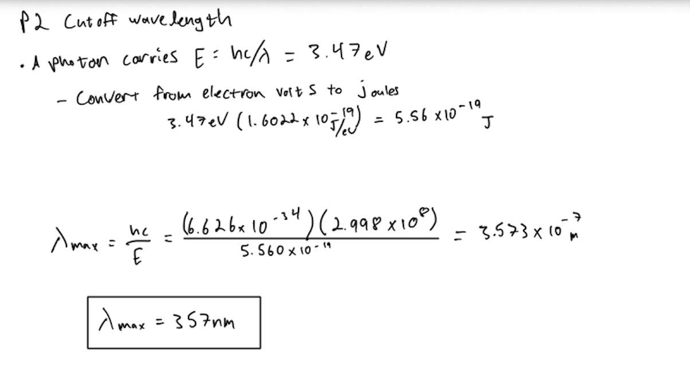
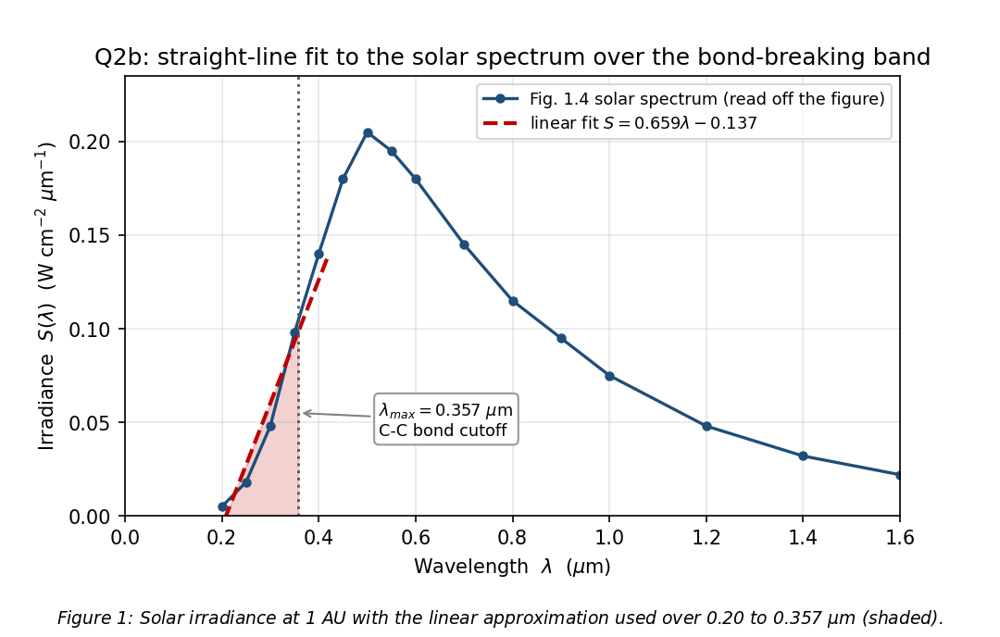
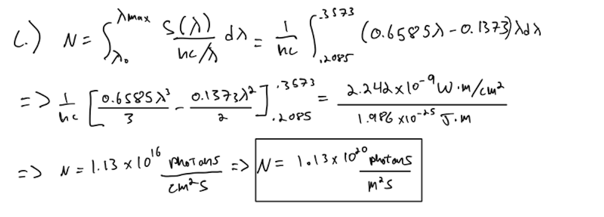
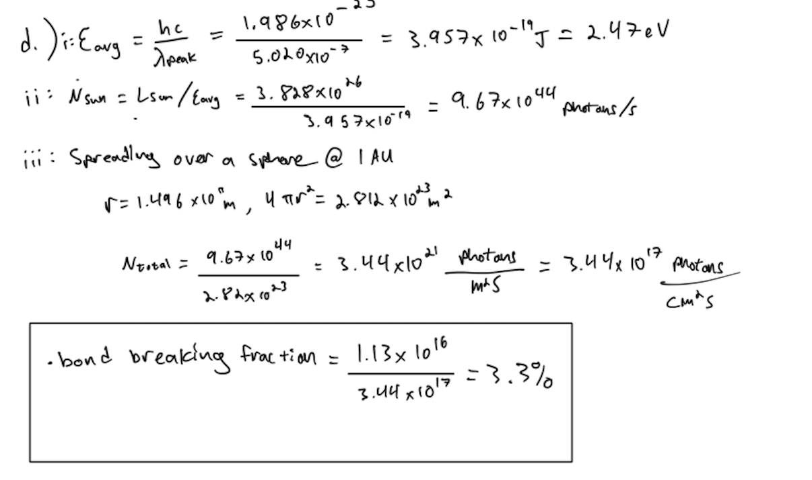
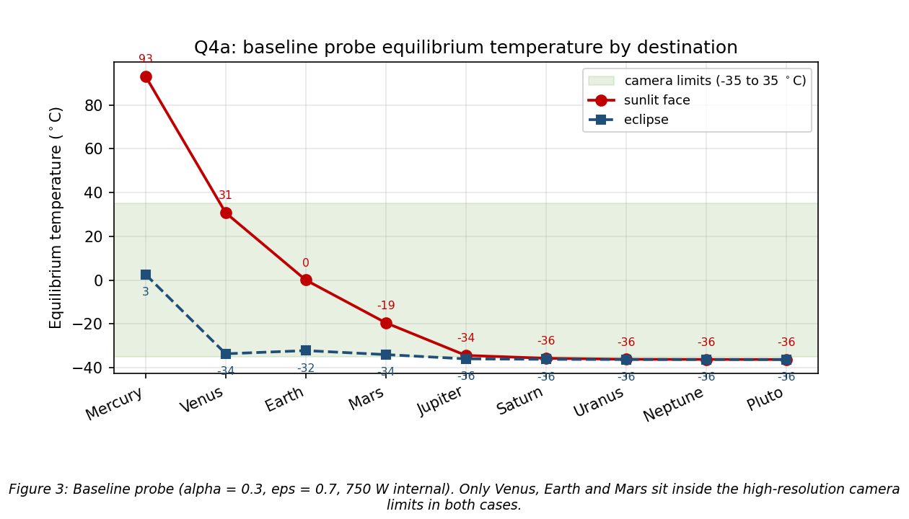
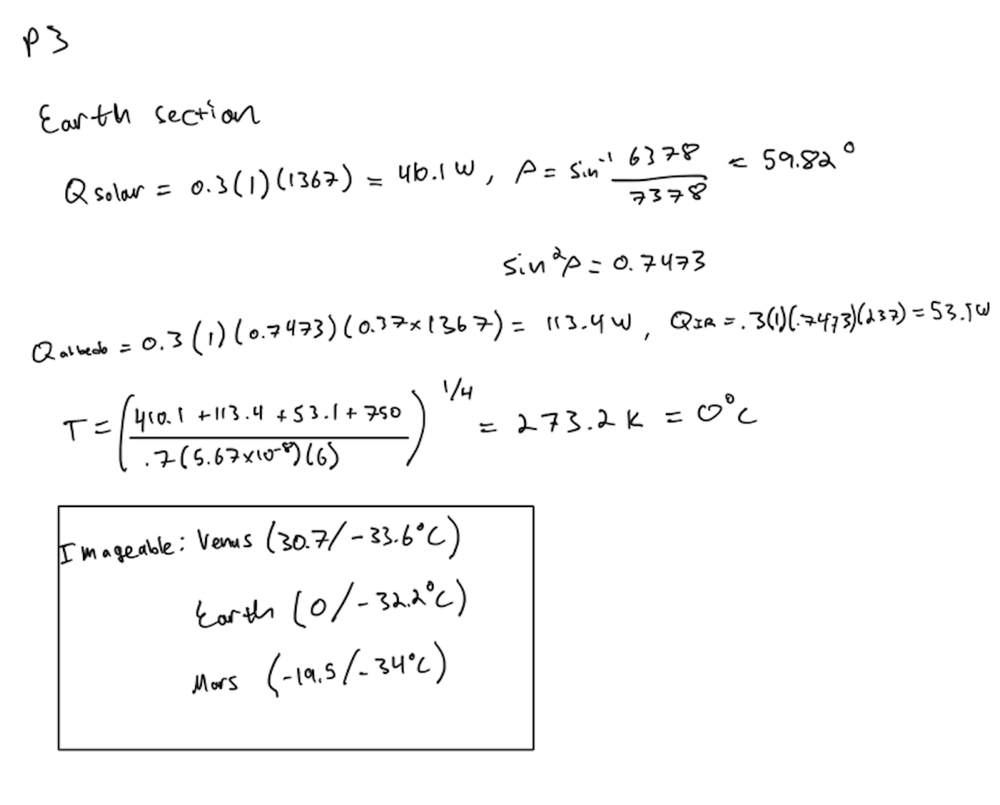
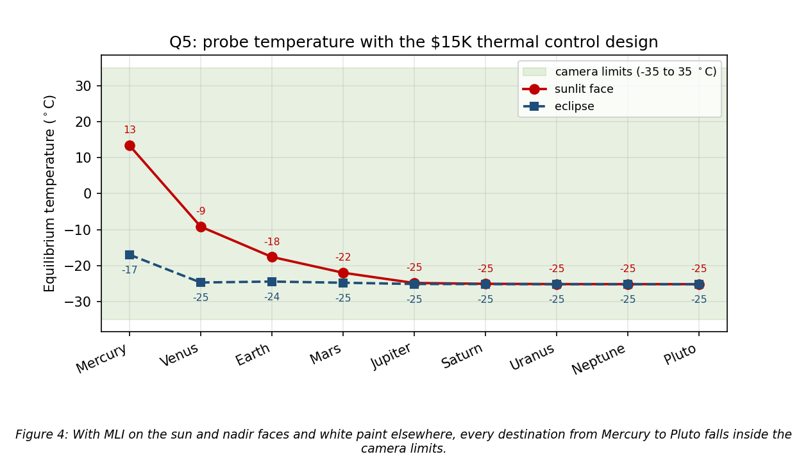
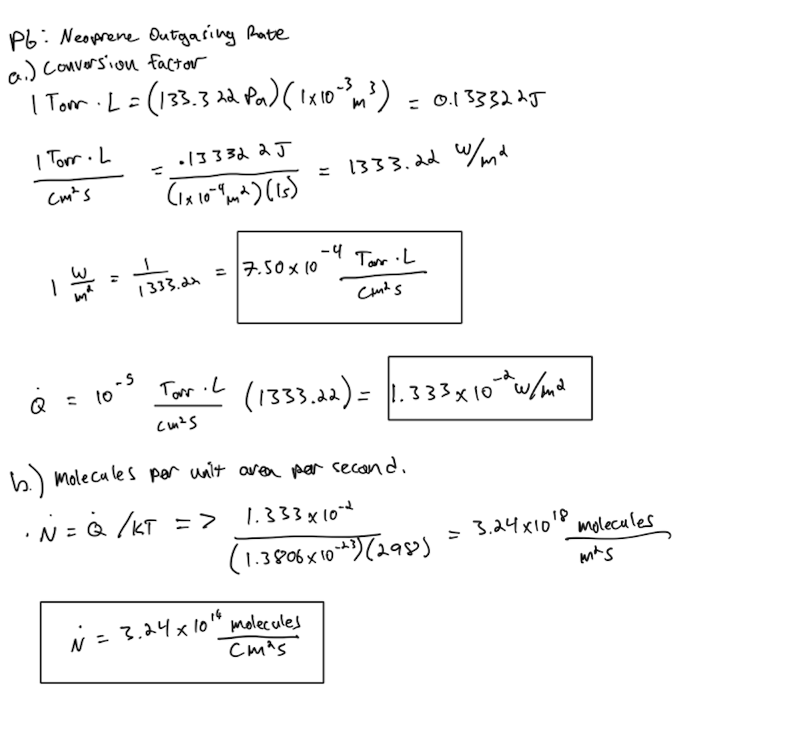
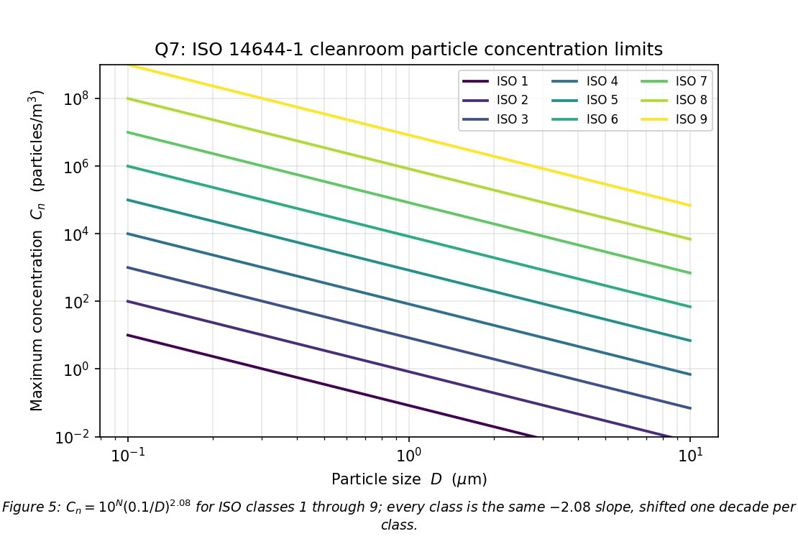
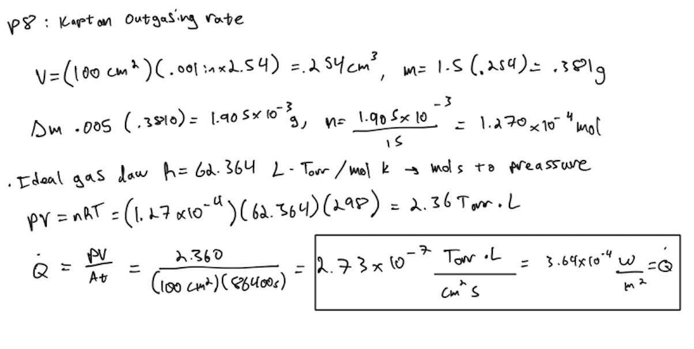

# SPCE 5065: Homework 6
**Vacuum environment: solar UV bond breaking, spacecraft thermal balance, outgassing, and contamination control**
**Author:** Jordan Clayton
**Date:** August 4, 2026

---


## Problem 1: Current Events Presentations

> *For each of the current events presentations this week: (a) summarize the presentation, (b) describe something you learned from it, (c) write one question you have left about the presentation.*

Four this week, all on the vacuum environment from different distances.

### (a) Garrett Kennedy: Cold Welding in the Vacuum Environment [1]

**Summary.** Garrett walked through cold welding as a materials problem rather than a vacuum problem. Clean metal surfaces in contact have no way to "know" they belong to separate pieces, so they bond with essentially no heat and very little pressure. On the ground that never happens because atmospheric oxygen keeps regrowing a thin oxide film, and that film is what makes two pieces of metal two pieces. In vacuum the film cannot regrow once it is scrubbed off. He then broke the exposure mechanisms into four categories (galling, bending, fretting, and impact), used the 1991 Galileo high-gain antenna as the on-orbit failure case where three ribs fretted and welded to their frame, and closed with mitigation: avoid metal-on-metal contact, and where you cannot, use dry lubricants, ceramic or polymer washers and barriers, and thick integrated coatings, with a cold welding database used to assess the risk of a given metal pair.

**What I learned.** Galling in a tight-fitting bolt is cold welding at sea level: the threads scrape oxide off faster than the trapped air restores it, which reframes vacuum as removing the repair mechanism rather than causing the bond.

**Question.** If thicker chemically integrated coatings are always better (parkerizing was the example), does a thick conversion coating on a deployable start losing to thermal expansion mismatch and spalling before it wins on cold welding margin?

### (b) Jordan Clayton: The Vacuum Environment and Cold Welding [2]

**Summary.** This one was mine. 

### (c) Nick Dankel: Designing for the Vacuum of Space [3]

**Summary.** Nick took the design-response angle. He set the pressure scale first (101 kPa at sea level, $10^{-6}$ to $10^{-9}$ Torr in LEO, below $10^{-12}$ Torr in deep space), then hit four effects: outgassing, cold welding, the loss of convection so that heat leaves only by radiation and moves internally only by conduction through mounted hardware, and radiation and atomic oxygen as effects that are not strictly vacuum but are enabled by it. The design responses were low outgassing material selection, vacuum bakeout before flight, vent paths so trapped gas cannot burst an enclosure during ascent, dry lubricants, and a passive-plus-active thermal control mix of blankets, radiators, and heat pipes backed by heaters, thermostats, and louvers. He closed on thermal vacuum testing as the step that validates the as-built thermal model.

**What I learned.** Someone left a screwdriver in a chamber before pumpdown, it outgassed plastic across the whole chamber, and cleanup took over a month, which reframes bakeout from a checklist item into facility protection.

**Question.** Ground chambers run at $10^{-6}$ to $10^{-7}$ Torr while deep space is below $10^{-12}$ Torr, so does that gap matter for qualification, or does the outgassing rate saturate once chamber pressure sits well below the material's own vapor pressure?

### (d) Paige Mauldin: Vacuum Environment and Spacecraft Design Considerations [4]

**Summary.** Paige used Blue Origin's Blue Moon MK1 lunar lander as the current event. NASA announced in May 2026 that the lander completed environmental testing in Chamber A at Johnson Space Center, which recreated vacuum plus hot and cold boundary conditions on real flight hardware. She grouped the risks into three buckets: thermal control, where the vehicle can still overheat because there is no air to carry heat away from electronics and batteries; outgassing and contamination, where even a thin deposited film degrades optics, radiators, and solar arrays; and pressure and material behavior, where trapped volumes need vent paths and seals, lubricants, adhesives, and mechanisms behave differently than they do on the ground. Her design responses were low outgassing materials, bakeout, vent paths, vacuum-compatible mechanisms, and thermal hardware, with thermal vacuum testing as the check that all of those choices work together.

**What I learned.** TVAC's job is to find the problem while the vehicle is still on the ground rather than to prove the vehicle works, which is exactly what happened when a Geiger counter failed during the UCCS High Altitude Space Platform TVAC run.

**Question.** Chamber A cannot reproduce lunar dust or one-sixth gravity, so for a lander specifically, how much of the thermal model stays unvalidated after a successful run?

---

## Problem 2: Bond-Breaking Solar Photons from the Measured Spectrum

> *Estimate the number of photons per second per unit area that Earth receives from the Sun with enough energy to sever a single C-C bond (bond energy 3.47 eV). (a) Find the maximum wavelength. (b) Make a linear approximation for $S(\lambda)$ over the waveband of interest. (c) Integrate $S(\lambda)/E_{photon}$ over that band. (d) What percentage of the Sun's photons is this? (i) find the average photon energy from the Sun's peak wavelength, (ii) use a solar luminosity of $3.828\times10^{26}$ W to get photons per second, (iii) convert and take the ratio. (e) Is this a significant risk for space applications?*

### (a) Cutoff wavelength

Since a photon carries $E = hc/\lambda$ (Lesson 6, Part 1, slide 9 [5]), the *longest* wavelength that still delivers 3.47 eV is the one where the photon energy equals the bond energy:

<p align="center"></p>

$$\boxed{\lambda_{max} = 0.357\ \mu\text{m} = 357\ \text{nm}}$$

Anything shorter than that breaks the bond, anything longer cannot. 

### (b) Linear approximation of $S(\lambda)$

The band runs from where the solar curve lifts off zero, about 0.20 $\mu$m, to the 0.357 $\mu$m cutoff. I read Tribble Fig. 1.4 [6] at 0.05 $\mu$m intervals across it (units there are W cm$^{-2}$ $\mu$m$^{-1}$) and least-squares fit a line:

$$\boxed{S(\lambda) \approx 0.6585\,\lambda - 0.1373 \quad \left[\text{W cm}^{-2}\ \mu\text{m}^{-1},\ \lambda\ \text{in}\ \mu\text{m}\right]}$$

The fit crosses zero at 0.2085 $\mu$m, so that is where the integral starts rather than 0.20, since a negative irradiance is not a thing. **Figure 1** shows it against the digitized curve.



The line integrates to 72.9 W/m$^2$ against 66.1 W/m$^2$ for a trapezoid on the digitized curve, about 10% high because the real curve is convex here and sags below the chord.

### (c) Photon count in the band

Dividing the irradiance by the per-photon energy $E = hc/\lambda$ puts a $\lambda$ in the numerator, so the integral is over $S(\lambda)\lambda$:

<p align="center"></p>

$$\boxed{N = 1.13\times10^{16}\ \frac{\text{photons}}{\text{cm}^2\,\text{s}} = 1.13\times10^{20}\ \frac{\text{photons}}{\text{m}^2\,\text{s}}}$$

The $10^{-6}$ converting the $\mu$m in the integral to metres for $hc$ is folded into the numerator above.

### (d) Fraction of the Sun's total photon output

Wien's displacement law with the Sun's effective temperature of 5772 K [7] puts the peak at $\lambda_{peak} = 0.502\ \mu$m, matching the peak of Fig. 1.4, and I treat the photon at that wavelength as the average one. Parts (i) through (iii) run as one chain, with $r = 1.496\times10^{11}$ m at 1 AU [7]:

<p align="center"></p>

$$\boxed{E_{avg} = 2.47\ \text{eV}, \quad \dot N_{sun} = 9.67\times10^{44}\ \text{s}^{-1}, \quad N_{total} = 3.44\times10^{17}\ \text{cm}^{-2}\text{s}^{-1}, \quad \text{fraction} = 3.3\%}$$

**Table 1:** Problem 2 results.

| Quantity | Value | Units |
|:---|---:|:---|
| C-C bond energy | 3.47 / $5.560\times10^{-19}$ | eV / J |
| Cutoff wavelength $\lambda_{max}$ | 0.357 | $\mu$m |
| Band irradiance (linear fit) | 72.9 | W/m$^2$ |
| Bond-breaking photon flux | $1.13\times10^{16}$ | photons/(cm$^2$ s) |
| Average photon energy | 2.47 | eV |
| Total solar photon output | $9.67\times10^{44}$ | photons/s |
| Total photon flux at 1 AU | $3.44\times10^{17}$ | photons/(cm$^2$ s) |
| Fraction able to break a C-C bond | 3.3 | % |

**Sanity check:** dividing the solar constant of 1367 W/m$^2$ [5] straight through by the same average photon energy, $1367/3.957\times10^{-19} = 3.45\times10^{21}$ photons/(m$^2$ s), reproduces the luminosity route to 0.4%, so the $4\pi r^2$ step did not get inverted.

### (e) Is this a significant risk?

Yes, and the flux number is why. $1.13\times10^{16}$ photons/cm$^2$/s is $3.6\times10^{23}$ per cm$^2$ per year of full sun, against roughly $10^{15}$ atoms in a square centimeter of surface: eight orders of magnitude of overkill, so every bond in the top monolayers gets hit many times over in year one.

- **Thermal control surfaces degrade first.** White paints and second-surface mirrors yellow, driving $\alpha/\epsilon$ up, and Lesson 6 gives $\Delta T \cong \frac{T}{4}\frac{\Delta(\alpha/\epsilon)}{(\alpha/\epsilon)}$ [5], so a 20% drift moves a 300 K radiator by 15 K. That is a design case, not a footnote.
- **Polymers are the vulnerable class.** Kapton, Mylar, and Teflon are single-bonded in the 1.5 to 3.7 eV range [5], and the Shuttle payload bay betacloth liners visibly darkened on orbit.
- **Optics and solar cells lose transmission** as coverglass and adhesives darken, which lands directly on end-of-life power.
- **It is a skin-depth effect.** UV stops in the first micron, so the fix is a sacrificial layer (fused silica coverglass, aluminized blanket outer layer, UV-stable topcoats), not more material.

Real, but a materials and coatings problem, and one of the few environmental effects you can design out almost completely on the ground.

---

## Problem 3: The Same Count from Planck's Law

> *Using the same assumptions but Planck's law: (a) approximate Fig. 1.4 with the blackbody law and plot to compare. (b) Re-estimate the photon count over the waveband. (c) How closely do the two answers agree? (d) Estimate the total photons/(s cm$^2$) the Earth receives and what percentage part b represents. (e) How does that compare to the Problem 2d estimate? (f) Which answer is more accurate and why?*

### (a) Blackbody fit to the solar spectrum

Planck's law gives the specific intensity, so to get irradiance at Earth I multiply by $\pi$ (integrating over the emission hemisphere) and by the solid-angle dilution $(R_{sun}/d)^2$:

$$S(\lambda) = \pi\,\frac{2hc^2/\lambda^5}{\exp(hc/\lambda k T)-1}\left(\frac{R_{sun}}{d}\right)^2, \qquad \left(\frac{R_{sun}}{d}\right)^2 = \left(\frac{6.957\times10^8}{1.496\times10^{11}}\right)^2 = 2.163\times10^{-5}$$

At $T = 5772$ K [7] this peaks at 0.178 W cm$^{-2}$ $\mu$m$^{-1}$ at 0.502 $\mu$m and integrates to 1357 W/m$^2$, which is the solar constant to 0.7%. **Figure 2** overlays it on Fig. 1.4.


The peak wavelength is dead on and the infrared tail tracks well, but the measured peak is nearer 0.21 and the blackbody sits high through the ultraviolet. Bumping to 6000 K matches the peak height (0.216) and then integrates to 1585 W/m$^2$, 16% more energy than the Sun delivers, so I kept 5772 K: getting the total right beats getting one point right.

### (b) Photon count over the band

Same integrand as Problem 2, done numerically from 0 to 0.357 $\mu$m:

$$N = \int_0^{\lambda_{max}} \frac{S(\lambda)\lambda}{hc}\,d\lambda = \boxed{1.59\times10^{16}\ \frac{\text{photons}}{\text{cm}^2\,\text{s}}}$$

The lower limit goes to zero here rather than 0.2085 $\mu$m, since Planck is valid all the way down, and starting at 0.2085 instead moves the answer 1.8%, so the two integrals cover the same band.

### (c) Agreement between the two methods

$1.59\times10^{16}$ against $1.13\times10^{16}$, so the blackbody runs **41% high**. One method is a line drawn through a figure by eye and the other assumes the Sun is a perfect emitter, so agreeing inside a factor of 1.5 is as good as this pair gets.

### (d) Total photon flux and the band fraction

Integrating the same blackbody over all wavelengths:

$$\boxed{N_{total} = 6.13\times10^{17}\ \frac{\text{photons}}{\text{cm}^2\,\text{s}}}, \qquad \frac{N_{band}}{N_{total}} = \boxed{2.6\%}$$

Equivalently the total is about 39 times the band. The mean photon energy that falls out of this is $1357/6.13\times10^{21} = 2.21\times10^{-19}$ J = 1.38 eV, or $2.78\,kT$, which is the textbook blackbody result of $2.70\,kT$ to within the numerics. That is the check that the total integral is right.

### (e) Comparison with the Problem 2d estimate

**Table 2:** The two routes to the same two numbers.

| Quantity | Linear fit + peak-energy method (Q2) | Planck integral (Q3) | Ratio |
|:---|---:|---:|---:|
| Bond-breaking flux (photons/cm$^2$/s) | $1.13\times10^{16}$ | $1.59\times10^{16}$ | 1.41 |
| Total photon flux (photons/cm$^2$/s) | $3.44\times10^{17}$ | $6.13\times10^{17}$ | 1.78 |
| Band as a fraction of total | 3.3% | 2.6% | 0.79 |

Problem 2d comes out **1.78 times low** on the total, and the reason is structural: it assigns every photon the energy of a 0.502 $\mu$m photon (2.47 eV), while the actual mean photon energy in a 5772 K spectrum is 1.38 eV. Dividing the same power by an energy that is 1.8 times too large gives 1.8 times too few photons. The peak of $S(\lambda)$ is not the average photon, it is where the *energy* density peaks, and the long infrared tail carries a lot of cheap photons.

### (f) Which is more accurate

It depends on which number you want:

- **For the total photon output, Planck wins.** It integrates the whole distribution instead of collapsing it to one wavelength, and it reproduces both the solar constant (0.7%) and the analytic $2.70\,kT$ mean photon energy, while the Problem 2d method carries a known 1.8x bias.
- **For the bond-breaking band, the measured spectrum wins.** The Sun is not a blackbody in the UV: its output there is depressed by absorption in the cooler upper photosphere and by line blanketing, which is the deviation visible in Figure 2 below 0.4 $\mu$m. Planck cannot know about that, so it overestimates exactly the photons this problem cares about.

So the bond-breaking flux is the Problem 2 number, $1.1\times10^{16}$ cm$^{-2}$ s$^{-1}$, taken as a fraction of the Planck total, about 1.8%.

---

## Problem 4: Equilibrium Temperature of the Eris Probe

> *A probe headed for Eris carries a high-resolution camera that must be kept between -35$^\circ$C and 35$^\circ$C. Find the equilibrium temperature at each planet and at Pluto, considering solar input, albedo, and planetary infrared. The probe is a 1 m cube with $\alpha = 0.3$ and $\epsilon = 0.7$, generates 750 W of internal heat, always has one side facing the Sun, and emits from all sides at the same rate. No modifications to the spacecraft are allowed. (a) Plot the equilibrium temperatures. (b) Recommend which planets to image.*

### Setup and assumptions

The balance is $Q_{solar} + Q_{albedo} + Q_{IR} + Q_{internal} = \epsilon\sigma A T^4$ (Lesson 6, Part 1, slide 28 [5]), with the individual terms from slides 29 and 30 [5]:

$$Q_{solar} = \alpha A S, \qquad Q_{albedo} = \alpha A \sin^2\!\rho \cdot (a_{geo} S), \qquad Q_{IR} = \alpha A \sin^2\!\rho \cdot F_{IR}, \qquad \sin\rho = \frac{R_p}{R_p + h}$$

Stated assumptions:

- **A 1000 km circular orbit at every body**, since no altitude is given. It only touches the albedo and IR terms, and only at the inner planets; sensitivity checked below.
- **One face takes the Sun, the opposite face takes albedo and planetary IR, all six radiate.** So $A_{in} = 1$ m$^2$ per source and $\epsilon A = 0.7 \times 6 = 4.2$ m$^2$ on the way out, which is what "all sides emit at the same rate" buys.
- **Albedo flux $= a_{geo} \times S$** per the note on the planetary albedo table [5], with $S = 1367/d_{AU}^2$ W/m$^2$.
- **Mean orbital distance**, Mercury's perihelion carried separately. Distances and radii from the NASA planetary fact sheets [8]; albedos and IR fluxes from the Lesson 6 planetary table [5], using the perihelion IR value for Mercury and Mars.
- **$\alpha$ on the IR term**, following the slide 30 form, and **the 750 W is heat, not electrical power**, as stated.

### (a) Results

**Table 3:** Baseline probe heat loads and equilibrium temperatures ($\alpha = 0.3$, $\epsilon = 0.7$, $Q_{int}$ = 750 W, $h$ = 1000 km). Albedos and IR fluxes from [5], distances and radii from [8].

| Body | $S$ (W/m$^2$) | $\sin^2\rho$ | $Q_{solar}$ (W) | $Q_{albedo}$ (W) | $Q_{IR}$ (W) | $T_{sun}$ ($^\circ$C) | $T_{eclipse}$ ($^\circ$C) | In limits? |
|:---|---:|---:|---:|---:|---:|---:|---:|:---:|
| Mercury | 9127.4 | 0.5031 | 2738.2 | 165.3 | 626.3 | **93.0** | 2.6 | no (hot) |
| Venus | 2615.1 | 0.7365 | 784.5 | 462.2 | 33.8 | 30.7 | -33.6 | yes |
| Earth | 1367.0 | 0.7473 | 410.1 | 113.4 | 53.1 | 0.0 | -32.2 | yes |
| Mars | 588.6 | 0.5963 | 176.6 | 30.5 | 29.0 | -19.5 | -34.0 | yes |
| Jupiter | 50.5 | 0.9720 | 15.1 | 5.0 | 3.9 | -34.4 | **-35.9** | no (cold) |
| Saturn | 15.0 | 0.9665 | 4.5 | 1.5 | 1.3 | -35.7 | -36.1 | no (cold) |
| Uranus | 3.7 | 0.9256 | 1.1 | 0.4 | 0.2 | -36.1 | -36.2 | no (cold) |
| Neptune | 1.5 | 0.9235 | 0.5 | 0.1 | 0.1 | -36.2 | -36.2 | no (cold) |
| Pluto | 0.9 | 0.2949 | 0.3 | 0.0 | 0.0 | -36.2 | -36.3 | no (cold) |



Earth worked out, so every row in the table is traceable:

<p align="center"></p>

**Verification:** re-running the table with the IR term weighted by $\epsilon$ = 0.7 instead of $\alpha$ (the Kirchhoff form) leaves the imageable set at Venus, Earth, and Mars, so the answer does not hinge on that convention.

**Sensitivity:** at Mercury perihelion (0.3075 AU [8]) the sunlit case hits 124.8$^\circ$C, so that planet is not marginal, it is hopeless. The other way, the internal 750 W alone sets a floor of -36.3$^\circ$C, which is why Jupiter through Pluto pile up within 2$^\circ$C of each other. The altitude assumption is irrelevant out there; the one place it bites is Venus, in part (b).

### (b) Recommendation

**Image Venus, Earth, and Mars. Skip Mercury, and skip Jupiter outward.**

- **Mercury is out by a wide margin**, 93$^\circ$C at mean distance and 125$^\circ$C at perihelion against a 35$^\circ$C limit, driven by 2738 W of absorbed sunlight plus 626 W of IR off a surface near 700 K.
- **Venus is the tightest keeper** at 30.7$^\circ$C, and it gets there despite sitting closer to the Sun than Earth because its 0.80 albedo bounces most of the sunlight away before it can be absorbed. Only 4.3$^\circ$C of margin, and it is the one body where the altitude assumption decides the answer: 35.0$^\circ$C at 300 km, 19.1$^\circ$C at 5000 km. I would want the real orbit before committing.
- **Earth and Mars are comfortable** in sunlight, and Mars at -34.0$^\circ$C in eclipse is a scheduling constraint (image in daylight), not a no-go.
- **Jupiter outward all fail cold** by only 1$^\circ$C to 1.3$^\circ$C, leaking slightly more heat than the electronics can replace.
- **Eris itself is unaffected**, since the low-resolution imager and cold-tolerant instruments are what operate there.

Five of the six failures miss by about a degree, so this is a thermal control problem rather than a mission-design one, which is Problem 5.

---

## Problem 5: \$15K Thermal Control Design

> *You have a budget of \$15K to design a thermal control system for the mission and a goal of imaging as many planets as possible along the way. You may pick from the given options (insulation $\epsilon$ = 0.05 at 0.3 kg/m$^2$, white paint $\epsilon$ = 0.85 / $\alpha$ = 0.252, black paint $\epsilon$ = 0.874 / $\alpha$ = 0.975, radiators $\epsilon$ = 0.8 at 0.6 kg/m$^2$, radiators with louvers $\epsilon$ = 0.05 to 0.8 at 2.1 kg/m$^2$ plus a 0.2 kg / 2 W controller per location, heaters at 0.025 kg/W) or research your own. Each kg of added mass adds \$25,000 to the mission cost.*

### The budget is the whole problem

$\$15{,}000 \div \$25{,}000/\text{kg} = 0.60$ kg. That is the whole design space, and it kills most of the option list before any physics happens:

**Table 4:** Options screened against the 0.60 kg mass allowance.

| Option | Mass | Cost | Verdict |
|:---|---:|---:|:---|
| Radiators with louvers, 1 m$^2$ | 2.1 + 0.2 = 2.30 kg | \$57,500 | 3.8x over budget. Out. |
| Radiators, 1 m$^2$ | 0.60 kg | \$15,000 | Fits, but raises $\epsilon$ and makes the cold cases worse. Wrong direction. |
| Heaters sized for the cold case | 16 W = 0.40 kg | \$10,000 | Fixes the outer planets at exactly -35$^\circ$C, zero margin, and does nothing for Mercury. |
| Black paint (any face) | negligible | \$0 | $\alpha = 0.975$ on the sun face. Cooks Mercury. Out. |
| **MLI on 2 faces + white paint on 4** | **0.60 kg** | **\$15,000** | **Selected.** |

Heaters are the tempting option and a trap: they buy the five outer bodies with zero margin, leave Mercury at 93$^\circ$C, and eat two thirds of the budget doing it. Louvers, the textbook answer for variable emissivity, are not remotely affordable here.

### Selected design

**Multilayer insulation on the sun-facing and nadir-facing faces (2 m$^2$, 0.6 kg, \$15,000), white paint on the other four faces (mass negligible, \$0).**

Two things happen at once, which is why it beats spending the same money on heaters:

1. **MLI on the two illuminated faces cuts the absorbed load.** No absorptivity is given for insulation, so I take $\alpha \approx \epsilon = 0.05$ (Kirchhoff, the same convention Lesson 6 applies to radiators [5]). At Mercury that drops $Q_{solar}$ from 2738 W to 456 W and $Q_{IR}$ from 626 W to 104 W.
2. **White paint on the other four faces sets the radiating capability.** With $\epsilon A = 4(0.85) + 2(0.05) = 3.50$ m$^2$, the hot and cold cases are locked in a fixed ratio, since $T_{hot}/T_{cold} = (Q_{hot}/Q_{cold})^{1/4}$ is emissivity-independent. Solving both limits at once, any side-face emissivity from 0.63 to 1.00 closes the design, and white paint's 0.85 sits inside that window with room on both ends.

**Table 5:** Bounding cases for the selected design. Every other body and case falls between these two extremes (**Figure 4**).

| Case | Absorbed + internal (W) | $T$ ($^\circ$C) | Margin |
|:---|---:|---:|---:|
| Mercury, sunlit, mean distance | 1338.3 | 13.4 | 21.6$^\circ$C to the hot limit |
| Mercury, sunlit, perihelion | 1620.8 | 27.5 | 7.5$^\circ$C to the hot limit |
| Mercury, eclipse | 854.4 | -17.0 | 18.0$^\circ$C to the cold limit |
| Pluto, sunlit or eclipse | 750.0 | -25.2 | 9.8$^\circ$C to the cold limit |



$$\boxed{\text{All nine bodies, Mercury through Pluto, sit inside }-35^\circ\text{C to }35^\circ\text{C. Cost }\$15{,}000\ (0.60\text{ kg}).}$$

**Emissivity range used:** 0.05 on the two MLI faces, 0.85 on the four painted faces, for an effective $\epsilon A$ of 3.50 m$^2$ against the baseline 4.20 m$^2$.

**Where this design is fragile:** everything at Mercury rides on the blanket's absorptivity, and the assignment table only gives insulation an emissivity. At $\alpha = 0.05$ Mercury lands at 13.4$^\circ$C, but a real blanket closed out with an aluminized Kapton outer layer ($\alpha \approx 0.14$) puts it back at 58$^\circ$C and off the list. So the design has a hard requirement attached to it: the outer layer has to be a low-$\alpha$ finish such as vapor-deposited aluminum, not just "some MLI." Nothing else in the trade is sensitive to that number, because past Venus there is no sunlight left to absorb.

### Why not the half-price version

Insulating only the sun face and white-painting the nadir face costs \$7,500 and passes every body at mean distance, Mercury included at 34.2$^\circ$C. It fails the moment Mercury nears perihelion: 47.5$^\circ$C. The second \$7,500 buys immunity to Mercury's 0.21 eccentricity, and solar distance is not a variable the mission gets to negotiate.

The uncomfortable part is that this consumes 100% of the budget with no cost reserve. If a reserve is mandatory, drop Mercury (the only body needing the nadir blanket), fly the \$7,500 version, and keep the other half. That trades one imaging target for 50% cost margin, which is a program call rather than a thermal one.

---

## Problem 6: Neoprene Outgassing Rate

> *An outgassing test of Neoprene showed an outgassing rate of $10^{-5}$ Torr-liter/(cm$^2$ s) at 298 K. (a) Show that the rate in W/m$^2$ can be expressed as $7.5\times10^{-4}$ Torr-liter/(cm$^2$ s). (b) Determine the number of molecules released per unit area per second in molecules/(cm$^2$ s).*

### (a) The conversion factor

A Torr-liter is a pressure times a volume, which is an energy, so a rate quoted in Torr-liter per cm$^2$ per second is already a power per unit area and the conversion is bookkeeping. Both parts are worked below:

<p align="center"></p>

$$\boxed{1\ \frac{\text{W}}{\text{m}^2} = 7.50\times10^{-4}\ \frac{\text{Torr}\cdot\text{L}}{\text{cm}^2\,\text{s}}, \qquad \dot{Q} = 1.333\times10^{-2}\ \text{W/m}^2}$$

That matches the $1.3332\times10^3$ conversion factor tabulated in Pisacane Table 10.2 [9].

### (b) Molecules per unit area per second

Same idea run backwards: each molecule carries $kT$ of pressure-volume energy, so $\dot N = \dot Q/kT$ (Pisacane Eq. 10.1 [9]), evaluated in the calculation above.

$$\boxed{\dot{N} = 3.24\times10^{14}\ \frac{\text{molecules}}{\text{cm}^2\,\text{s}}}$$

**Check:** Pisacane Table 10.2 lists a molecules-to-watts factor referenced to 296 K [9], which gives $3.26\times10^{14}$ molecules/(cm$^2$ s), 0.7% off mine and in the direction the 2 K temperature difference predicts.

---

## Problem 7: ISO 14644-1 Cleanroom Classes

> *Using the Lesson 3 equation for the maximum number of particles permitted for a given size, plot the maximum cleanroom particle concentration for each ISO classification. Use log-log axes.*

The ISO 14644-1 limit [10] is

$$C_n = 10^{N}\left(\frac{0.1\ \mu\text{m}}{D}\right)^{2.08}$$

with $N$ the class number (1 through 9) and $D$ the particle size in $\mu$m. On log-log axes this is a straight line of slope $-2.08$ for every class, with each class shifted up exactly one decade, which is what **Figure 5** shows.



**Table 6:** Spot checks against the tabulated ISO limits [9], [10].

| ISO class | $D$ ($\mu$m) | Computed (particles/m$^3$) | Tabulated |
|---:|---:|---:|---:|
| 1 | 0.1 | 10.0 | 10 |
| 3 | 0.2 | 236.5 | 237 |
| 5 | 0.5 | 3,517 | 3,520 |
| 7 | 0.5 | 351,676 | 352,000 |

Every check lands within rounding, which confirms the exponent and the 0.1 $\mu$m reference size are entered right. The shape differs from the textbook figure because that one is built on FED-STD-209E, where the class number was the count of $\geq$ 0.5 $\mu$m particles per cubic *foot* rather than a power-of-ten concentration per cubic metre.

---

## Problem 8: Kapton Outgassing Rate from an ASTM E-595 TML

> *An ASTM E-595-07 test showed that a 10 m x 10 cm specimen of 1 mil (0.001 inch) Kapton had a TML of 0.5%, with only the top side exposed. Determine the outgassing rate in Torr-liter/(cm$^2$ s). The mass density is 1.5 g/cm$^3$ and the molar mass of the outgassed products is 15 g/mol. State your assumptions.*

**Assumptions:**
- The specimen is 10 cm x 10 cm (the sheet reads "10 m x 10 cm", which would be a 100:1 aspect ratio strip and is inconsistent with a standard E-595 coupon). Exposed area is 100 cm$^2$ since only the top side vents. This reading turns out not to matter: the answer is a rate *per unit area*, and stretching one dimension by 10 scales the specimen mass and the exposed area by the same factor, so the 10 m version returns the identical number.
- **The full ASTM E-595 24 hour test duration** at $125^\circ$C and below $5\times10^{-5}$ Torr [9], [11], with the mass loss spread uniformly over that time.
- **The rate is referenced to 298 K**, matching Problem 6 and Pisacane's note that outgassing rates are conventionally quoted at room temperature [9]. The 125$^\circ$C alternative is carried below.
- All of the TML leaves as gas through the exposed face (no CVCM recapture), and the outgassed products behave as an ideal gas with $M$ = 15 g/mol.

**The chain,** with the ideal gas law ($R$ = 62.364 L-Torr/(mol K)) turning moles into the pressure-volume units the answer wants:

<p align="center"></p>

$$\boxed{\dot{Q} = 2.73\times10^{-7}\ \frac{\text{Torr}\cdot\text{L}}{\text{cm}^2\,\text{s}} = 3.64\times10^{-4}\ \frac{\text{W}}{\text{m}^2}}$$

**Check:** Pisacane Table 10.3 lists Kapton foil at $1\times10^{-4}$ W/m$^2$ [9], so a 0.5% TML coupon lands within a factor of four, the right neighborhood for a number driven by an assumed test duration. Referencing it to the 125$^\circ$C test temperature instead of 298 K gives $3.65\times10^{-7}$ Torr-L/(cm$^2$ s), a 34% swing, so the temperature has to travel with the number.

---

## Problem 9: Emerging Thermal Management Technology

> *Research an emerging spacecraft thermal management technology published or demonstrated within the last 10 years. Describe the underlying heat transfer mechanism and explain why it represents an improvement over conventional methods. Evaluate its advantages, limitations, current TRL, and suitability for a specific mission. Support your conclusions with at least three peer-reviewed or NASA/ESA references.*

**Technology: structurally embedded oscillating heat pipes (OHPs), flight-demonstrated by the AFRL ASETS-II experiment.**

### The mechanism

An oscillating heat pipe (or pulsating heat pipe) is a single capillary channel snaking between a hot end and a cold end, partially charged with a two-phase working fluid. The channel is narrow enough that surface tension beats gravity, so the fluid self-organizes into an alternating train of liquid slugs and vapor plugs. Heating one end grows the vapor plugs there while the cold end condenses them, and the pressure imbalance drives the train into self-sustained oscillation, moving heat two ways at once: latent heat in the evaporating and condensing plugs, and sensible heat carried bodily by the sloshing slugs [12]. The ASETS-II devices machined those channels straight into flat aluminum plates, so the heat spreader is the panel [13].

### Why it beats conventional hardware

- **No wick, so no capillary pumping limit.** A constant-conductance heat pipe is capped by how hard its wick can pull condensate back to the evaporator; an OHP's driving force is the vapor pressure imbalance it generates itself, which scales with the heat load rather than fighting it.
- **Effective conductivity one to two orders of magnitude above solid aluminum**, so a small radiator area can serve a concentrated hot spot [12].
- **The structure is the thermal path.** Conventional practice bolts heat pipes and doublers to a panel and pays in mass plus interface resistance at every joint; embedding removes both.
- **Orientation insensitivity**, which simplifies ground qualification: ASETS-II on-orbit data mirrored ground truth with negligible hysteresis [12].

### Advantages, limitations, TRL

**Advantages:** fully passive, with no moving parts, no power, and no controller; high heat flux in a thin plate; mass savings from multifunctional structure; and no long-duration degradation, with no measurable change in fluid or structure after 780 days on orbit [14].

**Limitations:** an OHP needs a minimum heat flux to start and sustain oscillation, so it is weakest at low power, exactly the cold-case regime. Performance depends on fill ratio, channel diameter (Bond number sets the upper bound), and working fluid, and the fluid pins the temperature range (ASETS-II flew butane and R-134a) [13]. There is no diode or variable-conductance behavior, so it cannot be shut off to trap heat in eclipse and heaters are still required. Embedding channels in a load-bearing panel couples thermal and structural qualification, with no repair path if a channel is compromised.

**TRL.** ASETS-II launched 7 September 2017 on X-37B OTV-5 and returned 27 October 2019 after 780 days, running three OHPs of differing configuration and fluid through periodic checkouts, thermal cycling, and six-week continuous tests [12], [14]. That is a full flight demonstration in the operational environment, so I put the flat-plate aluminum configuration at **TRL 7 to 8**, not 9: the 2024 NASA small spacecraft state-of-the-art report still catalogs OHPs as maturing rather than fielded [15].

### Mission suitability

The best fit is a **high-power-density smallsat, a 12U or ESPA-class RF or SAR payload**, where a few hundred watts dissipate from two or three hot components onto a body panel too small to spread it by conduction. That is exactly the pathology an OHP fixes: concentrated flux, tight volume, no mass for doublers and bolted heat pipes, and a structure that carries launch loads anyway. Poor fit for a cryogenic instrument (fluid-limited temperature range) or a low-power CubeSat that never reaches start-up flux. Worth noting against Problem 5: the Eris probe is emissivity-limited, not spreading-limited, so an OHP solves the opposite problem.

---

## Sources Cited

[1] Kennedy, G., "Cold Welding in the Vacuum Environment," SPCE 5065 Current Events Presentation, University of Colorado Colorado Springs, 23 July 2026.

[2] Clayton, J., "The Vacuum Environment: Cold Welding," SPCE 5065 Current Events Presentation, University of Colorado Colorado Springs, 23 July 2026.

[3] Dankel, N., "Designing for the Vacuum of Space," SPCE 5065 Current Events Presentation, University of Colorado Colorado Springs, 23 July 2026.

[4] Mauldin, P., "Vacuum Environment and Spacecraft Design Considerations," SPCE 5065 Current Events Presentation, University of Colorado Colorado Springs, 23 July 2026.

[5] "SPCE 5065 Vacuum Environment, Part 1: UV Radiation and Thermal Impacts," Lesson 6 lecture slides, University of Colorado Colorado Springs, 2026 (slide 9 bond energies, slides 28-30 energy balance, slide 31 planetary albedos and IR emissions, slide 32 $\alpha/\epsilon$ sensitivity, slides 42-43 thermal control mass estimates).

[6] Tribble, A. C., *The Space Environment: Implications for Spacecraft Design*, rev. ed., Princeton Univ. Press, Princeton, NJ, 2003, Fig. 1.4 (the solar spectrum).

[7] Williams, D. R., "Sun Fact Sheet," NASA Goddard Space Flight Center / NSSDCA, 2023, https://nssdc.gsfc.nasa.gov/planetary/factsheet/sunfact.html [retrieved 4 August 2026]. (Effective temperature 5772 K, radius $6.957\times10^8$ m.)

[8] Williams, D. R., "Planetary Fact Sheets," NASA Goddard Space Flight Center / NSSDCA, 2024, https://nssdc.gsfc.nasa.gov/planetary/factsheet/ [retrieved 4 August 2026]. (Mean orbital distances and planetary radii used in Table 3.)

[9] Pisacane, V. L., *The Space Environment and Its Effects on Space Systems*, 2nd ed., AIAA, Reston, VA, 2016, Chap. 10 (Eq. 10.1, Table 10.2 outgassing unit conversions, Table 10.3 typical outgassing rates, Eq. 10.4 and Table 10.6 cleanroom classification).

[10] International Organization for Standardization, "Cleanrooms and Associated Controlled Environments, Part 1: Classification of Air Cleanliness by Particle Concentration," ISO 14644-1:2015, Geneva, 2015.

[11] American Society for Testing and Materials, "Standard Test Method for Total Mass Loss and Collected Volatile Condensable Materials from Outgassing in a Vacuum Environment," ASTM E595-07, West Conshohocken, PA, 2007.

[12] Taft, B. S., and Irick, K. W., "ASETS-II Oscillating Heat Pipe Space Flight Experiment: The First Six Months on Orbit," *Frontiers in Heat and Mass Transfer*, Vol. 12, 2019, Paper 24. https://doi.org/10.5098/hmt.12.24

[13] Drolen, B. L., Wilson, C. A., Taft, B. S., Allison, J., and Irick, K. W., "Advanced Structurally Embedded Thermal Spreader Oscillating Heat Pipe Micro-Gravity Flight Experiment," *Journal of Thermophysics and Heat Transfer*, Vol. 36, No. 2, 2022, pp. 314-327. https://doi.org/10.2514/1.T6363

[14] Wilson, C. A., Miller, A., Drolen, B. L., Taft, B. S., and Allison, J., "Advanced Structurally Embedded Thermal Spreader Oscillating Heat Pipe: Postflight Hardware Analysis," *Journal of Thermophysics and Heat Transfer*, 2024. https://doi.org/10.2514/1.T6983

[15] NASA Ames Research Center, "State-of-the-Art Small Spacecraft Technology," NASA/TP-20250000142, Chap. 7 (Thermal Control), Moffett Field, CA, 2024, https://www.nasa.gov/smallsat-institute/sst-soa/thermal-control/ [retrieved 4 August 2026].

---

## Appendix: Python Solution Script

Everything numerical above comes out of `spce_5065_hw6_solution.py`, which also regenerates all five figures.

```python
"""SPCE 5065 -- Homework 6 solution.

Vacuum environment: solar UV photon flux, spacecraft thermal balance,
outgassing, and cleanroom classification.

  Q2  UV photons energetic enough to break a C-C bond (linear fit to Fig. 1.4)
  Q3  Same count from Planck's law, plus total solar photon output
  Q4  Equilibrium temperature of the Eris probe at every planet + Pluto
  Q5  $15K thermal control design trade
  Q6  Neoprene outgassing rate: Torr-L/(cm^2 s) -> W/m^2 -> molecules/(cm^2 s)
  Q7  ISO 14644-1 cleanroom particle concentration curves
  Q8  Kapton outgassing rate from an ASTM E-595 TML

Outputs:
  - Console tables reproducing every boxed number in the submission
  - figures/fig1_solar_spectrum_fit.png     (Q2b)
  - figures/fig2_planck_vs_measured.png     (Q3a)
  - figures/fig3_equilibrium_temps.png      (Q4a)
  - figures/fig4_thermal_design.png         (Q5)
  - figures/fig5_iso_cleanroom.png          (Q7)
"""
from __future__ import annotations

import sys
from pathlib import Path

import matplotlib.pyplot as plt
import numpy as np

# --------------------------------------------------------------------------
# Physical constants
# --------------------------------------------------------------------------
H_PLANCK = 6.626e-34            # J*s   (value given on the homework sheet)
C_LIGHT = 2.998e8               # m/s
K_B = 1.380649e-23              # J/K
SIGMA_SB = 5.67e-8              # W/(m^2 K^4)   Stefan-Boltzmann (Lesson 6)
EV_J = 1.602176634e-19          # J per eV
N_A = 6.02214076e23             # 1/mol
HC = H_PLANCK * C_LIGHT         # J*m
AU_M = 1.495979e11              # m
R_SUN = 6.957e8                 # m
L_SUN = 3.828e26                # W      (given)
T_SUN = 5772.0                  # K      effective photosphere temperature
S_EARTH = 1367.0                # W/m^2  solar flux at 1 AU (Lesson 6)
TORR_PA = 133.322               # Pa per Torr

FIG_DIR = Path(__file__).parent / "figures"

# Tribble Fig. 1.4 read off by eye: (wavelength um, irradiance W/cm^2/um)
FIG14 = np.array([
    [0.20, 0.0050], [0.25, 0.0180], [0.30, 0.0480], [0.35, 0.0980],
    [0.40, 0.1400], [0.45, 0.1800], [0.50, 0.2050], [0.55, 0.1950],
    [0.60, 0.1800], [0.70, 0.1450], [0.80, 0.1150], [0.90, 0.0950],
    [1.00, 0.0750], [1.20, 0.0480], [1.40, 0.0320], [1.60, 0.0220],
    [1.80, 0.0160], [2.00, 0.0120], [2.50, 0.0065], [3.00, 0.0038],
    [3.50, 0.0022], [4.00, 0.0014],
])


# --------------------------------------------------------------------------
# Q2 -- bond-breaking photons from a linear fit to the measured spectrum
# --------------------------------------------------------------------------
def lambda_max_for_bond(bond_eV: float) -> float:
    """Longest wavelength (m) whose photon still carries the bond energy."""
    return HC / (bond_eV * EV_J)


def linear_fit_band(lam_lo_um: float, lam_hi_um: float):
    """Least-squares line through the Fig. 1.4 points inside the waveband.

    Returns (slope, intercept) for S(lam) in W/cm^2/um with lam in um.
    """
    lam = FIG14[:, 0]
    s = FIG14[:, 1]
    # include an interpolated endpoint exactly at the band edge
    s_hi = np.interp(lam_hi_um, lam, s)
    mask = (lam >= lam_lo_um) & (lam <= lam_hi_um)
    x = np.append(lam[mask], lam_hi_um)
    y = np.append(s[mask], s_hi)
    slope, intercept = np.polyfit(x, y, 1)
    return slope, intercept


def photons_from_line(slope: float, intercept: float,
                      lam_lo_um: float, lam_hi_um: float) -> float:
    """N = (1/hc) * int S(lam) * lam dlam  ->  photons/(cm^2 s).

    S in W/cm^2/um, lam in um, so the integral carries units W*um/cm^2 and
    needs a 1e-6 factor to put the wavelength into metres for hc.
    """
    def anti(x):                       # integral of (m*lam + b)*lam dlam
        return slope * x ** 3 / 3.0 + intercept * x ** 2 / 2.0
    integral_um = anti(lam_hi_um) - anti(lam_lo_um)     # W*um/cm^2
    return integral_um * 1e-6 / HC                      # photons/(cm^2 s)


def q2() -> dict:
    print("=" * 74)
    print("Q2 -- UV photons capable of breaking a single C-C bond")
    print("=" * 74)
    bond_eV = 3.47
    lam_max = lambda_max_for_bond(bond_eV)
    lam_max_um = lam_max * 1e6
    print(f"  (a) E_bond = {bond_eV} eV = {bond_eV*EV_J:.4e} J")
    print(f"      lam_max = hc/E = {HC:.5e} / {bond_eV*EV_J:.4e} "
          f"= {lam_max:.4e} m = {lam_max_um:.4f} um")

    lam_lo = 0.20                       # um, where Fig. 1.4 lifts off zero
    slope, intercept = linear_fit_band(lam_lo, lam_max_um)
    lam_0 = -intercept / slope          # where the fitted line crosses zero
    lam_lo_eff = max(lam_lo, lam_0)     # never integrate a negative irradiance
    print(f"  (b) linear fit over {lam_lo}-{lam_max_um:.3f} um:")
    print(f"      S(lam) = {slope:.4f}*lam {intercept:+.5f}  W/cm^2/um")
    print(f"      crosses zero at {lam_0:.4f} um, so integrate "
          f"{lam_lo_eff:.4f} to {lam_max_um:.4f} um")
    print(f"      S({lam_max_um:.3f}) = {slope*lam_max_um+intercept:.5f} "
          f"W/cm^2/um")

    # energy in the band, straight line vs trapezoid on the digitized curve
    e_line = (slope / 2 * (lam_max_um ** 2 - lam_lo_eff ** 2)
              + intercept * (lam_max_um - lam_lo_eff))       # W/cm^2
    lam_d = np.linspace(lam_lo, lam_max_um, 400)
    e_curve = np.trapezoid(np.interp(lam_d, FIG14[:, 0], FIG14[:, 1]), lam_d)
    print(f"      band irradiance: line {e_line*1e4:6.2f} W/m^2  vs "
          f"digitized curve {e_curve*1e4:6.2f} W/m^2")

    n_band = photons_from_line(slope, intercept, lam_lo_eff, lam_max_um)
    print(f"  (c) N = (1/hc) int S*lam dlam = {n_band:.4e} photons/(cm^2 s)")
    print(f"                                = {n_band*1e4:.4e} photons/(m^2 s)")

    # (d) blackbody-style total photon output using the peak-wavelength energy
    lam_peak = 2.897771e-3 / T_SUN                          # Wien, m
    e_avg = HC / lam_peak
    n_dot_sun = L_SUN / e_avg
    area_sphere = 4 * np.pi * AU_M ** 2
    n_total_d = n_dot_sun / area_sphere                      # photons/(m^2 s)
    pct = 100 * n_band * 1e4 / n_total_d
    print(f"  (d.i)  lam_peak (Wien, T={T_SUN:.0f} K) = {lam_peak*1e6:.4f} um")
    print(f"         E_avg = hc/lam_peak = {e_avg:.4e} J = {e_avg/EV_J:.3f} eV")
    print(f"  (d.ii) N_sun = L/E_avg = {L_SUN:.4e}/{e_avg:.4e} "
          f"= {n_dot_sun:.4e} photons/s")
    print(f"  (d.iii) /(4*pi*r^2 = {area_sphere:.4e} m^2) "
          f"= {n_total_d:.4e} photons/(m^2 s)")
    print(f"          = {n_total_d/1e4:.4e} photons/(cm^2 s)")
    print(f"          bond-breaking fraction = {pct:.2f} %")

    # cross-check: total photon flux implied by the solar constant
    print(f"  [check] S_earth/E_avg = {S_EARTH/e_avg:.4e} photons/(m^2 s) "
          f"({100*(S_EARTH/e_avg)/n_total_d:.1f}% of the luminosity route)")
    return dict(lam_max_um=lam_max_um, slope=slope, intercept=intercept,
                n_band=n_band, n_total_d=n_total_d / 1e4, pct=pct,
                e_avg_eV=e_avg / EV_J, lam_lo=lam_lo_eff)


# --------------------------------------------------------------------------
# Q3 -- Planck's law
# --------------------------------------------------------------------------
def planck_irradiance_at_earth(lam_m: np.ndarray, T: float = T_SUN) -> np.ndarray:
    """Spectral irradiance at 1 AU (W/m^2/m) from a blackbody photosphere.

    E_lam = pi * B_lam(T) * (R_sun / d)^2
    """
    b_lam = (2 * H_PLANCK * C_LIGHT ** 2 / lam_m ** 5
             / (np.exp(HC / (lam_m * K_B * T)) - 1.0))
    return np.pi * b_lam * (R_SUN / AU_M) ** 2


def q3(q2res: dict) -> dict:
    print("=" * 74)
    print("Q3 -- same count from Planck's law")
    print("=" * 74)
    lam_max_um = q2res["lam_max_um"]

    # (a) shape check against Fig. 1.4
    lam = np.linspace(0.05e-6, 6.0e-6, 20000)
    e_lam = planck_irradiance_at_earth(lam)
    e_lam_fig = e_lam * 1e-6 * 1e-4                # W/m^2/m -> W/cm^2/um
    i_pk = int(np.argmax(e_lam_fig))
    total_flux = np.trapezoid(e_lam, lam)
    print(f"  (a) Planck peak {e_lam_fig[i_pk]:.4f} W/cm^2/um at "
          f"{lam[i_pk]*1e6:.4f} um   (Fig. 1.4 reads ~0.21 at ~0.50 um)")
    print(f"      integrated irradiance = {total_flux:.1f} W/m^2 "
          f"(solar constant 1367 W/m^2)")
    for t_alt in (6000.0,):
        e_alt = planck_irradiance_at_earth(lam, t_alt)
        pk = np.max(e_alt) * 1e-6 * 1e-4
        print(f"      [sensitivity] T = {t_alt:.0f} K matches the figure peak "
              f"({pk:.3f} W/cm^2/um) but integrates to "
              f"{np.trapezoid(e_alt, lam):.0f} W/m^2")

    # (b) photons in the bond-breaking band
    lam_b = np.linspace(1e-8, lam_max_um * 1e-6, 20000)
    n_band = np.trapezoid(planck_irradiance_at_earth(lam_b) * lam_b / HC, lam_b)
    n_band_cm = n_band / 1e4
    print(f"  (b) N(<{lam_max_um:.3f} um) = {n_band:.4e} photons/(m^2 s) "
          f"= {n_band_cm:.4e} photons/(cm^2 s)")

    lam_b2 = np.linspace(q2res["lam_lo"] * 1e-6, lam_max_um * 1e-6, 20000)
    n_b2 = np.trapezoid(planck_irradiance_at_earth(lam_b2) * lam_b2 / HC, lam_b2)
    print(f"      [check] starting the integral at {q2res['lam_lo']:.4f} um "
          f"instead of 0 changes it by {100*(n_b2-n_band)/n_band:+.2f}%")

    # (c) agreement with the Q2 linear-fit answer
    ratio = n_band_cm / q2res["n_band"]
    print(f"  (c) Planck / linear-fit = {ratio:.2f}x  "
          f"({q2res['n_band']:.3e} vs {n_band_cm:.3e} photons/(cm^2 s))")

    # (d) total photon flux from the same blackbody
    n_tot = np.trapezoid(e_lam * lam / HC, lam)
    n_tot_cm = n_tot / 1e4
    pct_band = 100 * n_band / n_tot
    e_mean = total_flux / n_tot
    print(f"  (d) N_total = {n_tot:.4e} photons/(m^2 s) "
          f"= {n_tot_cm:.4e} photons/(cm^2 s)")
    print(f"      mean photon energy = {e_mean:.4e} J = {e_mean/EV_J:.3f} eV "
          f"(= {e_mean/(K_B*T_SUN):.3f} kT)")
    print(f"      band is {pct_band:.2f} % of the blackbody photon total")

    # (e) versus the Q2(d) average-photon-energy estimate
    print(f"  (e) Q2(d) total {q2res['n_total_d']:.4e} vs Planck "
          f"{n_tot_cm:.4e} photons/(cm^2 s) -> "
          f"{n_tot_cm/q2res['n_total_d']:.2f}x")
    return dict(n_band=n_band_cm, n_tot=n_tot_cm, ratio=ratio,
                pct_band=pct_band, e_mean_eV=e_mean / EV_J,
                total_flux=total_flux, peak=e_lam_fig[i_pk],
                lam_peak_um=lam[i_pk] * 1e6)


# --------------------------------------------------------------------------
# Q4 / Q5 -- probe thermal balance
# --------------------------------------------------------------------------
#   name: (mean distance AU, radius km, geometric albedo, IR flux W/m^2)
PLANETS = {
    "Mercury": (0.387,  2439.7, 0.12, 4150.0),
    "Venus":   (0.723,  6051.8, 0.80,  153.0),
    "Earth":   (1.000,  6378.0, 0.37,  237.0),
    "Mars":    (1.524,  3389.5, 0.29,  162.0),
    "Jupiter": (5.203, 69911.0, 0.34,   13.5),
    "Saturn":  (9.537, 58232.0, 0.34,    4.6),
    "Uranus": (19.189, 25362.0, 0.34,    0.63),
    "Neptune": (30.070, 24622.0, 0.28,   0.52),
    "Pluto":  (39.482,  1188.3, 0.47,    0.5),
}

ALT_KM = 1000.0          # assumed circular parking orbit at every body
Q_INT = 750.0            # W, internal dissipation
A_FACE = 1.0             # m^2 per face
T_LO, T_HI = -35.0, 35.0  # deg C camera limits


def sin2_rho(radius_km: float, alt_km: float = ALT_KM) -> float:
    """sin^2(rho), rho = asin(R / (R + h))  -- Lesson 6 view-factor term."""
    return (radius_km / (radius_km + alt_km)) ** 2


def heat_loads(name: str, alpha_sun: float, alpha_nadir: float,
               perihelion_au: float | None = None) -> dict:
    """Absorbed external loads (W) on the sun face and the nadir face."""
    d_au, r_km, albedo, ir_flux = PLANETS[name]
    if perihelion_au is not None:
        d_au = perihelion_au
    s_flux = S_EARTH / d_au ** 2
    f = sin2_rho(r_km)
    q_solar = alpha_sun * A_FACE * s_flux
    q_albedo = alpha_nadir * A_FACE * f * (albedo * s_flux)
    q_ir = alpha_nadir * A_FACE * f * ir_flux
    return dict(s_flux=s_flux, sin2=f, q_solar=q_solar,
                q_albedo=q_albedo, q_ir=q_ir)


def t_equilibrium(q_in: float, eps_area: float) -> float:
    """Solve Q = eps*sigma*A*T^4 for T (K).  eps_area = sum(eps_i * A_i)."""
    return (q_in / (SIGMA_SB * eps_area)) ** 0.25


def q4() -> dict:
    print("=" * 74)
    print("Q4 -- equilibrium temperature of the baseline probe")
    print("=" * 74)
    alpha, eps = 0.3, 0.7
    eps_area = eps * 6 * A_FACE
    print(f"  alpha = {alpha}, eps = {eps}, 6 x 1 m^2 cube, Q_int = {Q_INT} W, "
          f"h = {ALT_KM:.0f} km")
    print(f"  {'Planet':9s} {'S(W/m2)':>9s} {'sin^2 rho':>9s} {'Qsol':>8s} "
          f"{'Qalb':>7s} {'Qir':>8s} {'T_sun(C)':>9s} {'T_ecl(C)':>9s} {'':>6s}")
    out = {}
    for name in PLANETS:
        h = heat_loads(name, alpha, alpha)
        q_hot = h["q_solar"] + h["q_albedo"] + h["q_ir"] + Q_INT
        q_cold = h["q_ir"] + Q_INT
        t_hot = t_equilibrium(q_hot, eps_area) - 273.15
        t_cold = t_equilibrium(q_cold, eps_area) - 273.15
        ok = "OK" if (T_LO <= t_cold and t_hot <= T_HI) else "NO"
        out[name] = (t_hot, t_cold, ok)
        print(f"  {name:9s} {h['s_flux']:9.2f} {h['sin2']:9.4f} "
              f"{h['q_solar']:8.1f} {h['q_albedo']:7.1f} {h['q_ir']:8.1f} "
              f"{t_hot:9.1f} {t_cold:9.1f} {ok:>6s}")

    hp = heat_loads("Mercury", alpha, alpha, perihelion_au=0.3075)
    t_p = t_equilibrium(hp["q_solar"] + hp["q_albedo"] + hp["q_ir"] + Q_INT,
                        eps_area) - 273.15
    print(f"  [sensitivity] Mercury at perihelion (0.3075 AU): "
          f"T_sun = {t_p:.1f} C")
    t_deep = t_equilibrium(Q_INT, eps_area) - 273.15
    print(f"  [floor] internal heat alone: T = {t_deep:.1f} C "
          f"(the outer-planet asymptote)")

    # altitude sensitivity at the marginal planet
    print("  [sensitivity] Venus sunlit case vs assumed orbit altitude:")
    d_au, r_km, albedo, ir_flux = PLANETS["Venus"]
    s_flux = S_EARTH / d_au ** 2
    for h in (300.0, 1000.0, 5000.0):
        f = (r_km / (r_km + h)) ** 2
        q = (alpha * s_flux + alpha * f * albedo * s_flux + alpha * f * ir_flux
             + Q_INT)
        print(f"      h = {h:6.0f} km: sin^2 rho = {f:.4f}, Q = {q:7.1f} W, "
              f"T = {t_equilibrium(q, eps_area)-273.15:5.1f} C")

    # Kirchhoff sensitivity: weight the planetary IR term by eps, not alpha
    print("  [sensitivity] IR term weighted by eps = 0.7 instead of alpha:")
    keep = []
    for name in PLANETS:
        h = heat_loads(name, alpha, alpha)
        q_ir_eps = h["q_ir"] * eps / alpha
        t_hot = t_equilibrium(h["q_solar"] + h["q_albedo"] + q_ir_eps + Q_INT,
                              eps_area) - 273.15
        t_cold = t_equilibrium(q_ir_eps + Q_INT, eps_area) - 273.15
        ok = T_LO <= t_cold and t_hot <= T_HI
        if ok:
            keep.append(name)
        print(f"      {name:9s} T_sun = {t_hot:7.1f} C   "
              f"T_ecl = {t_cold:7.1f} C   {'OK' if ok else 'NO'}")
    print(f"      imageable set: {', '.join(keep)} (unchanged)")
    return out


def q5() -> dict:
    print("=" * 74)
    print("Q5 -- $15K thermal control design")
    print("=" * 74)
    budget, cost_per_kg = 15_000.0, 25_000.0
    print(f"  budget {budget:,.0f} USD at {cost_per_kg:,.0f} USD/kg "
          f"-> {budget/cost_per_kg:.2f} kg of mass to spend")

    # --- option costs
    mli_cost = 2 * 0.3 * cost_per_kg
    louver_cost = 1 * (2.1 + 0.2) * cost_per_kg
    print(f"  MLI on 2 faces : 2 m^2 x 0.3 kg/m^2 = 0.60 kg = ${mli_cost:,.0f}")
    print(f"  louvers, 1 m^2 : (2.1 + 0.2) kg     = 2.30 kg = ${louver_cost:,.0f}"
          f"  ({louver_cost/budget:.1f}x budget)")

    # heater-only option: size for the deep-space cold case
    eps_area_base = 0.7 * 6
    q_need = SIGMA_SB * eps_area_base * (T_LO + 273.15) ** 4
    heater_w = q_need - Q_INT
    heater_cost = 0.025 * heater_w * cost_per_kg
    print(f"  heaters only   : need {heater_w:.1f} W to hold {T_LO:.0f} C "
          f"-> {0.025*heater_w:.2f} kg = ${heater_cost:,.0f} "
          f"(and Mercury still runs hot)")

    # --- selected design: MLI on sun + nadir faces, white paint elsewhere
    a_mli, e_mli = 0.05, 0.05
    e_white = 0.85
    eps_area = 4 * e_white * A_FACE + 2 * e_mli * A_FACE
    print(f"\n  selected: MLI (alpha=eps={e_mli}) on the sun and nadir faces, "
          f"white paint (eps={e_white}) on the other four")
    print(f"  sum(eps*A) = 4({e_white}) + 2({e_mli}) = {eps_area:.2f} m^2  "
          f"(baseline was {eps_area_base:.2f})")
    print(f"  {'Planet':9s} {'Qsol':>8s} {'Qalb':>7s} {'Qir':>8s} "
          f"{'T_sun(C)':>9s} {'T_ecl(C)':>9s} {'':>6s}")
    out = {}
    for name in PLANETS:
        h = heat_loads(name, a_mli, a_mli)
        q_hot = h["q_solar"] + h["q_albedo"] + h["q_ir"] + Q_INT
        t_hot = t_equilibrium(q_hot, eps_area) - 273.15
        t_cold = t_equilibrium(h["q_ir"] + Q_INT, eps_area) - 273.15
        ok = "OK" if (T_LO <= t_cold and t_hot <= T_HI) else "NO"
        out[name] = (t_hot, t_cold, ok)
        print(f"  {name:9s} {h['q_solar']:8.1f} {h['q_albedo']:7.1f} "
              f"{h['q_ir']:8.1f} {t_hot:9.1f} {t_cold:9.1f} {ok:>6s}")

    hp = heat_loads("Mercury", a_mli, a_mli, perihelion_au=0.3075)
    t_p = t_equilibrium(hp["q_solar"] + hp["q_albedo"] + hp["q_ir"] + Q_INT,
                        eps_area) - 273.15
    print(f"  [sensitivity] Mercury at perihelion: T_sun = {t_p:.1f} C")

    # the half-price variant that fails that sensitivity case
    eps_area_cheap = 0.05 + 0.85 + 4 * 0.7
    hc_ = heat_loads("Mercury", a_mli, 0.252, perihelion_au=0.3075)
    t_cheap = t_equilibrium(hc_["q_solar"] + hc_["q_albedo"] + hc_["q_ir"]
                            + Q_INT, eps_area_cheap) - 273.15
    print(f"  [rejected] 1 m^2 MLI variant ($7,500): Mercury perihelion "
          f"T_sun = {t_cheap:.1f} C")
    print(f"  cost: ${mli_cost:,.0f} of ${budget:,.0f} "
          f"({100*mli_cost/budget:.0f}% of budget), paint is mass-negligible")
    return out


# --------------------------------------------------------------------------
# Q6 / Q8 -- outgassing
# --------------------------------------------------------------------------
def q6() -> None:
    print("=" * 74)
    print("Q6 -- Neoprene outgassing")
    print("=" * 74)
    # (a) 1 Torr*L/(cm^2 s) in W/m^2
    j_per_torr_l = TORR_PA * 1e-3                     # J per Torr*litre
    w_per_m2 = j_per_torr_l / 1e-4                    # spread over 1 cm^2
    print(f"  (a) 1 Torr*L = {TORR_PA} Pa x 1e-3 m^3 = {j_per_torr_l:.6f} J")
    print(f"      1 Torr*L/(cm^2 s) = {j_per_torr_l:.6f} J / (1e-4 m^2 s) "
          f"= {w_per_m2:.2f} W/m^2")
    print(f"      inverting: 1 W/m^2 = {1/w_per_m2:.4e} Torr*L/(cm^2 s)")
    rate_torr = 1e-5
    rate_w = rate_torr * w_per_m2
    print(f"      so {rate_torr:.0e} Torr*L/(cm^2 s) = {rate_w:.4e} W/m^2")

    # (b) molecules per unit area per second
    T = 298.0
    n_dot = rate_w / (K_B * T)                        # molecules/(m^2 s)
    print(f"  (b) N = Q/(kT) = {rate_w:.4e}/({K_B:.6e} x {T:.0f}) "
          f"= {n_dot:.4e} molecules/(m^2 s)")
    print(f"      = {n_dot/1e4:.4e} molecules/(cm^2 s)")
    n_296 = rate_w * 2.4470e20
    print(f"  [check] Pisacane Table 10.2 factor at 296 K: "
          f"{n_296/1e4:.4e} molecules/(cm^2 s) "
          f"({100*(n_296-n_dot)/n_dot:+.1f}%)")


def q8() -> None:
    print("=" * 74)
    print("Q8 -- Kapton outgassing rate from an ASTM E-595 TML")
    print("=" * 74)
    side_cm = 10.0
    area_cm2 = side_cm * side_cm
    thick_cm = 0.001 * 2.54
    rho = 1.5                                  # g/cm^3
    tml = 0.005
    molar = 15.0                               # g/mol
    duration_s = 24 * 3600.0
    T = 298.0

    volume = area_cm2 * thick_cm
    mass = rho * volume
    dm = tml * mass
    print(f"  specimen {side_cm:.0f} x {side_cm:.0f} cm, t = {thick_cm:.5f} cm")
    print(f"  V = {volume:.4f} cm^3, m = {mass:.4f} g, "
          f"dm = 0.5% = {dm:.6f} g in {duration_s:.0f} s")

    moles = dm / molar
    # PV = nRT with R in Torr*L/(mol K)
    R_torr = 62.363577                         # L*Torr/(mol*K)
    pv = moles * R_torr * T                    # Torr*L
    q_torr = pv / (area_cm2 * duration_s)
    print(f"  n = {moles:.4e} mol -> PV = nRT = {pv:.4f} Torr*L")
    print(f"  Q = PV/(A t) = {q_torr:.4e} Torr*L/(cm^2 s)")

    w_per_m2 = TORR_PA * 1e-3 / 1e-4
    q_w = q_torr * w_per_m2
    print(f"    = {q_w:.4e} W/m^2   (Pisacane Table 10.3 lists Kapton foil "
          f"at 1e-4 W/m^2)")

    # equivalent route straight through Pisacane Eq. (10.2)
    m_dot = dm * 1e-3 / (area_cm2 * 1e-4 * duration_s)      # kg/(m^2 s)
    q_alt = m_dot * K_B * T * N_A * 1e3 / (molar)           # W/m^2
    print(f"  [check] Eq. 10.2 route: m_dot = {m_dot:.4e} kg/(m^2 s) -> "
          f"Q = {q_alt:.4e} W/m^2")
    q_hot = q_torr * 398.15 / T
    print(f"  [sensitivity] referenced to the 125 C test temperature: "
          f"{q_hot:.4e} Torr*L/(cm^2 s)")


# --------------------------------------------------------------------------
# Q7 -- cleanroom classes
# --------------------------------------------------------------------------
def iso_concentration(iso_class: float, d_um: np.ndarray) -> np.ndarray:
    """C_n = 10^N * (0.1/D)^2.08  particles per m^3  (ISO 14644-1)."""
    return 10.0 ** iso_class * (0.1 / d_um) ** 2.08


def q7() -> None:
    print("=" * 74)
    print("Q7 -- ISO 14644-1 cleanroom limits")
    print("=" * 74)
    checks = [(5, 0.5, 3520), (7, 0.5, 352000), (3, 0.2, 237), (1, 0.1, 10)]
    for n, d, book in checks:
        val = iso_concentration(n, np.array([d]))[0]
        print(f"  ISO {n}, D = {d} um: {val:10.1f} /m^3   "
              f"(tabulated {book:,})")


# --------------------------------------------------------------------------
# Figures
# --------------------------------------------------------------------------
def _caption(fig, text: str) -> None:
    fig.text(0.5, 0.012, text, ha="center", va="bottom",
             fontsize=9, style="italic", wrap=True)


def fig_solar_fit(q2res: dict) -> None:
    slope, intercept = q2res["slope"], q2res["intercept"]
    lam_max = q2res["lam_max_um"]
    fig, ax = plt.subplots(figsize=(7.2, 4.6))
    ax.plot(FIG14[:, 0], FIG14[:, 1], "o-", color="#1f4e79", ms=4, lw=1.6,
            label="Fig. 1.4 solar spectrum (read off the figure)")
    x = np.linspace(0.19, 0.42, 100)
    ax.plot(x, slope * x + intercept, "--", color="#c00000", lw=2,
            label=fr"linear fit $S={slope:.3f}\lambda{intercept:+.3f}$")
    band = np.linspace(q2res["lam_lo"], lam_max, 60)
    ax.fill_between(band, 0, slope * band + intercept, color="#c00000",
                    alpha=0.18)
    ax.axvline(lam_max, color="0.35", ls=":", lw=1.4)
    ax.annotate(fr"$\lambda_{{max}}={lam_max:.3f}\ \mu$m" "\nC-C bond cutoff",
                xy=(lam_max, 0.055), xytext=(42, -12),
                textcoords="offset points", fontsize=8.5,
                bbox=dict(boxstyle="round,pad=0.3", fc="white", ec="0.6"),
                arrowprops=dict(arrowstyle="->", color="0.5"))
    ax.set_xlim(0, 1.6)
    ax.set_ylim(0, 0.235)
    ax.set_xlabel(r"Wavelength  $\lambda$  ($\mu$m)")
    ax.set_ylabel(r"Irradiance  $S(\lambda)$  (W cm$^{-2}$ $\mu$m$^{-1}$)")
    ax.set_title("Q2b: straight-line fit to the solar spectrum over the "
                 "bond-breaking band")
    ax.grid(True, alpha=0.3)
    ax.legend(fontsize=8.5, loc="upper right")
    fig.subplots_adjust(bottom=0.19)
    _caption(fig, "Figure 1: Solar irradiance at 1 AU with the linear "
                  r"approximation used over 0.20 to 0.357 $\mu$m (shaded).")
    fig.savefig(FIG_DIR / "fig1_solar_spectrum_fit.png", dpi=150)
    plt.close(fig)


def fig_planck(q2res: dict) -> None:
    lam = np.linspace(0.1e-6, 3.0e-6, 2000)
    e_fig = planck_irradiance_at_earth(lam) * 1e-6 * 1e-4
    fig, ax = plt.subplots(figsize=(7.2, 4.6))
    ax.plot(lam * 1e6, e_fig, color="#c00000", lw=2,
            label=fr"Planck, $T={T_SUN:.0f}$ K, scaled by $(R_\odot/d)^2$")
    ax.plot(FIG14[:, 0], FIG14[:, 1], "o", color="#1f4e79", ms=4.5,
            label="Fig. 1.4 measured spectrum")
    ax.axvline(q2res["lam_max_um"], color="0.35", ls=":", lw=1.4)
    ax.annotate("blackbody runs high in the UV\n(no line blanketing)",
                xy=(0.30, 0.082), xytext=(38, 46),
                textcoords="offset points", fontsize=8.5,
                bbox=dict(boxstyle="round,pad=0.3", fc="white", ec="0.6"),
                arrowprops=dict(arrowstyle="->", color="0.5"))
    ax.set_xlim(0, 3.0)
    ax.set_ylim(0, 0.235)
    ax.set_xlabel(r"Wavelength  $\lambda$  ($\mu$m)")
    ax.set_ylabel(r"Irradiance  $S(\lambda)$  (W cm$^{-2}$ $\mu$m$^{-1}$)")
    ax.set_title("Q3a: Planck blackbody vs. the measured solar spectrum")
    ax.grid(True, alpha=0.3)
    ax.legend(fontsize=8.5)
    fig.subplots_adjust(bottom=0.19)
    _caption(fig, "Figure 2: A 5772 K blackbody reproduces the peak but "
                  "overshoots the ultraviolet, which is where the "
                  "bond-breaking photons live.")
    fig.savefig(FIG_DIR / "fig2_planck_vs_measured.png", dpi=150)
    plt.close(fig)


def _temp_plot(res: dict, title: str, caption: str, fname: str) -> None:
    names = list(res.keys())
    x = np.arange(len(names))
    t_hot = np.array([res[n][0] for n in names])
    t_cold = np.array([res[n][1] for n in names])
    fig, ax = plt.subplots(figsize=(8.4, 4.8))
    ax.axhspan(T_LO, T_HI, color="#70ad47", alpha=0.16,
               label=f"camera limits ({T_LO:.0f} to {T_HI:.0f} $^\\circ$C)")
    ax.plot(x, t_hot, "o-", color="#c00000", lw=1.8, ms=7, label="sunlit face")
    ax.plot(x, t_cold, "s--", color="#1f4e79", lw=1.8, ms=6, label="eclipse")
    for xi, th, tc in zip(x, t_hot, t_cold):
        ax.annotate(f"{th:.0f}", xy=(xi, th), xytext=(0, 9),
                    textcoords="offset points", fontsize=7.5, ha="center",
                    color="#c00000")
        ax.annotate(f"{tc:.0f}", xy=(xi, tc), xytext=(0, -14),
                    textcoords="offset points", fontsize=7.5, ha="center",
                    color="#1f4e79")
    ax.set_xticks(x)
    ax.set_xticklabels(names, rotation=25, ha="right")
    ax.set_ylabel(r"Equilibrium temperature ($^\circ$C)")
    ax.set_title(title)
    ax.grid(True, alpha=0.3)
    ax.legend(fontsize=8.5, loc="upper right")
    fig.subplots_adjust(bottom=0.28)
    _caption(fig, caption)
    fig.savefig(FIG_DIR / fname, dpi=150)
    plt.close(fig)


def fig_iso() -> None:
    d = np.logspace(np.log10(0.1), np.log10(10.0), 300)
    fig, ax = plt.subplots(figsize=(7.4, 5.0))
    cmap = plt.get_cmap("viridis")
    for n in range(1, 10):
        ax.loglog(d, iso_concentration(n, d), lw=1.8,
                  color=cmap((n - 1) / 8.0), label=f"ISO {n}")
    ax.set_xlabel(r"Particle size  $D$  ($\mu$m)")
    ax.set_ylabel(r"Maximum concentration  $C_n$  (particles/m$^3$)")
    ax.set_title("Q7: ISO 14644-1 cleanroom particle concentration limits")
    ax.grid(True, which="both", alpha=0.3)
    ax.legend(fontsize=8, ncol=3, loc="upper right")
    ax.set_ylim(1e-2, 1e9)
    fig.subplots_adjust(bottom=0.19)
    _caption(fig, r"Figure 5: $C_n = 10^N(0.1/D)^{2.08}$ for ISO classes 1 "
                  "through 9; every class is the same $-2.08$ slope, shifted "
                  "one decade per class.")
    fig.savefig(FIG_DIR / "fig5_iso_cleanroom.png", dpi=150)
    plt.close(fig)


# --------------------------------------------------------------------------
def main() -> None:
    sys.stdout.reconfigure(encoding="utf-8")
    FIG_DIR.mkdir(exist_ok=True)

    q2res = q2()
    print()
    q3res = q3(q2res)
    print()
    base = q4()
    print()
    design = q5()
    print()
    q6()
    print()
    q7()
    print()
    q8()

    fig_solar_fit(q2res)
    fig_planck(q2res)
    _temp_plot(base,
               "Q4a: baseline probe equilibrium temperature by destination",
               "Figure 3: Baseline probe (alpha = 0.3, eps = 0.7, 750 W "
               "internal). Only Venus, Earth and Mars sit inside the "
               "high-resolution camera limits in both cases.",
               "fig3_equilibrium_temps.png")
    _temp_plot(design,
               "Q5: probe temperature with the $15K thermal control design",
               "Figure 4: With MLI on the sun and nadir faces and white paint "
               "elsewhere, every destination from Mercury to Pluto falls "
               "inside the camera limits.",
               "fig4_thermal_design.png")
    fig_iso()
    print("\nFigures written to:", FIG_DIR)


if __name__ == "__main__":
    main()
```
