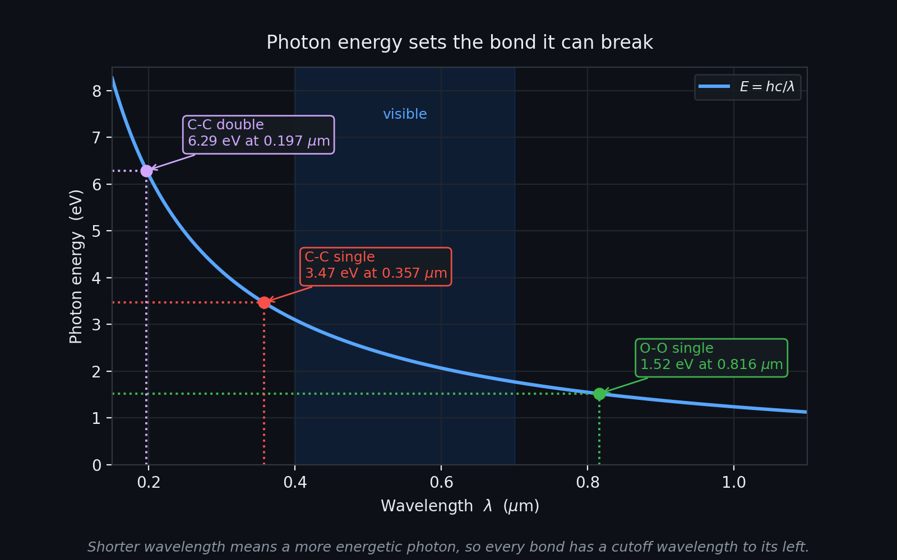
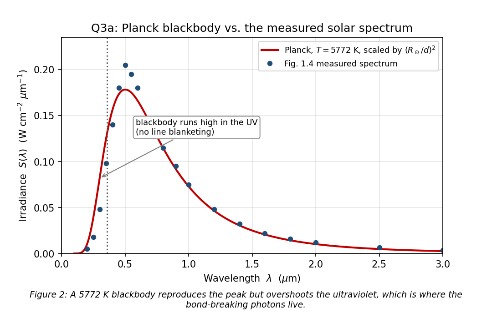
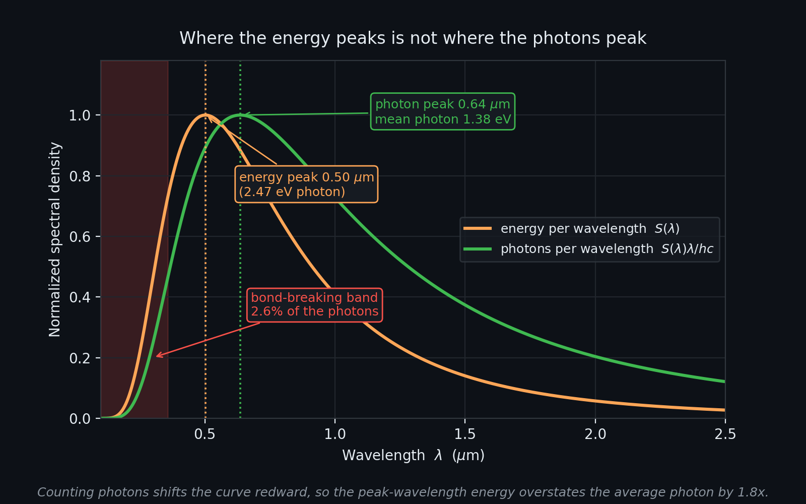
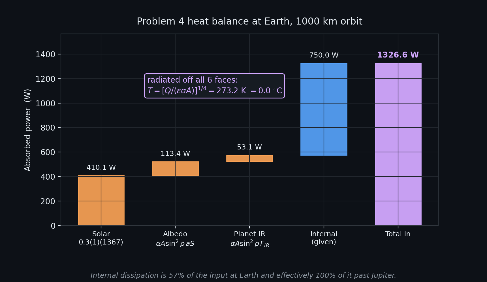
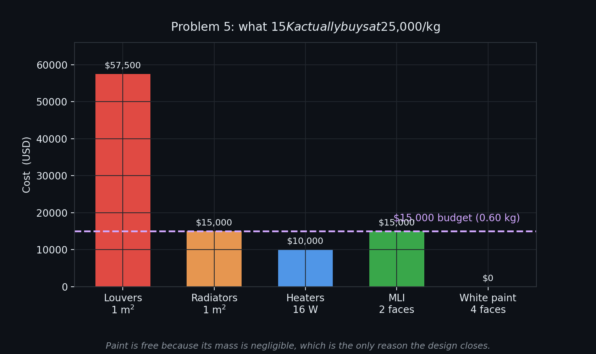
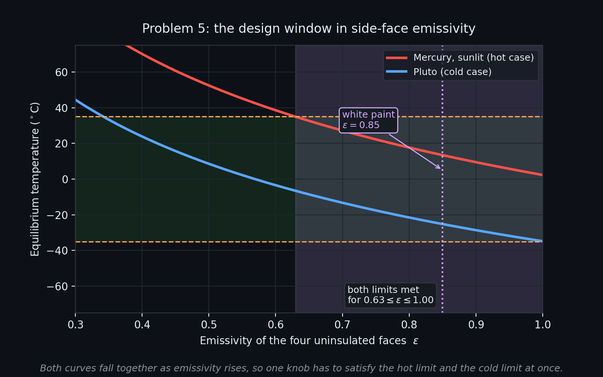

# SPCE 5065 HW #6: Socratic Solution Walkthrough
## The Vacuum Environment: UV Bond Breaking, Thermal Balance, Outgassing, and Contamination

---

## 30,000-Foot Overview

**The big question: if space is empty, why does it wreck spacecraft?**

The answer is that vacuum does not do anything by itself. It removes things: the air that filtered sunlight, the air that carried heat away, the oxygen that kept metal surfaces from sticking, and the pressure that kept trapped gas inside materials. This assignment works through what that removal costs, in four separate currencies.

**Problems 2 and 3 count sunlight one photon at a time.** Above the atmosphere, ultraviolet light arrives unfiltered, and a single UV photon carries enough energy to snap a carbon-carbon bond, which is what plastics and paints are made of. The job is to figure out how many such photons hit a square centimetre every second. Problem 2 does it by drawing a straight line through a measured graph of the Sun's spectrum; Problem 3 does it again by pretending the Sun is a perfect glowing sphere and using Planck's law. The two answers land within about 40% of each other, which is the real lesson: both methods are crude, and knowing *which* crudeness matters is the skill.

**Problems 4 and 5 are the same spacecraft, twice.** A probe on its way to Eris carries a camera that only works between -35 and +35 Celsius. Problem 4 asks what temperature the probe naturally settles at when it parks around each planet, balancing sunlight, sunlight bounced off the planet, the planet's own heat glow, and the 750 watts its own electronics dump inside. Three planets work and six do not. Problem 5 then hands over a budget of fifteen thousand dollars to fix that, and the twist is that at \$25,000 per kilogram, fifteen thousand dollars buys 600 grams of hardware. The entire design has to come out of paint and thin blankets.

**Problems 6 and 8 measure how fast materials leak.** In vacuum, gas trapped inside rubber and plastic slowly seeps out and lands on cold optics. The quantity engineers use for it is written in a strange unit (torr-liters per square centimetre per second) and the trick to both problems is realizing that pressure times volume is just energy, so the whole thing is really watts per square metre in disguise.

**Problem 7 is about keeping dirt off the hardware before launch,** since cleanrooms are graded by how many particles of each size float in a cubic metre, and one equation covers all nine grades.

**Problem 9 goes looking for what is new.** The assignment asks for a thermal technology demonstrated in the last decade, evaluated honestly, including what it is bad at.

### The thread

The chain runs: sunlight arrives unfiltered and breaks chemical bonds (Problems 2 and 3), which changes how surfaces absorb and emit heat, which feeds directly into the temperature balance that decides whether a camera works (Problems 4 and 5), while the materials chosen for those surfaces are themselves leaking gas onto everything else (Problems 6 and 8), which is why hardware is built in cleanrooms in the first place (Problem 7), and Problem 9 asks what the next generation of hardware does about the heat side of it. The single idea underneath all of it: in vacuum, radiation is the only way in and the only way out, so surface properties stop being cosmetic and become the design.

### How this connects to earlier work

HW1 established the inverse-square solar constant and per-planet irradiance, which is exactly the $S = 1367/d^2$ used nine times in Problem 4. HW2 covered atomic oxygen erosion of Kapton, the same material Problem 8 measures the outgassing of. HW5 introduced Poisson impact statistics and Whipple shielding; this assignment is the other half of the "what does the environment do to surfaces" story, this time by photons rather than particles.

---

## Problem 1: Current-Events Presentations

**Problem Statement:** For each of the current events presentations this week: (a) summarize the presentation, (b) describe something you learned from it, (c) write one question you have left.

**The punchline first:** Four talks, all on the vacuum environment from different distances: Garrett Kennedy on cold welding as a materials phenomenon, Jordan Clayton on cold welding as a failure-versus-tool story, Nick Dankel on the full design response, and Paige Mauldin on proving it all works in a thermal vacuum chamber.

The four tile the topic from mechanism to verification. The most useful single idea across all of them is the one Kennedy states most directly: **vacuum does not cause cold welding, it removes the repair mechanism.** Metals in contact always scrub each other's oxide off. On Earth the oxygen puts it back within milliseconds; in orbit it never comes back, so a joint that survives a million fretting cycles in a lab fails after a few thousand on orbit.

The second idea, from Clayton and reinforced by Mauldin, is diagnostic discipline: Galileo's antenna is genuinely a lubricant-loss-then-fretting failure, and Lucy's array was a lanyard, not a weld. "Vacuum sticking" is the explanation people reach for when the real cause is boring.

> **Key takeaway from Problem 1:** Every vacuum failure mode in this assignment is an *absence* failure: no oxygen means no oxide repair (cold welding), no atmosphere means no convection (thermal), no external pressure means trapped gas escapes (outgassing). The design response is always the same shape: substitute something that does the job the atmosphere used to do.

> **Feynman test (in plain English):** Space breaks things not by doing something to them, but by taking away the air that had quietly been fixing them the whole time.

---

## Problem 2: Bond-Breaking Photons from the Measured Spectrum

**Problem Statement:** Estimate the number of photons per second per unit area the Earth receives from the Sun with enough energy to sever a single C-C bond (3.47 eV). (a) Identify the maximum wavelength a photon may have and still break the bond. (b) Make a linear approximation for the solar irradiance $S(\lambda)$ over the waveband of interest. (c) Integrate $S(\lambda)$ divided by photon energy over that band. (d) What percentage of the Sun's photons is this, using (i) the average photon energy from the Sun's peak wavelength, (ii) a solar luminosity of $3.828\times10^{26}$ W, and (iii) the conversion by $4\pi r^2$. (e) Is this a significant risk for space applications?

**The punchline first:** The cutoff is 0.357 $\mu$m, and about $1.1\times10^{16}$ photons per square centimetre per second arrive above that energy, which is roughly 3% of all the photons the Sun sends. Three percent sounds small until you notice it is eight orders of magnitude more photons per year than there are atoms on the surface being hit.

| Part | Answer | Section |
|:---|:---|:---|
| (a) Cutoff wavelength | 0.357 $\mu$m | §2.1 |
| (b) Linear fit | $S = 0.6585\lambda - 0.1373$ W cm$^{-2}$ $\mu$m$^{-1}$ | §2.2 |
| (c) Photon flux in band | $1.13\times10^{16}$ /cm$^2$/s | §2.3 |
| (d) Fraction of solar photons | 3.3% | §2.4 |
| (e) Significant risk? | Yes, for surfaces | §2.5 |

---

### 2.1 (a) Turning a bond energy into a wavelength

**Before reading on, try this:** A single C-C bond takes 3.47 eV to break. Using $E = hc/\lambda$ with $h = 6.626\times10^{-34}$ J s and $c = 2.998\times10^8$ m/s, find the longest wavelength that still delivers that much energy. Remember to convert eV to joules first (1 eV $= 1.602\times10^{-19}$ J).

**The punchline:** $\lambda_{max} = 0.357\ \mu$m, right at the edge of the near ultraviolet.

**Derivation and Explanation:**

Light comes in indivisible packets. A photon either has enough energy to break the bond or it does not, and no number of weak photons adds up to one strong one. That is the whole reason wavelength matters here rather than intensity.

Start with the energy of one photon:

$$E = h f = \frac{hc}{\lambda}$$

where $h$ is Planck's constant (J s), $f$ is frequency (Hz), $c$ is the speed of light (m/s), and $\lambda$ is wavelength (m). The bond energy comes in electron volts, so convert:

$$E_{bond} = 3.47\ \text{eV} \times 1.602176634\times10^{-19}\ \frac{\text{J}}{\text{eV}} = 5.560\times10^{-19}\ \text{J}$$

Now solve for wavelength. Since $E$ and $\lambda$ are inversely related, the *threshold* energy corresponds to the *maximum* wavelength:

$$\lambda_{max} = \frac{hc}{E_{bond}} = \frac{(6.626\times10^{-34})(2.998\times10^{8})}{5.560\times10^{-19}} = \frac{1.986\times10^{-25}}{5.560\times10^{-19}} = 3.573\times10^{-7}\ \text{m} = 0.357\ \mu\text{m}$$

The grouped constant $hc = 1.986\times10^{-25}$ J m shows up in every part of Problems 2 and 3, so it is worth memorizing in the convenient form $hc = 1.24\ \text{eV}\cdot\mu\text{m}$. That form makes this problem a one-liner: $\lambda_{max} = 1.24/3.47 = 0.357\ \mu$m.

**Common Pitfall:** Forgetting the eV-to-joule conversion gives $\lambda = 5.7\times10^{-26}$ m, which is 18 orders of magnitude off and physically absurd (smaller than a proton). If an answer for a visible-light-adjacent problem does not land somewhere near a few tenths of a micron, the units broke.

**Reflection:** The same arithmetic explains why the weaker O-O single bond (1.52 eV) is vulnerable out to 0.816 $\mu$m, deep in the near infrared, which is why oxidized surfaces degrade under light that cannot touch a carbon backbone.

---

### 2.2 (b) Approximating the spectrum with a straight line

**Before reading on, try this:** Sketch the solar spectrum from memory: it rises steeply from near zero around 0.2 $\mu$m, peaks near 0.5 $\mu$m, and falls off slowly into the infrared. Now ask which part of that curve the band from 0.20 to 0.357 $\mu$m sits on, and whether a straight line through it will read high or low.

**The punchline:** $S(\lambda) \approx 0.6585\lambda - 0.1373$ in W cm$^{-2}$ $\mu$m$^{-1}$ with $\lambda$ in $\mu$m, valid over 0.209 to 0.357 $\mu$m.

**Derivation and Explanation:**

The waveband of interest has two edges. The right edge is the physics: 0.357 $\mu$m from §2.1. The left edge is practical: below about 0.20 $\mu$m the measured solar irradiance is essentially zero on the scale of this figure (it is roughly 0.1% of the peak), so including it adds nothing.

Reading the textbook figure at 0.05 $\mu$m intervals gives these points, in W cm$^{-2}$ $\mu$m$^{-1}$:

| $\lambda$ ($\mu$m) | 0.20 | 0.25 | 0.30 | 0.35 | 0.357 |
|---|---|---|---|---|---|
| $S(\lambda)$ | 0.005 | 0.018 | 0.048 | 0.098 | 0.104 |

A least-squares straight line through those five points gives slope 0.6585 and intercept $-0.1373$. Two things about that line deserve attention:

1. **It crosses zero at $\lambda = 0.1373/0.6585 = 0.2085\ \mu$m.** Below that the fit predicts negative irradiance, which is meaningless, so the integral in §2.3 starts at 0.2085 rather than 0.20. The difference is tiny because the irradiance there is tiny, but integrating a negative area would be an unforced error.
2. **It reads about 10% high.** Integrating the line over the band gives 72.9 W/m$^2$; running a trapezoid straight over the digitized curve gives 66.1 W/m$^2$. The real curve is convex (bending upward) in this region, so a chord drawn across it sits above it everywhere in between.

**Common Pitfall:** Fitting the line over the whole visible range instead of just the band of interest. The curve turns over at 0.5 $\mu$m, so a fit that includes the peak would have the wrong slope entirely and would badly underestimate the UV.

**Reflection:** The linear fit is a deliberate simplification of measured data, not a physical model, and its only job is to be integrable in closed form.

---

### 2.3 (c) Converting irradiance into a photon count

**Before reading on, try this:** You have $S(\lambda)$ in watts per unit area per unit wavelength, and you want photons per unit area per second. Each photon carries $hc/\lambda$ joules. Write down the integrand before looking, and note which way the $\lambda$ ends up.

**The punchline:** $N = 1.13\times10^{16}$ photons cm$^{-2}$ s$^{-1}$.

**Derivation and Explanation:**

Watts are joules per second. Dividing an energy flux by the energy per photon gives a photon flux, and the subtlety is that the energy per photon itself depends on wavelength:

$$N = \int_{\lambda_0}^{\lambda_{max}} \frac{S(\lambda)}{E_{photon}(\lambda)}\,d\lambda = \int_{\lambda_0}^{\lambda_{max}} \frac{S(\lambda)}{hc/\lambda}\,d\lambda = \frac{1}{hc}\int_{\lambda_0}^{\lambda_{max}} S(\lambda)\,\lambda\,d\lambda$$

Dividing by $hc/\lambda$ is multiplying by $\lambda/hc$, so the $\lambda$ migrates into the numerator. Physically this says that at longer wavelengths each photon is cheaper, so the same watt buys more of them.

Substituting the line from §2.2:

$$N = \frac{1}{hc}\int_{0.2085}^{0.3573} \left(0.6585\lambda - 0.1373\right)\lambda\,d\lambda = \frac{1}{hc}\int_{0.2085}^{0.3573} \left(0.6585\lambda^2 - 0.1373\lambda\right)d\lambda$$

$$= \frac{1}{hc}\left[\frac{0.6585\lambda^3}{3} - \frac{0.1373\lambda^2}{2}\right]_{0.2085}^{0.3573} = \frac{1}{hc}\left[0.2195\lambda^3 - 0.06865\lambda^2\right]_{0.2085}^{0.3573}$$

Evaluating at the upper limit: $0.2195(0.04561) - 0.06865(0.12766) = 0.010012 - 0.008764 = 0.001248$.
At the lower limit: $0.2195(0.009064) - 0.06865(0.04347) = 0.001990 - 0.002984 = -0.000994$.
Difference: $0.002242$ in units of W $\mu$m cm$^{-2}$.

Now the unit conversion that trips everyone. The integral carries $\mu$m because $\lambda$ was in microns, but $hc$ is in J m. Multiply by $10^{-6}$ m/$\mu$m:

$$N = \frac{0.002242 \times 10^{-6}\ \text{W}\cdot\text{m}\cdot\text{cm}^{-2}}{1.986\times10^{-25}\ \text{J}\cdot\text{m}} = 1.13\times10^{16}\ \frac{\text{photons}}{\text{cm}^2\,\text{s}}$$

**Common Pitfall:** Dividing by a single fixed photon energy (say the one at the band midpoint) instead of keeping $\lambda$ inside the integral. Over this narrow band that shortcut is only a few percent off, but the same shortcut applied to the full spectrum in Problem 3d is off by 78%, which is exactly the error Problem 3e is designed to expose.

**Reflection:** The area under $S(\lambda)$ is energy; the area under $S(\lambda)\lambda$ is photon count. They are different integrals of the same curve, and they peak at different wavelengths.

---

### 2.4 (d) The total photon output, the cheap way

**Before reading on, try this:** The Sun radiates $3.828\times10^{26}$ W. If you pretend every photon has the energy of a 0.502 $\mu$m photon, how many leave the Sun per second? Then spread that over a sphere of radius 1 AU ($1.496\times10^{11}$ m) to get the flux at Earth.

**The punchline:** $9.67\times10^{44}$ photons per second leave the Sun, giving $3.44\times10^{17}$ photons cm$^{-2}$ s$^{-1}$ at Earth, so the bond-breaking band is 3.3% of the total.

**Derivation and Explanation:**

**(i) The average photon energy.** Wien's displacement law states that a blackbody's spectral peak sits at

$$\lambda_{peak} = \frac{b}{T}, \qquad b = 2.898\times10^{-3}\ \text{m}\cdot\text{K}$$

With the Sun's effective temperature $T = 5772$ K:

$$\lambda_{peak} = \frac{2.898\times10^{-3}}{5772} = 5.020\times10^{-7}\ \text{m} = 0.502\ \mu\text{m}$$

which is exactly where the measured figure peaks, a nice independent confirmation that 5772 K is the right temperature to use. The photon at that wavelength carries

$$E_{avg} = \frac{hc}{\lambda_{peak}} = \frac{1.986\times10^{-25}}{5.020\times10^{-7}} = 3.957\times10^{-19}\ \text{J} = 2.47\ \text{eV}$$

**(ii) Photons per second.** Total power divided by energy per photon:

$$\dot{N}_{sun} = \frac{L_{sun}}{E_{avg}} = \frac{3.828\times10^{26}}{3.957\times10^{-19}} = 9.67\times10^{44}\ \text{photons/s}$$

**(iii) Flux at Earth.** Those photons stream outward through spheres of ever-increasing area. At 1 AU:

$$4\pi r^2 = 4\pi(1.496\times10^{11})^2 = 2.812\times10^{23}\ \text{m}^2$$

$$N_{total} = \frac{9.67\times10^{44}}{2.812\times10^{23}} = 3.44\times10^{21}\ \frac{\text{photons}}{\text{m}^2\text{s}} = 3.44\times10^{17}\ \frac{\text{photons}}{\text{cm}^2\text{s}}$$

$$\text{fraction} = \frac{1.13\times10^{16}}{3.44\times10^{17}} = 0.033 = 3.3\%$$

**A free check:** the solar constant is 1367 W/m$^2$, and $1367/3.957\times10^{-19} = 3.45\times10^{21}$ photons m$^{-2}$ s$^{-1}$, matching the luminosity route to 0.4%. That is not a coincidence, it is the same calculation with the $4\pi r^2$ already applied, and it confirms the sphere area was divided rather than multiplied.

**Common Pitfall:** Using the radius of the Sun instead of the Earth-Sun distance in $4\pi r^2$. That gives the flux at the Sun's *surface*, about 46,000 times larger.

**Reflection:** The peak of the spectrum is where the energy piles up, not where the typical photon lives, and §3.4 shows that difference is worth a factor of 1.8.

---

### 2.5 (e) Whether it matters

**The punchline:** Yes, but as a surface and coatings problem rather than a structural one.

$1.13\times10^{16}$ photons cm$^{-2}$ s$^{-1}$ times $3.156\times10^7$ s in a year is $3.6\times10^{23}$ bond-capable photons per square centimetre per year. A square centimetre of surface holds on the order of $10^{15}$ atoms. Every exposed bond gets hit something like $10^8$ times in the first year, so the question is never "will bonds break" but "what happens to the material once they do."

Four consequences, in the order a thermal engineer cares about them:

1. **The $\alpha/\epsilon$ ratio drifts.** White paints yellow and second-surface mirrors darken, raising absorptivity while emissivity barely moves. The lecture gives the sensitivity as $\Delta T \cong \frac{T}{4}\frac{\Delta(\alpha/\epsilon)}{(\alpha/\epsilon)}$, so a 20% drift moves a 300 K surface by 15 K. Problem 4 shows several planets sitting within 1 K of a limit, which makes 15 K a mission-ending number.
2. **Polymers embrittle.** Kapton, Mylar, and Teflon are all held together by single bonds in the 1.5 to 3.7 eV range, so all of them are inside the vulnerable window.
3. **Optical paths lose transmission** as coverglass adhesives darken, which shows up as end-of-life power loss on the solar array.
4. **It is a skin-depth effect.** UV is absorbed within roughly a micron, so the fix is a sacrificial or UV-stable outer layer, not thicker material.

> **Results for Problem 2**
> - **(a)** $\lambda_{max} = 0.357\ \mu$m
> - **(b)** $S(\lambda) = 0.6585\lambda - 0.1373$ W cm$^{-2}$ $\mu$m$^{-1}$, valid 0.209 to 0.357 $\mu$m
> - **(c)** $N = 1.13\times10^{16}$ photons cm$^{-2}$ s$^{-1}$
> - **(d)** $E_{avg} = 2.47$ eV, $\dot N_{sun} = 9.67\times10^{44}$ /s, $N_{total} = 3.44\times10^{17}$ cm$^{-2}$ s$^{-1}$, band fraction 3.3%
> - **(e)** Yes: a surface, coating, and thermal-property problem, mitigated on the ground by material selection

> **Key takeaway from Problem 2:** Photon energy is set by wavelength alone, so a bond has a hard cutoff wavelength and everything shorter can break it. Converting an energy spectrum to a photon count requires keeping $\lambda$ inside the integral, because cheaper photons come in greater numbers per watt.

> **Feynman test (in plain English):** Sunlight is a stream of tiny hammers of fixed sizes, and only the small fast ones hit hard enough to snap a molecule, so what matters is how many of those you get, not how bright the light looks.

---

## Problem 3: The Same Count from Planck's Law

**Problem Statement:** Using the same assumptions but Planck's law of blackbody radiation: (a) use it to approximate the textbook figure for $S(\lambda)$ and plot to compare. (b) Integrate $S(\lambda)$ divided by photon energy over the waveband to re-estimate Problem 2. (c) How closely do the two answers agree? (d) Estimate the total photons per second per cm$^2$ the Earth receives, and what percentage part (b) represents. (e) How does that compare to the Problem 2d estimate? (f) Which answer is more accurate and why?

**The punchline first:** Planck gives $1.59\times10^{16}$ bond-breaking photons cm$^{-2}$ s$^{-1}$, 41% above the measured-spectrum answer, and a total of $6.13\times10^{17}$ cm$^{-2}$ s$^{-1}$, 78% above the Problem 2d estimate. Both gaps have identifiable causes, and neither method is best at both jobs.

| Part | Answer | Section |
|:---|:---|:---|
| (a) Blackbody fit | $T = 5772$ K, peak 0.178 at 0.502 $\mu$m, 1357 W/m$^2$ total | §3.1 |
| (b) Band photon flux | $1.59\times10^{16}$ /cm$^2$/s | §3.2 |
| (c) Agreement | 41% high vs Problem 2 | §3.3 |
| (d) Total flux, band share | $6.13\times10^{17}$ /cm$^2$/s, band = 2.6% | §3.4 |
| (e) vs Problem 2d | 1.78x higher | §3.4 |
| (f) Which is more accurate | Depends on the question | §3.5 |

---

### 3.1 (a) Scaling Planck's law from the Sun's surface to Earth

**Before reading on, try this:** Planck's law gives *specific intensity* at the emitting surface, per unit solid angle. Two conversions stand between that and irradiance at Earth. Name both before reading on.

**The punchline:** $S(\lambda) = \pi B_\lambda(T)(R_{sun}/d)^2$, and at $T = 5772$ K it integrates to 1357 W/m$^2$.

**Derivation and Explanation:**

Planck's law in wavelength form is

$$B_\lambda(T) = \frac{2hc^2/\lambda^5}{\exp\!\left(\frac{hc}{\lambda k T}\right) - 1}$$

with units W m$^{-2}$ sr$^{-1}$ m$^{-1}$: power, per unit emitting area, per steradian of solid angle, per unit wavelength. Here $k = 1.381\times10^{-23}$ J/K is Boltzmann's constant. Two conversions are needed:

**Conversion 1, from intensity to surface flux.** A blackbody surface radiates into a hemisphere, and integrating a Lambertian emitter over that hemisphere multiplies by $\pi$ (not $2\pi$, because the projected area falls off as $\cos\theta$). So the flux leaving the photosphere is $\pi B_\lambda$.

**Conversion 2, from the Sun's surface to Earth's orbit.** The same total power crosses every sphere centred on the Sun, so flux falls as the ratio of areas:

$$\left(\frac{R_{sun}}{d}\right)^2 = \left(\frac{6.957\times10^{8}}{1.496\times10^{11}}\right)^2 = (4.651\times10^{-3})^2 = 2.163\times10^{-5}$$

That single factor is what turns a 63 MW/m$^2$ photosphere into a 1.4 kW/m$^2$ back yard.

**Choosing the temperature is the real modelling decision.** Two candidates:

| $T$ | Peak height (W cm$^{-2}$ $\mu$m$^{-1}$) | Peak wavelength | Integrated irradiance |
|---:|---:|---:|---:|
| 5772 K | 0.178 | 0.502 $\mu$m | 1357 W/m$^2$ |
| 6000 K | 0.216 | 0.483 $\mu$m | 1585 W/m$^2$ |
| Figure 1.4 | ~0.21 | ~0.50 $\mu$m | ~1367 W/m$^2$ |

6000 K matches the peak height better; 5772 K matches the total energy and the peak wavelength. Total energy wins, because it is the quantity that is actually measured to four digits (the solar constant) and because the Stefan-Boltzmann relation $\sigma T^4$ makes total flux scale as $T^4$, so a temperature chosen to match a peak height throws 16% of the energy away.

**Common Pitfall:** Leaving out the $\pi$, or using $2\pi$ for the hemisphere. Both produce a curve of the right shape but the wrong height, and the error hides because the shape still looks convincing.

**Reflection:** A single number, the effective temperature, reproduces the entire visible and infrared solar spectrum to within a few percent, which is why the blackbody approximation survives despite the Sun not being one.

---

### 3.2 (b, c) Re-counting the photons

**Before reading on, try this:** Look at Figure 2 in the submission. In the 0.2 to 0.357 $\mu$m band, does the blackbody curve sit above or below the measured points? Predict whether the Planck photon count will come out higher or lower than Problem 2's.

**The punchline:** $1.59\times10^{16}$ photons cm$^{-2}$ s$^{-1}$, 41% above Problem 2.

**Derivation and Explanation:**

The integrand is unchanged from §2.3, only $S(\lambda)$ is different:

$$N = \int_0^{\lambda_{max}} \frac{S(\lambda)\,\lambda}{hc}\,d\lambda$$

There is no closed form (the Planck function has an exponential in the denominator), so it is evaluated numerically. Two housekeeping notes:

- The lower limit is taken to 0 rather than 0.2085 $\mu$m, because Planck is valid everywhere and there is no negative-irradiance artifact to dodge. Starting at 0.2085 instead changes the answer by 1.8%, so the two integrals genuinely cover the same band.
- The answer is per m$^2$ from the SI integral and gets divided by $10^4$ for cm$^2$.

The 41% gap is not numerical error. It is the blackbody assumption failing in the ultraviolet, which is visible directly in the figure: the red curve runs above the blue measured points everywhere below 0.4 $\mu$m.

**Common Pitfall:** Concluding the two methods "disagree" and that one must be wrong. Two approximations landing within a factor of 1.5 of each other, built on completely different assumptions, is agreement.

**Reflection:** Both answers share the same first digit of the exponent, which for a first-order degradation estimate is the level of precision the physics supports.

---

### 3.3 (d, e) The total, and why the two totals differ by 1.8x

**Before reading on, try this:** The Sun delivers 1367 W/m$^2$. Problem 2d divided that by a 2.47 eV photon; Planck's spectrum has a mean photon energy of $2.70\,kT$. Compute $2.70\,kT$ at 5772 K in eV and predict the ratio between the two photon counts before reading on.

**The punchline:** $N_{total} = 6.13\times10^{17}$ cm$^{-2}$ s$^{-1}$, the band is 2.6% of it, and Problem 2d's total was low by a factor of 1.78.

**Derivation and Explanation:**

Integrating the same photon integrand over all wavelengths gives $6.13\times10^{21}$ photons m$^{-2}$ s$^{-1}$. The band from §3.2 is

$$\frac{1.59\times10^{16}}{6.13\times10^{17}} = 2.6\%$$

Working backwards from that total gives the mean photon energy directly:

$$\bar{E} = \frac{1357\ \text{W/m}^2}{6.13\times10^{21}\ \text{photons m}^{-2}\text{s}^{-1}} = 2.21\times10^{-19}\ \text{J} = 1.38\ \text{eV}$$

Expressed in thermal units, $\bar{E}/kT = 2.21\times10^{-19}/(1.381\times10^{-23} \times 5772) = 2.78$, matching the analytic blackbody result $\bar{E} = 2.70\,kT$ to within the numerical integration error. That agreement is the check that the total integral is right.

Now the discrepancy resolves cleanly. Problem 2d assumed every photon carries 2.47 eV (the energy at the *energy* peak). The true mean is 1.38 eV. Dividing the same power by an energy $2.47/1.38 = 1.79$ times too large yields 1.79 times too few photons, which is exactly the observed 1.78 ratio.

The figure makes the mechanism visual: multiplying by $\lambda$ to convert energy into counts drags the distribution redward, moving the peak from 0.50 $\mu$m to 0.64 $\mu$m and pulling the average photon down to 1.38 eV. The infrared tail is full of cheap photons that contribute little energy but a great many counts.

**Common Pitfall:** Treating $\lambda_{peak}$ from Wien's law as "the average wavelength." It is neither the mean nor the median of the photon distribution; it is the argmax of the energy density.

**Reflection:** Any time a quantity is converted from "per unit energy" to "per unit count," the weighting changes and so does the peak.

---

### 3.4 (f) Which number to trust

**The punchline:** Planck for the total, the measured spectrum for the ultraviolet band.

The two methods fail in different places, and the honest answer names both:

- **Planck wins on the total.** It integrates the entire distribution instead of collapsing it to a single wavelength, and it self-validates twice (it reproduces the solar constant to 0.7% and the analytic $2.70\,kT$ mean photon energy). The Problem 2d method has a quantifiable 1.78x bias.
- **The measured spectrum wins on the UV band.** The Sun is not a blackbody at short wavelengths. Its ultraviolet output is suppressed by absorption in the cooler upper photosphere and by the thicket of overlapping metal absorption lines known as line blanketing. Planck's law has no mechanism to represent either, so it overestimates precisely the photons this problem is about.

So the defensible pair of answers is $1.1\times10^{16}$ cm$^{-2}$ s$^{-1}$ for the bond-breaking flux (Problem 2) as a fraction of $6.13\times10^{17}$ cm$^{-2}$ s$^{-1}$ total (Problem 3), or about 1.8%.

> **Results for Problem 3**
> - **(a)** $T = 5772$ K; peak 0.178 W cm$^{-2}$ $\mu$m$^{-1}$ at 0.502 $\mu$m; integrates to 1357 W/m$^2$
> - **(b)** $1.59\times10^{16}$ photons cm$^{-2}$ s$^{-1}$
> - **(c)** 41% above the Problem 2 answer, same order of magnitude
> - **(d)** $6.13\times10^{17}$ photons cm$^{-2}$ s$^{-1}$ total; the band is 2.6% of it
> - **(e)** Problem 2d's total is low by 1.78x, traceable to using 2.47 eV instead of the true 1.38 eV mean
> - **(f)** Planck for totals, measured spectrum for the UV band

> **Key takeaway from Problem 3:** A blackbody at 5772 K reproduces the Sun's total output and peak wavelength but overshoots the ultraviolet, because real stellar atmospheres absorb their own short-wavelength light. Choose the model to match the quantity being asked for, not the one that looks more rigorous.

> **Feynman test (in plain English):** A perfectly glowing ball is a great stand-in for the Sun overall, but the Sun's own outer layers eat some of its ultraviolet on the way out, so the stand-in always promises more sunburn than you actually get.

---

## Problem 4: Equilibrium Temperature of the Eris Probe

**Problem Statement:** A probe headed for Eris carries a high-resolution camera that must stay between $-35^\circ$C and $35^\circ$C. Find the equilibrium temperature at each planet and at Pluto, considering solar input, albedo, and planetary infrared. The probe is a 1 m cube, $\alpha = 0.3$, $\epsilon = 0.7$, generating 750 W internally, with one side always facing the Sun and all sides emitting at the same rate. No modifications allowed. (a) Plot the equilibrium temperatures. (b) Recommend which planets to image.

**The punchline first:** Only Venus, Earth, and Mars land inside the camera's range. Mercury is 93$^\circ$C (too hot) and everything from Jupiter outward sits at about $-36^\circ$C, failing the cold limit by roughly one degree because the probe's own 750 W is the only heat source left out there.

| Part | Answer | Section |
|:---|:---|:---|
| (a) Temperatures | Table and Figure 3 in the submission | §4.1 to §4.3 |
| (b) Recommendation | Venus, Earth, Mars | §4.4 |

---

### 4.1 The energy balance, term by term

**Before reading on, try this:** List every way heat can enter a spacecraft parked in orbit around a planet, and every way it can leave. In vacuum there are only two transport mechanisms available at the boundary, and one of them is unavailable. Which?

**The punchline:** Four in, one out. $Q_{solar} + Q_{albedo} + Q_{IR} + Q_{internal} = \epsilon\sigma A T^4$.

**Derivation and Explanation:**

Convection needs a fluid and there is none. Conduction needs contact and the probe touches nothing. **Radiation is the only path across the boundary in either direction,** which is what makes this a solvable algebra problem instead of a fluid dynamics problem.

The four inputs:

**1. Direct solar.** The sunlit face absorbs a fraction $\alpha$ of what lands on it:

$$Q_{solar} = \alpha\,A\,S, \qquad S = \frac{1367\ \text{W/m}^2}{d_{AU}^2}$$

The inverse-square law is the same one from HW1. $A = 1$ m$^2$ because only one face sees the Sun.

**2. Albedo.** Sunlight bounced off the planet. Two modifiers apply. First, the planet reflects only a fraction $a_{geo}$ of what hits it, so the flux leaving the planet is $a_{geo}S$. Second, the planet does not fill the probe's sky; it subtends a cone of half-angle $\rho$ where

$$\sin\rho = \frac{R_p}{R_p + h}$$

The view factor for a flat plate facing a sphere is $\sin^2\rho$, which runs from 1 when hugging the surface to 0 at infinity:

$$Q_{albedo} = \alpha\,A\,\sin^2\!\rho\;(a_{geo}S)$$

**3. Planetary infrared.** The planet is warm and glows in the thermal infrared regardless of sunlight, so this term survives eclipse:

$$Q_{IR} = \alpha\,A\,\sin^2\!\rho\;F_{IR}$$

**4. Internal.** 750 W of electronics waste heat, present always. The problem says heat, not power, so no 10% conversion is applied.

The single output, from the Stefan-Boltzmann law, over all six faces:

$$Q_{out} = \epsilon\,\sigma\,A_{total}\,T^4, \qquad \sigma = 5.67\times10^{-8}\ \frac{\text{W}}{\text{m}^2\text{K}^4}, \quad A_{total} = 6\ \text{m}^2$$

**Common Pitfall:** Using the same area on both sides of the balance. Heat comes in on one face at a time and leaves on all six. Using $A = 1$ m$^2$ for emission would raise the computed temperature by $6^{1/4} = 1.57$, or about 160 K at these levels.

**Reflection:** The one-face-in, six-faces-out asymmetry is the entire reason a spacecraft in full sunlight is not simply as hot as the surface of the Sun.

---

### 4.2 (a) Working one planet completely

**Before reading on, try this:** At Earth with $h = 1000$ km, $R_E = 6378$ km, $\alpha = 0.3$, albedo 0.37, IR flux 237 W/m$^2$: compute $\sin^2\rho$, then all four heat inputs, then $T$. Predict the sign of the answer in Celsius before you compute it.

**The punchline:** 1326.6 W in, 273.2 K out, which is $0.0^\circ$C.

**Derivation and Explanation:**

Geometry first:

$$\sin\rho = \frac{6378}{6378 + 1000} = \frac{6378}{7378} = 0.8645, \qquad \rho = 59.82^\circ, \qquad \sin^2\rho = 0.7473$$

$\sin^2\rho = 0.75$ means the planet fills three quarters of the hemisphere the nadir face can see, which is what 1000 km above a 6378 km ball looks like.

The four inputs:

$$Q_{solar} = 0.3 \times 1 \times 1367 = 410.1\ \text{W}$$
$$Q_{albedo} = 0.3 \times 1 \times 0.7473 \times (0.37 \times 1367) = 0.3 \times 0.7473 \times 505.8 = 113.4\ \text{W}$$
$$Q_{IR} = 0.3 \times 1 \times 0.7473 \times 237 = 53.1\ \text{W}$$
$$Q_{internal} = 750.0\ \text{W}$$
$$Q_{total} = 1326.6\ \text{W}$$

Solving the balance for temperature:

$$T = \left[\frac{Q_{total}}{\epsilon\sigma A_{total}}\right]^{1/4} = \left[\frac{1326.6}{0.7 \times 5.67\times10^{-8} \times 6}\right]^{1/4} = \left[\frac{1326.6}{2.381\times10^{-7}}\right]^{1/4}$$

$$= \left[5.571\times10^{9}\right]^{1/4} = 273.2\ \text{K} = 0.0^\circ\text{C}$$

The fourth root is what makes this problem forgiving: a 10% error in heat load moves the temperature by only 2.4%.

**Common Pitfall:** Subtracting 273.15 from a number that is already in Celsius, or forgetting to subtract at all. A temperature of 273 K reported as $273^\circ$C is a 273-degree error in a problem whose entire answer is a 70-degree window.

**Reflection:** The fourth-root compression is also why every outer planet lands within 2$^\circ$C of the same value despite their heat loads differing by a factor of 20 in the solar term.

---

### 4.3 (a) Reading the whole table

**The punchline:** The distances span four orders of magnitude in solar flux, but the temperatures span only 130$^\circ$C, and past Jupiter they stop changing at all.

Three patterns are worth extracting from the full table:

**Mercury is dominated by absorbed sunlight.** $Q_{solar} = 2738$ W plus 626 W of planetary infrared from a 700 K surface gives 4279 W, which is 3.2x the Earth case and lands at 93$^\circ$C. At perihelion (0.3075 AU) it reaches 125$^\circ$C.

**Venus is closer to the Sun than Earth but cooler than expected**, at 30.7$^\circ$C. Its 0.80 albedo reflects most of the incoming sunlight before absorption, and the same high albedo means its own infrared emission is only 153 W/m$^2$. Bright planets are cold planets to orbit.

**Past Jupiter, the Sun is irrelevant.** At Saturn the solar term is 4.5 W against 750 W of internal dissipation. Setting all external terms to zero gives the asymptote:

$$T_{floor} = \left[\frac{750}{2.381\times10^{-7}}\right]^{1/4} = 236.9\ \text{K} = -36.3^\circ\text{C}$$

Jupiter, Saturn, Uranus, Neptune, and Pluto all sit within 2$^\circ$C of that floor, and the camera limit is $-35^\circ$C. They fail by about one degree, which is a thermal control problem rather than a mission-design problem.

**A verification worth doing:** the lecture form writes $Q_{IR}$ with $\alpha$, though Kirchhoff's law argues an infrared absorption should be weighted by $\epsilon$. Re-running everything with $\epsilon = 0.7$ on the IR term changes individual temperatures by up to 16$^\circ$C but leaves the imageable set at Venus, Earth, and Mars. When a convention is ambiguous, test whether the *answer* depends on it.

---

### 4.4 (b) The recommendation

**The punchline:** Image Venus, Earth, and Mars.

| Body | Sunlit | Eclipse | Verdict |
|:---|---:|---:|:---|
| Mercury | 93.0$^\circ$C | 2.6$^\circ$C | Fails hot by 58$^\circ$C, worse at perihelion |
| Venus | 30.7$^\circ$C | $-33.6^\circ$C | Passes, 4.3$^\circ$C of margin |
| Earth | 0.0$^\circ$C | $-32.2^\circ$C | Passes comfortably |
| Mars | $-19.5^\circ$C | $-34.0^\circ$C | Passes, tight in eclipse |
| Jupiter to Pluto | $-34$ to $-36^\circ$C | $-36^\circ$C | Fail cold by about 1$^\circ$C |

Two operational caveats belong with that answer. Venus is the one body where the assumed orbit altitude decides the outcome: a 300 km orbit puts it at exactly 35.0$^\circ$C while a 5000 km orbit gives 19.1$^\circ$C. And Mars passes in sunlight but sits 1$^\circ$C inside the limit in eclipse, so its imaging is scheduled in daylight rather than ruled out.

> **Results for Problem 4**
> - **(a)** Mercury 93.0 / 2.6, Venus 30.7 / $-33.6$, Earth 0.0 / $-32.2$, Mars $-19.5$ / $-34.0$, Jupiter $-34.4$ / $-35.9$, Saturn $-35.7$ / $-36.1$, Uranus $-36.1$ / $-36.2$, Neptune $-36.2$ / $-36.2$, Pluto $-36.2$ / $-36.3$ (sunlit / eclipse, $^\circ$C)
> - **(b)** Image Venus, Earth, and Mars; skip Mercury (too hot) and Jupiter outward (too cold)

> **Key takeaway from Problem 4:** Equilibrium temperature is set by the ratio of absorbed power to radiating capability, and the fourth root compresses huge differences in heat load into modest temperature differences. Past Jupiter the external environment contributes nothing and the spacecraft's own waste heat sets the floor.

> **Feynman test (in plain English):** Far from the Sun a spacecraft is warmed only by its own electronics, like a person in an empty cold room wearing a jacket, so the temperature stops depending on where they are and starts depending entirely on the jacket.

---

## Problem 5: Designing the Thermal Control System for \$15K

**Problem Statement:** With a \$15K budget and a goal of imaging as many planets as possible, design a thermal control system from the given options (insulation, white paint, black paint, radiators, radiators with louvers, heaters) or your own research. Each kg of added mass adds \$25,000 to mission cost. Indicate the range of emissivity used.

**The punchline first:** \$15,000 buys 0.60 kg. That eliminates every active option before any thermal analysis happens, and the design that closes is multilayer insulation on two faces plus white paint on the other four, which brings all nine bodies inside the camera limits.

---

### 5.1 Converting the dollar budget into a mass budget

**Before reading on, try this:** At \$25,000/kg, how much mass does \$15,000 buy? Then check each option: how much of that mass does 1 m$^2$ of louvered radiator consume?

**The punchline:** 0.60 kg total, and one square metre of louvers weighs 2.3 kg.

**Derivation and Explanation:**

$$m_{budget} = \frac{\$15{,}000}{\$25{,}000/\text{kg}} = 0.60\ \text{kg}$$

Screening the options against that:

| Option | Mass calculation | Mass | Cost |
|:---|:---|---:|---:|
| Louvers, 1 m$^2$ | 2.1 kg/m$^2$ + 0.2 kg controller | 2.30 kg | \$57,500 |
| Radiators, 1 m$^2$ | 0.6 kg/m$^2$ | 0.60 kg | \$15,000 |
| Heaters, 16 W | 0.025 kg/W $\times$ 16 W | 0.40 kg | \$10,000 |
| MLI, 2 m$^2$ | 0.3 kg/m$^2$ $\times$ 2 | 0.60 kg | \$15,000 |
| Paint, any area | negligible | 0 | \$0 |

Louvers, the standard answer for variable emissivity and the one worked in class, cost 3.8x the entire budget. Radiators fit but point the wrong way: they raise emissivity, which makes the cold cases worse, and the cold cases are five of the six failures.

**The heater trap.** Heaters look like the obvious fix. Sizing them to lift the deep-space case from $-36.3^\circ$C to exactly $-35^\circ$C:

$$Q_{needed} = \epsilon\sigma A T^4 = 2.381\times10^{-7} \times (238.15)^4 = 766.0\ \text{W}$$
$$Q_{heater} = 766.0 - 750 = 16.0\ \text{W} \rightarrow 0.40\ \text{kg} \rightarrow \$10{,}000$$

That is two thirds of the budget spent to reach the limit exactly, with zero margin, and Mercury is still at 93$^\circ$C. Adding margin makes it unaffordable fast: holding $-33^\circ$C instead needs 42 W, or \$26,000.

**Common Pitfall:** Optimizing the thermal physics before checking the budget. In this problem the constraint eliminates most of the design space, so screening on mass first saves the analysis effort.

**Reflection:** Paint being "negligible mass" is not a throwaway footnote in the table, it is the only reason a design closes at all.

---

### 5.2 The design that works, and why insulation beats heating

**Before reading on, try this:** Mercury's problem is 2738 W of absorbed sunlight on one face. Rather than radiating it away, what happens if you stop absorbing it? Insulation has $\epsilon = 0.05$; assume $\alpha \approx \epsilon$ by Kirchhoff and recompute $Q_{solar}$.

**The punchline:** MLI on the sun-facing and nadir-facing faces, white paint on the other four. All nine bodies pass. Cost \$15,000 exactly.

**Derivation and Explanation:**

The design does two independent jobs with one purchase.

**Job 1: stop absorbing.** The problem's table gives insulation an emissivity of 0.05 but no absorptivity. Kirchhoff's law says a surface's absorptivity and emissivity are equal at a given wavelength, and the standard course convention when absorptivity is missing is $\alpha \approx \epsilon$. With $\alpha = 0.05$ instead of 0.3, every absorbed term drops by 6x:

$$Q_{solar}\big|_{Mercury}: 2738 \rightarrow 456\ \text{W}, \qquad Q_{IR}\big|_{Mercury}: 626 \rightarrow 104\ \text{W}$$

Blanketing the nadir face matters as much as the sun face at Mercury, because that planet's 4150 W/m$^2$ infrared glow is a heat source comparable to direct sunlight.

**Job 2: set the radiating capability.** With four faces painted white and two blanketed:

$$\sum \epsilon_i A_i = 4(0.85) + 2(0.05) = 3.50\ \text{m}^2$$

Here is the elegant part. Because both the hot and the cold case radiate through the *same* $\sum\epsilon A$, their ratio is fixed no matter what emissivity is chosen:

$$\frac{T_{hot}}{T_{cold}} = \left(\frac{Q_{hot}}{Q_{cold}}\right)^{1/4} = \left(\frac{1338.3}{750.0}\right)^{1/4} = 1.156$$

So one knob has to satisfy two limits at once, and the question is whether any value of $\epsilon$ can. Solving each limit separately:

$$\text{hot limit: } \sum\epsilon A \geq \frac{1338.3}{\sigma(308.15)^4} = 2.618 \rightarrow \epsilon \geq 0.63$$
$$\text{cold limit: } \sum\epsilon A \leq \frac{750.0}{\sigma(238.15)^4} = 4.114 \rightarrow \epsilon \leq 1.00$$

A window exists, from 0.63 to 1.00, and white paint's 0.85 sits inside it with room on both sides.

Verifying the two extreme cases:

$$T_{Mercury,hot} = \left[\frac{1338.3}{5.67\times10^{-8}(3.50)}\right]^{1/4} = 286.6\ \text{K} = 13.4^\circ\text{C} \quad (21.6^\circ\text{C of margin})$$
$$T_{Pluto} = \left[\frac{750.0}{5.67\times10^{-8}(3.50)}\right]^{1/4} = 247.9\ \text{K} = -25.2^\circ\text{C} \quad (9.8^\circ\text{C of margin})$$

Every other body falls between them, so all nine are imageable.

**Common Pitfall:** Reaching for white paint on the sun-facing side. White paint has $\alpha = 0.252$, which is five times the blanket's absorptivity, and at Mercury that difference alone is 1800 W.

**Reflection:** The design spends its whole budget on *not absorbing* rather than on *removing* heat, which is almost always the cheaper move when the problem is external flux rather than internal dissipation.

---

### 5.3 Why the half-price version fails

**The punchline:** Blanketing only the sun face costs \$7,500 and passes every body at mean orbital distance, then fails the moment Mercury approaches perihelion.

Mercury has the most eccentric orbit of the planets ($e = 0.21$), so its distance from the Sun swings from 0.3075 to 0.4667 AU and its solar flux swings by 2.3x. The one-blanket variant sits at 34.2$^\circ$C at mean distance, which is 0.8$^\circ$C of margin, and 47.5$^\circ$C at perihelion, which is 12$^\circ$C outside the limit. The full design sits at 27.5$^\circ$C even at perihelion.

The design is also only as good as its blanket. Everything at Mercury rests on $\alpha = 0.05$; an outer layer of aluminized Kapton ($\alpha \approx 0.14$) would put Mercury back at 58$^\circ$C. The design therefore carries a requirement, not just a part: the outer layer must be a low-$\alpha$ finish such as vapor-deposited aluminum.

Finally, this design uses 100% of the budget with no cost reserve. The honest alternative is to drop Mercury (the only body needing the nadir blanket), fly the \$7,500 version, and keep half the money.

> **Key takeaway from Problem 5:** When cost scales with mass, the mass budget screens the design space before any thermal analysis. Reducing absorbed flux with a low-$\alpha$ blanket is dramatically cheaper than adding heater power, because absorption scales with the incident flux while heating has to pay for every watt.

> **Feynman test (in plain English):** It is far cheaper to put on a reflective jacket than to carry a heater everywhere, because the jacket works for free at every stop on the trip.

---

## Problem 6: Neoprene Outgassing Rate

**Problem Statement:** An outgassing test of Neoprene showed a rate of $10^{-5}$ torr-liter per cm$^2$ per second at 298 K. (a) Show that the rate in W/m$^2$ can be expressed as $7.5\times10^{-4}$ torr-liter/(cm$^2$ s). (b) Determine the number of molecules released per unit area per second.

**The punchline first:** A torr-liter is a pressure times a volume, so it is an energy (0.1333 J). That single realization converts the whole problem: the rate is $1.333\times10^{-2}$ W/m$^2$, and dividing by $kT$ gives $3.24\times10^{14}$ molecules cm$^{-2}$ s$^{-1}$.

| Part | Answer | Section |
|:---|:---|:---|
| (a) Conversion factor | 1 W/m$^2$ = $7.50\times10^{-4}$ torr-L/(cm$^2$ s) | §6.1 |
| (b) Molecular flux | $3.24\times10^{14}$ molecules/(cm$^2$ s) | §6.2 |

---

### 6.1 (a) Why a torr-liter is a joule

**Before reading on, try this:** Write down the SI units of pressure (Pa = N/m$^2$) and volume (m$^3$) and multiply them. What do you get?

**The punchline:** 1 torr-L = 0.1333 J, so 1 torr-L/(cm$^2$ s) = 1333 W/m$^2$.

**Derivation and Explanation:**

$$\text{Pa} \times \text{m}^3 = \frac{\text{N}}{\text{m}^2}\times\text{m}^3 = \text{N}\cdot\text{m} = \text{J}$$

Pressure times volume is energy. That is why vacuum engineers can quote a gas *throughput* in pressure-volume units per second and mean a power.

Converting one torr-liter:

$$1\ \text{torr}\cdot\text{L} = (133.322\ \text{Pa})\left(1\times10^{-3}\ \text{m}^3\right) = 0.133322\ \text{J}$$

Now spread that over a square centimetre per second and convert the area to SI:

$$1\ \frac{\text{torr}\cdot\text{L}}{\text{cm}^2\,\text{s}} = \frac{0.133322\ \text{J}}{\left(1\times10^{-4}\ \text{m}^2\right)(1\ \text{s})} = 1333.22\ \frac{\text{W}}{\text{m}^2}$$

The problem asks for the inverse direction, so take the reciprocal:

$$1\ \frac{\text{W}}{\text{m}^2} = \frac{1}{1333.22} = 7.50\times10^{-4}\ \frac{\text{torr}\cdot\text{L}}{\text{cm}^2\,\text{s}}$$

which is the number the problem statement asked to be shown, and it matches the textbook's tabulated $1.3332\times10^3$ factor. Applying it to the measured rate:

$$\dot{Q} = 10^{-5} \times 1333.22 = 1.333\times10^{-2}\ \text{W/m}^2$$

**Common Pitfall:** Forgetting the $10^{-4}$ that converts cm$^2$ to m$^2$, which throws the answer off by exactly four orders of magnitude and would land at $7.5$ instead of $7.5\times10^{-4}$.

**Reflection:** Outgassing "rate" measured as a pressure rise in a known chamber volume is why the unit looks like this at all; the instrument measures pressure, the chamber supplies the volume, and the sample supplies the area.

---

### 6.2 (b) From watts to molecules

**Before reading on, try this:** The ideal gas law can be written $PV = NkT$ with $N$ the number of molecules. Rearrange it to find the pressure-volume energy carried by a single molecule at 298 K, in joules.

**The punchline:** Each molecule carries $kT = 4.11\times10^{-21}$ J, giving $3.24\times10^{14}$ molecules cm$^{-2}$ s$^{-1}$.

**Derivation and Explanation:**

Writing the ideal gas law per molecule rather than per mole:

$$PV = N k T \quad\Rightarrow\quad \frac{PV}{N} = kT$$

So a stream of gas carrying $\dot{Q}$ watts of pressure-volume energy per unit area is carrying

$$\dot{N} = \frac{\dot{Q}}{kT} = \frac{1.333\times10^{-2}\ \text{W/m}^2}{(1.3806\times10^{-23}\ \text{J/K})(298\ \text{K})} = \frac{1.333\times10^{-2}}{4.114\times10^{-21}} = 3.24\times10^{18}\ \frac{\text{molecules}}{\text{m}^2\,\text{s}}$$

Converting to the requested units by dividing by $10^4$:

$$\dot{N} = 3.24\times10^{14}\ \frac{\text{molecules}}{\text{cm}^2\,\text{s}}$$

**A cross-check from the textbook.** The conversion table lists a factor referenced to 296 K rather than 298 K; using it gives $3.26\times10^{14}$, which is 0.7% higher, and since $\dot N \propto 1/T$ a 2 K reduction in temperature should raise the count by $2/296 = 0.7\%$. The check confirms both the arithmetic and the direction of the temperature dependence.

**Common Pitfall:** Using the universal gas constant $R$ with $k$'s formula, or vice versa. $R$ works per mole ($PV = nRT$), $k$ works per molecule ($PV = NkT$), and they differ by Avogadro's number.

> **Results for Problem 6**
> - **(a)** 1 W/m$^2$ = $7.50\times10^{-4}$ torr-L/(cm$^2$ s), so the Neoprene rate is $1.333\times10^{-2}$ W/m$^2$
> - **(b)** $\dot N = 3.24\times10^{14}$ molecules cm$^{-2}$ s$^{-1}$

> **Key takeaway from Problem 6:** Outgassing units that look unfamiliar are usually familiar units in disguise; torr-liters per area per time is watts per area, and dividing by $kT$ converts the energy bookkeeping into a molecule count.

> **Feynman test (in plain English):** Squeezing gas into a space takes work, so counting how much gas leaks out of a material is the same as counting how much energy it pushes out, just measured on a different dial.

---

## Problem 7: ISO 14644-1 Cleanroom Classes

**Problem Statement:** Using the equation for the maximum number of particles permitted for any given size, plot the maximum cleanroom particle concentration for each ISO classification, on log-log axes.

**The punchline first:** One equation, nine parallel lines. On log-log axes each class is a straight line of slope $-2.08$, and each class number shifts the line up by exactly one decade.

---

### 7.1 Why the plot is nine parallel straight lines

**Before reading on, try this:** Take the log of both sides of $C_n = 10^N(0.1/D)^{2.08}$ and identify the slope and the intercept.

**The punchline:** $\log_{10} C_n = N + 2.08\log_{10}(0.1) - 2.08\log_{10} D$, so slope $= -2.08$ and intercept $= N - 2.08$.

**Derivation and Explanation:**

Starting from the standard's definition:

$$C_n = 10^{N}\left(\frac{0.1\ \mu\text{m}}{D}\right)^{2.08}$$

where $C_n$ is the maximum permitted concentration (particles per m$^3$) of particles of size $\geq D$ (in $\mu$m), and $N$ is the ISO class number from 1 to 9. Taking base-10 logs:

$$\log_{10}C_n = N + 2.08\log_{10}(0.1) - 2.08\log_{10}D = (N - 2.08) - 2.08\log_{10}D$$

Two structural facts fall straight out:
- **Slope is $-2.08$ for every class.** The lines are parallel; class does not change the size distribution's shape, only its magnitude.
- **Each class is exactly one decade above the previous.** $N$ appears only in the intercept, added directly.

The $-2.08$ exponent encodes an empirical fact about how airborne particles distribute by size: for every factor of 10 increase in particle diameter, roughly 120 times fewer particles are allowed. Big particles are rare; small particles are everywhere.

**Spot checks against the tabulated standard:**

| ISO class | $D$ | Computed | Standard |
|---:|---:|---:|---:|
| 1 | 0.1 $\mu$m | 10.0 | 10 |
| 3 | 0.2 $\mu$m | 236.5 | 237 |
| 5 | 0.5 $\mu$m | 3,517 | 3,520 |
| 7 | 0.5 $\mu$m | 351,676 | 352,000 |

Working ISO 5 by hand: $10^5 (0.1/0.5)^{2.08} = 10^5 \times 0.2^{2.08}$. Since $\log_{10}0.2 = -0.699$, the exponent gives $10^{-1.454} = 0.03517$, so $C_n = 3517$ per m$^3$. The standard's published 3,520 confirms it.

**Common Pitfall:** Reading $N$ as a particle count rather than an exponent. ISO 5 does not mean five particles; it means $10^5$ particles per m$^3$ at the 0.1 $\mu$m reference size. The older FED-STD-209E convention *was* a count (of $\geq0.5\ \mu$m particles per cubic *foot*), which is why the textbook figure looks different.

> **Key takeaway from Problem 7:** ISO cleanroom classes are a one-parameter family: same $-2.08$ slope for every class, one decade of concentration per class number. Verifying two tabulated points confirms both the exponent and the reference size.

> **Feynman test (in plain English):** Dust comes in far more small pieces than big ones, always in the same proportion, so grading a clean room only takes one number: how much dust total.

---

## Problem 8: Kapton Outgassing from an ASTM E-595 TML

**Problem Statement:** An ASTM E-595-07 test showed a 10 m $\times$ 10 cm specimen of 1 mil (0.001 inch) Kapton had a TML of 0.5%, with only the top side exposed. Determine the outgassing rate in torr-liter/(cm$^2$ s), given a mass density of 1.5 g/cm$^3$ and a molar mass of 15 g/mol. State assumptions.

**The punchline first:** $2.73\times10^{-7}$ torr-L cm$^{-2}$ s$^{-1}$, or $3.64\times10^{-4}$ W/m$^2$, which lands within a factor of four of the textbook's tabulated value for Kapton foil.

---

### 8.1 Converting a percentage mass loss into a gas flow

**Before reading on, try this:** Sketch the chain from "0.5% total mass loss" to "torr-liters per cm$^2$ per second." There are five steps: volume, mass, mass lost, moles, and pressure-volume. Write them down before reading.

**The punchline:** Volume $\rightarrow$ mass $\rightarrow$ mass lost $\rightarrow$ moles $\rightarrow$ $PV = nRT$ $\rightarrow$ divide by area and time.

**Derivation and Explanation:**

**Assumptions first,** because this problem cannot be solved without them:

1. **The test ran 24 hours.** ASTM E-595 specifies 24 h at 125$^\circ$C below $5\times10^{-5}$ torr. The problem gives a total mass loss but no duration, and a rate needs one.
2. **The rate is referenced to 298 K.** Outgassing rates in pressure-volume units are conventionally quoted at room temperature. The alternative (the 125$^\circ$C test temperature) is carried as a sensitivity.
3. **The specimen is 10 cm $\times$ 10 cm.** The sheet's "10 m" is almost certainly a typo. This assumption turns out to be free: the answer is a rate *per unit area*, and stretching one dimension by 10 multiplies both the mass loss and the exposed area by 10, leaving the ratio unchanged.
4. **All TML leaves as gas** through the one exposed face, behaving ideally with $M = 15$ g/mol.

**The chain, one step at a time:**

Thickness in consistent units: $0.001\ \text{in} \times 2.54\ \text{cm/in} = 2.54\times10^{-3}$ cm.

$$V = A \times t = (100\ \text{cm}^2)(2.54\times10^{-3}\ \text{cm}) = 0.2540\ \text{cm}^3$$
$$m = \rho V = (1.5\ \text{g/cm}^3)(0.2540\ \text{cm}^3) = 0.3810\ \text{g}$$
$$\Delta m = \text{TML} \times m = 0.005 \times 0.3810 = 1.905\times10^{-3}\ \text{g}$$
$$n = \frac{\Delta m}{M} = \frac{1.905\times10^{-3}}{15} = 1.270\times10^{-4}\ \text{mol}$$

Now the ideal gas law converts moles into the pressure-volume units the answer is asked for. Using the gas constant already expressed in those units, $R = 62.364$ L-torr/(mol K):

$$PV = nRT = (1.270\times10^{-4})(62.364)(298) = 2.360\ \text{torr}\cdot\text{L}$$

Dividing by exposed area and test duration:

$$\dot{Q} = \frac{2.360\ \text{torr}\cdot\text{L}}{(100\ \text{cm}^2)(86{,}400\ \text{s})} = 2.73\times10^{-7}\ \frac{\text{torr}\cdot\text{L}}{\text{cm}^2\,\text{s}}$$

Converting with the factor from §6.1 for a cross-check against published data:

$$\dot{Q} = 2.73\times10^{-7} \times 1333.22 = 3.64\times10^{-4}\ \text{W/m}^2$$

The textbook lists Kapton foil at $1\times10^{-4}$ W/m$^2$. A factor of 3.6 apart is a good result for a number whose test duration had to be assumed, and it confirms nothing is off by orders of magnitude.

**The temperature sensitivity.** Referencing the rate to the 125$^\circ$C test temperature (398 K) instead of 298 K raises it to $3.65\times10^{-7}$ torr-L cm$^{-2}$ s$^{-1}$, a 34% change. A rate in these units is meaningless without the temperature attached.

**Common Pitfall:** Using both sides of a specimen when the problem says only the top was exposed. That halves the answer, and it is the kind of error that survives review because the number still looks plausible.

**Reflection:** TML is a *screening* criterion (pass if below 1%), not a rate, so turning it into a rate requires importing the test protocol's duration, and that assumption dominates the uncertainty.

> **Key takeaway from Problem 8:** A total mass loss becomes an outgassing rate only after supplying the test duration and the reference temperature from the standard. The chain runs through moles, and the ideal gas law is what converts mass into the pressure-volume units the vacuum world uses.

> **Feynman test (in plain English):** Weighing how much lighter a plastic sheet gets after a day in a vacuum oven tells you how fast it is breathing out, once you know how long it sat there and how warm the escaping gas is.

---

## Problem 9: Emerging Thermal Management Technology

**Problem Statement:** Research an emerging spacecraft thermal management technology published or demonstrated within the last 10 years. Describe the heat transfer mechanism, explain why it improves on conventional methods, and evaluate advantages, limitations, TRL, and mission suitability, with at least three peer-reviewed or NASA/ESA references.

**The punchline first:** Structurally embedded oscillating heat pipes, flight-proven by the Air Force ASETS-II experiment over 780 days on X-37B OTV-5. They move heat with no wick, no pump, and no power, and the channels are machined into the structural panel itself.

---

### 9.1 How an oscillating heat pipe actually moves heat

**Before reading on, try this:** A conventional heat pipe uses a wick to pull condensed liquid back to the hot end by capillary action. What limits how much heat it can move, and what would happen to that limit if you removed the wick?

**The punchline:** Removing the wick removes the capillary limit and replaces the pumping mechanism with self-generated pressure oscillations.

**Derivation and Explanation:**

An OHP (also called a pulsating heat pipe) is one long capillary channel meandering back and forth between a hot end and a cold end, partially filled with a two-phase working fluid. Three things make it work:

1. **The channel is narrow enough that surface tension dominates gravity.** The threshold is a Bond number criterion. Below that diameter the fluid cannot stratify into liquid-on-the-bottom; instead it self-organizes into an alternating train of liquid slugs and vapor plugs.
2. **Heating one end grows the vapor plugs there while the cold end condenses them.** That creates a pressure imbalance along the channel.
3. **The imbalance drives the whole slug train into self-sustained oscillation,** and heat rides along by two mechanisms at once: latent heat in the evaporating and condensing plugs, and sensible heat physically carried by the sloshing liquid.

The contrast with a conventional heat pipe is the important part. A wicked heat pipe's throughput is capped by how hard the wick can pull liquid back against the vapor flow, and that cap gets worse as the heat load rises. An OHP's driving force *is* the heat load, so more heat means stronger oscillation.

**The structural angle.** ASETS-II flew flat aluminum plates with the channels machined directly into them. Conventional practice bolts heat pipes and aluminum doublers onto a panel, paying in mass and in a thermal contact resistance at every joint. Embedding removes both, so the radiator, the heat spreader, and the structure become one part.

---

### 9.2 The honest evaluation

**Advantages:**
- Fully passive: no moving parts, no power, no controller.
- Effective thermal conductivity one to two orders of magnitude above solid aluminum.
- Multifunctional structure, so the thermal hardware carries launch loads.
- No degradation over 780 days on orbit, with post-flight analysis finding no change to fluid or structure.
- Orientation-insensitive, which simplifies ground testing; on-orbit performance mirrored ground-truth performance with negligible hysteresis.

**Limitations:**
- Requires a minimum heat flux to start and sustain oscillation, so it performs poorly at low power. That is exactly the cold-case survival regime, so it does not remove the need for heaters.
- Performance depends on fill ratio, channel diameter, and working fluid; the fluid choice pins the usable temperature range (ASETS-II flew butane and R-134a).
- No diode or variable-conductance behavior, so it cannot be shut off to trap heat during eclipse.
- Embedding channels in a load-bearing panel couples the thermal and structural qualification programs, and there is no repair path.

**TRL: 7 to 8** for the specific flat-plate aluminum configuration. It launched 7 September 2017, returned 27 October 2019, and ran periodic checkouts, thermal cycling, and six-week continuous tests in the operational environment. It is not TRL 9 across the board because the 2024 NASA state-of-the-art report still catalogs OHPs as maturing rather than fielded for general smallsat use.

**Mission fit:** a high-power-density smallsat, such as a 12U or ESPA-class RF or SAR payload dissipating a few hundred watts from a couple of concentrated sources onto a body panel too small to spread it by conduction. Poor fit for cryogenic instruments (fluid-limited temperature range) or very low-power CubeSats (never reaches start-up flux).

**Connecting back to Problem 5:** the Eris probe would not benefit. Its problem is that its total radiating capability is wrong for the environment, not that heat cannot get from the electronics to the skin. An OHP solves spreading, not balance.

> **Key takeaway from Problem 9:** Oscillating heat pipes replace the wick's capillary pumping with self-generated pressure oscillations, so their capacity grows with the heat load instead of fighting it, and embedding them in structure removes both parasitic mass and bolted-joint thermal resistance. The honest limitation is that they need a minimum heat flux to start, so they do not help in the cold case.

> **Feynman test (in plain English):** Heat the end of a thin tube half-full of liquid and the boiling itself shoves the liquid back and forth, so the tube pumps heat away using the very heat it is trying to get rid of.

---

## Summary

### Overall Strategy Recap

Every problem in this assignment is a consequence of removing the atmosphere. Problems 2 and 3 count the unfiltered ultraviolet photons that now reach spacecraft surfaces and break the bonds in their coatings, and the two methods disagree by exactly the amount the Sun's own atmosphere absorbs. Problems 4 and 5 then work the thermal consequence: with convection gone, radiation alone sets temperature, so surface properties ($\alpha$ and $\epsilon$) become the design variables, and the cheapest lever is refusing to absorb rather than trying to reject. Problems 6 and 8 quantify the material's own leakage into that vacuum, both of which reduce to recognizing that pressure times volume is energy. Problem 7 is the ground-side control that keeps particulate off those surfaces in the first place, and Problem 9 asks what the next generation of heat transport hardware does about the thermal half of the problem.

### Check Yourself

**1. A photon at 0.5 $\mu$m carries 2.47 eV. Without a calculator, roughly what energy does a 0.25 $\mu$m photon carry?**

Answer

4.94 eV. Energy is inversely proportional to wavelength, so halving the wavelength doubles the energy. The handy form is $hc = 1.24$ eV $\mu$m, so $E = 1.24/0.25 = 4.96$ eV.

**2. Why does converting an energy spectrum to a photon spectrum move the peak toward longer wavelengths?**

Answer

Because photon count is energy divided by $hc/\lambda$, which is the same as multiplying by $\lambda$. That weighting favors long wavelengths, shifting the peak from 0.50 $\mu$m to 0.64 $\mu$m and dropping the mean photon energy from 2.47 eV to 1.38 eV.

**3. A cube spacecraft absorbs sunlight on one face and emits from all six. If someone mistakenly uses one face for emission too, does the computed temperature come out too high or too low, and by how much?**

Answer

Too high, by a factor of $6^{1/4} = 1.57$ in kelvin. At 273 K that is an error of about 155 K.

**4. Two planets are at the same distance from the Sun, but one has albedo 0.8 and the other 0.1. Which is warmer to orbit, and why?**

Answer

The dark one (albedo 0.1). High albedo reflects sunlight away before the planet absorbs it, so the bright planet sends less reflected flux to the spacecraft and also emits less of its own infrared. This is why Venus, closer to the Sun than Earth, is a cooler place to park.

**5. Why does adding a radiator make the Eris probe's problem worse rather than better?**

Answer

Because five of the six failures are cold cases. A radiator raises $\epsilon$, increasing heat rejection, which pushes the outer-planet temperatures further below the $-35^\circ$C limit. The design needs less rejection out there, not more.

**6. Convert 1 torr-liter to joules from memory, and explain why the conversion exists at all.**

Answer

$133.322$ Pa $\times 10^{-3}$ m$^3 = 0.1333$ J. It exists because pressure has units of force per area and volume has units of length cubed, so their product is force times distance, which is work.

**7. Two cleanrooms are rated ISO 5 and ISO 7. How many times more particles is the ISO 7 room allowed at a given particle size?**

Answer

100 times. The class number is an exponent of 10, and it appears only in the intercept, so each class step is one full decade.

**8. An ASTM E-595 result reports only a TML percentage. What two pieces of information must be imported before it can be turned into an outgassing rate?**

Answer

The test duration (24 hours per the standard) and the reference temperature for the pressure-volume units. Without duration there is no rate; without temperature the torr-liter value is ambiguous by tens of percent.

### Important Formulas

**Cluster 1: Photons and the solar spectrum**

*Everything in Problems 2 and 3 comes from one relationship between a photon's wavelength and its energy.*

| # | Formula | Physics Pseudo-Code | Description |
|---|---|---|---|
| 1 | $E = hc/\lambda$ | Photon energy = Planck's constant times speed of light, divided by wavelength | Energy carried by a single photon |
| 2 | $\lambda_{max} = hc/E_{bond}$ | Cutoff wavelength = Planck's constant times speed of light, divided by bond energy | Longest wavelength that can break a given bond |
| 3 | $N = \frac{1}{hc}\int S(\lambda)\lambda\,d\lambda$ | Photon flux = the integral of irradiance times wavelength, all divided by Planck's constant times the speed of light | Converts an energy spectrum into a photon count |
| 4 | $\lambda_{peak} = b/T$ | Peak wavelength = Wien's constant divided by absolute temperature | Wien's displacement law |
| 5 | $S(\lambda) = \pi B_\lambda(T)(R_{sun}/d)^2$ | Irradiance at Earth = pi times the Planck intensity, times the square of the ratio of solar radius to distance | Scales a blackbody from its surface to an orbit |
| 6 | $\bar{E} = 2.70\,kT$ | Mean photon energy = 2.70 times Boltzmann's constant times temperature | Average photon energy of a blackbody spectrum |

*Key insight: the peak of the energy spectrum and the average photon energy are different quantities, and confusing them costs a factor of 1.8.*

---

**Cluster 2: Spacecraft thermal balance**

*Radiation is the only path in or out, so every term is a surface property times a flux times an area.*

| # | Formula | Physics Pseudo-Code | Description |
|---|---|---|---|
| 7 | $Q_{solar} = \alpha A S$ | Absorbed sunlight = absorptivity times illuminated area times solar flux | Direct solar input |
| 8 | $S = S_\oplus/d_{AU}^2$ | Solar flux = the flux at Earth divided by the square of the distance in astronomical units | Inverse-square scaling to any planet |
| 9 | $\sin\rho = R_p/(R_p+h)$ | Sine of the planet half-angle = planet radius divided by planet radius plus altitude | Angular size of the planet from orbit |
| 10 | $Q_{albedo} = \alpha A \sin^2\!\rho\,(a_{geo}S)$ | Absorbed albedo = absorptivity times area times the square of the sine of the half-angle, times geometric albedo times solar flux | Reflected sunlight from the planet |
| 11 | $Q_{IR} = \alpha A \sin^2\!\rho\,F_{IR}$ | Absorbed planetary infrared = absorptivity times area times the square of the sine of the half-angle, times the planet infrared flux | The planet's own thermal glow |
| 12 | $Q_{out} = \epsilon\sigma A T^4$ | Radiated power = emissivity times the Stefan-Boltzmann constant times total area times temperature to the fourth | Stefan-Boltzmann emission |
| 13 | $T = \left[\frac{Q_{in}}{\epsilon\sigma A}\right]^{1/4}$ | Equilibrium temperature = the fourth root of total absorbed power divided by emissivity times the Stefan-Boltzmann constant times total area | Equilibrium temperature |
| 14 | $\Delta T \cong \frac{T}{4}\frac{\Delta(\alpha/\epsilon)}{(\alpha/\epsilon)}$ | Temperature shift = one quarter of the temperature, times the fractional change in the absorptivity to emissivity ratio | UV degradation sensitivity |

*Key insight: the fourth root means a 10% error in heat load is only a 2.4% error in temperature, which is why crude thermal estimates are still useful.*

---

**Cluster 3: Outgassing and contamination**

*Pressure times volume is energy, and that single fact unlocks every unit in this section.*

| # | Formula | Physics Pseudo-Code | Description |
|---|---|---|---|
| 15 | $1\ \text{torr}\cdot\text{L} = 0.1333$ J | One torr-liter = 133.322 pascals times one thousandth of a cubic metre | Pressure-volume is energy |
| 16 | $1\ \text{torr}\cdot\text{L}/(\text{cm}^2\text{s}) = 1333$ W/m$^2$ | Outgassing rate in watts per square metre = the rate in torr-liters per square centimetre per second, times 1333 | Unit conversion for outgassing rate |
| 17 | $\dot N = \dot Q/(kT)$ | Molecular flux = outgassing power per unit area divided by Boltzmann's constant times temperature | Molecules released per area per time |
| 18 | $\dot m = M\dot N/N_A$ | Mass loss rate = molar mass times molecular flux divided by Avogadro's number | Mass form of the outgassing rate |
| 19 | $PV = nRT$ | Pressure times volume = moles times the gas constant times temperature | Converts a measured mass loss into torr-liters |
| 20 | $C_n = 10^N(0.1/D)^{2.08}$ | Particle limit = ten to the class number, times the ratio of one tenth micron to particle size, raised to the 2.08 power | ISO 14644-1 cleanroom limit |

*Key insight: outgassing rates are meaningless without a temperature attached, because the same gas flow reports a different number at every temperature.*

### Variables and Acronyms

| Symbol / Acronym | Name | Units | Description |
|:---|:---|:---|:---|
| $E$ | Photon energy | J or eV | Energy of a single quantum of light |
| $h$ | Planck's constant | J s | $6.626\times10^{-34}$; sets the energy per unit frequency |
| $c$ | Speed of light | m/s | $2.998\times10^8$ |
| $hc$ | Grouped constant | J m or eV $\mu$m | $1.986\times10^{-25}$ J m $= 1.24$ eV $\mu$m |
| $\lambda$ | Wavelength | m or $\mu$m | Spatial period of the light |
| $\lambda_{max}$ | Cutoff wavelength | $\mu$m | Longest wavelength able to break a given bond |
| $\lambda_{peak}$ | Peak wavelength | $\mu$m | Where the energy spectrum is maximum |
| $S(\lambda)$ | Spectral irradiance | W cm$^{-2}$ $\mu$m$^{-1}$ | Power per unit area per unit wavelength |
| $S$ | Solar flux (solar constant) | W/m$^2$ | 1367 at 1 AU |
| $N$, $\dot N$ | Photon or molecular flux | cm$^{-2}$ s$^{-1}$ | Count per unit area per unit time |
| $L_{sun}$ | Solar luminosity | W | $3.828\times10^{26}$ |
| $B_\lambda$ | Planck spectral radiance | W m$^{-2}$ sr$^{-1}$ m$^{-1}$ | Blackbody intensity per solid angle |
| $T$ | Absolute temperature | K | Always kelvin in radiation formulas |
| $k$ | Boltzmann's constant | J/K | $1.381\times10^{-23}$; energy per molecule per kelvin |
| $\sigma$ | Stefan-Boltzmann constant | W m$^{-2}$ K$^{-4}$ | $5.67\times10^{-8}$; distinct from $k$ |
| $b$ | Wien displacement constant | m K | $2.898\times10^{-3}$ |
| $R_{sun}$, $d$ | Solar radius, Earth-Sun distance | m | $6.957\times10^8$ and $1.496\times10^{11}$ |
| $\alpha$ | Absorptivity | , | Fraction of incident radiation absorbed |
| $\epsilon$ | Emissivity | , | Fraction of blackbody emission actually radiated |
| $\rho$ | Planet half-angle | deg or rad | Angular radius of the planet seen from orbit |
| $a_{geo}$ | Geometric albedo | , | Fraction of sunlight the planet reflects |
| $F_{IR}$ | Planetary IR flux | W/m$^2$ | Thermal emission from the planet's surface |
| $R_p$, $h$ | Planet radius, orbit altitude | km | Inputs to the view-factor term |
| $Q$ | Heat rate | W | Power into or out of the spacecraft |
| $A$ | Area | m$^2$ | Absorbing (1 face) or emitting (6 faces) |
| $\dot Q$ | Outgassing rate | W/m$^2$ or torr-L cm$^{-2}$ s$^{-1}$ | Gas throughput per unit area |
| $M$, $N_A$, $n$ | Molar mass, Avogadro's number, moles | g/mol, mol$^{-1}$, mol | Ideal gas bookkeeping |
| $R$ | Universal gas constant | L torr mol$^{-1}$ K$^{-1}$ | 62.364 in these units, 8.314 in SI |
| $C_n$, $D$ | Cleanroom concentration, particle size | m$^{-3}$, $\mu$m | ISO 14644-1 variables |
| AU | Astronomical unit | m | Mean Earth-Sun distance |
| MLI | Multilayer insulation | , | Stacked low-emittance films, $\epsilon \approx 0.05$ |
| TML | Total mass loss | % | Fraction of sample mass lost in an E-595 test |
| CVCM | Collected volatile condensable material | % | Fraction that recondenses on a cold collector |
| OHP | Oscillating heat pipe | , | Wickless two-phase heat spreader (Problem 9) |
| TRL | Technology readiness level | , | 1 to 9 maturity scale |
| TVAC | Thermal vacuum (test) | , | Ground test combining vacuum with hot and cold cycling |
| VDA | Vapor-deposited aluminum | , | Low-absorptivity blanket outer finish |

### Practice Variations

1. **Swap the bond.** Redo Problem 2 for the O-O single bond at 1.52 eV. The cutoff moves to 0.816 $\mu$m, deep in the near infrared, and the linear fit is now useless because the band spans the spectral peak. The photon count jumps by more than an order of magnitude.

2. **Change the probe's coating.** Rerun Problem 4 with black paint ($\alpha = 0.975$, $\epsilon = 0.874$). The high $\alpha/\epsilon$ ratio pushes the inner planets far hotter while the outer planets improve slightly (higher $\epsilon$ radiates better, but the internal load dominates). Predict which direction the imageable list moves before computing.

3. **Double the internal dissipation.** With 1500 W instead of 750 W, the deep-space floor rises to $[1500/2.381\times10^{-7}]^{1/4} = 282$ K $= 8.6^\circ$C, and suddenly the outer planets pass while Mercury gets worse. The failure mode flips ends.

4. **Loosen the budget.** Give Problem 5 \$60,000 (2.4 kg). Louvers now fit, and the variable-emissivity solution from the in-class example becomes available. Work out whether the louvered design beats the blanket design on margin, and by how much.

5. **Change the test protocol.** Redo Problem 8 assuming the mass loss occurred over 6 hours instead of 24. The rate quadruples to $1.09\times10^{-6}$ torr-L cm$^{-2}$ s$^{-1}$, which shows that the assumed duration, not the measured TML, dominates the uncertainty in the answer.

---

*Formulas from this walkthrough are course-specific to SPCE 5065 and are kept in the clustered tables above rather than merged into the SPCE 5025 master pseudocode file, which covers a different course.*
