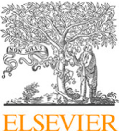
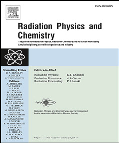
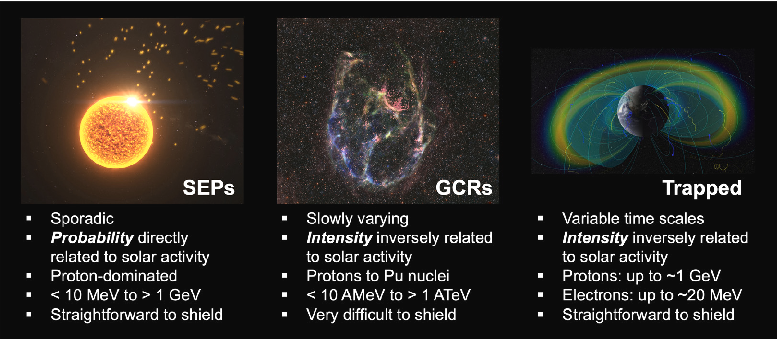
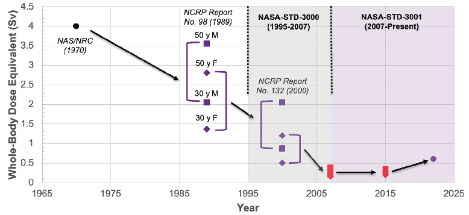
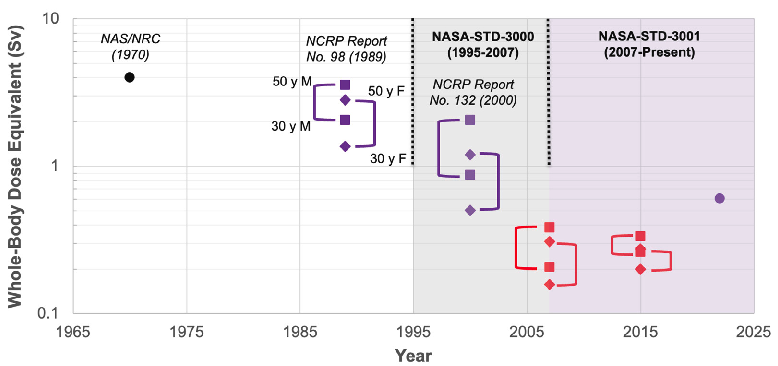

Radiation Physics and Chemistry 221 (2024) 111764

Contents lists available at ScienceDirect

# Radiation Physics and Chemistry

journal homepage: www.elsevier.com/locate/radphyschem

||
|---|

## Space radiation protection in the modern era: New approaches to familiar challenges

Amir A. Bahadori

Alan Levin Department of Mechanical and Nuclear Engineering, Kansas State University, 1200 N. Martin Luther King Jr. Drive, Manhattan, 66506, KS, United States of America

### A B S T R A C T

A R T I C L E I N F O

Astronauts are exposed to a variety of unique stressors during spaceflight, including reduced gravity, isolation, and elevated radiation levels. In contrast with the terrestrial radiation environment, the space radiation environment is dominated by highly charged, energetic light and heavy ions (e.g., protons, alphas, and carbon ions) that interact with atomic electrons and nuclei, producing secondary particle spectra that challenge traditional shielding techniques. The unique radiation environment, demands on astronaut performance during space missions, and the lasting duty to protect astronauts from harm necessitate a space-specific radiation protection paradigm founded in the principles of justification, limitation, and optimization. Recent developments in space radiation protection include: (1) NASA’s transition from a risk-based space permissible exposure limit to an effective dose-based limit; (2) emergence of longitudinal radiation worker studies with chronic, low dose rate exposures similar to those experienced by astronauts; (3) active pixel readout-based detectors that provides unique insight into the composition of the intravehicular space radiation environment; and (4) active shielding concepts with the potential to drastically improve upon space radiation shielding approaches that employ matter alone. These advances are contributing to closure of important knowledge gaps and will ultimately enable extended human presence in space. Despite the recent progress in space radiation protection, several important challenges must be addressed to better ensure astronaut health and safety for exploration missions to the Moon and Mars. The purpose of this article is to review current strategies to protect space explorers from harm caused by space radiation and discuss future opportunities to further enhance space radiation protection.

Keywords: Space radiation Radiation risk assessment Radiation epidemiology Radiation detection Active shielding

#### 1. Introduction

to an omnidirectional event-averaged angular distribution that is often approximated as isotropic (NCRP, 2006; Desai and Giacalone, 2016). Trapped particles gyrate around geomagnetic field lines while bouncing between mirror points near Earth’s magnetic poles. Although higher order structures have been recently identified (Mauk et al., 2013), the trapped particle environment is often characterized by an inner belt dominated by protons and an outer belt dominated by electrons. Particle kinetic energies are limited to those that can be trapped by Earth’s geomagnetic field. Trapped particle angular distributions are highly anisotropic, defined by particle charge and magnetic field vectors. GCRs are accelerated by explosive processes such as supernovae outside of our heliosphere. The baryonic component, which is of greatest concern for human exposure, is comprised of nearly 90% protons, about 8% 4He nuclei, with the remainder consisting of fully-stripped heavy ions; these particles can attain kinetic energies exceeding 1TeV per nucleon (Simpson, 1983). GCRs form an isotropic, broad fluence distribution that is typically modeled with a maximum kinetic energy of roughly 100GeV per nucleon (Slaba and Whitman, 2020; Slaba et al., 2020).

Space radiation presents a stark contrast with the familiar terrestrial radiation environment, which is largely attributed to primordial radionuclides, radon and thoron, and anthropogenic radiation sources (NCRP, 2009). While the radiation environment on Earth is dominated by decay gammas, alpha and beta decay products, and X rays, highly energetic protons, heavier ions, and electrons are of greatest concern for human radiation exposure in space (NCRP, 2000, 2006). These particles interact in ways that are fundamentally different from their terrestrial counterparts, leading to differences in energy deposition, biological effects, and shielding strategies.

Space radiation is generally categorized as solar energetic particles (SEPs), trapped particles, and galactic cosmic rays (GCRs). SEPs are accelerated by complex solar processes, including flares and coronal mass ejections (CMEs) (Reames, 1995). SEPs are mostly comprised of protons with kinetic energies that can exceed 1GeV. Generally, SEP proton fluence spectra decrease with increasing kinetic energy. While SEP proton angular distributions may be highly anisotropic at the beginning of a SEP event, heliospheric magnetic field line scattering leads

E-mail address: bahadori@ksu.edu.

https://doi.org/10.1016/j.radphyschem.2024.111764 Received 8 February 2024; Received in revised form 4 April 2024; Accepted 10 April 2024

Available online 16 April 2024 0969-806X/© 2024 Elsevier Ltd. All rights reserved.

- Fig. 1. Major characteristics of SEPs, GCRs, and trapped particle radiation. Images courtesy of NASA Scientific Visualization Studio. SEP image credit: NASA’s Goddard Space Flight Center Conceptual Image Lab, GCR image credit: NASA/STScI/CXC/SAO, processing by Judy Schmidt, CC BY-NC-SA, Trapped image credit: NASA’s Scientific Visualization Studio.

The three space radiation environment components are closely linked. CMEs that accelerate SEPs can directly impact Earth, leading to geomagnetic storming and aurora. CMEs can alter the trapped particle environment (Schiller et al., 2016; Li and Hudson, 2019) and temporarily shield GCRs, a phenomenon known as a Forbush decrease (Lange and Forbush, 1942b; Lockwood, 1971). Solar activity influences the GCR intensity and spectrum throughout the heliosphere; during times of greater solar activity, GCR intensity is more attenuated and the energy spectrum is hardened, relative to times of lesser solar activity, due to the cumulative effects of solar wind and CMEs. The steady-state trapped particle environment is produced at least in part by the Cosmic Ray Albedo Neutron Decay (CRAND) process (Singer, 1958). Free neutrons created via GCR interaction with atmospheric constituents decay into protons and neutrons, which subsequently become trapped by Earth’s geomagnetic field. Thus, while independent models of each of the three space radiation components exist (e.g., Slaba and Whitman, 2020; Townsend et al., 2018; Johnston et al., 2014), the connected nature of the heliosphere and geomagnetosphere must be considered to gain a full understanding of space radiation dynamics. A summary comparison of the three categories of space radiation is shown in Fig.1. Representative spectra for SEPs, GCRs, and trapped particle radiation, used as boundary conditions for radiation transport simulations, can be found in literature (e.g., Bahadori et al., 2012, 2017b; Slaba et al., 2017; Slaba and Whitman, 2020; Řípa et al., 2020).

individual characteristics), and non-maleficence (avoiding harm to the astronaut) against one another. Recent challenges to NASA’s career space permissible exposure limit (SPEL) have brought this dilemma into sharper focus in the last decade.

The historical context of evolving space radiation limits is instructive for interpreting present-day limits and identifying potential issues with limit enforcement. Space radiation was known as a potential hazard well before the ‘‘Space Race’’ during the Cold War. Hess discovered atmospheric ionization resulting from cosmic ray interactions through a series of balloon measurements in 1911 and 1912 (Hess, 1912). Discovery of SEPs followed in 1942 (Berry and Hess, 1942; Lange and Forbush, 1942a) by studying detector transients observed using surfacebased cosmic ray monitors during a large geomagnetic storm. Finally, satellite measurements resulted in discovery of the trapped particle environment in the International Geophysical Year, 1958 (Van Allen et al., 1958, 1959; Van Allen, 1959). While tissue reactions were known to occur in people exposed to high levels of ionizing radiation by the 1950s, a more complete understanding of the potential for radiationinduced health effects, especially cancer, would not be within reach for many decades, since epidemiological studies of the atomic bomb survivors and other exposed groups are incomplete while members of the cohort under study are living (Ozasa et al., 2012; Walsh and Schneider, 2016; Grant et al., 2017; Cologne et al., 2018).

After the Mercury and Gemini programs, it was apparent that some consideration of radiation exposure was necessary for the longerduration Apollo missions, which would ultimately reach beyond the confines of low-Earth orbit (National Research Council, 1967). In 1967, the National Research Council’s Space Science Board of the National Academy of Sciences published effect estimates and general recommendations on administering a space radiation protection program, but declined to recommend radiation limits, focusing instead ‘‘more on the success of missions and the doses of radiation man can withstand than on maximum protection of the individual’’ (National Research Council, 1967). It is notable that this report was issued prior to NASA meeting President John F. Kennedy’s challenge to land humans on the Moon and return them safely to Earth before the end of the 1960s (McMahon, 2022).

Given the uniqueness of the space radiation environment and its impact on crewed space exploration, a specialized radiation protection approach is warranted for space explorers. The purpose of this article is to present state-of-the-art strategies to protect space explorers from harm caused by space radiation. Specific areas addressed include NASA astronaut space radiation limits, understanding radiation risks by studying previously-exposed populations, space radiation monitoring, and active shielding.

#### 2. NASA astronaut space radiation limits

Radiation protection in all applications, including space radiation exposure situations, requires justification, limitation, and optimization (ICRP, 2007). These three ‘‘pillars’’ of radiation protection are supported on a foundation of science, ethics, and experience (ICRP, 2018). Several ethical principles directly relate to radiation protection, and ethical dilemmas exist when these principles conflict. Limitation of space radiation exposure presents a complex ethical dilemma that pits the principles of autonomy (the right of the astronaut to selfdetermination), justice (equal opportunity for astronauts regardless of

Radiation limits for astronauts were first recommended after the successful Apollo 11 mission. In 1970, the Space Science Board again examined the issue of limits and recommended a ‘‘primary reference risk’’ of an excess cancer mortality equal to the background cancer mortality for white American males between the ages of 35 and 55; based on limited radiation epidemiology available at the time, the corresponding dose was estimated to be ‘‘400 rem at the average

depth of the bone marrow (5cm)’’ (National Research Council, 1970). NASA began selecting astronauts from more diverse backgrounds in the Shuttle era. In 1978, Astronaut Class 8, known as the Thirty-Five New Guys, included the first non-white and women astronauts (NASA, 2022a). In 1989, the NCRP re-examined the issue of astronaut radiation limits, and recommended that NASA implement a career limit of 3% excess cancer mortality; using available data from the Life Span Study, it was determined that the whole-body dose equivalent corresponding to this limit ranged from 1Sv, for a 25-year-old female, to 4Sv, for a 55-year-old male (NCRP, 1989). NASA implemented these limits in 1995 (NASA, 1995). The NCRP in 2000 clarified that the recommended career limit was applicable to low-Earth orbit missions, and substantially revised the whole-body dose equivalents corresponding to the 3% excess cancer mortality (0.4Sv for a 25-year-old female to 3Sv for a 55-year-old male) (NCRP, 2000). Additionally, the NCRP suggested that probability distributions of risk estimates be considered instead of point estimates only, as previously examined for the atomic bomb survivors (NCRP, 1997).

functions (Cucinotta and Chappell, 2011), a dose and dose rate effectiveness factor (DDREF) (Cucinotta et al., 2016), and relative biological effectiveness factors (RBEs) or quality factors to account for differences in radiation field characteristics (Shuryak et al., 2022). Risks of radiation-associated health effects are estimated by assuming independence and additivity of excess disease hazard functions resulting from exposures at different ages, usually in one-year increments. Recently, radiation epidemiology studies have focused on radiation worker populations to gain greater insight into whether these different population and exposure characteristics substantially impact radiation risk estimates for populations more representative of the astronaut corps. Critically, radiation workers often exhibit the Healthy Worker Effect (Li and Sung, 1999; Chartier et al., 2020), which would also be expected in the astronaut corps, and radiation workers and astronauts are mostly exposed at low dose rates, obviating the need for a DDREF.

The International Nuclear Workers Study (INWORKS) (Hamra et al., 2016) and the Million Person Study (MPS) (Boice Jr et al., 2022) are two on-going, highly statistically-powered radiation epidemiology investigations of chronically-exposed worker populations. The INWORKS cohort consists of more than 300,000 nuclear workers from France, the United Kingdom, and the United States who were exposed from 1945 to 2005. Significant associations of disease with radiation exposure have been found for solid cancer, leukemia and lymphoma, and some non-cancer diseases (cerebrovascular disease and ischemic heart disease) (Leuraud et al., 2015; Gillies et al., 2017; Richardson et al., 2023). The MPS consists of about 1,000,000 people from various sub-cohorts, including US Department of Energy workers, Atomic Veterans, nuclear power plant workers, industrial radiographers, medical radiation workers, nuclear submariners, and the radium dial painters (Boice Jr et al., 2022). Organ-specific dosimetry procedures have been documented in detail (NCRP, 2018).

NASA explicitly included consideration of uncertainties in the career SPEL with the adoption of NASA-STD-3001, NASA Spaceflight HumanSystem Standard, in 2007 (NASA, 2007): an astronaut’s career risk of exposure-induced death (REID) was required to be less than 3% at the upper 95% confidence limit. NASA implemented an administrative limit of 1% REID point estimate; if an astronaut’s career REID point estimate approached 1%, a more detailed analysis was performed to determine whether the next mission could result in exceeding the career SPEL (National Academies of Sciences, Engineering, and Medicine, 2021). The adoption of the uncertainty condition and further updates from the Life Span Study led to a 3- to 5-fold reduction in the wholebody dose equivalent corresponding to the SPEL. Additional updates to NASA’s risk calculation methods led to minor changes in the sex- and age-dependent allowable whole-body dose equivalent (Cucinotta et al., 2013; NASA, 2015).

While cancer has long been the most prominent radiation-associated health effect of concern at doses smaller than about 250mSv, recent results from the Mayak study indicate that neurological disease, specifically Parkinson’s Disease, may be associated with radiation exposure (Azizova et al., 2020). In contrast, cognitive function was not found to be impaired by radiation in the Atomic Bomb Survivors (Yamada et al., 2016). Possible central nervous system (CNS) effects of space radiation have long been a topic of interest for NASA’s Human Research Program (NASA, 2016a). Meta-analysis of six sub-cohorts of the MPS (nuclear power plant workers, industrial radiographers, medical workers, Los Alamos National Laboratory workers, Rocky Flats workers, and Atomic Veterans) demonstrates a statistically-significant association of radiation exposure with Parkinson’s Disease, with an excess relative risk of 0.17 (95% CI: 0.05; 0.29) at 100mGy brain dose (Dauer et al., 2023). Given this interest in CNS disease, and the challenges associated with pooled analysis of tens of millions of person-years of data, the MPS is presently working on development of a software package, Colossus, that can perform radiation epidemiology analyses using vast quantities of data while leveraging high performance computing resources. Colossus will support analyses that consider multiple types of time-dependent exposures experienced by astronauts (e.g., isolation, confined quarters, elevated carbon dioxide levels, and radiation) and time-dependent outcomes, of particular interest for neurological disease incidence, progression, and mortality. Ultimately, these advances will enable more thorough characterization of astronaut overall health risk associated with extended duration exploration missions (Boice, 2022).

The NASA SPEL started to impact crew assignment decisions with the advent of one-year missions to the International Space Station, favoring assignment of male astronauts to these missions (Institute of Medicine, 2014). Diversification of the astronaut corps, coupled with the tendency toward more restrictive career radiation limits, led to a choice between equal spaceflight opportunity and equal protection from the harms of spaceflight. The Institute of Medicine recommended that NASA implement a waiver framework to enable crew assignments that might result in an astronaut exceeding the career risk limit (Institute of Medicine, 2014), which NASA completed in 2016 (NASA,

- 2016b). Finally, in 2021, the National Academies of Sciences, Engineering, and Medicine (NASEM) considered a proposal by NASA to return to a limit based on effective dose instead of risk (National Academies of Sciences, Engineering, and Medicine, 2021). NASEM endorsed this proposal, and in 2022, NASA-STD-3001 was revised to specify a career SPEL of 600mSv (NASA, 2022b). Although the current career risk limit is likely to be exceeded on a mission to Mars (Zeitlin et al., 2019), the waiver framework can enable NASA to complete these missions using existing technologies while NASA pursues research to further improve space radiation protection. A timeline of space radiation limit recommendations and NASA’s career SPEL, translated to whole-body dose equivalent, is provided in Fig.2(a) on a linear scale and Fig.2(b) on a logarithmic scale.

#### 3. Epidemiological studies of radiation health effects

#### 4. Space radiation monitoring

NASA’s estimates of space radiation health effects are largely based upon the Life Span Study of the Atomic Bomb Survivors (Cucinotta et al., 2013). There are clearly substantial, health-relevant differences between present day astronauts and the populations of Hiroshima and Nagasaki during World War II that may impact space radiation risk estimates in ways that are more subtle and challenge the standard practice of using appropriate background disease rates and survival

Space radiation monitoring has long been recognized as integral to space radiation protection. NASA relied primarily on tissue equivalent proportional counters (TEPCs) and passive dosimetry during the Space Shuttle Program and the first 20 years of the International Space Station (ISS) to monitor the space radiation environment (Shinn et al., 1999; Badhwar, 2002; Zhou et al., 2007; Lee et al., 2007; Zhou et al., 2009).

- Fig. 2. Space radiation limit recommendations and NASA’s career SPEL since 1965 with (a) linear y axis and (b) logarithmic 𝑦 axis. Circles represent dose-based values. Squares represent age-dependent, risk-based values for biological males, while diamonds represent age-dependent, risk-based values for biological females. The additional condition to address uncertainties was applied to data points in red.

Unfortunately, neither technology is viable for exploration missions; TEPCs are too massive and passive dosimetry requires mass transfer with Earth for calibration and read-out. Additionally, neither technology provides detailed information on the identity and kinetic energy of incident particles, useful for bench-marking space radiation transport codes such as HZETRN (Wilson et al., 2014, 2015b,a, 2016; Slaba

collection, was mounted inside of the Orion Multi-Purpose Crew Vehicle and began data collection via accelerometer trigger upon sensing launch. The BIRD collected data throughout the mission, storing it on an internal memory card, and ultimately shut down once battery voltage reached a critical level well after landing in the Pacific Ocean off the coast of San Diego, California. Analysis of co-located passive dosimetry showed good agreement between the two dosimetry methods (Stoffle et al., 2016), providing further confidence in operational use of the Timepix technology in space. In contrast with the BIRD, the Hybrid Electronic Radiation Assessor (HERA) was designed to be fully integrated with the Orion MPCV systems (Stoffle et al., 2023). HERA uses a distributed sensing, central processing and control infrastructure. One ‘‘string’’ of HERA was flown on Artemis 1; a full HERA suite of two ‘‘strings’’ will be flown on Artemis 2 (Stoffle et al., 2023). This approach provides high confidence that at least one HERA sensor will survive a long-duration exploration mission while nominally providing measurements at multiple locations within the Orion MPCV, potentially useful for spectral unfolding during SPEs (Bahadori et al., 2017a).

- et al., 2016) and characterizing the NASA quality factor (Sato et al., 2013). Desirable properties for an exploration mission space radiation monitoring system include ability to provide detailed information on the local field; active readout, to provide real-time information on space radiation transient events to crew and mission control; and low size, weight, and power requirements, to optimize use of scarce resources far from Earth.

NASA has invested in development of Timepix (Ballabriga et al., 2018) ASIC-based detector technology since the early 2010s. Several silicon (Si) semiconductor detector-Timepix assemblies, known as Radiation Environment Monitors (REMs), were deployed in late 2012 to establish feasibility of using the technology for active dosimetry (Stoffle et al., 2015; Kroupa et al., 2015). In December 2014, the Batteryoperated Independent Radiation Detector (BIRD) was launched on Exploration Flight Test 1 (EFT 1). The BIRD system (Bahadori et al., 2015), which included two Si-Timepix assemblies for redundant data

In addition to operational utility, NASA and collaborating researchers

have demonstrated that Timepix-based space radiation detectors deliver unprecedented scientific return. Specialized calibration methods to produce more accurate measurements of high energy ions in the

#### 6. Future opportunities

space radiation environment have been developed (Kroupa et al.,

- 2017). Kinetic energy reconstruction using the Si-Timepix assembly as a single layer particle telescope has been demonstrated (Kroupa et al.,
- 2018b), as has the ability to distinguish light ion fragments present inside of the ISS as a result of interactions of the primary external field with vehicular mass (Kroupa et al., 2018a). Evidence of extravehicular electron excursions resulting from the influence of solar activity on the geomagnetosphere has been discovered using the REM units inside of the ISS via characteristic X ray detection (Kroupa et al., 2019). Finally, particle showers resulting from interaction of primary particles with energies exceeding 1TeV with ISS mass have been detected (CampbellRicketts et al., 2023). The amount and quality of data provided by Timepix-based space radiation detectors is unparalleled and will likely lead to even greater use of the technology in space in the coming years.

It is clear that several challenges must be overcome in order to ensure safe, consistent human exploration missions to destinations beyond low-Earth orbit. Although NASA has embarked on an impressive slate of research to address questions related to astronaut health, the Human Research Program has only recently sought to understand the possibly synergistic or antagonistic effects of combined exposures to multiple stressors. In the realm of space radiation measurements, there is growing interest in space neutron exposures, particularly for missions to the surfaces of planetary bodies (Burahmah and Heilbronn, 2023; Martinez Sierra et al., 2023). NASA desires to conduct ultrafast neutron spectroscopy with the ability to unfold neutron energy spectra at kinetic energies exceeding 100MeV up to 1GeV or greater. These measurements are virtually impossible with reasonable masses of neutron moderating-type instruments (e.g., Hu et al., 2019; Fontanilla et al., 2022), but may be feasible with particle telescope-like instruments, such as the Miniaturized Fast Neutron Detector (Stegeman et al., 2019; Oxandale et al., 2019; Stegeman et al., 2021). Finally, there is clearly a need to develop technology in support of active shielding, including power supplies capable of potentials greater than 10MV; large, lightweight materials to support physical structures to generate the desired electromagnetic fields; and methods to mitigate charge collection due to solar wind plasma interactions with the active shielding components.

#### 5. Active shielding

GCR shielding is challenging due to interactions of the high energy, heavy charged particle environment with matter generate a secondary radiation field with greater ability to penetrate mass shielding (Slaba

- et al., 2017). While sufficient mass will eventually attenuate this field, as evidenced by the protection provided by Earth’s atmosphere, the mass required to protect astronauts on a Mars mission from GCRs exceeds reasonable launch requirements (Singleterry, 2013). Active shielding, which employs electric and/or magnetic fields to deflect space radiation away from the crew volume, has been extensively explored previously and described in several review articles (Sussingham et al., 1999; Townsend, 2001; Spillantini, 2010; Ferrone et al., 2023). However, previous analyses were conducted with limited ability to quickly evaluate and iterate the protection capability of various active shielding architectures.

NASA and collaborators developed the Active Shielding Particle Pusher code (ASPP) (Fry et al., 2020) to facilitate rapid analyses of candidate active shielding architectures. At present, ASPP accommodates static electromagnetic fields, which can be defined using simple geometric elements (points, lines, and planes) or a uniformly-spaced grid. ASPP is capable of simulating charged particle transport using a variety of integrators, providing flexibility in computational efficiency and numerical accuracy and precision. NASA performed initial exploratory measurements using an electron accelerator at Idaho National Laboratory (Fry et al., 2021), and later established a dedicated testing beamline at the Brookhaven National Laboratory (BNL) Tandem Van de Graaff Facility, enabling heavy charged particle measurements. Validation testing showed excellent agreement between ASPP and beamline measurements at BNL (Stegeman et al., 2020; Stegeman et al., 2021; Kim et al., 2022).

Several different active shielding architecture ‘‘families’’ were defined for full three-dimensional transport using ASPP, with stacked positive planes and decoupled negative line charges identified as the most promising (Pal Chowdhury et al., 2019, 2021). Hybrid shielding, defined as intentional use of both passive and active shielding, was also simulated in a decoupled manner using the PHITS code (Sato

- et al., 2018) and ASPP (Pal Chowdhury et al., 2023). Overall, a potential of about 30MV after 20gcm−2 of aluminum shielding showed an effective dose reduction of about 20% over 20gcm−2 of aluminum shielding alone for a free-space, solar minimum GCR spectrum. More modest reductions were observed for the free-space, solar maximum GCR spectrum, since lower-energy particles were already shielded as a result of increased solar activity. Although practical implementation is challenging at present, there is a clear benefit to intentionally ranging and fragmenting the incident GCR field to increase the efficacy of the active shield. Recently, a Geant4-based application capable of conducting fully-coupled active-passive shielding analyses was introduced (Stegeman et al., 2021; Stegeman et al., 2023). This tool will be used to explore the fidelity of decoupled active-passive shielding analyses and execute highly-detailed simulations of active shielding configurations deployed on the Moon and Mars.

#### 7. Summary and conclusion

Recent developments in space radiation protection include a reevaluation of the NASA SPEL in the context of ethics, advances in Timepix-based space radiation detection, and novel approaches to design of active shielding configurations. Quantifying the cancer risks associated with radiation exposure during spaceflight has only recently become practical with mature radiation risk models; research continues on populations with characteristics more similar to astronauts to better understand these and other health risks. Although substantial challenges remain, with sufficient public support and political will, long-duration exploration missions can become a reality for NASA and other space agencies around the world.

#### CRediT authorship contribution statement

Amir A. Bahadori: Writing – review & editing, Writing – original draft, Visualization, Validation, Supervision, Software, Resources, Project administration, Methodology, Investigation, Funding acquisition, Formal analysis, Data curation, Conceptualization.

#### Declaration of competing interest

The authors declare the following financial interests/personal relationships which may be considered as potential competing interests: Amir Bahadori reports financial support was provided by NASA. Amir Bahadori has patent Miniaturized fast neutron spectrometer pending to Kansas State University Research Foundation. Author previously employed by NASA Johnson Space Center.

#### Data availability

Data will be made available on request.

#### Acknowledgments

Fry, D., Lund, M., Bahadori, A.A., Pal Chowdhury, R., Stegeman, L., Madzunkov, S., 2020. Active Shielding Particle Pusher (ASPP): Charged-Particle Tracking Through Electromagnetic Fields. NASA/TP–2020–5002408, NASA Johnson Space Center, Houston, TX.

This work was supported by NASA Human Health and Performance Contract NNJ15HK11B, and NASA, United States Awards 80NSSC19M 0161 and 80NSSC23M0129. Additionally, the author acknowledges support from the Kansas State University Johnson Cancer Research Center, the Hal and Mary Siegele Professorship in Engineering, and the Steve Hsu Keystone Research Faculty Scholar fund. The author thanks Mary Van Baalen for discussions regarding changing astronaut demographics with time. Finally, the author acknowledges many collaborators on NASA Timepix projects, especially Lawrence Pinsky, Martin Kroupa, Stuart George, Thomas Campbell-Ricketts, Diego Laramore, and Edward Semones; NASA Active Shielding, especially Dan Fry, Dragan Nikolic, Rajarshi Pal Chowdhury, and Luke Stegeman; and the Million Person Study, especially John Boice, Lawrence Dauer, Kathy Held, Steve Blattnig, Linda Walsh, Dan Andresen, Eric Giunta, Benjamin French, Michael Mumma, and Michael Bellamy.

Fry, D., Madzunkov, S., Simcic, J., Hunt, A., 2021. Application of scaling methods to foster ground development of active shielding concepts for space exploration. Acta Astronaut. 178, 296–307.

Gillies, M., Richardson, D.B., Cardis, E., Daniels, R.D., O’Hagan, J.A., Haylock, R., Laurier, D., Leuraud, K., Moissonnier, M., Schubauer-Berigan, M.K., et al., 2017. Mortality from circulatory diseases and other non-cancer outcomes among nuclear workers in France, the United Kingdom and the United States (INWORKS). Radiat. Res. 188 (3), 276–290.

Grant, E.J., Brenner, A., Sugiyama, H., Sakata, R., Sadakane, A., Utada, M., Cahoon, E.K., Milder, C.M., Soda, M., Cullings, H.M., et al., 2017. Solid cancer incidence among the life span study of atomic bomb survivors: 1958–2009. Radiat. Res. 187 (5), 513–537.

Hamra, G.B., Richardson, D.B., Cardis, E., Daniels, R.D., Gillies, M., O’Hagan, J.A., Haylock, R., Laurier, D., Leuraud, K., Moissonnier, M., et al., 2016. Cohort profile: The international nuclear workers study (INWORKS). Int. J. Epidemiol. 45 (3), 693–699.

Hess, V.F., 1912. Über beobachtungen der durchdringenden strahlung bei sieben freiballonfahrten. Z. Phys. 13, 1084.

#### References

Hu, Z., Ge, L., Sun, J., Zhang, Y., Cui, Z., Gorini, G., Zhang, H., Chen, J., Chen, J., Li, X., et al., 2019. Measurements of cosmic ray induced background neutrons near the ground using a Bonner sphere spectrometer. Nucl. Instrum. Methods Phys. Res. A 940, 78–82.

Azizova, T.V., Bannikova, M.V., Grigoryeva, E.S., Rybkina, V.L., Hamada, N., 2020. Occupational exposure to chronic ionizing radiation increases risk of Parkinson’s disease incidence in Russian Mayak workers. Int. J. Epidemiol. 49 (2), 435–447.

ICRP, 2007. The 2007 recommendations of the International Commission on Radiological Protection. ICRP Publication 103. Ann. ICRP 37 (2–4). ICRP, 2018. Ethical foundations of the system of radiological protection. ICRP Publication 138. Ann. ICRP 47 (1). Institute of Medicine, 2014. Health Standards for Long Duration and Exploration Spaceflight: Ethics Principles, Responsibilities, and Decision Framework.

Badhwar, G.D., 2002. Shuttle radiation dose measurements in the international space station orbits. Radiat. Res. 157 (1), 69–75.

Bahadori, A.A., Roberts, J.A., Kroupa, M., Fry, D.J., 2017a. Reconstructing solar particle event spectra from absorbed dose measurements. Trans. Am. Nucl. Soc. 116 (1), 909–912.

Johnston, W.R., O’Brien, T.P., Ginet, G.P., Huston, S.L., Guild, T.B., Fennelly, J.A., 2014. AE9/AP9/SPM: New models for radiation belt and space plasma specification. In: Sensors and Systems for Space Applications VII, vol. 9085, SPIE, pp. 42–50.

Bahadori, A., Semones, E., Ewert, M., Broyan, J., Walker, S., 2017b. Measuring space radiation shielding effectiveness. EPJ Web Conf. 153, 04001. http://dx.doi.org/10. 1051/epjconf/201715304001.

Kim, B., Nikolić, Madzunkov, S., Simcic, J., Belousov, A., Fry, D., Giunta, E., Santillana Padilla, R., Stegeman, L., Pal Chowdhury, R., Bahadori, A., Lund, M., 2022. Systematic modeling of electrostatic radiation shields for deep space flight. Radiat. Phys. Chem. 193, 110007. http://dx.doi.org/10.1016/j.radphyschem.2022.110007.

Bahadori, A.A., Semones, E.J., Gaza, R., Kroupa, M., Rios, R.R., Stoffle, N.N., Campbell-Ricketts, T., Pinsky, L.S., Turecek, D., 2015. Battery-Operated Independent Radiation Detector Data Report from Exploration Flight Test 1. NASA/TP-2015-218575, NASA Johnson Space Center, Houston, TX.

Kroupa, M., Bahadori, A., Campbell-Ricketts, T., Empl, A., Hoang, S.M., IdarragaMunoz, J., Rios, R., Semones, E., Stoffle, N., Tlustos, L., et al., 2015. A semiconductor radiation imaging pixel detector for space radiation dosimetry. Life Sci. Space Res. 6, 69–78.

Bahadori, A.A., Van Baalen, M., Shavers, M.R., Semones, E.J., Bolch, W.E., 2012. Dosimetric impacts of microgravity: An analysis of 5th, 50th and 95th percentile male and female astronauts. Phys. Med. Biol. 57 (4), 1047.

Ballabriga, R., Campbell, M., Llopart, X., 2018. ASIC developments for radiation imaging applications: The Medipix and Timepix family. Nucl. Instrum. Methods Phys. Res. A 878, 10–23.

Kroupa, M., Bahadori, A.A., Campbell-Ricketts, T., George, S.P., Stoffle, N., Zeitlin, C., 2018a. Light ion isotope identification in space using a pixel detector based single layer telescope. Appl. Phys. Lett. 113 (17), 174101.

Berry, E.B., Hess, V.F., 1942. Study of cosmic rays between New York and Chile. Terr. Magn. Atmos. Electr. 47 (3), 251–256. Boice, J.D., 2022. The Million Person Study relevance to space exploration and mars. International Journal of Radiation Biology 98 (4), 551–559. Boice Jr, J.D., Cohen, S.S., Mumma, M.T., Ellis, E.D., 2022. The Million Person study, whence it came and why. Int. J. Radiat. Biol. 98 (4), 537–550. Burahmah, N.T., Heilbronn, L.H., 2023. Comparison of doses in lunar habitats located at the surface and in crater. Aerospace 10 (11), 970. Campbell-Ricketts, T., Kroupa, M., George, S., Bahadori, A.A., Pinsky, L., 2023. Particle

Kroupa, M., Bahadori, A.A., Campbell-Ricketts, T., George, S., Zeitlin, C., 2018b. Kinetic energy reconstruction with a single layer particle telescope. Appl. Phys. Lett. 112

(13), 134103.

Kroupa, M., Campbell-Ricketts, T., Bahadori, A., Empl, A., 2017. Techniques for precise energy calibration of particle pixel detectors. Rev. Sci. Instrum. 88 (3), 033301. http://dx.doi.org/10.1063/1.4978281.

Kroupa, M., Campbell-Ricketts, T., Bahadori, A.A., Pal Chowdhury, R., Empl, A., George, S., O’Brien, T., 2019. Extravehicular electron measurement based on an intravehicular pixel detector. J. Geophys. Res. Space Phys. 124, 8271–8279. http://dx.doi.org/10.1029/2019JA026495.

showers detected on ISS in Timepix pixel detectors. Life Sci. Space Res. 39, 52–58. Chartier, H., Fassier, P., Leuraud, K., Jacob, S., Baudin, C., Laurier, D., Bernier, M.,

2020. Occupational low-dose irradiation and cancer risk among medical radiation workers. Occup. Med. 70 (7), 476–484.

Lange, I., Forbush, S.E., 1942a. Further note on the effect on cosmic-ray intensity of

the magnetic storm of March 1, 1942. Terr. Magn. Atmos. Electr. 47 (4), 331–334. Lange, I., Forbush, S., 1942b. Note on the effect on cosmic-ray intensity of the magnetic

Cologne, J., Preston, D.L., Grant, E.J., Cullings, H.M., Ozasa, K., 2018. Effect of followup period on minimal-significant dose in the atomic-bomb survivor studies. Radiat. Environ. Biophys. 57, 83–88.

storm of March 1, 1942. Terr. Magn. Atmos. Electr. 47 (2), 185–186.

Lee, K., Flanders, J., Semones, E., Shelfer, T., Riman, F., 2007. Simultaneous observation of the radiation environment inside and outside the ISS. Adv. Space Res. 40 (11), 1558–1561.

Cucinotta, F.A., Cacao, E., Alp, M., 2016. Space radiation quality factors and the delta ray dose and dose-rate reduction effectiveness factor. Health Phys. 110 (3), 262–266.

Leuraud, K., Richardson, D.B., Cardis, E., Daniels, R.D., Gillies, M., O’hagan, J.A., Hamra, G.B., Haylock, R., Laurier, D., Moissonnier, M., et al., 2015. Ionising radiation and risk of death from leukaemia and lymphoma in radiation-monitored workers (INWORKS): An international cohort study. Lancet Haematol. 2 (7), e276–e281.

Cucinotta, F.A., Chappell, L.J., 2011. Updates to astronaut radiation limits: Radiation risks for never-smokers. Radiat. Res. 176 (1), 102–114.

Cucinotta, F.A., Kim, M.Y., Chappell, L.J., 2013. Space Cancer Risk Projections and Uncertainties – 2012. NASA/TP-2013-217375, NASA Johnson Space Center, Houston, TX.

Li, W., Hudson, M., 2019. Earth’s Van Allen radiation belts: From discovery to the Van Allen Probes era. J. Geophys. Res. Space Phys. 124 (11), 8319–8351. Li, C.-Y., Sung, F.-C., 1999. A review of the healthy worker effect in occupational epidemiology. Occup. Med. 49 (4), 225–229. Lockwood, J.A., 1971. Forbush decreases in the cosmic radiation. Space Sci. Rev. 12

Dauer, L.T., Walsh, L., Mumma, M.T., Cohen, S.S., Golden, A.P., Howard, S.C., Roemer, G.E., Boice Jr., J.D., 2023. Moon, mars and minds: evaluating parkinson’s disease mortality among US radiation workers and veterans in the Million Person Study of low-dose effects. Zeitschrift für Medizinische Physik.

Desai, M., Giacalone, J., 2016. Large gradual solar energetic particle events. Living Rev. Sol. Phys. 13 (1), 3. Ferrone, K., Willis, C., Guan, F., Ma, J., Peterson, L., Kry, S., 2023. A review of magnetic shielding technology for space radiation. Radiation 3 (1), 46–57.

(5), 658–715.

Martinez Sierra, L., Jun, I., Ehresmann, B., Zeitlin, C., Guo, J., Litvak, M., Harshman, K., Hassler, D., Mitrofanov, I., Matthiä, D., et al., 2023. Unfolding the neutron flux spectrum on the surface of Mars using the MSL-RAD and odyssey-HEND data. Space Weather 21 (8), e2022SW003344.

Fontanilla, A., Calamida, A., Campoy, A., Cantone, C., Pietropaolo, A., Gomez-Ros, J., MontiMafucci, V., Vernetto, S., Pola, A., Bortot, D., et al., 2022. Extended range Bonner sphere spectrometer for high-elevation neutron measurements. Eur. Phys. J. Plus 137 (12), 1–7.

Mauk, B., Fox, N., Kanekal, S., Kessel, R., Sibeck, D., Ukhorskiy, A., 2013. Science objectives and rationale for the Radiation Belt Storm Probes mission. Space Sci. Rev. 179, 3–27.

Schiller, Q., Kanekal, S., Jian, L., Li, X., Jones, A., Baker, D., Jaynes, A., Spence, H., 2016. Prompt injections of highly relativistic electrons induced by interplanetary shocks: A statistical study of Van Allen Probes observations. Geophys. Res. Lett. 43 (24), 12–317.

McMahon, A.M., 2022. To the moon and back: Reexamining presidential decisionmaking and the Apollo program. Space Policy 62, 101516. http://dx.doi.org/10. 1016/j.spacepol.2022.101516, URL https://www.sciencedirect.com/science/article/ pii/S026596462200042X.

NASA, 1995. Man-Systems Integration Standards, Revision B. NASA-STD-3000, NASA Johnson Space Center, Houston, TX. NASA, 2007. NASA Space Flight Human System Standard, Volume 1: Crew Health. NASA-STD-3001, NASA, Washington, DC.

Shinn, J., Badhwar, G., Xapsos, M., Cucinotta, F., Wilson, J., 1999. An analysis of energy deposition in a tissue equivalent proportional counter onboard the space shuttle. Radiat. Meas. 30 (1), 19–28.

Shuryak, I., Slaba, T.C., Plante, I., Poignant, F., Blattnig, S.R., Brenner, D.J., 2022. A practical approach for continuous in situ characterization of radiation quality factors in space. Sci. Rep. 12 (1), 1453.

- NASA, 2015. NASA Space Flight Human System Standard, Volume 1: Crew Health, Revision A, Change 1. NASA-STD-3001, NASA, Washington, DC.
- NASA, 2016a. Evidence Report: Risk of Acute and Late Central Nervous System Effects from Radiation Exposure. NASA Lyndon B. Johnson Space Center.

Simpson, J., 1983. Elemental and isotopic composition of the galactic cosmic rays. Annu. Rev. Nucl. Part. Sci. 33 (1), 323–382. Singer, S., 1958. ‘‘Radiation Belt’’ and trapped cosmic-ray albedo. Phys. Rev. Lett. 1

NASA, 2016b. NPR 8900.1B NASA health and medical requirements for human space exploration. NASA Proced. Requir..

(5), 171.

- NASA, 2022a. NASA Astronaut Fact Book. National Aeronautics and Space Administration.
- NASA, 2022b. NASA Space Flight Human System Standard, Volume 1: Crew Health, Revision B. NASA-STD-3001, NASA, Washington, DC.

Singleterry, R., 2013. Radiation engineering analysis of shielding materials to assess their ability to protect astronauts in deep space from energetic particle radiation. Acta Astronaut. 91, 49–54.

Slaba, T.C., Bahadori, A.A., Reddell, B.D., Singleterry, R.C., Clowdsley, M.S., Blattnig, S.R., 2017. Optimal shielding thickness for galactic cosmic ray environments. Life Sci. Space Res. 12, 1–15. http://dx.doi.org/10.1016/j.lssr.2016.12.003.

National Academies of Sciences, Engineering, and Medicine, 2021. Space Radiation and Astronaut Health: Managing and Communicating Cancer Risks. A Consensus Study Report, National Academies of Sciences, Engineering, and Medicine, Washington, DC.

Slaba, T.C., Whitman, K., 2020. The Badhwar-O’Neill 2020 GCR model. Space Weather 18 (6), e2020SW002456.

National Research Council, 1967. In: Langham, W.H. (Ed.), Radiobiological Factors in Manned Space Flight. Publication 1487, National Academy of Sciences, Washington, DC.

Slaba, T.C., Wilson, J.W., Badavi, F.F., Reddell, B.D., Bahadori, A.A., 2016. Solar proton exposure of an ICRU sphere within a complex structure part II: Ray-trace geometry. Life Sci. Space Res. 9, 77–83.

National Research Council, 1970. Radiation Protection Guides and Constraints for Space-Mission and Vehicle-Design Studies Involving Nuclear Systems. National Academy of Sciences, Washington, DC.

Slaba, T., Wilson, J., Werneth, C., Whitman, K., 2020. Updated deterministic radiation transport for future deep space missions. Life Sci. Space Res. 27, 6–18. Spillantini, P., 2010. Active shielding for long duration interplanetary manned missions. Adv. Space Res. 45 (7), 900–916.

NCRP, 1989. Guidance on Radiation Received in Space Activities. (NCRP Report No. 98), National Council on Radiation Protection and Measurements, Bethesda, MD.

Stegeman, L., Fry, D., Bahadori, A.A., 2023. Development and benchmarking of charged particle propagation methods in G4-ASPP. J. Comput. Theor. Transp. 52 (4), 269–313.

NCRP, 1997. Uncertainties in Fatal Cancer Risk Estimates Used in Radiation Protection. NCRP Report No. 126, National Council on Radiation Protection and Measurements, Bethesda, MD.

Stegeman, L., Hieber, T., Sarkar, D., Oxandale, S.W., Bellinger, S.L., Leseman, Z.C., Bahadori, A.A., 2021. Planar miniaturized fast neutron detector spectroscopy evaluation. Nucl. Instrum. Methods Phys. Res. A 1020, 165865.

NCRP, 2000. Radiation Protection Guidance for Activities in Low-Earth Orbit. NCRP Report No. 132, National Council on Radiation Protection and Measurements, Bethesda, MD.

Stegeman, L., Madzunkov, S.M., Fry, D., Bahadori, A.A., 2021. Outlook on adjoint radiation transport tool for active-passive shielding analysis. Trans. Am. Nucl. Soc. 125 (1), 1088–1092.

NCRP, 2006. Information Needed to Make Radiation Protection Recommendations for Space Missions Beyond Low-Earth Orbit. NCRP Report No. 153, National Council on Radiation Protection and Measurements, Bethesda, MD.

Stegeman, L., Pal Chowdhury, R., Fry, D., Lund, M.L., Madzunkov, S., Belousov, A., Bahadori, A.A., 2021. Experimental validation of the Active Shielding Particle Pusher code. J. Appl. Phys. 129 (2), 024902. http://dx.doi.org/10.1063/5.0031460.

NCRP, 2009. Ionizing Radiation Exposure of the Population of the United States. NCRP Report No. 160, National Council on Radiation Protection and Measurements, Bethesda, MD.

Stegeman, L., Pal Chowdhury, R., Lund, M.L., Fry, D.J., Madzunkov, S.M., Bahadori, A.A., 2020. Assessment of electrostatic radiation shielding efficacy via void area calculation. Trans. Am. Nucl. Soc. 122, 584–587.

NCRP, 2018. Deriving Organ Doses and Their Uncertainty for Epidemiologic Studies (with a Focus on the One Million U.S. Workers and Veterans Study of Low-Dose Radiation Health Effects). NCRP Report No. 178, National Council on Radiation Protection and Measurements, Bethesda, MD.

Stegeman, L.A., Pease, Q., Hieber, T.J., Sarkar, D., Oxandale, S.W., Bellinger, S.L., Leseman, Z.C., Bahadori, A.A., 2019. Neutron spectrum unfolding with a planar miniaturized fast-neutron detector. Trans. Am. Nucl. Soc. 120, 740–743.

Oxandale, S.W., Stegeman, L.A., Hieber, T.J., Sarkar, D., Bellinger, S.L., Bahadori, A.A., Leseman, Z.C., 2019. Fabrication, modeling, and testing of a miniaturized fast neutron detector. In: ASME International Mechanical Engineering Congress and Exposition, vol. 10, http://dx.doi.org/10.1115/IMECE2019-11534, V010T12A002.

Stoffle, N.N., Campbell-Ricketts, T., Castro, A., Gaza, R., Zeitlin, C., George, S., Abdelmelek, M., Schram, A., 2023. HERA: A Timepix-based radiation detection system for Exploration-class space missions. Life Sci. Space Res..

Ozasa, K., Shimizu, Y., Suyama, A., Kasagi, F., Soda, M., Grant, E.J., Sakata, R., Sugiyama, H., Kodama, K., 2012. Studies of the mortality of atomic bomb survivors, report 14, 1950–2003: An overview of cancer and noncancer diseases. Radiat. Res. 177 (3), 229–243.

Stoffle, N., Nounu, H., Lee, K., Bahadori, A., 2016. Comparison of Passive and Active Exploration Flight Test 1 Radiation Detector Measurements with Trapped Proton and Vehicle Shielding Model Calculations. NASA/TP-2016-218599, NASA Johnson Space Center, Houston, TX.

Pal Chowdhury, R., Stegeman, L.A., Barzilla, J.E., Fry, D.J., Goel, A., Lund, M.L., Madzunkov, S.M., Bahadori, A.A., 2019. Three-dimensional charge distribution for electrostatic space radiation shielding. Trans. Am. Nucl. Soc. 120, 744–747.

Stoffle, N., Pinsky, L., Kroupa, M., Hoang, S., Idarraga, J., Amberboy, C., Rios, R., Hauss, J., Keller, J., Bahadori, A., et al., 2015. Timepix-based radiation environment monitor measurements aboard the international space station. Nucl. Instrum. Methods Phys. Res. A 782, 143–148.

Pal Chowdhury, R., Stegeman, L.A., Lund, M., Madzunkov, S., Fry, D., Bahadori, A.A.,

2023. Hybrid methods of radiation shielding against deep-space radiation. Life Sci. Space Res. 38, 67–78.

Sussingham, J.C., Watkins, S.A., Cocks, F.H., 1999. Forty years of development of active systems for radiation protection of spacecraft. J. Astronaut. Sci. 47, 165–175. Townsend, L., 2001. Overview of active methods for shielding spacecraft from energetic

Pal Chowdhury, R., Stegeman, L., Santillana Padilla, R.F., Lund, M.L., Madzunkov, S., Fry, D., Bahadori, A.A., 2021. Space radiation electrostatic shielding scaling laws: Beam-like and isotropic angular distributions. J. Appl. Phys. 130 (3), 034903. Reames, D.V., 1995. Solar energetic particles: A paradigm shift. Rev. Geophys. 33 (S1),

space radiation. Phys. Med. 17, 84–85.

Townsend, L., Adams, J., Blattnig, S., Clowdsley, M., Fry, D., Jun, I., McLeod, C., Minow, J., Moore, D., Norbury, J., et al., 2018. Solar particle event storm shelter requirements for missions beyond low Earth orbit. Life Sci. Space Res. 17, 32–39.

585–589.

Richardson, D.B., Leuraud, K., Laurier, D., Gillies, M., Haylock, R., Kelly-Reif, K., Bertke, S., Daniels, R.D., Thierry-Chef, I., Moissonnier, M., et al., 2023. Cancer mortality after low dose exposure to ionising radiation in workers in France, the United Kingdom, and the United States (INWORKS): Cohort study. bmj 382.

Van Allen, J.A., 1959. The geomagnetically trapped corpuscular radiation. J. Geophys. Res. 64 (11), 1683–1689.

Van Allen, J.A., Ludwig, G.H., Ray, E.C., McIlwain, C.E., 1958. Observation of high intensity radiation by satellites 1958 Alpha and Gamma. J. Jet Propuls. 28 (9), 588–592.

Řípa, J., Dilillo, G., Campana, R., Galgóczi, G., 2020. A comparison of trapped particle models in low Earth orbit. In: Space Telescopes and Instrumentation 2020: Ultraviolet To Gamma Ray, vol. 11444, SPIE, pp. 597–606.

Van Allen, J.A., McIlwain, C.E., Ludwig, G.H., 1959. Radiation observations with satellite 1958 𝜀. J. Geophys. Res. 64 (3), 271–286.

Sato, T., Endo, A., Niita, K., 2013. Comparison of the mean quality factors for astronauts calculated using the Q-functions proposed by ICRP, ICRU, and NASA. Adv. Space Res. 52 (1), 79–85.

Walsh, L., Schneider, U., 2016. The influence of follow-up on DS02 low-dose ranges with a significant excess relative risk of all solid cancer in the Japanese A-bomb survivors. Radiat. Environ. Biophys. 55, 509–515.

Sato, T., Iwamoto, Y., Hashimoto, S., Ogawa, T., Furuta, T., Abe, S.-i., Kai, T., Tsai, P.E., Matsuda, N., Iwase, H., et al., 2018. Features of particle and heavy ion transport code system (PHITS) version 3.02. J. Nucl. Sci. Technol. 55 (6), 684–690.

Wilson, J.W., Slaba, T.C., Badavi, F.F., Reddell, B.D., Bahadori, A.A., 2014. Advances in NASA radiation transport research: 3DHZETRN. Life Sci. Space Res. 2, 6–22.

Zeitlin, C., Hassler, D., Ehresmann, B., Rafkin, S., Guo, J., Wimmer-Schweingruber, R., Berger, T., Matthiä, D., 2019. Measurements of radiation quality factor on Mars with the Mars science laboratory radiation assessment detector. Life Sci. Space Res. 22, 89–97.

- Wilson, J.W., Slaba, T.C., Badavi, F.F., Reddell, B.D., Bahadori, A.A., 2015a. 3DHZETRN: Neutron leakage in finite objects. Life Sci. Space Res. 7, 27–38.
- Wilson, J.W., Slaba, T.C., Badavi, F.F., Reddell, B.D., Bahadori, A.A., 2015b. 3DHZETRN: Shielded ICRU spherical phantom. Life Sci. Space Res. 4, 46–61.

Zhou, D., Semones, E., Gaza, R., Johnson, S., Zapp, N., Lee, K., George, T., 2009. Radiation measured during ISS-Expedition 13 with different dosimeters. Adv. Space Res. 43 (8), 1212–1219.

Wilson, J.W., Slaba, T.C., Badavi, F.F., Reddell, B.D., Bahadori, A.A., 2016. Solar proton exposure of an ICRU sphere within a complex structure Part I: Combinatorial geometry. Life Sci. Space Res. 9, 69–76.

Zhou, D., Semones, E., Weyland, M., Johnson, S., 2007. Radiation measured with TEPC and CR-39 PNTDs in low Earth orbit. Adv. Space Res. 40 (11), 1571–1574.

Yamada, M., Landes, R.D., Mimori, Y., Nagano, Y., Sasaki, H., 2016. Radiation effects on cognitive function among atomic bomb survivors exposed at or after adolescence. Am. J. Med. 129 (6), 586–591.
