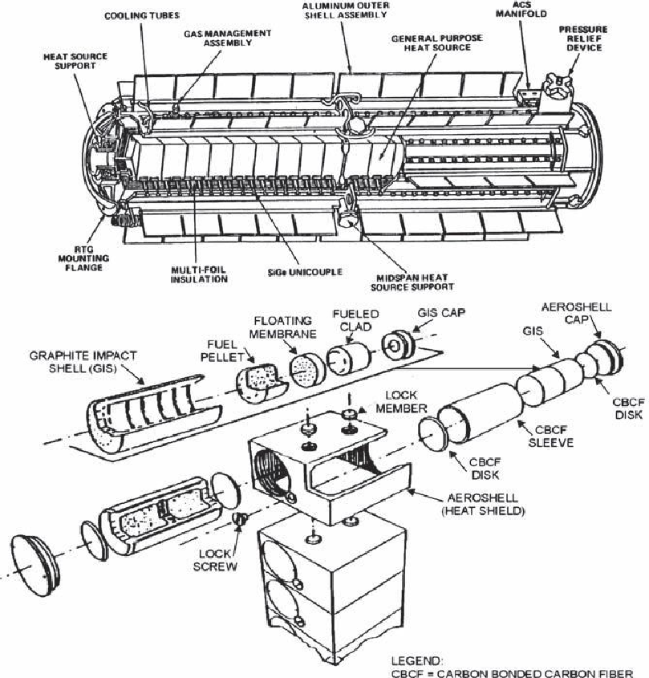

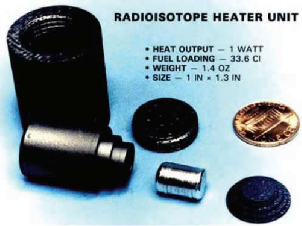

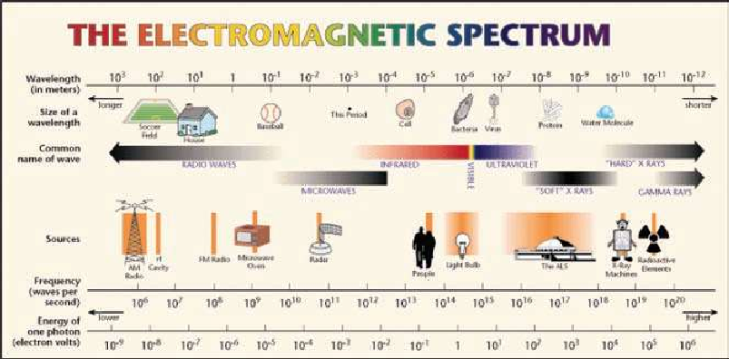

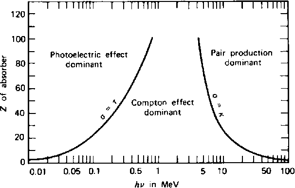

| | | | | |
|---|---|---|---|---|
| | | | | |
| | | | | |
| | | | | |
| | | | | |
| | | | | |
| | | | | |

| |
|---|
| |
| |
| |
| |
| |

| |
|---|
| |
| |
| |
| |
| |

| |
|---|
| |
| |
| |
| |
| |

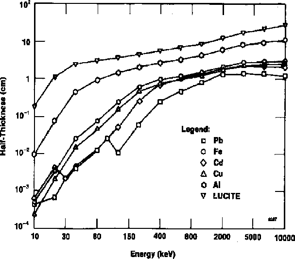

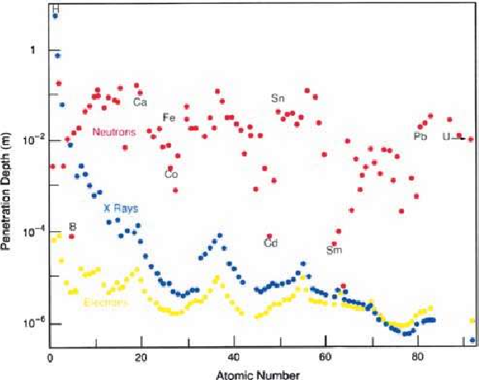

| | | | |
|---|---|---|---|
| | | | |
| | | | |
| | | | |
| | | | |
| | | | |

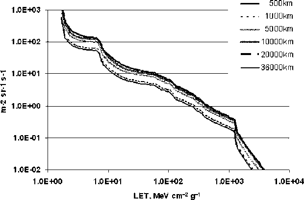

| | | | | | | |
|---|---|---|---|---|---|---|
| | | | | | | |
| | | | | | | |
| | | | | | | |
| | | | | | | |
| | | | | | | |
| | | | | | | |
| | | | | | | |
| | | | | | | |
| | | | | | | |

| | | | | | |
|---|---|---|---|---|---|
| | | | | | |
| | | | | | |
| | | | | | |
| | | | | | |
| | | | | | |
| | | | | | |
| | | | | | |
| | | | | | |

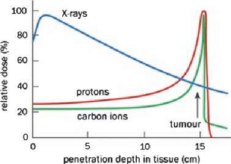

| | | |
|---|---|---|
| | | |
| | | |
| | | |
| | | |

| | | | |
|---|---|---|---|
| | | | |
| | | | |
| | | | |

| | | | |
|---|---|---|---|
| | | | |
| | | | |
| | | | |

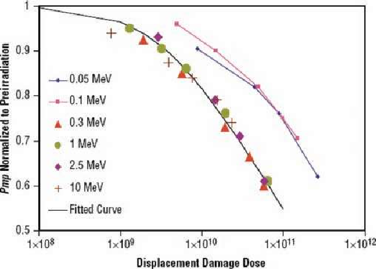

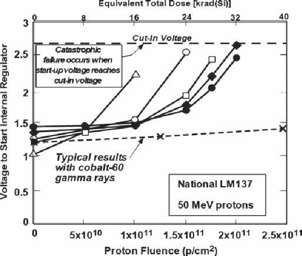

| | | | | | |
|---|---|---|---|---|---|
| | | | | | |
| | | | | | |
| | | | | | |
| | | | | | |

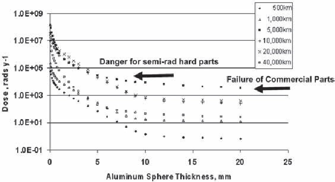

| | |
|---|---|
| | |

| | |
|---|---|
| | |

| | |
|---|---|
| | |

| | |
|---|---|
| | |

| | |
|---|---|
| | |

| | |
|---|---|
| | |

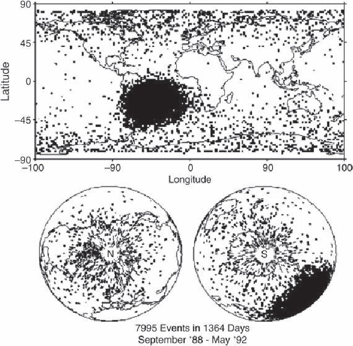

| | | | | | |
|---|---|---|---|---|---|
| | | | | | |
| | | | | | |
| | | | | | |
| | | | | | |
| | | | | | |
| | | | | | |

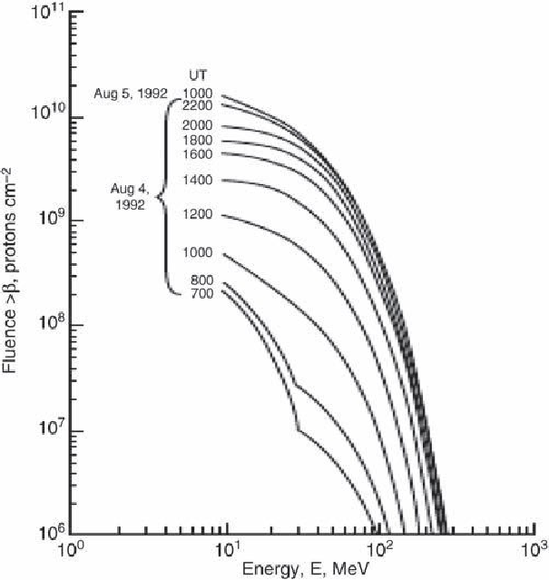

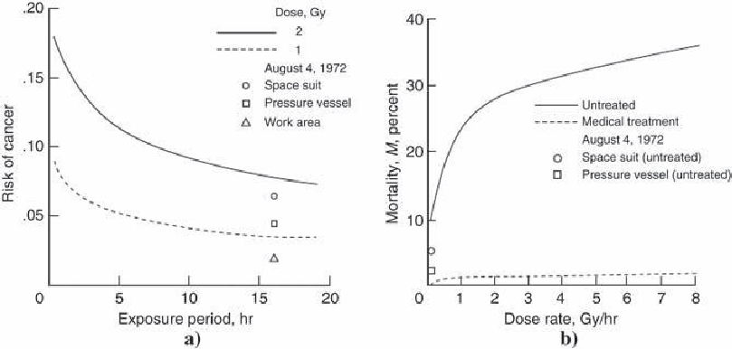

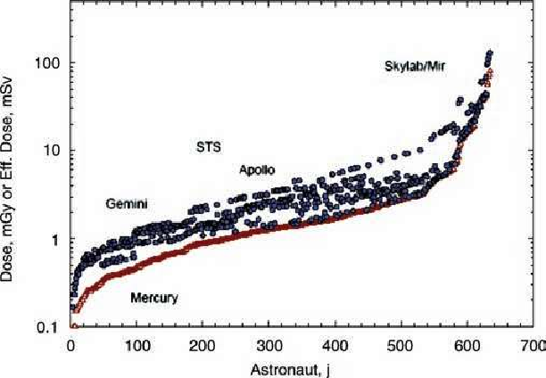
