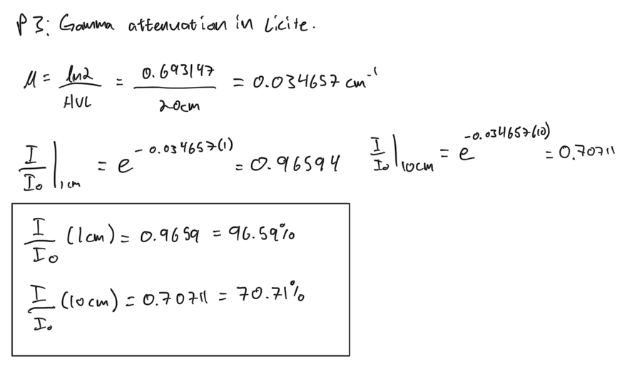
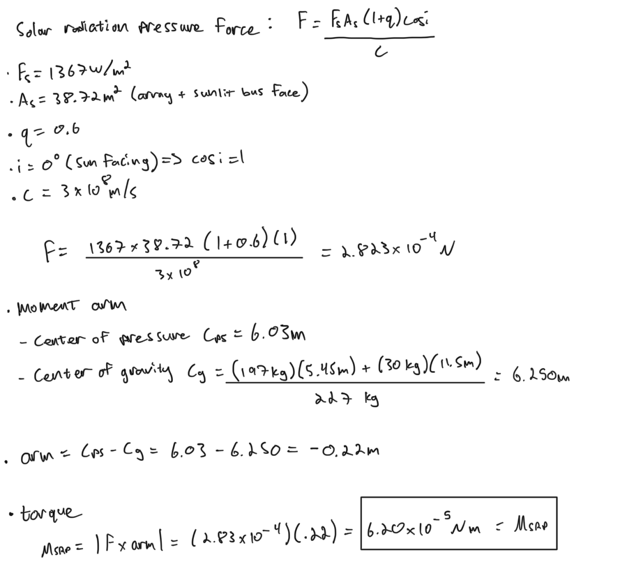
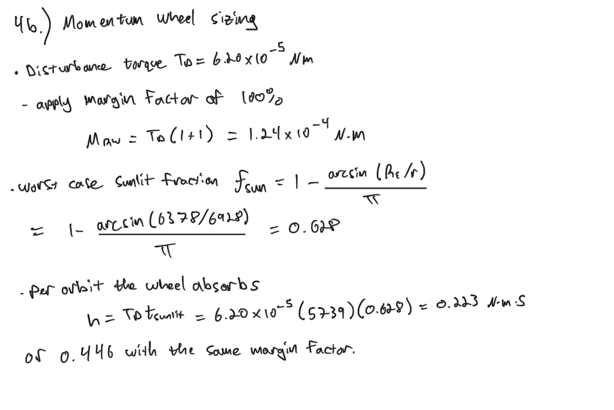
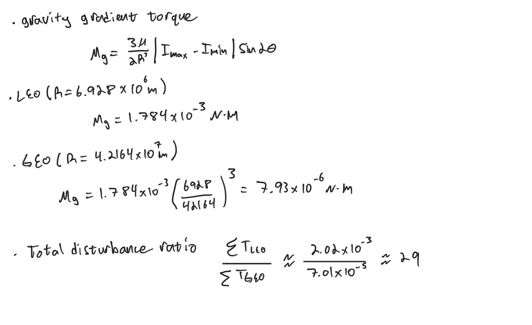

# SPCE 5065: Homework 7
**Radiation environment: human Mars mission dose budget, gamma attenuation, and solar radiation pressure disturbance torques**
**Author:** Jordan Clayton
**Date:** August 9, 2026

---

## Problem 1: Current Events Presentations

> *For each of the current events presentations this week: (a) summarize the presentation, (b) describe something you learned from it, (c) write one question you have left about the presentation.*

### (a) Jason Ansley: Radiation Effects and the Juno Radiation Case Study [1]

**Summary.** Jason mapped the radiation sources onto NASA's three failure categories, TID, displacement damage, and single event effects, and the responses: shielding, rad-hard parts, and error tolerance. Case study was JunoCam, which sits outside Juno's 1 cm titanium vault because it has to see out: clean for 34 orbits, first damage at orbit 47, corrupted images by orbit 56, then recovered by annealing the detector to about 77 F until the noise returned in 2025.

**What I learned.** Displacement damage is frozen-in lattice disorder rather than permanent loss, so enough thermal energy partially undoes it in flight, which turns a heater into a radiation-recovery tool.

**Question.** Do repeated anneal cycles eventually do their own damage (dopant migration, bond fatigue from the thermal cycling), and does that set a practical limit on how many times the trick works?

### (b) Fanita Pfau: SpaceX's Orbital AI Data Center [2]

**Summary.** Taking a 22 July Economist piece on SpaceX's orbital data center, Fanita asked whether dense AI hardware can stay *trustworthy* in orbit. The AI1 node is reported at 150 kW peak, 72 AI chips, and 98% sunlight, and the FCC accepting the Starmind filing sets scale without qualifying hardware. Her technical points: 500 to 2,000 km spans regimes needing separate qualification cases, and an upset can corrupt memory or model state *without crashing the node*, producing a plausible but wrong answer. Her architecture was prevent (vaults, rad-tolerant control), detect (ECC, scrubbing, watchdogs), and recover (autonomous reset, checkpoints, workload migration), concluding that radiation is a cost rather than a showstopper.

**What I learned.** The failure mode that matters for orbital compute is not the node dying but the node staying up and returning a wrong answer nobody flags, which shifts the design priority from prevention to detection.

**Question.** At what point does the ECC, scrubbing, and checkpoint overhead eat enough throughput that a rad-hard part would have been cheaper per useful FLOP than a COTS accelerator behind rad-tolerant control?

### (c) Rachel Danover: Designing for the Radiation Environment [3]

**Summary.** Rachel went at the electronics. TID accumulates from lower-energy particles, altering silicon doping and slowing switching. She walked the full single-event family, SEU, SET, SEL, SEB, and SEGR, the last two permanent and the first three recoverable, then the mitigations: shielding (with clear diminishing returns), rad-hard processors, triple modular redundancy, lower voltages, duplicated instructions, EDAC, scrubbing, and power cycling. Case study was the twin Van Allen Probes, built to live in the belts rather than avoid them: launched 30 August 2012, qualified to 34 krad, designed for two years and lasting six on power-cyclable components, a command loss timer, EDAC with scrubbing, and thick aluminum with local shields.

**What I learned.** The command loss timer is a radiation countermeasure, not just a comm-loss safety net: if a single event latches the command path there is no fault for the vehicle to detect, so the only reliable recovery is a timer that treats silence itself as the symptom.

**Question.** The probes were qualified to 34 krad and lasted three times their design life, so was that margin in the dose specification or in the derated parts?

### (d) Emmanuel Adeyomi: Radiation Design Considerations [4]

**Summary.** Emmanuel surveyed the sources (solar energetic particles, GCR, trapped belts) and effects (TID, displacement damage, SEUs, latch-up), with Solar Cycle 25 near peak and Artemis as current drivers, then the protection methods: rad-hardened processors, shielding, EDAC, redundant flight computers, watchdog timers, and autonomous fault recovery. The useful part was his materials comparison: aluminum is light but produces secondary radiation, polyethylene protects better against protons, and more shielding does not always mean more protection. He closed on the trade space, where shielding costs mass, reliability costs money, and protection costs payload.

**What I learned.** More aluminum is not monotonically better because it produces secondaries, which is the same physics that flattens the GCR curve in Problem 2.

**Question.** Since aluminum is the structure anyway, is there a crossover areal density where a polyethylene liner inside an aluminum hull beats simply making the hull thicker, and does it land anywhere near a real crewed vehicle's wall thickness?

---

## Problem 2: Human Mars Mission Radiation Exposure

> *(a) Choose a launch year. Describe your trajectory and include your expected durations. Also explain your rationale for choosing that target timeframe, including any constraints not specifically listed in the assignment such as cost and political concerns. (b) Estimate the total human radiation exposure for your mission. Clearly state your assumptions. Assume an allowable limit of 60 REM (total). For the purposes of this exercise, you may assume 1 REM = RBE\*RAD. Based on your results, is radiation a concern for your mission? (c) What could you do to help mitigate radiation concerns for your mission?*

### (a) Launch year, trajectory, and durations

**2035 opportunity, Type 1, departing Earth 21 April 2035**, the lowest-energy row in the Burke table at $C_3 = 10.19\ \text{km}^2/\text{s}^2$, arriving at Mars 3 November 2035 with an arrival excess speed of 2.692 km/s [5], giving a **196-day** outbound leg. The stay and return follow the DRA 5.0 fast-conjunction architecture (roughly six-month transits, about a 540-day surface stay) [6].

**Table 1:** Mission profile, 2035 opportunity.

| Phase | Start | End | Duration (days) |
|:---|:---|:---|---:|
| Earth to Mars cruise (Type 1, $C_3$ = 10.19 km²/s²) [5] | 21 Apr 2035 | 3 Nov 2035 | 196 |
| Jezero Crater surface stay | 3 Nov 2035 | 25 Apr 2037 | 539 |
| Mars to Earth cruise | 25 Apr 2037 | 12 Nov 2037 | 201 |
| **Total mission** | | | **936 (2.56 yr)** |

Earth departure to Mars departure is 196 + 539 = 735 days, just inside the 780-day Earth-Mars synodic period, so the crew leaves on the first return window after landing. Leaving earlier forces an opposition-class return with a Venus swingby, which costs far more propellant and drags the crew inside 0.7 AU where the solar particle environment is harsher.

**Why 2035**, and only the first of these is orbital mechanics:

- **Energy.** $C_3 = 10.19\ \text{km}^2/\text{s}^2$ is about as cheap as Earth-Mars departures get; the Type 2 rows in the same table cost 17.52 and 19.33 km²/s² for no schedule benefit.
- **Cost and schedule.** The program is capped below ISS at \$100B, and ISS took 25 years to build. A 2035 launch allows 12 to 15 years of development; 2033 would mean qualifying the transit habitat, ascent vehicle, and surface habitat inside eight years, all three new vehicle classes.
- **Precursor logistics.** DRA 5.0 pre-deploys the surface habitat and ascent vehicle one opportunity earlier [6], so 2033 flies cargo and the crew rides 2035 with the ascent vehicle already verified full of ISRU propellant.
- **Political durability.** A 2035 launch spans about three US administrations, which argues for an ISS-style international partnership with treaty-backed commitments rather than a program cancellable on a four-year cycle.
- **Solar cycle.** Cycle 26 peaks around 2035 to 2036, which cuts the GCR dose at the price of solar particle events a storm shelter can handle (part c).

**Landing site.** Jezero Crater, 18.4 deg N, 77.7 deg E [7], about 2.6 km below datum, so the atmospheric column overhead adds surface shielding.

### (b) Total radiation exposure

**Assumptions, stated up front:**

1. The belt dose rates are free-space rates along the Apollo 11 path, crossed at the stated 25,000 km/hr, and both crossings count. $R_E = 6378$ km.
2. RBE from the course table [8]: 5 for the belts (low end of the 5 to 7 range), 10 for charged particles, which is what GCR and solar protons are.
3. The assignment's Figure 2 curves are absorbed dose over a one-year Earth-to-Mars trajectory [9], so I scale them linearly by transit time and use the 50% SCR curve as directed.
4. The assignment's Figure 4 is already a dose *equivalent* map in rem/yr [10], so no RBE is applied to it.
5. Transit shield areal density is 10 g/cm², chosen in the trade below.

**Belt passage.** Time per Earth radius at 25,000 km/hr = 6.9444 km/s is $6378 / 6.9444 = 918.43$ s. Dose in each band is just rate times dwell time:

**Table 2:** Van Allen belt dose for one crossing along the Apollo 11 path.

| Band | Dose rate (rad/s) | Path length ($R_e$) | Time (s) | Absorbed dose (rad) |
|:---|---:|---:|---:|---:|
| Blue | 0.0001 | 1.80 | 1653.2 | 0.1653 |
| Green | 0.0010 | 0.25 | 229.6 | 0.2296 |
| Yellow | 0.0050 | 1.40 | 1285.8 | 6.4290 |
| Orange | 0.0100 | 1.00 | 918.4 | 9.1843 |
| Red | 0.0500 | 0.00 | 0.0 | 0.0000 |
| **One crossing** | | **4.45** | **4087.0 (1.135 hr)** | **16.008** |

$$\boxed{D_{belts} = 2 \times 16.008 = 32.02\ \text{rad} \;\Rightarrow\; 32.02 \times 5 = 160.1\ \text{REM}}$$

The red row has zero path length because the Apollo trajectory skirts the inner belt core. The belts alone are 2.7 times the career limit, collected in 68 minutes each way.

**Shield selection.** I read the assignment's Figure 2 at a spread of thicknesses and turned each into a full-mission REM number, alongside the mass needed to wrap a 145 m² transit habitat (a 4.5 m by 8 m cylinder, roughly DRA 5.0 scale).

**Table 3:** Transit shield trade.

| Areal density (g/cm²) | GCR (rad/yr) | SCR 50% (rad/yr) | Mission total (REM) | Shield mass (t) |
|---:|---:|---:|---:|---:|
| 1 | 17.5 | 1000 | 11,243 | 1.4 |
| 2 | 17.2 | 234 | 2,913 | 2.9 |
| 5 | 16.8 | 37.7 | 775 | 7.2 |
| **10** | **16.5** | **10.0** | **472** | **14.5** |
| 20 | 14.5 | 2.80 | 372 | 29.0 |
| 30 | 13.5 | 1.33 | 345 | 43.5 |
| 100 | 7.0 | 0.20 | 262 | 145.0 |

**Selected 10 g/cm²** (3.7 cm of aluminum), the knee in **Figure 1**: below it the solar-particle term rises an order of magnitude per halving, and above it 10 to 30 g/cm² triples shield mass to save 27% of the dose. No thickness on the curve reaches 60 REM.


**Mission budget.** Cruise time is 196 + 201 = 397 days = 1.087 yr, so those doses scale by 1.087. The surface term is $16\ \text{rem/yr} \times 539/365.25$, reading the assignment's Figure 4 at Jezero where the map runs about 16 rem/yr [10].

**Table 4:** Total crew dose budget, 10 g/cm² transit shield.

| Phase | Duration | Absorbed dose (rad) | RBE | Dose equivalent (REM) | Share |
|:---|---:|---:|---:|---:|---:|
| Van Allen belts, both crossings | 2.27 hr | 32.02 | 5 [8] | 160.1 | 34% |
| GCR, both cruise legs | 397 d | 17.93 | 10 [8] | 179.3 | 38% |
| SCR 50%, both cruise legs | 397 d | 10.87 | 10 [8] | 108.7 | 23% |
| Mars surface, Jezero | 539 d | (given as rem) | 1 | 23.6 | 5% |
| **Total** | **936 d** | | | **471.7** | |

$$\boxed{D_{total} \approx 472\ \text{REM} \;=\; 7.9 \times \text{the 60 REM career limit}}$$

**Is radiation a concern? Yes.** The crew exceeds the NASA-STD-3001 career limit of 600 mSv [11] before clearing the belts outbound and finishes at roughly eight times it (**Figure 2**), so the mission cannot be flown as designed without a waiver or the part (c) mitigations.


**Checks.** The same profile against MSL/RAD flight data (1.8 mSv/day cruise [12], 0.64 mSv/day surface [13]) gives 71 + 34 = **106 REM**, still 1.8 times the limit, so the verdict holds under less conservative quality factors. The Apollo 11 crew measured 0.18 rad for the whole mission [14], not 32 rad, so the belt line above is an unshielded free-space figure.

### (c) Mitigation

Ranked by dose removed per kilogram spent:

- **Shorten the transit.** GCR dose is linear in exposure time and nearly flat in shield thickness, so halving the 397 cruise days removes about 90 REM. Nuclear thermal propulsion, baselined in DRA 5.0 [6], buys more than the same tonnage of passive shielding.
- **Storm shelter from consumables.** Wall off about 33 m² at 40 g/cm² using water, food, and waste already in the mass budget, dropping SCR from 10 rad to under 1 rad: roughly 100 REM for near-zero added mass.
- **Hydrogen-rich shielding.** Polyethylene and water beat aluminum per unit areal density, because stopping power scales with electron density and high-Z materials fragment heavy ions into secondaries [15].
- **Launch near solar maximum.** Charged particle flux is anti-correlated with solar activity [16], so cycle 26 max cuts GCR; the resulting solar particle events are what the storm shelter covers.
- **Cross the belts faster and off-axis.** A higher-energy trans-Mars injection cuts dwell time, and a high-inclination parking orbit clips the belts near the poles instead of through the equatorial core.
- **Bury the surface habitat.** Two to three meters of regolith is 300 to 500 g/cm², driving the surface term toward zero.
- **Operational controls.** SPE forecasting with a shelter-entry protocol, EVA scheduling off the high-dose plateau, per-crew dosimetry, and crew selection weighted toward older astronauts.
- **Low-TRL options.** Active magnetic or electrostatic shielding and pharmacological radioprotectors [15] are the only paths that attack GCR without a mass penalty.

GCR still sets a floor no practical passive design clears, so a conjunction-class mission requires accepting a career-limiting dose as an explicit program decision.

---

## Problem 3: Gamma Attenuation in Lucite

> *Determine the fraction remaining of the flux density of 10 MeV gamma rays that travel 1 and 10 cm in Lucite. Assume the half value layer for 10 MeV gamma rays in Lucite is 20 cm.*

Flux density attenuates exponentially, $I = I_0 e^{-\mu x}$, with $\text{HVL} = \ln(2)/\mu$ (Lesson 7 Part 3, slide 12 [16]).

<p align="center"></p>


Check: 10 cm is half a half-value layer, so the result must be $2^{-1/2} = 0.70711$, and it is (**Figure 3**).

---

## Problem 4: Solar Radiation Pressure Torque on Starlink

> *Estimate the solar radiation disturbance torque on a Starlink Satellite. The spacecraft body is 3.2 x 1.6 x 1.2 m³ and has a mass of 30 kg. The Solar array is 3.2 x 10.9 m² with a mass of 197 kg and they are sun-tracking. You may assume it is in an orbit such that it is facing the sun at all times. (a) Find the SRP force on the satellite. Assume a center of pressure of 6.03 m. (b) What size and power would you recommend for the satellite's momentum wheels? Be sure to include a margin factor when sizing your wheels.*

### (a) SRP force and torque

Formulas from the SMAD disturbance torque table (Lesson 7 Part 2, slide 9 [17], [18]). The satellite is sun-facing and the array is sun-tracking, so $i = 0$.

**Sunlit area.** Array plus the coplanar bus face [19]: $3.2 \times 10.9 = 34.88$ m² plus $3.2 \times 1.2 = 3.84$ m², so $A_s = 38.72\ \text{m}^2$ (the 1.6 m dimension lies along the sun line).

**Assumed frame** (**Figure 4**; the problem does not state where 6.03 m is measured from): $x = 0$ at the outboard array tip, $+x$ toward the bus, so the array spans 0 to 10.9 m (centroid 5.45 m) and the bus spans 10.9 to 12.1 m (centroid 11.50 m). The area-weighted centroid of that geometry is $[34.88(5.45) + 3.84(11.50)]/38.72 = 6.05$ m, within 0.4% of the given 6.03 m, which confirms the frame.

<p align="center"></p>


### (b) Momentum wheel sizing

Sizing rule from Lesson 7 Part 2, slide 10 [17], with a **margin factor of 1.0 (100%)**. Momentum storage also sizes the wheel: SRP is secular for a sun-facing vehicle, so it accumulates over the whole sunlit arc of the 5739 s (95.6 min) orbit at 550 km.

<p align="center"></p>

That is **0.446 N-m-s per orbit** with margin, dumped by magnetorquers.

**Recommendation.** $1.24\times10^{-4}$ N-m falls in the small-satellite row of the wheel sizing table ($<$ 0.05 N-m) [17]:

$$\boxed{\text{Small-sat class wheels: } \le 0.05\ \text{N}\cdot\text{m torque}, \ \sim 5\ \text{kg/wheel}, \ \sim10\ \text{W/wheel}}$$

Four wheels in a pyramid (three axes plus one spare) gives **20 kg and 40 W total**. Note that in LEO gravity gradient and drag both exceed SRP (Problem 5), so a flight design would size against the total, not against SRP alone.

---

## Problem 5: The Four Disturbance Torques, LEO vs GEO

> *What are the four main disturbance torques and how do they affect a spacecraft? Quantify and rank order the relative influences for a LEO satellite and a GEO satellite. What is the ratio of expected LEO to GEO disturbances?*

**The four, and how each affects a spacecraft** (formulas from the SMAD disturbance torque table, Lesson 7 Part 2, slide 9 [17], [18]):

- **Gravity gradient**, $M_g = \dfrac{3\mu}{2R^3}\left|I_{yaw} - I_{other}\right|\sin 2\theta$. The near side of an elongated body is pulled harder than the far side, so the vehicle swings its long axis toward local vertical. Scales as $1/R^3$ and vanishes only for a spherical inertia tensor.
- **Solar radiation pressure**, $M_{sp} = F(c_{ps}-c_g)$, $F = F_s A_s(1+q)\cos i / c$. Photon momentum acts at the center of pressure, so any cp/cg offset produces torque. Independent of altitude, and it worsens with age as $q$ drifts with darkening coatings.
- **Magnetic**, $M_m = DB$, $B \approx 2M_\oplus/R^3$ for a polar orbit. The vehicle's residual dipole aligns with Earth's field. Scales as $1/R^3$.
- **Aerodynamic**, $M_a = F(c_{pa}-c_g)$, $F = \tfrac{1}{2}\rho C_d A V^2$. Residual atmosphere acts on the ram area. Falls off nearly exponentially with altitude and swings an order of magnitude over the solar cycle.

**Assumptions.** Same 227 kg Starlink; inertias about the cg from the Problem 4 geometry are $I_x = 200$, $I_y = 2913$, $I_z = 3101\ \text{kg}\cdot\text{m}^2$, so $|I_{max}-I_{min}| = 2901\ \text{kg}\cdot\text{m}^2$. $\theta = 10$ deg off local vertical, $D = 1\ \text{A}\cdot\text{m}^2$, $C_d = 2.2$, worst-case ram area 38.72 m², moment arm 0.22 m, $M_\oplus = 7.96\times10^{15}\ \text{T}\cdot\text{m}^3$ [17]. Density from the course thermosphere fit $\rho = 1.020\times10^7\,h^{-7.172}$ kg/m³, $h$ in km [20], giving $\rho(550\ \text{km}) = 2.263\times10^{-13}\ \text{kg/m}^3$; that fit is invalid at GEO, so GEO uses $10^{-19}\ \text{kg/m}^3$ as an upper bound and its drag figure is a ceiling.

**Table 5:** Disturbance torques, LEO (550 km) vs GEO (35,786 km).

| Torque | LEO (N-m) | LEO rank | GEO (N-m) | GEO rank | LEO/GEO ratio | Scaling |
|:---|---:|:---:|---:|:---:|---:|:---|
| Gravity gradient | 1.784e-3 | **1** | 7.913e-6 | 2 | 225 | $R^{-3}$ |
| Aerodynamic | 1.218e-4 | 2 | $\le$ 8.84e-12 | 4 | $\ge$ 1.4e7 | $\rho V^2$ |
| Solar radiation pressure | 6.198e-5 | 3 | 6.198e-5 | **1** | 1.0 | none |
| Magnetic | 4.788e-5 | 4 | 2.124e-7 | 3 | 225 | $R^{-3}$ |
| **Total** | **2.015e-3** | | **7.011e-5** | | **28.8** | |

$$\boxed{\text{LEO rank: GG} > \text{aero} > \text{SRP} > \text{magnetic} \qquad \text{GEO rank: SRP} > \text{GG} > \text{magnetic} > \text{aero}}$$

Gravity gradient worked through at both altitudes, and the total ratio:

<p align="center"></p>


Check: both $R^{-3}$ torques give the same ratio, $(42164/6928)^3 = 225$. The ranking inverts because three torques fall off with altitude and solar pressure does not; setting $M_g(R) = M_{sp}$ puts the crossover at $R = R_{LEO}(1.784\times10^{-3}/6.198\times10^{-5})^{1/3} = 21{,}230$ km (**Figure 5**).

---

### Sources Cited

[1] Ansley, J., "Radiation in the Space Environment: Radiation Effects and the Juno Radiation Case Study," SPCE 5065 current events presentation, University of Colorado Colorado Springs, 28 July 2026.

[2] Pfau, F., "SpaceX's Orbital AI Data Center: Can Dense AI Hardware Remain Trustworthy in the Radiation Environment?" SPCE 5065 current events presentation, University of Colorado Colorado Springs, 27 July 2026.

[3] Danover, R., "Designing for the Radiation Environment," SPCE 5065 current events presentation, University of Colorado Colorado Springs, 28 July 2026.

[4] Adeyomi, E., "Radiation Design Considerations," SPCE 5065 current events presentation, University of Colorado Colorado Springs, 28 July 2026.

[5] Burke, L. M., Falck, R. D., and McGuire, M. L., "Interplanetary Mission Design Handbook: Earth-to-Mars Mission Opportunities 2026 to 2045," NASA/TM-2010-216764, Oct. 2010. https://ntrs.nasa.gov/api/citations/20100037210/downloads/20100037210.pdf

[6] Drake, B. G. (ed.), "Human Exploration of Mars Design Reference Architecture 5.0," NASA/SP-2009-566, NASA Johnson Space Center, July 2009. https://www.nasa.gov/wp-content/uploads/2015/09/373665main_nasa-sp-2009-566.pdf

[7] NASA Jet Propulsion Laboratory, "Mars 2020 Perseverance Landing Site: Jezero Crater," NASA Science, n.d. (accessed 8 Aug. 2026).

[8] "SPCE 5065 Week 7: Radiation Environment, Part 1," course lesson slides, slides 20-23 (radiation units, RBE table, dose levels and effects), 2026.

[9] Pisacane, V. L., *The Space Environment and Its Effects on Space Systems*, McGraw-Hill, New York, 2008 (interplanetary probe radiation dosage vs. shield thickness, assignment Figure 2).

[10] NASA, "Mars Odyssey Image: MARIE: Estimated Radiation Dosage on Mars," Solar Storms and Space Weather Historical Resources, 16 Apr. 2017. https://www.solarstorms.org/MarsDosages.html

[11] NASA, "NASA Space Flight Human-System Standard, Volume 1: Crew Health," NASA-STD-3001, Rev. C, 2022 (career effective dose limit of 600 mSv).

[12] Zeitlin, C., et al., "Measurements of Energetic Particle Radiation in Transit to Mars on the Mars Science Laboratory," *Science*, Vol. 340, No. 6136, 2013, pp. 1080-1084.

[13] Hassler, D. M., et al., "Mars' Surface Radiation Environment Measured with the Mars Science Laboratory's Curiosity Rover," *Science*, Vol. 343, No. 6169, 2014, Art. No. 1244797.

[14] English, R. A., Benson, R. E., Bailey, J. V., and Barnes, C. M., "Apollo Experience Report: Protection Against Radiation," NASA TN D-7080, Mar. 1973. https://ntrs.nasa.gov/api/citations/19730010172/downloads/19730010172.pdf

[15] Bahadori, A. A., "Space Radiation Protection in the Modern Era: New Approaches to Familiar Challenges," *Radiation Physics and Chemistry*, Vol. 221, Aug. 2024, Art. No. 111764. https://doi.org/10.1016/j.radphyschem.2024.111764

[16] "SPCE 5065 Week 7: Radiation Environment, Part 3," course lesson slides, slide 5 (charged particle flux vs. solar activity) and slides 11-12 (flux density attenuation, HVL), 2026.

[17] "SPCE 5065 Week 7: Radiation Environment, Part 2," course lesson slides, slide 9 (SMAD disturbance torque table), slide 10 (reaction wheel sizing), slide 11 (reaction and momentum wheel mass and power table), 2026.

[18] Wertz, J. R., and Larson, W. J. (eds.), *Space Mission Analysis and Design*, 3rd ed., Microcosm Press, Torrance, CA, 1999, Chap. 11 (disturbance torque formulas).

[19] SpaceX, "Starlink," SpaceX, Hawthorne, CA (accessed 25 July 2026).

[20] Braeunig, R. A., "Rocket and Space Technology: Atmospheric Properties," 2013 (thermosphere density fit $\rho = 1.020\times10^7 h^{-7.172}$ kg/m³, as used in SPCE 5065 Homework 2).

---

## Appendix: Python Solution Script

Every number and table above comes out of `spce_5065_hw7_solution.py`, which also regenerates all five figures into `figures/`.
```python
"""
SPCE 5065 -- Homework 7 solution script
Radiation environment: Mars mission dose budget, gamma attenuation in Lucite,
solar radiation pressure torque on Starlink, and LEO/GEO disturbance torque ranking.

Problems solved here:
  P2  Human Mars mission (2035 opportunity): trajectory, total dose equivalent, mitigation
  P3  Fraction of 10 MeV gamma flux density remaining after 1 and 10 cm of Lucite
  P4  SRP force and disturbance torque on a Starlink satellite, momentum wheel sizing
  P5  Four disturbance torques quantified and ranked for LEO vs GEO

Equation sources:
  Lesson 7 Part 1, slides 20-23   REM = RAD * RBE, RBE table, 60 REM career limit
  Lesson 7 Part 3, slides 11-12   I = I0 exp(-mu x), HVL = ln(2)/mu
  Lesson 7 Part 2, slides 9-11    SMAD disturbance torque table, reaction wheel sizing
"""

from __future__ import annotations

import sys
from dataclasses import dataclass
from pathlib import Path

import numpy as np
import matplotlib
matplotlib.use("Agg")
import matplotlib.pyplot as plt
from matplotlib.patches import Rectangle

FIGDIR = Path(__file__).parent / "figures"
FIGDIR.mkdir(exist_ok=True)

# --------------------------------------------------------------------------
# Constants
# --------------------------------------------------------------------------
R_E = 6378.0                 # km, Earth equatorial radius
MU_E = 3.986e14              # m^3/s^2, Earth gravitational parameter
R_GEO = 42164.0e3            # m, geostationary radius
SOLAR_CONST = 1367.0         # W/m^2, solar constant (SMAD torque table)
C_LIGHT = 3.0e8              # m/s, speed of light (SMAD torque table value)
M_EARTH_DIPOLE = 7.96e15     # tesla*m^3, Earth magnetic moment (SMAD torque table)

REM_LIMIT = 60.0             # REM, NASA-STD-3001 career limit (Lesson 7 Pt 1, slide 22)

# RBE values, Lesson 7 Part 1, slide 21
RBE_BELTS = 5.0              # radiation belts, 5-7 quoted; 5 is the low end
RBE_CHARGED = 10.0           # charged particles (GCR and solar protons)


# --------------------------------------------------------------------------
# Problem 2 -- Van Allen belt passage
# --------------------------------------------------------------------------
@dataclass
class Band:
    color: str
    dose_rate: float   # rad/s
    width_Re: float    # Re


VAN_ALLEN_BANDS = [
    Band("Blue", 0.0001, 1.8),
    Band("Green", 0.001, 0.25),
    Band("Yellow", 0.005, 1.4),
    Band("Orange", 0.01, 1.0),
    Band("Red", 0.05, 0.0),
]

V_SPACECRAFT_KMH = 25000.0   # km/hr, given


def van_allen_pass() -> dict:
    """One-way absorbed dose through the belts along the Apollo 11 path."""
    v_kms = V_SPACECRAFT_KMH / 3600.0
    sec_per_Re = R_E / v_kms
    rows = []
    for b in VAN_ALLEN_BANDS:
        t = b.width_Re * sec_per_Re
        rows.append({"color": b.color, "rate": b.dose_rate, "width": b.width_Re,
                     "time_s": t, "dose_rad": b.dose_rate * t})
    total_t = sum(r["time_s"] for r in rows)
    total_d = sum(r["dose_rad"] for r in rows)
    return {"rows": rows, "sec_per_Re": sec_per_Re, "v_kms": v_kms,
            "time_s": total_t, "dose_rad": total_d}


# --------------------------------------------------------------------------
# Problem 2 -- transit radiation model, digitized from HW Figure 2 (Pisacane)
# Absorbed dose in rad for a one-year Earth-to-Mars trajectory vs shield
# areal density in g/cm^2.  Log-log interpolation between read points.
# --------------------------------------------------------------------------
GCR_T = np.array([0.01, 0.1, 1.0, 10.0, 30.0, 100.0])
GCR_D = np.array([21.0, 19.0, 17.5, 16.5, 13.5, 7.0])

SCR50_T = np.array([0.01, 0.1, 1.0, 3.0, 10.0, 35.0, 100.0])
SCR50_D = np.array([6.0e4, 1.0e4, 1.0e3, 1.0e2, 1.0e1, 1.0, 0.2])


def transit_dose_from_chart(thickness: float | np.ndarray, which: str) -> np.ndarray:
    """Interpolate the ASSIGNMENT's Figure 2 in log-log (not this script's Figure 2).
    thickness in g/cm^2, returns absorbed dose in rad per one-year transit."""
    t_pts, d_pts = (GCR_T, GCR_D) if which == "GCR" else (SCR50_T, SCR50_D)
    lt = np.log10(np.atleast_1d(thickness))
    return 10.0 ** np.interp(lt, np.log10(t_pts), np.log10(d_pts))


# --------------------------------------------------------------------------
# Problem 2 -- mission timeline (Burke 2035 Type 1 + DRA 5.0 conjunction class)
# --------------------------------------------------------------------------
T_OUTBOUND = 196.0     # days, 4/21/2035 -> 11/3/2035 (Burke Table 1, Type 1, C3 = 10.19)
T_SURFACE = 539.0      # days, DRA 5.0 fast-conjunction surface stay
T_RETURN = 201.0       # days, DRA 5.0 return transit
T_TOTAL = T_OUTBOUND + T_SURFACE + T_RETURN

MARS_SURFACE_REM_PER_YR = 16.0   # HW Figure 4 read at Jezero (18.4 N, 77.7 E)

SHIELD_BASELINE = 10.0           # g/cm^2, selected design point
HAB_AREA_M2 = 145.0              # m^2, 4.5 m dia x 8 m cylinder transit habitat


def shield_mass_kg(t_gcm2: float | np.ndarray) -> np.ndarray:
    """Areal density (g/cm^2) x habitat wetted area -> shield mass in kg."""
    return np.atleast_1d(t_gcm2) * HAB_AREA_M2 * 1.0e4 / 1000.0


def mission_dose(t_gcm2: float) -> dict:
    """Full mission dose budget at a given transit shield areal density."""
    belts = van_allen_pass()
    belt_rad = 2.0 * belts["dose_rad"]                 # out and back
    belt_rem = belt_rad * RBE_BELTS

    transit_yr = (T_OUTBOUND + T_RETURN) / 365.25
    gcr_rad = float(transit_dose_from_chart(t_gcm2, "GCR")[0]) * transit_yr
    scr_rad = float(transit_dose_from_chart(t_gcm2, "SCR")[0]) * transit_yr
    gcr_rem = gcr_rad * RBE_CHARGED
    scr_rem = scr_rad * RBE_CHARGED

    surf_rem = MARS_SURFACE_REM_PER_YR * T_SURFACE / 365.25

    total = belt_rem + gcr_rem + scr_rem + surf_rem
    return {"belt_rad": belt_rad, "belt_rem": belt_rem,
            "gcr_rad": gcr_rad, "gcr_rem": gcr_rem,
            "scr_rad": scr_rad, "scr_rem": scr_rem,
            "surf_rem": surf_rem, "total_rem": total,
            "shield_mass_kg": float(shield_mass_kg(t_gcm2)[0])}


# --------------------------------------------------------------------------
# Problem 3 -- gamma attenuation in Lucite
# --------------------------------------------------------------------------
HVL_LUCITE = 20.0            # cm, given for 10 MeV gammas
RHO_LUCITE = 1.19            # g/cm^3, PMMA density (for the mass-coefficient check)


def attenuation(x_cm: float | np.ndarray, hvl: float = HVL_LUCITE) -> np.ndarray:
    mu = np.log(2.0) / hvl
    return np.exp(-mu * np.atleast_1d(x_cm))


# --------------------------------------------------------------------------
# Problem 4 -- Starlink SRP force and torque
# --------------------------------------------------------------------------
BODY_DIMS = (3.2, 1.6, 1.2)  # m
BODY_MASS = 30.0             # kg
ARRAY_DIMS = (3.2, 10.9)     # m
ARRAY_MASS = 197.0           # kg
Q_REFLECT = 0.6              # reflectance factor, SMAD torque table
CPS_GIVEN = 6.03             # m, given center of solar pressure

A_ARRAY = ARRAY_DIMS[0] * ARRAY_DIMS[1]           # 34.88 m^2
A_BODY = BODY_DIMS[0] * BODY_DIMS[2]              # 3.84 m^2 sunlit face
A_TOTAL = A_ARRAY + A_BODY

# Coordinate: x = 0 at the outboard tip of the array, +x toward the bus.
X_ARRAY_CEN = ARRAY_DIMS[1] / 2.0                          # 5.45 m
X_BODY_CEN = ARRAY_DIMS[1] + BODY_DIMS[2] / 2.0            # 11.50 m
CG = (ARRAY_MASS * X_ARRAY_CEN + BODY_MASS * X_BODY_CEN) / (ARRAY_MASS + BODY_MASS)
CP_AREA = (A_ARRAY * X_ARRAY_CEN + A_BODY * X_BODY_CEN) / A_TOTAL   # check on 6.03


def srp_force(area: float = A_TOTAL, incidence_deg: float = 0.0) -> float:
    """F = Fs * As * (1 + q) * cos(i) / c   (SMAD disturbance torque table)."""
    return SOLAR_CONST * area * (1.0 + Q_REFLECT) * np.cos(np.radians(incidence_deg)) / C_LIGHT


def srp_torque() -> dict:
    f = srp_force()
    arm = CPS_GIVEN - CG
    return {"F": f, "cg": CG, "cp_area": CP_AREA, "arm": arm, "torque": abs(f * arm)}


# --------------------------------------------------------------------------
# Problem 4b / 5 -- inertia of the Starlink stack about its cg
# x: along the 10.9 m array axis, y: along the 3.2 m array width,
# z: normal to the array plane (sun line)
# --------------------------------------------------------------------------
def inertias() -> dict:
    d_arr = X_ARRAY_CEN - CG
    d_bod = X_BODY_CEN - CG

    # Array: thin plate 10.9 (x) by 3.2 (y)
    Ix_a = ARRAY_MASS * ARRAY_DIMS[0] ** 2 / 12.0
    Iy_a = ARRAY_MASS * ARRAY_DIMS[1] ** 2 / 12.0 + ARRAY_MASS * d_arr ** 2
    Iz_a = ARRAY_MASS * (ARRAY_DIMS[0] ** 2 + ARRAY_DIMS[1] ** 2) / 12.0 + ARRAY_MASS * d_arr ** 2

    # Bus: box, 1.2 m along x, 3.2 m along y, 1.6 m along z
    bx, by, bz = BODY_DIMS[2], BODY_DIMS[0], BODY_DIMS[1]
    Ix_b = BODY_MASS * (by ** 2 + bz ** 2) / 12.0
    Iy_b = BODY_MASS * (bx ** 2 + bz ** 2) / 12.0 + BODY_MASS * d_bod ** 2
    Iz_b = BODY_MASS * (bx ** 2 + by ** 2) / 12.0 + BODY_MASS * d_bod ** 2

    return {"Ix": Ix_a + Ix_b, "Iy": Iy_a + Iy_b, "Iz": Iz_a + Iz_b}


# --------------------------------------------------------------------------
# Problem 5 -- the four SMAD disturbance torques
# --------------------------------------------------------------------------
THETA_GG_DEG = 10.0          # max yaw deviation from local vertical
D_DIPOLE = 1.0               # A*m^2, residual dipole estimate for a ~230 kg bus
CD = 2.2                     # drag coefficient
H_LEO_KM = 550.0             # km
H_LEO = H_LEO_KM * 1000.0    # m


def rho_powerlaw(h_km: float) -> float:
    """Course thermosphere density fit, rho = 1.02e7 * h^-7.172 kg/m^3, h in km,
    valid above 150 km (SPCE 5065 HW2 problem statement / Braeunig)."""
    return 1.020e7 * h_km ** -7.172


RHO_LEO = rho_powerlaw(H_LEO_KM)   # kg/m^3 at 550 km
RHO_GEO = 1.0e-19                  # kg/m^3, conservative upper bound at GEO


def sunlit_fraction(r_m: float) -> float:
    """Worst-case (beta = 0) sunlit fraction of a circular orbit: the satellite is
    inside the cylindrical shadow while within arcsin(R_E/r) of the anti-sun point."""
    return 1.0 - np.arcsin(R_E * 1000.0 / r_m) / np.pi


def disturbance_torques() -> dict:
    I = inertias()
    dI = max(I.values()) - min(I.values())
    arm = abs(srp_torque()["arm"])

    out = {}
    for name, R in (("LEO", R_E * 1000.0 + H_LEO), ("GEO", R_GEO)):
        gg = 3.0 * MU_E / (2.0 * R ** 3) * dI * np.sin(2.0 * np.radians(THETA_GG_DEG))
        srp = srp_torque()["torque"]
        B = 2.0 * M_EARTH_DIPOLE / R ** 3
        mag = D_DIPOLE * B
        rho = RHO_LEO if name == "LEO" else RHO_GEO
        v = np.sqrt(MU_E / R)
        aero = 0.5 * rho * CD * A_TOTAL * v ** 2 * arm
        out[name] = {"gravity_gradient": gg, "solar": srp, "magnetic": mag,
                     "aerodynamic": aero, "B": B, "v": v, "rho": rho,
                     "total": gg + srp + mag + aero}
    out["dI"] = dI
    out["I"] = I
    return out


# --------------------------------------------------------------------------
# Figures
# --------------------------------------------------------------------------
def caption(fig, text: str) -> None:
    fig.text(0.5, 0.005, text, ha="center", va="bottom", fontsize=9, style="italic")


def fig1_shield_trade() -> None:
    t = np.logspace(np.log10(0.5), 2, 300)
    doses = np.array([mission_dose(float(ti))["total_rem"] for ti in t])
    gcr = np.array([mission_dose(float(ti))["gcr_rem"] for ti in t])
    scr = np.array([mission_dose(float(ti))["scr_rem"] for ti in t])
    mass = shield_mass_kg(t) / 1000.0

    fig, ax = plt.subplots(figsize=(9.0, 5.4))
    ax.loglog(t, doses, "k-", lw=2.4, label="mission total")
    ax.loglog(t, scr, ":", color="#c1440e", lw=2.0, label="SCR (50%) transit")
    ax.loglog(t, gcr, "-", color="#1f6f4a", lw=2.0, label="GCR transit")
    ax.axhline(REM_LIMIT, color="r", ls="--", lw=1.6)
    ax.annotate("60 REM career limit", xy=(0.7, REM_LIMIT), xytext=(0, 8),
                textcoords="offset points", color="r", fontsize=9)

    sel = mission_dose(SHIELD_BASELINE)
    ax.plot([SHIELD_BASELINE], [sel["total_rem"]], "o", ms=10, mfc="none", mec="k", mew=2)
    ax.annotate(f"design point\n{SHIELD_BASELINE:.0f} g/cm$^2$, {sel['total_rem']:.0f} REM,"
                f" {sel['shield_mass_kg']/1000:.0f} t",
                xy=(SHIELD_BASELINE, sel["total_rem"]), xytext=(-40, -70),
                textcoords="offset points", fontsize=9,
                bbox=dict(fc="white", ec="0.6", alpha=0.95),
                arrowprops=dict(arrowstyle="->", lw=1.2))

    ax.set_xlabel("Transit habitat shield areal density (g/cm$^2$)")
    ax.set_ylabel("Mission dose equivalent (REM)")
    ax.set_title("Shield trade: dose falls slowly, shield mass climbs linearly")
    ax.set_ylim(1e-1, 1e5)
    ax.grid(which="both", alpha=0.3)
    ax.legend(loc="lower left", framealpha=0.95)

    ax2 = ax.twinx()
    ax2.loglog(t, mass, "-.", color="#4a4ac1", lw=1.8)
    ax2.set_ylabel("Shield mass on a 145 m$^2$ habitat (t)", color="#4a4ac1")
    ax2.tick_params(axis="y", colors="#4a4ac1")

    fig.tight_layout(rect=(0, 0.05, 1, 1))
    caption(fig, "Figure 1: Mission dose equivalent and shield mass vs. areal density. "
                 "GCR sets the floor no practical shield can beat.")
    fig.savefig(FIGDIR / "fig1_shield_trade.png", dpi=160)
    plt.close(fig)


def fig2_timeline() -> None:
    seg = [("Earth to Mars cruise\n196 d", 0, T_OUTBOUND, "#2c6fbb"),
           ("Jezero surface stay\n539 d", T_OUTBOUND, T_SURFACE, "#c1440e"),
           ("Mars to Earth cruise\n201 d", T_OUTBOUND + T_SURFACE, T_RETURN, "#2c6fbb")]

    md = mission_dose(SHIELD_BASELINE)
    rates = [
        (0, T_OUTBOUND, (md["gcr_rem"] + md["scr_rem"]) / (T_OUTBOUND + T_RETURN)),
        (T_OUTBOUND, T_OUTBOUND + T_SURFACE, md["surf_rem"] / T_SURFACE),
        (T_OUTBOUND + T_SURFACE, T_TOTAL, (md["gcr_rem"] + md["scr_rem"]) / (T_OUTBOUND + T_RETURN)),
    ]

    fig, ax = plt.subplots(figsize=(9.5, 4.8))
    for label, start, dur, color in seg:
        ax.axvspan(start, start + dur, color=color, alpha=0.13, lw=0)
        ax.annotate(label.replace("\n", " "), xy=(start + dur / 2, 0.965),
                     xycoords=("data", "axes fraction"), ha="center", va="top",
                     fontsize=8.5, color=color)
    ax.set_title("Cumulative crew dose, 2035 Mars mission (10 g/cm$^2$ transit shield)")

    t, dose, running = [0.0], [md["belt_rem"] / 2], md["belt_rem"] / 2
    for s, e, r in rates:
        for tt in np.linspace(s, e, 60):
            t.append(tt)
            dose.append(running + r * (tt - s))
        running += r * (e - s)
    t.append(T_TOTAL)
    dose.append(running + md["belt_rem"] / 2)

    ax.plot(t, dose, "k-", lw=2.2)
    ax.axhline(REM_LIMIT, color="r", ls="--", lw=1.6)
    ax.annotate("60 REM career limit", xy=(40, REM_LIMIT), xytext=(0, 8),
                 textcoords="offset points", color="r", fontsize=9)
    ax.annotate(f"outbound belt crossing: {md['belt_rem']/2:.0f} REM before day 1",
                 xy=(0, md["belt_rem"] / 2), xytext=(60, 70), textcoords="offset points",
                 fontsize=9, bbox=dict(fc="white", ec="0.6", alpha=0.95),
                 arrowprops=dict(arrowstyle="->", lw=1.2))
    ax.annotate(f"Earth return: {dose[-1]:.0f} REM",
                 xy=(T_TOTAL, dose[-1]), xytext=(-160, -46), textcoords="offset points",
                 fontsize=9, bbox=dict(fc="white", ec="0.6", alpha=0.95),
                 arrowprops=dict(arrowstyle="->", lw=1.2))
    ax.set_ylim(0, dose[-1] * 1.14)
    ax.set_xlabel("Days from Earth departure (21 April 2035)")
    ax.set_ylabel("Cumulative dose equivalent (REM)")
    ax.grid(alpha=0.3)
    fig.tight_layout(rect=(0, 0.06, 1, 1))
    caption(fig, "Figure 2: Cumulative crew dose over the 936-day mission. The belt crossings "
                 "and the cruise legs, not the surface stay, drive the budget.")
    fig.savefig(FIGDIR / "fig2_mission_timeline.png", dpi=160)
    plt.close(fig)


def fig3_lucite() -> None:
    x = np.linspace(0, 60, 400)
    frac = attenuation(x)
    fig, ax = plt.subplots(figsize=(8.2, 5.0))
    ax.plot(x, frac, "k-", lw=2.2)
    for xi, col in ((1.0, "#2c6fbb"), (10.0, "#c1440e")):
        f = float(attenuation(xi)[0])
        ax.plot([xi], [f], "o", ms=8, color=col)
        off = (48, -16) if xi == 1.0 else (30, 18)
        ax.annotate(f"{xi:.0f} cm: {f*100:.2f}%", xy=(xi, f), xytext=off,
                    textcoords="offset points", fontsize=10, color=col,
                    bbox=dict(fc="white", ec="0.6", alpha=0.9),
                    arrowprops=dict(arrowstyle="->", lw=1.2, color=col))
    ax.axvline(HVL_LUCITE, color="0.5", ls="--", lw=1.4)
    ax.annotate("HVL = 20 cm", xy=(HVL_LUCITE, 0.5), xytext=(8, 20),
                textcoords="offset points", fontsize=9, color="0.35")
    ax.axhline(0.5, color="0.5", ls=":", lw=1.2)
    ax.set_xlabel("Lucite thickness (cm)")
    ax.set_ylabel("Fraction of flux density remaining, $I/I_0$")
    ax.set_title("10 MeV gamma attenuation in Lucite (HVL = 20 cm)")
    ax.set_ylim(0, 1.02)
    ax.grid(alpha=0.3)
    fig.tight_layout(rect=(0, 0.05, 1, 1))
    caption(fig, "Figure 3: Exponential attenuation of 10 MeV gammas in Lucite, with the "
                 "1 cm and 10 cm answers marked.")
    fig.savefig(FIGDIR / "fig3_lucite_attenuation.png", dpi=160)
    plt.close(fig)


def fig4_geometry(srp: dict) -> None:
    fig, ax = plt.subplots(figsize=(9.5, 4.4))
    ax.add_patch(Rectangle((0, -1.6), ARRAY_DIMS[1], 3.2, facecolor="#1b3a6b",
                           edgecolor="k", alpha=0.85))
    ax.add_patch(Rectangle((ARRAY_DIMS[1], -1.6), BODY_DIMS[2], 3.2,
                           facecolor="#b0b4bb", edgecolor="k"))
    ax.annotate("solar array 3.2 x 10.9 m, 197 kg", xy=(2.9, 0), ha="center",
                va="center", color="white", fontsize=10)
    ax.annotate("bus\n30 kg", xy=(11.5, 0), ha="center", va="center", fontsize=9)

    ax.plot([srp["cg"]], [1.6], "v", ms=13, color="#e8c31a", mec="k", clip_on=False)
    ax.annotate(f"c.g. = {srp['cg']:.3f} m\n(mass weighted)", xy=(srp["cg"], 1.7),
                xytext=(120, 30), textcoords="offset points", fontsize=9,
                bbox=dict(fc="white", ec="0.6"), arrowprops=dict(arrowstyle="->"))
    ax.plot([CPS_GIVEN], [-1.6], "^", ms=13, color="#c1440e", mec="k", clip_on=False)
    ax.annotate(f"c.p. = {CPS_GIVEN:.2f} m (given)\narea centroid checks at "
                f"{srp['cp_area']:.2f} m", xy=(CPS_GIVEN, -1.7),
                xytext=(-40, -58), textcoords="offset points",
                fontsize=9, bbox=dict(fc="white", ec="0.6"),
                arrowprops=dict(arrowstyle="->"))
    ax.annotate("", xy=(CPS_GIVEN, 2.55), xytext=(srp["cg"], 2.55),
                arrowprops=dict(arrowstyle="<->", color="k", lw=1.8))
    ax.annotate(f"arm = {abs(srp['arm']):.3f} m", xy=((CPS_GIVEN + srp['cg']) / 2, 2.8),
                ha="center", fontsize=9)

    for xa in np.linspace(0.6, 12.0, 9):
        ax.annotate("", xy=(xa, 3.6), xytext=(xa, 5.0),
                    arrowprops=dict(arrowstyle="->", color="#e8a11a", lw=1.4))
    ax.annotate("sunlight (normal incidence, sun-tracking array)", xy=(0.2, 5.15),
                fontsize=9, color="#b07d10")

    ax.set_xlim(-0.6, 13.2)
    ax.set_ylim(-4.4, 5.8)
    ax.set_xlabel("Distance from array outboard tip (m)")
    ax.set_yticks([])
    ax.set_title("Starlink SRP geometry: center of pressure vs. center of gravity")
    fig.tight_layout(rect=(0, 0.06, 1, 1))
    caption(fig, "Figure 4: Sun-facing geometry. The array carries the area, the array also "
                 "carries the mass, so the moment arm is short.")
    fig.savefig(FIGDIR / "fig4_starlink_geometry.png", dpi=160)
    plt.close(fig)


def fig5_torque_scaling(dt: dict) -> None:
    """All four torques vs orbit radius, showing where the ranking flips."""
    r_leo = R_E * 1000.0 + H_LEO
    r = np.linspace(6600e3, 46000e3, 800)

    gg = dt["LEO"]["gravity_gradient"] * (r_leo / r) ** 3
    mag = dt["LEO"]["magnetic"] * (r_leo / r) ** 3
    srp = np.full_like(r, dt["LEO"]["solar"])
    v = np.sqrt(MU_E / r)
    arm = abs(srp_torque()["arm"])
    aero = 0.5 * rho_powerlaw(r / 1000.0 - R_E) * CD * A_TOTAL * v ** 2 * arm

    fig, ax = plt.subplots(figsize=(9.5, 5.6))
    ax.semilogy(r / 1e3, gg, color="#c0392b", lw=2.4, label="Gravity gradient ($R^{-3}$)")
    ax.semilogy(r / 1e3, aero, color="#1f6f4a", lw=2.4, label="Aerodynamic (steep)")
    ax.semilogy(r / 1e3, srp, color="#6a3d9a", lw=2.4, label="Solar radiation (flat)")
    ax.semilogy(r / 1e3, mag, color="#2c6fbb", lw=2.4, label="Magnetic ($R^{-3}$)")

    r_cross = r_leo * (dt["LEO"]["gravity_gradient"] / dt["LEO"]["solar"]) ** (1 / 3)
    ax.axvline(r_cross / 1e3, color="#c1440e", ls="--", lw=1.6)
    ax.annotate(f"SRP overtakes gravity gradient\nat r = {r_cross/1e3:,.0f} km "
                f"({r_cross/1e3 - R_E:,.0f} km altitude)",
                xy=(r_cross / 1e3, 3e-4), xytext=(14, 0), textcoords="offset points",
                fontsize=9.5, color="#c1440e")
    for rv, lab in ((r_leo / 1e3, "LEO 550 km"), (R_GEO / 1e3, "GEO")):
        ax.axvline(rv, color="0.55", ls=":", lw=1.2)
        ax.annotate(lab, xy=(rv, 2e-12), xytext=(5, 0), textcoords="offset points",
                    fontsize=9, color="0.35")
    ax.set_xlabel("Orbit radius (km)")
    ax.set_ylabel("Disturbance torque (N$\\cdot$m)")
    ax.set_title("Disturbance torques vs. altitude: three fall off, one does not")
    ax.set_ylim(1e-13, 1e-2)
    ax.grid(which="both", alpha=0.3)
    ax.legend(loc="upper right", framealpha=0.95)
    fig.tight_layout(rect=(0, 0.06, 1, 1))
    caption(fig, "Figure 5: The dotted lines give the LEO and GEO rankings, the dashed line "
                 "is where they swap.")
    fig.savefig(FIGDIR / "fig5_torque_scaling.png", dpi=160)
    plt.close(fig)


# --------------------------------------------------------------------------
# Main
# --------------------------------------------------------------------------
def main() -> None:
    sys.stdout.reconfigure(encoding="utf-8")

    print("=" * 74)
    print("PROBLEM 2 -- VAN ALLEN BELT PASSAGE")
    print("=" * 74)
    va = van_allen_pass()
    print(f"speed = {va['v_kms']:.6f} km/s, time per Re = {va['sec_per_Re']:.2f} s")
    print(f"{'band':<8}{'rad/s':>10}{'width Re':>10}{'time s':>12}{'dose rad':>12}")
    for r in va["rows"]:
        print(f"{r['color']:<8}{r['rate']:>10.4f}{r['width']:>10.2f}"
              f"{r['time_s']:>12.1f}{r['dose_rad']:>12.5f}")
    print(f"one way: {va['time_s']:.1f} s = {va['time_s']/3600:.4f} hr, "
          f"{va['dose_rad']:.4f} rad")
    print(f"round trip: {2*va['dose_rad']:.4f} rad  ->  "
          f"{2*va['dose_rad']*RBE_BELTS:.1f} REM")

    print()
    print("=" * 74)
    print("PROBLEM 2 -- SHIELD TRADE AND MISSION DOSE BUDGET")
    print("=" * 74)
    print(f"{'t g/cm2':>9}{'GCR rad/yr':>12}{'SCR rad/yr':>12}"
          f"{'total REM':>12}{'shield t':>11}")
    for ti in (1, 2, 5, 10, 20, 30, 50, 100):
        m = mission_dose(float(ti))
        print(f"{ti:>9}{float(transit_dose_from_chart(ti,'GCR')[0]):>12.2f}"
              f"{float(transit_dose_from_chart(ti,'SCR')[0]):>12.2f}"
              f"{m['total_rem']:>12.1f}{m['shield_mass_kg']/1000:>11.1f}")

    md = mission_dose(SHIELD_BASELINE)
    print(f"\nDesign point {SHIELD_BASELINE:.0f} g/cm^2 "
          f"({shield_mass_kg(SHIELD_BASELINE)[0]/1000:.1f} t on {HAB_AREA_M2:.0f} m^2):")
    print(f"  belts  (round trip) {md['belt_rad']:8.2f} rad  x{RBE_BELTS:.0f} = "
          f"{md['belt_rem']:8.1f} REM")
    print(f"  GCR    ({T_OUTBOUND+T_RETURN:.0f} d)   {md['gcr_rad']:8.2f} rad  "
          f"x{RBE_CHARGED:.0f} = {md['gcr_rem']:8.1f} REM")
    print(f"  SCR 50%({T_OUTBOUND+T_RETURN:.0f} d)   {md['scr_rad']:8.2f} rad  "
          f"x{RBE_CHARGED:.0f} = {md['scr_rem']:8.1f} REM")
    print(f"  Mars surface ({T_SURFACE:.0f} d)                    "
          f"{md['surf_rem']:8.1f} REM")
    print(f"  TOTAL                                       {md['total_rem']:8.1f} REM"
          f"   ({md['total_rem']/REM_LIMIT:.1f}x the 60 REM limit)")
    print(f"  mission duration {T_TOTAL:.0f} d = {T_TOTAL/365.25:.2f} yr")

    # Independent check against flight data (MSL/RAD)
    rad_cruise = 1.8e-3 * (T_OUTBOUND + T_RETURN) * 100.0   # Sv -> rem
    rad_surf = 0.64e-3 * T_SURFACE * 100.0
    print(f"  MSL/RAD flight-data cross-check: cruise {rad_cruise:.0f} REM + "
          f"surface {rad_surf:.0f} REM = {rad_cruise+rad_surf:.0f} REM")
    print(f"  Earth departure to Mars departure = "
          f"{T_OUTBOUND + T_SURFACE:.0f} d vs 780 d Earth-Mars synodic period")

    print()
    print("=" * 74)
    print("PROBLEM 3 -- 10 MeV GAMMA ATTENUATION IN LUCITE")
    print("=" * 74)
    mu = np.log(2.0) / HVL_LUCITE
    print(f"mu = ln2/HVL = {mu:.6f} 1/cm, mu/rho = {mu/RHO_LUCITE:.5f} cm^2/g")
    for xi in (1.0, 10.0, 20.0):
        print(f"  x = {xi:5.1f} cm : I/I0 = {float(attenuation(xi)[0]):.5f} "
              f"({float(attenuation(xi)[0])*100:.2f} %)")
    print(f"  check: 10 cm = 0.5 HVL, 2^-0.5 = {2**-0.5:.5f}")

    print()
    print("=" * 74)
    print("PROBLEM 4 -- STARLINK SRP FORCE AND TORQUE")
    print("=" * 74)
    s = srp_torque()
    print(f"A_array = {A_ARRAY:.2f} m^2, A_body = {A_BODY:.2f} m^2, "
          f"A_total = {A_TOTAL:.2f} m^2")
    print(f"F = {SOLAR_CONST}*{A_TOTAL:.2f}*(1+{Q_REFLECT})*cos(0)/{C_LIGHT:.0e} "
          f"= {s['F']:.4e} N")
    print(f"c.g. = {s['cg']:.4f} m, area centroid = {s['cp_area']:.4f} m, "
          f"c.p. given = {CPS_GIVEN:.2f} m")
    print(f"arm = {s['arm']:+.4f} m  ->  T_srp = {s['torque']:.4e} N-m")

    I = inertias()
    print(f"inertias about cg: Ix={I['Ix']:.1f}, Iy={I['Iy']:.1f}, Iz={I['Iz']:.1f} kg-m^2")

    r_leo = R_E * 1000.0 + H_LEO
    period = 2 * np.pi * np.sqrt(r_leo ** 3 / MU_E)
    print(f"  margin factor 1.0: M_RW = {s['torque']*2:.3e} N-m")
    f_sun = sunlit_fraction(r_leo)
    h_secular = s["torque"] * period * f_sun
    print(f"orbit period = {period:.0f} s = {period/60:.1f} min, "
          f"worst-case sunlit fraction = {f_sun:.4f}")
    print(f"momentum storage over the sunlit arc: {h_secular:.4f} N-m-s "
          f"(x2 margin -> {2*h_secular:.3f} N-m-s)")

    print()
    print("=" * 74)
    print("PROBLEM 5 -- DISTURBANCE TORQUE RANKING")
    print("=" * 74)
    dt = disturbance_torques()
    print(f"|I_max - I_min| = {dt['dI']:.1f} kg-m^2, theta = {THETA_GG_DEG:.0f} deg, "
          f"D = {D_DIPOLE:.1f} A-m^2")
    print(f"rho(550 km) = {RHO_LEO:.3e} kg/m^3 from the course power-law fit, "
          f"rho(GEO) <= {RHO_GEO:.0e} kg/m^3")
    print(f"{'torque':<22}{'LEO (N-m)':>14}{'GEO (N-m)':>14}{'LEO/GEO':>14}")
    for k, label in (("gravity_gradient", "Gravity gradient"),
                     ("aerodynamic", "Aerodynamic"),
                     ("solar", "Solar radiation"),
                     ("magnetic", "Magnetic")):
        a, b = dt["LEO"][k], dt["GEO"][k]
        print(f"{label:<22}{a:>14.3e}{b:>14.3e}{a/b:>14.3e}")
    tl, tg = dt["LEO"]["total"], dt["GEO"]["total"]
    print(f"{'TOTAL':<22}{tl:>14.3e}{tg:>14.3e}{tl/tg:>14.2f}")
    print(f"LEO B = {dt['LEO']['B']:.3e} T, GEO B = {dt['GEO']['B']:.3e} T")
    print(f"LEO v = {dt['LEO']['v']:.1f} m/s, GEO v = {dt['GEO']['v']:.1f} m/s")

    print()
    print("Generating figures ...")
    fig1_shield_trade()
    fig2_timeline()
    fig3_lucite()
    fig4_geometry(s)
    fig5_torque_scaling(dt)
    for p in sorted(FIGDIR.glob("fig*.png")):
        print(f"  wrote {p.name}")


if __name__ == "__main__":
    main()
```
