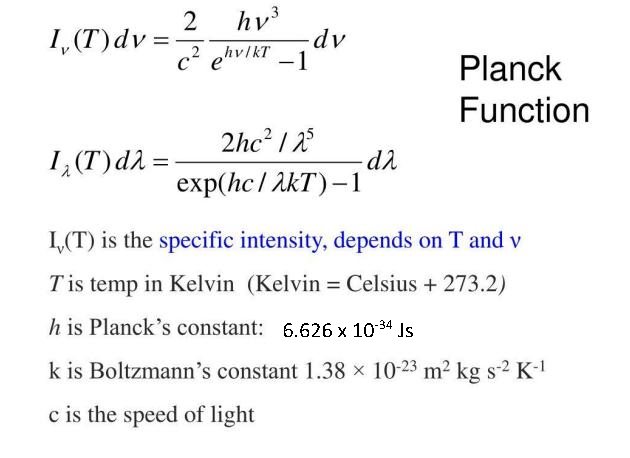
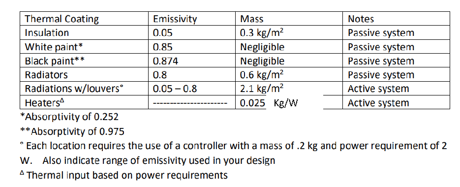

#### Instructions:

# SPCE 5065 HOMEWORK #6

## DUE: Wednesday 5 August 2026

- - Include your references at the end of your homework in AIAA format. https://www.aiaa.org/publications/journals/reference-style-and-format

- - Include units in your final answers!
- - Write non-mathematical answers in complete sentences.
- - Clearly state your assumptions.

- 1. For each the current events presentations this week

- a) Summarize the presentation
- b) Describe something you learned from it
- c) Write one question you have left about the presentation

- 2. Carbon-carbon is a unique composite material consisting of carbon fibers embedded in a carbonaceous matrix. It was originally developed for aerospace applications; its low density, high thermal conductivity, and excellent mechanical properties at elevated temperatures make it an ideal material for aircraft brakes, rocket nozzles, and re-entry nose tips. It withstands temperatures in excess of 2000°C without major deformation.

In this problem, you are going to estimate the approximate number of photons per second that the Earth receives from the Sun, per unit area, which have sufficient energy to sever a single CC bond. You may assume the bond energy is 25°C = 3.47 eV.

- a. Identify the maximum wavelength a photon may have and still be capable of severing the bond.
- b. Make a linear approximate for the solar irradiance S(λ) over the waveband of interest. You may estimate from Figure 1.4 in the textbook or find your own source (be sure to reference it).
- c. Integrate the ratio 𝑝ℎ𝑜𝑡𝑜𝑛 𝑒𝑛𝑒𝑟𝑔𝑦𝑆(𝜆) over the waveband of interest to estimate the number of photons.

- d. Approximately what percentage of photons from the sun is this? This is only one method. It is the estimated total photon output based on a blackbody approximation. In question 2, you will use a more exact method.

- i. Find the average photon energy (hint use the maximum wavelength output from the sun):
- ii. Assume a solar luminosity of 3.828 x 1026 Watts to find the number of photons per second

- iii. Approximately what percentage of photons from the sun is this? Note units from the blackbody estimate are in Photons/second, whereas the integral results in units of photons/m2s. So to convert to proper units, take your answer from part ii and divide by 4*pi*r^2 where r is the distance to the Earth.

- e. Do you think this is a significant risk for space applications?

- 3. Using the same assumptions you made in problem 1, but using Planck’s law of black body radiation from the sun:

6.626 x 10-34 Js

- a. Noting that the law applies to a perfect blackbody, use it to approximate figure 1.4 for S(λ) in the textbook. Plot it to compare.
- b. Integrate the ratio [S(λ)/photon energy] over the waveband of interest to re-estimate your solution to problem 1.
- c. How closely do your two answers agree?
- d. Now estimate the total number of photons/(s cm2) that the earth receives from the sun from your results in part a. What percentage of your answer in b does this represent?
- e. How closely does you answer here compare to the estimate you used in problem 1 d.
- f. Which answer do you believe is more accurate and why?

- 4. NASA is designing an interplanetary probe to investigate Eris. Once the probe arrives at the dwarf planet, only a low-resolution imager along with other instrumentation that can function at very low temperatures can be used. To maximize the value of the program, the mission manager has been asked to consider which planets along the way the spacecraft could take high-resolution images of. The high-resolution camera must be kept between -35◦C to 35◦C. Find the equilibrium temperature of the probe at each planet and the dwarf planet Pluto. You must consider solar input, albedo, and planetary infrared effects. You may make the following assumptions. Clearly state any additional assumptions you make.

- - You may not make any modifications to the spacecraft
- - The probe will be in orbit around each planet long enough to reach equilibrium temperature.
- - The probe is cube shaped with each side 1 m with an absorptivity, α, or 0.3 and emissivity, Ɛ , or 0.7
- - The probe internal components generate 750W of heat
- - One side always faces the sun
- - All sides emit radiative energy at the same rate

- a. Plot the equilibrium temperatures for each of the planets.
- b. Recommend, from a thermal control perspective, which planets to image.

##### 5. You have been given a budget of $15K to design a thermal control system for the mission anda goal of imaging as many planets as possible along the way. You have the following choices (oryou may research your own methods). Assume each kg of mass added adds $25,000 to the costof the mission.

Kg/W

- 6. An outgassing test of Neoprene showed that the outgassing rate is 10-5 𝑇𝑜𝑟𝑟 𝑙𝑖𝑡𝑒𝑟𝑐𝑚2𝑠 at a temperature of 298K.

- a. Show that the outgassing rate in 𝑚𝑊2 can be expressed as 7.5 𝑥 10−4 𝑇𝑜𝑟𝑟 𝑙𝑖𝑡𝑒𝑟𝑐𝑚2𝑠

- b. Determine the number of molecules released per unit area per second in 𝑚𝑜𝑙𝑒𝑐𝑢𝑙𝑒𝑠𝑐𝑚2𝑠

- 7. Classification of air cleanliness in cleanrooms is specified by ISO-14644-1. The classifications are defined in terms of the concentration of airborne particulate contamination to levels appropriate for accomplishing contamination sensitive activities. Using the equation for the maximum number of particles permitted for any given size:

Create a plot of the maximum cleanroom airport particle concentration for each ISO classification. Your plot should look something like Fig 2.13 in the textbook but will be slightly different since the textbook figure is based on the old FED STD 209E. Hint: use log-log axes.

- 8. An ASTM E-595-07 test showed that a 10 m x 10 cm test specimen of Kapton 1 mil (0.001 inch) thick had a TML of 0.5%, during which only the top side was exposed. Determine the outgassing rate in units of 𝑇𝑜𝑟𝑟−𝑙𝑖𝑡𝑒𝑟𝑐𝑚2𝑠 . The mass density is 1.5 g/cm3 and the molar mass of the outgassed products is 15 g/mol. Clearly state your assumptions.

- 9. Research an emerging spacecraft thermal management technology which has been published or demonstrated within the last 10 years. Describe the underlying heat transfer mechanism and explain why it represents an improvement over conventional spacecraft thermal control methods. Evaluate its advantages, limitations, current Technology Readiness Level (TRL), and suitability for a specific mission (e.g., CubeSat, lunar lander, Mars mission, GEO satellite, etc). Support your conclusions with at least three peer-reviewed or NASA/ESA references.
