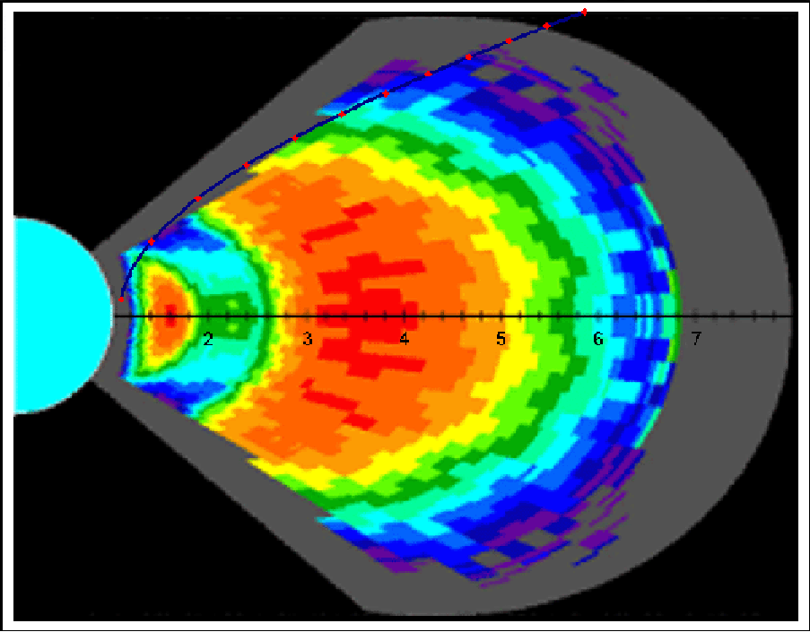
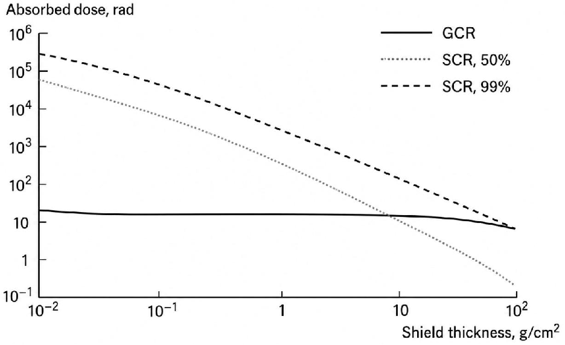
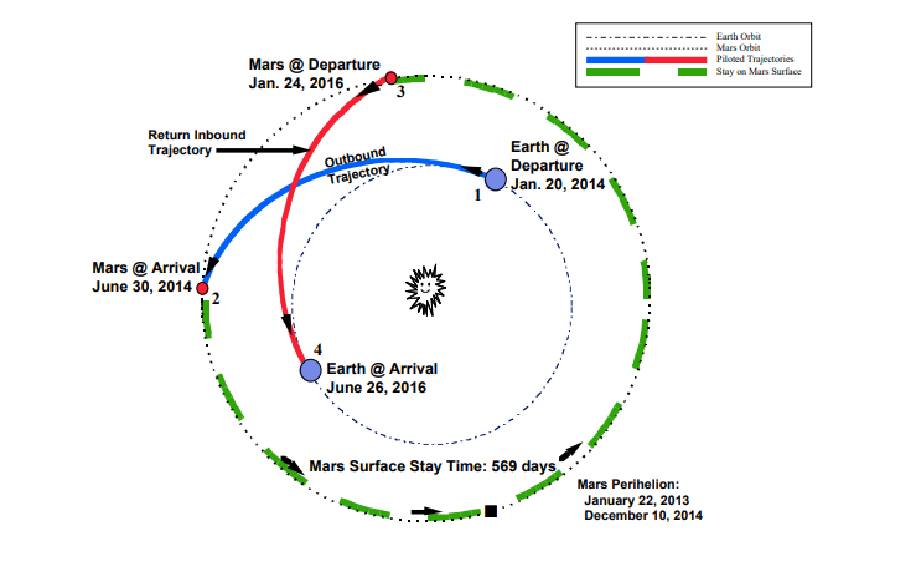
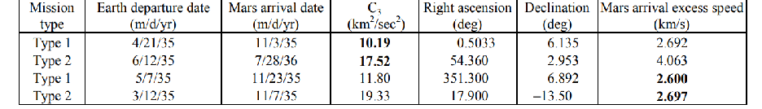
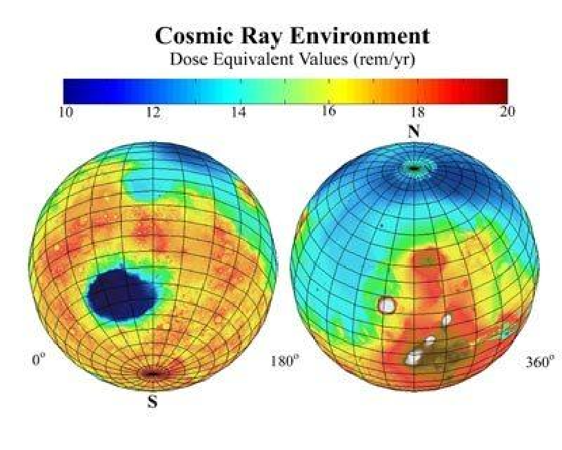
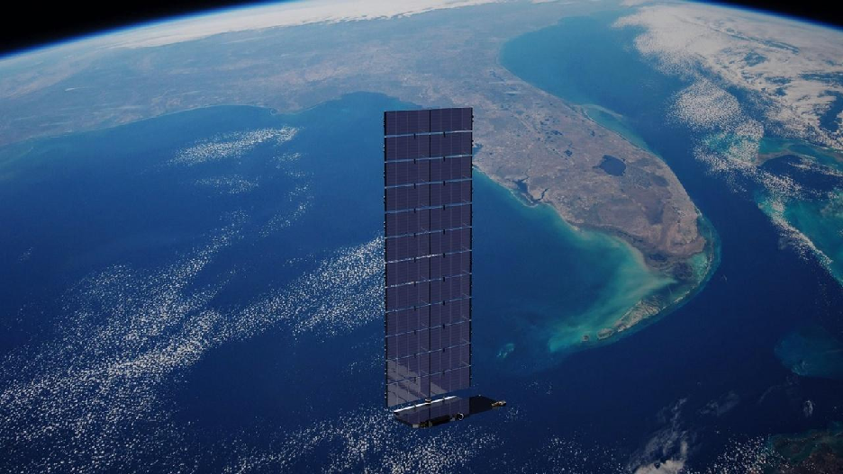

#### Instructions:

# SPCE 5065 HOMEWORK #7

## DUE: Sunday August 9, 2026

- - Include your references at the end of your homework in APA format. https://www.aiaa.org/publications/journals/reference-style-and-format

- - Include units in your final answers!
- - Write non-mathematical answers in complete sentences.
- - Clearly state your assumptions

- 1. (10 pts.) For each the current events presentations this week

- a) Summarize the presentation
- b) Describe something you learned from it
- c) Write one question you have left about the presentation

- 2. (40 pts.) In lecture the week of 7/27/26 we looked at the radiation effects for humans in space. However, there will be a unique challenge associated with a longer manned mission to Mars. Not only will the astronauts need to travel on an escape path from the Earth; they will also have to survive the interplanetary (sun-centered) portion of the mission and survive exposure to the sun’s radiation, solar flares, and galactic cosmic rays. In this problem, you will focus primarily on radiation exposure and ways to mitigate it.

#### VAN ALLEN RADIATION BELT MODEL

Radiation in the space environment was discussed in class and in the readings. You also must consider radiation sources from the sun, solar flares, galactic cosmic ray, etc. in the departure and return flights. In addition, a Mars stay will have little atmospheric protection and no magnetic field, so radiation is still a huge concern once there.

One of the largest exposures of the astronauts to radiation is their passage through the Van Allen Radiation Belts. One model for modeling the belts is shown in Figure 1 [1].

#### Figure 1: Van Allen Radiation Belt Model

Table 1 shows the radiation dosages at various locations within the belts.

#### Table 1: Radiation Dosages in Van Allen Radiation Belts Along Apollo Path

|Color|Radiation Dose (rads/sec)|Distance in Band (Re)|
|---|---|---|
|Blue|0.0001|1.8|
|Green|0.001|0.25|
|Yellow|0.005|1.4|
|Orange|0.01|1.0|
|Red|0.05|0|

Assume the average speed of the spacecraft is about 25,000 km/hr. and the spacecraft travels along the indicated path (this was the path taken by Apollo 11). Remember, you must account for the Van Allen Belt radiation both leaving and returning. Re is the radius of the earth.

You will need to find a reference that provides trajectory information for mission in the 2025 – 2050 timeframe. Some NASA references are provided [2, 3].

#### TRANSIT RADIATION MODEL

There is no human measure data for interplanetary missions, but a Mars probe on a one- year trajectory from Earth to Mars provided some estimated data as shown in Figure 2 [4].

#### Figure 2: Interplanetary Probe Radiation Dosage

Where: GCR = galactic cosmic radiation SCR = solar cosmic radiation – the higher the percentage the safer the. You may use the 50% (medium range solar particle event) for your estimations. The absorbed dose is given as a function of shield thickness so you will need to assume a reasonable shield thickness to ensure radiation levels below max while keeping mass at a minimum. This model may be used for both the human Mars and human Ceres missions.

DESTINATION RADIATION MODEL The landing site will be Jezerel Crater.

#### Mission Statement

Following the successful operation of the International Space Station for over 25 years, the space station partners have set their eyes on Mars as the next goal in human space exploration. The mission will send a human crew to the surface of Mars to explore the planet and in particular to answer the question whether primitive life exists or existed on its surface sometime in the past.

The mission design will provide for a continued Human Mars Exploration Program through the use of in-situ resources and the establishment of an infrastructure to support possible follow-on missions. Based on the technical and operational experience gained through the construction of the International Space Station, the mission is budgeted at a lower cost than the cost of the ISS project, $100 billion US dollars.

#### Trajectory

A representative timeline of a human Mars mission is shown in Figure 3 [1]. This type of low energy trajectory repeats approximately every 15 years.

#### Figure 3: Mars 2014 Opportunity

However, this trajectory is not in the correct timeframe. The most efficient trajectories in the 2026 – 2045 timeframe may be found in Burke. [3] An example is shown in Table 1.

Table 1: Earth to Mars 2035 Opportunity – Energy Minima

Radiation Model

A radiation model for Mars may be found in the NASA 2017 reference and in Figure 4 [5].

#### Figure 4 – Mars Radiation Model

- a. Choose a launch year. Describe your trajectory and include your expected durations. Also explain your rational for choosing that target timeframe, including any constraints not specifically listed in the assignment such as cost and political concerns.
- b. Estimate the total human radiation exposure for your mission. Clearly state your assumptions. Assume an allowable limit of 60 REM (total). For the purposes of this exercise, you may assume 1 REM = RBE*RAD. Based on your results, is radiation a concern for your mission?
- c. What could you do to help mitigate radiation concerns for your mission?

- 3. (20 pts.) Determine the fraction remaining of the flux density of 10 MeV gamma rays that travel 1 and 10 cm in Lucite. Assume the half value layer for 10 MeV gamma rays in Lucite is 20 cm.
- 4. (20 pts.) Estimate the solar radiation disturbance torque on a Starlink Satellite. The spacecraft body is 3.2 x 1.6 x 1.2 m3 and has a mass of 30 kg. The Solar array is 3.2 x 10.9 m2 with a mass of 197 kg and they are sun-tracking. You may assume it is in an orbit such that it is facing the sun at all times. A Space X artist’s rendering may be seen in Figure 5 [6].

Figure 5: Starlink satellite in low Earth orbit with its single deployable solar array. Image credit: SpaceX.

- a. Find the SRP force on the satellite. Assume a center of pressure of 6.03 m.

- b. What size and power would you recommend for the satellite’s momentum wheels? Be sure to include a margin factor when sizing your wheelss.

- 5. ( 20 pts.) What are the four main disturbance torques and how do they affect a spacecraft? Quantify and rank order the relative influences for a: LEO satellite GEO satellite. What is the ratio of expected LEO to GEO disturbances?

#### REFERENCES

- [1] Mission assurance 2.0 - S&MA in the SMALLSAT paradigm. (2016). https://sma.nasa.gov/docs/default-source/News-Documents/mission-assurance-2-0-s-main-the-smallsat-paradigm.pdf?sfvrsn=30c9e2f8_0

- [2] George, L., and L. Kos. Interplanetary mission design handbook: Earth-to-mars mission ... (July 1998). https://www.researchgate.net/publication/325130492_Interplanetary_Mission_Design_Han dbook_Earth-to-Mars_Mission_Opportunities_and_Mars-toEarth_Return_Opportunities_2009_-_2024

- [3] Burke, L., R. Falke, and M. McGuire. Interplanetary mission design handbook - NASA. (October 2010). https://ntrs.nasa.gov/api/citations/20100037210/downloads/20100037210.pdf

- [4] Pisacane, V. L., The Space Environment and Its Effects on Space Systems, McGraw-Hill, New York, 2008.
- [5] NASA. (2017, April 16). Mars Odyssey Image: Marie: Estimated radiation dosage on Mars. Solar Storms & Space Weather Historical Resources. https://www.solarstorms.org/MarsDosages.html

- [6] SpaceX, "Starlink," SpaceX, Hawthorne, CA. Starlink (accessed 25 July 2026).

- [7] Bahadori, A. A., "Space Radiation Protection in the Modern Era: New Approaches to Familiar Challenges," Radiation Physics and Chemistry, Vol. 221, Aug. 2024, Art. No.

111764. https://doi.org/10.1016/j.radphyschem.2024.111764
