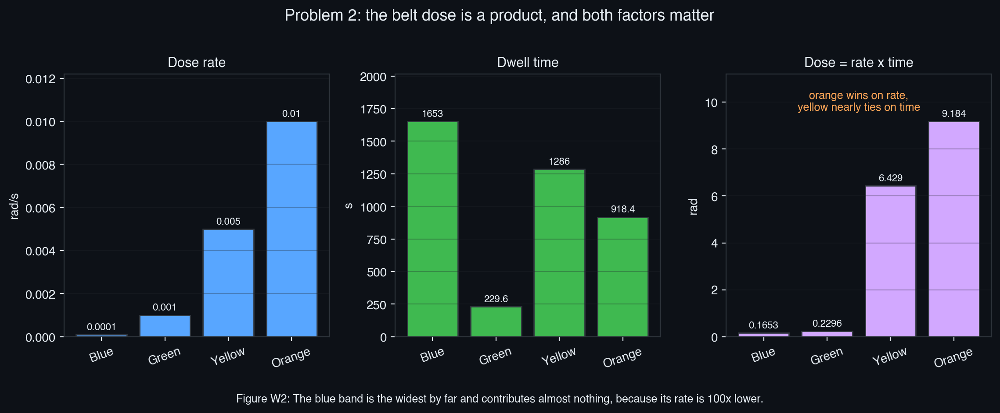
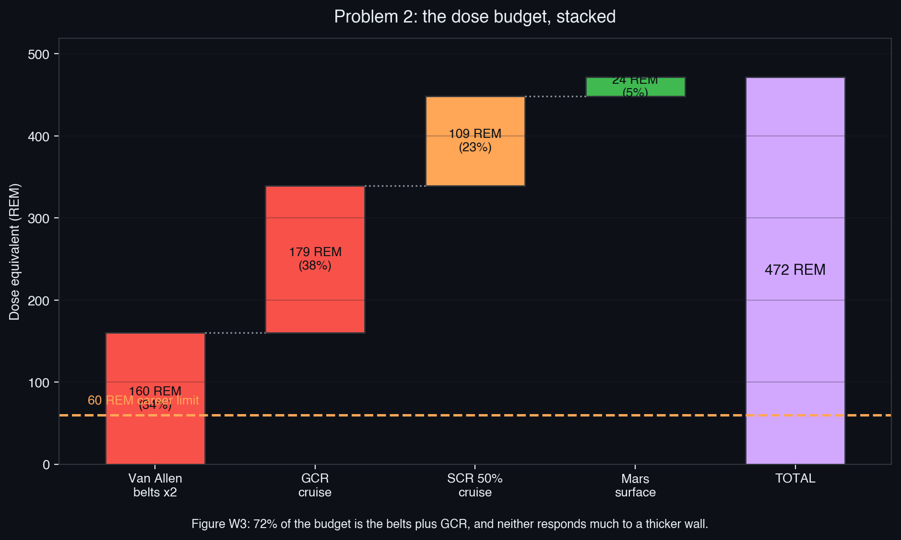
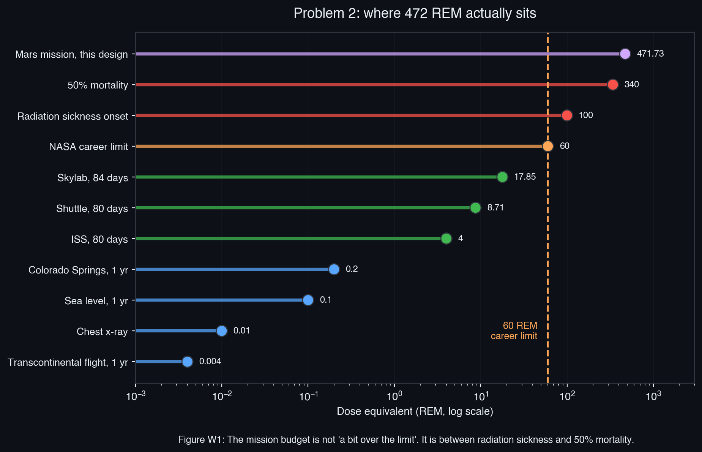
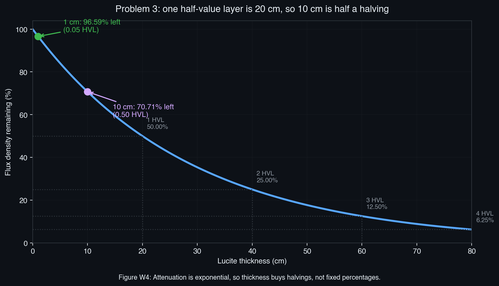
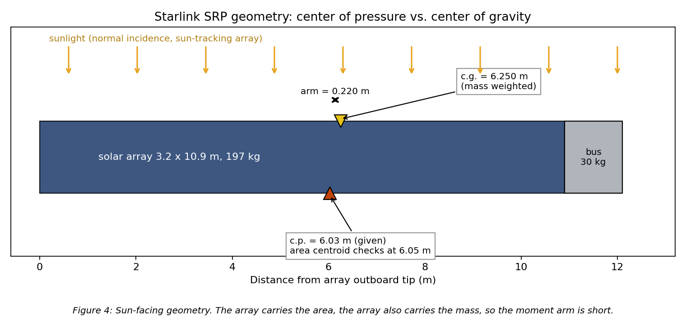
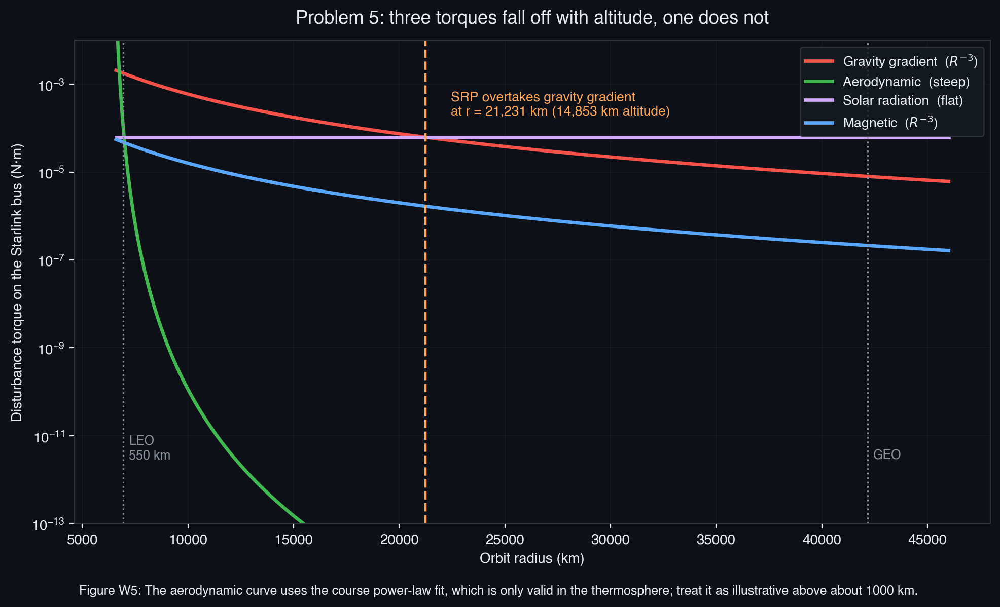

# SPCE 5065 HW #7: Socratic Solution Walkthrough
## Radiation: Human Dose Budgets, Gamma Attenuation, and Disturbance Torques

---

## 30,000-Foot Overview

**The big question: how much radiation does a Mars crew actually soak up, and what, if anything, can an engineer do about it?**

**Problem 1** is the usual current-events writeup. Four classmates present, four short summaries.

**Problem 2** is the heart of the assignment. A crew leaves Earth, punches through the Van Allen belts, coasts for six months, sits on Mars for a year and a half, coasts home for another six months, and punches back through the belts. Each of those phases has its own radiation environment and its own little model, and the job is to add them all up and compare the total against the 60 REM lifetime limit NASA sets for an astronaut. Along the way there is a design decision to make: how thick to build the shield, knowing that every extra centimeter is mass that has to be launched.

**Problem 3** is a two-line calculation about how gamma rays die off inside a slab of plastic. It exists to make sure the exponential attenuation law and the idea of a "half value layer" are solid, because that is the same math that governs whether the shield in Problem 2 does anything.

**Problem 4** switches from biology to mechanics. Sunlight carries momentum, so it pushes on a satellite. If the push does not act exactly through the center of mass, the satellite slowly spins up. The problem asks how big that push is on a Starlink satellite and what size flywheel would be needed to fight it.

**Problem 5** zooms out and asks: of all the things that try to twist a satellite, which one wins? The answer depends entirely on how high you are, and the ranking completely reverses between low orbit and geostationary orbit.

### The thread

The assignment is really two halves of the same idea: **radiation is energy arriving from somewhere, and energy arriving has consequences.** In Problems 2 and 3 the consequence is biological and material damage, and the countermeasure is putting matter in the way. In Problems 4 and 5 the consequence is mechanical, because the same photons that deposit dose also deposit momentum, and the countermeasure is a flywheel. Problem 5 then puts that mechanical effect in context: sunlight is a nuisance in low orbit and the dominant force at geostationary altitude, which is exactly the kind of "it depends where you are" judgment call the course keeps returning to.

### How this connects to earlier work

- **HW2** built the thermosphere density power law, $\rho = 1.020 \times 10^{7} h^{-7.172}$ kg/m³. Problem 5 reuses it directly for the aerodynamic torque.
- **HW4** (plasma) and **HW5** (micrometeoroids) both established the pattern used here: take an environment model off a chart, integrate it over a real trajectory, and compare against a limit. Problem 2 is the same move with a dose chart instead of a flux chart.
- **HW6** (vacuum and thermal) introduced areal-density thinking for mass budgets. Problem 2's shield trade is the same trade in a different currency: grams per square centimeter buying dose reduction instead of buying insulation.
- **Exam 1** ranked LEO hazards. Problem 5 does the same ranking exercise for torques rather than hazards, and adds GEO as a second column.

---

## Problem 1 (10 pts): Current Events Presentations

**Problem Statement:** For each of the current events presentations this week: (a) summarize the presentation, (b) describe something learned from it, (c) write one question left about the presentation.

**The punchline first:** Four presenters this week (Ansley, Pfau, Danover, Adeyomi), all on radiation, and together they build a complete ladder from damage physics up to program-level trades. This section is a writing exercise, not a physics one, but three ideas from it are worth carrying into the rest of the assignment.

| Presenter | Angle | The idea worth keeping |
|:---|:---|:---|
| Jason Ansley | Damage physics + Juno / JunoCam case study | Displacement damage is partly *reversible* by annealing |
| Fanita Pfau | Mission assurance for SpaceX's orbital AI data center | An upset can corrupt model state *without* crashing the node, so detection matters more than prevention |
| Rachel Danover | Electronics design, Van Allen Probes case study | The full single-event taxonomy, and autonomy (command loss timer) as a radiation countermeasure |
| Emmanuel Adeyomi | Materials and program-level trades | Aluminum makes secondaries, so more shielding is not monotonically better |

### 1.1 The damage mechanisms, and which ones can be undone

The Juno case study makes a distinction the course keeps blurring. There are three radiation damage mechanisms, and they are not the same thing:

| Mechanism | What physically happens | Reversible? |
|:---|:---|:---|
| **Total ionizing dose (TID)** | Charge accumulates in oxide layers, shifting transistor threshold voltages | No, cumulative |
| **Displacement damage (DD)** | An energetic particle knocks an atom out of its crystal lattice site | **Partially, by annealing** |
| **Single event effects (SEE)** | One ion deposits enough charge to flip a bit (SEU) or trigger a parasitic path (SEL) | SEU yes, SEL sometimes, burnout no |

The JunoCam story is a displacement-damage story. The camera sits outside Juno's 1 cm titanium vault because it has to see out, so it takes the full Jovian trapped-electron flux. Damage first showed up around orbit 47 and had wrecked nearly every image by orbit 56. The fix was **annealing**: heat the detector to about 77 F and give the displaced atoms enough thermal energy to hop back toward their lattice sites.

**Common Pitfall:** Assuming "permanent" damage is permanent. Displacement damage is frozen-in disorder, and disorder can be partially undone with heat. TID cannot, because trapped charge in an oxide is not a lattice defect.

**Reflection:** This is why a heater on a detector is sometimes a radiation-recovery device and not just a thermal-control device.

---

### 1.2 The single-event family in full

Danover's talk expanded the SEE row into five distinct effects, which is the version worth knowing because the mitigation differs for each:

| Effect | What happens | Recovery |
|:---|:---|:---|
| **SEU** (upset) | One heavily ionizing particle deposits enough charge to flip a node from 1 to 0 or back | Rewrite the bit (EDAC, scrubbing) |
| **SET** (transient) | A brief glitch, typically a voltage spike, propagating through combinational logic | Filtering, or it clocks through harmlessly |
| **SEL** (latch-up) | A parasitic low-impedance path opens between power and ground | Power cycle, if you catch it before thermal damage |
| **SEB** (burnout) | Induced voltage exceeds the transistor breakdown voltage | None, permanent |
| **SEGR** (gate rupture) | A conducting path forms through the gate oxide | None, permanent |

Two of the five are unrecoverable, which is why lowering operating voltage (reducing SEL and SEB headroom) and triple modular redundancy (voting out a corrupted circuit) show up alongside shielding rather than instead of it.

**Common Pitfall:** Treating "single event effect" as a synonym for "bit flip." SEU is the survivable one; SEB and SEGR end the part.

**Reflection:** The Van Allen Probes are the useful counterexample to everything else in this assignment. Every other design avoids the belts; those two were built to live in them, qualified to 34 krad, and lasted three times their design life on individually power-cyclable components, a command loss timer, EDAC with hardware scrubbing, and thick local shielding.

> **Key takeaway from Problem 1:** Radiation damages electronics three different ways, and only one of them (displacement damage) has an in-flight repair path. Knowing which mechanism is killing a part determines whether you shield it, anneal it, vote around it, or accept the loss, and the answer is never "add aluminum" alone, because aluminum generates its own secondaries.

> **Feynman test (in plain English):** Some radiation damage is like dents in a wall you can never undo, and some is like a rug that got scuffed out of place, which you can partly smooth back down if you warm it up.

---

## Problem 2 (40 pts): The Human Mars Mission Dose Budget

**Problem Statement:**
- **(a)** Choose a launch year. Describe the trajectory and expected durations. Explain the rationale for that timeframe, including constraints not specifically listed such as cost and political concerns.
- **(b)** Estimate the total human radiation exposure. State assumptions clearly. Assume an allowable limit of 60 REM total, and that 1 REM = RBE $\times$ RAD. Is radiation a concern?
- **(c)** What could be done to mitigate radiation concerns?

**The punchline first:** The 2035 Type 1 opportunity gives a 936-day round trip, and that crew accumulates about **472 REM**, roughly eight times the 60 REM career limit. No practical shield fixes it, because 72% of the budget comes from the belt crossings and galactic cosmic rays, and neither one responds much to more aluminum.

| Part | Answer | Section |
|:---|:---|:---|
| (a) Launch and profile | Depart 21 Apr 2035, 196 d out, 539 d surface, 201 d back, 936 d total | §2.1, §2.2 |
| (b) Total exposure | 472 REM, 7.9x the 60 REM limit, so yes it is a concern | §2.3 to §2.7 |
| (c) Mitigation | Shorten transit, consumables storm shelter, hydrogen-rich shielding, bury the hab | §2.8 |

---

### 2.1 (a) Picking a launch window off the Burke table

**Before reading on, try this:** The Burke table lists four 2035 departures with $C_3$ values of 10.19, 17.52, 11.80, and 19.33 km²/s². Departure $\Delta v$ from a 400 km parking orbit is $\Delta v = \sqrt{C_3 + 2\mu/r} - \sqrt{\mu/r}$, with $\mu = 398{,}600$ km³/s² and $r = 6778$ km. Which row is cheapest, and roughly how much $\Delta v$ separates it from the most expensive?

**The punchline:** The 21 April 2035 Type 1 row wins on every axis that matters. Lowest $C_3$ (10.19 km²/s²), a 196-day outbound leg, and an arrival excess speed of 2.692 km/s that is near the bottom of the table.

**Derivation and Explanation:**

$C_3$ is the **characteristic energy**, defined as the square of the hyperbolic excess speed:

$$C_3 = v_\infty^2 = \frac{2\varepsilon}{1} = v^2 - \frac{2\mu}{r}$$

It is just twice the specific orbital energy, and it is the standard currency for interplanetary departures because it is independent of what parking orbit you leave from. Higher $C_3$ means you need more speed at burnout, which means more propellant.

Working the retrieval prompt: from a 400 km parking orbit, $r = 6378 + 400 = 6778$ km, so the circular speed is $\sqrt{398600/6778} = 7.669$ km/s. For $C_3 = 10.19$:

$$v_{burnout} = \sqrt{10.19 + \frac{2(398600)}{6778}} = \sqrt{10.19 + 117.62} = 11.305\ \text{km/s}$$
$$\Delta v = 11.305 - 7.669 = 3.636\ \text{km/s}$$

For $C_3 = 19.33$: $v_{burnout} = \sqrt{19.33 + 117.62} = 11.702$, so $\Delta v = 4.033$ km/s. That is **0.40 km/s of difference**, which on a several-hundred-tonne crewed stack is tens of tonnes of propellant. The cheap row is not a small win.

Flight time comes straight from the dates: 21 April 2035 to 3 November 2035. Counting month by month (9 days left in April, then 31 + 30 + 31 + 31 + 30 + 31 + 3) gives **196 days**.

**Common Pitfall:** Reading $C_3$ as if it were a $\Delta v$. It is an energy (km²/s²), and because the departure burn happens deep in Earth's gravity well, a large change in $C_3$ produces a much smaller change in $\Delta v$. That is the Oberth effect showing up in the algebra: the $2\mu/r$ term is 117.62 and dwarfs $C_3$, so the square root compresses the difference.

**Reflection:** Type 1 trajectories stay under 180 degrees of heliocentric transfer angle and are faster; Type 2 go the long way around and take longer. For a crew, faster is better twice over, once for consumables and once for dose.

---

### 2.2 (a) Filling in the stay and the return

**The punchline:** A 539-day surface stay and a 201-day return give a 936-day mission, and the stay length is set by orbital mechanics, not by how much science the crew wants to do.

**Derivation and Explanation:**

Earth and Mars line up for a transfer once every **synodic period**:

$$\frac{1}{T_{syn}} = \left|\frac{1}{T_{Earth}} - \frac{1}{T_{Mars}}\right| = \left|\frac{1}{365.25} - \frac{1}{686.98}\right| = 1.2822\times10^{-3}\ \text{day}^{-1}$$

$$T_{syn} = 779.9\ \text{days}$$

That single number controls the whole mission architecture. Once the crew lands on 3 November 2035, the next good Mars-to-Earth departure does not open until the geometry comes back around. Adding 539 days puts Mars departure on 25 April 2037, which is 735 days after Earth departure, just inside the 779.9-day synodic period. Leaving any earlier means an **opposition-class** mission: a short stay bought by a much more energetic return that typically swings inside Venus's orbit.

For a radiation problem specifically, that opposition-class option is a trap. It shortens total mission time, which sounds like less dose, but it drags the crew to about 0.7 AU where solar particle intensity scales roughly as $1/r^2$ and the crew spends the extra energy budget on propellant instead of shielding.

**Common Pitfall:** Treating the surface stay as a free variable set by mission objectives. It is set by the return window, and the two conjunction-class options are roughly 500 days on the surface or roughly 30 days plus a Venus flyby. There is very little in between.

**Reflection:** This is why every serious human Mars architecture converges on about 900 days total. It is not a preference, it is the synodic period.

---

### 2.3 (b) The belt crossing: dose is a product

**Before reading on, try this:** The spacecraft moves at 25,000 km/hr. How many seconds does it spend crossing 1 Earth radius (6378 km)? Then multiply that by the 1.4 $R_e$ width and the 0.005 rad/s rate of the yellow band to get the yellow band dose.

**The punchline:** One crossing delivers **16.008 rad**. Round trip, **32.02 rad**. The whole thing takes 68 minutes each way.

**Derivation and Explanation:**

The conversion that unlocks the problem is time per Earth radius:

$$v = \frac{25{,}000\ \text{km/hr}}{3600\ \text{s/hr}} = 6.9444\ \text{km/s}$$

$$t_{1 R_e} = \frac{6378\ \text{km}}{6.9444\ \text{km/s}} = 918.43\ \text{s}$$

Everything else is multiplication. Dose in a band is rate times dwell time, and dwell time is band width times 918.43 s:

$$D_i = \dot{D}_i \cdot w_i \cdot t_{1R_e}$$

| Band | $\dot{D}$ (rad/s) | $w$ ($R_e$) | $t$ (s) | $D$ (rad) |
|:---|---:|---:|---:|---:|
| Blue | 0.0001 | 1.80 | 1653.2 | 0.1653 |
| Green | 0.0010 | 0.25 | 229.6 | 0.2296 |
| Yellow | 0.0050 | 1.40 | 1285.8 | 6.4290 |
| Orange | 0.0100 | 1.00 | 918.4 | 9.1843 |
| Red | 0.0500 | 0.00 | 0.0 | 0.0000 |

Working the retrieval prompt: yellow gives $0.005 \times 1.4 \times 918.43 = 6.429$ rad. Sum the column, get 16.008 rad one way, double it for the return.

**Figure W2** is the reason to draw this rather than just tabulate it. The blue band is the **widest** of the four, 1.8 $R_e$ against orange's 1.0, and it contributes 0.17 rad against orange's 9.18. Width alone tells you nothing; the rate spans two orders of magnitude and dominates the product.

**Common Pitfall:** Forgetting the return trip. The problem statement says it explicitly ("you must account for the Van Allen Belt radiation both leaving and returning") and it is a factor of two on the single largest line item in the budget.

**Second pitfall:** Assuming the red band contributes nothing because its dose rate is listed. It contributes nothing because the *path length is zero*. The Apollo trajectory was deliberately shaped to skirt the heart of the inner belt, which is visible in Figure 1 of the assignment as the track curving up and away from the red core.

**Reflection:** This is the same "flux times exposure" structure as the micrometeoroid problem in HW5. Environment intensity times time in the environment equals accumulated effect, every time.

---

### 2.4 (b) rad versus REM, and why RBE exists

**The punchline:** A rad measures **energy deposited**; a REM measures **biological harm**. RBE is the conversion, and it is not 1 for anything interesting in space.

**Derivation and Explanation:**

- **rad** (radiation absorbed dose): 100 erg of energy deposited per gram of material, equal to 0.01 J/kg. It is pure physics, and it does not care what kind of particle delivered the energy.
- **RBE** (relative biological effectiveness): a dimensionless multiplier capturing the fact that the *same* deposited energy does different amounts of damage depending on how densely the particle ionizes along its track.
- **REM** (roentgen equivalent man): $\text{REM} = \text{RBE} \times \text{rad}$.

Why the multiplier is not 1: a 1 MeV electron spreads its energy over a long, thin track and leaves scattered isolated ionizations, most of which a cell can repair. An iron nucleus at the same total energy deposit dumps everything into a short, dense track and produces clustered double-strand DNA breaks that repair machinery handles badly. Same rad, very different biology.

The course table gives:

| Environment | RBE |
|:---|---:|
| EM radiation at Earth | 1 |
| Radiation belts | 5 to 7 |
| Charged particles | 10 |

So the belt line becomes:

$$D_{eq} = 32.02\ \text{rad} \times 5 = 160.1\ \text{REM}$$

**Common Pitfall:** Applying an RBE to a number that is already a dose equivalent. The Mars surface map in Figure 4 of the assignment is labeled "Dose Equivalent Values (rem/yr)". Multiplying that by 10 would inflate the surface term by an order of magnitude. Always check the units on the chart before reaching for RBE.

**Reflection:** In modern usage RBE has largely been replaced by the radiation weighting factor $w_R$ and the sievert (1 Sv = 100 REM), but the arithmetic is identical.

---

### 2.5 (b) Reading the assignment's Figure 2 and picking a shield thickness

**Before reading on, try this:** From the assignment's Figure 2 at a shield thickness of 10 g/cm², read off the GCR dose and the SCR 50% dose for a one-year trajectory. Then scale both to a 397-day cruise. Which one is bigger, and by how much?

**The punchline:** 10 g/cm² is the knee of the curve. Below it the solar particle dose explodes; above it, mass climbs linearly while dose barely moves.

**Derivation and Explanation:**

The assignment's Figure 2 plots absorbed dose against **areal density** in g/cm², not against physical thickness. That choice is deliberate and worth internalizing: what stops a charged particle is the number of electrons it has to plow through, which is mass per unit area, not centimeters. To convert:

$$x_{physical} = \frac{\sigma}{\rho}, \qquad \text{so } 10\ \text{g/cm}^2 \text{ of aluminum } (\rho = 2.7) = 3.7\ \text{cm}$$

The same 10 g/cm² of polyethylene ($\rho = 0.94$) is 10.6 cm thick but weighs exactly the same, and stops *more* because it has more hydrogen per gram.

The two curves behave completely differently:

- **SCR (solar cosmic radiation)** is mostly protons in the tens-to-hundreds of MeV range. Those have a finite range in matter, so a modest slab stops them outright. From 1 to 10 g/cm² the dose drops from 1000 rad to 10 rad, a factor of 100.
- **GCR** is mostly relativistic protons and heavy nuclei at GeV energies. Their range is enormous, and worse, when they do interact they **fragment**, producing showers of secondary particles. Over the same 1 to 10 g/cm² the dose goes from 17.5 to 16.5 rad, a 6% improvement.

Scaling to the actual cruise, $397/365.25 = 1.087$ years:

$$D_{GCR} = 16.5 \times 1.087 = 17.93\ \text{rad}, \qquad D_{SCR} = 10.0 \times 1.087 = 10.87\ \text{rad}$$

Both get RBE 10, giving 179.3 REM and 108.7 REM.

The mass side of the trade: wrapping a 145 m² habitat (a 4.5 m by 8 m cylinder) at areal density $\sigma$ costs

$$m = \sigma \cdot A = \sigma\ [\text{g/cm}^2] \times 145\ \text{m}^2 \times 10^4\ \frac{\text{cm}^2}{\text{m}^2} = 1450\,\sigma\ \text{kg}$$

so 10 g/cm² is 14.5 tonnes, and 100 g/cm² is **145 tonnes** of shielding alone.

**Common Pitfall:** Chasing the shield curve down and concluding that 100 g/cm² "solves it." It does not. The mission total at 100 g/cm² is still 262 REM, four times the limit, for ten times the shield mass. The curve flattens because GCR flattens.

**Reflection:** This is the single most important result in the entire problem, and it is a design result rather than a physics result: **there is no passive shield thickness that makes a conjunction-class Mars mission compliant.**

---

### 2.6 (b) The Mars surface term

**The punchline:** 539 days on Mars costs about 23.6 REM, only 5% of the budget, because Mars still has an atmosphere and half a sky's worth of solid planet underneath.

**Derivation and Explanation:**

Jezero Crater sits at 18.4 deg N, 77.7 deg E. Reading the assignment's Figure 4 there gives roughly 16 rem/yr, so

$$D_{surface} = 16\ \frac{\text{rem}}{\text{yr}} \times \frac{539}{365.25} = 23.6\ \text{REM}$$

Two things make the surface far friendlier than deep space. First, the planet itself blocks the lower hemisphere, immediately halving the incoming flux. Second, the atmosphere, thin as it is, provides about 16 g/cm² of vertical column, comparable to the transit shield.

The elevation dependence is visible right on the map. The deep blue low-dose spot is **Hellas Basin**, the lowest point on Mars at about 7 km below datum, which means several extra g/cm² of CO₂ overhead. Jezero at 2.6 km below datum gets a smaller version of the same benefit.

**Common Pitfall:** Reading a color map to three significant figures. Running the number at 14 and at 18 rem/yr moves the mission total from 469 to 475 REM, a 1.3% swing, so precision here is wasted effort. Knowing *that* the read barely matters is more valuable than a careful read.

**Reflection:** Counterintuitively, the safest place on the whole mission is the surface of Mars, not the spacecraft.

---

### 2.7 (b) Assembling the budget and checking it against reality

**The punchline:** 472 REM total, 7.9 times the limit. Two independent cross-checks bracket it and both agree the mission busts the limit.

**Derivation and Explanation:**

| Phase | Absorbed (rad) | RBE | Dose equivalent (REM) | Share |
|:---|---:|---:|---:|---:|
| Van Allen belts, both crossings | 32.02 | 5 | 160.1 | 34% |
| GCR, both cruise legs | 17.93 | 10 | 179.3 | 38% |
| SCR 50%, both cruise legs | 10.87 | 10 | 108.7 | 23% |
| Mars surface | (already rem) | 1 | 23.6 | 5% |
| **Total** | | | **471.7** | |

**Figure W1** is the one to remember. 472 REM is not "slightly over a conservative limit." It sits above the 100 REM threshold where acute radiation sickness begins and creeps toward the 340 REM level associated with 50% mortality without medical care. The number is alarming enough that it demands verification, which is what the two cross-checks are for.

**Cross-check 1, flight data (lower bound).** MSL/RAD actually measured the cruise environment on the way to Mars: 1.8 mSv/day in transit and 0.64 mSv/day on the surface. Converting (1 Sv = 100 REM, so 1 mSv = 0.1 REM):

$$D_{cruise} = 1.8\ \frac{\text{mSv}}{\text{d}} \times 397\ \text{d} \times 0.1\ \frac{\text{REM}}{\text{mSv}} = 71.5\ \text{REM}$$
$$D_{surface} = 0.64 \times 539 \times 0.1 = 34.5\ \text{REM}$$

Total about **106 REM**, or 1.06 Sv, which is the published figure for a conjunction-class Mars mission. Still 1.8 times the limit.

**Cross-check 2, Apollo (upper bound sanity).** The Apollo 11 crew measured a total skin dose of 0.18 rad for the entire mission, not the 32 rad this model predicts for the belt crossings alone. The difference is spacecraft structure: the command module's walls stopped essentially every trapped electron. So the 160 REM belt line is an **unshielded free-space** number, and the real shielded value is a small fraction of it.

The two checks bracket the answer from both sides: the model is conservative, the flight data is optimistic, and the conclusion is identical either way.

**Common Pitfall:** Reporting 472 REM without noticing that the RBE of 10 is being applied to solar protons, whose real quality factor is closer to 1.5 to 2. Flagging that, and showing that the conclusion survives the correction, is what makes the answer defensible rather than just arithmetic.

**Reflection:** A number that lands outside every reference point you know is either a discovery or a mistake, and the only way to tell is an independent check.

---

### 2.8 (c) What actually moves the needle

**The punchline:** Sorted by REM removed per kilogram spent, the winners are a faster transit and a storm shelter built from consumables. Thicker walls are near the bottom of the list.

**Derivation and Explanation:**

The budget itself tells you where to attack. Working down Table 4 by size:

1. **GCR (179 REM, 38%).** Linear in exposure time, nearly flat in shield thickness. The only real lever is **going faster**. Halving the 397-day cruise removes about 90 REM. Nuclear thermal propulsion is the reason DRA 5.0 keeps appearing in Mars architectures.
2. **Belts (160 REM, 34%).** Dose is rate times dwell time, so a higher-energy trans-Mars injection cuts it directly, and departing from a high-inclination parking orbit lets the escape path clip the belts near the poles rather than through the equatorial core. This is the most reducible line item in the whole budget.
3. **SCR (109 REM, 23%).** A **storm shelter** at 40 g/cm² drops the SCR term below 1 rad. The trick that makes it nearly free is building it out of water, food, and waste that are already in the mass budget, so the shielding costs geometry rather than mass.
4. **Mars surface (24 REM, 5%).** Two to three meters of regolith over the habitat is 300 to 500 g/cm² and drives this to near zero. Cheap, because the mass is already on Mars.

Material choice cuts across all of them: hydrogen-rich materials (polyethylene, water) beat aluminum per unit areal density because stopping power scales with electron density, and high-Z materials actively make GCR worse by fragmenting heavy ions into secondary showers.

The solar cycle is a genuine two-sided trade. GCR flux is **anti-correlated** with solar activity, because a more active Sun inflates the heliosphere and deflects more galactic particles. Launching near solar maximum therefore cuts the irreducible GCR term, at the cost of more frequent solar particle events, which the storm shelter already handles. The 2035 window lines up with the cycle 26 peak, so that choice was free.

**Common Pitfall:** Listing "more shielding" first. It is the intuitive answer and it is close to the worst one, because it attacks the one term (GCR) that shielding barely touches while paying full mass price.

**Reflection:** Every good mitigation here either removes exposure time or reuses mass that was already going to fly. Adding new mass is the last resort.

> **Results for Problem 2**
> - **(a)** Depart Earth 21 April 2035 (Type 1, $C_3$ = 10.19 km²/s²), arrive Mars 3 November 2035 after **196 days**; **539-day** surface stay at Jezero; **201-day** return; **936 days (2.56 yr)** total.
> - **(b)** $\boxed{D_{total} \approx 472\ \text{REM}}$, which is **7.9 times** the 60 REM career limit. Radiation is a concern, decisively.
> - **(c)** Faster transits, a consumables-built storm shelter, hydrogen-rich shield materials, a faster and higher-inclination belt crossing, regolith over the surface habitat, and solar-cycle-aware launch timing.

> **Key takeaway from Problem 2:** The mission dose is dominated by two terms that shielding barely touches: the belt crossing (a rate-times-time product fixed by trajectory shape) and GCR (relativistic particles whose secondaries partly replace what the shield absorbs). That is why every practical mitigation attacks exposure *time* or reuses mass already in the budget, rather than adding wall thickness.

> **Feynman test (in plain English):** You cannot hide from the fast stuff, so the only real defense is to spend less time out there, and to stack the water and food you were already carrying between yourself and the Sun.

---

## Problem 3 (20 pts): Gamma Attenuation in Lucite

**Problem Statement:** Determine the fraction remaining of the flux density of 10 MeV gamma rays that travel 1 and 10 cm in Lucite. Assume the half value layer for 10 MeV gamma rays in Lucite is 20 cm.

**The punchline first:** 96.59% remains after 1 cm, 70.71% after 10 cm. The second answer is exactly $1/\sqrt{2}$, because 10 cm is precisely half of one half-value layer.

---

### 3.1 Where the exponential comes from

**Before reading on, try this:** If each thin slice $dx$ of material removes a fixed *fraction* of whatever photons reach it, what differential equation does that describe, and what is its solution?

**The punchline:** Constant fractional removal per unit thickness is the definition of exponential decay.

**Derivation and Explanation:**

Start from the microscopic picture on the lesson slide. A photon beam of flux density $I$ (photons per cm² per second) crosses a slab of thickness $dx$ containing $n$ target atoms per cm³, each presenting a scattering cross section $\sigma$ in cm² per atom. The number removed is

$$dI = -\sigma I n\, dx$$

Every symbol earns its place: $\sigma n$ has units of cm²/atom times atoms/cm³ = 1/cm, so $\sigma n\, dx$ is dimensionless, which it must be since $dI/I$ is dimensionless. Separating and integrating:

$$\int_{I_0}^{I} \frac{dI}{I} = -\sigma n \int_0^x dx \quad\Longrightarrow\quad \ln\frac{I}{I_0} = -\sigma n x \quad\Longrightarrow\quad I = I_0 e^{-\sigma n x}$$

Bundling $\sigma n$ into a single **linear attenuation coefficient** $\mu$ (units 1/cm):

$$I = I_0 e^{-\mu x}$$

The **half value layer** is defined by asking what thickness halves the beam:

$$\frac{1}{2} = e^{-\mu\,\text{HVL}} \quad\Longrightarrow\quad \ln\frac{1}{2} = -\mu\,\text{HVL} \quad\Longrightarrow\quad \boxed{\text{HVL} = \frac{\ln 2}{\mu}}$$

**Common Pitfall:** Treating attenuation as if it removed a fixed *number* of photons per centimeter rather than a fixed *fraction*. Under that (wrong) model, 20 cm halves the beam and 40 cm would zero it. Under the correct exponential model, 40 cm leaves 25% and no finite thickness ever reaches zero.

**Reflection:** Because the removal is fractional, gamma shielding is specified in halvings, not in percentages. "Three HVLs" means one eighth gets through, whatever material you are using.

---

### 3.2 Evaluating for Lucite

**The punchline:** $\mu = 0.034657$ cm⁻¹, and the two answers follow in one line each.

**Derivation and Explanation:**

$$\mu = \frac{\ln 2}{\text{HVL}} = \frac{0.693147}{20\ \text{cm}} = 0.034657\ \text{cm}^{-1}$$

$$\frac{I}{I_0}\bigg|_{1\ \text{cm}} = e^{-0.034657(1)} = e^{-0.034657} = 0.96594$$

$$\frac{I}{I_0}\bigg|_{10\ \text{cm}} = e^{-0.034657(10)} = e^{-0.34657} = 0.70711$$

$$\boxed{96.59\%\ \text{remains at 1 cm}, \qquad 70.71\%\ \text{remains at 10 cm}}$$

**Two checks.**

First, 10 cm is exactly 0.5 HVL, so the answer must be $2^{-1/2} = 0.70711$ without touching a calculator. Any answer that is not $1/\sqrt{2}$ has an arithmetic error in it.

Second, a plausibility check on $\mu$ itself. Dividing by the density of Lucite (PMMA, 1.19 g/cm³) gives the **mass attenuation coefficient**:

$$\frac{\mu}{\rho} = \frac{0.034657}{1.19} = 0.0291\ \text{cm}^2/\text{g}$$

A few hundredths of cm²/g is right for a low-Z plastic at 10 MeV, where Compton scattering dominates and $\mu/\rho$ is near its minimum across the whole gamma spectrum.

**Common Pitfall:** Reporting the fraction *removed* instead of the fraction *remaining*. The problem asks for what is left. At 1 cm, 96.59% remains and 3.41% is removed.

**Reflection:** 10 cm of Lucite removes less than a third of a 10 MeV gamma beam. That is worth internalizing before designing anything: Lucite is a viewport material, not a shield.

> **Key takeaway from Problem 3:** Attenuation is exponential because each slice removes a constant *fraction*, not a constant *number*, so thickness buys halvings. HVL and $\mu$ are the same fact written two ways, connected by $\mu = \ln 2 / \text{HVL}$.

> **Feynman test (in plain English):** Each layer of plastic blocks the same share of whatever is left, like folding a paper in half over and over, so you never get to zero, you just keep halving.

---

## Problem 4 (20 pts): Solar Radiation Pressure Torque on Starlink

**Problem Statement:** Estimate the solar radiation disturbance torque on a Starlink satellite. Body 3.2 x 1.6 x 1.2 m³, 30 kg. Solar array 3.2 x 10.9 m², 197 kg, sun-tracking. Assume it faces the Sun at all times.
- **(a)** Find the SRP force. Assume a center of pressure of 6.03 m.
- **(b)** What size and power would you recommend for the momentum wheels? Include a margin factor.

**The punchline first:** The force is $2.82\times10^{-4}$ N and the torque is only $6.20\times10^{-5}$ N-m, because the array carries almost all of both the area and the mass, which pins the center of pressure and center of gravity within 22 cm of each other.

| Part | Answer | Section |
|:---|:---|:---|
| (a) SRP force | $2.823\times10^{-4}$ N | §4.1 |
| (a) SRP torque | $6.20\times10^{-5}$ N-m | §4.3 |
| (b) Wheel sizing | Small-sat class, $\le$ 0.05 N-m, 5 kg and 10 W per wheel | §4.4 |

---

### 4.1 (a) The SRP force formula, term by term

**Before reading on, try this:** Sunlight at Earth carries 1367 W/m². Photons carry momentum $p = E/c$. What pressure does a perfectly absorbing 1 m² panel feel, and what changes if the panel is perfectly reflecting instead?

**The punchline:** $F = F_s A_s (1+q)\cos i / c = 2.823\times10^{-4}$ N.

**Derivation and Explanation:**

Working the retrieval prompt first, because it explains where the formula comes from. Power $P$ arriving per second carries momentum $P/c$ per second, and momentum per second is force:

$$P_{rad} = \frac{F_s}{c} = \frac{1367}{3\times10^8} = 4.557\times10^{-6}\ \text{N/m}^2$$

That is for **absorption**: the photon arrives and stops, transferring one unit of momentum. For **reflection** the photon arrives and leaves in the opposite direction, transferring two units, so a perfect mirror feels twice the pressure. Real surfaces are in between, which is exactly what the reflectance factor $q$ captures:

$$F = \frac{F_s A_s (1 + q)\cos i}{c}$$

with $q = 0$ for a perfect absorber, $q = 1$ for a perfect mirror, and the course value $q = 0.6$ for a typical spacecraft surface.

**Sunlit area.** The array is $3.2 \times 10.9 = 34.88$ m². For the bus, the face coplanar with the array is $3.2 \times 1.2 = 3.84$ m². Total $A_s = 38.72$ m².

The satellite is sun-facing and the array is sun-tracking, so $i = 0$ and $\cos i = 1$:

$$F = \frac{1367 \times 38.72 \times 1.6 \times 1}{3\times10^8} = \frac{84{,}690}{3\times10^8} = \boxed{2.823\times10^{-4}\ \text{N}}$$

**Common Pitfall:** Using only the array area and forgetting the bus, or using the bus's largest face ($3.2 \times 1.6$) instead of the one that actually faces the Sun. The choice matters twice: once in the force, and again in where the center of pressure sits.

**Reflection:** $2.8\times10^{-4}$ N is about the weight of a grain of rice on Earth. Over a 5-year mission it is still enough to matter, which is the whole point of disturbance analysis.

---

### 4.2 (a) A coordinate frame you can check

**The punchline:** Put the origin at the outboard tip of the array. The area-weighted centroid then comes out at 6.05 m, within 0.4% of the given 6.03 m, which confirms the frame before any real work happens.

**Derivation and Explanation:**

The problem hands over a center of pressure ("assume 6.03 m") without saying what it is measured from. That is a trap unless the frame is pinned down, because the torque depends on the *difference* between two positions and both have to live in the same coordinate system.

Setting $x = 0$ at the array's outboard tip with $+x$ toward the bus:

- Array: spans 0 to 10.9 m, area centroid at 5.45 m, area 34.88 m²
- Bus: spans 10.9 to 12.1 m, area centroid at 11.50 m, area 3.84 m²

The area-weighted centroid of the sunlit face is

$$c_{ps} = \frac{\sum A_i x_i}{\sum A_i} = \frac{34.88(5.45) + 3.84(11.50)}{38.72} = \frac{190.10 + 44.16}{38.72} = 6.05\ \text{m}$$

That reproduces the given 6.03 m, which means the frame is the intended one. If it had come out at 4.65 m (which is what you get putting the origin at the *inboard* end of the array) the frame would be wrong and every downstream number with it.

**Common Pitfall:** Skipping the check and just subtracting 6.03 from whatever cg the chosen origin produces. The moment arm here is 0.22 m; a frame error of 1.6 m (the bus length) changes the torque by a factor of eight.

**Reflection:** When a problem gives a number without a reference frame, reproducing that number from the geometry is how you discover which frame was meant.

---

### 4.3 (a) Center of gravity, and the moment arm

**Before reading on, try this:** Using the same origin, compute the mass-weighted centroid of the 197 kg array (centroid at 5.45 m) and the 30 kg bus (centroid at 11.50 m). How far is it from the 6.03 m center of pressure?

**The punchline:** $c_g = 6.250$ m, so the moment arm is only 0.220 m, and the torque is $6.20\times10^{-5}$ N-m.

**Derivation and Explanation:**

$$c_g = \frac{\sum m_i x_i}{\sum m_i} = \frac{197(5.45) + 30(11.50)}{227} = \frac{1073.65 + 345.0}{227} = 6.250\ \text{m}$$

$$c_{ps} - c_g = 6.03 - 6.250 = -0.220\ \text{m}$$

$$M_{sp} = |F(c_{ps} - c_g)| = 2.823\times10^{-4} \times 0.2196 = \boxed{6.20\times10^{-5}\ \text{N}\cdot\text{m}}$$

The reason the arm is small is structural, not accidental. The array holds **90%** of the sunlit area (34.88 of 38.72) and **87%** of the mass (197 of 227). Both weighted averages therefore get dragged out toward the array's own centroid at 5.45 m, and they land within a quarter meter of each other.

The sensitivity makes the point sharply. Swap the masses so the bus is the heavy end (197 kg bus, 30 kg array):

$$c_{g,swapped} = \frac{30(5.45) + 197(11.50)}{227} = 10.70\ \text{m}, \qquad \text{arm} = |6.03 - 10.70| = 4.67\ \text{m}$$

That is **21 times** the baseline arm, and 21 times the torque, from the same force. The disturbance torque is a statement about mass distribution, not about how much sunlight the vehicle catches.

**Common Pitfall:** Assuming a big array automatically means a big SRP torque. It means a big SRP *force*. Whether that becomes torque depends on whether the mass tracks the area.

**Reflection:** Designing a satellite so mass and area have the same centroid is a real and cheap attitude-control strategy, and it is why some GEO buses carry trim tabs to null the residual offset.

---

### 4.4 (b) Torque authority versus momentum storage

**The punchline:** With 100% margin the wheel needs $1.24\times10^{-4}$ N-m of torque, which is trivially met, but it must store 0.45 N-m-s per orbit, and *that* is the requirement that actually sizes the wheel.

**Derivation and Explanation:**

The course sizing rule is

$$M_{RW} = T_D\,(1 + \text{margin factor})$$

Using a margin factor of 1.0 (100%), reasonable at a stage where the reflectance factor, the residual dipole, and the true cp location are all estimates:

$$M_{RW} = 6.20\times10^{-5} \times 2 = 1.24\times10^{-4}\ \text{N}\cdot\text{m}$$

But torque authority only tells you how fast the wheel can react. What actually fills a wheel up is **stored angular momentum**, and that depends on whether the disturbance is cyclic (averages to zero each orbit, so the wheel just sloshes) or secular (accumulates).

For a sun-pointing vehicle the SRP torque is **secular**: the Sun is always on the same side, so the torque never reverses sign while the satellite is lit. Momentum piles up for the whole sunlit arc.

The sunlit fraction, worst case, is set by the shadow geometry. The satellite is inside Earth's cylindrical shadow whenever it is within an angle $\arcsin(R_E/r)$ of the anti-solar point, so

$$f_{sun} = 1 - \frac{\arcsin(R_E/r)}{\pi} = 1 - \frac{\arcsin(6378/6928)}{\pi} = 1 - \frac{1.1701}{\pi} = 0.628$$

At 550 km the orbital period is

$$T = 2\pi\sqrt{\frac{r^3}{\mu}} = 2\pi\sqrt{\frac{(6.928\times10^6)^3}{3.986\times10^{14}}} = 5739\ \text{s} = 95.6\ \text{min}$$

so per orbit the wheel absorbs

$$h = T_D\,t_{sunlit} = 6.20\times10^{-5} \times (5739 \times 0.628) = 0.223\ \text{N}\cdot\text{m}\cdot\text{s}$$

With the same 100% margin, **0.45 N-m-s** of storage before desaturation is required.

**Recommendation.** $1.24\times10^{-4}$ N-m is three orders of magnitude under the 0.05 N-m small-satellite threshold, so the course table puts this in the small-sat class: **5 kg and 10 W per wheel**. Four wheels in a pyramid (three axes plus one spare) gives 20 kg and 40 W.

That 20 kg is 8.8% of a 227 kg satellite, which is clearly conservative; a real wheel sized for $10^{-3}$ N-m is closer to 0.5 kg and 2 W. The table is aimed at a larger bus class, so it should be carried as a budget placeholder and traded down once a specific wheel is selected.

**Common Pitfall:** Stopping at torque authority and never computing stored momentum. A wheel that can produce the torque but saturates in half an orbit is useless. Momentum storage plus a desaturation path (magnetorquers in LEO, thrusters at GEO) is the real requirement pair.

**Reflection:** Magnetorquers can dump 0.45 N-m-s per orbit easily at 550 km, which is why a LEO constellation satellite does not need propellant for attitude control. At GEO the field is 225 times weaker and the same architecture stops working.

> **Results for Problem 4**
> - **(a)** $\boxed{F_{SRP} = 2.823\times10^{-4}\ \text{N}}$ and $\boxed{M_{SRP} = 6.20\times10^{-5}\ \text{N}\cdot\text{m}}$ (moment arm 0.220 m)
> - **(b)** With a 100% margin factor: $M_{RW} = 1.24\times10^{-4}$ N-m, storage 0.45 N-m-s per orbit. Recommend $\boxed{\text{small-sat class wheels: } \le 0.05\ \text{N}\cdot\text{m},\ 5\ \text{kg},\ 10\ \text{W each}}$, four in a pyramid for 20 kg and 40 W.

> **Key takeaway from Problem 4:** SRP force scales with sunlit area, but SRP *torque* scales with the offset between the area centroid and the mass centroid. On Starlink those nearly coincide because the array dominates both, so a 39 m² sail produces only 62 micronewton-meters of torque. Sizing a wheel then needs two numbers, not one: torque authority and momentum storage.

> **Feynman test (in plain English):** Sunlight pushes on the whole panel, but it only spins the satellite if the push lands away from the balance point, and on this design the heavy part and the wide part are the same part.

---

## Problem 5 (20 pts): The Four Disturbance Torques, LEO versus GEO

**Problem Statement:** What are the four main disturbance torques and how do they affect a spacecraft? Quantify and rank order the relative influences for a LEO satellite and a GEO satellite. What is the ratio of expected LEO to GEO disturbances?

**The punchline first:** Gravity gradient wins in LEO, solar radiation pressure wins at GEO, and the ranking flips because three of the four torques fall off with altitude and one does not. Total LEO disturbance is about **29 times** total GEO disturbance.

---

### 5.1 The four formulas and, more importantly, their scalings

**Before reading on, try this:** Of gravity gradient, solar pressure, magnetic, and aerodynamic torque, which ones contain an explicit power of orbit radius, and what power? Predict the ranking at GEO before computing anything.

**The punchline:** Two go as $R^{-3}$, one falls off far faster than any power law, and one is flat.

**Derivation and Explanation:**

| Torque | Formula | Physical mechanism | Altitude scaling |
|:---|:---|:---|:---|
| Gravity gradient | $M_g = \dfrac{3\mu}{2R^3}\lvert I_{yaw} - I_{other}\rvert \sin 2\theta$ | Near side pulled harder than far side, so an elongated body swings toward local vertical | $R^{-3}$ |
| Solar radiation | $M_{sp} = F(c_{ps} - c_g)$, $F = F_s A_s(1+q)\cos i / c$ | Photon momentum acting off the mass center | **flat** |
| Magnetic | $M_m = DB$, $B \approx 2M_\oplus/R^3$ | Vehicle's residual dipole aligning with Earth's field | $R^{-3}$ |
| Aerodynamic | $M_a = F(c_{pa} - c_g)$, $F = \tfrac12 \rho C_d A V^2$ | Residual gas hitting the ram area off the mass center | $\rho V^2$, nearly exponential |

Beyond magnitude, each one behaves differently in time, which drives how the control system handles it:

- **Gravity gradient** is secular in the body frame and cyclic in the inertial frame. It is the only one that can be exploited: a gravity-gradient boom is passive stabilization for free.
- **Solar pressure** is cyclic for an Earth-pointing vehicle (the Sun sweeps around once per orbit) and secular for a sun-pointing one. It also gets *worse with age*, because $q$ drifts as coatings darken.
- **Magnetic** torque is the one the control system deliberately runs in reverse: magnetorquers create a commanded dipole to dump wheel momentum.
- **Aerodynamic** torque is the least predictable of the four, because thermospheric density swings by more than an order of magnitude across the solar cycle.

**Common Pitfall:** Memorizing the ranking instead of the scalings. The ranking is a consequence of the scalings plus a particular spacecraft, and it changes with altitude, geometry, and mass distribution.

---

### 5.2 Getting the inertias

**The punchline:** $I_x = 200$, $I_y = 2913$, $I_z = 3101$ kg-m², so $|I_{max} - I_{min}| = 2901$ kg-m².

**Derivation and Explanation:**

Gravity gradient needs an inertia difference, so the Starlink geometry from Problem 4 has to be turned into a full inertia tensor about the center of gravity at 6.250 m. Axes: $x$ along the 10.9 m array length, $y$ along the 3.2 m width, $z$ normal to the array plane.

For the array treated as a thin plate of mass 197 kg, using the standard plate results plus the parallel axis theorem with $d = 5.45 - 6.250 = -0.800$ m:

$$I_{x,array} = \frac{m w^2}{12} = \frac{197(3.2)^2}{12} = 168.1\ \text{kg}\cdot\text{m}^2$$
$$I_{y,array} = \frac{m L^2}{12} + m d^2 = \frac{197(10.9)^2}{12} + 197(0.800)^2 = 1950.3 + 126.0 = 2076.3$$
$$I_{z,array} = \frac{m(L^2 + w^2)}{12} + m d^2 = 2118.6 + 126.0 = 2244.6$$

The bus is a 30 kg box at $d = 11.50 - 6.250 = 5.25$ m, and the parallel-axis term ($30 \times 5.25^2 = 827$ kg-m²) swamps its own inertia entirely. Summing:

$$I_x = 200.1, \qquad I_y = 2913.4, \qquad I_z = 3100.7\ \text{kg}\cdot\text{m}^2$$

Worst case for gravity gradient uses the largest available difference, $|I_z - I_x| = 2900.6$ kg-m².

**Common Pitfall:** Forgetting the parallel axis theorem on the bus. Its own inertia is about 32 kg-m² and its offset contribution is 827 kg-m², so leaving it out throws away 96% of the bus's contribution.

**Reflection:** This vehicle is extremely non-spherical, $I_{max}/I_{min} = 15.5$, which is exactly what makes gravity gradient the dominant LEO torque here.

---

### 5.3 Running the numbers

**The punchline:** In LEO, gravity gradient beats drag beats solar beats magnetic. At GEO the order is solar, gravity gradient, magnetic, drag.

**Derivation and Explanation:**

Assumptions, all stated because each one is a judgment call: $\theta = 10$ deg maximum deviation from local vertical, residual dipole $D = 1$ A-m² (typical for a bus this size), $C_d = 2.2$, worst-case ram area 38.72 m², moment arm 0.220 m, and $M_\oplus = 7.96\times10^{15}$ T-m³.

Density comes from the course power law: $\rho(550\ \text{km}) = 1.020\times10^7 (550)^{-7.172} = 2.263\times10^{-13}$ kg/m³. That fit is only valid in the thermosphere, so GEO gets $10^{-19}$ kg/m³ as a generous upper bound, making the GEO drag figure a ceiling rather than an estimate.

**Gravity gradient in LEO** ($R = 6.928\times10^6$ m):

$$M_g = \frac{3(3.986\times10^{14})}{2(6.928\times10^6)^3}(2900.6)\sin(20°) = (1.798\times10^{-6})(2900.6)(0.342) = 1.784\times10^{-3}\ \text{N}\cdot\text{m}$$

**Magnetic in LEO:**

$$B = \frac{2(7.96\times10^{15})}{(6.928\times10^6)^3} = 4.788\times10^{-5}\ \text{T}, \qquad M_m = (1)(4.788\times10^{-5}) = 4.788\times10^{-5}\ \text{N}\cdot\text{m}$$

**Aerodynamic in LEO**, with $V = \sqrt{\mu/R} = 7585$ m/s:

$$F = \tfrac12 (2.263\times10^{-13})(2.2)(38.72)(7585)^2 = 5.54\times10^{-4}\ \text{N}$$
$$M_a = (5.54\times10^{-4})(0.220) = 1.218\times10^{-4}\ \text{N}\cdot\text{m}$$

**Solar** is $6.198\times10^{-5}$ N-m from Problem 4, and it is the same number at both altitudes.

| Torque | LEO (N-m) | Rank | GEO (N-m) | Rank | LEO/GEO |
|:---|---:|:---:|---:|:---:|---:|
| Gravity gradient | 1.784e-3 | **1** | 7.913e-6 | 2 | 225 |
| Aerodynamic | 1.218e-4 | 2 | $\le$ 8.84e-12 | 4 | $\ge$ 1.4e7 |
| Solar radiation | 6.198e-5 | 3 | 6.198e-5 | **1** | 1.0 |
| Magnetic | 4.788e-5 | 4 | 2.124e-7 | 3 | 225 |
| **Total** | **2.015e-3** | | **7.011e-5** | | **28.8** |

$$\boxed{\frac{\sum T_{LEO}}{\sum T_{GEO}} = \frac{2.015\times10^{-3}}{7.011\times10^{-5}} \approx 29}$$

**The internal check worth doing:** gravity gradient and magnetic torque both scale as $R^{-3}$, so their LEO/GEO ratios must be identical and equal to

$$\left(\frac{42164}{6928}\right)^3 = (6.086)^3 = 225.4$$

Both rows come out at 225. If they had disagreed, the radius would have been inconsistent between the two calculations.

**Common Pitfall:** Reporting the 29x total ratio as though it means LEO is 29 times harder. It is not a difficulty ratio, it is an accounting sum dominated by whichever single torque happens to be largest in each regime.

---

### 5.4 Where the ranking actually flips

**The punchline:** Solar pressure overtakes gravity gradient at an orbit radius of about 21,200 km, roughly 14,850 km altitude, which is right in the middle of the GPS constellation's neighborhood.

**Derivation and Explanation:**

Set the two equal. Gravity gradient scales as $R^{-3}$ and solar pressure is constant, so

$$M_g(R_{LEO})\left(\frac{R_{LEO}}{R}\right)^3 = M_{sp} \quad\Longrightarrow\quad R = R_{LEO}\left(\frac{M_g}{M_{sp}}\right)^{1/3}$$

$$R = 6928\left(\frac{1.784\times10^{-3}}{6.198\times10^{-5}}\right)^{1/3} = 6928(28.78)^{1/3} = 6928(3.064) = 21{,}230\ \text{km}$$

**Figure W5** makes the whole problem visible in one picture. Three curves slope down and one is flat, so the flat one inevitably wins eventually. The only question is where, and the answer depends on the vehicle: a more spherical satellite has a smaller $|\Delta I|$ and its crossover moves *down*, while a satellite with a bigger cp/cg offset moves it *up*.

**Reflection:** The design consequence is that GEO comsats fight cp/cg offset with array trim tabs and asymmetric "solar sail" flaps, and a thermal coating that darkens over a 15-year life becomes an attitude-control problem, not just a thermal one.

> **Results for Problem 5**
> - **The four torques:** gravity gradient, solar radiation pressure, magnetic, aerodynamic (see §5.1 for mechanisms and time behavior).
> - **LEO ranking (550 km):** $\boxed{\text{GG } (1.78\times10^{-3}) > \text{aero } (1.22\times10^{-4}) > \text{SRP } (6.20\times10^{-5}) > \text{magnetic } (4.79\times10^{-5})}$
> - **GEO ranking:** $\boxed{\text{SRP } (6.20\times10^{-5}) > \text{GG } (7.91\times10^{-6}) > \text{magnetic } (2.12\times10^{-7}) > \text{aero } (\le 8.8\times10^{-12})}$
> - **Ratio:** $\boxed{\sum T_{LEO} / \sum T_{GEO} \approx 29}$

> **Key takeaway from Problem 5:** Three of the four disturbance torques fall off with altitude ($R^{-3}$ for gravity gradient and magnetic, far faster for drag) and solar pressure does not, so the ranking inverts somewhere around 21,000 km radius. The 29x total ratio is far less useful than knowing *which* torque dominates, because that is what determines whether the vehicle needs magnetorquers, trim tabs, or a boom.

> **Feynman test (in plain English):** As you climb away from Earth, everything Earth does to your satellite fades, but the Sun keeps pushing just as hard, so high up the Sun is the only thing left that can twist you.

---

## Summary

### Overall Strategy Recap

Every problem in this set is the same two-step move: get an environment number off a chart or a formula, then multiply it by how long or how large the exposure is. Problem 2 multiplies dose rates by dwell times and shield curves by transit years. Problem 3 multiplies an attenuation coefficient by a thickness. Problems 4 and 5 multiply a pressure by an area and then by a moment arm. What separates a good answer from a mediocre one is not the multiplication, it is knowing which factor dominates: the rate not the width in the belts, the time not the shield thickness for GCR, the mass offset not the sail area for SRP, and the altitude scaling not the formula for the torque ranking.

The through-line is that **radiation is momentum and energy arriving together**. The same solar photons that deposit dose in a crew deposit momentum on a solar array, and the same "how much matter is in the way" question governs both the storm shelter and the Lucite slab.

### Check Yourself

**1.** A spacecraft crosses a belt band 2.0 $R_e$ wide at 0.002 rad/s, travelling at 30,000 km/hr. What dose does it absorb?

Answer

$v = 30000/3600 = 8.333$ km/s. Time per $R_e$ = $6378/8.333 = 765.4$ s. Dwell = $2.0 \times 765.4 = 1530.7$ s. Dose = $0.002 \times 1530.7 = 3.06$ rad.

**2.** Why does the assignment's Figure 2 plot shield thickness in g/cm² instead of cm?

Answer

Because what stops a charged particle is the number of electrons it must traverse, which is mass per unit area, not geometric distance. Plotting in areal density makes the curve material-independent to first order, and lets you convert to any material with $x = \sigma/\rho$.

**3.** A shield doubles from 10 to 20 g/cm². Roughly what happens to the GCR dose, and why does the answer differ so much from what happens to the SCR dose?

Answer

GCR falls only from 16.5 to 14.5 rad/yr, about 12%, because GeV-energy heavy ions have enormous range and fragment into secondaries that partly replace what the shield absorbed. SCR falls from 10 to 2.8 rad, about 72%, because tens-to-hundreds-of-MeV protons have a finite range and get stopped outright.

**4.** 10 cm of a material leaves 70.71% of a gamma beam. What is the half value layer?

Answer

$0.7071 = 2^{-1/2}$, so 10 cm is half a half-value layer, and HVL = 20 cm. Equivalently $\mu = -\ln(0.7071)/10 = 0.03466$ cm⁻¹ and HVL = $\ln 2/\mu$ = 20 cm.

**5.** A sun-facing satellite has 40 m² of sunlit area, $q = 0.6$, and a cp/cg offset of 1.5 m. What is the SRP torque, and how does it compare to the Starlink answer?

Answer

$F = 1367(40)(1.6)/3\times10^8 = 2.917\times10^{-4}$ N. $M = 2.917\times10^{-4} \times 1.5 = 4.38\times10^{-4}$ N-m, about 7 times the Starlink value, from essentially the same force. The offset does all the work.

**6.** Two satellites are identical except one is a compact cube and the other is a long boom. Which one has the larger gravity gradient torque, and does either one care about solar pressure differently?

Answer

The boom, because gravity gradient scales with $|I_{yaw} - I_{other}|$ and a cube has nearly equal principal inertias, driving that term toward zero. Solar pressure does not care about inertia at all, only about the cp/cg offset, so the two effects are independent knobs.

**7.** Why can a LEO satellite dump momentum with magnetorquers while a GEO satellite generally cannot?

Answer

Magnetic torque goes as $B \approx 2M_\oplus/R^3$. Between 550 km and GEO the radius grows by 6.09x, so $B$ falls by $6.09^3 = 225$. A magnetorquer that produces useful torque in LEO produces 1/225 of it at GEO, which is why GEO vehicles desaturate with thrusters.

**8.** The mission dose came out at 472 REM using the course RBE values, and 106 REM using MSL/RAD flight data. Which is right, and does it matter?

Answer

Neither is exactly right and it does not matter for the decision. The course value is conservative (RBE 10 on solar protons, whose real quality factor is closer to 1.5 to 2, plus an unshielded belt dose). The flight data is the realistic lower bound. Both exceed 60 REM, so the engineering conclusion is identical, which is exactly why bracketing an alarming number from both sides is worth the effort.

### Important Formulas

---

#### Cluster 1: Radiation dose accounting

*Turning environment models into a number that can be compared against a human limit.*

| # | Formula | Physics Pseudo-Code | Description |
|---|---|---|---|
| 1 | $t_{1R_e} = R_E / v$ | Time to cross one Earth radius = Earth radius divided by spacecraft speed | Converts belt widths in $R_e$ into dwell times |
| 2 | $D = \dot{D}\, w\, t_{1R_e}$ | Absorbed dose = dose rate times band width times time per Earth radius | Per-band belt dose |
| 3 | $\text{REM} = \text{RBE} \times \text{rad}$ | Dose equivalent = relative biological effectiveness times absorbed dose | Converts deposited energy into biological harm |
| 4 | $D_{leg} = D_{1yr}\, (t_{leg}/365.25)$ | Leg dose = one-year chart dose times leg duration in years | Scales the assignment's Figure 2 curves to actual transit time |
| 5 | $m_{shield} = \sigma A$ | Shield mass = areal density times wetted area | The mass price of a shielding decision |
| 6 | $x = \sigma / \rho$ | Physical thickness = areal density divided by material density | Converts g/cm² into centimeters of a chosen material |

*Key insight: dose is always a rate times an exposure, and the factor that varies most is usually the rate, not the exposure.*

---

#### Cluster 2: Photon attenuation

*How much of a beam survives a slab, and why the answer is exponential.*

| # | Formula | Physics Pseudo-Code | Description |
|---|---|---|---|
| 7 | $dI = -\sigma I n\, dx$ | Change in flux density = negative of cross section times flux density times number density times slab thickness | Differential form: constant fractional removal |
| 8 | $I = I_0 e^{-\mu x}$ | Flux density = initial flux density times e raised to negative attenuation coefficient times thickness | Beer-Lambert attenuation law |
| 9 | $\mu = \ln 2 / \text{HVL}$ | Linear attenuation coefficient = natural log of two divided by half value layer | Converts a tabulated HVL into a usable coefficient |
| 10 | $\mu_m = \mu / \rho$ | Mass attenuation coefficient = linear attenuation coefficient divided by density | Material-independent form, good for plausibility checks |

*Key insight: thickness buys halvings, not percentages, so shielding specs are written in half value layers.*

---

#### Cluster 3: Interplanetary trajectory bookkeeping

*The two numbers that set every human Mars mission architecture.*

| # | Formula | Physics Pseudo-Code | Description |
|---|---|---|---|
| 11 | $C_3 = v_\infty^2 = v^2 - 2\mu/r$ | Characteristic energy = speed squared minus twice the gravitational parameter divided by radius | Departure energy, independent of parking orbit |
| 12 | $\Delta v = \sqrt{C_3 + 2\mu/r} - \sqrt{\mu/r}$ | Departure burn = square root of (characteristic energy plus twice mu over radius) minus circular speed | Converts a $C_3$ into propellant |
| 13 | $1/T_{syn} = \lvert 1/T_1 - 1/T_2\rvert$ | One over synodic period = absolute difference of the reciprocals of the two orbital periods | Sets how often launch windows repeat |

*Key insight: the 780-day Earth-Mars synodic period, not mission objectives, is what fixes the surface stay at roughly 500 days.*

---

#### Cluster 4: Disturbance torques and wheel sizing

*The four things that twist a spacecraft, and how to size the flywheel that fights them.*

| # | Formula | Physics Pseudo-Code | Description |
|---|---|---|---|
| 14 | $M_g = \frac{3\mu}{2R^3}\lvert I_{yaw}-I_{other}\rvert\sin 2\theta$ | Gravity gradient torque = three mu over twice the radius cubed, times the inertia difference, times the sine of twice the deviation angle | Elongated bodies swing toward local vertical |
| 15 | $F = F_s A_s(1+q)\cos i / c$ | Solar radiation force = solar constant times sunlit area times one plus the reflectance factor times the cosine of incidence, all divided by the speed of light | Photon momentum on a sunlit surface |
| 16 | $M_{sp} = F(c_{ps} - c_g)$ | Solar torque = solar force times the distance from the center of gravity to the center of pressure | Force only becomes torque through an offset |
| 17 | $M_m = DB$, $B \approx 2M_\oplus / R^3$ | Magnetic torque = residual dipole times field strength, where field strength = twice the Earth's magnetic moment divided by radius cubed | Residual dipole aligning with Earth's field |
| 18 | $M_a = \tfrac12 \rho C_d A V^2 (c_{pa} - c_g)$ | Aerodynamic torque = one half times density times drag coefficient times area times speed squared, times the pressure-to-gravity offset | Residual atmosphere on the ram face |
| 19 | $M_{RW} = T_D(1 + \text{margin})$ | Reaction wheel torque = worst-case disturbance torque times one plus the margin factor | Torque authority requirement |
| 20 | $h = T_D\, t_{sunlit}$ | Stored momentum = disturbance torque times the accumulation time | Momentum storage requirement for a secular torque |
| 21 | $f_{sun} = 1 - \arcsin(R_E/r)/\pi$ | Sunlit fraction = one minus the arcsine of Earth radius over orbit radius, divided by pi | Worst-case (beta zero) illuminated fraction |
| 22 | $I_{plate} = \frac{m L^2}{12} + m d^2$ | Plate inertia about an offset axis = mass times length squared over twelve, plus mass times offset squared | Parallel axis theorem for the array and bus |

*Key insight: torque authority and momentum storage are two separate requirements, and for a secular disturbance it is almost always storage that sizes the wheel.*

---

### Variables and Acronyms

| Symbol / Acronym | Name | Units | Description |
|:---|:---|:---|:---|
| $A_s$ | Sunlit area | m² | Projected area facing the Sun |
| $B$ | Magnetic flux density | T | Earth's field at the spacecraft |
| $C_3$ | Characteristic energy | km²/s² | Square of hyperbolic excess speed at departure |
| $c$ | Speed of light | m/s | $3\times10^8$ m/s (course value) |
| $C_d$ | Drag coefficient | dimensionless | 2.0 to 2.5 for spacecraft |
| $c_g$ | Center of gravity | m | Mass-weighted centroid |
| $c_{pa}$ | Center of aerodynamic pressure | m | Ram-area-weighted centroid |
| $c_{ps}$ | Center of solar pressure | m | Sunlit-area-weighted centroid |
| $D$ | Residual dipole | A-m² | Spacecraft's own magnetic moment |
| $\dot{D}$ | Dose rate | rad/s | Absorbed dose per unit time |
| $F_s$ | Solar constant | W/m² | 1367 W/m² at 1 AU |
| $f_{sun}$ | Sunlit fraction | dimensionless | Fraction of an orbit in sunlight |
| $h$ | Stored angular momentum | N-m-s | Momentum a wheel must absorb |
| HVL | Half value layer | cm | Thickness that halves a beam |
| $I$ | Photon flux density | photons/cm²/s | Beam intensity (Problem 3) |
| $I_x, I_y, I_z$ | Principal moments of inertia | kg-m² | About the center of gravity |
| $i$ | Angle of incidence | deg | Between the Sun line and the surface normal |
| $M_\oplus$ | Earth's magnetic moment | T-m³ | $7.96\times10^{15}$ T-m³ |
| $M_{RW}$ | Reaction wheel torque | N-m | Required wheel torque authority |
| $n$ | Number density of target atoms | atoms/cm³ | Attenuating material |
| $q$ | Reflectance factor | dimensionless | 0 absorber, 1 mirror, 0.6 course value |
| $R$, $r$ | Orbit radius | m or km | From Earth's center |
| $R_E$ | Earth radius | km | 6378 km |
| $R_e$ | Earth radii | dimensionless | Distance unit used in the belt table |
| $T_{syn}$ | Synodic period | days | Interval between launch windows |
| $T_D$ | Disturbance torque | N-m | Worst-case value used for sizing |
| $\theta$ | Deviation from local vertical | deg | Yaw excursion for gravity gradient |
| $\mu$ | Gravitational parameter (P2, P5) | m³/s² | $3.986\times10^{14}$ m³/s² for Earth |
| $\mu$ | Linear attenuation coefficient (P3) | cm⁻¹ | Fractional removal per unit thickness |
| $\mu_m$ | Mass attenuation coefficient | cm²/g | $\mu$ divided by density |
| $\rho$ | Density | kg/m³ or g/cm³ | Atmospheric or material |
| $\sigma$ | Areal density (P2) | g/cm² | Shield mass per unit area |
| $\sigma$ | Scattering cross section (P3) | cm²/atom | Per-atom interaction probability |
| ADCS | Attitude Determination and Control System | | |
| CME | Coronal Mass Ejection | | Source of solar energetic particles |
| DD | Displacement Damage | | Lattice atoms knocked out of place |
| DRA 5.0 | Design Reference Architecture 5.0 | | NASA's baseline human Mars architecture |
| GCR | Galactic Cosmic Radiation | | Relativistic protons and heavy nuclei from outside the solar system |
| ISRU | In-Situ Resource Utilization | | Making propellant or consumables on site |
| MSL/RAD | Mars Science Laboratory / Radiation Assessment Detector | | Instrument that measured real cruise and surface dose |
| PMMA | Polymethyl methacrylate | | Lucite / acrylic, density 1.19 g/cm³ |
| RBE | Relative Biological Effectiveness | | Damage multiplier relative to reference radiation |
| SCR | Solar Cosmic Radiation | | Protons from flares and CMEs |
| SEE / SEU / SEL | Single Event Effect / Upset / Latch-up | | One-particle electronics events |
| SPE | Solar Particle Event | | A burst of solar energetic particles |
| SRP | Solar Radiation Pressure | | Photon momentum pushing on a surface |
| TID | Total Ionizing Dose | | Cumulative charge trapping in oxides |
| TMI | Trans-Mars Injection | | The departure burn |

### Practice Variations

**1. Faster belt crossing.** Rerun Problem 2's belt calculation at 40,000 km/hr instead of 25,000. Time per $R_e$ drops to 574.0 s, and the round-trip dose falls to 20.01 rad (100 REM at RBE 5). Ask: how much departure $\Delta v$ does that speed increase cost, and is 60 REM saved worth it?

**2. Opposition-class mission.** Replace the 539-day surface stay with a 30-day stay and a 400-day return that dips to 0.7 AU. Total mission drops to about 630 days, so GCR falls with transit time, but the SCR term scales roughly as $1/r^2$ and rises sharply. Which effect wins?

**3. Lead instead of Lucite.** Problem 3 with the lesson's worked example: 1 MeV gammas in lead, HVL = 0.85 cm. Then $\mu = 0.8155$ cm⁻¹, and 1 cm leaves 44.2% while 10 cm leaves $2.8\times10^{-4}$. Compare against Lucite's 70.71% at 10 cm and explain the four-order-of-magnitude gap in terms of $Z$ and density.

**4. Body-mounted arrays.** Rerun Problem 4 with the 34.88 m² array folded flat against the bus so the whole vehicle is a 3.2 x 1.6 x 1.2 m box, mass still 227 kg. Sunlit area collapses to about 5 m², the cp/cg offset shrinks toward zero, and the torque essentially vanishes. What does that cost in generated power?

**5. Starlink at GPS altitude.** Rerun Problem 5 at 20,200 km altitude ($R = 26{,}578$ km). Gravity gradient falls by $(26578/6928)^3 = 56$x to $3.2\times10^{-5}$ N-m, which puts it just *below* the flat $6.20\times10^{-5}$ N-m solar term. Confirm that this straddles the 21,230 km crossover computed in §5.4.
