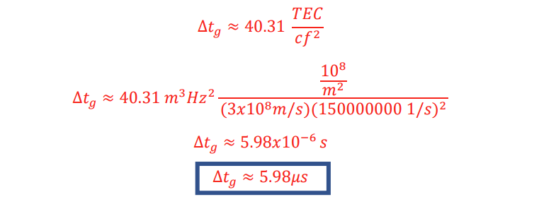
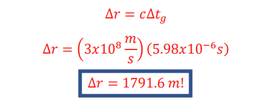
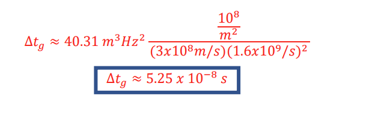
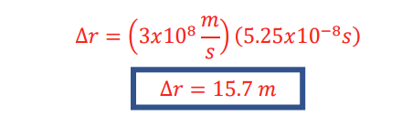
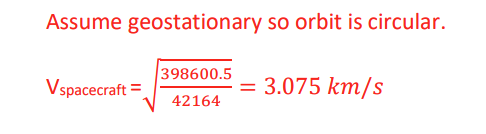
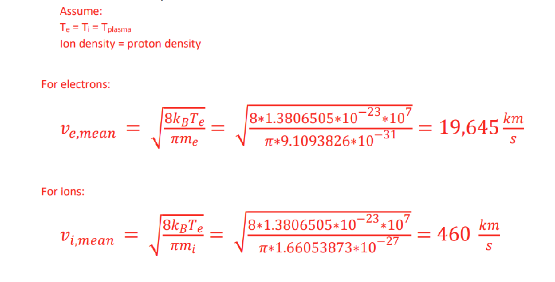
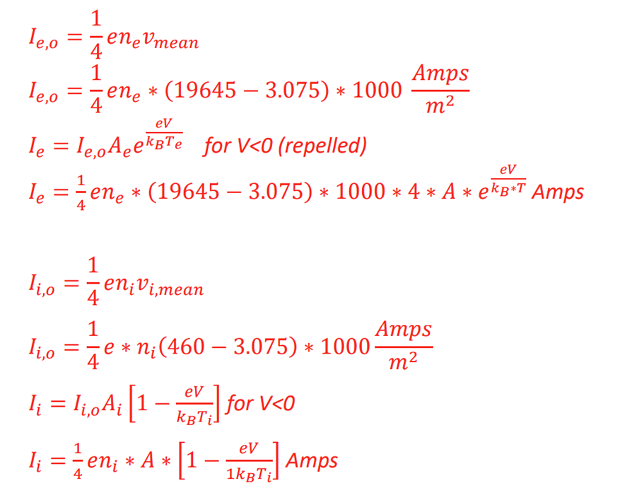
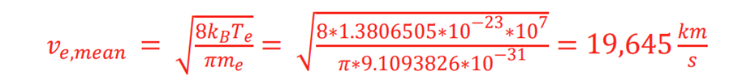

#### Instructions:

# SPCE 5065 HOMEWORK #4

## DUE: Friday 17 July 2026

- - Include your references at the end of your homework in AIAA format. https://www.aiaa.org/publications/journals/reference-style-and-format

- - Include units in your final answers!
- - Write non-mathematical answers in complete sentences.
- - Clearly state your assumptions.

- 2. In plasma physics, a Debye length is a measure of a charge carrier’s net electrostatic effect in a plasma and how far its electrostatic effect persists.

- a. Determine the Debye length in the lower ionosphere at an altitude of 300 km, where the electron temperature is approximately 1500 K. Assume a daytime solar max plasma density.

𝜆𝐷 = √

𝜀0𝑘𝐵𝑇 2𝑛𝑒2

𝜆𝐷 = √

(8.8541878 𝑥 10−12

𝐴2𝑠4 𝑘𝑔𝑚3

)(1.380649 𝑥 10−23

𝐽 𝐾)(1500𝐾)

2(5 𝑥 1012

1 𝑚3

)(1.60 𝑥 10−19𝐶)2

𝜆𝐷 = 846 µ𝑚

- b. Determine the Debye length in the ionosphere at an altitude of 1000 km, where the electron temperature is approximately 5000 K. Assume a daytime solar max plasma density.

𝐴2𝑠4 𝑘𝑔𝑚3

𝐽 𝐾)(5000𝐾)

(8.8541878 𝑥 10−12

)(1.380649 𝑥 10−23

𝜆𝐷 = √

1 𝑚3

2(5 𝑥 1012

)(1.60 𝑥 10−19𝐶)2

𝜆𝐷 = 15.5 µ𝑚

- 3. An electromagnetic signal traverses the ionosphere vertically along a path that has a total electron content of 1018 electrons/m2.

- a. Determine the vertical time delay for a frequency of 150 MHz.
- b. Determine the excess range for 150 MHZ if the vacuum speed of light were used.
- c. Determine the time delay if the frequency were 1.6 Ghz.
- d. Determine the excess range for 1.6 Ghz if the vacuum speed of light were used.

##### 4. Find an online ionospheric model. Provide an example of the model and describe it. Includein your description, at a minimum, who publishes it, where the data is gathered from, and anylimitations of the model.

- 5. Spacecraft in high altitude orbits are especially susceptible to spacecraft charging and can attain high potentials. Because the plasma is at a high temperature, the average speeds of the protons and ions are very large.

If we wish to minimize the induced current in a spherical geostationary satellite, how large will the spacecraft voltage be? The plasma temperature is 107 K.

Clearly state any assumptions you make. The first order currents generated by the plasma environment for a spherical satellite are: For electrons:

𝑒𝑉

𝐼𝑒 = 𝐼𝑒,𝑜𝐴𝑒𝑒

𝑘𝐵𝑇𝑒 for V<0 (repelled)

𝐼𝑒 = 𝐼𝑒,𝑜𝐴𝑒 [1 + 𝑘𝑒𝑉

𝐵𝑇𝑒] for V>0 (attracted) Where:

1 4

𝐼𝑒,𝑜 =

𝑒𝑛𝑒𝑣𝑚𝑒𝑎𝑛

8𝑘𝐵𝑇𝑒 𝜋𝑚𝑒

𝑣𝑚𝑒𝑎𝑛 = √

− 𝑣𝑠𝑝𝑎𝑐𝑒𝑐𝑟𝑎𝑓𝑡

Where:

- e = electron charge, C V = voltage (V) kB = Boltzmann’s constant, J/K Te = electron temperature, K ne = electron number density 1/m3 𝑣𝑚𝑒𝑎𝑛 = relative velocity of electrons to spacecraft velocity (km/s)

For ions:

𝑒𝑉

𝐼𝑖 = 𝐼𝑖,𝑜𝐴𝑖𝑒

𝑘𝐵𝑇𝑖 for V>0 (repelled)

𝐼𝑖 = 𝐼𝑖,𝑜𝐴𝑖 [1 + 𝑘𝑒𝑉

𝐵𝑇𝑖] for V<0 (attracted)

Where:

1 4

𝐼𝑖,𝑜 =

𝑒𝑛𝑖𝑣𝑚𝑒𝑎𝑛

8𝑘𝐵𝑇𝑖 𝜋𝑚𝑖

𝑣𝑚𝑒𝑎𝑛 = √

− 𝑣𝑠𝑝𝑎𝑐𝑒𝑐𝑟𝑎𝑓𝑡

Where: Ti = ion temperature, K ni = ion number density 1/m3 𝑣𝑚𝑒𝑎𝑛 = relative velocity of ions to spacecraft velocity (km/s)

- a. What is the speed of the spacecraft?
- b. What are the mean speeds of the ions and electrons?

- c. Find expressions for the induced potential currents for the electrons and ions in terms of V (spacecraft voltage). State your assumptions.

Assume: Negative bias ne ~ niAe= 2 Ai Ae ~ 2 Ai

- d. Find an expression in terms of V for total current flow.

𝑒𝑉

𝑘𝐵𝑇 − (460 − 3.075) ∗ [1 − 𝑘𝑒𝑉

𝐼 = (19645 − 3.075) ∗ 2 ∗ 𝑒

𝐵𝑇𝑖] Amps = 0

- e. For no current flow, what would the spacecraft voltage be? Solve numerically, in Matlab solution is (see attached code) V = -2626 Volts
- f. Is this a high risk to the spacecraft? If so, what would you recommend to reduce the risk?

No, you could bias the spacecraft near this induced voltage to reduce the probability of a discharge event.

- 6. One of the reasons most earth orbiting spacecraft are negatively biased is due to the more widespread use of npn versus pnp transistors.

- a. What are npn and pnp transistors and what are their advantages and disadvantages?
- b. Why might they be of wider use on earth orbiting spacecraft than pnp transistors?

- 7. Select an article in a peer-reviewed journal or NASA document that describes the electrical grounding of spacecraft and summarize it contents.

- 8. Determine the voltage with respect to its environment of a spacecraft at synchronous altitude if the plasma temperature is 1 x 107 K. Consider the environment to consist primarily of electrons and protons. Clearly state your assumptions.

Assume Ai/Ae = 1/2

𝑉 =

𝐴𝑖 𝐴𝑒

4𝑉𝑜

𝑘𝐵 𝑇𝑒 𝑒

𝑙𝑛 (

)

𝑉𝑒

Where

𝑉 =

4√398600.5 42164

𝑘𝑚 𝑠

- 1
- 2

𝐽 𝐾)(1 𝑥 107𝐾)

(1.3806505 ∗ 10−23

𝑙𝑛

𝐽/𝑉 𝐶

19645 𝑘𝑚/𝑠

1.6 𝑥 10−19𝐶 ∗

) V = 862.91 (-8.069234)

(

|V = -6963 Volts|
|---|
