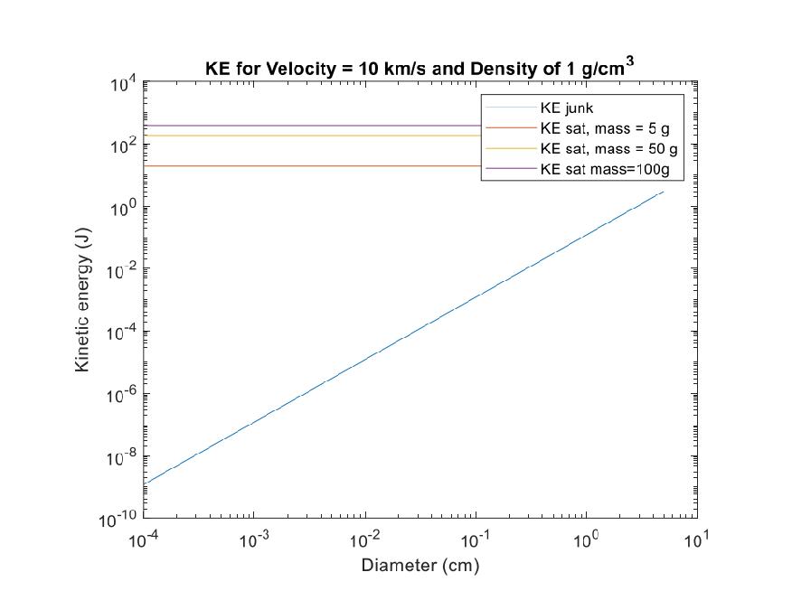
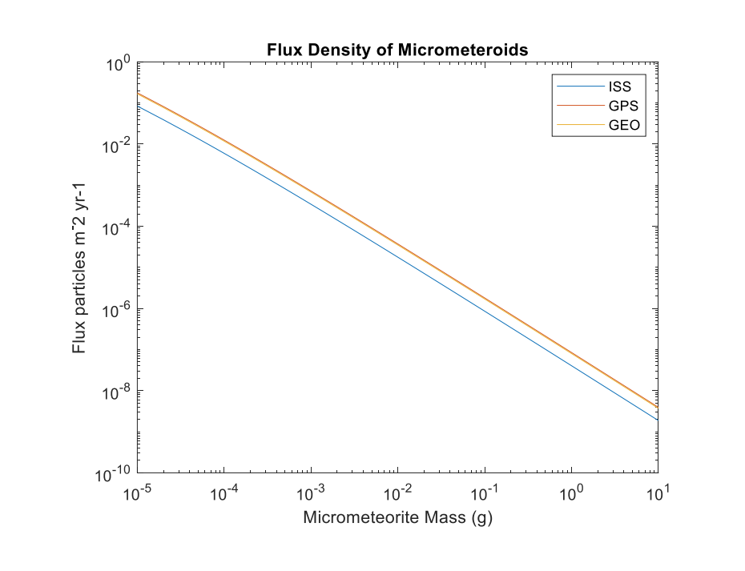
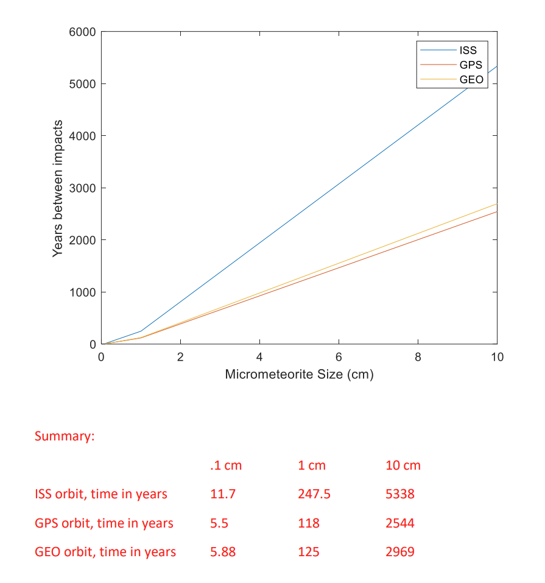

#### Instructions:

# SPCE 5065 HOMEWORK #5

## DUE: Friday 31 July 2026

- - Include your references at the end of your homework in APA format. https://www.aiaa.org/publications/journals/reference-style-and-format

- - Include units in your final answers!
- - Write non-mathematical answers in complete sentences.
- - Clearly state your assumptions

- 1. Current events Answers vary.
- 2. Kinetic energies of space objects can be very large. Clearly state your assumptions for this problem.

- a. Plot the kinetic energy (in Joules) versus diameter of a particle on a log-log scale. Assume the particle is at the same altitude as the ISS.
- b. How does this compare to the Kinetic energy of a small (5 kg), medium (50 kg) and large satellite (100 kg) in the same orbit?

Assume: Particle is spherical in shape Orbit is at an altitude of 400 km

- c. What type of satellites are most susceptible to damage due to impacts with man-made space objects? Small satellites

- 3. A 1.0-g piece of space debris strikes a spacecraft in low Earth orbit. Its kinetic energy is said to be equivalent to the gravitational potential energy lost by a 2.0-kg bowling ball dropped from a height of 100 m near Earth’s surface

- a. Calculate the impact speed of the debris. Clearly identify all assumptions. Assumptions

- - The bowling ball falls near Earth’s surface, where (g=9.81 m/s^2)
- - Air resistance is neglected.
- - The value of (g) is assumed to remain constant over the 100-m fall.
- - The stated impact speed is the relative speed between the debris and the spacecraft.
- - All kinetic energy is treated as translational kinetic energy.

- 1
- 2

- 1
- 2

𝑚𝑏𝑎𝑙𝑙𝑉2 But from physics the velocity of a falling object on Earth is given by: 𝑉 = √2𝑔ℎ 𝑉 = √2 ∗ 9.81

𝑚𝑑𝑒𝑏𝑟𝑖𝑠𝑉2 =

𝑚 𝑠2

𝑚 𝑠

∗ 100 𝑚 = 44.29

so

𝑚 𝑠

1𝑔 ∗ 𝑉2 = 2000𝑔 ∗ (44.29

)2

|𝑉 = 1.98  𝑘𝑚 𝑠  |
|---|

- b. Micrometeoroids can encounter spacecraft at much greater relative speeds. Calculate the kinetic energy of the same 1.0-g particle if its impact speed were 20 km/s. Express the result in joules and as an equivalent height from which the 2.0-kg bowling ball would need to fall.

𝐾𝐸 =

- 1
- 2

𝑚𝑉2

𝐾𝐸 =

- 1
- 2

𝑚 𝑠

)2

(1𝑔) ∗ (20,000

𝑔𝑚2 𝑠2

𝑁 𝑘𝑔 ∗ 𝑚 𝑠2

1 𝑘𝑔 1000 𝑔

𝐽 𝑁 ∗ 𝑚

𝐾𝐸 = 200,000,000

∗

∗

∗

|𝐾𝐸 = 200 𝑘𝐽|
|---|

Speed of micrometeoroid:

- 1
- 2

- 1
- 2

𝑚𝑚𝑚𝑉2 =

𝑚𝑏𝑎𝑙𝑙𝑉2

𝑚 𝑠

)2 = 2000𝑔 ∗ 𝑉2

1𝑔 ∗ (20,000

𝑚 𝑠

𝑉𝑏𝑎𝑙𝑙 = 447.2

So

𝑉2 = 2𝑔ℎ

𝑚 𝑠 )2

(447.2

ℎ =

𝑚 𝑠2

2 ∗ 9.81

|ℎ = 10.19 𝑘𝑚|
|---|

- c. How does this compare to the kinetic energy of the space debris?

𝐾𝐸 =

- 1
- 2

𝑚𝑉2

𝐾𝐸 =

- 1
- 2

(1𝑔) ∗ (1980

𝑚 𝑠

)2

𝐾𝐸 = 1,960,200

𝑚 𝑠2

∗

𝑁 𝑘𝑔 ∗ 𝑚 𝑠2

∗

1 𝑘𝑔 1000 𝑔

∗

𝐽 𝑁 ∗ 𝑚

|𝐾𝐸 = 1.96 𝑘𝐽|
|---|

Although its speed is only about ten times greater, its kinetic energy is about 100 times greater because kinetic energy is proportional to (v^2).

- d. Which poses the greater threat? Be sure to consider the likelihood of impact (although you don’t need to quantify it).

The 20-km/s particle would produce much more severe damage in an individual impact because it carries approximately 102 times more kinetic energy. However, overall risk depends on both the consequences of an impact and the probability of an impact.

Orbital debris may present a greater operational concern in some low-Earth-orbit environments because debris populations are concentrated in commonly used orbital regions and can sometimes be tracked or associated with particular orbital shells. Meteoroid particles occur naturally and may have lower probabilities of striking a particular spacecraft, but their much higher impact speeds can make even relatively small particles extremely damaging.

Therefore, it is not possible to conclude from kinetic energy alone that one always poses the greater threat. The answer depends on particle size, impact speed, flux, spacecraft orbit, shielding, and mission duration.

- 4. Research an orbital debris modelling program, either mentioned in class or find another from a reliable source. Describe who publishes and maintains it, its key features, and how it works. Summarize its predicted effects of space debris on the ISS.
- 5. Compare the likelihood of satellites in typical orbits of being impacted by micrometeoroids.

- a. Plot the flux density for micrometeoroids with masses ranging from 10-5g to 10 g for the ISS, GPS, and a GEO satellite on the same plot.

##### b. How much average time (in years) will there be between events (collisions) withprobabilities greater then 0.01% for each orbit for micrometeoroids of 0.1 cm, 1 cm, and 10cm? Assume the satellite has an area of ten m2.

- c. What can you conclude about the likelihood of damage to satellites with an expected mission life of 10 years?

GPS and GEO satellites are at a very high risk of being impacted by space debris during their mission life.

- 6. Find a mission or incident, other than the Chinese Fengyum-1C ASAT, which was a violation of one of the UN guidelines published in 2010. What action could have been taken? What action was taken?

- 7. Describe three of the technology solutions to help reduce the harmful effects of space debris. Explain how it might be implemented and provide one example.
- 8. Compare the US Orbital Debris Mitigation Standard Practices policy with another country’s policy.

- a. Summarize the key provisions of each.
- b. What are the key similarities and differences?
- c. Research how/if they are enforced.

- 9. A spacecraft with a Whipple shield is required to survive the impact of a meteoroid with a density of 1.6 g/cm3, diameter of 1 cm, and velocity of 80 km/s. The shield and spacecraft are made of aluminum 7075 T6 with a yield stress of 65 ksi. Determine and plot the shield and wall thickness as a function of offset distance of 1 to 30 cm. Clearly state your assumptions. Assumptions: Impact angle from the surface normal is zero degrees (worst case) Bumper density and wall density are that of aluminum, or 2.7 g/cm^3 I have attached my matlab code. Figures may vary slightly based on assumptions made.

| | | | | |
|---|---|---|---|---|
| | | | | |
| | | | | |
| | | | | |
| | | | | |
| | | | | |
| | | | | |
| | | | | |
| | | | | |
| | | | | |
