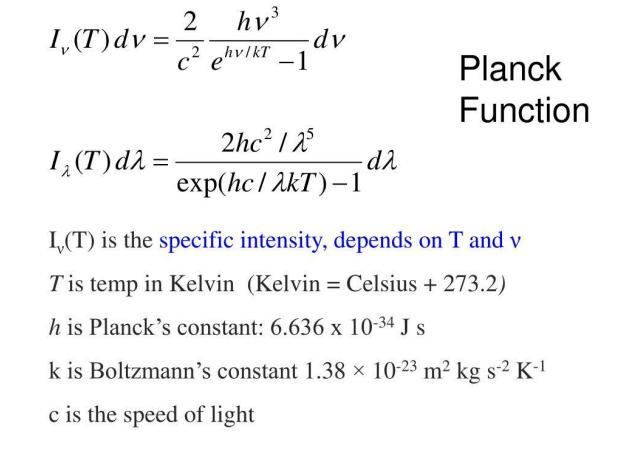
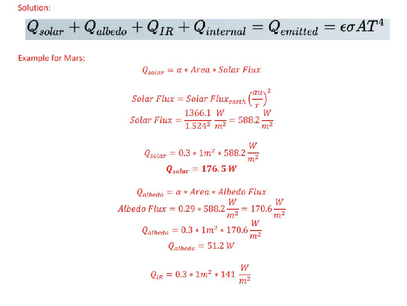
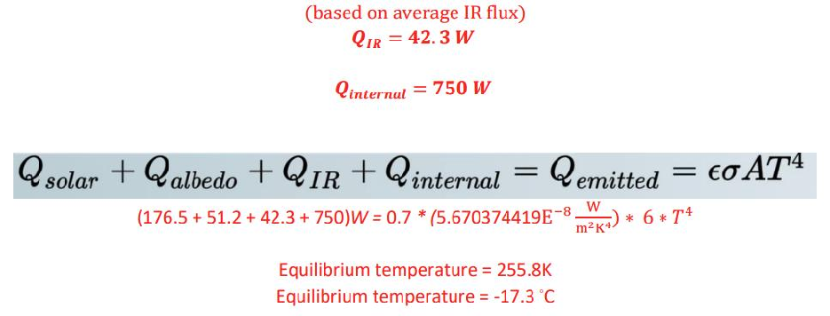
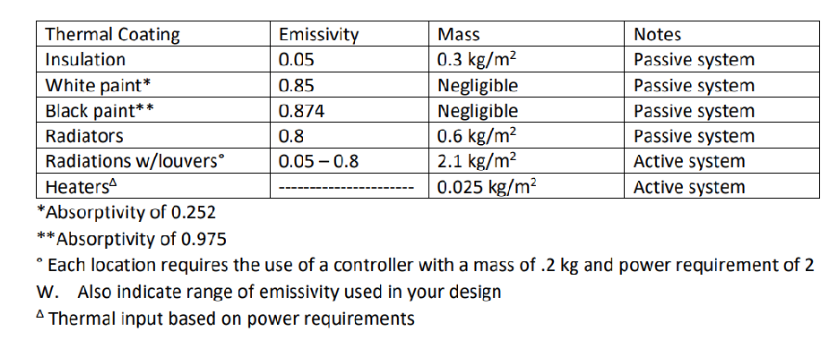
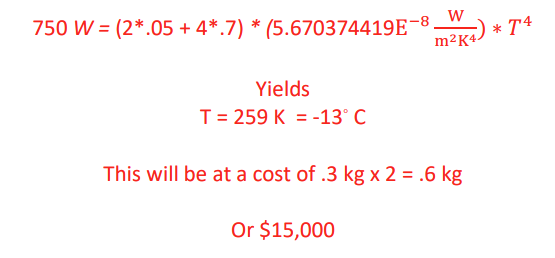
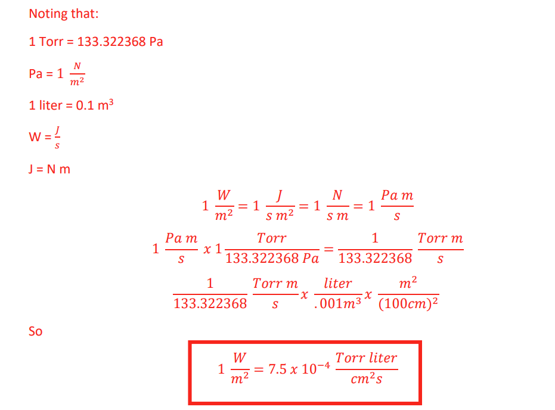
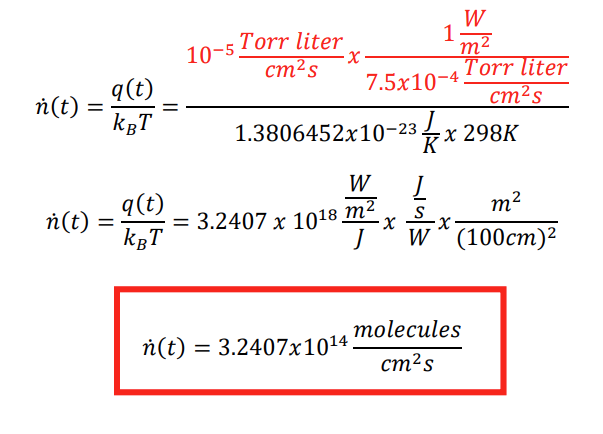
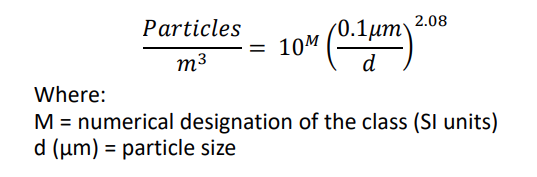

#### Instructions:

# MAE 4425 HOMEWORK #6

## DUE: Wednesday 5 August 2026 Solution by L. George 7/18/2026

- - Include your references at the end of your homework in AIAA format. https://www.aiaa.org/publications/journals/reference-style-and-format

- - Include units in your final answers!
- - Write non-mathematical answers in complete sentences.
- - Clearly state your assumptions.

- 1. For each the current events presentations this week

- - a) Summarize the presentation
- - b) Describe something you learned from it
- - c) Write one question you have left about the presentation

- 2. Carbon-carbon is a unique composite material consisting of carbon fibers embedded in a carbonaceous matrix. It was originally developed for aerospace applications; its low density, high thermal conductivity, and excellent mechanical properties at elevated temperatures make it an ideal material for aircraft brakes, rocket nozzles, and re-entry nose tips. It withstands temperatures in excess of 2000°C without major deformation.

In this problem, you are going to estimate the approximate number of photons per second that the Earth receives from the Sun, per unit area, which have sufficient energy to sever a single CC bond. You may assume the bond energy is 25°C = 3.47 eV.

- a. Identify the maximum wavelength a photon may have and still be capable of severing the bond.

Where: E = energy of a single proton (J)

𝐸 =

ℎ𝑐 𝜆

- h = Planck’s constant = 6.62607015*10-34 J-s c = speed of light = 3 x 108 m/s 𝜆 = wavelength (m)

The bond energy of a single Carbon-Carbon bond is 3.47 eV and 1 eV = 1.60217663 x 10-19 J

ℎ𝑐 𝐸

𝜆 =

𝑚 𝑠 )

(6.62607015 ∗ 10−34 𝐽𝑠)(3 ∗ 108

𝜆 =

3.47 ∗ 1.60217663 ∗ 10−19

|𝜆 = 0.358𝜇𝑚|
|---|

##### b. Make a linear approximate for the solar irradiance S(λ) over the waveband of interest. Youmay estimate from Figure 1.4 in the textbook or find your own source (be sure to reference it).Estimated from Figure 1.4

𝑊 𝑐𝑚2µ𝑚

𝑆(𝜆) 𝑖𝑛

|Wavelength (µm)|Irradiance 𝑐𝑚𝑊2µ𝑚  |
|---|---|
|0.2|0|
|0.4|0.19|

𝑒𝑠𝑡𝑖𝑚𝑎𝑡𝑒𝑑 𝑠𝑙𝑜𝑝𝑒 =

0.19 0.4 − 0.2

= 0.95

𝑆(𝜆) = 0.95𝜆 − 0.19 𝑐𝑚𝑊2µ𝑚

##### c. Integrate the ratio 𝑝ℎ𝑜𝑡𝑜𝑛 𝑒𝑛𝑒𝑟𝑔𝑦𝑆(𝜆) over the waveband of interest to estimate the number ofphotons/s.

𝑆(𝜆) ℎ𝑐 𝜆

=

1 ℎ𝑐

(0.95𝜆2 − 0.19𝜆)

| |
|---|

0.36

1 ℎ𝑐

(0.95𝜆2

∫

− 0.19𝜆)𝑑𝜆

0.2

Photons/(𝑠𝑚2) = 1.557 x 1020 - see Matlab code

Some students will work this out by hand and get confused on the units. Here is the “by-hand” solution.

𝑆(𝜆) ℎ𝑐 𝜆

=

1 ℎ𝑐

𝑊𝜇𝑚 𝑐𝑚2𝜇𝑚

(0.95𝜆2 − 0.19𝜆)

0.36

0.36

𝑊𝜇𝑚2 𝑐𝑚2𝜇𝑚

𝑆(𝜆) ℎ𝑐 𝜆

1 ℎ𝑐

(0.95𝜆2

∫

= ∫

− 0.19𝜆)𝑑𝜆

0.1

0.1

0.36

0.95(.36)3 3

0.19(.36)2 2

0.95(.1)3 3

0.19(.1)2 2

𝑆(𝜆) ℎ𝑐 𝜆

1 ℎ𝑐

𝑊𝜇𝑚 𝑐𝑚2

∫

=

{(

−

) − (

−

)}

0.1

0.36

𝑆(𝜆) ℎ𝑐 𝜆

∫

=

0.1

1 ℎ𝑐

𝑊𝜇𝑚 𝑐𝑚2

(0.0024624 − (−.0006333))

0.36

(100𝑐𝑚)2 𝑚2

𝑆(𝜆) ℎ𝑐 𝜆

𝑊𝜇𝑚 𝑐𝑚2

𝑚 106𝜇𝑚

∫

= .0030957

∗

∗

0.1

𝑊 𝑚 ∗

𝐽 𝑊𝑠

3.0957𝑥10−5

0.36

𝑆(𝜆) ℎ𝑐 𝜆

∫

=

𝑚 𝑠 )

6.626𝑥10−34𝐽𝑠 ∗ (3 𝑥 108

0.1

𝑃ℎ𝑜𝑡𝑜𝑛𝑠 𝑚2𝑠

= 1.557𝑥1020

- d. Approximately what percentage of photons from the sun is this? Note: This is only one method. It is the estimated total photon output based on a blackbody approximation. In question 2, you will use a more exact method.

- i. Find the average photon energy (hint use the maximum wavelength output from the sun):

𝐸 =

ℎ𝑐 𝜆

𝐸 =

(6.626 𝑥 10−34𝐽 − 𝑠) ∗ (3 𝑥 108𝑚/𝑠) 0.5 𝑥 10−6𝑚

E = 3.9756 x 10-19 J/photon

- ii. Assume a solar luminosity of 3.828 x 1026 Watts to find the number of photons per second

𝑃ℎ𝑜𝑡𝑜𝑛𝑠/sec =

3.828 𝑥 1026 𝐽/𝑠 3.9756 𝑥 10−19

𝐽 𝑝ℎ𝑜𝑡𝑜𝑛 Photons/second ≈ 9.63 x 1044

- iii. Approximately what percentage of photons from the sun is this? Note units from the blackbody estimate are in Photons/second, whereas the integral results in units of photons/m2s. So to convert to proper units, take your answer from part ii and divide by 4*pi*r^2 where r is the distance to the Earth.

𝑃ℎ𝑜𝑡𝑜𝑛𝑠 𝑚2𝑠

=

9.63 𝑥 1044 4𝜋(1 𝐴𝑈)^2

=

9.63 𝑥 1044 4𝜋(1.495979 𝑥 1011𝑚)^2

𝑃ℎ𝑜𝑡𝑜𝑛𝑠 𝑚2𝑠

= 3.4242𝑥1021

% =

1.557 𝑥 1020 3.42425 𝑥 1021

|4.5%|
|---|

- e. Do you think this is this a significant risk for space applications?

Yes, although it’s a low percentage, especially with a with a five or ten year mission it could be significant enough to weaken carbon-carbon composites. Recommend another composite or lining with beta-cloth liners to protect against UV radiation.

- 3. Using the same assumptions you made in problem 1, but using Planck’s law of black body radiation from the sun:

- a. Noting that the law applies to a perfect blackbody, use it to approximate figure 1.4 for S(λ) in the textbook. See Matlab code

- b. Integrate the ratio [S(λ)/photon energy] over the waveband of interest to re-estimate your solution to problem 1.

- Problem 1: Photons/(𝑚2𝑠) = 1.557 x 1020
- Problem 2: Photons/(𝑚2𝑠) = 1.5958 x 1020

- c. How closely do your two answers agree? Within 2.4%
- d. Now estimate the total number of photons/(m2s) that the earth receives from the sun from your results in part a. What percentage of your answer in b does this represent? Now integrate over entire curve (see Matlab code) 1.8875 x 1021 photons/(m2s)

% = 1.5958𝑥10

20 1.8875𝑥1021

8.45%

- e. How closely does you answer here compare to the estimate you used in problem 1 d.

- Answer 1d: 4.5%
- Answer 2d: 8.45% 46% difference

- f. Which answer do you believe is more accurate and why?

The method in problem 2. However, both were estimated based on major assumptions (a linear solar irradiance in problem 1 versus a black body in problem 2) so neither is entirely accurate.

- 4. NASA is designing an interplanetary probe to investigate Eris. Once the probe arrives at the dwarf planet, only a low-resolution imager along with other instrumentation that can function at very low temperatures can be used. To maximize the value of the program, the mission manager has been asked to consider which planets along the way the spacecraft could take high-resolution images of. The high-resolution camera must be kept between -35◦C to 35◦C. Find the equilibrium temperature of the probe at each planet and the dwarf planet Pluto. You must consider solar input, albedo, and planetary infrared effects. You may make the following assumptions. Clearly state any additional assumptions you make.

- - You may not make any modifications to the spacecraft
- - The probe will be in orbit around each planet long enough to reach equilibrium temperature.
- - The probe is cube shaped with each side 1 m with an absorptivity, α, or 0.3 and emissivity, Ɛ , or 0.7
- - The probe internal components generate 750W of heat
- - One side always faces the sun
- - All sides emit radiative energy at the same rate

- a. Plot the equilibrium temperatures for each of the planets.

- See Matlab Code for remaining results in ◦C Mars = -17.3 Jupiter = -34.2 Saturn = -35.5 Uranus = -36.0 Neptune = -36.05 Pluto = -36.06
- b. Recommend, from a thermal control perspective, which planets to image. Mars and Jupiter are good additional targets for this mission.

- 5. You have been given a budget of $15K to design a thermal control system for the mission and a goal of imaging as many planets as possible along the way. You have the following choices (or you may research your own methods). Assume each kg of mass added adds $25,000 to the cost of the mission.

Adding insulation to 2 sides of the spacecraft yields (for Pluto – worst case, power of internal components)

- 6. An outgassing test of Neoprene showed that the outgassing rate is 10-5 𝑇𝑜𝑟𝑟 𝑙𝑖𝑡𝑒𝑟𝑐𝑚2𝑠 at a temperature of 298K.

- a. Show that the outgassing rate in 𝑚𝑊2 can be expressed as 7.5 𝑥 10−4 𝑇𝑜𝑟𝑟 𝑙𝑖𝑡𝑒𝑟𝑐𝑚2𝑠

- b. Determine the number of molecules released per unit area per second in 𝑚𝑜𝑙𝑒𝑐𝑢𝑙𝑒𝑠𝑐𝑚2𝑠

- 7. Classification of air cleanliness in cleanrooms is specified by ISO-14644-1. The classifications are defined in terms of the concentration of airborne particulate contamination to levels appropriate for accomplishing contamination sensitive activities. Using the equation from Lesson 3 for the maximum number of particles permitted for any given size:

Create a plot of the maximum cleanroom airport particle concentration for each ISO classification. Your plot should look something like Fig 2.13 in the textbook but will be slightly different since the textbook figure is based on the old FED STD 209E. Hint: use log-log axes.

See Matlab code

| | |
|---|---|
| | |

| | |
|---|---|
| | |

| | |
|---|---|
| | |

| | |
|---|---|
| | |

- 8. An ASTM E-595-07 test showed that a 10 m x 10 cm test specimen of Kapton 1 mil (0.001 inch) thick had a TML of 0.5%, during which only the top side was exposed. Determine the

outgassing rate in units of 𝑇𝑜𝑟𝑟−𝑙𝑖𝑡𝑒𝑟𝑐𝑚2𝑠 . The mass density is 1.4 g/cm3 and the molar mass of the outgassed products is 15 g/mol. Clearly state your assumptions.

𝑚̇ 𝑁𝐴𝑘𝐵𝑇 𝑀

𝑞 =

Start by finding 𝑚̇ (t) = mass loss per unit area per unit time, 𝑚𝑘𝑔2𝑠. First find total mass = ρV.

𝑚𝑎𝑠𝑠 =

1.4𝑔 𝑐𝑚3

100𝑐𝑚 𝑚

2.54𝑐𝑚 𝑖𝑛

(10𝑚)(

)(10𝑐𝑚)(0.001𝑖𝑛)(

) = 35.56 𝑔

Now using TML = 0.5%

0.005 =

𝑚𝑎𝑠𝑠 𝑙𝑜𝑠𝑠 𝑔 35.56 𝑔

Mass loss g = 0.1778 g

−6𝑔 𝑠

So 𝑚̇ = 0.1778𝑔24 ℎ𝑟𝑠 (3600𝑠ℎ𝑟 ) = 2.0579 𝑥 10

𝑝𝑎𝑟𝑡𝑖𝑐𝑙𝑒𝑠 𝑘𝑚𝑜𝑙

𝑁𝐴 = 6.0221367 𝑥 1026

10−23𝐽 𝐾

𝑘𝐵 = 1.380649 𝑥

𝑇 = 398.15 𝐾 (assume at 125°C) M = 15 g/mol

𝑞(𝑡) =

𝑔 𝑠)(6.0221367 𝑥 1026

𝑝𝑎𝑟𝑡𝑖𝑐𝑙𝑒𝑠 𝑘𝑚𝑜𝑙

𝐽 𝐾)(398.15 𝐾)

(2.05787 𝑥 10−6

)(1.380649 𝑥 10−23

𝑔 𝑚𝑜𝑙

𝑚𝑜𝑙 𝑘𝑚𝑜𝑙

(15

)(1000

)

𝑊 𝑚2

𝑞(𝑡) = 5.4516 𝑥 10−4

But from problem 4a, we know

𝑊 𝑚2

𝑇𝑜𝑟𝑟 𝑙𝑖𝑡𝑒𝑟 𝑐𝑚2𝑠

= 7.5 𝑥 10−4

|𝑞 = 3.41 𝑥 10−7  𝑇𝑜𝑟𝑟 𝑙𝑖𝑡𝑒𝑟 𝑐𝑚2𝑠  |
|---|

- 9. Research an innovative new heat transfer method used on spacecraft. Summarize it and the benefits provided by the new technology. Prepare a short summary to be presented to class. Note: you may choose how you want to present it to class. Some options are below, or you may propose your own.

- - classroom presentation
- - handout on the technology
- - video
- - discussion board
